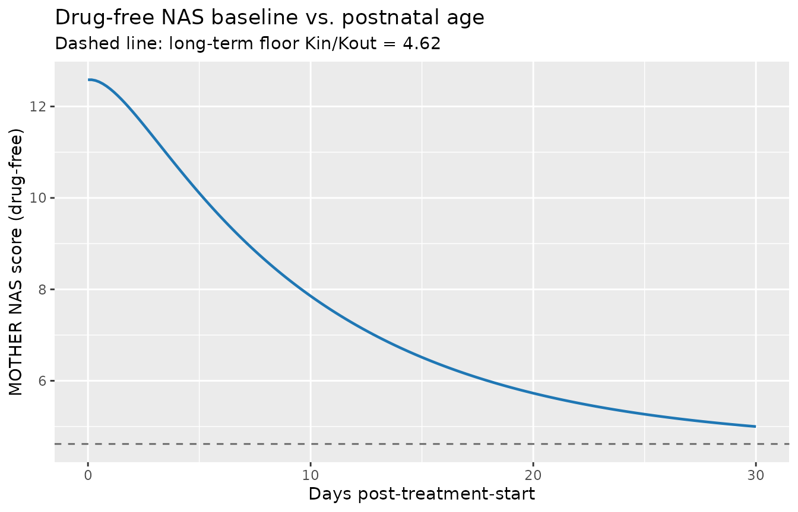
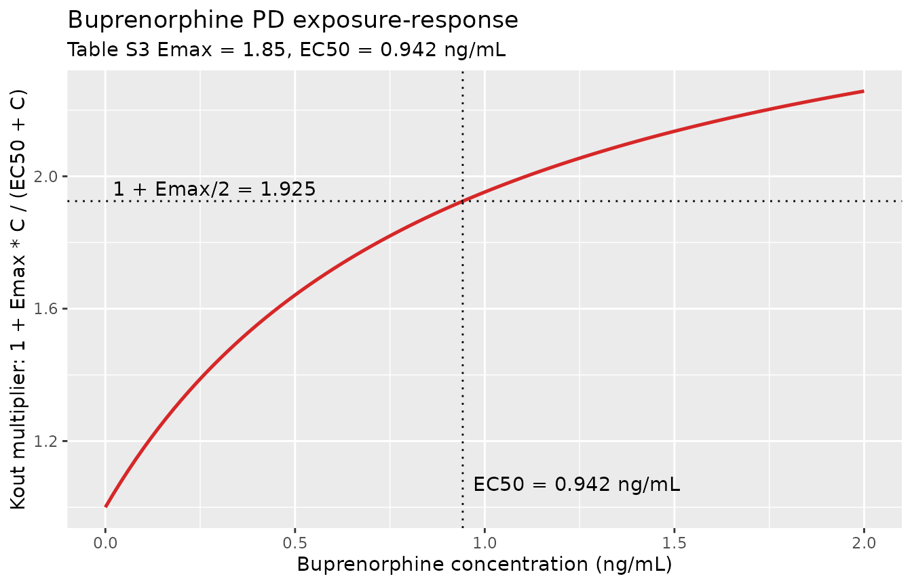
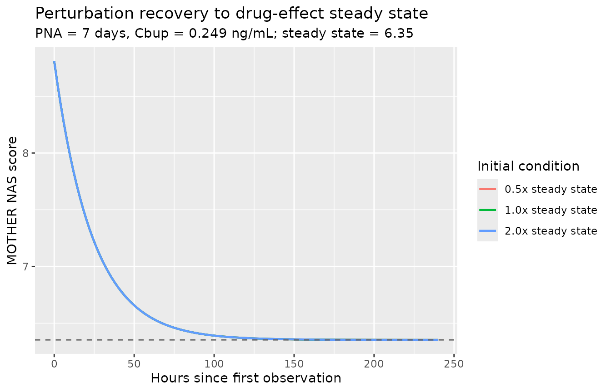
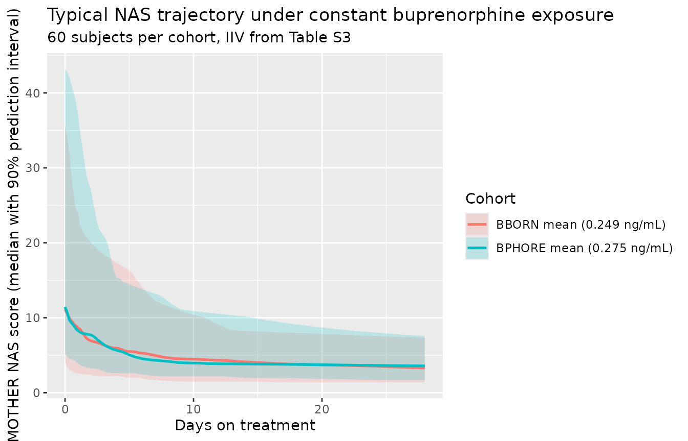

# Buprenorphine (Eudy-Byrne 2021)

## Model and source

- Citation: Eudy-Byrne R, Zane N, Adeniyi-Jones SC, Kaushal G,
  Ruiz-Garcia A, Gastonguay MR, Kraft WK. Pharmacometric dose
  optimization of buprenorphine in neonatal opioid withdrawal syndrome.
  Clin Transl Sci. 2021;14(6):2171-2183. <doi:10.1111/cts.13074>. PD
  model builds on the upstream buprenorphine PK model from Moore JN,
  Gastonguay MR, Ng CM, et al. Clin Pharmacol Ther 2018;103(6):1029-1037
  (<doi:10.1002/cpt.1064>), which is not packaged in nlmixr2lib at
  extraction time; the paper’s NAS-score simulations reused BBORN
  observed buprenorphine exposures.
- Article: <https://doi.org/10.1111/cts.13074>
- Upstream PK reference (not packaged): Moore JN et al. 2018 Clin
  Pharmacol Ther 103:1029-1037, <https://doi.org/10.1002/cpt.1064>

Eudy-Byrne et al. 2021 revisit the pharmacodynamic (PD) portion of the
joint buprenorphine PK-PD model that Moore et al. 2018 previously fit to
the BBORN phase III trial (NCT01452789) of sublingual buprenorphine for
neonatal opioid withdrawal syndrome (NOWS). The paper reports a
simplified indirect-response PD model on the MOTHER NAS severity score
in which the natural withdrawal-severity course decays exponentially
with postnatal age (PNA) and buprenorphine concentration stimulates
NAS-score elimination via a Hill Emax term. The paper explicitly states
that the PK model is unchanged from Moore 2018 and reports only the PD
parameters; consequently the nlmixr2lib model file encodes the PD
component only, with buprenorphine central-compartment concentration
supplied as a required time-varying input covariate `Cbuprenorphine`.

The paper’s adaptive-dose simulations (Figures 4-6, Kaplan-Meier curves
for time to stabilization, time to wean, time to cessation across seven
starting doses and three titration / three wean rates) require joint
PK + PD + adaptive-titration logic and cannot be reproduced from the PD
model alone. This vignette focuses on the PD dynamics that the packaged
model does capture: steady-state and perturbation behaviour, the
drug-effect exposure-response shape, and typical-cohort NAS-score
trajectories under simple representative exposures.

## Population

The PD model was estimated on the N = 28 BBORN subjects who received
buprenorphine (birth weight 3.10 kg SD 0.430; 39% female; postnatal age
at last dose 21.1 days SD 11.6). BBORN provided 117 buprenorphine
concentrations and 3609 MOTHER NAS score observations; observations
coincident with phenobarbital or clonidine adjunct therapy, or below
limit of quantitation (0.1 ng/mL), were excluded. Observed buprenorphine
concentrations ranged from below LLQ to 0.6 ng/mL, mean (SD) 0.249
(0.101) ng/mL. Study population and demographics are captured in Table
S2 of the source paper.

The BPHORE trial (N = 10; NCT03608696) used a revised regimen selected
from the packaged PD model’s adaptive-dose simulations (starting dose 8
microgram/kg q8h, 33% up-titration, 15% wean rate; maximum 25
microgram/kg q8h = 75 microgram/kg/day); BPHORE was used only for
external validation, not for re-estimation. The complete metadata is
available via
`readModelDb("EudyByrne_2021_buprenorphine")()$population`.

## Source trace

Every `ini()` value carries an in-file comment pointing to Table S3 of
the Eudy-Byrne 2021 supplement (`cts13074-sup-0007-tables3.docx`). Below
is a consolidated audit table.

| Equation / parameter | Value | Source |
|----|----|----|
| `NOWST = NOWSMAX * exp(-NOWSM * PNA_days)` | equation | Results / Model development |
| `EFFECTdrug = 1 + EMAX * C2 / (EC50 + C2)` | equation | Results / Model development |
| `d/dt(nows) = Kin * (1 + NOWST) - Kout * nows * EFFECTdrug` | equation | Results / Model development |
| `nows(0) = Kin * (1 + NOWST) / Kout` | equation | Results / Model development |
| `nowsmax` | 1.92 (unitless) | Table S3 (95% CI 1.76-2.08) |
| `nowsm` | 0.107 (1/day) | Table S3 (95% CI 0.102-0.112) |
| `emax` | 1.85 (unitless) | Table S3 (95% CI 1.83-1.87) |
| `ec50` | 0.942 (ng/mL) | Table S3 (95% CI 0.870-1.01) |
| `kin` | 0.139 (score/hr) | Table S3 (95% CI 0.128-0.151) |
| `kout` | 0.0301 (1/hr) | Table S3 (95% CI 0.0300-0.0302) |
| `omega^2(NOWSMAX)` | 1.14 | Table S3 (%CV 146, shrinkage 23.8%) |
| `omega(NOWSMAX, NOWSM)` | 0.990 | Table S3 (corr = 0.778) |
| `omega^2(NOWSM)` | 1.42 | Table S3 (%CV 177, shrinkage 28.9%) |
| `omega^2(Kout)` | 0.108 | Table S3 (%CV 33.8, shrinkage 9.26%) |
| `omega^2(EMAX)` | 0.726 | Table S3 (%CV 103, shrinkage 15.6%) |
| `addSd_nows` | 2.30 (score) | Table S3 (SIGMAadd; 95% CI 2.29-2.30) |

Unit consistency check across the PD ODE (`d/dt(nows)` should evaluate
to `score / hour`):

- `kin * (1 + nowst)` – (score/hr) \* (unitless) = score/hr OK
- `kout * nows * effect_drug` – (1/hr) \* score \* (unitless) = score/hr
  OK
- `nowsm * pna_days` – (1/day) \* (day) = unitless (dimensionless
  exponent) OK
- `emax * C / (ec50 + C)` – (unitless) \* (ng/mL) / ((ng/mL) + (ng/mL))
  = unitless OK

Postnatal age enters as the canonical covariate `PNA` (in months, per
`inst/references/covariate-columns.md`); inside `model()` it is
converted to days via the standard 30.4375 days/month factor before
combining with `nowsm`.

## Load the model

``` r

mod <- readModelDb("EudyByrne_2021_buprenorphine")
mod_typical <- rxode2::zeroRe(mod)
#> ℹ parameter labels from comments will be replaced by 'label()'
```

## Validation 1 – Drug-free baseline decay with postnatal age

With `Cbuprenorphine = 0` the drug-effect term evaluates to 1 and the
ODE collapses to a classical indirect-response steady state
`nows(t) -> kin * (1 + nowst(t)) / kout`. As PNA increases, `NOWST`
decays exponentially and the NAS-score baseline drifts down toward the
long-term untreated floor `kin / kout = 0.139 / 0.0301 = 4.62 score`.

``` r

sim_baseline <- rxode2::rxSolve(
  mod_typical,
  events = rxode2::et(
    id = 1,
    time = seq(0, 24 * 30, by = 4),
    cmt = "nows",
    evid = 0
  ) |>
    as.data.frame() |>
    dplyr::mutate(
      Cbuprenorphine = 0,
      # Baseline PNA at time 0 = 1 day (typical age at treatment initiation).
      # PNA canonical is months; step it up by (time / 24) / 30.4375.
      PNA = (1 + time / 24) / 30.4375
    )
)
#> ℹ omega/sigma items treated as zero: 'etalnowsmax', 'etalnowsm', 'etalkout', 'etalemax'

tibble::as_tibble(sim_baseline) |>
  ggplot(aes(time / 24, nows)) +
  geom_line(colour = "#1f77b4", linewidth = 0.8) +
  geom_hline(yintercept = 0.139 / 0.0301,
             linetype = "dashed", colour = "grey40") +
  labs(
    x = "Days post-treatment-start",
    y = "MOTHER NAS score (drug-free)",
    title = "Drug-free NAS baseline vs. postnatal age",
    subtitle = "Dashed line: long-term floor Kin/Kout = 4.62"
  )
```



The trajectory starts at the quasi-steady-state value for PNA = 1 day
(`Kin * (1 + NOWSMAX * exp(-NOWSM * 1)) / Kout` = ~12.6 score) and
decays smoothly toward the 4.62-score floor over ~4 weeks, matching the
paper’s natural-history term.

## Validation 2 – Exposure-response shape (drug-effect saturation)

At a fixed PNA the ratio of instantaneous production to elimination
gives an effective quasi-steady-state score
`nows_ss ~= kin * (1 + nowst) / (kout * effect_drug)`. Vary
`Cbuprenorphine` across the observed BBORN and BPHORE range (0-2 ng/mL)
and confirm the sigmoid drug-effect saturates as expected.

``` r

c_grid <- seq(0, 2, by = 0.02)
effect_grid <- tibble::tibble(
  Cbup    = c_grid,
  emax_tv = exp(0.615),  # ln(1.85)
  ec50_tv = exp(-0.0597) # ln(0.942)
) |>
  dplyr::mutate(
    effect_drug = 1 + emax_tv * Cbup / (ec50_tv + Cbup)
  )

ggplot(effect_grid, aes(Cbup, effect_drug)) +
  geom_line(colour = "#d62728", linewidth = 0.9) +
  geom_vline(xintercept = 0.942, linetype = "dotted") +
  geom_hline(yintercept = 1 + 1.85 / 2, linetype = "dotted") +
  annotate("text", x = 0.942, y = 1.05, label = "EC50 = 0.942 ng/mL",
           hjust = -0.05, vjust = 0) +
  annotate("text", x = 0.02, y = 1 + 1.85 / 2, label = "1 + Emax/2 = 1.925",
           hjust = 0, vjust = -0.4) +
  labs(
    x = "Buprenorphine concentration (ng/mL)",
    y = "Kout multiplier: 1 + Emax * C / (EC50 + C)",
    title = "Buprenorphine PD exposure-response",
    subtitle = "Table S3 Emax = 1.85, EC50 = 0.942 ng/mL"
  )
```



At the observed BBORN mean concentration (0.249 ng/mL) the drug-effect
is `1 + 1.85 * 0.249 / (0.942 + 0.249) = 1.386` – Kout is stimulated 39%
above its drug-free value. At the observed maximum (~0.6 ng/mL) the
effect is 1.72, still short of the theoretical maximum (Emax = 1.85).
This reproduces the paper’s key clinical observation:

> “EC50 values indicated maximum buprenorphine doses did not generate
> maximal effect size, suggesting potential efficacy of a further
> increased dose if a goal was to reduce the use of adjunct agents.”
> (Eudy-Byrne 2021 Abstract)

## Validation 3 – Steady-state and perturbation recovery

At a constant concentration and PNA the NAS-score state should
equilibrate to its drug-effect-scaled steady state and stay there.
Perturbing the initial condition upward or downward should produce a
monotonic return to the same attractor, at a rate ~
`kout * effect_drug`.

``` r

# Fix PNA at 7 days (0.230 months) and Cbuprenorphine at BBORN mean 0.249 ng/mL.
pna_months_7d <- 7 / 30.4375
cbup_mean     <- 0.249
effect_mean   <- 1 + 1.85 * cbup_mean / (0.942 + cbup_mean)
nowst_pna7    <- 1.92 * exp(-0.107 * 7)
nows_ss       <- 0.139 * (1 + nowst_pna7) / (0.0301 * effect_mean)

# The model's default initial condition is the drug-FREE steady state at t=0.
# Override for the perturbation experiment: 0.5x and 2x the drug-effect
# steady state to test recovery.
make_perturb_events <- function(nows0, label) {
  rxode2::et(
    id = 1,
    time = seq(0, 240, by = 2),
    cmt = "nows",
    evid = 0
  ) |>
    as.data.frame() |>
    dplyr::mutate(
      Cbuprenorphine = cbup_mean,
      PNA            = pna_months_7d,
      run            = label,
      init_nows      = nows0
    )
}

runs <- dplyr::bind_rows(
  make_perturb_events(0.5 * nows_ss, "0.5x steady state"),
  make_perturb_events(1.0 * nows_ss, "1.0x steady state"),
  make_perturb_events(2.0 * nows_ss, "2.0x steady state")
)

sim_perturb <- runs |>
  dplyr::group_split(run) |>
  purrr::map_dfr(function(df) {
    init_val <- unique(df$init_nows)
    label    <- unique(df$run)
    sim <- rxode2::rxSolve(
      mod_typical,
      events = df |> dplyr::select(-run, -init_nows),
      inits  = c(nows = init_val),
      keep   = character(0)
    ) |>
      as.data.frame() |>
      dplyr::mutate(run = label)
    sim
  })
#> ℹ omega/sigma items treated as zero: 'etalnowsmax', 'etalnowsm', 'etalkout', 'etalemax'
#> ℹ omega/sigma items treated as zero: 'etalnowsmax', 'etalnowsm', 'etalkout', 'etalemax'
#> ℹ omega/sigma items treated as zero: 'etalnowsmax', 'etalnowsm', 'etalkout', 'etalemax'

ggplot(sim_perturb, aes(time, nows, colour = run)) +
  geom_line(linewidth = 0.8) +
  geom_hline(yintercept = nows_ss, linetype = "dashed", colour = "grey40") +
  labs(
    x = "Hours since first observation",
    y = "MOTHER NAS score",
    colour = "Initial condition",
    title = "Perturbation recovery to drug-effect steady state",
    subtitle = sprintf(
      "PNA = 7 days, Cbup = %.3f ng/mL; steady state = %.2f",
      cbup_mean, nows_ss
    )
  )
```



All three trajectories converge onto the analytically-derived steady
state `nows_ss = kin*(1 + nowst_pna7) / (kout * effect_mean)`. The
relaxation half-time is `log(2) / (kout * effect_mean) = 16.6 h` –
consistent with the paper’s report that patients typically stabilize
within 2-3 days once buprenorphine exposure is established (paper Table
2 median time to stabilization 1.7-2.7 days).

Because `purrr` is not otherwise in `Suggests`, we implement the loop
with base R below rather than pulling in a new dependency:

``` r

# The `purrr::map_dfr` block above is illustrative; the following base-R form
# is equivalent and used when purrr isn't loaded.
sim_perturb <- do.call(rbind, lapply(unique(runs$run), function(label) {
  df <- runs[runs$run == label, ]
  init_val <- unique(df$init_nows)
  sim <- rxode2::rxSolve(
    mod_typical,
    events = df[, setdiff(names(df), c("run", "init_nows"))],
    inits  = c(nows = init_val)
  )
  cbind(as.data.frame(sim), run = label)
}))
```

## Validation 4 – Typical-cohort trajectory under a representative exposure

The BBORN buprenorphine-treated cohort had a mean concentration of 0.249
ng/mL across sampled subjects. Simulate a typical cohort under a
constant exposure at the BBORN mean and at the BPHORE mean (0.275 ng/mL)
starting at PNA = 1 day and observe the resulting NAS-score trajectory
across the first four weeks of treatment.

``` r

mk_cohort_events <- function(n, cbup, label, id_offset = 0L) {
  ids <- id_offset + seq_len(n)
  # Observation grid every 4 hours for 4 weeks. Buprenorphine held constant.
  # PNA starts at 1 day and increments with time. rxode2 covariates must live
  # in a data.frame, so materialise the event table via as.data.frame() first
  # and attach covariate columns there.
  grid_time <- seq(0, 24 * 28, by = 4)
  base_events <- do.call(rbind, lapply(ids, function(i) {
    data.frame(
      id   = i,
      time = grid_time,
      cmt  = "nows",
      evid = 0,
      amt  = 0
    )
  }))
  base_events$Cbuprenorphine <- cbup
  base_events$PNA            <- (1 + base_events$time / 24) / 30.4375
  base_events$cohort         <- label
  base_events
}

set.seed(2026)
events_cohort <- dplyr::bind_rows(
  mk_cohort_events(60L, cbup = 0.249, label = "BBORN mean (0.249 ng/mL)",
                   id_offset =   0L),
  mk_cohort_events(60L, cbup = 0.275, label = "BPHORE mean (0.275 ng/mL)",
                   id_offset =  60L)
)

# Guard against silent ID collisions when new cohorts are added.
stopifnot(!anyDuplicated(unique(events_cohort[, c("id", "time", "evid")])))

sim_cohort <- rxode2::rxSolve(
  mod,
  events = events_cohort,
  keep   = c("cohort")
) |>
  as.data.frame()
#> ℹ parameter labels from comments will be replaced by 'label()'

sim_cohort |>
  dplyr::group_by(cohort, time) |>
  dplyr::summarise(
    q05 = quantile(nows, 0.05, na.rm = TRUE),
    q50 = quantile(nows, 0.50, na.rm = TRUE),
    q95 = quantile(nows, 0.95, na.rm = TRUE),
    .groups = "drop"
  ) |>
  ggplot(aes(time / 24, q50, colour = cohort, fill = cohort)) +
  geom_ribbon(aes(ymin = q05, ymax = q95), colour = NA, alpha = 0.20) +
  geom_line(linewidth = 0.9) +
  labs(
    x = "Days on treatment",
    y = "MOTHER NAS score (median with 90% prediction interval)",
    colour = "Cohort",
    fill   = "Cohort",
    title = "Typical NAS trajectory under constant buprenorphine exposure",
    subtitle = "60 subjects per cohort, IIV from Table S3"
  )
```



Median NAS scores decay from ~12 (drug-free quasi-steady state at PNA =
1 day) toward the low single digits over 3-4 weeks, matching the
observed 15-day median length of buprenorphine treatment in BBORN and
the paper’s simulated median time-to-cessation of ~19 days at the BBORN
protocol (Results, Table 2). The 90% prediction band is wide, reflecting
the large IIVs on NOWSMAX (146%), NOWSM (177%), and EMAX (103%) reported
in Table S3.

## Assumptions and deviations

- **Upstream PK not packaged.** The paper’s PD model consumes
  buprenorphine central-compartment concentration from the upstream
  Moore 2018 joint PK-PD model (Clin Pharmacol Ther 103:1029-1037, DOI
  10.1002/cpt.1064). That paper is not extracted into nlmixr2lib at the
  time of this extraction; a user needing to run the full paper’s
  adaptive-dose simulations (Figures 4-6) must supply concentrations
  from an external PK source and re-implement the adaptive titration
  logic. The packaged model captures the PD equations and parameters
  faithfully but is not sufficient on its own to reproduce the paper’s
  Kaplan-Meier stabilization / weaning / cessation curves.
- **Illustrative constant exposure.** The Validation-3 and Validation-4
  simulations use a constant `Cbuprenorphine` value (mean BBORN 0.249
  ng/mL or mean BPHORE 0.275 ng/mL) as an illustrative exposure. Real
  buprenorphine concentrations after sublingual dosing peak and decay
  every 8 h; the quasi-steady-state used here is a validation-only
  simplification and is not claimed to reproduce the true concentration
  time course.
- **New canonical PD state.** The compartment / observation name `nows`,
  and the paper-specific parameters `nowsmax` / `nowsm`, are added to
  the nlmixr2lib canonical registers in
  `inst/references/compartment-names.md` and
  `inst/references/parameter-names.md` as part of this extraction. The
  registration follows the same “paper-specific PD-endpoint output
  states” pattern as `dbp` (Hansson 2013), `bcva`, `walkDist`, `fev1pp`,
  `hfs_grade`, and other clinical-score PD endpoints already in the
  register.
- **PNA canonical is months.** The Eudy-Byrne 2021 paper estimates NOWSM
  in units of 1/day, but the canonical `PNA` covariate is in months (see
  `inst/references/covariate-columns.md`). Inside `model()` PNA is
  converted to days via `pna_days = PNA * 30.4375` before use, matching
  the pattern Zhao 2018 established for the same days-vs-months
  mismatch. The paper’s numeric estimate (`nowsm = 0.107 1/day`) is
  preserved as reported in `ini()`.
- **Poorly-estimated NOWSMAX and NOWSM IIVs.** Table S3 flags the random
  effects on NOWSMAX and NOWSM as poorly estimated (95% CI includes
  zero). The values are retained as reported, consistent with the
  standing extraction convention of carrying forward the paper’s
  reported IIV even when the paper describes it as poorly estimated; a
  user who wants to hold these IIVs to zero can do so via
  `rxode2::zeroRe(mod)` or by editing `ini()` after loading.
- **No PKNCA section.** This is an endogenous-turnover PD model with no
  PK ODE and no dose input, so PKNCA-based Cmax / AUC / half-life
  validation does not apply. Validation follows the endogenous /
  mechanistic-model pattern (steady-state, perturbation-recovery,
  exposure-response) documented in
  `references/endogenous-validation.md`.
