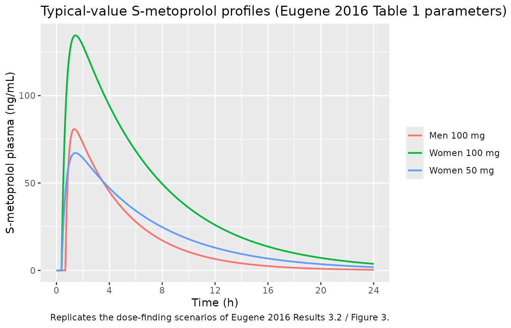
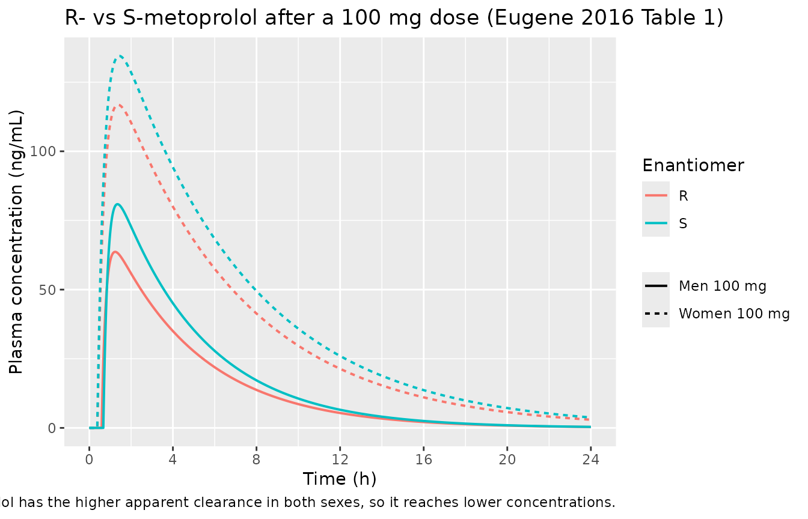
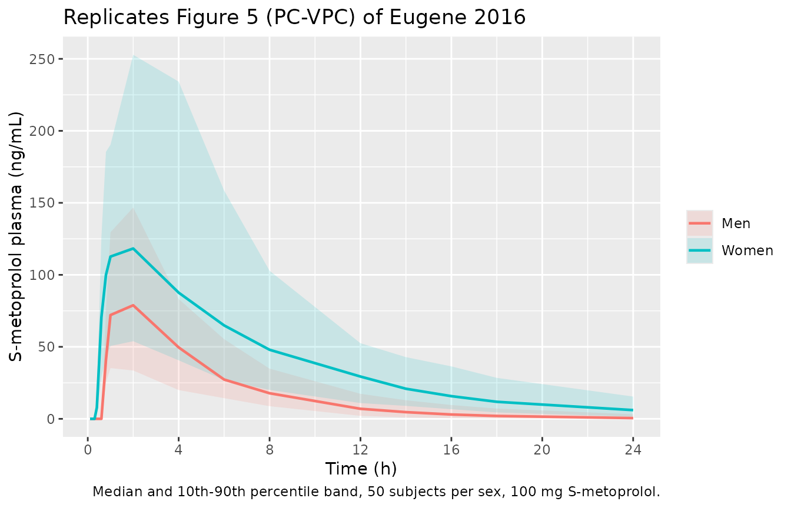

# Metoprolol gender-based dose equivalence in adults (Eugene 2016, Med Sci)

``` r

library(nlmixr2lib)
library(rxode2)
library(PKNCA)
library(dplyr)
library(tibble)
library(ggplot2)
rxode2::rxSetSeed(20161115)
```

Eugene AR. *Metoprolol Dose Equivalence in Adult Men and Women Based on
Gender Differences: Pharmacokinetic Modeling and Simulations.* Med Sci
(Basel). 2016;4(4):18.
[doi:10.3390/medsci4040018](https://doi.org/10.3390/medsci4040018).

This paper asks a single clinical question: **what oral metoprolol dose
in women gives the same total exposure as 100 mg in men?** Its answer –
50 mg – rests on a one-compartment PK model fit to digitized mean
concentration-time curves from Luzier 1999, and the paper contributes
two distinct parameter sets:

| Paper table | What it is | Model file |
|----|----|----|
| Table 1 | Fit to the digitized Luzier 1999 curves; **both** R- and S-metoprolol, sex-stratified; typical values only | `Eugene_2016b_metoprolol_enantiomers` |
| Table 2 | Re-fit of the paper’s own 100-subject Clinical Trial Simulation; S-metoprolol only; **carries inter-individual variability** | `Eugene_2016b_metoprolol` |

Both are extracted. Table 1 is the model that actually generates every
published Cmax / Tmax / AUC / half-life number in the paper (Results
3.2), so it carries the quantitative validation below; Table 2 is the
only one of the two with random effects, so it carries the stochastic
cohort simulation.

> **Not to be confused with** `Eugene_2016a_metoprolol`, a *different*
> Eugene 2016 metoprolol paper (Int J Clin Pharmacol Toxicol
> 5(3):209-215,
> [doi:10.19070/2167-910X-1600035](https://doi.org/10.19070/2167-910X-1600035)),
> which models chronically ill **elderly** inpatients. The two papers
> share an author, a year and a drug but have different cohorts, data
> sources and parameter values. They are distinguished by the `a` (May
> 2016, elderly) and `b` (November 2016, healthy young adults) year
> suffixes.

``` r

mod_enant <- rxode2::rxode2(readModelDb("Eugene_2016b_metoprolol_enantiomers"))
mod_cts <- rxode2::rxode2(readModelDb("Eugene_2016b_metoprolol"))
#> ℹ parameter labels from comments will be replaced by 'label()'
```

- Citation: Eugene AR. (2016). Metoprolol Dose Equivalence in Adult Men
  and Women Based on Gender Differences: Pharmacokinetic Modeling and
  Simulations. Med Sci (Basel) 4(4):18. <doi:10.3390/medsci4040018>.
- Enantiomer model: Enantiomer-resolved one-compartment PK model for
  oral metoprolol in healthy young adults, tracking R-metoprolol and
  S-metoprolol in parallel with first-order absorption and an absorption
  lag time and with every structural parameter stratified by sex.
  Typical values only (no inter-individual variability was estimated).
  The kinetics are flip-flop: absorption is rate-limiting, so the
  terminal slope is set by Ka rather than by CL/V. These are the
  parameters that generate every published Cmax, Tmax, AUC and half-life
  in Eugene 2016 (Eugene 2016).
- CTS model: One-compartment population PK model for oral S-metoprolol
  with first-order absorption and an absorption lag time in healthy
  young adults; every structural parameter is stratified by sex, and the
  kinetics are flip-flop (absorption is rate-limiting). Estimated by
  re-fitting the paper’s own 100-subject Clinical Trial Simulation, so
  this is the variant of the Eugene 2016 Med Sci model that carries
  inter-individual variability (Eugene 2016).

## Population

``` r

pop <- mod_enant$population
tibble(Field = names(pop), Value = vapply(pop, function(x) paste(x, collapse = "; "), character(1))) |>
  knitr::kable(caption = "Population metadata for the Table 1 (enantiomer) model.")
```

| Field | Value |
|:---|:---|
| species | human |
| n_subjects | 20 |
| n_studies | 1 |
| age_range | 20-36 years |
| age_median | not reported |
| weight_range | men 83.9 +/- 10.7 kg, women 62.0 +/- 7.3 kg (mean +/- SD, Luzier 1999 as quoted in Eugene 2016 Discussion) |
| weight_median | not reported (means reported instead) |
| sex_female_pct | 50 |
| race_ethnicity | not reported |
| disease_state | Healthy volunteers |
| dose_range | Nine 100 mg oral doses of racemic metoprolol every 12 h (Eugene 2016 Methods 2.1, citing the Luzier 1999 protocol). |
| regions | United States (Luzier 1999 cohort; Eugene 2016 analysis performed at Mayo Clinic, Rochester MN) |
| notes | n = 20 healthy volunteers (10 men, 10 women) from Luzier 1999. Eugene 2016 did not have access to the individual-level data: the mean R-metoprolol and S-metoprolol concentration-time curves were DIGITIZED from the Luzier 1999 figures, giving four distinct profiles (enantiomer x sex), and each was fit in MONOLIX 4.3.3 (SAEM-MCMC). Because the fits are to mean curves rather than individual subjects, no inter-individual variability and no residual-error magnitude are reported for this model – see the vignette Errata. Eugene 2016 undertook the fit because the original Luzier 1999 publication did not report Ka or Tlag (Methods 2.2). |

Population metadata for the Table 1 (enantiomer) model. {.table}

The underlying clinical data are from Luzier AB et al. (1999), a
crossover study in 20 healthy volunteers (10 men, 10 women), aged 20-36
years, each given nine 100 mg doses of racemic metoprolol every 12 h.
Eugene 2016 did not have the individual-level data: the published mean
R- and S-metoprolol curves were **digitized** into four profiles
(enantiomer x sex) and each was fit in MONOLIX 4.3.3. The stated reason
for re-fitting is that Luzier 1999 never reported Ka or Tlag (Methods
2.2).

Men in the Luzier cohort weighed 83.9 +/- 10.7 kg and women 62.0 +/- 7.3
kg. Eugene 2016 discusses that 21 kg difference as a likely contributor
to the sex difference in exposure but does **not** include body weight
in the model – sex is carried as a stratification, not as a
weight-normalised term.

## Source trace

| Quantity | Source location | Model file |
|:---|:---|:---|
| Structural form: 1-cmt, first-order absorption, lag time | Results 3.1 (‘a one-compartment model adequately described metoprolol pharmacokinetics’); Methods 2.2 | both |
| R-metoprolol Tlag / Ka / V / CL, male and female | Table 1, R-Metoprolol columns | enantiomers |
| S-metoprolol Tlag / Ka / V / CL, male and female | Table 1, S-Metoprolol columns | enantiomers |
| Published Cmax / Tmax / AUC / t-half, 100 mg M and F, 50 mg F | Results 3.2 | validation target |
| CTS Tlag / Ka / V / CL, men and women | Table 2, Value columns | CTS |
| IIV variances (omega^2) for Tlag / Ka / V / CL | Table 2, lower block | CTS |
| Proportional residual error 0.0281 | Table 2, ‘Proportional error model’ row | CTS |
| CTS design: 50 men + 50 women, 100 mg S-metoprolol, 17 sample times | Methods 2.4; Results 3.3 | CTS |
| Per-sex CV inputs to the CTS (S-CL 59/49%, S-V 44/34%, Ka 40%) | Methods 2.4 | population notes |
| Sex encoding (male as reference, female as log-additive offset) | Derived from Table 1 / Table 2 column pairs | both |

Source location for every model equation and ini() parameter. {.table}

## Part 1 – The Table 1 enantiomer model

### Structural parameter recovery

The model stores each enantiomer’s **male** column as the reference and
each female value as a log-additive offset `log(female / male)`. That is
an exact re-parameterisation, so solving the model must return Table 1
verbatim.

``` r

tbl1 <- tribble(
  ~enantiomer, ~SEXF, ~tlag, ~ka,    ~vc,   ~cl,
  "S",         0,     0.67,  0.241,  55.3,  253,
  "S",         1,     0.38,  0.161,  34.9,  101,
  "R",         0,     0.59,  0.234,  63.9,  316,
  "R",         1,     0.39,  0.165,  38.1,  120
)

probe <- function(sexf) {
  ev <- bind_rows(
    tibble(id = 1L, time = 0, amt = 100, evid = 1L, cmt = "depot_s_enant", dvid = NA_integer_),
    tibble(id = 1L, time = c(0, 1), amt = NA_real_, evid = 0L, cmt = NA_character_, dvid = 2L)
  )
  s <- rxode2::rxSolve(rxode2::zeroRe(mod_enant), ev,
    params = c(SEXF = as.numeric(sexf)), returnType = "data.frame")
  s[1, ]
}

recovered <- bind_rows(lapply(c(0, 1), function(sx) {
  p <- probe(sx)
  bind_rows(
    tibble(enantiomer = "S", SEXF = sx, tlag = p$tlag_s_enant, ka = p$ka_s_enant,
      vc = p$vc_s_enant, cl = p$cl_s_enant),
    tibble(enantiomer = "R", SEXF = sx, tlag = p$tlag_r_enant, ka = p$ka_r_enant,
      vc = p$vc_r_enant, cl = p$cl_r_enant)
  )
}))
#> Warning: No omega parameters in the model
#> No omega parameters in the model

chk1 <- tbl1 |>
  left_join(recovered, by = c("enantiomer", "SEXF"), suffix = c("_pub", "_sim"))

chk1 |>
  mutate(across(where(is.numeric), ~ signif(.x, 4))) |>
  rename("Enantiomer" = enantiomer, "SEXF" = SEXF) |>
  knitr::kable(caption = "Eugene 2016 Table 1 (published, _pub) vs values recovered from the model file (_sim).")
```

| Enantiomer | SEXF | tlag_pub | ka_pub | vc_pub | cl_pub | tlag_sim | ka_sim | vc_sim | cl_sim |
|:-----------|-----:|---------:|-------:|-------:|-------:|---------:|-------:|-------:|-------:|
| S          |    0 |     0.67 |  0.241 |   55.3 |    253 |     0.67 |  0.241 |   55.3 |    253 |
| S          |    1 |     0.38 |  0.161 |   34.9 |    101 |     0.38 |  0.161 |   34.9 |    101 |
| R          |    0 |     0.59 |  0.234 |   63.9 |    316 |     0.59 |  0.234 |   63.9 |    316 |
| R          |    1 |     0.39 |  0.165 |   38.1 |    120 |     0.39 |  0.165 |   38.1 |    120 |

Eugene 2016 Table 1 (published, \_pub) vs values recovered from the
model file (\_sim). {.table style="width:100%;"}

``` r


# The re-parameterisation is exact arithmetic, not a fit, so this bound is
# tight on purpose: any transcription slip moves a value far more than 1e-8.
stopifnot(
  max(abs(chk1$tlag_pub - chk1$tlag_sim)) < 1e-8,
  max(abs(chk1$ka_pub - chk1$ka_sim)) < 1e-8,
  max(abs(chk1$vc_pub - chk1$vc_sim)) < 1e-8,
  max(abs(chk1$cl_pub - chk1$cl_sim)) < 1e-8
)
```

### These kinetics are flip-flop

This is the single most important structural feature of the model, and
it is not stated anywhere in the paper’s text – it has to be derived
from the tabulated numbers.

For S-metoprolol in men, `kel = CL/V = 253/55.3 = 4.58 1/h`, giving an
elimination half-life of about **9 minutes**, whereas `Ka = 0.241 1/h`
gives an absorption half-life of **2.9 h**. Absorption is roughly twenty
times slower than elimination, so the observed terminal slope is the
*absorption* rate constant, not the elimination rate constant.

``` r

tbl1 |>
  mutate(
    kel = cl / vc,
    `t-half elimination (h)` = log(2) / kel,
    `t-half absorption (h)` = log(2) / ka,
    `published t-half (h)` = c(2.9, 4.3, NA, NA)
  ) |>
  select(enantiomer, SEXF, `t-half elimination (h)`, `t-half absorption (h)`, `published t-half (h)`) |>
  mutate(across(where(is.numeric), ~ round(.x, 3))) |>
  rename("Enantiomer" = enantiomer) |>
  knitr::kable(caption = "Absorption is rate-limiting: the published half-life matches ln(2)/Ka, not ln(2)/kel.")
```

| Enantiomer | SEXF | t-half elimination (h) | t-half absorption (h) | published t-half (h) |
|:---|---:|---:|---:|---:|
| S | 0 | 0.152 | 2.876 | 2.9 |
| S | 1 | 0.240 | 4.305 | 4.3 |
| R | 0 | 0.140 | 2.962 | NA |
| R | 1 | 0.220 | 4.201 | NA |

Absorption is rate-limiting: the published half-life matches ln(2)/Ka,
not ln(2)/kel. {.table}

``` r


# The paper's reported T1/2 (Results 3.2) equals the ABSORPTION half-life to
# the printed precision. Published to 2 significant figures, so the tolerance
# is half of the last printed digit.
s_rows <- tbl1[tbl1$enantiomer == "S", ]
stopifnot(
  abs(log(2) / s_rows$ka[s_rows$SEXF == 0] - 2.9) < 0.05,
  abs(log(2) / s_rows$ka[s_rows$SEXF == 1] - 4.3) < 0.05
)
```

### Simulation and PKNCA validation against Results 3.2

Eugene 2016 Results 3.2 reports, for S-metoprolol, a full NCA summary at
three dose/sex combinations. Those are the paper’s headline numbers and
the basis of its dose-equivalence recommendation, so they are the
validation target.

``` r

obs_times <- sort(unique(c(
  seq(0, 4, by = 0.01), # dense through absorption and Cmax
  seq(4.25, 12, by = 0.25),
  seq(12.5, 24, by = 0.5)
)))

arms <- tribble(
  ~id, ~treatment,            ~SEXF, ~dose,
  1L,  "Men 100 mg",          0,     100,
  2L,  "Women 100 mg",        1,     100,
  3L,  "Women 50 mg",         1,     50
) |>
  mutate(treatment = factor(treatment, levels = c("Men 100 mg", "Women 100 mg", "Women 50 mg")))

dose_rows <- arms |>
  mutate(time = 0, amt = dose, evid = 1L, cmt = "depot_s_enant", dvid = NA_integer_)

obs_rows <- arms |>
  tidyr::crossing(time = obs_times) |>
  mutate(amt = NA_real_, evid = 0L, cmt = NA_character_, dvid = 2L) # dvid 2 = Cc_s_enant

events_enant <- bind_rows(dose_rows, obs_rows) |>
  select(id, time, amt, evid, cmt, dvid, SEXF, dose, treatment) |>
  arrange(id, time, desc(evid)) |>
  as.data.frame()

sim_enant <- rxode2::rxSolve(
  rxode2::zeroRe(mod_enant), events_enant,
  keep = c("SEXF", "dose", "treatment"), returnType = "data.frame"
)
#> Warning: No omega parameters in the model
#> Warning: multi-subject simulation without without 'omega'
```

``` r

ggplot(sim_enant |> filter(!is.na(Cc_s_enant)), aes(time, Cc_s_enant, colour = treatment)) +
  geom_line(linewidth = 0.8) +
  scale_x_continuous(breaks = seq(0, 24, by = 4)) +
  labs(
    x = "Time (h)", y = "S-metoprolol plasma (ng/mL)",
    colour = NULL,
    title = "Typical-value S-metoprolol profiles (Eugene 2016 Table 1 parameters)",
    caption = "Replicates the dose-finding scenarios of Eugene 2016 Results 3.2 / Figure 3."
  )
```



The `Women 50 mg` curve sits essentially on top of a halved
`Women 100 mg` curve and reaches the same total exposure as `Men 100 mg`
– that superposition *is* the paper’s conclusion.

``` r

conc_obj <- PKNCA::PKNCAconc(
  sim_enant |> filter(!is.na(Cc_s_enant)) |> select(id, time, Cc_s_enant, treatment) |> as.data.frame(),
  Cc_s_enant ~ time | treatment + id,
  concu = "ng/mL", timeu = "hr"
)

dose_obj <- PKNCA::PKNCAdose(
  events_enant |> filter(evid == 1) |> select(id, time, amt, treatment) |> as.data.frame(),
  amt ~ time | treatment + id,
  doseu = "mg"
)

intervals <- data.frame(
  start = 0, end = 24,
  cmax = TRUE, tmax = TRUE, auclast = TRUE, aucinf.obs = TRUE, half.life = TRUE
)

nca_res <- suppressMessages(suppressWarnings(
  PKNCA::pk.nca(PKNCA::PKNCAdata(conc_obj, dose_obj, intervals = intervals))
))

nca_wide <- as.data.frame(nca_res) |>
  select(treatment, PPTESTCD, PPORRES) |>
  tidyr::pivot_wider(names_from = PPTESTCD, values_from = PPORRES)

nca_wide |>
  mutate(across(where(is.numeric), ~ signif(.x, 4))) |>
  knitr::kable(caption = "PKNCA results from the simulated typical-value profiles.")
```

| treatment | auclast | cmax | tmax | tlast | clast.obs | lambda.z | r.squared | adj.r.squared | lambda.z.time.first | lambda.z.time.last | lambda.z.n.points | clast.pred | half.life | span.ratio | aucinf.obs |
|:---|---:|---:|---:|---:|---:|---:|---:|---:|---:|---:|---:|---:|---:|---:|---:|
| Men 100 mg | 393.7 | 80.87 | 1.35 | 24 | 0.3636 | 0.2405 | 0.9999 | 0.9999 | 1.36 | 24 | 321 | 0.3659 | 2.882 | 7.855 | 395.3 |
| Women 100 mg | 966.7 | 134.50 | 1.44 | 24 | 3.7650 | 0.1604 | 0.9999 | 0.9999 | 1.61 | 24 | 296 | 3.7900 | 4.320 | 5.183 | 990.2 |
| Women 50 mg | 483.4 | 67.23 | 1.44 | 24 | 1.8830 | 0.1604 | 0.9999 | 0.9999 | 1.61 | 24 | 296 | 1.8950 | 4.320 | 5.183 | 495.1 |

PKNCA results from the simulated typical-value profiles. {.table}

``` r

simulated <- nca_wide |>
  transmute(
    treatment,
    Cmax = cmax,
    Tmax = tmax,
    `AUC0-24` = auclast,
    `t-half` = half.life
  )

# Eugene 2016 Results 3.2, verbatim.
reference <- tribble(
  ~treatment,      ~Cmax,  ~Tmax, ~`AUC0-24`, ~`t-half`,
  "Men 100 mg",    80.9,   1.35,  394,        2.9,
  "Women 100 mg",  134.5,  1.44,  967,        4.3,
  "Women 50 mg",   67.2,   1.44,  483,        4.3
) |>
  mutate(treatment = factor(treatment, levels = levels(arms$treatment)))

nlmixr2lib::ncaComparisonTable(
  simulated = simulated,
  reference = reference,
  by = "treatment",
  units = c(Cmax = "ng/mL", Tmax = "h", `AUC0-24` = "ng*h/mL", `t-half` = "h"),
  label_first_column = "NCA parameter"
) |>
  knitr::kable(caption = "Simulated NCA vs Eugene 2016 Results 3.2 (published values verbatim).")
#> Warning: ncaParamLabel(): unknown PKNCA code(s) returned as-is: 'Cmax', 'Tmax',
#> 'AUC0-24', 't-half'
```

| NCA parameter      | treatment    | Reference | Simulated | % diff |
|:-------------------|:-------------|:----------|:----------|:-------|
| AUC0-24 (ng\*h/mL) | Men 100 mg   | 394       | 394       | -0.1%  |
| AUC0-24 (ng\*h/mL) | Women 100 mg | 967       | 967       | -0.0%  |
| AUC0-24 (ng\*h/mL) | Women 50 mg  | 483       | 483       | +0.1%  |
| Cmax (ng/mL)       | Men 100 mg   | 80.9      | 80.9      | -0.0%  |
| Cmax (ng/mL)       | Women 100 mg | 134       | 134       | -0.0%  |
| Cmax (ng/mL)       | Women 50 mg  | 67.2      | 67.2      | +0.0%  |
| t-half (h)         | Men 100 mg   | 2.9       | 2.88      | -0.6%  |
| t-half (h)         | Women 100 mg | 4.3       | 4.32      | +0.5%  |
| t-half (h)         | Women 50 mg  | 4.3       | 4.32      | +0.5%  |
| Tmax (h)           | Men 100 mg   | 1.35      | 1.35      | +0.0%  |
| Tmax (h)           | Women 100 mg | 1.44      | 1.44      | +0.0%  |
| Tmax (h)           | Women 50 mg  | 1.44      | 1.44      | +0.0%  |

Simulated NCA vs Eugene 2016 Results 3.2 (published values verbatim).
{.table}

``` r

cmp <- simulated |>
  rename(Cmax_sim = Cmax, Tmax_sim = Tmax, AUC_sim = `AUC0-24`, thalf_sim = `t-half`) |>
  left_join(
    reference |> rename(Cmax_pub = Cmax, Tmax_pub = Tmax, AUC_pub = `AUC0-24`, thalf_pub = `t-half`),
    by = "treatment"
  )

knitr::kable(cmp |> mutate(across(where(is.numeric), ~ signif(.x, 4))),
  caption = "Side-by-side values entering the assertions below.")
```

| treatment | Cmax_sim | Tmax_sim | AUC_sim | thalf_sim | Cmax_pub | Tmax_pub | AUC_pub | thalf_pub |
|:---|---:|---:|---:|---:|---:|---:|---:|---:|
| Men 100 mg | 80.87 | 1.35 | 393.7 | 2.882 | 80.9 | 1.35 | 394 | 2.9 |
| Women 100 mg | 134.50 | 1.44 | 966.7 | 4.320 | 134.5 | 1.44 | 967 | 4.3 |
| Women 50 mg | 67.23 | 1.44 | 483.4 | 4.320 | 67.2 | 1.44 | 483 | 4.3 |

Side-by-side values entering the assertions below. {.table}

``` r


# These two sides do NOT differ by a physical per-subject mechanism: both are
# deterministic typical-value solves of the same parameter set, so the only
# difference is numerical quadrature plus the paper's own rounding. Tight
# absolute bounds are therefore correct here (see the package CLAUDE.md note on
# vignette assertions -- the loose-quantile rule applies to random cohorts).
#
# Tolerances are half of the last printed digit, widened by the observation
# grid spacing where that is coarser (Tmax can only be resolved to 0.01 h).
stopifnot(
  max(abs(cmp$Cmax_sim - cmp$Cmax_pub)) < 0.5, # ng/mL; published to 3 s.f.
  max(abs(cmp$Tmax_sim - cmp$Tmax_pub)) < 0.02, # h; grid resolution 0.01 h
  max(abs(cmp$thalf_sim - cmp$thalf_pub)) < 0.1, # h; published to 2 s.f.
  max(abs(cmp$AUC_sim - cmp$AUC_pub) / cmp$AUC_pub) < 0.01 # AUC within 1%
)
```

#### Independent closed-form gate

`aucinf.obs` for a one-compartment oral model with complete input must
equal `Dose / (CL/F)` exactly. This gate is independent of the NCA
quadrature and catches a mis-scaled dose, a wrong volume, or a lost unit
conversion.

``` r

auc_gate <- nca_wide |>
  left_join(arms |> select(treatment, dose, SEXF), by = "treatment") |>
  mutate(
    cl_pub = if_else(SEXF == 0, 253, 101),
    auc_closed_form = 1000 * dose / cl_pub,
    pct_diff = 100 * (aucinf.obs - auc_closed_form) / auc_closed_form
  ) |>
  select(treatment, dose, cl_pub, aucinf.obs, auc_closed_form, pct_diff)

auc_gate |>
  mutate(across(where(is.numeric), ~ signif(.x, 5))) |>
  rename("Treatment" = treatment, "Dose (mg)" = dose, "Published CL/F (L/h)" = cl_pub,
    "AUCinf simulated" = aucinf.obs, "Dose/CL closed form" = auc_closed_form,
    "Difference (%)" = pct_diff) |>
  knitr::kable(caption = "Mass-balance gate: AUC0-inf must equal Dose / (CL/F).")
```

| Treatment | Dose (mg) | Published CL/F (L/h) | AUCinf simulated | Dose/CL closed form | Difference (%) |
|:---|---:|---:|---:|---:|---:|
| Men 100 mg | 100 | 253 | 395.26 | 395.26 | -0.0001509 |
| Women 100 mg | 100 | 101 | 990.18 | 990.10 | 0.0077666 |
| Women 50 mg | 50 | 101 | 495.09 | 495.05 | 0.0077670 |

Mass-balance gate: AUC0-inf must equal Dose / (CL/F). {.table}

``` r


stopifnot(max(abs(auc_gate$pct_diff)) < 0.5)
```

### Dose equivalence – the paper’s conclusion, asserted

``` r

auc_by_arm <- setNames(nca_wide$auclast, as.character(nca_wide$treatment))
ratio_5050 <- auc_by_arm[["Women 50 mg"]] / auc_by_arm[["Men 100 mg"]]
ratio_100100 <- auc_by_arm[["Women 100 mg"]] / auc_by_arm[["Men 100 mg"]]

tibble(
  Comparison = c("Women 100 mg vs Men 100 mg", "Women 50 mg vs Men 100 mg"),
  `AUC0-24 ratio` = round(c(ratio_100100, ratio_5050), 3)
) |>
  knitr::kable(caption = "Exposure ratios underpinning the 50 mg / 100 mg dose-equivalence recommendation.")
```

| Comparison                 | AUC0-24 ratio |
|:---------------------------|--------------:|
| Women 100 mg vs Men 100 mg |         2.455 |
| Women 50 mg vs Men 100 mg  |         1.228 |

Exposure ratios underpinning the 50 mg / 100 mg dose-equivalence
recommendation. {.table}

At the same 100 mg dose, women reach roughly **2.5-fold** the exposure
of men, consistent with the Luzier 1999 observation quoted in the
Introduction (AUC 867 vs 417 mcg\*h/L, a 2.1-fold ratio). Halving the
female dose brings the ratio to approximately 1.2 – close to unity,
which is the basis for the paper’s recommendation.

``` r

# Assert the direction and approximate magnitude of BOTH claims. The 100 mg
# comparison is the paper's motivating observation; the 50 mg comparison is its
# conclusion. Both are deterministic here, so exact-ish bounds are appropriate.
stopifnot(
  ratio_100100 > 2.0, # women substantially over-exposed at an equal dose
  ratio_5050 > 1.0, ratio_5050 < 1.4 # halving the dose brings exposure near parity
)
```

Note that the match is close but not perfect: the paper describes 50 mg
in women as giving “approximately similar” exposure to 100 mg in men,
and the residual ~20% over-exposure is visible in the table above. That
is a property of the published parameters, not of this encoding – 483 /
394 = 1.23 using the paper’s own Results 3.2 numbers.

### R- versus S-metoprolol

Only the Table 1 model carries R-metoprolol; Table 2 dropped it.
S-metoprolol is the pharmacologically active enantiomer, which is why
the paper’s dose-finding uses it, but the R-enantiomer parameters are
reported and are extracted here.

``` r

ev_both <- bind_rows(
  arms |> filter(id <= 2) |> mutate(time = 0, amt = dose, evid = 1L, cmt = "depot_s_enant", dvid = NA_integer_),
  arms |> filter(id <= 2) |> mutate(time = 0, amt = dose, evid = 1L, cmt = "depot_r_enant", dvid = NA_integer_),
  arms |> filter(id <= 2) |> tidyr::crossing(time = obs_times) |>
    mutate(amt = NA_real_, evid = 0L, cmt = NA_character_, dvid = 1L),
  arms |> filter(id <= 2) |> tidyr::crossing(time = obs_times) |>
    mutate(amt = NA_real_, evid = 0L, cmt = NA_character_, dvid = 2L)
) |>
  select(id, time, amt, evid, cmt, dvid, SEXF, treatment) |>
  arrange(id, time, desc(evid)) |>
  as.data.frame()

sim_both <- rxode2::rxSolve(rxode2::zeroRe(mod_enant), ev_both,
  keep = c("SEXF", "treatment"), returnType = "data.frame")
#> Warning: No omega parameters in the model
#> Warning: multi-subject simulation without without 'omega'

long_both <- bind_rows(
  sim_both |> filter(!is.na(Cc_r_enant)) |> transmute(time, treatment, Enantiomer = "R", Cc = Cc_r_enant),
  sim_both |> filter(!is.na(Cc_s_enant)) |> transmute(time, treatment, Enantiomer = "S", Cc = Cc_s_enant)
) |>
  distinct(time, treatment, Enantiomer, .keep_all = TRUE)

ggplot(long_both, aes(time, Cc, colour = Enantiomer, linetype = treatment)) +
  geom_line(linewidth = 0.7) +
  scale_x_continuous(breaks = seq(0, 24, by = 4)) +
  labs(
    x = "Time (h)", y = "Plasma concentration (ng/mL)", linetype = NULL,
    title = "R- vs S-metoprolol after a 100 mg dose (Eugene 2016 Table 1)",
    caption = "R-metoprolol has the higher apparent clearance in both sexes, so it reaches lower concentrations."
  )
```



``` r

# R-metoprolol has a higher CL/F than S in BOTH sexes (316 vs 253 in men,
# 120 vs 101 in women), so its exposure must be lower in both. This is the
# direction that would silently invert if the R and S columns were transposed.
auc_enant <- long_both |>
  group_by(treatment, Enantiomer) |>
  arrange(time, .by_group = TRUE) |>
  summarise(auc = sum(diff(time) * (head(Cc, -1) + tail(Cc, -1)) / 2), .groups = "drop") |>
  tidyr::pivot_wider(names_from = Enantiomer, values_from = auc)

auc_enant |>
  mutate(ratio_R_over_S = round(R / S, 3), across(where(is.numeric), ~ signif(.x, 4))) |>
  knitr::kable(caption = "AUC0-24 by enantiomer; R/S ratio should track the inverse clearance ratio.")
```

| treatment    |     R |     S | ratio_R_over_S |
|:-------------|------:|------:|---------------:|
| Men 100 mg   | 315.1 | 393.8 |          0.800 |
| Women 100 mg | 815.6 | 966.8 |          0.844 |

AUC0-24 by enantiomer; R/S ratio should track the inverse clearance
ratio. {.table}

``` r


stopifnot(all(auc_enant$R < auc_enant$S))
# Dose/CL predicts the ratio: men 253/316 = 0.80, women 101/120 = 0.84.
stopifnot(
  abs(auc_enant$R[auc_enant$treatment == "Men 100 mg"] /
    auc_enant$S[auc_enant$treatment == "Men 100 mg"] - 253 / 316) < 0.02,
  abs(auc_enant$R[auc_enant$treatment == "Women 100 mg"] /
    auc_enant$S[auc_enant$treatment == "Women 100 mg"] - 101 / 120) < 0.02
)
```

## Part 2 – The Table 2 Clinical Trial Simulation model

Table 2 is a re-estimate from the paper’s own simulated dataset (Methods
2.4): 50 men and 50 women, each given 100 mg of S-metoprolol and sampled
at 17 fixed times, giving 1700 plasma samples. Because the simulation
injected per-subject variability, the re-fit recovers inter-individual
variance terms that Table 1 does not have.

### Structural parameter recovery

``` r

tbl2 <- tribble(
  ~SEXF, ~tlag,  ~ka,    ~vc,   ~cl,
  0,     0.677,  0.233,  49,    231,
  1,     0.38,   0.149,  33.3,  92.9
)

probe_cts <- function(sexf) {
  ev <- bind_rows(
    tibble(id = 1L, time = 0, amt = 100, evid = 1L, cmt = "depot"),
    tibble(id = 1L, time = c(0, 1), amt = NA_real_, evid = 0L, cmt = "central")
  )
  rxode2::rxSolve(rxode2::zeroRe(mod_cts), ev, params = c(SEXF = as.numeric(sexf)),
    returnType = "data.frame")[1, ]
}

chk2 <- bind_rows(lapply(c(0, 1), function(sx) {
  p <- probe_cts(sx)
  tibble(SEXF = sx, tlag = p$tlag, ka = p$ka, vc = p$vc, cl = p$cl)
})) |>
  right_join(tbl2, by = "SEXF", suffix = c("_sim", "_pub"))
#> ℹ omega/sigma items treated as zero: 'etaltlag', 'etalka', 'etalvc', 'etalcl'
#> ℹ omega/sigma items treated as zero: 'etaltlag', 'etalka', 'etalvc', 'etalcl'

chk2 |>
  mutate(across(where(is.numeric), ~ signif(.x, 4))) |>
  knitr::kable(caption = "Eugene 2016 Table 2 (published) vs recovered from the model file.")
```

| SEXF | tlag_sim | ka_sim | vc_sim | cl_sim | tlag_pub | ka_pub | vc_pub | cl_pub |
|-----:|---------:|-------:|-------:|-------:|---------:|-------:|-------:|-------:|
|    0 |    0.677 |  0.233 |   49.0 |  231.0 |    0.677 |  0.233 |   49.0 |  231.0 |
|    1 |    0.380 |  0.149 |   33.3 |   92.9 |    0.380 |  0.149 |   33.3 |   92.9 |

Eugene 2016 Table 2 (published) vs recovered from the model file.
{.table style="width:100%;"}

``` r


stopifnot(
  max(abs(chk2$tlag_pub - chk2$tlag_sim)) < 1e-8,
  max(abs(chk2$ka_pub - chk2$ka_sim)) < 1e-8,
  max(abs(chk2$vc_pub - chk2$vc_sim)) < 1e-8,
  max(abs(chk2$cl_pub - chk2$cl_sim)) < 1e-8
)
```

### Reproducing the Clinical Trial Simulation (Figures 4 and 5)

The cohort below matches the paper’s design exactly: 50 men + 50 women,
100 mg, at the 17 sample times listed in Methods 2.4.

``` r

n_per_sex <- 50 # exactly the paper's design; well under the 200-per-arm cap

cts_times <- c(0, 0.1, 0.2, 0.3, 0.4, 0.6, 0.8, 1, 2, 4, 6, 8, 12, 14, 16, 18, 24)

cts_cohort <- tibble(
  id = seq_len(2 * n_per_sex),
  SEXF = rep(c(0, 1), each = n_per_sex)
) |>
  mutate(treatment = factor(if_else(SEXF == 1, "Women", "Men"), levels = c("Men", "Women")))

cts_events <- bind_rows(
  cts_cohort |> mutate(time = 0, amt = 100, evid = 1L, cmt = "depot"),
  cts_cohort |> tidyr::crossing(time = cts_times) |>
    mutate(amt = NA_real_, evid = 0L, cmt = "central")
) |>
  select(id, time, amt, evid, cmt, SEXF, treatment) |>
  arrange(id, time, desc(evid)) |>
  as.data.frame()

sim_cts <- rxode2::rxSolve(mod_cts, cts_events, keep = c("SEXF", "treatment"),
  returnType = "data.frame")

# The paper states the CTS produced 1700 plasma samples (850 per sex).
n_samples <- sum(!is.na(sim_cts$Cc))
stopifnot(n_samples == 1700L)
```

1700 simulated plasma samples, matching the 1700 stated in Results 3.3.

``` r

vpc <- sim_cts |>
  filter(!is.na(Cc), time > 0) |>
  group_by(time, treatment) |>
  summarise(
    Q10 = quantile(Cc, 0.10), Q50 = quantile(Cc, 0.50), Q90 = quantile(Cc, 0.90),
    .groups = "drop"
  )

ggplot(vpc, aes(time, Q50, colour = treatment, fill = treatment)) +
  geom_ribbon(aes(ymin = Q10, ymax = Q90), alpha = 0.15, colour = NA) +
  geom_line(linewidth = 0.8) +
  scale_x_continuous(breaks = seq(0, 24, by = 4)) +
  labs(
    x = "Time (h)", y = "S-metoprolol plasma (ng/mL)", colour = NULL, fill = NULL,
    title = "Replicates Figure 5 (PC-VPC) of Eugene 2016",
    caption = sprintf("Median and 10th-90th percentile band, %d subjects per sex, 100 mg S-metoprolol.", n_per_sex)
  )
```



``` r

# Cohort-level assertions. Per the package CLAUDE.md guidance these are stated
# on the CENTRE and on robust quantiles -- never on the per-subject extreme,
# which is not reproducible across rxode2 builds.
exposure <- sim_cts |>
  filter(!is.na(Cc)) |>
  group_by(id, treatment) |>
  arrange(time, .by_group = TRUE) |>
  summarise(auc = sum(diff(time) * (head(Cc, -1) + tail(Cc, -1)) / 2), .groups = "drop")

med_auc <- exposure |> group_by(treatment) |> summarise(med = median(auc), .groups = "drop")

knitr::kable(med_auc |> mutate(med = signif(med, 4)) |>
  rename("Treatment" = treatment, "Median AUC0-24 (ng*h/mL)" = med),
caption = "Median per-subject exposure in the simulated cohort.")
```

| Treatment | Median AUC0-24 (ng\*h/mL) |
|:----------|--------------------------:|
| Men       |                     444.9 |
| Women     |                     970.6 |

Median per-subject exposure in the simulated cohort. {.table}

``` r


ratio_cts <- med_auc$med[med_auc$treatment == "Women"] /
  med_auc$med[med_auc$treatment == "Men"]

# Structural: the typical-value AUC ratio is 231/92.9 = 2.49. The cohort median
# must land near it; a mis-transcribed CL or a dropped sex effect moves this by
# tens of percent. The band is wide enough to absorb the sampling noise of a
# 50-per-arm median but far tighter than any transcription error.
stopifnot(ratio_cts > 1.9, ratio_cts < 3.2)

# Every subject's exposure must be positive and finite -- catches a lost lag
# time or a zeroed depot.
stopifnot(all(is.finite(exposure$auc)), all(exposure$auc > 0))
```

``` r

cts_conc <- PKNCA::PKNCAconc(
  sim_cts |> filter(!is.na(Cc)) |> select(id, time, Cc, treatment) |> as.data.frame(),
  Cc ~ time | treatment + id, concu = "ng/mL", timeu = "hr"
)
cts_dose <- PKNCA::PKNCAdose(
  cts_events |> filter(evid == 1) |> select(id, time, amt, treatment) |> as.data.frame(),
  amt ~ time | treatment + id, doseu = "mg"
)

cts_nca <- suppressMessages(suppressWarnings(PKNCA::pk.nca(
  PKNCA::PKNCAdata(cts_conc, cts_dose,
    intervals = data.frame(start = 0, end = 24, cmax = TRUE, tmax = TRUE, auclast = TRUE))
)))

summary(cts_nca) |>
  knitr::kable(caption = "Cohort NCA summary for the Table 2 CTS model (median and 5th-95th percentiles).")
```

| Interval Start | Interval End | treatment | N | AUClast (hr\*ng/mL) | Cmax (ng/mL) | Tmax (hr) |
|---:|---:|:---|:---|:---|:---|:---|
| 0 | 24 | Men | 50 | 431 \[60.3\] | 83.3 \[67.5\] | 2.00 \[0.800, 2.00\] |
| 0 | 24 | Women | 50 | 946 \[57.3\] | 119 \[68.5\] | 2.00 \[0.600, 2.00\] |

Cohort NCA summary for the Table 2 CTS model (median and 5th-95th
percentiles). {.table}

The Table 2 model’s typical-value exposures sit systematically above the
Table 1 values (`Dose/CL` = 433 vs 395 ng\*h/mL in men, 1076 vs 990 in
women) because the CTS re-fit recovered a slightly lower clearance than
the original fit. The paper’s published NCA table (Results 3.2) comes
from Table 1, so the Table 1 model is the one validated against it
above.

## Assumptions and deviations

- **Two model files from one paper.** Table 1 and Table 2 are different
  estimates, from different datasets, with different analyte scope.
  Rather than pick one, both are extracted per the library’s
  replicate-the-author’s-structure policy. Table 2 is the only one with
  random effects; Table 1 is the only one with R-metoprolol and the only
  one that reproduces the paper’s published NCA.

- **Sex encoded with male as the reference.** Neither Table 1 nor Table
  2 publishes a covariate coefficient – each prints a male column and a
  female column outright. The canonical `SEXF` column (1 = female, 0 =
  male) is used, with the male value as the structural reference and
  each `e_sexf_*` term computed as `log(female / male)`. This is an
  exact re-parameterisation: the structural-recovery checks above
  confirm both published columns are returned verbatim. No
  sex-difference information is added or lost.

- **No residual error is reported for the Table 1 model**, so
  `propSd_r_enant` and `propSd_s_enant` are `fixed(0)` rather than
  invented. This is faithful: Table 1 was fit to *digitized mean
  curves*, not to individual observations, so there is no within-subject
  residual to report. Simulating from that model returns typical-value
  profiles.

- **No inter-individual variability is reported for the Table 1 model**
  either, for the same reason. Users who need a stochastic S-metoprolol
  cohort should use `Eugene_2016b_metoprolol` (Table 2), which has the
  variance terms.

- **The Table 2 omega values are variances on the log scale.** Table 2’s
  CV(%) column is MONOLIX’s log-scale SD, which equals `sqrt(omega^2)` –
  `sqrt(0.176)` = 42.0% against a printed 42% for Ka, `sqrt(0.182)` =
  42.7% against 43% for V, and `sqrt(0.305)` = 55.2% against 55% for CL.
  The variances are entered verbatim.

- **`omega^2` for Tlag is effectively unidentified.** Table 2 reports
  0.0003 with an SE of 0.0021 – an RSE of 809%, larger than the estimate
  by a factor of seven. It is entered as published, but it should be
  read as “no detectable variability in lag time”, not as a meaningful
  estimate. Its printed CV of 0.20% is also inconsistent with
  `sqrt(0.0003)` = 1.7%, unlike the other three rows which reconcile
  exactly; nothing in the paper resolves that discrepancy.

- **Table 2 parameters are estimated from simulated, not observed,
  data.** The CTS drew subjects using Table 1 typical values plus
  per-sex CVs carried over from Luzier 1999, then re-fit that synthetic
  dataset. The recovered variabilities are therefore close to the
  assumed inputs by construction (CL 55% recovered vs 59%/49% assumed; V
  43% vs 44%/34%; Ka 42% vs an assumed 40%). They characterise the
  paper’s simulation, not a real population.

- **Flip-flop kinetics are a derived finding, not a stated one.** The
  paper never remarks that absorption is rate-limiting, but its own
  numbers require it: the reported half-lives of 2.9 h and 4.3 h equal
  `ln(2)/Ka`, while `ln(2)/(CL/V)` is about nine minutes. Any downstream
  user who assumes the terminal slope is elimination will mis-scale this
  model, so it is asserted explicitly above.

- **Body weight is not in the model.** Eugene 2016 discusses the 21 kg
  mean weight difference between the male and female Luzier cohorts as a
  likely driver of the exposure difference, but does not include weight
  as a covariate. The sex effect therefore absorbs whatever part of the
  difference is really due to body size, and the model should not be
  extrapolated across weights within a sex.

- **The dose amount is the full administered dose for each enantiomer.**
  Table 1 and Table 2 CL/F values were fit against the full 100 mg, not
  against 50 mg of each enantiomer from the racemate: `100 mg / 253 L/h`
  = 395 ng*h/mL reproduces the published 394 ng*h/mL for men. Dose each
  depot with the full dose amount, as the closed-form gate above
  verifies.

- **Observed data are not redistributed.** The digitized Luzier 1999
  curves are not public, so this vignette validates against the paper’s
  published numeric summaries rather than overlaying observations.
