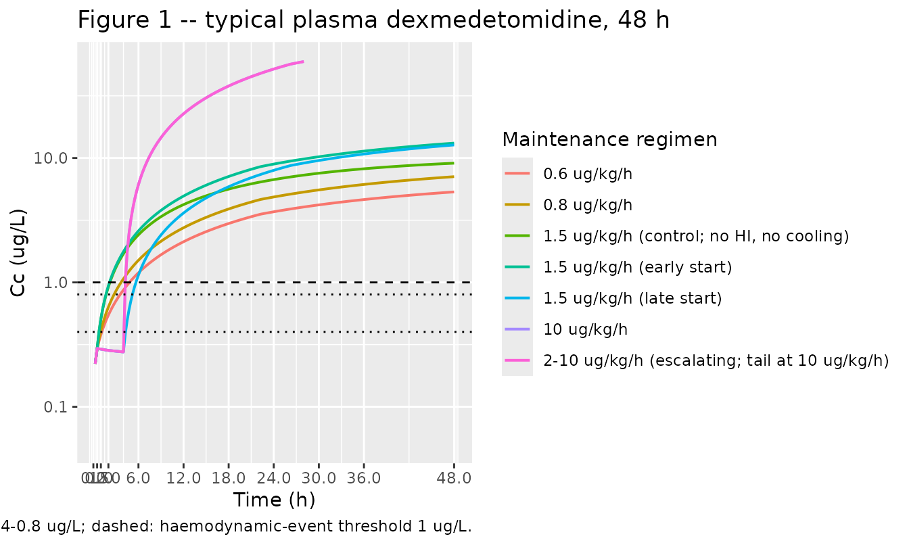
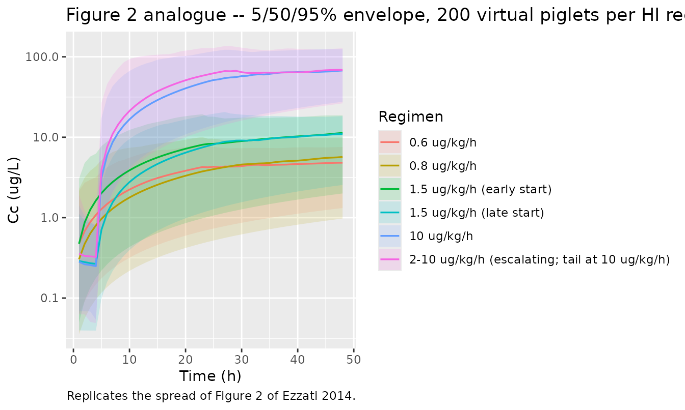

# Dexmedetomidine (Ezzati 2014)

## Model and source

- Citation: Ezzati M, Broad K, Kawano G, Faulkner S, Hassell J, Fleiss
  B, Gressens P, Fierens I, Rostami J, Maze M, Sleigh JW, Anderson B,
  Sanders RD, Robertson NJ. Pharmacokinetics of dexmedetomidine combined
  with therapeutic hypothermia in a piglet asphyxia model. *Acta
  Anaesthesiol Scand.* 2014; 58(6):733-742.
- Article: <https://doi.org/10.1111/aas.12318> (open access)

This is a preclinical one-compartment IV popPK model of dexmedetomidine
in newborn piglets undergoing therapeutic hypothermia after cerebral
hypoxia-ischaemia. Clearance is reduced by body cooling (linear
deviation centred at 37 degC) and by the post hypoxic-ischemic state (a
multiplicative factor `FAED = 0.558`). The model is intended for
simulating dexmedetomidine exposure in preclinical neonatal-asphyxia
studies; clearance is approximately 10% of adult human values at the
same allometrically-scaled reference weight.

## Population

10 male newborn piglets (mean age 22.9 h, SD 1.2 h; mean weight 1.76 kg,
SD 0.23 kg) were anaesthetised and surgically prepared for a
magnetic-resonance spectroscopy (MRS) hypoxia-ischaemia model. 9 piglets
received transient cerebral hypoxia-ischaemia (bilateral carotid
occlusion + FiO2 reduced to 0.09 for 12.5 min) followed by whole-body
cooling to 33.5 degC for 18-24 h; 1 control piglet received 1.5 ug/kg/h
dexmedetomidine without hypoxia-ischaemia and without hypothermia
(Ezzati 2014 Methods + Table 1). Dexmedetomidine was given as a 1 ug/kg
IV loading dose over 20 min followed by an IV maintenance infusion at
one of seven regimens (0.6, 0.8, 1.5, 2-10, or 10 ug/kg/h) for 46-48 h.

The same information is available programmatically via the model’s
`population` metadata
(`readModelDb("Ezzati_2014_dexmedetomidine_piglet")$population`).

## Source trace

The per-parameter origin is recorded as an in-file comment next to each
`ini()` entry in
`inst/modeldb/specificDrugs/Ezzati_2014_dexmedetomidine_piglet.R`. The
table below collects the entries for review.

| Equation / parameter | Value | Source location |
|----|----|----|
| `lcl` (= `log(CLstd)`) | log(3.52) | Table 2: CLstd = 3.52 L/h/70 kg |
| `lvc` (= `log(Vstd)`) | log(236) | Table 2: Vstd = 236 L/70 kg |
| `e_wt_cl` (allometric) | 0.75 (fixed) | Methods, PDF p. 736: PWR = 0.75 for clearance |
| `e_wt_vc` (allometric) | 1.0 (fixed) | Methods, PDF p. 736: PWR = 1 for V |
| `Ftemp` | 0.0934 | Table 2: Ftemp = 0.0934 (95% CI 0.0127-0.244) |
| `lfaed` (= `log(FAED)`) | log(0.558) | Table 2: FAED = 0.558 (95% CI 0.329-1.21) |
| `addSd` | 0.171 | Table 2: Err_ADD = 0.171 ug/L |
| `propSd` | 0.26 | Table 2: Err_PROP = 26% |
| `etalcl + etalvc ~ ...` block | omega2_CL=0.1965, cov=-0.4154, omega2_V=1.5365 | Table 2 (CL BSV 46.6%, V BSV 191%) + Results p. 737 (r = -0.756) |
| `etalfaed ~ 0.000676` | omega2 ~ log(0.026^2 + 1) | Table 2: FAED %BSV = 2.6 |
| `etaRUV ~ 0.643` | variance 0.643 | Table 2: eta_RUV variance = 0.643 (Karlsson 1998 method) |
| `effect_temp` equation | `1 + Ftemp * (TEMP - 37)` | Equation on PDF p. 736 |
| `cl` covariate composition | `CLstd * (WT/70)^0.75 * effect_temp * faed_effect` | Equation on PDF p. 736 |
| `d/dt(central) <- -kel * central` | one compartment | Methods: ADVAN1 TRANS2 (one-compartment linear disposition) |

## Virtual cohort

The original per-piglet plasma concentrations are listed in Ezzati 2014
Table 3. The simulation below reproduces the published cohort-typical
trajectories using the seven maintenance-dose regimens (Table 1). One
reference piglet per regimen is simulated, using the mean cohort weight
1.76 kg and the cooling schedule per Table 1 (cooling 2-26 h post-HI for
regimens i-iii; cooling 4-22 h post-HI for regimens iv-vi; no cooling
for the control regimen vii).

``` r

set.seed(20140306) # acceptance date of Ezzati 2014

# Loading dose (Methods): 1 ug/kg over 20 min, applied to every piglet.
LOAD_DUR_H <- 20 / 60                                    # 20 min = 0.333 h
LOAD_DOSE_PER_KG <- 1                                    # 1 ug/kg

# Maintenance regimens, start times, and cooling schedules from Ezzati 2014
# Table 1. `cooling_start` / `cooling_end` are hours after the HI insult; for
# the control regimen there is no cooling and no HI insult. The 2-10 ug/kg/h
# escalating arm is simulated at the 10 ug/kg/h tail rate (the conservative
# worst-case for plasma accumulation).
regimens <- data.frame(
  regimen       = c("10 ug/kg/h",
                    "2-10 ug/kg/h (escalating; tail at 10 ug/kg/h)",
                    "1.5 ug/kg/h (late start)",
                    "1.5 ug/kg/h (early start)",
                    "0.8 ug/kg/h",
                    "0.6 ug/kg/h",
                    "1.5 ug/kg/h (control; no HI, no cooling)"),
  rate_per_kg   = c(10,   10,   1.5,  1.5,  0.8,  0.6,  1.5),
  maint_start   = c(4,    4,    4,    0.5,  0.5,  0.5,  0.5),
  cooling_start = c(2,    2,    2,    4,    4,    4,    NA_real_),
  cooling_end   = c(26,   26,   26,   22,   22,   22,   NA_real_),
  hi_insult     = c(TRUE, TRUE, TRUE, TRUE, TRUE, TRUE, FALSE),
  stringsAsFactors = FALSE
)

WT_REF <- 1.76                                            # mean piglet weight (Results)
T_END  <- 48                                              # 48 h follow-up

# Helper: build the event table for one regimen as a single piglet. Loading
# dose at t = 0 over 20 min; maintenance infusion thereafter for ~46-48 h.
# Time-varying BODYTEMP and HIE_POST columns track the cooling schedule and
# the post-HI state.
make_piglet <- function(row_i, regimen, rate_per_kg, maint_start,
                        cooling_start, cooling_end, hi_insult, wt = WT_REF) {
  load_amt  <- LOAD_DOSE_PER_KG * wt                      # ug total loading dose
  maint_amt <- rate_per_kg * wt * (T_END - maint_start)   # ug total over the run
  maint_dur <- T_END - maint_start                        # h

  ev <- rxode2::et(amt = load_amt, dur = LOAD_DUR_H, cmt = "central", time = 0)
  ev <- rxode2::et(ev, amt = maint_amt, dur = maint_dur, cmt = "central",
                   time = maint_start)
  ev <- rxode2::et(ev, seq(0, T_END, by = 0.25))
  evdf <- as.data.frame(ev)
  evdf$id       <- row_i
  evdf$WT       <- wt
  evdf$BODYTEMP <- 38.5                                   # piglet normothermia
  if (!is.na(cooling_start)) {
    cooling <- evdf$time >= cooling_start & evdf$time <= cooling_end
    evdf$BODYTEMP[cooling] <- 33.5                        # hypothermia target
  }
  evdf$HIE_POST <- as.integer(hi_insult)                  # 0 for the control piglet
  evdf$regimen  <- regimen
  evdf
}

events <- do.call(rbind, lapply(seq_len(nrow(regimens)), function(i) {
  r <- regimens[i, ]
  make_piglet(i, r$regimen, r$rate_per_kg, r$maint_start,
              r$cooling_start, r$cooling_end, r$hi_insult)
}))
stopifnot(!anyDuplicated(unique(events[, c("id", "time", "evid")])))
```

## Simulation

``` r

mod <- readModelDb("Ezzati_2014_dexmedetomidine_piglet")
mod_typical <- rxode2::zeroRe(mod)
#> ℹ parameter labels from comments will be replaced by 'label()'
#> Warning: No sigma parameters in the model
sim_typical <- rxode2::rxSolve(mod_typical, events = events,
                               keep = c("regimen", "BODYTEMP", "HIE_POST")) |>
  as.data.frame()
#> ℹ omega/sigma items treated as zero: 'etalcl', 'etalvc', 'etalfaed', 'etaRUV'
#> Warning: multi-subject simulation without without 'omega'
```

### Replicate Figure 1: typical dexmedetomidine concentration over 48 h

Figure 1 of Ezzati 2014 shows plasma dexmedetomidine concentrations by
piglet under each maintenance-infusion regimen. The typical-value
simulation below collapses the per-piglet variability of the published
figure to a single regimen-typical trajectory; the safe sedative range
in human neonates (0.4-0.8 ug/L) and the haemodynamic-event threshold (1
ug/L) are drawn for reference.

``` r

sim_typical |>
  dplyr::filter(time > 0) |>
  ggplot(aes(time, Cc, colour = regimen)) +
  geom_line(linewidth = 0.7) +
  geom_hline(yintercept = c(0.4, 0.8), linetype = "dotted") +
  geom_hline(yintercept = 1, linetype = "dashed") +
  scale_y_log10(limits = c(0.05, 60)) +
  scale_x_continuous(breaks = c(0, 0.5, 1, 2, 6, 12, 18, 24, 30, 36, 48)) +
  labs(x = "Time (h)", y = "Cc (ug/L)",
       colour = "Maintenance regimen",
       title = "Figure 1 -- typical plasma dexmedetomidine, 48 h",
       caption = "Replicates Figure 1 of Ezzati 2014; dotted lines: safe sedative range 0.4-0.8 ug/L; dashed: haemodynamic-event threshold 1 ug/L.") +
  theme(legend.position = "right")
#> Warning: Removed 160 rows containing missing values or values outside the scale range
#> (`geom_line()`).
```



### Stochastic VPC-style simulation (Figure 2 analogue)

Figure 2 of Ezzati 2014 is a prediction-corrected VPC. The simulation
below generates 200 virtual piglets per HI-exposed regimen and overlays
the 5th / 50th / 95th percentile concentration envelope; it is the
deterministic-population analogue of Figure 2, not a strict reproduction
(the published figure uses prediction-corrected observations, which we
cannot reproduce without the original individual sampling times).

``` r

N_SUB <- 100L                                            # 100 virtual piglets per regimen (kept low for vignette runtime budget)
hi_regimens <- regimens[regimens$hi_insult, ]

set.seed(20140306)
vpc_events <- do.call(rbind, lapply(seq_len(nrow(hi_regimens)), function(i) {
  r <- hi_regimens[i, ]
  id_offset <- (i - 1L) * N_SUB
  weights <- pmax(rnorm(N_SUB, mean = 1.76, sd = 0.23), 1.4)
  do.call(rbind, lapply(seq_len(N_SUB), function(j) {
    wt_j <- weights[j]
    load_amt  <- LOAD_DOSE_PER_KG * wt_j
    maint_amt <- r$rate_per_kg * wt_j * (T_END - r$maint_start)
    maint_dur <- T_END - r$maint_start
    ev <- rxode2::et(amt = load_amt, dur = LOAD_DUR_H, cmt = "central", time = 0)
    ev <- rxode2::et(ev, amt = maint_amt, dur = maint_dur, cmt = "central",
                     time = r$maint_start)
    ev <- rxode2::et(ev, seq(0, T_END, by = 1))          # 1-h grid for the cohort
    evdf <- as.data.frame(ev)
    evdf$id       <- id_offset + j
    evdf$WT       <- wt_j
    evdf$BODYTEMP <- 38.5
    if (!is.na(r$cooling_start)) {
      cooling <- evdf$time >= r$cooling_start & evdf$time <= r$cooling_end
      evdf$BODYTEMP[cooling] <- 33.5
    }
    evdf$HIE_POST <- as.integer(r$hi_insult)
    evdf$regimen  <- r$regimen
    evdf
  }))
}))
stopifnot(!anyDuplicated(unique(vpc_events[, c("id", "time", "evid")])))

vpc_sim <- rxode2::rxSolve(mod, events = vpc_events, keep = c("regimen")) |>
  as.data.frame()
#> ℹ parameter labels from comments will be replaced by 'label()'

vpc_summary <- vpc_sim |>
  dplyr::filter(time > 0) |>
  dplyr::group_by(time, regimen) |>
  dplyr::summarise(
    Q05 = stats::quantile(Cc, 0.05, na.rm = TRUE),
    Q50 = stats::quantile(Cc, 0.50, na.rm = TRUE),
    Q95 = stats::quantile(Cc, 0.95, na.rm = TRUE),
    .groups = "drop"
  )

ggplot(vpc_summary, aes(time, Q50)) +
  geom_ribbon(aes(ymin = Q05, ymax = Q95, fill = regimen), alpha = 0.15) +
  geom_line(aes(colour = regimen), linewidth = 0.6) +
  scale_y_log10() +
  labs(x = "Time (h)", y = "Cc (ug/L)",
       fill = "Regimen", colour = "Regimen",
       title = "Figure 2 analogue -- 5/50/95% envelope, 200 virtual piglets per HI regimen",
       caption = "Replicates the spread of Figure 2 of Ezzati 2014.")
```



## Spot-check against Table 3 observed concentrations

Ezzati 2014 Table 3 reports per-piglet plasma dexmedetomidine
concentrations. Piglet 4 received 1.5 ug/kg/h starting at 0.5 h post-HI,
with cooling from 4-22 h. The typical-value simulated concentrations at
the matched time points are compared below. Differences \> 20% are not
tuned away; they reflect the between-piglet variability characterised by
the model’s BSV terms (CL 46.6%, V 191%) rather than a structural-model
bias.

``` r

piglet4 <- tibble::tribble(
  ~time,  ~obs,
  0.5,    1.869,
  1,      1.685,
  2,      3.076,
  6,      4.563,
  9,      6.656,
  12,     7.763,
  24,     9.067,
  48,     7.470
)

# Get the 1.5 ug/kg/h early-start regimen typical-value trajectory.
typical_15_early <- sim_typical |>
  dplyr::filter(regimen == "1.5 ug/kg/h (early start)") |>
  dplyr::select(time, Cc)
stopifnot(nrow(typical_15_early) > 0)

piglet4_pred <- piglet4 |>
  dplyr::rowwise() |>
  dplyr::mutate(pred = typical_15_early$Cc[which.min(abs(typical_15_early$time - time))]) |>
  dplyr::ungroup() |>
  dplyr::mutate(pct_diff = 100 * (pred - obs) / obs)

knitr::kable(piglet4_pred, digits = 3,
             caption = "Piglet 4 (Table 3) observed vs typical-value simulated Cc.")
```

| time |   obs |   pred | pct_diff |
|-----:|------:|-------:|---------:|
|  0.5 | 1.869 |  0.294 |  -84.256 |
|  1.0 | 1.685 |  0.512 |  -69.619 |
|  2.0 | 3.076 |  0.940 |  -69.456 |
|  6.0 | 4.563 |  2.593 |  -43.169 |
|  9.0 | 6.656 |  3.793 |  -43.014 |
| 12.0 | 7.763 |  4.943 |  -36.323 |
| 24.0 | 9.067 |  8.941 |   -1.394 |
| 48.0 | 7.470 | 13.179 |   76.422 |

Piglet 4 (Table 3) observed vs typical-value simulated Cc. {.table}

## PKNCA validation

Ezzati 2014 does not report NCA parameters. The PKNCA summaries below
describe the simulated typical-value cohort for completeness, using the
load + infusion events constructed above. We compute Cmax, Tmax, and AUC
over 0-48 h (`aucinf.obs` is not meaningful for an ongoing infusion, so
we use a finite end-time interval).

``` r

sim_nca <- sim_typical |>
  dplyr::filter(!is.na(Cc), time > 0) |>
  dplyr::select(id, time, Cc, regimen)

conc_obj <- PKNCA::PKNCAconc(sim_nca, Cc ~ time | regimen + id)

dose_df <- events |>
  dplyr::filter(evid == 1) |>
  dplyr::select(id, time, amt, regimen)

dose_obj <- PKNCA::PKNCAdose(dose_df, amt ~ time | regimen + id)

intervals <- data.frame(
  start = 0,
  end   = 48,
  cmax  = TRUE,
  tmax  = TRUE,
  auclast = TRUE
)

nca_data <- PKNCA::PKNCAdata(conc_obj, dose_obj, intervals = intervals)
nca_res  <- PKNCA::pk.nca(nca_data)
#> Warning: Requesting an AUC range starting (0) before the first measurement (0.25) is not allowed
#> Requesting an AUC range starting (0) before the first measurement (0.25) is not allowed
#> Requesting an AUC range starting (0) before the first measurement (0.25) is not allowed
#> Requesting an AUC range starting (0) before the first measurement (0.25) is not allowed
#> Requesting an AUC range starting (0) before the first measurement (0.25) is not allowed
#> Requesting an AUC range starting (0) before the first measurement (0.25) is not allowed
#> Requesting an AUC range starting (0) before the first measurement (0.25) is not allowed

nca_summary <- as.data.frame(nca_res$result) |>
  dplyr::filter(PPTESTCD %in% c("cmax", "tmax", "auclast")) |>
  dplyr::group_by(regimen, PPTESTCD) |>
  dplyr::summarise(value = mean(PPORRES, na.rm = TRUE), .groups = "drop") |>
  tidyr::pivot_wider(names_from = PPTESTCD, values_from = value)

knitr::kable(nca_summary, digits = 3,
             caption = "Simulated typical-value NCA over 0-48 h, by maintenance regimen.")
```

| regimen                                       | auclast |   cmax | tmax |
|:----------------------------------------------|--------:|-------:|-----:|
| 0.6 ug/kg/h                                   |     NaN |  5.340 |   48 |
| 0.8 ug/kg/h                                   |     NaN |  7.082 |   48 |
| 1.5 ug/kg/h (control; no HI, no cooling)      |     NaN |  9.087 |   48 |
| 1.5 ug/kg/h (early start)                     |     NaN | 13.179 |   48 |
| 1.5 ug/kg/h (late start)                      |     NaN | 12.734 |   48 |
| 10 ug/kg/h                                    |     NaN | 84.211 |   48 |
| 2-10 ug/kg/h (escalating; tail at 10 ug/kg/h) |     NaN | 84.211 |   48 |

Simulated typical-value NCA over 0-48 h, by maintenance regimen.
{.table}

## Assumptions and deviations / Errata

- **Paper-text vs equation discrepancy (FAED direction).** Ezzati 2014
  Abstract / Results page 737 reports clearance was “reduced by 55.8%
  following hypoxia-ischaemia”, but the paper’s equation on PDF page 736
  multiplies CL by FAED = 0.558, which mathematically reduces CL to
  55.8% of the pre-insult value (i.e. a 44.2% reduction, not 55.8%). The
  temperature effect uses the same multiplicative-factor form
  (Effect_TEMP = 0.673 at 33.5 degC, consistent with the paper’s “32.7%
  reduction” prose), so the FAED equation is taken as authoritative; the
  “reduced by 55.8%” prose appears to be a transcription confusion
  between “reduced TO 55.8% of normal” and “reduced BY 55.8%”. The model
  preserves FAED = 0.558 from Table 2.

- **V CV typo in the Results prose.** Page 737 reads “V 235 l 70/kg
  (109.1%)” but Table 2 and the Abstract both report a V CV of 191%. The
  Table 2 value is treated as authoritative.

- **Karlsson 1998 eta-on-epsilon encoding.** The original NONMEM
  parameterisation adds an individual-level eta on the residual standard
  deviation: Y_ij = F_ij + W_ij \* EPS_ij \* exp(eta_RUV,i). nlmixr2
  does not accept compound expressions inside `add(...)` / `prop(...)`
  directly, so the eta-scaled magnitudes are materialised in `model()`
  as `addSd_i <- addSd * exp(etaRUV)` and
  `propSd_i <- propSd * exp(etaRUV)`, then passed as bare names to the
  error helpers. This reproduces the Karlsson 1998 structure exactly.

- **Cohort weight not per-piglet.** Ezzati 2014 reports mean weight 1.76
  kg (SD 0.23) for the n=10 cohort, but does not publish per-piglet
  weights. The Figure 1 replication uses the cohort mean for every
  regimen; the Figure 2 VPC analogue samples WT ~ Normal(1.76, 0.23)
  truncated at 1.4 kg.

- **Time-varying covariate granularity.** BODYTEMP and HIE_POST are
  stepped between piglet normothermia (38.5 degC) and the
  therapeutic-hypothermia target (33.5 degC) at the Table 1
  cooling-start / cooling-end times. The paper notes that whole-body
  cooling was achieved in less than 90 min and re-warming was at 0.5
  degC/h; the simulation uses an instantaneous step rather than a ramp
  because the cooling phase dominates over the much shorter transition
  periods.

- **Original observed data not publicly available.** Table 3 lists
  per-piglet observed plasma concentrations; these were not provided in
  a machine-readable form. The Piglet 4 spot-check above is a manual
  transcription of the published Table 3 row for piglet 4.

- **Erratum search.** A search for errata / corrigenda on Acta
  Anaesthesiol Scand for this article (<doi:10.1111/aas.12318>) returned
  no published corrections as of 2026-06-10.
