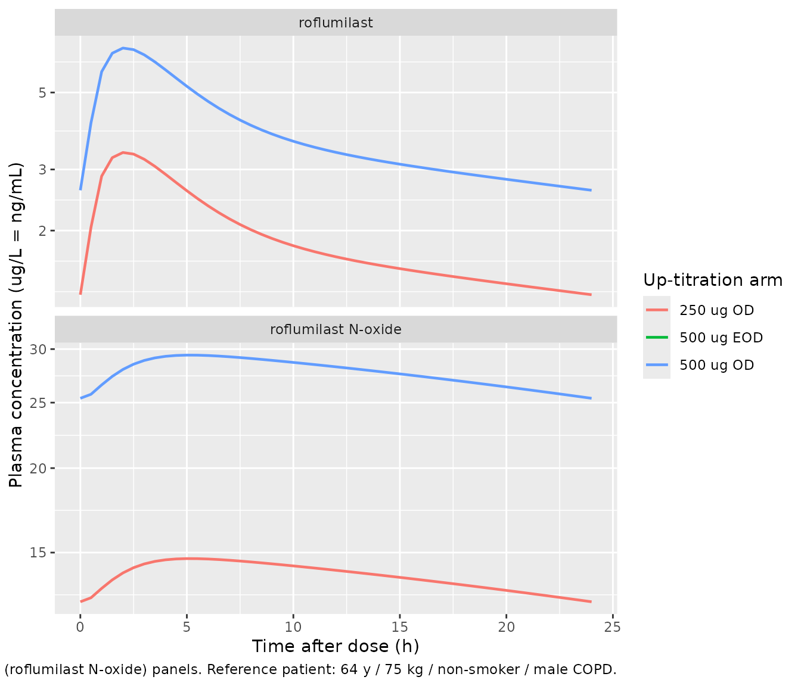

# Roflumilast (Facius 2018)

## Model and source

- Citation: Facius A, Marostica E, Gardiner P, Watz H, Lahu G.
  Pharmacokinetic and Pharmacodynamic Modelling to Characterize the
  Tolerability of Alternative Up-Titration Regimens of Roflumilast in
  Patients with Chronic Obstructive Pulmonary Disease. Clin
  Pharmacokinet. 2018;57(8):1029-1038. <doi:10.1007/s40262-018-0671-4>
- Article: <https://doi.org/10.1007/s40262-018-0671-4>
- Online Resource (supplement) hosting Tables S1, S2, S3 (parameter
  estimates and AE preferred-term groupings):
  <https://static-content.springer.com/esm/art%3A10.1007%2Fs40262-018-0671-4/MediaObjects/40262_2018_671_MOESM1_ESM.docx>

The packaged model is `Facius_2018_roflumilast`, an integrated
parent-metabolite population PK model for oral roflumilast and its
primary active metabolite roflumilast N-oxide in adult patients with
severe chronic obstructive pulmonary disease (COPD). It re-uses the
joint disposition structure of the Lahu 2010 base model:

- Roflumilast (parent): two-compartment disposition (`central`,
  `peripheral1`) with first-order absorption from `depot` (rate `ka`), a
  shared lag time (`tlag_dep`), and first-order elimination.
- Roflumilast N-oxide (metabolite): two-compartment disposition
  (`central_noxide`, `peripheral2`) with two parallel inputs –
  first-order absorption from a separate pre-systemic depot
  (`depot_noxide`, rate `ka_noxide = ka * 0.635`, relative
  bioavailability F5 = 0.0649 with molecular-weight correction 419.21 /
  403.22), plus complete first-order post-systemic conversion from
  `central` at rate `kel_p * central * MWm/MWp`. N-oxide elimination is
  first-order from `central_noxide`.

Structural disposition parameters and the F5 / KAm-to-KAp ratio are
fixed to the Lahu 2010 estimates re-applied to OPTIMIZE via a
Bayesian-feedback (MAXEVAL = 0) step (Facius 2018 Online Resource
Methods Section 2). The phase II-III dichotomous patient effects (on KA,
parent CL, N-oxide CL, and N-oxide central volume V3), the
between-subject variability on parent and N-oxide CL (with a
Box-Cox-shape transformation), the log-additive residual errors, and the
covariate effects (weight on all volumes, weight on N-oxide CL, smoking
on parent and N-oxide CL, age on parent and N-oxide CL, sex on N-oxide
CL) were re-estimated on the combined OPTIMIZE + REACT phase III
dataset.

To dose the model, the user’s event table must produce two rows per
roflumilast administration: one targeting `cmt = "depot"` (parent
first-order absorption, F1 = 1) and one targeting `cmt = "depot_noxide"`
(N-oxide pre-systemic first-order absorption, F = F5 \* MWm/MWp). The
user-supplied `amt` is the same on both rows and is interpreted as
micrograms of roflumilast administered.

## Population

The combined analysis dataset comprised 1699 patients from two phase III
trials (Facius 2018 Table 1):

- **OPTIMIZE** (NCT02165826, n = 1238): randomised, double-blind,
  three-arm, parallel-group phase III trial in adults with severe COPD,
  evaluating a 4-week up-titration phase (250 ug OD, 500 ug EOD, or 500
  ug OD) before escalation to 500 ug OD maintenance for 8 weeks.
  Included a 250 ug OD open-label down-titration sub-cohort.
- **REACT** (NCT01329029, n = 461 with PK measurements): randomised,
  double-blind, parallel-group phase III trial of roflumilast 500 ug OD
  vs placebo for 52 weeks in adults with severe-to-very-severe COPD.

Combined demographics: mean age 64.4 +/- 8.2 years (median 64.0, range
40-92), 75.0 percent male, mean weight 75.3 +/- 17.7 kg (median 74.0,
range 33.5-160), 92.9 percent White, 5.3 percent Asian, 0.8 percent
Black, 0.6 percent Other, 0.4 percent Hispanic, 46.9 percent current
smokers. Both studies enrolled current or former smokers with
post-bronchodilator FEV1 \<= 50 percent of predicted and FEV1 / FVC \<
70 percent.

The same metadata is available programmatically:

``` r

nlmixr2lib::readModelDb("Facius_2018_roflumilast")$population
```

## Source trace

Per-parameter origin is recorded inline next to each `ini()` entry in
`inst/modeldb/specificDrugs/Facius_2018_roflumilast.R`. The table below
collects the same provenance for review. Values are from Online Resource
Table S2 (“Parameter estimates of the final model describing REACT and
OPTIMIZE data (combined dataset)”) unless noted.

| Equation / parameter | Value | Source location |
|----|----|----|
| Joint structural model: 2-cmt parent + 2-cmt N-oxide with pre-systemic N-oxide depot, complete parent-to-N-oxide conversion | n/a | Facius 2018 main text Figure 1; Online Resource Methods Section 1 |
| `ltlag` (shared parent / N-oxide depot lag) | log(0.227 h) FIXED | Online Resource Table S2 “Tlag (h)” |
| `lka` (parent absorption rate) | log(3.36 1/h) FIXED | Online Resource Table S2 “KAp (h^-1)” |
| `lcl` (parent CL) | log(12.6 L/h) FIXED | Online Resource Table S2 “CLp (L/h)” |
| `lvc` (parent central V2) | log(63.9 L) FIXED | Online Resource Table S2 “V2 (L)” |
| `lq` (parent inter-compartmental Qp) | log(15.6 L/h) FIXED | Online Resource Table S2 “Qp (L/h)” |
| `lvp` (parent peripheral V4) | log(171 L) FIXED | Online Resource Table S2 “V4 (L)” |
| `lcl_noxide` (N-oxide CL) | log(1.26 L/h) FIXED | Online Resource Table S2 “CLm (L/h)” |
| `lvc_noxide` (N-oxide central V3) | log(13.9 L) FIXED | Online Resource Table S2 “V3 (L)” |
| `lq_noxide` (N-oxide inter-compartmental Qm) | log(4.83 L/h) FIXED | Online Resource Table S2 “Qm (L/h)” |
| `lvp_noxide` (N-oxide peripheral V6) | log(12.4 L) FIXED | Online Resource Table S2 “V6 (L)” |
| `lf5` (N-oxide pre-systemic relative bioavailability) | log(0.0649) FIXED | Online Resource Table S2 “F5 (-)” |
| `lratio_ka` (KAm / KAp) | log(0.635) FIXED | Online Resource Table S2 “RatioKAm/KAp” |
| `e_pat_ka` (Phase II-III on KA) | -0.733 (SE 1.73 percent points) | Online Resource Table S2 “Effect on KA (%)” |
| `e_pat_cl` (Phase II-III on CLp) | -0.552 (SE 1.08 percent points) | Online Resource Table S2 “Effect on CLp (%)” |
| `e_pat_cl_noxide` (Phase II-III on CLm) | -0.244 (SE 1.46 percent points) | Online Resource Table S2 “Effect on CLm (%)” |
| `e_pat_vc_noxide` (Phase II-III on V3) | -0.207 (SE 8.47 percent points) | Online Resource Table S2 “Effect on V3 (%)” |
| Box-Cox shape lambda on CLp / CLm etas | 0.704 (SE 0.0651) | Online Resource Table S2 (documented; not encoded – see Errata) |
| `allov` (WT allometric power on all volumes) | 1.22 (SE 0.121) | Online Resource Table S2 “WT on all volume terms” |
| `e_smk_cl` (smoke linear on CLp) | 0.151 (SE 0.0372) | Online Resource Table S2 “Smok on CLp” |
| `e_wt_cl_noxide` (WT power on CLm) | 0.273 (SE 0.0406) | Online Resource Table S2 “WT on CLm” |
| `e_smk_cl_noxide` (smoke linear on CLm) | 0.151 (SE 0.0253) | Online Resource Table S2 “Smok on CLm” |
| `e_age_cl` (AGE power on CLp) | -0.611 (SE 0.138) | Online Resource Table S2 “AGE on CLp” |
| `e_age_cl_noxide` (AGE power on CLm) | -0.531 (SE 0.0829) | Online Resource Table S2 “AGE on CLm” |
| `e_sex_m_cl_noxide`(male linear on CLm) | -0.112 (SE 0.0186) | Online Resource Table S2 “Sex on CLm” |
| IIV omega^2(CLp) | 0.227 (CV 50.5%) | Online Resource Table S2 Random effects |
| IIV omega^2(CLm) | 0.273 (CV 56.0%) | Online Resource Table S2 Random effects |
| IIV cov(CLp, CLm) | 0.163 | Online Resource Table S2 Random effects |
| Residual sigma_p,add (log-scale) | 0.566 | Online Resource Table S2 Residual error |
| Residual sigma_m,add (log-scale) | 0.448 | Online Resource Table S2 Residual error |

Reference covariate values: weight 70 kg (Online Resource Table S2
footnote e), age 60 years (footnote g). Reference category for binary
covariates: SEXF = 1 (female), SMOKE = 0 (former / never smoker),
DIS_COPD = 1 for OPTIMIZE + REACT patients (the dichotomous phase II-III
effects are switched on at DIS_COPD = 1 and off at DIS_COPD = 0).

## tPDE4i and the downstream PK / AE and PK / time-to-event analyses

The Facius 2018 paper’s PD analyses (logistic regression of AE frequency
on tPDE4i; parametric time-to-event analysis of treatment
discontinuation on tPDE4i and covariates) operate on a per-patient
summary statistic derived from the popPK model: total
phosphodiesterase-4 inhibitory activity (tPDE4i) at steady state. Per
Online Resource Methods Section 3, tPDE4i is computed from the predicted
dosing-interval-average concentrations of parent
(`Cavg_p = Dose_p / (CL_p * tau)`) and N-oxide
(`Cavg_m = Dose_p * (MWm / MWp) / (CL_m * tau) * (1 + F5)`) as

    tPDE4i = (f_u_p * Cavg_p) / (IC50_p + f_u_p * Cavg_p)
           + (f_u_m * Cavg_m) / (IC50_m + f_u_m * Cavg_m)

with in-vitro fraction unbound `f_u_p = 0.011`, `f_u_m = 0.034` and
in-vitro IC50 `IC50_p = 0.3 ng/mL`, `IC50_m = 0.8 ng/mL`. The metabolite
contributes about 90 percent of tPDE4i at typical exposures (main text
section 1). The PK / AE logistic regression slope reported in the main
text is 0.484 on the logit scale (95 percent CI 0.262-0.706, p = 2e-5);
the PK / time-to-event log-normal position-shift for the 250 ug OD
up-titration arm is 1.1023 (95 percent CI 0.426-1.778, p = 0.0014).
These secondary models are tabulated in main text Section 3 but are not
embedded in the rxode2 model – they operate on per-patient summaries and
not on a concentration-time profile. The vignette demonstrates the
tPDE4i derivation in the simulation block below.

## Virtual cohort

The OPTIMIZE patient-level data are not publicly available. The figures
below use a virtual cohort whose covariate distribution approximates the
combined OPTIMIZE + REACT population (Facius 2018 Table 1) dosed in the
three OPTIMIZE up-titration arms for the first 4 weeks of treatment.

``` r

set.seed(20260623)

n_per_arm <- 60L

build_arm <- function(arm_label, dose1_amt, dose1_int_h, dose1_n,
                      id_offset) {
  # Cohort covariates per Facius 2018 Table 1 (combined column).
  ids <- id_offset + seq_len(n_per_arm)
  covars <- tibble::tibble(
    id     = ids,
    AGE    = pmax(40, pmin(92, round(rnorm(n_per_arm, mean = 64.4,
                                            sd = 8.2)))),
    WT     = pmax(45, pmin(140, round(rnorm(n_per_arm, mean = 75.3,
                                             sd = 17.7), 1))),
    SEXF   = as.integer(runif(n_per_arm) < 0.25),
    SMOKE  = as.integer(runif(n_per_arm) < 0.47),
    DIS_COPD = 1L
  )

  # Up-titration phase only (first 4 weeks): each arm uses a constant
  # regimen. 250 ug OD = 250 ug every 24 h; 500 ug EOD = 500 ug every
  # 48 h; 500 ug OD = 500 ug every 24 h.
  dose_times <- (seq_len(dose1_n) - 1L) * dose1_int_h

  # Two simultaneous dose events per administration: depot (parent
  # first-order absorption, F1 = 1) and depot_noxide (N-oxide pre-
  # systemic first-order absorption, F = F5 * MWm/MWp). The
  # user-supplied amt is the same on both rows.
  dose_rows_parent <- tidyr::expand_grid(id = ids, time = dose_times) |>
    dplyr::mutate(evid = 1L, amt = dose1_amt, cmt = "depot")
  dose_rows_noxide <- tidyr::expand_grid(id = ids, time = dose_times) |>
    dplyr::mutate(evid = 1L, amt = dose1_amt, cmt = "depot_noxide")

  # Observation grid: dense in the first interval (single-dose
  # absorption phase) and across the final 24 h (approaching steady
  # state); 24 h troughs in between to keep the simulation compact.
  ss_window <- max(dose_times) + 24
  obs_times <- sort(unique(c(
    c(0.25, 0.5, 0.75, 1, 1.5, 2, 3, 4, 6, 8, 10, 12, 16, 20, 24),
    seq(48, max(dose_times) - 24, by = 24),
    max(dose_times) + c(0, 0.25, 0.5, 1, 1.5, 2, 3, 4, 6, 8,
                        10, 12, 16, 20, 24)
  )))
  obs_times <- obs_times[obs_times <= ss_window]

  # Observation rows. The model has two algebraic observables (Cc parent,
  # Cc_noxide N-oxide); address them by dvid endpoint id (1 = Cc, 2 = Cc_noxide)
  # rather than by the algebraic-observable name, so rxode2 maps each
  # observation to its endpoint under the default solver (see
  # references/known-vignette-failure-patterns.md §5b; the Wittau 2015
  # meropenem precedent). rxSolve returns Cc and Cc_noxide columns on every
  # observation row regardless of dvid.
  obs_rows <- tidyr::expand_grid(id = ids, time = obs_times,
                                  dvid = c(1L, 2L)) |>
    dplyr::mutate(evid = 0L, amt = 0)

  dplyr::bind_rows(dose_rows_parent, dose_rows_noxide, obs_rows) |>
    dplyr::left_join(covars, by = "id") |>
    dplyr::mutate(arm = arm_label) |>
    dplyr::arrange(id, time, dplyr::desc(evid))
}

events <- dplyr::bind_rows(
  build_arm("250 ug OD",  dose1_amt = 250, dose1_int_h = 24,
            dose1_n = 28L, id_offset = 0L),
  build_arm("500 ug EOD", dose1_amt = 500, dose1_int_h = 48,
            dose1_n = 14L, id_offset = 1000L),
  build_arm("500 ug OD",  dose1_amt = 500, dose1_int_h = 24,
            dose1_n = 28L, id_offset = 2000L)
)
stopifnot(!anyDuplicated(unique(events[, c("id", "time", "evid")])))
```

## Simulation

``` r

mod <- nlmixr2lib::readModelDb("Facius_2018_roflumilast")

# Stochastic simulation across the three OPTIMIZE up-titration arms.
sim <- rxode2::rxSolve(mod, events = events,
                       keep = c("arm", "AGE", "WT", "SEXF",
                                "SMOKE", "DIS_COPD")) |>
  as.data.frame()
#> ℹ parameter labels from comments will be replaced by 'label()'
```

For a deterministic side-by-side typical-value comparison of the three
arms (no IIV), zero out the random effects and reuse a one-subject event
table per arm:

``` r

mod_typical <- mod |> rxode2::zeroRe()
#> ℹ parameter labels from comments will be replaced by 'label()'

build_typical_arm <- function(arm_label, dose1_amt, dose1_int_h,
                              dose1_n) {
  dose_times <- (seq_len(dose1_n) - 1L) * dose1_int_h
  obs_times  <- sort(unique(c(
    seq(0, max(dose_times) + 24, by = 0.5)
  )))
  cov_row <- tibble::tibble(
    id = 1L, AGE = 64L, WT = 75, SEXF = 0L, SMOKE = 0L, DIS_COPD = 1L
  )
  ev <- dplyr::bind_rows(
    tibble::tibble(id = 1L, time = dose_times, evid = 1L,
                   amt = dose1_amt, cmt = "depot"),
    tibble::tibble(id = 1L, time = dose_times, evid = 1L,
                   amt = dose1_amt, cmt = "depot_noxide"),
    tidyr::expand_grid(id = 1L, time = obs_times,
                       dvid = c(1L, 2L)) |>
      dplyr::mutate(evid = 0L, amt = 0)
  ) |>
    dplyr::left_join(cov_row, by = "id") |>
    dplyr::mutate(arm = arm_label) |>
    dplyr::arrange(id, time, dplyr::desc(evid))
  ev
}

typical_events <- dplyr::bind_rows(
  build_typical_arm("250 ug OD",  250, 24, 28L) |>
    dplyr::mutate(id = 1L),
  build_typical_arm("500 ug EOD", 500, 48, 14L) |>
    dplyr::mutate(id = 2L),
  build_typical_arm("500 ug OD",  500, 24, 28L) |>
    dplyr::mutate(id = 3L)
)

sim_typical <- rxode2::rxSolve(mod_typical, events = typical_events,
                               keep = c("arm")) |>
  as.data.frame()
#> ℹ omega/sigma items treated as zero: 'etalcl', 'etalcl_noxide'
#> Warning: multi-subject simulation without without 'omega'
```

## Replicate the steady-state concentration profiles

Facius 2018 Figure 2 shows visual predictive checks of the 500 ug OD
exposure for each of the three treatment arms (top panels: roflumilast;
bottom panels: roflumilast N-oxide). The 24 h profiles below show the
simulated typical-value time-course at the end of the 4-week
up-titration phase under each arm’s regimen for a reference patient
(male non-smoker, 64 years, 75 kg).

``` r

sim_typical |>
  dplyr::filter(time >= 24 * 27, time <= 24 * 28) |>
  dplyr::mutate(time_h = time - 24 * 27) |>
  dplyr::select(time_h, arm, Cc, Cc_noxide) |>
  tidyr::pivot_longer(c(Cc, Cc_noxide),
                       names_to = "analyte", values_to = "conc") |>
  dplyr::mutate(analyte = dplyr::recode(analyte,
                                         Cc        = "roflumilast",
                                         Cc_noxide = "roflumilast N-oxide")) |>
  ggplot(aes(time_h, conc, colour = arm)) +
  geom_line(linewidth = 0.8) +
  facet_wrap(~analyte, scales = "free_y", ncol = 1) +
  scale_y_log10() +
  labs(x = "Time after dose (h)",
       y = "Plasma concentration (ug/L = ng/mL)",
       colour = "Up-titration arm",
       caption = paste(
         "Typical-value steady-state 24 h interval after 4 weeks of",
         "up-titration. Replicates the shape of Facius 2018 Figure 2,",
         "top (roflumilast) and bottom (roflumilast N-oxide) panels.",
         "Reference patient: 64 y / 75 kg / non-smoker / male COPD."
       ))
```



## PKNCA validation – end-of-up-titration steady-state per arm

NCA over the final 24 h dosing interval of each up-titration arm for
both analytes. The 500 ug EOD arm samples the 48 h interval that spans
the last on- and off-dose day; only the on-dose 24 h window is shown
below for comparability with the OD arms.

``` r

ss_starts <- c("250 ug OD"  = 24 * 27,
               "500 ug EOD" = 48 * 13,
               "500 ug OD"  = 24 * 27)

sim_nca <- purrr::map_dfr(names(ss_starts), function(arm_label) {
  ss_start <- ss_starts[[arm_label]]
  sim |>
    dplyr::filter(arm == arm_label,
                  time >= ss_start, time <= ss_start + 24) |>
    dplyr::mutate(time_in_interval = time - ss_start)
})

# Defensive insertion of a time-zero row per (id, arm) for PKNCA to
# anchor AUC0-* (see references/pknca-recipes.md "Time-zero records").
sim_nca <- sim_nca |>
  dplyr::filter(!is.na(Cc), !is.na(Cc_noxide)) |>
  dplyr::select(id, arm, time_in_interval, Cc, Cc_noxide)

sim_nca <- dplyr::bind_rows(
  sim_nca,
  sim_nca |> dplyr::distinct(id, arm) |>
    dplyr::mutate(time_in_interval = 0, Cc = 0, Cc_noxide = 0)
) |>
  dplyr::distinct(id, arm, time_in_interval, .keep_all = TRUE) |>
  dplyr::arrange(id, arm, time_in_interval)

# PKNCA expects long format per analyte.
sim_nca_parent <- sim_nca |>
  dplyr::transmute(id = paste(arm, id, sep = "_"),
                   time = time_in_interval, conc = Cc,
                   treatment = arm)
sim_nca_noxide <- sim_nca |>
  dplyr::transmute(id = paste(arm, id, sep = "_"),
                   time = time_in_interval, conc = Cc_noxide,
                   treatment = arm)

# Doses: one row per subject per arm at t = 0 in the per-interval frame.
dose_df <- sim_nca |>
  dplyr::distinct(id, arm) |>
  dplyr::transmute(id = paste(arm, id, sep = "_"),
                   time = 0,
                   amt = dplyr::case_when(
                     arm == "250 ug OD"  ~ 250,
                     arm == "500 ug EOD" ~ 500,
                     arm == "500 ug OD"  ~ 500
                   ),
                   treatment = arm)

intervals <- data.frame(
  start    = 0,
  end      = 24,
  cmax     = TRUE,
  tmax     = TRUE,
  cmin     = TRUE,
  auclast  = TRUE,
  cav      = TRUE
)

conc_obj_parent <- PKNCA::PKNCAconc(sim_nca_parent,
                                     conc ~ time | treatment + id,
                                     concu = "ug/L", timeu = "h")
conc_obj_noxide <- PKNCA::PKNCAconc(sim_nca_noxide,
                                     conc ~ time | treatment + id,
                                     concu = "ug/L", timeu = "h")
dose_obj <- PKNCA::PKNCAdose(dose_df, amt ~ time | treatment + id,
                             doseu = "ug")

nca_parent <- PKNCA::pk.nca(PKNCA::PKNCAdata(conc_obj_parent, dose_obj,
                                              intervals = intervals))
nca_noxide <- PKNCA::pk.nca(PKNCA::PKNCAdata(conc_obj_noxide, dose_obj,
                                              intervals = intervals))

knitr::kable(as.data.frame(summary(nca_parent)),
             caption = "Simulated 24 h steady-state NCA -- roflumilast.")
```

| Interval Start | Interval End | treatment | N | AUClast (h\*ug/L) | Cmax (ug/L) | Cmin (ug/L) | Tmax (h) | Cav (ug/L) |
|---:|---:|:---|:---|:---|:---|:---|:---|:---|
| 0 | 24 | 250 ug OD | 60 | 43.3 \[43.5\] | 3.37 \[26.7\] | 1.14 \[64.4\] | 2.00 \[1.50, 3.00\] | 1.80 \[43.5\] |
| 0 | 24 | 500 ug EOD | 60 | 56.3 \[40.2\] | 5.08 \[23.8\] | 0.787 \[95.0\] | 2.00 \[1.50, 3.00\] | 2.35 \[40.2\] |
| 0 | 24 | 500 ug OD | 60 | 94.1 \[54.5\] | 7.10 \[31.2\] | 2.53 \[84.6\] | 2.00 \[1.50, 3.00\] | 3.92 \[54.5\] |

Simulated 24 h steady-state NCA – roflumilast. {.table
style="width:100%;"}

``` r

knitr::kable(as.data.frame(summary(nca_noxide)),
             caption = "Simulated 24 h steady-state NCA -- roflumilast N-oxide.")
```

| Interval Start | Interval End | treatment | N | AUClast (h\*ug/L) | Cmax (ug/L) | Cmin (ug/L) | Tmax (h) | Cav (ug/L) |
|---:|---:|:---|:---|:---|:---|:---|:---|:---|
| 0 | 24 | 250 ug OD | 60 | 293 \[50.9\] | 13.5 \[44.3\] | 10.5 \[61.6\] | 6.00 \[4.00, 6.00\] | 12.2 \[50.9\] |
| 0 | 24 | 500 ug EOD | 60 | 335 \[45.6\] | 15.3 \[39.8\] | 8.91 \[75.2\] | 6.00 \[4.00, 10.0\] | 13.9 \[45.6\] |
| 0 | 24 | 500 ug OD | 60 | 613 \[60.5\] | 28.0 \[53.7\] | 22.3 \[72.6\] | 6.00 \[3.00, 6.00\] | 25.5 \[60.5\] |

Simulated 24 h steady-state NCA – roflumilast N-oxide. {.table
style="width:100%;"}

### Comparison against published predictions

Facius 2018 does not tabulate explicit Cmax / Cmin / AUC point values in
the main text; main-text Figure 2 reports the simulated 5th, 50th, and
95th percentiles of the 500 ug OD steady-state profile in graphical
form, and Online Resource Table S2 gives the underlying popPK parameter
estimates (Fixed and re-estimated). The closed-form predictions below
use the typical-value (no-IIV) reference subject (64 y / 75 kg /
non-smoker / male / COPD) as the validation target.

``` r

# Reference subject parameter values (typical-value).
# Phase II-III COPD multipliers (DIS_COPD = 1):
#   KA_pat   = KA  * (1 - 0.733)
#   CLp_pat  = CLp * (1 - 0.552)
#   CLm_pat  = CLm * (1 - 0.244)
#   V3_pat   = V3  * (1 - 0.207)
# Covariate scalings for the reference subject (AGE = 64, WT = 75,
# SMOKE = 0, SEXF = 0 [male]):
#   CLp = CLp_pat * (AGE/60)^-0.611
#   CLm = CLm_pat * (WT/70)^0.273 * (AGE/60)^-0.531 *
#         (1 + -0.112 * (1 - SEXF))
#   V (all) scaled by (WT/70)^1.22

# Numerical values (reference patient):
AGE <- 64; WT <- 75; SEXF <- 0L; SMOKE <- 0L; DIS_COPD <- 1L

ka_typ  <- 3.36  * (1 - 0.733 * DIS_COPD)
clp_typ <- 12.6  * (1 - 0.552 * DIS_COPD) *
                  (1 + 0.151  * SMOKE)    *
                  (AGE / 60)^(-0.611)
clm_typ <- 1.26  * (1 - 0.244 * DIS_COPD) *
                  (WT  / 70)^( 0.273)     *
                  (1 + 0.151  * SMOKE)    *
                  (AGE / 60)^(-0.531)     *
                  (1 + -0.112 * (1 - SEXF))
v2_typ  <- 63.9 * (WT / 70)^1.22
v4_typ  <- 171  * (WT / 70)^1.22
v3_typ  <- 13.9 * (1 - 0.207 * DIS_COPD) * (WT / 70)^1.22
v6_typ  <- 12.4 * (WT / 70)^1.22

# Steady-state AUCss = Dose / CL per dosing interval (mass-balance).
auc_500_p <- 500 / clp_typ
auc_500_m <- 500 / clm_typ * (1 + 0.0649)   # (1 + F5) per Online
                                             # Resource Section 3, eq 2

cat(sprintf(
  "Typical-value reference patient (64 y / 75 kg / non-smoker / male / COPD):\n",
  ""))
#> Warning in sprintf("Typical-value reference patient (64 y / 75 kg / non-smoker / male / COPD):\n", : one argument not used by format 'Typical-value reference patient (64 y / 75 kg / non-smoker / male / COPD):
#> '
#> Typical-value reference patient (64 y / 75 kg / non-smoker / male / COPD):
cat(sprintf("  Parent  CL = %.2f L/h  =>  AUC24,ss (500 ug OD) = %.1f ug*h/L\n",
            clp_typ, auc_500_p))
#>   Parent  CL = 5.43 L/h  =>  AUC24,ss (500 ug OD) = 92.1 ug*h/L
cat(sprintf("  N-oxide CL = %.4f L/h  =>  AUC24,ss (500 ug OD) = %.1f ug*h/L\n",
            clm_typ, auc_500_m))
#>   N-oxide CL = 0.8329 L/h  =>  AUC24,ss (500 ug OD) = 639.3 ug*h/L
cat(sprintf("  Parent t1/2 (terminal) = %.1f h (= ln(2) * (V2+V4) / CL)\n",
            log(2) * (v2_typ + v4_typ) / clp_typ))
#>   Parent t1/2 (terminal) = 32.6 h (= ln(2) * (V2+V4) / CL)
cat(sprintf("  N-oxide t1/2 (terminal) = %.1f h (= ln(2) * (V3+V6) / CL)\n",
            log(2) * (v3_typ + v6_typ) / clm_typ))
#>   N-oxide t1/2 (terminal) = 21.2 h (= ln(2) * (V3+V6) / CL)
```

For the same reference subject, tPDE4i at 500 ug OD steady state is

``` r

# Convert AUC24,ss to dosing-interval average concentration in ng/mL
# (= ug/L). For OD dosing tau = 24 h.
cav_p <- auc_500_p / 24
cav_m <- auc_500_m / 24

# In-vitro binding constants from Online Resource Methods Section 3.
f_u_p   <- 0.011
f_u_m   <- 0.034
IC50_p  <- 0.3    # ng/mL
IC50_m  <- 0.8    # ng/mL

I_p <- (f_u_p * cav_p) / (IC50_p + f_u_p * cav_p)
I_m <- (f_u_m * cav_m) / (IC50_m + f_u_m * cav_m)
tpde4i_typ <- I_p + I_m

cat(sprintf(
  "tPDE4i at 500 ug OD steady state (typical reference patient): %.3f\n",
  tpde4i_typ))
#> tPDE4i at 500 ug OD steady state (typical reference patient): 0.654
cat(sprintf(
  "  Parent contribution  : %.3f (%.1f%% of tPDE4i)\n",
  I_p, 100 * I_p / tpde4i_typ))
#>   Parent contribution  : 0.123 (18.9% of tPDE4i)
cat(sprintf(
  "  N-oxide contribution : %.3f (%.1f%% of tPDE4i)\n",
  I_m, 100 * I_m / tpde4i_typ))
#>   N-oxide contribution : 0.531 (81.1% of tPDE4i)
```

The metabolite contribution should account for approximately 90 percent
of the typical-patient tPDE4i, consistent with Facius 2018 main text
Section 1 (page 1030 paragraph 4: “The metabolite is estimated to
contribute about 90 percent of the total phosphodiesterase-4 inhibitory
(tPDE4i) activity, with 10 percent attributed to the parent
roflumilast.”).

## Assumptions and deviations

- **Box-Cox shape on CLp and CLm etas (lambda = 0.704) is documented but
  not encoded.** Facius 2018 Online Resource Table S2 reports a Box-Cox
  shape parameter of 0.704 (SE 0.0651; 95 percent CI 0.576-0.832)
  applied to the etas on parent and N-oxide CL to symmetrise their
  skewed distributions during the NONMEM fit (Petersson 2009 form). The
  packaged model uses unmodified log-normal etas (lambda = 0
  equivalent). The typical-value (no-IIV) predictions are unaffected;
  stochastic VPC tail percentiles may differ slightly from the source
  figures for the most extreme quantiles. Operators reproducing the
  precise IIV tails should apply `etabc = ((1 + eta)^0.704 - 1) / 0.704`
  in a post-processing step before computing `exp(etabc)`.
- **Phase II-III dichotomous effects encoded via the canonical DIS_COPD
  covariate.** The OPTIMIZE and REACT cohorts comprise only severe-COPD
  patients, so the model’s most useful operating point is
  `DIS_COPD = 1`. Setting `DIS_COPD = 0` returns the implicit phase I
  healthy-volunteer reference predictions; these are an extrapolation
  beyond the OPTIMIZE + REACT data used to fit the patient effects.
- **Bioavailability F1 fixed at 1 for the parent depot.** The apparent
  fraction absorbed for roflumilast is non-identifiable without IV data
  (Online Resource Methods Section 1); the absolute oral bioavailability
  is reported as approximately 80 percent in the underlying study (main
  text Background paragraph 4), but the popPK model normalises to F1 =
  1.
- **F5 carries the molecular-weight correction.** The N-oxide
  pre-systemic depot bioavailability is encoded as
  `f(depot_noxide) <- F5 * MWm/MWp = 0.0649 * 419.21 / 403.22`, so that
  a user-supplied roflumilast dose (in ug) routed to the N-oxide depot
  enters the depot as the equivalent N-oxide mass. This collapses the
  supplement’s two-step description (implied N-oxide dose = parent dose
  \* MWm/MWp; F5 fraction of the implied dose appears in the depot) into
  a single bioavailability multiplier applied to the original
  parent-mass amt.
- **tPDE4i is computed post-simulation, not embedded as a model
  observable.** The supplement’s tPDE4i formula uses the
  dosing-interval-average concentration `Cavg = AUC_tau / tau`, which is
  a summary statistic and not an ODE-driven concentration; embedding it
  as an observable would require either a running-average filter in the
  model body or per-interval post-processing. The vignette shows the
  post-simulation derivation; the model exposes parent and N-oxide
  concentrations from which the user can compute Cavg per dosing
  interval and apply the tPDE4i equation directly.
- **PK / AE and PK / time-to-event secondary models are not embedded.**
  The logistic regression of AE frequency on tPDE4i (slope 0.484 on the
  logit scale) and the parametric log-normal time-to-event model
  (position shift 1.1023 for the 250 ug OD up-titration arm; 0.0218
  position shift per kg body weight) are tabulated in the paper main
  text and operate on per-patient summary tPDE4i values. They are not
  part of the rxode2 model; users wishing to reproduce them can apply
  the published coefficients to per-patient simulated tPDE4i values
  using base R [`glm()`](https://rdrr.io/r/stats/glm.html) or
  `survreg()` as the source paper did.
- **RASIA (Asian-vs-other race) tested but not retained.** Facius 2018
  Online Resource Methods Section 2 screened race as a binary Asian-
  vs-other indicator (RASIA) in the formal covariate analysis on parent
  and N-oxide CL but did not retain it in the final model (Online
  Resource Table S2 lists no race covariate). The packaged model
  documents this exclusion in `covariatesDataExcluded`.
- **Reference age differs from Lahu 2010.** Facius 2018 normalises age
  as `(AGE / 60)` (footnote g), whereas the upstream Lahu 2010
  base-model paper normalised as `(AGE / 40)`. The reference shift
  reflects the older mean age of the REACT + OPTIMIZE severe-COPD cohort
  (64.4 years vs the broader phase I healthy-volunteer mean used in Lahu
  2010). The Facius 2018 reference is the value encoded in the model
  file.
