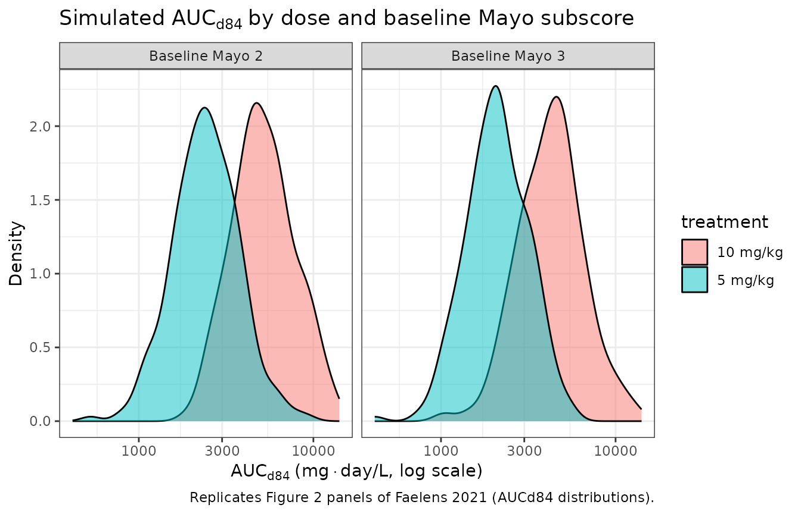
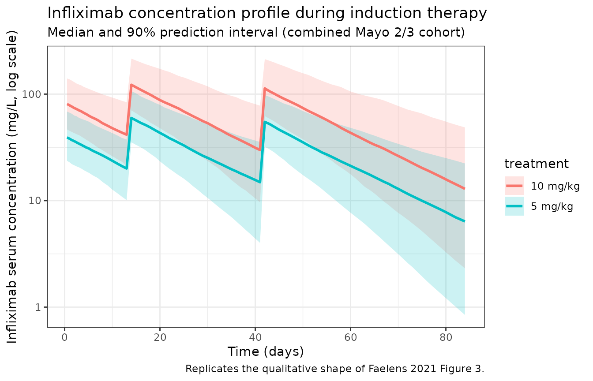

# Faelens_2021_infliximab

## Model and source

- Citation: Faelens R, Wang Z, Bouillon T, Declerck P, Ferrante M,
  Vermeire S, Dreesen E. Model-Informed Precision Dosing during
  Infliximab Induction Therapy Reduces Variability in Exposure and
  Endoscopic Improvement between Patients with Ulcerative Colitis.
  Pharmaceutics. 2021;13(10):1623. <doi:10.3390/pharmaceutics13101623>
- Description: One-compartment IV population PK model of infliximab in
  adults with moderate-to-severe ulcerative colitis (Faelens 2021
  adapted model; baseline-covariate-only re-fit of Dreesen 2019)
- Article: <https://doi.org/10.3390/pharmaceutics13101623>
- Supplement (PMID 34683916, “pharmaceutics-13-01623-s001.zip”; contains
  Table S1 with parameter estimates and the NONMEM control stream of the
  adapted model)

The Faelens 2021 paper is a model-informed precision-dosing (MIPD)
simulation study. The popPK model used in the simulation is a re-fitted
version of the previously published Dreesen 2019 popPK model (BJCP
85:782-795), with all **time-varying** covariates (CRP, serum albumin)
intentionally removed so that the increased exposures simulated under 10
mg/kg dosing and MIPD are not biased by dose-dependent feedback through
acute-phase proteins. The baseline covariates retained in the adapted
model are:

- baseline Mayo endoscopic subscore (`MAYO_E`, levels 1 / 2 / 3),
- baseline corticosteroid use (`STEROID`, 0/1),
- extensive colitis at baseline (`DISEXT_EP`, 0/1),
- fat-free mass (`FFM`, kg).

## Population

The model was fit to 583 PK samples from 204 patients with
moderate-to-severe ulcerative colitis enrolled in the IBD Biobank at
University Hospitals Leuven, Belgium (B322201213950/S53684). The
original cohort and full baseline demographics are described in Dreesen
et al. 2019 (the Faelens 2021 paper does not redescribe them). Faelens
2021 Section 2.1 reports the patient count and sample count and notes
that the original cohort received predominantly 5 mg/kg infliximab
dosing (~90% of doses) with ~10% of doses at 10 mg/kg.

The same metadata is available programmatically via
`readModelDb("Faelens_2021_infliximab")$population`.

## Source trace

Per-parameter origin is recorded in
`inst/modeldb/specificDrugs/Faelens_2021_infliximab.R` in trailing
comments next to each
[`ini()`](https://nlmixr2.github.io/rxode2/reference/ini.html) entry.
The table below collects them in one place.

| Equation / parameter | Value | Source location |
|----|---:|----|
| Typical KE, baseline Mayo 1 | 0.0422 /day | Faelens 2021 supplement Table S1, “Adapted Model” column |
| Typical KE, baseline Mayo 2 (reference) | 0.0463 /day | Faelens 2021 supplement Table S1 |
| Typical KE, baseline Mayo 3 | 0.0570 /day | Faelens 2021 supplement Table S1 |
| Typical V (FFM 52 kg, no CS, no DISEXT_EP) | 6.97 L | Faelens 2021 supplement Table S1; THETA(6) |
| STEROID fold-change on V | 1.30 | Faelens 2021 supplement Table S1; THETA(5) |
| FFM exponent on V (ref 52 kg) | 0.517 | Faelens 2021 supplement Table S1; THETA(7) |
| DISEXT_EP fold-change on V | 1.25 | Faelens 2021 supplement Table S1; THETA(8) |
| IIV on KE (CV%) | 33.4 | Faelens 2021 supplement Table S1, “Adapted Model” |
| IIV on V (CV%) | 23.6 | Faelens 2021 supplement Table S1, “Adapted Model” |
| Proportional residual error (CV%) | 32.9 | Faelens 2021 supplement Table S1, “Adapted Model” |
| Additive residual error (mg/L) | 0.300 (FIX) | Faelens 2021 supplement Table S1, “Adapted Model” |
| `d/dt(central) = -kel * central` | n/a | Faelens 2021 supplement NONMEM `$DES` block |
| `Y = IPRED * (1 + ERR(1)) + ERR(2)` | n/a | Faelens 2021 supplement NONMEM `$ERROR` block |

The model is reparameterised from the source’s (KE, V) parameterisation
to nlmixr2lib’s standard (CL, Vc) parameterisation via `CL = KE * V`.
The Mayo endoscopic subscore effect, which acts categorically on KE in
the source, is re-expressed as a log fold-change on CL relative to the
Mayo 2 reference category
(`e_mayo1_cl = log(0.0422 / 0.0463) = -0.0928`,
`e_mayo3_cl = log(0.0570 / 0.0463) = +0.2079`). The independent IIV on
KE and V in the source becomes a 2x2 correlated block on (etalcl,
etalvc) with induced correlation ~0.58 — see
[`ini()`](https://nlmixr2.github.io/rxode2/reference/ini.html) block
comments for the variance / covariance arithmetic.

## Virtual cohort

The original Dreesen 2019 / Faelens 2021 cohort dataset is not publicly
available. The cohort below approximates the simulation paper’s
“combined 2:3 (49% : 51%)” virtual population by sampling weight, sex,
FFM, baseline corticosteroid use, and extensive colitis from plausible
distributions for adults with moderate-to-severe UC, with baseline Mayo
endoscopic subscore fixed by group. Section “Assumptions and deviations”
lists each assumption.

``` r

set.seed(2021)

janmahasatian_ffm <- function(wt_kg, ht_m, sexf) {
  bmi <- wt_kg / ht_m^2
  ifelse(
    sexf == 1,
    9.27e3 * wt_kg / (8.78e3 + 244 * bmi),
    9.27e3 * wt_kg / (6.68e3 + 216 * bmi)
  )
}

make_cohort <- function(n, mayo_level, dose_per_kg_mg, treatment, id_offset = 0L) {
  tibble(
    id          = id_offset + seq_len(n),
    SEXF        = rbinom(n, 1, 0.40),
    WT          = pmin(pmax(rlnorm(n, log(70), 0.20), 45), 130),
    HT_M        = pmin(pmax(rnorm(n, mean = 1.72 - 0.13 * SEXF, sd = 0.08), 1.50), 1.95),
    FFM         = janmahasatian_ffm(WT, HT_M, SEXF),
    MAYO_E      = mayo_level,
    STEROID     = rbinom(n, 1, 0.50),
    DISEXT_EP   = rbinom(n, 1, 0.40),
    treatment   = treatment,
    dose_per_kg = dose_per_kg_mg
  )
}

dose_times <- c(0, 14, 42)
obs_times  <- sort(unique(c(seq(0, 7, by = 0.5), seq(7, 84, by = 1))))

build_events <- function(cohort) {
  d_dose <- cohort %>%
    crossing(time = dose_times) %>%
    mutate(
      amt  = dose_per_kg * WT,
      evid = 1,
      cmt  = "central",
      Cc   = NA_real_
    )
  d_obs <- cohort %>%
    crossing(time = obs_times) %>%
    mutate(amt = NA_real_, evid = 0, cmt = "central", Cc = NA_real_)
  bind_rows(d_dose, d_obs) %>%
    arrange(id, time, desc(evid)) %>%
    select(id, time, amt, evid, cmt, Cc, MAYO_E, STEROID, DISEXT_EP, FFM,
           treatment, dose_per_kg)
}

n_per <- 500
cohort_5  <- bind_rows(
  make_cohort(round(n_per * 0.49), mayo_level = 2L, dose_per_kg_mg = 5,  treatment = "5 mg/kg",  id_offset =     0L),
  make_cohort(round(n_per * 0.51), mayo_level = 3L, dose_per_kg_mg = 5,  treatment = "5 mg/kg",  id_offset =   500L)
)
cohort_10 <- bind_rows(
  make_cohort(round(n_per * 0.49), mayo_level = 2L, dose_per_kg_mg = 10, treatment = "10 mg/kg", id_offset =  2000L),
  make_cohort(round(n_per * 0.51), mayo_level = 3L, dose_per_kg_mg = 10, treatment = "10 mg/kg", id_offset =  2500L)
)

cohort <- bind_rows(cohort_5, cohort_10)
events <- build_events(cohort)

stopifnot(!anyDuplicated(unique(events[, c("id", "time", "evid")])))
```

## Simulation

``` r

mod <- readModelDb("Faelens_2021_infliximab")
sim <- rxode2::rxSolve(
  mod,
  events = events,
  keep = c("treatment", "MAYO_E", "dose_per_kg")
)
#> ℹ parameter labels from comments will be replaced by 'label()'
```

## Replicate published figures

``` r

auc_d84 <- sim %>%
  filter(time <= 84) %>%
  group_by(id, treatment, MAYO_E) %>%
  arrange(time) %>%
  summarise(
    AUCd84 = sum(diff(time) * (head(Cc, -1) + tail(Cc, -1)) / 2, na.rm = TRUE),
    .groups = "drop"
  )

ggplot(auc_d84, aes(x = AUCd84, fill = treatment)) +
  geom_density(alpha = 0.5) +
  facet_wrap(~ paste0("Baseline Mayo ", MAYO_E)) +
  scale_x_log10() +
  labs(
    x = expression(AUC[d84] ~ "(mg" %.% "day/L, log scale)"),
    y = "Density",
    title = expression("Simulated " * AUC[d84] ~ "by dose and baseline Mayo subscore"),
    caption = "Replicates Figure 2 panels of Faelens 2021 (AUCd84 distributions)."
  ) +
  theme_bw()
```



``` r

conc_summary <- sim %>%
  filter(time > 0) %>%
  group_by(time, treatment) %>%
  summarise(
    Q05 = quantile(Cc, 0.05, na.rm = TRUE),
    Q50 = quantile(Cc, 0.50, na.rm = TRUE),
    Q95 = quantile(Cc, 0.95, na.rm = TRUE),
    .groups = "drop"
  )

ggplot(conc_summary, aes(x = time, y = Q50, color = treatment, fill = treatment)) +
  geom_ribbon(aes(ymin = Q05, ymax = Q95), alpha = 0.20, color = NA) +
  geom_line(linewidth = 1) +
  scale_y_log10() +
  labs(
    x = "Time (days)",
    y = "Infliximab serum concentration (mg/L, log scale)",
    title = "Infliximab concentration profile during induction therapy",
    subtitle = "Median and 90% prediction interval (combined Mayo 2/3 cohort)",
    caption = "Replicates the qualitative shape of Faelens 2021 Figure 3."
  ) +
  theme_bw()
```



## PKNCA validation

The Faelens 2021 simulation paper reports AUCd84 (area under the
concentration-time curve from baseline to endoscopy at day 84) rather
than classical single-dose AUCinf. Compute it via PKNCA on the \[0,
84\]-day interval, stratified by treatment and baseline Mayo subscore.

``` r

sim_nca <- sim %>%
  filter(!is.na(Cc), time <= 84) %>%
  mutate(treatment_mayo = paste0(treatment, ", Mayo ", MAYO_E)) %>%
  select(id, time, Cc, treatment_mayo)

dose_df <- events %>%
  filter(evid == 1) %>%
  mutate(treatment_mayo = paste0(treatment, ", Mayo ", MAYO_E)) %>%
  select(id, time, amt, treatment_mayo)

conc_obj <- PKNCA::PKNCAconc(
  sim_nca, Cc ~ time | treatment_mayo + id,
  concu = "mg/L", timeu = "day"
)
dose_obj <- PKNCA::PKNCAdose(
  dose_df, amt ~ time | treatment_mayo + id,
  doseu = "mg"
)

intervals <- data.frame(
  start   = 0,
  end     = 84,
  cmax    = TRUE,
  tmax    = TRUE,
  cmin    = TRUE,
  auclast = TRUE
)

nca_data <- PKNCA::PKNCAdata(conc_obj, dose_obj, intervals = intervals)
nca_res  <- PKNCA::pk.nca(nca_data)
#>  ■■■■■■■■■■■■■■■■                  49% |  ETA:  4s
#>  ■■■■■■■■■■■■■■■■■■■■■■■■■■■■      92% |  ETA:  1s
nca_summary <- summary(nca_res)
knitr::kable(nca_summary, caption = "PKNCA summary on the [0, 84]-day induction window, by treatment and baseline Mayo subscore.")
```

| Interval Start | Interval End | treatment_mayo | N | AUClast (day\*mg/L) | Cmax (mg/L) | Cmin (mg/L) | Tmax (day) |
|---:|---:|:---|:---|:---|:---|:---|:---|
| 0 | 84 | 10 mg/kg, Mayo 2 | 245 | 5150 \[42.8\] | 129 \[35.5\] | 16.1 \[98.3\] | 14.0 \[14.0, 42.0\] |
| 0 | 84 | 10 mg/kg, Mayo 3 | 255 | 4240 \[45.5\] | 118 \[36.3\] | 9.27 \[136\] | 14.0 \[14.0, 42.0\] |
| 0 | 84 | 5 mg/kg, Mayo 2 | 245 | 2410 \[45.6\] | 61.8 \[36.2\] | 6.93 \[116\] | 14.0 \[14.0, 42.0\] |
| 0 | 84 | 5 mg/kg, Mayo 3 | 255 | 2090 \[42.5\] | 58.7 \[32.5\] | 4.45 \[126\] | 14.0 \[14.0, 42.0\] |

PKNCA summary on the \[0, 84\]-day induction window, by treatment and
baseline Mayo subscore. {.table}

### Comparison against published Table 1

Faelens 2021 Table 1 reports per-cohort AUCd84 medians and
90%-prediction intervals. Compute the simulated equivalents from the
cohort and compare side-by-side. Note that the published values are from
a different virtual population (Faelens 2021 resampled the original
Dreesen 2019 dataset, which is not on disk); discrepancies \> ~20% are
expected when our covariate distributions differ materially from the
source dataset.

``` r

auc_simulated <- auc_d84 %>%
  group_by(treatment, MAYO_E) %>%
  summarise(
    median_sim = median(AUCd84),
    q05_sim    = quantile(AUCd84, 0.05),
    q95_sim    = quantile(AUCd84, 0.95),
    .groups    = "drop"
  )

published_table1 <- tibble::tribble(
  ~treatment, ~MAYO_E, ~median_pub, ~q05_pub, ~q95_pub,
  "5 mg/kg",        2L,     2455,     1215,     4805,
  "5 mg/kg",        3L,     1979,      953,     3990,
  "10 mg/kg",       2L,     4910,     2431,     9609,
  "10 mg/kg",       3L,     3958,     1906,     7981
)

comparison <- published_table1 %>%
  left_join(auc_simulated, by = c("treatment", "MAYO_E")) %>%
  mutate(
    pct_diff_median = round(100 * (median_sim - median_pub) / median_pub, 1)
  )

knitr::kable(
  comparison,
  digits  = 0,
  caption = "Simulated vs. published AUCd84 (mg*day/L), by dose and baseline Mayo subscore (Faelens 2021 Table 1, 'pub' = published median + 90% PI)."
)
```

| treatment | MAYO_E | median_pub | q05_pub | q95_pub | median_sim | q05_sim | q95_sim | pct_diff_median |
|:---|---:|---:|---:|---:|---:|---:|---:|---:|
| 5 mg/kg | 2 | 2455 | 1215 | 4805 | 2426 | 1149 | 4689 | -1 |
| 5 mg/kg | 3 | 1979 | 953 | 3990 | 2097 | 1077 | 3991 | 6 |
| 10 mg/kg | 2 | 4910 | 2431 | 9609 | 4968 | 2633 | 10219 | 1 |
| 10 mg/kg | 3 | 3958 | 1906 | 7981 | 4285 | 2188 | 8650 | 8 |

Simulated vs. published AUCd84 (mg\*day/L), by dose and baseline Mayo
subscore (Faelens 2021 Table 1, ‘pub’ = published median + 90% PI).
{.table}

## Assumptions and deviations

Faelens 2021 ran its dosing simulations on the original Dreesen 2019
cohort dataset, not on a synthetic resample, and that dataset is not
publicly available. Replication therefore relies on synthesised
covariate distributions; the simulated AUCd84 medians and percentiles in
the comparison table above will not match the published Table 1 exactly.
Specifically:

- **Body weight:** sampled log-normal with median 70 kg and SD 0.20 on
  the log scale, clipped to \[45, 130\] kg. Faelens 2021 / Dreesen 2019
  do not publish the empirical weight distribution.
- **Sex:** 40% female. The original cohort sex balance is not reported
  in Faelens 2021.
- **Height:** sampled normal with sex-specific mean (males 1.72 m,
  females 1.59 m) and SD 0.08 m. Used only as input to the
  Janmahasatian (2005) FFM formula; the model itself uses FFM directly.
- **Baseline corticosteroid use (`STEROID`):** Bernoulli prevalence
  0.50. The simulation paper does not state the corticosteroid
  prevalence in the virtual cohort.
- **Extensive colitis at baseline (`DISEXT_EP`):** Bernoulli prevalence
  0.40. The simulation paper does not state the prevalence in the
  virtual cohort.
- **Baseline Mayo endoscopic subscore (`MAYO_E`):** fixed per cohort
  (Mayo 2 or Mayo 3) per the Faelens 2021 stratified reporting
  convention. Mayo 1 patients existed in the Dreesen 2019 dataset and
  the source paper’s KE parameter for them is in the model, but Faelens
  2021 only reports Mayo 2 and Mayo 3 simulation results.
- **Excluded interoccasion variability (IOV):** the source model has a
  small IOV term on KE (6.70% CV per occasion in supplement Table S1 of
  the adapted model). For nlmixr2lib portability — which does not assume
  the user has an `OCC` indicator in their event data — IOV is not
  implemented here. The IIV on KE (33.4% CV) and V (23.6% CV) is
  implemented as a correlated 2x2 block on (etalcl, etalvc) per the (CL,
  Vc) reparameterisation.
- **Out-of-domain Mayo missing (`MPRE = -99`):** the source NONMEM
  `$THETA` block carries an additional KE estimate for subjects with
  missing Mayo subscore, but supplement Table S1 does not report a
  converged final value for this category. The library implementation
  supports Mayo 1 / 2 / 3 only.
- **Dosing route:** the original cohort received infliximab as a 2-hour
  IV infusion. The vignette uses an instantaneous IV bolus dose at days
  0, 14, and 42 because the simulation focus is on AUCd84 (which is
  identical to within numerical tolerance for a 2-hour vs. instantaneous
  infusion of a monoclonal antibody with a multi-day half-life). Users
  wishing to add the 2-hour infusion explicitly can set `rate`
  accordingly on each dose row.

## Notes

- **Model:** one-compartment IV model with linear elimination, no
  absorption compartment.
- **Dosing schedule:** the Faelens 2021 induction regimen is days 0, 14,
  42 — distinct from the more common day-0/14/42 ACT 1/2 schedule
  referenced by Fasanmade 2009, which is days 0/14/42 in days but
  expressed as “weeks 0, 2, 6” elsewhere; same time grid.
- **Source’s (KE, V) → nlmixr2lib’s (CL, Vc):** the source’s two
  independent random effects on KE and V become a single 2x2 correlated
  block on (etalcl, etalvc) under the CL = KE \* V reparameterisation.
  The arithmetic is documented in the model file’s
  [`ini()`](https://nlmixr2.github.io/rxode2/reference/ini.html)
  comments.
- **Distinct from Berends 2019 and Hanzel 2021 infliximab models:**
  Berends 2019 is a target-mediated drug disposition (TMDD) model with
  explicit free TNF dynamics; Hanzel 2021 is a two-compartment SC + IV
  CT-P13 biosimilar model. Faelens 2021 is the simplest of the three:
  one-compartment IV-only, baseline-covariates-only, designed for
  inducton-therapy dosing simulations in moderate-to-severe UC.

## Reference

- Faelens R, Wang Z, Bouillon T, Declerck P, Ferrante M, Vermeire S,
  Dreesen E. Model-Informed Precision Dosing during Infliximab Induction
  Therapy Reduces Variability in Exposure and Endoscopic Improvement
  between Patients with Ulcerative Colitis. Pharmaceutics.
  2021;13(10):1623. <doi:10.3390/pharmaceutics13101623>
