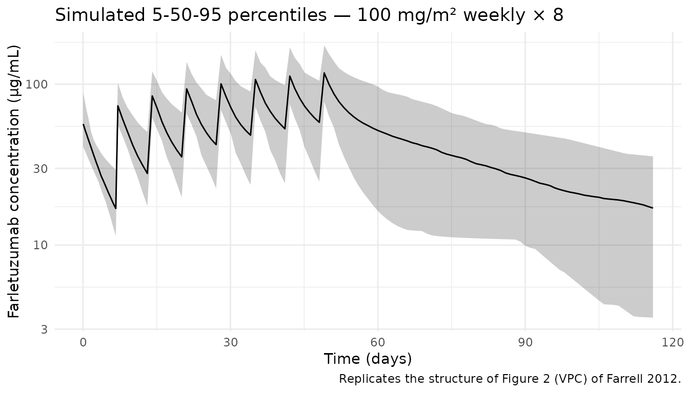
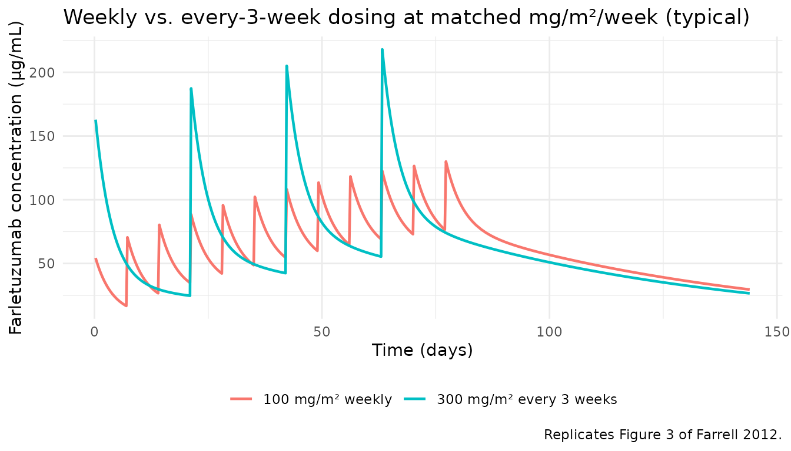

# Farrell_2012_farletuzumab

## Model and source

- Citation: Farrell C, Schweizer C, Wustner J, Weil S, Namiki M, Nakano
  T, Nakai K, Phillips MD. Population pharmacokinetics of farletuzumab,
  a humanized monoclonal antibody against folate receptor alpha, in
  epithelial ovarian cancer. Cancer Chemother Pharmacol.
  2012;70(5):727-734. <doi:10.1007/s00280-012-1959-y>
- Description: Two-compartment population PK model for farletuzumab
  (humanized IgG1 anti-folate-receptor-alpha monoclonal antibody) with
  first-order linear elimination after IV infusion in women with
  advanced epithelial ovarian cancer (Farrell 2012).
- Article: [Cancer Chemother Pharmacol.
  2012;70(5):727-734](https://doi.org/10.1007/s00280-012-1959-y)

## Population

The analysis pooled 79 women with advanced epithelial ovarian, fallopian
tube, or primary peritoneal cancer from two clinical trials (Farrell
2012 Table 1): the Phase I study MORAb-003-001 (n = 25, weekly IV
farletuzumab at ascending 12.5–400 mg/m² for 4 weeks after relapse from
standard chemotherapy) and the Phase II study MORAb-003-002 (n = 54,
relapsed platinum-sensitive disease; 37.5, 62.5, or 100 mg/m² weekly,
with a majority at 100 mg/m² and combination chemotherapy arms that
later transitioned back to monotherapy). Patients were 31–81 years old
(median 61); body weight ranged 44.5–118.2 kg (median 66.2); reported
race was predominantly Caucasian (~77%) with smaller Asian, Hispanic,
Black, and Other groups. Farletuzumab was given as a 1 mg/min infusion
advanced to 5 mg/min if tolerated.

The same information is available programmatically via
`readModelDb("Farrell_2012_farletuzumab")$population`.

## Source trace

Per-parameter origin is recorded as an in-file comment next to each
[`ini()`](https://nlmixr2.github.io/rxode2/reference/ini.html) entry in
`inst/modeldb/specificDrugs/Farrell_2012_farletuzumab.R`. The table
below collects them for review.

| Equation / parameter                                                                 | Value                     | Source location                                                                                                                                          |
|--------------------------------------------------------------------------------------|---------------------------|----------------------------------------------------------------------------------------------------------------------------------------------------------|
| Structure: two-compartment, first-order (linear) elimination, IV infusion            | n/a                       | p. 729 Results, “Combined data from both studies were best described by a two-compartment model with first-order (linear, dose-independent) elimination” |
| Covariate form (power): `TVP = θ1 × (COV / COV_ST)^θ2`, `COV_ST` = population median | n/a                       | p. 729 Methods, Eq. `TVP_i = θ1 × (COV_i / COV_ST)^θ2`                                                                                                   |
| Exclusion of 169 observations at 12.5 and 25 mg/m² doses for final model             | n/a                       | p. 730 Results, first paragraph of “Population pharmacokinetic model”                                                                                    |
| `lcl` — CL                                                                           | `log(0.00784)` L/h        | Table 3: CL = 0.00784 L/h (5.79% RSE)                                                                                                                    |
| `lvc` — Vc                                                                           | `log(3.00)` L             | Table 3: Vc = 3.00 L (5.20% RSE)                                                                                                                         |
| `lq` — Q                                                                             | `log(0.0203)` L/h         | Table 3: Q = 0.0203 L/h (4.46% RSE)                                                                                                                      |
| `lvp` — Vp                                                                           | `log(7.50)` L             | Table 3: Vp = 7.50 L (20.30% RSE)                                                                                                                        |
| `e_wt_cl` — WT power on CL                                                           | `0.715`                   | Table 3: CL ~ WT = 0.715 (35.2% RSE)                                                                                                                     |
| `e_wt_vc` — WT power on Vc                                                           | `0.629`                   | Table 3: Vc ~ WT = 0.629 (30.2% RSE)                                                                                                                     |
| Reference weight                                                                     | `66.2 kg`                 | Table 1 overall median body weight                                                                                                                       |
| `etalcl` ω²(CL)                                                                      | `0.0616`                  | Table 3: ω² CL = 0.0616, % CV 24.8                                                                                                                       |
| `etalvc` ω²(Vc)                                                                      | `0.0470`                  | Table 3: ω² Vc = 0.0470, % CV 21.7                                                                                                                       |
| `etalvp` ω²(Vp)                                                                      | `1.180`                   | Table 3: ω² Vp = 1.180, % CV 109                                                                                                                         |
| `propSdPh1` — Phase I proportional SD                                                | `sqrt(0.0420) = 0.205`    | Table 3 Phase I: σ² proportional = 0.0420 (20.5% CV)                                                                                                     |
| `propSdPh2` — Phase II proportional SD                                               | `sqrt(0.122) = 0.349`     | Table 3 Phase II: σ² proportional = 0.122 (34.9% CV)                                                                                                     |
| `addSdPh2` — Phase II additive SD                                                    | `sqrt(63.0) = 7.94 µg/mL` | Table 3 Phase II: σ² additive = 63.0 (SD column = 7.94 µg/mL)                                                                                            |
| Phase I additive SD fixed to 0                                                       | `0`                       | Table 3 Phase I: σ² additive = 0 (fixed)                                                                                                                 |

## Virtual cohort

Original observed data are not publicly available. The cohort below
approximates the Table 1 overall demographics: body weights in the
44.5–118.2 kg range drawn from a truncated distribution around the 66.2
kg median, and every patient assigned `PHASE2 = 1` (Phase II residual
error — the larger study and the one with combined additive +
proportional error). Dosing is 100 mg/m² weekly IV infusion over 1 hour
for 8 weeks, matching the primary Phase II dosing schedule.

``` r
set.seed(20260421)
n_subj <- 100

# Truncated approximation of the Table 1 overall weight distribution:
# median 66.2, range 44.5–118.2. Use a log-normal-like sample then clip.
wt_draws <- pmin(pmax(exp(rnorm(n_subj, mean = log(66.2), sd = 0.18)), 44.5), 118.2)
# BSA derived by DuBois from weight assuming 163 cm mean height (clipped 1.37–2.24
# to match Table 1): BSA = 0.007184 * (wt^0.425) * (height_cm^0.725).
bsa_draws <- pmin(pmax(0.007184 * wt_draws^0.425 * 163^0.725, 1.37), 2.24)

cohort <- tibble::tibble(
  id = seq_len(n_subj),
  WT = wt_draws,
  BSA = bsa_draws,
  PHASE2 = 1L,
  dose_mgm2 = 100,
  dose_mg = 100 * bsa_draws  # mg/m^2 x m^2 = mg
)
cohort$treatment <- "100 mg/m2 weekly"
```

``` r
# Build event table: 8 weekly 1-hour IV infusions + dense sampling for NCA.
tau <- 24 * 7  # one week in hours
n_doses <- 8
dose_times <- seq(0, by = tau, length.out = n_doses)

doses <- cohort |>
  tidyr::crossing(time = dose_times) |>
  dplyr::mutate(
    amt = dose_mg,
    rate = dose_mg,      # 1-hour infusion => rate = dose (mg/h)
    cmt = "central",
    evid = 1L
  ) |>
  dplyr::select(id, time, amt, rate, cmt, evid, WT, PHASE2, treatment)

# Observation grid: dense during the first week, then per-week troughs, and
# one long post-last-dose tail for terminal-phase characterization.
obs_times <- sort(unique(c(
  seq(0, 24, by = 1),                  # first day, hourly
  seq(28, 168, by = 12),               # rest of week 1, 12-hourly
  seq(170, 8 * tau - 1, by = 24),      # dose interval troughs
  seq(8 * tau, 8 * tau + 60 * 24, by = 24)  # 60-day terminal tail
)))

obs <- cohort |>
  tidyr::crossing(time = obs_times) |>
  dplyr::mutate(amt = 0, rate = 0, cmt = NA_character_, evid = 0L) |>
  dplyr::select(id, time, amt, rate, cmt, evid, WT, PHASE2, treatment)

events <- dplyr::bind_rows(doses, obs) |>
  dplyr::arrange(id, time, dplyr::desc(evid))
```

## Simulation

``` r
mod <- rxode2::rxode2(readModelDb("Farrell_2012_farletuzumab"))
#> ℹ parameter labels from comments will be replaced by 'label()'

sim <- rxode2::rxSolve(
  mod,
  events = events,
  keep = c("WT", "PHASE2", "treatment")
)
```

Typical-value replication (zeroing the between-subject variability) is
useful for a “central” prediction curve that does not carry the wide Vp
IIV:

``` r
mod_typical <- mod |> rxode2::zeroRe()
#> Warning: No sigma parameters in the model

typical_cohort <- tibble::tibble(
  id = 1L, WT = 66.2, PHASE2 = 1L, treatment = "100 mg/m2 weekly (typical)"
)

typical_doses <- typical_cohort |>
  tidyr::crossing(time = dose_times) |>
  dplyr::mutate(amt = 170, rate = 170, cmt = "central", evid = 1L) |>
  dplyr::select(id, time, amt, rate, cmt, evid, WT, PHASE2, treatment)

typical_obs <- typical_cohort |>
  tidyr::crossing(time = obs_times) |>
  dplyr::mutate(amt = 0, rate = 0, cmt = NA_character_, evid = 0L) |>
  dplyr::select(id, time, amt, rate, cmt, evid, WT, PHASE2, treatment)

typical_events <- dplyr::bind_rows(typical_doses, typical_obs) |>
  dplyr::arrange(id, time, dplyr::desc(evid))

sim_typical <- rxode2::rxSolve(
  mod_typical, events = typical_events, keep = c("WT", "PHASE2", "treatment")
)
#> ℹ omega/sigma items treated as zero: 'etalcl', 'etalvc', 'etalvp'
```

## Replicate published figures

### Figure 2 — VPC of concentration-time profile

Farrell 2012 Figure 2 is a visual predictive check for the final model
against the observed data. A five-fifty-ninety-five percentile summary
of the simulated cohort over the weekly dosing interval and the
post-last-dose terminal phase captures the same structural features
(peak near end of infusion, slow biexponential decline).

``` r
sim |>
  dplyr::filter(!is.na(Cc), time > 0) |>
  dplyr::mutate(day = time / 24) |>
  dplyr::group_by(day) |>
  dplyr::summarise(
    Q05 = quantile(Cc, 0.05),
    Q50 = quantile(Cc, 0.50),
    Q95 = quantile(Cc, 0.95),
    .groups = "drop"
  ) |>
  ggplot(aes(day, Q50)) +
  geom_ribbon(aes(ymin = Q05, ymax = Q95), alpha = 0.25) +
  geom_line() +
  scale_y_log10() +
  labs(
    x = "Time (days)", y = "Farletuzumab concentration (µg/mL)",
    title = "Simulated 5-50-95 percentiles — 100 mg/m² weekly × 8",
    caption = "Replicates the structure of Figure 2 (VPC) of Farrell 2012."
  ) +
  theme_minimal()
```



### Figure 3 — weekly vs. 3-weekly dosing at matched mg/kg/week

Farrell 2012 Figure 3 shows that steady-state exposure is similar with
weekly vs. 3-weekly dosing when the weekly-equivalent mg/kg dose is
maintained. The block below reproduces that comparison using
typical-value predictions.

``` r
wt_ref <- 66.2
bsa_ref <- 0.007184 * wt_ref^0.425 * 163^0.725  # ~1.70 m^2

weekly_mg  <- 100 * bsa_ref                      # 100 mg/m^2 weekly
q3w_mg     <- 3 * weekly_mg                      # same mg/kg/week, given every 3 weeks

tau_w  <- 24 * 7
tau_q3 <- 24 * 21

make_regimen <- function(amt, tau, n_doses, label) {
  dt <- seq(0, by = tau, length.out = n_doses)
  obs_t <- sort(unique(c(
    seq(0, max(dt) + tau, by = 6),
    seq(max(dt) + tau, max(dt) + tau + 60 * 24, by = 24)
  )))
  dplyr::bind_rows(
    tibble::tibble(id = 1L, time = dt,   amt = amt, rate = amt,
      cmt = "central", evid = 1L, WT = wt_ref, PHASE2 = 1L, treatment = label),
    tibble::tibble(id = 1L, time = obs_t, amt = 0, rate = 0,
      cmt = NA_character_, evid = 0L, WT = wt_ref, PHASE2 = 1L, treatment = label)
  ) |> dplyr::arrange(time, dplyr::desc(evid))
}

ev_weekly <- make_regimen(weekly_mg, tau_w,  12, "100 mg/m² weekly")
ev_q3w    <- make_regimen(q3w_mg,    tau_q3,  4, "300 mg/m² every 3 weeks")

regimen_events <- dplyr::bind_rows(
  ev_weekly,
  ev_q3w |> dplyr::mutate(id = 2L)
)

sim_regimens <- rxode2::rxSolve(
  mod_typical, events = regimen_events, keep = c("WT", "PHASE2", "treatment")
)
#> ℹ omega/sigma items treated as zero: 'etalcl', 'etalvc', 'etalvp'
#> Warning: multi-subject simulation without without 'omega'

sim_regimens |>
  dplyr::filter(!is.na(Cc), time > 0) |>
  dplyr::mutate(day = time / 24) |>
  ggplot(aes(day, Cc, colour = treatment)) +
  geom_line(linewidth = 0.8) +
  labs(
    x = "Time (days)", y = "Farletuzumab concentration (µg/mL)",
    colour = NULL,
    title = "Weekly vs. every-3-week dosing at matched mg/m²/week (typical)",
    caption = "Replicates Figure 3 of Farrell 2012."
  ) +
  theme_minimal() +
  theme(legend.position = "bottom")
```



## PKNCA validation

Compute Cmax, Tmax, AUC(0-τ) (one-week interval after the first dose),
and the terminal half-life using PKNCA. The terminal half-life is
estimated from the 60-day post-last-dose tail, where the β-phase
dominates.

``` r
sim_nca <- sim |>
  dplyr::filter(!is.na(Cc), time > 0) |>
  dplyr::select(id, time, Cc, treatment)

conc_obj <- PKNCA::PKNCAconc(sim_nca, Cc ~ time | treatment + id)

dose_df <- events |>
  dplyr::filter(evid == 1) |>
  dplyr::select(id, time, amt, treatment)

dose_obj <- PKNCA::PKNCAdose(dose_df, amt ~ time | treatment + id)

# After-first-dose NCA over tau = 1 week, plus terminal-phase half-life over
# the 60-day post-last-dose tail.
start_last <- max(dose_df$time)  # last dose time
intervals <- data.frame(
  start      = c(0,   start_last + 1,    start_last + 1),
  end        = c(tau, start_last + tau,  start_last + 60 * 24),
  cmax       = c(TRUE,  TRUE,  FALSE),
  tmax       = c(TRUE,  TRUE,  FALSE),
  auclast    = c(TRUE,  TRUE,  FALSE),
  ctrough    = c(TRUE,  TRUE,  FALSE),
  cmin       = c(FALSE, TRUE,  FALSE),
  half.life  = c(FALSE, FALSE, TRUE)
)

nca_res <- PKNCA::pk.nca(PKNCA::PKNCAdata(conc_obj, dose_obj, intervals = intervals))
#> Warning: Requesting an AUC range starting (0) before the first measurement (1) is not allowed
#> Requesting an AUC range starting (0) before the first measurement (1) is not allowed
#> Requesting an AUC range starting (0) before the first measurement (1) is not allowed
#> Requesting an AUC range starting (0) before the first measurement (1) is not allowed
#> Requesting an AUC range starting (0) before the first measurement (1) is not allowed
#> Requesting an AUC range starting (0) before the first measurement (1) is not allowed
#> Requesting an AUC range starting (0) before the first measurement (1) is not allowed
#> Requesting an AUC range starting (0) before the first measurement (1) is not allowed
#> Requesting an AUC range starting (0) before the first measurement (1) is not allowed
#> Requesting an AUC range starting (0) before the first measurement (1) is not allowed
#> Requesting an AUC range starting (0) before the first measurement (1) is not allowed
#> Requesting an AUC range starting (0) before the first measurement (1) is not allowed
#> Requesting an AUC range starting (0) before the first measurement (1) is not allowed
#> Requesting an AUC range starting (0) before the first measurement (1) is not allowed
#> Requesting an AUC range starting (0) before the first measurement (1) is not allowed
#> Requesting an AUC range starting (0) before the first measurement (1) is not allowed
#> Requesting an AUC range starting (0) before the first measurement (1) is not allowed
#> Requesting an AUC range starting (0) before the first measurement (1) is not allowed
#> Requesting an AUC range starting (0) before the first measurement (1) is not allowed
#> Requesting an AUC range starting (0) before the first measurement (1) is not allowed
#> Requesting an AUC range starting (0) before the first measurement (1) is not allowed
#> Requesting an AUC range starting (0) before the first measurement (1) is not allowed
#> Requesting an AUC range starting (0) before the first measurement (1) is not allowed
#> Requesting an AUC range starting (0) before the first measurement (1) is not allowed
#> Requesting an AUC range starting (0) before the first measurement (1) is not allowed
#> Requesting an AUC range starting (0) before the first measurement (1) is not allowed
#> Requesting an AUC range starting (0) before the first measurement (1) is not allowed
#> Requesting an AUC range starting (0) before the first measurement (1) is not allowed
#> Requesting an AUC range starting (0) before the first measurement (1) is not allowed
#> Requesting an AUC range starting (0) before the first measurement (1) is not allowed
#> Requesting an AUC range starting (0) before the first measurement (1) is not allowed
#> Requesting an AUC range starting (0) before the first measurement (1) is not allowed
#> Requesting an AUC range starting (0) before the first measurement (1) is not allowed
#> Requesting an AUC range starting (0) before the first measurement (1) is not allowed
#> Requesting an AUC range starting (0) before the first measurement (1) is not allowed
#> Requesting an AUC range starting (0) before the first measurement (1) is not allowed
#> Requesting an AUC range starting (0) before the first measurement (1) is not allowed
#> Requesting an AUC range starting (0) before the first measurement (1) is not allowed
#> Requesting an AUC range starting (0) before the first measurement (1) is not allowed
#> Requesting an AUC range starting (0) before the first measurement (1) is not allowed
#> Requesting an AUC range starting (0) before the first measurement (1) is not allowed
#> Requesting an AUC range starting (0) before the first measurement (1) is not allowed
#> Requesting an AUC range starting (0) before the first measurement (1) is not allowed
#> Requesting an AUC range starting (0) before the first measurement (1) is not allowed
#> Requesting an AUC range starting (0) before the first measurement (1) is not allowed
#> Requesting an AUC range starting (0) before the first measurement (1) is not allowed
#> Requesting an AUC range starting (0) before the first measurement (1) is not allowed
#> Requesting an AUC range starting (0) before the first measurement (1) is not allowed
#> Requesting an AUC range starting (0) before the first measurement (1) is not allowed
#> Requesting an AUC range starting (0) before the first measurement (1) is not allowed
#> Requesting an AUC range starting (0) before the first measurement (1) is not allowed
#> Requesting an AUC range starting (0) before the first measurement (1) is not allowed
#> Requesting an AUC range starting (0) before the first measurement (1) is not allowed
#> Requesting an AUC range starting (0) before the first measurement (1) is not allowed
#> Requesting an AUC range starting (0) before the first measurement (1) is not allowed
#> Requesting an AUC range starting (0) before the first measurement (1) is not allowed
#> Requesting an AUC range starting (0) before the first measurement (1) is not allowed
#> Requesting an AUC range starting (0) before the first measurement (1) is not allowed
#> Requesting an AUC range starting (0) before the first measurement (1) is not allowed
#> Requesting an AUC range starting (0) before the first measurement (1) is not allowed
#> Requesting an AUC range starting (0) before the first measurement (1) is not allowed
#> Requesting an AUC range starting (0) before the first measurement (1) is not allowed
#> Requesting an AUC range starting (0) before the first measurement (1) is not allowed
#> Requesting an AUC range starting (0) before the first measurement (1) is not allowed
#> Requesting an AUC range starting (0) before the first measurement (1) is not allowed
#> Requesting an AUC range starting (0) before the first measurement (1) is not allowed
#> Requesting an AUC range starting (0) before the first measurement (1) is not allowed
#> Requesting an AUC range starting (0) before the first measurement (1) is not allowed
#> Requesting an AUC range starting (0) before the first measurement (1) is not allowed
#> Requesting an AUC range starting (0) before the first measurement (1) is not allowed
#> Requesting an AUC range starting (0) before the first measurement (1) is not allowed
#> Requesting an AUC range starting (0) before the first measurement (1) is not allowed
#> Requesting an AUC range starting (0) before the first measurement (1) is not allowed
#> Requesting an AUC range starting (0) before the first measurement (1) is not allowed
#> Requesting an AUC range starting (0) before the first measurement (1) is not allowed
#> Requesting an AUC range starting (0) before the first measurement (1) is not allowed
#> Requesting an AUC range starting (0) before the first measurement (1) is not allowed
#> Requesting an AUC range starting (0) before the first measurement (1) is not allowed
#> Requesting an AUC range starting (0) before the first measurement (1) is not allowed
#> Requesting an AUC range starting (0) before the first measurement (1) is not allowed
#> Requesting an AUC range starting (0) before the first measurement (1) is not allowed
#> Requesting an AUC range starting (0) before the first measurement (1) is not allowed
#> Requesting an AUC range starting (0) before the first measurement (1) is not allowed
#> Requesting an AUC range starting (0) before the first measurement (1) is not allowed
#> Requesting an AUC range starting (0) before the first measurement (1) is not allowed
#> Requesting an AUC range starting (0) before the first measurement (1) is not allowed
#> Requesting an AUC range starting (0) before the first measurement (1) is not allowed
#> Requesting an AUC range starting (0) before the first measurement (1) is not allowed
#>  ■■■■■■■■■■■■■■                    44% |  ETA:  3s
#> Warning: Requesting an AUC range starting (0) before the first measurement (1) is not allowed
#> Requesting an AUC range starting (0) before the first measurement (1) is not allowed
#> Requesting an AUC range starting (0) before the first measurement (1) is not allowed
#> Requesting an AUC range starting (0) before the first measurement (1) is not allowed
#> Requesting an AUC range starting (0) before the first measurement (1) is not allowed
#> Requesting an AUC range starting (0) before the first measurement (1) is not allowed
#> Requesting an AUC range starting (0) before the first measurement (1) is not allowed
#> Requesting an AUC range starting (0) before the first measurement (1) is not allowed
#> Requesting an AUC range starting (0) before the first measurement (1) is not allowed
#> Requesting an AUC range starting (0) before the first measurement (1) is not allowed
#> Requesting an AUC range starting (0) before the first measurement (1) is not allowed
#> Requesting an AUC range starting (0) before the first measurement (1) is not allowed
#> Requesting an AUC range starting (0) before the first measurement (1) is not allowed
#> Requesting an AUC range starting (0) before the first measurement (1) is not allowed
#> Requesting an AUC range starting (0) before the first measurement (1) is not allowed
#> Requesting an AUC range starting (0) before the first measurement (1) is not allowed
#> Requesting an AUC range starting (0) before the first measurement (1) is not allowed
#> Requesting an AUC range starting (0) before the first measurement (1) is not allowed
#> Requesting an AUC range starting (0) before the first measurement (1) is not allowed
#> Requesting an AUC range starting (0) before the first measurement (1) is not allowed
#> Requesting an AUC range starting (0) before the first measurement (1) is not allowed
#> Requesting an AUC range starting (0) before the first measurement (1) is not allowed
#> Requesting an AUC range starting (0) before the first measurement (1) is not allowed
#> Requesting an AUC range starting (0) before the first measurement (1) is not allowed
#> Requesting an AUC range starting (0) before the first measurement (1) is not allowed
#> Requesting an AUC range starting (0) before the first measurement (1) is not allowed
#> Requesting an AUC range starting (0) before the first measurement (1) is not allowed
#> Requesting an AUC range starting (0) before the first measurement (1) is not allowed
#> Requesting an AUC range starting (0) before the first measurement (1) is not allowed
#> Requesting an AUC range starting (0) before the first measurement (1) is not allowed
#> Requesting an AUC range starting (0) before the first measurement (1) is not allowed
#> Requesting an AUC range starting (0) before the first measurement (1) is not allowed
#> Requesting an AUC range starting (0) before the first measurement (1) is not allowed
#> Requesting an AUC range starting (0) before the first measurement (1) is not allowed
#> Requesting an AUC range starting (0) before the first measurement (1) is not allowed
#> Requesting an AUC range starting (0) before the first measurement (1) is not allowed
#> Requesting an AUC range starting (0) before the first measurement (1) is not allowed
#> Requesting an AUC range starting (0) before the first measurement (1) is not allowed
#> Requesting an AUC range starting (0) before the first measurement (1) is not allowed
#> Requesting an AUC range starting (0) before the first measurement (1) is not allowed
#> Requesting an AUC range starting (0) before the first measurement (1) is not allowed
#> Requesting an AUC range starting (0) before the first measurement (1) is not allowed
#> Requesting an AUC range starting (0) before the first measurement (1) is not allowed
#> Requesting an AUC range starting (0) before the first measurement (1) is not allowed
#> Requesting an AUC range starting (0) before the first measurement (1) is not allowed
#> Requesting an AUC range starting (0) before the first measurement (1) is not allowed
#> Requesting an AUC range starting (0) before the first measurement (1) is not allowed
#> Requesting an AUC range starting (0) before the first measurement (1) is not allowed
#> Requesting an AUC range starting (0) before the first measurement (1) is not allowed
#> Requesting an AUC range starting (0) before the first measurement (1) is not allowed
#> Requesting an AUC range starting (0) before the first measurement (1) is not allowed
#> Requesting an AUC range starting (0) before the first measurement (1) is not allowed
#> Requesting an AUC range starting (0) before the first measurement (1) is not allowed
#> Requesting an AUC range starting (0) before the first measurement (1) is not allowed
#> Requesting an AUC range starting (0) before the first measurement (1) is not allowed
#> Requesting an AUC range starting (0) before the first measurement (1) is not allowed
#> Requesting an AUC range starting (0) before the first measurement (1) is not allowed
#> Requesting an AUC range starting (0) before the first measurement (1) is not allowed
#> Requesting an AUC range starting (0) before the first measurement (1) is not allowed
#> Requesting an AUC range starting (0) before the first measurement (1) is not allowed
#> Requesting an AUC range starting (0) before the first measurement (1) is not allowed
#> Requesting an AUC range starting (0) before the first measurement (1) is not allowed
#> Requesting an AUC range starting (0) before the first measurement (1) is not allowed
#> Requesting an AUC range starting (0) before the first measurement (1) is not allowed
#> Requesting an AUC range starting (0) before the first measurement (1) is not allowed
#> Requesting an AUC range starting (0) before the first measurement (1) is not allowed
#> Requesting an AUC range starting (0) before the first measurement (1) is not allowed
#> Requesting an AUC range starting (0) before the first measurement (1) is not allowed
#> Requesting an AUC range starting (0) before the first measurement (1) is not allowed
#> Requesting an AUC range starting (0) before the first measurement (1) is not allowed
#> Requesting an AUC range starting (0) before the first measurement (1) is not allowed
#> Requesting an AUC range starting (0) before the first measurement (1) is not allowed
#> Requesting an AUC range starting (0) before the first measurement (1) is not allowed
#> Requesting an AUC range starting (0) before the first measurement (1) is not allowed
#> Requesting an AUC range starting (0) before the first measurement (1) is not allowed
#> Requesting an AUC range starting (0) before the first measurement (1) is not allowed
#> Requesting an AUC range starting (0) before the first measurement (1) is not allowed
#> Requesting an AUC range starting (0) before the first measurement (1) is not allowed
#> Requesting an AUC range starting (0) before the first measurement (1) is not allowed
#> Requesting an AUC range starting (0) before the first measurement (1) is not allowed
#> Requesting an AUC range starting (0) before the first measurement (1) is not allowed
#> Requesting an AUC range starting (0) before the first measurement (1) is not allowed
#> Requesting an AUC range starting (0) before the first measurement (1) is not allowed
#> Requesting an AUC range starting (0) before the first measurement (1) is not allowed
#> Requesting an AUC range starting (0) before the first measurement (1) is not allowed
#> Requesting an AUC range starting (0) before the first measurement (1) is not allowed
#> Requesting an AUC range starting (0) before the first measurement (1) is not allowed
#> Requesting an AUC range starting (0) before the first measurement (1) is not allowed
#> Requesting an AUC range starting (0) before the first measurement (1) is not allowed
#> Requesting an AUC range starting (0) before the first measurement (1) is not allowed
#> Requesting an AUC range starting (0) before the first measurement (1) is not allowed
#> Requesting an AUC range starting (0) before the first measurement (1) is not allowed
#> Requesting an AUC range starting (0) before the first measurement (1) is not allowed
#> Requesting an AUC range starting (0) before the first measurement (1) is not allowed
#> Requesting an AUC range starting (0) before the first measurement (1) is not allowed
#> Requesting an AUC range starting (0) before the first measurement (1) is not allowed
#> Requesting an AUC range starting (0) before the first measurement (1) is not allowed
#> Requesting an AUC range starting (0) before the first measurement (1) is not allowed
#>  ■■■■■■■■■■■■■■■■■■■■■■■■■■■■■     93% |  ETA:  0s
#> Warning: Requesting an AUC range starting (0) before the first measurement (1) is not allowed
#> Requesting an AUC range starting (0) before the first measurement (1) is not allowed
#> Requesting an AUC range starting (0) before the first measurement (1) is not allowed
#> Requesting an AUC range starting (0) before the first measurement (1) is not allowed
#> Requesting an AUC range starting (0) before the first measurement (1) is not allowed
#> Requesting an AUC range starting (0) before the first measurement (1) is not allowed
#> Requesting an AUC range starting (0) before the first measurement (1) is not allowed
#> Requesting an AUC range starting (0) before the first measurement (1) is not allowed
#> Requesting an AUC range starting (0) before the first measurement (1) is not allowed
#> Requesting an AUC range starting (0) before the first measurement (1) is not allowed
#> Requesting an AUC range starting (0) before the first measurement (1) is not allowed
#> Requesting an AUC range starting (0) before the first measurement (1) is not allowed
#> Requesting an AUC range starting (0) before the first measurement (1) is not allowed
#> Requesting an AUC range starting (0) before the first measurement (1) is not allowed
nca_summary <- summary(nca_res)
knitr::kable(nca_summary,
  caption = "Simulated NCA summaries for the 100 mg/m² weekly Phase II cohort.")
```

| start |  end | treatment        | N   | auclast | cmax          | cmin          | tmax                | ctrough | half.life     |
|------:|-----:|:-----------------|:----|:--------|:--------------|:--------------|:--------------------|:--------|:--------------|
|     0 |  168 | 100 mg/m2 weekly | 100 | NC      | 58.7 \[22.6\] | .             | 1.00 \[1.00, 1.00\] | NC      | .             |
|  1177 | 1344 | 100 mg/m2 weekly | 100 | NC      | 112 \[22.5\]  | 55.4 \[43.6\] | 1.00 \[1.00, 1.00\] | NC      | .             |
|  1177 | 2616 | 100 mg/m2 weekly | 100 | .       | .             | .             | .                   | .       | 1930 \[2350\] |

Simulated NCA summaries for the 100 mg/m² weekly Phase II cohort.

### Comparison against the analytical terminal half-life

Farrell 2012 does not tabulate NCA-derived Cmax/AUC. The dominant
biexponential rate constant (β) can be computed analytically from Table
3 parameters and is the most direct numerical check.

``` r
CL <- 0.00784; Vc <- 3.00; Q <- 0.0203; Vp <- 7.50
k10 <- CL / Vc
k12 <- Q  / Vc
k21 <- Q  / Vp
a <- k10 + k12 + k21
b <- k10 * k21
alpha <- (a + sqrt(a^2 - 4 * b)) / 2
beta  <- (a - sqrt(a^2 - 4 * b)) / 2
thalf_alpha_h <- log(2) / alpha
thalf_beta_h  <- log(2) / beta

tibble::tibble(
  quantity = c("Distribution half-life (α-phase)",
               "Terminal half-life (β-phase)"),
  value_h    = round(c(thalf_alpha_h, thalf_beta_h), 1),
  value_days = round(c(thalf_alpha_h, thalf_beta_h) / 24, 1)
) |>
  knitr::kable(caption = "Analytical two-compartment half-lives from Table 3 point estimates.")
```

| quantity                         | value_h | value_days |
|:---------------------------------|--------:|-----------:|
| Distribution half-life (α-phase) |    60.4 |        2.5 |
| Terminal half-life (β-phase)     |  1124.0 |       46.8 |

Analytical two-compartment half-lives from Table 3 point estimates.

The terminal β half-life computed from Table 3 is consistent with
published IgG-class monoclonal antibody half-lives (multi-week).

## Assumptions and deviations

- **IIV correlation.** The paper’s Methods section states “Initial model
  building used a diagonal covariance matrix of inter-individual
  variability and a correlation between clearance and volume of the
  central compartment was included in the starting model.” Table 3,
  however, reports only diagonal ω² values for CL, Vc, and Vp without a
  covariance entry. The model is implemented with diagonal IIV to match
  what Table 3 tabulates; the narrative hint at a starting CL–Vc
  correlation is not carried over because no final covariance value is
  published.
- **Per-study residual error.** The paper reports separate
  residual-error estimates for the Phase I and Phase II studies (Table
  3). A new binary `PHASE2` indicator (0 = Phase I, 1 = Phase II)
  selects between them in the model, following the same pattern used by
  `Cirincione_2017_exenatide.R` with `STUDY1` / `STUDY5`. The virtual
  cohort sets `PHASE2 = 1` because the Phase II study is the larger
  cohort (1,750 of 2,472 samples) and drives the weekly weekly / Q3W
  comparison explored in Figure 3.
- **Reference weight.** The paper specifies `COV_ST` as the median
  covariate value in the study population. The Table 1 overall median
  weight of 66.2 kg is used; a within-final-dataset median (after
  excluding 169 low-dose samples) is not separately reported.
- **BSA for dose scaling.** Doses were administered as mg/m². The
  virtual cohort computes BSA by DuBois from each subject’s weight
  assuming a 163 cm mean height, clipped to the Table 1 BSA range
  (1.37–2.24 m²). The paper does not publish per-subject heights. BSA is
  used only to convert mg/m² doses into mg amounts; it is not a
  covariate in the model itself (the weight effect on CL and Vc is the
  relevant PK scaling).
- **Dose exclusion.** The final model was built on 2,303 samples after
  excluding 169 samples at 12.5 and 25 mg/m² due to apparent low-dose
  nonlinearity. The packaged model reproduces the final-model parameters
  and therefore should not be used to simulate exposure at those two
  lowest doses; the implemented structure is strictly linear.
- **Residual-error interpretation.** Table 3’s column heading “σ²
  proportional (% CV)” reports the variance and the SD% is the last
  column’s `% CV or SD`. This model uses the SDs (20.5% / 34.9% / 7.94
  µg/mL) as the nlmixr2 `propSd` and `addSd` magnitudes.
