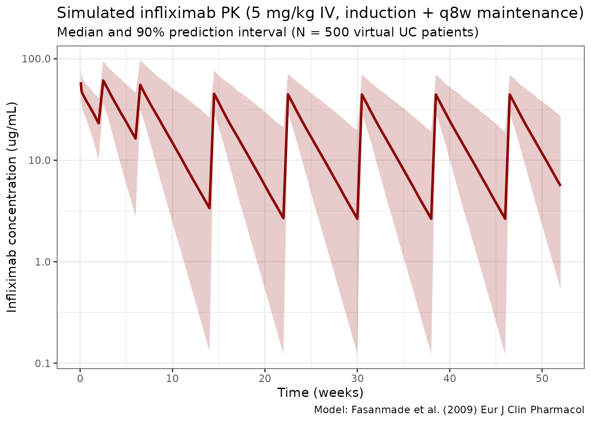
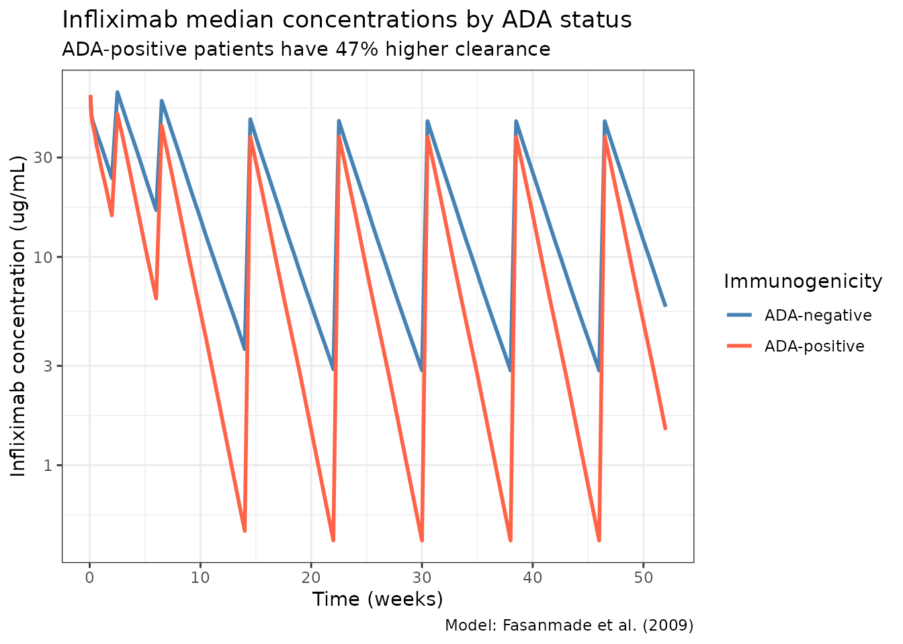

# Fasanmade_2009_infliximab

``` r
library(nlmixr2lib)
library(rxode2)
#> rxode2 5.0.2 using 2 threads (see ?getRxThreads)
#>   no cache: create with `rxCreateCache()`
library(dplyr)
#> 
#> Attaching package: 'dplyr'
#> The following objects are masked from 'package:stats':
#> 
#>     filter, lag
#> The following objects are masked from 'package:base':
#> 
#>     intersect, setdiff, setequal, union
library(tidyr)
library(ggplot2)
library(PKNCA)
#> 
#> Attaching package: 'PKNCA'
#> The following object is masked from 'package:stats':
#> 
#>     filter
```

## Infliximab population PK simulation

Simulate infliximab concentration-time profiles using the final
population PK model from Fasanmade et al. (2009) in patients with
ulcerative colitis from the ACT 1 and ACT 2 phase III trials (N = 482).

The model is a 2-compartment IV infusion model with linear elimination.
Covariates in the final model are serum albumin, anti-drug antibody (ATI
/ ADA) status, and sex on clearance, and body weight and sex on central
volume. Concomitant immunomodulators (azathioprine, 6-mercaptopurine)
were evaluated but did not have a statistically significant effect on
CL.

### Source trace

| Element        | Source location        | Value / form                                 |
|----------------|------------------------|----------------------------------------------|
| CL, Vc, Vp, Q  | Fasanmade 2009 Table 3 | 0.407 L/day, 3.29 L, 4.13 L, 7.14 L/day      |
| ALB on CL      | Fasanmade 2009 Table 3 | Power: (ALB/4.1)^-1.54                       |
| ADA on CL      | Fasanmade 2009 Table 3 | Multiplicative: 1 + 0.471 \* ADA_POS         |
| SEX on CL      | Fasanmade 2009 Table 3 | Multiplicative: 1 + (-0.236) \* SEXF         |
| WT on Vc       | Fasanmade 2009 Table 3 | Power: (WT/77)^0.538                         |
| SEX on Vc      | Fasanmade 2009 Table 3 | Multiplicative: 1 + (-0.137) \* SEXF         |
| IIV CL, Vc     | Fasanmade 2009 Table 3 | omega^2 = 0.131 (37.7% CV), 0.048 (22.1% CV) |
| Residual error | Fasanmade 2009 Table 3 | Proportional 0.403, additive 0.0413 ug/mL    |
| Dosing regimen | Fasanmade 2009 Methods | 5 mg/kg IV at weeks 0, 2, 6, then q8w        |

### Covariate column naming

| Source column                    | Canonical column used here                                                                |
|----------------------------------|-------------------------------------------------------------------------------------------|
| `ATI` (antibodies to infliximab) | `ADA_POS` (per `.claude/skills/extract-literature-model/references/covariate-columns.md`) |
| `SEX` (1 = female, 0 = male)     | `SEXF` (same 0/1 encoding, canonical name)                                                |

### Virtual population

``` r
set.seed(2009)
n_subj <- 500

pop <- data.frame(
  ID      = seq_len(n_subj),
  WT      = rlnorm(n_subj, log(77), 0.22),   # Median 77 kg, range ~40-177
  ALB     = rnorm(n_subj, 4.1, 0.4),         # Mean 4.1, SD 0.4 g/dL
  SEXF    = rbinom(n_subj, 1, 0.392),        # 39.2% female
  ADA_POS = rbinom(n_subj, 1, 0.068)         # 6.8% ADA-positive
)
pop$ALB <- pmax(2.0, pmin(pop$ALB, 5.5))
```

### Dosing dataset

Standard UC induction: 5 mg/kg IV at weeks 0, 2, and 6, then maintenance
every 8 weeks through week 46 (8 doses total). Infusion over 2 hours.

``` r
dose_weeks <- c(0, 2, 6, 14, 22, 30, 38, 46)
dose_times <- dose_weeks * 7  # convert to days

obs_times <- sort(unique(c(
  seq(0, 7, by = 0.5),     # Dense first week
  seq(7, 364, by = 3.5)    # Twice weekly thereafter
)))

d_dose <- pop %>%
  crossing(TIME = dose_times) %>%
  mutate(
    AMT  = round(5 * WT, 1),  # 5 mg/kg
    EVID = 1,
    CMT  = 1,
    DUR  = 2 / 24,            # 2-hour infusion in days
    DV   = NA_real_
  )

d_obs <- pop %>%
  crossing(TIME = obs_times) %>%
  mutate(AMT = NA_real_, EVID = 0, CMT = 1, DUR = NA_real_, DV = NA_real_)

d_sim <- bind_rows(d_dose, d_obs) %>%
  arrange(ID, TIME, desc(EVID)) %>%
  as.data.frame()
```

### Simulate

``` r
mod <- readModelDb("Fasanmade_2009_infliximab")
sim <- rxSolve(mod, d_sim, returnType = "data.frame")
#> ℹ parameter labels from comments will be replaced by 'label()'
```

### Concentration-time profiles

``` r
sim_summary <- sim %>%
  filter(time > 0) %>%
  group_by(time) %>%
  summarise(
    median = median(Cc, na.rm = TRUE),
    lo     = quantile(Cc, 0.05, na.rm = TRUE),
    hi     = quantile(Cc, 0.95, na.rm = TRUE),
    .groups = "drop"
  )

ggplot(sim_summary, aes(x = time / 7)) +
  geom_ribbon(aes(ymin = lo, ymax = hi), alpha = 0.2, fill = "darkred") +
  geom_line(aes(y = median), color = "darkred", linewidth = 1) +
  scale_y_log10() +
  labs(
    x = "Time (weeks)",
    y = "Infliximab concentration (ug/mL)",
    title = "Simulated infliximab PK (5 mg/kg IV, induction + q8w maintenance)",
    subtitle = "Median and 90% prediction interval (N = 500 virtual UC patients)",
    caption = "Model: Fasanmade et al. (2009) Eur J Clin Pharmacol"
  ) +
  theme_bw()
```



### Effect of anti-drug antibodies on PK

``` r
sim_ada <- sim %>%
  filter(time > 0) %>%
  mutate(ADA_label = ifelse(ADA_POS == 1, "ADA-positive", "ADA-negative")) %>%
  group_by(time, ADA_label) %>%
  summarise(
    median = median(Cc, na.rm = TRUE),
    .groups = "drop"
  )

ggplot(sim_ada, aes(x = time / 7, y = median, color = ADA_label)) +
  geom_line(linewidth = 1) +
  scale_y_log10() +
  scale_color_manual(values = c("ADA-negative" = "steelblue", "ADA-positive" = "tomato")) +
  labs(
    x = "Time (weeks)",
    y = "Infliximab concentration (ug/mL)",
    title = "Infliximab median concentrations by ADA status",
    subtitle = "ADA-positive patients have 47% higher clearance",
    color = "Immunogenicity",
    caption = "Model: Fasanmade et al. (2009)"
  ) +
  theme_bw()
```



### NCA validation

Run PKNCA on the maintenance dosing interval (after the 5th dose, weeks
22–30). Stratify by ADA status so each treatment group has its own NCA
summary, as required by the skill’s PKNCA recipe.

``` r
nca_conc <- sim %>%
  filter(time >= 154, time <= 210, Cc > 0) %>%
  mutate(
    time_rel = time - 154,
    treatment = ifelse(ADA_POS == 1, "ADA-positive", "ADA-negative")
  ) %>%
  rename(ID = id) %>%
  select(ID, time_rel, Cc, treatment)

nca_dose <- pop %>%
  mutate(
    time_rel  = 0,
    AMT       = 5 * WT,
    treatment = ifelse(ADA_POS == 1, "ADA-positive", "ADA-negative")
  ) %>%
  select(ID, time_rel, AMT, treatment)

conc_obj <- PKNCAconc(nca_conc, Cc ~ time_rel | treatment + ID)
dose_obj <- PKNCAdose(nca_dose, AMT ~ time_rel | treatment + ID)
data_obj <- PKNCAdata(
  conc_obj,
  dose_obj,
  intervals = data.frame(
    start     = 0,
    end       = 56,
    cmax      = TRUE,
    tmax      = TRUE,
    auclast   = TRUE,
    half.life = TRUE
  )
)
nca_results <- pk.nca(data_obj)
#>  ■■■■■■■■■                         26% |  ETA:  8s
#>  ■■■■■■■■■■■■■■■■■                 55% |  ETA:  5s
#>  ■■■■■■■■■■■■■■■■■■■■■■■■■■        83% |  ETA:  2s
nca_summary <- summary(nca_results)
knitr::kable(
  nca_summary,
  digits  = 2,
  caption = "NCA summary (maintenance interval, weeks 22-30), stratified by ADA status"
)
```

| start | end | treatment    | N   | auclast      | cmax          | tmax                | half.life     |
|------:|----:|:-------------|:----|:-------------|:--------------|:--------------------|:--------------|
|     0 |  56 | ADA-negative | 465 | 887 \[58.6\] | 45.2 \[28.8\] | 3.50 \[3.50, 3.50\] | 14.7 \[6.11\] |
|     0 |  56 | ADA-positive | 35  | 556 \[62.7\] | 38.3 \[28.0\] | 3.50 \[3.50, 3.50\] | 10.1 \[5.10\] |

NCA summary (maintenance interval, weeks 22-30), stratified by ADA
status

### Assumptions and deviations

Fasanmade 2009 does not publish individual PK or per-subject covariate
values, so the virtual population above approximates the reported
distributions rather than reproducing them:

- **Weight:** sampled log-normal around a 77 kg median with SD 0.22 on
  the log scale (≈ 40–177 kg), matching the reported range.
- **Albumin:** sampled normal around mean 4.1 g/dL, SD 0.4 g/dL, clipped
  to \[2.0, 5.5\] g/dL.
- **Sex and ADA status:** sampled independently at 39.2% female and 6.8%
  ADA-positive, respectively. In the pooled ACT 1 / ACT 2 data these are
  not fully independent, but the joint distribution is not reported.
- **No correlation** between WT and ALB is imposed; the paper does not
  report one.
- **Dosing regimen** uses the 5 mg/kg induction + q8w maintenance
  schedule. Fasanmade 2009 pooled this with a 10 mg/kg arm; the 5 mg/kg
  schedule is the approved label dose and the most relevant typical use.
- **Race** is not included because it was not retained as a covariate in
  the final model.

### Notes

- **Model:** 2-compartment IV with linear elimination. No TMDD.
- **Key covariates:** Albumin (strongest, power -1.54 on CL), ADA status
  (+47.1% CL), and sex (-23.6% CL and -13.7% Vc for females).
- **Body weight** was only significant on Vc (exponent 0.538), NOT on CL
  (unlike most mAb models).
- **Concomitant immunomodulators** (AZA, 6-MP) did NOT affect PK in the
  final model.

### Reference

- Fasanmade AA, Adedokun OJ, Blank M, Zhou H, Davis HM. Population
  pharmacokinetic analysis of infliximab in patients with ulcerative
  colitis. Eur J Clin Pharmacol. 2009;65(12):1211-1228.
  <doi:10.1007/s00228-009-0718-4>
