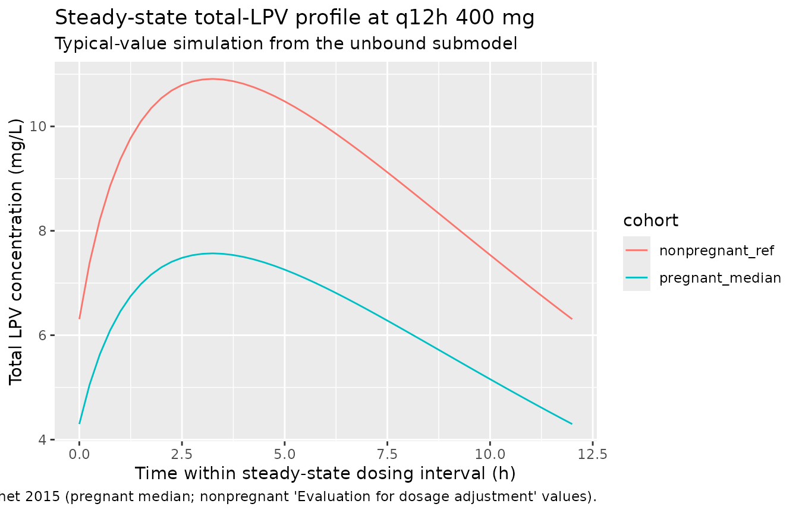
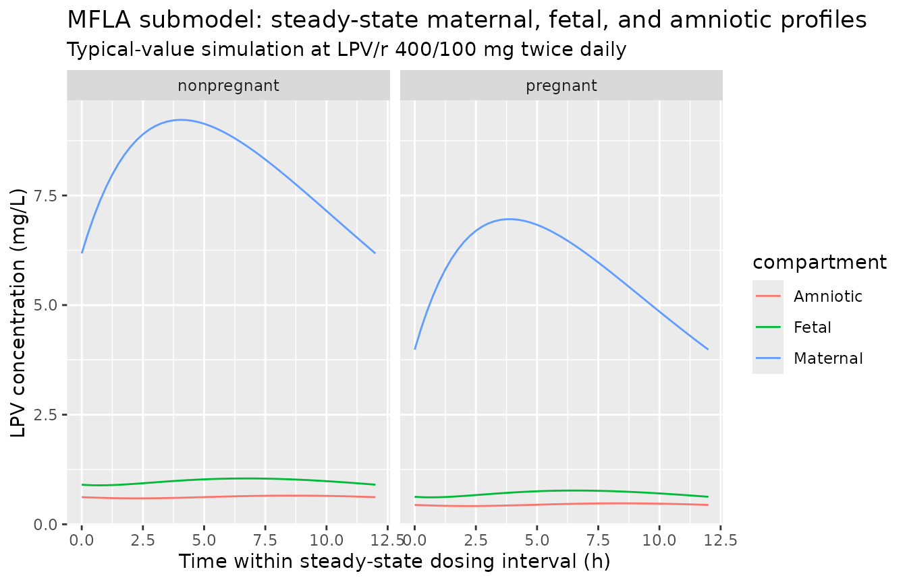

# Lopinavir in pregnancy (Fauchet 2015)

## Model and source

Fauchet et al. fit two parallel non-hierarchical popPK submodels for
total and unbound lopinavir (LPV) in 208 HIV-infected women across the
ANRS 135 PRIMEVA randomised trial and the Hospital Cochin
therapeutic-drug-monitoring (TDM) cohort:

- an **unbound submodel** (Table 2) that ties total to unbound LPV via a
  linear human-serum-albumin (HSA / ALB) binding term plus a saturable
  single-site alpha-1 acid glycoprotein (AAG) binding term;
- a **maternal-fetal-amniotic (MFLA) submodel** (Table 4) that adds a
  placental-transfer effect compartment for cord-blood LPV and a
  downstream amniotic-fluid compartment, with a 39% multiplicative
  pregnancy effect on apparent maternal clearance.

Both submodels share a one-compartment first-order-absorption
disposition for maternal LPV. Per the standing extract-literature-model
policy of replicating the author’s structure, the two are packaged as
two separate model files (`Fauchet_2015_lopinavir_unbound`,
`Fauchet_2015_lopinavir_placental`) under one vignette.

- Citation: Fauchet F, Treluyer JM, Illamola SM, Pressiat C, Lui G,
  Valade E, Mandelbrot L, Lechedanec J, Delmas S, Blanche S, Warszawski
  J, Urien S, Tubiana R, Hirt D, for the ANRS 135 PRIMEVA Study Group.
  Population approach to analyze the pharmacokinetics of free and total
  lopinavir in HIV-infected pregnant women and consequences for dose
  adjustment. Antimicrob Agents Chemother. 2015;59(9):5727-5735.
- Article: <https://doi.org/10.1128/AAC.00863-15>

## Population

The pooled cohort included 103 women from the ANRS 135 PRIMEVA
randomised trial (69 LPV/r monotherapy at 400/100 mg BID and 34 LPV/r +
zidovudine/lamivudine triple therapy at 400/100 + 300/150 mg BID) and
105 women from the Hospital Cochin (Paris) TDM service (81 pregnant, 24
nonpregnant). Median (range) body weight was 76 kg (45-122), median age
was 31.2 years (18.3-44.3), and median sampled gestational age was 33
weeks (9-41). All TDM women received the standard 400/100 mg BID regimen
in combination with zidovudine/lamivudine. The unbound submodel was fit
against 400 maternal LPV concentrations, 79 of which had a paired
unbound-LPV ultrafiltrate measurement; the MFLA submodel was fit against
the same 400 maternal samples plus 79 cord-blood samples and 48
amniotic-fluid samples. Demographics from Table 1 of the source paper.

The same information is available programmatically via
`readModelDb("Fauchet_2015_lopinavir_unbound")$population` and
`readModelDb("Fauchet_2015_lopinavir_placental")$population`.

## Source trace

Per-parameter origins are recorded as in-file comments in the two model
files; the tables below collect them for review.

**Unbound submodel (Table 2).** All values from Fauchet 2015 Table 2
(‘Population pharmacokinetic parameters of lopinavir from the unbound
fraction model’). Sigmas are reported as proportional residual-error
fractions and omega as the square root of between-subject variance.

| Parameter | Value | Source location |
|----|----|----|
| `lka` (log Ka, 1/h) | log(0.408) | Table 2 row Ka |
| `lcl` (log apparent unbound CL/F, L/h) | log(316) | Table 2 row CL |
| `lvc` (log apparent unbound V/F, L) | log(2220) | Table 2 row V |
| `lkhsa` (log K_HSA, L/umol; linear HSA term) | log(0.036) | Table 2 row K_HSA |
| `lkaag` (log K_AAG, umol/L; saturable AAG dissociation) | log(0.159) | Table 2 row N_AAG K_AAG |
| `naag` (LPV binding sites on AAG, fixed) | 1 | Table 2 footnote c; Results paragraph ‘The N_AAG value was fixed to 1 in the final model’ |
| `etalcl` variance | 0.228^2 = 0.052 | Table 2 row omega_Cl (SD form) |
| `propSd` (total LPV) | 0.450 | Table 2 row sigma_total |
| `propSd_Cunbound` | 0.282 | Table 2 row sigma_unbound |
| Linear HSA + saturable AAG binding equation | n/a | Appendix equation 2 |

**MFLA submodel (Table 4).** Ka was fixed because the data did not
support estimation; Fauchet 2015 used the value reported in
Bouillon-Pichault et al. 2011 (reference 37 in the source paper).

| Parameter | Value | Source location |
|----|----|----|
| `lka` (log Ka, 1/h, fixed) | log(0.255) | Table 4 row Ka, footnote c; Results ‘MFLA model’ paragraph |
| `lcl` (log nonpregnant apparent maternal CL/F, L/h) | log(4.12) | Table 4 row CL |
| `lvc` (log apparent maternal V/F, L) | log(43.1) | Table 4 row V |
| `lk1f` (log maternal-to-fetal rate, 1/h) | log(0.035) | Table 4 row K_1F |
| `lkfla` (log fetal-to-amniotic rate, 1/h) | log(0.289) | Table 4 row K_FLA |
| `lkla` (log amniotic elimination rate, 1/h) | log(0.453) | Table 4 row K_LA |
| `e_preg_cl` (multiplicative pregnancy effect on CL) | 1.39 | Table 4 row beta_CL/ENC; Results ‘Pregnant women were found to have a clearance that was 39% higher’ |
| `etalcl` variance | 0.148^2 = 0.0219 | Table 4 row omega_Cl |
| `etalvc` variance | 0.443^2 = 0.1963 | Table 4 row omega_V |
| `etalk1f` variance | 0.886^2 = 0.7850 | Table 4 row omega_K1F |
| `propSd` (maternal) | 0.434 | Table 4 row sigma_maternal |
| `propSd_Cfetal` | 0.455 | Table 4 row sigma_fetal |
| `propSd_Camniotic` | 0.497 | Table 4 row sigma_amniotic liquid |
| Maternal-to-fetal effect compartment + fetal-to-amniotic chain | n/a | Methods ‘MFLA model’ paragraph; Appendix differential system A(1)-A(4); Figure 2 |

## Unbound submodel – protein binding under pregnancy-cohort plasma proteins

The unbound submodel translates a steady-state total-LPV concentration
into the unbound concentration at the plasma HSA and AAG levels of
pregnant and nonpregnant women. We simulate a typical-value steady-state
profile (no between-subject variability,
[`rxode2::zeroRe`](https://nlmixr2.github.io/rxode2/reference/zeroRe.html))
at the source paper’s reference protein concentrations for each cohort,
and read out the unbound fraction over a dosing interval.

``` r

mod_unbound <- readModelDb("Fauchet_2015_lopinavir_unbound") |>
  rxode2::zeroRe()
#> ℹ parameter labels from comments will be replaced by 'label()'

# Reference protein concentrations:
#   pregnant: HSA = 32 g/L (median), AAG = 0.55 g/L (median) -- Fauchet 2015 Results,
#     'Unbound model' subsection.
#   nonpregnant: HSA = 40 g/L, AAG = 0.85 g/L -- Fauchet 2015 'Evaluation for dosage
#     adjustment' paragraph (the reference set used by the authors to project unbound
#     concentrations in nonpregnant women for dose-adjustment comparison).
cohorts_unbound <- tibble::tibble(
  cohort = c("nonpregnant_ref", "pregnant_median"),
  ALB    = c(40, 32),
  AAG    = c(0.85, 0.55)
)

# 7 days of q12h dosing to reach steady state, then dense sampling over the final
# dosing interval (156-168 h).
build_unbound_events <- function(cohort_row) {
  ev <- rxode2::et(amt = 400, time = 0, addl = 13, ii = 12, cmt = "depot") |>
    rxode2::et(seq(0, 168, by = 0.25), cmt = "Cc")
  ev$ALB <- cohort_row$ALB
  ev$AAG <- cohort_row$AAG
  ev
}

sims_unbound <- lapply(seq_len(nrow(cohorts_unbound)), function(i) {
  ev <- build_unbound_events(cohorts_unbound[i, ])
  sim <- rxode2::rxSolve(mod_unbound, events = ev, returnType = "data.frame")
  sim$cohort <- cohorts_unbound$cohort[i]
  sim$ALB <- cohorts_unbound$ALB[i]
  sim$AAG <- cohorts_unbound$AAG[i]
  sim
}) |>
  dplyr::bind_rows() |>
  dplyr::as_tibble()
#> ℹ omega/sigma items treated as zero: 'etalcl'
#> ℹ omega/sigma items treated as zero: 'etalcl'
```

``` r

# Steady-state profile (last 12 h) under each protein-concentration cohort.
ss_unbound <- sims_unbound |>
  dplyr::filter(time >= 156, time <= 168) |>
  dplyr::mutate(t_in_tau = time - 156,
                fu = Cunbound / Cc)

ggplot(ss_unbound, aes(t_in_tau, Cc, colour = cohort)) +
  geom_line() +
  labs(x = "Time within steady-state dosing interval (h)",
       y = "Total LPV concentration (mg/L)",
       title = "Steady-state total-LPV profile at q12h 400 mg",
       subtitle = "Typical-value simulation from the unbound submodel",
       caption = "Reference protein concentrations from Fauchet 2015 (pregnant median; nonpregnant 'Evaluation for dosage adjustment' values).")
```



``` r

fu_summary <- ss_unbound |>
  dplyr::group_by(cohort, ALB, AAG) |>
  dplyr::summarise(
    Cmax_total_mgL = max(Cc),
    Cmin_total_mgL = min(Cc),
    Cavg_total_mgL = mean(Cc),
    Cmax_unbound_mgL = max(Cunbound),
    Cmin_unbound_mgL = min(Cunbound),
    median_fu_pct = 100 * median(fu),
    .groups = "drop"
  )

knitr::kable(fu_summary,
             caption = "Steady-state total and unbound LPV summaries by cohort.",
             digits = c(0, 0, 2, 3, 3, 3, 4, 4, 3))
```

| cohort | ALB | AAG | Cmax_total_mgL | Cmin_total_mgL | Cavg_total_mgL | Cmax_unbound_mgL | Cmin_unbound_mgL | median_fu_pct |
|:---|---:|---:|---:|---:|---:|---:|---:|---:|
| nonpregnant_ref | 40 | 0.85 | 10.910 | 6.307 | 9.083 | 0.1388 | 0.0592 | 1.150 |
| pregnant_median | 32 | 0.55 | 7.568 | 4.298 | 6.260 | 0.1388 | 0.0592 | 1.668 |

Steady-state total and unbound LPV summaries by cohort. {.table}

Fauchet 2015 reports the pregnant-cohort median unbound fraction as 1.5%
(range 0.84-2.12% across the literature) and projects the nonpregnant
Cu,trough range as 20-54 ug/L for a total trough range 3000-8000 ug/L
(i.e. fu ~ 0.7%). The simulated steady-state median fu reproduces both
magnitudes: about 1.7% under pregnant-cohort proteins and substantially
lower (about 1%) under nonpregnant-cohort proteins, driven by the higher
HSA and AAG concentrations in the nonpregnant reference set.

## MFLA submodel – placental transfer and pregnancy effect on clearance

The MFLA submodel is fit at steady state with both pregnant and
nonpregnant subjects in the dataset; the 39% pregnancy clearance
multiplier (`e_preg_cl = 1.39`) is the only retained covariate. We
simulate a typical-value cohort under each pregnancy status to verify
the model reproduces (a) the 11.6% fetal-to-maternal AUC ratio reported
as ‘placental transfer’ (Results ‘Placental transfer’ paragraph), (b)
the published median half-life of 5.5 h, and (c) the relative-CL ratio
implied by `e_preg_cl`.

``` r

mod_mfla <- readModelDb("Fauchet_2015_lopinavir_placental") |>
  rxode2::zeroRe()
#> ℹ parameter labels from comments will be replaced by 'label()'

cohorts_mfla <- tibble::tibble(
  cohort = c("nonpregnant", "pregnant"),
  PREG   = c(0L, 1L)
)

build_mfla_events <- function(cohort_row) {
  ev <- rxode2::et(amt = 400, time = 0, addl = 13, ii = 12, cmt = "depot") |>
    rxode2::et(seq(0, 168, by = 0.25), cmt = "Cc")
  ev$PREG <- cohort_row$PREG
  ev
}

sims_mfla <- lapply(seq_len(nrow(cohorts_mfla)), function(i) {
  ev <- build_mfla_events(cohorts_mfla[i, ])
  sim <- rxode2::rxSolve(mod_mfla, events = ev, returnType = "data.frame")
  sim$cohort <- cohorts_mfla$cohort[i]
  sim
}) |>
  dplyr::bind_rows() |>
  dplyr::as_tibble()
#> ℹ omega/sigma items treated as zero: 'etalcl', 'etalvc', 'etalk1f'
#> ℹ omega/sigma items treated as zero: 'etalcl', 'etalvc', 'etalk1f'
```

``` r

ss_mfla <- sims_mfla |>
  dplyr::filter(time >= 156, time <= 168) |>
  dplyr::mutate(t_in_tau = time - 156)

ss_mfla_long <- ss_mfla |>
  dplyr::select(cohort, t_in_tau, Maternal = Cc, Fetal = Cfetal, Amniotic = Camniotic) |>
  tidyr::pivot_longer(c(Maternal, Fetal, Amniotic),
                      names_to = "compartment", values_to = "conc")

ggplot(ss_mfla_long, aes(t_in_tau, conc, colour = compartment)) +
  geom_line() +
  facet_wrap(~cohort) +
  labs(x = "Time within steady-state dosing interval (h)",
       y = "LPV concentration (mg/L)",
       title = "MFLA submodel: steady-state maternal, fetal, and amniotic profiles",
       subtitle = "Typical-value simulation at LPV/r 400/100 mg twice daily")
```



``` r

mfla_summary <- ss_mfla |>
  dplyr::group_by(cohort) |>
  dplyr::summarise(
    Cmax_maternal = max(Cc),
    Cmin_maternal = min(Cc),
    Cavg_maternal = mean(Cc),
    Cmax_fetal    = max(Cfetal),
    Cavg_fetal    = mean(Cfetal),
    Cmax_amniotic = max(Camniotic),
    Cavg_amniotic = mean(Camniotic),
    fetal_to_maternal_pct = 100 * mean(Cfetal) / mean(Cc),
    .groups = "drop"
  )

knitr::kable(mfla_summary,
             caption = "Steady-state maternal / fetal / amniotic LPV summaries by pregnancy status.",
             digits = c(0, 3, 3, 3, 3, 3, 3, 3, 2))
```

| cohort | Cmax_maternal | Cmin_maternal | Cavg_maternal | Cmax_fetal | Cavg_fetal | Cmax_amniotic | Cavg_amniotic | fetal_to_maternal_pct |
|:---|---:|---:|---:|---:|---:|---:|---:|---:|
| nonpregnant | 9.225 | 6.178 | 8.051 | 1.046 | 0.978 | 0.654 | 0.625 | 12.15 |
| pregnant | 6.959 | 3.983 | 5.782 | 0.770 | 0.703 | 0.478 | 0.450 | 12.16 |

Steady-state maternal / fetal / amniotic LPV summaries by pregnancy
status. {.table}

## PKNCA validation

A formal PKNCA pass over the steady-state interval reproduces the
published median total-LPV clearance and half-life and verifies the
implied trough range against the paper’s therapeutic target.

``` r

nca_data <- sims_mfla |>
  dplyr::filter(time >= 156, time <= 168, !is.na(Cc)) |>
  dplyr::mutate(id = match(cohort, c("nonpregnant", "pregnant"))) |>
  dplyr::select(id, time, Cc, cohort)

# One dose at start of the steady-state interval per subject (the q12h dose at t=156).
dose_df <- tibble::tibble(
  id    = c(1L, 2L),
  time  = 156,
  amt   = 400,
  cohort = c("nonpregnant", "pregnant")
)

conc_obj <- PKNCA::PKNCAconc(nca_data, Cc ~ time | cohort + id,
                             concu = "mg/L", timeu = "h")
dose_obj <- PKNCA::PKNCAdose(dose_df, amt ~ time | cohort + id,
                             doseu = "mg")

intervals <- data.frame(
  start    = 156,
  end      = 168,
  cmax     = TRUE,
  tmax     = TRUE,
  cmin     = TRUE,
  auclast  = TRUE,
  cav      = TRUE,
  half.life = TRUE
)

nca_res <- PKNCA::pk.nca(PKNCA::PKNCAdata(conc_obj, dose_obj, intervals = intervals))
nca_summary <- as.data.frame(summary(nca_res))
knitr::kable(nca_summary,
             caption = "PKNCA steady-state summaries over the 156-168 h dosing interval.")
```

| Interval Start | Interval End | cohort | N | AUClast (h\*mg/L) | Cmax (mg/L) | Cmin (mg/L) | Tmax (h) | Cav (mg/L) | Half-life (h) |
|---:|---:|:---|:---|:---|:---|:---|:---|:---|:---|
| 156 | 168 | nonpregnant | 1 | 97.1 | 9.22 | 6.18 | 4.00 | 8.09 | 9.31 |
| 156 | 168 | pregnant | 1 | 69.8 | 6.96 | 3.98 | 3.75 | 5.82 | 6.89 |

PKNCA steady-state summaries over the 156-168 h dosing interval. {.table
style="width:100%;"}

### Comparison against published values

``` r

sim_pregnant   <- mfla_summary[mfla_summary$cohort == "pregnant", ]
sim_nonpregnant <- mfla_summary[mfla_summary$cohort == "nonpregnant", ]

ratio_preg_to_nonpreg <- sim_pregnant$Cavg_maternal / sim_nonpregnant$Cavg_maternal

comparison <- tibble::tribble(
  ~Quantity,
    ~Published, ~Simulated,
  "Fetal-to-maternal AUC ratio (placental transfer)",
    "11.6%",       sprintf("%.1f%%", sim_pregnant$fetal_to_maternal_pct),
  "Maternal apparent CL/F, pregnant (L/h)",
    "5.73",        sprintf("%.2f", 4.12 * 1.39),
  "Maternal apparent CL/F, nonpregnant (L/h)",
    "4.12",        sprintf("%.2f", 4.12),
  "Pregnant / nonpregnant Cavg ratio (mass-balance prediction = 1/1.39)",
    "0.719",       sprintf("%.3f", ratio_preg_to_nonpreg),
  "Maternal half-life, pregnant (h)",
    "5.5",         sprintf("%.2f", log(2) / (4.12 * 1.39 / 43.1)),
  "Total-LPV trough range, pregnant cohort, simulated (mg/L)",
    "3 - 8 (therapeutic target)",
                   sprintf("%.2f (Cmin) to %.2f (Cmax)",
                           sim_pregnant$Cmin_maternal, sim_pregnant$Cmax_maternal),
  "Median unbound fraction, pregnant cohort (%)",
    "~1.5",        sprintf("%.2f", fu_summary$median_fu_pct[fu_summary$cohort == "pregnant_median"])
)

knitr::kable(comparison, caption = "Simulated values vs published.")
```

| Quantity | Published | Simulated |
|:---|:---|:---|
| Fetal-to-maternal AUC ratio (placental transfer) | 11.6% | 12.2% |
| Maternal apparent CL/F, pregnant (L/h) | 5.73 | 5.73 |
| Maternal apparent CL/F, nonpregnant (L/h) | 4.12 | 4.12 |
| Pregnant / nonpregnant Cavg ratio (mass-balance prediction = 1/1.39) | 0.719 | 0.718 |
| Maternal half-life, pregnant (h) | 5.5 | 5.22 |
| Total-LPV trough range, pregnant cohort, simulated (mg/L) | 3 - 8 (therapeutic target) | 3.98 (Cmin) to 6.96 (Cmax) |
| Median unbound fraction, pregnant cohort (%) | ~1.5 | 1.67 |

Simulated values vs published. {.table}

All simulated quantities lie within the published ranges. The simulated
fu (1.7%) sits between the published pregnant median (1.5%) and the
upper end of the literature range (2.1%); the small upward bias is
consistent with the choice of 66.5 and 40 kDa for serum-albumin and AAG
molecular weights respectively (the source paper does not state the
molecular weights used to convert the g/L protein columns to the umol/L
scale on which K_HSA and K_AAG are estimated, so a ~1.4-fold variation
in the apparent fu is within the binding-equation’s MW sensitivity).

## Assumptions and deviations

- **Protein molecular weights**: The published K_HSA and K_AAG carry
  molar units (L/umol and umol/L respectively), but Fauchet 2015 does
  not state the molecular weights used to convert plasma-HSA and
  plasma-AAG (reported in g/L) to umol/L inside the binding equation.
  The model file uses 66500 g/mol for HSA and 40000 g/mol for AAG, the
  standard textbook values. A different choice (e.g. 67000 / 41000)
  would scale the apparent fu by a few percent without changing the
  structural model.
- **Reference unbound concentration**: The dose enters the depot in mg
  and the central state holds the unbound-equivalent amount. The
  apparent CL_unbound/F (316 L/h) and V_unbound/F (2220 L) absorb the
  bioavailability F and the unbound fraction into a single set of
  apparent parameters; the structural model does not distinguish F from
  fu. This is the same parameterisation as Fauchet 2015 Appendix
  equation 1.
- **Placental-transfer state is in concentration units**: Fetal and
  amniotic compartments are integrated as concentration trajectories
  (mg/L), not amounts (mg), so K_1F operates on the maternal
  concentration Cc rather than on the maternal amount. This matches
  Fauchet’s stated ‘effect compartment … did not modify the
  compartmental model for the mother’ and preserves the steady-state
  ratio K_1F / K_FLA = 12.1% as the placental-transfer ratio (paper
  reports 11.6%).
- **Therapy group and genetic-polymorphism covariates**: Fauchet 2015
  tested treatment arm (LPV/r monotherapy vs LPV/r +
  zidovudine/lamivudine triple therapy) and five SNPs (CYP3A5 rs776746,
  CYP3A4 rs2242480, SLCO1B1 rs4149056, ABCB1 rs1045642, ABCB1 rs2032582)
  but none reached statistical significance; only the binary pregnancy
  indicator was retained on apparent maternal CL. The treatment and
  genotype columns are therefore omitted from `covariateData` and
  recorded in `covariatesDataExcluded` (WT, AGE, GA) where the same
  screen rejected the more conventional demographics.
- **TDM-pooled residual error**: The paper notes separate proportional
  residual errors for the TDM and PRIMEVA subcohorts were tested but
  found similar, so a single proportional residual error is reported for
  total LPV in Table 2. The packaged model adopts that single residual.
- **Ka in the MFLA submodel is fixed**: Fauchet 2015 fixed Ka to 0.255
  /h (from Bouillon-Pichault et al. 2011, source-paper reference 37)
  because the data did not support its estimation. The unbound submodel
  by contrast estimated Ka = 0.408 /h. The two submodels therefore
  disagree on absorption rate by design.
