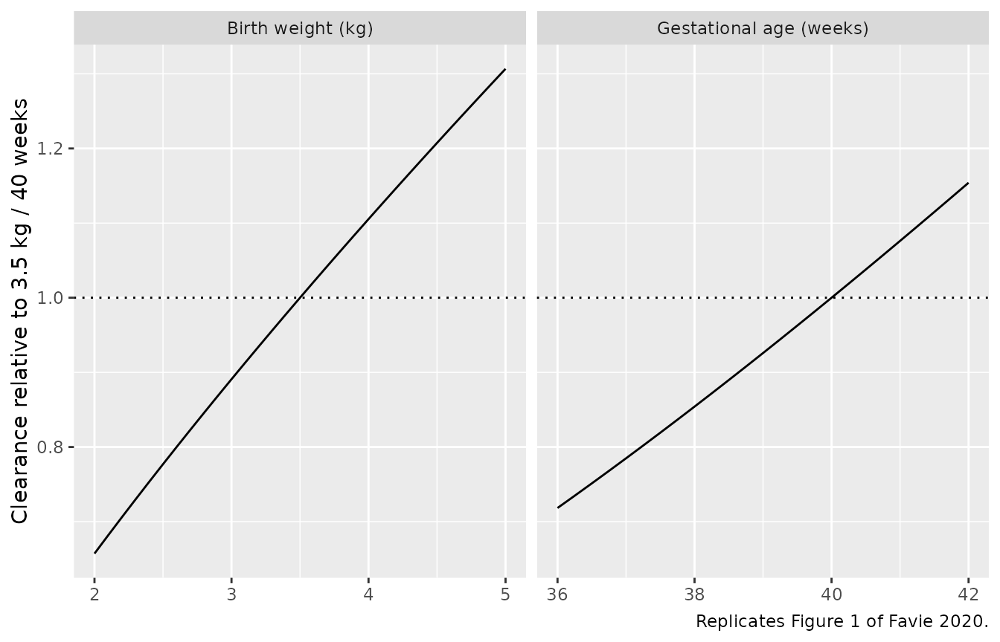
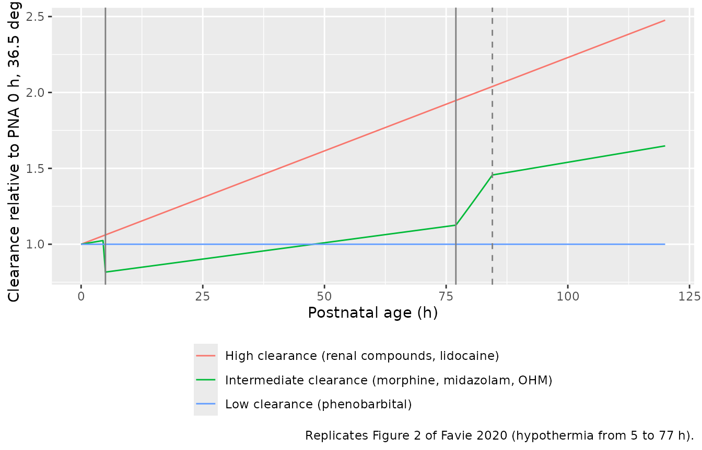
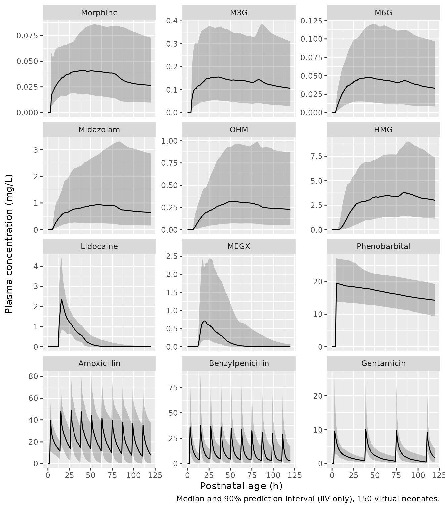

# Seven drugs and five metabolites in neonates under therapeutic hypothermia (Favie 2020)

## Model and source

- Citation: Favie LMA, de Haan TR, Bijleveld YA, Rademaker CMA, Egberts
  TCG, Nuytemans DHGM, Mathot RAA, Groenendaal F, Huitema ADR.
  Prediction of Drug Exposure in Critically Ill Encephalopathic Neonates
  Treated With Therapeutic Hypothermia Based on a Pooled Population
  Pharmacokinetic Analysis of Seven Drugs and Five Metabolites. Clin
  Pharmacol Ther. 2020;108(5):1098-1106. <doi:10.1002/cpt.1917>.
- Description: Integrated population PK model of seven drugs (morphine,
  midazolam, lidocaine, phenobarbital, amoxicillin, benzylpenicillin,
  gentamicin) and five metabolites (M3G, M6G, 1-hydroxymidazolam,
  hydroxymidazolam glucuronide, MEGX) in term encephalopathic neonates
  treated with therapeutic hypothermia (Favie 2020, PharmaCool). One- or
  two-compartment disposition per compound with parent-to-metabolite
  formation, fixed allometric birth-weight scaling, a fixed sigmoidal
  gestational-age maturation function, a linear postnatal-age (organ
  recovery) effect on clearance for high- and intermediate-clearance
  compounds, a linear body-temperature effect on clearance for
  intermediate-clearance compounds, and a common between-compound
  clearance random effect.
- Article: <https://doi.org/10.1002/cpt.1917> (open access, PMC7689752)
- Supplement: Table S1 (full final parameter estimates and final-model
  equations) and Figures S1-S3, published with the article.

Favie 2020 pooled every concentration collected in the PharmaCool study
into one population PK model. The structural model of each drug was
taken from the individual PharmaCool publications, with all volumes
fixed, and the clearances were re-estimated with shared, system-specific
covariate effects:

- allometric birth-weight scaling (exponent 0.75 on clearances, 1 on
  volumes);
- a fixed sigmoidal maturation function of gestational age (TM50 54.2
  weeks, Hill 3.92), normalised to 40 weeks;
- a linear increase of clearance with postnatal age (organ recovery
  after asphyxia): 1.23 %/h for the “high-clearance” compounds (renally
  cleared compounds and lidocaine) and 0.54 %/h for the
  “intermediate-clearance” compounds (morphine, midazolam,
  1-hydroxymidazolam), with a single log-normal random effect shared by
  the two slopes;
- a linear body-temperature effect of 6.83 %/degC on
  intermediate-clearance compounds only;
- a common random effect on all clearances except lidocaine, MEGX and
  phenobarbital, which induces the between-compound clearance
  correlations of Table 2.

Morphine, the reference compound of the common random effect, takes the
bare canonical names (`central`, `lcl`, `Cc`, `propSd`); every other
drug or metabolite carries a suffix (`_m3g`, `_m6g`, `_midazolam`,
`_1ohm`, `_hmg`, `_lidocaine`, `_megx`, `_phenobarbital`,
`_amoxicillin`, `_benzylpenicillin`, `_gentamicin`). Doses go into the
parent’s `central_<drug>` compartment (or `central` for morphine), in mg
of the free base.

Loading the model prints an rxode2 message that `etalcl_common` is not
mu-referenced. That is expected: the common random effect has no typical
value of its own and enters every clearance through a scaling factor.

## Population

192 term and near-term neonates with moderate or severe encephalopathy
after perinatal asphyxia, treated with therapeutic hypothermia (33.5
degC for 72 h started within 6 h of birth, then rewarming at 0.4
degC/h), were enrolled in the prospective PharmaCool cohort in 12 level
III NICUs in the Netherlands and Belgium (Table 1). Gestational age was
39.7 +/- 1.66 weeks (range 36-42 by protocol), birth weight 3.38 +/-
0.617 kg and 61.5% were male. Samples were taken on days 2-5 of life.
Patients / samples per drug: morphine 180 / 534, amoxicillin 125 /
1,280, midazolam 118 / 376, phenobarbital 113 / 378, gentamicin 47 /
471, benzylpenicillin 43 / 416 and lidocaine 28 / 77; metabolite
concentrations come from the same samples as their parent.

The same information is available programmatically via
`readModelDb("Favie_2020_neonatalHypothermia")()$population`.

## Source trace

Every `ini()` value carries an in-file comment pointing to its source.
Table 3 of the article reports the clearance-related estimates; Table S1
reports all estimates, including the fixed volumes, the
intercompartmental clearances, the random effects and the residual
errors, followed by the final-model equations.

| Equation / parameter | Value | Source location |
|----|----|----|
| `lcl`, `lcl_m3g`, `lcl_m6g`, `lcl_midazolam`, `lcl_1ohm`, `lcl_hmg` | log(0.811), log(0.241), log(0.765), log(0.511), log(1.72), log(0.111) L/h | Table 3; Table S1 |
| `lcl_lidocaine`, `lcl_megx`, `lcl_phenobarbital` | log(0.937), log(1.51), log(0.00930) L/h | Table 3; Table S1 |
| `lcl_amoxicillin`, `lcl_benzylpenicillin`, `lcl_gentamicin` | log(0.178), log(0.359), log(0.108) L/h | Table 3; Table S1 |
| `lq_amoxicillin`, `lq_benzylpenicillin`, `lq_gentamicin` | log(0.686), log(0.178), log(0.158) L/h | Table S1 |
| `lvc` … `lvp_gentamicin` (15 volumes) | all FIX | Table S1 |
| `e_wt_cl_q`, `e_wt_vc_vp` | 0.75, 1 (fixed) | Methods, ‘Body size’ |
| `ga_tm50`, `ga_hill` | 54.2 weeks, 3.92 (fixed) | Methods, ‘Maturation’ equation |
| `e_pna_cl_high`, `e_pna_cl_int` | 0.0123, 0.0054 per hour | Table 3; Table S1 ‘Covariates’ |
| `e_bodytemp_cl` | 0.0683 per degC | Table 3; Table S1 ‘Covariates’ |
| `sd_ratio_cl` … `sd_ratio_cl_gentamicin` | 1 FIX, 1.46, 1.38, 0.532, 0.504, 0.870, 0.541, 0.847, 0.327 | Table S1 ‘Common THETA on IIV Cl’ |
| `etalcl_common` | 0.437^2 | Table S1 ‘Common OMEGA on Cl’ 43.7% |
| `etalcl` … `etalcl_gentamicin` | rsd^2 | Table S1 ‘IIV Cl, rsd’ |
| `etalcl_m3g` / `etalcl_m6g` covariance | 0.242532 | Back-solved from Table 2 (see Assumptions) |
| `etae_pna_cl_high`, `sd_ratio_e_pna_cl_int` | 0.716^2, 0.765 | Table S1 ‘IIV on PNA effect’ |
| `etalvc` … `etalvp_gentamicin` | rsd^2 (fixed) | Table S1 ‘IIV V, rsd’ … FIX |
| `propSd*`, `addSd*` | 0.0925-0.367; 0.01 or 0.1 mg/L (fixed) | Table S1 ‘SIGMA structure’ |
| CL equations | n/a | Table S1 ‘Final model’ |
| `fmat` | n/a | Methods ‘Maturation’ equation; Table S1 ‘Final model’ GA / GAst |
| Common random effect `CL = TVCL exp(eta_n + theta_n eta_common)` | n/a | Methods ‘Correlation in clearance’ equations |
| Parent to metabolite formation, molar | n/a | Table S1 footnote section symbol; Methods of the predecessor morphine (Favie 2019) and lidocaine (Favie 2020) papers |
| Temperature profile (33.5 degC; 0.4 degC/h rewarming) | n/a | Methods ‘Body temperature’ |

## Typical clearances at the reference covariates (Table 3)

Every observation row in this article carries `dvid = 1L`. The model has
twelve outputs, and rxode2 needs a DV id on observation records of a
multi-output model; all outputs are returned as columns whichever id is
given.

Table 3 reports every clearance for a neonate of birth weight 3.5 kg, GA
40 weeks, PNA 0 h and temperature 36.5 degC. Solving the typical-value
model at those covariates must return exactly those numbers.

``` r

mod <- readModelDb("Favie_2020_neonatalHypothermia")
mod_typ <- mod |> rxode2::zeroRe()
#> ℹ parameter labels from comments will be replaced by 'label()'
#> Warning: some etas defaulted to non-mu referenced, possible parsing error: etalcl_common
#> as a work-around try putting the mu-referenced expression on a simple line
#> Warning: some etas defaulted to non-mu referenced, possible parsing error: etalcl_common
#> as a work-around try putting the mu-referenced expression on a simple line

ref_ev <- data.frame(
  id = 1L, time = 0, evid = 0L, amt = 0, cmt = "central", dvid = 1L,
  WT_BIRTH = 3.5, GA = 40, PNA = 0, BODYTEMP = 36.5
)
ref <- as.data.frame(rxode2::rxSolve(mod_typ, events = ref_ev))
#> ℹ omega/sigma items treated as zero: 'etalcl_common', 'etalcl', 'etalcl_m3g', 'etalcl_m6g', 'etalcl_midazolam', 'etalcl_1ohm', 'etalcl_hmg', 'etalcl_lidocaine', 'etalcl_megx', 'etalcl_phenobarbital', 'etalcl_amoxicillin', 'etalcl_benzylpenicillin', 'etalcl_gentamicin', 'etae_pna_cl_high', 'etalvc', 'etalvc_midazolam', 'etalvc_hmg', 'etalvc_lidocaine', 'etalvc_megx', 'etalvc_phenobarbital', 'etalvc_amoxicillin', 'etalvc_benzylpenicillin', 'etalvp_benzylpenicillin', 'etalvc_gentamicin', 'etalvp_gentamicin'

table3 <- tibble::tribble(
  ~compound,          ~column,                 ~published,
  "Morphine",         "cl",                    0.811,
  "Midazolam",        "cl_midazolam",          0.511,
  "OHM",              "cl_1ohm",               1.72,
  "M3G",              "cl_m3g",                0.241,
  "M6G",              "cl_m6g",                0.765,
  "HMG",              "cl_hmg",                0.111,
  "Amoxicillin",      "cl_amoxicillin",        0.178,
  "Benzylpenicillin", "cl_benzylpenicillin",   0.359,
  "Gentamicin",       "cl_gentamicin",         0.108,
  "Lidocaine",        "cl_lidocaine",          0.937,
  "MEGX",             "cl_megx",               1.51,
  "Phenobarbital",    "cl_phenobarbital",      0.00930
)
table3$model <- vapply(table3$column, function(x) ref[[x]][1], numeric(1))
# Algebraic identity: the model's typical clearance at the reference
# covariates is the Table 3 value, to rounding of the log transform.
stopifnot(all(abs(table3$model / table3$published - 1) < 1e-10))

table3 |>
  dplyr::select(-column) |>
  dplyr::rename(
    "Compound" = compound,
    "Table 3 CL (L/h)" = published,
    "Model CL (L/h)" = model
  ) |>
  knitr::kable(digits = 4, caption = "Typical clearances at BW 3.5 kg, GA 40 weeks, PNA 0 h, 36.5 degC.")
```

| Compound         | Table 3 CL (L/h) | Model CL (L/h) |
|:-----------------|-----------------:|---------------:|
| Morphine         |           0.8110 |         0.8110 |
| Midazolam        |           0.5110 |         0.5110 |
| OHM              |           1.7200 |         1.7200 |
| M3G              |           0.2410 |         0.2410 |
| M6G              |           0.7650 |         0.7650 |
| HMG              |           0.1110 |         0.1110 |
| Amoxicillin      |           0.1780 |         0.1780 |
| Benzylpenicillin |           0.3590 |         0.3590 |
| Gentamicin       |           0.1080 |         0.1080 |
| Lidocaine        |           0.9370 |         0.9370 |
| MEGX             |           1.5100 |         1.5100 |
| Phenobarbital    |           0.0093 |         0.0093 |

Typical clearances at BW 3.5 kg, GA 40 weeks, PNA 0 h, 36.5 degC.
{.table}

## Body size and maturation (Figure 1)

Figure 1 of the article shows the relative influence of birth weight and
of gestational age on clearance, relative to 3.5 kg and 40 weeks. The
same curve applies to every compound.

``` r

grid_bw <- data.frame(WT_BIRTH = seq(2, 5, by = 0.1), GA = 40)
grid_ga <- data.frame(WT_BIRTH = 3.5, GA = seq(36, 42, by = 0.25))
grid <- dplyr::bind_rows(
  grid_bw |> dplyr::mutate(panel = "Birth weight (kg)", x = WT_BIRTH),
  grid_ga |> dplyr::mutate(panel = "Gestational age (weeks)", x = GA)
) |>
  dplyr::mutate(id = dplyr::row_number(), time = 0, evid = 0L, amt = 0,
                cmt = "central", dvid = 1L, PNA = 0, BODYTEMP = 36.5)
fig1 <- as.data.frame(rxode2::rxSolve(mod_typ, events = grid,
                                      keep = c("panel", "x"))) |>
  dplyr::mutate(rel_cl = cl / 0.811)
#> ℹ omega/sigma items treated as zero: 'etalcl_common', 'etalcl', 'etalcl_m3g', 'etalcl_m6g', 'etalcl_midazolam', 'etalcl_1ohm', 'etalcl_hmg', 'etalcl_lidocaine', 'etalcl_megx', 'etalcl_phenobarbital', 'etalcl_amoxicillin', 'etalcl_benzylpenicillin', 'etalcl_gentamicin', 'etae_pna_cl_high', 'etalvc', 'etalvc_midazolam', 'etalvc_hmg', 'etalvc_lidocaine', 'etalvc_megx', 'etalvc_phenobarbital', 'etalvc_amoxicillin', 'etalvc_benzylpenicillin', 'etalvp_benzylpenicillin', 'etalvc_gentamicin', 'etalvp_gentamicin'
#> Warning: multi-subject simulation without without 'omega'

# Closed form from the Table S1 equations: (BW/3.5)^0.75 and
# GA^3.92/(GA^3.92 + 54.2^3.92) / (40^3.92/(40^3.92 + 54.2^3.92)).
mat <- function(ga) ga^3.92 / (ga^3.92 + 54.2^3.92)
fig1$closed <- (fig1$WT_BIRTH / 3.5)^0.75 * mat(fig1$GA) / mat(40)
stopifnot(all(abs(fig1$rel_cl / fig1$closed - 1) < 1e-8))
# Across the studied GA range the maturation factor moves clearance by about
# -28% (36 weeks) to +15% (42 weeks).
stopifnot(
  abs(mat(36) / mat(40) - 0.718) < 0.005,
  abs(mat(42) / mat(40) - 1.154) < 0.005
)

ggplot(fig1, aes(x, rel_cl)) +
  geom_line() +
  geom_hline(yintercept = 1, linetype = "dotted") +
  facet_wrap(~panel, scales = "free_x") +
  labs(x = NULL, y = "Clearance relative to 3.5 kg / 40 weeks",
       caption = "Replicates Figure 1 of Favie 2020.")
```



## Postnatal age and body temperature (Figure 2)

Figure 2 shows the typical relative clearance of the three compound
groups over the first 120 h of life, with therapeutic hypothermia. The
article does not state the start time used for the figure; here
hypothermia starts at 5 h of life (the start used by the predecessor
morphine paper for its simulations), lasts 72 h, and is followed by
rewarming at 0.4 degC/h to 36.5 degC.

``` r

# Temperature profile of the article's dynamic temperature model. Before
# cooling starts, 36.5 degC is assumed.
temp_profile <- function(t, th_start, th_len = 72) {
  th_end <- th_start + th_len
  dplyr::case_when(
    t < th_start ~ 36.5,
    t < th_end ~ 33.5,
    TRUE ~ pmin(36.5, 33.5 + 0.4 * (t - th_end))
  )
}
h_per_month <- 24 * 30.4375
```

``` r

fig2_ev <- data.frame(id = 1L, time = seq(0, 120, by = 0.5), evid = 0L,
                      amt = 0, cmt = "central", dvid = 1L, WT_BIRTH = 3.5,
                      GA = 40) |>
  dplyr::mutate(PNA = time / h_per_month, BODYTEMP = temp_profile(time, 5))
fig2 <- as.data.frame(rxode2::rxSolve(mod_typ, events = fig2_ev)) |>
  dplyr::transmute(
    time,
    `High clearance (renal compounds, lidocaine)` = cl_gentamicin / 0.108,
    `Intermediate clearance (morphine, midazolam, OHM)` = cl / 0.811,
    `Low clearance (phenobarbital)` = cl_phenobarbital / 0.00930
  ) |>
  tidyr::pivot_longer(-time, names_to = "group", values_to = "rel_cl")
#> ℹ omega/sigma items treated as zero: 'etalcl_common', 'etalcl', 'etalcl_m3g', 'etalcl_m6g', 'etalcl_midazolam', 'etalcl_1ohm', 'etalcl_hmg', 'etalcl_lidocaine', 'etalcl_megx', 'etalcl_phenobarbital', 'etalcl_amoxicillin', 'etalcl_benzylpenicillin', 'etalcl_gentamicin', 'etae_pna_cl_high', 'etalvc', 'etalvc_midazolam', 'etalvc_hmg', 'etalvc_lidocaine', 'etalvc_megx', 'etalvc_phenobarbital', 'etalvc_amoxicillin', 'etalvc_benzylpenicillin', 'etalvp_benzylpenicillin', 'etalvc_gentamicin', 'etalvp_gentamicin'

at <- function(g, t) fig2$rel_cl[grepl(g, fig2$group) & fig2$time == t]
stopifnot(
  # High-clearance compounds: 1 + 0.0123 * PNA, no temperature effect.
  abs(at("High", 120) - (1 + 0.0123 * 120)) < 1e-8,
  # Intermediate: 20.5% lower during hypothermia (3 degC * 6.83 %/degC),
  # the figure quoted in the Results.
  abs(at("Intermediate", 24) - (1 + 0.0054 * 24) * (1 - 3 * 0.0683)) < 1e-8,
  abs((1 - 3 * 0.0683) - 0.795) < 0.001,
  # Phenobarbital: no postnatal-age or temperature effect.
  abs(at("Low", 60) - 1) < 1e-8
)

ggplot(fig2, aes(time, rel_cl, colour = group)) +
  geom_line() +
  geom_vline(xintercept = c(5, 77), linetype = "solid", colour = "grey50") +
  geom_vline(xintercept = 77 + 7.5, linetype = "dashed", colour = "grey50") +
  labs(x = "Postnatal age (h)", y = "Clearance relative to PNA 0 h, 36.5 degC",
       colour = NULL,
       caption = "Replicates Figure 2 of Favie 2020 (hypothermia from 5 to 77 h).") +
  theme(legend.position = "bottom", legend.direction = "vertical")
```



## Correlation in clearance (Table 2)

With `CL_n = TVCL_n exp(eta_n + theta_n eta_common)`, the implied
correlation between the clearances of compounds 1 and 2 is
`theta_1 theta_2 omega_common^2 / (omega_1,total omega_2,total)`
(article Methods). The chunk below computes it from the packaged `ini()`
block and compares it with Table 2.

``` r

ui <- rxode2::rxode2(mod)
#> ℹ parameter labels from comments will be replaced by 'label()'
#> Warning: some etas defaulted to non-mu referenced, possible parsing error: etalcl_common
#> as a work-around try putting the mu-referenced expression on a simple line
om <- ui$omega
th <- ui$theta
cmpd <- c(Morphine = "", Midazolam = "_midazolam", OHM = "_1ohm", M3G = "_m3g",
          M6G = "_m6g", HMG = "_hmg", Amoxicillin = "_amoxicillin",
          Benzylpenicillin = "_benzylpenicillin", Gentamicin = "_gentamicin")
etas <- paste0("etalcl", cmpd)
scale <- unname(th[paste0("sd_ratio_cl", cmpd)])
# Loading matrix: each log-clearance = its own eta + scale * common eta.
L <- cbind(diag(length(cmpd)), scale)
S <- om[c(etas, "etalcl_common"), c(etas, "etalcl_common")]
V <- L %*% S %*% t(L)
R <- stats::cov2cor(V) * 100
dimnames(R) <- list(names(cmpd), names(cmpd))

published <- matrix(NA_real_, 9, 9, dimnames = dimnames(R))
pub_lower <- c(
  62.2, 63.3, 35.4, 32.5, 62.6, 42.1, 58.6, 45.9, # Morphine column
  57.0, 31.9, 29.3, 56.4, 38.0, 52.8, 41.4, # Midazolam column
  32.2, 29.6, 57.0, 38.3, 53.4, 41.8, # OHM column
  94.8, 31.9, 21.4, 31.9, 23.4, # M3G column
  29.3, 19.7, 27.4, 21.5, # M6G column
  37.9, 52.8, 41.4, # HMG column
  35.5, 27.9, # Amoxicillin column
  38.8 # Benzylpenicillin column
)
published[lower.tri(published)] <- pub_lower

cmp2 <- data.frame(
  pair = outer(rownames(R), colnames(R), paste, sep = " / ")[lower.tri(R)],
  table2 = published[lower.tri(published)],
  model = R[lower.tri(R)]
) |>
  dplyr::mutate(diff = model - table2)

# Every cell except Benzylpenicillin / M3G is reproduced to within the
# rounding of the printed IIV estimates (measured max 0.4 points). The
# Benzylpenicillin / M3G cell is a known deviation (see Assumptions) and is
# excluded from the gate rather than widened into it.
known <- cmp2$pair == "Benzylpenicillin / M3G"
stopifnot(
  max(abs(cmp2$diff[!known])) < 1,
  abs(cmp2$diff[known] + 2) < 0.2
)

cmp2 |>
  dplyr::rename(
    "Compound pair" = pair,
    "Table 2 (%)" = table2,
    "Model (%)" = model,
    "Difference (points)" = diff
  ) |>
  knitr::kable(digits = 1, caption = "Between-compound clearance correlations.")
```

| Compound pair                  | Table 2 (%) | Model (%) | Difference (points) |
|:-------------------------------|------------:|----------:|--------------------:|
| Midazolam / Morphine           |        62.2 |      62.6 |                 0.4 |
| OHM / Morphine                 |        63.3 |      63.2 |                -0.1 |
| M3G / Morphine                 |        35.4 |      35.4 |                 0.0 |
| M6G / Morphine                 |        32.5 |      32.4 |                -0.1 |
| HMG / Morphine                 |        62.6 |      62.5 |                -0.1 |
| Amoxicillin / Morphine         |        42.1 |      42.1 |                 0.0 |
| Benzylpenicillin / Morphine    |        58.6 |      58.6 |                 0.0 |
| Gentamicin / Morphine          |        45.9 |      46.0 |                 0.1 |
| OHM / Midazolam                |        57.0 |      57.0 |                 0.0 |
| M3G / Midazolam                |        31.9 |      31.9 |                 0.0 |
| M6G / Midazolam                |        29.3 |      29.3 |                 0.0 |
| HMG / Midazolam                |        56.4 |      56.4 |                 0.0 |
| Amoxicillin / Midazolam        |        38.0 |      38.0 |                 0.0 |
| Benzylpenicillin / Midazolam   |        52.8 |      52.9 |                 0.1 |
| Gentamicin / Midazolam         |        41.4 |      41.5 |                 0.1 |
| M3G / OHM                      |        32.2 |      32.2 |                 0.0 |
| M6G / OHM                      |        29.6 |      29.5 |                -0.1 |
| HMG / OHM                      |        57.0 |      56.9 |                -0.1 |
| Amoxicillin / OHM              |        38.3 |      38.3 |                 0.0 |
| Benzylpenicillin / OHM         |        53.4 |      53.4 |                 0.0 |
| Gentamicin / OHM               |        41.8 |      41.9 |                 0.1 |
| M6G / M3G                      |        94.8 |      94.8 |                 0.0 |
| HMG / M3G                      |        31.9 |      31.8 |                -0.1 |
| Amoxicillin / M3G              |        21.4 |      21.4 |                 0.0 |
| Benzylpenicillin / M3G         |        31.9 |      29.9 |                -2.0 |
| Gentamicin / M3G               |        23.4 |      23.4 |                 0.0 |
| HMG / M6G                      |        29.3 |      29.2 |                -0.1 |
| Amoxicillin / M6G              |        19.7 |      19.7 |                 0.0 |
| Benzylpenicillin / M6G         |        27.4 |      27.4 |                 0.0 |
| Gentamicin / M6G               |        21.5 |      21.5 |                 0.0 |
| Amoxicillin / HMG              |        37.9 |      37.9 |                 0.0 |
| Benzylpenicillin / HMG         |        52.8 |      52.8 |                 0.0 |
| Gentamicin / HMG               |        41.4 |      41.4 |                 0.0 |
| Benzylpenicillin / Amoxicillin |        35.5 |      35.5 |                 0.0 |
| Gentamicin / Amoxicillin       |        27.9 |      27.9 |                 0.0 |
| Gentamicin / Benzylpenicillin  |        38.8 |      38.8 |                 0.0 |

Between-compound clearance correlations. {.table style="width:100%;"}

## Metabolite formation and units: steady-state check

Each metabolite receives its parent’s whole elimination flux, converted
mole for mole into metabolite mass, and its clearance and volume are
apparent values relative to the unknown formation fraction. With
covariates held constant the model is linear and time-invariant, so a
long constant-rate infusion must reach `Css = R / CL` for a parent and
`Css = R (MW_metabolite / MW_parent) / CL_met` for a metabolite (the
intermediate metabolite does not change the terminal metabolite’s steady
state).

``` r

rate <- c(central = 0.035, central_midazolam = 0.5, central_lidocaine = 7)
ss_ev <- dplyr::bind_rows(
  data.frame(time = 0, evid = 1L, cmt = names(rate), amt = rate * 300,
             rate = unname(rate)),
  data.frame(time = 300, evid = 0L, cmt = "central", amt = 0, rate = 0,
             dvid = 1L)
) |>
  dplyr::mutate(id = 1L, WT_BIRTH = 3.5, GA = 40, PNA = 48 / h_per_month,
                BODYTEMP = 36.5)
ss <- as.data.frame(rxode2::rxSolve(mod_typ, events = ss_ev,
                                    rtol = 1e-10, atol = 1e-12)) |>
  dplyr::filter(time == 300)
#> ℹ omega/sigma items treated as zero: 'etalcl_common', 'etalcl', 'etalcl_m3g', 'etalcl_m6g', 'etalcl_midazolam', 'etalcl_1ohm', 'etalcl_hmg', 'etalcl_lidocaine', 'etalcl_megx', 'etalcl_phenobarbital', 'etalcl_amoxicillin', 'etalcl_benzylpenicillin', 'etalcl_gentamicin', 'etae_pna_cl_high', 'etalvc', 'etalvc_midazolam', 'etalvc_hmg', 'etalvc_lidocaine', 'etalvc_megx', 'etalvc_phenobarbital', 'etalvc_amoxicillin', 'etalvc_benzylpenicillin', 'etalvp_benzylpenicillin', 'etalvc_gentamicin', 'etalvp_gentamicin'

mw <- c(morphine = 285.3, m3g = 461.5, midazolam = 325.8, ohm = 341.8,
        hmg = 517.9, lidocaine = 234.3, megx = 206.3)
ss_check <- tibble::tribble(
  ~analyte, ~model, ~expected,
  "Morphine", ss$Cc, rate[["central"]] / ss$cl,
  "M3G", ss$Cc_m3g, rate[["central"]] * mw[["m3g"]] / mw[["morphine"]] / ss$cl_m3g,
  "Midazolam", ss$Cc_midazolam, rate[["central_midazolam"]] / ss$cl_midazolam,
  "OHM", ss$Cc_1ohm, rate[["central_midazolam"]] * mw[["ohm"]] / mw[["midazolam"]] / ss$cl_1ohm,
  "HMG", ss$Cc_hmg, rate[["central_midazolam"]] * mw[["hmg"]] / mw[["midazolam"]] / ss$cl_hmg,
  "Lidocaine", ss$Cc_lidocaine, rate[["central_lidocaine"]] / ss$cl_lidocaine,
  "MEGX", ss$Cc_megx, rate[["central_lidocaine"]] * mw[["megx"]] / mw[["lidocaine"]] / ss$cl_megx
)
# 300 h is more than 35 half-lives of the slowest of these compounds
# (morphine, t1/2 about 6 h at PNA 48 h), so the residual is integration
# error.
stopifnot(all(abs(ss_check$model / ss_check$expected - 1) < 1e-6))
knitr::kable(ss_check, digits = 4,
             caption = "Typical steady-state concentrations (mg/L) at PNA 48 h, 36.5 degC.")
```

| analyte   |  model | expected |
|:----------|-------:|---------:|
| Morphine  | 0.0343 |   0.0343 |
| M3G       | 0.1477 |   0.1477 |
| Midazolam | 0.7771 |   0.7771 |
| OHM       | 0.2422 |   0.2422 |
| HMG       | 4.5023 |   4.5023 |
| Lidocaine | 4.6973 |   4.6973 |
| MEGX      | 2.5665 |   2.5665 |

Typical steady-state concentrations (mg/L) at PNA 48 h, 36.5 degC.
{.table}

## Virtual cohort

Observed data are not public. The cohort below approximates Table 1: GA
drawn from a normal distribution with mean 39.7 and SD 1.66 weeks and
birth weight from a normal distribution with mean 3.38 and SD 0.617 kg,
each redrawn until it falls inside the eligible range (36-42 weeks;
2.0-5.1 kg). Hypothermia starts between 2 and 6 h of life.

The article publishes no dosing simulations. The regimens below are
taken from the PharmaCool predecessor publications where they give one
and are otherwise illustrative; every neonate receives all seven drugs,
which is harmless because the drugs share no compartments (only their
random effects are correlated):

| Drug | Regimen | Origin |
|----|----|----|
| Morphine | 50 ug/kg at 4 h, then 10 ug/kg/h | Favie 2019 (PLoS One), simulated regimen 2 |
| Midazolam | 0.1 mg/kg at 6 h, then 0.15 mg/kg/h | Favie 2019 (Neonatology) simulations |
| Phenobarbital | 20 mg/kg over 20 min at 4 h | Favie 2019 (Neonatology) simulations |
| Lidocaine | Hypothermia regimen by weight, starting at 12 h | Favie 2020 (Br J Clin Pharmacol) Table 1 |
| Gentamicin | 5 mg/kg over 30 min every 36 h from 2 h | Bijleveld 2016 regimens |
| Amoxicillin | 25 mg/kg over 5 min every 12 h from 2 h | illustrative |
| Benzylpenicillin | 30 mg/kg over 5 min every 12 h from 2 h | illustrative |

``` r

set.seed(20201105)
n_sub <- 150

draw_truncated <- function(n, mean, sd, lo, hi) {
  x <- stats::rnorm(n, mean, sd)
  bad <- x < lo | x > hi
  while (any(bad)) {
    x[bad] <- stats::rnorm(sum(bad), mean, sd)
    bad <- x < lo | x > hi
  }
  x
}

subj <- data.frame(
  id = seq_len(n_sub),
  GA = draw_truncated(n_sub, 39.7, 1.66, 36, 42),
  WT_BIRTH = draw_truncated(n_sub, 3.38, 0.617, 2.0, 5.1),
  th_start = stats::runif(n_sub, 2, 6)
)

# Lidocaine hypothermia regimen (Favie 2020 Br J Clin Pharmacol Table 1):
# bolus 2 mg/kg over 10 min, then a loading phase, then two 12-h maintenance
# phases whose doses depend on weight (< 2.5 kg or >= 2.5 kg).
lido_doses <- function(wt, t0 = 12) {
  heavy <- wt >= 2.5
  data.frame(
    time = t0 + c(0, 1 / 6, 1 / 6 + 3.5, 1 / 6 + 3.5 + 12),
    amt = wt * c(2, if (heavy) 7 else 6, if (heavy) 3.5 else 3,
                 if (heavy) 1.75 else 1.5),
    dur = c(1 / 6, 3.5, 12, 12)
  )
}

make_doses <- function(s) {
  wt <- s$WT_BIRTH
  dplyr::bind_rows(
    data.frame(cmt = "central", time = 4, amt = 0.05 * wt, dur = 0),
    data.frame(cmt = "central", time = 4, amt = 0.01 * wt * 116, dur = 116),
    data.frame(cmt = "central_midazolam", time = 6, amt = 0.1 * wt, dur = 0),
    data.frame(cmt = "central_midazolam", time = 6, amt = 0.15 * wt * 114, dur = 114),
    data.frame(cmt = "central_phenobarbital", time = 4, amt = 20 * wt, dur = 1 / 3),
    lido_doses(wt) |> dplyr::mutate(cmt = "central_lidocaine"),
    data.frame(cmt = "central_gentamicin", time = c(2, 38, 74, 110),
               amt = 5 * wt, dur = 0.5),
    data.frame(cmt = "central_amoxicillin", time = seq(2, 110, by = 12),
               amt = 25 * wt, dur = 1 / 12),
    data.frame(cmt = "central_benzylpenicillin", time = seq(2, 110, by = 12),
               amt = 30 * wt, dur = 1 / 12)
  ) |>
    dplyr::mutate(id = s$id, evid = 1L)
}

doses <- dplyr::bind_rows(lapply(split(subj, subj$id), make_doses))
obs <- tidyr::expand_grid(id = subj$id, time = seq(0, 120, by = 1)) |>
  dplyr::mutate(evid = 0L, amt = 0, cmt = "central", dur = 0, dvid = 1L)

events <- dplyr::bind_rows(doses, obs) |>
  dplyr::left_join(subj, by = "id") |>
  dplyr::mutate(
    PNA = time / h_per_month,
    BODYTEMP = temp_profile(time, th_start),
    # Infusions are given as an explicit rate (amount / duration).
    rate = ifelse(evid == 1L & dur > 0, amt / dur, 0)
  ) |>
  dplyr::arrange(id, time, dplyr::desc(evid)) |>
  dplyr::select(id, time, evid, amt, cmt, dvid, rate, WT_BIRTH, GA, PNA,
                BODYTEMP)
stopifnot(!anyDuplicated(events[events$evid == 0L, c("id", "time")]))
```

## Simulation

PNA and body temperature change continuously, so the covariates are
linearly interpolated between records.

``` r

rxode2::rxSetSeed(20201105)
sim <- rxode2::rxSolve(mod, events = events, covsInterpolation = "linear",
                       returnType = "data.frame") |>
  dplyr::filter(time %in% 0:120)
#> ℹ parameter labels from comments will be replaced by 'label()'
#> Warning: some etas defaulted to non-mu referenced, possible parsing error: etalcl_common
#> as a work-around try putting the mu-referenced expression on a simple line

outputs <- c(
  Morphine = "Cc", M3G = "Cc_m3g", M6G = "Cc_m6g", Midazolam = "Cc_midazolam",
  OHM = "Cc_1ohm", HMG = "Cc_hmg", Lidocaine = "Cc_lidocaine", MEGX = "Cc_megx",
  Phenobarbital = "Cc_phenobarbital", Amoxicillin = "Cc_amoxicillin",
  Benzylpenicillin = "Cc_benzylpenicillin", Gentamicin = "Cc_gentamicin"
)
sim_long <- sim |>
  dplyr::select(id, time, dplyr::all_of(unname(outputs))) |>
  tidyr::pivot_longer(-c(id, time), names_to = "output", values_to = "conc") |>
  dplyr::mutate(compound = factor(names(outputs)[match(output, outputs)],
                                  levels = names(outputs)))
stopifnot(!anyNA(sim_long$conc), n_distinct(sim_long$id) == n_sub)
```

``` r

sim_long |>
  dplyr::group_by(compound, time) |>
  dplyr::summarise(
    Q05 = stats::quantile(conc, 0.05),
    Q50 = stats::quantile(conc, 0.50),
    Q95 = stats::quantile(conc, 0.95),
    .groups = "drop"
  ) |>
  ggplot(aes(time, Q50)) +
  geom_ribbon(aes(ymin = Q05, ymax = Q95), alpha = 0.25) +
  geom_line() +
  facet_wrap(~compound, scales = "free_y", ncol = 3) +
  labs(x = "Postnatal age (h)", y = "Plasma concentration (mg/L)",
       caption = "Median and 90% prediction interval (IIV only), 150 virtual neonates.")
```



Two checks tie the simulation to physical expectations: 1 h after 20
mg/kg, the median phenobarbital concentration equals dose over volume
(about 19.4 mg/L, just below the 20 mg/L lower bound of the therapeutic
range, as the Neonatology predecessor paper describes for this dose),
and the median midazolam concentration at 48 h lies inside the range
observed in PharmaCool (0.02-3.25 mg/L).

``` r

med_at <- function(cmpd, t) {
  stats::median(sim_long$conc[sim_long$compound == cmpd & sim_long$time == t])
}
stopifnot(
  # Phenobarbital 1 h after 20 mg/kg: dose / (V/kg) = 20 / (3.60 / 3.5)
  # = 19.4 mg/L for the typical neonate.
  abs(med_at("Phenobarbital", 5) / 19.4 - 1) < 0.15,
  # Midazolam at 48 h on 0.15 mg/kg/h is within the observed 0.02-3.25 mg/L.
  med_at("Midazolam", 48) > 0.02, med_at("Midazolam", 48) < 3.25
)
```

## PKNCA validation

Phenobarbital clearance carries no postnatal-age or temperature effect,
so each neonate’s phenobarbital clearance is constant and the NCA
identity `AUC0-inf = Dose / CL` must hold per subject. Phenobarbital’s
half-life in this population is about 270 h, so this check uses a
separate single-dose solve observed out to 3000 h.

``` r

pb_ev <- subj |>
  dplyr::select(id, WT_BIRTH, GA) |>
  dplyr::mutate(treatment = "Phenobarbital 20 mg/kg")
pb_times <- sort(unique(c(0, 1 / 3, exp(seq(log(0.5), log(3000), length.out = 60)))))
pb_events <- dplyr::bind_rows(
  pb_ev |> dplyr::mutate(time = 0, evid = 1L, amt = 20 * WT_BIRTH,
                         cmt = "central_phenobarbital", rate = amt * 3),
  tidyr::expand_grid(pb_ev, time = pb_times) |>
    dplyr::mutate(evid = 0L, amt = 0, cmt = "central_phenobarbital",
                  rate = 0, dvid = 1L)
) |>
  dplyr::mutate(PNA = 0, BODYTEMP = 36.5) |>
  dplyr::arrange(id, time, dplyr::desc(evid))

rxode2::rxSetSeed(20201106)
pb_sim <- rxode2::rxSolve(mod, events = pb_events, keep = "treatment",
                          returnType = "data.frame")

conc <- pb_sim |>
  dplyr::filter(!is.na(Cc_phenobarbital)) |>
  dplyr::select(id, time, Cc_phenobarbital, treatment)
conc <- dplyr::bind_rows(
  conc,
  conc |> dplyr::distinct(id, treatment) |> dplyr::mutate(time = 0, Cc_phenobarbital = 0)
) |>
  dplyr::distinct(id, treatment, time, .keep_all = TRUE) |>
  dplyr::arrange(id, time)

dose_df <- pb_events |>
  dplyr::filter(evid == 1L) |>
  dplyr::select(id, time, amt, treatment)

nca_res <- PKNCA::pk.nca(PKNCA::PKNCAdata(
  PKNCA::PKNCAconc(conc, Cc_phenobarbital ~ time | treatment + id),
  PKNCA::PKNCAdose(dose_df, amt ~ time | treatment + id),
  intervals = data.frame(start = 0, end = Inf, cmax = TRUE,
                         aucinf.obs = TRUE, half.life = TRUE)
))

pb_cl <- pb_sim |>
  dplyr::group_by(id) |>
  dplyr::summarise(cl_phenobarbital = dplyr::first(cl_phenobarbital),
                   .groups = "drop") |>
  dplyr::inner_join(dose_df |> dplyr::select(id, dose = amt), by = "id")
chk <- as.data.frame(nca_res) |>
  dplyr::filter(PPTESTCD == "aucinf.obs") |>
  dplyr::inner_join(pb_cl, by = "id") |>
  dplyr::mutate(pct_diff = 100 * (PPORRES / (dose / cl_phenobarbital) - 1))
stopifnot(
  nrow(chk) == n_sub,
  abs(stats::median(chk$pct_diff)) < 2,
  stats::quantile(abs(chk$pct_diff), 0.9) < 5
)

as.data.frame(nca_res) |>
  dplyr::filter(PPTESTCD %in% c("cmax", "aucinf.obs", "half.life")) |>
  dplyr::group_by(treatment, PPTESTCD) |>
  dplyr::summarise(median = stats::median(PPORRES),
                   p05 = stats::quantile(PPORRES, 0.05),
                   p95 = stats::quantile(PPORRES, 0.95), .groups = "drop") |>
  dplyr::rename("Group" = treatment, "NCA parameter" = PPTESTCD,
                "Median" = median, "5th pct" = p05, "95th pct" = p95) |>
  knitr::kable(digits = 2, caption = "Phenobarbital single-dose NCA (Cmax mg/L, AUC mg*h/L, half-life h).")
```

| Group                  | NCA parameter |  Median | 5th pct | 95th pct |
|:-----------------------|:--------------|--------:|--------:|---------:|
| Phenobarbital 20 mg/kg | aucinf.obs    | 7116.31 | 2632.18 | 20114.07 |
| Phenobarbital 20 mg/kg | cmax          |   19.20 |   13.91 |    27.41 |
| Phenobarbital 20 mg/kg | half.life     |  251.94 |   93.26 |   831.67 |

Phenobarbital single-dose NCA (Cmax mg/L, AUC mg\*h/L, half-life h).
{.table}

For the cohort simulation, PKNCA summarises the first 24 hours of
exposure to each parent drug from its first dose (clearance changes with
postnatal age and temperature, so there is no closed form to compare
against, and the article reports no NCA).

``` r

# Only Cmax and AUC are requested, so the dose amount (first record) is
# informational.
first_dose <- doses |>
  dplyr::group_by(id, cmt) |>
  dplyr::summarise(t0 = min(time), amt = dplyr::first(amt), .groups = "drop")
parent_out <- c(central = "Morphine", central_midazolam = "Midazolam",
                central_phenobarbital = "Phenobarbital",
                central_lidocaine = "Lidocaine",
                central_gentamicin = "Gentamicin",
                central_amoxicillin = "Amoxicillin",
                central_benzylpenicillin = "Benzylpenicillin")
day1 <- sim_long |>
  dplyr::filter(compound %in% parent_out) |>
  dplyr::mutate(treatment = as.character(compound)) |>
  dplyr::inner_join(
    first_dose |> dplyr::mutate(treatment = parent_out[cmt]) |>
      dplyr::select(id, treatment, t0),
    by = c("id", "treatment")
  ) |>
  dplyr::filter(time >= floor(t0), time <= floor(t0) + 25) |>
  dplyr::mutate(tad = time - floor(t0)) |>
  dplyr::select(id, treatment, tad, conc)

day1_dose <- first_dose |>
  dplyr::transmute(id, treatment = parent_out[cmt], tad = 0, amt)

nca_day1 <- PKNCA::pk.nca(PKNCA::PKNCAdata(
  PKNCA::PKNCAconc(day1, conc ~ tad | treatment + id),
  PKNCA::PKNCAdose(day1_dose, amt ~ tad | treatment + id),
  intervals = data.frame(start = 0, end = 24, cmax = TRUE, auclast = TRUE)
))
nca_day1_tab <- as.data.frame(nca_day1) |>
  dplyr::group_by(treatment, PPTESTCD) |>
  dplyr::summarise(median = stats::median(PPORRES), .groups = "drop") |>
  tidyr::pivot_wider(names_from = PPTESTCD, values_from = median)
stopifnot(nrow(nca_day1_tab) == length(parent_out), !anyNA(nca_day1_tab$auclast))
nca_day1_tab |>
  dplyr::rename("Drug" = treatment, "Median Cmax (mg/L)" = cmax,
                "Median AUC first 24 h (mg*h/L)" = auclast) |>
  knitr::kable(digits = 3, caption = "Exposure over the first 24 h of each drug.")
```

| Drug             | Median AUC first 24 h (mg\*h/L) | Median Cmax (mg/L) |
|:-----------------|--------------------------------:|-------------------:|
| Amoxicillin      |                         524.207 |             48.262 |
| Benzylpenicillin |                         319.635 |             40.209 |
| Gentamicin       |                          76.498 |              9.556 |
| Lidocaine        |                          32.514 |              2.340 |
| Midazolam        |                          13.261 |              0.771 |
| Morphine         |                           0.775 |              0.041 |
| Phenobarbital    |                         438.093 |             19.415 |

Exposure over the first 24 h of each drug. {.table}

## Assumptions and deviations

- **Molar parent-to-metabolite formation.** Table S1 gives metabolite
  clearances and volumes relative to the formation fraction but not the
  units of the analysis. The predecessor PharmaCool papers state that
  morphine, M3G and M6G (Favie 2019, PLoS One) and lidocaine and MEGX
  (Favie 2020, Br J Clin Pharmacol) were analysed in umol and umol/L.
  The midazolam paper (Favie 2019, Neonatology) does not say, but the DV
  axes of the article’s Figure S3 reach about 10 for midazolam and 16
  for HMG, which are the reported observed maxima (3.25 and 8.34 mg/L)
  expressed in umol/L. All three families are therefore modelled with
  mole-for-mole formation. The model keeps amounts in mg and converts
  with molecular weights: 285.3 (morphine base) and 461.5 (M3G, M6G) as
  printed in Favie 2019; 325.8 (midazolam), 341.8 (1-hydroxymidazolam),
  517.9 (its glucuronide), 234.3 (lidocaine base) and 206.3 (MEGX) are
  standard molecular weights. Doses must be entered as mg of the free
  base (the predecessor papers converted morphine and lidocaine
  hydrochloride doses).
- **M3G-M6G covariance.** Table S1 lists no M3G-M6G covariance, but
  Table 2 gives a 94.8% correlation between the two clearances that the
  common random effect alone can produce only as 16.5%, while every
  other Table 2 cell except one is reproduced to within 0.4 points. The
  maintainers back-solved the covariance of the two compound-specific
  etas from the Table 2 value (0.242532, correlation 0.939). The Results
  text gives 96.2% for the same correlation (covariance 0.24687 if
  used); the table value was kept.
- **Benzylpenicillin-M3G correlation.** The model gives 29.9% where
  Table 2 prints 31.9%; every other cell in both rows matches, and 31.9%
  also appears in the two neighbouring M3G cells, so the printed value
  is most likely a copying slip in the table. It is recorded here and
  excluded from the gate.
- **IIV and residual-error scale.** Table S1 prints random effects as
  relative standard deviations. They are encoded as variances rsd^2, the
  convention of the predecessor papers (for example morphine ‘variance
  0.224 (rsd 47.3%)’), and the Table 2 reproduction above confirms it.
  Fixed volume variances use the 2020 rsd values (for example 0.681^2 =
  0.4638 for morphine, printed as 0.464 in Favie 2019).
- **IIV on the postnatal-age effect** is taken to be log-normal on the
  slope, like every other random effect in the model; the article gives
  it as an rsd (71.6%) with the intermediate-group SD scaled by 0.765
  and the correlation fixed to 100%.
- **Additive residual errors** are entered in mg/L as printed in Table
  S1 (0.01 for midazolam, OHM and HMG; 0.1 for lidocaine and MEGX). They
  were fixed at LLOQ/2 in the analysis, which was run in umol/L, so
  their numerical scale is uncertain; they matter only near the LLOQ.
  Combined residual error uses nlmixr2’s default (separate additive and
  proportional components).
- **Birth weight** (`WT_BIRTH`) is the size covariate. The Methods call
  it body weight (BW), but Table 1, Figure 1 and Figure S2 identify it
  as birth weight, as do the predecessor papers.
- **Temperature before cooling starts** is not described; 36.5 degC is
  used. The article reconstructs temperature from the recorded start and
  stop of hypothermia rather than measuring it, and users can supply
  either.
- **Phenobarbital co-medication** was an effect on midazolam clearance
  in the midazolam predecessor model (2.33-fold) but is not part of the
  pooled model and is not included.
- **Dosing regimens** in the cohort simulation are not from the article
  and are for illustration only; see the regimen table above.
- **Cohort covariates**: only means and SDs of GA and birth weight are
  published; truncated normal distributions are assumed. Sex is not a
  covariate.
- No erratum or correction notice for the article was found (checked
  2026-09-27).
