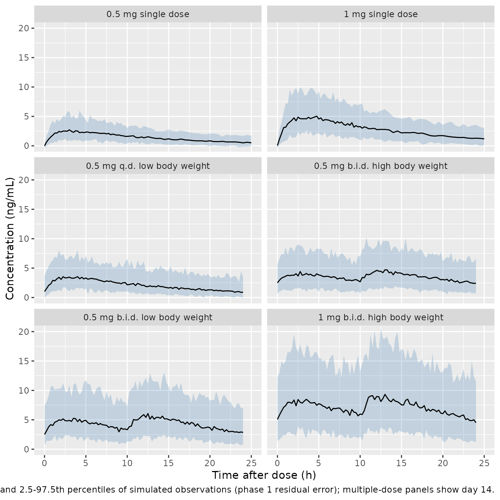
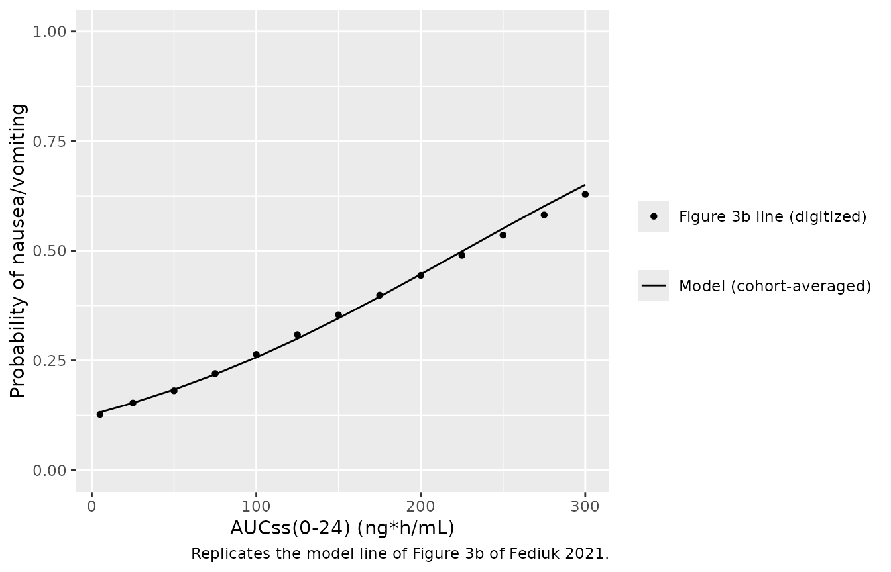
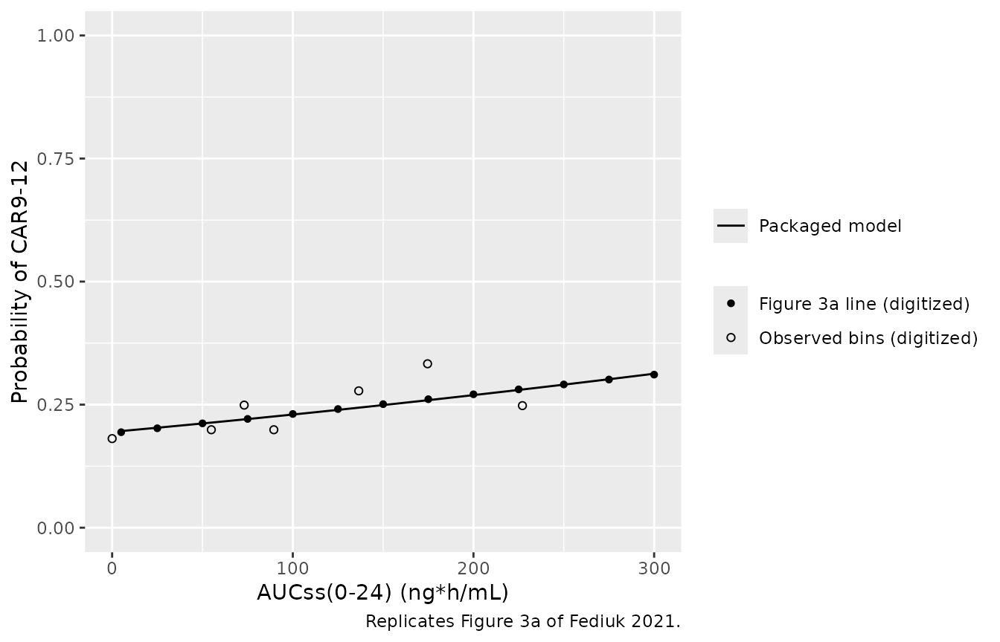

# Varenicline PK and exposure-response in adolescent smokers (Fediuk 2021)

## Model and source

Fediuk 2021 pooled two phase 1 PK studies and one phase 4 efficacy and
safety study of varenicline in adolescent smokers. It fitted a
population PK model and then two logistic exposure-response (ER) models
on the phase 4 subjects, driven by the individual steady-state daily
exposure AUC(0-24) from the PK model. The three analyses were fitted
separately (NONMEM 7.3; FOCE-I for PK, Laplacian likelihood for ER), so
they are packaged as three model files:

| Model | Endpoint | n |
|----|----|----|
| `Fediuk_2021_varenicline` | Plasma varenicline, one-compartment popPK | 218 |
| `Fediuk_2021_varenicline_nausea` | Nausea or vomiting incidence over the 12-week treatment period (final model) | 238 |
| `Fediuk_2021_varenicline_car_w9_12` | Continuous abstinence rate, weeks 9-12 (base model, digitized) | 238 |

- Citation: Fediuk DJ, Sweeney K, Sahasrabudhe V, McRae T, Byon W.
  Population pharmacokinetics and exposure-response analyses of
  varenicline in adolescent smokers. CPT Pharmacometrics Syst Pharmacol.
  2021;10(7):769-781. <doi:10.1002/psp4.12645>
- Article: <https://doi.org/10.1002/psp4.12645> (open access,
  PMC8302239)
- Supplement: Text S1 (popPK control stream), Text S2 (nausea/vomiting
  control stream), Table S1 (base-model building) and Table S2
  (nausea/vomiting estimates), all from the article’s Supporting
  Information.
- Adult comparator already in the library:
  [`Ravva_2009_varenicline`](https://nlmixr2.github.io/nlmixr2lib/articles/Ravva_2009_varenicline.md)
  (popPK) and
  [`Ravva_2010_varenicline_nausea`](https://nlmixr2.github.io/nlmixr2lib/articles/Ravva_2010_varenicline_exposure_response.md)
  (adult ER, same model shape).

``` r

mod_pk <- readModelDb("Fediuk_2021_varenicline")
mod_nv <- readModelDb("Fediuk_2021_varenicline_nausea")
mod_car <- readModelDb("Fediuk_2021_varenicline_car_w9_12")
```

## Population

The popPK analysis used 1,097 plasma concentrations from 218
varenicline-treated adolescents (Fediuk 2021 Table 2): 22 from a
single-dose phase 1 study (0.5 or 1 mg; 86% Black), 57 from a 14-day
multiple-dose phase 1 study and 139 from the 12-week phase 4 study.
Median age was 16 years (range 12-20), median body weight 62.1 kg
(35.0-121), 37.6% were female, and the race mix was 65.1% White, 14.2%
Black, 11.9% Asian and 8.7% other. About 99% had normal renal function.
Doses were weight-banded: 0.5 mg q.d. or 0.5 mg b.i.d. for body weight
up to 55 kg, and 0.5 mg b.i.d. or 1 mg b.i.d. above 55 kg.

The ER analyses used the 238 phase 4 subjects with one observation each:
99 on placebo (AUC24 = 0) and 139 on varenicline with at least one
measurable concentration. They were 34% female, 73.9% White, 6.7% Black
and 19.3% Asian/other, and 81% smoked their first cigarette within 30
minutes of waking.

The same information is available programmatically via each model’s
`population` metadata
(e.g. `readModelDb("Fediuk_2021_varenicline")()$population`).

## Source trace

Every `ini()` value carries an in-file comment naming its source. They
are collected here.

### Population PK (`Fediuk_2021_varenicline`)

| Parameter | Value | Source location |
|----|----|----|
| `lcl` (CL/F, L/h) | log(12.5) | Table 3; Text S1 THETA(1) |
| `lvc` (V/F, L) | log(231) | Table 3; Text S1 THETA(2) |
| `lka` (1/h) | log(0.860) | Table 3; Text S1 THETA(3) |
| `e_wt_cl`, `e_wt_vc` | 0.567, 0.872 | Table 3 ‘Body weight’ rows; Text S1 THETA(4), THETA(5) |
| `e_race_black_cl`, `e_race_other_cl`, `e_sexf_cl` | 1.01, 1.12, 0.850 | Table 3 CL/F rows; Text S1 THETA(6)-THETA(8) |
| `e_race_black_vc`, `e_race_other_vc`, `e_sexf_vc` | 0.757, 0.854, 0.861 | Table 3 V/F rows; Text S1 THETA(9)-THETA(11) |
| `etalcl + etalvc + etalka` block | 0.102; -0.00162, 0.0182; -0.0582, 0.0307, 0.174 | Table 3 omega2 and COV rows |
| `propSdPh1`, `addSdPh1` | 0.291, 0.240 ng/mL | Table 3 sigma2 0.0847, 0.0577 (0.240 ng/mL); Results ‘29.1%’ |
| `propSdPh4`, `addSdPh4` | 0.432, 0.580 ng/mL | Table 3 sigma2 0.187, 0.336 (0.580 ng/mL); Results ‘43.2%’ |
| Covariate equations | power on WT/70; theta^indicator | Methods equations; Text S1 \$PK |
| One-compartment first-order absorption | n/a | Methods; Text S1 `ADVAN2 TRANS2` |
| `Cc = 1000 * central / vc` | n/a | Text S1 `S2 = V/1000` (mg dose, ng/mL) |
| Study-stratum residual switch | n/a | Text S1 \$ERROR `IF(PROT.EQ.1073) IND = 1` |

### Nausea or vomiting (`Fediuk_2021_varenicline_nausea`)

| Parameter | Value | Source location |
|----|----|----|
| `base_logit` | -30.9 | Table S2 theta1; Text S2 THETA(1) |
| `e_auc_varen_base_logit` (per ng\*h/mL) | 0.00911 | Table S2 theta2 |
| `e_smoke_ttfc_31_60_base_logit`, `_6_30_`, `_le5_` | 0.0750, 0.0773, 0.0779 | Table S2 theta3-theta5 |
| `e_age_base_logit` (on AGE/16) | -0.296 | Table S2 theta6 |
| `e_sexf_base_logit` | 0.554 | Table S2 theta7 |
| `e_race_black_base_logit`, `e_race_other_base_logit` | 0.870, 0.966 | Table S2 theta8, theta9 |
| `etabase_logit` | fixed(0) | Text S2 `$OMEGA 0 FIX` |
| Logit equation | covariates multiply the intercept, AUC additive | Methods equation; Text S2 `LGT` |
| `addSd` | fixed(0.001) | Not paper-derived (placeholder; see Assumptions) |

### Continuous abstinence weeks 9-12 (`Fediuk_2021_varenicline_car_w9_12`)

| Parameter | Value | Source location |
|----|----|----|
| `base_logit` | -1.42 | Digitized from the Figure 3a ‘Model predicted’ line (not printed) |
| `e_auc_varen_base_logit` (per ng\*h/mL) | 0.00211 | Digitized from Figure 3a (not printed; Results give only p = 0.303) |
| `addSd` | fixed(0.001) | Not paper-derived (placeholder; see Assumptions) |

## Population PK

### Covariate effects on AUC24 (Figure 2)

Figure 2 prints the ratio of typical AUC24 to that of the 70 kg White
male reference. Because AUC24 = daily dose / (CL/F), each ratio is the
inverse of the typical CL/F ratio, so the model must reproduce all five
printed values to the two printed decimals.

``` r

ref_cov <- data.frame(WT = 70, SEXF = 0, RACE_BLACK = 0, RACE_OTHER = 0)
fig2 <- tibble::tribble(
  ~label,         ~WT, ~SEXF, ~RACE_BLACK, ~RACE_OTHER, ~published,
  "Weight 60 kg",  60,     0,           0,           0,       1.09,
  "Weight 80 kg",  80,     0,           0,           0,       0.93,
  "Race (black)",  70,     0,           1,           0,       0.99,
  "Race (other)",  70,     0,           0,           1,       0.89,
  "Sex (female)",  70,     1,           0,           0,       1.18
)
typical_cl <- function(cov) {
  ev <- dplyr::bind_cols(
    data.frame(id = seq_len(nrow(cov)), time = 0, evid = 0, amt = 0,
               cmt = "central", STUDY_PHASE4 = 0),
    cov
  )
  rxode2::rxSolve(rxode2::zeroRe(mod_pk), ev, returnType = "data.frame")$cl
}
cl_ref <- typical_cl(ref_cov)
#> ℹ parameter labels from comments will be replaced by 'label()'
#> Warning: No sigma parameters in the model
#> ℹ omega/sigma items treated as zero: 'etalcl', 'etalvc', 'etalka'
fig2$model <- cl_ref / typical_cl(fig2[, c("WT", "SEXF", "RACE_BLACK", "RACE_OTHER")])
#> ℹ parameter labels from comments will be replaced by 'label()'
#> Warning: No sigma parameters in the model
#> ℹ omega/sigma items treated as zero: 'etalcl', 'etalvc', 'etalka'
#> Warning: multi-subject simulation without without 'omega'
stopifnot(nrow(fig2) == 5, abs(cl_ref - 12.5) < 1e-6)
# Deterministic: the unrounded ratio must round to the printed value.
stopifnot(all(abs(fig2$model - fig2$published) <= 0.005 + 1e-9))

fig2 |>
  dplyr::select(label, published, model) |>
  dplyr::mutate(model = signif(model, 4)) |>
  dplyr::rename("Covariate" = label, "Figure 2 ratio" = published,
                "Model ratio" = model) |>
  knitr::kable(caption = "Typical AUC24 relative to a 70 kg White male.")
```

| Covariate    | Figure 2 ratio | Model ratio |
|:-------------|---------------:|------------:|
| Weight 60 kg |           1.09 |      1.0910 |
| Weight 80 kg |           0.93 |      0.9271 |
| Race (black) |           0.99 |      0.9901 |
| Race (other) |           0.89 |      0.8929 |
| Sex (female) |           1.18 |      1.1760 |

Typical AUC24 relative to a 70 kg White male. {.table}

### Comparison with adults (Discussion)

The Discussion states that the adolescent CL/F and V/F are about 20%
higher and 31% lower than in adults (Ravva 2009), and that the higher
CL/F means an about 17% lower AUC24. The adult model is in the library,
so the arithmetic can be checked directly from both parameter sets.

``` r

th_ad <- rxode2::rxode2(readModelDb("Fediuk_2021_varenicline"))$theta
#> ℹ parameter labels from comments will be replaced by 'label()'
th_adult <- rxode2::rxode2(readModelDb("Ravva_2009_varenicline"))$theta
cl_pct <- 100 * (exp(th_ad[["lcl"]]) / exp(th_adult[["lcl"]]) - 1)
v_pct <- 100 * (1 - exp(th_ad[["lvc"]]) / exp(th_adult[["lvc"]]))
auc_pct <- 100 * (1 - exp(th_adult[["lcl"]]) / exp(th_ad[["lcl"]]))
adult_tab <- data.frame(
  Claim = c("CL/F higher than adults (%)", "V/F lower than adults (%)",
            "AUC24 lower than adults (%)"),
  Paper = c(20, 31, 17),
  Model = round(c(cl_pct, v_pct, auc_pct), 1)
)
stopifnot(all(abs(adult_tab$Model - adult_tab$Paper) < 1))
knitr::kable(adult_tab)
```

| Claim                       | Paper | Model |
|:----------------------------|------:|------:|
| CL/F higher than adults (%) |    20 |  20.2 |
| V/F lower than adults (%)   |    31 |  31.5 |
| AUC24 lower than adults (%) |    17 |  16.8 |

The typical adolescent half-life is 12.8 h (ln 2 x V/F / CL/F), shorter
than the ~24 h reported in adults, which the authors attribute to the
smaller apparent volume.

### Virtual cohorts

Each Figure 1 panel is simulated with 100 subjects. Body weight is drawn
from a normal distribution matching the pooled popPK cohort (mean 63.9,
SD 13.5 kg, Table 2) and redrawn until it falls in the panel’s weight
band (low body weight at most 55 kg, high body weight above 55 kg); the
band is a definition, so weights are never clamped. Sex and race follow
the Table 2 proportions of the contributing studies.

``` r

set.seed(20210629)
draw_wt <- function(n, lo, hi) {
  out <- numeric(0)
  while (length(out) < n) {
    w <- stats::rnorm(4 * n, 63.9, 13.5)
    out <- c(out, w[w > lo & w <= hi])
  }
  out[seq_len(n)]
}
draw_race <- function(n, p_black, p_other) {
  u <- stats::runif(n)
  data.frame(RACE_BLACK = as.integer(u < p_black),
             RACE_OTHER = as.integer(u >= p_black & u < p_black + p_other))
}
n_arm <- 100L
arms <- tibble::tribble(
  ~arm,                                ~dose, ~bid,  ~lo,  ~hi, ~single, ~p_f,  ~p_black, ~p_other,
  "0.5 mg single dose",                  0.5, FALSE, 35,   121,  TRUE,   0.409, 0.864,    0,
  "1 mg single dose",                    1.0, FALSE, 35,   121,  TRUE,   0.409, 0.864,    0,
  "0.5 mg q.d. low body weight",         0.5, FALSE, 35,   55,   FALSE,  0.376, 0.142,    0.206,
  "0.5 mg b.i.d. high body weight",      0.5, TRUE,  55,   121,  FALSE,  0.376, 0.142,    0.206,
  "0.5 mg b.i.d. low body weight",       0.5, TRUE,  35,   55,   FALSE,  0.376, 0.142,    0.206,
  "1 mg b.i.d. high body weight",        1.0, TRUE,  55,   121,  FALSE,  0.376, 0.142,    0.206
)
make_arm <- function(k) {
  a <- arms[k, ]
  subj <- data.frame(
    id = (k - 1L) * n_arm + seq_len(n_arm),
    WT = draw_wt(n_arm, a$lo, a$hi),
    SEXF = stats::rbinom(n_arm, 1, a$p_f),
    STUDY_PHASE4 = 0L,
    arm = a$arm
  )
  subj <- dplyr::bind_cols(subj, draw_race(n_arm, a$p_black, a$p_other))
  if (a$single) {
    dose_t <- 0
    obs_t <- sort(unique(c(seq(0, 12, by = 0.25), seq(12.5, 48, by = 0.5))))
    t_ref <- 0
  } else {
    # 14 days; the evening dose ~10 h after the morning dose (Table 1 note c)
    dose_t <- sort(c(seq(0, 13 * 24, by = 24), if (a$bid) seq(10, 13 * 24 + 10, by = 24)))
    t_ref <- 13 * 24
    obs_t <- t_ref + seq(0, 24, by = 0.25)
  }
  doses <- merge(subj, data.frame(time = dose_t, evid = 1L, amt = a$dose, cmt = "depot"))
  obs <- merge(subj, data.frame(time = obs_t, evid = 0L, amt = 0, cmt = "central"))
  out <- dplyr::bind_rows(doses, obs) |> dplyr::arrange(id, time, dplyr::desc(evid))
  out$tad <- out$time - t_ref
  out
}
events <- dplyr::bind_rows(lapply(seq_len(nrow(arms)), make_arm))
stopifnot(
  !anyDuplicated(events[events$evid == 1, c("id", "time")]),
  length(unique(events$id)) == nrow(arms) * n_arm,
  all(events$WT[grepl("low body", events$arm)] <= 55),
  all(events$WT[grepl("high body", events$arm)] > 55)
)
```

### Figure 1: visual predictive check

``` r

sim_pk <- rxode2::rxSolve(mod_pk, events, keep = c("arm", "tad", "WT"),
                          returnType = "data.frame")
#> ℹ parameter labels from comments will be replaced by 'label()'
stopifnot(!anyNA(sim_pk$Cc))
```

``` r

sim_pk |>
  dplyr::filter(tad >= 0, tad <= 25) |>
  dplyr::group_by(arm, tad) |>
  dplyr::summarise(
    lo = quantile(sim, 0.025), med = median(sim), hi = quantile(sim, 0.975),
    .groups = "drop"
  ) |>
  dplyr::mutate(arm = factor(arm, levels = arms$arm)) |>
  ggplot(aes(tad, med)) +
  geom_ribbon(aes(ymin = lo, ymax = hi), fill = "steelblue", alpha = 0.25) +
  geom_line() +
  facet_wrap(~arm, ncol = 2) +
  coord_cartesian(ylim = c(0, 20)) +
  labs(x = "Time after dose (h)", y = "Concentration (ng/mL)",
       caption = paste("Replicates the layout of Figure 1 of Fediuk 2021:",
                       "median and 2.5-97.5th percentiles of simulated",
                       "observations (phase 1 residual error); multiple-dose",
                       "panels show day 14."))
```



### PKNCA: single-dose profiles

The paper reports no NCA table. The PKNCA run below summarises the
single-dose arms and gates the typical-value solve against the model’s
own closed-form identity AUC(0-inf) = 1000 x Dose / (CL/F), which a
dose, unit or volume transcription error would break.

``` r

sd_ev <- events |> dplyr::filter(grepl("single", arm))
nca_input <- function(sim) {
  sim |>
    dplyr::filter(!is.na(Cc)) |>
    dplyr::mutate(Cc = pmax(Cc, 0)) |>
    dplyr::select(id, time, Cc, arm)
}
sd_sim <- sim_pk |> dplyr::filter(grepl("single", arm))
conc_obj <- PKNCA::PKNCAconc(nca_input(sd_sim), Cc ~ time | arm + id)
dose_obj <- PKNCA::PKNCAdose(
  sd_ev |> dplyr::filter(evid == 1) |> dplyr::select(id, time, amt, arm),
  amt ~ time | arm + id
)
intervals <- data.frame(start = 0, end = Inf, cmax = TRUE, tmax = TRUE,
                        aucinf.obs = TRUE, half.life = TRUE)
nca_res <- PKNCA::pk.nca(PKNCA::PKNCAdata(conc_obj, dose_obj, intervals = intervals))
summary(nca_res)
#>  start end                arm   N        cmax              tmax   half.life
#>      0 Inf 0.5 mg single dose 100 2.56 [27.6] 3.00 [1.50, 5.25] 10.6 [4.54]
#>      0 Inf   1 mg single dose 100 5.02 [23.2] 3.25 [1.75, 5.50] 10.8 [4.14]
#>   aucinf.obs
#>  46.0 [36.9]
#>  93.0 [35.7]
#> 
#> Caption: cmax, aucinf.obs: geometric mean and geometric coefficient of variation; tmax: median and range; half.life: arithmetic mean and standard deviation; N: number of subjects
```

``` r

# Typical 70 kg White male, 0.5 and 1 mg single dose, fine grid, tight solver
typ_ev <- data.frame(id = 1:2, WT = 70, SEXF = 0, RACE_BLACK = 0, RACE_OTHER = 0,
                     STUDY_PHASE4 = 0, arm = c("0.5 mg", "1 mg"), dose = c(0.5, 1)) |>
  merge(data.frame(time = c(0, seq(0.05, 2, by = 0.05), seq(2.25, 24, by = 0.25),
                            seq(25, 240, by = 1)))) |>
  dplyr::mutate(evid = 0L, amt = 0, cmt = "central")
typ_ev <- dplyr::bind_rows(
  typ_ev |> dplyr::distinct(id, .keep_all = TRUE) |>
    dplyr::mutate(time = 0, evid = 1L, amt = dose, cmt = "depot"),
  typ_ev
) |> dplyr::arrange(id, time, dplyr::desc(evid))
typ_sim <- rxode2::rxSolve(rxode2::zeroRe(mod_pk), typ_ev, keep = c("arm", "dose"),
                           rtol = 1e-10, atol = 1e-12, returnType = "data.frame")
#> ℹ parameter labels from comments will be replaced by 'label()'
#> Warning: No sigma parameters in the model
#> ℹ omega/sigma items treated as zero: 'etalcl', 'etalvc', 'etalka'
#> Warning: multi-subject simulation without without 'omega'
typ_nca <- PKNCA::pk.nca(PKNCA::PKNCAdata(
  PKNCA::PKNCAconc(nca_input(typ_sim), Cc ~ time | arm + id),
  PKNCA::PKNCAdose(typ_ev |> dplyr::filter(evid == 1) |> dplyr::select(id, time, amt, arm),
                   amt ~ time | arm + id),
  intervals = data.frame(start = 0, end = Inf, aucinf.obs = TRUE, cmax = TRUE, tmax = TRUE)
))
typ_tab <- as.data.frame(typ_nca$result) |>
  dplyr::filter(PPTESTCD %in% c("aucinf.obs", "cmax", "tmax")) |>
  dplyr::select(arm, PPTESTCD, PPORRES) |>
  tidyr::pivot_wider(names_from = PPTESTCD, values_from = PPORRES) |>
  dplyr::mutate(closed_form_auc = 1000 * c(0.5, 1) / 12.5)
# 240 h is ~19 half-lives, so extrapolation is negligible; the residual is
# trapezoidal error around tmax (~0.1% on this grid).
stopifnot(nrow(typ_tab) == 2,
          all(abs(typ_tab$aucinf.obs / typ_tab$closed_form_auc - 1) < 0.01))
typ_tab |>
  dplyr::rename("Dose" = arm, "Cmax (ng/mL)" = cmax, "Tmax (h)" = tmax,
                "AUC0-inf PKNCA (ng*h/mL)" = aucinf.obs,
                "1000 x Dose / CL (ng*h/mL)" = closed_form_auc) |>
  knitr::kable(digits = 2, caption = "Typical 70 kg White male, single dose.")
```

| Dose | Cmax (ng/mL) | Tmax (h) | AUC0-inf PKNCA (ng\*h/mL) | 1000 x Dose / CL (ng\*h/mL) |
|:---|---:|---:|---:|---:|
| 0.5 mg | 1.80 | 3.5 | 40 | 40 |
| 1 mg | 3.59 | 3.5 | 80 | 80 |

Typical 70 kg White male, single dose. {.table}

### Phase 4 exposure by dose group (Figure 3, lower panels)

The box plots under Figure 3 show the empirical-Bayes AUC24 of the phase
4 varenicline subjects per dose and weight group. The medians were
digitized by the maintainers from the vector graphic. The model’s
individual AUC24 (daily dose / individual CL/F) in 200 simulated
subjects per group with the phase 4 demographics (32.4% female; 7.9%
Black; 18.7% Asian/other) is compared below.

``` r

fig3_box <- tibble::tribble(
  ~group,                           ~daily_dose, ~lo, ~hi,  ~digitized_median,
  "0.5 mg q.d. low body weight",    0.5,         35,  55,   50.2,
  "0.5 mg b.i.d. low body weight",  1.0,         35,  55,   84.1,
  "0.5 mg b.i.d. high body weight", 1.0,         55,  121,  79.5,
  "1 mg b.i.d. high body weight",   2.0,         55,  121,  152.8
)
n_grp <- 200L
auc_ev <- dplyr::bind_rows(lapply(seq_len(nrow(fig3_box)), function(k) {
  g <- fig3_box[k, ]
  d <- data.frame(id = (k - 1L) * n_grp + seq_len(n_grp), time = 0, evid = 0L,
                  amt = 0, cmt = "central", group = g$group,
                  daily_dose = g$daily_dose, WT = draw_wt(n_grp, g$lo, g$hi),
                  SEXF = stats::rbinom(n_grp, 1, 0.324), STUDY_PHASE4 = 1L)
  dplyr::bind_cols(d, draw_race(n_grp, 0.079, 0.187))
}))
auc_sim <- rxode2::rxSolve(mod_pk, auc_ev, keep = c("group", "daily_dose"),
                           returnType = "data.frame") |>
  dplyr::mutate(AUC24 = 1000 * daily_dose / cl)
auc_cmp <- auc_sim |>
  dplyr::group_by(group) |>
  dplyr::summarise(model_median = median(AUC24), .groups = "drop") |>
  dplyr::inner_join(fig3_box, by = "group") |>
  dplyr::mutate(pct_diff = 100 * (model_median / digitized_median - 1))
stopifnot(
  nrow(auc_cmp) == 4,
  # Structural gate only. The comparison is simulated individual AUC24 against
  # the medians of shrunken empirical-Bayes AUC24 in groups of unknown size and
  # weight mix, so the model sits systematically above the figure (realized
  # +2% to +20%, centre about +13%, on the development machine; see
  # Assumptions). A mis-transcribed CL/F or a unit error moves every group by
  # far more than these bounds (a 1000-fold unit slip, or CL/F off by 2x).
  abs(median(auc_cmp$pct_diff)) < 25,
  all(abs(auc_cmp$pct_diff) < 40)
)
auc_cmp |>
  dplyr::select(group, digitized_median, model_median, pct_diff) |>
  dplyr::rename("Dose group" = group, "Figure 3 median (digitized)" = digitized_median,
                "Model median" = model_median, "Difference (%)" = pct_diff) |>
  knitr::kable(digits = 1, caption = "Median AUC24 (ng*h/mL) by phase 4 dose group.")
```

| Dose group | Figure 3 median (digitized) | Model median | Difference (%) |
|:---|---:|---:|---:|
| 0.5 mg b.i.d. high body weight | 79.5 | 81.3 | 2.2 |
| 0.5 mg b.i.d. low body weight | 84.1 | 101.0 | 20.1 |
| 0.5 mg q.d. low body weight | 50.2 | 55.1 | 9.7 |
| 1 mg b.i.d. high body weight | 152.8 | 177.7 | 16.3 |

Median AUC24 (ng\*h/mL) by phase 4 dose group. {.table}

## Nausea or vomiting exposure-response

`AUC_VAREN` is the individual AUC24 in ng\*h/mL (0 for placebo). The
helper below solves the model for a data frame of covariate rows.

``` r

p_nv <- function(cov) {
  ev <- dplyr::bind_cols(data.frame(id = seq_len(nrow(cov)), time = 0, evid = 0L, amt = 0), cov)
  rxode2::rxSolve(mod_nv, ev, returnType = "data.frame")$prob_nausea_vomiting
}
```

### Figure 4: covariate effects

Figure 4 plots the probability ratio against a representative subject
(16-year-old White male, first cigarette 31-60 min after waking, AUC24 =
153 ng\*h/mL). The point estimates were digitized by the maintainers
from the vector graphic.

``` r

rep_subj <- data.frame(AGE = 16, SEXF = 0, RACE_BLACK = 0, RACE_OTHER = 0,
                       SMOKE_TTFC_SCORE = 1, AUC_VAREN = 153)
fig4 <- tibble::tribble(
  ~label,                        ~AGE, ~SEXF, ~RACE_BLACK, ~RACE_OTHER, ~SMOKE_TTFC_SCORE, ~digitized,
  "Age = 12 y",                    12,     0,           0,           0,                 1,     0.863,
  "Age = 17 y",                    17,     0,           0,           0,                 1,     1.035,
  "Age = 19 y",                    19,     0,           0,           0,                 1,     1.087,
  "Female",                        16,     1,           0,           0,                 1,     1.864,
  "First cig. > 60 min",           16,     0,           0,           0,                 0,     0.000,
  "First cig. within 6-30 min",    16,     0,           0,           0,                 2,     0.955,
  "First cig. < 5 min",            16,     0,           0,           0,                 3,     0.941,
  "Race (black)",                  16,     0,           1,           0,                 1,     1.234,
  "Race (other)",                  16,     0,           0,           1,                 1,     1.063
)
p_ref <- p_nv(rep_subj)
#> ℹ parameter labels from comments will be replaced by 'label()'
#> ℹ omega/sigma items treated as zero: 'etabase_logit'
fig4$model <- p_nv(dplyr::mutate(fig4[, c("AGE", "SEXF", "RACE_BLACK", "RACE_OTHER",
                                           "SMOKE_TTFC_SCORE")], AUC_VAREN = 153)) / p_ref
#> ℹ omega/sigma items treated as zero: 'etabase_logit'
#> Warning: multi-subject simulation without without 'omega'
# Deterministic; the digitized points sit 0.003-0.008 above the model on every
# row (a constant plotting offset), so 0.015 leaves headroom and still catches
# any mis-transcribed factor.
stopifnot(nrow(fig4) == 9, all(abs(fig4$model - fig4$digitized) < 0.015),
          abs(fig4$model[fig4$label == "Female"] - 1.86) < 0.01)
fig4 |>
  dplyr::select(label, digitized, model) |>
  dplyr::rename("Covariate" = label, "Figure 4 (digitized)" = digitized,
                "Model" = model) |>
  knitr::kable(digits = 3, caption = paste0(
    "Probability ratio vs the representative subject (model p = ",
    signif(p_ref, 3), ")."))
```

| Covariate                  | Figure 4 (digitized) | Model |
|:---------------------------|---------------------:|------:|
| Age = 12 y                 |                0.863 | 0.859 |
| Age = 17 y                 |                1.035 | 1.030 |
| Age = 19 y                 |                1.087 | 1.084 |
| Female                     |                1.864 | 1.856 |
| First cig. \> 60 min       |                0.000 | 0.000 |
| First cig. within 6-30 min |                0.955 | 0.950 |
| First cig. \< 5 min        |                0.941 | 0.937 |
| Race (black)               |                1.234 | 1.229 |
| Race (other)               |                1.063 | 1.057 |

Probability ratio vs the representative subject (model p = 0.284).
{.table}

The Results statement of an “~86%” increase for female smokers is
reproduced (ratio 1.856). The very small probability at “first cigarette
\> 60 min” is the model reference level: its intercept of -30.9 is
scaled by about 0.075-0.078 for every other level, and only 5 of the 238
subjects were in it.

### Figure 3b: probability versus exposure

The Figure 3b ‘Model predicted’ line is not a single logistic curve; it
closely matches the model’s predicted probability averaged over the
covariate mix of the phase 4 ER cohort (Table 2), which is what is
computed below on a deterministic grid of covariate combinations (age
from a normal distribution with the Table 2 mean 15.8 and SD 1.81 years,
discretised on 12-20 years).

``` r

fig3b <- data.frame(
  AUC = c(5, 25, 50, 75, 100, 125, 150, 175, 200, 225, 250, 275, 300),
  digitized = c(0.127, 0.153, 0.181, 0.220, 0.264, 0.309, 0.354, 0.399, 0.444,
                0.490, 0.536, 0.582, 0.629)
)
age_grid <- data.frame(AGE = seq(12, 20, by = 0.25))
age_grid$w_age <- stats::dnorm(age_grid$AGE, 15.8, 1.81)
age_grid$w_age <- age_grid$w_age / sum(age_grid$w_age)
cov_grid <- tidyr::crossing(
  data.frame(SMOKE_TTFC_SCORE = 0:3, w_ttfc = c(5, 39, 96, 98) / 238),
  data.frame(SEXF = 0:1, w_sex = c(157, 81) / 238),
  data.frame(RACE_BLACK = c(0, 1, 0), RACE_OTHER = c(0, 0, 1),
             w_race = c(176, 16, 46) / 238),
  age_grid,
  data.frame(AUC_VAREN = fig3b$AUC)
) |>
  dplyr::mutate(w = w_ttfc * w_sex * w_race * w_age)
cov_grid$p <- p_nv(cov_grid[, c("AGE", "SEXF", "RACE_BLACK", "RACE_OTHER",
                                "SMOKE_TTFC_SCORE", "AUC_VAREN")])
#> ℹ omega/sigma items treated as zero: 'etabase_logit'
#> Warning: multi-subject simulation without without 'omega'
avg <- cov_grid |>
  dplyr::group_by(AUC = AUC_VAREN) |>
  dplyr::summarise(model = sum(w * p) / sum(w), .groups = "drop") |>
  dplyr::inner_join(fig3b, by = "AUC")
# Deterministic. Realized maximum 0.022 (at AUC 300, beyond most of the data);
# 0.035 still catches a slope or intercept error, which moves the curve by
# more than 0.1.
stopifnot(nrow(avg) == nrow(fig3b), max(abs(avg$model - avg$digitized)) < 0.035)
ggplot(avg, aes(AUC)) +
  geom_line(aes(y = model, linetype = "Model (cohort-averaged)")) +
  geom_point(aes(y = digitized, shape = "Figure 3b line (digitized)")) +
  coord_cartesian(ylim = c(0, 1)) +
  labs(x = "AUCss(0-24) (ng*h/mL)", y = "Probability of nausea/vomiting",
       linetype = NULL, shape = NULL,
       caption = "Replicates the model line of Figure 3b of Fediuk 2021.")
```



## Continuous abstinence, weeks 9-12

The paper reports this model only through Figure 3a and its slope
p-value (0.303). The dotted ‘Model predicted’ line is a straight line in
probability, from 0.192 at AUC24 = 0 to 0.320 at the largest observed
AUC24 (about 314 ng\*h/mL). The packaged logistic was fitted by the
maintainers to that line (see Assumptions); the check below confirms it
stays on the drawn line.

``` r

fig3a <- data.frame(
  AUC = c(5, 25, 50, 75, 100, 125, 150, 175, 200, 225, 250, 275, 300),
  digitized = c(0.194, 0.202, 0.212, 0.221, 0.231, 0.241, 0.251, 0.261, 0.271,
                0.281, 0.291, 0.301, 0.311)
)
fig3a$model <- rxode2::rxSolve(
  mod_car,
  data.frame(id = seq_len(nrow(fig3a)), time = 0, evid = 0L, amt = 0,
             AUC_VAREN = fig3a$AUC),
  returnType = "data.frame"
)$p_car
#> Warning: multi-subject simulation without without 'omega'
# Deterministic; realized maximum 0.0023.
stopifnot(max(abs(fig3a$model - fig3a$digitized)) < 0.01)
# Observed binned proportions from Figure 3a (digitized), for context only.
obs3a <- data.frame(AUC = c(0, 54.9, 73.1, 89.5, 136.5, 174.6, 227.1),
                    p = c(0.181, 0.199, 0.249, 0.199, 0.278, 0.333, 0.248))
ggplot(fig3a, aes(AUC)) +
  geom_line(aes(y = model, linetype = "Packaged model")) +
  geom_point(aes(y = digitized, shape = "Figure 3a line (digitized)")) +
  geom_point(data = obs3a, aes(y = p, shape = "Observed bins (digitized)")) +
  scale_shape_manual(values = c(16, 1)) +
  coord_cartesian(ylim = c(0, 1)) +
  labs(x = "AUCss(0-24) (ng*h/mL)", y = "Probability of CAR9-12",
       linetype = NULL, shape = NULL,
       caption = "Replicates Figure 3a of Fediuk 2021.")
```



## Assumptions and deviations

- **CAR9-12 parameters are digitized, not published.** Fediuk 2021 gives
  no estimates for the CAR9-12 model (Table S2 and Text S2 cover the
  nausea/vomiting model only) and states only that the AUC24 slope was
  not significant (p = 0.303) so no covariates were added. The
  maintainers extracted the dotted ‘Model predicted’ line of Figure 3a
  from the article’s vector graphics (99 dash segments, axes mapped on
  the printed ticks) and fitted `logit(p) = base_logit + slope x AUC24`
  to it on the logit scale, giving -1.42 and 0.00211 per ng*h/mL. The
  drawn line is exactly straight in probability, which a logistic curve
  cannot be, so the plot was probably drawn through two predicted
  points; the fitted logistic stays within 0.003 of it over the observed
  exposure range (0-314 ng*h/mL). Treat the slope as a figure
  approximation with no uncertainty estimate, and do not extrapolate
  beyond that range.
- **Figure 2 and Figure 4 values.** Figure 2 ratios are printed in the
  figure and were read from the PDF text. Figure 4 prints no numbers;
  its point estimates, the Figure 3 exposure-box medians and the Figure
  3a/3b lines were digitized by the maintainers from the vector graphics
  (reading precision about 0.005 on the ratio axis).
- **Placeholder residual on the ER models.** The ER models were fitted
  with a Bernoulli likelihood (Text S2 `Y = P**DV*(1-P)**(1-DV)`), which
  has no residual-error parameter. Both ER files expose the
  deterministic probability with a fixed additive SD of 0.001 so the
  model can be declared; draw binary outcomes externally with
  `rbinom(n, 1, p)`.
- **Between-subject variance of the nausea/vomiting logit** is
  `fixed(0)`, as in Text S2 (`$OMEGA 0 FIX`, naive-pooled analysis).
- **Residual error stratum.** The phase 1 and phase 4 studies have
  separate residual errors, selected by the new `STUDY_PHASE4` column (0
  = phase 1, 1 = phase 4). It does not change typical-value predictions.
  The Figure 1 replicate uses the phase 1 values.
- **Omega covariances.** Table 3 prints the CL/F-V/F and CL/F-ka
  covariances as -0.00162 and -0.0582, while the Text S1 `$OMEGA` block
  (the initial values of the final run) prints -0.00161 and -0.0581; the
  Table 3 final estimates are used.
- **Reported %CV of the IIV.** Results quotes 32%, 13% and 44% for CL/F,
  V/F and ka. These mix conventions: 32% and 13% match sqrt(omega^2)
  (31.9%, 13.5%) while 44% matches sqrt(exp(omega^2) - 1) (43.6%). The
  packaged variances are the Table 3 omega^2 values, which are
  unambiguous.
- **Bid dosing interval.** The evening dose is given 10 h after the
  morning dose in the Figure 1 replicate (Table 1 note c for the
  multiple-dose phase 1 study); titration is not simulated, and the
  plotted day-14 profile is at steady state.
- **Virtual cohorts.** Body weight is drawn from a normal distribution
  with the pooled Table 2 mean and SD and redrawn into each weight band;
  race and sex follow the Table 2 proportions.
- **Phase 4 exposure by dose group is not closely reproduced.** The
  simulated median AUC24 is above the digitized Figure 3 box-plot median
  in all four groups (about +2% for 0.5 mg b.i.d. high body weight up to
  about +20% for 0.5 mg b.i.d. low body weight). Figure 3 plots
  empirical-Bayes estimates for the phase 4 subjects, whose per-group
  size, weight and race mix are not reported, and those estimates are
  shrunk toward the population (CL/F shrinkage 30.6%); the virtual
  cohort can only approximate that mix. The typical-value checks against
  Figure 2 and the Discussion, which do not depend on a cohort, are
  reproduced exactly. The gate in that section is therefore structural
  only (it catches a unit or clearance transcription error).
- **Covariates not in the final PK model.** Age and creatinine clearance
  were deliberately not tested because both correlate with body weight
  (Methods); they are documented in `covariatesDataExcluded`.
- **No correction notice** was found for this article (EuropePMC and the
  publisher page, checked 2026-09-28).
