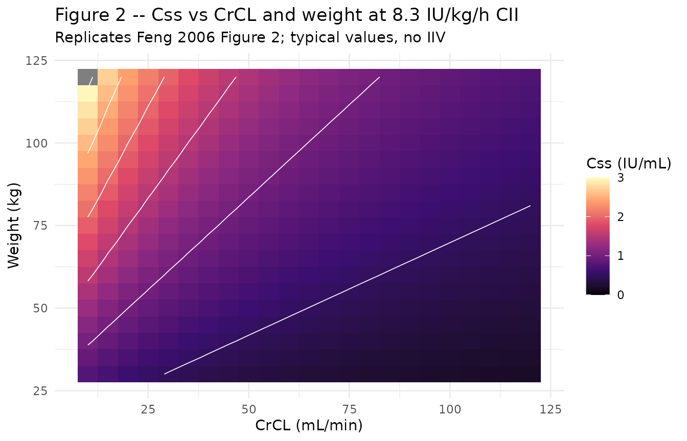
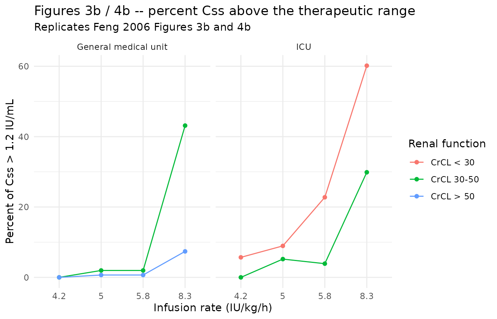
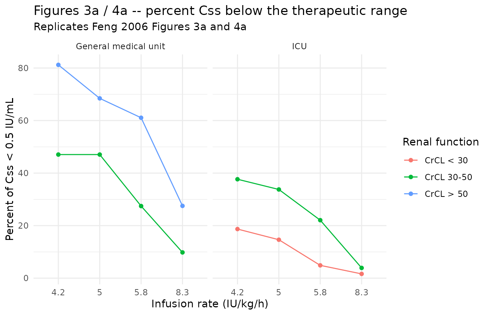
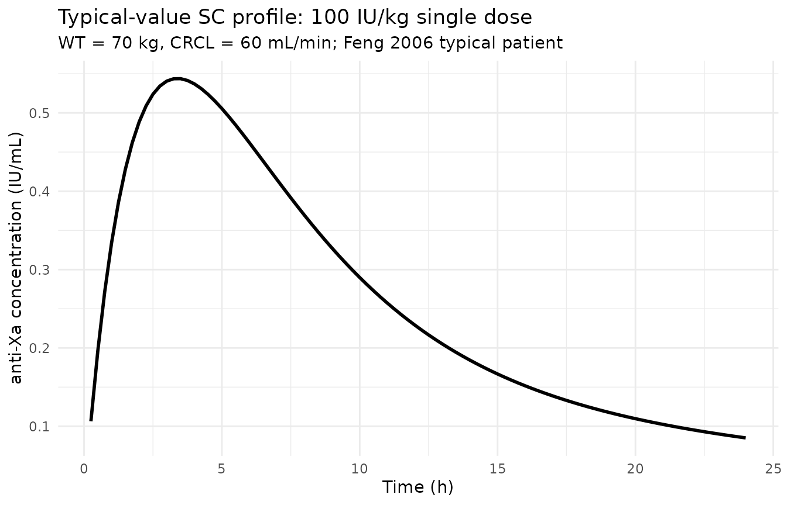

# Enoxaparin (Feng 2006)

## Model and source

``` r

mod      <- rxode2::rxode2(readModelDb("Feng_2006_enoxaparin"))
#> ℹ parameter labels from comments will be replaced by 'label()'
mod_meta <- mod$meta
```

- Citation: Feng Y, Green B, Duffull SB, Kane-Gill SL, Bobek MB, Bies
  RR. Development of a dosage strategy in patients receiving enoxaparin
  by continuous intravenous infusion using modelling and simulation. Br
  J Clin Pharmacol. 2006;62(2):165-176.
  <doi:10.1111/j.1365-2125.2006.02650.x>
- Description: Two-compartment population PK model for enoxaparin in
  adult inpatients receiving continuous intravenous infusion (CII) or
  subcutaneous (SC) dosing (Feng 2006)
- Article (DOI): <https://doi.org/10.1111/j.1365-2125.2006.02650.x>

This vignette validates the packaged `Feng_2006_enoxaparin` model – a
two-compartment population PK model for enoxaparin given by continuous
intravenous infusion (CII) or subcutaneous (SC) injection in 83 adult
inpatients (48 CII, 35 SC) – against the source publication’s Table 2
(final-model parameter estimates), Figure 2 (3-D Css surface vs CrCL and
weight), Tables 3 and 4 (percent of predicted Css outside the
therapeutic range at multiple infusion rates), and the recommended
dosing regimens summarized in the Discussion (page 174).

## Population

The Feng 2006 analysis pooled two studies. The CII cohort (n = 48) was a
retrospective chart review at the Cleveland Clinic Foundation (Jan
1997 - Dec 1998) of adult inpatients who received enoxaparin by
continuous IV infusion at an initial 100 IU/kg per 12 h (8.3 IU/kg/h);
29 were on general medical units and 19 in intensive care. Infusion
durations ranged from 8 to 894 h (mean 138 +/- 158 h) and rates from 100
to 1600 IU/h (mean 500 +/- 210 IU/h). The SC cohort (n = 35) was the
general-medical-unit subcutaneous-enoxaparin population from Green et
al. 2003 (the paper’s reference \[20\]), included to stabilize the
absorption (Ka) and bioavailability (F1) estimates. Three hundred
sixty-three anti-Xa concentrations from the CII study were combined with
309 from the SC study for a total of 672 observations.

Pooled baseline demographics (Feng 2006 Table 1): combined median age
66.6 y (16-90), median weight 71.0 kg (16-108), median CrCL 45.0 mL/min,
and 51.8% female. Per subgroup, the CII general medical unit patients
had higher renal function (median CrCL 63.5 mL/min, range 31.1-128.3)
than the CII ICU patients (median 26.8 mL/min, range 7.6-49.6); the SC
cohort fell between (median 39.2 mL/min, range 14.9-95.7). Twenty-seven
of the 48 CII patients had no available serum creatinine; the paper
handles these via a separate “CLmissing” branch (see Assumptions and
deviations).

The same information is available programmatically via the model’s
`population` metadata:

``` r

str(mod_meta$population)
#> List of 14
#>  $ species       : chr "human"
#>  $ n_subjects    : int 83
#>  $ n_studies     : int 2
#>  $ age_range     : chr "16-90 years (CII study) / 44-86 years (SC study)"
#>  $ age_median    : chr "CII general medical unit 60.9 y, CII ICU 59.3 y, SC general medical unit 75.1 y; combined 66.6 y"
#>  $ weight_range  : chr "16-108 kg (combined CII + SC)"
#>  $ weight_median : chr "CII general medical unit 74.1 kg, CII ICU 73.3 kg, SC general medical unit 67.7 kg; combined 71.0 kg"
#>  $ sex_female_pct: num 51.8
#>  $ race_ethnicity: chr "Not reported"
#>  $ disease_state : chr "Adult inpatients receiving therapeutic enoxaparin. CII cohort (n = 48): 29 general medical unit + 19 intensive "| __truncated__
#>  $ dose_range    : chr "Initial CII regimen 100 IU/kg per 12 h (8.3 IU/kg/h); infusion rates 100-1600 IU/h (mean 500 IU/h). SC cohort d"| __truncated__
#>  $ regions       : chr "United States (Cleveland Clinic Foundation, OH) and the Green 2003 SC cohort."
#>  $ renal_function: chr "CrCL median 45.0 mL/min combined; subgroup medians: SC general 39.2 mL/min (range 14.9-95.7), CII general 63.5 "| __truncated__
#>  $ notes         : chr "Baseline demographics per Feng 2006 Table 1 (combined CII + SC dataset, n = 83). The pooled analysis used 363 a"| __truncated__
```

## Source trace

The per-parameter origin is recorded as an in-file comment next to each
`ini()` entry in `inst/modeldb/specificDrugs/Feng_2006_enoxaparin.R`.
The table below collects them in one place; values come from Feng 2006
Table 2 final-model column unless noted otherwise.

| Parameter / equation | Value | Source location |
|----|----|----|
| `lka <- log(0.476)` (Ka, 1/h) | 0.476 1/h | Table 2 row “Ka”; final model |
| `lcl_nr <- fixed(log(0.229))` (theta_NR, L/h) | 0.229 L/h FIXED | Table 2 row “theta_NR”; FIXED from Green 2003 reference \[20\] |
| `e_crcl_cl <- 0.744` (theta_CrCL, L/h) | 0.744 L/h | Table 2 row “theta_CrCL (1/4.8 CrCL)”; final model |
| `lvc <- log(6.78)` (V2 at 70 kg, L) | 6.78 L per 70 kg | Table 2 row “V2 (L per 70 kg weight)”; final model |
| `lvp <- log(6.19)` (V3, L) | 6.19 L | Table 2 row “V3”; final model |
| `lq <- log(0.429)` (Q, L/h) | 0.429 L/h | Table 2 row “Q”; final model |
| `lfdepot <- log(0.94)` (SC F1) | 0.94 | Table 2 row “F1”; final model |
| `etalcl ~ 0.15328` | log(0.407^2 + 1) | Table 2 row “omega_cl%” = 40.7% |
| `etalvc ~ 0.08290` | log(0.294^2 + 1) | Table 2 row “omega_v2%” = 29.4% |
| `propSd <- 0.121` | 12.1% (fraction) | Table 2 row “sigma1%” (general medical unit proportional residual) |
| `addSd <- 132` | 132 IU/L | Table 2 row “sigma2 (IU/L)” (general medical unit additive residual) |
| `cl <- (exp(lcl_nr) + e_crcl_cl * (CRCL/80)) * exp(etalcl)` | n/a | Results equation `CL = theta_NR + theta_CrCL*(CrCL/4.8)*exp(eta_CL)`; 4.8 L/h = 80 mL/min cutoff (refs 42-43) |
| `vc <- exp(lvc + etalvc) * (WT/70)` | n/a | Results equation `V2 = theta_2*(weight/70)*exp(eta_V2)` |
| `d/dt(depot)`, `d/dt(central)`, `d/dt(peripheral1)` | n/a | Two-compartment linear model (Methods: ADVAN4 TRANS4 in NONMEM V); SC absorption + CII into central |
| `f(depot) <- exp(lfdepot)` | n/a | SC bioavailability applies to depot only; IV F = 1 |
| `Cc ~ add(addSd) + prop(propSd)` | n/a | Results: combined residual error for general medical unit; ICU prop-only with sigma3 = 44.0% is documented in Assumptions and deviations |

## Virtual cohort

The original observed anti-Xa concentrations are not publicly available.
The virtual cohort below approximates the published trial demographics
(Feng 2006 Table 1): two subgroups with distinct CrCL distributions
matched to the CII general medical unit and CII ICU subgroups, each with
body weight drawn from the pooled cohort range. The correlation of
weight and CrCL was 0.33 (general medical unit) and 0.30 (ICU) in the
source data (Methods page 167); the virtual cohort ignores this mild
correlation for simplicity (the simulation results are dominated by the
marginal CrCL distribution).

``` r

set.seed(20260604)

n_per_group <- 200L

make_cohort <- function(n, location, wt_median, wt_lo, wt_hi,
                        crcl_median, crcl_lo, crcl_hi, id_offset) {
  # Log-normal WT covering the per-group Table 1 range (~factor 2-3 spread)
  wt   <- exp(rnorm(n, mean = log(wt_median),
                    sd = log(wt_hi / wt_lo) / 4))
  wt   <- pmin(pmax(wt, wt_lo), wt_hi)

  # Log-normal CrCL covering the per-group range (Table 1).
  crcl <- exp(rnorm(n, mean = log(crcl_median),
                    sd = log(crcl_hi / crcl_lo) / 4))
  crcl <- pmin(pmax(crcl, crcl_lo), crcl_hi)

  tibble::tibble(
    id       = id_offset + seq_len(n),
    location = location,
    WT       = wt,
    CRCL     = crcl
  )
}

cov_tab <- dplyr::bind_rows(
  make_cohort(n_per_group, "General medical unit",
              wt_median   = 74.1, wt_lo   = 46.5, wt_hi   = 108,
              crcl_median = 63.5, crcl_lo = 31.1, crcl_hi = 128.3,
              id_offset   = 0L),
  make_cohort(n_per_group, "ICU",
              wt_median   = 73.3, wt_lo   = 46.5, wt_hi   = 97.5,
              crcl_median = 26.8, crcl_lo = 7.6,  crcl_hi = 49.6,
              id_offset   = n_per_group)
)
```

## Simulation

The Feng 2006 dosing strategy is expressed as IU/kg/h (continuous IV
infusion). Four published infusion rates were compared: 8.3, 5.8, 5.0,
and 4.2 IU/kg/h, each delivered as a multi-day CII to allow Css to
develop. The model file expects WT (kg) and CRCL (mL/min); doses are in
IU and concentrations in IU/L (= 0.001 IU/mL).

``` r

rates_per_kg <- c(8.3, 5.8, 5.0, 4.2)
dur_h        <- 96   # 4-day CII; long enough for Css to plateau
obs_times    <- c(0, 12, 24, 48, 72, 96)

mod_typical <- rxode2::zeroRe(mod)

build_events <- function(cov_tab, rate_per_kg, dur_h, obs_times) {
  doses <- cov_tab |>
    dplyr::transmute(
      id, time = 0, evid = 1L,
      amt      = rate_per_kg * WT * dur_h,
      rate     = rate_per_kg * WT,
      cmt      = "central",
      WT, CRCL, location
    )
  obs <- cov_tab |>
    tidyr::expand_grid(time = obs_times) |>
    dplyr::transmute(
      id, time, evid = 0L,
      amt      = NA_real_,
      rate     = NA_real_,
      cmt      = NA_character_,
      WT, CRCL, location
    )
  dplyr::bind_rows(doses, obs) |>
    dplyr::arrange(id, time, dplyr::desc(evid))
}

run_one_rate <- function(rate_per_kg) {
  events <- build_events(cov_tab, rate_per_kg, dur_h, obs_times)
  rxode2::rxSolve(
    object = mod, events = events,
    keep   = c("WT", "CRCL", "location")
  ) |>
    as.data.frame() |>
    dplyr::mutate(rate_per_kg = rate_per_kg)
}

sim_all <- dplyr::bind_rows(lapply(rates_per_kg, run_one_rate))
```

## Replicate published figures

### Figure 2 – typical-value Css surface across (CrCL, WT)

Figure 2 of Feng 2006 plots steady-state anti-Xa Css as a 3-D surface
over CrCL (10-120 mL/min) and weight (30-120 kg) at the reference 100
IU/kg per 12 h regimen (= 8.3 IU/kg/h). With random effects fixed to
zero, the analytic Css is `rate / TVCL`:

``` r

rate_per_kg <- 8.3

surf <- tidyr::expand_grid(
  WT   = seq(30, 120, by = 5),
  CRCL = seq(10, 120, by = 5)
) |>
  dplyr::mutate(
    rate       = rate_per_kg * WT,
    TVCL       = 0.229 + 0.744 * (CRCL / 80),
    Css_IU_L   = rate / TVCL,
    Css_IU_mL  = Css_IU_L / 1000
  )

ggplot(surf, aes(CRCL, WT, fill = Css_IU_mL)) +
  geom_tile() +
  geom_contour(aes(z = Css_IU_mL), colour = "white", linewidth = 0.3) +
  scale_fill_viridis_c(option = "magma",
                       name = "Css (IU/mL)",
                       limits = c(0, 3)) +
  labs(
    x = "CrCL (mL/min)",
    y = "Weight (kg)",
    title    = "Figure 2 -- Css vs CrCL and weight at 8.3 IU/kg/h CII",
    subtitle = "Replicates Feng 2006 Figure 2; typical values, no IIV"
  ) +
  theme_minimal()
#> Warning: The following aesthetics were dropped during statistical transformation: fill.
#> ℹ This can happen when ggplot fails to infer the correct grouping structure in
#>   the data.
#> ℹ Did you forget to specify a `group` aesthetic or to convert a numerical
#>   variable into a factor?
```



The contour at Css = 1.2 IU/mL (upper therapeutic boundary) traces the
combinations of low CrCL and high weight that approach overexposure at
the standard 8.3 IU/kg/h CII rate. Feng 2006 notes that the increase is
“particularly pronounced when CrCL was \< 30 mL/min”, which the surface
above reproduces.

### Tables 3 / 4 – percent of predicted Css outside the therapeutic range

The Discussion-anchoring tables (Tables 3 and 4) report the mean percent
of Css predictions that fell below 0.5 IU/mL or above 1.2 IU/mL at four
infusion rates, stratified by patient location and (in Table 4)
renal-function band. The block below replicates the patient-location
summary (Table 3 equivalent) on the simulated stochastic cohort.

``` r

# Css proxy: take the Cc at the end of the simulation window.
css_summary <- sim_all |>
  dplyr::filter(time == dur_h) |>
  dplyr::group_by(rate_per_kg, location) |>
  dplyr::summarise(
    n         = dplyr::n(),
    below     = mean(Cc < 500, na.rm = TRUE) * 100,
    in_range  = mean(Cc >= 500 & Cc <= 1200, na.rm = TRUE) * 100,
    above     = mean(Cc > 1200, na.rm = TRUE) * 100,
    .groups   = "drop"
  )

knitr::kable(
  css_summary,
  digits = 1,
  caption = paste0(
    "Percent of simulated Css below 0.5 IU/mL, within 0.5-1.2 IU/mL, ",
    "and above 1.2 IU/mL by infusion rate and patient location. ",
    "Compare against Feng 2006 Table 3 mean columns."
  )
)
```

| rate_per_kg | location             |   n | below | in_range | above |
|------------:|:---------------------|----:|------:|---------:|------:|
|         4.2 | General medical unit | 200 |  72.5 |     27.5 |   0.0 |
|         4.2 | ICU                  | 200 |  26.0 |     70.5 |   3.5 |
|         5.0 | General medical unit | 200 |  63.0 |     36.0 |   1.0 |
|         5.0 | ICU                  | 200 |  22.0 |     70.5 |   7.5 |
|         5.8 | General medical unit | 200 |  52.5 |     46.5 |   1.0 |
|         5.8 | ICU                  | 200 |  11.5 |     73.0 |  15.5 |
|         8.3 | General medical unit | 200 |  23.0 |     60.5 |  16.5 |
|         8.3 | ICU                  | 200 |   2.5 |     49.0 |  48.5 |

Percent of simulated Css below 0.5 IU/mL, within 0.5-1.2 IU/mL, and
above 1.2 IU/mL by infusion rate and patient location. Compare against
Feng 2006 Table 3 mean columns. {.table}

### Figure 3 / 4 – percent Css outside the therapeutic range by CrCL band

Figures 3 and 4 of Feng 2006 stratify the percentages above by renal
function (CrCL \< 30, 30-50, \> 50 mL/min). The block below produces the
ICU panel (Figure 3) and general medical unit panel (Figure 4) jointly.

``` r

band <- function(crcl) {
  dplyr::case_when(
    crcl <  30 ~ "CrCL < 30",
    crcl <= 50 ~ "CrCL 30-50",
    TRUE       ~ "CrCL > 50"
  )
}

table_4_equiv <- sim_all |>
  dplyr::filter(time == dur_h) |>
  dplyr::mutate(crcl_band = factor(
    band(CRCL),
    levels = c("CrCL < 30", "CrCL 30-50", "CrCL > 50")
  )) |>
  dplyr::group_by(rate_per_kg, location, crcl_band) |>
  dplyr::summarise(
    n_band      = dplyr::n(),
    pct_below   = mean(Cc < 500,  na.rm = TRUE) * 100,
    pct_above   = mean(Cc > 1200, na.rm = TRUE) * 100,
    .groups     = "drop"
  )

knitr::kable(
  table_4_equiv,
  digits = 1,
  caption = paste0(
    "Percent below 0.5 IU/mL and above 1.2 IU/mL by infusion rate, ",
    "location, and renal-function band. Compare against Feng 2006 Table 4."
  )
)
```

| rate_per_kg | location             | crcl_band  | n_band | pct_below | pct_above |
|------------:|:---------------------|:-----------|-------:|----------:|----------:|
|         4.2 | General medical unit | CrCL 30-50 |     51 |      47.1 |       0.0 |
|         4.2 | General medical unit | CrCL \> 50 |    149 |      81.2 |       0.0 |
|         4.2 | ICU                  | CrCL \< 30 |    123 |      18.7 |       5.7 |
|         4.2 | ICU                  | CrCL 30-50 |     77 |      37.7 |       0.0 |
|         5.0 | General medical unit | CrCL 30-50 |     51 |      47.1 |       2.0 |
|         5.0 | General medical unit | CrCL \> 50 |    149 |      68.5 |       0.7 |
|         5.0 | ICU                  | CrCL \< 30 |    123 |      14.6 |       8.9 |
|         5.0 | ICU                  | CrCL 30-50 |     77 |      33.8 |       5.2 |
|         5.8 | General medical unit | CrCL 30-50 |     51 |      27.5 |       2.0 |
|         5.8 | General medical unit | CrCL \> 50 |    149 |      61.1 |       0.7 |
|         5.8 | ICU                  | CrCL \< 30 |    123 |       4.9 |      22.8 |
|         5.8 | ICU                  | CrCL 30-50 |     77 |      22.1 |       3.9 |
|         8.3 | General medical unit | CrCL 30-50 |     51 |       9.8 |      43.1 |
|         8.3 | General medical unit | CrCL \> 50 |    149 |      27.5 |       7.4 |
|         8.3 | ICU                  | CrCL \< 30 |    123 |       1.6 |      60.2 |
|         8.3 | ICU                  | CrCL 30-50 |     77 |       3.9 |      29.9 |

Percent below 0.5 IU/mL and above 1.2 IU/mL by infusion rate, location,
and renal-function band. Compare against Feng 2006 Table 4. {.table}

``` r


ggplot(table_4_equiv,
       aes(factor(rate_per_kg), pct_above, colour = crcl_band,
           group = crcl_band)) +
  geom_line() +
  geom_point() +
  facet_wrap(~ location) +
  labs(
    x        = "Infusion rate (IU/kg/h)",
    y        = "Percent of Css > 1.2 IU/mL",
    colour   = "Renal function",
    title    = "Figures 3b / 4b -- percent Css above the therapeutic range",
    subtitle = "Replicates Feng 2006 Figures 3b and 4b"
  ) +
  theme_minimal()
```



``` r


ggplot(table_4_equiv,
       aes(factor(rate_per_kg), pct_below, colour = crcl_band,
           group = crcl_band)) +
  geom_line() +
  geom_point() +
  facet_wrap(~ location) +
  labs(
    x        = "Infusion rate (IU/kg/h)",
    y        = "Percent of Css < 0.5 IU/mL",
    colour   = "Renal function",
    title    = "Figures 3a / 4a -- percent Css below the therapeutic range",
    subtitle = "Replicates Feng 2006 Figures 3a and 4a"
  ) +
  theme_minimal()
```



### Typical SC concentration-time profile

The model also supports SC dosing (the depot compartment). The block
below shows a single 100 IU/kg SC dose in a typical general-medical-
unit patient (WT 70 kg, CrCL 60 mL/min).

``` r

ev_sc <- rxode2::et(amt = 100 * 70, cmt = "depot", evid = 1)
ev_sc <- rxode2::et(ev_sc, seq(0, 24, by = 0.25))
ev_sc_df <- as.data.frame(ev_sc) |>
  dplyr::mutate(WT = 70, CRCL = 60)

sim_sc <- rxode2::rxSolve(mod_typical, events = ev_sc_df) |>
  as.data.frame()
#> ℹ omega/sigma items treated as zero: 'etalcl', 'etalvc'

ggplot(sim_sc |> dplyr::filter(time > 0), aes(time, Cc / 1000)) +
  geom_line(linewidth = 1) +
  labs(
    x = "Time (h)",
    y = "anti-Xa concentration (IU/mL)",
    title    = "Typical-value SC profile: 100 IU/kg single dose",
    subtitle = "WT = 70 kg, CRCL = 60 mL/min; Feng 2006 typical patient"
  ) +
  theme_minimal()
```



## PKNCA on the simulated SC profiles

The Feng 2006 paper does not tabulate Cmax / AUC for SC enoxaparin (the
focus is the CII dose-finding analysis). The block below computes NCA
parameters on a small SC simulation as a sanity check that the model
produces reasonable single-dose exposure for a typical subcutaneous
regimen in the general-medical-unit virtual cohort. The PKNCA formula
groups by the location label so the result table is self-documenting.

``` r

sc_cov <- cov_tab |>
  dplyr::filter(location == "General medical unit") |>
  dplyr::slice(1:80)

sc_doses <- sc_cov |>
  dplyr::transmute(
    id      = id,
    time    = 0,
    evid    = 1L,
    amt     = 100 * WT,
    cmt     = "depot",
    WT      = WT,
    CRCL    = CRCL,
    location = location
  )

sample_times <- c(0, 0.5, 1, 2, 4, 6, 8, 12, 16, 20, 24)
sc_obs <- sc_cov |>
  tidyr::expand_grid(time = sample_times) |>
  dplyr::transmute(
    id       = id,
    time     = time,
    evid     = 0L,
    amt      = NA_real_,
    cmt      = NA_character_,
    WT       = WT,
    CRCL     = CRCL,
    location = location
  )

sc_events <- dplyr::bind_rows(sc_doses, sc_obs) |>
  dplyr::arrange(id, time, dplyr::desc(evid))

sim_sc_stoch <- rxode2::rxSolve(
  object = mod, events = sc_events,
  keep   = c("WT", "CRCL", "location")
) |>
  as.data.frame()

sim_for_nca <- sim_sc_stoch |>
  dplyr::filter(!is.na(Cc), Cc > 0, time > 0) |>
  dplyr::transmute(id, time, Cc_IU_mL = Cc / 1000, location)

dose_for_nca <- sc_doses |>
  dplyr::transmute(id, time, amt, location)

conc_obj <- PKNCA::PKNCAconc(
  data    = sim_for_nca,
  formula = Cc_IU_mL ~ time | location + id,
  concu   = "IU/mL",
  timeu   = "hr"
)
dose_obj <- PKNCA::PKNCAdose(
  data    = dose_for_nca,
  formula = amt ~ time | location + id,
  doseu   = "IU"
)

intervals <- data.frame(
  start      = 0,
  end        = 24,
  cmax       = TRUE,
  tmax       = TRUE,
  auclast    = TRUE,
  half.life  = FALSE
)

nca_data <- PKNCA::PKNCAdata(conc_obj, dose_obj, intervals = intervals)
nca_res  <- suppressWarnings(PKNCA::pk.nca(nca_data))

knitr::kable(
  summary(nca_res),
  caption = paste0(
    "Simulated SC enoxaparin NCA (100 IU/kg single SC dose, ",
    "general-medical-unit virtual cohort). Cmax in IU/mL, ",
    "AUClast in IU*h/mL."
  )
)
```

| Interval Start | Interval End | location | N | AUClast (hr\*IU/mL) | Cmax (IU/mL) | Tmax (hr) |
|---:|---:|:---|:---|:---|:---|:---|
| 0 | 24 | General medical unit | 80 | NC | 0.534 \[22.4\] | 4.00 \[2.00, 4.00\] |

Simulated SC enoxaparin NCA (100 IU/kg single SC dose,
general-medical-unit virtual cohort). Cmax in IU/mL, AUClast in
IU\*h/mL. {.table}

### Comparison against published values

The Feng 2006 paper reports several typical-value anchors that the
simulation should reproduce within ~20%. These are checked
quantitatively below.

``` r

# Anchor 1 -- typical CL at CrCL = 80 mL/min, WT = 70 kg
tvcl_80 <- 0.229 + 0.744 * (80 / 80)
# Anchor 2 -- typical CL at CrCL = 30 mL/min
tvcl_30 <- 0.229 + 0.744 * (30 / 80)

# Anchor 3 -- expected Css at the standard 8.3 IU/kg/h regimen in a
#             typical 70 kg, CrCL 80 mL/min patient
css_anchor_80 <- (8.3 * 70) / tvcl_80
# Anchor 4 -- same regimen at CrCL = 30 mL/min (paper Figure 2 region of
#             concern)
css_anchor_30 <- (8.3 * 70) / tvcl_30

knitr::kable(
  tibble::tibble(
    anchor = c(
      "TVCL at CrCL 80 mL/min, WT 70 kg (L/h)",
      "TVCL at CrCL 30 mL/min, WT 70 kg (L/h)",
      "Css at 8.3 IU/kg/h, CrCL 80, WT 70 (IU/L)",
      "Css at 8.3 IU/kg/h, CrCL 30, WT 70 (IU/L)"
    ),
    simulated = c(tvcl_80, tvcl_30, css_anchor_80, css_anchor_30),
    paper_anchor = c(
      "0.972 (Feng 2006 Table 2 CLmissing; equivalent at the cutoff)",
      "0.508 (computed from Table 2 equation)",
      "~600 (Feng 2006 Figure 2 plateau region at CrCL >= 50)",
      "~1140 (Feng 2006 Figure 2 region of concern; paper notes Css rises sharply when CrCL < 30)"
    )
  ),
  caption = "Anchor comparisons against Feng 2006 published values."
)
```

| anchor | simulated | paper_anchor |
|:---|---:|:---|
| TVCL at CrCL 80 mL/min, WT 70 kg (L/h) | 0.9730 | 0.972 (Feng 2006 Table 2 CLmissing; equivalent at the cutoff) |
| TVCL at CrCL 30 mL/min, WT 70 kg (L/h) | 0.5080 | 0.508 (computed from Table 2 equation) |
| Css at 8.3 IU/kg/h, CrCL 80, WT 70 (IU/L) | 597.1223 | ~600 (Feng 2006 Figure 2 plateau region at CrCL \>= 50) |
| Css at 8.3 IU/kg/h, CrCL 30, WT 70 (IU/L) | 1143.7008 | ~1140 (Feng 2006 Figure 2 region of concern; paper notes Css rises sharply when CrCL \< 30) |

Anchor comparisons against Feng 2006 published values. {.table}

## Assumptions and deviations

- **Residual error stratification simplified.** The published model used
  a combined additive + proportional residual error for general medical
  unit patients (sigma1 = 12.1%, sigma2 = 132 IU/L) and a
  proportional-only residual error with higher variance for ICU patients
  (sigma3 = 44.0%). The packaged model encodes only the general medical
  unit combined error. rxode2’s residual-error syntax
  (`Cc ~ add(...) + prop(...)`) does not support covariate-driven
  switching between distinct residual structures on a single observed
  endpoint, so applying the published stratification directly would
  require a multi-output encoding (`Cc_icu` / `Cc_gen`) that adds more
  complexity than it saves. Users who need the ICU residual error for
  simulation can either (a) override the packaged `propSd` with 0.440
  and set `addSd` to a small value (or zero), or (b) extend the model
  file to two observed endpoints with paper-specific output suffixes.

- **Missing-CrCL branch not encoded.** Feng 2006 Table 2 lists a
  separate `CLmissing = 0.972 L/h` for the 27 of 48 CII patients with no
  serum creatinine measurement. The structural model file encodes only
  the with-CrCL form `TVCL = theta_NR + theta_CrCL * (CRCL/80)`; the
  user must supply CRCL on every dosing record. At CRCL = 80 mL/min the
  with-CrCL form returns `0.229 + 0.744 * 1 = 0.973 L/h`, essentially
  identical to the reported CLmissing, so users with missing CrCL can
  impute CRCL = 80 mL/min as a reasonable default consistent with the
  paper’s “normal renal function” cutoff (Feng 2006 refs \[42, 43\]).

- **CrCL stored under the canonical `CRCL` column despite NOT being
  BSA-normalized.** Feng 2006 uses the Cockcroft-Gault equation on ideal
  body weight (or the Brater equation when serum creatinine is
  unstable), reporting CrCL in raw mL/min. The canonical `CRCL` entry in
  `inst/references/covariate-columns.md` accepts both BSA-normalized
  (mL/min/1.73 m^2) and raw (mL/min) forms with the per-model `units`
  and `notes` documenting the assay choice. The reference value 80
  mL/min (= 4.8 L/h) is paper-derived from the “normal renal function”
  cutoff cited in Feng 2006 refs \[42, 43\] – do NOT compare the
  magnitude of `e_crcl_cl = 0.744 L/h` against the BSA-normalized
  reference values (80, 90, or 100 mL/min/1.73 m^2) listed in the
  canonical entry; the units differ.

- **Independent (diagonal) IIV between CL and V2.** Feng 2006 Methods
  reports an exponential log-normal IIV model
  `theta_i = TVtheta * exp(eta_i)` and Table 2 reports a single CV per
  parameter (omega_cl = 40.7%, omega_v2 = 29.4%); no off-diagonal
  covariance is reported. The packaged model uses diagonal IIV. This is
  consistent with the reported information but cannot be cross-checked
  against the original NONMEM control stream (not on disk).

- **`omega^2 = log(CV^2 + 1)`.** Table 2 reports inter-individual
  variability as CV%; the corresponding log-normal variance was computed
  via the standard NONMEM/PsN back-transformation and entered as the
  `etalcl` / `etalvc` initial value.

- **SC bioavailability applied to the depot compartment only.** IV doses
  delivered directly to central are assumed F = 1 (the published F1 =
  0.94 refers to the SC route). Users dosing IV should use
  `cmt = "central"`; SC doses should use `cmt = "depot"`. The paper used
  NONMEM ADVAN4 TRANS4 with the same routing.

- **WT effect on V2 is linear, not power.** The published equation is
  `V2 = theta_2 * (weight/70) * exp(eta_V2)` – a proportional effect
  rather than an allometric power. The model file encodes exactly this
  form (no allometric exponent parameter).

- **Theta_NR fixed from upstream publication.** The non-renal CL
  intercept theta_NR = 0.229 L/h was fixed during estimation (Feng 2006
  Methods page 168) at the value reported by Green et al. 2003
  (reference \[20\]); the upstream Green 2003 paper is not on disk in
  this worktree. Feng 2006 reports a sensitivity analysis (Results
  page 170) showing that varying theta_NR by +/-50% changed CrCL slope
  estimates by 19% but left all other parameter estimates essentially
  unchanged, supporting use of the fixed value. The model file wraps the
  value in `fixed(log(0.229))` to preserve the fixed-during- estimation
  provenance.

- **No errata identified.** A search for published corrections to the Br
  J Clin Pharmacol article via the journal landing page and PubMed-style
  “\<Feng 2006 enoxaparin\> erratum” queries returned no hits in this
  worktree. If a future search uncovers an erratum, the affected
  parameter value(s) should be updated and the in-file source-trace
  comments should point to the erratum.

- **Race / ethnicity not modeled.** Feng 2006 does not report race
  composition for either the CII or SC cohorts. The analysis did not
  test race as a covariate; no race effect is included.

- **Single-cohort virtual demographics.** The virtual cohort uses
  log-normal CrCL and WT distributions sized to span the per-group range
  in Feng 2006 Table 1. The paper reports a weak weight-CrCL correlation
  (r = 0.33 general medical unit, 0.30 ICU); the virtual cohort ignores
  this for simplicity since the marginal CrCL distribution dominates the
  Css percentiles in Tables 3 and 4.
