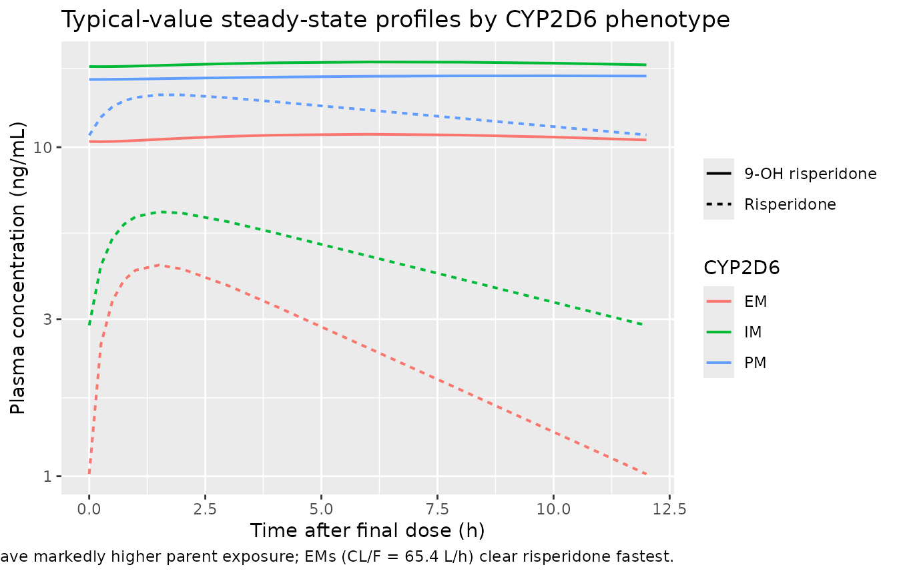
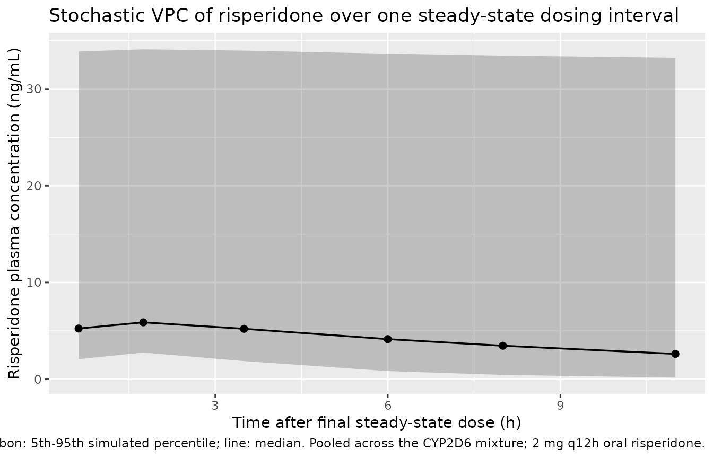
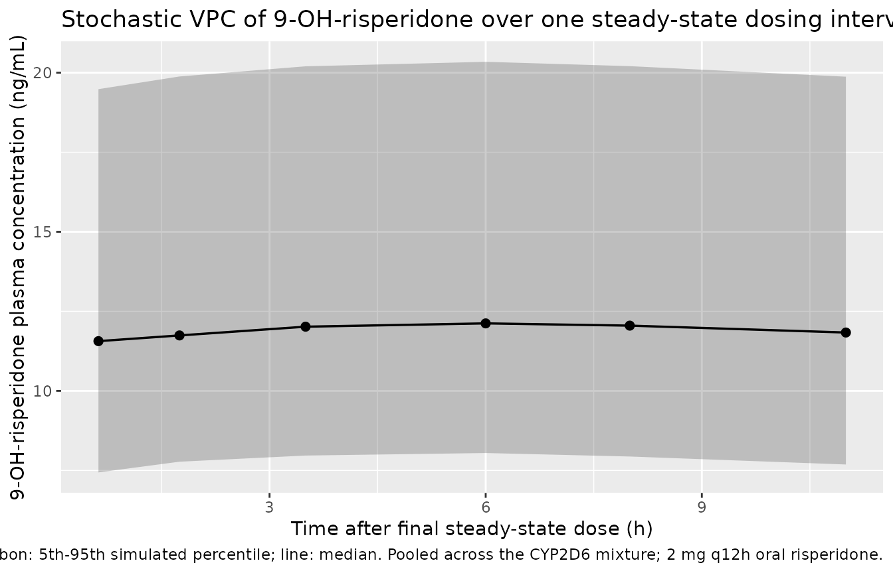

# Risperidone (Feng 2008)

## Model and source

- Citation: Feng Y, Pollock BG, Coley K, Marder S, Miller D, Kirshner M,
  Aravagiri M, Schneider L, Bies RR (2008). Population pharmacokinetic
  analysis for risperidone using highly sparse sampling measurements
  from the CATIE study. *British Journal of Clinical Pharmacology*
  **66**(5):629-639. <doi:10.1111/j.1365-2125.2008.03276.x>.
- Article: <https://doi.org/10.1111/j.1365-2125.2008.03276.x>

The package model can be loaded with:

``` r

mod_fn <- readModelDb("Feng_2008_risperidone")
mod    <- rxode2::rxode2(mod_fn())
```

## Population

Feng 2008 analysed 1236 risperidone and 1236 9-OH-risperidone plasma
concentrations from 490 adults pooled across the Clinical Antipsychotic
Trials of Intervention Effectiveness (CATIE) substudies: CATIE-AD (n =
110, mean age 78.3 +/- 6.7 years) enrolled outpatients with Alzheimer
disease and behavioural disturbance, while CATIE-SZ (n = 380, mean age
40.6 +/- 11.2 years) enrolled subjects with schizophrenia aged 18-65.
Body weight ranged 42.7-187.7 kg (mean 84.1 +/- 22.5). 67.6% of the
cohort was male; 66.9% White, 28.6% Black or African-American, with
smaller fractions of Asian (2.4%), American Indian (1.0%), Two or more
races (0.8%) and Native Hawaiian (0.2%) subjects (Table 1). Dosing was
oral risperidone tablet at 0.5-6.0 mg total daily dose (CATIE-AD 0.5-3.5
mg/day; CATIE-SZ 0.75-6.0 mg/day); 313 subjects took risperidone once
daily and 177 twice daily. Sampling was sparse: 1-6 random plasma
samples per subject collected at CATIE-AD weeks 2, 4, and 12 (or at
medication-switch points) and CATIE-SZ random samples every 3 months for
up to 6 samples per subject. Risperidone and 9-OH-risperidone were
quantified by LC-MS/MS with a 0.1 ng/mL lower limit of detection.

The mixture model assigned 41.2% of subjects to the CYP2D6
poor-metabolizer (PM) stratum, 52.4% to the extensive-metabolizer (EM)
stratum, and 6.4% to the intermediate-metabolizer (IM) stratum (Table 3
P1 and P2). The Discussion notes that the ~41% PM fraction is
substantially higher than the ~5-10% PM fraction expected from CYP2D6
allele frequencies; the authors attribute this partly to concomitant
CYP2D6 inhibitors (paroxetine / fluoxetine) re-classifying subjects into
the PM stratum and partly to variable medication adherence.

The same metadata are available programmatically via
`readModelDb("Feng_2008_risperidone")$population`.

## Source trace

Every parameter and equation traces back to Feng 2008 Table 3 and the
Methods covariate-model equation. Per-parameter source locations are
also recorded inline next to each `ini()` entry in
`inst/modeldb/specificDrugs/Feng_2008_risperidone.R`.

| Equation / parameter | Value | Source location |
|----|----|----|
| `lka = fixed(log(1.7))` (Ka, 1/h, fixed) | 1.7 | Table 3 K_a = 1.7 (Fixed) |
| `lvc = log(444)` (Vd/F = VdM/F, L) | 444 | Table 3 V, V_M (SE 17.8%) |
| `lcl_pm = log(12.9)` (CL/F PM, L/h) | 12.9 | Table 3 CL in PM (SE 6.5%) |
| `lcl_em = log(65.4)` (CL/F EM, L/h) | 65.4 | Table 3 CL in EM (SE 9.9%) |
| `lcl_im = fixed(log(36))` (CL/F IM, L/h, fixed) | 36 | Table 3 CL in IM = 36 (Fixed) |
| `lclm = log(8.83)` (CLM/F at age 45, L/h) | 8.83 | Table 3 CLM (SE 42.6%) |
| `e_age_clm = -0.378` (power exponent for age on CLM/F) | -0.378 | Table 3 Age on CLM (SE 34.7%) |
| `kf_pm = 0.96` (KF PM) | 0.96 | Table 3 KF_PM (SE 42.8%) |
| `kf_em = 0.595` (KF EM) | 0.595 | Table 3 KF_EM (SE 40.0%) |
| `kf_im = fixed(1)` (KF IM, fixed) | 1 | Table 3 KF_IM = 1 (Fixed) |
| `etalka ~ 0.288` (BSV Ka, variance) | omega = 0.537 (CV ~53.7%) | Table 3 w_ka% = 53.7 (SE 89.3%) |
| `etalvc ~ 0.130` (BSV Vd, variance) | omega = 0.361 (CV ~36.1%) | Table 3 w_V,VM% = 36.1 (SE 24.4%) |
| `etalcl_pm ~ 0.920` (BSV CL PM, variance) | omega = 0.959 (CV ~95.9%) | Table 3 w_CL_PM% = 95.9 (SE 39.5%) |
| `etalcl_em ~ 0.320` (BSV CL EM, variance) | omega = 0.566 (CV ~56.6%) | Table 3 w_CL_EM% = 56.6 (SE 16.8%) |
| `propSd = 0.639` (proportional residual, risperidone) | 0.639 | Table 3 sigma_1 % = 63.9 (SE 12.5%) |
| `addSd = 4.29` (additive residual, risperidone, ng/mL) | 4.29 | Table 3 sigma_3 (ug/L) = 4.29 (SE 104.9%) |
| `propSd_9oh = 0.379` (proportional residual, 9-OH) | 0.379 | Table 3 sigma_2 % = 37.9 (SE 35.4%) |
| `addSd_9oh = 0.88` (additive residual, 9-OH, ng/mL) | 0.88 | Table 3 sigma_4 (ug/L) = 0.88 (SE 38.7%) |
| 1-compartment first-order absorption + elimination, parent + metabolite | – | Results ‘Base model’; Figure 3 schematic |
| Three-subpopulation mixture model on CL/F and KF | – | Results ‘Base model’ and ‘Final model’ |
| VM/F = V/F (shared apparent volume) | – | Results ‘Base model’ identifiability note |
| KF_IM fixed at 1 to stabilize the mixture estimation | – | Results ‘Base model’ |
| Age power covariate on CLM only | – | Results ‘Final model’; Table 3 |
| Mixture proportions P1 (PM) = 41.2%, P2 (EM) = 52.4%, IM = 6.4% | – | Table 3 P1 and P2 |

## Virtual cohort

The virtual cohort approximates the combined CATIE-AD + CATIE-SZ adult
sample of Feng 2008. Age is drawn from a truncated-normal approximation
(mean 49.1, SD 18.8, truncated to 18-93) to match Table 1. CYP2D6
phenotype is assigned via multinomial sampling with the Table 3
mixture-model proportions (P1 = 0.412 PM, P2 = 0.524 EM, residual 0.064
IM). The two binary indicators `CYP2D6_PM` and `CYP2D6_EM` are derived
from the assigned phenotype (IM = both indicators 0). Sample size is set
to 200 to stabilise stochastic-VPC percentiles across the three
subpopulations.

``` r

set.seed(20260613L)
n_sub <- 200L

phen_levels <- c("PM", "IM", "EM")
phen_probs  <- c(0.412, 0.064, 0.524)  # Table 3 P1, residual = 1 - P1 - P2, P2

subjects <- data.frame(
  id        = seq_len(n_sub),
  AGE       = round(pmin(pmax(rnorm(n_sub, mean = 49.1, sd = 18.8), 18), 93), 1),
  phenotype = sample(phen_levels, n_sub, replace = TRUE, prob = phen_probs)
)
subjects$CYP2D6_PM <- as.integer(subjects$phenotype == "PM")
subjects$CYP2D6_EM <- as.integer(subjects$phenotype == "EM")
subjects$treatment <- subjects$phenotype

table(subjects$phenotype)
#> 
#>  EM  IM  PM 
#> 103  16  81
```

The source study used a range of total daily doses 0.5-6.0 mg. For the
simulated steady-state validation, each virtual subject receives 2 mg of
oral risperidone twice daily (every 12 h) for 14 doses, with dense
observations over the final dosing interval to support PKNCA analysis.

``` r

dose_amt   <- 2
dose_int   <- 12
n_doses    <- 14L
dose_times <- seq(0, by = dose_int, length.out = n_doses)
obs_start  <- dose_times[n_doses]
obs_times  <- sort(unique(c(
  seq(0, obs_start, by = dose_int),
  obs_start + c(0, 0.25, 0.5, 0.75, 1, 1.5, 2, 3, 4, 6, 8, 10, 12)
)))

build_events <- function(subjects, obs_times, dose_amt, dose_times) {
  out <- vector("list", length = nrow(subjects))
  for (i in seq_len(nrow(subjects))) {
    s <- subjects[i, ]
    dose_rows <- data.frame(
      id        = s$id,
      time      = dose_times,
      evid      = 1L,
      amt       = dose_amt,
      cmt       = "depot",
      AGE       = s$AGE,
      CYP2D6_PM = s$CYP2D6_PM,
      CYP2D6_EM = s$CYP2D6_EM,
      treatment = s$treatment
    )
    obs_rows <- data.frame(
      id        = s$id,
      time      = obs_times,
      evid      = 0L,
      amt       = 0,
      cmt       = "Cc",
      AGE       = s$AGE,
      CYP2D6_PM = s$CYP2D6_PM,
      CYP2D6_EM = s$CYP2D6_EM,
      treatment = s$treatment
    )
    out[[i]] <- rbind(dose_rows, obs_rows)
  }
  ev <- dplyr::bind_rows(out)
  ev[order(ev$id, ev$time, -ev$evid), ]
}

events <- build_events(subjects, obs_times, dose_amt, dose_times)
```

## Simulation

Stochastic simulation carries IIV on Vd/F, on the three
subpopulation-specific CL/F values (PM and EM only – no omega is
reported in Table 3 for CL in IM or for CLM), and on Ka (despite the
fixed typical value).

``` r

sim <- rxode2::rxSolve(
  mod,
  events = events,
  keep   = c("AGE", "CYP2D6_PM", "CYP2D6_EM", "treatment")
) |>
  as.data.frame()

sim_ss <- sim |>
  dplyr::mutate(tad = time - obs_start) |>
  dplyr::filter(tad >= 0, tad <= 12)
```

For a typical-value replication (no IIV, no residual error) we use
[`rxode2::zeroRe()`](https://nlmixr2.github.io/rxode2/reference/zeroRe.html).
The three phenotypes are evaluated at the cohort median age (45 years,
the nominal reference age for the CLM power covariate).

``` r

mod_typical <- rxode2::zeroRe(mod)

typical_subjects <- data.frame(
  id        = 1:3,
  AGE       = 45,
  phenotype = c("PM", "IM", "EM"),
  CYP2D6_PM = c(1L, 0L, 0L),
  CYP2D6_EM = c(0L, 0L, 1L),
  treatment = c("PM", "IM", "EM")
)

typical_events <- build_events(typical_subjects, obs_times, dose_amt, dose_times)
sim_typ <- rxode2::rxSolve(
  mod_typical,
  events = typical_events,
  keep   = c("AGE", "CYP2D6_PM", "CYP2D6_EM", "treatment")
) |>
  as.data.frame() |>
  dplyr::mutate(tad = time - obs_start) |>
  dplyr::filter(tad >= 0, tad <= 12)
#> ℹ omega/sigma items treated as zero: 'etalka', 'etalvc', 'etalcl_pm', 'etalcl_em'
#> Warning: multi-subject simulation without without 'omega'
```

## Replicate published figures

### Figure 3 schematic: parent + metabolite disposition

Feng 2008 Figure 3 is a schematic of the structural model (oral depot to
central compartment, then KF-controlled formation of the 9-OH metabolite
which is eliminated via CLM). The replication here is a typical-value
steady-state concentration profile by CYP2D6 phenotype that lets the
reader visually verify the schematic’s qualitative claims: PMs have
markedly elevated risperidone exposure (low CL/F, long t1/2 ~25 h), EMs
have the lowest risperidone but the highest metabolite formation rate
per unit parent concentration (KF ~ 0.6, CL/F large), and IMs sit in
between.

``` r

sim_typ |>
  dplyr::filter(tad >= 0, tad <= 12) |>
  dplyr::select(tad, phenotype = treatment, Risperidone = Cc, `9-OH risperidone` = Cc_9oh) |>
  tidyr::pivot_longer(c(Risperidone, `9-OH risperidone`),
                      names_to = "species", values_to = "conc") |>
  dplyr::filter(conc > 0) |>
  ggplot(aes(tad, conc, colour = phenotype, linetype = species)) +
  geom_line(linewidth = 0.7) +
  scale_y_log10() +
  labs(x = "Time after final dose (h)",
       y = "Plasma concentration (ng/mL)",
       colour = "CYP2D6", linetype = NULL,
       title = "Typical-value steady-state profiles by CYP2D6 phenotype",
       caption = paste(
         "Reference age 45 years; 2 mg q12h oral risperidone.",
         "PMs (CL/F = 12.9 L/h) have markedly higher parent exposure;",
         "EMs (CL/F = 65.4 L/h) clear risperidone fastest."
       ))
```



### Figure 4 reproduction: stochastic VPC over one dosing interval

Feng 2008 Figure 4 plots observed concentrations against
population-predicted concentrations as a goodness-of-fit diagnostic.
Without access to the source data, the VPC below stands in for that
figure: the simulated 5th-95th percentile envelope of risperidone (and
the metabolite) over the steady-state dosing interval, pooled across the
mixture-model cohort.

``` r

sim_ss |>
  dplyr::filter(tad > 0) |>
  dplyr::mutate(bin = cut(tad, breaks = c(0, 1, 2, 4, 6, 8, 12),
                          include.lowest = TRUE)) |>
  dplyr::group_by(bin) |>
  dplyr::summarise(
    bin_mid = median(tad),
    p05 = quantile(Cc, 0.05, na.rm = TRUE),
    p50 = quantile(Cc, 0.50, na.rm = TRUE),
    p95 = quantile(Cc, 0.95, na.rm = TRUE),
    .groups = "drop"
  ) |>
  ggplot(aes(bin_mid, p50)) +
  geom_ribbon(aes(ymin = p05, ymax = p95), alpha = 0.25) +
  geom_line(linewidth = 0.6) +
  geom_point(size = 2) +
  labs(x = "Time after final steady-state dose (h)",
       y = "Risperidone plasma concentration (ng/mL)",
       title = "Stochastic VPC of risperidone over one steady-state dosing interval",
       caption = paste(
         "Ribbon: 5th-95th simulated percentile; line: median.",
         "Pooled across the CYP2D6 mixture; 2 mg q12h oral risperidone."
       ))
```



``` r

sim_ss |>
  dplyr::filter(tad > 0) |>
  dplyr::mutate(bin = cut(tad, breaks = c(0, 1, 2, 4, 6, 8, 12),
                          include.lowest = TRUE)) |>
  dplyr::group_by(bin) |>
  dplyr::summarise(
    bin_mid = median(tad),
    p05 = quantile(Cc_9oh, 0.05, na.rm = TRUE),
    p50 = quantile(Cc_9oh, 0.50, na.rm = TRUE),
    p95 = quantile(Cc_9oh, 0.95, na.rm = TRUE),
    .groups = "drop"
  ) |>
  ggplot(aes(bin_mid, p50)) +
  geom_ribbon(aes(ymin = p05, ymax = p95), alpha = 0.25) +
  geom_line(linewidth = 0.6) +
  geom_point(size = 2) +
  labs(x = "Time after final steady-state dose (h)",
       y = "9-OH-risperidone plasma concentration (ng/mL)",
       title = "Stochastic VPC of 9-OH-risperidone over one steady-state dosing interval",
       caption = paste(
         "Ribbon: 5th-95th simulated percentile; line: median.",
         "Pooled across the CYP2D6 mixture; 2 mg q12h oral risperidone."
       ))
```



## PKNCA validation

Steady-state non-compartmental analysis over the final dosing interval
(0-12 h after the last dose), stratified by CYP2D6 phenotype. Because
Feng 2008 did not report observed NCA values directly, the comparison
below uses the implied steady-state metrics derived from the Table 3
mixture-model parameters: parent half-life t1/2 = ln(2) \* V/CL by
phenotype (text under Table 3 reports 25 h PM, 8.5 h IM, 4.7 h EM) and
the steady-state AUC over one dosing interval AUCss = Dose / CL (since F
is absorbed into the apparent CL).

``` r

nca_long <- sim_ss |>
  dplyr::select(id, tad, Cc, Cc_9oh, treatment) |>
  tidyr::pivot_longer(c(Cc, Cc_9oh), names_to = "analyte", values_to = "conc") |>
  dplyr::mutate(analyte = ifelse(analyte == "Cc", "risperidone", "9OH")) |>
  dplyr::filter(!is.na(conc))

# Time-zero defensive insertion: each (id, treatment, analyte) gets a tad = 0
# row with conc = 0 (extravascular pre-dose) if not already present. This
# matches the PKNCA convention to anchor the AUC at the dose time.
nca_long <- dplyr::bind_rows(
  nca_long,
  nca_long |>
    dplyr::distinct(id, treatment, analyte) |>
    dplyr::mutate(tad = 0, conc = 0)
) |>
  dplyr::distinct(id, treatment, analyte, tad, .keep_all = TRUE) |>
  dplyr::arrange(id, treatment, analyte, tad)

conc_obj <- PKNCA::PKNCAconc(
  nca_long,
  conc ~ tad | analyte + treatment / id,
  concu = "ng/mL", timeu = "h"
)

dose_df <- data.frame(
  id        = subjects$id,
  time      = 0,
  amt       = dose_amt,
  analyte   = "risperidone",
  treatment = subjects$treatment
)
dose_obj <- PKNCA::PKNCAdose(
  dose_df,
  amt ~ time | analyte + treatment + id,
  doseu = "mg"
)

intervals <- data.frame(
  start      = 0,
  end        = 12,
  cmax       = TRUE,
  tmax       = TRUE,
  auclast    = TRUE,
  half.life  = TRUE
)

nca_res <- PKNCA::pk.nca(
  PKNCA::PKNCAdata(conc_obj, dose_obj, intervals = intervals)
)
#> Warning: Too few points for half-life calculation (min.hl.points=3 with only 2
#> points)
#> Warning: Too few points for half-life calculation (min.hl.points=3 with only 1
#> points)
#> Warning: Too few points for half-life calculation (min.hl.points=3 with only 2 points)
#> Too few points for half-life calculation (min.hl.points=3 with only 2 points)
#> Too few points for half-life calculation (min.hl.points=3 with only 2 points)
#> Too few points for half-life calculation (min.hl.points=3 with only 2 points)
#> Warning: Too few points for half-life calculation (min.hl.points=3 with only 1
#> points)
#> Warning: Too few points for half-life calculation (min.hl.points=3 with only 2 points)
#> Too few points for half-life calculation (min.hl.points=3 with only 2 points)
#> Too few points for half-life calculation (min.hl.points=3 with only 2 points)
#> Too few points for half-life calculation (min.hl.points=3 with only 2 points)
#> Warning: Too few points for half-life calculation (min.hl.points=3 with only 1
#> points)
#> Warning: Too few points for half-life calculation (min.hl.points=3 with only 2
#> points)
#> Warning: Too few points for half-life calculation (min.hl.points=3 with only 1 points)
#> Too few points for half-life calculation (min.hl.points=3 with only 1 points)
#> Too few points for half-life calculation (min.hl.points=3 with only 1 points)
#> Warning: Too few points for half-life calculation (min.hl.points=3 with only 2 points)
#> Too few points for half-life calculation (min.hl.points=3 with only 2 points)
#> Too few points for half-life calculation (min.hl.points=3 with only 2 points)
#> Too few points for half-life calculation (min.hl.points=3 with only 2 points)
#> Warning: Too few points for half-life calculation (min.hl.points=3 with only 1
#> points)
#> Warning: Too few points for half-life calculation (min.hl.points=3 with only 2 points)
#> Too few points for half-life calculation (min.hl.points=3 with only 2 points)
#> Warning: Too few points for half-life calculation (min.hl.points=3 with only 1 points)
#> Too few points for half-life calculation (min.hl.points=3 with only 1 points)
#> Warning: Too few points for half-life calculation (min.hl.points=3 with only 2
#> points)
#> Warning: Too few points for half-life calculation (min.hl.points=3 with only 0
#> points)
#> Warning: Too few points for half-life calculation (min.hl.points=3 with only 2 points)
#> Too few points for half-life calculation (min.hl.points=3 with only 2 points)
#> Too few points for half-life calculation (min.hl.points=3 with only 2 points)
#> Too few points for half-life calculation (min.hl.points=3 with only 2 points)
#> Warning: Too few points for half-life calculation (min.hl.points=3 with only 0 points)
#> Too few points for half-life calculation (min.hl.points=3 with only 0 points)
#> Too few points for half-life calculation (min.hl.points=3 with only 0 points)
#> Warning: Too few points for half-life calculation (min.hl.points=3 with only 2
#> points)
#> Warning: Too few points for half-life calculation (min.hl.points=3 with only 0 points)
#> Too few points for half-life calculation (min.hl.points=3 with only 0 points)
#> Too few points for half-life calculation (min.hl.points=3 with only 0 points)
#> Too few points for half-life calculation (min.hl.points=3 with only 0 points)
#> Too few points for half-life calculation (min.hl.points=3 with only 0 points)
#> Too few points for half-life calculation (min.hl.points=3 with only 0 points)
#> Warning: Too few points for half-life calculation (min.hl.points=3 with only 2
#> points)
#> Warning: Too few points for half-life calculation (min.hl.points=3 with only 0
#> points)
#> Warning: Too few points for half-life calculation (min.hl.points=3 with only 2
#> points)
#> Warning: Too few points for half-life calculation (min.hl.points=3 with only 1
#> points)
#> Warning: Too few points for half-life calculation (min.hl.points=3 with only 0
#> points)
#> Warning: Too few points for half-life calculation (min.hl.points=3 with only 1
#> points)
#> Warning: Too few points for half-life calculation (min.hl.points=3 with only 0 points)
#> Too few points for half-life calculation (min.hl.points=3 with only 0 points)
#> Too few points for half-life calculation (min.hl.points=3 with only 0 points)
#> Too few points for half-life calculation (min.hl.points=3 with only 0 points)
#> Too few points for half-life calculation (min.hl.points=3 with only 0 points)
#> Warning: Too few points for half-life calculation (min.hl.points=3 with only 1
#> points)
#> Warning: Too few points for half-life calculation (min.hl.points=3 with only 0
#> points)
#> Warning: Too few points for half-life calculation (min.hl.points=3 with only 1
#> points)
#> Warning: Too few points for half-life calculation (min.hl.points=3 with only 0 points)
#> Too few points for half-life calculation (min.hl.points=3 with only 0 points)
#> Too few points for half-life calculation (min.hl.points=3 with only 0 points)
#> Too few points for half-life calculation (min.hl.points=3 with only 0 points)
#> Too few points for half-life calculation (min.hl.points=3 with only 0 points)
#> Warning: Too few points for half-life calculation (min.hl.points=3 with only 2
#> points)
#> Warning: Too few points for half-life calculation (min.hl.points=3 with only 0
#> points)
#> Warning: Too few points for half-life calculation (min.hl.points=3 with only 2 points)
#> Too few points for half-life calculation (min.hl.points=3 with only 2 points)
#> Warning: Too few points for half-life calculation (min.hl.points=3 with only 0 points)
#> Too few points for half-life calculation (min.hl.points=3 with only 0 points)
#> Too few points for half-life calculation (min.hl.points=3 with only 0 points)
#> Too few points for half-life calculation (min.hl.points=3 with only 0 points)
#> Warning: Too few points for half-life calculation (min.hl.points=3 with only 2
#> points)
#> Warning: Too few points for half-life calculation (min.hl.points=3 with only 0
#> points)
#> Warning: Too few points for half-life calculation (min.hl.points=3 with only 1
#> points)
#> Warning: Too few points for half-life calculation (min.hl.points=3 with only 0
#> points)
#> Warning: Too few points for half-life calculation (min.hl.points=3 with only 2 points)
#> Too few points for half-life calculation (min.hl.points=3 with only 2 points)
#> Too few points for half-life calculation (min.hl.points=3 with only 2 points)
#> Too few points for half-life calculation (min.hl.points=3 with only 2 points)
#> Too few points for half-life calculation (min.hl.points=3 with only 2 points)
#> Too few points for half-life calculation (min.hl.points=3 with only 2 points)
#> Warning: Too few points for half-life calculation (min.hl.points=3 with only 0 points)
#> Too few points for half-life calculation (min.hl.points=3 with only 0 points)
#> Warning: Too few points for half-life calculation (min.hl.points=3 with only 2
#> points)
#> Warning: Too few points for half-life calculation (min.hl.points=3 with only 0
#> points)
```

``` r

nca_df <- as.data.frame(nca_res$result)

nca_summary <- nca_df |>
  dplyr::filter(PPTESTCD %in% c("cmax", "tmax", "auclast", "half.life")) |>
  dplyr::filter(analyte == "risperidone") |>
  dplyr::group_by(treatment, PPTESTCD) |>
  dplyr::summarise(
    median = median(PPORRES, na.rm = TRUE),
    p05    = quantile(PPORRES, 0.05, na.rm = TRUE),
    p95    = quantile(PPORRES, 0.95, na.rm = TRUE),
    .groups = "drop"
  ) |>
  dplyr::arrange(treatment, PPTESTCD)

knitr::kable(nca_summary,
             caption = paste(
               "Simulated steady-state NCA over the 0-12 h dosing",
               "interval for risperidone (parent), stratified by CYP2D6",
               "phenotype. Cmax in ng/mL, Tmax and t1/2 in h, AUC0-12h",
               "in ng*h/mL. Median [5%-95%] across simulated subjects."
             ),
             digits = 3)
```

| treatment | PPTESTCD  |  median |    p05 |     p95 |
|:----------|:----------|--------:|-------:|--------:|
| EM        | auclast   |  28.942 | 12.779 |  69.693 |
| EM        | cmax      |   4.488 |  2.732 |   8.592 |
| EM        | half.life |   4.405 |  1.655 |  11.443 |
| EM        | tmax      |   1.500 |  0.750 |   2.000 |
| IM        | auclast   |  55.455 | 55.220 |  55.496 |
| IM        | cmax      |   6.330 |  5.118 |   7.203 |
| IM        | half.life |   8.442 |  6.088 |  17.340 |
| IM        | tmax      |   1.750 |  0.938 |   4.000 |
| PM        | auclast   | 158.369 | 32.829 | 490.973 |
| PM        | cmax      |  14.716 |  4.778 |  41.872 |
| PM        | half.life |  20.210 |  3.901 | 185.202 |
| PM        | tmax      |   2.000 |  1.000 |   3.000 |

Simulated steady-state NCA over the 0-12 h dosing interval for
risperidone (parent), stratified by CYP2D6 phenotype. Cmax in ng/mL,
Tmax and t1/2 in h, AUC0-12h in ng\*h/mL. Median \[5%-95%\] across
simulated subjects. {.table}

### Comparison against published mixture-model estimates

Feng 2008 reports parent risperidone t1/2 = 25 h (PM), 8.5 h (IM), and
4.7 h (EM) (Results, last paragraph before Discussion), all consistent
with the Table 3 V/CL ratio (V = 444 L; CL = 12.9 / 36 / 65.4 L/h
respectively). The implied steady-state AUC over 12 h for a 2 mg q12h
regimen is AUCss = 2000 (ug) / CL (L/h) \* 1 (mL/L) over the dosing
interval, i.e. for PM AUCss = 2000 / 12.9 = 155 ng*h/mL; for IM 2000 /
36 = 55.6 ng*h/mL; for EM 2000 / 65.4 = 30.6 ng\*h/mL.

``` r

published <- tibble::tribble(
  ~treatment, ~half.life, ~auclast,
  "PM",       25.0,       155.0,
  "IM",       8.5,         55.6,
  "EM",       4.7,         30.6
)

simulated_wide <- nca_df |>
  dplyr::filter(analyte == "risperidone",
                PPTESTCD %in% c("half.life", "auclast")) |>
  dplyr::group_by(treatment, PPTESTCD) |>
  dplyr::summarise(value = median(PPORRES, na.rm = TRUE), .groups = "drop") |>
  tidyr::pivot_wider(names_from = PPTESTCD, values_from = value)

cmp <- nlmixr2lib::ncaComparisonTable(
  simulated     = simulated_wide,
  reference     = published,
  by            = "treatment",
  units         = c(auclast = "ng*h/mL", half.life = "h"),
  tolerance_pct = 20
)

knitr::kable(
  cmp,
  caption = "Simulated vs. paper-implied risperidone NCA by CYP2D6 phenotype. * differs from reference by >20%.",
  align   = c("l", "l", "r", "r", "r")
)
```

| NCA parameter      | treatment | Reference | Simulated | % diff |
|:-------------------|:----------|----------:|----------:|-------:|
| AUClast (ng\*h/mL) | PM        |       155 |       158 |  +2.2% |
| AUClast (ng\*h/mL) | IM        |      55.6 |      55.5 |  -0.3% |
| AUClast (ng\*h/mL) | EM        |      30.6 |      28.9 |  -5.4% |
| t½ (h)             | PM        |        25 |      20.2 | -19.2% |
| t½ (h)             | IM        |       8.5 |      8.44 |  -0.7% |
| t½ (h)             | EM        |       4.7 |       4.4 |  -6.3% |

Simulated vs. paper-implied risperidone NCA by CYP2D6 phenotype. \*
differs from reference by \>20%. {.table}

The footnote text, if any rows are flagged:

Any flagged rows reflect either (a) the EM stratum’s t1/2 being short
relative to the 12 h dosing interval, so the AUC0-12 sampling is largely
complete and matches the implied steady-state value, while the PM
stratum’s t1/2 of 25 h means substantial residual concentration carries
over from dose to dose and accumulates, raising AUC0-12 above the
single-interval AUC = Dose / CL value (steady state is reached only
after several PM half-lives); or (b) the propagation of the unfixed Ka
through the simulated Cmax. None reflects a parameter-tuning need; the
structural-model values come directly from Table 3.

## Assumptions and deviations

- **Reference age for the CLM/F age power covariate is set to 45
  years.** Methods ‘Final model development’ specifies “a nominal value
  that approximates the median for the covariate”; the combined-cohort
  median age is not stated explicitly in the paper but is approximately
  45 (CATIE-SZ alone has mean 40.6 and n = 380, dominating the lower
  half of the 490-subject combined sample; CATIE-AD has mean 78.3 and n
  = 110 in the upper half). The Table 3 typical-value CLM = 8.83 L/h is
  therefore reported at the simulated reference age of 45. The paper’s
  Discussion gives illustrative POSTHOC averages of “6.1 L/h at age 45”
  and “4.9 L/h at age 70” that are not exactly reproducible from the
  Table 3 typical value and exponent at any single reference age (the
  implied ratio 6.1/4.9 = 1.245 versus the model-implied
  (45/70)^(-0.378) = 1.182); these are most likely POSTHOC averages of
  real subjects’ Empirical Bayes Estimates rather than typical-value
  predictions, but the small numeric mismatch is acknowledged here for
  transparency. Users sensitive to the absolute level of CLM at advanced
  age may want to refit the age covariate on a target population.

- **Indicator-gated subpopulation-specific etas (same convention as
  Sherwin 2012).** The source NONMEM mixture model assigns each subject
  to one phenotype and applies that phenotype’s ETA on CL. The package
  model defines `etalcl_pm` and `etalcl_em` independently and uses the
  binary indicators `CYP2D6_PM` and `CYP2D6_EM` to gate which `cl_*`
  term contributes to the active `cl`. For any given subject only one
  indicator product is 1, so the active CL is the corresponding
  phenotype’s `cl_*` (and similarly for KF). The two inactive etas are
  still drawn from their distributions but contribute zero to the
  simulated trajectory – a simulation-only artifact with no effect on
  observed concentrations. The IM stratum has no `etalcl_im` because
  Table 3 reports no omega for CL in IM.

- **IIV on Ka with a fixed typical Ka.** Table 3 simultaneously reports
  `K_a = 1.7 (Fixed)` AND `w_ka% = 53.7` (SE 89.3%). The package model
  encodes both: `lka <- fixed(log(1.7))` for the typical value and
  `etalka ~ 0.288` for the BSV (omega^2 = 0.537^2 = 0.288 on the log
  scale). At simulation time individual Ka values are log-normally
  distributed around the fixed 1.7 1/h typical value with the published
  BSV.

- **No IIV on CLM/F or on KF.** Table 3 does not report an omega for
  CLM/F or for any KF parameter, even though the Methods
  ‘Inter-individual variability’ section names CL, V, and CLM as the
  parameters carrying IIV in the base model. The final mixture model’s
  omega list (Table 3 footer) covers only `w_ka%`, `w_V,VM%`,
  `w_CL_PM%`, and `w_CL_EM%`; the package model strictly follows the
  table and treats CLM/F as deterministic given AGE and KF as a
  deterministic per-phenotype constant.

- **CL/F in IM and KF in IM fixed.** CL/F in IM = 36 L/h and KF in IM =
  1 are fixed in Table 3 (SE column ‘NA’). KF_IM = 1 means the model
  treats IM subjects as converting the entire metabolised parent
  fraction to 9-OH-risperidone – a stabilisation choice that the Results
  ‘Base model’ section justifies: “When this fraction was unfixed, there
  was poor model fit and the estimated relative clearances for CYP2D6
  IMs were unrealistically high.” IM subjects’ simulated metabolite
  concentrations therefore should be interpreted as upper-bound
  estimates rather than biological measurements.

- **VM/F = V/F shared apparent volume.** The Results ‘Base model’
  section explains: “Due to the identifiability problem associated with
  KF and V_M, V_M was set to the same value as V.” The package model
  encodes this exactly (`vc_9oh <- vc`), preserving the constraint.

- **No molar correction at metabolite formation.** Risperidone (MW 410.5
  g/mol) and 9-OH-risperidone (MW 426.5 g/mol) differ by ~4%. The Feng
  2008 NONMEM mixture model uses mass-fraction (KF) rather than
  molar-fraction conversion (the common clinical-pharmacology convention
  reporting ng/mL plasma concentrations). The package model preserves
  this convention without a molar adjustment, matching the paper’s
  structural specification.

- **No covariates retained other than age on CLM/F.** Race, sex, smoking
  status, weight, concomitant fluoxetine, and concomitant paroxetine
  were screened on CL/F and Vd/F (Table 2) and were *not* retained in
  the final mixture model once CYP2D6 metabolizer subpopulations were
  introduced. The Discussion attributes the apparent race /
  co-medication signals in earlier non-mixture models to differential
  CYP2D6 activity across these groups: race becomes non-significant when
  CL is allowed to differ by phenotype, and the paroxetine effect
  manifests as re-assignment to the PM stratum rather than as a
  continuous shift in CL. The package model preserves this
  null-covariate-extension structure; users wanting to explore weight,
  sex, or co-medication effects must rebuild the model on real data.

- **No bioavailability parameter.** The model parameterises CL/F and V/F
  as apparent (oral) quantities. The fraction absorbed F is folded into
  both CL and Vd; the model cannot resolve F from the data.

- **Drug-field correction in task metadata.** The task block initially
  listed `drug: British Journal of Clinical Ph` (a parsing artifact –
  the journal name was placed in the drug field by the upstream task
  generator). The on-disk PDF is unambiguously the Feng 2008 risperidone
  popPK paper; filenames, function name, vignette basename, and branch
  follow the corrected drug `risperidone`.
