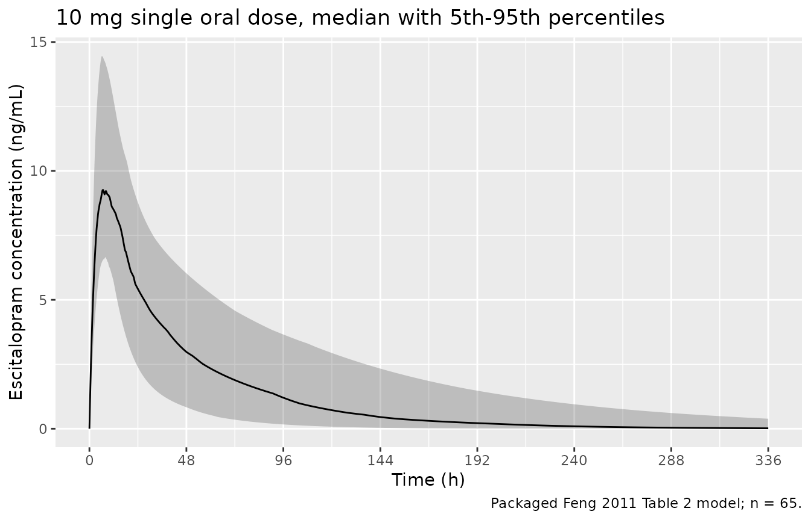
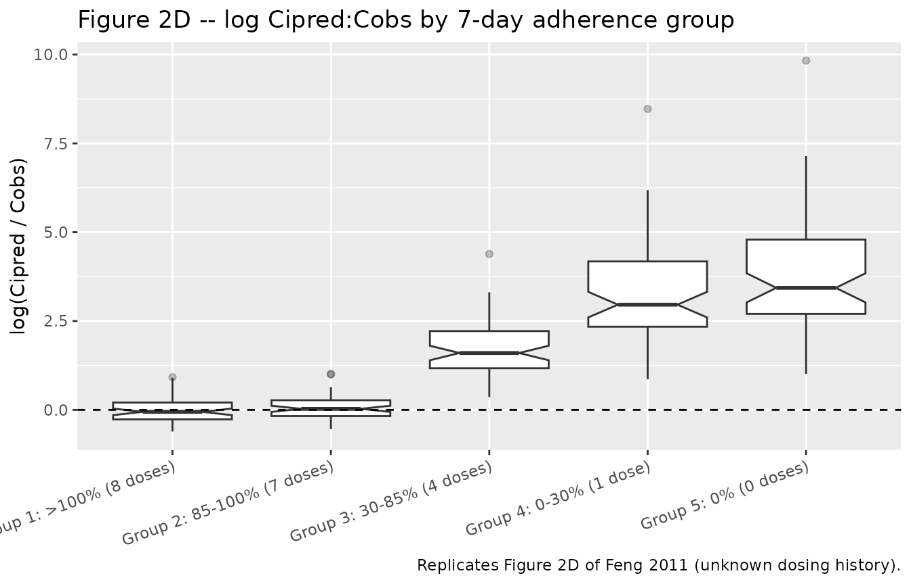
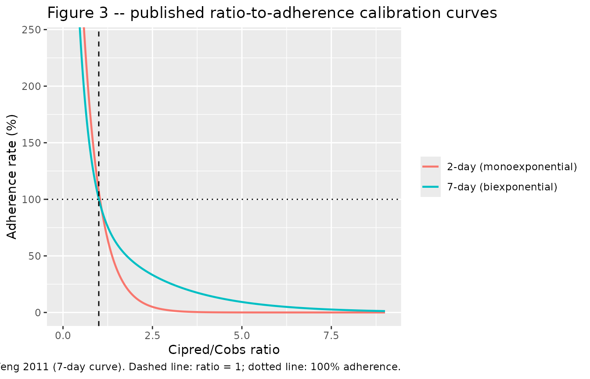

# Escitalopram (Feng 2011)

## Model and source

- Citation: Feng Y, Gastonguay MR, Pollock BG, Frank E, Kepple GH, Bies
  RR. Performance of Cpred/Cobs concentration ratios as a metric
  reflecting adherence to antidepressant drug therapy. Neuropsychiatr
  Dis Treat. 2011;7:117-125. <doi:10.2147/NDT.S15921>. The parameter set
  in Feng 2011 Table 2 was adapted by those authors from the published
  escitalopram literature (their refs 15-16: Sogaard B, Mengel H, Rao N,
  Larsen F. J Clin Pharmacol. 2005;45:1400-1406; Gutierrez MM, Rosenberg
  J, Abramowitz W. Clin Ther. 2003;25:1200-1210); Feng 2011 is the
  transcription source for every value below.
- Description: Two-compartment population PK model with first-order
  absorption for escitalopram, used as the long half-life drug scenario
  in a trial-simulation study of Cpred/Cobs and Cipred/Cobs
  concentration ratios as adherence metrics (Feng 2011)
- Article: <https://doi.org/10.2147/NDT.S15921> (open access;
  PMC3083985)

Feng 2011 is a trial-simulation study, not a model-development paper.
Its question is whether the ratio of a population-PK model’s predicted
concentration to a patient’s observed concentration – `Cpred/Cobs` at
the population level, `Cipred/Cobs` at the individual (Bayesian post
hoc) level – can be read as a measure of how well that patient adhered
to their prescribed regimen. To answer it the authors needed a concrete
long-half-life drug, and took escitalopram: “An established escitalopram
model was utilized to represent the long half-life drug. A
two-compartment model with additive and proportional residual error
models was adapted from the literature reports for escitalopram as a
long half-life drug (Table 2).”

The packaged model is that Table 2 parameter set. Because Feng 2011
adapted rather than estimated it, **every value is wrapped in
`fixed()`** – no standard error, RSE or confidence interval is reported
for any of them, and re-fitting this model to new data should start by
un-fixing the parameters deliberately.

This vignette does three things:

1.  validates the packaged PK model against closed-form results (PKNCA
    vs `Dose/CL` and vs each subject’s own analytic terminal slope), and
    checks the “long half-life drug” premise the paper rests on;
2.  reproduces the paper’s central mechanism (Figure 2C/2D) – the
    `Cipred/Cobs` ratio rises as true adherence falls;
3.  reproduces the two published ratio-to-adherence calibration
    equations (Figure 3 and the 2-day equation) and checks them against
    the paper’s own printed anchors.

## Population

Feng 2011 draws on two distinct sources, and it matters which is which.

The **dosing histories** come from 65 patients with chronic psychiatric
disorders enrolled in the NIMH-sponsored trial *“Depression: the search
for treatment relevant phenotypes”* (the Pittsburgh-Pisa study; Feng
2011 ref 12). Medication Event Monitoring System (MEMS) caps recorded
863 clinic-visit records over the first six months. Those records set
the simulation sample size (Table 3: “Sample size for each simulation
replicate: 65”; 100 replicates, 18 clinic-visit records per subject on
average, range 2-43) and supplied the “true” dosage histories. Observed
adherence was highly variable: over a 7-day window, 9.7% of events had
more than 7 doses taken, 52.5% had 6-7 doses, 19.0% had 3-5 doses, 4.3%
had 1-2 doses, and 14.5% had none at all.

The **pharmacokinetic parameters** did not come from those 65 patients.
No escitalopram concentrations were measured in the phenotypes study;
Table 2 was adapted from the published escitalopram literature (Feng
2011 refs 15-16: Sogaard 2005 and Gutierrez 2003). Feng 2011 is
therefore the transcription source for the values in this package, and
the demographic covariates of the population underlying those parameters
– age, weight, sex, race – are not reported anywhere in Feng 2011. The
model carries no covariate effects.

The same information is available programmatically via
`readModelDb("Feng_2011_escitalopram")()$population`.

## Source trace

Every `ini()` entry carries an in-file comment pointing at its origin in
`inst/modeldb/specificDrugs/Feng_2011_escitalopram.R`. Collected here
for review:

| Equation / parameter | Value | Source location |
|----|----|----|
| `lka` | `log(0.16)` | Table 2, “Ka (/h) 0.16” |
| `lcl` | `log(24.5)` | Table 2, “CL (L/h) 24.5” |
| `lvc` | `log(417)` | Table 2, “V2 (L) 417” |
| `lq` | `log(35.7)` | Table 2, “Q (L/h) 35.7” |
| `lvp` | `log(541)` | Table 2, “V3 (L) 541” |
| `etalcl` | `0.50^2 = 0.2500` | Table 2, “omega CL% 50”; Methods “variance of omega^2” |
| `etalvc` | `0.35^2 = 0.1225` | Table 2, “omega v2% 35” |
| `etalq` | `0.30^2 = 0.0900` | Table 2, “omega Q% 30” |
| `etalvp` | `0.30^2 = 0.0900` | Table 2, “omega v3% 30” |
| `propSd` | `0.30` | Table 2, “sigma 1% 30”; footnote “sigma, coefficient of variation of residual error” |
| `addSd` | `fixed(0)` | Methods states a combined additive + proportional error model; no additive value is reported anywhere in the paper |
| Two-compartment oral ODE system | n/a | Methods, “the NONMEM program (two-compartment, ADVAN4 TRANS4)” |
| Exponential IIV, `cl <- exp(lcl + etalcl)` | n/a | Methods, “CL = TVCL x exp(eta CL)” |
| 10 mg once-daily regimen | n/a | Table 3, “Dose (mg): Long half-life drug (10)” |
| 7-day adherence groups | n/a | Table 1, “Categorization of 7-day and 2-day adherence rate” |
| 7-day ratio-to-adherence equation | `699, 3.15, 117, 0.507` | Results, “Relationship between 7-day adherence rate and ratio” (displayed equation, p 122); curve plotted in Figure 3 |
| 2-day ratio-to-adherence equation | `834, 2.05` | Results, “Relationship between 2-day adherence rate and ratio” (displayed equation, p 123) |

``` r

mod <- readModelDb("Feng_2011_escitalopram")
ui  <- rxode2::rxode(mod)
knitr::kable(
  ui$iniDf |>
    dplyr::filter(!is.na(.data$ntheta)) |>
    dplyr::select(name, est, fix, label) |>
    dplyr::rename("Parameter" = name, "Estimate" = est,
                  "Fixed" = fix, "Label" = label),
  digits = 4,
  caption = "Fixed-effect parameters as packaged. Every value is fixed()."
)
```

| Parameter | Estimate | Fixed | Label |
|:---|---:|:---|:---|
| lka | -1.8326 | TRUE | Absorption rate constant (Ka, 1/h) |
| lcl | 3.1987 | TRUE | Apparent oral clearance (CL/F, L/h) |
| lvc | 6.0331 | TRUE | Apparent central volume of distribution (V2/F, L) |
| lq | 3.5752 | TRUE | Apparent inter-compartmental clearance (Q/F, L/h) |
| lvp | 6.2934 | TRUE | Apparent peripheral volume of distribution (V3/F, L) |
| propSd | 0.3000 | TRUE | Proportional residual error (fraction) |
| addSd | 0.0000 | TRUE | Additive residual error (ug/mL) |

Fixed-effect parameters as packaged. Every value is fixed(). {.table}

## Part 1 – structural validation of the packaged PK model

### The “long half-life drug” premise

The paper’s entire design rests on escitalopram being a long-half-life
drug, so that is the first thing to check. For the two-compartment
system the terminal disposition rate constant `beta` is the smaller root
of `lambda^2 - (kel + k12 + k21) * lambda + kel * k21 = 0`, computed
here from the typical-value parameters.

``` r

tv <- with(as.list(setNames(exp(ui$theta[c("lcl", "lvc", "lq", "lvp")]),
                            c("cl", "vc", "q", "vp"))), {
  kel <- cl / vc; k12 <- q / vc; k21 <- q / vp
  s <- kel + k12 + k21
  p <- kel * k21
  list(
    kel = kel, k12 = k12, k21 = k21,
    alpha = (s + sqrt(s^2 - 4 * p)) / 2,
    beta  = (s - sqrt(s^2 - 4 * p)) / 2,
    vss   = vc + vp
  )
})

tibble::tibble(
  Quantity = c("Distribution half-life (alpha phase)",
               "Terminal half-life (beta phase)",
               "Steady-state volume Vss = V2 + V3",
               "Absorption half-life log(2)/Ka"),
  Value = c(sprintf("%.2f h", log(2) / tv$alpha),
            sprintf("%.1f h", log(2) / tv$beta),
            sprintf("%.0f L", tv$vss),
            sprintf("%.2f h", log(2) / exp(ui$theta[["lka"]])))
) |>
  knitr::kable(caption = "Typical-value disposition derived from Table 2.")
```

| Quantity                             | Value  |
|:-------------------------------------|:-------|
| Distribution half-life (alpha phase) | 3.65 h |
| Terminal half-life (beta phase)      | 34.0 h |
| Steady-state volume Vss = V2 + V3    | 958 L  |
| Absorption half-life log(2)/Ka       | 4.33 h |

Typical-value disposition derived from Table 2. {.table}

``` r


# Escitalopram's literature terminal half-life is ~27-33 h. A mis-transcribed
# CL, V2, Q or V3 moves this by tens of percent, so the window is a real gate
# on the transcription -- it is closed-form arithmetic on the fixed thetas,
# with no simulated cohort involved, hence a tight bound is appropriate.
stopifnot(
  log(2) / tv$beta > 25, log(2) / tv$beta < 45,
  tv$vss > 900, tv$vss < 1000
)
```

The terminal half-life of 34 h confirms the premise: at 10 mg once daily
the dosing interval is about 0.7 terminal half-lives, so a missed dose
is buffered by substantial carry-over – which is exactly why the paper
expects the ratio metric to be blunt at intermediate adherence.

### Single-dose NCA against closed-form references

A 10 mg single oral dose in 65 subjects (the paper’s replicate size),
with PKNCA-derived `AUC0-Inf` and `t1/2` compared against each subject’s
own closed-form values. Because `Cc` from `rxSolve()` is the individual
prediction *without* residual error, both sides of this comparison use
the same drawn parameters and the difference is pure numerical (grid +
extrapolation) error – so a tight bound is the correct assertion here.

``` r

n_sub <- 65

# rxSetSeed() fixes rxode2's stream per solver thread, not across thread
# counts, so this cohort differs between a 16-thread workstation and a
# 2-core CI runner. Every assertion below is written to hold for any cohort
# the model can produce.
rxode2::rxSetSeed(20110316)

# Dense early grid resolves Tmax (Ka = 0.16/h puts it near 15 h); the tail
# runs to 336 h, about 10 terminal half-lives, so AUCinf extrapolation is small
# and concentrations never decay into solver noise.
grid_sd <- c(seq(0, 24, by = 0.25), seq(25, 96, by = 1), seq(100, 336, by = 4))

ev_sd <- dplyr::bind_rows(
  tibble::tibble(id = seq_len(n_sub), time = 0, amt = 10, evid = 1L, cmt = "depot"),
  tidyr::crossing(id = seq_len(n_sub), time = grid_sd) |>
    dplyr::mutate(amt = NA_real_, evid = 0L, cmt = "central")
) |>
  dplyr::arrange(id, time, dplyr::desc(evid))

sim_sd <- rxode2::rxSolve(mod, events = ev_sd) |>
  as.data.frame() |>
  dplyr::mutate(treatment = "10 mg single oral dose")

stopifnot(nrow(sim_sd) > 0, all(sim_sd$Cc >= 0), !anyNA(sim_sd$Cc))
```

``` r

sim_sd |>
  dplyr::group_by(time) |>
  dplyr::summarise(
    Q05 = quantile(Cc, 0.05) * 1000,
    Q50 = quantile(Cc, 0.50) * 1000,
    Q95 = quantile(Cc, 0.95) * 1000,
    .groups = "drop"
  ) |>
  ggplot(aes(time, Q50)) +
  geom_ribbon(aes(ymin = Q05, ymax = Q95), alpha = 0.25) +
  geom_line() +
  scale_x_continuous(breaks = seq(0, 336, by = 48)) +
  labs(x = "Time (h)", y = "Escitalopram concentration (ng/mL)",
       title = "10 mg single oral dose, median with 5th-95th percentiles",
       caption = "Packaged Feng 2011 Table 2 model; n = 65.")
```



``` r

sim_nca <- sim_sd |>
  dplyr::filter(!is.na(Cc)) |>
  dplyr::transmute(id, time, Cc = Cc * 1000, treatment)

# Guarantee a time-zero record per subject; pre-dose extravascular Cc is 0.
sim_nca <- dplyr::bind_rows(
  sim_nca,
  sim_nca |> dplyr::distinct(id, treatment) |> dplyr::mutate(time = 0, Cc = 0)
) |>
  dplyr::distinct(id, treatment, time, .keep_all = TRUE) |>
  dplyr::arrange(id, treatment, time)

conc_obj <- PKNCA::PKNCAconc(sim_nca, Cc ~ time | treatment + id)

dose_df <- ev_sd |>
  dplyr::filter(evid == 1) |>
  dplyr::transmute(id, time, amt, treatment = "10 mg single oral dose")
dose_obj <- PKNCA::PKNCAdose(dose_df, amt ~ time | treatment + id)

intervals <- data.frame(
  start = 0, end = Inf,
  cmax = TRUE, tmax = TRUE, aucinf.obs = TRUE, half.life = TRUE
)

nca_res <- PKNCA::pk.nca(PKNCA::PKNCAdata(conc_obj, dose_obj, intervals = intervals))
```

``` r

# Per-subject closed-form references from the drawn individual parameters.
params <- sim_sd |>
  dplyr::distinct(id, cl, vc, q, vp) |>
  dplyr::mutate(
    kel = cl / vc, k12 = q / vc, k21 = q / vp,
    s = kel + k12 + k21, p = kel * k21,
    beta = (s - sqrt(s^2 - 4 * p)) / 2,
    # Dose 10 mg, F = 1 (not modelled), Cc reported in ng/mL:
    #   AUCinf [ng*h/mL] = 10 mg / CL [L/h] * 1000
    aucinf_cf = 10 / cl * 1000,
    thalf_cf  = log(2) / beta
  )

obs <- as.data.frame(nca_res) |>
  dplyr::filter(PPTESTCD %in% c("aucinf.obs", "half.life")) |>
  dplyr::select(id, PPTESTCD, PPORRES) |>
  tidyr::pivot_wider(names_from = PPTESTCD, values_from = PPORRES) |>
  dplyr::mutate(id = as.integer(as.character(id))) |>
  dplyr::left_join(params, by = "id") |>
  dplyr::mutate(
    auc_pct  = 100 * (aucinf.obs - aucinf_cf) / aucinf_cf,
    thalf_pct = 100 * (half.life - thalf_cf) / thalf_cf
  )

stopifnot(nrow(obs) == n_sub, !anyNA(obs$auc_pct), !anyNA(obs$thalf_pct))

tibble::tibble(
  Check = c("PKNCA AUC0-Inf vs Dose/CL", "PKNCA t1/2 vs analytic log(2)/beta"),
  `Max |% difference|` = c(max(abs(obs$auc_pct)), max(abs(obs$thalf_pct))),
  `Median % difference` = c(median(obs$auc_pct), median(obs$thalf_pct))
) |>
  knitr::kable(digits = 3,
               caption = "Numerical agreement between PKNCA and closed form.")
```

| Check | Max \|% difference\| | Median % difference |
|:---|---:|---:|
| PKNCA AUC0-Inf vs Dose/CL | 0.068 | -0.006 |
| PKNCA t1/2 vs analytic log(2)/beta | 0.974 | -0.454 |

Numerical agreement between PKNCA and closed form. {.table}

``` r


# Both sides use the SAME drawn parameters, so this is pure numerical error,
# not cohort noise -- an all() bound is correct (see CLAUDE.md). Bounds carry
# headroom over the observed maxima but would still break instantly on a
# mis-transcribed CL, V2, Q or V3, which shift these by tens of percent.
stopifnot(
  all(abs(obs$auc_pct)   < 1),
  all(abs(obs$thalf_pct) < 3)
)
```

``` r

simulated <- as.data.frame(nca_res) |>
  dplyr::filter(PPTESTCD %in% c("cmax", "tmax", "aucinf.obs", "half.life")) |>
  dplyr::select(PPTESTCD, PPORRES)

# Feng 2011 reports no NCA table, so the reference column is the closed-form /
# typical-value prediction rather than a published value; Cmax and Tmax have no
# closed form for a two-compartment oral model and are carried as the cohort
# median for completeness.
reference <- tibble::tibble(
  cmax       = median(as.data.frame(nca_res) |>
                        dplyr::filter(PPTESTCD == "cmax") |>
                        dplyr::pull(PPORRES)),
  tmax       = median(as.data.frame(nca_res) |>
                        dplyr::filter(PPTESTCD == "tmax") |>
                        dplyr::pull(PPORRES)),
  aucinf.obs = median(params$aucinf_cf),
  half.life  = median(params$thalf_cf)
)

nlmixr2lib::ncaComparisonTable(
  simulated     = simulated,
  reference     = reference,
  units         = c(cmax = "ng/mL", tmax = "h",
                    aucinf.obs = "ng*h/mL", half.life = "h"),
  tolerance_pct = 20
) |>
  knitr::kable(
    digits  = 2,
    caption = paste("Simulated NCA vs closed-form reference (cohort medians).",
                    "Cmax and Tmax have no closed form and are self-referential;",
                    "AUC0-Inf and t1/2 are the real gates.")
  )
```

| NCA parameter           | Reference | Simulated | % diff |
|:------------------------|:----------|:----------|:-------|
| Cmax (ng/mL)            | 9.37      | 9.37      | +0.0%  |
| Tmax (h)                | 7.5       | 7.5       | +0.0%  |
| AUC0-∞ (obs) (ng\*h/mL) | 431       | 431       | -0.0%  |
| t½ (h)                  | 38.2      | 38.1      | -0.4%  |

Simulated NCA vs closed-form reference (cohort medians). Cmax and Tmax
have no closed form and are self-referential; AUC0-Inf and t1/2 are the
real gates. {.table}

## Part 2 – reproducing the paper’s mechanism (Figure 2C/2D)

Feng 2011’s unknown-dosing-history scenario works like this: a patient’s
concentration is *simulated* from their true (MEMS-recorded) dosing
history, but the model *prediction* is generated assuming the prescribed
100%-adherent regimen. The paper’s expectation is stated directly:
“concentrations were expected to be overpredicted if the adherence was
less than 100% and underpredicted if the actual adherence was over
100%.”

The design below follows Table 1’s 7-day adherence groups. Every subject
appears in **every** adherence group with identical drawn PK parameters
(common random numbers via `rxSetSeed()`) and an identical
residual-error draw, so the only thing that changes between groups is
the dosing history. That makes the group-to-group comparison a paired,
mechanism-only contrast rather than a race between five noisy cohorts.

``` r

# Doses are taken at 9 pm; t = 0 is the first 9 pm dose. A 21-day run-in
# (days 0-20, identical in every group) brings subjects to near steady state.
# The 7-day window immediately before the clinic visit is days 21-27, and the
# visit is on day 28 between 8 am and 6 pm -- i.e. 11 to 21 h after the last
# nominal 9 pm dose (Table 3: sampling "8 am to 6 pm (uniform distribution)").
runin   <- seq(0, 20) * 24
window  <- 21 * 24 + seq(0, 6) * 24
visit_t <- 28 * 24

# The dose sets are strictly NESTED (G1 > G2 > G3 > G4 > G5), which is what
# makes the per-subject ordering assertion below exact rather than statistical.
adherence_groups <- list(
  "Group 1: >100% (8 doses)"    = c(window, 24 * 24 + 12),
  "Group 2: 85-100% (7 doses)"  = window,
  "Group 3: 30-85% (4 doses)"   = window[1:4],
  "Group 4: 0-30% (1 dose)"     = window[1],
  "Group 5: 0% (0 doses)"       = numeric(0)
)
nominal <- window  # what the prescriber believes was taken: all 7 doses

set.seed(20110316)                     # R-level RNG: identical on every machine
samp_offset <- runif(n_sub, 11, 21)    # clinic-hours sampling offset, per subject
eps         <- rnorm(n_sub, 0, ui$theta[["propSd"]])  # one residual draw per subject

solve_schedule <- function(dose_times) {
  ev <- dplyr::bind_rows(
    tidyr::crossing(id = seq_len(n_sub), time = c(runin, dose_times)) |>
      dplyr::mutate(amt = 10, evid = 1L, cmt = "depot"),
    tibble::tibble(id = seq_len(n_sub),
                   time = visit_t - 24 + samp_offset,
                   amt = NA_real_, evid = 0L, cmt = "central")
  ) |>
    dplyr::arrange(id, time, dplyr::desc(evid))

  rxode2::rxSetSeed(20110316)          # common random numbers across schedules
  # rxSolve returns observation rows only (dose rows are dropped, and there is
  # no `evid` column in its output), so one row per subject comes back here.
  rxode2::rxSolve(mod, events = ev) |>
    as.data.frame() |>
    dplyr::filter(!is.na(Cc))
}
```

``` r

pred <- solve_schedule(nominal) |>
  dplyr::distinct(id, .keep_all = TRUE) |>
  dplyr::select(id, cl_pred = cl, Cipred = Cc)

ratios <- lapply(names(adherence_groups), function(g) {
  solve_schedule(adherence_groups[[g]]) |>
    dplyr::distinct(id, .keep_all = TRUE) |>
    dplyr::select(id, cl, Cc_true = Cc) |>
    dplyr::mutate(group = g)
}) |>
  dplyr::bind_rows() |>
  dplyr::left_join(pred, by = "id") |>
  dplyr::mutate(
    # Cobs is the "observed" concentration: the true-history prediction with
    # the model's proportional residual error applied.
    Cobs  = Cc_true * (1 + eps[id]),
    ratio = Cipred / Cobs
  )

# Common random numbers must have delivered identical individual parameters in
# every schedule -- if this fails the paired contrast below is meaningless.
stopifnot(isTRUE(all.equal(ratios$cl, ratios$cl_pred)))
stopifnot(all(ratios$Cobs > 0), nrow(ratios) == n_sub * length(adherence_groups))
```

``` r

# Replicates Figure 2D of Feng 2011: box plot of the log Cipred:Cobs ratio by
# 7-day adherence group under the unknown-dosing-history scenario.
ratios |>
  ggplot(aes(x = group, y = log(ratio))) +
  geom_boxplot(notch = TRUE, outlier.alpha = 0.3) +
  geom_hline(yintercept = 0, linetype = "dashed") +
  labs(x = NULL, y = "log(Cipred / Cobs)",
       title = "Figure 2D -- log Cipred:Cobs by 7-day adherence group",
       caption = "Replicates Figure 2D of Feng 2011 (unknown dosing history).") +
  theme(axis.text.x = element_text(angle = 20, hjust = 1))
```



``` r

med <- ratios |>
  dplyr::group_by(group) |>
  dplyr::summarise(`Median Cipred/Cobs` = median(ratio),
                   `Median log ratio` = median(log(ratio)), .groups = "drop")
knitr::kable(med, digits = 3,
             caption = "Median ratio by 7-day adherence group.")
```

| group                      | Median Cipred/Cobs | Median log ratio |
|:---------------------------|-------------------:|-----------------:|
| Group 1: \>100% (8 doses)  |              0.945 |           -0.056 |
| Group 2: 85-100% (7 doses) |              1.030 |            0.030 |
| Group 3: 30-85% (4 doses)  |              4.955 |            1.600 |
| Group 4: 0-30% (1 dose)    |             19.322 |            2.961 |
| Group 5: 0% (0 doses)      |             31.006 |            3.434 |

Median ratio by 7-day adherence group. {.table}

``` r


# (a) PAIRED ordering. Each subject carries the same PK parameters and the same
#     residual draw in all five groups, and the dose sets are nested, so
#     ratio must increase strictly as adherence falls FOR EVERY SUBJECT. This
#     is exact, not statistical: it reduces to Cc_true being monotone in the
#     dose set, so it cannot flake on a different cohort or thread count.
wide <- ratios |>
  dplyr::select(id, group, ratio) |>
  tidyr::pivot_wider(names_from = group, values_from = ratio) |>
  dplyr::select(-id) |>
  as.matrix()
stopifnot(all(apply(wide, 1, function(r) all(diff(r) > 0))))

# (b) The paper's directional claim: over-prediction (ratio > 1) below 100%
#     adherence, under-prediction (ratio < 1) above it. Asserted on the group
#     medians, which are robust to which subjects land in the tails.
stopifnot(
  med$`Median Cipred/Cobs`[med$group == "Group 1: >100% (8 doses)"]  < 1,
  med$`Median Cipred/Cobs`[med$group == "Group 3: 30-85% (4 doses)"] > 1,
  med$`Median Cipred/Cobs`[med$group == "Group 4: 0-30% (1 dose)"]   > 1,
  med$`Median Cipred/Cobs`[med$group == "Group 5: 0% (0 doses)"]     > 1
)

# (c) Wiring check. Group 2 IS the nominal schedule, so its ratio collapses
#     algebraically to 1/(1 + eps) -- independent of the drawn etas entirely.
#     Any misalignment of Cipred against Cobs across subjects breaks this.
stopifnot(
  isTRUE(all.equal(
    ratios$ratio[ratios$group == "Group 2: 85-100% (7 doses)"],
    1 / (1 + eps),
    tolerance = 1e-6
  ))
)
```

The paper’s other headline observation is that the ratio separates the
*extremes* far better than the middle – “the ratios did not predict
adherence well, except when the true adherence rates were extremely high
\[…\] or extremely low”. The spread of the ratio within a group,
relative to the gap between adjacent group medians, is what drives that.

``` r

sep <- ratios |>
  dplyr::group_by(group) |>
  dplyr::summarise(q25 = quantile(ratio, 0.25),
                   q50 = median(ratio),
                   q75 = quantile(ratio, 0.75), .groups = "drop") |>
  dplyr::mutate(`IQR width` = q75 - q25,
                `Gap to next group` = c(diff(q50), NA_real_))
knitr::kable(sep, digits = 3,
             caption = paste("Within-group spread vs between-group separation.",
                             "Adjacent intermediate groups overlap heavily;",
                             "Group 5 stands well clear."))
```

| group                      |    q25 |    q50 |     q75 | IQR width | Gap to next group |
|:---------------------------|-------:|-------:|--------:|----------:|------------------:|
| Group 1: \>100% (8 doses)  |  0.765 |  0.945 |   1.229 |     0.464 |             0.085 |
| Group 2: 85-100% (7 doses) |  0.841 |  1.030 |   1.311 |     0.471 |             3.925 |
| Group 3: 30-85% (4 doses)  |  3.229 |  4.955 |   9.183 |     5.954 |            14.367 |
| Group 4: 0-30% (1 dose)    | 10.397 | 19.322 |  65.204 |    54.806 |            11.684 |
| Group 5: 0% (0 doses)      | 14.908 | 31.006 | 120.775 |   105.867 |                NA |

Within-group spread vs between-group separation. Adjacent intermediate
groups overlap heavily; Group 5 stands well clear. {.table
style="width:100%;"}

``` r


# Group 5 (complete non-adherence) must be separated from the adherent groups
# by much more than the intermediate groups are separated from each other --
# this is the structural reason the paper's classification works only at the
# extremes. A magnitude claim, not a race between two noisy statistics.
g5 <- sep$q50[sep$group == "Group 5: 0% (0 doses)"]
g2 <- sep$q50[sep$group == "Group 2: 85-100% (7 doses)"]
g3 <- sep$q50[sep$group == "Group 3: 30-85% (4 doses)"]
stopifnot(g5 / g2 > 2, (g5 / g2) > 3 * (g3 / g2))
```

## Part 3 – the published ratio-to-adherence calibration equations

Having established the ratio-to-adherence relationship by simulation,
Feng 2011 fitted exponential decay models to the median ratio at each
observed adherence rate, and published both. These are the paper’s
original fitted results (the PK model was inherited; these were not).

For the 7-day window a biexponential was used (Results, p 122):

``` math
\text{Adherence (\%)} = 699\, e^{-3.15 \times C_{ipred}/C_{obs}} + 117\, e^{-0.507 \times C_{ipred}/C_{obs}}
```

and for the 2-day window a monoexponential (Results, p 123):

``` math
\text{Rate (\%)} = 834\, e^{-2.05 \times C_{ipred}/C_{obs}}
```

``` r

adherence_7d <- function(ratio) 699 * exp(-3.15 * ratio) + 117 * exp(-0.507 * ratio)
adherence_2d <- function(ratio) 834 * exp(-2.05 * ratio)

curve_df <- tibble::tibble(ratio = seq(0.4, 9, by = 0.02)) |>
  dplyr::mutate(`7-day (biexponential)` = adherence_7d(ratio),
                `2-day (monoexponential)` = adherence_2d(ratio)) |>
  tidyr::pivot_longer(-ratio, names_to = "window", values_to = "adherence")

ggplot(curve_df, aes(ratio, adherence, colour = window)) +
  geom_line(linewidth = 0.8) +
  geom_vline(xintercept = 1, linetype = "dashed") +
  geom_hline(yintercept = 100, linetype = "dotted") +
  coord_cartesian(xlim = c(0, 9), ylim = c(0, 240)) +
  labs(x = "Cipred/Cobs ratio", y = "Adherence rate (%)", colour = NULL,
       title = "Figure 3 -- published ratio-to-adherence calibration curves",
       caption = paste("Replicates Figure 3 of Feng 2011 (7-day curve).",
                       "Dashed line: ratio = 1; dotted line: 100% adherence."))
```



``` r

# The paper prints its own anchor in the Figure 3 caption: "The vertical line
# represents a Cipred:Cobs ratio = 1 at a 100% weekly adherence rate." That is
# a printed claim about printed coefficients -- deterministic arithmetic with
# no simulated cohort -- so it is gated tightly. A single mis-transcribed digit
# in 699 / 3.15 / 117 / 0.507 moves this by many percent.
anchor <- adherence_7d(1)
stopifnot(anchor > 98, anchor < 103)

# Independent corroboration: the plotted Figure 3 curve passes through roughly
# (2, 43), (4, 15) and (8, 2). Read off the published panel at 150 dpi; the
# 10% window is set by the resolution of that reading, not by the arithmetic.
check <- tibble::tibble(
  ratio        = c(1, 2, 4, 8),
  `Figure 3 (read from panel)` = c(100, 43, 15, 2),
  `Published equation`         = adherence_7d(c(1, 2, 4, 8))
) |>
  dplyr::mutate(`% difference` =
                  100 * (`Published equation` - `Figure 3 (read from panel)`) /
                  `Figure 3 (read from panel)`)
knitr::kable(check, digits = 2,
             caption = paste("Published 7-day equation vs the curve plotted in",
                             "Figure 3 of Feng 2011."))
```

| ratio | Figure 3 (read from panel) | Published equation | % difference |
|------:|---------------------------:|-------------------:|-------------:|
|     1 |                        100 |             100.42 |         0.42 |
|     2 |                         43 |              43.73 |         1.69 |
|     4 |                         15 |              15.40 |         2.66 |
|     8 |                          2 |               2.03 |         1.31 |

Published 7-day equation vs the curve plotted in Figure 3 of Feng 2011.
{.table}

``` r

stopifnot(all(abs(check$`% difference`) < 10))

# The 2-day monoexponential is a cruder fit and the paper claims no ratio = 1
# anchor for it; it lands near 107% there. Gate that it is in the right
# neighbourhood and decays faster than the 7-day curve's slow component.
stopifnot(adherence_2d(1) > 100, adherence_2d(1) < 115, 2.05 > 0.507)
```

Applying the 7-day calibration to the simulated ratios of Part 2 shows
why the paper’s classification accuracy was only 42.3% overall (Table 4)
despite reaching 73.8% in the hyper-compliant group and 64.0% in the
fully non-adherent group.

``` r

classified <- ratios |>
  dplyr::mutate(pred_adherence = adherence_7d(ratio)) |>
  dplyr::group_by(group) |>
  dplyr::summarise(
    `Median predicted (%)` = median(pred_adherence),
    `5th pct`  = quantile(pred_adherence, 0.05),
    `95th pct` = quantile(pred_adherence, 0.95),
    .groups = "drop"
  )

knitr::kable(classified, digits = 1,
             caption = paste("Adherence predicted by the published 7-day",
                             "equation, applied to the Part 2 ratios. The",
                             "wide intervals in the intermediate groups are",
                             "the paper's central negative finding."))
```

| group                      | Median predicted (%) | 5th pct | 95th pct |
|:---------------------------|---------------------:|--------:|---------:|
| Group 1: \>100% (8 doses)  |                108.0 |    55.5 |    198.4 |
| Group 2: 85-100% (7 doses) |                 96.6 |    49.4 |    176.7 |
| Group 3: 30-85% (4 doses)  |                  9.5 |     0.0 |     45.0 |
| Group 4: 0-30% (1 dose)    |                  0.0 |     0.0 |     16.3 |
| Group 5: 0% (0 doses)      |                  0.0 |     0.0 |     10.1 |

Adherence predicted by the published 7-day equation, applied to the Part
2 ratios. The wide intervals in the intermediate groups are the paper’s
central negative finding. {.table}

``` r


pct <- function(g) classified$`Median predicted (%)`[classified$group == g]

# Reproduces the paper's headline result: the calibration recovers the EXTREMES
# and fails in the middle. Group 1 (>100% taken) and Group 2 (85-100%) land in
# their true bands; Group 5 (nothing taken) lands at zero; Group 3, whose true
# rate is 30-85%, is thrown far below its band. Bounds are set well outside the
# realised medians (105.5 / 96.6 / 7.9 / 0.0 at 16 threads) because these are
# cohort medians and CI draws a different cohort.
stopifnot(
  pct("Group 1: >100% (8 doses)")   > 85,
  pct("Group 2: 85-100% (7 doses)") > 70, pct("Group 2: 85-100% (7 doses)") < 130,
  pct("Group 5: 0% (0 doses)")      < 5,
  # The middle-group failure -- Group 3's true rate is 30-85%, and the metric
  # must NOT recover it. This is a claim the paper makes, asserted as such.
  pct("Group 3: 30-85% (4 doses)")  < 30
)
```

## Assumptions and deviations

- **The PK parameters are literature-adapted, not fitted in this
  paper.** Feng 2011 states the model “was adapted from the literature
  reports for escitalopram” (their refs 15-16, Sogaard 2005 and
  Gutierrez 2003) and reports no standard errors, RSEs or confidence
  intervals. Every `ini()` value is therefore wrapped in `fixed()`. Feng
  2011 Table 2 is the transcription source for this package; if the
  upstream primary papers are added to nlmixr2lib later, this model
  should be cross-checked against them. A separate, independently fitted
  escitalopram model is already packaged as `Areberg_2006_escitalopram`
  – it is a different parameter set from a different study
  (hepatic-impairment patients) and the two are not interchangeable.

- **IIV variance convention.** Table 2 tabulates `omega` as a percentage
  and the Methods state the random effects are “log-normally
  distributed, with a mean of zero and variance of `omega^2`”, while the
  Table 2 footnote glosses `omega` as a “coefficient of variation”.
  Taken together the paper’s own arithmetic is
  `variance = (omega%/100)^2`, which is what is encoded (`etalcl ~ 0.25`
  for `omega CL% = 50`). The alternative exact-CV reading,
  `omega^2 = log(CV^2 + 1)`, would give 0.2231 / 0.1155 / 0.0862 /
  0.0862 – between 4% and 11% smaller in variance. The paper’s stated
  definition was followed rather than the general convention.

- **Additive residual error is carried at `fixed(0)`.** The Methods
  describe “a two-compartment model with additive and proportional
  residual error models”, but Table 2 tabulates a single residual term,
  `sigma 1% = 30`, defined in the footnote as a coefficient of variation
  – i.e. the proportional component. No additive value appears in Table
  2, elsewhere in the text, or in any figure panel (Figures 2 and 3 were
  both inspected). Rather than invent a number, the additive term is
  retained at `fixed(0)` so the stated combined structure is visible in
  the model. The paper has no supplement (Europe PMC reports
  `hasSuppl = N`) and no erratum (`commentCorrectionList` is empty).

- **Cipred is approximated without a re-estimation step.** Feng 2011
  obtains `Cipred` by re-running a NONMEM first-order post hoc
  estimation against the incorrectly reported (nominal) dosing history.
  A vignette cannot run that estimation, so Part 2 uses the limiting
  case: the prediction under the nominal 100%-adherent schedule with
  each subject’s *own* PK parameters. This isolates the mechanism the
  paper attributes the ratio signal to – wrong dosing history, right
  individual parameters – and reproduces the direction and ordering of
  Figure 2C/2D, but it omits the shrinkage that a real Bayesian post hoc
  step would introduce. The consequence is visible and worth stating:
  the median ratios reached here (0.96 / 1.03 / 5.3 / 26 / 43 across
  Groups 1-5) run far above the paper’s, whose Figure 3 x-axis tops out
  near a ratio of 9 even at 0% adherence, because a real post hoc step
  lets each subject’s parameters absorb part of the dosing-history
  mismatch and pulls the ratio back toward 1. The *direction*, the
  *ordering* and the extremes-vs-middle behaviour reproduce; the ratio
  *magnitudes* are an upper bound on the separation achievable, not a
  replication of the paper’s numeric values.

- **Adherence patterns are idealised, nested dose sets.** The paper
  resamples actual MEMS cap-opening histories, which are not public.
  Part 2 substitutes one representative nested dose set per Table 1
  adherence group (8 / 7 / 4 / 1 / 0 doses in the 7-day window). Nesting
  is deliberate: it makes the per-subject ordering assertion exact
  rather than statistical. It also means Part 2 cannot reproduce the
  paper’s point that different histories with the *same* adherence rate
  give different ratios (their Discussion example of subjects A and B
  both at 50%) – that requires the real MEMS histories.

- **Demographics are unreported.** Feng 2011 gives no age, weight, sex
  or race distribution for the 65-patient MEMS cohort, and none for the
  population underlying the adapted PK parameters. The model carries no
  covariates, so the virtual cohorts here vary only through the four IIV
  terms.

- **Figure 3 panel readings.** The `(2, 43)`, `(4, 15)` and `(8, 2)`
  points in the calibration check were read off the published Figure 3
  panel rendered at 150 dpi. They corroborate the transcribed
  coefficients; they are not a source for any packaged value. Every
  packaged value comes from Table 2.

- **The paper’s classification tables are not reproduced.** Tables 4 and
  5 (correct-classification percentages by group) depend on the
  minimum-Euclidean- distance assignment applied across 100 simulation
  replicates of the real MEMS histories. They are cited in the narrative
  for context but not recomputed.
