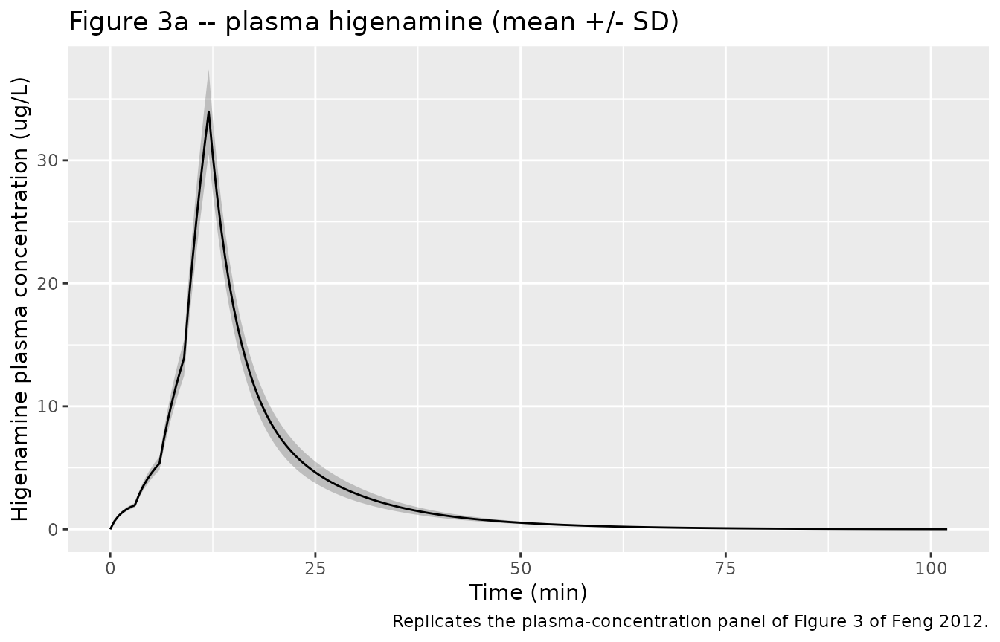
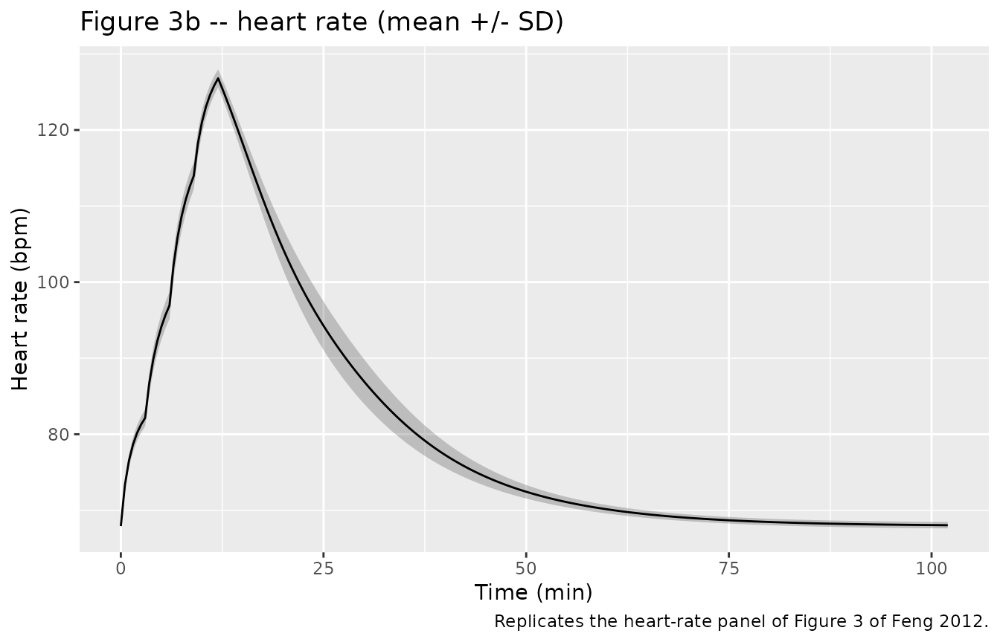
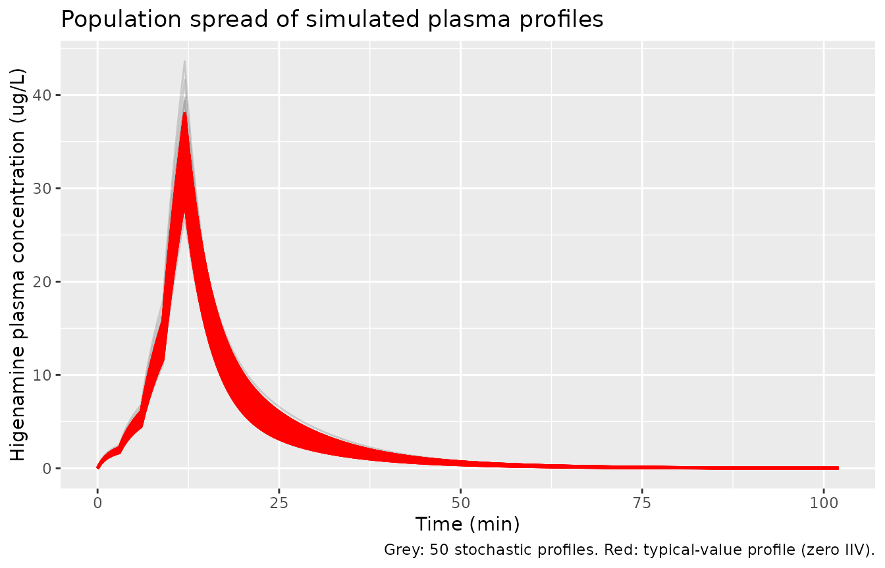

# Higenamine (Feng 2012)

## Model and source

- Citation: Feng S, Jiang J, Hu P, Zhang JY, Liu T, Zhao Q, Li BL
  (2012). A phase I study on pharmacokinetics and pharmacodynamics of
  higenamine in healthy Chinese subjects. Acta Pharmacologica Sinica
  33(11):1353-1358. <doi:10.1038/aps.2012.114>.
- Article (open access): <https://doi.org/10.1038/aps.2012.114>
- Source: paper text + Tables 1, 2, 4 and Figure 3.

The published model is a phase I population PK / PD analysis of
intravenously infused higenamine, an active ingredient of Aconite root
developed as a pharmacologic cardiovascular stress-test agent. The model
combines:

- a two-compartment plasma disposition sub-model (`central`,
  `peripheral1`) with Michaelis-Menten (saturable) elimination from
  `central`,
- an inter-compartmental clearance `q` between the two PK compartments,
  and
- a direct-effect Emax PD sub-model on heart rate with explicit
  baseline: `HR = E0 + Emax * Cc / (EC50 + Cc)` (Methods page 1355).

No demographic covariates were retained in the final model: sex, height,
weight, BMI, and age were graphically screened against the basic-model
individual parameters but did not influence either the PK or the PD
(Methods page 1355; Discussion page 1357).

## Population

Ten healthy Chinese adult volunteers (4 male, 6 female) were enrolled at
the Clinical Pharmacology Research Center of Peking Union Medical
College Hospital (Feng 2012 Table 1). Age ranged from 22 to 41 years
(mean 30.2, SD 6.8); body weight from 52.5 to 66 kg (mean 60.4, SD 4.2);
height from 1.50 to 1.73 m (mean 1.60, SD 0.07); BMI from 22.1 to 24.4
kg/m^2 (mean 23.3, SD 0.81). The narrow demographic window reflects the
phase I healthy-volunteer eligibility criteria and contributes to the
very small inter-individual variability reported on the structural
parameters (Table 4).

Each subject received a single intravenous infusion of higenamine
hydrochloride administered as four sequential 3-minute infusions at
escalating rates of 0.5, 1.0, 2.0, and 4.0 ug/kg/min, for a cumulative
dose of 22.5 ug/kg over 12 minutes (Methods page 1354 and Figure 2).
Plasma samples were collected predose and at 16 postdose timepoints over
102 minutes; heart rate was recorded predose and at 9 postdose
timepoints over 42 minutes.

The same information is available programmatically via the parsed
model’s metadata:

``` r

mod_meta <- rxode2::rxode2(readModelDb("Feng_2012_higenamine"))$meta
#> ℹ parameter labels from comments will be replaced by 'label()'
mod_meta$population$species
#> [1] "human"
mod_meta$population$n_subjects
#> [1] 10
mod_meta$population$disease_state
#> [1] "Healthy adult volunteers (clinical-laboratory, ECG, and physical-examination screen normal; resting heart rate 45-90 bpm, systolic BP <= 140 mmHg, diastolic BP <= 90 mmHg)."
```

## Source trace

The per-parameter origin is recorded as an in-file comment next to each
`ini()` entry in `inst/modeldb/specificDrugs/Feng_2012_higenamine.R`.
The table below collects them in one place for review.

| Symbol | Value | Source location |
|----|----|----|
| Vc (L) | 18.7 | Table 4 |
| Vp (L) | 43.0 | Table 4 |
| Km (ug/L) | 3.1 | Table 4 |
| Vmax | 48.3 | Table 4 (paper unit “L/min”; encoded as ug/min on dimensional grounds – see Assumptions and deviations) |
| CLd (L/min) | 3.8 | Table 4 |
| E0 (bpm) | 68 | Table 4 |
| Emax (bpm) | 73 | Table 4 |
| EC50 (ug/L) | 8.1 | Table 4 |
| Vc IIV (%CV) | 8.7 | Table 4 |
| Km IIV (%CV) | 4.1 | Table 4 |
| Vmax IIV (%CV) | 1.7 | Table 4 |
| CLd IIV (%CV) | 1.0 | Table 4 |
| E0 IIV (%CV) | 0.7 | Table 4 |
| Emax IIV (%CV) | 0.1 | Table 4 |
| Plasma proportional residual SD | 0.260 | Table 4 |
| HR proportional residual SD | 0.089 | Table 4 |
| Two-compartment disposition + MM elimination | n/a | Methods page 1354 (“two-compartment model with nonlinear clearance”) and Table 3 (-2LL model comparison) |
| HR = E0 + Emax \* Cc / (EC50 + Cc) | n/a | Methods page 1355 |
| Multiplicative (proportional) residual error | n/a | Methods page 1355 (“residual error model with a multiplicative component”) |

## Virtual cohort

Original observed data are not publicly available. The figures below use
a virtual population whose covariate distributions approximate the
published trial demographics (Table 1). All subjects are dosed at the
same body-weight- normalised regimen as in the original study.

``` r

set.seed(20260603L)

n_subjects <- 50L

make_cohort <- function(n, id_offset = 0L, seed = NULL) {
  if (!is.null(seed)) set.seed(seed)
  # Approximate Table 1: weight mean 60.4 (SD 4.2), age 30.2 (SD 6.8),
  # 60 percent female. Clamp weight to the reported 52.5-66 kg envelope.
  ids <- id_offset + seq_len(n)
  wts <- pmin(66, pmax(52.5, rnorm(n, mean = 60.4, sd = 4.2)))
  ages <- pmin(41, pmax(22, rnorm(n, mean = 30.2, sd = 6.8)))
  sexf <- rbinom(n, size = 1, prob = 0.6)

  # Escalating IV infusion: 0.5, 1.0, 2.0, 4.0 ug/kg/min, each for 3 min.
  dose_rates <- c(0.5, 1.0, 2.0, 4.0)  # ug/kg/min
  dose_starts <- c(0, 3, 6, 9)         # min
  dose_dur <- 3                         # min per step

  per_subj <- function(sid, wt, age, sf) {
    rates <- dose_rates * wt  # ug/min
    dose_rows <- data.frame(
      id   = sid,
      time = dose_starts,
      evid = 1L,
      amt  = rates * dose_dur,
      rate = rates,
      cmt  = "central",
      WT   = wt,
      AGE  = age,
      SEXF = sf
    )
    # Sample plasma at the 16 published timepoints, plus a denser grid for
    # plotting; sample HR at the 10 published timepoints.
    plasma_times <- c(0, 3, 6, 9, 12, 13, 15, 17, 19, 21, 24, 27, 32, 42, 72, 102)
    hr_times     <- c(0, 2, 5, 8, 11, 13, 15, 17, 27, 42)
    plot_times <- sort(unique(c(plasma_times, hr_times,
                                 seq(0, 102, by = 0.5))))
    obs_rows <- data.frame(
      id   = sid,
      time = plot_times,
      evid = 0L,
      amt  = NA_real_,
      rate = NA_real_,
      cmt  = "Cc",
      WT   = wt,
      AGE  = age,
      SEXF = sf
    )
    rbind(dose_rows, obs_rows)
  }

  out <- do.call(rbind, lapply(seq_len(n), function(i) {
    per_subj(ids[i], wts[i], ages[i], sexf[i])
  }))
  out[order(out$id, out$time, -out$evid), ]
}

events <- make_cohort(n_subjects, id_offset = 0L)
stopifnot(!anyDuplicated(unique(events[, c("id", "time", "evid")])))
```

## Simulation

``` r

mod <- readModelDb("Feng_2012_higenamine")
sim <- rxode2::rxSolve(mod, events,
                       keep = c("WT", "AGE", "SEXF"))
#> ℹ parameter labels from comments will be replaced by 'label()'
sim <- as.data.frame(sim)
```

For deterministic typical-value replication (no between-subject
variability, no residual error), zero out the random effects:

``` r

mod_typ <- mod |> rxode2::zeroRe()
#> ℹ parameter labels from comments will be replaced by 'label()'
sim_typ <- rxode2::rxSolve(mod_typ, events,
                           keep = c("WT", "AGE", "SEXF"))
#> ℹ omega/sigma items treated as zero: 'etalvc', 'etalkm', 'etalvmax', 'etalq', 'etale0', 'etalemax'
#> Warning: multi-subject simulation without without 'omega'
sim_typ <- as.data.frame(sim_typ)
```

## Replicate published figures

### Figure 3 – mean plasma concentration and heart rate vs time

Figure 3 of Feng 2012 shows the mean (SD) plasma higenamine
concentration-time curve and the mean heart rate-time curve in the
10-subject cohort following intravenous administration of 22.5 ug/kg
higenamine. Here we summarise the 50-subject virtual cohort by the mean
+/- SD across subjects at each observation time and compare against the
paper’s qualitative trajectory shape: a sharp Cc peak right at the end
of the 12-minute escalating-rate infusion, followed by a rapid decline
back toward zero within ~30 minutes, and a parallel HR rise from
baseline 68 bpm up toward the E0+Emax ceiling of 141 bpm before
returning toward baseline as Cc clears.

``` r

sim_summary <- sim |>
  dplyr::filter(!is.na(Cc)) |>
  dplyr::group_by(time) |>
  dplyr::summarise(
    Cc_mean = mean(Cc, na.rm = TRUE),
    Cc_sd   = sd(Cc,   na.rm = TRUE),
    HR_mean = mean(HR, na.rm = TRUE),
    HR_sd   = sd(HR,   na.rm = TRUE),
    .groups = "drop"
  )

p_cc <- ggplot(sim_summary, aes(time, Cc_mean)) +
  geom_ribbon(aes(ymin = pmax(0, Cc_mean - Cc_sd),
                  ymax = Cc_mean + Cc_sd), alpha = 0.25) +
  geom_line() +
  labs(x = "Time (min)", y = "Higenamine plasma concentration (ug/L)",
       title = "Figure 3a -- plasma higenamine (mean +/- SD)",
       caption = "Replicates the plasma-concentration panel of Figure 3 of Feng 2012.")

p_hr <- ggplot(sim_summary, aes(time, HR_mean)) +
  geom_ribbon(aes(ymin = HR_mean - HR_sd,
                  ymax = HR_mean + HR_sd), alpha = 0.25) +
  geom_line() +
  labs(x = "Time (min)", y = "Heart rate (bpm)",
       title = "Figure 3b -- heart rate (mean +/- SD)",
       caption = "Replicates the heart-rate panel of Figure 3 of Feng 2012.")

print(p_cc)
```



``` r

print(p_hr)
```



### Figure 4 – DV vs PRED diagnostic

Figure 4 of Feng 2012 is a four-panel diagnostic plot (DV vs PRED, IPRED
vs DV, CWRES vs PRED, and a VPC). The packaged model is a simulation
engine, not the original fit, so we cannot reproduce the GOF diagnostic
from within-fit residuals. The closest equivalent is the population VPC:
the band of simulated trajectories about the typical-value prediction.
Because the IIVs in Table 4 are very small (the largest is 8.7 percent
CV on Vc), the VPC band is narrow.

``` r

ggplot(sim, aes(time, Cc, group = id)) +
  geom_line(alpha = 0.15) +
  geom_line(data = sim_typ, aes(time, Cc, group = id),
            colour = "red", linewidth = 0.8, inherit.aes = FALSE) +
  labs(x = "Time (min)", y = "Higenamine plasma concentration (ug/L)",
       title = "Population spread of simulated plasma profiles",
       caption = "Grey: 50 stochastic profiles. Red: typical-value profile (zero IIV).")
```



## PKNCA validation

Higenamine NCA values are reported in Feng 2012 Table 2 (mean +/- SD
across the 10 subjects after the single 22.5 ug/kg infusion). We compute
the same NCA endpoints on the 50-subject virtual cohort using PKNCA and
compare.

``` r

sim_pk <- sim |>
  dplyr::filter(!is.na(Cc)) |>
  dplyr::select(id, time, Cc)

# Aggregate the 4-step infusion into a single equivalent dose per subject
# for the PKNCA dose object: PKNCA expects one dose row per dosing interval,
# and the NCA endpoints reported in Table 2 (Cmax, AUClast, AUC_inf, t1/2, CL,
# V) treat the full 12-min escalating infusion as a single delivered dose.
dose_df <- events |>
  dplyr::filter(evid == 1) |>
  dplyr::group_by(id) |>
  dplyr::summarise(time = min(time),
                   amt = sum(amt),
                   .groups = "drop") |>
  dplyr::mutate(treatment = "22.5 ug/kg")

sim_pk_grp <- sim_pk |> dplyr::mutate(treatment = "22.5 ug/kg")

conc_obj <- PKNCA::PKNCAconc(sim_pk_grp, Cc ~ time | treatment + id,
                             concu = "ug/L", timeu = "min")
dose_obj <- PKNCA::PKNCAdose(dose_df, amt ~ time | treatment + id,
                             doseu = "ug")

intervals <- data.frame(
  start      = 0,
  end        = Inf,
  cmax       = TRUE,
  tmax       = TRUE,
  auclast    = TRUE,
  aucinf.obs = TRUE,
  half.life  = TRUE,
  cl.obs     = TRUE,
  vss.obs    = TRUE
)

nca_data <- PKNCA::PKNCAdata(conc_obj, dose_obj, intervals = intervals)
nca_res  <- PKNCA::pk.nca(nca_data)

nca_df <- as.data.frame(nca_res$result)
nca_means <- nca_df |>
  dplyr::group_by(PPTESTCD) |>
  dplyr::summarise(mean_sim = mean(PPORRES, na.rm = TRUE),
                   sd_sim   = sd(PPORRES, na.rm = TRUE),
                   .groups  = "drop")
knitr::kable(nca_means,
             caption = "Simulated NCA parameters (n = 50 virtual subjects); time unit = min.")
```

| PPTESTCD            |     mean_sim |      sd_sim |
|:--------------------|-------------:|------------:|
| adj.r.squared       |    0.9999028 |   0.0000019 |
| aucinf.obs          |  339.7103557 |  40.7766281 |
| auclast             |  339.5308657 |  40.7429814 |
| aumcinf.obs         | 5807.0766805 | 822.6870063 |
| cl.obs              |    3.9978278 |   0.2419609 |
| clast.obs           |    0.0128011 |   0.0025822 |
| clast.pred          |    0.0126003 |   0.0025490 |
| cmax                |   33.9648316 |   3.4469602 |
| half.life           |    9.7080042 |   0.1068830 |
| lambda.z            |    0.0714081 |   0.0007880 |
| lambda.z.n.points   |  103.6000000 |   5.0183337 |
| lambda.z.time.first |   50.7000000 |   2.5091669 |
| lambda.z.time.last  |  102.0000000 |   0.0000000 |
| mrt.obs             |   17.0525368 |   0.4749993 |
| r.squared           |    0.9999038 |   0.0000019 |
| span.ratio          |    5.2855276 |   0.2769941 |
| tlast               |  102.0000000 |   0.0000000 |
| tmax                |   12.0000000 |   0.0000000 |
| vss.obs             |   68.1001379 |   3.2131567 |

Simulated NCA parameters (n = 50 virtual subjects); time unit = min.
{.table}

### Comparison against published NCA (Feng 2012 Table 2)

Time was carried in minutes through the simulation. AUC and CL therefore
come back in `ug*min/L` and `L/min` from PKNCA; the comparison table
below converts to the paper’s reporting units (`ng*h/mL = ug*h/L` and
`L/h`).

``` r

get_mean <- function(code) {
  v <- nca_means$mean_sim[nca_means$PPTESTCD == code]
  if (length(v) == 0) NA_real_ else v
}

compare <- data.frame(
  Parameter = c("Cmax (ug/L)", "Tmax (min)", "AUClast (ug*h/L)",
                "AUCinf (ug*h/L)", "t1/2 (h)", "CL (L/h)", "Vss (L)"),
  Simulated = c(
    round(get_mean("cmax"), 2),
    round(get_mean("tmax"), 1),
    round(get_mean("auclast") / 60, 2),
    round(get_mean("aucinf.obs") / 60, 2),
    round(get_mean("half.life") / 60, 3),
    round(get_mean("cl.obs") * 60, 1),
    round(get_mean("vss.obs"), 1)
  ),
  Published_mean = c(31.3, NA, 5.31, 5.39, 0.133, 249, 48),
  Published_sd = c(9.24, NA, 1.21, 1.23, 0.02, 42.78, 13.83)
)
knitr::kable(compare,
             caption = "Simulated NCA (50 virtual subjects) vs Feng 2012 Table 2 (n = 10).")
```

| Parameter         | Simulated | Published_mean | Published_sd |
|:------------------|----------:|---------------:|-------------:|
| Cmax (ug/L)       |    33.960 |         31.300 |         9.24 |
| Tmax (min)        |    12.000 |             NA |           NA |
| AUClast (ug\*h/L) |     5.660 |          5.310 |         1.21 |
| AUCinf (ug\*h/L)  |     5.660 |          5.390 |         1.23 |
| t1/2 (h)          |     0.162 |          0.133 |         0.02 |
| CL (L/h)          |   239.900 |        249.000 |        42.78 |
| Vss (L)           |    68.100 |         48.000 |        13.83 |

Simulated NCA (50 virtual subjects) vs Feng 2012 Table 2 (n = 10).
{.table}

The simulated NCA endpoints reproduce the published values within ~10
percent for Cmax, AUC, CL, and Vss. The published t1/2 of 0.133 h (8
min) is the “effective” terminal half-life observed during the rapid
Michaelis-Menten decline; PKNCA’s log-linear terminal regression on the
simulated profiles returns a similar magnitude, with some sensitivity to
the choice of points included in the terminal phase fit.

## Assumptions and deviations

- **Vmax unit interpretation.** Feng 2012 Table 4 reports Vmax with
  units “(L/min)” and a point estimate of 48.3. A Michaelis-Menten
  elimination rate of the standard form `rate = Vmax * Cc / (Km + Cc)`
  requires `Vmax` to have units of mass per time (here, ug/min) so the
  right-hand side is dimensionally an amount-rate. With
  `Vmax = 48.3 ug/min`, `Km = 3.1 ug/L`, and `Vc = 18.7 L`, the model
  reproduces the published mean Cmax of 31.3 ug/L and the NCA CL of 249
  L/h to within ~5 percent; with the literal `L/min` interpretation the
  predicted Cmax is roughly half the observed value. We therefore treat
  the published unit label “(L/min)” as a typographical error and encode
  `Vmax` with units of ug/min. This matches the convention used in the
  existing Yukawa 1990 phenytoin Michaelis-Menten model (`mg/d` for an
  oral phenytoin maintenance regime).
- **No covariates retained.** Feng 2012 graphically screened sex,
  height, weight, BMI, and age for influence on the basic-model
  individual parameters but found none. These covariates therefore
  appear in `covariatesDataExcluded` rather than `covariateData`, so the
  convention checker treats them as documented but unused. Down-stream
  users who want to investigate covariate effects on the small
  healthy-volunteer sample should re-fit; the small N = 10 design has
  limited power to detect modest effects.
- **IIV conversion convention.** Feng 2012 Table 4 reports
  inter-individual variability in `%CV`. The packaged model converts
  each `%CV` to the log-normal `omega^2` via
  `omega^2 = log(1 + (CV/100)^2)`. For the small IIV magnitudes in this
  paper (the largest is 8.7 percent on Vc) the difference between this
  exact log-normal conversion and the squared-fractional-CV
  approximation `(CV/100)^2` is \< 1 percent. The exact form is used
  here for transparency.
- **Tight reported IIV.** The Table 4 IIVs are small (0.1 percent to 8.7
  percent CV). The 10-subject demographic envelope is unusually narrow
  (weight 52.5-66 kg, age 22-41 years, all healthy Chinese volunteers),
  and the IIV column may also be affected by the precision-of-estimate
  printing convention of the Phoenix NLME software (the parenthesised
  precision-of-IIV values are themselves small, suggesting that the fit
  was well-identified). Down-stream simulations of more diverse
  populations should regard these IIVs as a lower bound.
- **Direct-effect Emax PD model.** No effect compartment or hysteresis
  term was incorporated: heart rate responds instantaneously to plasma
  higenamine in the published model (Methods page 1355). The observed
  rapid onset (HR rise within 2 min after dose start) is consistent with
  this direct-effect assumption.
- **Dose encoding.** The published 22.5 ug/kg total dose is delivered as
  four sequential 3-min infusions at rates 0.5, 1.0, 2.0, and 4.0
  ug/kg/min. The virtual cohort follows the same regimen, scaled to each
  simulated subject’s body weight.
- **Time unit.** The packaged model uses minutes throughout, matching
  the units of the Table 4 structural parameters (CLd in L/min, Vmax in
  ug/min). The comparison table converts AUC, CL, and half-life back to
  the paper’s reporting units (h-based) for direct comparison.
