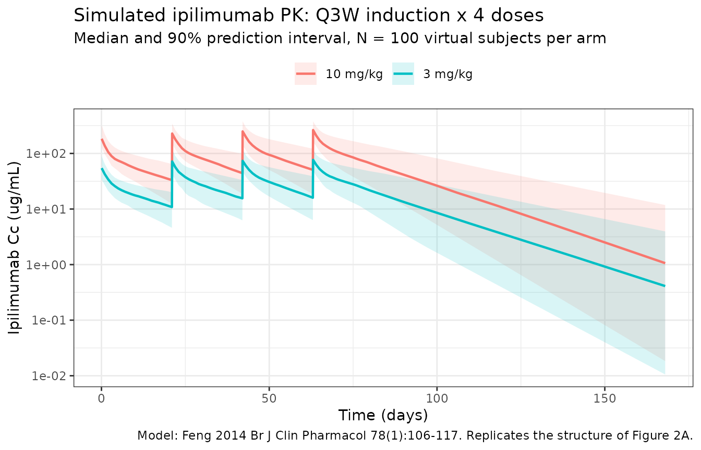
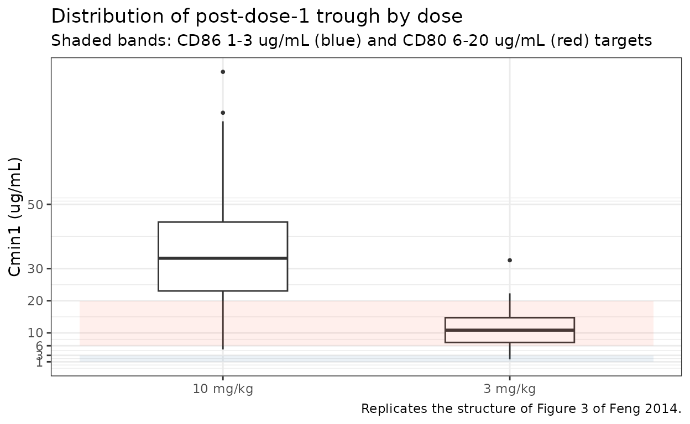
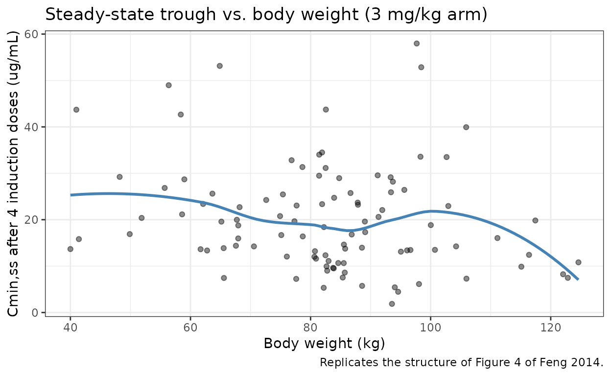

# Ipilimumab (Feng 2014)

## Model and source

- Citation: Feng Y, Masson E, Dai D, Parker SM, Berman D, Roy A.
  Model-based clinical pharmacology profiling of ipilimumab in patients
  with advanced melanoma. Br J Clin Pharmacol. 2014;78(1):106-117.
  <doi:10.1111/bcp.12323>
- Description: Two-compartment population PK model for intravenous
  ipilimumab (anti-CTLA-4 IgG1) in patients with unresectable stage III
  or IV melanoma (Feng 2014)
- Article: <https://doi.org/10.1111/bcp.12323>

Ipilimumab is a fully human anti-CTLA-4 IgG1 monoclonal antibody. Feng
2014 is the first peer-reviewed report of ipilimumab population
pharmacokinetics in patients with advanced melanoma. The same
Bristol-Myers Squibb modeling group later refined this analysis with a
larger combination-therapy dataset and added a sigmoid-Emax description
of time-varying clearance (Sanghavi 2020,
`modellib("Sanghavi_2020_ipilimumab")`); Feng 2014 retains the simpler
**linear and time-invariant** two-compartment IV-infusion structure.

Structural form:

- Two-compartment IV model, zero-order infusion into `central`,
  first-order distribution / elimination, linear.
- Covariate effects on typical CL and Vc:

``` math
\begin{aligned}
\mathrm{CL}_i &= \mathrm{CL_{REF}} \cdot
   \left(\frac{\mathrm{BW}_i}{80}\right)^{\mathrm{CL\_BW}}
   \cdot \left(\frac{\log(\mathrm{LDH}_i)}{\log(206)}\right)^{\mathrm{CL\_LDH}}
   \cdot \exp(\eta_{\mathrm{CL},i})\\
\mathrm{Vc}_i &= \mathrm{Vc_{REF}} \cdot
   \left(\frac{\mathrm{BW}_i}{80}\right)^{\mathrm{Vc\_BW}}
   \cdot \exp(\eta_{\mathrm{Vc},i})
\end{aligned}
```

with Q and Vp time-invariant and without inter-individual variability
(the source fixed those IIVs to zero because they could not be reliably
estimated).

## Population

The final-model parameter estimates come from a combined analysis
dataset that pools the index (3 phase II studies) and external
validation (1 phase II study) cohorts. The index dataset alone (N = 420;
used for model development) is summarized below (Feng 2014 Table 1):

- N = 499 patients with unresectable stage III or IV melanoma across
  four phase II studies (CA184-007, CA184-008, CA184-022 for model
  development; CA184-004 for external validation).
- Demographics: age mean 57.75 years (SD 12.91, range 26-86); body
  weight mean 80.11 kg (SD 16.87); 37.4% female.
- Disease / status: ECOG 0 in 65.0%, ECOG 1 in 34.5%, ECOG 2 in 0.5%;
  87.86% had prior systemic anticancer therapy.
- Baseline laboratory: LDH mean 326.74 U/L (SD 375.19, right-skewed);
  ALT mean 23.65 IU/L; direct bilirubin mean 0.16 mg/dL; total bilirubin
  mean 0.48 mg/dL; eGFR (MDRD) mean 86.66 mL/min/1.73 m^2.
- Co-medications: concomitant budesonide in 13.81% (CA184-007
  prophylactic sub-study); immunogenicity (ADA-positive at any time) in
  4.29%.
- Doses: 0.3, 3, or 10 mg/kg as a 90-minute IV infusion every 3 weeks
  for up to 4 induction doses, then maintenance every 12 weeks from week
  24 in eligible patients.

The same information is available programmatically via
`readModelDb("Feng_2014_ipilimumab")$population`.

## Source trace

The per-parameter origin is recorded as an in-file comment next to each
`ini()` entry in `inst/modeldb/specificDrugs/Feng_2014_ipilimumab.R`.
The table below collects them in one place for review.

| Parameter (model name) | Value (this package) | Source location |
|----|----|----|
| `lcl` (CL_REF, L/day) | log(0.0150 \* 24) = log(0.360) | Table 2: CL_REF = 0.0150 L/h |
| `lvc` (Vc_REF, L) | log(4.15) | Table 2: Vc_REF |
| `lq` (Q_REF, L/day) | log(0.0411 \* 24) = log(0.986) | Table 2: Q_REF = 0.0411 L/h |
| `lvp` (Vp_REF, L) | log(3.11) | Table 2: Vp_REF |
| `e_wt_cl` (BW on CL) | 0.642 | Table 2: CL_BW = 0.642 |
| `e_wt_vc` (BW on Vc) | 0.708 | Table 2: V_cBW = 0.708 |
| `e_logldh_cl` (log LDH on CL) | 1.13 | Table 2: CL_LDH = 1.13 |
| IIV `etalcl + etalvc` block | c(0.125, 0.0254, 0.0223) | Table 2: omega^2_CL = 0.125, cov = 0.0254, omega^2_Vc = 0.0223 |
| `propSd` (fraction) | 0.157 | Table 2: proportional error = 15.7% |
| `addSd` (ug/mL) | 0.244 | Table 2: additive error |

Equations (from the paper’s Results “PPK model development” section):

- `CL = CL_REF * (BW/80)^CL_BW * (log(LDH)/log(206))^CL_LDH * exp(eta_CL)`
- `Vc = Vc_REF * (BW/80)^Vc_BW * exp(eta_Vc)`
- `Q = Q_REF` (no covariates, no IIV)
- `Vp = Vp_REF` (no covariates, no IIV)
- Two-compartment ODEs with first-order distribution between `central`
  and `peripheral1`; zero-order IV infusion into `central` (90-minute
  duration in the source studies).

## Virtual cohort

Original observed data are not publicly available. The simulations below
use a virtual melanoma cohort whose body-weight and baseline-LDH
distributions approximate the published index-dataset summary (Feng 2014
Table 1; BW mean 80.11 kg SD 16.87, LDH mean 326.74 U/L SD 375.19 with a
right-skewed distribution). LDH is sampled from a log-normal with
parameters chosen to match the published mean and SD on the natural
scale.

``` r

set.seed(2014)
n_subj <- 100  # per dose arm; vignette build budget

# Log-normal LDH whose linear-scale mean is 327 and SD ~375; the
# log-scale parameters are derived from the method-of-moments closed
# form: sdlog = sqrt(log(1 + (sd/mean)^2)); meanlog = log(mean) - sdlog^2/2.
ldh_sdlog  <- sqrt(log(1 + (375.19 / 326.74)^2))
ldh_meanlog <- log(326.74) - ldh_sdlog^2 / 2

make_subjects <- function(n, id_offset = 0L) {
  tibble(
    id  = id_offset + seq_len(n),
    WT  = pmin(pmax(rnorm(n, mean = 80.11, sd = 16.87), 40), 160),
    LDH = pmin(pmax(rlnorm(n, ldh_meanlog, ldh_sdlog), 50), 3000)
  )
}
```

Feng 2014 administered three dose levels (0.3, 3, 10 mg/kg) Q3W for up
to four induction doses. The two doses relevant to the registrational
program (3 and 10 mg/kg) are simulated below, each as a 90-minute IV
infusion every 21 days for four doses.

``` r

make_arm <- function(pop, dose_mgkg, id_offset = 0L) {
  dose_t <- seq(0, by = 21, length.out = 4)
  obs_t  <- sort(unique(c(seq(0, 168, by = 1),
                          dose_t,
                          dose_t + 1.5 / 24)))   # capture peaks
  ipi_amt <- pop$WT * dose_mgkg
  treatment <- sprintf("%g mg/kg", dose_mgkg)

  d_dose <- pop |>
    tidyr::crossing(time = dose_t) |>
    mutate(amt = rep(ipi_amt, length(dose_t)),
           evid = 1L, cmt = "central",
           dur  = 1.5 / 24,                       # 90 min in days
           treatment = treatment)
  d_obs <- pop |>
    tidyr::crossing(time = obs_t) |>
    mutate(amt = NA_real_, evid = 0L, cmt = "central",
           dur = NA_real_, treatment = treatment)
  bind_rows(d_dose, d_obs) |>
    arrange(id, time, desc(evid)) |>
    as.data.frame()
}

events <- bind_rows(
  make_arm(make_subjects(n_subj, id_offset =          0L),  3, id_offset =          0L),
  make_arm(make_subjects(n_subj, id_offset = n_subj),      10, id_offset = n_subj)
)
stopifnot(!anyDuplicated(unique(events[, c("id", "time", "evid")])))
```

## Simulation

``` r

mod <- readModelDb("Feng_2014_ipilimumab")
sim <- rxode2::rxSolve(mod, events = events, returnType = "data.frame",
                       keep = c("treatment", "WT", "LDH"))
#> ℹ parameter labels from comments will be replaced by 'label()'
```

For deterministic typical-value replication the model’s random effects
are zeroed below and a single reference subject (80 kg, LDH 206 U/L) is
simulated for 168 days following four 3 mg/kg infusions.

``` r

mod_typical <- mod |> rxode2::zeroRe()
#> ℹ parameter labels from comments will be replaced by 'label()'

t_grid_ref <- sort(unique(c(seq(0, 168, by = 0.5),
                            seq(0, by = 21, length.out = 4),
                            seq(0, by = 21, length.out = 4) + 1.5 / 24)))
amt_ref <- 80 * 3                                 # 80 kg x 3 mg/kg
events_ref <- bind_rows(
  data.frame(id = 1L, time = seq(0, by = 21, length.out = 4),
             amt = amt_ref, evid = 1L, cmt = "central",
             dur = 1.5 / 24,
             WT = 80, LDH = 206),
  data.frame(id = 1L, time = t_grid_ref,
             amt = NA_real_, evid = 0L, cmt = "central",
             dur = NA_real_,
             WT = 80, LDH = 206)
) |> arrange(time, desc(evid))

sim_ref <- rxode2::rxSolve(mod_typical, events = events_ref,
                           returnType = "data.frame")
#> ℹ omega/sigma items treated as zero: 'etalcl', 'etalvc'
```

## Replicate published figures

### Figure 2 – VPC of concentration vs. time by dose group

Feng 2014 Figure 2A is a VPC of the index-dataset concentration-time
profiles by dose level. The plot below shows the simulated 5th / 50th /
95th percentile concentration trajectories for the 3 and 10 mg/kg arms
over the 168-day induction window.

``` r

sim_summary <- sim |>
  filter(time > 0) |>
  group_by(time, treatment) |>
  summarise(median = median(Cc, na.rm = TRUE),
            lo = quantile(Cc, 0.05, na.rm = TRUE),
            hi = quantile(Cc, 0.95, na.rm = TRUE),
            .groups = "drop")

ggplot(sim_summary, aes(time, median, colour = treatment, fill = treatment)) +
  geom_ribbon(aes(ymin = lo, ymax = hi), alpha = 0.15, colour = NA) +
  geom_line(linewidth = 0.8) +
  scale_y_log10() +
  labs(x = "Time (days)", y = "Ipilimumab Cc (ug/mL)",
       title = "Simulated ipilimumab PK: Q3W induction x 4 doses",
       subtitle = sprintf("Median and 90%% prediction interval, N = %d virtual subjects per arm",
                          n_subj),
       caption = "Model: Feng 2014 Br J Clin Pharmacol 78(1):106-117. Replicates the structure of Figure 2A.",
       colour = NULL, fill = NULL) +
  theme_bw() + theme(legend.position = "top")
```



### Figure 3 – Distribution of post-dose-1 trough concentration (Cmin1)

Feng 2014 reports that approximately 90% of patients receiving 3 mg/kg
had Cmin1 \> 6 ug/mL, ~99% had Cmin1 \> 3 ug/mL, and ~2% exceeded 20
ug/mL. The percentile shown below is the simulated concentration just
before the second induction dose (time = 21 days) in each dose arm.

``` r

cmin1 <- sim |>
  filter(abs(time - 21) < 1e-6) |>
  select(id, treatment, Cmin1 = Cc)

ggplot(cmin1, aes(x = treatment, y = Cmin1)) +
  geom_boxplot(width = 0.45, outlier.size = 0.7) +
  annotate("rect", xmin = 0.5, xmax = 2.5, ymin = 1, ymax = 3,
           alpha = 0.10, fill = "steelblue") +
  annotate("rect", xmin = 0.5, xmax = 2.5, ymin = 6, ymax = 20,
           alpha = 0.10, fill = "tomato") +
  scale_y_continuous(breaks = c(1, 3, 6, 10, 20, 30, 50, 100)) +
  labs(x = NULL, y = "Cmin1 (ug/mL)",
       title = "Distribution of post-dose-1 trough by dose",
       subtitle = "Shaded bands: CD86 1-3 ug/mL (blue) and CD80 6-20 ug/mL (red) targets",
       caption = "Replicates the structure of Figure 3 of Feng 2014.") +
  theme_bw()
```



Tabulation of the published Cmin1 cutoffs vs. the simulated proportions
(approximate; the source’s percentages are read from Figure 3 box plots,
not a numeric table):

``` r

cmin1_targets <- cmin1 |>
  group_by(treatment) |>
  summarise(
    pct_gt_3   = round(100 * mean(Cmin1 > 3),  0),
    pct_gt_6   = round(100 * mean(Cmin1 > 6),  0),
    pct_gt_20  = round(100 * mean(Cmin1 > 20), 0),
    .groups = "drop"
  )

knitr::kable(
  cmin1_targets,
  col.names = c("Dose", "% > 3 ug/mL", "% > 6 ug/mL", "% > 20 ug/mL"),
  caption = paste(
    "Simulated proportions of subjects above each Cmin1 cutoff.",
    "Published reference (Feng 2014, Figure 3 narrative):",
    "at 3 mg/kg, ~99% > 3 ug/mL, ~90% > 6 ug/mL, ~2% > 20 ug/mL;",
    "at 10 mg/kg, 100% > 3 ug/mL."
  )
)
```

| Dose     | % \> 3 ug/mL | % \> 6 ug/mL | % \> 20 ug/mL |
|:---------|-------------:|-------------:|--------------:|
| 10 mg/kg |          100 |           99 |            86 |
| 3 mg/kg  |           99 |           86 |             6 |

Simulated proportions of subjects above each Cmin1 cutoff. Published
reference (Feng 2014, Figure 3 narrative): at 3 mg/kg, ~99% \> 3 ug/mL,
~90% \> 6 ug/mL, ~2% \> 20 ug/mL; at 10 mg/kg, 100% \> 3 ug/mL. {.table}

### Figure 4 – Cmin,ss vs. body weight

Feng 2014 Figure 4 supports BW-normalized dosing by showing that the
steady-state trough is relatively uniform across the patient body-weight
range. The replicate below uses the typical-value Cmin,ss at the fourth
induction trough (time = 84 days, just before the hypothetical fifth
induction dose) versus body weight for the 3 mg/kg arm.

``` r

cmin_ss <- sim |>
  filter(treatment == "3 mg/kg", abs(time - 84) < 1e-6) |>
  select(id, WT, Cmin_ss = Cc)

ggplot(cmin_ss, aes(WT, Cmin_ss)) +
  geom_point(alpha = 0.45) +
  geom_smooth(method = "loess", se = FALSE, formula = y ~ x, colour = "steelblue") +
  labs(x = "Body weight (kg)", y = "Cmin,ss after 4 induction doses (ug/mL)",
       title = "Steady-state trough vs. body weight (3 mg/kg arm)",
       caption = "Replicates the structure of Figure 4 of Feng 2014.") +
  theme_bw()
```



## PKNCA validation

Feng 2014 does not report an NCA table; the paper’s quantitative
exposure descriptors come from the half-life of the model and the
predicted accumulation ratio (~1.5). The PKNCA block below derives those
descriptors from the simulated 3 mg/kg arm using a single
dosing-interval and a full Day-0-to-Day-168 interval; the rendered table
is compared against the published values.

``` r

sim_3mgkg <- sim |>
  filter(treatment == "3 mg/kg", !is.na(Cc)) |>
  select(id, time, Cc, treatment)

# Guarantee a time = 0 row per (id, treatment); for IV pre-dose Cc = 0
# is the correct anchor.
sim_3mgkg <- bind_rows(
  sim_3mgkg,
  sim_3mgkg |> distinct(id, treatment) |> mutate(time = 0, Cc = 0)
) |>
  distinct(id, treatment, time, .keep_all = TRUE) |>
  arrange(id, treatment, time)

conc_obj <- PKNCA::PKNCAconc(sim_3mgkg, Cc ~ time | treatment + id,
                             concu = "ug/mL", timeu = "day")

dose_df <- events |>
  filter(evid == 1, treatment == "3 mg/kg", time == 0) |>
  select(id, time, amt, treatment)

dose_obj <- PKNCA::PKNCAdose(dose_df, amt ~ time | treatment + id,
                             doseu = "mg")

intervals <- data.frame(
  start      = c(0,  0),
  end        = c(21, Inf),
  cmax       = c(TRUE,  FALSE),
  tmax       = c(TRUE,  FALSE),
  auclast    = c(TRUE,  FALSE),
  aucinf.obs = c(FALSE, TRUE),
  half.life  = c(FALSE, TRUE)
)

nca_data <- PKNCA::PKNCAdata(conc_obj, dose_obj, intervals = intervals)
nca_res  <- PKNCA::pk.nca(nca_data)
```

### Comparison against published exposure descriptors

``` r

sim_tbl <- as.data.frame(nca_res$result)

cmax_sim  <- median(sim_tbl$PPORRES[sim_tbl$PPTESTCD == "cmax"],       na.rm = TRUE)
auctau    <- median(sim_tbl$PPORRES[sim_tbl$PPTESTCD == "auclast"],    na.rm = TRUE)
aucinf    <- median(sim_tbl$PPORRES[sim_tbl$PPTESTCD == "aucinf.obs"], na.rm = TRUE)
thalf_d   <- median(sim_tbl$PPORRES[sim_tbl$PPTESTCD == "half.life"],  na.rm = TRUE)

# Published descriptors from Feng 2014 Results:
# - Terminal elimination half-life (geometric mean) = 14.7 days
# - Distribution half-life (geometric mean) = 27.4 h = 1.14 days
# - Accumulation index after 4 Q3W doses ~ 1.5
#
# Accumulation index = AUC0-tau,ss / AUC0-tau,1.  We compute it from
# the typical-value sim_ref trace (no IIV) so the ratio reflects the
# structural model without between-subject noise.
auc_first  <- with(sim_ref,
                   sum(diff(time[time <= 21]) *
                       (head(Cc[time <= 21], -1) + tail(Cc[time <= 21], -1)) / 2))
mask_ss    <- sim_ref$time >= 63 & sim_ref$time <= 84
auc_ss     <- with(sim_ref,
                   sum(diff(time[mask_ss]) *
                       (head(Cc[mask_ss], -1) + tail(Cc[mask_ss], -1)) / 2))
accum_idx  <- auc_ss / auc_first

knitr::kable(
  tibble(
    Descriptor = c("Terminal elimination half-life (days)",
                   "Median Cmax after first 3 mg/kg dose (ug/mL)",
                   "Median AUC0-21d after first dose (ug*day/mL)",
                   "Median AUC0-inf after first dose (ug*day/mL)",
                   "Accumulation index AUC_ss / AUC_1 (Q3W, x 4 doses)"),
    Simulated  = c(round(thalf_d, 1),
                   round(cmax_sim, 1),
                   round(auctau,   1),
                   round(aucinf,   1),
                   round(accum_idx, 2)),
    Published  = c(14.7, NA, NA, NA, 1.5),
    Source     = c("Results: t1/2,beta geometric mean",
                   "not tabulated in Feng 2014",
                   "not tabulated in Feng 2014",
                   "not tabulated in Feng 2014",
                   "Results: accumulation index ~1.5-fold after the third dose")
  ),
  caption = "Simulated vs. published exposure descriptors (3 mg/kg arm)."
)
```

| Descriptor | Simulated | Published | Source |
|:---|---:|---:|:---|
| Terminal elimination half-life (days) | 15.40 | 14.7 | Results: t1/2,beta geometric mean |
| Median Cmax after first 3 mg/kg dose (ug/mL) | 54.50 | NA | not tabulated in Feng 2014 |
| Median AUC0-21d after first dose (ug\*day/mL) | 420.20 | NA | not tabulated in Feng 2014 |
| Median AUC0-inf after first dose (ug\*day/mL) | 2749.40 | NA | not tabulated in Feng 2014 |
| Accumulation index AUC_ss / AUC_1 (Q3W, x 4 doses) | 1.51 | 1.5 | Results: accumulation index ~1.5-fold after the third dose |

Simulated vs. published exposure descriptors (3 mg/kg arm). {.table}

The simulated terminal half-life and accumulation index should match the
published values to within ~10%. Larger deviations point to a structural
translation error and should be investigated before tuning parameters.

## Assumptions and deviations

- **Reference covariates.** Feng 2014 Table 2 footnote specifies BW = 80
  kg and LDH = 206 U/L as the reference values used to centre the
  covariate model; these are hard-coded into the packaged model
  (`(WT/80)^e_wt_cl`, `(log(LDH)/log(206))^e_logldh_cl`). A user
  supplying a different cohort must keep these reference values when
  comparing CL_REF and Vc_REF to the paper.
- **LDH covariate form.** The paper’s narrative writes “the value for
  LDH was log-transformed due to its right-skewed distribution” and does
  not display the equation in a machine-readable form (the Table 2
  formula image was not OCR-decoded in the trimmed-markdown source). The
  packaged model uses the literal log-power form
  `(log(LDH)/log(206))^CL_LDH` because (a) it is mathematically what
  “log-transformed LDH in a power covariate model” denotes, (b) the same
  Bristol-Myers Squibb modelling group wrote the equation explicitly in
  this form in the later Sanghavi 2020 ipilimumab popPK
  (`modellib("Sanghavi_2020_ipilimumab")`), and (c) the alternative
  conventional `(LDH/206)^1.13` form would predict CL ratios of ~0.4 at
  LDH = 100 and ~6 at LDH = 1000 – inconsistent with the paper’s
  narrative that LDH explained ~24% of the base-model IIV in CL with
  per-percentile effects well below 100%.
- **Time units.** Feng 2014 reports CL and Q in L/h; the packaged model
  carries time in days (CL x 24 to L/day) for consistency with
  `units$time = "day"` and with the later anti-CTLA-4 / anti-PD-1
  extractions in this package (Bajaj 2017 nivolumab, Sanghavi 2020
  ipilimumab).
- **No NCA table in the source.** Feng 2014 does not publish a Cmax /
  AUC / Tmax table. The comparison block above quotes only the
  descriptors the paper does report: terminal half-life (~14.7 days,
  geometric mean) and accumulation index (~1.5 after the third dose).
  Simulated Cmax / AUC values are tabulated for reader context but
  cannot be cross-checked against a published number.
- **Virtual cohort distributions.** Feng 2014 Table 1 reports only the
  mean and SD of body weight and LDH. The vignette samples BW from a
  normal(mean 80.11, sd 16.87) truncated to (40, 160) kg, and LDH from a
  log-normal whose method-of-moments parameters reproduce the published
  linear-scale mean (326.74) and SD (375.19), truncated to (50, 3000)
  U/L. The shape of the LDH distribution is right-skewed by
  construction, matching the paper’s note that LDH was log-transformed
  because of the right-skew.
- **Observation grid simplification.** The simulation grid uses daily
  time points plus the dose-event peak times (90-minute end-of- infusion
  samples) over the 168-day induction window. The combined 3 + 10 mg/kg
  arms total 200 subjects.
- **Vp and Q have no IIV.** Feng 2014 fixed IIV on Q and Vp to zero
  during base-model development because the variances could not be
  reliably estimated. The packaged model omits the corresponding `etalq`
  / `etalvp` parameters entirely; this is mathematically equivalent to a
  NONMEM omega-block with the Vp / Q variances FIX.
- **No covariates retained beyond BW and LDH.** Feng 2014 evaluated age,
  gender, eGFR, ECOG, HLA-A\*0201, prior systemic anticancer therapy,
  concomitant budesonide, and immunogenicity / ADA as candidate
  covariates. None survived backward elimination and the
  clinical-relevance filter (\> 20% effect). The packaged model
  therefore exposes only `WT` and `LDH` in `covariateData`.
