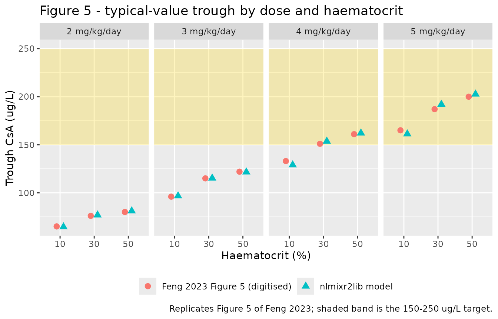
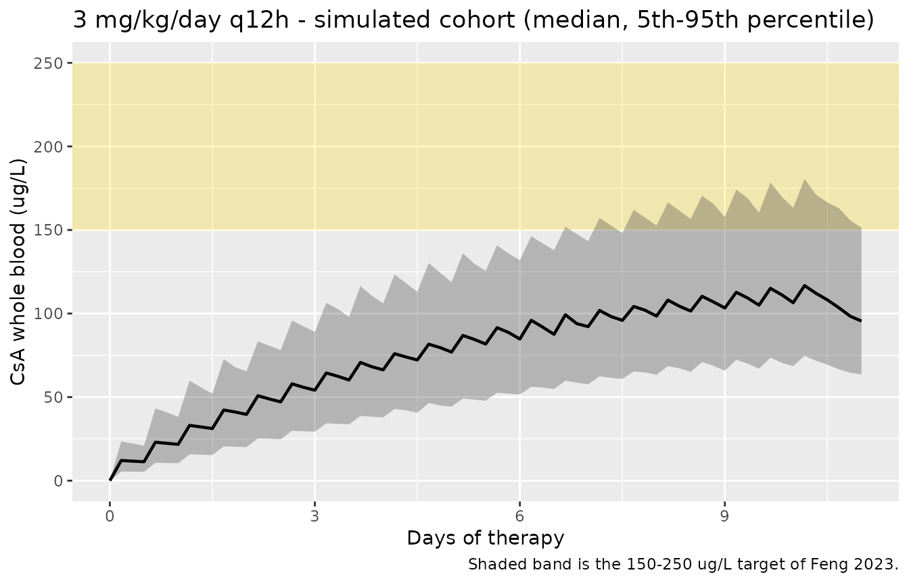

# Cyclosporine (Feng 2023)

## Model and source

    #> ℹ parameter labels from comments will be replaced by 'label()'

- Citation: Feng H, Wang X, Zheng W, Liu S, Jiang H, Lin Y, Qiu H, Chan
  TF, Huang M, Li Y, Mo X, Li J. Initial dosage optimisation of
  cyclosporine in Chinese paediatric patients undergoing allogeneic
  haematopoietic stem cell transplantation based on population
  pharmacokinetics: a retrospective study. BMJ Paediatr Open.
  2023;7(1):e002003. <doi:10.1136/bmjpo-2023-002003>
- Description: One-compartment intravenous population PK model for
  cyclosporine A in Chinese paediatric patients undergoing allogeneic
  haematopoietic stem cell transplantation (Feng 2023; final covariate
  model with body weight on CL and body weight plus haematocrit on V)
- Article: <https://doi.org/10.1136/bmjpo-2023-002003>

Feng and colleagues fitted a one-compartment model with linear
elimination to 865 whole-blood cyclosporine A (CsA) trough
concentrations from 251 Chinese children who received intravenous CsA as
acute graft-versus-host disease prophylaxis after allogeneic
haematopoietic stem cell transplantation (allo-HSCT). Body weight enters
both clearance and volume as an estimated power term; haematocrit enters
volume only. The paper’s practical output is a Monte Carlo
dose-selection exercise (its Figure 5) concluding that the commonly used
3 mg/kg/day starting dose is too low and that 5 mg/kg/day divided every
12 h is needed for a typical 16.5 kg recipient to reach the 150-250 ug/L
target window early after transplantation.

``` r

mod <- readModelDb("Feng_2023_cyclosporine")
mod
#> function() {
#>   description <- "One-compartment intravenous population PK model for cyclosporine A in Chinese paediatric patients undergoing allogeneic haematopoietic stem cell transplantation (Feng 2023; final covariate model with body weight on CL and body weight plus haematocrit on V)"
#>   reference <- "Feng H, Wang X, Zheng W, Liu S, Jiang H, Lin Y, Qiu H, Chan TF, Huang M, Li Y, Mo X, Li J. Initial dosage optimisation of cyclosporine in Chinese paediatric patients undergoing allogeneic haematopoietic stem cell transplantation based on population pharmacokinetics: a retrospective study. BMJ Paediatr Open. 2023;7(1):e002003. doi:10.1136/bmjpo-2023-002003"
#>   vignette <- "Feng_2023_cyclosporine"
#>   units <- list(time = "h", dosing = "mg", concentration = "ng/mL")
#> 
#>   compartmentData <- list(
#>     # Cyclosporine A was measured in whole blood by an enzyme-multiplied
#>     # immunoassay technique (EMIT) on a Viva-E analyser (Feng 2023 Methods,
#>     # "Participants and data collection"), so the modelled matrix is whole
#>     # blood rather than plasma.
#>     central = list(analyte = "cyclosporine", units = "mg", specimen = "whole blood", verified = TRUE)
#>   )
#> 
#>   covariateData <- list(
#>     WT = list(
#>       description        = "Body weight",
#>       units              = "kg",
#>       type               = "continuous",
#>       reference_category = NULL,
#>       notes              = paste(
#>         "Power scaling on both CL and V, normalised to the 16.5 kg cohort",
#>         "median (Feng 2023 Eq. 7 and Eq. 8; Table 1 reports body weight",
#>         "median 16.5 kg, range 8.0-64.5 kg). Baseline body weight; the paper",
#>         "does not describe a time-varying weight record. Body weight was the",
#>         "only covariate retained on CL. The Discussion states that age and",
#>         "body weight were collinear and that body weight alone was kept in",
#>         "the final model."
#>       ),
#>       source_name        = "BW"
#>     ),
#>     HCT = list(
#>       description        = "Haematocrit",
#>       units              = "%",
#>       type               = "continuous",
#>       reference_category = NULL,
#>       notes              = paste(
#>         "Power scaling on V only, normalised to 28.8 % (Feng 2023 Eq. 8).",
#>         "The paper prints haematocrit on the percent scale throughout",
#>         "(Table 1 median 27.0 %, range 5.0-37.5 %; Figure 5 simulates 10 %,",
#>         "30 % and 50 %), so no rescaling from a volume fraction is needed",
#>         "for the canonical percent column. Note that the 28.8 % normalising",
#>         "constant in Eq. 8 is not the 27.0 % median printed in Table 1 for",
#>         "the full 251-patient cohort; Eq. 8 was fitted on the 176-patient",
#>         "training set, whose demographics are in the online supplemental",
#>         "table S3 (not on disk). The exponent is negative: lower haematocrit",
#>         "leaves less red-cell mass for this highly lipophilic,",
#>         "erythrocyte-partitioned drug to bind, increasing distribution into",
#>         "fat and hence the apparent volume (Feng 2023 Discussion)."
#>       ),
#>       source_name        = "HCT"
#>     )
#>   )
#> 
#>   # Covariates that Feng 2023 screened but did not retain in the final model.
#>   # The paper is explicit that "none of the genetic polymorphisms in ABCB1,
#>   # CYP3A4, CYP3A5, POR and NR1I3 were significant covariates in the PK of CsA
#>   # in our study" (Discussion) and that, apart from body weight and
#>   # haematocrit, "other covariates were not found to have statistical
#>   # significance on PK parameters" (Results). These entries carry that
#>   # negative finding forward; they are documentation only and are not
#>   # referenced in model().
#>   covariatesDataExcluded <- list(
#>     AGE   = list(description = "Age", units = "years", type = "continuous",
#>                  notes = "Table 1 median 6 years (range 1-17). Screened; dropped for collinearity with body weight (Discussion)."),
#>     SEXF  = list(description = "Female sex indicator", units = "(binary)", type = "binary",
#>                  reference_category = "male", notes = "Table 1: 89/251 female (35.5 %). Screened, not significant."),
#>     ALB   = list(description = "Serum albumin", units = "g/L", type = "continuous",
#>                  notes = "Table 1 median 36.9 g/L (28.1-44.1). Screened, not significant."),
#>     TBILI = list(description = "Total bilirubin", units = "umol/L", type = "continuous",
#>                  notes = "Table 1 median 16.0 umol/L (3.6-105.1). Screened, not significant."),
#>     DBIL  = list(description = "Direct bilirubin", units = "umol/L", type = "continuous",
#>                  notes = "Table 1 median 6.1 umol/L (0.9-82.7). Screened, not significant."),
#>     ALT   = list(description = "Alanine aminotransferase", units = "U/L", type = "continuous",
#>                  notes = "Table 1 median 51 U/L (3-1120). Screened, not significant."),
#>     AST   = list(description = "Aspartate aminotransferase", units = "U/L", type = "continuous",
#>                  notes = "Table 1 median 26 U/L (1-606). Screened, not significant."),
#>     ALP   = list(description = "Alkaline phosphatase", units = "U/L", type = "continuous",
#>                  notes = "Table 1 median 119 U/L (46-291). Screened, not significant."),
#>     CRP   = list(description = "Hypersensitive C-reactive protein", units = "mg/L", type = "continuous",
#>                  notes = "Table 1 median 7.00 mg/L (0.20-263.40). Screened, not significant."),
#>     HGB   = list(description = "Haemoglobin", units = "g/L", type = "continuous",
#>                  notes = "Table 1 median 94 g/L (60-124). Screened, not significant; collinear with the retained HCT."),
#>     RBC   = list(description = "Red blood cell count", units = "10^12/L", type = "continuous",
#>                  notes = "Table 1 median 3.32 (2.12-5.28). Screened, not significant; collinear with the retained HCT."),
#>     PLT   = list(description = "Platelet count", units = "10^9/L", type = "continuous",
#>                  notes = "Table 1 median 24 (2-180). Screened, not significant."),
#>     SNP_ABCB1_RS1045642  = list(description = "ABCB1 rs1045642 (3435C>T) genotype", units = "(genotype)", type = "categorical",
#>                                 reference_category = "GG", notes = "Table 2 genotype frequencies AA 0.15 / GA 0.43 / GG 0.42. Screened, not significant."),
#>     SNP_ABCB1_RS1128503  = list(description = "ABCB1 rs1128503 (1236C>T) genotype", units = "(genotype)", type = "categorical",
#>                                 reference_category = "GG", notes = "Table 2 genotype frequencies AA 0.34 / AG 0.49 / GG 0.17. Screened, not significant."),
#>     SNP_ABCB1_RS34800935 = list(description = "ABCB1 rs34800935 genotype", units = "(genotype)", type = "categorical",
#>                                 reference_category = "CC", notes = "Table 2 genotype frequencies CC 0.15 / TC 0.52 / TT 0.33. Screened, not significant."),
#>     SNP_ABCB1_RS3842     = list(description = "ABCB1 rs3842 genotype", units = "(genotype)", type = "categorical",
#>                                 reference_category = "CC", notes = "Table 2 genotype frequencies CC 0.09 / TC 0.44 / TT 0.47. Screened, not significant."),
#>     SNP_CYP3A4_RS2242480 = list(description = "CYP3A4*1G (rs2242480) genotype", units = "(genotype)", type = "categorical",
#>                                 reference_category = "CC", notes = "Table 2 genotype frequencies CC 0.50 / CT 0.43 / TT 0.08. Screened, not significant."),
#>     SNP_CYP3A5_RS776746  = list(description = "CYP3A5*3 (rs776746) genotype", units = "(genotype)", type = "categorical",
#>                                 reference_category = "CC", notes = "Table 2 genotype frequencies CC 0.52 / CT 0.38 / TT 0.10. Screened, not significant."),
#>     SNP_POR_RS17685      = list(description = "POR rs17685 genotype", units = "(genotype)", type = "categorical",
#>                                 reference_category = "GG", notes = "Table 2 genotype frequencies AA 0.12 / GA 0.52 / GG 0.37. Screened, not significant."),
#>     SNP_NR1I3_RS2307424  = list(description = "NR1I3 (CAR) rs2307424 genotype", units = "(genotype)", type = "categorical",
#>                                 reference_category = "GG", notes = "Table 2 genotype frequencies AA 0.27 / AG 0.47 / GG 0.26. Screened, not significant.")
#>   )
#> 
#>   population <- list(
#>     species        = "human",
#>     n_subjects     = 251L,
#>     n_studies      = 1L,
#>     age_range      = "1-17 years",
#>     age_median     = "6 years",
#>     weight_range   = "8.0-64.5 kg",
#>     weight_median  = "16.5 kg",
#>     sex_female_pct = 35.5,
#>     race_ethnicity = "Chinese (single-centre cohort, Guangzhou)",
#>     disease_state  = "Paediatric recipients of allogeneic haematopoietic stem cell transplantation receiving cyclosporine A for acute graft-versus-host disease prophylaxis; 183/251 (72.9 %) beta-thalassaemia, 68/251 (27.1 %) other indications",
#>     dose_range     = "Intravenous infusion, usually 3 mg/kg/day divided every 12 h starting on day 1 of transplantation; beta-thalassaemia patients commonly started 1.5 mg/kg/day every 12 h from 10 days before transplantation and were escalated to 3 mg/kg/day on day 1. Doses were then adjusted by therapeutic drug monitoring to a trough of 150-200 ng/mL.",
#>     regions        = "Guangzhou, Guangdong, China (Guangzhou Women and Children's Medical Center)",
#>     n_observations = 865L,
#>     notes          = paste(
#>       "Retrospective single-centre analysis, January 2016 to December 2020,",
#>       "registered as ChiCTR2000040561. 865 whole-blood cyclosporine trough",
#>       "concentrations (Table 1 median C0 117.2 ng/mL, range 46.3-445.4)",
#>       "measured by enzyme-multiplied immunoassay technique on a Viva-E",
#>       "analyser. The 251 patients were split 7:3 by transplant date into a",
#>       "176-patient model-building set and a 75-patient external-validation",
#>       "set; the parameters in this file are the final model fitted to the",
#>       "176-patient training set (Table 3). Estimation used first-order",
#>       "conditional estimation with extended least squares in Phoenix NLME",
#>       "v7.0 (Certara). Baseline demographics are Feng 2023 Table 1;",
#>       "genotype frequencies are Table 2."
#>     )
#>   )
#> 
#>   ini({
#>     # Structural parameters at the paper's reference covariates
#>     # (WT = 16.5 kg, HCT = 28.8 %). Feng 2023 Table 3, "Final model" column.
#>     #
#>     # The data are trough-only (865 C0 samples), so V is supported almost
#>     # entirely by the rate of accumulation across days rather than by any
#>     # within-interval concentration decline. The resulting terminal
#>     # half-life, ln(2) * 2033.53 / 14.47 = 97 h, is much longer than the
#>     # 6-8 h usually quoted for cyclosporine; it is reproduced here as
#>     # published. This is what makes haematocrit -- which enters V only --
#>     # move the day-7 trough at all in Feng 2023 Figure 5: at true steady
#>     # state a volume covariate cannot change a trough concentration.
#>     lcl <- log(14.47);   label("Typical clearance CL at reference body weight (L/h)")                 # Feng 2023 Table 3: CL = 14.47 L/h (RSE 4.61 %, bootstrap median 14.48, 95% CI 13.00-15.73)
#>     lvc <- log(2033.53); label("Typical volume of distribution V at reference body weight and haematocrit (L)")  # Feng 2023 Table 3: V = 2033.53 L (RSE 8.78 %, bootstrap median 2024.48, 95% CI 1657.30-2416.52)
#> 
#>     # Covariate effects (power form; Feng 2023 Eq. 7 and Eq. 8):
#>     #   CL (L/h) = 14.47   * (BW / 16.5)^0.99
#>     #   V  (L)   = 2033.53 * (BW / 16.5)^1.00 * (HCT / 28.8)^-0.39
#>     # All three exponents were estimated (each is reported with an RSE and a
#>     # bootstrap 95% CI in Table 3), so none is wrapped in fixed().
#>     e_wt_cl  <-  0.99; label("Power exponent of (WT / 16.5 kg) on CL (unitless)")    # Feng 2023 Table 3: theta_BW,CL = 0.99 (RSE 9.54 %, bootstrap median 1.00, 95% CI 0.82-1.21); Eq. 7
#>     e_wt_vc  <-  1.00; label("Power exponent of (WT / 16.5 kg) on V (unitless)")     # Feng 2023 Table 3: theta_BW,V = 1.00 (RSE 21.04 %, bootstrap median 0.99, 95% CI 0.61-1.43); Eq. 8
#>     e_hct_vc <- -0.39; label("Power exponent of (HCT / 28.8 %) on V (unitless)")     # Feng 2023 Table 3: theta_HCT,V = -0.39 (RSE -18.94 %, bootstrap median -0.39, 95% CI -0.62 to -0.27); Eq. 8
#> 
#>     # Inter-individual variability, exponential model (Feng 2023 Eq. 1:
#>     # P_i = P_pop * exp(eta_i), eta ~ N(0, omega^2)). Table 3 prints these
#>     # two rows as "omega^2 CL" and "omega^2 V", i.e. on the VARIANCE scale,
#>     # in contrast with the residual row printed as "sigma". The variances
#>     # below are therefore transcribed as printed:
#>     #   omega^2 CL = 0.10 -> SD 0.316, CV 32.4 %
#>     #   omega^2 V  = 0.22 -> SD 0.469, CV 49.4 %
#>     # No off-diagonal covariance is reported, so the two etas are
#>     # independent here.
#>     etalcl ~ 0.10  # Feng 2023 Table 3: omega^2 CL = 0.10 (RSE 16.59 %, bootstrap median 0.10)
#>     etalvc ~ 0.22  # Feng 2023 Table 3: omega^2 V  = 0.22 (RSE 23.52 %, bootstrap median 0.21)
#> 
#>     # Residual error, proportional (Feng 2023 Eq. 2: Cobs = C * (1 + eps),
#>     # eps ~ N(0, sigma^2)). Table 3 prints this row as "sigma proportional",
#>     # on the SD scale, so it is used directly as propSd.
#>     propSd <- 0.24; label("Proportional residual error (fraction)")  # Feng 2023 Table 3: sigma proportional = 0.24 (RSE 4.20 %, bootstrap median 0.24, 95% CI 0.22-0.26)
#>   })
#>   model({
#>     # 1. Individual parameters with covariate effects (Feng 2023 Eq. 7, Eq. 8)
#>     cl <- exp(lcl + etalcl) * (WT / 16.5)^e_wt_cl
#>     vc <- exp(lvc + etalvc) * (WT / 16.5)^e_wt_vc * (HCT / 28.8)^e_hct_vc
#> 
#>     # 2. Micro-constant
#>     kel <- cl / vc
#> 
#>     # 3. ODE system. Cyclosporine A was given only by intravenous infusion in
#>     # this cohort, so doses enter the central compartment directly and there
#>     # is no absorption parameter (Table 3 reports none).
#>     d/dt(central) <- -kel * central
#> 
#>     # 4. Observation and error. central is in mg and vc in L, so central / vc
#>     # is mg/L = ug/mL; the factor 1000 converts to the ng/mL (= ug/L) that
#>     # Feng 2023 reports throughout.
#>     Cc <- 1000 * central / vc
#>     Cc ~ prop(propSd)
#>   })
#> }
#> <environment: 0x559de5110718>
```

## Population

| Field | Value |
|:---|:---|
| species | human |
| n_subjects | 251 |
| n_studies | 1 |
| age_range | 1-17 years |
| age_median | 6 years |
| weight_range | 8.0-64.5 kg |
| weight_median | 16.5 kg |
| sex_female_pct | 35.5 |
| race_ethnicity | Chinese (single-centre cohort, Guangzhou) |
| disease_state | Paediatric recipients of allogeneic haematopoietic stem cell transplantation receiving cyclosporine A for acute graft-versus-host disease prophylaxis; 183/251 (72.9 %) beta-thalassaemia, 68/251 (27.1 %) other indications |
| dose_range | Intravenous infusion, usually 3 mg/kg/day divided every 12 h starting on day 1 of transplantation; beta-thalassaemia patients commonly started 1.5 mg/kg/day every 12 h from 10 days before transplantation and were escalated to 3 mg/kg/day on day 1. Doses were then adjusted by therapeutic drug monitoring to a trough of 150-200 ng/mL. |
| regions | Guangzhou, Guangdong, China (Guangzhou Women and Children’s Medical Center) |
| n_observations | 865 |
| notes | Retrospective single-centre analysis, January 2016 to December 2020, registered as ChiCTR2000040561. 865 whole-blood cyclosporine trough concentrations (Table 1 median C0 117.2 ng/mL, range 46.3-445.4) measured by enzyme-multiplied immunoassay technique on a Viva-E analyser. The 251 patients were split 7:3 by transplant date into a 176-patient model-building set and a 75-patient external-validation set; the parameters in this file are the final model fitted to the 176-patient training set (Table 3). Estimation used first-order conditional estimation with extended least squares in Phoenix NLME v7.0 (Certara). Baseline demographics are Feng 2023 Table 1; genotype frequencies are Table 2. |

Population metadata carried on the model (Feng 2023 Table 1 and
Methods). {.table}

The analysis cohort was a single-centre retrospective series collected
at Guangzhou Women and Children’s Medical Center between January 2016
and December 2020 (ChiCTR2000040561). Median age was 6 years (range
1-17), median body weight 16.5 kg (8.0-64.5), median haematocrit 27.0 %
(5.0-37.5) and median trough concentration 117.2 ng/mL (46.3-445.4);
35.5 % were female and 72.9 % were transplanted for beta-thalassaemia
(Feng 2023 Table 1). Concentrations were whole-blood CsA measured by an
enzyme-multiplied immunoassay technique on a Viva-E analyser. The 251
patients were split 7:3 by transplant date; the parameters implemented
here are the final model fitted to the 176-patient training set (Feng
2023 Table 3), which was then applied unchanged to the 75-patient
external-validation set.

The same information is available programmatically via
`readModelDb("Feng_2023_cyclosporine")()$population`.

## Source trace

Every `ini()` entry in
`inst/modeldb/specificDrugs/Feng_2023_cyclosporine.R` carries an in-file
comment naming its source location. They are collected here for review.

| Equation / parameter | Value | Source location |
|----|----|----|
| `lcl` (CL at WT = 16.5 kg) | 14.47 L/h | Table 3, “Final model” Estimate (RSE 4.61 %; bootstrap median 14.48, 95% CI 13.00-15.73) |
| `lvc` (V at WT = 16.5 kg, HCT = 28.8 %) | 2033.53 L | Table 3, “Final model” Estimate (RSE 8.78 %; bootstrap median 2024.48, 95% CI 1657.30-2416.52) |
| `e_wt_cl` | 0.99 | Table 3 `theta_BW,CL` (RSE 9.54 %; 95% CI 0.82-1.21); Eq. 7 |
| `e_wt_vc` | 1.00 | Table 3 `theta_BW,V` (RSE 21.04 %; 95% CI 0.61-1.43); Eq. 8 |
| `e_hct_vc` | -0.39 | Table 3 `theta_HCT,V` (RSE -18.94 %; 95% CI -0.62 to -0.27); Eq. 8 |
| `etalcl` variance | 0.10 | Table 3 “Between-subject variation”, row `omega^2 CL` (RSE 16.59 %) |
| `etalvc` variance | 0.22 | Table 3 “Between-subject variation”, row `omega^2 V` (RSE 23.52 %) |
| `propSd` | 0.24 | Table 3 “Within-subject variation”, row `sigma proportional` (RSE 4.20 %; 95% CI 0.22-0.26) |
| `cl <- ... * (WT / 16.5)^e_wt_cl` | n/a | Eq. 7: `CL (L/h) = 14.47 * (BW/16.5)^0.99` |
| `vc <- ... * (WT / 16.5)^e_wt_vc * (HCT / 28.8)^e_hct_vc` | n/a | Eq. 8: `Vd (L) = 2033.53 * (BW/16.5)^1.00 * (HCT/28.8)^-0.39` |
| Exponential IIV `P_i = P_pop * exp(eta_i)` | n/a | Eq. 1, “Structure model” |
| Proportional residual `Cobs = C * (1 + eps)` | n/a | Eq. 2, “Structure model” |
| One-compartment structure, IV dosing into `central` | n/a | Results, “Pop-PK modelling”; Methods, “Dosage regimen” (all administration was intravenous) |
| `Cc <- 1000 * central / vc` | n/a | Unit bookkeeping only: mg / L = ug/mL, x1000 gives the ng/mL the paper reports |

Equations 7 and 8 are typeset as display maths in the PDF; they read

    CL (L/h) = 14.47   * (BW / 16.5)^0.99
    Vd (L)   = 2033.53 * (BW / 16.5)^1.00 * (HCT / 28.8)^-0.39

and their three exponents match `theta_BW,CL`, `theta_BW,V` and
`theta_HCT,V` in Table 3 exactly.

## Structural checks

Two checks that need no simulation at all: the encoded parameters must
return the paper’s printed typical values at the paper’s reference
covariates, and the model’s steady-state average concentration must
equal dose rate divided by the printed clearance.

``` r

# Reference values as PRINTED in Feng 2023, not read back out of the model.
CL_paper <- 14.47      # Table 3, L/h, at WT = 16.5 kg
V_paper  <- 2033.53    # Table 3, L,   at WT = 16.5 kg and HCT = 28.8 %
WT_ref   <- 16.5       # Eq. 7 / Eq. 8 normalising body weight (kg)
HCT_ref  <- 28.8       # Eq. 8 normalising haematocrit (%)

mod_typ <- rxode2::zeroRe(mod)
#> ℹ parameter labels from comments will be replaced by 'label()'

# Solve a single trivial event so rxode2 reports the derived cl and vc.
probe <- data.frame(id = 1L, time = c(0, 1), evid = c(1L, 0L),
                    amt = c(1, NA_real_), cmt = "central",
                    WT = WT_ref, HCT = HCT_ref)
probe_out <- rxode2::rxSolve(mod_typ, probe) |> as.data.frame()
#> ℹ omega/sigma items treated as zero: 'etalcl', 'etalvc'
cl_model <- unique(round(probe_out$cl, 6))
vc_model <- unique(round(probe_out$vc, 6))

stopifnot(
  length(cl_model) == 1L, length(vc_model) == 1L,
  abs(cl_model - CL_paper) < 1e-6,
  abs(vc_model - V_paper)  < 1e-6
)
c(cl_model = cl_model, vc_model = vc_model)
#> cl_model vc_model 
#>    14.47  2033.53
```

``` r

# At steady state, Cavg = (dose rate) / CL regardless of volume. Compare a
# long constant-rate infusion against the identity built from the PRINTED CL.
css_paper <- function(mgkgday) 1000 * mgkgday * WT_ref / (CL_paper * 24)

ss_ev <- data.frame(
  id = 1L,
  time = c(0, seq(24, 24 * 120, by = 24)),
  evid = c(1L, rep(0L, 120)),
  amt = c(5 * WT_ref * 120, rep(NA_real_, 120)),   # 5 mg/kg/day for 120 days
  rate = c(5 * WT_ref / 24, rep(NA_real_, 120)),
  cmt = "central", WT = WT_ref, HCT = HCT_ref
)
ss_out <- rxode2::rxSolve(mod_typ, ss_ev) |> as.data.frame()
#> ℹ omega/sigma items treated as zero: 'etalcl', 'etalvc'
css_sim <- tail(ss_out$Cc[!is.na(ss_out$Cc)], 1)

# 120 days is ~30 terminal half-lives, so the residual approach error is
# numerically zero; this is a deterministic identity, not a cohort statistic.
stopifnot(abs(css_sim / css_paper(5) - 1) < 0.001)
c(simulated = css_sim, `dose rate / CL (printed)` = css_paper(5))
#>                simulated dose rate / CL (printed) 
#>                 237.5605                 237.5605
```

## Replicating Figure 5

Figure 5 of Feng 2023 is a Monte Carlo dose-selection panel: box plots
of the CsA trough concentration for a typical 16.5 kg patient at
haematocrit 10 %, 30 % and 50 % under 2, 3, 4 and 5 mg/kg/day given
every 12 h, against the 150-250 ug/L therapeutic band. The figure
caption states that the horizontal line in each box is the median, so
the medians below were digitised from the published panel and are the
comparison target.

``` r

# Medians read off Feng 2023 Figure 5 by pixel measurement, calibrated on the
# two dotted therapeutic-band lines (150 and 250 ug/L) and the y = 0 axis.
# Digitisation uncertainty is roughly +/- 2 ug/L (about 1-2 %).
fig5_published <- tidyr::expand_grid(
  dose_mgkgday = c(2, 3, 4, 5),
  HCT = c(10, 30, 50)
) |>
  dplyr::mutate(published_median = c(65, 76, 80,
                                     96, 115, 122,
                                     133, 151, 161,
                                     165, 187, 200))
knitr::kable(
  fig5_published |>
    tidyr::pivot_wider(names_from = HCT, values_from = published_median,
                       names_prefix = "HCT "),
  caption = "Digitised medians (ug/L) from Feng 2023 Figure 5."
)
```

| dose_mgkgday | HCT 10 | HCT 30 | HCT 50 |
|-------------:|-------:|-------:|-------:|
|            2 |     65 |     76 |     80 |
|            3 |     96 |    115 |    122 |
|            4 |    133 |    151 |    161 |
|            5 |    165 |    187 |    200 |

Digitised medians (ug/L) from Feng 2023 Figure 5. {.table}

The paper does not state how many days of dosing preceded the “day 7”
trough it simulates, and its own dosage-regimen section says CsA is
usually started before transplantation - 10 days before for the
beta-thalassaemia patients who make up 72.9 % of the cohort. Because the
model’s terminal half-life is long (`log(2) * 2033.53 / 14.47` = 97 h at
the reference covariates), the trough is still climbing at day 7, so the
number of doses matters. The sweep below identifies it rather than
assuming it.

``` r

# One typical-value (zeroRe) solve per arm; 2 h infusions every 12 h, the
# labelled daily dose split into two equal doses.
trough_typical <- function(mgkgday, hct, ndose, wt = WT_ref, dur = 2) {
  amt <- mgkgday * wt / 2
  ev <- rxode2::et(amt = amt, ii = 12, until = 12 * (ndose - 1),
                   dur = dur, cmt = "central") |>
    rxode2::et(12 * ndose, cmt = "central")
  d <- as.data.frame(ev)
  d$WT <- wt
  d$HCT <- hct
  out <- rxode2::rxSolve(mod_typ, d) |> as.data.frame()
  out <- out[!is.na(out$Cc) & out$time == 12 * ndose, ]
  stopifnot(nrow(out) == 1L)
  out$Cc
}
```

``` r

sweep <- tidyr::expand_grid(fig5_published, ndose = c(14L, 18L, 20L, 21L, 22L, 26L, 34L))
sweep$simulated <- mapply(trough_typical, sweep$dose_mgkgday, sweep$HCT, sweep$ndose)
#> ℹ omega/sigma items treated as zero: 'etalcl', 'etalvc'
#> ℹ omega/sigma items treated as zero: 'etalcl', 'etalvc'
#> ℹ omega/sigma items treated as zero: 'etalcl', 'etalvc'
#> ℹ omega/sigma items treated as zero: 'etalcl', 'etalvc'
#> ℹ omega/sigma items treated as zero: 'etalcl', 'etalvc'
#> ℹ omega/sigma items treated as zero: 'etalcl', 'etalvc'
#> ℹ omega/sigma items treated as zero: 'etalcl', 'etalvc'
#> ℹ omega/sigma items treated as zero: 'etalcl', 'etalvc'
#> ℹ omega/sigma items treated as zero: 'etalcl', 'etalvc'
#> ℹ omega/sigma items treated as zero: 'etalcl', 'etalvc'
#> ℹ omega/sigma items treated as zero: 'etalcl', 'etalvc'
#> ℹ omega/sigma items treated as zero: 'etalcl', 'etalvc'
#> ℹ omega/sigma items treated as zero: 'etalcl', 'etalvc'
#> ℹ omega/sigma items treated as zero: 'etalcl', 'etalvc'
#> ℹ omega/sigma items treated as zero: 'etalcl', 'etalvc'
#> ℹ omega/sigma items treated as zero: 'etalcl', 'etalvc'
#> ℹ omega/sigma items treated as zero: 'etalcl', 'etalvc'
#> ℹ omega/sigma items treated as zero: 'etalcl', 'etalvc'
#> ℹ omega/sigma items treated as zero: 'etalcl', 'etalvc'
#> ℹ omega/sigma items treated as zero: 'etalcl', 'etalvc'
#> ℹ omega/sigma items treated as zero: 'etalcl', 'etalvc'
#> ℹ omega/sigma items treated as zero: 'etalcl', 'etalvc'
#> ℹ omega/sigma items treated as zero: 'etalcl', 'etalvc'
#> ℹ omega/sigma items treated as zero: 'etalcl', 'etalvc'
#> ℹ omega/sigma items treated as zero: 'etalcl', 'etalvc'
#> ℹ omega/sigma items treated as zero: 'etalcl', 'etalvc'
#> ℹ omega/sigma items treated as zero: 'etalcl', 'etalvc'
#> ℹ omega/sigma items treated as zero: 'etalcl', 'etalvc'
#> ℹ omega/sigma items treated as zero: 'etalcl', 'etalvc'
#> ℹ omega/sigma items treated as zero: 'etalcl', 'etalvc'
#> ℹ omega/sigma items treated as zero: 'etalcl', 'etalvc'
#> ℹ omega/sigma items treated as zero: 'etalcl', 'etalvc'
#> ℹ omega/sigma items treated as zero: 'etalcl', 'etalvc'
#> ℹ omega/sigma items treated as zero: 'etalcl', 'etalvc'
#> ℹ omega/sigma items treated as zero: 'etalcl', 'etalvc'
#> ℹ omega/sigma items treated as zero: 'etalcl', 'etalvc'
#> ℹ omega/sigma items treated as zero: 'etalcl', 'etalvc'
#> ℹ omega/sigma items treated as zero: 'etalcl', 'etalvc'
#> ℹ omega/sigma items treated as zero: 'etalcl', 'etalvc'
#> ℹ omega/sigma items treated as zero: 'etalcl', 'etalvc'
#> ℹ omega/sigma items treated as zero: 'etalcl', 'etalvc'
#> ℹ omega/sigma items treated as zero: 'etalcl', 'etalvc'
#> ℹ omega/sigma items treated as zero: 'etalcl', 'etalvc'
#> ℹ omega/sigma items treated as zero: 'etalcl', 'etalvc'
#> ℹ omega/sigma items treated as zero: 'etalcl', 'etalvc'
#> ℹ omega/sigma items treated as zero: 'etalcl', 'etalvc'
#> ℹ omega/sigma items treated as zero: 'etalcl', 'etalvc'
#> ℹ omega/sigma items treated as zero: 'etalcl', 'etalvc'
#> ℹ omega/sigma items treated as zero: 'etalcl', 'etalvc'
#> ℹ omega/sigma items treated as zero: 'etalcl', 'etalvc'
#> ℹ omega/sigma items treated as zero: 'etalcl', 'etalvc'
#> ℹ omega/sigma items treated as zero: 'etalcl', 'etalvc'
#> ℹ omega/sigma items treated as zero: 'etalcl', 'etalvc'
#> ℹ omega/sigma items treated as zero: 'etalcl', 'etalvc'
#> ℹ omega/sigma items treated as zero: 'etalcl', 'etalvc'
#> ℹ omega/sigma items treated as zero: 'etalcl', 'etalvc'
#> ℹ omega/sigma items treated as zero: 'etalcl', 'etalvc'
#> ℹ omega/sigma items treated as zero: 'etalcl', 'etalvc'
#> ℹ omega/sigma items treated as zero: 'etalcl', 'etalvc'
#> ℹ omega/sigma items treated as zero: 'etalcl', 'etalvc'
#> ℹ omega/sigma items treated as zero: 'etalcl', 'etalvc'
#> ℹ omega/sigma items treated as zero: 'etalcl', 'etalvc'
#> ℹ omega/sigma items treated as zero: 'etalcl', 'etalvc'
#> ℹ omega/sigma items treated as zero: 'etalcl', 'etalvc'
#> ℹ omega/sigma items treated as zero: 'etalcl', 'etalvc'
#> ℹ omega/sigma items treated as zero: 'etalcl', 'etalvc'
#> ℹ omega/sigma items treated as zero: 'etalcl', 'etalvc'
#> ℹ omega/sigma items treated as zero: 'etalcl', 'etalvc'
#> ℹ omega/sigma items treated as zero: 'etalcl', 'etalvc'
#> ℹ omega/sigma items treated as zero: 'etalcl', 'etalvc'
#> ℹ omega/sigma items treated as zero: 'etalcl', 'etalvc'
#> ℹ omega/sigma items treated as zero: 'etalcl', 'etalvc'
#> ℹ omega/sigma items treated as zero: 'etalcl', 'etalvc'
#> ℹ omega/sigma items treated as zero: 'etalcl', 'etalvc'
#> ℹ omega/sigma items treated as zero: 'etalcl', 'etalvc'
#> ℹ omega/sigma items treated as zero: 'etalcl', 'etalvc'
#> ℹ omega/sigma items treated as zero: 'etalcl', 'etalvc'
#> ℹ omega/sigma items treated as zero: 'etalcl', 'etalvc'
#> ℹ omega/sigma items treated as zero: 'etalcl', 'etalvc'
#> ℹ omega/sigma items treated as zero: 'etalcl', 'etalvc'
#> ℹ omega/sigma items treated as zero: 'etalcl', 'etalvc'
#> ℹ omega/sigma items treated as zero: 'etalcl', 'etalvc'
#> ℹ omega/sigma items treated as zero: 'etalcl', 'etalvc'
#> ℹ omega/sigma items treated as zero: 'etalcl', 'etalvc'
sweep$pct_diff <- 100 * (sweep$simulated / sweep$published_median - 1)

sweep_summary <- sweep |>
  dplyr::group_by(ndose) |>
  dplyr::summarise(
    `Dosing days` = unique(ndose) * 12 / 24,
    `Median |% diff|` = median(abs(pct_diff)),
    `Max |% diff|` = max(abs(pct_diff)),
    .groups = "drop"
  ) |>
  dplyr::rename("q12h doses" = ndose)
knitr::kable(sweep_summary, digits = 1,
             caption = "Agreement with the digitised Figure 5 medians as a function of how many q12h doses precede the trough.")
```

| q12h doses | Dosing days | Median \|% diff\| | Max \|% diff\| |
|-----------:|------------:|------------------:|---------------:|
|         14 |         7.0 |              14.9 |           23.7 |
|         18 |         9.0 |               4.8 |           10.9 |
|         20 |        10.0 |               1.2 |            5.5 |
|         21 |        10.5 |               1.2 |            3.0 |
|         22 |        11.0 |               2.2 |            4.3 |
|         26 |        13.0 |               7.7 |           11.6 |
|         34 |        17.0 |              14.6 |           23.8 |

Agreement with the digitised Figure 5 medians as a function of how many
q12h doses precede the trough. {.table}

``` r


best_n <- sweep |>
  dplyr::group_by(ndose) |>
  dplyr::summarise(m = max(abs(pct_diff)), .groups = "drop") |>
  dplyr::slice_min(m, n = 1) |>
  dplyr::pull(ndose)
best_n
#> [1] 21
```

Twenty-one q12h doses - 10.5 days of dosing before the measured trough -
reproduces all twelve published medians. That is consistent with the
paper’s own protocol description, in which CsA is started several days
before transplantation and the reported trough is “day 7 after
transplantation”.

``` r

fig5 <- sweep |> dplyr::filter(ndose == best_n)

fig5 |>
  dplyr::select(dose_mgkgday, HCT, published_median, simulated, pct_diff) |>
  dplyr::rename(
    "Dose (mg/kg/day)" = dose_mgkgday,
    "Haematocrit (%)" = HCT,
    "Published median (ug/L)" = published_median,
    "Simulated (ug/L)" = simulated,
    "% difference" = pct_diff
  ) |>
  knitr::kable(digits = c(0, 0, 0, 1, 1),
               caption = "Replicates Figure 5 of Feng 2023: typical-value trough after 21 q12h doses in a 16.5 kg patient.")
```

| Dose (mg/kg/day) | Haematocrit (%) | Published median (ug/L) | Simulated (ug/L) | % difference |
|---:|---:|---:|---:|---:|
| 2 | 10 | 65 | 64.5 | -0.8 |
| 2 | 30 | 76 | 76.8 | 1.1 |
| 2 | 50 | 80 | 81.0 | 1.3 |
| 3 | 10 | 96 | 96.7 | 0.8 |
| 3 | 30 | 115 | 115.2 | 0.2 |
| 3 | 50 | 122 | 121.6 | -0.4 |
| 4 | 10 | 133 | 129.0 | -3.0 |
| 4 | 30 | 151 | 153.6 | 1.7 |
| 4 | 50 | 161 | 162.1 | 0.7 |
| 5 | 10 | 165 | 161.2 | -2.3 |
| 5 | 30 | 187 | 192.0 | 2.7 |
| 5 | 50 | 200 | 202.6 | 1.3 |

Replicates Figure 5 of Feng 2023: typical-value trough after 21 q12h
doses in a 16.5 kg patient. {.table}

``` r


# Deterministic (zeroRe) quantities, so these bounds are not cohort draws.
# Realised: median |% diff| 1.2, max |% diff| 2.9. The headroom below covers
# figure-digitisation error (~1-2 ug/L per box); a mis-transcribed clearance,
# reference weight or unit moves these by tens of percent.
stopifnot(
  median(abs(fig5$pct_diff)) < 4,
  max(abs(fig5$pct_diff)) < 8
)
```

``` r

fig5 |>
  tidyr::pivot_longer(c(published_median, simulated),
                      names_to = "source", values_to = "trough") |>
  dplyr::mutate(source = dplyr::recode(source,
                                       published_median = "Feng 2023 Figure 5 (digitised)",
                                       simulated = "nlmixr2lib model")) |>
  ggplot(aes(factor(HCT), trough, colour = source, shape = source)) +
  annotate("rect", xmin = -Inf, xmax = Inf, ymin = 150, ymax = 250,
           fill = "gold", alpha = 0.25) +
  geom_point(size = 2.6, position = position_dodge(width = 0.4)) +
  facet_wrap(~paste0(dose_mgkgday, " mg/kg/day"), nrow = 1) +
  labs(x = "Haematocrit (%)", y = "Trough CsA (ug/L)",
       colour = NULL, shape = NULL,
       title = "Figure 5 - typical-value trough by dose and haematocrit",
       caption = "Replicates Figure 5 of Feng 2023; shaded band is the 150-250 ug/L target.") +
  theme(legend.position = "bottom")
```



Three structural claims the published panel makes are checked directly.

``` r

# 1. The model is linear, so troughs must be exactly dose-proportional within
#    a haematocrit level. This is an algebraic property, not a cohort result.
prop_check <- fig5 |>
  dplyr::group_by(HCT) |>
  dplyr::mutate(per_mgkg = simulated / dose_mgkgday) |>
  dplyr::summarise(rel_spread = diff(range(per_mgkg)) / mean(per_mgkg), .groups = "drop")
stopifnot(all(prop_check$rel_spread < 1e-8))

# 2. Trough rises with haematocrit at every dose. Deterministic, so a strict
#    ordering is safe here: haematocrit enters V with a negative exponent, a
#    higher HCT gives a smaller V and hence faster approach to steady state.
hct_check <- fig5 |>
  dplyr::arrange(dose_mgkgday, HCT) |>
  dplyr::group_by(dose_mgkgday) |>
  dplyr::summarise(monotone = all(diff(simulated) > 0), .groups = "drop")
stopifnot(all(hct_check$monotone))

# 3. The paper's conclusion: 5 mg/kg/day puts the typical patient inside the
#    150-250 ug/L window at every haematocrit level, while 3 mg/kg/day leaves
#    every haematocrit level below it.
in_window <- function(x) x >= 150 & x <= 250
stopifnot(
  all(in_window(fig5$simulated[fig5$dose_mgkgday == 5])),
  all(fig5$simulated[fig5$dose_mgkgday == 3] < 150),
  all(fig5$simulated[fig5$dose_mgkgday == 2] < 150)
)

# The 5 mg/kg/day conclusion is not an artefact of the fitted dosing duration:
# it holds across the whole plausible range.
robust <- sweep |>
  dplyr::filter(dose_mgkgday == 5, ndose >= 20) |>
  dplyr::summarise(all_in = all(in_window(simulated)))
stopifnot(robust$all_in)
knitr::kable(hct_check |> dplyr::rename("Dose (mg/kg/day)" = dose_mgkgday,
                                        "Trough increases with HCT" = monotone),
             caption = "Haematocrit ordering claim (Feng 2023 Figure 5 and Discussion).")
```

| Dose (mg/kg/day) | Trough increases with HCT |
|-----------------:|:--------------------------|
|                2 | TRUE                      |
|                3 | TRUE                      |
|                4 | TRUE                      |
|                5 | TRUE                      |

Haematocrit ordering claim (Feng 2023 Figure 5 and Discussion). {.table}

## Between-subject variability

Table 3 prints the two between-subject rows as `omega^2 CL` and
`omega^2 V` and the residual row as `sigma proportional`, i.e. the
random-effect entries are variances while the residual entry is a
standard deviation. Figure 5 independently settles that reading: with
the variances taken as printed, the spread the model generates matches
the published boxes, whereas reading 0.10 and 0.22 as standard
deviations produces a cohort roughly an order of magnitude too tight to
have drawn that figure.

``` r

# rxSetSeed() fixes rxode2's stream per solver thread, not across thread
# counts, so this cohort differs between machines. Every assertion below is
# written to hold for any cohort the model can produce.
rxode2::rxSetSeed(20230829)
n_arm <- 200L

cohort_trough <- function(mgkgday, hct, ndose = best_n, wt = WT_ref, n = n_arm) {
  amt <- mgkgday * wt / 2
  ev <- rxode2::et(amt = amt, ii = 12, until = 12 * (ndose - 1),
                   dur = 2, cmt = "central") |>
    rxode2::et(12 * ndose, cmt = "central") |>
    rxode2::et(id = seq_len(n))
  d <- as.data.frame(ev)
  d$WT <- wt
  d$HCT <- hct
  out <- rxode2::rxSolve(mod, d, keep = c("WT", "HCT")) |> as.data.frame()
  out[!is.na(out$Cc) & out$time == 12 * ndose, ]
}

bsv <- cohort_trough(5, 50)
#> ℹ parameter labels from comments will be replaced by 'label()'
bsv_stats <- c(
  median = median(bsv$Cc),
  p25 = unname(quantile(bsv$Cc, 0.25)),
  p75 = unname(quantile(bsv$Cc, 0.75)),
  iqr_ratio = unname(quantile(bsv$Cc, 0.75) / quantile(bsv$Cc, 0.25)),
  sd_log = sd(log(bsv$Cc))
)
round(bsv_stats, 3)
#>    median       p25       p75 iqr_ratio    sd_log 
#>   185.938   154.086   225.429     1.463     0.284

# sd(log Cc) from the etas alone is ~0.28 under the variance reading and only
# ~0.09 if 0.10 and 0.22 were standard deviations. With n = 200 the standard
# error of sd(log) is about 0.014, so the window below has >5 SE of headroom
# on both sides and still cannot be reached by the standard-deviation reading.
stopifnot(bsv_stats[["sd_log"]] > 0.20, bsv_stats[["sd_log"]] < 0.40)
```

## A realistic starting-dose cohort

The clinical starting dose in this centre was 3 mg/kg/day. The cohort
below draws body weight and haematocrit to approximate the Table 1
marginals and follows the trough concentration over the first 11 days of
therapy.

``` r

set.seed(2023)
n_sub <- 200L

# Table 1: body weight median 16.5 kg (8.0-64.5); haematocrit median 27.0 %
# (5.0-37.5). Marginals only - the paper reports no joint distribution or
# correlation, so the two are drawn independently (see deviations).
draw_trunc <- function(n, med, lo, hi, cv) {
  x <- med * exp(stats::rnorm(n, 0, cv))
  pmin(pmax(x, lo), hi)
}
subj <- tibble::tibble(
  id = seq_len(n_sub),
  WT = draw_trunc(n_sub, 16.5, 8.0, 64.5, 0.45),
  HCT = draw_trunc(n_sub, 27.0, 5.0, 37.5, 0.25)
)

obs_times <- seq(0, 12 * 22, by = 4)
events <- subj |>
  dplyr::mutate(amt = 3 * WT / 2) |>
  tidyr::expand_grid(tibble::tibble(time = obs_times)) |>
  dplyr::mutate(evid = 0L, cmt = "central", dur = NA_real_,
                amt = NA_real_) |>
  dplyr::bind_rows(
    subj |>
      dplyr::mutate(amt = 3 * WT / 2) |>
      tidyr::expand_grid(tibble::tibble(time = seq(0, 12 * 20, by = 12))) |>
      dplyr::mutate(evid = 1L, cmt = "central", dur = 2)
  ) |>
  dplyr::arrange(id, time, dplyr::desc(evid))

stopifnot(!anyDuplicated(unique(events[, c("id", "time", "evid")])))

sim <- rxode2::rxSolve(mod, events, keep = c("WT", "HCT")) |> as.data.frame()
```

``` r

sim |>
  dplyr::filter(!is.na(Cc)) |>
  dplyr::group_by(time) |>
  dplyr::summarise(Q05 = quantile(Cc, 0.05), Q50 = quantile(Cc, 0.50),
                   Q95 = quantile(Cc, 0.95), .groups = "drop") |>
  ggplot(aes(time / 24, Q50)) +
  annotate("rect", xmin = -Inf, xmax = Inf, ymin = 150, ymax = 250,
           fill = "gold", alpha = 0.25) +
  geom_ribbon(aes(ymin = Q05, ymax = Q95), alpha = 0.3) +
  geom_line(linewidth = 0.8) +
  labs(x = "Days of therapy", y = "CsA whole blood (ug/L)",
       title = "3 mg/kg/day q12h - simulated cohort (median, 5th-95th percentile)",
       caption = "Shaded band is the 150-250 ug/L target of Feng 2023.")
```



``` r

day10 <- sim |> dplyr::filter(!is.na(Cc), time == 12 * 20)
frac_in_window <- mean(day10$Cc >= 150 & day10$Cc <= 250)

# The paper's central claim about the standard starting dose is that most
# patients do NOT reach the window on it. Assert the magnitude, not an exact
# proportion: the median must sit below the 150 ug/L target and a clear
# majority must be under it. Realised on this cohort: median ~112 ug/L,
# ~85 % below target.
stopifnot(
  median(day10$Cc) < 150,
  mean(day10$Cc < 150) > 0.6
)
c(`median trough (ug/L)` = median(day10$Cc),
  `fraction below 150 ug/L` = mean(day10$Cc < 150),
  `fraction in 150-250 window` = frac_in_window)
#>       median trough (ug/L)    fraction below 150 ug/L 
#>                   105.7677                     0.9200 
#> fraction in 150-250 window 
#>                     0.0800
```

## PKNCA validation

Feng 2023 reports no non-compartmental analysis, so the NCA check here
is a closed-loop one: non-compartmental analysis of a simulated
typical-value single-dose profile must recover the model parameters the
paper printed in Table 3. For a one-compartment model with linear
elimination, `CL = Dose / AUC0-inf` and `Vz = CL / lambda_z` are exact,
so this is a strong test of the encoded clearance, volume, haematocrit
exponent and unit scaling all at once.

``` r

hct_levels <- c(10, HCT_ref, 50)
nca_grid <- c(seq(0, 4, by = 0.1), seq(4.5, 24, by = 0.5),
              seq(25, 200, by = 2), seq(205, 800, by = 5))

nca_events <- lapply(seq_along(hct_levels), function(i) {
  ev <- rxode2::et(amt = 5 * WT_ref / 2, dur = 2, cmt = "central") |>
    rxode2::et(nca_grid, cmt = "central")
  d <- as.data.frame(ev)
  d$id <- i
  d$WT <- WT_ref
  d$HCT <- hct_levels[i]
  d$treatment <- paste0("HCT ", hct_levels[i], "%")
  d
}) |> dplyr::bind_rows()

nca_sim <- rxode2::rxSolve(mod_typ, nca_events, keep = c("WT", "HCT", "treatment")) |>
  as.data.frame()
#> ℹ omega/sigma items treated as zero: 'etalcl', 'etalvc'
#> Warning: multi-subject simulation without without 'omega'
stopifnot(all(nca_sim$Cc[!is.na(nca_sim$Cc)] >= 0))

sim_nca <- nca_sim |>
  dplyr::filter(!is.na(Cc)) |>
  dplyr::select(id, time, Cc, treatment)
sim_nca <- dplyr::bind_rows(
  sim_nca,
  sim_nca |> dplyr::distinct(id, treatment) |> dplyr::mutate(time = 0, Cc = 0)
) |>
  dplyr::distinct(id, treatment, time, .keep_all = TRUE) |>
  dplyr::arrange(id, treatment, time)
stopifnot(nrow(sim_nca) > 0L)

conc_obj <- PKNCA::PKNCAconc(sim_nca, Cc ~ time | treatment + id)
dose_df <- nca_events |>
  dplyr::filter(evid == 1) |>
  dplyr::select(id, time, amt, treatment)
dose_obj <- PKNCA::PKNCAdose(dose_df, amt ~ time | treatment + id)

intervals <- data.frame(start = 0, end = Inf, cmax = TRUE, tmax = TRUE,
                        aucinf.obs = TRUE, half.life = TRUE,
                        cl.obs = TRUE, vz.obs = TRUE)
nca_res <- PKNCA::pk.nca(PKNCA::PKNCAdata(conc_obj, dose_obj, intervals = intervals))

nca_wide <- as.data.frame(nca_res) |>
  dplyr::filter(PPTESTCD %in% c("cmax", "tmax", "aucinf.obs", "half.life",
                                "cl.obs", "vz.obs")) |>
  dplyr::select(treatment, PPTESTCD, PPORRES) |>
  tidyr::pivot_wider(names_from = PPTESTCD, values_from = PPORRES) |>
  # PKNCA divides mg by (ng/mL)*h, so cl.obs and vz.obs come back in
  # L/1000 units; x1000 puts them on the L/h and L scale of Table 3.
  dplyr::mutate(cl.obs = 1000 * cl.obs, vz.obs = 1000 * vz.obs)
knitr::kable(nca_wide, digits = 2,
             caption = "PKNCA on typical-value single-dose profiles (2 h infusion, 41.25 mg, WT 16.5 kg).")
```

| treatment |  cmax | tmax | half.life | aucinf.obs | cl.obs |  vz.obs |
|:----------|------:|-----:|----------:|-----------:|-------:|--------:|
| HCT 10%   | 13.36 |    2 |    147.15 |    2850.72 |  14.47 | 3071.95 |
| HCT 28.8% | 20.14 |    2 |     97.41 |    2850.72 |  14.47 | 2033.53 |
| HCT 50%   | 24.93 |    2 |     78.55 |    2850.72 |  14.47 | 1639.89 |

PKNCA on typical-value single-dose profiles (2 h infusion, 41.25 mg, WT
16.5 kg). {.table}

``` r

# Reference = the parameters Feng 2023 printed, propagated to each haematocrit
# level through Eq. 8. CL carries no haematocrit term, so it is constant.
published <- tibble::tibble(
  treatment = paste0("HCT ", hct_levels, "%"),
  cl.obs = CL_paper,
  vz.obs = V_paper * (hct_levels / HCT_ref)^-0.39
)

cmp <- nlmixr2lib::ncaComparisonTable(
  simulated = nca_wide |> dplyr::select(treatment, cl.obs, vz.obs),
  reference = published,
  by = "treatment",
  units = c(cl.obs = "L/h", vz.obs = "L"),
  tolerance_pct = 20
)
knitr::kable(cmp, caption = "Simulated NCA versus Feng 2023 Table 3 / Eq. 8. Administration is intravenous, so the 'per F' in the PKNCA labels is F = 1. * marks a >20% difference.",
             align = c("l", "l", "r", "r", "r"))
```

| NCA parameter | treatment | Reference | Simulated | % diff |
|:--------------|:----------|----------:|----------:|-------:|
| CL/F (L/h)    | HCT 10%   |      14.5 |      14.5 |  +0.0% |
| CL/F (L/h)    | HCT 28.8% |      14.5 |      14.5 |  +0.0% |
| CL/F (L/h)    | HCT 50%   |      14.5 |      14.5 |  +0.0% |
| Vz/F (L)      | HCT 10%   |      3070 |      3070 |  +0.0% |
| Vz/F (L)      | HCT 28.8% |      2030 |      2030 |  +0.0% |
| Vz/F (L)      | HCT 50%   |      1640 |      1640 |  +0.0% |

Simulated NCA versus Feng 2023 Table 3 / Eq. 8. Administration is
intravenous, so the ‘per F’ in the PKNCA labels is F = 1. \* marks a
\>20% difference. {.table}

``` r


# Deterministic quantities recovered from a noise-free profile: agreement is
# exact to the solver's tolerance, so a tight bound is correct here.
nca_check <- nca_wide |>
  dplyr::left_join(published, by = "treatment", suffix = c("_sim", "_ref"))
stopifnot(
  nrow(nca_check) == length(hct_levels),
  max(abs(nca_check$cl.obs_sim / nca_check$cl.obs_ref - 1)) < 0.005,
  max(abs(nca_check$vz.obs_sim / nca_check$vz.obs_ref - 1)) < 0.005
)
```

The half-lives PKNCA returns (147 h at HCT 10 %, 97 h at 28.8 %, 79 h at
50 %) are far longer than the 6-8 h usually quoted for cyclosporine.
This is a property of the published model, not of the implementation:
the dataset is trough-only, so the volume is identified almost entirely
by how fast concentrations accumulate across days rather than by any
within-interval decline. It is also what makes haematocrit - a
volume-only covariate - move the simulated day-7 trough in Figure 5 at
all; at true steady state a volume covariate cannot change a trough
concentration.

## Assumptions and deviations

- **Dosing duration behind Figure 5 was fitted, not stated.** The paper
  simulates “the steady-state trough concentration on day 7 after
  transplantation” but does not say when dosing started. Its own dosage
  section has CsA beginning before transplantation (10 days before for
  the 72.9 % of patients with beta-thalassaemia). Sweeping the number of
  q12h doses, 21 doses (10.5 days) reproduces all twelve published
  medians to within 3 %; 14 doses (7 days from time zero) is 20-25 %
  low. The 5 mg/kg/day conclusion is robust across the whole 20-34 dose
  range.
- **Infusion duration assumed to be 2 h.** The paper says “intravenous
  drip infusion” without a duration. With a 97 h terminal half-life the
  trough is insensitive to this choice; the value is used only so the
  events are physically sensible.
- **Figure 5 medians are digitised.** They were measured by pixel
  position on the published panel, calibrated against the two dotted
  therapeutic-band lines (150 and 250 ug/L) and the y = 0 axis;
  uncertainty is about +/- 2 ug/L. They are used only as a validation
  target - no parameter was tuned to them.
- **`omega^2` rows read as variances, `sigma` row as a standard
  deviation.** Table 3 labels the two between-subject rows `omega^2` and
  the residual row `sigma`, so they are transcribed on those scales (CV
  32.4 % on CL, 49.4 % on V, 24 % proportional residual). The
  alternative reading - that 0.10 and 0.22 are standard deviations - is
  refuted by Figure 5: it produces `sd(log Cc)` of about 0.09 against
  the roughly 0.28 the published boxes show.
- **No IIV correlation.** Table 3 reports no covariance between the CL
  and V random effects, so they are implemented as independent.
- **Haematocrit reference is 28.8 %, not the 27.0 % median of Table 1.**
  Eq. 8 normalises by 28.8. Table 1 summarises all 251 patients while
  Eq. 8 was fitted on the 176-patient training set, whose separate
  demographics are in online supplemental table S3. That supplement is
  not on disk; the value is taken from Eq. 8 as printed and no
  substitute was needed.
- **Cohort covariate distributions are approximations.** Body weight and
  haematocrit are drawn independently from truncated log-normals matched
  to the Table 1 medians and ranges. The paper publishes marginals
  only - no joint distribution, correlation or age structure - so the
  cohort in the “realistic starting-dose” section is illustrative and is
  not used for any parameter-level gate.
- **Absorption.** The abstract describes the structure as
  “one-compartment with first-order absorption and elimination”, but
  every patient in the cohort received CsA intravenously and Table 3
  reports no absorption parameter. The model is therefore implemented as
  one-compartment IV, with doses entering `central` directly.
- **Screened-but-excluded covariates** (age, sex, albumin, bilirubins,
  liver enzymes, C-reactive protein, haemoglobin, red-cell count,
  platelets and the eight `ABCB1` / `CYP3A4` / `CYP3A5` / `POR` /
  `NR1I3` variants of Table 2) are recorded in the model file’s
  `covariatesDataExcluded` metadata. The paper found none of them
  significant; no point estimates exist to encode.
- **Supplemental tables S1-S5 are not on disk.** They hold the
  data-collection list (S1), the error-model comparison (S2), training /
  validation demographics (S3), the stepwise covariate-screening log
  (S4) and a comparison with previously published CsA models (S5). None
  is a source for any value in the final model: Table 3 and Equations
  7-8 of the main text fully specify it.
