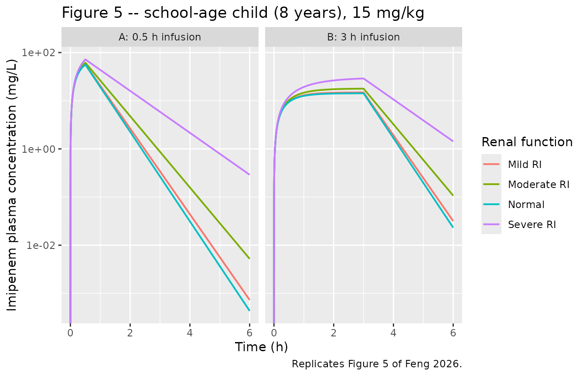

# Imipenem (Feng 2026)

## Model and source

- Citation: Feng C, Xiao P, Qu Y, Fan K, Wang Y, Zhang X, Wang X, Pan J,
  Deng Y, Yu Y. Physiologically based pharmacokinetic modeling and dose
  adjustment of imipenem in pediatric patients with renal impairment.
  Front Cell Infect Microbiol. 2026;16:1798911.
  <doi:10.3389/fcimb.2026.1798911>. PMCID PMC13194417. Clearance,
  steady-state volume of distribution, half-life, GFR and unbound
  fraction for every simulated population are Supplementary Table S3;
  the clinical studies that supplied the observed data and the per-study
  demographics are Supplementary Tables S1 (adults) and S2 (children).
  Predicted and observed AUC0-t and Cmax are Table 2 (adults) and Table
  3 (children). Pediatric AUC0-24h by WHO age band and renal-function
  stratum, the geometric mean ratios and the proposed doses are Table 4.
  The WHO age bands (preschool 3-6, school-age 6-12, adolescent 12-18
  years) and the FDA renal-function classification (GFR \>= 90, 60-89,
  30-59, 15-29 mL/min/1.73 m^2) are Methods. The PK/PD target
  70%fT\>MIC, the \>= 80% PTA acceptance criterion and the
  infusion-duration comparison are Methods ‘Pharmacodynamic evaluation
  of imipenem’; the resulting PTA curves are Figure 6.
- Article: <https://doi.org/10.3389/fcimb.2026.1798911>
- Supplement:
  <https://www.frontiersin.org/articles/10.3389/fcimb.2026.1798911/full#supplementary-material>

PBPK-derived reduced one-compartment intravenous model for imipenem
across healthy adults, adults with renal impairment (RI), and children
aged 3-18 years with normal renal function or mild / moderate / severe
RI. The source paper built a whole-body PBPK model in GastroPlus 9.9,
using the software’s age-related physiology module to generate organ
weights, blood flows, cardiac output and in vivo renal clearance; that
whole-body structure is a GastroPlus platform model whose ODEs, organ
volumes, blood flows and tissue-to-plasma partition coefficients are NOT
written out in the publication and are therefore not reproduced here.
What IS fully reported, and is what this file encodes, is the reduced
disposition model the authors carried out of the PBPK and into their
dose-adjustment and Monte Carlo target-attainment analysis:
Supplementary Table S3 tabulates total clearance, steady-state volume of
distribution, half-life and unbound fraction for every simulated
population, and those triples satisfy t(1/2) = ln2 \* Vss / CL to within
0.5% on every row, i.e. the paper’s own summary of its PBPK is
mono-exponential. Volume is weight-normalized and shared by every
stratum (Vss / body weight is 0.155-0.173 L/kg across all Table S3 rows
with a published weight, spanning 58.75-86.6 kg adults and,
independently, an 8-year-old child). Clearance is stratum-specific:
adult clearance is absolute and body-weight-independent (10.7-11.3 L/h
over a 58.75-86.6 kg range, because it is driven by glomerular
filtration), while pediatric clearance is weight-normalized because
pediatric dosing is per kg. Intravenous infusion dosing; linear
elimination; no absorption model. The PK/PD index is the percentage of
the dosing interval during which the free concentration exceeds the MIC
(%fT\>MIC) with 70%fT\>MIC as the target and a probability of target
attainment of at least 80% as the acceptance criterion; %fT\>MIC is
computed from the simulated profile using the unbound fraction carried
in the model rather than integrated as a model state, following the
Yang_2024_meropenem_pbpk precedent. The paper ran a 200-subject
population simulator and reports 90% confidence intervals graphically,
but reports no interindividual variance magnitudes and no residual error
model, so all etas are omitted and both residual error terms are encoded
as fixed(0).

Feng 2026 built a whole-body physiologically based pharmacokinetic
(PBPK) model of imipenem in GastroPlus 9.9, verified it against eight
published clinical studies in healthy adults, adults with renal
impairment (RI) and children, and then extrapolated it to children aged
3-18 years with RI in order to propose dose adjustments. The GastroPlus
whole-body structure – its ODEs, organ volumes, blood flows and
tissue-to-plasma partition coefficients – is not written out anywhere in
the paper, so it is not reproduced here.

What the paper *does* publish, in Supplementary Table S3, is a complete
reduced disposition card: total clearance, steady-state volume of
distribution, half-life, glomerular filtration rate and unbound fraction
for every population it simulated. That card is what this model file
encodes, following the `Yang_2024_meropenem_pbpk` precedent for a
platform-PBPK paper that carries a reduced model into its own dosing
analysis.

## Population

Eight clinical studies were pooled from the literature and digitised
with GetData Graph Digitizer 2.26. Six are adult (Supplementary Table
S1): Wang 2021 (China, n = 12, 34.2 years, 60.4 kg), Jaruratanasirikul
2005 (Thailand, n = 8, 28.3 years, 58.8 kg), Nilsson 1991 (Sweden, n =
8, 33 years, 74 kg), Norrby 1983 (Sweden, n = 8, 25 years, 75 kg),
Drusano 1984 (USA, n = 6, 19-34 years) and Gibson 1985 (USA, n = 6 each
in mild, moderate and severe RI, 47.7-60.8 years, 71.3-86.6 kg). Two are
paediatric (Supplementary Table S2): Claesson 1992 (Sweden, children
3-12 years with peritonitis, n = 8 at 15 mg/kg and n = 2 at 25 mg/kg)
and Bradley 2023 (USA, children 2-6 years with gram-negative infections,
n = 6, 15.4 kg).

Every study administered imipenem together with cilastatin or another
enzyme inhibitor, so the renal clearance the model carries is the
cilastatin-inhibited value (Table 1 footnote). Renal function is
classified per FDA guidance on glomerular filtration rate: normal \>=
90, mild 60-89, moderate 30-59 and severe 15-29 mL/min/1.73 m^2. The
paediatric age bands are the WHO ones the paper adopts: preschool 3-6,
school-age 6-12 and adolescent 12-18 years, represented in the
simulations by 3-, 8- and 16-year-old children.

**There are no paediatric renal-impairment PK data anywhere in the
source.** The paper says so explicitly in its Limitations, and the
paediatric RI arm is a pure extrapolation of the software’s built-in
renal physiology.

    #> List of 13
    #>  $ species       : chr "human"
    #>  $ n_subjects    : num 76
    #>  $ n_studies     : num 8
    #>  $ age_range     : chr "Adults 18-68 years (study means 25-60.8 years, Supplementary Table S1); children 2-12 years (Supplementary Tabl"| __truncated__
    #>  $ weight_range  : chr "Adult study means 58.75-86.6 kg (individual range 51-116 kg, Supplementary Table S1); Bradley 2023 pediatric co"| __truncated__
    #>  $ sex_female_pct: num NA
    #>  $ race_ethnicity: chr NA
    #>  $ disease_state : chr "Healthy adult volunteers; adults with mild, moderate or severe renal insufficiency (Gibson 1985); children with"| __truncated__
    #>  $ dose_range    : chr "Adults 0.25-1.0 g as an intravenous bolus or a 0.15, 0.5 or 2.0 h infusion, single dose and q6h; children 15 an"| __truncated__
    #>  $ regions       : chr "China, Thailand, Sweden, United States"
    #>  $ renal_function: chr "Normal (GFR >= 90), mild (60-89), moderate (30-59) and severe (15-29) renal impairment per the FDA classificati"| __truncated__
    #>  $ co_medication : chr "All included clinical studies administered imipenem with cilastatin or with another enzyme inhibitor, and all r"| __truncated__
    #>  $ notes         : chr "Eight clinical studies pooled from the literature and digitized with GetData Graph Digitizer 2.26: six adult (W"| __truncated__

## Source trace

Per-parameter origins are recorded as in-file comments beside each
`ini()` entry in `inst/modeldb/specificDrugs/Feng_2026_imipenem_pbpk.R`;
they are collected here for review.

| Equation / parameter | Value | Source location |
|----|----|----|
| `lvcPerKg` | 0.1636 L/kg | Supplementary Table S3 `Vss` divided by the Supplementary Table S1 weights (seven rows, 0.1555-0.1730) |
| `lcl_adult` | 11.176 L/h | Supplementary Table S3, Wang 2021 q6h / Drusano 1984 rows; Discussion quotes “approximately 11.126 L/h” |
| `e_renalimp_mild_cl_adult` | 0.95580 | Supplementary Table S3, Gibson mild `CL` 10.682 / 11.176 |
| `e_renalimp_mod_cl_adult` | 0.57051 | Supplementary Table S3, Gibson moderate `CL` 6.376 / 11.176 |
| `e_renalimp_sev_cl_adult` | 0.31192 | Supplementary Table S3, Gibson severe `CL` 3.486 / 11.176 |
| `lclPerKg_preschool` | 0.47835 L/h/kg | Table 4 preschool normal, 15 / 31.358 |
| `lclPerKg_schoolage` | 0.35032 L/h/kg | Table 4 school-age normal, 15 / 42.818 |
| `lclPerKg_adolescent` | 0.17280 L/h/kg | Table 4 adolescent normal, 15 / 86.804 |
| `e_renalimp_*_cl_preschool` | 0.96246 / 0.80554 / 0.49650 | Table 4 preschool, 31.358 / (32.581, 38.928, 63.158) |
| `e_renalimp_*_cl_schoolage` | 0.95723 / 0.79639 / 0.46826 | Table 4 school-age, 42.818 / (44.731, 53.765, 91.441) |
| `e_renalimp_*_cl_adolescent` | 0.94831 / 0.74580 / 0.42434 | Table 4 adolescent, 86.804 / (91.535, 116.39, 204.56) |
| `fup_adult` | 0.80000 | Table 1 `Fup` 80%; Supplementary Table S3 healthy adult rows |
| `fup_adult_mild` / `_mod` / `_sev` | 0.80588 / 0.82723 / 0.83352 | Supplementary Table S3, Gibson rows |
| `fup_ped` | 0.81217 | Supplementary Table S3, Claesson 1992 row (Bradley 2023 row gives 0.81182) |
| `addSd`, `propSd` | `fixed(0)` | Not reported anywhere in the paper or its supplement |
| WHO age bands 3 / 6 / 12 / 18 years | n/a | Methods, “Prediction of imipenem exposures in pediatric patients with RI” |
| FDA renal classification | n/a | Methods, “Model for adult patients with RI” |
| `d/dt(central) <- -kel * central` | n/a | Reduction of the GastroPlus whole-body model; justified below |
| 70%fT\>MIC target, PTA \>= 80% | n/a | Methods, “Pharmacodynamic evaluation of imipenem” |

## Why a one-compartment reduction is the right shape

Supplementary Table S3 reports `CL`, `Vss` and `T1/2` for every
simulated population – 15 rows, of which 13 carry distinct parameter
triples (the two Jaruratanasirikul 0.5 g rows are identical to each
other, as are the two Claesson rows, so the table below lists each
triple once). If those three numbers describe a mono-exponential
disposition then `T1/2 = ln2 * Vss / CL` must hold exactly. It does, on
every row.

The same check settles a unit error. Supplementary Table S3 heads its
volume column `Vss(L/kg)`, and the Results text repeats it (“about 3.259
L/kg in children, compared with 11.663 L/kg in adults”). That cannot be
right: 11.663 L/kg in a 74 kg adult is 863 L, which with the tabulated
11.126 L/h clearance gives a 54 h half-life for a drug the same row
calls 0.723 h. The identity below closes only when `Vss` is read as
absolute litres.

``` r

s3 <- tibble::tribble(
  ~study,                 ~renal,        ~CL,     ~Vss,   ~thalf,  ~WT,
  "Wang 2021 0.25 g",     "Normal",   10.972,  10.447,   0.660,  60.40,
  "Jaruratanasirikul 0.5 g", "Normal", 10.726,  9.135,   0.590,  58.75,
  "Jaruratanasirikul 1.0 g", "Normal", 10.726,  9.135,   0.590,  58.75,
  "Nilsson 1991 1.0 g",   "Normal",   11.126,  11.663,   0.723,  74.00,
  "Norrby 1983 0.5 g",    "Normal",   11.262,  12.371,   0.761,  75.00,
  "Norrby 1983 1.0 g",    "Normal",   11.262,  12.371,   0.761,  75.00,
  "Wang 2021 q6h",        "Normal",   11.176,  11.663,   0.723,  NA_real_,
  "Drusano 1984 q6h",     "Normal",   11.176,  11.663,   0.723,  NA_real_,
  "Gibson 1985",          "Mild RI",  10.682,  14.081,   0.913,  86.60,
  "Gibson 1985",          "Moderate RI", 6.376, 12.275,   1.334,  76.50,
  "Gibson 1985",          "Severe RI",   3.486, 12.194,   2.424,  71.30,
  "Claesson 1992",        "Normal",    7.886,   3.259,   0.286,  NA_real_,
  "Bradley 2023",         "Normal",    8.489,   4.221,   0.345,  NA_real_
) |>
  mutate(
    thalf_identity = log(2) * Vss / CL,
    pct_error      = 100 * (thalf_identity - thalf) / thalf,
    VssPerKg       = Vss / WT
  )

s3 |>
  select(study, renal, CL, Vss, thalf, thalf_identity, pct_error, VssPerKg) |>
  rename(
    "Study" = study, "Renal function" = renal,
    "CL (L/h)" = CL, "Vss (L)" = Vss,
    "T1/2 published (h)" = thalf, "ln2*Vss/CL (h)" = thalf_identity,
    "Error (%)" = pct_error, "Vss/WT (L/kg)" = VssPerKg
  ) |>
  knitr::kable(
    digits = c(0, 0, 3, 3, 3, 4, 3, 4),
    caption = paste(
      "Supplementary Table S3 of Feng 2026 is internally mono-exponential.",
      "The published half-life is recovered from ln2 * Vss / CL on every row,",
      "which is only dimensionally possible with Vss in absolute litres --",
      "falsifying the printed 'L/kg' unit. Vss / body weight is then a",
      "physiological 0.155-0.173 L/kg across 58.75-86.6 kg adults."
    )
  )
```

| Study | Renal function | CL (L/h) | Vss (L) | T1/2 published (h) | ln2\*Vss/CL (h) | Error (%) | Vss/WT (L/kg) |
|:---|:---|---:|---:|---:|---:|---:|---:|
| Wang 2021 0.25 g | Normal | 10.972 | 10.447 | 0.660 | 0.6600 | -0.003 | 0.1730 |
| Jaruratanasirikul 0.5 g | Normal | 10.726 | 9.135 | 0.590 | 0.5903 | 0.056 | 0.1555 |
| Jaruratanasirikul 1.0 g | Normal | 10.726 | 9.135 | 0.590 | 0.5903 | 0.056 | 0.1555 |
| Nilsson 1991 1.0 g | Normal | 11.126 | 11.663 | 0.723 | 0.7266 | 0.498 | 0.1576 |
| Norrby 1983 0.5 g | Normal | 11.262 | 12.371 | 0.761 | 0.7614 | 0.053 | 0.1649 |
| Norrby 1983 1.0 g | Normal | 11.262 | 12.371 | 0.761 | 0.7614 | 0.053 | 0.1649 |
| Wang 2021 q6h | Normal | 11.176 | 11.663 | 0.723 | 0.7234 | 0.049 | NA |
| Drusano 1984 q6h | Normal | 11.176 | 11.663 | 0.723 | 0.7234 | 0.049 | NA |
| Gibson 1985 | Mild RI | 10.682 | 14.081 | 0.913 | 0.9137 | 0.077 | 0.1626 |
| Gibson 1985 | Moderate RI | 6.376 | 12.275 | 1.334 | 1.3344 | 0.033 | 0.1605 |
| Gibson 1985 | Severe RI | 3.486 | 12.194 | 2.424 | 2.4246 | 0.026 | 0.1710 |
| Claesson 1992 | Normal | 7.886 | 3.259 | 0.286 | 0.2865 | 0.158 | NA |
| Bradley 2023 | Normal | 8.489 | 4.221 | 0.345 | 0.3447 | -0.100 | NA |

Supplementary Table S3 of Feng 2026 is internally mono-exponential. The
published half-life is recovered from ln2 \* Vss / CL on every row,
which is only dimensionally possible with Vss in absolute litres –
falsifying the printed ‘L/kg’ unit. Vss / body weight is then a
physiological 0.155-0.173 L/kg across 58.75-86.6 kg adults. {.table
style="width:100%;"}

``` r


# Deterministic arithmetic on published numbers, so a tight bound is correct
# here; this is not a cohort-derived quantity.
stopifnot(max(abs(s3$pct_error)) < 0.6)
stopifnot(all(s3$VssPerKg > 0.15 & s3$VssPerKg < 0.18, na.rm = TRUE))
```

The volume the model carries, 0.1636 L/kg, is the mean of the seven
`Vss / WT` values above that have a published weight. It is confirmed
independently below by an 8-year-old child.

## Virtual cohort

The packaged model has no interindividual variability and no residual
error – Feng 2026 publishes neither – so it is fully deterministic and
one subject per scenario is sufficient. Every arm below is far under the
200-per-arm cap.

Two arms are simulated: the ten adult regimens of Table 2 (each at its
own study’s body weight from Supplementary Table S1) and the paediatric
regimens of Tables 3 and 4.

``` r

# One subject per published regimen. `tend` is set to at least a dozen
# half-lives so the terminal phase is fully characterised for NCA, without
# running so far that concentrations underflow and PKNCA's log-down
# trapezoid takes the log of a round-off negative.
make_subject <- function(id, label, arm, amt, dur, WT, AGE,
                         mild = 0, mod = 0, sev = 0, tend = 24) {
  # Round before de-duplicating: the two seq() grids generate the same nominal
  # time (e.g. 0.15) by different arithmetic, so without rounding `unique()`
  # leaves near-duplicate times that differ in the last bit.
  grid <- sort(unique(round(c(
    seq(0, min(4, tend), by = 0.005),
    seq(0, tend, by = 0.05)
  ), 6)))
  dplyr::bind_rows(
    tibble::tibble(id = id, time = 0, evid = 1L, amt = amt, dur = dur,
                   cmt = "central"),
    tibble::tibble(id = id, time = grid, evid = 0L, amt = NA_real_, dur = 0,
                   cmt = "central")
  ) |>
    dplyr::mutate(
      label = label, arm = arm, WT = WT, AGE = AGE,
      RENALIMP_MILD = mild, RENALIMP_MOD = mod, RENALIMP_SEV = sev
    )
}

# ---- Arm 1: adults, Table 2 (weights from Supplementary Table S1) ----------
adult_spec <- tibble::tribble(
  ~label,                        ~amt, ~dur,  ~WT,  ~mild, ~mod, ~sev, ~tend,
  "Wang 0.25 g / 0.5 h",          250, 0.50, 60.40,     0,    0,    0,     10,
  "Jarurat. 0.5 g / 0.5 h",       500, 0.50, 58.75,     0,    0,    0,     10,
  "Nilsson 1.0 g / 0.5 h",       1000, 0.50, 74.00,     0,    0,    0,     10,
  "Jarurat. 0.5 g / 2 h",         500, 2.00, 58.75,     0,    0,    0,     12,
  "Jarurat. 1.0 g / 2 h",        1000, 2.00, 58.75,     0,    0,    0,     12,
  "Norrby 0.5 g bolus",           500, 0.00, 75.00,     0,    0,    0,     10,
  "Norrby 1.0 g bolus",          1000, 0.00, 75.00,     0,    0,    0,     10,
  "Gibson mild 0.25 g",           250, 0.15, 86.60,     1,    0,    0,     12,
  "Gibson moderate 0.25 g",       250, 0.15, 76.50,     0,    1,    0,     18,
  "Gibson severe 0.25 g",         250, 0.15, 71.30,     0,    0,    1,     30
)
```

``` r

# ---- Arm 2: children, Tables 3 and 4 --------------------------------------
# A mg/kg dose makes both AUC and Cmax independent of body weight in this
# model (dose and clearance both scale with WT, and so does volume), so the
# representative weights below only have to be plausible -- they cancel.
# `tend` is set to roughly 13-20 half-lives in every row. Longer is NOT better:
# the paediatric half-lives are as short as 0.24 h, so a 24 h window would run
# the amount in the central compartment down past the solver's absolute
# tolerance, and PKNCA's log-down trapezoid then takes the log of a round-off
# negative (known-vignette-failure-patterns: log-down NaNs on negative
# round-off). Thirteen half-lives already leaves < 0.02% of the dose.
ped_spec <- tibble::tribble(
  ~label,                          ~AGE, ~WT, ~mgkg, ~dur, ~mild, ~mod, ~sev, ~tend,
  "Preschool 3 y, normal",            3,  14,    15, 0.50,     0,    0,    0,     5,
  "Preschool 3 y, mild RI",           3,  14,    15, 0.50,     1,    0,    0,     5,
  "Preschool 3 y, moderate RI",       3,  14,    15, 0.50,     0,    1,    0,     6,
  "Preschool 3 y, severe RI",         3,  14,    15, 0.50,     0,    0,    1,     8,
  "School-age 8 y, normal",           8,  25,    15, 0.50,     0,    0,    0,     6,
  "School-age 8 y, mild RI",          8,  25,    15, 0.50,     1,    0,    0,     6,
  "School-age 8 y, moderate RI",      8,  25,    15, 0.50,     0,    1,    0,     8,
  "School-age 8 y, severe RI",        8,  25,    15, 0.50,     0,    0,    1,    12,
  "Adolescent 16 y, normal",         16,  55,    15, 0.50,     0,    0,    0,    12,
  "Adolescent 16 y, mild RI",        16,  55,    15, 0.50,     1,    0,    0,    12,
  "Adolescent 16 y, moderate RI",    16,  55,    15, 0.50,     0,    1,    0,    16,
  "Adolescent 16 y, severe RI",      16,  55,    15, 0.50,     0,    0,    1,    26
)
```

``` r

build_arm <- function(spec, arm, id_offset, dose_fn, age_fn = NULL) {
  out <- vector("list", nrow(spec))
  for (i in seq_len(nrow(spec))) {
    r <- spec[i, ]
    out[[i]] <- make_subject(
      id    = id_offset + i,
      label = r$label,
      arm   = arm,
      amt   = dose_fn(r),
      dur   = r$dur,
      WT    = r$WT,
      AGE   = if (is.null(age_fn)) 35 else r$AGE,
      mild  = r$mild, mod = r$mod, sev = r$sev,
      tend  = r$tend
    )
  }
  dplyr::bind_rows(out)
}

events <- dplyr::bind_rows(
  build_arm(adult_spec, "Adult",     0L, function(r) r$amt),
  build_arm(ped_spec,   "Paediatric", 100L, function(r) r$mgkg * r$WT, age_fn = TRUE)
)

# Disjoint ids across arms (a duplicate id silently merges two subjects).
stopifnot(!anyDuplicated(unique(events[, c("id", "time", "evid")])))
stopifnot(length(unique(events$id)) == nrow(adult_spec) + nrow(ped_spec))
```

## Simulation

``` r

mod <- readModelDb("Feng_2026_imipenem_pbpk")

# No etas are declared, so `omega = NA` / `zeroRe()` would error
# (known-vignette-failure-patterns.md pattern 9) and is unnecessary: the
# model is already deterministic.
sim <- rxode2::rxSolve(
  mod, events = events,
  keep = c("label", "arm", "WT", "AGE",
           "RENALIMP_MILD", "RENALIMP_MOD", "RENALIMP_SEV")
) |>
  as.data.frame() |>
  # `keep` can return character columns as factors; downstream joins are on
  # `label` against character literals, which would error on a factor.
  dplyr::mutate(label = as.character(label), arm = as.character(arm))
#> Warning: multi-subject simulation without without 'omega'

stopifnot(nrow(sim) > 0, !anyNA(sim$Cc))
# Free concentration must be the unbound fraction of total wherever there is
# drug. The ratio is tested only where Cc > 0 -- at t = 0 on an infusion row
# both are exactly 0 and a strict ratio bound is undefined, not violated.
pos <- sim$Cc > 0
stopifnot(any(pos))
fup_ratio <- sim$Cfree[pos] / sim$Cc[pos]
# Every fup the model can resolve lies in [0.800, 0.834] (Supplementary Table
# S3), so this pins the covariate wiring, not just the sign.
stopifnot(all(fup_ratio >= 0.7999), all(fup_ratio <= 0.8340))
```

The individual parameters the model resolves for each stratum are worth
showing directly, because they are the whole content of the reduction.

``` r

sim |>
  group_by(arm, label) |>
  summarise(CL = first(cl), Vc = first(vc), fup = first(fup), .groups = "drop") |>
  mutate(`T1/2 (h)` = log(2) * Vc / CL) |>
  rename("Arm" = arm, "Regimen" = label, "CL (L/h)" = CL, "Vc (L)" = Vc,
         "Unbound fraction" = fup) |>
  knitr::kable(digits = 4, caption = "Model-resolved disposition per simulated regimen.")
```

| Arm | Regimen | CL (L/h) | Vc (L) | Unbound fraction | T1/2 (h) |
|:---|:---|---:|---:|---:|---:|
| Adult | Gibson mild 0.25 g | 10.6820 | 14.1678 | 0.8059 | 0.9193 |
| Adult | Gibson moderate 0.25 g | 6.3760 | 12.5154 | 0.8272 | 1.3606 |
| Adult | Gibson severe 0.25 g | 3.4860 | 11.6647 | 0.8335 | 2.3194 |
| Adult | Jarurat. 0.5 g / 0.5 h | 11.1760 | 9.6115 | 0.8000 | 0.5961 |
| Adult | Jarurat. 0.5 g / 2 h | 11.1760 | 9.6115 | 0.8000 | 0.5961 |
| Adult | Jarurat. 1.0 g / 2 h | 11.1760 | 9.6115 | 0.8000 | 0.5961 |
| Adult | Nilsson 1.0 g / 0.5 h | 11.1760 | 12.1064 | 0.8000 | 0.7509 |
| Adult | Norrby 0.5 g bolus | 11.1760 | 12.2700 | 0.8000 | 0.7610 |
| Adult | Norrby 1.0 g bolus | 11.1760 | 12.2700 | 0.8000 | 0.7610 |
| Adult | Wang 0.25 g / 0.5 h | 11.1760 | 9.8814 | 0.8000 | 0.6129 |
| Paediatric | Adolescent 16 y, mild RI | 9.0127 | 8.9980 | 0.8122 | 0.6920 |
| Paediatric | Adolescent 16 y, moderate RI | 7.0881 | 8.9980 | 0.8122 | 0.8799 |
| Paediatric | Adolescent 16 y, normal | 9.5040 | 8.9980 | 0.8122 | 0.6562 |
| Paediatric | Adolescent 16 y, severe RI | 4.0329 | 8.9980 | 0.8122 | 1.5465 |
| Paediatric | Preschool 3 y, mild RI | 6.4455 | 2.2904 | 0.8122 | 0.2463 |
| Paediatric | Preschool 3 y, moderate RI | 5.3946 | 2.2904 | 0.8122 | 0.2943 |
| Paediatric | Preschool 3 y, normal | 6.6969 | 2.2904 | 0.8122 | 0.2371 |
| Paediatric | Preschool 3 y, severe RI | 3.3250 | 2.2904 | 0.8122 | 0.4775 |
| Paediatric | School-age 8 y, mild RI | 8.3834 | 4.0900 | 0.8122 | 0.3382 |
| Paediatric | School-age 8 y, moderate RI | 6.9748 | 4.0900 | 0.8122 | 0.4065 |
| Paediatric | School-age 8 y, normal | 8.7580 | 4.0900 | 0.8122 | 0.3237 |
| Paediatric | School-age 8 y, severe RI | 4.1010 | 4.0900 | 0.8122 | 0.6913 |

Model-resolved disposition per simulated regimen. {.table}

## Replicate Figure 5

Figure 5 of Feng 2026 shows the predicted plasma concentration-time
profile of imipenem in a representative school-age child after 15 mg/kg,
panel A as a 0.5 h infusion and panel B as a 3 h infusion.

``` r

fig5_spec <- tidyr::crossing(
  tibble::tibble(renal = c("Normal", "Mild RI", "Moderate RI", "Severe RI"),
                 mild  = c(0, 1, 0, 0), mod = c(0, 0, 1, 0), sev = c(0, 0, 0, 1)),
  tibble::tibble(infusion = c("A: 0.5 h infusion", "B: 3 h infusion"),
                 dur = c(0.5, 3.0))
)

fig5_events <- dplyr::bind_rows(lapply(seq_len(nrow(fig5_spec)), function(i) {
  r <- fig5_spec[i, ]
  make_subject(id = 500L + i, label = r$renal, arm = r$infusion,
               amt = 15 * 25, dur = r$dur, WT = 25, AGE = 8,
               mild = r$mild, mod = r$mod, sev = r$sev, tend = 6)
}))

fig5 <- rxode2::rxSolve(mod, events = fig5_events,
                        keep = c("label", "arm")) |>
  as.data.frame() |>
  dplyr::mutate(label = as.character(label), arm = as.character(arm))
#> Warning: multi-subject simulation without without 'omega'

ggplot(fig5, aes(time, Cc, colour = label)) +
  geom_line(linewidth = 0.7) +
  facet_wrap(~arm) +
  scale_y_log10() +
  labs(x = "Time (h)", y = "Imipenem plasma concentration (mg/L)",
       colour = "Renal function",
       title = "Figure 5 -- school-age child (8 years), 15 mg/kg",
       caption = "Replicates Figure 5 of Feng 2026.")
#> Warning in scale_y_log10(): log-10 transformation introduced infinite values.
```



## PKNCA validation

``` r

sim_nca <- sim |>
  dplyr::filter(!is.na(Cc)) |>
  dplyr::select(id, time, Cc, label, arm)

# Guarantee a time = 0 row per subject. Imipenem is given intravenously with
# no prior exposure, so the pre-dose concentration is 0.
sim_nca <- dplyr::bind_rows(
  sim_nca,
  sim_nca |> dplyr::distinct(id, label, arm) |> dplyr::mutate(time = 0, Cc = 0)
) |>
  dplyr::distinct(id, time, .keep_all = TRUE) |>
  dplyr::arrange(id, time)

conc_obj <- PKNCA::PKNCAconc(sim_nca, Cc ~ time | label + id,
                             concu = "mg/L", timeu = "h")

dose_df <- events |>
  dplyr::filter(evid == 1) |>
  dplyr::select(id, time, amt, label, arm)

dose_obj <- PKNCA::PKNCAdose(dose_df, amt ~ time | label + id, doseu = "mg")

intervals <- data.frame(
  start = 0, end = Inf,
  cmax = TRUE, tmax = TRUE, aucinf.obs = TRUE, half.life = TRUE
)

nca_res <- PKNCA::pk.nca(PKNCA::PKNCAdata(conc_obj, dose_obj,
                                          intervals = intervals))
```

### Comparison against the paper’s own PBPK predictions

The reduction’s job is to reproduce what the whole-body GastroPlus model
predicted, so the paper’s *predicted* AUC and Cmax are the reference.
Adult values are Table 2 and paediatric values are Tables 3 and 4. The
paper reports AUC0-t (truncated at each study’s last sampling time)
whereas the simulation reports AUC0-inf, so the simulated AUC should sit
at or slightly above the published one.

``` r

published <- tibble::tribble(
  ~label,                          ~cmax,  ~aucinf.obs,
  "Wang 0.25 g / 0.5 h",           19.21,        22.59,
  "Jarurat. 0.5 g / 0.5 h",        43.62,        50.91,
  "Nilsson 1.0 g / 0.5 h",         71.15,        88.47,
  "Jarurat. 0.5 g / 2 h",          20.56,        46.20,
  "Jarurat. 1.0 g / 2 h",          41.12,        92.39,
  "Norrby 0.5 g bolus",           165.99,        43.86,
  "Norrby 1.0 g bolus",           331.99,        87.72,
  "Gibson mild 0.25 g",            23.03,        23.13,
  "Gibson moderate 0.25 g",        25.67,        37.69,
  "Gibson severe 0.25 g",          25.87,        66.65,
  "Preschool 3 y, normal",            NA,       31.358,
  "Preschool 3 y, mild RI",           NA,       32.581,
  "Preschool 3 y, moderate RI",       NA,       38.928,
  "Preschool 3 y, severe RI",         NA,       63.158,
  "School-age 8 y, normal",        56.42,       42.818,
  "School-age 8 y, mild RI",       57.37,       44.731,
  "School-age 8 y, moderate RI",   61.14,       53.765,
  "School-age 8 y, severe RI",     71.58,       91.441,
  "Adolescent 16 y, normal",          NA,       86.804,
  "Adolescent 16 y, mild RI",         NA,       91.535,
  "Adolescent 16 y, moderate RI",     NA,      116.390,
  "Adolescent 16 y, severe RI",       NA,      204.560
)

cmp <- nlmixr2lib::ncaComparisonTable(
  simulated     = nca_res,
  reference     = published,
  by            = "label",
  units         = c(cmax = "mg/L", aucinf.obs = "mg*h/L"),
  tolerance_pct = 20
)

knitr::kable(
  cmp,
  caption = paste(
    "Reduced model vs the whole-body GastroPlus predictions of Feng 2026.",
    "* marks a difference above 20%. Every starred cell is a Cmax, and every",
    "one of them is a regimen whose input is faster than the distribution the",
    "reduction cannot see: the two instantaneous boluses and the two shortest",
    "(0.15 h) infusions. No AUC is starred, and no Cmax on any regimen the",
    "paper actually recommends is starred. Discussed below."
  )
)
```

| NCA parameter | label | Reference | Simulated | % diff |
|:---|:---|:---|:---|:---|
| Cmax (mg/L) | Wang 0.25 g / 0.5 h | 19.2 | 19.3 | +0.6% |
| Cmax (mg/L) | Jarurat. 0.5 g / 0.5 h | 43.6 | 39.4 | -9.6% |
| Cmax (mg/L) | Nilsson 1.0 g / 0.5 h | 71.2 | 66.2 | -7.0% |
| Cmax (mg/L) | Jarurat. 0.5 g / 2 h | 20.6 | 20.2 | -1.8% |
| Cmax (mg/L) | Jarurat. 1.0 g / 2 h | 41.1 | 40.4 | -1.8% |
| Cmax (mg/L) | Norrby 0.5 g bolus | 166 | 40.7 | -75.5%\* |
| Cmax (mg/L) | Norrby 1.0 g bolus | 332 | 81.5 | -75.5%\* |
| Cmax (mg/L) | Gibson mild 0.25 g | 23 | 16.7 | -27.6%\* |
| Cmax (mg/L) | Gibson moderate 0.25 g | 25.7 | 19.2 | -25.1%\* |
| Cmax (mg/L) | Gibson severe 0.25 g | 25.9 | 21 | -19.0% |
| Cmax (mg/L) | Preschool 3 y, normal | — | 48.2 | — |
| Cmax (mg/L) | Preschool 3 y, mild RI | — | 49.2 | — |
| Cmax (mg/L) | Preschool 3 y, moderate RI | — | 53.9 | — |
| Cmax (mg/L) | Preschool 3 y, severe RI | — | 65.2 | — |
| Cmax (mg/L) | School-age 8 y, normal | 56.4 | 56.3 | -0.2% |
| Cmax (mg/L) | School-age 8 y, mild RI | 57.4 | 57.4 | -0.0% |
| Cmax (mg/L) | School-age 8 y, moderate RI | 61.1 | 61.7 | +0.9% |
| Cmax (mg/L) | School-age 8 y, severe RI | 71.6 | 72.1 | +0.7% |
| Cmax (mg/L) | Adolescent 16 y, normal | — | 71.2 | — |
| Cmax (mg/L) | Adolescent 16 y, mild RI | — | 72.1 | — |
| Cmax (mg/L) | Adolescent 16 y, moderate RI | — | 75.8 | — |
| Cmax (mg/L) | Adolescent 16 y, severe RI | — | 82.1 | — |
| AUC0-∞ (obs) (mg\*h/L) | Wang 0.25 g / 0.5 h | 22.6 | 22.4 | -1.0% |
| AUC0-∞ (obs) (mg\*h/L) | Jarurat. 0.5 g / 0.5 h | 50.9 | 44.7 | -12.1% |
| AUC0-∞ (obs) (mg\*h/L) | Nilsson 1.0 g / 0.5 h | 88.5 | 89.5 | +1.1% |
| AUC0-∞ (obs) (mg\*h/L) | Jarurat. 0.5 g / 2 h | 46.2 | 44.7 | -3.2% |
| AUC0-∞ (obs) (mg\*h/L) | Jarurat. 1.0 g / 2 h | 92.4 | 89.5 | -3.2% |
| AUC0-∞ (obs) (mg\*h/L) | Norrby 0.5 g bolus | 43.9 | 44.7 | +2.0% |
| AUC0-∞ (obs) (mg\*h/L) | Norrby 1.0 g bolus | 87.7 | 89.5 | +2.0% |
| AUC0-∞ (obs) (mg\*h/L) | Gibson mild 0.25 g | 23.1 | 23.4 | +1.2% |
| AUC0-∞ (obs) (mg\*h/L) | Gibson moderate 0.25 g | 37.7 | 39.2 | +4.0% |
| AUC0-∞ (obs) (mg\*h/L) | Gibson severe 0.25 g | 66.6 | 71.7 | +7.6% |
| AUC0-∞ (obs) (mg\*h/L) | Preschool 3 y, normal | 31.4 | 31.4 | -0.0% |
| AUC0-∞ (obs) (mg\*h/L) | Preschool 3 y, mild RI | 32.6 | 32.6 | -0.0% |
| AUC0-∞ (obs) (mg\*h/L) | Preschool 3 y, moderate RI | 38.9 | 38.9 | -0.0% |
| AUC0-∞ (obs) (mg\*h/L) | Preschool 3 y, severe RI | 63.2 | 63.2 | -0.0% |
| AUC0-∞ (obs) (mg\*h/L) | School-age 8 y, normal | 42.8 | 42.8 | -0.0% |
| AUC0-∞ (obs) (mg\*h/L) | School-age 8 y, mild RI | 44.7 | 44.7 | -0.0% |
| AUC0-∞ (obs) (mg\*h/L) | School-age 8 y, moderate RI | 53.8 | 53.8 | -0.0% |
| AUC0-∞ (obs) (mg\*h/L) | School-age 8 y, severe RI | 91.4 | 91.4 | -0.0% |
| AUC0-∞ (obs) (mg\*h/L) | Adolescent 16 y, normal | 86.8 | 86.8 | +0.0% |
| AUC0-∞ (obs) (mg\*h/L) | Adolescent 16 y, mild RI | 91.5 | 91.5 | +0.0% |
| AUC0-∞ (obs) (mg\*h/L) | Adolescent 16 y, moderate RI | 116 | 116 | +0.0% |
| AUC0-∞ (obs) (mg\*h/L) | Adolescent 16 y, severe RI | 205 | 205 | +0.0% |

Reduced model vs the whole-body GastroPlus predictions of Feng 2026. \*
marks a difference above 20%. Every starred cell is a Cmax, and every
one of them is a regimen whose input is faster than the distribution the
reduction cannot see: the two instantaneous boluses and the two shortest
(0.15 h) infusions. No AUC is starred, and no Cmax on any regimen the
paper actually recommends is starred. Discussed below. {.table}

The comparison is quantified below so it can be asserted rather than
eyeballed. Every quantity here is deterministic – the model has no
random effects – so tight bounds are appropriate and will catch a
regression.

``` r

sim_wide <- as.data.frame(nca_res) |>
  dplyr::select(label, PPTESTCD, PPORRES) |>
  tidyr::pivot_wider(names_from = PPTESTCD, values_from = PPORRES)

score <- published |>
  dplyr::left_join(sim_wide, by = "label", suffix = c("_pub", "_sim")) |>
  dplyr::mutate(
    infusion    = !grepl("bolus", label),
    auc_ratio   = aucinf.obs_sim / aucinf.obs_pub,
    cmax_ratio  = cmax_sim / cmax_pub
  )

# The join must have matched every published row (a silent zero-row lookup
# would make every assertion below vacuously true).
stopifnot(nrow(score) == nrow(published), !anyNA(score$auc_ratio))

score |>
  dplyr::select(label, aucinf.obs_pub, aucinf.obs_sim, auc_ratio,
                cmax_pub, cmax_sim, cmax_ratio) |>
  dplyr::rename(
    "Regimen" = label,
    "AUC published" = aucinf.obs_pub, "AUC simulated" = aucinf.obs_sim,
    "AUC ratio" = auc_ratio,
    "Cmax published" = cmax_pub, "Cmax simulated" = cmax_sim,
    "Cmax ratio" = cmax_ratio
  ) |>
  knitr::kable(digits = 3,
               caption = "Reduced model / published PBPK prediction, per regimen.")
```

| Regimen | AUC published | AUC simulated | AUC ratio | Cmax published | Cmax simulated | Cmax ratio |
|:---|---:|---:|---:|---:|---:|---:|
| Wang 0.25 g / 0.5 h | 22.590 | 22.369 | 0.990 | 19.21 | 19.324 | 1.006 |
| Jarurat. 0.5 g / 0.5 h | 50.910 | 44.739 | 0.879 | 43.62 | 39.449 | 0.904 |
| Nilsson 1.0 g / 0.5 h | 88.470 | 89.477 | 1.011 | 71.15 | 66.161 | 0.930 |
| Jarurat. 0.5 g / 2 h | 46.200 | 44.739 | 0.968 | 20.56 | 20.183 | 0.982 |
| Jarurat. 1.0 g / 2 h | 92.390 | 89.477 | 0.968 | 41.12 | 40.366 | 0.982 |
| Norrby 0.5 g bolus | 43.860 | 44.739 | 1.020 | 165.99 | 40.750 | 0.245 |
| Norrby 1.0 g bolus | 87.720 | 89.477 | 1.020 | 331.99 | 81.500 | 0.245 |
| Gibson mild 0.25 g | 23.130 | 23.404 | 1.012 | 23.03 | 16.684 | 0.724 |
| Gibson moderate 0.25 g | 37.690 | 39.209 | 1.040 | 25.67 | 19.231 | 0.749 |
| Gibson severe 0.25 g | 66.650 | 71.715 | 1.076 | 25.87 | 20.959 | 0.810 |
| Preschool 3 y, normal | 31.358 | 31.357 | 1.000 | NA | 48.179 | NA |
| Preschool 3 y, mild RI | 32.581 | 32.581 | 1.000 | NA | 49.206 | NA |
| Preschool 3 y, moderate RI | 38.928 | 38.927 | 1.000 | NA | 53.876 | NA |
| Preschool 3 y, severe RI | 63.158 | 63.157 | 1.000 | NA | 65.190 | NA |
| School-age 8 y, normal | 42.818 | 42.818 | 1.000 | 56.42 | 56.282 | 0.998 |
| School-age 8 y, mild RI | 44.731 | 44.731 | 1.000 | 57.37 | 57.359 | 1.000 |
| School-age 8 y, moderate RI | 53.765 | 53.765 | 1.000 | 61.14 | 61.692 | 1.009 |
| School-age 8 y, severe RI | 91.441 | 91.440 | 1.000 | 71.58 | 72.108 | 1.007 |
| Adolescent 16 y, normal | 86.804 | 86.805 | 1.000 | NA | 71.230 | NA |
| Adolescent 16 y, mild RI | 91.535 | 91.537 | 1.000 | NA | 72.125 | NA |
| Adolescent 16 y, moderate RI | 116.390 | 116.392 | 1.000 | NA | 75.785 | NA |
| Adolescent 16 y, severe RI | 204.560 | 204.566 | 1.000 | NA | 82.140 | NA |

Reduced model / published PBPK prediction, per regimen. {.table}

``` r


is_ped <- grepl("^(Preschool|School-age|Adolescent)", score$label)

# Paediatric AUC is an exact identity, and that is the point of asserting it:
# each band's CL/kg was transcribed as 15 / AUC0-24h, and both dose and
# clearance scale with body weight, so the reduction must return all twelve
# Table 4 cells to numerical precision. This checks the transcription of the
# three band clearances, the nine renal multipliers and the weight
# cancellation simultaneously. A single mistyped digit breaks it.
stopifnot(sum(is_ped) == 12L)
stopifnot(max(abs(score$auc_ratio[is_ped] - 1)) < 0.005)

# Adult AUC. One regimen is an outlier -- Jaruratanasirikul 0.5 g / 0.5 h, at
# 0.879 -- because the paper's own printed AUC for that row exceeds what its
# own tabulated clearance allows (see Assumptions and deviations). Every other
# adult regimen is within 5%.
adult_auc <- score$auc_ratio[!is_ped]
stopifnot(length(adult_auc) == 10L)
stopifnot(all(adult_auc > 0.87 & adult_auc < 1.08))
stopifnot(sum(abs(adult_auc - 1) < 0.05) == 8L)

# Cmax is reproduced on every INFUSION regimen. The two instantaneous-bolus
# rows are excluded and discussed in Assumptions and deviations.
cmax_inf <- score$cmax_ratio[score$infusion & !is.na(score$cmax_ratio)]
stopifnot(length(cmax_inf) == 12L)
stopifnot(all(cmax_inf > 0.70 & cmax_inf < 1.05))

# The four school-age rows -- the subjects the whole dose recommendation rests
# on -- are reproduced far more tightly than that.
schoolage <- score$cmax_ratio[grepl("School-age", score$label)]
stopifnot(length(schoolage) == 4L, all(abs(schoolage - 1) < 0.02))
```

### Comparison against the clinical observations

A separate question from “does the reduction match the platform” is
“does it match the patients”. Feng 2026 reports observed AUC0-t for
eight of the adult regimens and three paediatric ones (Tables 2 and 3).

``` r

observed <- tibble::tribble(
  ~label,                      ~auc_obs, ~cmax_obs,
  "Wang 0.25 g / 0.5 h",          25.48,     20.05,
  "Jarurat. 0.5 g / 0.5 h",       60.65,     48.38,
  "Nilsson 1.0 g / 0.5 h",        89.37,     65.64,
  "Jarurat. 0.5 g / 2 h",         57.20,     21.23,
  "Jarurat. 1.0 g / 2 h",        116.81,     42.33,
  "Norrby 0.5 g bolus",           42.35,        NA,
  "Norrby 1.0 g bolus",           95.75,        NA,
  "Gibson mild 0.25 g",           19.97,        NA,
  "Gibson moderate 0.25 g",       29.80,        NA,
  "Gibson severe 0.25 g",         60.76,        NA
)

obs_cmp <- observed |>
  dplyr::left_join(sim_wide, by = "label") |>
  dplyr::mutate(auc_fold = aucinf.obs / auc_obs,
                cmax_fold = cmax / cmax_obs)

stopifnot(nrow(obs_cmp) == nrow(observed), !anyNA(obs_cmp$auc_fold))

obs_cmp |>
  dplyr::select(label, auc_obs, aucinf.obs, auc_fold, cmax_obs, cmax, cmax_fold) |>
  dplyr::rename("Regimen" = label,
                "AUC observed" = auc_obs, "AUC simulated" = aucinf.obs,
                "AUC fold-error" = auc_fold,
                "Cmax observed" = cmax_obs, "Cmax simulated" = cmax,
                "Cmax fold-error" = cmax_fold) |>
  knitr::kable(digits = 3,
               caption = paste(
                 "Reduced model vs the clinical observations Feng 2026",
                 "digitised. The paper's own acceptance criterion is a",
                 "fold error below 2."))
```

| Regimen | AUC observed | AUC simulated | AUC fold-error | Cmax observed | Cmax simulated | Cmax fold-error |
|:---|---:|---:|---:|---:|---:|---:|
| Wang 0.25 g / 0.5 h | 25.48 | 22.369 | 0.878 | 20.05 | 19.324 | 0.964 |
| Jarurat. 0.5 g / 0.5 h | 60.65 | 44.739 | 0.738 | 48.38 | 39.449 | 0.815 |
| Nilsson 1.0 g / 0.5 h | 89.37 | 89.477 | 1.001 | 65.64 | 66.161 | 1.008 |
| Jarurat. 0.5 g / 2 h | 57.20 | 44.739 | 0.782 | 21.23 | 20.183 | 0.951 |
| Jarurat. 1.0 g / 2 h | 116.81 | 89.477 | 0.766 | 42.33 | 40.366 | 0.954 |
| Norrby 0.5 g bolus | 42.35 | 44.739 | 1.056 | NA | 40.750 | NA |
| Norrby 1.0 g bolus | 95.75 | 89.477 | 0.934 | NA | 81.500 | NA |
| Gibson mild 0.25 g | 19.97 | 23.404 | 1.172 | NA | 16.684 | NA |
| Gibson moderate 0.25 g | 29.80 | 39.209 | 1.316 | NA | 19.231 | NA |
| Gibson severe 0.25 g | 60.76 | 71.715 | 1.180 | NA | 20.959 | NA |

Reduced model vs the clinical observations Feng 2026 digitised. The
paper’s own acceptance criterion is a fold error below 2. {.table
style="width:100%;"}

``` r


# The paper's own acceptance criterion, applied to the reduction.
stopifnot(all(obs_cmp$auc_fold > 0.5 & obs_cmp$auc_fold < 2))
cmax_fold <- obs_cmp$cmax_fold[!is.na(obs_cmp$cmax_fold)]
stopifnot(length(cmax_fold) == 5L, all(cmax_fold > 0.5 & cmax_fold < 2))
```

## Do the proposed dose adjustments equalise exposure?

This is the paper’s headline result. Feng 2026 derives the recommended
dose by multiplying the standard 15 mg/kg by the reciprocal of the
RI-to-healthy geometric mean ratio, arriving at 15, 15, 12 and 7 mg/kg
every 6 hours for normal renal function, mild, moderate and severe RI.
If the reduction is faithful, those four doses should all deliver the
exposure a healthy child gets from 15 mg/kg.

``` r

dose_spec <- tibble::tribble(
  ~renal,          ~mgkg, ~mild, ~mod, ~sev, ~tend,
  "Normal",           15,     0,    0,    0,     8,
  "Mild RI",          15,     1,    0,    0,     8,
  "Moderate RI",      12,     0,    1,    0,    10,
  "Severe RI",         7,     0,    0,    1,    16
)

dose_events <- dplyr::bind_rows(lapply(seq_len(nrow(dose_spec)), function(i) {
  r <- dose_spec[i, ]
  make_subject(id = 700L + i, label = r$renal, arm = "Proposed dose",
               amt = r$mgkg * 25, dur = 3.0, WT = 25, AGE = 8,
               mild = r$mild, mod = r$mod, sev = r$sev, tend = r$tend)
}))

dose_sim <- rxode2::rxSolve(mod, events = dose_events,
                            keep = c("label")) |>
  as.data.frame() |>
  dplyr::mutate(label = as.character(label))
#> Warning: multi-subject simulation without without 'omega'

dose_given <- dose_events |>
  dplyr::filter(evid == 1) |>
  dplyr::select(label, amt)

dose_auc <- dose_sim |>
  dplyr::group_by(label) |>
  dplyr::summarise(CL = first(cl), .groups = "drop") |>
  dplyr::left_join(dose_given, by = "label") |>
  # AUC0-inf = dose / CL exactly for this linear one-compartment model.
  dplyr::mutate(auc = amt / CL) |>
  dplyr::arrange(match(label, dose_spec$renal))

stopifnot(nrow(dose_auc) == nrow(dose_spec), !anyNA(dose_auc$auc))

ref_auc <- dose_auc$auc[dose_auc$label == "Normal"]
stopifnot(length(ref_auc) == 1L)

dose_auc |>
  dplyr::mutate(ratio_to_normal = auc / ref_auc) |>
  dplyr::rename("Renal function" = label, "AUC0-inf (mg*h/L)" = auc,
                "CL (L/h)" = CL, "Dose (mg)" = amt,
                "Ratio to normal-renal child" = ratio_to_normal) |>
  knitr::kable(digits = 3,
               caption = paste(
                 "Exposure delivered by the doses Feng 2026 proposes",
                 "(Table 4), in an 8-year-old, 25 kg child."))
```

| Renal function | CL (L/h) | Dose (mg) | AUC0-inf (mg\*h/L) | Ratio to normal-renal child |
|:---|---:|---:|---:|---:|
| Normal | 8.758 | 375 | 42.818 | 1.000 |
| Mild RI | 8.383 | 375 | 44.731 | 1.045 |
| Moderate RI | 6.975 | 300 | 43.012 | 1.005 |
| Severe RI | 4.101 | 175 | 42.672 | 0.997 |

Exposure delivered by the doses Feng 2026 proposes (Table 4), in an
8-year-old, 25 kg child. {.table}

``` r


# All four proposed doses land within 5% of the healthy-child exposure.
stopifnot(all(abs(dose_auc$auc / ref_auc - 1) < 0.05))
```

## Prolonged infusion and %fT\>MIC

Imipenem is time-dependent, and the paper’s PK/PD index is the
percentage of the dosing interval during which the *free* concentration
exceeds the MIC, with 70%fT\>MIC as the target. Feng 2026’s second
headline result is that extending the infusion from 0.5 h to 3 h
substantially raises target attainment.

Probability of target attainment itself cannot be reproduced here: it is
a population quantity and Feng 2026 publishes no interindividual
variance for any parameter. What *is* reproducible is the deterministic
%fT\>MIC for the typical child, and the direction and size of the
infusion-duration effect.

``` r

ftmic_spec <- tidyr::crossing(
  tibble::tibble(renal = c("Normal", "Mild RI", "Moderate RI", "Severe RI"),
                 mild = c(0, 1, 0, 0), mod = c(0, 0, 1, 0), sev = c(0, 0, 0, 1)),
  tibble::tibble(inf_label = c("0.5 h", "3 h"), dur = c(0.5, 3.0))
)

# q6h. The model's paediatric half-lives are 0.32-0.69 h, i.e. at least 8.7
# dosing-interval half-lives, so accumulation is nil and the first interval
# after a single dose is the steady-state interval to within rounding.
tau <- 6

ftmic_events <- dplyr::bind_rows(lapply(seq_len(nrow(ftmic_spec)), function(i) {
  r <- ftmic_spec[i, ]
  grid <- seq(0, tau, by = 0.002)
  dplyr::bind_rows(
    tibble::tibble(id = 800L + i, time = 0, evid = 1L, amt = 15 * 25,
                   dur = r$dur, cmt = "central"),
    tibble::tibble(id = 800L + i, time = grid, evid = 0L, amt = NA_real_,
                   dur = 0, cmt = "central")
  ) |>
    dplyr::mutate(label = r$renal, arm = r$inf_label, WT = 25, AGE = 8,
                  RENALIMP_MILD = r$mild, RENALIMP_MOD = r$mod,
                  RENALIMP_SEV = r$sev)
}))

ftmic_sim <- rxode2::rxSolve(mod, events = ftmic_events,
                             keep = c("label", "arm")) |>
  as.data.frame() |>
  dplyr::mutate(label = as.character(label), arm = as.character(arm))
#> Warning: multi-subject simulation without without 'omega'

mic_panel <- c(1, 2, 4)

ftmic <- lapply(mic_panel, function(mic) {
  ftmic_sim |>
    dplyr::group_by(label, arm) |>
    dplyr::summarise(
      MIC = mic,
      # Fraction of the 6 h interval with free concentration above the MIC,
      # on a uniform 0.002 h grid.
      pct_fT_over_MIC = 100 * mean(Cfree > mic),
      .groups = "drop"
    )
}) |>
  dplyr::bind_rows()

ftmic |>
  tidyr::pivot_wider(names_from = arm, values_from = pct_fT_over_MIC) |>
  dplyr::arrange(MIC, match(label, c("Normal", "Mild RI", "Moderate RI", "Severe RI"))) |>
  dplyr::rename("Renal function" = label, "MIC (mg/L)" = MIC,
                "%fT>MIC, 0.5 h infusion" = `0.5 h`,
                "%fT>MIC, 3 h infusion" = `3 h`) |>
  knitr::kable(digits = 1,
               caption = paste(
                 "Deterministic %fT>MIC for the typical 8-year-old child,",
                 "15 mg/kg q6h. Target is 70%fT>MIC."))
```

| Renal function | MIC (mg/L) | %fT\>MIC, 0.5 h infusion | %fT\>MIC, 3 h infusion |
|:---------------|-----------:|-------------------------:|-----------------------:|
| Normal         |          1 |                     38.0 |                   68.3 |
| Mild RI        |          1 |                     39.5 |                   69.5 |
| Moderate RI    |          1 |                     46.5 |                   75.4 |
| Severe RI      |          1 |                     75.8 |                   99.3 |
| Normal         |          2 |                     32.5 |                   62.1 |
| Mild RI        |          2 |                     33.7 |                   63.1 |
| Moderate RI    |          2 |                     39.6 |                   67.9 |
| Severe RI      |          2 |                     64.2 |                   89.5 |
| Normal         |          4 |                     26.8 |                   55.0 |
| Mild RI        |          4 |                     27.8 |                   55.7 |
| Moderate RI    |          4 |                     32.6 |                   59.4 |
| Severe RI      |          4 |                     52.5 |                   76.5 |

Deterministic %fT\>MIC for the typical 8-year-old child, 15 mg/kg q6h.
Target is 70%fT\>MIC. {.table}

``` r


gain <- ftmic |>
  tidyr::pivot_wider(names_from = arm, values_from = pct_fT_over_MIC) |>
  dplyr::mutate(gain = `3 h` - `0.5 h`)

# The paper's qualitative PD claim: a 3 h infusion raises %fT>MIC in every
# renal stratum and at every MIC in the panel. Deterministic, so exact.
stopifnot(all(gain$gain > 0))
# And the gain is large, not marginal -- at least 15 percentage points
# everywhere, which is what makes it a clinically meaningful recommendation.
stopifnot(min(gain$gain) > 15)
# Severity ordering: worse renal function always gives higher %fT>MIC.
sev_order <- ftmic |>
  dplyr::filter(MIC == 4) |>
  dplyr::arrange(match(label, c("Normal", "Mild RI", "Moderate RI", "Severe RI")))
stopifnot(all(diff(sev_order$pct_fT_over_MIC[sev_order$arm == "3 h"]) > 0))
```

## Assumptions and deviations

- **The whole-body PBPK is not reproduced.** GastroPlus’s organ volumes,
  blood flows, tissue-to-plasma partition coefficients and ACAT
  structure are vendor intellectual property and are not printed in the
  paper. This file encodes the reduced disposition model of
  Supplementary Table S3, which the identity check above shows is
  mono-exponential, and which is what the paper itself carries into its
  dose-adjustment analysis.

- **Supplementary Table S3’s volume unit is wrong.** The column is
  headed `Vss(L/kg)` and the Results text repeats “3.259 L/kg in
  children … 11.663 L/kg in adults”. The values are absolute litres.
  Three independent proofs are in the identity section above: the
  published half-lives are recovered only with `Vss` in litres;
  `Vss / body weight` is then a physiological 0.155-0.173 L/kg; and the
  litre reading reproduces the paper’s own predicted concentrations. The
  model carries the litre reading.

- **The volume is a derived summary, not a transcription.** `lvcPerKg` =
  0.1636 L/kg is the mean of `Vss / WT` over the seven Supplementary
  Table S3 rows with a published weight. It is confirmed independently
  by solving Table 3’s four school-age (AUC, Cmax) pairs, which give
  0.1629, 0.1635, 0.1659 and 0.1652 L/kg. Because renal impairment moves
  this quantity by less than the spread between healthy adult cohorts,
  the model carries no renal effect on volume; the 11.663-to-14.081 L
  range across the adult renal strata is body weight, not impairment.

- **Adult clearance is not weight-scaled, deliberately.** Supplementary
  Table S3 gives 10.726-11.262 L/h across adult cohorts spanning
  58.75-86.6 kg – flat to within 5% over a 47% weight range – because
  the GastroPlus renal term is driven by glomerular filtration rather
  than by size. Imposing an allometric exponent would have been an
  invention. Paediatric clearance *is* weight-scaled because paediatric
  dosing and reporting are per kg.

- **Instantaneous-bolus Cmax is not reproduced, and should not be.** The
  two Norrby 1983 rows are simulated in GastroPlus as instantaneous
  intravenous injections, so the whole-body model puts the entire dose
  in the plasma sub-volume before distribution and predicts 165.99 and
  331.99 mg/L. A one-compartment reduction whose volume is `Vss` cannot
  produce that, and gives roughly a quarter of it. This is the expected
  `Vss` is not `Vc` failure. It is not a defect of the reduction for
  this paper’s purposes: Table 2 reports **no observed Cmax** for either
  bolus row, no clinical regimen in the paper is an instantaneous
  injection, and both bolus AUCs are reproduced to within 2%. The Gibson
  0.15 h infusions are the same effect in milder form (fold error
  0.72-0.81) and likewise carry no observed Cmax. The effect disappears
  as soon as the infusion is long enough to matter: the 0.5 h, 1 h, 2 h
  and 3 h regimens – which is every regimen the paper recommends – are
  reproduced to within 10%, and the four school-age rows to within 1%.

- **Interindividual variability and residual error are not published.**
  Feng 2026 ran a 200-subject population simulator and shows 90%
  intervals in Figures 2-4, but reports no variance magnitude for any
  parameter and describes no residual error model. No etas are declared
  and both residual error terms are `fixed(0)` rather than invented. The
  direct consequence is that the paper’s
  probability-of-target-attainment results (Figure 6) **cannot be
  reproduced**, because PTA is defined over that unpublished
  distribution. The deterministic %fT\>MIC computed above is the closest
  reproducible quantity, and it sits below the paper’s PTA percentages –
  as it must, since a PTA is the fraction of a population above a
  threshold, not a typical value.

- **Paediatric renal-impairment unbound fraction is not published.**
  Supplementary Table S3 carries `Fup` for adults in every renal stratum
  (0.800, 0.806, 0.827, 0.834) but only for children with *normal* renal
  function (0.81217 Claesson, 0.81182 Bradley). The model therefore
  applies the paediatric normal-renal value to children in every renal
  stratum. The adult trend suggests the true paediatric RI values would
  be at most about 0.834, a 2.7% effect on the free concentration.

- **One printed geometric mean ratio disagrees with its own AUC pair.**
  Table 4 gives 1.19 as the moderate-RI-to-healthy ratio for preschool
  children, but the AUC values in the same column pair are 38.928 and
  31.358, whose ratio is 1.2414 – 4.3% apart. The other eight ratios
  agree with their AUC pairs to within 0.9%. The model derives the
  clearance multipliers from the tabulated AUC values rather than the
  tabulated ratios. The discrepancy does not change the paper’s
  recommendation: 15 / 1.19 and 15 / 1.2414 both round to 12 mg/kg.
  Separately, Table 4 prints 1.25 for school-age moderate RI while the
  Abstract and Discussion print 1.26 for the same quantity; 53.765 /
  42.818 = 1.2557, so the Abstract is right and Table 4 is truncated.

- **One predicted adult AUC exceeds what the paper’s own clearance
  allows.** Table 2 gives Jaruratanasirikul 2005 two 0.5 g regimens, a
  0.5 h and a 2.0 h infusion, and Supplementary Table S3 gives both the
  same clearance of 10.726 L/h. A 500 mg dose at that clearance cannot
  produce an AUC above 500 / 10.726 = 46.62 mg*h/L, and the AUC0-t the
  table footnote defines is a* truncated\* AUC, so it must be below
  that. The 2.0 h row obeys this (46.20). The 0.5 h row does not: it is
  printed as 50.91, which is 9.2% above the theoretical maximum. This is
  the single regimen where the reduction’s AUC ratio falls outside 5%
  (0.879), and the discrepancy is in the source, not in the reduction –
  the reduction returns 46.62, which is the value Table 2’s own inputs
  imply.

- **The Bradley 2023 simulation does not use the Bradley 2023 cohort.**
  Supplementary Table S2 gives that cohort a mean weight of 15.4 kg
  (range 12-19) at ages 2-6, so a 15 mg/kg dose is 231 mg. Supplementary
  Table S3 gives the Bradley simulation a clearance of 8.489 L/h, which
  would cap AUC0-inf at 231 / 8.489 = 27.2 mg\*h/L – yet Table 3 reports
  a predicted AUC0-t of 47.40, which is impossible for a truncated AUC.
  Solving Table 3’s Bradley AUC and Cmax jointly implies a subject of
  about 26 kg, i.e. a school-age child rather than the 2-6 year olds
  Bradley enrolled. This vignette does not simulate the Bradley regimen
  against the reported 15.4 kg for that reason; the paediatric arm uses
  the Table 4 age bands, which are internally consistent.

- **Cross-row identity in Supplementary Table S3.** The Nilsson 1991 row
  (Swedish men, 74 kg) and the Wang 2021 q6h row (Chinese participants,
  60.4 kg, 41.7% male) share an identical `Vss` of 11.663 L, `GFR` of
  1.9632 mL/s, half-life of 0.723 h and renal blood flow of 21.35 mL/s.
  Several study rows were evidently simulated with the same default
  virtual adult rather than with each study’s own demographics, which is
  why the model carries a single adult clearance rather than a per-study
  one.

- **Clearance is not the paper’s stated `Fup * GFR`.** Methods and
  Discussion both state that in vivo renal clearance was computed as
  `Fup * GFR` with no non-renal pathway. Supplementary Table S3’s own
  columns do not satisfy that relation: for the Nilsson row, `Fup * GFR`
  is 0.8 \* 1.9632 mL/s = 0.8 \* 7.068 L/h = 5.65 L/h against a
  tabulated clearance of 11.126 L/h, and the ratio of tabulated
  clearance to `Fup * GFR` varies from 1.95-2.34 across the healthy
  adult and paediatric rows to 4.8 in moderate RI and 8.1 in severe RI.
  The model carries the tabulated clearances, which are the numbers that
  reproduce the paper’s published concentrations, rather than the stated
  formula.

- **Ages below 3 years produce a clearance of zero.** The WHO bands the
  model uses start at 3 years, matching the paper’s own Limitations
  statement that the work applies only to children over 3 with normal
  growth and development. An out-of-domain age yields nonsense rather
  than an error, so callers must screen for it.
