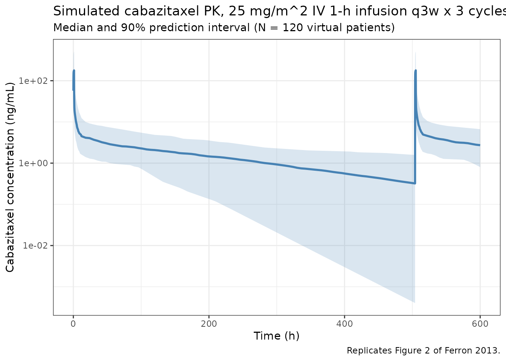
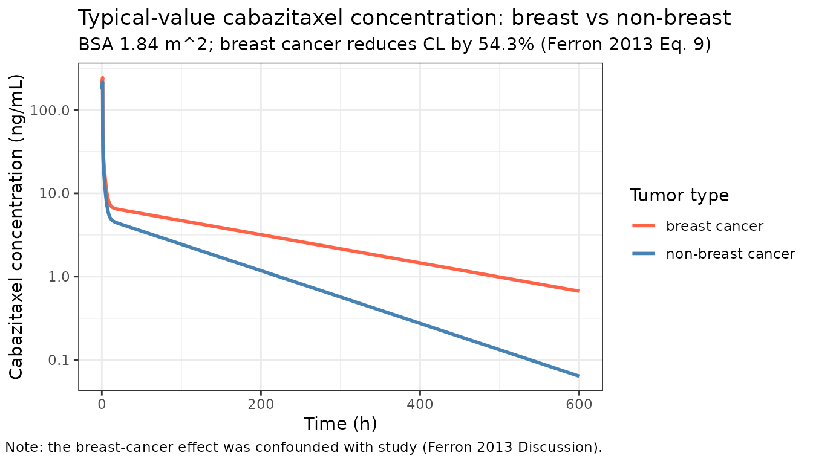

# Cabazitaxel (Ferron 2013)

``` r

library(nlmixr2lib)
library(rxode2)
#> rxode2 5.0.2 using 2 threads (see ?getRxThreads)
#>   no cache: create with `rxCreateCache()`
library(dplyr)
#> 
#> Attaching package: 'dplyr'
#> The following objects are masked from 'package:stats':
#> 
#>     filter, lag
#> The following objects are masked from 'package:base':
#> 
#>     intersect, setdiff, setequal, union
library(tidyr)
library(ggplot2)
library(PKNCA)
#> 
#> Attaching package: 'PKNCA'
#> The following object is masked from 'package:stats':
#> 
#>     filter
```

## Cabazitaxel population PK simulation

Simulate cabazitaxel concentration-time profiles using the final
three-compartment population PK model from Ferron, Dai and Semiond
(2013). The pooled analysis included 170 patients with advanced solid
tumors from five Phase I-III studies (2,322 measurable plasma
concentrations) who received 10-30 mg/m^2 cabazitaxel as a 1-h IV
infusion every 7 or 21 days.

The structural model is a linear three-compartment IV model with
first-order elimination. Final covariates are body surface area (BSA, on
CL via linear scaling normalised to median 1.84 m^2) and a breast-cancer
tumor-type indicator (TUMTP_BC; multiplicative reduction in CL).
Concentrations are reported in ng/mL.

### Source trace

| Element | Source location | Value / form |
|----|----|----|
| CL | Ferron 2013 Table 4, theta1; Eq. 9 | 48.5 L/h (BSA 1.84, non-breast) |
| V1 | Ferron 2013 Table 4, theta2 | 26.0 L |
| K12 | Ferron 2013 Table 4, theta3 | 2.48 1/h |
| K21 | Ferron 2013 Table 4, theta4 | 0.604 1/h |
| K13 | Ferron 2013 Table 4, theta5 | 4.84 1/h |
| K31 | Ferron 2013 Table 4, theta6 | 0.0266 1/h |
| Breast cancer effect on CL | Ferron 2013 Table 4, theta7; Eq. 9 | CL multiplied by (1 - 0.543 \* TUMTP_BC) |
| BSA effect on CL | Ferron 2013 Eq. 9 | CL multiplied by BSA / 1.84 |
| IIV CL, V1, K12, K13, K31 | Ferron 2013 Table 4 | 38.8%, 93.4%, 84.0%, 64.2%, 28.2% CV |
| Residual error | Ferron 2013 Table 4; Eq. 2 | Proportional 27.8% CV |
| Reference dose | Ferron 2013 Methods (TROPIC label) | 25 mg/m^2 IV 1-h infusion q3w |

The paper also reports secondary derived parameters that the vignette
checks against: Vss = 4,870 L; t1/2 alpha = 4.4 min; t1/2 beta = 1.6 h;
t1/2 gamma = 95 h (Ferron 2013 Results paragraph 6 and Table 4 footer).

### Covariate column naming

| Source column | Canonical column used here |
|----|----|
| `BSA` (m^2) | `BSA` |
| `TT1` (1 = breast cancer, 0 = other) | `TUMTP_BC` (1 = breast cancer, 0 = other) |

See `inst/references/covariate-columns.md` for the canonical register.

### Virtual population

Approximate the Ferron 2013 Table 3 distributions for the pooled
170-patient cohort. The paper does not publish individual covariate
values or correlations.

``` r

set.seed(2013)
n_subj <- 200

# BSA: log-normal around median 1.84 m^2 clipped to observed range 1.30-2.53.
BSA <- pmin(pmax(rlnorm(n_subj, log(1.84), 0.10), 1.30), 2.53)

# Tumor-type mix from Table 3 proportions (prostate 45.3%, breast 21.8%,
# GI 13.5%, other 19.4%).
tumtp_p <- c(prostate = 0.453, breast = 0.218, GI = 0.135, other = 0.194)
TUMTP <- sample(names(tumtp_p), n_subj, replace = TRUE, prob = tumtp_p)
TUMTP_BC <- as.integer(TUMTP == "breast")

pop <- data.frame(
  ID        = seq_len(n_subj),
  BSA, TUMTP, TUMTP_BC,
  treatment = ifelse(TUMTP_BC == 1, "breast cancer", "non-breast cancer")
)
```

### Dosing dataset

Approved TROPIC-label regimen: 25 mg/m^2 IV over 1 hour every 3 weeks.
The absolute mg dose for each subject is `25 * BSA`. Simulate three
cycles followed by an observation tail to capture the long terminal
phase (t1/2 gamma approximately 95 h).

``` r

cycle_h    <- 21 * 24            # 21 days in hours
n_cycles   <- 3
dose_times <- seq(0, (n_cycles - 1) * cycle_h, by = cycle_h)

# Sampling grid: dense around each infusion to capture distribution; long
# tail to ~25 days after the last dose for the gamma phase.
intra_cycle <- sort(unique(c(
  seq(0, 1, by = 0.05),                  # during infusion
  seq(1, 12, by = 0.25),                 # post-infusion alpha and beta
  seq(12, 21 * 24, by = 4)               # to next dose
)))
post_last <- seq(0, 25 * 24, by = 6)
obs_times <- sort(unique(c(
  as.numeric(outer(dose_times, intra_cycle, FUN = "+")),
  (n_cycles - 1) * cycle_h + post_last
)))

d_dose <- pop |>
  tidyr::crossing(TIME = dose_times) |>
  dplyr::mutate(
    AMT  = 25 * BSA,        # 25 mg/m^2 x BSA = absolute mg dose
    EVID = 1,
    CMT  = "central",
    DUR  = 1.0,             # 1-h IV infusion (Ferron 2013 Methods)
    DV   = NA_real_
  )

d_obs <- pop |>
  tidyr::crossing(TIME = obs_times) |>
  dplyr::mutate(
    AMT  = NA_real_,
    EVID = 0,
    CMT  = "central",
    DUR  = NA_real_,
    DV   = NA_real_
  )

d_sim <- dplyr::bind_rows(d_dose, d_obs) |>
  dplyr::arrange(ID, TIME, dplyr::desc(EVID)) |>
  as.data.frame()

stopifnot(!anyDuplicated(unique(d_sim[, c("ID", "TIME", "EVID")])))
```

### Simulate

``` r

mod <- readModelDb("Ferron_2013_cabazitaxel")
set.seed(20130109)

# `keep = "treatment"` carries the breast vs non-breast label through to
# the simulation output so the NCA blocks below can stratify without a
# post-hoc left_join.
sim <- rxSolve(mod, d_sim, returnType = "data.frame",
               keep = c("treatment", "BSA"))
#> ℹ parameter labels from comments will be replaced by 'label()'
```

### Concentration-time profile (cycle 1)

Replicates the upper-left and lower-left panels of Ferron 2013 Figure 2
(VPC of plasma concentration vs. time after cycle 1 dose, normalised to
the 25 mg/m^2 reference dose).

``` r

sim_summary <- sim |>
  dplyr::filter(time > 0, time <= 25 * 24) |>
  dplyr::group_by(time) |>
  dplyr::summarise(
    median = median(Cc, na.rm = TRUE),
    lo     = quantile(Cc, 0.05, na.rm = TRUE),
    hi     = quantile(Cc, 0.95, na.rm = TRUE),
    .groups = "drop"
  )

ggplot(sim_summary, aes(x = time)) +
  geom_ribbon(aes(ymin = lo, ymax = hi), alpha = 0.2, fill = "steelblue") +
  geom_line(aes(y = median), color = "steelblue", linewidth = 1) +
  scale_y_log10() +
  labs(
    x = "Time (h)",
    y = "Cabazitaxel concentration (ng/mL)",
    title = "Simulated cabazitaxel PK, 25 mg/m^2 IV 1-h infusion q3w x 3 cycles",
    subtitle = "Median and 90% prediction interval (N = 200 virtual patients)",
    caption = "Replicates Figure 2 of Ferron 2013."
  ) +
  theme_bw()
```



### Effect of breast-cancer covariate on CL

The paper’s final model reduces CL by 54.3% in breast-cancer patients
(Eq. 9). The plot below shows the typical-value (no IIV, no residual)
trajectories for breast vs non-breast at BSA 1.84 m^2.

``` r

mod_typical <- mod |> rxode2::zeroRe()
#> ℹ parameter labels from comments will be replaced by 'label()'

typ_pop <- data.frame(
  ID = c(1L, 2L), BSA = c(1.84, 1.84),
  TUMTP_BC = c(0L, 1L),
  treatment = c("non-breast cancer", "breast cancer")
)

typ_dose <- typ_pop |>
  dplyr::mutate(TIME = 0, AMT = 25 * BSA, EVID = 1, CMT = "central",
                DUR = 1.0, DV = NA_real_)

typ_obs <- typ_pop |>
  tidyr::crossing(TIME = sort(unique(c(seq(0, 24, by = 0.25),
                                       seq(24, 25 * 24, by = 6))))) |>
  dplyr::mutate(AMT = NA_real_, EVID = 0, CMT = "central",
                DUR = NA_real_, DV = NA_real_)

typ_d <- dplyr::bind_rows(typ_dose, typ_obs) |>
  dplyr::arrange(ID, TIME, dplyr::desc(EVID)) |>
  as.data.frame()

typ_sim <- rxSolve(mod_typical, typ_d, returnType = "data.frame",
                   keep = c("treatment", "TUMTP_BC"))
#> ℹ omega/sigma items treated as zero: 'etalcl', 'etalvc', 'etalk12', 'etalk13', 'etalk31'
#> Warning: multi-subject simulation without without 'omega'

ggplot(typ_sim |> dplyr::filter(time > 0),
       aes(x = time, y = Cc, color = treatment)) +
  geom_line(linewidth = 1) +
  scale_y_log10() +
  scale_color_manual(values = c("non-breast cancer" = "steelblue",
                                "breast cancer"     = "tomato")) +
  labs(
    x = "Time (h)",
    y = "Cabazitaxel concentration (ng/mL)",
    title = "Typical-value cabazitaxel concentration: breast vs non-breast",
    subtitle = "BSA 1.84 m^2; breast cancer reduces CL by 54.3% (Ferron 2013 Eq. 9)",
    color = "Tumor type",
    caption = "Note: the breast-cancer effect was confounded with study (Ferron 2013 Discussion)."
  ) +
  theme_bw()
```



### Derived structural quantities

The paper reports Vss = 4,870 L and triphasic half-lives (alpha 4.4 min,
beta 1.6 h, gamma 95 h) for a non-breast-cancer patient at the median
BSA. The corresponding values from the typical-subject ODE coefficients
are:

``` r

mat_check <- function(cl, vc, k12, k21, k13, k31) {
  kel <- cl / vc
  q1  <- k12 * vc
  q2  <- k13 * vc
  vp1 <- q1  / k21
  vp2 <- q2  / k31
  vss <- vc + vp1 + vp2

  # 3-cmt rate matrix (loss from compartment i in column i)
  A <- matrix(c(
    -(kel + k12 + k13),  k21,  k31,
              k12,      -k21,    0,
              k13,         0, -k31
  ), nrow = 3, byrow = TRUE)
  ev   <- sort(Re(eigen(A)$values), decreasing = TRUE)   # negative
  thalf <- log(2) / -ev
  list(
    Vss_L            = vss,
    Vp1_L            = vp1,
    Vp2_L            = vp2,
    Q1_L_per_h       = q1,
    Q2_L_per_h       = q2,
    t_half_alpha_min = thalf[3] * 60,
    t_half_beta_h    = thalf[2],
    t_half_gamma_h   = thalf[1]
  )
}

derived <- mat_check(
  cl  = 48.5,   vc  = 26.0,
  k12 = 2.48,   k21 = 0.604,
  k13 = 4.84,   k31 = 0.0266
)

knitr::kable(
  data.frame(
    quantity  = c("Vss (L)", "Vp1 (L)", "Vp2 (L)",
                  "Q1 (L/h)", "Q2 (L/h)",
                  "t1/2 alpha (min)", "t1/2 beta (h)", "t1/2 gamma (h)"),
    paper     = c(4870,     NA,        NA,
                  NA,        NA,
                  4.4,       1.6,           95.1),
    derived   = c(round(derived$Vss_L),
                  round(derived$Vp1_L, 1),
                  round(derived$Vp2_L),
                  round(derived$Q1_L_per_h, 1),
                  round(derived$Q2_L_per_h, 1),
                  round(derived$t_half_alpha_min, 1),
                  round(derived$t_half_beta_h, 2),
                  round(derived$t_half_gamma_h, 1))
  ),
  caption = "Derived structural quantities, paper vs implementation."
)
```

| quantity         |  paper | derived |
|:-----------------|-------:|--------:|
| Vss (L)          | 4870.0 | 4864.00 |
| Vp1 (L)          |     NA |  106.80 |
| Vp2 (L)          |     NA | 4731.00 |
| Q1 (L/h)         |     NA |   64.50 |
| Q2 (L/h)         |     NA |  125.80 |
| t1/2 alpha (min) |    4.4 |    4.40 |
| t1/2 beta (h)    |    1.6 |    1.58 |
| t1/2 gamma (h)   |   95.1 |   95.10 |

Derived structural quantities, paper vs implementation. {.table}

### NCA validation

Run PKNCA on cycle 1 (0-21 days = 0-504 h) and a per-cycle steady-state
window. Stratify by breast vs non-breast tumor type so the per-group
results can be compared back to the paper’s covariate effect on CL.

``` r

conc1 <- sim |>
  dplyr::filter(time >= 0, time <= 21 * 24, Cc > 0) |>
  dplyr::rename(ID = id) |>
  dplyr::transmute(ID, time_rel = time, Cc, treatment)

dose1 <- pop |>
  dplyr::transmute(ID, time_rel = 0, AMT = 25 * BSA, treatment)

conc_obj <- PKNCAconc(conc1, Cc ~ time_rel | treatment + ID,
                      concu = "ng/mL", timeu = "hr")
dose_obj <- PKNCAdose(dose1, AMT ~ time_rel | treatment + ID,
                      doseu = "mg")
nca_data <- PKNCAdata(
  conc_obj, dose_obj,
  intervals = data.frame(
    start      = 0,
    end        = 21 * 24,
    cmax       = TRUE,
    tmax       = TRUE,
    auclast    = TRUE,
    aucinf.obs = TRUE,
    half.life  = TRUE,
    cl.obs     = TRUE
  )
)
nca_results <- pk.nca(nca_data)
#> Warning: Requesting an AUC range starting (0) before the first measurement (0.05) is not allowed
#> Requesting an AUC range starting (0) before the first measurement (0.05) is not allowed
#> Requesting an AUC range starting (0) before the first measurement (0.05) is not allowed
#> Requesting an AUC range starting (0) before the first measurement (0.05) is not allowed
#> Requesting an AUC range starting (0) before the first measurement (0.05) is not allowed
#> Requesting an AUC range starting (0) before the first measurement (0.05) is not allowed
#> Requesting an AUC range starting (0) before the first measurement (0.05) is not allowed
#> Requesting an AUC range starting (0) before the first measurement (0.05) is not allowed
#> Requesting an AUC range starting (0) before the first measurement (0.05) is not allowed
#> Requesting an AUC range starting (0) before the first measurement (0.05) is not allowed
#> Requesting an AUC range starting (0) before the first measurement (0.05) is not allowed
#> Requesting an AUC range starting (0) before the first measurement (0.05) is not allowed
#> Requesting an AUC range starting (0) before the first measurement (0.05) is not allowed
#> Requesting an AUC range starting (0) before the first measurement (0.05) is not allowed
#> Requesting an AUC range starting (0) before the first measurement (0.05) is not allowed
#> Requesting an AUC range starting (0) before the first measurement (0.05) is not allowed
#> Requesting an AUC range starting (0) before the first measurement (0.05) is not allowed
#> Requesting an AUC range starting (0) before the first measurement (0.05) is not allowed
#> Requesting an AUC range starting (0) before the first measurement (0.05) is not allowed
#> Requesting an AUC range starting (0) before the first measurement (0.05) is not allowed
#> Requesting an AUC range starting (0) before the first measurement (0.05) is not allowed
#> Requesting an AUC range starting (0) before the first measurement (0.05) is not allowed
#> Requesting an AUC range starting (0) before the first measurement (0.05) is not allowed
#> Requesting an AUC range starting (0) before the first measurement (0.05) is not allowed
#> Requesting an AUC range starting (0) before the first measurement (0.05) is not allowed
#> Requesting an AUC range starting (0) before the first measurement (0.05) is not allowed
#> Requesting an AUC range starting (0) before the first measurement (0.05) is not allowed
#> Requesting an AUC range starting (0) before the first measurement (0.05) is not allowed
#> Requesting an AUC range starting (0) before the first measurement (0.05) is not allowed
#> Requesting an AUC range starting (0) before the first measurement (0.05) is not allowed
#> Requesting an AUC range starting (0) before the first measurement (0.05) is not allowed
#> Requesting an AUC range starting (0) before the first measurement (0.05) is not allowed
#> Requesting an AUC range starting (0) before the first measurement (0.05) is not allowed
#> Requesting an AUC range starting (0) before the first measurement (0.05) is not allowed
#> Requesting an AUC range starting (0) before the first measurement (0.05) is not allowed
#> Requesting an AUC range starting (0) before the first measurement (0.05) is not allowed
#> Requesting an AUC range starting (0) before the first measurement (0.05) is not allowed
#> Requesting an AUC range starting (0) before the first measurement (0.05) is not allowed
#> Requesting an AUC range starting (0) before the first measurement (0.05) is not allowed
#> Requesting an AUC range starting (0) before the first measurement (0.05) is not allowed
#>  ■■■■                              10% |  ETA: 24s
#> Warning: Requesting an AUC range starting (0) before the first measurement (0.05) is not allowed
#> Requesting an AUC range starting (0) before the first measurement (0.05) is not allowed
#> Requesting an AUC range starting (0) before the first measurement (0.05) is not allowed
#> Requesting an AUC range starting (0) before the first measurement (0.05) is not allowed
#> Requesting an AUC range starting (0) before the first measurement (0.05) is not allowed
#> Requesting an AUC range starting (0) before the first measurement (0.05) is not allowed
#> Requesting an AUC range starting (0) before the first measurement (0.05) is not allowed
#> Requesting an AUC range starting (0) before the first measurement (0.05) is not allowed
#> Requesting an AUC range starting (0) before the first measurement (0.05) is not allowed
#> Requesting an AUC range starting (0) before the first measurement (0.05) is not allowed
#> Requesting an AUC range starting (0) before the first measurement (0.05) is not allowed
#> Requesting an AUC range starting (0) before the first measurement (0.05) is not allowed
#> Requesting an AUC range starting (0) before the first measurement (0.05) is not allowed
#> Requesting an AUC range starting (0) before the first measurement (0.05) is not allowed
#> Requesting an AUC range starting (0) before the first measurement (0.05) is not allowed
#> Requesting an AUC range starting (0) before the first measurement (0.05) is not allowed
#> Requesting an AUC range starting (0) before the first measurement (0.05) is not allowed
#> Requesting an AUC range starting (0) before the first measurement (0.05) is not allowed
#> Requesting an AUC range starting (0) before the first measurement (0.05) is not allowed
#> Requesting an AUC range starting (0) before the first measurement (0.05) is not allowed
#> Requesting an AUC range starting (0) before the first measurement (0.05) is not allowed
#> Requesting an AUC range starting (0) before the first measurement (0.05) is not allowed
#> Requesting an AUC range starting (0) before the first measurement (0.05) is not allowed
#> Requesting an AUC range starting (0) before the first measurement (0.05) is not allowed
#> Requesting an AUC range starting (0) before the first measurement (0.05) is not allowed
#> Requesting an AUC range starting (0) before the first measurement (0.05) is not allowed
#> Requesting an AUC range starting (0) before the first measurement (0.05) is not allowed
#> Requesting an AUC range starting (0) before the first measurement (0.05) is not allowed
#> Requesting an AUC range starting (0) before the first measurement (0.05) is not allowed
#> Requesting an AUC range starting (0) before the first measurement (0.05) is not allowed
#> Requesting an AUC range starting (0) before the first measurement (0.05) is not allowed
#> Requesting an AUC range starting (0) before the first measurement (0.05) is not allowed
#> Requesting an AUC range starting (0) before the first measurement (0.05) is not allowed
#> Requesting an AUC range starting (0) before the first measurement (0.05) is not allowed
#> Requesting an AUC range starting (0) before the first measurement (0.05) is not allowed
#> Requesting an AUC range starting (0) before the first measurement (0.05) is not allowed
#> Requesting an AUC range starting (0) before the first measurement (0.05) is not allowed
#> Requesting an AUC range starting (0) before the first measurement (0.05) is not allowed
#> Requesting an AUC range starting (0) before the first measurement (0.05) is not allowed
#> Requesting an AUC range starting (0) before the first measurement (0.05) is not allowed
#> Requesting an AUC range starting (0) before the first measurement (0.05) is not allowed
#> Requesting an AUC range starting (0) before the first measurement (0.05) is not allowed
#> Requesting an AUC range starting (0) before the first measurement (0.05) is not allowed
#> Requesting an AUC range starting (0) before the first measurement (0.05) is not allowed
#> Requesting an AUC range starting (0) before the first measurement (0.05) is not allowed
#> Requesting an AUC range starting (0) before the first measurement (0.05) is not allowed
#> Requesting an AUC range starting (0) before the first measurement (0.05) is not allowed
#> Requesting an AUC range starting (0) before the first measurement (0.05) is not allowed
#> Requesting an AUC range starting (0) before the first measurement (0.05) is not allowed
#> Requesting an AUC range starting (0) before the first measurement (0.05) is not allowed
#>  ■■■■■■■■                          22% |  ETA: 19s
#> Warning: Requesting an AUC range starting (0) before the first measurement (0.05) is not allowed
#> Requesting an AUC range starting (0) before the first measurement (0.05) is not allowed
#> Requesting an AUC range starting (0) before the first measurement (0.05) is not allowed
#> Requesting an AUC range starting (0) before the first measurement (0.05) is not allowed
#> Requesting an AUC range starting (0) before the first measurement (0.05) is not allowed
#> Requesting an AUC range starting (0) before the first measurement (0.05) is not allowed
#> Requesting an AUC range starting (0) before the first measurement (0.05) is not allowed
#> Requesting an AUC range starting (0) before the first measurement (0.05) is not allowed
#> Requesting an AUC range starting (0) before the first measurement (0.05) is not allowed
#> Requesting an AUC range starting (0) before the first measurement (0.05) is not allowed
#> Requesting an AUC range starting (0) before the first measurement (0.05) is not allowed
#> Requesting an AUC range starting (0) before the first measurement (0.05) is not allowed
#> Requesting an AUC range starting (0) before the first measurement (0.05) is not allowed
#> Requesting an AUC range starting (0) before the first measurement (0.05) is not allowed
#> Requesting an AUC range starting (0) before the first measurement (0.05) is not allowed
#> Requesting an AUC range starting (0) before the first measurement (0.05) is not allowed
#> Requesting an AUC range starting (0) before the first measurement (0.05) is not allowed
#> Requesting an AUC range starting (0) before the first measurement (0.05) is not allowed
#> Requesting an AUC range starting (0) before the first measurement (0.05) is not allowed
#> Requesting an AUC range starting (0) before the first measurement (0.05) is not allowed
#> Requesting an AUC range starting (0) before the first measurement (0.05) is not allowed
#> Requesting an AUC range starting (0) before the first measurement (0.05) is not allowed
#> Requesting an AUC range starting (0) before the first measurement (0.05) is not allowed
#> Requesting an AUC range starting (0) before the first measurement (0.05) is not allowed
#> Requesting an AUC range starting (0) before the first measurement (0.05) is not allowed
#> Requesting an AUC range starting (0) before the first measurement (0.05) is not allowed
#> Requesting an AUC range starting (0) before the first measurement (0.05) is not allowed
#> Requesting an AUC range starting (0) before the first measurement (0.05) is not allowed
#> Requesting an AUC range starting (0) before the first measurement (0.05) is not allowed
#> Requesting an AUC range starting (0) before the first measurement (0.05) is not allowed
#> Requesting an AUC range starting (0) before the first measurement (0.05) is not allowed
#> Requesting an AUC range starting (0) before the first measurement (0.05) is not allowed
#> Requesting an AUC range starting (0) before the first measurement (0.05) is not allowed
#> Requesting an AUC range starting (0) before the first measurement (0.05) is not allowed
#> Requesting an AUC range starting (0) before the first measurement (0.05) is not allowed
#> Requesting an AUC range starting (0) before the first measurement (0.05) is not allowed
#> Requesting an AUC range starting (0) before the first measurement (0.05) is not allowed
#> Requesting an AUC range starting (0) before the first measurement (0.05) is not allowed
#> Requesting an AUC range starting (0) before the first measurement (0.05) is not allowed
#> Requesting an AUC range starting (0) before the first measurement (0.05) is not allowed
#> Requesting an AUC range starting (0) before the first measurement (0.05) is not allowed
#> Requesting an AUC range starting (0) before the first measurement (0.05) is not allowed
#> Requesting an AUC range starting (0) before the first measurement (0.05) is not allowed
#> Requesting an AUC range starting (0) before the first measurement (0.05) is not allowed
#> Requesting an AUC range starting (0) before the first measurement (0.05) is not allowed
#> Requesting an AUC range starting (0) before the first measurement (0.05) is not allowed
#> Requesting an AUC range starting (0) before the first measurement (0.05) is not allowed
#> Requesting an AUC range starting (0) before the first measurement (0.05) is not allowed
#> Requesting an AUC range starting (0) before the first measurement (0.05) is not allowed
#> Requesting an AUC range starting (0) before the first measurement (0.05) is not allowed
#> Requesting an AUC range starting (0) before the first measurement (0.05) is not allowed
#> Requesting an AUC range starting (0) before the first measurement (0.05) is not allowed
#>  ■■■■■■■■■■■■                      36% |  ETA: 16s
#> Warning: Requesting an AUC range starting (0) before the first measurement (0.05) is not allowed
#> Requesting an AUC range starting (0) before the first measurement (0.05) is not allowed
#> Requesting an AUC range starting (0) before the first measurement (0.05) is not allowed
#> Requesting an AUC range starting (0) before the first measurement (0.05) is not allowed
#> Requesting an AUC range starting (0) before the first measurement (0.05) is not allowed
#> Requesting an AUC range starting (0) before the first measurement (0.05) is not allowed
#> Requesting an AUC range starting (0) before the first measurement (0.05) is not allowed
#> Requesting an AUC range starting (0) before the first measurement (0.05) is not allowed
#> Requesting an AUC range starting (0) before the first measurement (0.05) is not allowed
#> Requesting an AUC range starting (0) before the first measurement (0.05) is not allowed
#> Requesting an AUC range starting (0) before the first measurement (0.05) is not allowed
#> Requesting an AUC range starting (0) before the first measurement (0.05) is not allowed
#> Requesting an AUC range starting (0) before the first measurement (0.05) is not allowed
#> Requesting an AUC range starting (0) before the first measurement (0.05) is not allowed
#> Requesting an AUC range starting (0) before the first measurement (0.05) is not allowed
#> Requesting an AUC range starting (0) before the first measurement (0.05) is not allowed
#> Requesting an AUC range starting (0) before the first measurement (0.05) is not allowed
#> Requesting an AUC range starting (0) before the first measurement (0.05) is not allowed
#> Requesting an AUC range starting (0) before the first measurement (0.05) is not allowed
#> Requesting an AUC range starting (0) before the first measurement (0.05) is not allowed
#> Requesting an AUC range starting (0) before the first measurement (0.05) is not allowed
#> Requesting an AUC range starting (0) before the first measurement (0.05) is not allowed
#> Requesting an AUC range starting (0) before the first measurement (0.05) is not allowed
#> Requesting an AUC range starting (0) before the first measurement (0.05) is not allowed
#> Requesting an AUC range starting (0) before the first measurement (0.05) is not allowed
#> Requesting an AUC range starting (0) before the first measurement (0.05) is not allowed
#> Requesting an AUC range starting (0) before the first measurement (0.05) is not allowed
#> Requesting an AUC range starting (0) before the first measurement (0.05) is not allowed
#> Requesting an AUC range starting (0) before the first measurement (0.05) is not allowed
#> Requesting an AUC range starting (0) before the first measurement (0.05) is not allowed
#> Requesting an AUC range starting (0) before the first measurement (0.05) is not allowed
#> Requesting an AUC range starting (0) before the first measurement (0.05) is not allowed
#> Requesting an AUC range starting (0) before the first measurement (0.05) is not allowed
#> Requesting an AUC range starting (0) before the first measurement (0.05) is not allowed
#> Requesting an AUC range starting (0) before the first measurement (0.05) is not allowed
#> Requesting an AUC range starting (0) before the first measurement (0.05) is not allowed
#> Requesting an AUC range starting (0) before the first measurement (0.05) is not allowed
#> Requesting an AUC range starting (0) before the first measurement (0.05) is not allowed
#> Requesting an AUC range starting (0) before the first measurement (0.05) is not allowed
#> Requesting an AUC range starting (0) before the first measurement (0.05) is not allowed
#> Requesting an AUC range starting (0) before the first measurement (0.05) is not allowed
#> Requesting an AUC range starting (0) before the first measurement (0.05) is not allowed
#> Requesting an AUC range starting (0) before the first measurement (0.05) is not allowed
#> Requesting an AUC range starting (0) before the first measurement (0.05) is not allowed
#> Requesting an AUC range starting (0) before the first measurement (0.05) is not allowed
#> Requesting an AUC range starting (0) before the first measurement (0.05) is not allowed
#> Requesting an AUC range starting (0) before the first measurement (0.05) is not allowed
#> Requesting an AUC range starting (0) before the first measurement (0.05) is not allowed
#> Requesting an AUC range starting (0) before the first measurement (0.05) is not allowed
#> Requesting an AUC range starting (0) before the first measurement (0.05) is not allowed
#>  ■■■■■■■■■■■■■■■                   48% |  ETA: 13s
#> Warning: Requesting an AUC range starting (0) before the first measurement (0.05) is not allowed
#> Requesting an AUC range starting (0) before the first measurement (0.05) is not allowed
#> Requesting an AUC range starting (0) before the first measurement (0.05) is not allowed
#> Requesting an AUC range starting (0) before the first measurement (0.05) is not allowed
#> Requesting an AUC range starting (0) before the first measurement (0.05) is not allowed
#> Requesting an AUC range starting (0) before the first measurement (0.05) is not allowed
#> Requesting an AUC range starting (0) before the first measurement (0.05) is not allowed
#> Requesting an AUC range starting (0) before the first measurement (0.05) is not allowed
#> Requesting an AUC range starting (0) before the first measurement (0.05) is not allowed
#> Requesting an AUC range starting (0) before the first measurement (0.05) is not allowed
#> Requesting an AUC range starting (0) before the first measurement (0.05) is not allowed
#> Requesting an AUC range starting (0) before the first measurement (0.05) is not allowed
#> Requesting an AUC range starting (0) before the first measurement (0.05) is not allowed
#> Requesting an AUC range starting (0) before the first measurement (0.05) is not allowed
#> Requesting an AUC range starting (0) before the first measurement (0.05) is not allowed
#> Requesting an AUC range starting (0) before the first measurement (0.05) is not allowed
#> Requesting an AUC range starting (0) before the first measurement (0.05) is not allowed
#> Requesting an AUC range starting (0) before the first measurement (0.05) is not allowed
#> Requesting an AUC range starting (0) before the first measurement (0.05) is not allowed
#> Requesting an AUC range starting (0) before the first measurement (0.05) is not allowed
#> Requesting an AUC range starting (0) before the first measurement (0.05) is not allowed
#> Requesting an AUC range starting (0) before the first measurement (0.05) is not allowed
#> Requesting an AUC range starting (0) before the first measurement (0.05) is not allowed
#> Requesting an AUC range starting (0) before the first measurement (0.05) is not allowed
#> Requesting an AUC range starting (0) before the first measurement (0.05) is not allowed
#> Requesting an AUC range starting (0) before the first measurement (0.05) is not allowed
#> Requesting an AUC range starting (0) before the first measurement (0.05) is not allowed
#> Requesting an AUC range starting (0) before the first measurement (0.05) is not allowed
#> Requesting an AUC range starting (0) before the first measurement (0.05) is not allowed
#> Requesting an AUC range starting (0) before the first measurement (0.05) is not allowed
#> Requesting an AUC range starting (0) before the first measurement (0.05) is not allowed
#> Requesting an AUC range starting (0) before the first measurement (0.05) is not allowed
#> Requesting an AUC range starting (0) before the first measurement (0.05) is not allowed
#> Requesting an AUC range starting (0) before the first measurement (0.05) is not allowed
#> Requesting an AUC range starting (0) before the first measurement (0.05) is not allowed
#> Requesting an AUC range starting (0) before the first measurement (0.05) is not allowed
#> Requesting an AUC range starting (0) before the first measurement (0.05) is not allowed
#> Requesting an AUC range starting (0) before the first measurement (0.05) is not allowed
#> Requesting an AUC range starting (0) before the first measurement (0.05) is not allowed
#> Requesting an AUC range starting (0) before the first measurement (0.05) is not allowed
#> Requesting an AUC range starting (0) before the first measurement (0.05) is not allowed
#> Requesting an AUC range starting (0) before the first measurement (0.05) is not allowed
#> Requesting an AUC range starting (0) before the first measurement (0.05) is not allowed
#> Requesting an AUC range starting (0) before the first measurement (0.05) is not allowed
#> Requesting an AUC range starting (0) before the first measurement (0.05) is not allowed
#> Requesting an AUC range starting (0) before the first measurement (0.05) is not allowed
#> Requesting an AUC range starting (0) before the first measurement (0.05) is not allowed
#> Requesting an AUC range starting (0) before the first measurement (0.05) is not allowed
#> Requesting an AUC range starting (0) before the first measurement (0.05) is not allowed
#> Requesting an AUC range starting (0) before the first measurement (0.05) is not allowed
#>  ■■■■■■■■■■■■■■■■■■■               60% |  ETA: 10s
#> Warning: Requesting an AUC range starting (0) before the first measurement (0.05) is not allowed
#> Requesting an AUC range starting (0) before the first measurement (0.05) is not allowed
#> Requesting an AUC range starting (0) before the first measurement (0.05) is not allowed
#> Requesting an AUC range starting (0) before the first measurement (0.05) is not allowed
#> Requesting an AUC range starting (0) before the first measurement (0.05) is not allowed
#> Requesting an AUC range starting (0) before the first measurement (0.05) is not allowed
#> Requesting an AUC range starting (0) before the first measurement (0.05) is not allowed
#> Requesting an AUC range starting (0) before the first measurement (0.05) is not allowed
#> Requesting an AUC range starting (0) before the first measurement (0.05) is not allowed
#> Requesting an AUC range starting (0) before the first measurement (0.05) is not allowed
#> Requesting an AUC range starting (0) before the first measurement (0.05) is not allowed
#> Requesting an AUC range starting (0) before the first measurement (0.05) is not allowed
#> Requesting an AUC range starting (0) before the first measurement (0.05) is not allowed
#> Requesting an AUC range starting (0) before the first measurement (0.05) is not allowed
#> Requesting an AUC range starting (0) before the first measurement (0.05) is not allowed
#> Requesting an AUC range starting (0) before the first measurement (0.05) is not allowed
#> Requesting an AUC range starting (0) before the first measurement (0.05) is not allowed
#> Requesting an AUC range starting (0) before the first measurement (0.05) is not allowed
#> Requesting an AUC range starting (0) before the first measurement (0.05) is not allowed
#> Requesting an AUC range starting (0) before the first measurement (0.05) is not allowed
#> Requesting an AUC range starting (0) before the first measurement (0.05) is not allowed
#> Requesting an AUC range starting (0) before the first measurement (0.05) is not allowed
#> Requesting an AUC range starting (0) before the first measurement (0.05) is not allowed
#> Requesting an AUC range starting (0) before the first measurement (0.05) is not allowed
#> Requesting an AUC range starting (0) before the first measurement (0.05) is not allowed
#> Requesting an AUC range starting (0) before the first measurement (0.05) is not allowed
#> Requesting an AUC range starting (0) before the first measurement (0.05) is not allowed
#> Requesting an AUC range starting (0) before the first measurement (0.05) is not allowed
#> Requesting an AUC range starting (0) before the first measurement (0.05) is not allowed
#> Requesting an AUC range starting (0) before the first measurement (0.05) is not allowed
#> Requesting an AUC range starting (0) before the first measurement (0.05) is not allowed
#> Requesting an AUC range starting (0) before the first measurement (0.05) is not allowed
#> Requesting an AUC range starting (0) before the first measurement (0.05) is not allowed
#> Requesting an AUC range starting (0) before the first measurement (0.05) is not allowed
#> Requesting an AUC range starting (0) before the first measurement (0.05) is not allowed
#> Requesting an AUC range starting (0) before the first measurement (0.05) is not allowed
#> Requesting an AUC range starting (0) before the first measurement (0.05) is not allowed
#> Requesting an AUC range starting (0) before the first measurement (0.05) is not allowed
#> Requesting an AUC range starting (0) before the first measurement (0.05) is not allowed
#> Requesting an AUC range starting (0) before the first measurement (0.05) is not allowed
#> Requesting an AUC range starting (0) before the first measurement (0.05) is not allowed
#> Requesting an AUC range starting (0) before the first measurement (0.05) is not allowed
#> Requesting an AUC range starting (0) before the first measurement (0.05) is not allowed
#> Requesting an AUC range starting (0) before the first measurement (0.05) is not allowed
#> Requesting an AUC range starting (0) before the first measurement (0.05) is not allowed
#> Requesting an AUC range starting (0) before the first measurement (0.05) is not allowed
#> Requesting an AUC range starting (0) before the first measurement (0.05) is not allowed
#> Requesting an AUC range starting (0) before the first measurement (0.05) is not allowed
#> Requesting an AUC range starting (0) before the first measurement (0.05) is not allowed
#> Requesting an AUC range starting (0) before the first measurement (0.05) is not allowed
#>  ■■■■■■■■■■■■■■■■■■■■■■■           73% |  ETA:  7s
#> Warning: Requesting an AUC range starting (0) before the first measurement (0.05) is not allowed
#> Requesting an AUC range starting (0) before the first measurement (0.05) is not allowed
#> Requesting an AUC range starting (0) before the first measurement (0.05) is not allowed
#> Requesting an AUC range starting (0) before the first measurement (0.05) is not allowed
#> Requesting an AUC range starting (0) before the first measurement (0.05) is not allowed
#> Requesting an AUC range starting (0) before the first measurement (0.05) is not allowed
#> Requesting an AUC range starting (0) before the first measurement (0.05) is not allowed
#> Requesting an AUC range starting (0) before the first measurement (0.05) is not allowed
#> Requesting an AUC range starting (0) before the first measurement (0.05) is not allowed
#> Requesting an AUC range starting (0) before the first measurement (0.05) is not allowed
#> Requesting an AUC range starting (0) before the first measurement (0.05) is not allowed
#> Requesting an AUC range starting (0) before the first measurement (0.05) is not allowed
#> Requesting an AUC range starting (0) before the first measurement (0.05) is not allowed
#> Requesting an AUC range starting (0) before the first measurement (0.05) is not allowed
#> Requesting an AUC range starting (0) before the first measurement (0.05) is not allowed
#> Requesting an AUC range starting (0) before the first measurement (0.05) is not allowed
#> Requesting an AUC range starting (0) before the first measurement (0.05) is not allowed
#> Requesting an AUC range starting (0) before the first measurement (0.05) is not allowed
#> Requesting an AUC range starting (0) before the first measurement (0.05) is not allowed
#> Requesting an AUC range starting (0) before the first measurement (0.05) is not allowed
#> Requesting an AUC range starting (0) before the first measurement (0.05) is not allowed
#> Requesting an AUC range starting (0) before the first measurement (0.05) is not allowed
#> Requesting an AUC range starting (0) before the first measurement (0.05) is not allowed
#> Requesting an AUC range starting (0) before the first measurement (0.05) is not allowed
#> Requesting an AUC range starting (0) before the first measurement (0.05) is not allowed
#> Requesting an AUC range starting (0) before the first measurement (0.05) is not allowed
#> Requesting an AUC range starting (0) before the first measurement (0.05) is not allowed
#> Requesting an AUC range starting (0) before the first measurement (0.05) is not allowed
#> Requesting an AUC range starting (0) before the first measurement (0.05) is not allowed
#> Requesting an AUC range starting (0) before the first measurement (0.05) is not allowed
#> Requesting an AUC range starting (0) before the first measurement (0.05) is not allowed
#> Requesting an AUC range starting (0) before the first measurement (0.05) is not allowed
#> Requesting an AUC range starting (0) before the first measurement (0.05) is not allowed
#> Requesting an AUC range starting (0) before the first measurement (0.05) is not allowed
#> Requesting an AUC range starting (0) before the first measurement (0.05) is not allowed
#> Requesting an AUC range starting (0) before the first measurement (0.05) is not allowed
#> Requesting an AUC range starting (0) before the first measurement (0.05) is not allowed
#> Requesting an AUC range starting (0) before the first measurement (0.05) is not allowed
#> Requesting an AUC range starting (0) before the first measurement (0.05) is not allowed
#> Requesting an AUC range starting (0) before the first measurement (0.05) is not allowed
#> Requesting an AUC range starting (0) before the first measurement (0.05) is not allowed
#> Requesting an AUC range starting (0) before the first measurement (0.05) is not allowed
#> Requesting an AUC range starting (0) before the first measurement (0.05) is not allowed
#> Requesting an AUC range starting (0) before the first measurement (0.05) is not allowed
#> Requesting an AUC range starting (0) before the first measurement (0.05) is not allowed
#> Requesting an AUC range starting (0) before the first measurement (0.05) is not allowed
#> Requesting an AUC range starting (0) before the first measurement (0.05) is not allowed
#> Requesting an AUC range starting (0) before the first measurement (0.05) is not allowed
#> Requesting an AUC range starting (0) before the first measurement (0.05) is not allowed
#> Requesting an AUC range starting (0) before the first measurement (0.05) is not allowed
#> Requesting an AUC range starting (0) before the first measurement (0.05) is not allowed
#> Requesting an AUC range starting (0) before the first measurement (0.05) is not allowed
#>  ■■■■■■■■■■■■■■■■■■■■■■■■■■■       86% |  ETA:  3s
#> Warning: Requesting an AUC range starting (0) before the first measurement (0.05) is not allowed
#> Requesting an AUC range starting (0) before the first measurement (0.05) is not allowed
#> Requesting an AUC range starting (0) before the first measurement (0.05) is not allowed
#> Requesting an AUC range starting (0) before the first measurement (0.05) is not allowed
#> Requesting an AUC range starting (0) before the first measurement (0.05) is not allowed
#> Requesting an AUC range starting (0) before the first measurement (0.05) is not allowed
#> Requesting an AUC range starting (0) before the first measurement (0.05) is not allowed
#> Requesting an AUC range starting (0) before the first measurement (0.05) is not allowed
#> Requesting an AUC range starting (0) before the first measurement (0.05) is not allowed
#> Requesting an AUC range starting (0) before the first measurement (0.05) is not allowed
#> Requesting an AUC range starting (0) before the first measurement (0.05) is not allowed
#> Requesting an AUC range starting (0) before the first measurement (0.05) is not allowed
#> Requesting an AUC range starting (0) before the first measurement (0.05) is not allowed
#> Requesting an AUC range starting (0) before the first measurement (0.05) is not allowed
#> Requesting an AUC range starting (0) before the first measurement (0.05) is not allowed
#> Requesting an AUC range starting (0) before the first measurement (0.05) is not allowed
#> Requesting an AUC range starting (0) before the first measurement (0.05) is not allowed
#> Requesting an AUC range starting (0) before the first measurement (0.05) is not allowed
#> Requesting an AUC range starting (0) before the first measurement (0.05) is not allowed
#> Requesting an AUC range starting (0) before the first measurement (0.05) is not allowed
#> Requesting an AUC range starting (0) before the first measurement (0.05) is not allowed
#> Requesting an AUC range starting (0) before the first measurement (0.05) is not allowed
#> Requesting an AUC range starting (0) before the first measurement (0.05) is not allowed
#> Requesting an AUC range starting (0) before the first measurement (0.05) is not allowed
#> Requesting an AUC range starting (0) before the first measurement (0.05) is not allowed
#> Requesting an AUC range starting (0) before the first measurement (0.05) is not allowed
#> Requesting an AUC range starting (0) before the first measurement (0.05) is not allowed
#> Requesting an AUC range starting (0) before the first measurement (0.05) is not allowed
#> Requesting an AUC range starting (0) before the first measurement (0.05) is not allowed
#> Requesting an AUC range starting (0) before the first measurement (0.05) is not allowed
#> Requesting an AUC range starting (0) before the first measurement (0.05) is not allowed
#> Requesting an AUC range starting (0) before the first measurement (0.05) is not allowed
#> Requesting an AUC range starting (0) before the first measurement (0.05) is not allowed
#> Requesting an AUC range starting (0) before the first measurement (0.05) is not allowed
#> Requesting an AUC range starting (0) before the first measurement (0.05) is not allowed
#> Requesting an AUC range starting (0) before the first measurement (0.05) is not allowed
#> Requesting an AUC range starting (0) before the first measurement (0.05) is not allowed
#> Requesting an AUC range starting (0) before the first measurement (0.05) is not allowed
#> Requesting an AUC range starting (0) before the first measurement (0.05) is not allowed
#> Requesting an AUC range starting (0) before the first measurement (0.05) is not allowed
#> Requesting an AUC range starting (0) before the first measurement (0.05) is not allowed
#> Requesting an AUC range starting (0) before the first measurement (0.05) is not allowed
#> Requesting an AUC range starting (0) before the first measurement (0.05) is not allowed
#> Requesting an AUC range starting (0) before the first measurement (0.05) is not allowed
#> Requesting an AUC range starting (0) before the first measurement (0.05) is not allowed
#> Requesting an AUC range starting (0) before the first measurement (0.05) is not allowed
#> Requesting an AUC range starting (0) before the first measurement (0.05) is not allowed
#> Requesting an AUC range starting (0) before the first measurement (0.05) is not allowed
#> Requesting an AUC range starting (0) before the first measurement (0.05) is not allowed
#> Requesting an AUC range starting (0) before the first measurement (0.05) is not allowed
#>  ■■■■■■■■■■■■■■■■■■■■■■■■■■■■■■■   98% |  ETA:  0s
#> Warning: Requesting an AUC range starting (0) before the first measurement (0.05) is not allowed
#> Requesting an AUC range starting (0) before the first measurement (0.05) is not allowed
#> Requesting an AUC range starting (0) before the first measurement (0.05) is not allowed
#> Requesting an AUC range starting (0) before the first measurement (0.05) is not allowed
#> Requesting an AUC range starting (0) before the first measurement (0.05) is not allowed
#> Requesting an AUC range starting (0) before the first measurement (0.05) is not allowed
knitr::kable(
  summary(nca_results),
  digits  = 3,
  caption = "Cycle 1 NCA summary (0-504 h), stratified by tumor type."
)
```

| Interval Start | Interval End | treatment | N | AUClast (hr\*ng/mL) | Cmax (ng/mL) | Tmax (hr) | Half-life (hr) | AUCinf,obs (hr\*ng/mL) | CL (based on AUCinf,obs) (mg/(hr\*ng/mL)) |
|---:|---:|:---|:---|:---|:---|:---|:---|:---|:---|
| 0 | 504 | breast cancer | 36 | NC | 198 \[117\] | 1.00 \[1.00, 1.00\] | 474 \[768\] | NC | NC |
| 0 | 504 | non-breast cancer | 164 | NC | 204 \[82.9\] | 1.00 \[1.00, 1.00\] | 147 \[290\] | NC | NC |

Cycle 1 NCA summary (0-504 h), stratified by tumor type. {.table
style="width:100%;"}

### Comparison against published CL and Vss

The paper’s final-model typical CL for a non-breast-cancer patient at
BSA 1.84 m^2 is 48.5 L/h. The simulated CL/F (= Dose / AUCinf) for the
non-breast-cancer arm should be close to that value; for the
breast-cancer arm the typical CL is 48.5 \* (1 - 0.543) = 22.2 L/h.

``` r

nca_tbl <- as.data.frame(nca_results$result)

cl_summary <- nca_tbl |>
  dplyr::filter(PPTESTCD == "cl.obs") |>
  dplyr::group_by(treatment) |>
  dplyr::summarise(
    median_cl = median(PPORRES, na.rm = TRUE),
    .groups   = "drop"
  ) |>
  dplyr::mutate(
    paper_cl = ifelse(treatment == "breast cancer",
                      48.5 * (1 - 0.543),
                      48.5)
  )

knitr::kable(cl_summary, digits = 2,
             caption = "Median simulated CL (L/h) vs paper typical-value CL.")
```

| treatment         | median_cl | paper_cl |
|:------------------|----------:|---------:|
| breast cancer     |        NA |    22.16 |
| non-breast cancer |        NA |    48.50 |

Median simulated CL (L/h) vs paper typical-value CL. {.table}

### Assumptions and deviations

The Ferron 2013 paper does not publish individual covariate values, so
the virtual population approximates Table 3 medians and ranges:

- **BSA distribution**: log-normal centred on the pooled median 1.84
  m^2, clipped to the observed range 1.30-2.53 m^2.
- **Tumor-type mix**: sampled independently from the pooled Table 3
  proportions (prostate 45.3%, breast 21.8%, GI 13.5%, other 19.4%).
  Only the breast-cancer indicator enters the model; the other three
  groups collapse into the reference TUMTP_BC = 0.
- **No covariate correlations** are imposed (paper does not report
  them).
- **Dose regimen** uses the approved TROPIC-label dose of 25 mg/m^2 q3w
  (Ferron 2013 Methods and Discussion). The model is also valid over
  10-30 mg/m^2 q3w and 10-12 mg/m^2 weekly across the five contributing
  studies.
- **Interoccasion variability (IOV)** is reported by the paper (CL 19.4%
  CV per cycle, V1 45.3% CV per cycle; Ferron 2013 Table 4) but is
  omitted from this nlmixr2lib implementation for portability, following
  the convention used by other multi-cycle drug-PK models in the package
  (e.g. `Faelens_2021_infliximab`). Single-cycle simulations are
  unaffected; multi-cycle simulations under-state per-cycle variability
  by the magnitude of these IOV terms.
- **No log of CL/V1 correlation block.** The paper does not report a
  correlation between the CL and V1 etas, so they are coded as
  independent in
  [`ini()`](https://nlmixr2.github.io/rxode2/reference/ini.html). The
  block-vs-diagonal choice was selected on OFV decrease per the paper’s
  Statistical model section.
- **K21 has no IIV** (paper Table 4 footnote: “all intercompartmental
  rate constants except K21”).
- **Online Resources 1-4** of the paper (online supplement, including
  the NONMEM control stream of the base model and several
  sensitivity-analysis plots) are not on disk and were not retrieved
  (Springer static-content endpoint returned HTTP 403). All final-model
  parameter values used here come from Table 4 of the main paper, which
  contains the complete set; the supplements would only confirm the
  base-model control stream and the alternative covariate models, not
  change any final-model number.

### Notes on the model

- **Structure**: linear three-compartment IV model with first-order
  elimination from the central compartment (ADVAN11 / TRANS1 in NONMEM).
  Parameterization is hybrid: CL and V1 are estimated alongside the
  intercompartmental rate constants K12, K21, K13, K31. The derived
  elimination rate is K = CL / V1.
- **Unit choice**: time in hours, dose in mg, V1 in L, concentration in
  ng/mL. The observation line therefore multiplies central / V1 by 1000
  to convert mg/L to ng/mL.
- **Breast-cancer covariate finding** is reported by the paper as
  confounded with study (34 of 37 breast-cancer patients came from a
  single Phase II study, ARD6191). The paper’s Discussion concludes the
  signal is most likely a study effect rather than a true tumor-type
  effect. Implementations that disagree with this assessment should
  reset TUMTP_BC = 0 across the cohort.
- **Cabazitaxel is dosed by BSA** in clinical practice (mg/m^2 doses).
  The BSA effect on CL is therefore already accounted for in dose
  calculation; in simulation the per-subject mg dose is `25 * BSA`.
- **Reference category** for TUMTP_BC = 0 is “all other tumor types”
  (prostate, gastrointestinal, other). The paper does not split by these
  individual non-breast types.

### Reference

- Ferron GM, Dai Y, Semiond D. Population pharmacokinetics of
  cabazitaxel in patients with advanced solid tumors. Cancer Chemother
  Pharmacol. 2013;71(3):681-692. <doi:10.1007/s00280-012-2058-9>
- Article: <https://doi.org/10.1007/s00280-012-2058-9>
