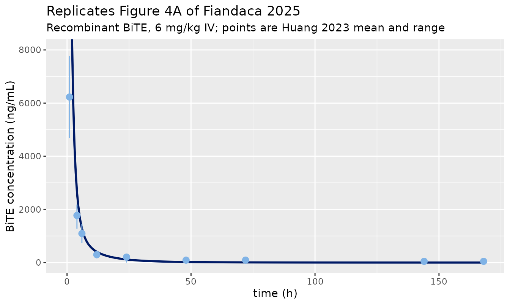
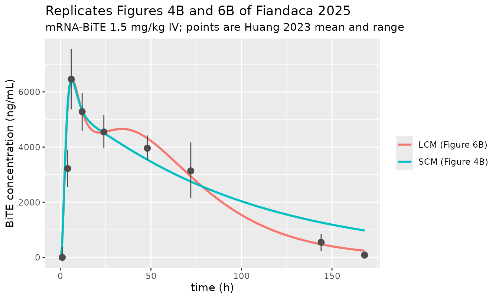
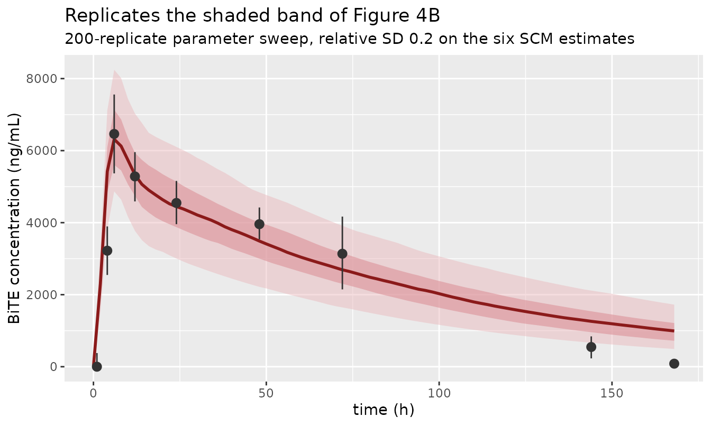
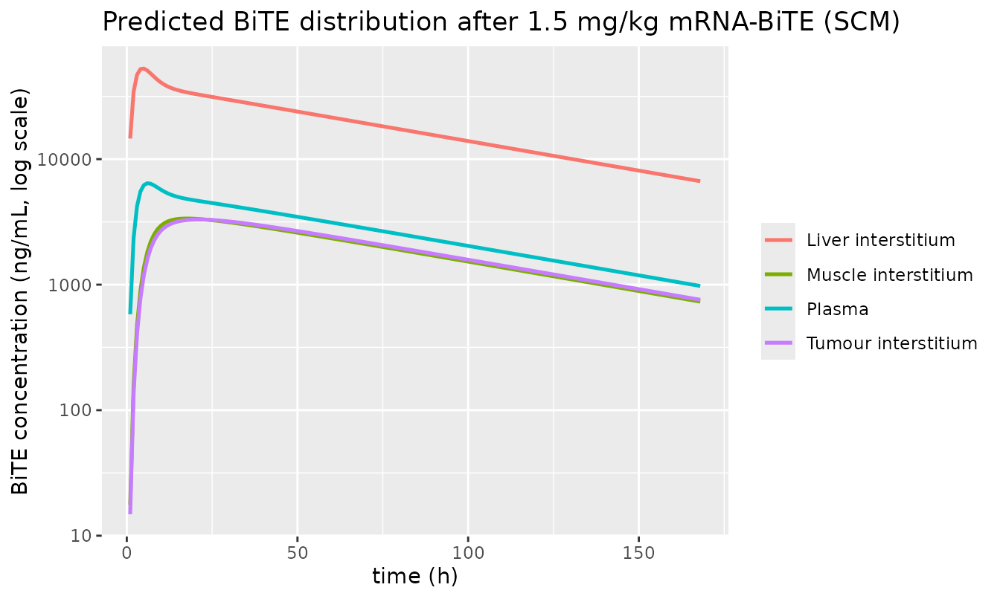

# mRNA-encoded BiTE multiscale PBPK (Fiandaca 2025)

## Model and source

- Citation: Fiandaca G, Campanile E, Leonardelli L, Pettina E,
  Giampiccolo S, Carstens EJ, Dasti L, Zangani N, Marchetti L. A
  multiscale physiologically based pharmacokinetic model to support
  mRNA-encoded BiTE therapy in cancer treatment. Mol Ther Nucleic Acids.
  2025;36(3):102606. <doi:10.1016/j.omtn.2025.102606>. MATLAB source
  deposited by the authors at
  <https://github.com/cosbi-research/PBPKmRNABiTE> (Data and code
  availability); every physiological constant and fitted estimate in
  this file is traced to that deposit and/or paper Table 1.
- Article: <https://doi.org/10.1016/j.omtn.2025.102606>
- Author source code (Data and code availability):
  <https://github.com/cosbi-research/PBPKmRNABiTE>

Fiandaca et al. couple two modules. The **protein-transport module
(PTM)** is the Li and Shah (2019) two-pore whole-body PBPK platform: 15
tissues plus a tumour, each split into vascular, endosomal and
interstitial sub-compartments, linked by plasma flow and a lymphatic
return. Because a BiTE carries no Fc sequence, the authors deliberately
drop FcRn recycling, so each tissue endosome is a pure degradation sink.
The **mRNA-transport module (MTM)** sits on top: mRNA dosed
intravenously in a liver-tropic ionizable lipid nanoparticle migrates to
the liver and passes through a short chain of intracellular states, each
translating BiTE directly into the hepatic interstitium.

The paper reports two variants of the MTM, and this package ships both:

``` r

scm <- readModelDb("Fiandaca_2025_mRNABiTE_scm")()
lcm <- readModelDb("Fiandaca_2025_mRNABiTE_lcm")()
c(SCM_states = length(scm$state), LCM_states = length(lcm$state))
#> SCM_states LCM_states 
#>         53         54
```

- **`Fiandaca_2025_mRNABiTE_scm`** – the short-chain model (SCM), two
  liver mRNA states, 53 ODEs (paper Equations 1-4, Figure 3).
- **`Fiandaca_2025_mRNABiTE_lcm`** – the long-chain model (LCM), three
  liver mRNA states, 54 ODEs (paper Equations 5-9, Figure 6A). The third
  state was added because the observed serum profile shows two peaks,
  i.e. three changes of slope.

Both files also serve the **recombinant** BiTE: dose `plasma` instead of
`mrna_plasma` and the mRNA states stay at zero, which is exactly the
authors’ separate `recombinant_model.m`.

### Units

Doses are in **ug** and all ODE states are **amounts in ug**;
sub-compartment volumes are in **L**, so every concentration formed in
`model()` is ug/L, i.e. **ng/mL** – the units Huang et al. report serum
BiTE in.
[`checkModelConventions()`](https://nlmixr2.github.io/nlmixr2lib/reference/checkModelConventions.md)
raises an informational note that the dosing and concentration
magnitudes differ; that is intended and no scaling term is needed.

Writing the mRNA chain in amounts rather than the deposit’s
concentrations makes the `V_BL^TOT / V_LV^IS` ratio of Equations 2 and 6
cancel exactly, so no volume term appears in the mRNA ODEs.

## Population

``` r

pop <- readModelDb("Fiandaca_2025_mRNABiTE_scm")()$population
str(pop, max.level = 1, give.attr = FALSE)
#> List of 9
#>  $ species      : chr "mouse (8-10 weeks old, immunodeficient, tumour-bearing)"
#>  $ n_subjects   : int NA
#>  $ n_studies    : int 1
#>  $ age_range    : chr "8-10 weeks"
#>  $ weight_range : chr "0.028 kg used for the physiological parameter set (deposit pars.BW); the dose calculation in the deposit simula"| __truncated__
#>  $ disease_state: chr "Subcutaneous tumour-bearing immunodeficient mice; a 0.472 mL tumour is carried as a 16th perfused tissue."
#>  $ dose_range   : chr "Single IV bolus. Recombinant BiTE 6 mg/kg (120 ug). mRNA-BiTE 1.5 mg/kg (30 ug) for training; 0.5, 1, 1.5 and 2"| __truncated__
#>  $ notes        : chr "Training and validation data are the published mouse serum BiTE profiles of Huang et al. 2023 (the B7H3 x CD3 B"| __truncated__
#>  $ scope_note   : chr "Deterministic mechanistic platform: no between-subject random effects and no residual-error magnitude are repor"| __truncated__
```

The model was calibrated to the mouse experiments of Huang et
al. (2023): 8-10 week old immunodeficient, tumour-bearing mice given a
single intravenous dose of either 6 mg/kg (120 ug) recombinant B7H3 x
CD3 BiTE or 1.5 mg/kg (30 ug) of the LNP-formulated mRNA encoding it.
Serum BiTE was measured at 1, 4, 6, 12, 24, 48, 72, 144 and 168 h. A
separate dose-escalation experiment gave 0.5, 1, 1.5 and 2 mg/kg
mRNA-BiTE with a single 24 h sample per animal; those data are the
validation set (paper Figures 5 and 6C).

Serum was treated as equivalent to plasma, which the authors justify on
the grounds that BiTEs do not bind clotting factors appreciably
(Materials and methods, “Data”).

The physiological parameter set is the 28 g mouse of Li and Shah (2019)
/ Shah and Betts (2012). Note that the deposit’s dose arithmetic uses a
0.02 kg mouse (`6 * 0.02` mg), which is what reproduces the absolute
doses Huang et al. report; the two body weights are used for different
purposes and are carried through unchanged.

## Source trace

Every `ini()` entry carries an in-file comment naming its origin. The
authors deposited their complete MATLAB source, so each value can be
traced to both the paper and an executable line.

| Quantity | Value (SCM / LCM) | Source |
|----|----|----|
| `lkbl2lv` mRNA blood-to-liver migration | 6.804e-1 / 1 | Table 1; `*_parameters_estimated.mat[2]` |
| `lks12` first-to-second mRNA state | 4.807e-1 / 1.03e-1 | Table 1; `.mat[6]` / `.mat[7]` |
| `lks23` second-to-third mRNA state | – / 2.44e-2 | Table 1; `.mat[8]` |
| `lkrna` mRNA clearance | 1.08e-2 / 2.94e-2 | Table 1; `.mat[3]` |
| `lktr_mrna1` translation, state 1 | 9.682e-1 / 6.816e-1 | Table 1; `.mat[4]` |
| `lktr_mrna2` translation, state 2 | 3.182e-1 / 1.01e-2 | Table 1; `.mat[5]` |
| `lktr_mrna3` translation, state 3 | – / 1.574 | Table 1; `.mat[6]` |
| `lclup` pinocytosis rate | 1e-1 / 1e-3 | Table 1; `.mat[1]` |
| `lfrac_mrna_other` non-liver mRNA fraction | 0.011 | Results, “Model training and validation”; `pars.ratio_in_other` |
| `lkdeg` endosomal degradation | 32.2 /h | `SCM_simulation.m` `K_deg`, cited to Li and Shah 2019 |
| `lclnlf` lymph-node flow scaling | 9.1 | `SCM_simulation.m` `C_LNLF`, cited to Shah and Betts 2012 |
| Organ volumes, plasma flows, tumour fractions | see `model()` | `SCM_parameters_collection_mouse.m` |
| 55 kDa two-pore constants (`a_e`, `theta`, `Pe_S`, `Pe_L`, `alpha_L`, `alpha_S`, `X_J`, `Xp`, pore areas) | see `model()` | `Parameters_collection_BiTEs_55kDa.m` (Li and Shah 2019 Table 4, 55 kDa row) |
| mRNA ODEs | Equations 1-3 (SCM) / 5-8 (LCM) | paper p.4, p.7 |
| Hepatic BiTE production | Equation 4 (SCM) / 9 (LCM) | paper p.4, p.7 |
| Tissue vascular / endosomal / interstitial / plasma / lymph ODEs | Equations 1-5, 7 of Li and Shah 2019 | deposit `SCM.m` `dydt(1:50)` |

Table 1 in the PDF prints the estimates in scientific notation; the
deposited `.mat` files carry the same values at full precision and are
used here, with the rounded published value recorded alongside in each
comment.

## Observed data

The digitised training and validation data are transcribed from the
deposit’s simulation drivers (`SCM_simulation.m`, `LCM_simulation.m`),
which is where the authors themselves store the Huang et al. (2023)
means and confidence limits.

``` r

t_obs <- c(1, 4, 6, 12, 24, 48, 72, 144, 168)

obs_recombinant <- tibble::tibble(
  time  = t_obs,
  mean  = c(6227.3, 1772.7, 1090.9, 295.5, 204.5, 90.9, 90.9, 45.5, 45.5),
  upper = c(7772.7, 2181.8, 1454.5, 409.1, 318.2, 204.5, 181.8, 136.4, 90.9),
  lower = c(4681.8, 1272.7, 727.3, 159.1, 0, 0, 0, 0, 0)
)

obs_mrna <- tibble::tibble(
  time  = t_obs,
  mean  = c(0, 3221.1, 6463.2, 5284.2, 4547.4, 3957.9, 3136.8, 547.4, 84.2),
  upper = c(378.9, 3894.7, 7557.9, 5957.9, 5157.9, 4421.1, 4168.4, 842.1, 84.2),
  lower = c(0, 2547.4, 5368.4, 4589.5, 3957.9, 3536.8, 2147.4, 231.6, 0)
)
```

## Simulation helpers

Observation rows point at `plasma`, a declared ODE state; `Cc` is
returned as an output column automatically.

``` r

DOSE_UG <- function(mg_per_kg) mg_per_kg * 0.02 * 1000   # 0.02 kg mouse, mg -> ug

sim_profile <- function(model, cmt, dose_ug, times = seq(0, 168, by = 0.5)) {
  ev <-
    rxode2::et(amt = dose_ug, cmt = cmt, time = 0) |>
    rxode2::et(time = sort(unique(c(0, times, t_obs))), cmt = "plasma")
  rxode2::rxSolve(model, ev, returnType = "data.frame", useLinCmt = FALSE,
                  atol = 1e-12, rtol = 1e-10) |>
    dplyr::filter(!is.na(Cc)) |>
    dplyr::select(time, Cc)
}
```

Note the `et(time = ..., cmt = ...)` form. Passing the observation grid
as a `data.frame` to `et()` instead silently yields a *different*,
shorter grid with no error and no warning, which would quietly break
every comparison below.

``` r

# Guard the grid explicitly rather than trusting it.
.chk <- sim_profile(scm, "mrna_plasma", 30)
stopifnot(all(t_obs %in% .chk$time))
```

## Replicating Figure 4A – recombinant BiTE training

Dosing `plasma` reduces either model to the pure protein-transport
module.

``` r

rec <- sim_profile(scm, "plasma", DOSE_UG(6))

ggplot(rec, aes(time, Cc)) +
  geom_line(colour = "#001a66", linewidth = 1) +
  geom_pointrange(data = obs_recombinant,
                  aes(time, mean, ymin = lower, ymax = upper),
                  colour = "#80b3e6", inherit.aes = FALSE) +
  coord_cartesian(ylim = c(0, 8000)) +
  labs(x = "time (h)", y = "BiTE concentration (ng/mL)",
       title = "Replicates Figure 4A of Fiandaca 2025",
       subtitle = "Recombinant BiTE, 6 mg/kg IV; points are Huang 2023 mean and range")
```



As in the published Figure 4A, the model curve leaves the top of the
axis: the whole 120 ug dose is placed in 0.944 mL of plasma, so `Cc(0)`
is about 127,072 ng/mL, and the profile falls steeply through the
observed points.

## Replicating Figure 4B and 6B – mRNA-encoded BiTE training

``` r

mrna_scm <- sim_profile(scm, "mrna_plasma", DOSE_UG(1.5))
mrna_lcm <- sim_profile(lcm, "mrna_plasma", DOSE_UG(1.5))

both <- dplyr::bind_rows(
  dplyr::mutate(mrna_scm, model = "SCM (Figure 4B)"),
  dplyr::mutate(mrna_lcm, model = "LCM (Figure 6B)")
)

ggplot(both, aes(time, Cc, colour = model)) +
  geom_line(linewidth = 1) +
  geom_pointrange(data = obs_mrna, aes(time, mean, ymin = lower, ymax = upper),
                  colour = "grey30", inherit.aes = FALSE) +
  labs(x = "time (h)", y = "BiTE concentration (ng/mL)", colour = NULL,
       title = "Replicates Figures 4B and 6B of Fiandaca 2025",
       subtitle = "mRNA-BiTE 1.5 mg/kg IV; points are Huang 2023 mean and range")
```



``` r

pick <- function(d) d$Cc[match(t_obs, d$time)]
train_tab <- tibble::tibble(
  `Time (h)` = t_obs,
  `Observed (ng/mL)` = obs_mrna$mean,
  `SCM` = round(pick(mrna_scm), 1),
  `LCM` = round(pick(mrna_lcm), 1)
)
knitr::kable(train_tab, caption = "mRNA-BiTE training profile, simulated vs observed")
```

| Time (h) | Observed (ng/mL) |    SCM |    LCM |
|---------:|-----------------:|-------:|-------:|
|        1 |              0.0 |  581.1 |  585.5 |
|        4 |           3221.1 | 5524.6 | 5453.2 |
|        6 |           6463.2 | 6426.8 | 6443.5 |
|       12 |           5284.2 | 5337.4 | 5295.0 |
|       24 |           4547.4 | 4511.6 | 4541.4 |
|       48 |           3957.9 | 3543.8 | 4318.2 |
|       72 |           3136.8 | 2749.8 | 2937.1 |
|      144 |            547.4 | 1265.7 |  474.9 |
|      168 |             84.2 |  976.1 |  241.6 |

mRNA-BiTE training profile, simulated vs observed {.table}

Both variants track the observed rise and the 6 h peak closely. The two
deficiencies the authors themselves report are reproduced exactly:

- The SCM “slightly overestimates antibody concentrations in the latter
  part of the observed time frame”, visible here as 976 ng/mL against an
  observed 84 ng/mL at 168 h.
- The LCM “exhibits improved performance in blood clearance”: at 144 h
  it gives 475 ng/mL against the SCM’s 1266 ng/mL, with 547 ng/mL
  observed.

``` r

stopifnot(
  # peak within 10% of the observed 6 h maximum, both variants
  abs(max(mrna_scm$Cc) - 6463.2) / 6463.2 < 0.10,
  abs(max(mrna_lcm$Cc) - 6463.2) / 6463.2 < 0.10,
  # the LCM must clear faster than the SCM late, which is why it was built
  pick(mrna_lcm)[8] < pick(mrna_scm)[8],
  pick(mrna_lcm)[9] < pick(mrna_scm)[9]
)
```

## Replicating Figures 5 and 6C – dose-escalation validation

The validation experiment sampled serum BiTE once, at 24 h, after 0.5,
1, 1.5 and 2 mg/kg of mRNA-BiTE.

``` r

doses <- c(0.5, 1, 1.5, 2)
esc <- lapply(doses, function(d) {
  tibble::tibble(
    dose_mg_kg = d,
    SCM = sim_profile(scm, "mrna_plasma", DOSE_UG(d), times = c(0, 24)) |>
      dplyr::filter(time == 24) |> dplyr::pull(Cc),
    LCM = sim_profile(lcm, "mrna_plasma", DOSE_UG(d), times = c(0, 24)) |>
      dplyr::filter(time == 24) |> dplyr::pull(Cc)
  )
}) |> dplyr::bind_rows()

knitr::kable(
  esc |> dplyr::mutate(dplyr::across(c(SCM, LCM), ~ round(.x, 1))) |>
    dplyr::rename("mRNA dose (mg/kg)" = dose_mg_kg,
                  "SCM C24 (ng/mL)" = SCM, "LCM C24 (ng/mL)" = LCM),
  caption = "Replicates Figure 5 (SCM) and Figure 6C (LCM): plasma BiTE 24 h after dosing"
)
```

| mRNA dose (mg/kg) | SCM C24 (ng/mL) | LCM C24 (ng/mL) |
|------------------:|----------------:|----------------:|
|               0.5 |          1503.9 |          1513.8 |
|               1.0 |          3007.8 |          3027.6 |
|               1.5 |          4511.6 |          4541.4 |
|               2.0 |          6015.5 |          6055.2 |

Replicates Figure 5 (SCM) and Figure 6C (LCM): plasma BiTE 24 h after
dosing {.table}

The 1.5 mg/kg arm is the training dose, where the observed mean was 4547
ng/mL; the SCM predicts 4512 and the LCM 4541 ng/mL.

Both modules are linear in dose, so the model makes an exact structural
prediction: the 24 h concentration must be strictly proportional to the
dose. This is a much stronger assertion than “within the experimental
variance”, and it is what the paper’s Discussion appeals to when it
notes that “protein expression follows a linear dose dependence”.

``` r

ratio_scm <- esc$SCM / esc$dose_mg_kg
ratio_lcm <- esc$LCM / esc$dose_mg_kg
stopifnot(
  max(abs(ratio_scm / ratio_scm[1] - 1)) < 1e-6,
  max(abs(ratio_lcm / ratio_lcm[1] - 1)) < 1e-6
)
round(c(SCM_ng_mL_per_mg_kg = ratio_scm[1], LCM_ng_mL_per_mg_kg = ratio_lcm[1]), 1)
#> SCM_ng_mL_per_mg_kg LCM_ng_mL_per_mg_kg 
#>              3007.8              3027.6
```

## Structural checks on the mRNA module

Two quantitative claims in the paper can be checked directly against the
packaged model rather than against a figure.

**Liver targeting.** The Results state that the non-liver fraction was
“set to 0.011 based on Huang et al. (2023), indicating that
approximately 99% of administered mRNA accumulates in the liver after 6
h”. In the model the fraction of the dose that ever reaches the liver is
`kbl2lv / (kbl2lv + krna) * (1 - frac_mrna_other)`, because mRNA in
blood is lost in parallel to liver uptake and degradation.

``` r

p_scm <- scm$theta
frac_to_liver <- function(th) {
  kbl2lv <- exp(th[["lkbl2lv"]]); krna <- exp(th[["lkrna"]])
  kbl2lv / (kbl2lv + krna) * (1 - exp(th[["lfrac_mrna_other"]]))
}
round(c(SCM = frac_to_liver(scm$theta), LCM = frac_to_liver(lcm$theta)), 4)
#>    SCM    LCM 
#> 0.9735 0.9608
```

The SCM delivers 97.4% of the dose to the liver and the LCM 96.1%,
against the paper’s “approximately 99%”. The shortfall is the parallel
blood-side degradation term `k_d` in Equation 1, which the 0.011 figure
from Huang et al. does not account for; `1 - frac_mrna_other` alone is
98.9%.

**Whole-body mRNA half-life.** The paper reports that the fitted
degradation rate implies “the corresponding average half-life for the
whole-body mRNA concentration resulted in around 45 h”. Total body mRNA
is the sum of the plasma and liver states; below is the time at which it
has fallen to half the dose.

``` r

total_mrna <- function(model, mrna_states, dose_ug = DOSE_UG(1.5)) {
  ev <- rxode2::et(amt = dose_ug, cmt = "mrna_plasma", time = 0) |>
    rxode2::et(time = seq(0, 400, by = 0.25), cmt = "plasma")
  s <- rxode2::rxSolve(model, ev, returnType = "data.frame", useLinCmt = FALSE,
                       atol = 1e-12, rtol = 1e-10)
  tibble::tibble(time = s$time, total = rowSums(s[, mrna_states, drop = FALSE]))
}
half_time <- function(d, dose_ug = DOSE_UG(1.5)) {
  stats::approx(x = d$total, y = d$time, xout = dose_ug / 2)$y
}
tm_scm <- total_mrna(scm, c("mrna_plasma", "mrna_liver1", "mrna_liver2"))
tm_lcm <- total_mrna(lcm, c("mrna_plasma", "mrna_liver1", "mrna_liver2", "mrna_liver3"))
round(c(SCM_t_half_h = half_time(tm_scm), LCM_t_half_h = half_time(tm_lcm),
        SCM_terminal_h = log(2) / exp(scm$theta[["lkrna"]]),
        LCM_terminal_h = log(2) / exp(lcm$theta[["lkrna"]])), 1)
#>   SCM_t_half_h   LCM_t_half_h SCM_terminal_h LCM_terminal_h 
#>           62.9           23.2           64.0           23.6
```

This claim does **not** reproduce. The packaged SCM takes about 63 h to
clear half the dosed mRNA, essentially its terminal `log(2) / k_d` of 64
h – the two agree because almost all the mRNA sits in the slow second
state within a couple of hours. There is no quantity in the SCM that is
close to 45 h.

The likeliest explanation is a factor-of-`log(2)` slip: `0.5 / k_d` is
46 h, which would round to the quoted “around 45 h”, whereas the
half-life is `log(2) / k_d`. Nothing downstream depends on it – the
sentence is a plausibility remark about the fitted `k_d` and no
parameter is derived from it – but the figure should not be relied on.
It is recorded in the deviations below.

``` r

stopifnot(
  # the whole-body half-time is the terminal one, to within a few percent
  abs(half_time(tm_scm) - log(2) / exp(scm$theta[["lkrna"]])) /
    (log(2) / exp(scm$theta[["lkrna"]])) < 0.05,
  # and it is nowhere near 45 h
  half_time(tm_scm) > 55
)
```

## PKNCA validation

Non-compartmental analysis of the simulated plasma profiles. The
mRNA-BiTE arm is an input-limited profile with a 6 h peak, so `tmax` and
`cmax` are the informative checks; the recombinant arm is a conventional
IV bolus.

``` r

nca_input <- dplyr::bind_rows(
  dplyr::mutate(sim_profile(scm, "plasma", DOSE_UG(6)),
                id = 1L, treatment = "Recombinant 6 mg/kg (SCM)"),
  dplyr::mutate(mrna_scm, id = 2L, treatment = "mRNA-BiTE 1.5 mg/kg (SCM)"),
  dplyr::mutate(mrna_lcm, id = 3L, treatment = "mRNA-BiTE 1.5 mg/kg (LCM)")
) |>
  dplyr::filter(!is.na(Cc))

dose_input <- tibble::tibble(
  id = 1:3,
  treatment = c("Recombinant 6 mg/kg (SCM)", "mRNA-BiTE 1.5 mg/kg (SCM)",
                "mRNA-BiTE 1.5 mg/kg (LCM)"),
  amt = c(DOSE_UG(6), DOSE_UG(1.5), DOSE_UG(1.5)),
  time = 0
)

conc_obj <- PKNCA::PKNCAconc(nca_input, Cc ~ time | id / treatment)
dose_obj <- PKNCA::PKNCAdose(dose_input, amt ~ time | id)
res <- PKNCA::pk.nca(PKNCA::PKNCAdata(conc_obj, dose_obj))

nca_tab <- as.data.frame(res) |>
  dplyr::filter(PPTESTCD %in% c("cmax", "tmax", "auclast", "half.life")) |>
  dplyr::select(treatment, PPTESTCD, PPORRES) |>
  tidyr::pivot_wider(names_from = PPTESTCD, values_from = PPORRES) |>
  dplyr::mutate(dplyr::across(where(is.numeric), ~ signif(.x, 4)))

knitr::kable(
  nca_tab |> dplyr::rename("Treatment" = treatment, "Cmax (ng/mL)" = cmax,
                           "Tmax (h)" = tmax, "AUClast (ng*h/mL)" = auclast,
                           "t1/2 (h)" = half.life),
  caption = "PKNCA summary of the simulated plasma profiles"
)
```

| Treatment                 | AUClast (ng\*h/mL) | Cmax (ng/mL) | Tmax (h) | t1/2 (h) |
|:--------------------------|-------------------:|-------------:|---------:|---------:|
| Recombinant 6 mg/kg (SCM) |              82750 |       127100 |      0.0 |    15.51 |
| mRNA-BiTE 1.5 mg/kg (SCM) |             115700 |         6427 |      6.0 |    64.88 |
| mRNA-BiTE 1.5 mg/kg (LCM) |             114200 |         6465 |      6.5 |    25.10 |

PKNCA summary of the simulated plasma profiles {.table}

``` r

tmax_mrna <- nca_tab$tmax[nca_tab$treatment == "mRNA-BiTE 1.5 mg/kg (SCM)"]
cmax_mrna <- nca_tab$cmax[nca_tab$treatment == "mRNA-BiTE 1.5 mg/kg (SCM)"]
stopifnot(
  # the mRNA route is input-limited: the observed peak is at 6 h
  tmax_mrna >= 4, tmax_mrna <= 12,
  abs(cmax_mrna - 6463.2) / 6463.2 < 0.10,
  # the recombinant IV bolus peaks at time zero
  nca_tab$tmax[nca_tab$treatment == "Recombinant 6 mg/kg (SCM)"] == 0
)
```

The observed Huang et al. peak is 6463 ng/mL at 6 h; the SCM’s simulated
`cmax` and `tmax` reproduce both.

## Parameter-uncertainty band (Figures 4B and 6B shading)

The shaded bands in the published Figures 4 and 6B are **not** a
random-effects model. Materials and methods, “Model implementation”,
describes a 1,000-subject virtual population in which the newly
introduced mRNA parameters and the pinocytosis rate were drawn from
normal distributions centred on the fitted value with a relative
standard deviation of 0.2. The package files carry no etas, so the sweep
is reproduced here explicitly, at 200 replicates to keep the vignette
fast.

``` r

set.seed(20250917)
n_rep <- 200
swept <- c("lkbl2lv", "lks12", "lkrna", "lktr_mrna1", "lktr_mrna2", "lclup")

vpop <- vapply(swept, function(nm) {
  mu <- exp(scm$theta[[nm]])
  pmax(stats::rnorm(n_rep, mean = mu, sd = 0.2 * abs(mu)), .Machine$double.eps)
}, numeric(n_rep))
colnames(vpop) <- swept
vpop_log <- as.data.frame(log(vpop))

ev_vp <- rxode2::et(amt = DOSE_UG(1.5), cmt = "mrna_plasma", time = 0) |>
  rxode2::et(time = seq(0, 168, by = 2), cmt = "plasma") |>
  rxode2::et(id = seq_len(n_rep))

sim_vp <- rxode2::rxSolve(scm, ev_vp, params = vpop_log,
                          returnType = "data.frame", useLinCmt = FALSE) |>
  dplyr::filter(!is.na(Cc))
#> Warning: multi-subject simulation without without 'omega'

# Two guards. First, rxSolve can silently drop subjects, so the replicate count
# is checked rather than assumed. Second, the spread below must come entirely
# from the swept thetas: the model declares no etas, so re-solving two identical
# parameter rows must give bit-identical profiles. If an omega ever leaked in
# from a previous call, this would fail.
stopifnot(dplyr::n_distinct(sim_vp$id) == n_rep)
.twin <- rxode2::rxSolve(
  scm,
  rxode2::et(amt = DOSE_UG(1.5), cmt = "mrna_plasma", time = 0) |>
    rxode2::et(time = seq(0, 48, by = 4), cmt = "plasma") |>
    rxode2::et(id = 1:2),
  params = vpop_log[c(1, 1), ], returnType = "data.frame", useLinCmt = FALSE
)
#> Warning: multi-subject simulation without without 'omega'
stopifnot(isTRUE(all.equal(.twin$Cc[.twin$id == 1], .twin$Cc[.twin$id == 2])))

band <- sim_vp |>
  dplyr::group_by(time) |>
  dplyr::summarise(
    p05 = stats::quantile(Cc, 0.05), p25 = stats::quantile(Cc, 0.25),
    p50 = stats::median(Cc),
    p75 = stats::quantile(Cc, 0.75), p95 = stats::quantile(Cc, 0.95),
    .groups = "drop"
  )

ggplot(band, aes(time)) +
  geom_ribbon(aes(ymin = p05, ymax = p95), fill = "#e8b4b8", alpha = 0.45) +
  geom_ribbon(aes(ymin = p25, ymax = p75), fill = "#d98b91", alpha = 0.55) +
  geom_line(aes(y = p50), colour = "#8b1a1a", linewidth = 1) +
  geom_pointrange(data = obs_mrna, aes(time, mean, ymin = lower, ymax = upper),
                  colour = "grey20", inherit.aes = FALSE) +
  labs(x = "time (h)", y = "BiTE concentration (ng/mL)",
       title = "Replicates the shaded band of Figure 4B",
       subtitle = "200-replicate parameter sweep, relative SD 0.2 on the six SCM estimates")
```



## Tissue distribution

One motivation for a whole-body model is predicting exposure the
experiment never measured. The liver interstitium is where translation
happens, so it carries by far the highest BiTE concentration.

``` r

# The observation grid starts at 1 h so the log-scale panel has no zero record;
# this is a plotting choice and is unrelated to the PKNCA input above.
ev_t <- rxode2::et(amt = DOSE_UG(1.5), cmt = "mrna_plasma", time = 0) |>
  rxode2::et(time = seq(1, 168, by = 1), cmt = "plasma")
sim_t <- rxode2::rxSolve(scm, ev_t, returnType = "data.frame", useLinCmt = FALSE)

tissue <- tibble::tibble(
  time = sim_t$time,
  `Plasma`             = sim_t$plasma / 0.00094435,
  `Liver interstitium` = sim_t$is_liver / 3.84595163e-04,
  `Tumour interstitium`= sim_t$is_tumor / (0.55 * 0.000472),
  `Muscle interstitium`= sim_t$is_muscle / 1.47147e-03
) |>
  tidyr::pivot_longer(-time, names_to = "space", values_to = "conc")

ggplot(tissue, aes(time, conc, colour = space)) +
  geom_line(linewidth = 0.9) +
  scale_y_log10() +
  labs(x = "time (h)", y = "BiTE concentration (ng/mL, log scale)", colour = NULL,
       title = "Predicted BiTE distribution after 1.5 mg/kg mRNA-BiTE (SCM)")
```



``` r

peak <- tissue |> dplyr::group_by(space) |> dplyr::summarise(peak = max(conc))
stopifnot(
  # translation occurs in the liver interstitium, so it must lead every other space
  peak$peak[peak$space == "Liver interstitium"] == max(peak$peak),
  # the paper's own caveat: tissue predictions are unvalidated, but must be finite
  all(is.finite(peak$peak))
)
knitr::kable(peak |> dplyr::arrange(dplyr::desc(peak)) |>
               dplyr::mutate(peak = signif(peak, 4)) |>
               dplyr::rename("Space" = space, "Peak concentration (ng/mL)" = peak))
```

| Space               | Peak concentration (ng/mL) |
|:--------------------|---------------------------:|
| Liver interstitium  |                      52690 |
| Plasma              |                       6427 |
| Muscle interstitium |                       3363 |
| Tumour interstitium |                       3300 |

As the authors note in the Discussion, these tissue predictions are a
*capability* of the platform, not a validated output: the only
quantitative data available are plasma profiles, so “additional
concentration-time profile data specific for each organ … is needed in
order to validate this prediction.”

## Assumptions and deviations

The authors deposited their complete MATLAB source, so almost nothing
had to be assumed. Three discrepancies between the printed paper and
that deposit were found and are resolved as follows; all three are
recorded as a comment block at the top of `model()` in both files.

1.  **Two-pore convective coefficients.**
    `Parameters_collection_BiTEs_55kDa.m` defines the osmotic reflection
    coefficients `sigma_S = 0.906` and `sigma_L = 0.0877` and then never
    references them: the convective terms of the two-pore clearance use
    `(1 - alpha_L)` and `(1 - alpha_S)`, the *fractional hydraulic
    conductances*, where two-pore theory calls for `(1 - sigma_L)` and
    `(1 - sigma_S)`. Because Table 1 was fitted with the deposit’s form
    and the published figures were generated from it, that form is
    reproduced here. Substituting the reflection coefficients changes
    the plasma profile by at most 0.2%, so the choice is immaterial to
    every result in the paper. The paper does not print these equations,
    deferring to Li and Shah (2019), which is not on disk; the deposit
    is therefore the operative definition.

2.  **Large-intestine transcapillary terms.** All three of the deposit’s
    ODE files drive the large-intestine two-pore clearance off
    `C_V_HEART` instead of `C_V_LG_INT` – a copy-paste slip. The paper’s
    Equations 3 and 5 are written per organ, so `cv_lr` is used here.
    The difference on the plasma profile is below 0.03%.

3.  **Printed Equations 7 and 8.** As typeset, Equation 7 reads
    `d mRNA_LV2/dt = k_s12 mRNA_LV1 - k_s23 mRNA_LV1 - k_d mRNA_LV2` and
    Equation 8 reads `d mRNA_LV3/dt = k_s23 mRNA_LV2 - k_d mRNA_LV2`.
    Both subscripts are wrong: as printed, the transfer out of state 2
    would not depend on state 2, and state 3 would never clear. Mass
    balance and the deposit (`LCM.m` lines 279-280) both give
    `- k_s23 mRNA_LV2` and `- k_d mRNA_LV3`, which is what is
    implemented.

Further notes:

- **`CL_up` differs 100-fold between the two variants.** The Table 1
  footnote states that `CL_up` “has been estimated using the PK data of
  the recombinant version of the product”, which is the same dataset for
  both variants, yet the table reports 1e-1 for the SCM and 1e-3 for the
  LCM. The deposited `LCM_parameters_estimated.mat` confirms 9.9996e-4,
  so the values are reproduced as published. In practice this means the
  LCM’s protein-transport module is not interchangeable with the SCM’s:
  dosing `plasma` in the LCM file does **not** reproduce Figure 4A. Use
  `Fiandaca_2025_mRNABiTE_scm` for the recombinant arm.
- **Tumour lymph is not returned to the lymph node.** The deposit’s
  lymph-node equation sums the 15 anatomical tissues but omits the
  tumour’s interstitial lymph flow, a small mass-balance leak.
  Reproduced as written.
- **No random effects and no residual error.** Neither the paper nor the
  deposit reports a between-subject variance or a residual-error
  magnitude; the model is fitted by least squares on relative deviations
  and simulated deterministically. `propSd` is therefore carried as
  `fixed(0)` and the published uncertainty bands are reproduced above as
  an explicit parameter sweep, which is what Materials and methods
  describes.
- **Body weight.** The physiological parameter set is a 0.028 kg mouse
  while the deposit’s dose arithmetic uses 0.02 kg. Both are carried
  through unchanged because the 0.02 kg figure is what reproduces the
  absolute doses (120 ug and 30 ug) that Huang et al. report.
- **Local, not global, identifiability.** The authors’ GenSSI analysis
  established only local structural identifiability, and they “refrain
  from discussing the estimated values of rates”. The individual
  mRNA-state rates should be read as a phenomenological delay
  description, not as measured biology; that is why the liver mRNA chain
  is declared through `paper_specific_compartments` rather than mapped
  onto canonical compartment roles.
- **Upstream platform.** Li and Shah (2019) is not on disk. It was not
  needed: the authors’ deposit supplies every physiological constant,
  every size-dependent two-pore constant and every equation in
  executable form, and each is traced to the deposit line in the model
  files.
