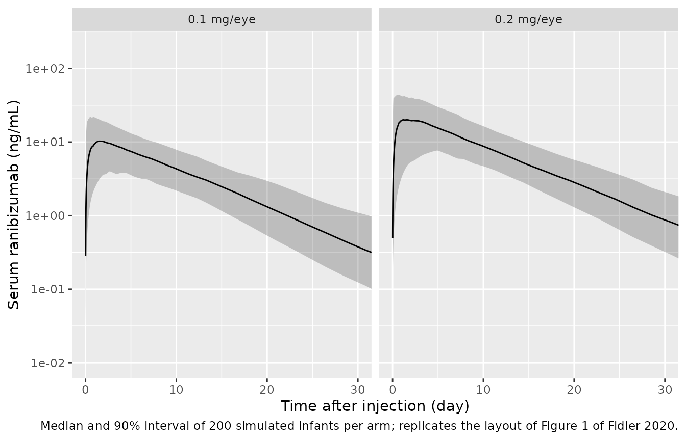

# Ranibizumab in preterm infants (Fidler 2020)

## Model and source

- Citation: Fidler M, Fleck BW, Stahl A, Marlow N, Chastain JE, Li J,
  Lepore D, Reynolds JD, Chiang MF, Fielder AR; RAINBOW study group.
  Ranibizumab population pharmacokinetics and free VEGF pharmacodynamics
  in preterm infants with retinopathy of prematurity in the RAINBOW
  trial. Transl Vis Sci Technol. 2020;9(8):43. <doi:10.1167/tvst.9.8.43>
- Description: One-compartment population PK model with first-order
  absorption for serum ranibizumab after bilateral intravitreal
  injection in preterm infants with retinopathy of prematurity (RAINBOW
  trial; Fidler et al. 2020, TVST). The vitreous acts as a first-order
  depot (Ka = ocular elimination rate, flip-flop kinetics) into a
  systemic central compartment. Typical values are expressed for a 70-kg
  adult and scaled to the infant by body weight (fixed allometric
  exponent 0.75 on CL/F, linear on V/F); CL/F also carries a fixed
  creatinine-clearance adjustment evaluated at the study-median infant
  CrCl (54.82 mL/min, modified Schwartz) relative to the adult median
  (65.22 mL/min) with the adult exponent 0.266. Correlated log-normal
  IIV on CL/F, V/F and Ka; log-normal residual error.
- Article: [Transl Vis Sci Technol
  2020;9(8):43](https://doi.org/10.1167/tvst.9.8.43)

The paper also examined plasma free VEGF as a pharmacodynamic marker.
Free VEGF did not differ between the laser and ranibizumab arms or over
time, and individual predicted ranibizumab concentrations showed no
relationship with observed free VEGF (Results, Figure 2, Supplementary
Figure S6), so no PD model was developed and only the PK model is
provided here.

## Population

RAINBOW randomised 225 preterm infants with retinopathy of prematurity
(ROP) 1:1:1 to a single bilateral intravitreal injection of ranibizumab
0.1 mg or 0.2 mg per eye, or to laser therapy, in 26 countries. Sparse
serum samples were drawn in odd-numbered ranibizumab-treated infants at
day 1, day 15 (days 7-21) and day 29 (days 22-28); 95 infants (45 at 0.1
mg, 50 at 0.2 mg) contributed serum concentrations (Table 1). Across the
two ranibizumab arms (Table 1), mean gestational age at birth was
25.8-26.5 weeks, mean birth weight 791-886 g, mean postnatal age at
treatment about 11 weeks and median weight at treatment 1.7-1.8 kg
(range 0.8-3.9 kg); 46% were female, 59% Caucasian and 32% Asian.

    #> List of 11
    #>  $ species       : chr "human"
    #>  $ n_subjects    : int 95
    #>  $ n_studies     : int 1
    #>  $ age_range     : chr "Preterm infants; postnatal age at baseline mean 10.8-11.1 weeks (SD 3.9-4.5) by arm; gestational age at birth m"| __truncated__
    #>  $ weight_range  : chr "0.8-4.2 kg at baseline (median 1.7-1.8 kg by arm)"
    #>  $ sex_female_pct: num 46.3
    #>  $ race_ethnicity: Named num [1:4] 59.1 31.5 2.7 6.7
    #>   ..- attr(*, "names")= chr [1:4] "Caucasian" "Asian" "Black" "Other"
    #>  $ disease_state : chr "Retinopathy of prematurity (ROP) requiring treatment"
    #>  $ dose_range    : chr "Single bilateral intravitreal injection of ranibizumab 0.1 mg or 0.2 mg per eye (0.2 or 0.4 mg total per infant"| __truncated__
    #>  $ regions       : chr "26 countries; investigator sites (Supplementary Table S3) in the USA, Mexico, Japan, Taiwan, India, Malaysia, S"| __truncated__
    #>  $ notes         : chr "RAINBOW trial. PK sampling in odd-numbered ranibizumab-treated infants at day 1, day 15 (7-21) and day 29 (22-2"| __truncated__

## Source trace

| Equation / parameter | Value | Source location |
|----|----|----|
| `lcl` (CL/F, 70-kg adult) | log(28.48) L/day | Table 2 |
| `lvc` (V/F, 70-kg adult) | log(27.58) L | Table 2 |
| `lka` (Ka) | log(0.12) 1/day | Table 2 |
| `e_wt_cl` | fixed 0.75 | Supplementary Appendix, CL equation `(w/70)^(3/4)` |
| `e_wt_vc` | fixed 1 | Supplementary Appendix, V equation `(w/70)` |
| `e_crcl_cl` | fixed 0.266 | Supplementary Appendix, “thetaCRCL = 0.266” (adult value) |
| Infant CrCl 54.82 mL/min, adult CrCl 65.22 mL/min | constants | Supplementary Appendix (MCRCL, MCRCLa) |
| `etalcl` variance | log(1 + 0.3492^2) = 0.11506 | Table 2, BSV 34.92% CV |
| `etalvc` variance | log(1 + 2.9056^2) = 2.24522 | Table 2, BSV 290.56% CV |
| `etalka` variance | log(1 + 0.1628^2) = 0.026159 | Table 2, BSV 16.28% CV |
| cov(CL, V) | 0.491 x sqrt(0.11506 x 2.24522) = 0.24956 | Supplementary Table S1, step 3 correlation 0.491 |
| cov(V, Ka) | -0.55 x sqrt(2.24522 x 0.026159) = -0.13329 | Supplementary Table S1, step 5 correlation -0.55 |
| cov(CL, Ka) | 0 | Supplementary Table S1 step 6 not selected; Appendix “with the exception of … omegaKa and omegaCl” |
| `expSd` | 0.60 | Table 2, “Lognormal SD” |
| One compartment, first-order absorption from the eye | structure | Final Model: Description |
| `Cc ~ lnorm(expSd)` | log-normal residual | Base Model; Final Model: Description |

## Virtual cohort and simulation

Weight at treatment is drawn log-normally around the reported median of
1.8 kg and restricted to the reported range 0.8-4.2 kg by redrawing (not
clamping) out-of-range values. The dose is the total amount injected
into both eyes (0.2 mg for the 0.1 mg/eye arm, 0.4 mg for the 0.2 mg/eye
arm); the single `vitreous` compartment pools both eyes.

``` r

rxode2::rxSetSeed(20200729)
n_per_arm <- 200
draw_wt <- function(n) {
  wt <- numeric(0)
  while (length(wt) < n) {
    x <- exp(rnorm(n, log(1.8), 0.35))
    wt <- c(wt, x[x >= 0.8 & x <= 4.2])
  }
  wt[seq_len(n)]
}

arms <- data.frame(
  treatment = c("0.1 mg/eye", "0.2 mg/eye"),
  amt = c(0.2, 0.4)
)
cohort <- arms[rep(1:2, each = n_per_arm), ]
cohort$id <- seq_len(nrow(cohort))
cohort$WT <- draw_wt(nrow(cohort))

obs_times <- sort(unique(c(0, 10^seq(-2, log10(90), length.out = 120))))

dose_rows <- cohort |>
  mutate(time = 0, evid = 1, cmt = "vitreous")
obs_rows <- cohort |>
  select(id, treatment, WT) |>
  tidyr::crossing(time = obs_times) |>
  mutate(amt = 0, evid = 0, cmt = "central")
events <- bind_rows(dose_rows, obs_rows) |>
  arrange(id, time, desc(evid)) |>
  as.data.frame()

mod <- readModelDb("Fidler_2020_ranibizumab")
sim <- rxode2::rxSolve(mod, events, keep = c("treatment", "WT"),
                       returnType = "data.frame")
#> ℹ parameter labels from comments will be replaced by 'label()'
```

## Typical-value check against the closed form

For a typical 1.8 kg infant the model solution must equal the analytic
one-compartment first-order-absorption profile, and the Supplementary
Appendix secondary-parameter equations give Tmax, Cmax and AUCinf
directly. Both sides use the same parameters, so the tolerance is
numerical only.

``` r

mod_typ <- rxode2::zeroRe(mod)
#> ℹ parameter labels from comments will be replaced by 'label()'
ev_typ <- rxode2::et(amt = 0.4, cmt = "vitreous") |>
  rxode2::et(obs_times, cmt = "central")
typ <- rxode2::rxSolve(mod_typ, ev_typ, params = c(WT = 1.8),
                       returnType = "data.frame")
#> ℹ omega/sigma items treated as zero: 'etalka', 'etalvc', 'etalcl'

cl_typ <- 28.48 * (1.8 / 70)^0.75 * (54.82 / 65.22)^0.266
v_typ <- 27.58 * (1.8 / 70)
ka_typ <- 0.12
kel_typ <- cl_typ / v_typ
closed <- function(t, dose) {
  dose * ka_typ / (v_typ * (ka_typ - kel_typ)) *
    (exp(-kel_typ * t) - exp(-ka_typ * t)) * 1000
}
stopifnot(max(abs(typ$Cc - closed(typ$time, 0.4))) < 1e-3 * max(typ$Cc))

tmax_typ <- log(ka_typ / kel_typ) / (ka_typ - kel_typ)
data.frame(
  quantity = c("CL/F (L/day)", "V/F (L)", "Ka half-life (day)",
               "Kel half-life (day)", "Tmax (day)",
               "Cmax 0.4 mg (ng/mL)", "AUCinf 0.4 mg (ng*day/mL)"),
  typical_1.8kg = c(cl_typ, v_typ, log(2) / ka_typ, log(2) / kel_typ,
                    tmax_typ, max(closed(seq(0, 10, by = 0.001), 0.4)),
                    0.4 / cl_typ * 1000),
  Table3_median_0.2mg_arm = c(1.7, 0.7, 5.6, 0.3, 1.3, 24.3, 232.0)
) |>
  knitr::kable(digits = 2,
               caption = "Typical 1.8 kg infant versus the Table 3 post hoc medians (0.2 mg/eye arm).")
```

| quantity                   | typical_1.8kg | Table3_median_0.2mg_arm |
|:---------------------------|--------------:|------------------------:|
| CL/F (L/day)               |          1.75 |                     1.7 |
| V/F (L)                    |          0.71 |                     0.7 |
| Ka half-life (day)         |          5.78 |                     5.6 |
| Kel half-life (day)        |          0.28 |                     0.3 |
| Tmax (day)                 |          1.29 |                     1.3 |
| Cmax 0.4 mg (ng/mL)        |         23.55 |                    24.3 |
| AUCinf 0.4 mg (ng\*day/mL) |        229.06 |                   232.0 |

Typical 1.8 kg infant versus the Table 3 post hoc medians (0.2 mg/eye
arm). {.table}

The typical infant reproduces every Table 3 median: the ocular
(absorption) half-life of about 5.6-5.8 days is the apparent serum
half-life (flip-flop), and serum elimination proper has a half-life of
about 0.3 days.

## Replicate Figure 1 (simulated prediction interval)

``` r

sim |>
  filter(time > 0) |>
  group_by(treatment, time) |>
  summarise(med = median(Cc), lo = quantile(Cc, 0.05),
            hi = quantile(Cc, 0.95), .groups = "drop") |>
  ggplot(aes(time, med)) +
  geom_ribbon(aes(ymin = lo, ymax = hi), alpha = 0.25) +
  geom_line() +
  facet_wrap(~treatment) +
  scale_y_log10() +
  coord_cartesian(xlim = c(0, 30), ylim = c(0.01, 200)) +
  labs(x = "Time after injection (day)", y = "Serum ranibizumab (ng/mL)",
       caption = "Median and 90% interval of 200 simulated infants per arm; replicates the layout of Figure 1 of Fidler 2020.")
```



## PKNCA validation

``` r

conc_df <- sim |>
  filter(!is.na(Cc)) |>
  select(id, time, Cc, treatment)
dose_df <- events |>
  filter(evid == 1) |>
  select(id, time, amt, treatment)

conc_obj <- PKNCA::PKNCAconc(conc_df, Cc ~ time | treatment + id,
                             concu = "ng/mL", timeu = "day")
#> Warning in assert_conc(conc, any_missing_conc = any_missing_conc): Negative
#> concentrations found
dose_obj <- PKNCA::PKNCAdose(dose_df, amt ~ time | treatment + id,
                             doseu = "mg")
intervals <- data.frame(start = 0, end = Inf, cmax = TRUE, tmax = TRUE,
                        aucinf.obs = TRUE)
nca_res <- PKNCA::pk.nca(PKNCA::PKNCAdata(conc_obj, dose_obj,
                                          intervals = intervals))
#> Warning in assert_conc(conc = conc): Negative concentrations found
#> Warning in assert_conc(conc = conc): Negative concentrations found
#> Warning in assert_conc(conc = conc): Negative concentrations found
#> Warning in assert_conc(conc = conc): Negative concentrations found
#> Warning in assert_conc(conc = conc): Negative concentrations found
#> Warning in assert_conc(conc = conc): Negative concentrations found
#> Warning in log(data$conc): NaNs produced
#> Warning in assert_conc(conc, any_missing_conc = any_missing_conc): Negative
#> concentrations found
#> Warning in log(conc.2/conc.1): NaNs produced
nca_df <- as.data.frame(nca_res)

sim_med <- nca_df |>
  filter(PPTESTCD %in% c("cmax", "tmax", "aucinf.obs")) |>
  group_by(treatment, PPTESTCD) |>
  summarise(PPORRES = median(PPORRES, na.rm = TRUE), .groups = "drop")
```

### Comparison against Fidler 2020 Table 3 (post hoc medians)

``` r

published <- data.frame(
  treatment = c("0.1 mg/eye", "0.2 mg/eye"),
  cmax = c(11.5, 24.3),
  tmax = c(1.3, 1.3),
  aucinf.obs = c(113.6, 232.0)
)
cmp <- nlmixr2lib::ncaComparisonTable(
  simulated = sim_med,
  reference = published,
  by = "treatment",
  units = c(cmax = "ng/mL", tmax = "day", aucinf.obs = "day*ng/mL"),
  tolerance_pct = 20
)
knitr::kable(cmp, caption = "Simulated median NCA vs. Fidler 2020 Table 3 medians. * differs by >20%.")
```

| NCA parameter             | treatment  | Reference | Simulated | % diff |
|:--------------------------|:-----------|:----------|:----------|:-------|
| Cmax (ng/mL)              | 0.1 mg/eye | 11.5      | 11        | -4.2%  |
| Cmax (ng/mL)              | 0.2 mg/eye | 24.3      | 21        | -13.8% |
| Tmax (day)                | 0.1 mg/eye | 1.3       | 1.34      | +3.0%  |
| Tmax (day)                | 0.2 mg/eye | 1.3       | 1.56      | +20.0% |
| AUC0-∞ (obs) (day\*ng/mL) | 0.1 mg/eye | 114       | 109       | -4.5%  |
| AUC0-∞ (obs) (day\*ng/mL) | 0.2 mg/eye | 232       | 227       | -2.3%  |

Simulated median NCA vs. Fidler 2020 Table 3 medians. \* differs by
\>20%. {.table}

``` r

# Structural gates on the cohort centre. A mis-scaled dose (per eye vs both
# eyes), a wrong allometric reference or a unit slip moves these medians by
# 50-100%, far outside the 20% envelope.
med <- tidyr::pivot_wider(sim_med, names_from = PPTESTCD, values_from = PPORRES) |>
  left_join(published, by = "treatment", suffix = c("_sim", "_pub"))
stopifnot(
  all(abs(med$aucinf.obs_sim / med$aucinf.obs_pub - 1) < 0.2),
  all(abs(med$cmax_sim / med$cmax_pub - 1) < 0.25)
)

# Mass balance with each subject's own clearance: AUCinf * CL/F == dose.
indiv <- sim |>
  group_by(id) |>
  summarise(cl = first(cl), .groups = "drop")
mb <- nca_df |>
  filter(PPTESTCD == "aucinf.obs") |>
  inner_join(indiv, by = "id") |>
  inner_join(dose_df, by = c("id", "treatment")) |>
  mutate(ratio = PPORRES * cl / (amt * 1000))
stopifnot(abs(median(mb$ratio, na.rm = TRUE) - 1) < 0.02)
```

Cmax and AUCinf are dose proportional across the arms, as reported, and
the cohort medians match the Table 3 post hoc medians. Simulated median
Tmax is somewhat later than the Table 3 median: infants drawn with a
large V/F (the V/F variability is 290% CV) have a slower serum
elimination and so a later peak, whereas the Table 3 values are post hoc
estimates from sparse data and are shrunk towards the typical value
(typical Tmax 1.29 days).

## Assumptions and deviations

- **Creatinine-clearance term is a constant.** The paper evaluates the
  adult creatinine-clearance effect at the study-median infant CrCl
  (54.82 mL/min, modified Schwartz) for every infant, because
  site-measured serum creatinine was unreliable (23.3% of values below
  0.01 mg/dL). The model therefore has no CrCl covariate; the factor
  (54.82/65.22)^0.266 = 0.955 multiplies CL/F for everyone.
- **Final-model IIV correlations.** Table 2 reports only the variances.
  The two retained covariances are taken from the correlations printed
  in Supplementary Table S1 when each was added: 0.491 for CL/F-V/F
  (step 3) and -0.55 for Ka-V/F (step 5, the final model). The step-3
  value may have shifted slightly in the later steps; this affects only
  the joint spread of the simulated parameters.
- **Ka rounding.** Table 2 prints Ka as 0.12 1/day (95% CI 0.12-0.13),
  giving a typical ocular half-life of 5.8 days versus the 5.6-day post
  hoc median in Table 3; the printed value is used unchanged.
- **Adult starting values in the Supplementary Appendix.** The appendix
  quotes CLa = 23.8 L/day and Va = 2.97 L from the prior adult model;
  the re-estimated Table 2 values (28.48 L/day, 27.58 L) are the final
  estimates and reproduce the Table 3 infant medians, so they are used.
- **Bilateral dosing.** The total dose to both eyes enters one pooled
  vitreous compartment. The Supplementary Appendix Cmax/AUCinf equations
  with the total dose reproduce the Table 3 medians, confirming this
  reading.
- **Weight distribution.** Only the median and range are published; a
  log-normal with SD 0.35 on the log scale truncated to 0.8-4.2 kg is
  assumed.
- **Table 3 medians are post hoc estimates** from sparse data and are
  shrunk towards the typical value, so their spread (not shown) is
  narrower than a fully stochastic simulation; only medians are
  compared.
