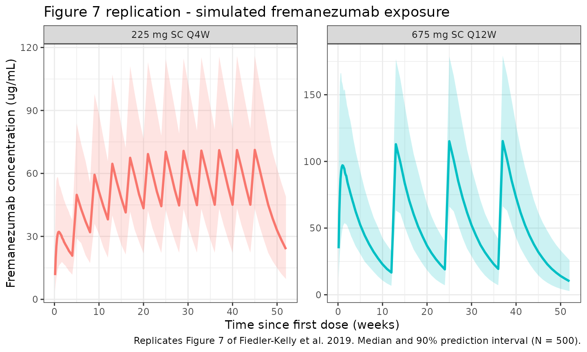
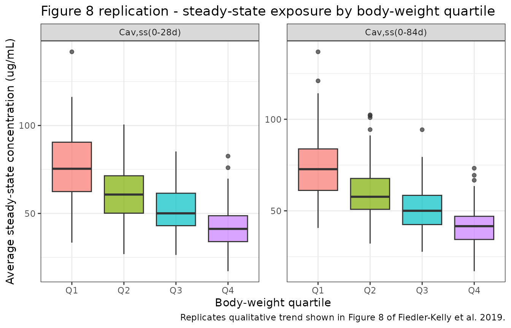

# Fiedler-Kelly_2019_fremanezumab

``` r
library(nlmixr2lib)
library(rxode2)
#> rxode2 5.0.2 using 2 threads (see ?getRxThreads)
#>   no cache: create with `rxCreateCache()`
library(dplyr)
#> 
#> Attaching package: 'dplyr'
#> The following objects are masked from 'package:stats':
#> 
#>     filter, lag
#> The following objects are masked from 'package:base':
#> 
#>     intersect, setdiff, setequal, union
library(tidyr)
library(ggplot2)
library(PKNCA)
#> 
#> Attaching package: 'PKNCA'
#> The following object is masked from 'package:stats':
#> 
#>     filter
```

## Fremanezumab population PK simulation

Simulate fremanezumab concentration-time profiles using the final
population PK model from Fiedler-Kelly et al. (2019). Fremanezumab is a
fully humanized IgG2 delta-a/kappa monoclonal antibody that binds CGRP
and is approved for the preventive treatment of migraine. The model was
fitted to 13,745 concentrations from 2,546 subjects (74 healthy adults
and 2,474 patients with episodic or chronic migraine) pooled across
seven phase 1 / 2b / 3 studies with IV and SC administration.

The structural model is a 2-compartment disposition with first-order SC
absorption, an absorption lag time, and first-order elimination. Weight
was the only covariate retained in the final model, entering as an
allometric power on clearance (exponent 1.05) and on central volume of
distribution (exponent 1.53) with a 71 kg reference. All other intrinsic
and extrinsic factors examined (age, sex, race, albumin, renal and
hepatic function, ADA status, injection site, acute / analgesic /
preventive medication use, patient vs. healthy subject status) were not
statistically significant and are absent from the packaged model.

Article: [Br J Clin Pharmacol
85(12):2721-2733](https://doi.org/10.1111/bcp.14096)

### Population

From Fiedler-Kelly 2019 (Section 3.1 and Supporting Table S1): 2,546
subjects contributed 13,745 concentrations. The analysis population was
primarily Caucasian (79.9%) and female (86.1%), with median (range) age
43 (18-71) years and median (range) body weight 70.8 (43.5-131.8) kg.
The presence of anti-drug antibodies was confirmed in only 0.7% of
samples and was not a significant covariate.

The same information is available programmatically via
`readModelDb("Fiedler-Kelly_2019_fremanezumab")$population` (note:
[`readModelDb()`](https://nlmixr2.github.io/nlmixr2lib/reference/readModelDb.md)
returns the parsed model function, so this field is accessed as an
attribute of the function body rather than a live list).

### Source trace

| Element                           | Source location                           | Value / form                                     |
|-----------------------------------|-------------------------------------------|--------------------------------------------------|
| Structural model                  | Fiedler-Kelly 2019 Section 3.2            | 2-compartment, first-order SC absorption + lag   |
| CL (71 kg subject)                | Fiedler-Kelly 2019 Table 2                | 0.0902 L/day                                     |
| Allometric exponent on CL         | Fiedler-Kelly 2019 Table 2, footnote c    | 1.05; TVCL = 0.0902 \* (WT/71)^1.05              |
| Vc (SC, 71 kg subject)            | Fiedler-Kelly 2019 Table 2                | 1.88 L                                           |
| Allometric exponent on Vc         | Fiedler-Kelly 2019 Table 2, footnotes d,e | 1.53; TVVc = 1.88 \* (WT/71)^1.53                |
| ka                                | Fiedler-Kelly 2019 Table 2                | 0.180 /day                                       |
| Q (FIXED)                         | Fiedler-Kelly 2019 Table 2                | 0.262 L/day                                      |
| Vp (FIXED)                        | Fiedler-Kelly 2019 Table 2                | 1.72 L                                           |
| F (SC, FIXED)                     | Fiedler-Kelly 2019 Table 2                | 0.658                                            |
| Tlag (SC, FIXED)                  | Fiedler-Kelly 2019 Table 2                | 0.0803 day                                       |
| IIV on CL                         | Fiedler-Kelly 2019 Table 2                | 23.4% CV (omega^2 = log(CV^2 + 1) = 0.0534)      |
| IIV on Vc                         | Fiedler-Kelly 2019 Table 2                | 35.1% CV (omega^2 = 0.1162)                      |
| IIV on ka                         | Fiedler-Kelly 2019 Table 2                | 59.0% CV (omega^2 = 0.2986)                      |
| Off-diagonal omega                | Fiedler-Kelly 2019 Section 3.2            | None estimated (diagonal matrix)                 |
| SC residual error                 | Fiedler-Kelly 2019 Table 2, footnote g    | Proportional var 0.0531 + additive var 0.204     |
| IV residual error (not used here) | Fiedler-Kelly 2019 Table 2                | Proportional var 0.0467                          |
| Dose regimens                     | Fiedler-Kelly 2019 Table 1                | 225 mg SC Q4W, 675 mg SC Q12W, loading 675 mg SC |

### Virtual cohort

Simulate a 500-subject virtual cohort whose weight distribution matches
Section 3.1 of Fiedler-Kelly 2019 (median 70.8 kg, range 43.5-131.8 kg).
The paper did not publish an individual-level weight distribution, so we
use a log-normal approximation bounded to the reported range.

``` r
set.seed(2019)
n_subj <- 500

pop <- tibble(
  ID = seq_len(n_subj),
  WT = pmin(pmax(rlnorm(n_subj, meanlog = log(70.8), sdlog = 0.22), 43.5), 131.8)
)
```

### Dosing and event table

Replicate the two phase 3 therapeutic regimens reported in Fiedler-Kelly
2019 Section 3.4: 225 mg SC once monthly for 12 doses, and 675 mg SC
once quarterly for 4 doses. Simulate over 12 months with daily sampling
through the first cycle and weekly samples thereafter.

``` r
obs_times <- sort(unique(c(
  seq(0, 28, by = 1),
  seq(28, 364, by = 7)
)))

build_events <- function(pop, dose_mg, dose_times, regimen_label) {
  dose_rows <- pop %>%
    crossing(time = dose_times) %>%
    mutate(amt = dose_mg, evid = 1, cmt = "depot", dv = NA_real_)
  obs_rows <- pop %>%
    crossing(time = obs_times) %>%
    mutate(amt = NA_real_, evid = 0, cmt = NA_character_, dv = NA_real_)
  bind_rows(dose_rows, obs_rows) %>%
    mutate(treatment = regimen_label) %>%
    arrange(ID, time, desc(evid))
}

events_monthly <- build_events(pop,
  dose_mg       = 225,
  dose_times    = seq(0, by = 28, length.out = 12),
  regimen_label = "225 mg SC Q4W")

events_quarterly <- build_events(pop,
  dose_mg       = 675,
  dose_times    = seq(0, by = 84, length.out = 4),
  regimen_label = "675 mg SC Q12W")

events_all <- bind_rows(events_monthly, events_quarterly)
```

### Simulation

``` r
mod <- readModelDb("Fiedler-Kelly_2019_fremanezumab")

sim <- events_all %>%
  group_by(treatment) %>%
  group_modify(~ {
    ev <- .x %>% rename(id = ID)
    as_tibble(rxSolve(mod, ev, returnType = "data.frame"))
  }) %>%
  ungroup()
#> ℹ parameter labels from comments will be replaced by 'label()'
#> ℹ parameter labels from comments will be replaced by 'label()'
```

### Replicate Figure 7: concentration-time profiles over 12 months

Figure 7 of Fiedler-Kelly 2019 shows median and 90% prediction intervals
for fremanezumab concentration-time profiles under the two phase 3
regimens.

``` r
fig7 <- sim %>%
  filter(time > 0) %>%
  group_by(treatment, time) %>%
  summarise(
    median = median(Cc, na.rm = TRUE),
    lo     = quantile(Cc, 0.05, na.rm = TRUE),
    hi     = quantile(Cc, 0.95, na.rm = TRUE),
    .groups = "drop"
  )

ggplot(fig7, aes(x = time / 7)) +
  geom_ribbon(aes(ymin = lo, ymax = hi, fill = treatment), alpha = 0.2) +
  geom_line(aes(y = median, colour = treatment), linewidth = 1) +
  facet_wrap(~treatment, scales = "free_y") +
  labs(
    x       = "Time since first dose (weeks)",
    y       = "Fremanezumab concentration (ug/mL)",
    title   = "Figure 7 replication - simulated fremanezumab exposure",
    caption = "Replicates Figure 7 of Fiedler-Kelly et al. 2019. Median and 90% prediction interval (N = 500)."
  ) +
  theme_bw() +
  theme(legend.position = "none")
```



### Replicate Figure 8 (qualitative): exposure vs. body-weight quartiles

Figure 8 of Fiedler-Kelly 2019 shows a monotonic decrease in
steady-state exposure across quartiles of body weight for both regimens.

``` r
cav_monthly <- sim %>%
  filter(treatment == "225 mg SC Q4W",
         time >= 11 * 28, time <= 12 * 28) %>%
  group_by(id, WT) %>%
  summarise(Cav = mean(Cc, na.rm = TRUE), .groups = "drop") %>%
  mutate(interval = "Cav,ss(0-28d)")

cav_quarterly <- sim %>%
  filter(treatment == "675 mg SC Q12W",
         time >= 3 * 84, time <= 4 * 84) %>%
  group_by(id, WT) %>%
  summarise(Cav = mean(Cc, na.rm = TRUE), .groups = "drop") %>%
  mutate(interval = "Cav,ss(0-84d)")

cav_bind <- bind_rows(cav_monthly, cav_quarterly) %>%
  group_by(interval) %>%
  mutate(wt_quartile = cut(WT,
                           breaks = quantile(WT, c(0, .25, .5, .75, 1)),
                           include.lowest = TRUE,
                           labels = paste0("Q", 1:4))) %>%
  ungroup()

ggplot(cav_bind, aes(x = wt_quartile, y = Cav)) +
  geom_boxplot(aes(fill = wt_quartile), alpha = 0.7) +
  facet_wrap(~interval, scales = "free_y") +
  labs(
    x       = "Body-weight quartile",
    y       = "Average steady-state concentration (ug/mL)",
    title   = "Figure 8 replication - steady-state exposure by body-weight quartile",
    caption = "Replicates qualitative trend shown in Figure 8 of Fiedler-Kelly et al. 2019."
  ) +
  theme_bw() +
  theme(legend.position = "none")
```



## PKNCA validation

Paper-reported NCA metrics against which the simulation can be compared
(Fiedler-Kelly 2019 Section 3.4 and Table 3):

- median terminal half-life approximately 30 days, independent of dose
  or regimen;
- steady state reached by approximately 168 days (6 months);
- accumulation ratio for AUC across the 225 mg SC Q4W regimen (12th
  vs. 1st dose, 0-28 days) median = 2.43; for the 675 mg SC Q12W regimen
  (4th vs. 1st dose, 0-84 days) median = 1.21.

Compute simulated single-dose AUC and Cmax on the first dosing interval
and on the last dosing interval, then compare their ratio to the
published accumulation ratios. PKNCA is grouped by `treatment + id`.

``` r
nca_window <- function(sim, treat_label, dose_amt, start, end) {
  sim %>%
    filter(treatment == treat_label, time >= start, time <= end) %>%
    transmute(
      id,
      time_rel  = time - start,
      Cc,
      treatment = paste(treat_label, ifelse(start == 0, "dose 1", "last dose")),
      amt       = dose_amt,
      WT
    )
}

conc_monthly_d1 <- nca_window(sim, "225 mg SC Q4W", 225, 0, 28)
conc_monthly_ss <- nca_window(sim, "225 mg SC Q4W", 225, 11 * 28, 12 * 28)

conc_quarterly_d1 <- nca_window(sim, "675 mg SC Q12W", 675, 0, 84)
conc_quarterly_ss <- nca_window(sim, "675 mg SC Q12W", 675, 3 * 84, 4 * 84)

nca_conc <- bind_rows(conc_monthly_d1, conc_monthly_ss,
                      conc_quarterly_d1, conc_quarterly_ss) %>%
  filter(!is.na(Cc), Cc > 0)

nca_dose <- nca_conc %>%
  group_by(id, treatment, amt) %>%
  summarise(time_rel = 0, .groups = "drop") %>%
  select(id, time_rel, amt, treatment)
```

``` r
conc_obj <- PKNCAconc(nca_conc, Cc ~ time_rel | treatment + id)
dose_obj <- PKNCAdose(nca_dose, amt ~ time_rel | treatment + id)

intervals <- data.frame(
  start   = 0,
  end     = max(nca_conc$time_rel),
  cmax    = TRUE,
  tmax    = TRUE,
  auclast = TRUE
)

nca_data <- PKNCAdata(conc_obj, dose_obj, intervals = intervals)
nca_res  <- pk.nca(nca_data)

nca_summary <- summary(nca_res)
knitr::kable(nca_summary,
             digits  = 2,
             caption = "PKNCA summary by treatment / interval (auclast in ug*day/mL, Cmax in ug/mL).")
```

| start | end | treatment                | N   | auclast       | cmax          | tmax                |
|------:|----:|:-------------------------|:----|:--------------|:--------------|:--------------------|
|     0 |  84 | 225 mg SC Q4W dose 1     | 500 | NC            | 33.4 \[36.6\] | 8.00 \[2.00, 28.0\] |
|     0 |  84 | 225 mg SC Q4W last dose  | 500 | 1610 \[33.9\] | 71.2 \[30.6\] | 7.00 \[7.00, 14.0\] |
|     0 |  84 | 675 mg SC Q12W dose 1    | 500 | NC            | 99.8 \[37.4\] | 8.00 \[2.00, 35.0\] |
|     0 |  84 | 675 mg SC Q12W last dose | 500 | 4740 \[33.0\] | 115 \[31.8\]  | 7.00 \[7.00, 21.0\] |

PKNCA summary by treatment / interval (auclast in ug\*day/mL, Cmax in
ug/mL).

``` r
nca_tbl <- as.data.frame(nca_res$result) %>%
  filter(PPTESTCD %in% c("auclast", "cmax")) %>%
  group_by(treatment, PPTESTCD) %>%
  summarise(median = median(PPORRES, na.rm = TRUE), .groups = "drop") %>%
  tidyr::pivot_wider(names_from = PPTESTCD, values_from = median)

acc_table <- tibble(
  regimen = c("225 mg SC Q4W", "675 mg SC Q12W"),
  `AR_AUC simulated` = c(
    nca_tbl$auclast[nca_tbl$treatment == "225 mg SC Q4W last dose"] /
      nca_tbl$auclast[nca_tbl$treatment == "225 mg SC Q4W dose 1"],
    nca_tbl$auclast[nca_tbl$treatment == "675 mg SC Q12W last dose"] /
      nca_tbl$auclast[nca_tbl$treatment == "675 mg SC Q12W dose 1"]
  ),
  `AR_AUC published (median)`  = c(2.43, 1.21),
  `AR_Cmax simulated` = c(
    nca_tbl$cmax[nca_tbl$treatment == "225 mg SC Q4W last dose"] /
      nca_tbl$cmax[nca_tbl$treatment == "225 mg SC Q4W dose 1"],
    nca_tbl$cmax[nca_tbl$treatment == "675 mg SC Q12W last dose"] /
      nca_tbl$cmax[nca_tbl$treatment == "675 mg SC Q12W dose 1"]
  ),
  `AR_Cmax published (median)` = c(2.38, 1.22)
)

knitr::kable(acc_table,
             digits  = 2,
             caption = "Accumulation ratios: simulated medians vs. Fiedler-Kelly 2019 Table 3.")
```

| regimen        | AR_AUC simulated | AR_AUC published (median) | AR_Cmax simulated | AR_Cmax published (median) |
|:---------------|-----------------:|--------------------------:|------------------:|---------------------------:|
| 225 mg SC Q4W  |               NA |                      2.43 |              2.13 |                       2.38 |
| 675 mg SC Q12W |               NA |                      1.21 |              1.14 |                       1.22 |

Accumulation ratios: simulated medians vs. Fiedler-Kelly 2019 Table 3.

The simulated accumulation ratios should be within approximately 20% of
the published medians; larger deviations would motivate re-examination
of the dose schedule or sampling grid rather than parameter tuning.

### Assumptions and deviations

- **Weight distribution.** Fiedler-Kelly 2019 does not publish a
  per-subject weight distribution. We sample log-normal around a 70.8 kg
  median with SD 0.22 on the log scale, clipped to the reported
  43.5-131.8 kg range.
- **SC residual error only.** The source paper reports different
  residual error models for IV (proportional, variance 0.0467) and SC
  (combined proportional variance 0.0531 + additive variance 0.204)
  observations. Because the approved therapeutic route is SC and the
  vast majority of the dataset is SC, the packaged model uses only the
  SC combined error model. Users simulating IV administration should be
  aware that the published IV-specific proportional-only error is not
  reproduced here.
- **Vc,SC only.** The source paper estimated separate central volumes
  for IV (Vc,iv = 2.98 L, FIXED) and SC (Vc,SC = 1.88 L) administration
  to reconcile the biphasic IV profile with the monophasic SC profile in
  the pooled dataset. The packaged model uses Vc,SC = 1.88 L because the
  primary therapeutic use is SC dosing. Simulating IV administration
  with this model will slightly under-represent the initial central
  volume relative to the source paper.
- **IV dosing not exercised in the vignette.** The phase 1 IV arm (225
  mg and 900 mg, 1-hour infusion) is supported structurally (omit the
  depot dose, dose directly to `central`) but not simulated here.
- **Race and ADA status** are not included as simulated covariates
  because they were not retained as significant predictors in the final
  model.

### Notes

- **Structural model:** 2-compartment with first-order SC absorption,
  absorption lag time, first-order elimination, and allometric weight
  scaling on CL (exponent 1.05) and Vc (exponent 1.53) relative to a 71
  kg reference.
- **Fixed parameters:** Q, Vp, F, and tlag were held fixed in the source
  (Section 3.2 rationale: Q and Vp were estimated from IV phase 1 data,
  F and tlag from combined IV + SC phase 1 data, then fixed when pooling
  phase 2b / 3 trough samples). The packaged model preserves this by
  wrapping them in `fixed()`.
- **IIV:** diagonal matrix on CL, Vc, and ka; the source paper reports
  no off-diagonal terms were estimated.
- **Terminal half-life** predicted from the structural parameters is
  approximately 30 days, matching the paper’s reported median.

### Reference

- Fiedler-Kelly JB, Cohen-Barak O, Morris DN, et al. Population
  pharmacokinetic modelling and simulation of fremanezumab in healthy
  subjects and patients with migraine. Br J Clin Pharmacol.
  2019;85(12):2721-2733. <doi:10.1111/bcp.14096>
