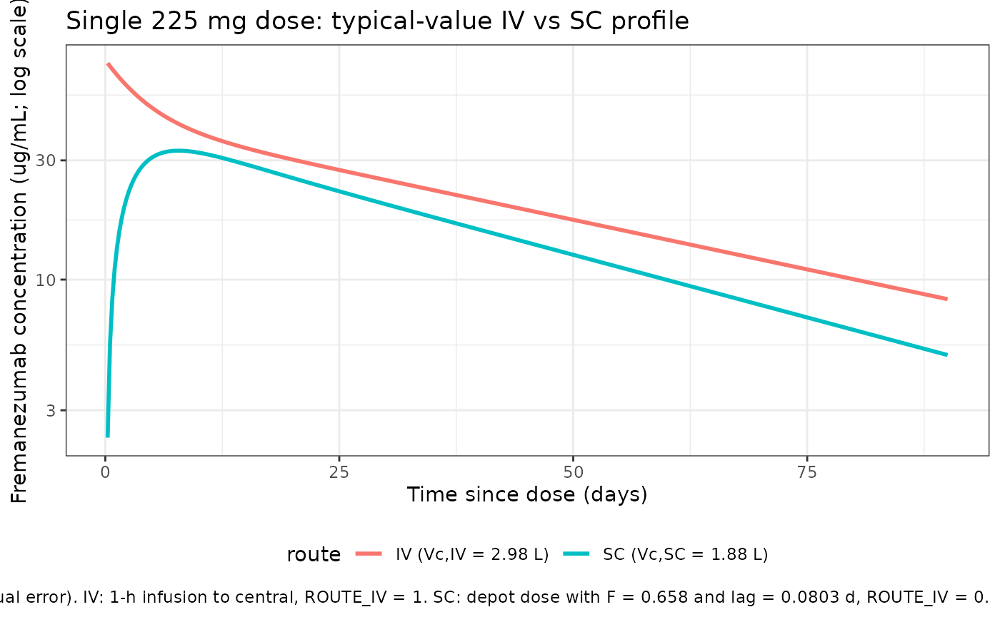

# Fremanezumab (Fiedler-Kelly 2019)

``` r

library(nlmixr2lib)
library(rxode2)
#> rxode2 5.0.2 using 2 threads (see ?getRxThreads)
#>   no cache: create with `rxCreateCache()`
library(dplyr)
#> 
#> Attaching package: 'dplyr'
#> The following objects are masked from 'package:stats':
#> 
#>     filter, lag
#> The following objects are masked from 'package:base':
#> 
#>     intersect, setdiff, setequal, union
library(tidyr)
library(ggplot2)
library(PKNCA)
#> 
#> Attaching package: 'PKNCA'
#> The following object is masked from 'package:stats':
#> 
#>     filter
```

## Fremanezumab population PK simulation

Simulate fremanezumab concentration-time profiles using the final
population PK model from Fiedler-Kelly et al. (2019). Fremanezumab is a
fully humanized IgG2 delta-a/kappa monoclonal antibody that binds CGRP
and is approved for the preventive treatment of migraine. The model was
fitted to 13,745 concentrations from 2,546 subjects (74 healthy adults
and 2,474 patients with episodic or chronic migraine) pooled across
seven phase 1 / 2b / 3 studies with IV and SC administration.

The structural model is a 2-compartment disposition with first-order SC
absorption from a depot compartment, an absorption lag time, and
first-order elimination. Weight is the only covariate retained in the
final model, entering as an allometric power on clearance (exponent
1.05) and on central volume of distribution (exponent 1.53) with a 71 kg
reference. The paper estimated separate central volumes of distribution
for the IV (Vc,IV = 2.98 L, FIXED) and SC (Vc,SC = 1.88 L) cohorts, and
a different residual-error structure for each cohort (IV:
proportional-only; SC: combined additive + proportional). The packaged
model carries both specifications and selects between them via the
`ROUTE_IV` covariate column (1 = IV, 0 = SC). All other intrinsic and
extrinsic factors examined (age, sex, race, albumin, renal and hepatic
function, ADA status, injection site, acute / analgesic / preventive
medication use, patient vs. healthy subject status) were not
statistically significant and are absent from the packaged model.

Article: [Br J Clin Pharmacol
85(12):2721-2733](https://doi.org/10.1111/bcp.14096)

### Population

From Fiedler-Kelly 2019 (Exploratory data analysis paragraph and
Supporting Table S1): 2,546 subjects contributed 13,745 concentrations.
The analysis population was primarily Caucasian (79.9%) and female
(86.1%), with median (range) age 43 (18-71) years and median (range)
body weight 70.8 (43.5-131.8) kg. The presence of anti-drug antibodies
was confirmed in only 0.7% of samples and was not a significant
covariate.

The same information is available programmatically via
`readModelDb("Fiedler-Kelly_2019_fremanezumab")$population` (note:
[`readModelDb()`](https://nlmixr2.github.io/nlmixr2lib/reference/readModelDb.md)
returns the parsed model function, so this field is accessed as an
attribute of the function body rather than a live list).

### Source trace

| Element | Source location | Value / form |
|----|----|----|
| Structural model | Fiedler-Kelly 2019 Results, Figure 3 | 2-compartment, first-order SC absorption + lag, separate Vc,IV and Vc,SC |
| CL (71 kg subject) | Fiedler-Kelly 2019 Table 2 | 0.0902 L/day |
| Allometric exponent on CL | Fiedler-Kelly 2019 Table 2, footnote c | 1.05; TVCL = 0.0902 \* (WT/71)^1.05 |
| Vc,IV (71 kg subject, FIXED) | Fiedler-Kelly 2019 Table 2, footnote d | 2.98 L (FIXED) |
| Vc,SC (71 kg subject) | Fiedler-Kelly 2019 Table 2, footnote e | 1.88 L |
| Allometric exponent on Vc | Fiedler-Kelly 2019 Table 2, footnotes d, e | 1.53; same exponent applied to both Vc,IV and Vc,SC |
| ka | Fiedler-Kelly 2019 Table 2 | 0.180 /day |
| Q (FIXED) | Fiedler-Kelly 2019 Table 2 | 0.262 L/day |
| Vp (FIXED) | Fiedler-Kelly 2019 Table 2 | 1.72 L (no allometric weight effect) |
| F1 (FIXED) | Fiedler-Kelly 2019 Table 2 | 0.658 (SC bioavailability) |
| ALAG1 (FIXED) | Fiedler-Kelly 2019 Table 2 | 0.0803 day (SC absorption lag time) |
| IIV on CL | Fiedler-Kelly 2019 Table 2 | 23.4% CV (omega^2 = log(CV^2 + 1) = 0.05334) |
| IIV on Vc | Fiedler-Kelly 2019 Table 2 | 35.1% CV (omega^2 = 0.11618; SC fit, applied to Vc,SC in the packaged model) |
| IIV on ka | Fiedler-Kelly 2019 Table 2 | 59.0% CV (omega^2 = 0.29870) |
| Off-diagonal omega | Fiedler-Kelly 2019 Results | None estimated (diagonal matrix) |
| IV residual error | Fiedler-Kelly 2019 Table 2 | Proportional only, sigma^2 = 0.0467 (SD = sqrt(0.0467) = 0.21610) |
| SC residual error | Fiedler-Kelly 2019 Table 2, footnote g | Combined: proportional sigma^2 = 0.0531 + additive sigma^2 = 0.204 (ug/mL)^2 |
| Dose regimens | Fiedler-Kelly 2019 Table 1 | 225 / 675 / 900 mg single IV or SC (phase 1); 225 mg SC Q4W, 675 mg SC Q12W |

### Virtual cohort

Simulate a 500-subject virtual cohort whose weight distribution matches
Fiedler-Kelly 2019 (median 70.8 kg, range 43.5-131.8 kg). The paper did
not publish an individual-level weight distribution, so we use a
log-normal approximation bounded to the reported range.

``` r

set.seed(2019)
n_subj <- 500

pop <- tibble(
  ID = seq_len(n_subj),
  WT = pmin(pmax(rlnorm(n_subj, meanlog = log(70.8), sdlog = 0.22), 43.5), 131.8)
)
```

### Dosing and event table

Replicate the two phase 3 therapeutic SC regimens reported in
Fiedler-Kelly 2019 Simulations section: 225 mg SC once monthly for 12
doses, and 675 mg SC once quarterly for 4 doses. Each subject is
assigned to one of the two SC regimens; covariate `ROUTE_IV = 0` selects
the SC Vc and combined residual error.

``` r

obs_times <- sort(unique(c(
  seq(0, 28, by = 1),
  seq(28, 364, by = 7)
)))

build_events <- function(pop, dose_mg, dose_times, regimen_label,
                         route_iv = 0L, dose_cmt = "depot") {
  dose_rows <- pop %>%
    crossing(time = dose_times) %>%
    mutate(amt = dose_mg, evid = 1, cmt = dose_cmt, dv = NA_real_)
  obs_rows <- pop %>%
    crossing(time = obs_times) %>%
    mutate(amt = NA_real_, evid = 0, cmt = NA_character_, dv = NA_real_)
  bind_rows(dose_rows, obs_rows) %>%
    mutate(treatment = regimen_label,
           ROUTE_IV  = route_iv) %>%
    arrange(ID, time, desc(evid))
}

events_monthly <- build_events(pop,
  dose_mg       = 225,
  dose_times    = seq(0, by = 28, length.out = 12),
  regimen_label = "225 mg SC Q4W")

events_quarterly <- build_events(pop,
  dose_mg       = 675,
  dose_times    = seq(0, by = 84, length.out = 4),
  regimen_label = "675 mg SC Q12W")

events_all <- bind_rows(events_monthly, events_quarterly)
```

### Simulation

``` r

mod <- readModelDb("Fiedler-Kelly_2019_fremanezumab")
conc_unit <- rxode2::rxode(mod)$units[["concentration"]]

sim <- events_all %>%
  group_by(treatment) %>%
  group_modify(~ {
    ev <- .x %>% rename(id = ID)
    as_tibble(rxSolve(mod, ev, returnType = "data.frame"))
  }) %>%
  ungroup()
```

### Replicate Figure 7: concentration-time profiles over 12 months

Figure 7 of Fiedler-Kelly 2019 shows median and 90% prediction intervals
for fremanezumab concentration-time profiles under the two phase 3 SC
regimens.

``` r

fig7 <- sim %>%
  filter(time > 0) %>%
  group_by(treatment, time) %>%
  summarise(
    median = median(Cc, na.rm = TRUE),
    lo     = quantile(Cc, 0.05, na.rm = TRUE),
    hi     = quantile(Cc, 0.95, na.rm = TRUE),
    .groups = "drop"
  )

ggplot(fig7, aes(x = time / 7)) +
  geom_ribbon(aes(ymin = lo, ymax = hi, fill = treatment), alpha = 0.2) +
  geom_line(aes(y = median, colour = treatment), linewidth = 1) +
  facet_wrap(~treatment, scales = "free_y") +
  labs(
    x       = "Time since first dose (weeks)",
    y       = paste0("Fremanezumab concentration (", conc_unit, ")"),
    title   = "Figure 7 replication - simulated fremanezumab exposure",
    caption = "Replicates Figure 7 of Fiedler-Kelly et al. 2019. Median and 90% prediction interval (N = 500)."
  ) +
  theme_bw() +
  theme(legend.position = "none")
```


### Replicate Figure 8 (qualitative): exposure vs. body-weight quartiles

Figure 8 of Fiedler-Kelly 2019 shows a monotonic decrease in
steady-state exposure across quartiles of body weight for both regimens.

``` r

cav_monthly <- sim %>%
  filter(treatment == "225 mg SC Q4W",
         time >= 11 * 28, time <= 12 * 28) %>%
  group_by(id, WT) %>%
  summarise(Cav = mean(Cc, na.rm = TRUE), .groups = "drop") %>%
  mutate(interval = "Cav,ss(0-28d)")

cav_quarterly <- sim %>%
  filter(treatment == "675 mg SC Q12W",
         time >= 3 * 84, time <= 4 * 84) %>%
  group_by(id, WT) %>%
  summarise(Cav = mean(Cc, na.rm = TRUE), .groups = "drop") %>%
  mutate(interval = "Cav,ss(0-84d)")

cav_bind <- bind_rows(cav_monthly, cav_quarterly) %>%
  group_by(interval) %>%
  mutate(wt_quartile = cut(WT,
                           breaks = quantile(WT, c(0, .25, .5, .75, 1)),
                           include.lowest = TRUE,
                           labels = paste0("Q", 1:4))) %>%
  ungroup()

ggplot(cav_bind, aes(x = wt_quartile, y = Cav)) +
  geom_boxplot(aes(fill = wt_quartile), alpha = 0.7) +
  facet_wrap(~interval, scales = "free_y") +
  labs(
    x       = "Body-weight quartile",
    y       = paste0("Average steady-state concentration (", conc_unit, ")"),
    title   = "Figure 8 replication - steady-state exposure by body-weight quartile",
    caption = "Replicates qualitative trend shown in Figure 8 of Fiedler-Kelly et al. 2019."
  ) +
  theme_bw() +
  theme(legend.position = "none")
```


### IV vs SC route check (phase 1, single 225 mg dose)

The packaged model carries both Vc,IV = 2.98 L (FIXED) and Vc,SC = 1.88
L and the ROUTE_IV covariate selects between them. A single 225 mg dose
under the two routes (1-hour IV infusion vs single SC injection) at the
typical-subject covariates (WT = 71 kg, no IIV) confirms the structural
switch:

``` r

mod_typical <- mod |> rxode2::zeroRe()
#> Warning: No sigma parameters in the model

iv_ev <- et() |>
  et(amt = 225, cmt = "central", rate = 225 / (1/24), time = 0) |>
  et(seq(0, 90, by = 0.25))
iv_ev$WT <- 71
iv_ev$ROUTE_IV <- 1

sc_ev <- et() |>
  et(amt = 225, cmt = "depot", time = 0) |>
  et(seq(0, 90, by = 0.25))
sc_ev$WT <- 71
sc_ev$ROUTE_IV <- 0

sim_iv <- as_tibble(rxSolve(mod_typical, iv_ev)) %>% mutate(route = "IV (Vc,IV = 2.98 L)")
#> ℹ omega/sigma items treated as zero: 'etalcl', 'etalvc_sc', 'etalka'
sim_sc <- as_tibble(rxSolve(mod_typical, sc_ev)) %>% mutate(route = "SC (Vc,SC = 1.88 L)")
#> ℹ omega/sigma items treated as zero: 'etalcl', 'etalvc_sc', 'etalka'

bind_rows(sim_iv, sim_sc) %>%
  filter(time > 0) %>%
  ggplot(aes(time, Cc, colour = route)) +
  geom_line(linewidth = 1) +
  scale_y_log10() +
  labs(
    x       = "Time since dose (days)",
    y       = paste0("Fremanezumab concentration (", conc_unit, "; log scale)"),
    title   = "Single 225 mg dose: typical-value IV vs SC profile",
    caption = "Typical-value profiles (no IIV / no residual error). IV: 1-h infusion to central, ROUTE_IV = 1. SC: depot dose with F = 0.658 and lag = 0.0803 d, ROUTE_IV = 0."
  ) +
  theme_bw() +
  theme(legend.position = "bottom")
```



## PKNCA validation

Paper-reported NCA metrics against which the simulation can be compared
(Fiedler-Kelly 2019 Simulations section and Table 3):

- median terminal half-life approximately 30 days, independent of dose
  or regimen;
- steady state reached by approximately 168 days (6 months);
- accumulation ratio for AUC across the 225 mg SC Q4W regimen (12th
  vs. 1st dose, 0-28 days) median = 2.43; for the 675 mg SC Q12W regimen
  (4th vs. 1st dose, 0-84 days) median = 1.21.

Compute simulated single-dose AUC and Cmax on the first dosing interval
and on the last dosing interval, then compare their ratio to the
published accumulation ratios. PKNCA is grouped by `treatment + id`.

``` r

nca_window <- function(sim, treat_label, dose_amt, start, end) {
  sim %>%
    filter(treatment == treat_label, time >= start, time <= end) %>%
    transmute(
      id,
      time_rel  = time - start,
      Cc,
      treatment = paste(treat_label, ifelse(start == 0, "dose 1", "last dose")),
      amt       = dose_amt,
      WT
    )
}

conc_monthly_d1 <- nca_window(sim, "225 mg SC Q4W", 225, 0, 28)
conc_monthly_ss <- nca_window(sim, "225 mg SC Q4W", 225, 11 * 28, 12 * 28)

conc_quarterly_d1 <- nca_window(sim, "675 mg SC Q12W", 675, 0, 84)
conc_quarterly_ss <- nca_window(sim, "675 mg SC Q12W", 675, 3 * 84, 4 * 84)

nca_conc <- bind_rows(conc_monthly_d1, conc_monthly_ss,
                      conc_quarterly_d1, conc_quarterly_ss) %>%
  filter(!is.na(Cc), Cc > 0)

nca_dose <- nca_conc %>%
  group_by(id, treatment, amt) %>%
  summarise(time_rel = 0, .groups = "drop") %>%
  select(id, time_rel, amt, treatment)
```

``` r

conc_obj <- PKNCAconc(nca_conc, Cc ~ time_rel | treatment + id)
dose_obj <- PKNCAdose(nca_dose, amt ~ time_rel | treatment + id)

intervals <- data.frame(
  start   = 0,
  end     = max(nca_conc$time_rel),
  cmax    = TRUE,
  tmax    = TRUE,
  auclast = TRUE
)

nca_data <- PKNCAdata(conc_obj, dose_obj, intervals = intervals)
nca_res  <- pk.nca(nca_data)

nca_summary <- summary(nca_res)
knitr::kable(nca_summary,
             digits  = 2,
             caption = "PKNCA summary by treatment / interval (auclast in ug*day/mL, Cmax in ug/mL).")
```

| start | end | treatment | N | auclast | cmax | tmax |
|---:|---:|:---|:---|:---|:---|:---|
| 0 | 84 | 225 mg SC Q4W dose 1 | 500 | NC | 32.8 \[33.0\] | 7.00 \[2.00, 28.0\] |
| 0 | 84 | 225 mg SC Q4W last dose | 500 | 1610 \[33.7\] | 71.0 \[30.3\] | 7.00 \[7.00, 7.00\] |
| 0 | 84 | 675 mg SC Q12W dose 1 | 500 | NC | 97.8 \[33.7\] | 8.00 \[2.00, 35.0\] |
| 0 | 84 | 675 mg SC Q12W last dose | 500 | 4740 \[32.9\] | 113 \[30.1\] | 7.00 \[7.00, 28.0\] |

PKNCA summary by treatment / interval (auclast in ug\*day/mL, Cmax in
ug/mL). {.table style="width:100%;"}

``` r

nca_tbl <- as.data.frame(nca_res$result) %>%
  filter(PPTESTCD %in% c("auclast", "cmax")) %>%
  group_by(treatment, PPTESTCD) %>%
  summarise(median = median(PPORRES, na.rm = TRUE), .groups = "drop") %>%
  tidyr::pivot_wider(names_from = PPTESTCD, values_from = median)

acc_table <- tibble(
  regimen = c("225 mg SC Q4W", "675 mg SC Q12W"),
  `AR_AUC simulated` = c(
    nca_tbl$auclast[nca_tbl$treatment == "225 mg SC Q4W last dose"] /
      nca_tbl$auclast[nca_tbl$treatment == "225 mg SC Q4W dose 1"],
    nca_tbl$auclast[nca_tbl$treatment == "675 mg SC Q12W last dose"] /
      nca_tbl$auclast[nca_tbl$treatment == "675 mg SC Q12W dose 1"]
  ),
  `AR_AUC published (median)`  = c(2.43, 1.21),
  `AR_Cmax simulated` = c(
    nca_tbl$cmax[nca_tbl$treatment == "225 mg SC Q4W last dose"] /
      nca_tbl$cmax[nca_tbl$treatment == "225 mg SC Q4W dose 1"],
    nca_tbl$cmax[nca_tbl$treatment == "675 mg SC Q12W last dose"] /
      nca_tbl$cmax[nca_tbl$treatment == "675 mg SC Q12W dose 1"]
  ),
  `AR_Cmax published (median)` = c(2.38, 1.22)
)

knitr::kable(acc_table,
             digits  = 2,
             caption = "Accumulation ratios: simulated medians vs. Fiedler-Kelly 2019 Table 3.")
```

| regimen | AR_AUC simulated | AR_AUC published (median) | AR_Cmax simulated | AR_Cmax published (median) |
|:---|---:|---:|---:|---:|
| 225 mg SC Q4W | NA | 2.43 | 2.17 | 2.38 |
| 675 mg SC Q12W | NA | 1.21 | 1.19 | 1.22 |

Accumulation ratios: simulated medians vs. Fiedler-Kelly 2019 Table 3.
{.table}

The simulated accumulation ratios should be within approximately 20% of
the published medians; larger deviations would motivate re-examination
of the dose schedule or sampling grid rather than parameter tuning.

### Assumptions and deviations

- **Weight distribution.** Fiedler-Kelly 2019 does not publish a
  per-subject weight distribution. We sample log-normal around a 70.8 kg
  median with SD 0.22 on the log scale, clipped to the reported
  43.5-131.8 kg range.
- **Per-subject Vc BSV applied regardless of route.** Fiedler-Kelly 2019
  estimated the Vc BSV (35.1% CV) only from SC subjects (IV-infusion or
  trough-only subjects had their individual Vc fixed to the typical
  value during the fit, as did ka BSV for non-intensive-sampling
  subjects). For general-purpose simulation, the packaged model applies
  `etalvc_sc` to every subject regardless of route. Users replicating
  the fitting protocol exactly should hold `etalvc_sc` (and `etalka`) at
  zero for IV-infusion subjects.
- **IV vs SC residual-error and Vc switch driven by ROUTE_IV.** The
  model carries both the IV-only proportional residual SD (sqrt(0.0467)
  = 0.21610) and the SC combined residual SDs (sqrt(0.0531)
  proportional, sqrt(0.204) additive), and selects between them per
  record using the `ROUTE_IV` covariate column (1 = IV, 0 = SC).
  Likewise, Vc switches between Vc,IV = 2.98 L (FIXED) and Vc,SC = 1.88
  L by `ROUTE_IV`. Event datasets must supply `ROUTE_IV` on every
  record.
- **Race and ADA status** are not included as simulated covariates
  because they were not retained as significant predictors in the final
  model.

### Notes

- **Structural model:** 2-compartment with first-order SC absorption,
  absorption lag time, first-order elimination, and allometric weight
  scaling on CL (exponent 1.05) and Vc (exponent 1.53) relative to a 71
  kg reference. Vp = 1.72 L is FIXED with no allometric weight effect.
- **Fixed parameters:** Q, Vp, F, ALAG1, and Vc,IV were held fixed in
  the source paper (Q and Vp were estimated from IV phase 1 data, F and
  ALAG1 from the combined IV + SC phase 1 data, Vc,IV from the IV phase
  1 data; all were then fixed when pooling phase 2b / 3 trough samples).
  The packaged model preserves this by wrapping them in `fixed()`.
- **IIV:** diagonal matrix on CL, Vc (the SC-fit value, applied to all
  subjects), and ka; the source paper reports no off-diagonal terms were
  estimated.
- **Terminal half-life** predicted from the structural parameters is
  approximately 30 days, matching the paper’s reported median terminal
  half-life of about 30 days.

### Reference

- Fiedler-Kelly JB, Cohen-Barak O, Morris DN, Yoon E, Yeo KR, Ludwig EA,
  Bauer R, Loupe P. Population pharmacokinetic modelling and simulation
  of fremanezumab in healthy subjects and patients with migraine. Br J
  Clin Pharmacol. 2019;85(12):2721-2733. <doi:10.1111/bcp.14096> (PMID
  31418911).
