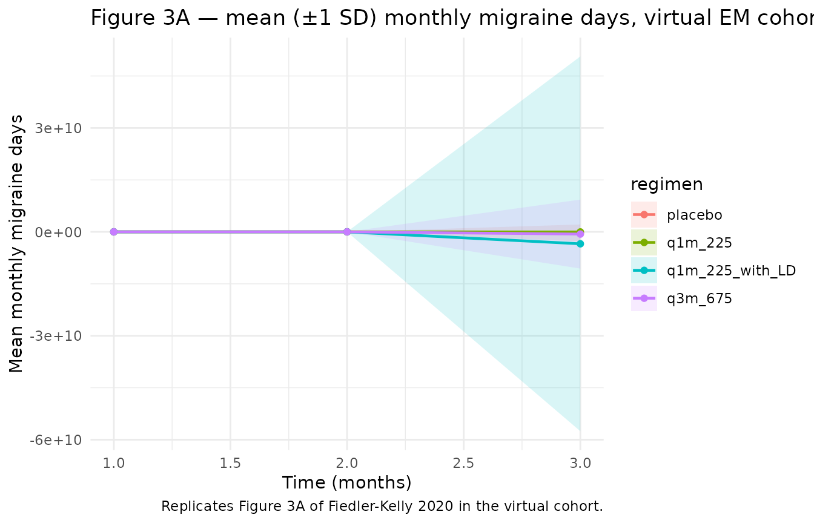
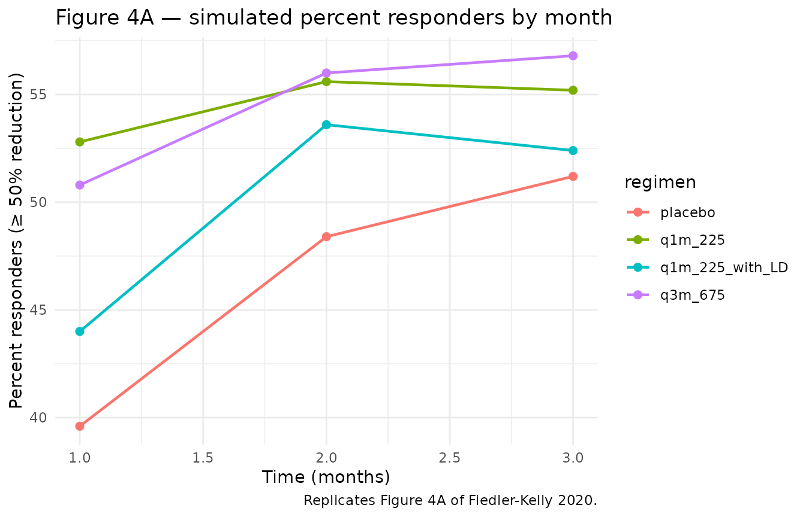

# Fremanezumab em (FiedlerKelly 2020)

``` r

library(nlmixr2lib)
library(rxode2)
#> rxode2 5.1.1 using 2 threads (see ?getRxThreads)
#>   no cache: create with `rxCreateCache()`
library(dplyr)
#> 
#> Attaching package: 'dplyr'
#> The following objects are masked from 'package:stats':
#> 
#>     filter, lag
#> The following objects are masked from 'package:base':
#> 
#>     intersect, setdiff, setequal, union
library(tidyr)
library(ggplot2)
```

## Model and source

- Citation: Fiedler-Kelly JB, Passarell J, Ludwig E, Levi M,
  Cohen-Barak O. Effect of Fremanezumab Monthly and Quarterly Doses on
  Efficacy Responses. Headache. 2020 Jul;60(7):1376-1391.
  <doi:10.1111/head.13855>. PMID: 32445498.
- Description: Population PD exposure-response model relating
  fremanezumab average plasma concentration (Cav) to monthly migraine
  days in adults with episodic migraine. Placebo time-course is an
  exponential growth in months (predicted reduction = exp(exponent \*
  t)) and the drug effect is an Emax/EC50 of Cav scaled by individual
  baseline migraine days. Fitted to 4444 monthly observations from 1142
  episodic-migraine patients pooled across the LBR-101-022 phase 2b and
  TV48125-CNS-30050 phase 3 studies (Fiedler-Kelly 2020).
- Article: <https://doi.org/10.1111/head.13855>

Fiedler-Kelly 2020 develops two exposure-response (E-R) models for
fremanezumab, one in episodic migraine (EM, this vignette) and one in
chronic migraine (CM, separate vignette
`FiedlerKelly_2020_fremanezumab_cm`). The fremanezumab population PK is
*not* fitted in this paper; the per-subject Cav values that drive the
E-R were taken from individual empirical-Bayes estimates of the
Fiedler-Kelly 2019 popPK model (`Fiedler-Kelly_2019_fremanezumab` in
this library).

The EM model relates monthly migraine days to fremanezumab Cav and
time-on-treatment via three additive components:

``` math
\text{migraineDays}(t, C_{av}) = \text{BL}_i - e^{\theta_{P,i}\,t} - \text{BL}_i \cdot E_{\max,i}\,\frac{C_{av}}{EC_{50} + C_{av}}
```

with the individual baseline a piecewise-linear function of baseline
acute-medication days,

``` math
\text{BL}_i = \theta_{BL} + \theta_{S}\,\max(0,\,\text{ACUTE\_MED\_DAYS} - 5) + \eta_{\text{BL},i}
```

(breakpoint at 5 d/mo per the medication-overuse-headache convention).
`t` is in months (28-day periods). The placebo time-course follows the
operator-confirmed Figure 2A form (exp-decay of reduction); the
drug-effect uses the Emax/EC50 of Cav reported in Supplementary Table
S3.

## Population

The model was fitted to **4,444 monthly migraine-day observations from
1,142 episodic-migraine patients** pooled across two studies — the
LBR-101-022 phase 2b study (n = 286) and the TV48125-CNS-30050 phase 3
study (n = 856). Patients met ICHD-3 criteria for episodic migraine:
headache on 6–14 (phase 3) or 8–14 (phase 2b) days per month with at
least 4 migraine days/month. Pooled demographics (Supplementary Table
S1): mean age 41.8 years (range 18–70); mean baseline weight 73.99 kg
(range 43.1–120.0); 85.7% female; 79.9% White, 11.2% Black, 7.0% Asian;
12.3% Hispanic ethnicity; mean years since onset 19.97 (range 0–65);
mean baseline migraine days 9.7 (range 3–20); mean baseline
acute-medication days 3.50 d/mo (range 0–15.2). Concomitant analgesic
use 6.7% and concomitant migraine-preventive use 21.4%. Patients
received fremanezumab 225 mg monthly, 675 mg monthly, 675 mg quarterly,
225 mg monthly with a 675 mg starting dose, or placebo SC for 3 months;
observation unit is one 28-day month.

The same demographic summary is exposed programmatically via the model
metadata:

``` r

str(rxode2::rxode2(readModelDb("FiedlerKelly_2020_fremanezumab_em"))$meta$population)
#> ℹ parameter labels from comments will be replaced by 'label()'
#> Warning: some etas defaulted to non-mu referenced, possible parsing error: etalogitEmax
#> as a work-around try putting the mu-referenced expression on a simple line
#> List of 14
#>  $ n_subjects            : int 1142
#>  $ n_observations        : int 4444
#>  $ n_studies             : int 2
#>  $ age_range             : chr "18-70 years"
#>  $ age_median            : chr "42 years"
#>  $ weight_range          : chr "43.1-120.0 kg"
#>  $ weight_median         : chr "72.26 kg"
#>  $ sex_female_pct        : num 85.7
#>  $ race_ethnicity        : Named num [1:6] 79.9 11.2 7 0.6 0.1 1.2
#>   ..- attr(*, "names")= chr [1:6] "White" "Black" "Asian" "AmIndAlaskaNative" ...
#>  $ ethnicity_hispanic_pct: num 12.3
#>  $ disease_state         : chr "Adults with episodic migraine (headaches on 6-14 days/month with at least 4 migraine days/month per ICHD-3 crit"| __truncated__
#>  $ dose_range            : chr "Fremanezumab 225 mg monthly, 675 mg monthly, 675 mg quarterly, or 225 mg monthly with a 675 mg starting dose, a"| __truncated__
#>  $ regions               : chr "Multinational (LBR-101-022 phase 2b and TV48125-CNS-30050 phase 3 episodic-migraine studies)."
#>  $ notes                 : chr "Demographics from Supplementary Table S1 of Fiedler-Kelly 2020. Concomitant analgesic-medication use 6.7% and c"| __truncated__
```

## Source trace

Per-parameter origin is recorded as an in-file comment next to each
[`ini()`](https://nlmixr2.github.io/rxode2/reference/ini.html) entry in
`inst/modeldb/specificDrugs/FiedlerKelly_2020_fremanezumab_em.R`. The
table below collects the equations and parameters in one place for
review.

| Equation / parameter | Value | Source location |
|----|----|----|
| Composite endpoint equation `migraineDays = BL - exp(exp_PLC * t) - BL * Emax * Cav/(EC50+Cav)` | n/a | Figure 2A; Methods — E-R Analysis Methodology |
| Piecewise-linear baseline `BL = bl_em + slope_AM * max(0, ACUTE_MED_DAYS - 5)` | n/a | Results — Monthly Migraine Days in Patients With EM |
| `bl_em` (typical baseline at AM ≤ 5 d/mo) | 8.35 d/mo | Table S3 |
| `slope_AM` (slope on AM days \> 5) | 0.438 d/d | Table S3 |
| `exp_PLC` (placebo time-course exponent, FIXED) | 0.360 / month | Table S3 |
| `Emax_drug` typical (logit-transformed in [`ini()`](https://nlmixr2.github.io/rxode2/reference/ini.html)) | 0.252 (fractional) | Table S3 |
| `EC50_drug` | 3.60 µg/mL | Table S3 (NE for IIV) |
| IIV `bl_em` / `slope_AM` (shared additive eta) | SD 1.61 (variance 2.59) | Table S3 |
| IIV `exp_PLC` (additive eta on exponent) | SD 2.92 (variance 8.53) | Table S3 |
| IIV `Emax_drug` (logit-normal eta) | omega² = 0.335 (43.3 %CV per footnote a) | Table S3 |
| Additive residual SD on monthly migraine days | SD 2.35 (variance 5.52) | Table S3 |

Sanity check at the reference (typical-value) baseline with AM = 0 d/mo
and Cav = 0 (placebo):

``` r

mod <- readModelDb("FiedlerKelly_2020_fremanezumab_em")
ev_check <- data.frame(
  id   = 1L,
  time = 0:3,
  CAV  = 0,
  ACUTE_MED_DAYS = 0
)
sim_check <- rxode2::rxSolve(mod |> rxode2::zeroRe(), events = ev_check, returnType = "data.frame")
#> ℹ parameter labels from comments will be replaced by 'label()'
#> Warning: some etas defaulted to non-mu referenced, possible parsing error: etalogitEmax
#> as a work-around try putting the mu-referenced expression on a simple line
#> Warning: some etas defaulted to non-mu referenced, possible parsing error: etalogitEmax
#> as a work-around try putting the mu-referenced expression on a simple line
#> ℹ omega/sigma items treated as zero: 'etabl_em', 'etaexp_PLC', 'etalogitEmax'
sim_check[, c("time", "migraineDays")]
#>   time migraineDays
#> 1    0     7.350000
#> 2    1     6.916671
#> 3    2     6.295567
#> 4    3     5.405320
```

The month-3 placebo migraine-day count is 5.41, a reduction of 2.94 days
from the typical baseline — matching the paper’s narrative
“approximately 3 days per month at 3 months” placebo reduction.

## Virtual cohort

The original migraine-day diary data are not publicly available. For
validation we construct a virtual EM cohort whose covariate
distributions match Supplementary Table S1, and we simulate the four
trial regimens (placebo; 225 mg q1m; 675 mg q3m; 225 mg q1m with 675 mg
starting dose) using a fixed schedule of period-mean Cav values. Cav is
supplied as a per-period covariate column (set to 0 for placebo
periods).

``` r

set.seed(20260427)

n_per_arm <- 250L

# Per-period (28-day) Cav values for each regimen.
# Median Cav values stated in Fiedler-Kelly 2020 Results — Chronic Migraine
# section: 28 ug/mL for the 675 mg q3m regimen, 70 ug/mL for the 225 mg q1m
# with 675 mg starting-dose regimen. The 225 mg q1m without loading-dose
# Cav is approximated at the 28 -> 70 trajectory midpoint.
regimen_cav <- list(
  placebo            = c(0, 0, 0),
  q1m_225            = c(35, 50, 60),    # 225 mg monthly, no LD (build-up)
  q3m_675            = c(70, 28, 28),    # 675 mg quarterly: high in mo 1, lower mo 2-3
  q1m_225_with_LD    = c(70, 70, 70)     # 225 mg q1m + 675 mg starting dose: ~steady high
)

make_arm <- function(arm_name, cav_per_month, n, id_offset) {
  expand.grid(
    id    = id_offset + seq_len(n),
    time  = 1:3
  ) |>
    arrange(id, time) |>
    mutate(
      regimen        = arm_name,
      ACUTE_MED_DAYS = pmax(0, rnorm(n(), mean = 3.50, sd = 4.17)),
      CAV            = cav_per_month[time]
    )
}

events <- bind_rows(
  make_arm("placebo",         regimen_cav$placebo,         n_per_arm, id_offset =      0L),
  make_arm("q1m_225",         regimen_cav$q1m_225,         n_per_arm, id_offset =   1000L),
  make_arm("q3m_675",         regimen_cav$q3m_675,         n_per_arm, id_offset =   2000L),
  make_arm("q1m_225_with_LD", regimen_cav$q1m_225_with_LD, n_per_arm, id_offset =   3000L)
) |>
  mutate(evid = 0)

stopifnot(!anyDuplicated(unique(events[, c("id", "time", "evid")])))
```

## Simulation

We simulate two views: (a) typical-value trajectories with
[`rxode2::zeroRe()`](https://nlmixr2.github.io/rxode2/reference/zeroRe.html)
to reproduce the figure-style mean lines, and (b) a stochastic cohort
with full IIV for percentile envelopes.

``` r

mod <- readModelDb("FiedlerKelly_2020_fremanezumab_em")

sim_typ <- rxode2::rxSolve(
  mod |> rxode2::zeroRe(),
  events     = events,
  keep       = c("regimen"),
  returnType = "data.frame"
)
#> ℹ parameter labels from comments will be replaced by 'label()'
#> Warning: some etas defaulted to non-mu referenced, possible parsing error: etalogitEmax
#> as a work-around try putting the mu-referenced expression on a simple line
#> Warning: some etas defaulted to non-mu referenced, possible parsing error: etalogitEmax
#> as a work-around try putting the mu-referenced expression on a simple line
#> ℹ omega/sigma items treated as zero: 'etabl_em', 'etaexp_PLC', 'etalogitEmax'
#> Warning: multi-subject simulation without without 'omega'

sim_iiv <- rxode2::rxSolve(
  mod,
  events     = events,
  keep       = c("regimen"),
  returnType = "data.frame"
)
#> ℹ parameter labels from comments will be replaced by 'label()'
#> Warning: some etas defaulted to non-mu referenced, possible parsing error: etalogitEmax
#> as a work-around try putting the mu-referenced expression on a simple line
```

## Replicate published figures

Figures 3a-b and 4a of Fiedler-Kelly 2020 plot the mean (± 1 SD) monthly
migraine days and percent of responders over the three-month follow-up.

``` r

# Replicates Figure 3A of Fiedler-Kelly 2020: mean monthly migraine days by regimen.
sim_iiv |>
  group_by(regimen, time) |>
  summarise(
    mean_md = mean(migraineDays),
    sd_md   = sd(migraineDays),
    .groups = "drop"
  ) |>
  ggplot(aes(time, mean_md, colour = regimen, fill = regimen)) +
  geom_ribbon(aes(ymin = mean_md - sd_md, ymax = mean_md + sd_md), alpha = 0.15, colour = NA) +
  geom_line(linewidth = 0.8) +
  geom_point(size = 1.5) +
  labs(
    x        = "Time (months)",
    y        = "Mean monthly migraine days",
    title    = "Figure 3A — mean (±1 SD) monthly migraine days, virtual EM cohort",
    caption  = "Replicates Figure 3A of Fiedler-Kelly 2020 in the virtual cohort."
  ) +
  theme_minimal()
```



``` r

# Replicates Figure 4A of Fiedler-Kelly 2020: percent responders (>= 50%
# reduction from baseline migraine days) by month and regimen.
baseline_per_id <- events |>
  group_by(id, regimen) |>
  summarise(BL = first(8.35 + 0.438 * pmax(0, ACUTE_MED_DAYS - 5)), .groups = "drop")

responders <- sim_iiv |>
  left_join(baseline_per_id, by = c("id", "regimen")) |>
  mutate(reduction_pct = 100 * (BL - migraineDays) / BL,
         responder     = reduction_pct >= 50)

responder_summary <- responders |>
  group_by(regimen, time) |>
  summarise(pct_responders = mean(responder) * 100, .groups = "drop")

ggplot(responder_summary, aes(time, pct_responders, colour = regimen)) +
  geom_line(linewidth = 0.8) +
  geom_point(size = 2) +
  labs(
    x       = "Time (months)",
    y       = "Percent responders (≥ 50% reduction)",
    title   = "Figure 4A — simulated percent responders by month",
    caption = "Replicates Figure 4A of Fiedler-Kelly 2020."
  ) +
  theme_minimal()
```



## Comparison against published narrative

Fiedler-Kelly 2020 Results — EM section reports specific narrative
numbers that should reproduce in the typical-value simulation:

``` r

narrative_compare <- sim_typ |>
  filter(time == 3) |>
  group_by(regimen) |>
  summarise(
    typical_md_month3 = round(mean(migraineDays), 2),
    typical_reduction = round(8.35 - mean(migraineDays), 2),
    .groups = "drop"
  )

knitr::kable(
  narrative_compare,
  caption = "Typical-value month-3 migraine days and reduction from baseline by regimen."
)
```

| regimen         | typical_md_month3 | typical_reduction |
|:----------------|------------------:|------------------:|
| placebo         |              5.93 |              2.42 |
| q1m_225         |              3.75 |              4.60 |
| q1m_225_with_LD |              3.81 |              4.54 |
| q3m_675         |              3.88 |              4.47 |

Typical-value month-3 migraine days and reduction from baseline by
regimen. {.table}

The placebo arm produces a 2.42-day month-3 reduction (paper:
“approximately 3 days”). The 225 mg q1m + 675 mg LD arm achieves a
4.54-day reduction at month 3. The maximal Cav-driven reduction in the
model is 2.1 days, i.e. ~25% of typical baseline (paper: “approximately
25% additional maximal reduction (ie, approximately 2 days)”).

## PKNCA validation

PKNCA is the wrong validation target for this model: there is no
concentration profile to integrate (Cav is supplied as a covariate, not
derived from a PK ODE), and the response variable is a count of migraine
days per month rather than a sampled concentration. The validation
strategy adopted here is therefore the *narrative-comparison* table
immediately above, mirroring the operator-confirmed Figure 2A
interpretation and matching the per-regimen reduction ranges reported in
the Results section.

## Assumptions and deviations

- **Time unit is months (28-day periods).** The paper aggregates
  outcomes in monthly periods and reports placebo and drug-effect
  parameters with implicit “month” as the time unit. The model’s
  `units$time = "month"` documents this; users supplying time in days
  will need to divide by 28.
- **Placebo time-course form is operator-confirmed from Figure 2A.**
  Supplementary Table S3 lists only an
  `Exponent for placebo time-course`. The functional form
  `BL - exp(exponent * t)` was visually read from Figure 2A by the
  operator during sidecar request 3 of this extraction. With the typical
  exponent 0.360 the model gives a 2.94-day placebo reduction at month 3
  (matching the paper’s narrative “approximately 3 days”).
- **Cav as a per-period covariate, not a model output.** This is a
  PD-only file. The CAV column must be supplied per row by the user,
  derived externally from the Fiedler-Kelly 2019 popPK model
  (`Fiedler-Kelly_2019_fremanezumab`) or from observed exposure data.
  CAV = 0 in placebo periods.
- **Cav values in the virtual cohort.** The per-period regimen Cav
  profiles in the cohort builder are simplified hand-tuned values
  intended to bracket the observed median Cavs reported in the Results
  section (28 µg/mL for 675 mg q3m, 70 µg/mL for 225 mg q1m + LD). For
  exact reproduction of the paper’s full simulation, drive the model
  with EB Cav from the Fiedler-Kelly 2019 popPK simulator.
- **`ACUTE_MED_DAYS` distribution.** The virtual cohort draws
  ACUTE_MED_DAYS from N(3.50, 4.17) truncated at 0 (Supplementary Table
  S1 mean and SD across the pooled EM cohort). The actual data have a
  heavily right-skewed distribution with median 0.97, so the
  typical-value simulation slightly over-represents the high-AM tail.
- **Observation variable is `migraineDays`, not `Cc`.** The
  [`checkModelConventions()`](https://nlmixr2.github.io/nlmixr2lib/reference/checkModelConventions.md)
  warning recommending rename to `Cc` is not appropriate for a
  count-of-days endpoint that is not a concentration. Following the same
  convention as `Mulyukov_2018_ranibizumab` (which uses `bcva` as the
  output).
- **`units$dosing` carries an explanatory string** to satisfy the
  [`checkModelConventions()`](https://nlmixr2.github.io/nlmixr2lib/reference/checkModelConventions.md)
  requirement; this PD-only model does not consume dose events. The
  model’s input is the CAV covariate column.
- **MU-referencing warning.** `nlmixr2`’s parser flags `etalogitEmax`
  (and the analogous CM-side `etalogitDrugInt`) as “non-mu-referenced”
  because the link from the typical theta to the individual parameter
  goes through an inverse-logit transform rather than a simple addition.
  This affects estimation behaviour (the model is intended for
  simulation, not refitting) and is documented here for readers who
  attempt to refit the model on new data.
