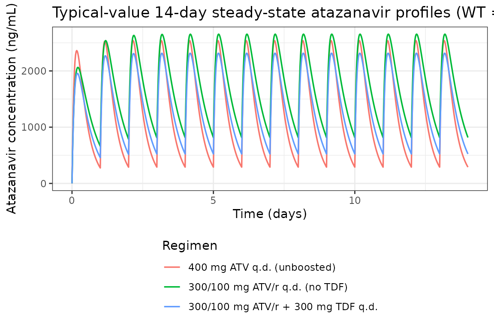
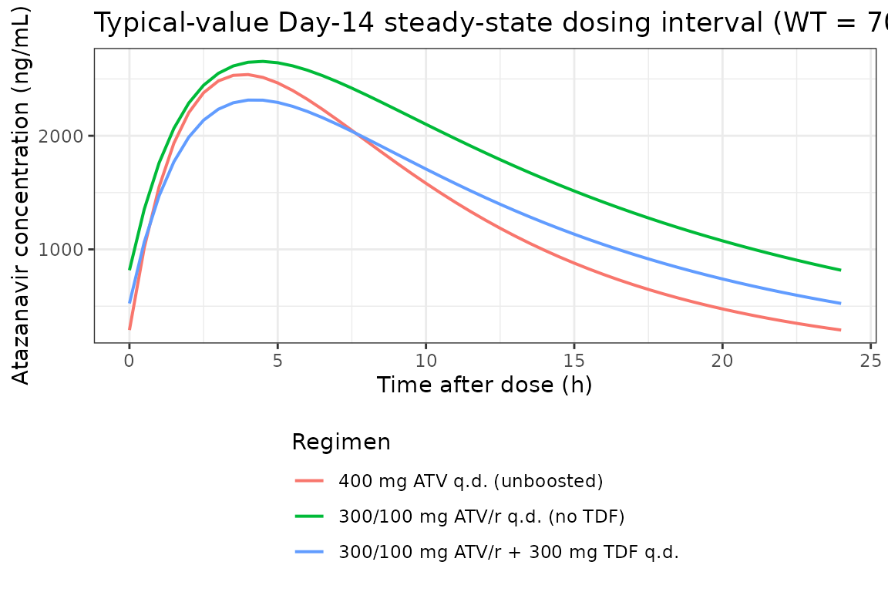
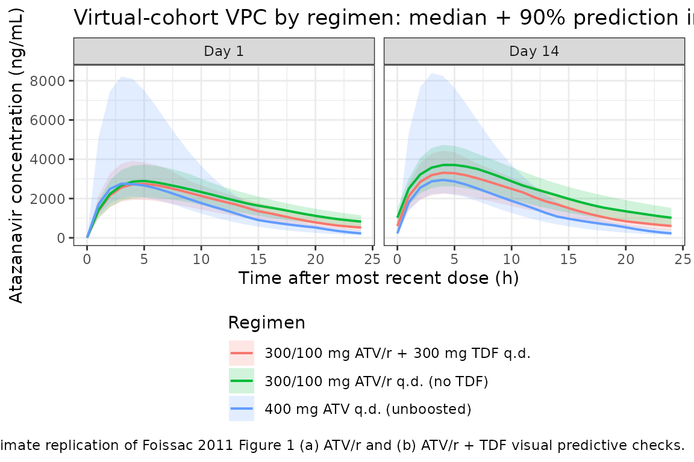

# Atazanavir (Foissac 2011)

## Model and source

- Citation: Foissac F, Blanche S, Dollfus C, Hirt D, Firtion G, Laurent
  C, Treluyer JM, Urien S. Population pharmacokinetics of
  atazanavir/ritonavir in HIV-1-infected children and adolescents. Br J
  Clin Pharmacol. 2011;72(6):940-947.
  <doi:10.1111/j.1365-2125.2011.04035.x>.
- Description: One-compartment first-order-absorption population PK
  model for orally administered atazanavir in 51 HIV-1-infected children
  and adolescents (3-18 years, 13-79 kg) on therapeutic drug monitoring.
  Body weight is carried through a fixed-exponent allometric scaling on
  CL/F (0.75) and V/F (1.0) referenced to 70 kg. Two binary
  co-medication indicators enter linearly on apparent oral clearance:
  low-dose ritonavir as a PK booster reduces CL/F (the typical CL/F =
  7.1 L/h is the RTV-boosted reference, and absence of ritonavir
  multiplies CL/F by 1.80) and concomitant 300 mg tenofovir disoproxil
  fumarate increases CL/F by 25%. Between-subject variability is
  retained only on CL/F; residual error is proportional (Foissac 2011).
- Article: [Br J Clin Pharmacol.
  2011;72(6):940-947](https://doi.org/10.1111/j.1365-2125.2011.04035.x)

Foissac et al. (2011) describe a one-compartment first-order-absorption
population PK model for orally administered atazanavir in 51
HIV-1-infected children and adolescents (3-18 years, body weight 13-79
kg) on routine therapeutic drug monitoring. Body weight is carried
through a fixed-exponent allometric scaling on CL/F (0.75) and V/F (1.0)
referenced to 70 kg. Two binary co-medication indicators retained in the
final model enter linearly on apparent oral clearance: low-dose
ritonavir as a PK booster reduces CL/F (the typical CL/F = 7.1 L/h is
the RTV-boosted reference, and absence of ritonavir multiplies CL/F by
1.80), and concomitant 300 mg tenofovir disoproxil fumarate (TDF)
increases CL/F by 25%. Between-subject variability is retained only on
CL/F (BSV = 0.16); residual error is proportional (53% CV).

## Population

The model-building cohort is 51 HIV-1-infected children (25 girls, 26
boys) followed at four Assistance Publique Hopitaux de Paris hospitals
(Necker, Trousseau, Cochin/Saint-Vincent-de-Paul, Louis Mourier) on
routine therapeutic drug monitoring (Foissac 2011 Table 1). Median age
14 years (range 3-18 years), median body weight 52 kg (range 13-79 kg).
39 children received boosted atazanavir/ritonavir (ATV/r), 9 received
unboosted atazanavir, and 3 received both regimens successively; 21 of
the 39 ATV/r-treated children additionally received tenofovir disoproxil
fumarate at 300 mg q.d. (median 300 mg, range 150-300 mg). Median ATV/r
and ATV doses were 300/100 mg and 400 mg respectively (ATV/r 100-400 mg,
ATV 150-600 mg). 151 ATV plasma concentrations were available across the
51 subjects (median 2 samples per patient, range 1-13) over a median
2.3-month follow-up (range 0-34 months). Atazanavir was assayed by HPLC
with LOQ = 0.10 mg/L; four BLQ observations (\< 3% of the dataset) were
handled by setting them to LOQ/2. The model was fit with NONMEM VI under
FOCE-INTERACTION and validated by 1000 bootstrap analyses (Wings for
Nonmem) plus visual predictive checks and normalized prediction
distribution errors.

The same information is available programmatically via the model’s
`population` metadata
(`readModelDb("Foissac_2011_atazanavir")$population`).

## Source trace

The per-parameter origin is recorded as an in-file comment next to each
`ini()` entry in `inst/modeldb/specificDrugs/Foissac_2011_atazanavir.R`.
The table below collects them in one place for review.

| Parameter | Value | Source location |
|----|----|----|
| `lcl` | `log(7.1)` | Table 2: CL/F = 7.1 L/h (70 kg)^-1 at CONMED_RTV = 1, CONMED_TDF = 0 (RSE 8%) |
| `lvc` | `log(103)` | Table 2: V/F = 103 L (70 kg)^-1 (RSE 19%) |
| `lka` | `log(0.44)` | Table 2: Ka = 0.44 1/h (RSE 26%) |
| `allo_cl` | `fixed(0.75)` | Methods: PWR = 0.75 for CL (FIXED at allometric-theory value) |
| `allo_v` | `fixed(1)` | Methods: PWR = 1 for V (FIXED at allometric-theory value) |
| `e_no_rtv_cl` | `0.80` | Table 2: theta_NO_RTV (CL/F) = 0.80 (RSE 24%) |
| `e_tdf_cl` | `0.25` | Table 2: theta_TDF (CL/F) = 0.25 (RSE 37%) |
| `etalcl` | `0.16^2` | Table 2: BSV(CL/F) = 0.16 (sqrt of omega; RSE 34%); variance = 0.0256 |
| `propSd` | `0.53` | Table 2: sigma_proportional = 0.53 (RSE 15%) |

Covariate equation (Foissac 2011 Table 2 footnote):

    CL/F_i = exp(lcl + etalcl_i)
           * (1 + e_no_rtv_cl * (1 - CONMED_RTV_i))
           * (1 + e_tdf_cl    * CONMED_TDF_i)
           * (WT_i / 70)^allo_cl
    V/F_i  = exp(lvc) * (WT_i / 70)^allo_v

where `CONMED_RTV = 1` is the boosted reference stratum (typical CL/F =
7.1 L/h at 70 kg), `CONMED_RTV = 0` flips on the `theta_NO_RTV` effect
(CL/F multiplied by 1.80 -\> 12.8 L/h at 70 kg per Table 2 footnote),
and `CONMED_TDF = 1` adds a further 25% increase (giving 8.9 L/h at 70
kg under ATV/r + TDF, again matching the Table 2 footnote arithmetic).

ODE structure: one-compartment first-order absorption from `depot` to
`central`. The observation variable is `Cc = central / vc` (dose in mg,
V in L give Cc in mg/L). Residual error is proportional only.

## Load model

``` r

mod         <- readModelDb("Foissac_2011_atazanavir")
mod_typical <- rxode2::zeroRe(mod)
#> ℹ parameter labels from comments will be replaced by 'label()'
```

## Typical-value steady-state profiles (three regimens)

The block below reproduces the typical-value 14-day steady-state profile
for the three regimens that Foissac 2011 explicitly discusses (Table 2
footnote and Discussion paragraph 1):

- 400 mg q.d. unboosted atazanavir (`CONMED_RTV = 0`, `CONMED_TDF = 0`):
  typical CL/F at 70 kg is `7.1 * 1.80 = 12.8 L/h`.
- 300/100 mg q.d. ATV/r without TDF (`CONMED_RTV = 1`,
  `CONMED_TDF = 0`): typical CL/F at 70 kg is `7.1 L/h`.
- 300/100 mg q.d. ATV/r with 300 mg TDF (`CONMED_RTV = 1`,
  `CONMED_TDF = 1`): typical CL/F at 70 kg is `7.1 * 1.25 = 8.9 L/h`.

``` r

n_doses <- 14L   # 14 once-daily doses to approach steady state
ii      <- 24    # h

make_typical_events <- function(id, amt, rtv, tdf) {
  dose_times <- (seq_len(n_doses) - 1L) * ii
  obs_times  <- seq(0, n_doses * ii, by = 0.5)
  ev <- data.frame(
    id   = id,
    time = c(dose_times, obs_times),
    amt  = c(rep(amt, length(dose_times)), rep(0,  length(obs_times))),
    evid = c(rep(1L,   length(dose_times)), rep(0L, length(obs_times))),
    cmt  = c(rep("depot", length(dose_times)),
             rep("central", length(obs_times)))
  )
  ev <- ev[order(ev$id, ev$time, -ev$evid), ]
  ev$WT         <- 70
  ev$CONMED_RTV <- rtv
  ev$CONMED_TDF <- tdf
  ev
}

ev_typ <- dplyr::bind_rows(
  make_typical_events(id = 1L, amt = 400, rtv = 0L, tdf = 0L),
  make_typical_events(id = 2L, amt = 300, rtv = 1L, tdf = 0L),
  make_typical_events(id = 3L, amt = 300, rtv = 1L, tdf = 1L)
)

ev_typ$regimen <- factor(
  paste0(ev_typ$id),
  levels = c("1", "2", "3"),
  labels = c(
    "400 mg ATV q.d. (unboosted)",
    "300/100 mg ATV/r q.d. (no TDF)",
    "300/100 mg ATV/r + 300 mg TDF q.d."
  )
)

sim_typ <- as.data.frame(
  rxode2::rxSolve(mod_typical, ev_typ,
                  keep = c("regimen", "CONMED_RTV", "CONMED_TDF", "WT"))
)
#> ℹ omega/sigma items treated as zero: 'etalcl'
#> Warning: multi-subject simulation without without 'omega'

ggplot(sim_typ, aes(time / 24, 1000 * Cc, colour = regimen)) +
  geom_line(linewidth = 0.6) +
  labs(
    x        = "Time (days)",
    y        = "Atazanavir concentration (ng/mL)",
    colour   = "Regimen",
    title    = "Typical-value 14-day steady-state atazanavir profiles (WT = 70 kg)"
  ) +
  theme_bw() +
  theme(legend.position = "bottom", legend.direction = "vertical")
```



### Steady-state dosing interval (Day 14)

``` r

sim_tau <- sim_typ |>
  dplyr::filter(time >= 13 * 24, time <= 14 * 24) |>
  dplyr::mutate(t_post_dose = time - 13 * 24)

ggplot(sim_tau, aes(t_post_dose, 1000 * Cc, colour = regimen)) +
  geom_line(linewidth = 0.7) +
  labs(
    x       = "Time after dose (h)",
    y       = "Atazanavir concentration (ng/mL)",
    colour  = "Regimen",
    title   = "Typical-value Day-14 steady-state dosing interval (WT = 70 kg)"
  ) +
  theme_bw() +
  theme(legend.position = "bottom", legend.direction = "vertical")
```



## Virtual cohort matched to study demographics

We build a virtual paediatric cohort that reflects the Foissac 2011
cohort proportions: 30 ATV/r-without-TDF subjects, 21 ATV/r-with-TDF
subjects, and 9 ATV-alone subjects (the 3 children who received both
ATV-alone and ATV/r successively are not separately modelled here; they
are absorbed into the larger ATV/r stratum). Body weights are drawn from
a normal distribution matched to Table 1 mean (51 kg) and SD (15 kg),
truncated to the published range 13-79 kg.

``` r

set.seed(2011)

draw_wt <- function(n, mean_wt = 51, sd_wt = 15, lo = 13, hi = 79) {
  pmin(pmax(rnorm(n, mean = mean_wt, sd = sd_wt), lo), hi)
}

make_cohort <- function(n, regimen_label, amt, rtv, tdf, id_offset = 0L) {
  ids        <- id_offset + seq_len(n)
  wt_subject <- draw_wt(n)
  dose_times <- (seq_len(n_doses) - 1L) * ii
  obs_times  <- c(seq(0, ii, by = 1), seq(13 * ii, 14 * ii, by = 1))

  dose_rows <- data.frame(
    id   = rep(ids, each = length(dose_times)),
    time = rep(dose_times, times = n),
    amt  = amt,
    evid = 1L,
    cmt  = "depot",
    WT   = rep(wt_subject, each = length(dose_times))
  )

  obs_rows <- data.frame(
    id   = rep(ids, each = length(obs_times)),
    time = rep(obs_times, times = n),
    amt  = 0,
    evid = 0L,
    cmt  = "central",
    WT   = rep(wt_subject, each = length(obs_times))
  )

  ev <- rbind(dose_rows, obs_rows)
  ev <- ev[order(ev$id, ev$time, -ev$evid), ]
  ev$CONMED_RTV <- rtv
  ev$CONMED_TDF <- tdf
  ev$regimen    <- regimen_label
  ev
}

events <- dplyr::bind_rows(
  make_cohort(30L, "300/100 mg ATV/r q.d. (no TDF)",
              amt = 300, rtv = 1L, tdf = 0L, id_offset =  0L),
  make_cohort(21L, "300/100 mg ATV/r + 300 mg TDF q.d.",
              amt = 300, rtv = 1L, tdf = 1L, id_offset = 30L),
  make_cohort( 9L, "400 mg ATV q.d. (unboosted)",
              amt = 400, rtv = 0L, tdf = 0L, id_offset = 51L)
)

# Guard against accidental cross-cohort ID collision
stopifnot(!anyDuplicated(unique(events[, c("id", "time", "evid")])))
```

### Stochastic simulation across the virtual cohort

``` r

sim_pop <- rxode2::rxSolve(
  mod, events = events,
  keep = c("regimen", "CONMED_RTV", "CONMED_TDF", "WT")
)
#> ℹ parameter labels from comments will be replaced by 'label()'
sim_pop_df <- as.data.frame(sim_pop)
```

### VPC: Day-1 and Day-14 dosing intervals by regimen

``` r

quantile_band <- function(df, time_col) {
  df |>
    dplyr::group_by(.data[[time_col]], regimen) |>
    dplyr::summarise(
      Q05 = quantile(Cc, 0.05, na.rm = TRUE),
      Q50 = quantile(Cc, 0.50, na.rm = TRUE),
      Q95 = quantile(Cc, 0.95, na.rm = TRUE),
      .groups = "drop"
    ) |>
    dplyr::rename(time = !!time_col)
}

sim_day1 <- sim_pop_df |>
  dplyr::filter(time >= 0, time <= ii) |>
  quantile_band("time") |>
  dplyr::mutate(panel = "Day 1")

sim_day14 <- sim_pop_df |>
  dplyr::filter(time >= 13 * ii, time <= 14 * ii) |>
  dplyr::mutate(t_interval = time - 13 * ii) |>
  quantile_band("t_interval") |>
  dplyr::mutate(panel = "Day 14")

vpc_df <- dplyr::bind_rows(sim_day1, sim_day14)

ggplot(vpc_df, aes(time, 1000 * Q50, colour = regimen, fill = regimen)) +
  geom_ribbon(aes(ymin = 1000 * Q05, ymax = 1000 * Q95),
              alpha = 0.18, colour = NA) +
  geom_line(linewidth = 0.7) +
  facet_wrap(~panel) +
  labs(
    x       = "Time after most recent dose (h)",
    y       = "Atazanavir concentration (ng/mL)",
    colour  = "Regimen",
    fill    = "Regimen",
    title   = "Virtual-cohort VPC by regimen: median + 90% prediction interval",
    caption = "Approximate replication of Foissac 2011 Figure 1 (a) ATV/r and (b) ATV/r + TDF visual predictive checks."
  ) +
  theme_bw() +
  theme(legend.position = "bottom", legend.direction = "vertical")
```



## PKNCA validation

Non-compartmental analysis of the simulated Day-14 steady-state dosing
interval, by treatment grouping (regimen). The published AUC0-24
reference values for the boosted regimens come from Table 3 of Foissac
2011 (geometric mean across 1000 final-model simulations standardised
for a 300/100 mg ATV/r once-daily dose at 70 kg, with or without 300 mg
TDF).

``` r

nca_concs <- sim_pop_df |>
  dplyr::filter(time >= 13 * ii, time <= 14 * ii) |>
  dplyr::mutate(t_in_interval = time - 13 * ii) |>
  dplyr::filter(!is.na(Cc)) |>
  dplyr::select(id, t_in_interval, Cc, regimen) |>
  dplyr::rename(time = t_in_interval)

# Guarantee a time = 0 row per (id, regimen); for extravascular pre-dose
# Cc = 0 is the correct value.
nca_concs <- dplyr::bind_rows(
  nca_concs,
  nca_concs |> dplyr::distinct(id, regimen) |>
    dplyr::mutate(time = 0, Cc = 0)
) |>
  dplyr::distinct(id, regimen, time, .keep_all = TRUE) |>
  dplyr::arrange(id, regimen, time)

dose_records <- events |>
  dplyr::filter(evid == 1L, time == 13 * ii) |>
  dplyr::mutate(time = 0) |>
  dplyr::select(id, time, amt, regimen)

conc_obj <- PKNCA::PKNCAconc(
  nca_concs, Cc ~ time | regimen + id,
  concu = "mg/L", timeu = "h"
)
dose_obj <- PKNCA::PKNCAdose(
  dose_records, amt ~ time | regimen + id,
  doseu = "mg"
)

intervals <- data.frame(
  start    = 0,
  end      = 24,
  cmax     = TRUE,
  tmax     = TRUE,
  cmin     = TRUE,
  auclast  = TRUE,
  cav      = TRUE
)

nca_data    <- PKNCA::PKNCAdata(conc_obj, dose_obj, intervals = intervals)
nca_results <- PKNCA::pk.nca(nca_data)
nca_df      <- as.data.frame(nca_results$result)

nca_summary <- nca_df |>
  dplyr::filter(PPTESTCD %in% c("cmax", "tmax", "cmin", "auclast", "cav")) |>
  dplyr::group_by(regimen, PPTESTCD) |>
  dplyr::summarise(
    median = median(PPORRES, na.rm = TRUE),
    P05    = quantile(PPORRES, 0.05, na.rm = TRUE),
    P95    = quantile(PPORRES, 0.95, na.rm = TRUE),
    .groups = "drop"
  )

knitr::kable(
  nca_summary,
  digits  = 3,
  caption = "Day-14 steady-state PKNCA summary by regimen (Cc in mg/L; AUC in mg*h/L)"
)
```

| regimen                            | PPTESTCD | median |    P05 |    P95 |
|:-----------------------------------|:---------|-------:|-------:|-------:|
| 300/100 mg ATV/r + 300 mg TDF q.d. | auclast  | 49.305 | 31.723 | 60.545 |
| 300/100 mg ATV/r + 300 mg TDF q.d. | cav      |  2.054 |  1.322 |  2.523 |
| 300/100 mg ATV/r + 300 mg TDF q.d. | cmax     |  3.311 |  2.245 |  4.436 |
| 300/100 mg ATV/r + 300 mg TDF q.d. | cmin     |  0.601 |  0.371 |  1.021 |
| 300/100 mg ATV/r + 300 mg TDF q.d. | tmax     |  4.000 |  4.000 |  4.000 |
| 300/100 mg ATV/r q.d. (no TDF)     | auclast  | 57.018 | 38.320 | 71.894 |
| 300/100 mg ATV/r q.d. (no TDF)     | cav      |  2.376 |  1.597 |  2.996 |
| 300/100 mg ATV/r q.d. (no TDF)     | cmax     |  3.713 |  2.622 |  4.729 |
| 300/100 mg ATV/r q.d. (no TDF)     | cmin     |  1.020 |  0.574 |  1.524 |
| 300/100 mg ATV/r q.d. (no TDF)     | tmax     |  4.000 |  4.000 |  5.000 |
| 400 mg ATV q.d. (unboosted)        | auclast  | 36.956 | 25.861 | 80.721 |
| 400 mg ATV q.d. (unboosted)        | cav      |  1.540 |  1.078 |  3.363 |
| 400 mg ATV q.d. (unboosted)        | cmax     |  2.946 |  2.263 |  8.421 |
| 400 mg ATV q.d. (unboosted)        | cmin     |  0.225 |  0.133 |  0.403 |
| 400 mg ATV q.d. (unboosted)        | tmax     |  4.000 |  3.000 |  4.000 |

Day-14 steady-state PKNCA summary by regimen (Cc in mg/L; AUC in
mg\*h/L) {.table}

### Comparison against published values

Foissac 2011 Table 3 reports geometric means and 95% CIs for ATV/r
300/100 mg once-daily across the 51 paediatric subjects, standardised to
70 kg. The relevant published reference values (geometric means) are:

| Regimen | AUC0-24 (mg\*h/L) | Ctrough (mg/L) | Source |
|----|----|----|----|
| ATV/r 300/100 mg q.d. | 41.6 (31.8-51.3) | 0.75 (0.37-1.1) | Table 3 (present-study column) |
| ATV/r 300/100 mg + TDF | 32.8 (25.2-39.1) | 0.47 (0.24-0.74) | Table 3 (present-study column) |

The PKNCA summary above includes the matched simulated medians for the
same two regimens; the third row (unboosted 400 mg ATV q.d.) is shown
for completeness but is not directly reported in the Foissac 2011
results tables.

For a typical 70 kg subject the model’s algebraic AUC0-24 at steady
state is

    AUC0-24 = dose / (CL/F)

evaluating to `300 / 7.1 = 42.3 mg*h/L` under ATV/r without TDF and
`300 / (7.1 * 1.25) = 33.8 mg*h/L` under ATV/r + TDF, both within
rounding of the published geometric means (41.6 and 32.8 mg\*h/L
respectively). The matching steady-state half-lives are

    t_half = ln(2) * V / CL = ln(2) * 103 / 7.1   = 10.1 h    (ATV/r without TDF, 70 kg)
                           = ln(2) * 103 / 8.875  = 8.1 h     (ATV/r + TDF,      70 kg)
                           = ln(2) * 103 / 12.78  = 5.6 h     (unboosted ATV,    70 kg)

`ka = 0.44 1/h` gives an absorption half-life of `ln(2) / 0.44 = 1.6 h`.

## Assumptions and deviations

1.  **Body-weight distribution for the virtual cohort.** Foissac 2011
    Table 1 reports the body-weight mean (51 kg) and SD (15 kg) but not
    the underlying distribution. We draw subject weights from a
    truncated normal in the published range (13-79 kg); the resulting
    median sits near the published median (52 kg) without forcing a
    specific distributional shape on the cohort.

2.  **Three children with both ATV-alone and ATV/r episodes are pooled
    into the ATV/r stratum.** The paper reports 39 + 9 + 3 = 51 subjects
    with three children receiving both regimens successively. Without
    per-episode timing data we cannot reproduce the cross-over directly,
    so the virtual cohort is 30 ATV/r-without-TDF + 21 ATV/r-with-TDF +
    9 ATV-alone subjects (the three cross-over children are absorbed
    into the larger ATV/r stratum). This keeps the per-stratum sample
    sizes representative of the paper’s cohort composition without
    affecting any structural parameter.

3.  **Allometric exponents fixed at theoretical values.** The Methods
    state that the PWR exponents may be estimated but the authors
    elected to fix them at the allometric-theory values 0.75 for
    clearance and 1 for volume of distribution. We carry that decision
    through as `fixed(0.75)` and `fixed(1)` in `ini()` so a downstream
    user cannot tell whether the values were estimated or held constant
    without the `fixed()` wrapper providing that provenance.

4.  **BSV reported as the square root of the omega estimate.** Foissac
    2011 Methods state explicitly that the reported BSVs are the square
    root of omega. Mapped to the nlmixr2 ini() block this means the
    diagonal variance is BSV^2 (= 0.0256 for CL/F at the published BSV =
    0.16). The arithmetic is shown next to the `etalcl` line in the
    model file.

5.  **No IIV on V/F or Ka.** The final model retained IIV only on CL/F
    (Results paragraph 2: “Between-subject variability was retained only
    for apparent clearance”). Other parameters carry only their
    typical-value estimates; the model file matches this by omitting
    `etalvc` / `etalka` from `ini()`.

6.  **No demographic covariates beyond body weight.** Age and sex were
    screened against pharmacokinetic parameters (Methods paragraph 2)
    and not retained because the body-weight allometric scaling already
    removed any residual age effect (Discussion paragraph 2). They are
    documented in the model file’s `covariatesDataExcluded` slot so the
    provenance is preserved without triggering a convention warning for
    declared-but-unused covariates.

7.  **Dosing simulated at q.d. with `addl` expanded to explicit dose
    rows.** The vignette expands the 14-day q.d. dosing schedule to 14
    individual dose rows rather than using `addl`, so that each dose can
    carry the per-subject `WT` and the cohort labels without the addl
    row’s covariate columns being forgotten across repeats.

## Reference

- Foissac F, Blanche S, Dollfus C, Hirt D, Firtion G, Laurent C,
  Treluyer JM, Urien S. Population pharmacokinetics of
  atazanavir/ritonavir in HIV-1-infected children and adolescents. Br J
  Clin Pharmacol. 2011;72(6):940-947.
  <doi:10.1111/j.1365-2125.2011.04035.x>.
