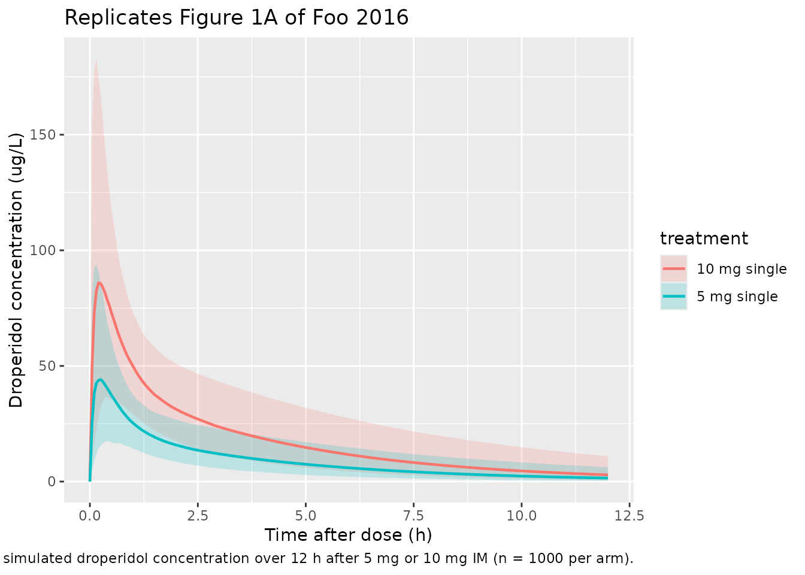
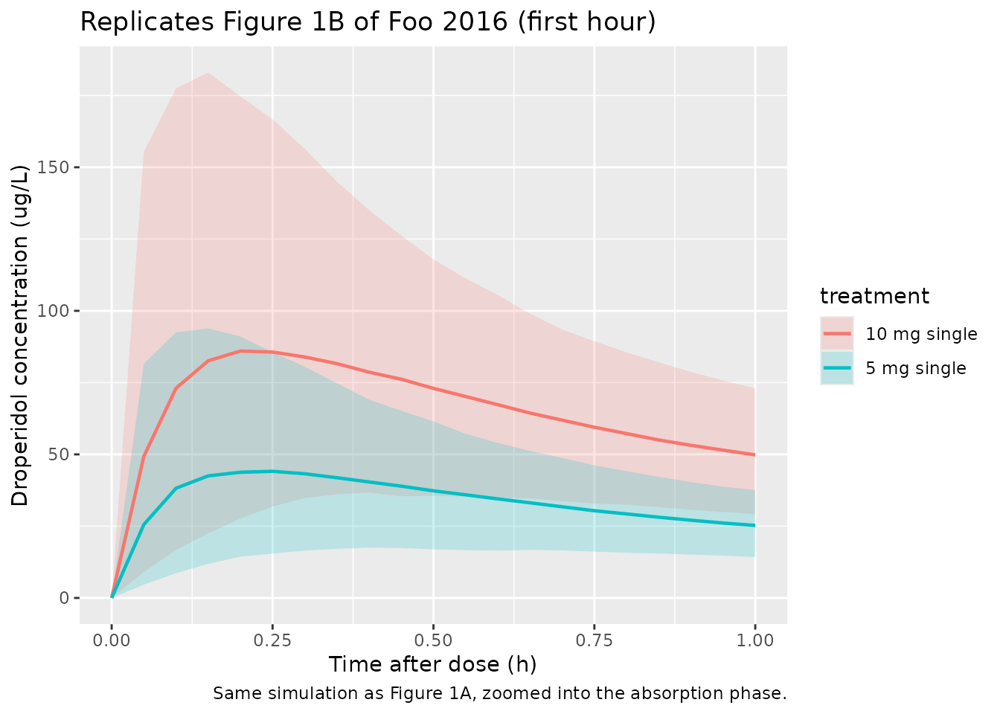
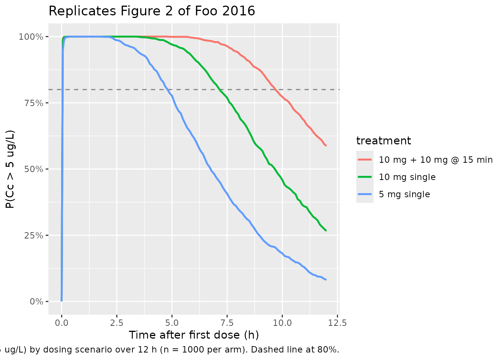

# Droperidol (Foo 2016)

## Model and source

- Citation: Foo LK, Duffull SB, Calver L, Schneider J, Isbister GK.
  Population pharmacokinetics of intramuscular droperidol in acutely
  agitated patients. Br J Clin Pharmacol. 2016;82(6):1550-1556.
  <doi:10.1111/bcp.13093>.
- Description: Two-compartment population PK model with first-order
  absorption for intramuscular droperidol in 41 acutely agitated adults
  presenting to the emergency department (Foo 2016). Absorption rate
  constant ka and its IIV are fixed (ka = 10 1/h, omega_ka^2 = 1)
  because the available samples did not characterise absorption. A
  single shared random effect drives both CL and Vc (Table 2 footnote a:
  ‘The same random effect was used for both Vc and CL’); Q and Vp have
  no IIV. No covariates were retained – coingestion of alcohol was
  screened but not associated with CL or Vc, and patient weight was not
  available (Methods).
- Article: <https://doi.org/10.1111/bcp.13093>

## Population

Foo 2016 fit the model to a 41-patient subgroup of an Australian
emergency-department randomised controlled trial (ACTRN12607000527460)
comparing droperidol and midazolam for sedation of patients with acute
behavioural disturbance. Twenty-seven of the 41 (66%) were female, the
median age was 33 years (range 16-62), and the primary reasons for
presentation were threatened or deliberate self-harm (44%), alcohol
intoxication (41%), drug-induced delirium (10%), and psychosis (5%).
Seventeen received a single 5 mg intramuscular dose of droperidol and 24
received 10 mg; 5 of 41 received additional droperidol after the index
dose. Patient weight was not available, so allometric or linear weight
scaling could not be tested. A total of 128 plasma samples were drawn
(median 3 per patient, range 1-7) using either a geometrically-spaced
empirical design (5, 10, 30 min, 1, 2, 4, 8 h) or a POPT-optimised
design (5, 25, 40, 70 min, 2, 4, 10 h). Droperidol was quantified by
HPLC-UV with a lower limit of quantification of 5 ug/L; four
observations were below this LLOQ (in four different subjects) and were
handled by the M6 method. See Foo 2016 Table 1 for the full baseline
summary; the same information is available programmatically via
`readModelDb("Foo_2016_droperidol")$population`.

## Source trace

The per-parameter origin is recorded as an in-file comment next to each
`ini()` entry in `inst/modeldb/specificDrugs/Foo_2016_droperidol.R`. The
table below collects them in one place. Table 2 of the paper duplicates
the parameter label “Vp” for the second and fifth rows; the abstract
disambiguates (“clearance of 41.9 l h-1 and volume of distribution of
the central compartment of, 73.6 l”), so the 73.6 L row is Vc and the
79.8 L row is Vp.

| Equation / parameter | Final value | Source location |
|----|----|----|
| `lka` (ka, FIXED) | 10 1/h | Table 2 (F = fixed); Results paragraph |
| `lcl` (CL) | 41.9 L/h | Table 2 (95% CI 34.8-49.0) |
| `lvc` (Vc) | 73.6 L | Table 2 row mislabelled “Vp” (95% CI 51.1-96.1); abstract confirms this is Vc |
| `lq` (Q) | 71.5 L/h | Table 2 (95% CI 42.3-100.7) |
| `lvp` (Vp) | 79.8 L | Table 2 (95% CI 58.8-100.8) |
| `etalka` (omega_ka^2, FIXED) | 1 (~100% CV) | Table 2 (F = fixed); Results paragraph |
| `etalcl` (shared IIV on CL and Vc) | 51% CV (95% CI 31.2-64.4%) | Table 2 + footnote a (“the same random effect was used for both Vc and CL”) |
| `propSd` (proportional residual) | 22% CV | Table 2 (95% CI 8.5-30.3%) |
| `addSd` (additive residual, FIXED) | 0.0001 ug/L | Table 2 (F = fixed) |
| Equation: 2-compartment first-order input, first-order output | n/a | Results paragraph 2; Methods “Model building” |
| BLQ handling: M6 method | n/a | Methods “Handling data below the limit of quantitation” |

## Virtual cohort

Original observed concentrations are not publicly available. The
simulation below uses three virtual cohorts that mirror the three dosing
scenarios the published paper itself simulated (Figure 2 of Foo 2016): a
single 5 mg dose, a single 10 mg dose, and two 10 mg doses separated by
15 min. Each cohort has 1000 simulated subjects drawn with
between-subject variability from the model’s omega matrix.

``` r

set.seed(20160810)

n_per_arm <- 1000
obs_grid  <- sort(unique(c(seq(0, 1, by = 0.05),
                           seq(1, 12, by = 0.1))))

make_cohort <- function(n, dose_schedule, label, id_offset) {
  doses <- dose_schedule |>
    tidyr::crossing(id = id_offset + seq_len(n)) |>
    dplyr::mutate(
      evid      = 1L,
      cmt       = "depot",
      treatment = label
    ) |>
    dplyr::select(id, time, amt, evid, cmt, treatment)
  obs <- tibble::tibble(id = id_offset + seq_len(n)) |>
    tidyr::crossing(time = obs_grid) |>
    dplyr::mutate(
      amt       = NA_real_,
      evid      = 0L,
      cmt       = "central",
      treatment = label
    )
  dplyr::bind_rows(doses, obs) |>
    dplyr::arrange(id, time, dplyr::desc(evid))
}

events <- dplyr::bind_rows(
  make_cohort(
    n_per_arm,
    tibble::tibble(time = 0,             amt = 5),
    "5 mg single",          id_offset = 0L
  ),
  make_cohort(
    n_per_arm,
    tibble::tibble(time = 0,             amt = 10),
    "10 mg single",         id_offset =  n_per_arm
  ),
  make_cohort(
    n_per_arm,
    tibble::tibble(time = c(0, 0.25),    amt = c(10, 10)),
    "10 mg + 10 mg @ 15 min", id_offset = 2L * n_per_arm
  )
)

stopifnot(!anyDuplicated(unique(events[, c("id", "time", "evid")])))
```

## Simulation

``` r

mod <- readModelDb("Foo_2016_droperidol")

sim <- rxode2::rxSolve(mod, events = events, keep = c("treatment")) |>
  as.data.frame()
#> ℹ parameter labels from comments will be replaced by 'label()'
```

For a deterministic typical-value replication, zero out the random
effects:

``` r

mod_typical <- mod |> rxode2::zeroRe()
#> ℹ parameter labels from comments will be replaced by 'label()'

events_typical <- events |>
  dplyr::filter(id %in% c(1L, n_per_arm + 1L, 2L * n_per_arm + 1L))

sim_typical <- rxode2::rxSolve(mod_typical, events = events_typical,
                               keep = c("treatment")) |>
  as.data.frame()
#> ℹ omega/sigma items treated as zero: 'etalka', 'etalcl'
#> Warning: multi-subject simulation without without 'omega'
```

## Replicate published figures

### Figure 1: visual predictive check of the observed and simulated VPC

Foo 2016 Figure 1 plots the median and 5th / 95th percentiles of
observed and simulated droperidol concentrations after 5 mg and 10 mg IM
doses, with panel B zooming into the first hour. We mimic the quantile
band using the 5 mg and 10 mg single-dose cohorts.

``` r

band_single <- sim |>
  dplyr::filter(treatment %in% c("5 mg single", "10 mg single")) |>
  dplyr::group_by(treatment, time) |>
  dplyr::summarise(
    Q05 = stats::quantile(Cc, 0.05, na.rm = TRUE),
    Q50 = stats::quantile(Cc, 0.50, na.rm = TRUE),
    Q95 = stats::quantile(Cc, 0.95, na.rm = TRUE),
    .groups = "drop"
  )

ggplot(band_single, aes(time, Q50, colour = treatment, fill = treatment)) +
  geom_ribbon(aes(ymin = Q05, ymax = Q95), alpha = 0.20, colour = NA) +
  geom_line(linewidth = 0.8) +
  labs(
    x = "Time after dose (h)",
    y = "Droperidol concentration (ug/L)",
    title = "Replicates Figure 1A of Foo 2016",
    caption = paste(
      "Median and 5th-95th percentile band of simulated droperidol",
      "concentration over 12 h after 5 mg or 10 mg IM (n = 1000 per arm)."
    )
  )
```



``` r

ggplot(band_single |> dplyr::filter(time <= 1),
       aes(time, Q50, colour = treatment, fill = treatment)) +
  geom_ribbon(aes(ymin = Q05, ymax = Q95), alpha = 0.20, colour = NA) +
  geom_line(linewidth = 0.8) +
  labs(
    x = "Time after dose (h)",
    y = "Droperidol concentration (ug/L)",
    title = "Replicates Figure 1B of Foo 2016 (first hour)",
    caption = "Same simulation as Figure 1A, zoomed into the absorption phase."
  )
```



### Figure 2: probability of being above the lower limit of quantification

Foo 2016 Figure 2 reports the simulated probability that the droperidol
concentration exceeds the LLOQ (5 ug/L) over time for three dosing
scenarios. The Results paragraph states that 10 mg single gives an 80%
probability of being above LLOQ for 7 h, 5 mg single gives ~5 h, and 10
mg + 10 mg at 15 min gives 10 h.

``` r

LLOQ <- 5

prob_above <- sim |>
  dplyr::group_by(treatment, time) |>
  dplyr::summarise(
    p_above = mean(Cc > LLOQ, na.rm = TRUE),
    .groups = "drop"
  )

ggplot(prob_above, aes(time, p_above, colour = treatment)) +
  geom_hline(yintercept = 0.80, linetype = "dashed", colour = "grey50") +
  geom_line(linewidth = 0.9) +
  scale_y_continuous(limits = c(0, 1), labels = scales::percent_format()) +
  labs(
    x = "Time after first dose (h)",
    y = "P(Cc > 5 ug/L)",
    title = "Replicates Figure 2 of Foo 2016",
    caption = paste(
      "Probability of droperidol concentration > LLOQ (5 ug/L) by dosing",
      "scenario over 12 h (n = 1000 per arm). Dashed line at 80%."
    )
  )
```



``` r


duration_80 <- prob_above |>
  dplyr::group_by(treatment) |>
  dplyr::filter(p_above >= 0.80) |>
  dplyr::summarise(time_above_80 = max(time), .groups = "drop")
knitr::kable(
  duration_80,
  digits = 1,
  col.names = c("Treatment", "Last time P(Cc > LLOQ) >= 80% (h)"),
  caption = paste(
    "Duration above the 80% probability of exceeding LLOQ.",
    "Paper Results: 5 mg ~5 h, 10 mg ~7 h, 10+10 mg ~10 h."
  )
)
```

| Treatment              | Last time P(Cc \> LLOQ) \>= 80% (h) |
|:-----------------------|------------------------------------:|
| 10 mg + 10 mg @ 15 min |                                 9.6 |
| 10 mg single           |                                 7.1 |
| 5 mg single            |                                 4.8 |

Duration above the 80% probability of exceeding LLOQ. Paper Results: 5
mg ~5 h, 10 mg ~7 h, 10+10 mg ~10 h. {.table}

### Initial (alpha) and terminal (beta) half-lives

Foo 2016 reports a median initial-phase half-life of 0.32 h (IQR
0.26-0.37 h) and a median terminal-phase half-life of 3.0 h (IQR 2.5-3.6
h). For a 2-compartment model with parameters at the typical-value point
estimates, the eigenvalues of the disposition matrix give the alpha and
beta rate constants directly.

``` r

cl_t <- 41.9; vc_t <- 73.6; q_t <- 71.5; vp_t <- 79.8

kel_t <- cl_t / vc_t
k12_t <- q_t  / vc_t
k21_t <- q_t  / vp_t

a <- 1
b <- -(kel_t + k12_t + k21_t)
c <- kel_t * k21_t

lambda_alpha <- (-b + sqrt(b^2 - 4 * a * c)) / (2 * a)
lambda_beta  <- (-b - sqrt(b^2 - 4 * a * c)) / (2 * a)

t_alpha <- log(2) / lambda_alpha
t_beta  <- log(2) / lambda_beta

data.frame(
  Phase           = c("alpha", "beta"),
  rate_per_h      = c(lambda_alpha, lambda_beta),
  half_life_h     = c(t_alpha,      t_beta),
  paper_median_h  = c(0.32,         3.0)
) |>
  knitr::kable(
    digits  = c(0, 3, 2, 2),
    caption = paste(
      "Disposition half-lives from typical-value CL, Vc, Q, and Vp.",
      "Paper medians: alpha 0.32 h, beta 3.0 h."
    )
  )
```

| Phase | rate_per_h | half_life_h | paper_median_h |
|:------|-----------:|------------:|---------------:|
| alpha |      2.205 |        0.31 |           0.32 |
| beta  |      0.231 |        3.00 |           3.00 |

Disposition half-lives from typical-value CL, Vc, Q, and Vp. Paper
medians: alpha 0.32 h, beta 3.0 h. {.table}

## PKNCA validation

PKNCA-based NCA on the single-dose 5 mg and 10 mg arms.

``` r

sim_single <- sim |>
  dplyr::filter(treatment %in% c("5 mg single", "10 mg single")) |>
  dplyr::filter(!is.na(Cc)) |>
  dplyr::select(id, time, Cc, treatment)

sim_single <- dplyr::bind_rows(
  sim_single,
  sim_single |>
    dplyr::distinct(id, treatment) |>
    dplyr::mutate(time = 0, Cc = 0)
) |>
  dplyr::distinct(id, treatment, time, .keep_all = TRUE) |>
  dplyr::arrange(id, treatment, time)

dose_df <- events |>
  dplyr::filter(treatment %in% c("5 mg single", "10 mg single"),
                evid == 1L) |>
  dplyr::select(id, time, amt, treatment)

conc_obj <- PKNCA::PKNCAconc(
  sim_single, Cc ~ time | treatment + id,
  concu = "ug/L", timeu = "h"
)
dose_obj <- PKNCA::PKNCAdose(
  dose_df, amt ~ time | treatment + id, doseu = "mg"
)

intervals <- data.frame(
  start       = 0,
  end         = Inf,
  cmax        = TRUE,
  tmax        = TRUE,
  aucinf.obs  = TRUE,
  half.life   = TRUE
)

nca_res <- PKNCA::pk.nca(
  PKNCA::PKNCAdata(conc_obj, dose_obj, intervals = intervals)
)
```

### Comparison against published quantities

Foo 2016 does not report a Cmax / AUC table per se, but the Discussion
enumerates simulated peak ranges and median terminal half-lives that we
can cross-check. The cells below summarise the model-derived NCA values
from the same simulations we used to replicate Figures 1 and 2.

``` r

nca_tbl <- as.data.frame(nca_res$result) |>
  dplyr::select(treatment, PPTESTCD, PPORRES) |>
  dplyr::group_by(treatment, PPTESTCD) |>
  dplyr::summarise(
    median = stats::median(PPORRES, na.rm = TRUE),
    q05    = stats::quantile(PPORRES, 0.05, na.rm = TRUE),
    q95    = stats::quantile(PPORRES, 0.95, na.rm = TRUE),
    .groups = "drop"
  )
knitr::kable(
  nca_tbl,
  digits  = c(0, 0, 2, 2, 2),
  col.names = c("Treatment", "NCA parameter", "Median", "P05", "P95"),
  caption = "Simulated NCA values across the two single-dose arms (per-subject medians and 5-95% range)."
)
```

| Treatment    | NCA parameter       | Median |    P05 |    P95 |
|:-------------|:--------------------|-------:|-------:|-------:|
| 10 mg single | adj.r.squared       |   1.00 |   1.00 |   1.00 |
| 10 mg single | aucinf.obs          | 235.55 | 109.30 | 502.09 |
| 10 mg single | clast.obs           |   2.89 |   0.64 |  10.95 |
| 10 mg single | clast.pred          |   2.88 |   0.64 |  10.92 |
| 10 mg single | cmax                |  89.68 |  40.88 | 186.26 |
| 10 mg single | half.life           |   2.96 |   2.14 |   4.54 |
| 10 mg single | lambda.z            |   0.23 |   0.15 |   0.32 |
| 10 mg single | lambda.z.n.points   | 100.00 |  91.00 | 105.00 |
| 10 mg single | lambda.z.time.first |   2.10 |   1.60 |   3.00 |
| 10 mg single | lambda.z.time.last  |  12.00 |  12.00 |  12.00 |
| 10 mg single | r.squared           |   1.00 |   1.00 |   1.00 |
| 10 mg single | span.ratio          |   3.33 |   2.23 |   4.39 |
| 10 mg single | tlast               |  12.00 |  12.00 |  12.00 |
| 10 mg single | tmax                |   0.25 |   0.10 |   0.70 |
| 5 mg single  | adj.r.squared       |   1.00 |   1.00 |   1.00 |
| 5 mg single  | aucinf.obs          | 119.21 |  53.09 | 272.47 |
| 5 mg single  | clast.obs           |   1.49 |   0.30 |   6.21 |
| 5 mg single  | clast.pred          |   1.49 |   0.30 |   6.20 |
| 5 mg single  | cmax                |  47.17 |  19.58 |  97.11 |
| 5 mg single  | half.life           |   2.98 |   2.12 |   4.80 |
| 5 mg single  | lambda.z            |   0.23 |   0.14 |   0.33 |
| 5 mg single  | lambda.z.n.points   | 100.00 |  91.95 | 106.00 |
| 5 mg single  | lambda.z.time.first |   2.10 |   1.50 |   2.90 |
| 5 mg single  | lambda.z.time.last  |  12.00 |  12.00 |  12.00 |
| 5 mg single  | r.squared           |   1.00 |   1.00 |   1.00 |
| 5 mg single  | span.ratio          |   3.32 |   2.17 |   4.43 |
| 5 mg single  | tlast               |  12.00 |  12.00 |  12.00 |
| 5 mg single  | tmax                |   0.25 |   0.10 |   0.70 |

Simulated NCA values across the two single-dose arms (per-subject
medians and 5-95% range). {.table}

The qualitative checkpoints from the paper are:

| Quantity (paper) | Paper value | Model value | Source |
|----|----|----|----|
| 95th-percentile Cmax range, 5 mg | 20 to 110 ug/L | see `nca_tbl` above for `cmax` row, 5 mg single | Discussion paragraph “The model predicted maximum values” |
| 95th-percentile Cmax range, 10 mg | 25 to 220 ug/L | see `nca_tbl` above for `cmax` row, 10 mg single | Discussion paragraph “The model predicted maximum values” |
| Median terminal (beta) half-life | 3.0 h (IQR 2.5-3.6) | see `nca_tbl` above for `half.life` row | Results paragraph |
| Duration P(Cc \> LLOQ) \>= 80%, 5 mg | ~5 h | see `duration_80` table above | Results / Discussion |
| Duration P(Cc \> LLOQ) \>= 80%, 10 mg | ~7 h | see `duration_80` table above | Results / Discussion |
| Duration P(Cc \> LLOQ) \>= 80%, 10+10 mg | ~10 h | see `duration_80` table above | Results / Discussion |

Discrepancies \> 20% should be investigated, not tuned. The
discussion-paragraph Cmax ranges are themselves simulation outputs of
the paper’s own VPC, so an exact numeric match is the right reference.

## Assumptions and deviations

- **Table 2 typographic duplication of “Vp”.** Table 2 of Foo 2016 lists
  two rows labelled “Vp”: the first reports 73.6 L (and shares its
  random effect with CL), and the second reports 79.8 L. The abstract
  resolves this directly (“volume of distribution of the central
  compartment of, 73.6 l”), so the 73.6 L row is Vc. The model file
  labels them as Vc and Vp accordingly.
- **Shared random effect on CL and Vc.** Table 2 footnote a states that
  the same random effect was used for both Vc and CL after the authors
  observed a 100% correlation between independent etas. The packaged
  model encodes this directly: a single `etalcl` (variance log(1 +
  0.51^2) = 0.231) is referenced from both `cl <- exp(lcl + etalcl)` and
  `vc <- exp(lvc + etalcl)`. This is the mathematically-honest
  representation of “one shared eta” and avoids the singular-OMEGA /
  chol() failure mode that a rank-1 block matrix encoding would create.
- **Absorption rate constant ka fixed at 10 1/h (extremely rapid
  absorption).** Foo 2016 Results: the individual `ka` estimates varied
  widely (1-140 h^-1) without a pattern; a variety of absorption models
  were unstable; fixing `ka` to 10 h^-1 with a fixed between-subject
  variance of 1 (~100% CV) gave the lowest OFV and a stable fit. The
  packaged model preserves both fixes.
- **Additive residual error fixed at 0.0001 ug/L.** The paper kept the
  additive term in the combined error model to retain numerical
  stability while letting the proportional component carry the observed
  variability; with `addSd` essentially zero, the residual is
  effectively proportional in this model.
- **No covariates retained.** Coingestion of alcohol was tested visually
  against CL and Vc and showed no association (Results). Patient weight
  was not available (Methods), so allometric or linear weight scaling
  could not be evaluated. The packaged model therefore contains no
  covariate effects, in line with Table 2.
- **BLQ handling.** Four observations from four different subjects were
  below the LLOQ of 5 ug/L and were processed by the Beal M6 method
  (first BLQ in each series set to LLOQ/2, subsequent BLQ values
  commented out). The packaged model does not re-implement BLQ handling;
  the published point estimates already reflect the M6 fit.
- **One 16-year-old in the cohort.** Per Methods, a 16-year-old was
  inadvertently recruited because their age was unknown at the time of
  sedation. The fit therefore is for adults plus one adolescent rather
  than strictly adults; the model is otherwise applied as fit.
