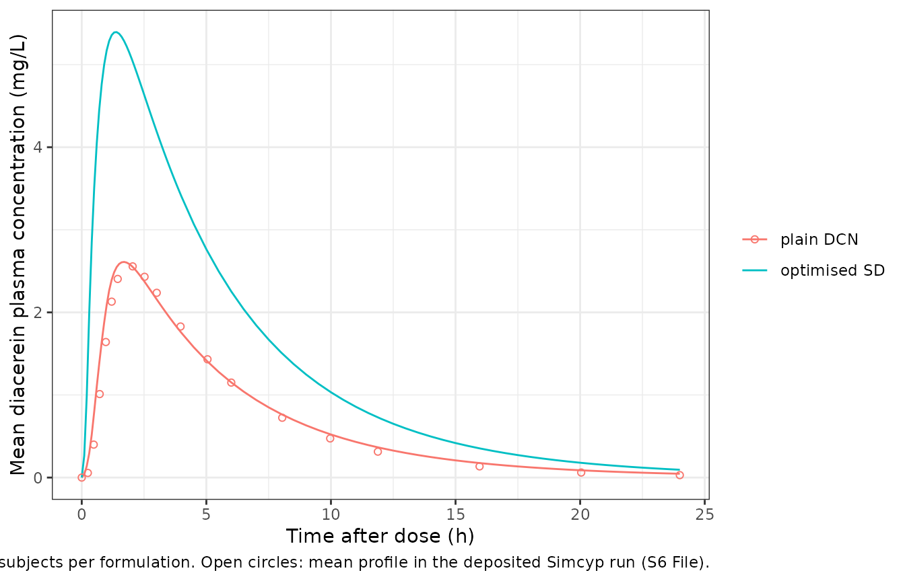

# Diacerein (Fouad 2021)

## Model and source

- Citation: Fouad SA, Malaak FA, El-Nabarawi MA, Abu Zeid K, Ghoneim AM.
  (2021). Preparation of solid dispersion systems for enhanced
  dissolution of poorly water soluble diacerein: In-vitro evaluation,
  optimization and physiologically based pharmacokinetic modeling. PLoS
  ONE 16(1):e0245482. <doi:10.1371/journal.pone.0245482>.
- Description: PBPK reduction (Simcyp version 17, minimal PBPK with ADAM
  absorption). One-compartment oral pharmacokinetic model of diacerein
  in healthy adults, reduced from the Simcyp model Fouad 2021 used to
  compare plain crystalline diacerein with an optimised PEG 8000 solid
  dispersion (drug:polymer 1:4 w/w). The source model has no single
  adjusting compartment, a predicted Vss of 0.093 L/kg and an in-vivo
  oral clearance input of 1.5 L/h (30% CV), with hepatic and gut
  extraction both equal to 1, so the plasma profile is
  one-compartmental. Absorption is driven by the formulation’s in-vitro
  dissolution profile (released drug per hour, linearly interpolated,
  held flat after 1 h) followed by first-order absorption of dissolved
  drug at the Simcyp-predicted first-order equivalent ka (2.098 1/h,
  fraction absorbed 0.992). No parameter is fitted. The reduction
  reproduces the source’s simulated Cmax and AUC0-24 for both
  formulations to within about 6%, but peaks earlier because gastric
  emptying and small-intestinal transit are not represented. The model
  is valid for single doses and for repeat doses given at least 1 h
  apart. The geriatric simulation used a different (mechanistic
  diffusion-layer) dissolution model and Simcyp geriatric physiology and
  is not reproducible from this model.
- Article: <https://doi.org/10.1371/journal.pone.0245482>
- Supporting information (S1-S8 Files):
  <https://www.ncbi.nlm.nih.gov/pmc/articles/PMC7816977/>

## What this model is, and what it is not

Fouad 2021 prepared solid dispersions of the poorly water-soluble
anti-osteoarthritis drug diacerein, selected an optimised system (PEG
8000, drug:polymer 1:4 w/w) by an I-optimal factorial design, and used
the Simcyp Population-based Simulator (version 17) to predict how the
faster in-vitro dissolution of that system would change plasma exposure
after a single 50 mg oral dose in healthy adults and in geriatric
subjects (Table 6, Figure 15).

The article describes the compound layer only briefly (Table 3). The
Simcyp workbooks deposited as S6-S8 Files record the whole input set,
and they show that the healthy-adult model is:

- **absorption:** the ADAM model, fed by the formulation’s measured
  in-vitro dissolution profile (a “discrete” profile, linearly
  interpolated), with a global effective permeability of 4.80e-4 cm/s.
  For a dissolved dose Simcyp converts that permeability to a
  first-order equivalent of `ka` = 2.098 1/h with 99.2% absorbed.
- **distribution:** the minimal PBPK model with **no** single adjusting
  compartment, and a Vss predicted by the Rodgers and Rowland method of
  0.093 L/kg.
- **elimination:** an in-vivo oral clearance of 1.5 L/h (30% CV). The
  gut-wall and hepatic availabilities are both 1.

With no adjusting compartment the minimal PBPK model has a single
systemic volume, so its plasma profile is one-compartmental. This
package ships that reduction. Doses go into `depot`, which holds
undissolved drug. Drug is released into `gut_lumen` at the slope of the
dissolution profile, and dissolved drug is absorbed at the first-order
`ka` into `central`. The formulation covariate `FORM_DCN_SD` selects the
plain-drug or the optimised-solid-dispersion dissolution profile. The
sections below show that, with no fitted parameter, the reduction
reproduces the article’s Cmax and AUC0-24 for both formulations to
within about 6%.

**What is not reproduced.** The model leaves out the ADAM model’s
gastric emptying and small-intestinal transit, so it peaks earlier than
the source. The geriatric simulation (S7 File) used a different,
mechanistic diffusion-layer dissolution model with Simcyp geriatric
physiology, and its deposited results do not match the printed Table 6
row. See [Assumptions and deviations](#assumptions-and-deviations).

## Population

The source simulations used the Simcyp Sim-Healthy Volunteers population
(version 17), fasted, with a single 50 mg oral dose taken with water.
The deposited healthy-adult workbooks give ages 20-60 years, 50% female,
and one trial of 10 subjects. The Methods text instead describes ten
trials of ten subjects and an age range of 40-55 years. The source model
was checked against the single-dose bioequivalence study of Nguyen et
al. (reference 1 of the article) of diacerein 50 mg capsules in healthy
Vietnamese volunteers.

The same information is available programmatically via
`readModelDb("Fouad_2021_diacerein")()$population`.

## Source trace

| Parameter / equation | Value | Source location |
|----|----|----|
| `lka` | 2.098 1/h | S6 File, ‘Input Sheet’, Absorption: `ka (1/h)` (input type ‘Predicted’, from `Peff,man` 4.80e-4 cm/s) |
| `lfdepot` | 0.992 | S6 File, ‘Input Sheet’, Absorption: `fa` (predicted); ‘Summary’ `Fg (Sub)` = `Fh (Sub)` = 1 |
| `lvc` | 6.512 L at 70 kg | S6 File, ‘Input Sheet’, Distribution: `Vss (L/kg)` = 0.09303 (predicted, Method 2), x 70 kg; minimal PBPK with `Vsac` = 1e-5 L/kg |
| `lcl` | 1.5 L/h | Table 3 (`CL (L/h)` 1.5); S6 File ‘Input Sheet’, Elimination: `CL (po) (L/h)` = 1.5, ‘In Vivo Clearance’ |
| `etalcl` | 0.0862 | S6 File ‘Input Sheet’, `CV CL (po) (%)` = 30; log(1 + 0.30^2) |
| `propSd` | 0 (fixed) | Not reported; PBPK simulation analysis with no residual-error model |
| plain-drug release profile | 0, 13.27, 32.90, 42.30, 48.30% at 0-1 h | S6 File ‘Input Sheet’, ‘Dissolution Profile (All)’ (S2 File, row ‘Diacerein (Raw)’, at 15-min steps) |
| solid-dispersion release profile | 0, 95.197, 96.148, 98.349, 99.127% at 0-1 h | S2 File, sheet ‘Dissolution Data’, row ‘OPTIMIZED’ (15-60 min) |
| `vc <- exp(lvc) * WT / 70` | n/a | Vss is predicted per kg |
| `d/dt(depot)`, `d/dt(gut_lumen)`, `d/dt(central)` | n/a | Discrete dissolution input (ADAM), first-order absorption of dissolved drug, one systemic volume (minimal PBPK without SAC) |

### Reproducing the packaged values

``` r

ini_vals <- rxode2::rxode(readModelDb("Fouad_2021_diacerein"))$iniDf
packaged <- setNames(ini_vals$est, ini_vals$name)

vss_perkg <- 0.093026958 # S6 File, 'Vss (L/kg)'
stopifnot(
  abs(exp(packaged[["lka"]]) - 2.098) < 1e-8,
  abs(exp(packaged[["lfdepot"]]) - 0.992) < 1e-8,
  abs(exp(packaged[["lcl"]]) - 1.5) < 1e-8,
  abs(exp(packaged[["lvc"]]) - vss_perkg * 70) < 1e-3,
  abs(packaged[["etalcl"]] - log(1 + 0.30^2)) < 1e-4
)
cat("Packaged ini() values match the deposited Simcyp inputs.\n")
#> Packaged ini() values match the deposited Simcyp inputs.
```

## Typical-value checks

These checks use one 70 kg subject per formulation with the random
effect set to zero, so they are deterministic.

``` r

mod <- readModelDb("Fouad_2021_diacerein")
mod_typ <- rxode2::zeroRe(rxode2::rxode(mod))

tgrid <- sort(unique(c(seq(0, 4, by = 0.01), seq(4, 96, by = 0.1))))
typ_events <- function(form) {
  dplyr::bind_rows(
    data.frame(id = 1L, time = 0, amt = 50, evid = 1L, cmt = "depot"),
    data.frame(id = 1L, time = tgrid, amt = 0, evid = 0L, cmt = "central")
  ) |>
    dplyr::mutate(WT = 70, FORM_DCN_SD = form)
}
typ <- dplyr::bind_rows(lapply(c(0, 1), function(form) {
  as.data.frame(rxode2::rxSolve(mod_typ, typ_events(form),
                                atol = 1e-10, rtol = 1e-10)) |>
    dplyr::mutate(FORM_DCN_SD = form)
}))
#> ℹ omega/sigma items treated as zero: 'etalcl'
#> ℹ omega/sigma items treated as zero: 'etalcl'

trap <- function(t, y) sum(diff(t) * (head(y, -1) + tail(y, -1)) / 2)
typ_sum <- typ |>
  dplyr::group_by(FORM_DCN_SD) |>
  dplyr::summarise(
    cmax = max(Cc),
    tmax = time[which.max(Cc)],
    auc24 = trap(time[time <= 24], Cc[time <= 24]),
    aucinf = trap(time, Cc) + dplyr::last(Cc) / (1.5 / (vss_perkg * 70)),
    undissolved = dplyr::last(depot),
    .groups = "drop"
  ) |>
  dplyr::mutate(
    frac_dissolved = c(0.4830, 0.99127),
    f_expected = 0.992 * frac_dissolved
  )
knitr::kable(typ_sum, digits = 3,
             caption = "Typical 70 kg subject, 50 mg single dose.")
```

| FORM_DCN_SD |  cmax | tmax |  auc24 | aucinf | undissolved | frac_dissolved | f_expected |
|------------:|------:|-----:|-------:|-------:|------------:|---------------:|-----------:|
|           0 | 2.756 | 1.68 | 15.893 | 15.972 |      25.850 |          0.483 |      0.479 |
|           1 | 5.720 | 1.35 | 32.627 | 32.779 |       0.436 |          0.991 |      0.983 |

Typical 70 kg subject, 50 mg single dose. {.table}

**Mass balance.** Clearance times AUC0-inf must equal the absorbed dose.
That is the dissolved fraction at 1 h times the 99.2% absorbed.

``` r

stopifnot(
  all(abs(1.5 * typ_sum$aucinf / (50 * typ_sum$f_expected) - 1) < 1e-3),
  # The undissolved plain-drug residue stays in the depot, as in the source.
  abs(typ_sum$undissolved[1] - 50 * (1 - 0.4830)) < 1e-3
)
```

**Fraction absorbed.** For plain diacerein the model absorbs 0.479 of
the dose. The deposited run reports `fa (Subs)` = 0.470, 1.9% lower.
This fraction is set by the dissolution profile alone, so the agreement
confirms that the profile is held at 48.3% after 1 h rather than
extrapolated.

``` r

stopifnot(abs(typ_sum$f_expected[1] / 0.470 - 1) < 0.03)
```

**Which Vss was used.** Table 3 of the article lists `Vss` = 0.23 L/kg
from Nicolas 1998. The deposited workbooks use the Simcyp-predicted
0.093 L/kg. Only the predicted value reproduces the Table 6 exposures:

``` r

cmax_023 <- sapply(c(0, 1), function(form) {
  max(as.data.frame(rxode2::rxSolve(mod_typ, typ_events(form),
                                    params = c(lvc = log(0.23 * 70))))$Cc)
})
#> ℹ omega/sigma items treated as zero: 'etalcl'
#> ℹ omega/sigma items treated as zero: 'etalcl'
vss_tab <- data.frame(
  formulation = c("plain", "optimised SD"),
  table6_cmax = c(2.61, 5.46),
  cmax_vss_0093 = typ_sum$cmax,
  cmax_vss_023 = cmax_023
)
knitr::kable(vss_tab, digits = 2,
             caption = "Typical Cmax (mg/L) under the two candidate Vss values.")
```

| formulation  | table6_cmax | cmax_vss_0093 | cmax_vss_023 |
|:-------------|------------:|--------------:|-------------:|
| plain        |        2.61 |          2.76 |         1.28 |
| optimised SD |        5.46 |          5.72 |         2.64 |

Typical Cmax (mg/L) under the two candidate Vss values. {.table}

``` r

stopifnot(
  all(abs(vss_tab$cmax_vss_0093 / vss_tab$table6_cmax - 1) < 0.10),
  all(vss_tab$cmax_vss_023 / vss_tab$table6_cmax < 0.55)
)
```

With 0.23 L/kg the typical Cmax is less than half of the Table 6 values
for both formulations, so the Table 3 entry is the literature value the
authors cited, not the value the simulation used.

## Virtual cohort

200 subjects per formulation, matching the deposited population’s 50%
female share. The Simcyp body weights are not reported. Weight is drawn
log-normally around a median of 75 kg (CV 15%) and restricted to 50-110
kg by redrawing, which is an assumption made here. Clearance varies by
the model’s 30% CV. Observations are placed on the `central` ODE state,
and `Cc` is returned as an algebraic observable on those rows.

``` r

set.seed(20210120)
rxode2::rxSetSeed(20210120)
n_arm <- 200
draw_wt <- function(n) {
  wt <- numeric(0)
  while (length(wt) < n) {
    x <- 75 * exp(rnorm(n, 0, 0.15))
    wt <- c(wt, x[x >= 50 & x <= 110])
  }
  wt[seq_len(n)]
}
subjects <- data.frame(
  id = seq_len(2 * n_arm),
  FORM_DCN_SD = rep(c(0, 1), each = n_arm),
  WT = c(draw_wt(n_arm), draw_wt(n_arm))
) |>
  dplyr::mutate(treatment = ifelse(FORM_DCN_SD == 1, "optimised SD", "plain DCN"))

obs_times <- sort(unique(c(seq(0, 4, by = 0.1), seq(4.5, 24, by = 0.5))))
events <- dplyr::bind_rows(
  subjects |> dplyr::mutate(time = 0, amt = 50, evid = 1L, cmt = "depot"),
  tidyr::crossing(subjects, time = obs_times) |>
    dplyr::mutate(amt = 0, evid = 0L, cmt = "central")
) |>
  dplyr::arrange(id, time, dplyr::desc(evid))

sim <- as.data.frame(rxode2::rxSolve(mod, events, keep = c("treatment", "WT"))) |>
  dplyr::mutate(treatment = factor(treatment, c("plain DCN", "optimised SD")))
```

## Replicating Figure 15

``` r

deposit_plain <- data.frame(
  # S6 File, sheet 'Conc Profiles CSys(CPlasma)', 'CSys Mean (mg/L)'
  # (nearest solver time to each listed time).
  time = c(0, 0.244, 0.481, 0.720, 0.966, 1.201, 1.443, 2.043, 2.520, 3.009,
           3.965, 5.047, 6.000, 8.045, 9.969, 11.883, 15.964, 20.043, 24),
  Cc = c(0, 0.05607, 0.3990, 1.011, 1.641, 2.130, 2.405, 2.557, 2.431, 2.237,
         1.829, 1.432, 1.150, 0.7242, 0.4737, 0.3137, 0.1352, 0.06104, 0.02928),
  treatment = factor("plain DCN", c("plain DCN", "optimised SD"))
)
sim_mean <- sim |>
  dplyr::group_by(treatment, time) |>
  dplyr::summarise(Cc = mean(Cc), .groups = "drop")

ggplot(sim_mean, aes(time, Cc, colour = treatment)) +
  geom_line() +
  geom_point(data = deposit_plain, shape = 1) +
  labs(x = "Time after dose (h)", y = "Mean diacerein plasma concentration (mg/L)",
       colour = NULL,
       caption = paste("Lines: this model, mean of 200 simulated subjects per formulation.",
                       "Open circles: mean profile in the deposited Simcyp run (S6 File).")) +
  theme_bw()
```



Replicates Figure 15 of Fouad 2021 (healthy adults). The model rises
earlier than the Simcyp profile because gastric emptying and
small-intestinal transit are not represented. From about 1.5 to 8 h the
two plain-drug curves agree to within 7%. After that the model declines
more slowly: the ten subjects of the deposited run have a mean oral
clearance of 1.64 L/h (S6 File, ‘Summary’), 9% above the 1.5 L/h typical
value, while the simulated cohort is centred on 1.5 L/h. The late tail
is below 15% of Cmax and adds little to the AUC.

## PKNCA validation

``` r

conc <- sim |>
  dplyr::filter(!is.na(Cc)) |>
  dplyr::select(id, treatment, time, Cc)
conc <- dplyr::bind_rows(
  conc,
  conc |> dplyr::distinct(id, treatment) |> dplyr::mutate(time = 0, Cc = 0)
) |>
  dplyr::distinct(id, treatment, time, .keep_all = TRUE) |>
  dplyr::arrange(id, time)
dose <- subjects |>
  dplyr::mutate(time = 0, amt = 50) |>
  dplyr::select(id, treatment, time, amt)

nca <- PKNCA::pk.nca(PKNCA::PKNCAdata(
  PKNCA::PKNCAconc(conc, Cc ~ time | treatment + id, concu = "mg/L", timeu = "h"),
  PKNCA::PKNCAdose(dose, amt ~ time | treatment + id, doseu = "mg"),
  intervals = data.frame(start = 0, end = 24, cmax = TRUE, tmax = TRUE,
                         auclast = TRUE)
))
nca_df <- as.data.frame(nca)
```

### Comparison against Table 6

Table 6 reports the arithmetic mean Cmax and AUC0-24 and the median Tmax
(footnotes a and b). The simulated values below use the same statistics.

``` r

simulated <- nca_df |>
  dplyr::filter(PPTESTCD %in% c("cmax", "tmax", "auclast")) |>
  dplyr::group_by(treatment, PPTESTCD) |>
  dplyr::summarise(
    PPORRES = ifelse(dplyr::first(PPTESTCD) == "tmax",
                     stats::median(PPORRES), mean(PPORRES)),
    .groups = "drop"
  ) |>
  tidyr::pivot_wider(names_from = PPTESTCD, values_from = PPORRES) |>
  dplyr::mutate(treatment = as.character(treatment))

published <- data.frame(
  treatment = c("plain DCN", "optimised SD"),
  cmax = c(2.61, 5.46),
  tmax = c(1.85, 1.80),
  auclast = c(15.48, 35.53)
)

cmp <- nlmixr2lib::ncaComparisonTable(
  simulated = simulated,
  reference = published,
  by = "treatment",
  units = c(cmax = "mg/L", tmax = "h", auclast = "mg*h/L"),
  tolerance_pct = 20
)
knitr::kable(
  cmp,
  caption = paste("Simulated vs. Fouad 2021 Table 6 (healthy adults, 50 mg).",
                  "* differs from the reference by >20%.")
)
```

| NCA parameter     | treatment    | Reference | Simulated | % diff   |
|:------------------|:-------------|:----------|:----------|:---------|
| Cmax (mg/L)       | plain DCN    | 2.61      | 2.62      | +0.4%    |
| Cmax (mg/L)       | optimised SD | 5.46      | 5.41      | -0.8%    |
| Tmax (h)          | plain DCN    | 1.85      | 1.7       | -8.1%    |
| Tmax (h)          | optimised SD | 1.8       | 1.4       | -22.2%\* |
| AUClast (mg\*h/L) | plain DCN    | 15.5      | 16.4      | +5.8%    |
| AUClast (mg\*h/L) | optimised SD | 35.5      | 33.9      | -4.7%    |

Simulated vs. Fouad 2021 Table 6 (healthy adults, 50 mg). \* differs
from the reference by \>20%. {.table}

``` r

chk <- dplyr::inner_join(simulated, published, by = "treatment",
                         suffix = c("_sim", "_pub")) |>
  dplyr::mutate(
    cmax_pct = 100 * (cmax_sim / cmax_pub - 1),
    auc_pct = 100 * (auclast_sim / auclast_pub - 1)
  )
# Centre-of-distribution comparisons (means of 200 subjects); a mistyped
# clearance, volume, dose or dissolution profile moves these by tens of
# percent.
stopifnot(
  nrow(chk) == 2,
  all(abs(chk$cmax_pct) < 15),
  all(abs(chk$auc_pct) < 15)
)
```

Cmax agrees with Table 6 to within about 1% and AUC0-24 to within about
6% for both formulations. Three differences are expected:

- **Tmax is earlier**, by about 0.15 h for plain diacerein and about 0.4
  h for the solid dispersion. The ADAM model delays absorption through
  gastric emptying and transit down the small intestine, and this
  reduction leaves both out. The delay shows up most for the solid
  dispersion, whose release is almost complete within 5 minutes.
- **The plain-drug AUC is about 6% higher** than Table 6, because the
  ten deposited subjects happen to clear the drug 9% faster than the
  typical value (see Figure 15 above).
- **The solid-dispersion AUC is about 5% lower** than Table 6. The
  Simcyp run for this arm is not deposited, and its virtual subjects
  (the Methods text describes 100) are not the ten in the deposited
  plain-drug run. Table 6 implies a relative bioavailability of 229.5%,
  but with the plain drug absorbing 47.0% and at most 99.2% of any
  dissolved dose absorbed, the same subjects cannot exceed 0.992 / 0.470
  = 211%. So the published ratio compares different virtual samples.

## Assumptions and deviations

- **One-compartment reduction of a minimal PBPK model.** The source has
  no single adjusting compartment (`Vsac` = 1e-5 L/kg), so the
  Simcyp-predicted Vss is used as the single systemic volume. The small
  liver and portal compartments are lumped into it, which is harmless
  here because hepatic extraction is negligible (`Fh` = 1).
- **ADAM absorption replaced by release plus first-order absorption.**
  The dissolution profile is applied as the release rate, as in the
  source’s “discrete” dissolution input. Dissolved drug is absorbed at
  the Simcyp-predicted first-order equivalent `ka` (2.098 1/h) with
  99.2% absorbed. Gastric emptying, regional transit, luminal pH and
  fluid volumes are not represented, which makes Tmax earlier (see
  above). The 10% between-subject CV that the source applies to each
  dissolution time point is not carried over.
- **Dissolution profile after 1 h.** Both profiles end at 60 minutes,
  and the source holds them at their last value. The undissolved
  remainder (51.7% of a plain dose) is therefore never absorbed. The
  release clock restarts at each dose (`tad(depot)`, `podo(depot)`), so
  repeat doses are handled exactly when they are at least 1 h apart.
- **Solid-dispersion input.** The healthy-adult solid-dispersion
  workbook is not deposited. The S8 File, labelled “Simulation of
  optimized SD in healthy volunteers”, has the same inputs and results
  as the plain-drug S6 File. The mean in-vitro profile of the optimised
  system (S2 File, row ‘OPTIMIZED’) is used on the same 15-minute grid
  as the plain-drug run. Using the full 5-minute grid changes the
  typical Cmax by less than 0.1% and Tmax by 0.07 h.
- **Clearance.** The source’s in-vivo oral clearance (1.5 L/h) is used
  as the systemic clearance. With gut-wall and hepatic availability both
  equal to 1, the two differ only by the 0.8% of dissolved drug that is
  not absorbed. Clearance is not scaled by body weight.
- **Body weight.** The Simcyp population weights are not reported.
  Volume is scaled linearly from a 70 kg reference, and the virtual
  cohort assumes a median of 75 kg.
- **Vss in Table 3.** Table 3 prints `Vss` = 0.23 L/kg, but the
  simulation used the Simcyp-predicted 0.093 L/kg, and only the latter
  reproduces Table 6 (see [Which Vss was used](#typical-value-checks)).
- **Cohort size.** The Methods describe ten trials of ten subjects. The
  deposited healthy-adult workbooks contain one trial of ten, and their
  summary statistics are the Table 6 plain-drug row exactly.
- **Geriatric simulation not reproduced.** The geriatric
  solid-dispersion run (S7 File) replaces the discrete profile with the
  mechanistic diffusion-layer dissolution model (10 um monodispersed
  particles, a precipitation model and bile-micelle solubilisation) and
  uses the Simcyp Sim-Geriatric NEC population. Its deposited results
  (Cmax 5.27 mg/L, AUC0-24 37.47 mg*h/L) also differ from the printed
  Table 6 row (5.70 mg/L, 40.56 mg*h/L). Neither can be rebuilt from
  published values.
- **Analyte.** The source simulates diacerein itself (MW 368.29 g/mol,
  pKa 3.37). Its clearance, unbound fraction and cited Vss come from the
  review of Nicolas et al. (1998). In clinical studies diacerein is
  usually measured as its active metabolite, rhein. The model keeps the
  source’s labelling.
- **Clinical comparison.** The article checks the solid-dispersion
  prediction against the bioequivalence study of Nguyen et al. (Cmax
  5.47 ug/mL, Tmax 2.5 h, AUC0-24 31.11 ug\*h/mL for marketed 50 mg
  capsules). That study is not a solid-dispersion study, so it is not
  used as a validation target here.
- **No residual error, no fitted parameters.** The source is a
  simulation study. Residual error is fixed at zero, and the only
  between-subject variability carried over is the 30% CV on clearance.
