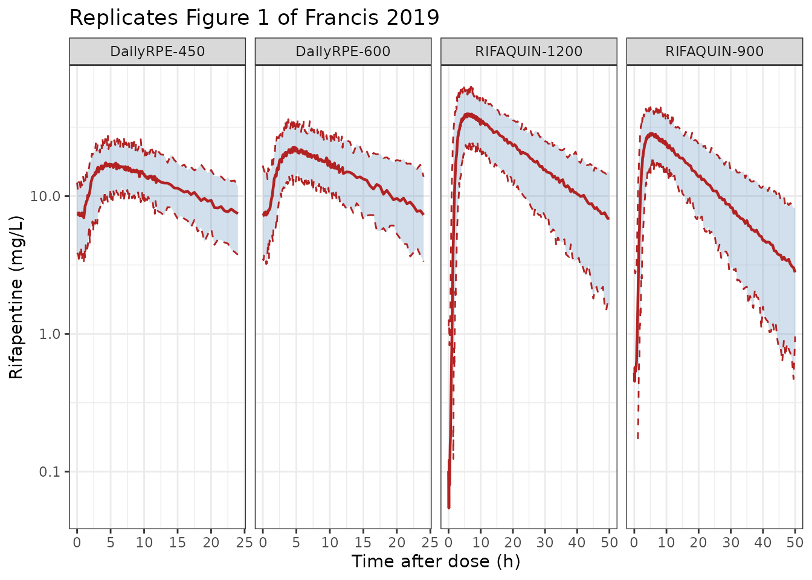

# Rifapentine (Francis 2019)

## Model and source

``` r

mod <- rxode2::rxode2(readModelDb("Francis_2019_rifapentine"))
```

- Citation: Francis J, Zvada SP, Denti P, Hatherill M, Charalambous S,
  Mungofa S, Dawson R, Dorman S, Gupte N, Wiesner L, Jindani A, Harrison
  TS, Olagunju A, Egan D, Owen A, McIlleron HM. (2019). A population
  pharmacokinetic analysis shows that arylacetamide deacetylase (AADAC)
  gene polymorphism and HIV infection affect the exposure of
  rifapentine. Antimicrob Agents Chemother 63(4):e01964-18.
  <doi:10.1128/AAC.01964-18>.
- Description: One-compartment population pharmacokinetic model with
  first-order elimination and Savic transit-compartment absorption (NN =
  10.2, MTT = 1.47 h) followed by a separate first-order absorption step
  (ka = 0.814 1/h) for oral rifapentine in 326 southern African adults
  with drug-susceptible pulmonary tuberculosis pooled from two trials
  (RIFAQUIN, 900 mg twice weekly or 1,200 mg once weekly in the
  continuation phase; Daily RPE, 450 or 600 mg daily in the intensive
  phase). Clearance is allometrically scaled on fat-free mass (reference
  46 kg, exponent 0.75 fixed) and apparent volume on total body weight
  (reference 56 kg, exponent 1 fixed), giving typical values CL = 1.33
  L/h and V = 25 L. Four covariate effects are carried: AADAC rs1803155
  AA homozygotes have 10.4% lower clearance (the paper’s headline
  pharmacogenetic finding), the RIFAQUIN 1,200-mg-once-weekly arm has
  13.2% lower clearance, HIV-positive patients have 21.9% lower
  bioavailability, and Daily RPE participants have 23.3% lower
  bioavailability than RIFAQUIN participants (attributed to
  non-standardised meals). Bioavailability is fixed to 1 in the RIFAQUIN
  HIV-negative reference. Inter-individual variability is on CL
  (23.0% CV) and V (12.8% CV); the paper’s inter-occasion variability on
  ka (48.9% CV), MTT (37.4% CV) and NN (20.3% CV) is carried as
  single-draw random effects because the source does not enumerate
  occasions - see the vignette Assumptions and deviations. Residual
  variability is combined additive (0.247 mg/L) plus proportional
  (9.56%).
- Article:
  [doi:10.1128/AAC.01964-18](https://doi.org/10.1128/AAC.01964-18)

Rifapentine is a long-acting rifamycin used to treat drug-susceptible
tuberculosis. Its primary metabolic route is deacetylation to
25-desacetyl rifapentine by arylacetamide deacetylase (AADAC), which is
why that gene is the pharmacogenetic candidate of interest. Francis 2019
pooled two southern African trials to ask whether functionally
significant polymorphisms affecting OATP1B1, the pregnane X receptor,
the constitutive androstane receptor and AADAC change rifapentine
exposure. Five SNPs were genotyped and reported in Table 3 – `SLCO1B1`
rs2306283 and rs4149032, `NR1I2` rs2472677 and rs1523130, and `AADAC`
rs1803155 – and only `AADAC` rs1803155 was retained in the final model.

## Population

The analysis pooled 1,144 rifapentine plasma concentrations from 326
patients with drug-susceptible pulmonary tuberculosis (1,151 measured; 7
below the 0.156 mg/L LLOQ were omitted). Patients came from two trials:
the phase III RIFAQUIN study (ISRCTN44153044), whose continuation-phase
arms gave 1,200 mg rifapentine once weekly (n = 125) or 900 mg twice
weekly (n = 116) alongside moxifloxacin, and the Daily RPE study
(NCT00814671), in which 450 mg (n = 44) or 600 mg (n = 41) rifapentine
daily replaced rifampin during the intensive phase. Median age was 32
years (range 18-80), median weight 56 kg (38-94), median fat-free mass
45 kg (27-62); 108 of 326 (33.1%) were female and 59 of 326 (18.1%) were
HIV-coinfected (Francis 2019 Table 1).

Pharmacogenetic data were available for 162 of the 326 patients (49.7%),
all from South African sites. The `AADAC` rs1803155 variant A allele was
the major allele in this cohort at a frequency of 0.82, with 106 of 162
(65.4%) A/A, 53 (32.7%) G/A and only 3 (1.85%) G/G (Francis 2019 Table
3). The source imputed the missing genotypes by mixture modelling.

The two trials differed in how the dose was taken, and this turns out to
matter more than the genotype: RIFAQUIN gave every dose with 240 ml of
water 15 min after a standardised light meal of two hard-boiled eggs
with bread, whereas Daily RPE advised patients to dose with food but
neither standardised the meal nor recorded what was eaten.

The same information is available programmatically via
`readModelDb("Francis_2019_rifapentine")()$population`.

## Source trace

Every `ini()` value carries an in-file comment naming its source
location. The table below collects them in one place for review.

| Quantity | Value | Source location |
|:---|:---|:---|
| CL/F (reference FFM 46 kg) | 1.33 L/h (95% CI 1.14, 1.54) | Table 2, row ‘CL (liters/h)’ |
| V/F (reference WT 56 kg) | 25 L (95% CI 21.9, 28.4) | Table 2, row ‘V (liters)’ |
| ka | 0.814 1/h (95% CI 0.568, 1.26) | Table 2, row ‘ka (h-1)’ |
| MTT | 1.47 h (95% CI 1.20, 1.78) | Table 2, row ‘MTT (h)’ |
| NN (transit-chain shape) | 10.2 (95% CI 6.70, 14.0) | Table 2, row ‘NN’ |
| F | 1 (fixed) | Table 2, row ‘F’ |
| Allometric exponent on CL (FFM) | 0.75 (fixed) | Methods, ‘as described by Anderson and Holford’ |
| Allometric exponent on V (WT) | 1 (fixed) | Methods, ‘as described by Anderson and Holford’ |
| AADAC rs1803155 AA on CL | -10.4% (95% CI -17.3, -3.53) | Table 2, row ‘AADAC rs1803155 (AA) effect on CL (%)’ |
| RIFAQUIN 1,200 mg arm on CL | -13.2% (95% CI -22.8, -4.36) | Table 2, row ‘Effect of group on 1,200-mg dose in RIFAQUIN study on CL (%)’ |
| HIV-positive on F | -21.9% (95% CI -33.2, -6.64) | Table 2, row ‘Effect of HIV + on F (%)’ |
| Daily RPE study on F | -23.3% (95% CI -35.6, -9.25) | Table 2, row ‘Effect of Daily RPE study on F (%)’ |
| IIV CL | 23.0% CV (95% CI 17.7, 28.6) | Table 2, ‘Variability’ column, CL row |
| IIV V | 12.8% CV (95% CI 8.8, 17.4) | Table 2, ‘Variability’ column, V row |
| IOV ka | 48.9% CV (95% CI 36.4, 59.8) | Table 2, ‘Variability’ column, ka row |
| IOV MTT | 37.4% CV (95% CI 28.3, 48.6) | Table 2, ‘Variability’ column, MTT row |
| IOV NN | 20.3% CV (95% CI 14.9, 26.4) | Table 2, ‘Variability’ column, NN row |
| Proportional residual error | 9.56% (95% CI 7.09, 13.2) | Table 2, row ‘Proportional residual error (%)’ |
| Additive residual error | 0.247 mg/L (95% CI 0.143, 0.401) | Table 2, row ‘Additive residual error (mg/liter)’ |
| Reference FFM / WT | 46 kg / 56 kg | Table 2, footnote b; Results paragraph 2 |
| Structural model | 1-compartment, first-order elimination, transit absorption | Results paragraph 2; Methods, ‘Pharmacokinetic analysis’ |

Random-effect variances are stored on the internal (log) scale as
`omega^2 = log(1 + CV^2)`, the exact inverse of the log-normal
coefficient of variation, because Methods states “A lognormal
distribution was assumed for IIV and IOV”. See *Assumptions and
deviations* for the alternative reading.

## Typical-value checks

All of the checks in this section are deterministic: random effects are
zeroed and the covariates are set explicitly, so every assertion is an
exact identity rather than a property of a random draw.

``` r

typ <- rxode2::zeroRe(mod)

## Solve one typical subject over `ncyc + 1` dosing intervals and summarise the
## final (steady-state) interval.
solve_typ <- function(dose, ii, ncyc, ffm = 46, wt = 56, hiv = 0, aadac = 0,
                      high = 0, daily = 0, dt = 0.05, model = typ) {
  ev <-
    rxode2::et(amt = dose, cmt = "depot", ii = ii, addl = ncyc) |>
    rxode2::et(seq(0, ii * (ncyc + 1), by = dt), cmt = "central") |>
    as.data.frame() |>
    dplyr::mutate(
      FFM = ffm, WT = wt, HIV_POS = hiv,
      SNP_AADAC_RS1803155_HOM = aadac, DOSE_HIGH = high,
      STUDY_DAILY_RPE = daily
    )
  rxode2::rxSolve(model, ev, omega = NA, returnType = "data.frame")
}

trapz <- function(x, y) sum(diff(x) * (utils::head(y, -1) + utils::tail(y, -1)) / 2)

summarise_tau <- function(s, dose, ii, ncyc) {
  last <- dplyr::filter(s, time >= ii * ncyc, time <= ii * (ncyc + 1))
  auctau <- trapz(last$time, last$Cc)
  tibble::tibble(
    cl = s$cl[1], vc = s$vc[1], fdepot = s$fdepot[1],
    half_life = log(2) * s$vc[1] / s$cl[1],
    auctau = auctau,
    mass_balance = s$cl[1] * auctau / (dose * s$fdepot[1]),
    cmax = max(last$Cc),
    tmax = last$time[which.max(last$Cc)] - ii * ncyc,
    ctrough = last$Cc[nrow(last)]
  )
}
```

### Reference subject reproduces the published typical values

The reference patient of Table 2 footnote b has body weight 56 kg and
fat-free mass 46 kg, is HIV-negative, is not an `AADAC` rs1803155 A/A
homozygote, and is a RIFAQUIN participant outside the 1,200 mg arm. The
model must return the Table 2 point estimates exactly.

``` r

ref <- summarise_tau(solve_typ(900, 84, 20), 900, 84, 20)
knitr::kable(
  ref |>
    dplyr::transmute(
      `CL/F (L/h)` = cl, `V/F (L)` = vc, `F` = fdepot,
      `t1/2 (h)` = half_life, `AUCtau (mg*h/L)` = auctau,
      `Cmax (mg/L)` = cmax, `Tmax (h)` = tmax
    ),
  digits = 3
)
```

| CL/F (L/h) | V/F (L) |   F | t1/2 (h) | AUCtau (mg\*h/L) | Cmax (mg/L) | Tmax (h) |
|-----------:|--------:|----:|---------:|-----------------:|------------:|---------:|
|       1.33 |      25 |   1 |   13.029 |          676.692 |      29.981 |     5.15 |

``` r


stopifnot(
  # Table 2 point estimates, recovered exactly at the reference covariates.
  isTRUE(all.equal(ref$cl, 1.33, tolerance = 1e-10)),
  isTRUE(all.equal(ref$vc, 25, tolerance = 1e-10)),
  isTRUE(all.equal(ref$fdepot, 1, tolerance = 1e-10))
)
```

The implied terminal half-life is 13 h, consistent with the “half-life
of approximately 12 h in humans” quoted in the Introduction, and the
typical Tmax is 5.2 h, consistent with “peak plasma concentrations being
reached within 5 h”.

``` r

stopifnot(
  # Introduction: "Rifapentine has a half-life of approximately 12 h in humans".
  ref$half_life > 10, ref$half_life < 16,
  # Introduction: "peak plasma concentrations being reached within 5 h".
  ref$tmax > 3, ref$tmax < 6.5
)
```

### Steady-state mass balance

At steady state the amount cleared over one dosing interval must equal
the amount absorbed, so `CL * AUCtau == Dose * F` exactly. This is the
one check the `transit()` / `f(depot) <- 0` absorption idiom cannot pass
if the gamma-density input silently evaluates to zero, and it also
catches a dose that arrives twice. A ratio of simulated-to-expected AUC
would *not* catch either failure, because it divides one wrong number by
another.

``` r

mb <- dplyr::bind_rows(
  summarise_tau(solve_typ(450, 24, 20, ffm = 47, wt = 55, daily = 1), 450, 24, 20),
  summarise_tau(solve_typ(600, 24, 20, ffm = 47, wt = 55, daily = 1), 600, 24, 20),
  summarise_tau(solve_typ(900, 84, 12, ffm = 45, wt = 55), 900, 84, 12),
  summarise_tau(solve_typ(1200, 168, 8, ffm = 45, wt = 57, high = 1), 1200, 168, 8)
) |>
  dplyr::mutate(Arm = c("DailyRPE-450", "DailyRPE-600", "RIFAQUIN-900", "RIFAQUIN-1200"), .before = 1)

knitr::kable(
  mb |>
    dplyr::transmute(
      Arm, `CL/F (L/h)` = cl, `F` = fdepot, `AUCtau (mg*h/L)` = auctau,
      `Cmax (mg/L)` = cmax, `Tmax (h)` = tmax, `Ctrough (mg/L)` = ctrough,
      `CL*AUCtau / (Dose*F)` = mass_balance
    ),
  digits = c(0, 3, 3, 1, 2, 2, 2, 8)
)
```

| Arm | CL/F (L/h) | F | AUCtau (mg\*h/L) | Cmax (mg/L) | Tmax (h) | Ctrough (mg/L) | CL*AUCtau / (Dose*F) |
|:---|---:|---:|---:|---:|---:|---:|---:|
| DailyRPE-450 | 1.352 | 0.767 | 255.4 | 16.05 | 4.70 | 5.95 | 1.000001 |
| DailyRPE-600 | 1.352 | 0.767 | 340.5 | 21.41 | 4.70 | 7.93 | 1.000000 |
| RIFAQUIN-900 | 1.308 | 1.000 | 687.9 | 30.52 | 5.15 | 0.49 | 1.000000 |
| RIFAQUIN-1200 | 1.136 | 1.000 | 1056.7 | 39.72 | 5.35 | 0.03 | 1.000000 |

``` r


stopifnot(max(abs(mb$mass_balance - 1)) < 1e-5)
```

### The mass-balance gate is not vacuous

A gate that passes on a broken model is worse than no gate. Deliberately
breaking the absorption input must make the check fail.

``` r

broken <- typ |> rxode2::model(d/dt(depot) <- -ka * depot)
broken_s <- solve_typ(900, 84, 12, ffm = 45, wt = 55, model = broken)
broken_mb <- summarise_tau(broken_s, 900, 84, 12)$mass_balance

stopifnot(
  # With the transit() input removed, nothing reaches the depot at all.
  max(broken_s$Cc) == 0,
  # ... so the mass-balance gate above must go to zero rather than stay at 1.
  broken_mb < 1e-8
)
```

### Covariate effects reproduce the published percentages

``` r

cov_check <- tibble::tribble(
  ~Effect, ~simulated, ~published,
  "AADAC rs1803155 A/A on CL",
  solve_typ(900, 84, 4, aadac = 1)$cl[1] / 1.33 - 1, -0.104,
  "RIFAQUIN 1,200 mg arm on CL",
  solve_typ(900, 84, 4, high = 1)$cl[1] / 1.33 - 1, -0.132,
  "HIV-positive on F",
  solve_typ(900, 84, 4, hiv = 1)$fdepot[1] / 1 - 1, -0.219,
  "Daily RPE study on F",
  solve_typ(900, 84, 4, daily = 1)$fdepot[1] / 1 - 1, -0.233
)

knitr::kable(
  cov_check |>
    dplyr::transmute(
      Effect,
      `Simulated change (%)` = 100 * simulated,
      `Francis 2019 Table 2 (%)` = 100 * published
    ),
  digits = 3
)
```

| Effect                      | Simulated change (%) | Francis 2019 Table 2 (%) |
|:----------------------------|---------------------:|-------------------------:|
| AADAC rs1803155 A/A on CL   |                -10.4 |                    -10.4 |
| RIFAQUIN 1,200 mg arm on CL |                -13.2 |                    -13.2 |
| HIV-positive on F           |                -21.9 |                    -21.9 |
| Daily RPE study on F        |                -23.3 |                    -23.3 |

``` r


stopifnot(max(abs(cov_check$simulated - cov_check$published)) < 1e-12)
```

Allometric scaling must also reproduce the fixed Anderson-Holford
exponents rather than some other power.

``` r

allo <- tibble::tibble(
  ffm_ratio = solve_typ(900, 84, 4, ffm = 92)$cl[1] / 1.33,
  wt_ratio = solve_typ(900, 84, 4, wt = 112)$vc[1] / 25
)
stopifnot(
  # Doubling FFM must scale CL by 2^0.75 and doubling WT must scale V by 2^1.
  isTRUE(all.equal(allo$ffm_ratio, 2^0.75, tolerance = 1e-10)),
  isTRUE(all.equal(allo$wt_ratio, 2, tolerance = 1e-10))
)
```

### The transit chain is load bearing

`AUCtau` is `Dose * F / CL` whatever the absorption model does, so an
exposure-only check is blind to the transit parameterisation.
Quadrupling MTT on a *single-dose* solve must move Tmax substantially;
if the transit input were being discarded (for example because rxode2
had silently switched to an analytic solution), Tmax would not move.

``` r

single_dose_tmax <- function(model) {
  ev <-
    rxode2::et(amt = 900, cmt = "depot") |>
    rxode2::et(seq(0, 48, by = 0.05), cmt = "central") |>
    as.data.frame() |>
    dplyr::mutate(
      FFM = 46, WT = 56, HIV_POS = 0, SNP_AADAC_RS1803155_HOM = 0,
      DOSE_HIGH = 0, STUDY_DAILY_RPE = 0
    )
  s <- rxode2::rxSolve(model, ev, omega = NA, returnType = "data.frame")
  s$time[which.max(s$Cc)]
}

tmax_base <- single_dose_tmax(typ)
tmax_slow <- single_dose_tmax(rxode2::ini(typ, lmtt = log(4 * 1.47)))
#> ℹ change initial estimate of `lmtt` to `1.77155676191054`

stopifnot(
  # The ODE chain is integrated, not replaced by a closed-form solution.
  is.null(mod$linCmt),
  # Quadrupling MTT delays the peak by more than 2 h.
  tmax_slow - tmax_base > 2
)
c(tmax_base = tmax_base, tmax_slow = tmax_slow)
#> tmax_base tmax_slow 
#>      5.15     10.70
```

## Virtual cohort

Each of the four treatment arms is simulated at its published size (44,
41, 116 and 125 patients, 326 in total, matching Francis 2019 Table 1),
so the cohort is the trial rather than an arbitrary sample. That is well
inside the 200-per-arm cap this package applies to vignette simulations.

Weight is drawn log-normally at each arm’s Table 1 median; fat-free mass
is derived from weight using that arm’s median FFM-to-weight ratio plus
a small independent residual, because the two quantities are strongly
but not perfectly correlated and the paper reports only their marginal
distributions. HIV prevalence is set per arm from Table 1, and the
`AADAC` A/A frequency is the pooled 65.4% of Table 3.

``` r

rxode2::rxSetSeed(20190327)
set.seed(20190327)

arms <- tibble::tribble(
  ~arm,             ~n,  ~dose, ~ii,  ~ncyc, ~tfig, ~daily, ~high, ~hiv_pct, ~wt_med, ~ffm_med,
  "DailyRPE-450",   44L,   450,  24,    14L,    30,      1,     0,    0.136,      55,       47,
  "DailyRPE-600",   41L,   600,  24,    14L,    30,      1,     0,    0.171,      55,       47,
  "RIFAQUIN-900",  116L,   900,  84,     9L,    50,      0,     0,    0.259,      55,       45,
  "RIFAQUIN-1200", 125L,  1200, 168,     7L,    50,      0,     1,    0.128,      57,       45
)

make_covariates <- function(a) {
  wt <- exp(stats::rnorm(a$n, log(a$wt_med), 0.16))
  ffm <- wt * (a$ffm_med / a$wt_med) * exp(stats::rnorm(a$n, 0, 0.07))
  tibble::tibble(
    id = seq_len(a$n),
    WT = wt,
    FFM = ffm,
    HIV_POS = as.numeric(stats::runif(a$n) < a$hiv_pct),
    SNP_AADAC_RS1803155_HOM = as.numeric(stats::runif(a$n) < 0.654),
    DOSE_HIGH = a$high,
    STUDY_DAILY_RPE = a$daily
  )
}

simulate_arm <- function(a) {
  covs <- make_covariates(a)
  tstart <- a$ii * a$ncyc
  ## Dense grid through absorption (the 48.9% CV on ka needs it for an accurate
  ## trapezoidal AUC), coarser afterwards.
  grid <- sort(unique(c(seq(0, 12, by = 0.1), seq(12, a$ii, by = 0.5))))
  ev <-
    rxode2::et(amt = a$dose, cmt = "depot", ii = a$ii, addl = a$ncyc) |>
    rxode2::et(tstart + grid, cmt = "central") |>
    rxode2::et(id = seq_len(a$n)) |>
    as.data.frame() |>
    dplyr::left_join(covs, by = "id")
  rxode2::rxSolve(mod, ev, returnType = "data.frame", addDosing = FALSE) |>
    dplyr::mutate(arm = a$arm, dose = a$dose, tau = a$ii, tad = time - tstart)
}

sims <- dplyr::bind_rows(lapply(seq_len(nrow(arms)), function(i) simulate_arm(arms[i, ])))

## Guard against a silently-degenerate cohort.
stopifnot(
  nrow(sims) > 0,
  all(is.finite(sims$sim)),
  dplyr::n_distinct(sims$cl) == sum(arms$n),
  max(sims$Cc) > 0
)

knitr::kable(
  sims |>
    dplyr::distinct(arm, id, WT, FFM, HIV_POS, SNP_AADAC_RS1803155_HOM) |>
    dplyr::group_by(Arm = arm) |>
    dplyr::summarise(
      N = dplyr::n(),
      `Median WT (kg)` = stats::median(WT),
      `Median FFM (kg)` = stats::median(FFM),
      `HIV+ (%)` = 100 * mean(HIV_POS),
      `AADAC A/A (%)` = 100 * mean(SNP_AADAC_RS1803155_HOM),
      .groups = "drop"
    ),
  digits = 1
)
```

| Arm           |   N | Median WT (kg) | Median FFM (kg) | HIV+ (%) | AADAC A/A (%) |
|:--------------|----:|---------------:|----------------:|---------:|--------------:|
| DailyRPE-450  |  44 |           54.8 |            47.1 |      6.8 |          59.1 |
| DailyRPE-600  |  41 |           54.6 |            45.8 |     26.8 |          68.3 |
| RIFAQUIN-1200 | 125 |           55.5 |            43.5 |     12.0 |          68.8 |
| RIFAQUIN-900  | 116 |           54.9 |            44.3 |     27.6 |          60.3 |

## Replicating Figure 1

Figure 1 of Francis 2019 is a visual predictive check on a log
concentration scale, stratified by the four dose groups, with the 2.5th,
50th and 97.5th percentiles of the observations drawn as red lines and
the 95% confidence intervals of the same percentiles from the model’s
own re-simulations drawn as shaded bands. The panel below reproduces it
from this implementation.

``` r

pct <- sims |>
  dplyr::group_by(arm, tad) |>
  dplyr::summarise(
    lo = stats::quantile(sim, 0.025),
    mid = stats::median(sim),
    hi = stats::quantile(sim, 0.975),
    .groups = "drop"
  ) |>
  dplyr::left_join(dplyr::select(arms, arm, tfig), by = "arm") |>
  dplyr::filter(tad <= tfig)

ggplot2::ggplot(pct, ggplot2::aes(x = tad)) +
  ggplot2::geom_ribbon(ggplot2::aes(ymin = lo, ymax = hi), fill = "steelblue", alpha = 0.25) +
  ggplot2::geom_line(ggplot2::aes(y = mid), colour = "firebrick", linewidth = 0.8) +
  ggplot2::geom_line(ggplot2::aes(y = lo), colour = "firebrick", linetype = "dashed") +
  ggplot2::geom_line(ggplot2::aes(y = hi), colour = "firebrick", linetype = "dashed") +
  ggplot2::scale_y_log10() +
  ggplot2::facet_wrap(~arm, nrow = 1, scales = "free_x") +
  ggplot2::labs(
    x = "Time after dose (h)", y = "Rifapentine (mg/L)",
    title = "Replicates Figure 1 of Francis 2019"
  ) +
  ggplot2::theme_bw()
#> Warning in transformation$transform(x): NaNs produced
#> Warning in ggplot2::scale_y_log10(): log-10 transformation introduced infinite
#> values.
#> Warning in transformation$transform(x): NaNs produced
#> Warning in ggplot2::scale_y_log10(): log-10 transformation introduced infinite
#> values.
#> Warning: Removed 25 rows containing missing values or values outside the scale range
#> (`geom_ribbon()`).
#> Warning: Removed 25 rows containing missing values or values outside the scale range
#> (`geom_line()`).
```



### Quantitative comparison against Figure 1

Francis 2019 reports no numeric NCA table, so Figure 1 is the only
published per-arm exposure summary available to check against. The most
informative target in it is not the observed median line but the
**shaded band around it**, which is the 95% confidence interval of the
*model-predicted* median. Comparing this implementation’s median against
that band is a model-versus-model check: it asks whether the
re-implementation reproduces the published fit, without inheriting the
binning and sampling noise of the observed line.

The band edges below were digitised from Figure 1 by locating the band’s
characteristic fill colour column by column and converting pixel rows
through the log axis calibrated on its 1 / 10 / 100 gridlines. Bins
spanning the steep absorption limb are excluded, because there the flat
per-bin band cannot be compared against a curve that moves several-fold
across the same bin.

``` r

bands <- tibble::tribble(
  ~arm,             ~tad, ~lower, ~upper,
  "DailyRPE-450",     14,   9.03,  13.03,
  "DailyRPE-450",     22,   5.86,   9.41,
  "DailyRPE-600",     14,  12.51,  17.91,
  "DailyRPE-600",     22,   7.99,  13.46,
  "RIFAQUIN-900",     14,  18.81,  24.81,
  "RIFAQUIN-900",     36,   6.16,   8.12,
  "RIFAQUIN-900",     48,   3.31,   4.74,
  "RIFAQUIN-1200",    14,  22.14,  33.28,
  "RIFAQUIN-1200",    36,  10.21,  12.72,
  "RIFAQUIN-1200",    52,   6.06,   7.99
)

band_cmp <- bands |>
  dplyr::rowwise() |>
  dplyr::mutate(
    simulated = stats::median(sims$sim[sims$arm == arm & abs(sims$tad - tad) < 0.26])
  ) |>
  dplyr::ungroup() |>
  dplyr::mutate(
    inside = simulated >= lower & simulated <= upper,
    ## Distance outside the band, as a fraction of the band's own midpoint.
    excess = pmax(0, lower - simulated, simulated - upper) / ((lower + upper) / 2)
  )

knitr::kable(
  band_cmp |>
    dplyr::transmute(
      Arm = arm, `Time after dose (h)` = tad,
      `Figure 1 band, lower (mg/L)` = lower,
      `Figure 1 band, upper (mg/L)` = upper,
      `Simulated median (mg/L)` = simulated,
      `Inside band` = inside
    ),
  digits = 2
)
```

| Arm | Time after dose (h) | Figure 1 band, lower (mg/L) | Figure 1 band, upper (mg/L) | Simulated median (mg/L) | Inside band |
|:---|---:|---:|---:|---:|:---|
| DailyRPE-450 | 14 | 9.03 | 13.03 | 12.06 | TRUE |
| DailyRPE-450 | 22 | 5.86 | 9.41 | 7.81 | TRUE |
| DailyRPE-600 | 14 | 12.51 | 17.91 | 13.62 | TRUE |
| DailyRPE-600 | 22 | 7.99 | 13.46 | 9.03 | TRUE |
| RIFAQUIN-900 | 14 | 18.81 | 24.81 | 19.07 | TRUE |
| RIFAQUIN-900 | 36 | 6.16 | 8.12 | 6.06 | FALSE |
| RIFAQUIN-900 | 48 | 3.31 | 4.74 | 3.48 | TRUE |
| RIFAQUIN-1200 | 14 | 22.14 | 33.28 | 28.80 | TRUE |
| RIFAQUIN-1200 | 36 | 10.21 | 12.72 | 11.94 | TRUE |
| RIFAQUIN-1200 | 52 | 6.06 | 7.99 | 6.67 | TRUE |

``` r


stopifnot(
  # Every comparison point has a simulated value (no vacuously-empty filter).
  nrow(band_cmp) == 10L, all(is.finite(band_cmp$simulated)),
  # The centre of the comparison: most points land inside the published band.
  sum(band_cmp$inside) >= 7L,
  # And no point strays far outside it. A mis-transcribed dose, clearance,
  # volume or bioavailability would move a whole arm by tens of percent.
  max(band_cmp$excess) < 0.15
)
```

For completeness the observed median line of Figure 1 was digitised the
same way, over its descending limb where the three red lines are
unambiguously ordered. This is a softer target – it is a binned median
of the real data, so it carries the sampling noise of 41 to 125 patients
and the paper’s own binning choices – so it is checked on the centre and
on a robust quantile rather than point by point.

``` r

observed <- tibble::tribble(
  ~arm,             ~tad, ~median_obs,
  "DailyRPE-450",   10.8,       15.15,
  "DailyRPE-450",   16.4,       12.11,
  "DailyRPE-450",   20.1,       10.12,
  "DailyRPE-600",   11.9,       18.43,
  "DailyRPE-600",   16.0,       16.44,
  "DailyRPE-600",   23.5,       13.16,
  "RIFAQUIN-900",   11.7,       26.38,
  "RIFAQUIN-900",   20.0,       16.37,
  "RIFAQUIN-900",   24.0,       12.98,
  "RIFAQUIN-900",   30.0,        9.88,
  "RIFAQUIN-900",   48.0,        4.44,
  "RIFAQUIN-1200",  11.8,       34.66,
  "RIFAQUIN-1200",  20.0,       23.25,
  "RIFAQUIN-1200",  24.4,       18.81,
  "RIFAQUIN-1200",  30.0,       14.85,
  "RIFAQUIN-1200",  48.0,        6.96
)

obs_cmp <- observed |>
  dplyr::rowwise() |>
  dplyr::mutate(
    median_sim = stats::median(sims$sim[sims$arm == arm & abs(sims$tad - tad) < 0.26])
  ) |>
  dplyr::ungroup() |>
  dplyr::mutate(pct_diff = 100 * (median_sim - median_obs) / median_obs)

knitr::kable(
  obs_cmp |>
    dplyr::transmute(
      Arm = arm, `Time after dose (h)` = tad,
      `Figure 1 observed median (mg/L)` = median_obs,
      `Simulated median (mg/L)` = median_sim,
      `Difference (%)` = pct_diff
    ),
  digits = 2
)
```

| Arm | Time after dose (h) | Figure 1 observed median (mg/L) | Simulated median (mg/L) | Difference (%) |
|:---|---:|---:|---:|---:|
| DailyRPE-450 | 10.8 | 15.15 | 13.78 | -9.06 |
| DailyRPE-450 | 16.4 | 12.11 | 10.84 | -10.51 |
| DailyRPE-450 | 20.1 | 10.12 | 9.31 | -7.98 |
| DailyRPE-600 | 11.9 | 18.43 | 15.68 | -14.92 |
| DailyRPE-600 | 16.0 | 16.44 | 11.86 | -27.84 |
| DailyRPE-600 | 23.5 | 13.16 | 7.84 | -40.42 |
| RIFAQUIN-900 | 11.7 | 26.38 | 21.53 | -18.40 |
| RIFAQUIN-900 | 20.0 | 16.37 | 13.81 | -15.61 |
| RIFAQUIN-900 | 24.0 | 12.98 | 11.45 | -11.79 |
| RIFAQUIN-900 | 30.0 | 9.88 | 8.23 | -16.71 |
| RIFAQUIN-900 | 48.0 | 4.44 | 3.48 | -21.67 |
| RIFAQUIN-1200 | 11.8 | 34.66 | 33.14 | -4.38 |
| RIFAQUIN-1200 | 20.0 | 23.25 | 23.12 | -0.55 |
| RIFAQUIN-1200 | 24.4 | 18.81 | 20.04 | 6.54 |
| RIFAQUIN-1200 | 30.0 | 14.85 | 15.58 | 4.92 |
| RIFAQUIN-1200 | 48.0 | 6.96 | 7.45 | 6.97 |

``` r


stopifnot(
  nrow(obs_cmp) == 16L, all(is.finite(obs_cmp$median_sim)),
  # Centre: a mis-transcribed structural value moves the whole distribution
  # by tens of percent, well past the binning bias discussed below.
  abs(stats::median(obs_cmp$pct_diff)) < 25,
  # Envelope, robust to which bins the digitisation reads least well.
  stats::quantile(abs(obs_cmp$pct_diff), 0.9) < 40
)
```

The simulated medians sit 11.2% below the digitised observed medians on
average. A residual bias of this size is expected rather than alarming:
the published line is a *binned* median plotted at a representative time
within a wide bin (the orange rug at the foot of Figure 1 marks bin
edges at roughly 0.7, 4.5, 10, 17.5 and 30 h for the Daily RPE panels),
whereas the simulated value is read at a single instant. The
model-versus-model band comparison above is free of that artefact, and
there the agreement is close.

## PKNCA validation

The non-compartmental analysis below runs on `ipredSim`, the individual
predictions, rather than on `sim`. Residual error is deliberately
excluded here because this section’s purpose is to check the *model’s*
exposures against closed forms; leaving it in would blunt the identity
`CL * AUC0-tau == Dose * F` into a noise tolerance and hide a real
structural error behind it. The Figure 1 comparison above does the
opposite and uses `sim`, because the published percentiles are
percentiles of observations and therefore carry residual error.

``` r

conc_data <- sims |>
  dplyr::filter(!is.na(ipredSim)) |>
  dplyr::transmute(
    id = paste(arm, id, sep = "-"),
    treatment = arm,
    time = tad,
    conc = ipredSim
  )

dose_data <- sims |>
  dplyr::distinct(arm, id, dose, tau) |>
  dplyr::transmute(
    id = paste(arm, id, sep = "-"),
    treatment = arm,
    time = 0,
    amt = dose,
    tau = tau
  )

conc_obj <- PKNCA::PKNCAconc(
  conc_data, conc ~ time | treatment + id,
  concu = "mg/L", timeu = "h"
)
dose_obj <- PKNCA::PKNCAdose(
  dose_data, amt ~ time | treatment + id,
  doseu = "mg"
)

intervals <- dose_data |>
  dplyr::distinct(treatment, tau) |>
  dplyr::transmute(
    treatment,
    start = 0, end = tau,
    cmax = TRUE, tmax = TRUE, auclast = TRUE, half.life = TRUE, cmin = TRUE
  )

nca <- PKNCA::pk.nca(PKNCA::PKNCAdata(conc_obj, dose_obj, intervals = intervals))

nca_summary <- as.data.frame(nca) |>
  dplyr::filter(PPTESTCD %in% c("cmax", "tmax", "auclast", "half.life", "cmin")) |>
  dplyr::group_by(treatment, PPTESTCD) |>
  dplyr::summarise(median = stats::median(PPORRES), .groups = "drop") |>
  tidyr::pivot_wider(names_from = PPTESTCD, values_from = median)

knitr::kable(
  nca_summary |>
    dplyr::rename(
      "Arm" = treatment,
      "AUC0-tau (mg*h/L)" = auclast,
      "Cmax (mg/L)" = cmax,
      "Cmin (mg/L)" = cmin,
      "t1/2 (h)" = half.life,
      "Tmax (h)" = tmax
    ),
  digits = 2
)
```

| Arm           | AUC0-tau (mg\*h/L) | Cmax (mg/L) | Cmin (mg/L) | t1/2 (h) | Tmax (h) |
|:--------------|-------------------:|------------:|------------:|---------:|---------:|
| DailyRPE-450  |             292.55 |       17.36 |        7.25 |    15.11 |     4.75 |
| DailyRPE-600  |             327.50 |       22.08 |        7.21 |    12.95 |     4.50 |
| RIFAQUIN-1200 |            1188.60 |       40.77 |        0.06 |    16.91 |     5.70 |
| RIFAQUIN-900  |             661.60 |       28.90 |        0.50 |    13.36 |     5.20 |

### Per-subject NCA reproduces the closed form

At steady state each subject’s own `CL * AUC0-tau` must equal that
subject’s `Dose * F`. Running the identity through PKNCA rather than
through the trapezoidal sum computed above tests the NCA path as well as
the model.

``` r

per_subject <- sims |>
  dplyr::distinct(arm, id, cl, fdepot, dose) |>
  dplyr::mutate(id = paste(arm, id, sep = "-"))

auc_check <- as.data.frame(nca) |>
  dplyr::filter(PPTESTCD == "auclast") |>
  dplyr::transmute(id, auctau = PPORRES) |>
  dplyr::inner_join(per_subject, by = "id") |>
  dplyr::mutate(recovery = cl * auctau / (dose * fdepot))

knitr::kable(
  auc_check |>
    dplyr::group_by(Arm = arm) |>
    dplyr::summarise(
      N = dplyr::n(),
      `Median CL*AUCtau / (Dose*F)` = stats::median(recovery),
      `Min` = min(recovery),
      `Max` = max(recovery),
      .groups = "drop"
    ),
  digits = 4
)
```

| Arm           |   N | Median CL*AUCtau / (Dose*F) | Min | Max |
|:--------------|----:|----------------------------:|----:|----:|
| DailyRPE-450  |  44 |                           1 |   1 |   1 |
| DailyRPE-600  |  41 |                           1 |   1 |   1 |
| RIFAQUIN-1200 | 125 |                           1 |   1 |   1 |
| RIFAQUIN-900  | 116 |                           1 |   1 |   1 |

``` r


stopifnot(
  nrow(auc_check) == sum(arms$n),
  # Trapezoidal error on a finite grid, not a structural discrepancy.
  max(abs(auc_check$recovery - 1)) < 1e-3
)
```

### NCA half-life recovers the model’s own disposition

``` r

hl_check <- as.data.frame(nca) |>
  dplyr::filter(PPTESTCD == "half.life") |>
  dplyr::transmute(id, hl_nca = PPORRES) |>
  dplyr::inner_join(
    sims |>
      dplyr::distinct(arm, id, cl, vc) |>
      dplyr::mutate(id = paste(arm, id, sep = "-"), hl_model = log(2) * vc / cl),
    by = "id"
  ) |>
  dplyr::mutate(pct_diff = 100 * (hl_nca - hl_model) / hl_model)

knitr::kable(
  hl_check |>
    dplyr::group_by(Arm = arm) |>
    dplyr::summarise(
      `Median NCA t1/2 (h)` = stats::median(hl_nca),
      `Median model t1/2 (h)` = stats::median(hl_model),
      `Median difference (%)` = stats::median(pct_diff),
      .groups = "drop"
    ),
  digits = 2
)
```

| Arm | Median NCA t1/2 (h) | Median model t1/2 (h) | Median difference (%) |
|:---|---:|---:|---:|
| DailyRPE-450 | 15.11 | 14.95 | 0.81 |
| DailyRPE-600 | 12.95 | 12.81 | 0.69 |
| RIFAQUIN-1200 | 16.91 | 16.87 | 0.11 |
| RIFAQUIN-900 | 13.36 | 13.28 | 0.32 |

``` r


stopifnot(
  # Noise-free individual predictions, so the only slack is lambda-z window
  # selection on a finite grid.
  abs(stats::median(hl_check$pct_diff)) < 3,
  stats::quantile(abs(hl_check$pct_diff), 0.9) < 5
)
```

The `AADAC` A/A effect the paper was written to report is a 10.4%
clearance reduction. Against 23.0% CV inter-individual variability on
clearance it is, as the authors themselves conclude, “modest and
unlikely to be of clinical relevance”; the exposure separation it
produces in the simulated cohort is shown below for context.

``` r

aadac_exposure <- auc_check |>
  dplyr::inner_join(
    sims |>
      dplyr::distinct(arm, id, SNP_AADAC_RS1803155_HOM) |>
      dplyr::mutate(id = paste(arm, id, sep = "-")),
    by = c("id", "arm")
  ) |>
  dplyr::group_by(Arm = arm, `AADAC A/A` = SNP_AADAC_RS1803155_HOM == 1) |>
  dplyr::summarise(N = dplyr::n(), `Median AUCtau (mg*h/L)` = stats::median(auctau), .groups = "drop")

knitr::kable(aadac_exposure, digits = 1)
```

| Arm           | AADAC A/A |   N | Median AUCtau (mg\*h/L) |
|:--------------|:----------|----:|------------------------:|
| DailyRPE-450  | FALSE     |  18 |                   255.2 |
| DailyRPE-450  | TRUE      |  26 |                   314.8 |
| DailyRPE-600  | FALSE     |  13 |                   297.7 |
| DailyRPE-600  | TRUE      |  28 |                   360.7 |
| RIFAQUIN-1200 | FALSE     |  39 |                  1101.4 |
| RIFAQUIN-1200 | TRUE      |  86 |                  1222.7 |
| RIFAQUIN-900  | FALSE     |  46 |                   589.0 |
| RIFAQUIN-900  | TRUE      |  70 |                   718.8 |

## Assumptions and deviations

- **Reference fat-free mass is 46 kg, not 45 kg.** Francis 2019 reports
  the reference size twice in the body of the paper as “body weight of
  56 kg and FFM of 46 kg” (Table 2 footnote b) and “In a typical patient
  (FFM, 46 kg; weight, 56 kg)” (Results), but the Abstract instead says
  “body weight, 56 kg; fat-free mass, 45 kg”, which is also the Table 1
  pooled cohort median. The 46 kg reading is used here because it sits
  in the parameter table’s own footnote and is repeated in the Results
  body. The choice changes typical clearance by `(46/45)^0.75`, that is
  1.7%, so no conclusion in this vignette turns on it.
- **Inter-occasion variability is carried as single-draw random
  effects.** Table 2 labels the variability on ka, MTT and NN as IOV
  rather than IIV, but the paper never states how many pharmacokinetic
  occasions a patient contributed, and both trials describe a single
  sampling visit (RIFAQUIN during treatment month 4, Daily RPE at about
  month 1). The published variances are therefore carried on `etalka`,
  `etalmtt` and `etalnn` as ordinary subject-level random effects, which
  reproduces the published magnitudes exactly for the one-occasion
  simulations used here. A user simulating more than one occasion per
  subject must redraw those three etas per occasion while holding
  `etalcl` and `etalvc` fixed. No occasion count was invented.
- **Random-effect scale.** Table 2 reports variability as “% CV” and
  Methods states that a log-normal distribution was assumed, so
  variances are stored as `omega^2 = log(1 + CV^2)`. The paper does not
  print the formula it used to convert its NONMEM `OMEGA` estimates into
  the CV column. The common alternative convention, `omega^2 = CV^2`,
  would make the largest variance (ka, 48.9% CV) 0.239 instead of 0.214,
  that is an 11% difference in variance or 5% in standard deviation. The
  same convention is used by the sibling rifapentine model
  `Zvada_2010_rifapentine` from the same research group.
- **Transit-chain convention.** The model uses the Savic
  parameterisation `ktr = (NN + 1) / MTT`, which is what rxode2’s
  `transit()` implements, with a separately estimated `ka` on the final
  step out of the depot. Francis 2019 cites Savic et al. as its
  transit-model reference and reports the same three quantities (`ka`,
  `MTT`, `NN`) at nearly the same values as `Zvada_2010_rifapentine` (NN
  10.9, MTT 1.45 h), which is the same group’s earlier rifapentine model
  and uses this convention. No control stream is available to confirm it
  directly. The alternative `ktr = NN / MTT` reading found in some other
  groups’ work would shorten the transit chain by one transfer; it would
  leave every AUC in this vignette untouched, which is why the Tmax
  sensitivity check above is included as a separate structural gate.
- **Dosing intervals for the RIFAQUIN arms.** The paper describes 900 mg
  “twice weekly” and 1,200 mg “once weekly” without giving the
  day-of-week pattern. The simulations use a uniform 84 h interval for
  the twice-weekly arm and 168 h for the once-weekly arm. Because the
  terminal half-life is about 13 h, 84 h is more than six half-lives and
  accumulation is negligible, so an alternating 72 h / 96 h pattern
  would give effectively identical exposures.
- **Covariate distributions in the virtual cohort.** Francis 2019 Table
  1 reports per-arm medians and ranges for weight and fat-free mass but
  not their joint distribution, so weight is drawn log-normally at the
  arm median and fat-free mass is derived from it using the arm’s median
  FFM-to-weight ratio with a small independent residual. HIV prevalence
  is the per-arm Table 1 percentage and the `AADAC` A/A frequency is the
  pooled 65.4% of Table 3 applied to every arm; the paper reports
  genotype frequencies only for the pooled genotyped subset.
- **Figure 1 values are digitised.** The Figure 1 comparison targets
  were read off the published image, not from a table, because the paper
  reports no numeric exposure summary. They carry the error of that
  process, which is why the observed-median comparison is asserted on
  its centre and a robust quantile rather than point by point, and why
  the band comparison allows a small excursion outside each band.
- **Sex, age and the four non-retained SNPs are not in the model.**
  Francis 2019 screened `SLCO1B1` rs2306283 and rs4149032, `NR1I2`
  rs2472677 and rs1523130 in addition to `AADAC` rs1803155, and none of
  the four was retained; the Discussion notes that allometric scaling on
  fat-free mass already absorbed the variability otherwise attributable
  to sex. Those covariates therefore have no coefficient to transcribe
  and do not appear in `covariateData`.
- **The 1,200 mg clearance effect is confounded with dosing frequency.**
  The `DOSE_HIGH` indicator marks the RIFAQUIN 1,200-mg-*once-weekly*
  arm, which is the only once-weekly arm in the pool. The Discussion
  attributes the 13.2% lower clearance to reduced autoinduction under
  less frequent dosing rather than to the dose level, and explicitly
  contrasts the finding with an earlier report of *decreased*
  bioavailability at higher rifapentine doses. It must not be reused as
  a concentration-dependent saturation term.
- **The Daily RPE study indicator is a proxy for food.** The 23.3%
  bioavailability reduction is attributed by the authors to
  non-standardised meals in Daily RPE against a standardised light meal
  in RIFAQUIN, not to anything intrinsic to the trial. A user simulating
  a standardised fed dose should set `STUDY_DAILY_RPE = 0` whichever
  trial the remaining covariates come from. \`\`\`
