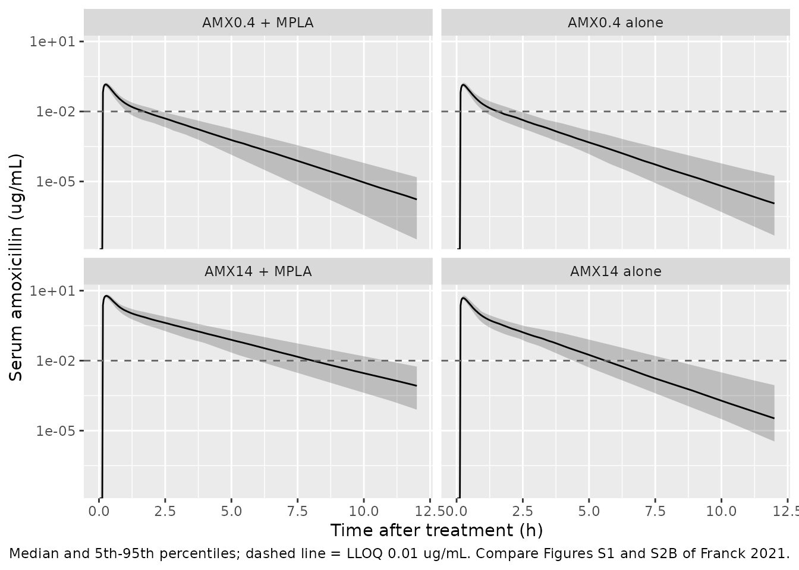
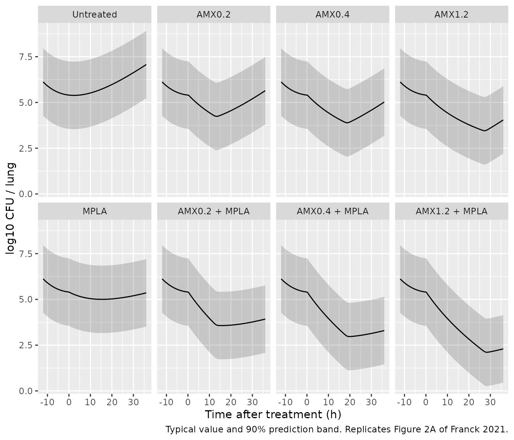
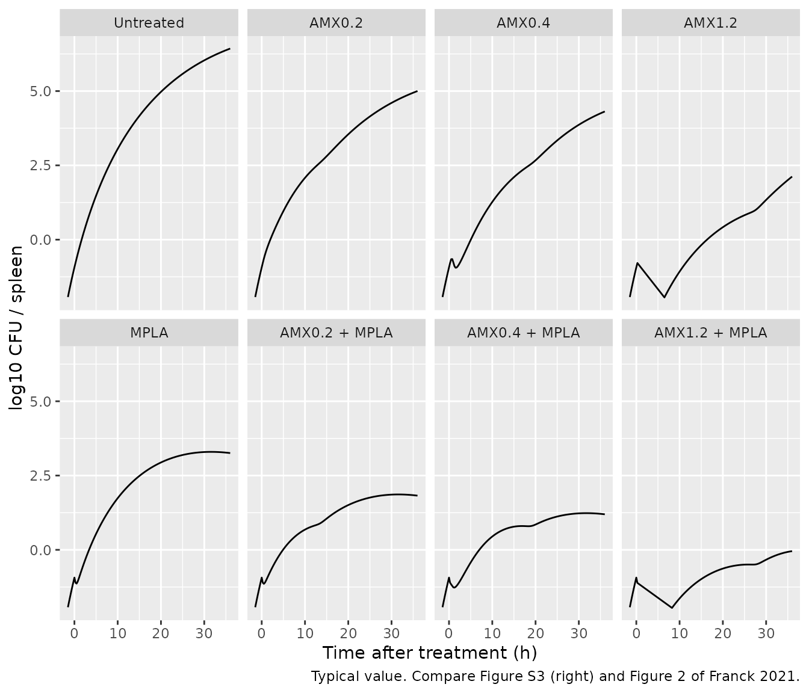
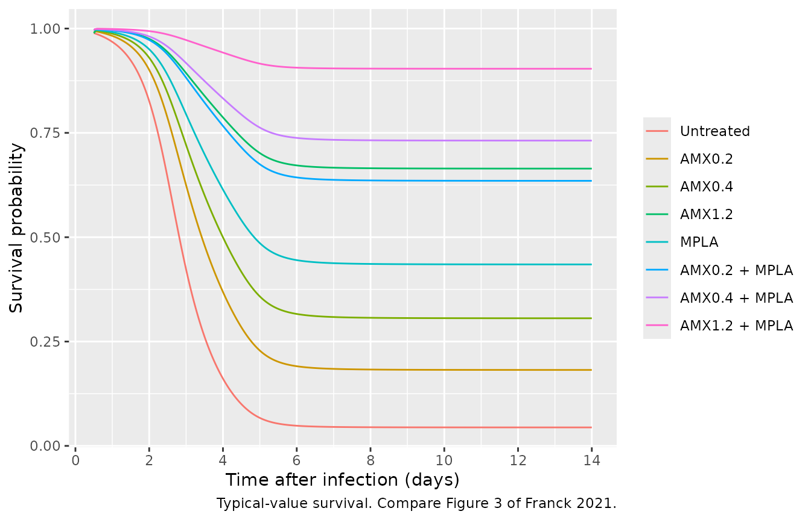

# Amoxicillin + monophosphoryl lipid A in murine pneumococcal pneumonia (Franck 2021)

## Model and source

Franck et al. (2021) analysed pooled mouse studies of oral amoxicillin
(AMX), the toll-like receptor 4 agonist monophosphoryl lipid A (MPLA),
and their combination against *Streptococcus pneumoniae* serotype 1
pneumonia. The analysis was sequential, and the library reproduces it as
two model files:

- `Franck_2021_amoxicillin_mouse` – the stand-alone PK submodel
  (Supplementary Table S1): two compartments, first-order absorption
  after a lag time, interindividual variability on CL and Q, and an MPLA
  x dose interaction on clearance.
- `Franck_2021_amoxicillin_mpla_mouse` – the pharmacometric PK/PD model
  of Table 1 with the PK fixed at those typical values, plus the
  survival (time-to-event) model of Table 2 linked through the
  model-predicted time of serum AMX above the MIC.

``` r

pk_ui <- rxode2::rxode(readModelDb("Franck_2021_amoxicillin_mouse"))
#> ℹ parameter labels from comments will be replaced by 'label()'
pd_ui <- rxode2::rxode(readModelDb("Franck_2021_amoxicillin_mpla_mouse"))
```

- Citation: Franck S, Michelet R, Casilag F, Sirard JC, Wicha SG,
  Kloft C. A Model-Based Pharmacokinetic/Pharmacodynamic Analysis of the
  Combination of Amoxicillin and Monophosphoryl Lipid A Against S.
  pneumoniae in Mice. Pharmaceutics. 2021;13(4):469.
  <doi:10.3390/pharmaceutics13040469>. PK/PD parameters from Table 1,
  survival parameters from Table 2, equations from Supplementary Section
  S2 (Eqs. 1-7) and Figure 1.
- PK submodel: Preclinical (mouse). Two-compartment population PK
  submodel for oral amoxicillin in mice infected intranasally with
  Streptococcus pneumoniae serotype 1 (Franck 2021), with first-order
  absorption after a lag time, first-order elimination, and a
  pharmacokinetic interaction in which intraperitoneal monophosphoryl
  lipid A (MPLA, 2 mg/kg) coadministration lowers amoxicillin clearance
  linearly with the amoxicillin dose (CL = 124 - 0.145 \* dose in ug;
  -40.9% at 14 mg/kg, -1.17% at 0.4 mg/kg). Interindividual variability
  on CL and Q and a proportional residual error. This is the stand-alone
  PK submodel of Supplementary Table S1; its typical values were then
  fixed in the sequential PK/PD-survival model
  Franck_2021_amoxicillin_mpla_mouse.
- PK/PD-survival model: Preclinical (mouse). Sequential PK/PD
  disease-treatment and survival (time-to-event) model for oral
  amoxicillin with or without intraperitoneal monophosphoryl lipid A
  (MPLA) in mice with Streptococcus pneumoniae serotype 1 pneumonia
  (Franck 2021). The PK layer is the two-compartment submodel with the
  MPLA x dose clearance interaction, fixed at its typical values.
  Separate first-order effect compartments link serum amoxicillin to
  lung and spleen. Lung bacteria grow with a delayed onset (kg \* (1 -
  exp(-klag \* t))), are removed by treatment-unrelated killing and
  natural death (kkill, multiplied by 1.40 under MPLA) and by a steep
  sigmoidal amoxicillin Emax kill (Hill 20). Bacteria reach the spleen
  by a Savic gamma-kernel transit (n = 23, MTT = 40.8 h) scaled by the
  current lung burden, and are killed there by a power amoxicillin
  effect (kAMX \* Ce^5.06) and a first-order MPLA kill. Survival over 14
  days follows a surge-function hazard reduced exponentially by the
  model-predicted time of serum amoxicillin above the MIC (h) and by
  MPLA coadministration. Model time zero is the time of infection;
  treatment is given at 12 h.
- Article: <https://doi.org/10.3390/pharmaceutics13040469> (open access;
  the supplement `pharmaceutics-13-00469-s001.pdf` holds Equations 1-7
  and Table S1).

## Population

The data came from female mice aged 6-8 weeks (about 25 g). Mice were
infected intranasally with 1-4 x 10^6 CFU of the clinical isolate E1586
(AMX MIC 0.016 mg/L) and treated 12 h later (Supplementary Section S1).
The PK study used 106 RjOrl:Swiss mice given single oral AMX doses of
0.4 or 14 mg/kg, with or without MPLA 2.0 mg/kg intraperitoneally. Each
mouse gave 1-2 serum samples between 0.167 and 12 h after the dose. The
PD study used 634 RjOrl:Swiss and Balb/cJRj mice. Lung and spleen CFU
were counted from -12 to 36 h relative to treatment, with one harvest
per mouse, after AMX 0.2, 0.4 or 1.2 mg/kg, MPLA, the combination, or no
treatment. A further 196 mice were followed for survival for 14 days
after infection. Mouse strain was tested and was not retained as a
covariate.

``` r

str(pd_ui$population)
#> List of 10
#>  $ species       : chr "mouse (RjOrl:Swiss / CD-1 and Balb/cJRj, female, S. pneumoniae serotype 1 pneumonia model)"
#>  $ n_subjects    : num 936
#>  $ n_studies     : num 3
#>  $ age_range     : chr "6-8 weeks"
#>  $ weight_range  : chr "~25 g"
#>  $ sex_female_pct: num 100
#>  $ disease_state : chr "Pneumonia after intranasal infection with 1-4 x 10^6 CFU Streptococcus pneumoniae serotype 1 (clinical isolate "| __truncated__
#>  $ dose_range    : chr "Amoxicillin single oral gavage 0.4 or 14 mg/kg (PK study) and 0.2, 0.4 or 1.2 mg/kg (PD and survival studies), "| __truncated__
#>  $ regions       : chr "France (Institut Pasteur de Lille)"
#>  $ notes         : chr "Supplementary Section S1: 106 RjOrl:Swiss mice in the PK study (serum amoxicillin), 634 RjOrl:Swiss and Balb/cJ"| __truncated__
```

## Source trace

Every `ini()` value carries an in-file comment naming its source. The
table below collects them.

| Parameter / equation | Value | Source location |
|----|----|----|
| `lka` | log(5.04) 1/h, fixed | Table S1 (fixed in the PK submodel); Table 1 \* |
| `ltlag` | log(0.125) h | Table S1 (fixed in the PK/PD model, Table 1 \*) |
| `lvc` | log(15.4) mL | Table S1; Table 1 \* |
| `lvp` | log(50.7) mL | Table S1; Table 1 \* |
| `lq` | log(71.9) mL/h | Table S1; Table 1 \* |
| `lcl` | log(124) mL/h | Table S1; Table 1 \* |
| `e_dose_mpla_cl` | -0.145 mL/h/ug | Table S1 `FC_AMX+MPLA`; Supplementary Eq. 1 `P = theta1 + theta2 * DOSE` |
| `lfdepot` | log(1), fixed | Tables 1 and S1 abbreviations: F fixed to 1 |
| `etalcl`, `etalq` | 0.05331, 0.06392 | Table S1: 23.4 and 25.7 %CV, `log(CV^2 + 1)` (PK submodel only) |
| `propSd` | 0.282 | Table S1: proportional RUV 28.2 %CV (PK submodel only) |
| `lke0_lung`, `lke0_spleen` | log(0.125), log(0.0435) 1/h | Table 1; Supplementary Eq. 4 |
| `bl_log_cfu_lung` | 6.12 log10 CFU, fixed | Table 1 (N at -12 h, i.e. at infection) |
| `lkg`, `lklag`, `lkkill_lung` | log(0.477), log(0.0595), log(0.274) 1/h | Table 1; Supplementary Eq. 2 |
| `lntr`, `lmtt` | log(23.0), log(40.8) h | Table 1; Supplementary Eq. 3 (`ktr = (n + 1) / MTT`) |
| `e_conmed_mpla_kkill_lung` | 1.40 | Table 1 `MPLA_lung` |
| `lemax`, `lec50`, `hill_lung` | log(0.255) 1/h, log(0.00109) ug/mL, 20 fixed | Table 1; Supplementary Eq. 5 |
| `lkmpla_spleen` | log(3.71) 1/h | Table 1 `kMPLA,spleen` |
| `lkamx_spleen`, `hill_spleen` | log(10^13.7), 5.06 | Table 1 `kAMX` = 13.7 log10(1/h); `H_spleen` |
| `lsa_haz`, `lsw_haz`, `lgam_haz`, `lpt_haz` | log(0.0404) 1/h, log(35.7) h, log(2.24), log(89.2) h | Table 2; Supplementary Eq. 6 |
| `e_tmic_haz`, `e_conmed_mpla_haz` | -0.926 1/h, -1.32 | Table 2; Supplementary Eq. 7 |
| `mic` | 0.016 ug/mL, fixed | Section 2.1 |
| `addSd_log_cfu_lung`, `addSd_log_cfu_spleen` | 1.12, 1.81 log10 CFU | Table 1 (SD scale) |
| Lung ODE | `kg (1 - exp(-klag t)) N - kkill N - E(Ce,lung) N` | Supplementary Eq. 2, Figure 1 |
| Spleen ODE | Savic transit input `N_lung ktr (ktr t)^n exp(-ktr t) / n!` minus `kAMX Ce,spleen^H N` minus `kMPLA N` | Supplementary Section S2 (Savic + Stirling), Figure 1 |
| Hazard | `SA / (((t - PT)^2 / SW^2)^gamma + 1) * exp(beta_TMIC T>MIC + beta_MPLA MPLA)` | Supplementary Eqs. 6-7 |

## PK submodel

### Virtual cohort and simulation

The four PK-study arms (AMX 0.4 or 14 mg/kg, with or without MPLA) are
simulated with the Table S1 interindividual variability, 100 mice per
arm. Doses are converted to ug with the 25 g body weight at which the
paper’s reported clearances reproduce exactly (see the check below).

``` r

bw_g <- 25
pk_arms <- tidyr::expand_grid(dose_mgkg = c(0.4, 14), mpla = c(0L, 1L)) |>
  dplyr::mutate(
    arm = paste0("AMX", dose_mgkg, ifelse(mpla == 1L, " + MPLA", " alone")),
    dose_ug = dose_mgkg * bw_g
  )
n_per_arm <- 100L
pk_times <- sort(unique(c(seq(0, 1, by = 0.025), seq(1.1, 12, by = 0.1))))

make_pk_arm <- function(k) {
  a <- pk_arms[k, ]
  ids <- (k - 1L) * n_per_arm + seq_len(n_per_arm)
  dose_rows <- data.frame(id = ids, time = 0, evid = 1L, amt = a$dose_ug, cmt = "depot")
  obs_rows <- tidyr::expand_grid(id = ids, time = pk_times) |>
    dplyr::mutate(evid = 0L, amt = 0, cmt = "central")
  dplyr::bind_rows(dose_rows, obs_rows) |>
    dplyr::mutate(
      arm = a$arm,
      DOSE_AMOXICILLIN_UG = a$dose_ug,
      CONMED_MPLA = a$mpla
    ) |>
    dplyr::arrange(id, time, dplyr::desc(evid))
}
pk_events <- dplyr::bind_rows(lapply(seq_len(nrow(pk_arms)), make_pk_arm))
stopifnot(!anyDuplicated(unique(pk_events[, c("id", "time", "evid")])))

rxode2::rxSetSeed(20210330)
pk_sim <- rxode2::rxSolve(
  readModelDb("Franck_2021_amoxicillin_mouse"),
  events = pk_events, keep = "arm", returnType = "data.frame"
)
#> ℹ parameter labels from comments will be replaced by 'label()'
```

### Figure S1 / S2: serum concentrations

``` r

pk_sim |>
  dplyr::filter(time > 0) |>
  dplyr::group_by(arm, time) |>
  dplyr::summarise(
    Q05 = quantile(Cc, 0.05), Q50 = median(Cc), Q95 = quantile(Cc, 0.95),
    .groups = "drop"
  ) |>
  ggplot(aes(time, Q50)) +
  geom_ribbon(aes(ymin = Q05, ymax = Q95), alpha = 0.25) +
  geom_line() +
  geom_hline(yintercept = 0.01, linetype = "dashed", colour = "grey40") +
  facet_wrap(~arm) +
  scale_y_log10() +
  labs(
    x = "Time after treatment (h)", y = "Serum amoxicillin (ug/mL)",
    caption = "Median and 5th-95th percentiles; dashed line = LLOQ 0.01 ug/mL. Compare Figures S1 and S2B of Franck 2021."
  )
#> Warning in scale_y_log10(): log-10 transformation introduced infinite values.
#> log-10 transformation introduced infinite values.
#> log-10 transformation introduced infinite values.
#> log-10 transformation introduced infinite values.
```



### MPLA-dose interaction on clearance

The Results give the MPLA-coadministration clearance as 73.3 mL/h at 14
mg/kg (-40.9%) and 123 mL/h at 0.4 mg/kg (-1.17%). The typical-value
model gives these values exactly, which pins the dose unit to ug per 25
g mouse.

``` r

first_ids <- (seq_len(nrow(pk_arms)) - 1L) * n_per_arm + 1L
pk_typ_events <- pk_events |> dplyr::filter(id %in% first_ids)
pk_typ <- rxode2::rxSolve(
  rxode2::zeroRe(readModelDb("Franck_2021_amoxicillin_mouse")),
  events = pk_typ_events, keep = "arm", returnType = "data.frame",
  atol = 1e-12, rtol = 1e-10
)
#> ℹ parameter labels from comments will be replaced by 'label()'
#> ℹ omega/sigma items treated as zero: 'etalcl', 'etalq'
#> Warning: multi-subject simulation without without 'omega'
cl_tab <- pk_typ |>
  dplyr::distinct(arm, cl) |>
  dplyr::mutate(pct_vs_mono = 100 * (cl / 124 - 1))
knitr::kable(cl_tab, digits = c(0, 2, 2), caption = "Typical CL/F by arm (mL/h).")
```

| arm           |     cl | pct_vs_mono |
|:--------------|-------:|------------:|
| AMX0.4 alone  | 124.00 |        0.00 |
| AMX0.4 + MPLA | 122.55 |       -1.17 |
| AMX14 alone   | 124.00 |        0.00 |
| AMX14 + MPLA  |  73.25 |      -40.93 |

Typical CL/F by arm (mL/h). {.table}

``` r


cl_of <- function(a) {
  v <- cl_tab$cl[cl_tab$arm == a]
  stopifnot(length(v) == 1L)
  v
}
stopifnot(
  abs(cl_of("AMX14 + MPLA") - 73.3) < 0.1,
  abs(cl_of("AMX0.4 + MPLA") - 123) < 0.5,
  abs(100 * (1 - cl_of("AMX14 + MPLA") / 124) - 40.9) < 0.1,
  abs(100 * (1 - cl_of("AMX0.4 + MPLA") / 124) - 1.17) < 0.01,
  abs(cl_of("AMX14 alone") - 124) < 1e-8
)
```

### PKNCA

Noncompartmental analysis of the typical-value profiles (a fine grid to
12 h, then out to 24 h so the terminal phase is resolved). The paper
reports no NCA table. The reference AUC below is Dose / CL computed from
the clearances the paper states (124, 73.3 and 123 mL/h; F = 1). It
tests the whole dose, unit and clearance chain.

``` r

nca_events <- pk_typ_events |>
  dplyr::filter(evid == 1L | time == 0) |>
  dplyr::bind_rows(
    tidyr::expand_grid(
      id = unique(pk_typ_events$id),
      time = sort(unique(c(pk_times, seq(12.5, 24, by = 0.5))))
    ) |>
      dplyr::mutate(evid = 0L, amt = 0, cmt = "central")
  ) |>
  dplyr::group_by(id) |>
  tidyr::fill(arm, DOSE_AMOXICILLIN_UG, CONMED_MPLA, .direction = "downup") |>
  dplyr::ungroup() |>
  dplyr::distinct(id, time, evid, .keep_all = TRUE) |>
  dplyr::arrange(id, time, dplyr::desc(evid))

nca_sim <- rxode2::rxSolve(
  rxode2::zeroRe(readModelDb("Franck_2021_amoxicillin_mouse")),
  events = nca_events, keep = "arm", returnType = "data.frame",
  atol = 1e-14, rtol = 1e-12
)
#> ℹ parameter labels from comments will be replaced by 'label()'
#> ℹ omega/sigma items treated as zero: 'etalcl', 'etalq'
#> Warning: multi-subject simulation without without 'omega'
stopifnot(all(nca_sim$Cc >= -1e-6 * max(nca_sim$Cc)))

conc_df <- nca_sim |>
  dplyr::filter(!is.na(Cc)) |>
  dplyr::mutate(Cc = pmax(Cc, 0), treatment = arm) |>
  dplyr::select(id, time, Cc, treatment)
conc_df <- dplyr::bind_rows(
  conc_df,
  conc_df |> dplyr::distinct(id, treatment) |> dplyr::mutate(time = 0, Cc = 0)
) |>
  dplyr::distinct(id, treatment, time, .keep_all = TRUE) |>
  dplyr::arrange(id, treatment, time)

dose_df <- nca_events |>
  dplyr::filter(evid == 1L) |>
  dplyr::transmute(id, time, amt, treatment = arm)

conc_obj <- PKNCA::PKNCAconc(conc_df, Cc ~ time | treatment + id)
dose_obj <- PKNCA::PKNCAdose(dose_df, amt ~ time | treatment + id)
intervals <- data.frame(
  start = 0, end = Inf,
  cmax = TRUE, tmax = TRUE, aucinf.obs = TRUE, half.life = TRUE
)
nca_res <- PKNCA::pk.nca(PKNCA::PKNCAdata(conc_obj, dose_obj, intervals = intervals))

published <- tibble::tribble(
  ~treatment,       ~aucinf.obs,
  "AMX0.4 alone",   10 / 124,
  "AMX0.4 + MPLA",  10 / 123,
  "AMX14 alone",    350 / 124,
  "AMX14 + MPLA",   350 / 73.3
)
cmp <- nlmixr2lib::ncaComparisonTable(
  simulated = nca_res,
  reference = published,
  by = "treatment",
  units = c(cmax = "ug/mL", tmax = "h", aucinf.obs = "h*ug/mL", half.life = "h"),
  tolerance_pct = 20
)
knitr::kable(
  cmp,
  caption = "Typical-value NCA. Reference AUC = dose / published CL (F = 1). * differs from reference by >20%."
)
```

| NCA parameter           | treatment     | Reference | Simulated | % diff |
|:------------------------|:--------------|:----------|:----------|:-------|
| AUC0-∞ (obs) (h\*ug/mL) | AMX0.4 alone  | 0.0806    | 0.0805    | -0.2%  |
| AUC0-∞ (obs) (h\*ug/mL) | AMX0.4 + MPLA | 0.0813    | 0.0814    | +0.1%  |
| AUC0-∞ (obs) (h\*ug/mL) | AMX14 alone   | 2.82      | 2.82      | -0.2%  |
| AUC0-∞ (obs) (h\*ug/mL) | AMX14 + MPLA  | 4.77      | 4.77      | -0.1%  |

Typical-value NCA. Reference AUC = dose / published CL (F = 1). \*
differs from reference by \>20%. {.table}

``` r


auc_chk <- as.data.frame(nca_res) |>
  dplyr::filter(PPTESTCD == "aucinf.obs") |>
  dplyr::left_join(published, by = "treatment")
stopifnot(nrow(auc_chk) == 4L)
# Deterministic: both sides use the same typical parameters, so the only
# difference is the trapezoidal/extrapolation error of the NCA.
stopifnot(all(abs(auc_chk$PPORRES / auc_chk$aucinf.obs - 1) < 0.02))
```

## PK/PD and survival model

### Simulation design

Model time zero is the time of infection. Treatment is given at 12 h: an
oral AMX dose into `depot` and, for MPLA arms, `CONMED_MPLA` switching
from 0 to 1. The PD and survival parameters carry no interindividual
variability (one observation per mouse), so each arm is a single
typical-value solve. The 90% prediction band for the log10 CFU plots is
the typical value +/- 1.645 times the additive residual SD.

``` r

pd_arms <- tibble::tribble(
  ~amx_mgkg, ~mpla,
  0, 0L,
  0.2, 0L,
  0.4, 0L,
  1.2, 0L,
  0, 1L,
  0.2, 1L,
  0.4, 1L,
  1.2, 1L
) |>
  dplyr::mutate(
    arm = dplyr::case_when(
      amx_mgkg == 0 & mpla == 0L ~ "Untreated",
      amx_mgkg == 0 ~ "MPLA",
      mpla == 0L ~ paste0("AMX", amx_mgkg),
      TRUE ~ paste0("AMX", amx_mgkg, " + MPLA")
    ),
    arm = factor(arm, levels = arm),
    dose_ug = amx_mgkg * bw_g
  )
t_treat <- 12
pd_times <- sort(unique(c(seq(0, 48, by = 0.25), seq(49, 336, by = 1))))

make_pd_arm <- function(k) {
  a <- pd_arms[k, ]
  obs_rows <- data.frame(
    time = pd_times, evid = 0L, amt = 0, cmt = NA_character_, dvid = 1L
  )
  dose_rows <- if (a$dose_ug > 0) {
    data.frame(time = t_treat, evid = 1L, amt = a$dose_ug, cmt = "depot", dvid = NA_integer_)
  } else {
    NULL
  }
  dplyr::bind_rows(dose_rows, obs_rows) |>
    dplyr::mutate(
      id = k,
      arm = as.character(a$arm),
      DOSE_AMOXICILLIN_UG = a$dose_ug,
      CONMED_MPLA = ifelse(time >= t_treat, a$mpla, 0L)
    ) |>
    dplyr::arrange(time, dplyr::desc(evid))
}
pd_events <- dplyr::bind_rows(lapply(seq_len(nrow(pd_arms)), make_pd_arm)) |>
  dplyr::relocate(id, time, evid, amt, cmt, dvid)

pd_sim <- rxode2::rxSolve(
  rxode2::zeroRe(readModelDb("Franck_2021_amoxicillin_mpla_mouse")),
  events = pd_events, keep = "arm", returnType = "data.frame",
  atol = 1e-10, rtol = 1e-8, maxsteps = 1e6
) |>
  dplyr::mutate(
    arm = factor(arm, levels = levels(pd_arms$arm)),
    time_after_treatment = time - t_treat
  )
#> Warning: No omega parameters in the model
#> Warning: multi-subject simulation without without 'omega'
stopifnot(dplyr::n_distinct(pd_sim$id) == nrow(pd_arms))
```

### Figure 2A: lung bacterial burden

``` r

pd_sim |>
  dplyr::filter(time <= 48) |>
  ggplot(aes(time_after_treatment, log_cfu_lung)) +
  geom_ribbon(
    aes(
      ymin = log_cfu_lung - 1.645 * 1.12,
      ymax = log_cfu_lung + 1.645 * 1.12
    ),
    alpha = 0.2
  ) +
  geom_line() +
  facet_wrap(~arm, ncol = 4) +
  labs(
    x = "Time after treatment (h)", y = "log10 CFU / lung",
    caption = "Typical value and 90% prediction band. Replicates Figure 2A of Franck 2021."
  )
```



### Figure S3: spleen bacterial burden

Bacteria first reach the spleen a few hours after treatment. Before that
the spleen burden is effectively zero, so the plot starts where the
burden exceeds 1 CFU.

``` r

pd_sim |>
  dplyr::filter(time <= 48, time_after_treatment >= -12, is.finite(log_cfu_spleen)) |>
  dplyr::filter(log_cfu_spleen > -2) |>
  ggplot(aes(time_after_treatment, log_cfu_spleen)) +
  geom_line() +
  facet_wrap(~arm, ncol = 4) +
  labs(
    x = "Time after treatment (h)", y = "log10 CFU / spleen",
    caption = "Typical value. Compare Figure S3 (right) and Figure 2 of Franck 2021."
  )
```



### Published lung reductions at 36 h after treatment

The Results state that, compared with natural growth 36 h after
treatment, AMX 1.2 mg/kg reduced the model-predicted lung burden by 3.03
log10 CFU, MPLA by 1.71 and the combination by 4.77.

``` r

lung36 <- pd_sim |>
  dplyr::filter(time_after_treatment == 36) |>
  dplyr::select(arm, log_cfu_lung)
untreated36 <- lung36$log_cfu_lung[lung36$arm == "Untreated"]
lung_cmp <- lung36 |>
  dplyr::mutate(reduction = untreated36 - log_cfu_lung) |>
  dplyr::left_join(
    tibble::tribble(
      ~arm, ~published,
      "AMX1.2", 3.03,
      "MPLA", 1.71,
      "AMX1.2 + MPLA", 4.77
    ) |>
      dplyr::mutate(arm = factor(arm, levels = levels(pd_arms$arm))),
    by = "arm"
  )
lung_cmp |>
  dplyr::rename(
    "Arm" = arm,
    "log10 CFU/lung at 36 h" = log_cfu_lung,
    "Reduction vs untreated (simulated)" = reduction,
    "Reduction vs untreated (published)" = published
  ) |>
  knitr::kable(digits = 2)
```

| Arm | log10 CFU/lung at 36 h | Reduction vs untreated (simulated) | Reduction vs untreated (published) |
|:---|---:|---:|---:|
| Untreated | 7.07 | 0.00 | NA |
| AMX0.2 | 5.64 | 1.43 | NA |
| AMX0.4 | 5.02 | 2.05 | NA |
| AMX1.2 | 4.04 | 3.03 | 3.03 |
| MPLA | 5.36 | 1.71 | 1.71 |
| AMX0.2 + MPLA | 3.92 | 3.15 | NA |
| AMX0.4 + MPLA | 3.30 | 3.77 | NA |
| AMX1.2 + MPLA | 2.30 | 4.77 | 4.77 |

``` r


red_of <- function(a) lung_cmp$reduction[lung_cmp$arm == a]
# Deterministic typical-value solve against values printed to 2 decimals.
stopifnot(
  abs(red_of("AMX1.2") - 3.03) < 0.02,
  abs(red_of("MPLA") - 1.71) < 0.02,
  abs(red_of("AMX1.2 + MPLA") - 4.77) < 0.02
)
```

### Figure 3: survival

``` r

pd_sim |>
  dplyr::filter(time >= t_treat) |>
  ggplot(aes(time / 24, sur, colour = arm)) +
  geom_line() +
  scale_x_continuous(breaks = seq(0, 14, by = 2)) +
  labs(
    x = "Time after infection (days)", y = "Survival probability", colour = NULL,
    caption = "Typical-value survival. Compare Figure 3 of Franck 2021."
  )
```



### Published survival results

The Results report 14-day survival of 66.7% with AMX 1.2 mg/kg alone and
90.3% with AMX 1.2 mg/kg + MPLA, a 3.71-fold higher overall hazard in
untreated than in MPLA-treated mice, and a 4.00-fold lower hazard when
MPLA is added to AMX 1.2 mg/kg. The time above the MIC is taken at the
end of the simulation.

``` r

end14 <- pd_sim |>
  dplyr::filter(time == 336) |>
  dplyr::select(arm, t_above_mic, cumhaz, sur)
knitr::kable(
  end14 |>
    dplyr::rename(
      "Arm" = arm,
      "T>MIC (h)" = t_above_mic,
      "Baseline cumulative hazard" = cumhaz,
      "Survival at 14 days" = sur
    ),
  digits = 3
)
```

| Arm           | T\>MIC (h) | Baseline cumulative hazard | Survival at 14 days |
|:--------------|-----------:|---------------------------:|--------------------:|
| Untreated     |      0.000 |                      3.118 |               0.044 |
| AMX0.2        |      0.653 |                      3.118 |               0.182 |
| AMX0.4        |      1.045 |                      3.118 |               0.306 |
| AMX1.2        |      2.194 |                      3.118 |               0.664 |
| MPLA          |      0.000 |                      3.118 |               0.435 |
| AMX0.2 + MPLA |      0.655 |                      3.118 |               0.635 |
| AMX0.4 + MPLA |      1.058 |                      3.118 |               0.731 |
| AMX1.2 + MPLA |      2.275 |                      3.118 |               0.904 |

``` r


val <- function(col, a) end14[[col]][end14$arm == a]
hr_mpla_alone <- exp(-(-1.32))
hr_amx12_mpla <- exp(-(-0.926 * (val("t_above_mic", "AMX1.2 + MPLA") -
  val("t_above_mic", "AMX1.2")) - 1.32))
surv_cmp <- tibble::tribble(
  ~quantity, ~simulated, ~published,
  "Survival at 14 d, AMX1.2", val("sur", "AMX1.2"), 0.667,
  "Survival at 14 d, AMX1.2 + MPLA", val("sur", "AMX1.2 + MPLA"), 0.903,
  "Hazard ratio untreated / MPLA", hr_mpla_alone, 3.71,
  "Hazard ratio AMX1.2 / AMX1.2 + MPLA", hr_amx12_mpla, 4.00
)
knitr::kable(surv_cmp, digits = 3)
```

| quantity                            | simulated | published |
|:------------------------------------|----------:|----------:|
| Survival at 14 d, AMX1.2            |     0.664 |     0.667 |
| Survival at 14 d, AMX1.2 + MPLA     |     0.904 |     0.903 |
| Hazard ratio untreated / MPLA       |     3.743 |     3.710 |
| Hazard ratio AMX1.2 / AMX1.2 + MPLA |     4.036 |     4.000 |

``` r


stopifnot(
  abs(val("sur", "AMX1.2") - 0.667) < 0.01,
  abs(val("sur", "AMX1.2 + MPLA") - 0.903) < 0.01,
  abs(hr_mpla_alone / 3.71 - 1) < 0.02,
  abs(hr_amx12_mpla / 4.00 - 1) < 0.02
)
```

The Results also give the T\>MIC needed for more than 95% survival: 4.48
h with AMX alone and 3.25 h with MPLA. Solving `S(14 d) = 0.95` with the
Table 2 estimates gives the values below. They are close for AMX alone
and about 0.24 h lower with MPLA. The printed thresholds are reported,
not used to change the model.

``` r

h0_14d <- val("cumhaz", "Untreated")
t_thr <- c(
  "AMX alone" = log(-log(0.95) / h0_14d) / -0.926,
  "AMX + MPLA" = (log(-log(0.95) / h0_14d) + 1.32) / -0.926
)
knitr::kable(
  data.frame(
    Regimen = names(t_thr),
    "T>MIC for 95% survival, from Table 2 (h)" = unname(t_thr),
    "Printed in Results (h)" = c(4.48, 3.25),
    check.names = FALSE
  ),
  digits = 2
)
```

| Regimen | T\>MIC for 95% survival, from Table 2 (h) | Printed in Results (h) |
|:---|---:|---:|
| AMX alone | 4.44 | 4.48 |
| AMX + MPLA | 3.01 | 3.25 |

## Assumptions and deviations

- **Dose units.** The paper gives doses in mg/kg and the MPLA clearance
  interaction slope in mL/h/ug. The clearances printed in the Results
  (73.3 mL/h at 14 mg/kg and 123 mL/h at 0.4 mg/kg with MPLA) are
  reproduced exactly when the dose is the mg/kg dose times a 25 g body
  weight, in ug. The models therefore take the dose as an absolute
  amount in ug per mouse (`DOSE_AMOXICILLIN_UG`), and a 25 g mouse is
  used throughout.
- **MPLA onset.** `CONMED_MPLA` is time-varying: 0 before treatment and
  1 from the 12 h treatment time onward. Switching MPLA on from the time
  of infection gives a 2.28 rather than the published 1.71 log10
  CFU/lung reduction at 36 h.
- **Lung-to-spleen transit.** Supplementary Equation 3 uses the Savic
  analytical transit input with the Stirling approximation for `n!`. The
  implementation applies that input kernel to the current lung burden
  (in place of a dose amount), does not deplete the lung, and has no
  spleen outflow other than drug and MPLA killing. A plain chain of
  transit compartments did not reproduce the spleen time course.
- **Spleen AMX kill constant.** Table 1 gives `kAMX` as 13.7 with unit
  `log10(h-1)`. The model uses `kAMX = 10^13.7`, applied to the spleen
  effect-compartment concentration raised to `H_spleen` = 5.06.
- **Time above MIC.** The text calls the survival covariate %T\>MIC but
  gives the thresholds in hours, and the published 14-day survival
  values reproduce when it is in hours. The model accumulates the
  time (h) that the serum concentration is at or above the MIC of 0.016
  ug/mL. The hazard uses the running value. After a single dose it
  reaches its final value within a few hours of treatment, while the
  baseline hazard is still negligible.
- **Hazard time origin.** Figure S4 plots the hazard against time after
  treatment, while the survival study counts days after infection. The
  model uses time after infection. Moving the origin by 12 h changes
  14-day survival by less than 0.001, because the surge peaks at 89 h.
- **EC50.** Table 1 gives 0.00109 ug/mL, within its bootstrap interval
  (0.000134-0.00146). The Results text gives 0.0109. The table value is
  used.
- **Mean transit time.** Table 1 gives 40.8 h. The Supplementary Section
  S3 text gives 42.0 h. The table value is used.
- **Figure S3, AMX 0.4 mg/kg + MPLA (spleen).** The figure shows the
  spleen cleared of bacteria. The model gives about 1.2 log10 CFU/spleen
  at 36 h after treatment, consistent with Figure 2B.
- **Survival thresholds.** From the Table 2 estimates, the T\>MIC giving
  95% survival at 14 days is 4.44 h (AMX alone) and 3.01 h (with MPLA),
  against the printed 4.48 h and 3.25 h (see above).
- **Figure S4 axis.** The hazard axis is labelled per day, but the
  plotted values match the Table 2 surge amplitude in 1/h.
- **Survival residual error.** The source has no residual error for the
  survival probability. `addSd_sur` is a fixed placeholder (0.001) so
  that the `sur` output has an error model for simulation. It is not
  from the source.
- **PK in the PK/PD model.** Following Table 1 footnote \*, the PK
  parameters are fixed at the PK submodel typical values without IIV.
  `H_lung` = 20 and the initial lung burden (6.12 log10 CFU at
  infection) are fixed as in Table 1.
- **PKNCA reference values.** The paper has no NCA table. The reference
  AUCs are dose / CL from the clearances printed in the paper.
