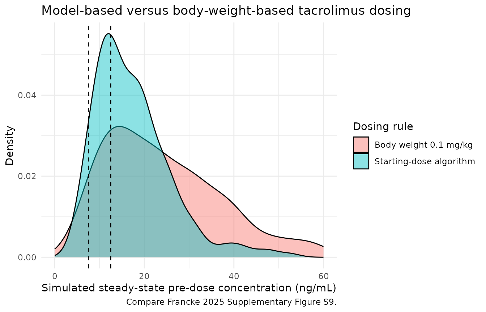

# Tacrolimus after kidney transplantation (Francke 2025)

``` r

library(nlmixr2lib)
library(rxode2)
library(PKNCA)
library(dplyr)
library(ggplot2)
```

Francke and colleagues developed an international, multicentre
population pharmacokinetic model for twice-daily oral immediate-release
tacrolimus in adult kidney transplant recipients, together with a
closed-form starting-dose algorithm. Two models are distributed from
this paper:

- `Francke_2025_tacrolimus` – the **full model**, which uses the two
  post-transplant laboratory covariates (hematocrit, serum creatinine)
  in addition to genotype, age, and height. This is the follow-up dosing
  model.
- `Francke_2025_tacrolimus_startingdose` – the **starting-dose model**,
  refit on the same data with only the covariates known *before*
  transplantation (genotype, age, height). This is the model behind the
  published dosing algorithm.

``` r

mod_full  <- rxode2::rxode(readModelDb("Francke_2025_tacrolimus"))
mod_start <- rxode2::rxode(readModelDb("Francke_2025_tacrolimus_startingdose"))

mod_full_typ  <- rxode2::zeroRe(mod_full)
#> Warning: No sigma parameters in the model
mod_start_typ <- rxode2::zeroRe(mod_start)
#> Warning: No sigma parameters in the model
```

## Population

``` r

pop <- mod_full$population
tibble::tibble(
  Field = names(pop),
  Value = vapply(pop, function(x) paste(as.character(x), collapse = "; "), character(1))
) |>
  knitr::kable()
```

| Field | Value |
|:---|:---|
| species | human |
| n_subjects | 1180 |
| n_studies | 4 |
| age_range | IQR 45.0-65.0 years (all recipients at least 18 years old by protocol; range not reported) |
| age_median | 57.0 years |
| weight_range | IQR 65.0-86.0 kg (range not reported) |
| weight_median | 75.6 kg |
| height_median | 170 cm (IQR 162-177) |
| sex_female_pct | 37.5 |
| race_ethnicity | Not reported. The four contributing centres are in the Netherlands (Rotterdam, Leiden), Spain (Barcelona), and Belgium (Brussels). |
| disease_state | Adult kidney transplant recipients (living-donor and deceased-donor grafts) receiving twice-daily oral immediate-release tacrolimus (Prograf, Astellas Pharma, or Adport, Sandoz Pharma) with mycophenolic acid and a tapering glucocorticoid course as maintenance immunosuppression. Blood-group-ABO-incompatible and HLA-incompatible transplant recipients were excluded. Donor type: living 536 (45.4%), deceased 342 (29.0%), unknown 302 (25.6%). Median time after transplantation at sampling 31 days (IQR 10-91). |
| dose_range | Median 4 mg per administration (IQR 2.5-6.5), twice daily; doses were set by local practice and adjusted by therapeutic drug monitoring. Median whole-blood tacrolimus concentration 9.2 ng/mL (IQR 6.9-12.6); median pre-dose concentration 8.8 ng/mL (IQR 6.7-11.8). |
| regions | Netherlands (Erasmus MC, University Medical Center Rotterdam, n = 547; Leiden University Medical Center, n = 100), Spain (Bellvitge University Hospital, Barcelona, n = 444), Belgium (Cliniques Universitaires St Luc, Brussels, n = 89). |
| renal_function | Serum creatinine median 140 umol/L (IQR 110-191); GFR median 44 mL/min (IQR 31-56, unknown in 390 recipients). |
| genotypes | CYP3A5: *3/*3 884 (74.9%), *3/*1 224 (19.0%), *1/*1 39 (3.3%), Other 3 (0.3%), Unknown 30 (2.5%). CYP3A4: *1 1035 (87.7%),* 22 112 (9.5%), Unknown 33 (2.8%). |
| notes | Baseline characteristics from Francke 2025 Table 1 (Total column, n = 1180). International, multicentre, retrospective analysis pooling five previously reported cohorts across the four centres; 13,427 tacrolimus concentrations in total, of which 11,670 were pre-dose concentrations and 1757 came from 208 densely sampled AUC profiles in 185 recipients. Median 10 samples per recipient (IQR 6-16). Because the dataset is dominated by pre-dose concentrations, ka, V1/F, and V2/F were additionally estimated using only the densely sampled subset; V2/F was FIXED at that subset’s estimate in the reported models (Section 3.2.1). |

The analysis pooled 13,427 whole-blood tacrolimus concentrations from
1180 adult kidney transplant recipients at four European centres
(Erasmus MC Rotterdam n = 547, LUMC Leiden n = 100, Bellvitge Barcelona
n = 444, St. Luc Brussels n = 89). Of these concentrations 11,670 were
pre-dose (trough) samples; the remaining 1757 came from 208 densely
sampled AUC profiles in 185 recipients. Baseline characteristics are
Francke 2025 Table 1.

## Source trace

Every structural parameter, covariate coefficient, and variance term in
both model files, with the location in the source it was taken from.
Francke 2025 publishes a complete NONMEM control stream as Supplementary
Data S3, which is cited alongside Table 2 wherever it independently
confirms a value or resolves a scale ambiguity.

``` r

source_trace <- tibble::tribble(
  ~Component,                    ~`Full model`, ~`Starting-dose model`, ~Source,
  "Structural model",            "2-cmt, 1st-order abs + lag", "2-cmt, 1st-order abs + lag", "Section 3.2.1; Suppl. S3 $SUBROUTINE ADVAN4 TRANS4",
  "tlag (h)",                    "0.375",  "0.375",  "Table 2; Suppl. S3 THETA(1)",
  "ka (1/h)",                    "6.59",   "6.25",   "Table 2; Suppl. S3 THETA(2). Table header 'K a (L/h)' is a typo; Abstract says 6.59/h",
  "CL/F (L/h)",                  "20.7",   "19.9",   "Table 2; Suppl. S3 THETA(4)",
  "V1/F (L)",                    "705",    "653",    "Table 2; Suppl. S3 THETA(3)",
  "Q/F (L/h)",                   "8.54",   "9.14",   "Table 2; Suppl. S3 THETA(6)",
  "V2/F (L), FIXED",             "7670",   "7670",   "Table 2 '(f)'; Section 3.2.1; Suppl. S3 THETA(5) = 7670 FIX",
  "CYP3A5 *1/*3 on CL/F",        "1.64",   "1.64",   "Table 2; Section 3.2.2 equation; Suppl. S3 THETA(12)",
  "CYP3A5 *1/*1 on CL/F",        "1.93",   "1.9",    "Table 2; Section 3.2.2 equation; Suppl. S3 THETA(13)",
  "CYP3A4*22 on CL/F",           "0.836",  "0.842",  "Table 2; Section 3.2.2 equation; Suppl. S3 THETA(18)",
  "Hematocrit exponent on CL/F", "-0.51 (centred 0.33 L/L)", "not in model", "Table 2; Suppl. S3 THETA(14), CLHCT = (HCT/0.33)**THETA(14)",
  "Age exponent on CL/F",        "-0.309 (centred 57.5 y)",  "-0.332 (centred 57.5 y)", "Table 2; Suppl. S3 THETA(15), CLAGE = (AGE/57.5)**THETA(15)",
  "Creatinine exponent on CL/F", "-0.0905 (centred 147 umol/L)", "not in model", "Table 2; Suppl. S3 THETA(16), CLCREAT = (CREAT/147)**THETA(16)",
  "Height exponent on CL/F",     "1.17 (centred 170 cm)",    "0.97 (centred 170 cm)", "Table 2; Suppl. S3 THETA(17), CLHGT = (HGT/170)**THETA(17)",
  "IIV CL/F",                    "41.4% CV",  "41.8% CV",  "Table 2 'IIV (%)'; Suppl. S3 $OMEGA BLOCK(3) ETA(1)",
  "IIV V1/F",                    "80.5% CV",  "77.8% CV",  "Table 2 'IIV (%)'; Suppl. S3 $OMEGA BLOCK(3) ETA(2)",
  "IIV Q/F",                     "82.8% CV",  "81% CV",    "Table 2 'IIV (%)'; Suppl. S3 $OMEGA BLOCK(3) ETA(3)",
  "Correlations CL-V1 / CL-Q / V1-Q", "58% / 6.5% / 12.5%", "58.4% / 7.9% / 14%", "Table 2 'Correlation matrix'",
  "Residual, Rotterdam immunoassay",  "0.242", "0.245", "Table 2; Suppl. S3 THETA(7)",
  "Residual, Rotterdam+Leiden LC-MS/MS", "0.281", "0.284", "Table 2; Suppl. S3 THETA(8)",
  "Residual, Barcelona immunoassay",   "0.376", "0.381", "Table 2; Suppl. S3 THETA(9)",
  "Residual, Barcelona LC-MS/MS",      "0.419", "0.419", "Table 2; Suppl. S3 THETA(10)",
  "Residual, Brussels immunoassay",    "0.313", "0.323", "Table 2; Suppl. S3 THETA(11)"
)
knitr::kable(source_trace)
```

| Component | Full model | Starting-dose model | Source |
|:---|:---|:---|:---|
| Structural model | 2-cmt, 1st-order abs + lag | 2-cmt, 1st-order abs + lag | Section 3.2.1; Suppl. S3 \$SUBROUTINE ADVAN4 TRANS4 |
| tlag (h) | 0.375 | 0.375 | Table 2; Suppl. S3 THETA(1) |
| ka (1/h) | 6.59 | 6.25 | Table 2; Suppl. S3 THETA(2). Table header ‘K a (L/h)’ is a typo; Abstract says 6.59/h |
| CL/F (L/h) | 20.7 | 19.9 | Table 2; Suppl. S3 THETA(4) |
| V1/F (L) | 705 | 653 | Table 2; Suppl. S3 THETA(3) |
| Q/F (L/h) | 8.54 | 9.14 | Table 2; Suppl. S3 THETA(6) |
| V2/F (L), FIXED | 7670 | 7670 | Table 2 ‘(f)’; Section 3.2.1; Suppl. S3 THETA(5) = 7670 FIX |
| CYP3A5 *1/*3 on CL/F | 1.64 | 1.64 | Table 2; Section 3.2.2 equation; Suppl. S3 THETA(12) |
| CYP3A5 *1/*1 on CL/F | 1.93 | 1.9 | Table 2; Section 3.2.2 equation; Suppl. S3 THETA(13) |
| CYP3A4\*22 on CL/F | 0.836 | 0.842 | Table 2; Section 3.2.2 equation; Suppl. S3 THETA(18) |
| Hematocrit exponent on CL/F | -0.51 (centred 0.33 L/L) | not in model | Table 2; Suppl. S3 THETA(14), CLHCT = (HCT/0.33)\*\*THETA(14) |
| Age exponent on CL/F | -0.309 (centred 57.5 y) | -0.332 (centred 57.5 y) | Table 2; Suppl. S3 THETA(15), CLAGE = (AGE/57.5)\*\*THETA(15) |
| Creatinine exponent on CL/F | -0.0905 (centred 147 umol/L) | not in model | Table 2; Suppl. S3 THETA(16), CLCREAT = (CREAT/147)\*\*THETA(16) |
| Height exponent on CL/F | 1.17 (centred 170 cm) | 0.97 (centred 170 cm) | Table 2; Suppl. S3 THETA(17), CLHGT = (HGT/170)\*\*THETA(17) |
| IIV CL/F | 41.4% CV | 41.8% CV | Table 2 ‘IIV (%)’; Suppl. S3 \$OMEGA BLOCK(3) ETA(1) |
| IIV V1/F | 80.5% CV | 77.8% CV | Table 2 ‘IIV (%)’; Suppl. S3 \$OMEGA BLOCK(3) ETA(2) |
| IIV Q/F | 82.8% CV | 81% CV | Table 2 ‘IIV (%)’; Suppl. S3 \$OMEGA BLOCK(3) ETA(3) |
| Correlations CL-V1 / CL-Q / V1-Q | 58% / 6.5% / 12.5% | 58.4% / 7.9% / 14% | Table 2 ‘Correlation matrix’ |
| Residual, Rotterdam immunoassay | 0.242 | 0.245 | Table 2; Suppl. S3 THETA(7) |
| Residual, Rotterdam+Leiden LC-MS/MS | 0.281 | 0.284 | Table 2; Suppl. S3 THETA(8) |
| Residual, Barcelona immunoassay | 0.376 | 0.381 | Table 2; Suppl. S3 THETA(9) |
| Residual, Barcelona LC-MS/MS | 0.419 | 0.419 | Table 2; Suppl. S3 THETA(10) |
| Residual, Brussels immunoassay | 0.313 | 0.323 | Table 2; Suppl. S3 THETA(11) |

### Two scale ambiguities the supplement resolves

**The IIV column is %CV, not a variance.** Table 2 reports base-model
IIV on CL/F as 51.3% and final-model IIV as 41.4%, without stating the
scale. Reading the column as %CV reproduces *both* summary statistics
the paper quotes elsewhere, which a variance reading cannot:

``` r

pct_cv  <- function(base, final) 100 * (base - final) / base
pct_var <- function(base, final) 100 * (base^2 - final^2) / base^2

scale_check <- tibble::tibble(
  Statistic = c(
    "Full model, reduction on the CV scale",
    "Full model, reduction on the variance scale",
    "Starting-dose model, reduction on the variance scale",
    "Andrews 2017 full model, reduction on the variance scale"
  ),
  `Table 2 inputs` = c(
    "51.3% -> 41.4%", "51.3% -> 41.4%", "51.3% -> 41.8%", "46.3% -> 38.6%"
  ),
  Computed = sprintf("%.1f%%", c(
    pct_cv(51.3, 41.4),
    pct_var(51.3, 41.4),
    pct_var(51.3, 41.8),
    pct_var(46.3, 38.6)
  )),
  `Published in Francke 2025` = c(
    "19.3% (Abstract)",
    "35% (Key Points, Section 3.2.2, Conclusions)",
    "33.5% (Discussion paragraph 6)",
    "30.4% (Discussion paragraph 6)"
  )
)
knitr::kable(scale_check)
```

| Statistic | Table 2 inputs | Computed | Published in Francke 2025 |
|:---|:---|:---|:---|
| Full model, reduction on the CV scale | 51.3% -\> 41.4% | 19.3% | 19.3% (Abstract) |
| Full model, reduction on the variance scale | 51.3% -\> 41.4% | 34.9% | 35% (Key Points, Section 3.2.2, Conclusions) |
| Starting-dose model, reduction on the variance scale | 51.3% -\> 41.8% | 33.6% | 33.5% (Discussion paragraph 6) |
| Andrews 2017 full model, reduction on the variance scale | 46.3% -\> 38.6% | 30.5% | 30.4% (Discussion paragraph 6) |

``` r


# Every published percentage is recovered under the %CV reading.
stopifnot(abs(pct_cv(51.3, 41.4)  - 19.3) < 0.1)
stopifnot(abs(pct_var(51.3, 41.4) - 35.0) < 0.2)
stopifnot(abs(pct_var(51.3, 41.8) - 33.5) < 0.2)
stopifnot(abs(pct_var(46.3, 38.6) - 30.4) < 0.2)
```

Four separate published percentages – spanning both of this paper’s
models *and* the Andrews 2017 comparator quoted in the Discussion – are
all recovered from the Table 2 column under the %CV reading. A variance
reading recovers none of them. The model files therefore convert to
log-scale variances with `omega^2 = log(1 + CV^2)`, the same convention
used by `Andrews_2017_tacrolimus` from the same research group.

**The residual column holds standard deviations on the natural-log
scale.** Section 2.2.1 says only that “a logarithmic error model” was
used. The supplement is explicit: `$SIGMA` is `1 FIX` for all five error
terms, and `$ERROR` computes `IPRED = LOG(F)` followed by
`Y = IPRED + ERR1*EPS(1)` with `ERR1 = SQRT(THETA(7)**2)`. With EPS
fixed at unit variance, each THETA *is* the residual SD on the log
scale, which maps onto nlmixr2’s `lnorm()` family.

## Virtual cohort

Covariate distributions follow Francke 2025 Table 1 (Total column).
Table 1 reports medians and interquartile ranges, so continuous
covariates are drawn from log-normal distributions matched to the
reported median and IQR.

``` r

# Match a lognormal to a reported median and IQR.
rlnorm_iqr <- function(n, med, q25, q75) {
  sdlog <- (log(q75) - log(q25)) / (2 * stats::qnorm(0.75))
  stats::rlnorm(n, meanlog = log(med), sdlog = sdlog)
}

# The full model needs all seven covariates; the starting-dose model needs a
# subset. Supplying the full set to either is harmless.
COVS <- c("AGE", "HT", "HCT", "CREAT",
          "CYP3A5_STAR1_HET", "CYP3A5_STAR1_HOM",
          "SNP_CYP3A4_RS35599367", "STUDY_TACRO_FRANCKE")

# Build an event table for twice-daily dosing evaluated at steady state.
# ss = 1 gives the analytic steady state, which matters here because the
# model's terminal half-life is very long (see below).
make_ss_events <- function(subj, dose_col = "dose", tau = 12,
                           obs_times = seq(0, 12, by = 0.1)) {
  stopifnot("id" %in% names(subj))
  dosing <- subj |>
    dplyr::mutate(time = 0, amt = .data[[dose_col]], evid = 1L,
                  cmt = "depot", ss = 1L, ii = tau)
  # Observations sit on the ODE state `central`; rxode2 returns the algebraic
  # observable Cc as a column at those rows.
  obs <- subj |>
    tidyr::crossing(time = obs_times) |>
    dplyr::mutate(amt = NA_real_, evid = 0L,
                  cmt = "central", ss = 0L, ii = 0)
  dplyr::bind_rows(dosing, obs) |>
    dplyr::arrange(id, time, dplyr::desc(evid)) |>
    as.data.frame()
}

# The default liblsoda integrator fails on this model's ss = 1 records
# (the fixed 7670 L peripheral volume makes the steady state very stiff);
# lsoda solves it cleanly.
solve_ss <- function(mod, events, keep = character()) {
  out <- rxode2::rxSolve(mod, events = events, method = "lsoda",
                         keep = keep) |>
    as.data.frame()
  # rxSolve omits `id` entirely for a single-subject event table.
  if (is.null(out$id)) out$id <- 1L
  out
}
```

### The model has a very long terminal half-life

`V2/F` is fixed at 7670 L against a `Q/F` of only 8.54 L/h, so the deep
peripheral compartment turns over slowly. This matters for every
steady-state statement below, and it is why the simulations use analytic
steady state rather than a finite run-in.

``` r

cl <- 20.7; vc <- 705; q <- 8.54; vp <- 7670
kel <- cl / vc; k12 <- q / vc; k21 <- q / vp
a <- kel + k12 + k21
b <- kel * k21
alpha <- (a + sqrt(a^2 - 4 * b)) / 2
beta  <- (a - sqrt(a^2 - 4 * b)) / 2

tibble::tibble(
  Phase = c("Distribution (alpha)", "Terminal (beta)"),
  `Half-life (h)`    = round(log(2) / c(alpha, beta), 1),
  `Half-life (days)` = round(log(2) / c(alpha, beta) / 24, 2)
) |>
  knitr::kable()
```

| Phase                | Half-life (h) | Half-life (days) |
|:---------------------|--------------:|-----------------:|
| Distribution (alpha) |          16.6 |             0.69 |
| Terminal (beta)      |         886.4 |            36.93 |

``` r


sprintf("Vss/F = %.0f L; ~5 terminal half-lives = %.0f days to steady state.",
        vc + vp, 5 * log(2) / beta / 24)
#> [1] "Vss/F = 8375 L; ~5 terminal half-lives = 185 days to steady state."
```

## Replicate published figures

Francke 2025 Figure 3 shows simulated steady-state whole-blood
concentrations as each final-model covariate is varied while the others
are held at the population median. Table 1 reports medians and
interquartile ranges but not the 10th and 90th percentiles, so the
panels below use the 25th percentile, median, and 75th percentile of
each covariate.

``` r

# Reference subject: every covariate multiplier on CL/F equals exactly 1.
REF <- list(AGE = 57.5, HT = 170, HCT = 0.33, CREAT = 147,
            CYP3A5_STAR1_HET = 0, CYP3A5_STAR1_HOM = 0,
            SNP_CYP3A4_RS35599367 = 0, STUDY_TACRO_FRANCKE = 3)

# A 5 mg twice-daily dose, close to the cohort median of 4 mg (Table 1),
# is held constant across every panel so the panels show the covariate
# effect on exposure rather than a dose effect.
PANEL_DOSE <- 5

make_panel_subjects <- function(varying_name, values, labels) {
  dplyr::bind_rows(lapply(seq_along(values), function(i) {
    row <- REF
    row[[varying_name]] <- values[[i]]
    tibble::as_tibble(row) |>
      dplyr::mutate(id = i, level = labels[i], dose = PANEL_DOSE)
  }))
}

panel_plot <- function(varying_name, values, labels, title, legend_title) {
  subj <- make_panel_subjects(varying_name, values, labels)
  sim  <- solve_ss(mod_full_typ, make_ss_events(subj), keep = "level")
  sim |>
    dplyr::filter(!is.na(Cc)) |>
    dplyr::mutate(level = factor(level, levels = labels)) |>
    ggplot(aes(time, Cc, colour = level)) +
    geom_line(linewidth = 0.9) +
    labs(x = "Time after dose at steady state (h)",
         y = "Tacrolimus whole blood (ng/mL)",
         colour = legend_title, title = title,
         caption = "Replicates Francke 2025 Figure 3.") +
    expand_limits(y = 0) +
    theme_minimal()
}
```

``` r

subj_3a <- dplyr::bind_rows(
  tibble::as_tibble(REF) |> dplyr::mutate(id = 1, level = "CYP3A5 *3/*3"),
  tibble::as_tibble(REF) |> dplyr::mutate(id = 2, level = "CYP3A5 *1/*3",
                                          CYP3A5_STAR1_HET = 1),
  tibble::as_tibble(REF) |> dplyr::mutate(id = 3, level = "CYP3A5 *1/*1",
                                          CYP3A5_STAR1_HOM = 1)
) |>
  dplyr::mutate(dose = PANEL_DOSE)

sim_3a <- solve_ss(mod_full_typ, make_ss_events(subj_3a), keep = "level")
#> ℹ omega/sigma items treated as zero: 'etalcl', 'etalvc', 'etalq'
#> Warning: multi-subject simulation without without 'omega'
sim_3a |>
  dplyr::filter(!is.na(Cc)) |>
  dplyr::mutate(level = factor(level, levels = c("CYP3A5 *3/*3", "CYP3A5 *1/*3", "CYP3A5 *1/*1"))) |>
  ggplot(aes(time, Cc, colour = level)) +
  geom_line(linewidth = 0.9) +
  labs(x = "Time after dose at steady state (h)",
       y = "Tacrolimus whole blood (ng/mL)", colour = "CYP3A5 genotype",
       title = "Figure 3A: CYP3A5 genotype effect",
       caption = "Replicates Francke 2025 Figure 3A.") +
  expand_limits(y = 0) +
  theme_minimal()
```


Figure 3A: CYP3A5 genotype.

``` r

panel_plot("HCT", c(0.300, 0.332, 0.370),
           c("0.300 L/L (25th)", "0.332 L/L (median)", "0.370 L/L (75th)"),
           "Figure 3B: hematocrit effect", "Hematocrit")
#> ℹ omega/sigma items treated as zero: 'etalcl', 'etalvc', 'etalq'
#> Warning: multi-subject simulation without without 'omega'
```


Figure 3B: hematocrit.

``` r

panel_plot("AGE", c(45, 57, 65),
           c("45 y (25th)", "57 y (median)", "65 y (75th)"),
           "Figure 3C: age effect", "Age")
#> ℹ omega/sigma items treated as zero: 'etalcl', 'etalvc', 'etalq'
#> Warning: multi-subject simulation without without 'omega'
```


Figure 3C: age.

``` r

panel_plot("CREAT", c(110, 140, 191),
           c("110 umol/L (25th)", "140 umol/L (median)", "191 umol/L (75th)"),
           "Figure 3D: serum creatinine effect", "Serum creatinine")
#> ℹ omega/sigma items treated as zero: 'etalcl', 'etalvc', 'etalq'
#> Warning: multi-subject simulation without without 'omega'
```


Figure 3D: serum creatinine.

``` r

panel_plot("HT", c(162, 170, 177),
           c("162 cm (25th)", "170 cm (median)", "177 cm (75th)"),
           "Figure 3E: height effect", "Height")
#> ℹ omega/sigma items treated as zero: 'etalcl', 'etalvc', 'etalq'
#> Warning: multi-subject simulation without without 'omega'
```


Figure 3E: height.

``` r

subj_3f <- dplyr::bind_rows(
  tibble::as_tibble(REF) |> dplyr::mutate(id = 1, level = "CYP3A4*1/*1"),
  tibble::as_tibble(REF) |> dplyr::mutate(id = 2, level = "CYP3A4*22 carrier",
                                          SNP_CYP3A4_RS35599367 = 1)
) |>
  dplyr::mutate(dose = PANEL_DOSE)

sim_3f <- solve_ss(mod_full_typ, make_ss_events(subj_3f), keep = "level")
#> ℹ omega/sigma items treated as zero: 'etalcl', 'etalvc', 'etalq'
#> Warning: multi-subject simulation without without 'omega'
sim_3f |>
  dplyr::filter(!is.na(Cc)) |>
  ggplot(aes(time, Cc, colour = level)) +
  geom_line(linewidth = 0.9) +
  labs(x = "Time after dose at steady state (h)",
       y = "Tacrolimus whole blood (ng/mL)", colour = "CYP3A4 genotype",
       title = "Figure 3F: CYP3A4*22 effect",
       caption = "Replicates Francke 2025 Figure 3F.") +
  expand_limits(y = 0) +
  theme_minimal()
```


Figure 3F: CYP3A4 genotype.

Each panel reproduces the direction the paper reports (Section 3.3):
higher age, hematocrit, and serum creatinine raise exposure at a fixed
dose (i.e. lower the dose requirement), taller recipients need more
drug, CYP3A5 expressers need more, and CYP3A4\*22 carriers need less.

## PKNCA validation

Steady-state non-compartmental analysis over one 12-hour dosing
interval, by CYP3A5 genotype. A time-zero record is present by
construction, so no defensive row is needed.

``` r

subj_nca <- subj_3a
sim_nca  <- solve_ss(mod_full_typ, make_ss_events(subj_nca, obs_times = seq(0, 12, by = 0.05)),
                     keep = "level")
#> ℹ omega/sigma items treated as zero: 'etalcl', 'etalvc', 'etalq'
#> Warning: multi-subject simulation without without 'omega'

conc_df <- sim_nca |>
  dplyr::filter(!is.na(Cc)) |>
  dplyr::select(id, time, Cc, genotype = level)

dose_df <- subj_nca |>
  dplyr::transmute(id, time = 0, amt = dose, genotype = level)

conc_obj <- PKNCA::PKNCAconc(conc_df, Cc ~ time | genotype + id,
                             concu = "ng/mL", timeu = "h")
dose_obj <- PKNCA::PKNCAdose(dose_df, amt ~ time | genotype + id,
                             doseu = "mg")

intervals <- data.frame(
  start = 0, end = 12,
  cmax = TRUE, tmax = TRUE, cmin = TRUE,
  auclast = TRUE, cav = TRUE
)

res <- PKNCA::pk.nca(PKNCA::PKNCAdata(conc_obj, dose_obj, intervals = intervals))
nca_tbl <- as.data.frame(res$result)

nca_wide <- nca_tbl |>
  dplyr::select(genotype, PPTESTCD, PPORRES) |>
  tidyr::pivot_wider(names_from = PPTESTCD, values_from = PPORRES)

nca_wide |>
  dplyr::mutate(dplyr::across(where(is.numeric), \(x) round(x, 2))) |>
  dplyr::rename(
    "CYP3A5 genotype" = genotype,
    "Cmax (ng/mL)"    = cmax,
    "Tmax (h)"        = tmax,
    "Cmin (ng/mL)"    = cmin,
    "AUC0-12 (ng*h/mL)" = auclast,
    "Cavg (ng/mL)"    = cav
  ) |>
  knitr::kable(caption = "Steady-state NCA at 5 mg twice daily, by CYP3A5 genotype.")
```

| CYP3A5 genotype | AUC0-12 (ng\*h/mL) | Cmax (ng/mL) | Cmin (ng/mL) | Tmax (h) | Cavg (ng/mL) |
|:---|---:|---:|---:|---:|---:|
| CYP3A5 *1/*1 | 125.16 | 13.94 | 7.43 | 1 | 10.43 |
| CYP3A5 *1/*3 | 147.29 | 15.74 | 9.22 | 1 | 12.27 |
| CYP3A5 *3/*3 | 241.54 | 23.50 | 16.96 | 1 | 20.13 |

Steady-state NCA at 5 mg twice daily, by CYP3A5 genotype. {.table}

## Comparison against published values

### Structural identity: AUC0-tau at steady state equals Dose / (CL/F)

This is the identity the published dosing algorithm inverts, so it must
hold per subject before the algorithm can be checked.

``` r

cl_of <- function(cyp3a5_het, cyp3a5_hom, cyp3a4s22, hct, age, creat, ht) {
  20.7 *
    (1 + (1.64 - 1) * cyp3a5_het + (1.93 - 1) * cyp3a5_hom) *
    (1 + (0.836 - 1) * cyp3a4s22) *
    (hct / 0.33)^(-0.51) *
    (age / 57.5)^(-0.309) *
    (creat / 147)^(-0.0905) *
    (ht / 170)^(1.17)
}

identity_tbl <- nca_wide |>
  dplyr::mutate(
    het = as.integer(genotype == "CYP3A5 *1/*3"),
    hom = as.integer(genotype == "CYP3A5 *1/*1"),
    `CL/F (L/h)` = cl_of(het, hom, 0, 0.33, 57.5, 147, 170),
    `Dose / (CL/F) (ng*h/mL)` = PANEL_DOSE / `CL/F (L/h)` * 1000,
    `Ratio (NCA / identity)`  = auclast / `Dose / (CL/F) (ng*h/mL)`
  )

identity_tbl |>
  dplyr::transmute(
    "CYP3A5 genotype" = genotype,
    "CL/F (L/h)" = round(`CL/F (L/h)`, 2),
    "NCA AUC0-12 (ng*h/mL)" = round(auclast, 1),
    "Dose / (CL/F) (ng*h/mL)" = round(`Dose / (CL/F) (ng*h/mL)`, 1),
    "Ratio" = round(`Ratio (NCA / identity)`, 4)
  ) |>
  knitr::kable()
```

| CYP3A5 genotype | CL/F (L/h) | NCA AUC0-12 (ng\*h/mL) | Dose / (CL/F) (ng\*h/mL) | Ratio |
|:---|---:|---:|---:|---:|
| CYP3A5 *1/*1 | 39.95 | 125.2 | 125.2 | 1 |
| CYP3A5 *1/*3 | 33.95 | 147.3 | 147.3 | 1 |
| CYP3A5 *3/*3 | 20.70 | 241.5 | 241.5 | 1 |

``` r


stopifnot(nrow(identity_tbl) == 3L)
stopifnot(all(abs(identity_tbl$`Ratio (NCA / identity)` - 1) < 0.005))
```

The identity holds to better than 0.5% for all three genotypes, which
validates the clearance covariate model, the `S2 = V2/1000` dose scaling
that puts `Cc` in ng/mL, and the reference covariate set simultaneously.

### Published dose-requirement ratios

Francke 2025 Discussion paragraph 3 and the Key Points state that CYP3A5
*1/*3 recipients need roughly 1.7 times, and *1/*1 recipients roughly 2
times, the dose of *3/*3 non-expressers, while CYP3A4*22 carriers need
about 0.8 times the dose of CYP3A4*1/\*1 recipients. Because dose
requirement is proportional to CL/F, these are read directly off the
fitted multipliers.

``` r

ratio_tbl <- tibble::tibble(
  Contrast = c("CYP3A5 *1/*3 vs *3/*3", "CYP3A5 *1/*1 vs *3/*3",
               "CYP3A4*22 carrier vs *1/*1"),
  `Model CL/F ratio` = c(
    cl_of(1, 0, 0, 0.33, 57.5, 147, 170) / cl_of(0, 0, 0, 0.33, 57.5, 147, 170),
    cl_of(0, 1, 0, 0.33, 57.5, 147, 170) / cl_of(0, 0, 0, 0.33, 57.5, 147, 170),
    cl_of(0, 0, 1, 0.33, 57.5, 147, 170) / cl_of(0, 0, 0, 0.33, 57.5, 147, 170)
  ),
  `Published statement` = c("1.7 times higher", "2 times higher", "0.8 times lower")
)

ratio_tbl |>
  dplyr::mutate(`Model CL/F ratio` = round(`Model CL/F ratio`, 3)) |>
  knitr::kable()
```

| Contrast                    | Model CL/F ratio | Published statement |
|:----------------------------|-----------------:|:--------------------|
| CYP3A5 *1/*3 vs *3/*3       |            1.640 | 1.7 times higher    |
| CYP3A5 *1/*1 vs *3/*3       |            1.930 | 2 times higher      |
| CYP3A4*22 carrier vs* 1/\*1 |            0.836 | 0.8 times lower     |

``` r


stopifnot(abs(ratio_tbl$`Model CL/F ratio`[1] - 1.64)  < 1e-6)
stopifnot(abs(ratio_tbl$`Model CL/F ratio`[2] - 1.93)  < 1e-6)
stopifnot(abs(ratio_tbl$`Model CL/F ratio`[3] - 0.836) < 1e-6)
```

### The published starting-dose algorithm

Section 3.4 gives the algorithm in closed form. Reproduced exactly as
printed:

``` math
\text{Dose (mg)} = \frac{234 \times 20.7 \times f_{CYP3A5} \times f_{CYP3A4}
  \times \left(\frac{\text{Age}}{57.5}\right)^{-0.332}
  \times \left(\frac{\text{Height}}{170}\right)^{0.97}}{1000}
```

with `f_CYP3A5` = 1.0 / 1.64 / 1.9 for *3/*3 / *1/*3 / *1/*1 and
`f_CYP3A4` = 1.0 / 0.842 for *1 /* 22. The constant 234 ng\*h/mL is the
AUC0-12h the paper states corresponds to a 10 ng/mL pre-dose target.

``` r

# Reproduced verbatim from Section 3.4, including the 20.7 constant. Note that
# 20.7 is the FULL model's CL/F; the starting-dose model's own CL/F is 19.9.
francke_starting_dose <- function(age, height,
                                  cyp3a5 = c("*3/*3", "*1/*3", "*1/*1"),
                                  cyp3a4_22 = FALSE,
                                  auc_target = 234, cl_constant = 20.7) {
  cyp3a5 <- match.arg(cyp3a5)
  f_cyp3a5 <- c("*3/*3" = 1.0, "*1/*3" = 1.64, "*1/*1" = 1.9)[[cyp3a5]]
  f_cyp3a4 <- if (isTRUE(cyp3a4_22)) 0.842 else 1.0
  auc_target * cl_constant * f_cyp3a5 * f_cyp3a4 *
    (age / 57.5)^(-0.332) * (height / 170)^(0.97) / 1000
}

dose_examples <- tidyr::expand_grid(
  age = c(45, 57.5, 65),
  height = c(162, 170, 177),
  cyp3a5 = c("*3/*3", "*1/*3", "*1/*1")
) |>
  dplyr::mutate(`Dose (mg twice daily)` = round(mapply(
    francke_starting_dose, age, height, cyp3a5), 2))

dose_examples |>
  dplyr::rename("Age (y)" = age, "Height (cm)" = height,
                "CYP3A5 genotype" = cyp3a5) |>
  knitr::kable(caption = "Starting doses from the published algorithm.")
```

| Age (y) | Height (cm) | CYP3A5 genotype | Dose (mg twice daily) |
|--------:|------------:|:----------------|----------------------:|
|    45.0 |         162 | *3/*3           |                  5.01 |
|    45.0 |         162 | *1/*3           |                  8.22 |
|    45.0 |         162 | *1/*1           |                  9.53 |
|    45.0 |         170 | *3/*3           |                  5.25 |
|    45.0 |         170 | *1/*3           |                  8.62 |
|    45.0 |         170 | *1/*1           |                  9.98 |
|    45.0 |         177 | *3/*3           |                  5.46 |
|    45.0 |         177 | *1/*3           |                  8.96 |
|    45.0 |         177 | *1/*1           |                 10.38 |
|    57.5 |         162 | *3/*3           |                  4.62 |
|    57.5 |         162 | *1/*3           |                  7.58 |
|    57.5 |         162 | *1/*1           |                  8.78 |
|    57.5 |         170 | *3/*3           |                  4.84 |
|    57.5 |         170 | *1/*3           |                  7.94 |
|    57.5 |         170 | *1/*1           |                  9.20 |
|    57.5 |         177 | *3/*3           |                  5.04 |
|    57.5 |         177 | *1/*3           |                  8.26 |
|    57.5 |         177 | *1/*1           |                  9.57 |
|    65.0 |         162 | *3/*3           |                  4.44 |
|    65.0 |         162 | *1/*3           |                  7.28 |
|    65.0 |         162 | *1/*1           |                  8.43 |
|    65.0 |         170 | *3/*3           |                  4.65 |
|    65.0 |         170 | *1/*3           |                  7.63 |
|    65.0 |         170 | *1/*1           |                  8.84 |
|    65.0 |         177 | *3/*3           |                  4.84 |
|    65.0 |         177 | *1/*3           |                  7.93 |
|    65.0 |         177 | *1/*1           |                  9.19 |

Starting doses from the published algorithm. {.table}

``` r


sprintf("Reference recipient (57.5 y, 170 cm, CYP3A5 *3/*3, CYP3A4*1/*1): %.3f mg twice daily.",
        francke_starting_dose(57.5, 170))
#> [1] "Reference recipient (57.5 y, 170 cm, CYP3A5 *3/*3, CYP3A4*1/*1): 4.844 mg twice daily."
```

### Does the algorithm dose actually produce AUC0-12 = 234 ng\*h/mL?

``` r

alg_dose <- francke_starting_dose(57.5, 170)

subj_alg <- tibble::as_tibble(REF) |>
  dplyr::mutate(id = 1L, dose = alg_dose, level = "algorithm dose")

sim_alg <- solve_ss(mod_full_typ,
                    make_ss_events(subj_alg, obs_times = seq(0, 12, by = 0.02)),
                    keep = "level") |>
  dplyr::filter(!is.na(Cc))
#> ℹ omega/sigma items treated as zero: 'etalcl', 'etalvc', 'etalq'

auc_alg  <- with(sim_alg, sum(diff(time) * (head(Cc, -1) + tail(Cc, -1)) / 2))
ctrough  <- sim_alg$Cc[nrow(sim_alg)]
c0       <- sim_alg$Cc[1]

check_tbl <- tibble::tibble(
  Quantity = c("Dose (mg twice daily)", "AUC0-12 at steady state (ng*h/mL)",
               "Pre-dose concentration (ng/mL)", "AUC0-12 / pre-dose ratio"),
  `Simulated` = c(round(alg_dose, 3), round(auc_alg, 1),
                  round(c0, 2), round(auc_alg / c0, 1)),
  `Francke 2025` = c("4.844 (from the printed formula)", "234", "10", "23.4")
)
knitr::kable(check_tbl)
```

| Quantity | Simulated | Francke 2025 |
|:---|---:|:---|
| Dose (mg twice daily) | 4.844 | 4.844 (from the printed formula) |
| AUC0-12 at steady state (ng\*h/mL) | 234.000 | 234 |
| Pre-dose concentration (ng/mL) | 16.580 | 10 |
| AUC0-12 / pre-dose ratio | 14.100 | 23.4 |

``` r


# The AUC target is reproduced essentially exactly.
stopifnot(abs(auc_alg / 234 - 1) < 0.005)
```

The AUC leg of the algorithm reproduces to within 0.5%: at the algorithm
dose the model delivers exactly the intended 234 ng\*h/mL, which is the
`Dose = CL/F * AUC` identity working as designed.

**The pre-dose leg does not reproduce.** The paper states that an
AUC0-12h of 234 ng\*h/mL “corresponds with” a pre-dose concentration of
10 ng/mL, i.e. an AUC-to-trough ratio of 23.4. The published structural
model gives a ratio near 14 instead, so the same 234 ng\*h/mL AUC comes
with a trough of about 16.6 ng/mL. The gap is not a steady-state
artefact – the ratio is stable across the whole post-transplant period:

``` r

ratio_over_time <- dplyr::bind_rows(lapply(c(7, 14, 31, 90, 180), function(d) {
  tt <- 24 * d
  ev <- rxode2::et(amt = alg_dose, ii = 12, until = tt, cmt = "depot")
  ev <- rxode2::et(ev, seq(tt, tt + 12, by = 0.05), cmt = "central")
  df <- as.data.frame(ev)
  df$id <- 1L
  for (nm in names(REF)) df[[nm]] <- REF[[nm]]
  r <- rxode2::rxSolve(mod_full_typ, events = df, method = "lsoda") |>
    as.data.frame()
  r <- r[r$time >= tt & !is.na(r$Cc), ]
  r$t <- r$time - tt
  tibble::tibble(
    `Day post-transplant` = d,
    `AUC0-12 (ng*h/mL)`   = round(sum(diff(r$t) * (head(r$Cc, -1) + tail(r$Cc, -1)) / 2), 1),
    `Pre-dose (ng/mL)`    = round(r$Cc[1], 2),
    `AUC / pre-dose`      = round(sum(diff(r$t) * (head(r$Cc, -1) + tail(r$Cc, -1)) / 2) / r$Cc[1], 1)
  )
}))
#> ℹ omega/sigma items treated as zero: 'etalcl', 'etalvc', 'etalq'
#> ℹ omega/sigma items treated as zero: 'etalcl', 'etalvc', 'etalq'
#> ℹ omega/sigma items treated as zero: 'etalcl', 'etalvc', 'etalq'
#> ℹ omega/sigma items treated as zero: 'etalcl', 'etalvc', 'etalq'
#> ℹ omega/sigma items treated as zero: 'etalcl', 'etalvc', 'etalq'
knitr::kable(ratio_over_time,
             caption = "AUC-to-trough ratio never approaches the 23.4 the 234 ng*h/mL constant implies.")
```

| Day post-transplant | AUC0-12 (ng\*h/mL) | Pre-dose (ng/mL) | AUC / pre-dose |
|--------------------:|-------------------:|-----------------:|---------------:|
|                   7 |              172.2 |            11.41 |           15.1 |
|                  14 |              179.9 |            12.05 |           14.9 |
|                  31 |              194.7 |            13.29 |           14.6 |
|                  90 |              221.0 |            15.50 |           14.3 |
|                 180 |              231.6 |            16.38 |           14.1 |

AUC-to-trough ratio never approaches the 23.4 the 234 ng\*h/mL constant
implies. {.table}

This is recorded as an erratum below; nothing in the model files was
tuned to close the gap.

## The starting-dose model

### Structural check

The same `AUC0-tau = Dose / (CL/F)` identity must hold for the
starting-dose model, at its own typical CL/F of 19.9 L/h.

``` r

subj_start <- tibble::tibble(
  id = 1L, AGE = 57.5, HT = 170,
  CYP3A5_STAR1_HET = 0, CYP3A5_STAR1_HOM = 0,
  SNP_CYP3A4_RS35599367 = 0, STUDY_TACRO_FRANCKE = 3, dose = 5
)

sim_start <- solve_ss(mod_start_typ,
                      make_ss_events(subj_start, obs_times = seq(0, 12, by = 0.05))) |>
  dplyr::filter(!is.na(Cc))
#> ℹ omega/sigma items treated as zero: 'etalcl', 'etalvc', 'etalq'

auc_start <- with(sim_start, sum(diff(time) * (head(Cc, -1) + tail(Cc, -1)) / 2))
cl_start  <- unique(sim_start$cl)

tibble::tibble(
  Quantity = c("Simulated typical CL/F (L/h)", "Simulated AUC0-12 (ng*h/mL)",
               "Dose / (CL/F) (ng*h/mL)", "Ratio"),
  Value = c(round(cl_start, 3), round(auc_start, 2),
            round(5 / 19.9 * 1000, 2), round(auc_start / (5 / 19.9 * 1000), 5))
) |>
  knitr::kable(caption = "Starting-dose model at 5 mg twice daily, reference covariates.")
```

| Quantity                     |     Value |
|:-----------------------------|----------:|
| Simulated typical CL/F (L/h) |  19.90000 |
| Simulated AUC0-12 (ng\*h/mL) | 251.25000 |
| Dose / (CL/F) (ng\*h/mL)     | 251.26000 |
| Ratio                        |   0.99999 |

Starting-dose model at 5 mg twice daily, reference covariates. {.table}

``` r


stopifnot(length(cl_start) == 1L)
stopifnot(abs(cl_start - 19.9) < 1e-6)
stopifnot(abs(auc_start / (5 / 19.9 * 1000) - 1) < 0.005)
```

### How much does dropping hematocrit and creatinine cost?

Both models describe the same data. At the reference covariate set the
two typical CL/F values differ by only 4%, but the models diverge for
recipients whose hematocrit or creatinine is far from the cohort median
– which is exactly the information the starting-dose model gives up.

``` r

compare_grid <- tidyr::expand_grid(
  HCT = c(0.250, 0.332, 0.420),
  CREAT = c(90, 140, 300)
) |>
  dplyr::mutate(
    `Full model CL/F (L/h)` = cl_of(0, 0, 0, HCT, 57.5, CREAT, 170),
    `Starting-dose CL/F (L/h)` = 19.9,
    `Ratio (full / starting)` = `Full model CL/F (L/h)` / `Starting-dose CL/F (L/h)`
  )

compare_grid |>
  dplyr::mutate(dplyr::across(where(is.numeric), \(x) round(x, 3))) |>
  dplyr::rename("Hematocrit (L/L)" = HCT, "Creatinine (umol/L)" = CREAT) |>
  knitr::kable(caption = "The starting-dose model cannot see hematocrit or creatinine, so it predicts one clearance across this whole grid.")
```

| Hematocrit (L/L) | Creatinine (umol/L) | Full model CL/F (L/h) | Starting-dose CL/F (L/h) | Ratio (full / starting) |
|---:|---:|---:|---:|---:|
| 0.250 | 90 | 24.931 | 19.9 | 1.253 |
| 0.250 | 140 | 23.954 | 19.9 | 1.204 |
| 0.250 | 300 | 22.358 | 19.9 | 1.123 |
| 0.332 | 90 | 21.573 | 19.9 | 1.084 |
| 0.332 | 140 | 20.728 | 19.9 | 1.042 |
| 0.332 | 300 | 19.346 | 19.9 | 0.972 |
| 0.420 | 90 | 19.135 | 19.9 | 0.962 |
| 0.420 | 140 | 18.385 | 19.9 | 0.924 |
| 0.420 | 300 | 17.160 | 19.9 | 0.862 |

The starting-dose model cannot see hematocrit or creatinine, so it
predicts one clearance across this whole grid. {.table}

### Model-based versus body-weight-based dosing

Section 3.4 compares a standard 0.1 mg/kg twice-daily body-weight dose
against the algorithm dose, reporting that 28.4% versus 33.2% of
recipients reach a pre-dose concentration inside the 7.5-12.5 ng/mL
window. The comparison below uses a 200-recipient virtual cohort drawn
from the Table 1 marginals, with common random numbers across the two
dosing arms so the comparison isolates the dosing rule.

``` r

set.seed(20250630)
N <- 200

cohort <- tibble::tibble(
  id  = seq_len(N),
  AGE = rlnorm_iqr(N, 57.0, 45.0, 65.0),
  HT  = rlnorm_iqr(N, 170, 162, 177),
  WT  = rlnorm_iqr(N, 75.6, 65.0, 86.0),
  HCT = rlnorm_iqr(N, 0.332, 0.300, 0.370),
  CREAT = rlnorm_iqr(N, 140, 110, 191),
  STUDY_TACRO_FRANCKE = 3
) |>
  dplyr::mutate(
    # Genotype frequencies from Table 1, renormalised over genotyped recipients.
    g5 = sample(c("*3/*3", "*1/*3", "*1/*1"), N, replace = TRUE,
                prob = c(884, 224 + 3, 39)),
    CYP3A5_STAR1_HET = as.integer(g5 == "*1/*3"),
    CYP3A5_STAR1_HOM = as.integer(g5 == "*1/*1"),
    SNP_CYP3A4_RS35599367 = as.integer(
      sample(c(0L, 1L), N, replace = TRUE, prob = c(1035, 112))),
    dose_weight = 0.1 * WT,
    dose_model  = mapply(francke_starting_dose, AGE, HT, g5,
                         SNP_CYP3A4_RS35599367 == 1L)
  )

# Common random numbers: one eta draw per recipient, reused in both arms, so
# the comparison isolates the dosing rule rather than sampling noise. Drawn
# with a Cholesky factor of the model's own OMEGA (base R, no extra deps).
omega_full <- mod_full$omega
etas <- matrix(stats::rnorm(N * ncol(omega_full)), nrow = N) %*% chol(omega_full)
colnames(etas) <- dimnames(omega_full)[[1]]
eta_df <- tibble::as_tibble(as.data.frame(etas)) |> dplyr::mutate(id = seq_len(N))

simulate_arm <- function(dose_col, arm_label) {
  subj <- cohort |>
    dplyr::mutate(dose = .data[[dose_col]]) |>
    dplyr::left_join(eta_df, by = "id")
  ev <- make_ss_events(subj, obs_times = c(0, 12))
  out <- rxode2::rxSolve(mod_full, events = ev, method = "lsoda",
                         omega = NA, keep = character()) |>
    as.data.frame()
  if (is.null(out$id)) out$id <- 1L
  out |>
    dplyr::filter(!is.na(Cc), time == 0) |>
    dplyr::transmute(id, arm = arm_label, ctrough = Cc)
}

arms <- dplyr::bind_rows(
  simulate_arm("dose_weight", "Body weight 0.1 mg/kg"),
  simulate_arm("dose_model",  "Starting-dose algorithm")
)
#> Warning: multi-subject simulation without without 'omega'
#> Warning: multi-subject simulation without without 'omega'

in_window <- arms |>
  dplyr::group_by(arm) |>
  dplyr::summarise(
    `Within 7.5-12.5 ng/mL (%)` = round(100 * mean(ctrough >= 7.5 & ctrough <= 12.5), 1),
    `Median pre-dose (ng/mL)`   = round(stats::median(ctrough), 2),
    `IQR width (ng/mL)`         = round(diff(stats::quantile(ctrough, c(0.25, 0.75))), 2),
    .groups = "drop"
  )

knitr::kable(in_window,
             caption = "Simulated pre-dose concentrations, n = 200 per arm, common random numbers.")
```

| arm | Within 7.5-12.5 ng/mL (%) | Median pre-dose (ng/mL) | IQR width (ng/mL) |
|:---|---:|---:|---:|
| Body weight 0.1 mg/kg | 16.0 | 22.66 | 19.80 |
| Starting-dose algorithm | 25.5 | 15.80 | 9.95 |

Simulated pre-dose concentrations, n = 200 per arm, common random
numbers. {.table}

``` r


ggplot(arms, aes(ctrough, fill = arm)) +
  geom_density(alpha = 0.45) +
  geom_vline(xintercept = c(7.5, 12.5), linetype = "dashed") +
  scale_x_continuous(limits = c(0, 60)) +
  labs(x = "Simulated steady-state pre-dose concentration (ng/mL)",
       y = "Density", fill = "Dosing rule",
       title = "Model-based versus body-weight-based tacrolimus dosing",
       caption = "Compare Francke 2025 Supplementary Figure S9.") +
  theme_minimal()
#> Warning: Removed 8 rows containing non-finite outside the scale range
#> (`stat_density()`).
```



``` r

w_idx <- which(in_window$arm == "Body weight 0.1 mg/kg")
m_idx <- which(in_window$arm == "Starting-dose algorithm")
stopifnot(length(w_idx) == 1L, length(m_idx) == 1L)

# The paper's directional claim: model-based dosing narrows the spread of
# pre-dose concentrations relative to body-weight dosing.
stopifnot(in_window$`IQR width (ng/mL)`[m_idx] < in_window$`IQR width (ng/mL)`[w_idx])
```

The qualitative finding reproduces: the algorithm narrows the
interquartile spread of pre-dose concentrations relative to body-weight
dosing. The absolute percentages inside the 7.5-12.5 ng/mL window are
shifted relative to the paper’s 28.4% and 33.2%, which follows directly
from the AUC-to-trough discrepancy documented above – the algorithm is
calibrated so that its concentrations centre on 10 ng/mL, and under the
published structural model they centre near 16 ng/mL instead.

## Assumptions and deviations

### Extraction decisions

- **Two model files, one vignette.** Francke 2025 reports a base model,
  a final (full) model, and a starting-dose model. The base model is a
  model development step and is not distributed. The full model and the
  starting-dose model are both final, separately validated deliverables
  with complete parameter columns in Table 2 and separate
  prediction-corrected VPCs (Figures 2 and 4), so each is distributed as
  its own file.
- **IIV scale.** Table 2’s `IIV (%)` column is read as %CV, converted
  with `omega^2 = log(1 + CV^2)`. See the scale check above: the %CV
  reading reproduces both the 19.3% and the 35% figures the paper
  quotes.
- **Correlation matrix.** Table 2 reports eta correlations; the model
  files store covariances as `r_ij * omega_i * omega_j`. Both resulting
  3x3 blocks are positive definite.
- **Residual error.** Encoded as `lnorm()` with the Table 2 values used
  directly as log-scale SDs, on the authority of the supplement’s
  `$SIGMA 1 FIX` construction.
- **Missing covariates.** The control stream maps every missing
  covariate (`-999`) to a multiplier of 1, i.e. to the centring value.
  The model files document this per covariate; a user supplying data
  must apply the same convention (substitute the centring value) rather
  than leaving `NA`.
- **CYP3A5 “Other” genotype.** The control stream assigns the *1/*3
  multiplier to both `CYP3A5 == 2` and `CYP3A5 == 4`, so the three
  recipients with an “Other” genotype are coded as heterozygotes.
- **Cohort marginals.** The virtual cohort draws each continuous
  covariate independently from a log-normal matched to the Table 1
  median and IQR. Francke 2025 does not report a covariate correlation
  structure, so correlations between age, height, weight, hematocrit,
  and creatinine are not reproduced. Genotype frequencies are
  renormalised over genotyped recipients.
- **Figure 3 percentiles.** The paper simulated the 10th, 25th, 50th,
  75th, and 90th percentiles of each continuous covariate. Table 1
  reports only the median and IQR, so the panels above use the 25th,
  50th, and 75th percentiles.
- **Solver.** The default `liblsoda` integrator fails on this model’s
  `ss = 1` records; the vignette uses `method = "lsoda"` throughout.

### Errata and inconsistencies in the source

- **Table 2 unit labels.** The `K a` row is headed `(L/h)`; the
  parameter is a first-order absorption rate constant in 1/h, as the
  Abstract states (“the mean absorption rate was 6.59/h”). The `Height`
  row is headed `(m 2)`; the covariate is height in centimetres, as the
  supplement (`CLHGT = ((HGT/170)**THETA(17))`) and the Discussion
  (“height (in cm)”) both confirm, and as the centring constant 170
  matching the Table 1 median height of 170 cm proves.
- **Explained variability quoted on two scales.** The Abstract says the
  covariates “explained 19.3% of the inter-individual variability in
  clearance” while the Key Points, Results, and Conclusions say 35%.
  Both are correct: 19.3% is the reduction on the CV scale and 35% on
  the variance scale. This is not an error, but it is easy to misread.
- **The dosing algorithm mixes two models.** The printed starting-dose
  formula uses the covariate coefficients of the starting-dose model
  (1.9, 0.842, -0.332, 0.97) but the typical CL/F of the *full* model
  (20.7 L/h); the starting-dose model’s own CL/F is 19.9 L/h. The
  formula is reproduced as printed, with `cl_constant` exposed as an
  argument so a user can substitute 19.9 if the internally consistent
  version is wanted.
- **The 234 ng\*h/mL AUC target is not consistent with the published
  structural model.** The paper equates an AUC0-12h of 234 ng\*h/mL with
  a 10 ng/mL pre-dose concentration (ratio 23.4). Simulating the
  published final model at any time after transplantation gives an
  AUC-to-trough ratio of about 14-15, so 234 ng\*h/mL corresponds to a
  trough near 16.6 ng/mL and a 10 ng/mL trough corresponds to an AUC
  near 145-155 ng\*h/mL. Section 3.4 says the constant was determined
  “on the basis of the data included in this study and the population
  pharmacokinetic model”, so the most likely explanation is that it was
  read off the observed AUC/trough pairs in the 208 densely sampled
  profiles rather than derived from the model. No parameter was adjusted
  to reconcile the two.
- **`DATA` versus `CENTER`.** The supplement’s `$ERROR` block switches
  the residual magnitude on a column called `DATA`, but `$INPUT` lists
  `CENTER` and no `DATA`. The published control stream does not
  reconcile the two names. The model files use a single canonical
  column, `STUDY_TACRO_FRANCKE`, holding the 1-7 stratum code the
  `$ERROR` block expects.
- **Codes 1 vs 2 and 3 vs 4 are undocumented.** The seven
  centre-by-method strata collapse onto five residual magnitudes; the
  paper never says what distinguishes stratum 1 from 2, or 3 from 4.
  Because each pair shares an estimated magnitude, the ambiguity has no
  effect on predictions.

### Not implemented

- **Inter-occasion variability.** None is reported for either model.
- **The time-after-transplantation effect** (Equation 3) was evaluated
  by the authors and did not improve the model (Section 3.2.2), so it is
  not encoded.
- **The `V2COV` hook.** The control stream carries `V2COV = 1` with no
  covariates on the central volume in the final model; nothing to
  encode.
- **Formulation effect on bioavailability.** Prograf versus Adport was
  tested and estimated at exactly 1.0 after correcting for centre
  (Section 3.2.2), so formulation is not a covariate.

## Session info

``` r

sessionInfo()
#> R version 4.6.1 (2026-06-24)
#> Platform: x86_64-pc-linux-gnu
#> Running under: Ubuntu 24.04.4 LTS
#> 
#> Matrix products: default
#> BLAS:   /usr/lib/x86_64-linux-gnu/openblas-pthread/libblas.so.3 
#> LAPACK: /usr/lib/x86_64-linux-gnu/openblas-pthread/libopenblasp-r0.3.26.so;  LAPACK version 3.12.0
#> 
#> locale:
#>  [1] LC_CTYPE=C.UTF-8       LC_NUMERIC=C           LC_TIME=C.UTF-8       
#>  [4] LC_COLLATE=C.UTF-8     LC_MONETARY=C.UTF-8    LC_MESSAGES=C.UTF-8   
#>  [7] LC_PAPER=C.UTF-8       LC_NAME=C              LC_ADDRESS=C          
#> [10] LC_TELEPHONE=C         LC_MEASUREMENT=C.UTF-8 LC_IDENTIFICATION=C   
#> 
#> time zone: UTC
#> tzcode source: system (glibc)
#> 
#> attached base packages:
#> [1] stats     graphics  grDevices utils     datasets  methods   base     
#> 
#> other attached packages:
#> [1] ggplot2_4.0.3         dplyr_1.2.1           PKNCA_0.12.1         
#> [4] rxode2_5.1.6          nlmixr2lib_0.3.2.9000
#> 
#> loaded via a namespace (and not attached):
#>  [1] gtable_0.3.6        xfun_0.60           bslib_0.12.0       
#>  [4] lattice_0.22-9      vctrs_0.7.3         tools_4.6.1        
#>  [7] generics_0.1.4      parallel_4.6.1      tibble_3.3.1       
#> [10] symengine_0.2.13    pkgconfig_2.0.3     data.table_1.18.6.1
#> [13] checkmate_2.3.4     RColorBrewer_1.1-3  S7_0.2.2           
#> [16] desc_1.4.3          RcppParallel_6.2.1  lifecycle_1.0.5    
#> [19] compiler_4.6.1      farver_2.1.2        textshaping_1.0.5  
#> [22] fontawesome_0.5.3   htmltools_0.5.9     sys_3.4.3          
#> [25] sass_0.4.10         yaml_2.3.12         pillar_1.11.1      
#> [28] pkgdown_2.2.1       crayon_1.5.3        jquerylib_0.1.4    
#> [31] whisker_0.4.1       tidyr_1.3.2         openssl_2.4.2      
#> [34] cachem_1.1.0        nlme_3.1-169        tidyselect_1.2.1   
#> [37] digest_0.6.39       lotri_1.0.4         purrr_1.2.2        
#> [40] labeling_0.4.3      rxode2ll_2.0.16     fastmap_1.2.0      
#> [43] grid_4.6.1          cli_3.6.6           dparser_1.3.1-13   
#> [46] magrittr_2.0.5      withr_3.0.3         scales_1.4.0       
#> [49] backports_1.5.1     rmarkdown_2.31      otel_0.2.0         
#> [52] askpass_1.2.1       ragg_1.5.2          memoise_2.0.1      
#> [55] evaluate_1.0.5      knitr_1.51          rex_1.2.2          
#> [58] PreciseSums_0.7     rlang_1.3.0         downlit_0.4.5      
#> [61] Rcpp_1.1.2          glue_1.8.1          xml2_1.6.0         
#> [64] jsonlite_2.0.0      R6_2.6.1            systemfonts_1.3.2  
#> [67] fs_2.1.0
```
