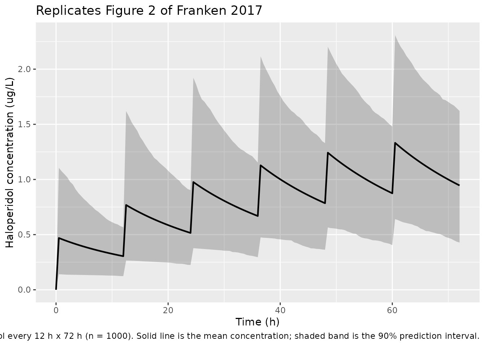

# Haloperidol (Franken 2017)

## Model and source

- Citation: Franken LG, Mathot RAA, Masman AD, Baar FPM, Tibboel D, van
  Gelder T, Koch BCP, de Winter BCM. Population pharmacokinetics of
  haloperidol in terminally ill adult patients. Eur J Clin Pharmacol.
  2017;73(10):1271-1277. <doi:10.1007/s00228-017-2283-6>.
- Description: One-compartment population PK model for haloperidol in 28
  terminally ill adult palliative-care patients (Franken 2017). Two
  parallel first-order absorption routes (oral and subcutaneous) with
  route-specific absorption rate constants fixed from literature (Ka
  oral = 0.236 1/h, Ka SC = 20 1/h derived from intramuscular Tmax = 20
  min). Oral bioavailability F = 0.861 is estimated; SC F is assumed to
  be 1. IIV is included on F, CL, and Vd; the IIV on F and CL was 99%
  correlated and is encoded with correlation fixed to unity (BLOCK
  pattern). Residual variability is additive on log-transformed
  concentrations (LTBS). Covariate analysis (body weight, age, sex,
  primary diagnosis, plasma creatinine, urea, bilirubin, GGT, ALP, ALT,
  AST, CRP, albumin, concomitant CYP2D6 / CYP3A inducers and inhibitors,
  time-to-death) did not retain any covariate in the final model.
- Article: <https://doi.org/10.1007/s00228-017-2283-6>

## Population

The published analysis included 28 terminally ill adult patients
admitted to the Laurens Cadenza palliative care centre in Rotterdam, the
Netherlands, over a 2-year period. Median age was 69.5 years (range
43-93); 53.6% were male; 92.9% were Caucasian and 7.1% Afro-Caribbean;
all 28 patients had advanced malignancy as the primary diagnosis (89.3%
with epithelial-tissue primary site). Median body weight was 67 kg
(range 35-108); body weight was unknown for about 35% of subjects (the
population median 67 kg was imputed during covariate testing, but
allometric scaling was not retained in the final model). Median duration
of admittance was 18.6 days (range 1.5-176.6). Oral haloperidol doses
ranged 0.5-2 mg/day (tablets or liquid) and subcutaneous bolus doses
0.5-5 mg/day, administered per Dutch national palliative guidelines for
delirium. Eighty-seven sparse plasma samples (median 3 per subject,
range 1-9) were drawn by venous puncture or indwelling catheter and
analysed by LC-MS/MS over a validated range of 0.5-125 ug/L (LLOQ 0.5
ug/L). See Franken 2017 Table 1 for the full baseline summary; the same
information is available programmatically via
`readModelDb("Franken_2017_haloperidol")$population`.

## Source trace

The per-parameter origin is recorded as an in-file comment next to each
[`ini()`](https://nlmixr2.github.io/rxode2/reference/ini.html) entry in
`inst/modeldb/specificDrugs/Franken_2017_haloperidol.R`. The table below
collects them in one place.

| Equation / parameter | Final value | Source location |
|----|----|----|
| `lka_oral` (Ka oral) | 0.236 1/h (FIXED) | Table 2, footnote a (literature \[21\]) |
| `lka_sc` (Ka subcutaneous) | 20 1/h (FIXED) | Table 2, footnote a (derived from IM Tmax = 20 min) |
| `lfdepot` (F oral) | 0.861 | Table 2 Final |
| `lcl` (CL) | 29.3 L/h | Table 2 Final |
| `lvc` (Vd) | 1260 L | Table 2 Final |
| `etalfdepot`, `etalcl` (IIV F and CL, rho = 1) | 55% / 43% CV | Table 2 Final + Section “Structural model” |
| `etalvc` (IIV Vd) | 70% CV | Table 2 Final |
| `expSd` (residual SD on log scale) | sqrt(0.258) | Table 2 Final (LTBS variance) |
| Equation: 1-compartment model with two parallel first-order absorption depots | n/a | Section “Structural model” + Section “Population pharmacokinetic method” |
| Assumption: SC bioavailability = 1 | n/a | Section “Population pharmacokinetic method” (citation \[16\]) |

## Virtual cohort

Original observed concentrations are not publicly available. The
simulation below uses a virtual cohort that mirrors the published Figure
2 scenario: 1000 virtual patients receiving 0.5 mg subcutaneous
haloperidol every 12 h over a 72 h window, drawn with between-subject
variability from the model’s omega matrix.

``` r

set.seed(20170705)

n_subj <- 1000

events <- tibble::tibble(id = seq_len(n_subj)) |>
  tidyr::expand_grid(
    tibble::tribble(
      ~time, ~amt, ~evid, ~cmt,
        0,   0.5, 1L, "depot",
       12,   0.5, 1L, "depot",
       24,   0.5, 1L, "depot",
       36,   0.5, 1L, "depot",
       48,   0.5, 1L, "depot",
       60,   0.5, 1L, "depot"
    )
  )

obs_times <- seq(0, 72, by = 0.5)
obs_events <- tibble::tibble(id = seq_len(n_subj)) |>
  tidyr::expand_grid(
    tibble::tibble(time = obs_times, amt = NA_real_, evid = 0L, cmt = "Cc")
  )

events <- dplyr::bind_rows(events, obs_events) |>
  dplyr::arrange(id, time, dplyr::desc(evid))
```

## Simulation

The model defines `depot` (SC, cmt = 1), `depot2` (oral, cmt = 2), and
`central` (cmt = 3). Subcutaneous bioavailability is structurally 1 (the
SC depot’s `f` defaults to 1); oral bioavailability F = 0.861 is applied
via `f(depot2) <- f_oral`. The Figure 2 scenario doses only the SC
depot.

``` r

mod <- readModelDb("Franken_2017_haloperidol")
sim <- rxode2::rxSolve(mod, events = events) |> as.data.frame()
#> Warning: corrected 'omega' to be a symmetric, positive definite matrix
```

For deterministic typical-value replications (without between-subject
variability or residual error), zero out the random effects:

``` r

mod_typical <- mod |> rxode2::zeroRe()
events_typical <- events |> dplyr::filter(id == 1)
sim_typical <- rxode2::rxSolve(mod_typical, events = events_typical) |>
  as.data.frame()
#> ℹ omega/sigma items treated as zero: 'etalfdepot', 'etalcl', 'etalvc'
```

## Replicate published figures

### Figure 2: 0.5 mg SC haloperidol every 12 h x 72 h, 1000 simulated patients

Franken 2017 Figure 2 plots the mean haloperidol concentration with the
90% prediction interval over 72 h after 0.5 mg subcutaneously every 12
h.

``` r

summary_band <- sim |>
  dplyr::group_by(time) |>
  dplyr::summarise(
    Q05 = stats::quantile(Cc, 0.05, na.rm = TRUE),
    Q50 = mean(Cc, na.rm = TRUE),
    Q95 = stats::quantile(Cc, 0.95, na.rm = TRUE),
    .groups = "drop"
  )

ggplot(summary_band, aes(x = time, y = Q50)) +
  geom_ribbon(aes(ymin = Q05, ymax = Q95), alpha = 0.25) +
  geom_line(linewidth = 0.8) +
  labs(
    x = "Time (h)",
    y = "Haloperidol concentration (ug/L)",
    title = "Replicates Figure 2 of Franken 2017",
    caption = paste(
      "0.5 mg subcutaneous haloperidol every 12 h x 72 h (n = 1000).",
      "Solid line is the mean concentration; shaded band is the 90% prediction interval."
    )
  )
```



### Terminal half-life check

Franken 2017 Discussion: “the t1/2 of around 30 h from our study”. With
typical-value CL = 29.3 L/h and Vd = 1260 L, kel = 0.0233 1/h and t1/2 =
ln(2) / kel.

``` r

cl  <- 29.3
vd  <- 1260
kel <- cl / vd
t_half <- log(2) / kel
data.frame(
  CL_L_per_h = cl,
  Vd_L       = vd,
  kel_per_h  = kel,
  t_half_h   = t_half
) |>
  knitr::kable(
    digits   = c(1, 0, 4, 1),
    caption  = "Terminal half-life from typical-value CL and Vd (paper: ~30 h)."
  )
```

| CL_L_per_h | Vd_L | kel_per_h | t_half_h |
|-----------:|-----:|----------:|---------:|
|       29.3 | 1260 |    0.0233 |     29.8 |

Terminal half-life from typical-value CL and Vd (paper: ~30 h). {.table}

## PKNCA validation

PKNCA-based NCA over the steady-state 60-72 h interval of the Figure 2
scenario. The “treatment” grouping is added as a single level because
Figure 2 covers a single dose regimen; the grouping is retained for
compatibility with the standard recipe.

``` r

sim_nca <- sim |>
  dplyr::filter(!is.na(Cc), time >= 60, time <= 72) |>
  dplyr::mutate(treatment = "0.5 mg SC q12h") |>
  dplyr::select(id, time, Cc, treatment)

dose_df <- events |>
  dplyr::filter(evid == 1L, time == 60) |>
  dplyr::mutate(treatment = "0.5 mg SC q12h") |>
  dplyr::select(id, time, amt, treatment)

conc_obj <- PKNCA::PKNCAconc(
  sim_nca, Cc ~ time | treatment + id,
  concu = "ug/L", timeu = "h"
)
dose_obj <- PKNCA::PKNCAdose(
  dose_df, amt ~ time | treatment + id, doseu = "mg"
)

intervals_ss <- data.frame(
  start         = 60,
  end           = 72,
  cmax          = TRUE,
  tmax          = TRUE,
  auclast       = TRUE,
  cmin          = TRUE,
  cav           = TRUE
)

nca_res <- PKNCA::pk.nca(
  PKNCA::PKNCAdata(conc_obj, dose_obj, intervals = intervals_ss)
)
#>  ■■■■■                             13% |  ETA:  8s
#>  ■■■■■■■■■■■■■■■■                  50% |  ETA:  4s
#>  ■■■■■■■■■■■■■■■■■■■■■■■■■■■       88% |  ETA:  1s
knitr::kable(
  as.data.frame(summary(nca_res)),
  caption = "Simulated NCA across the steady-state 60-72 h dosing interval."
)
```

| Interval Start | Interval End | treatment | N | AUClast (h\*ug/L) | Cmax (ug/L) | Cmin (ug/L) | Tmax (h) | Cav (ug/L) |
|---:|---:|:---|:---|:---|:---|:---|:---|:---|
| 60 | 72 | 0.5 mg SC q12h | 1000 | 12.7 \[38.6\] | 1.25 \[40.9\] | 0.817 \[42.8\] | 0.500 \[0.500, 0.500\] | 1.06 \[38.6\] |

Simulated NCA across the steady-state 60-72 h dosing interval. {.table}

## Numeric check: steady-state Cavg from CL and dose rate

For 0.5 mg q12h SC with F = 1, the steady-state average concentration is
Cavg_ss = (F \* Dose) / (CL \* tau). Independent verification against
the PKNCA-derived Cavg confirms internal consistency.

``` r

dose_mg <- 0.5
tau_h   <- 12
F_sc    <- 1
cl_L_h  <- 29.3

cavg_mg_per_L  <- (F_sc * dose_mg) / (cl_L_h * tau_h)
cavg_ug_per_L  <- cavg_mg_per_L * 1000

data.frame(
  F_sc           = F_sc,
  dose_mg        = dose_mg,
  tau_h          = tau_h,
  CL_L_per_h     = cl_L_h,
  Cavg_ss_ug_L   = cavg_ug_per_L
) |>
  knitr::kable(
    digits  = c(2, 2, 0, 1, 4),
    caption = "Cavg at steady state from Cavg = F * Dose / (CL * tau)."
  )
```

| F_sc | dose_mg | tau_h | CL_L_per_h | Cavg_ss_ug_L |
|-----:|--------:|------:|-----------:|-------------:|
|    1 |     0.5 |    12 |       29.3 |       1.4221 |

Cavg at steady state from Cavg = F \* Dose / (CL \* tau). {.table}

## Assumptions and deviations

- **Residual-error interpretation.** Franken 2017 Methods reports
  residual variability as “additive residual error on logarithmic
  transformed concentrations” with Table 2 Final value 0.258 and no
  explicit units. The packaged model interprets this as a NONMEM
  `$SIGMA` variance on the log scale (the convention used by the same
  authors in Franken 2015 morphine) and supplies its square root to
  rxode2’s `lnorm()` residual model so that
  `log(Cobs) - log(Cpred) ~ N(0, expSd^2)`. If a future reading
  determines the value was already reported as a log-scale SD, `expSd`
  should be set to 0.258 directly (without the square root).
- **IIV correlation between F and CL encoded as a BLOCK with rho = 1.**
  The paper section “Structural model” states that the IIV on CL and F
  showed a 99% correlation and was “fixed to unity with the addition of
  an extra theta.” The packaged model encodes the equivalent BLOCK(2)
  structure: variances log(1 + 0.55^2) and log(1 + 0.43^2) with
  off-diagonal sqrt(var_F \* var_CL), which gives an exact correlation
  of 1. This is mathematically equivalent to the published
  shared-eta-with-scaling-theta parameterisation.
- **Absorption rate constants fixed from literature.** Both Ka values
  were fixed because of insufficient absorption-phase data in the
  dataset (Table 2 footnote a). Oral Ka = 0.236 1/h is from a prior
  haloperidol PK study, and SC Ka = 20 1/h was derived by the authors
  from an intramuscular Tmax of 20 min (no SC literature exists for the
  intravenously formulated drug used here). The paper notes that halving
  Ka SC did not affect the other parameters, indicating stability of the
  remaining estimates with respect to this assumption.
- **Subcutaneous bioavailability assumed to be 1.** The paper assumed
  F_SC = 1 (“Population pharmacokinetic method”, citation \[16\]). The
  packaged model encodes this by leaving the SC depot’s bioavailability
  at the rxode2 default (1), so the estimated `f_oral` applies only to
  the oral depot via `f(depot2) <- f_oral`.
- **No covariates retained in the final model.** The published forward
  inclusion identified body weight (allometric exponents 0.75 on CL and
  1 on Vd) and plasma bilirubin as candidates significant on Vd, but
  neither survived backward elimination after sharkplot inspection
  showed that one or two influential subjects accounted for the OFV
  drop. The packaged model therefore contains no covariate effects, in
  line with Table 2. Body weight, plasma bilirubin, age, sex, primary
  diagnosis, plasma creatinine, urea, GGT, ALP, ALT, AST, CRP, albumin,
  time-to-death, and concomitant CYP2D6 / CYP3A inducers and inhibitors
  were all tested as covariates but none were retained.
- **Body weight missing for ~35% of subjects.** Per Franken 2017, weight
  was not registered for all patients (the hospice protocol did not
  routinely weigh patients for dosing purposes). When the allometric
  model was tested, missing weights were imputed at the population
  median of 67 kg; because allometric scaling was not retained in the
  final model, this imputation is moot for the packaged model but is
  recorded here for reproducibility.
- **BQL handling.** 26.7% of concentrations were below the limit of
  quantification; half of these were sampled more than 200 h after the
  last dose. After discarding the post-200-h samples, 14.6% BQL
  remained. The authors evaluated the Beal M3 method but used M1
  (discard) in the final model because of stability problems; the
  packaged model does not re-implement BQL handling (parameter estimates
  are reported as-is from the M1 fit).
- **Single dose route per dose record.** The model defines `depot` (SC,
  cmt = 1) and `depot2` (oral, cmt = 2). A dosing record selects the
  route by its `cmt` value; mixed-route patients in the source data were
  handled by their per-record cmt assignment in NONMEM ADVAN5.
