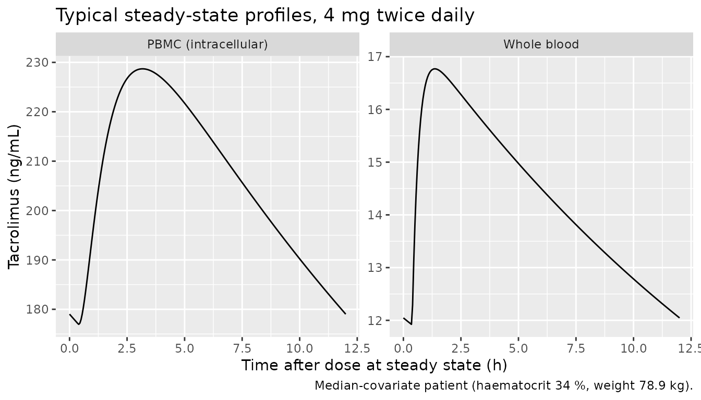
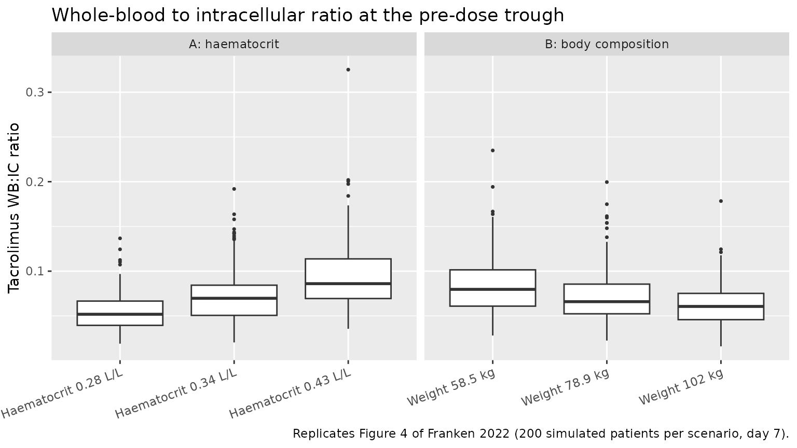

# Tacrolimus whole-blood and intracellular PBMC (Franken 2022)

## Model and source

- Citation: Franken LG, Francke MI, Andrews LM, van Schaik RHN, Li Y, de
  Wit LEA, Baan CC, Hesselink DA, de Winter BCM. A Population
  Pharmacokinetic Model of Whole-Blood and Intracellular Tacrolimus in
  Kidney Transplant Recipients. Eur J Drug Metab Pharmacokinet.
  2022;47(4):523-535. <doi:10.1007/s13318-022-00767-8>. Whole-blood
  layer from: Andrews LM, Hesselink DA, van Schaik RHN, et al. A
  population pharmacokinetic model to predict the individual starting
  dose of tacrolimus in adult renal transplant recipients. Br J Clin
  Pharmacol. 2019;85(3):601-615. <doi:10.1111/bcp.13838>
- Description: Two-compartment population PK model with first-order
  absorption and an absorption lag time for twice-daily oral
  immediate-release tacrolimus (Prograft) in adult kidney transplant
  recipients, extended with an intracellular peripheral blood
  mononuclear cell (PBMC) effect compartment (Franken 2022 final model).
  The whole-blood layer is the Andrews 2019 model, carried unchanged:
  apparent oral clearance CL/F depends on CYP3A5 expresser status,
  CYP3A4\*22 carriage, haematocrit, serum creatinine, serum albumin, age
  and body surface area, and apparent central volume V1/F on lean body
  mass. The PBMC compartment has no mass transfer from the central
  compartment: the intracellular concentration equilibrates with the
  whole-blood concentration at a fixed rate constant (0.9 1/h) towards a
  steady state 14.1-fold higher than whole blood, and this ratio rises
  with lean body mass (power exponent 1.01, centred at 59.5 kg) and
  falls with haematocrit (power exponent -1.22, centred at 34 percent),
  with 38.9 percent inter-individual variability. Residual error is
  proportional for whole blood and combined additive plus proportional
  for the PBMC concentration.
- Article: <https://doi.org/10.1007/s13318-022-00767-8> (open access;
  the Electronic Supplementary Material holds Supplementary Table S1 and
  the NONMEM control stream, Supplementary Data S1)

Franken et al. extended the Andrews 2019 whole-blood tacrolimus model
(`modellib("Andrews_2019_tacrolimus")`) with a compartment for the
concentration inside peripheral blood mononuclear cells (PBMCs). Each
patient contributed a single pre-dose PBMC sample, so the intracellular
compartment was written as an effect compartment without mass transfer
(Figure 1, Equation 3):

``` math
\frac{dC_{IC}}{dt} = K_{WB\text{-}IC}\left(R_{WB:IC}\,C_{WB} - C_{IC}\right)
```

The equilibration rate constant $`K_{WB\text{-}IC}`$ could not be
estimated from trough samples and was fixed at 0.9 1/h. The steady-state
ratio $`R_{WB:IC}`$ (here `ppc`, the canonical effect-compartment
pseudo-partition coefficient) was estimated with a power effect of lean
body weight and of haematocrit (Equation 4).

## Population

The model was developed from 590 tacrolimus concentrations (406
whole-blood, 184 intracellular) in 184 adult kidney transplant
recipients from Erasmus MC, Rotterdam. All were participants in a
randomized trial of CYP3A5 genotype-based versus body-weight-based
tacrolimus dosing after living-donor transplantation (Shuker 2016). They
received oral twice-daily Prograft with mycophenolic acid, prednisolone
and basiliximab induction. Whole-blood pre-dose targets were 10-15 ng/mL
in weeks 1-2, 8-12 ng/mL in weeks 3-4 and 5-10 ng/mL afterwards. Median
age was 57 years (IQR 46-64), body weight 80.0 kg (69.2-92.0), lean body
weight 60.9 kg (53.8-66.9) and haematocrit 0.34 L/L (0.31-0.38) (Table
1). 22.3% were CYP3A5 expressers and 10.9% carried CYP3A4\*22. Table 1
reports neither sex nor race.

The same information is available programmatically via
`readModelDb("Franken_2022_tacrolimus")()$population`.

## Source trace

Every whole-blood value is the Andrews 2019 estimate. Franken 2022 held
these at their published values (Table 2 footnote a) and estimated only
the intracellular parameters and the residual errors.

| Equation / parameter | Value | Source location |
|----|----|----|
| `ltlag` | log(0.38) h, fixed | Table 2 ‘T lag’; Data S1 `ALAG1 = 0.382` |
| `lka` | log(3.58) 1/h, fixed | Table 2 ‘k a’; Data S1 `KA = 3.6` |
| `lcl` | log(23.0) L/h, fixed | Table 2 ‘CL/F’ |
| `lvc` | log(692) L, fixed | Table 2 ‘V 1 /F’ |
| `lq` | log(11.6) L/h, fixed | Table 2 ‘Q 1 /F’ |
| `lvp` | log(5340) L, fixed | Table 2 ‘V 2 /F’ |
| `e_cyp3a5_expr_cl`, `e_cyp3a4_22_cl` | 1.63, 0.80, fixed | Table 2 ‘Covariate effect on CL’ |
| `e_hct_cl`, `e_creat_cl`, `e_alb_cl`, `e_age_cl`, `e_bsa_cl` | -0.76, -0.14, 0.43, -0.43, 0.88, fixed | Table 2 ‘Covariate effect on CL’ |
| `e_lbm_vc` | 1.52, fixed | Table 2 ‘Covariate effect on V 1’ |
| CL/F and V1/F centring values (55.72 y, 42 g/L, 1.93 m^2, 134.98 umol/L, 34 %, 58.94 kg) | n/a | Andrews 2019 Data S1, as in `Andrews_2019_tacrolimus` |
| `etalcl`, `etalvc`, `etalvp`, `etalq` | 38.6, 49.2, 53.0, 78.7 %CV, fixed | Table 2 ‘IIV’ |
| `lke0` | log(0.9) 1/h, fixed | Table 2 ‘K WB-IC’; Results 3.2; Data S1 `THETA(4)` |
| `lppc` | log(14100 / 1000) | Table 2 ‘R WB:IC’ final model; Equation 4; Data S1 `THETA(5)` |
| `e_lbm_ppc` | 1.01 | Table 2 ‘Covariate effect on R WB:IC’; Equation 4 |
| `e_hct_ppc` | -1.22 | Table 2; Equation 4 |
| `etalppc` | 38.9 %CV -\> 0.140910 | Table 2 ‘IIV R WB-IC’ |
| `propSd` | 0.611 | Table 2 ‘Proportional WB’; Data S1 `THETA(1)` |
| `propSd_Cpbmc`, `addSd_Cpbmc` | 0.184, 36.8 ng/mL | Table 2 ‘Proportional IC’, ‘Additive IC’; Data S1 `THETA(2)`, `THETA(3)` |
| `d/dt(effect)` | n/a | Equation 3; Data S1 `DADT(4) = K24*(RPIC*(A(2)/V2)-A(4))` |
| `ppc` covariate model | n/a | Equation 4; Data S1 `RPIC = THETA(5)*(LBW/59.5)**THETA(6)*(HCT/0.34)**THETA(7)` |
| `Cc <- central / vc * 1000` | n/a | Data S1 `S2 = V2 / 1000` |
| Residual error | n/a | Data S1 `$ERROR` (CMT 2 proportional; CMT 4 additive + proportional; `$SIGMA` 1 FIX) |

## Simulated subjects

Section 3.5 and Figure 4 simulate steady-state pre-dose concentrations
for the 10th, 50th and 90th percentiles of one covariate, with the
others at the population median. The haematocrit scenarios are 0.28,
0.34 and 0.43 L/L. The body-composition scenarios vary total body weight
(58.5, 78.9 and 102 kg), which moves lean body weight (49.96, 60.62,
68.47 kg) and body surface area (1.68, 1.96, 2.22 m^2) together. Those
six numbers are reproduced exactly by the paper’s own James and
Mosteller formulas for a **male** patient **174.5 cm** tall, so that is
the simulated patient. The remaining covariates are the Table 1 medians:
age 57 years, albumin 43 g/L, creatinine 135 umol/L. The patient is a
CYP3A5 non-expresser without CYP3A4\*22.

``` r

height_cm <- 174.5
lbm_james_male <- function(wt, ht) 1.1 * wt - 128 * (wt / ht)^2
bsa_mosteller <- function(wt, ht) sqrt(ht * wt / 3600)

scenarios <- tibble::tribble(
  ~panel, ~scenario, ~WT, ~HCT,
  "A: haematocrit", "Haematocrit 0.28 L/L", 78.9, 28,
  "A: haematocrit", "Haematocrit 0.34 L/L", 78.9, 34,
  "A: haematocrit", "Haematocrit 0.43 L/L", 78.9, 43,
  "B: body composition", "Weight 58.5 kg", 58.5, 34,
  "B: body composition", "Weight 78.9 kg", 78.9, 34,
  "B: body composition", "Weight 102 kg", 102, 34
) |>
  mutate(
    LBM = lbm_james_male(WT, height_cm),
    BSA = bsa_mosteller(WT, height_cm),
    AGE = 57, ALB = 43, CREAT = 135,
    CYP3A5_EXPR = 0, SNP_CYP3A4_RS35599367 = 0,
    scenario = factor(scenario, levels = scenario)
  )

# Figure 4B prints LBW 49.96 / 60.62 / 68.47 kg and BSA 1.68 / 1.96 / 2.22 m^2.
stopifnot(
  max(abs(scenarios$LBM[4:6] - c(49.96, 60.62, 68.47))) < 0.02,
  max(abs(scenarios$BSA[4:6] - c(1.68, 1.96, 2.22))) < 0.006
)
knitr::kable(scenarios[, c("scenario", "WT", "LBM", "BSA", "HCT")], digits = 2,
             caption = "Simulated covariate scenarios (HCT in percent).")
```

| scenario             |    WT |   LBM |  BSA | HCT |
|:---------------------|------:|------:|-----:|----:|
| Haematocrit 0.28 L/L |  78.9 | 60.62 | 1.96 |  28 |
| Haematocrit 0.34 L/L |  78.9 | 60.62 | 1.96 |  34 |
| Haematocrit 0.43 L/L |  78.9 | 60.62 | 1.96 |  43 |
| Weight 58.5 kg       |  58.5 | 49.96 | 1.68 |  34 |
| Weight 78.9 kg       |  78.9 | 60.62 | 1.96 |  34 |
| Weight 102 kg        | 102.0 | 68.47 | 2.22 |  34 |

Simulated covariate scenarios (HCT in percent). {.table}

The paper does not state the simulated dose. Every comparison below is
either a ratio (the whole-blood:intracellular ratio does not depend on
dose) or is normalised to the median scenario. A dose of 4 mg twice
daily is used throughout.

``` r

dose <- 4
tau <- 12

# Two dosing schemes.
# * n_doses = NULL: the true periodic steady state, via ss = 1 on the first
#   dose. The 5340 L peripheral volume gives a slow terminal phase, so a dose
#   train would need months to get there. `grid` is time after that dose.
# * n_doses = k: k doses every tau from time 0, with one pre-dose observation
#   at k * tau, immediately before dose k + 1.
make_events <- function(cov, n = 1L, id_offset = 0L, grid = c(0, tau),
                        n_doses = NULL) {
  if (is.null(n_doses)) {
    dose_row <- tibble(time = 0, evid = 1L, amt = dose, ii = tau, addl = 0L,
                       ss = 1L, cmt = "depot", dvid = NA_integer_)
    obs_t <- grid
  } else {
    dose_row <- tibble(time = 0, evid = 1L, amt = dose, ii = tau,
                       addl = n_doses - 1L, ss = 0L, cmt = "depot",
                       dvid = NA_integer_)
    obs_t <- n_doses * tau
  }
  one <- dplyr::bind_rows(
    dose_row,
    tibble(time = obs_t, evid = 0L, amt = NA_real_, ii = 0, addl = 0L,
           ss = 0L, cmt = "central", dvid = 1L)
  )
  tidyr::expand_grid(id = id_offset + seq_len(n), one) |>
    dplyr::bind_cols(cov[rep(1, n * nrow(one)), ])
}
```

## Model structure check against Andrews 2019

The whole-blood layer must be the Andrews 2019 model exactly. For a
CYP3A5 non-expresser the two models share every whole-blood value
(Andrews prints the CYP3A5 multiplier as 1.631, Franken as 1.63), so
their typical whole-blood profiles must coincide.

``` r

mod <- readModelDb("Franken_2022_tacrolimus")
andrews <- readModelDb("Andrews_2019_tacrolimus")

grid <- seq(0, tau, by = 0.05)
ev_ref <- make_events(scenarios[2, ], grid = grid)

typ <- rxode2::rxSolve(mod, ev_ref, omega = NA, sigma = NA,
                       returnType = "data.frame", useLinCmt = FALSE,
                       maxsteps = 500000L)
#> ℹ parameter labels from comments will be replaced by 'label()'
typ_andrews <- rxode2::rxSolve(
  rxode2::zeroRe(andrews),
  ev_ref |> dplyr::select(-dvid) |> dplyr::mutate(IMMUNOASSAY = 1),
  returnType = "data.frame", useLinCmt = FALSE, maxsteps = 500000L
)
#> ℹ parameter labels from comments will be replaced by 'label()'
#> Warning: No sigma parameters in the model
#> ℹ omega/sigma items treated as zero: 'etalcl', 'etalvc', 'etalvp', 'etalq'
rel_diff <- max(abs(typ$Cc / typ_andrews$Cc - 1))
rel_diff
#> [1] 1.081135e-12
stopifnot(rel_diff < 1e-6)
```

## Typical steady-state profiles

``` r

typ |>
  dplyr::select(time, `Whole blood` = Cc, `PBMC (intracellular)` = Cpbmc) |>
  tidyr::pivot_longer(-time, names_to = "matrix", values_to = "conc") |>
  ggplot(aes(time, conc)) +
  geom_line() +
  facet_wrap(~matrix, scales = "free_y") +
  labs(x = "Time after dose at steady state (h)",
       y = "Tacrolimus (ng/mL)",
       title = "Typical steady-state profiles, 4 mg twice daily",
       caption = "Median-covariate patient (haematocrit 34 %, weight 78.9 kg).")
```



The PBMC concentration is about 14 times the whole-blood concentration
and lags it. With $`K_{WB\text{-}IC}`$ = 0.9 1/h the equilibration
half-life is 0.77 h, which is short against the 12 h dosing interval but
long enough to blunt the absorption peak.

## Replicate Figure 4 and Supplementary Table S1

The Supplementary Table S1 interquartile ranges are as wide as the 38.9
% inter-individual variability of `ppc` alone predicts. For example, the
IC IQR at haematocrit 0.28 is 0.77-1.28 times the median, against
exp(-/+0.674 x 0.375) = 0.78-1.29. So the published simulation varied
only that random effect and kept the whole-blood layer at its typical
values. The replication does the same: the whole-blood etas are set to
zero and 200 patients are simulated per scenario.

The paper calls these steady-state pre-dose concentrations but gives
neither the dose nor the number of doses. Each published IC median times
its ratio gives the whole-blood trough the paper simulated. Relative to
the median scenario, those troughs match a dose train of about one week
much better than the true periodic steady state (next table). The
terminal phase of the Andrews 2019 model is slow, so the covariates that
move CL/F (haematocrit, and BSA through body weight) keep pulling the
troughs apart for weeks after the covariates that move V1/F have
settled. The replication therefore uses 14 doses, 7 days of twice-daily
dosing, and reads the trough just before dose 15. The true steady state
is shown beside it.

``` r

ev_typ <- function(n_doses) {
  dplyr::bind_rows(lapply(seq_len(nrow(scenarios)), function(i) {
    make_events(scenarios[i, ], id_offset = i - 1L, n_doses = n_doses)
  }))
}
solve_trough <- function(n_doses, t_obs) {
  rxode2::rxSolve(
    mod, ev_typ(n_doses), omega = NA, sigma = NA, returnType = "data.frame",
    useLinCmt = FALSE, maxsteps = 500000L, keep = "scenario"
  ) |>
    dplyr::filter(time == t_obs) |>
    dplyr::transmute(scenario = as.character(scenario), Cc, Cpbmc,
                     r_typ = Cc / Cpbmc)
}
n_doses_fig4 <- 14L
typ_week <- solve_trough(n_doses_fig4, n_doses_fig4 * tau)
typ_ss <- solve_trough(NULL, tau)

published_s1 <- tibble::tribble(
  ~scenario, ~ic_med, ~ic_q1, ~ic_q3, ~r_med, ~r_q1, ~r_q3,
  "Haematocrit 0.28 L/L", 199.2, 154.1, 255.8, 0.054, 0.042, 0.069,
  "Haematocrit 0.34 L/L", 181.6, 140.6, 233.3, 0.068, 0.053, 0.087,
  "Haematocrit 0.43 L/L", 168.2, 124.1, 217.9, 0.081, 0.063, 0.110,
  "Weight 58.5 kg",       160.1, 123.8, 205.5, 0.080, 0.062, 0.104,
  "Weight 78.9 kg",       186.1, 144.0, 239.1, 0.066, 0.051, 0.085,
  "Weight 102 kg",        201.2, 148.4, 260.5, 0.057, 0.044, 0.078
) |>
  dplyr::mutate(
    wb_med = ic_med * r_med,
    ref = ifelse(grepl("^Haem", scenario), "Haematocrit 0.34 L/L", "Weight 78.9 kg")
  )

relative_to_ref <- function(d, col) {
  d |>
    dplyr::select(-dplyr::any_of("ref")) |>
    dplyr::left_join(published_s1[, c("scenario", "ref")], by = "scenario") |>
    dplyr::group_by(ref) |>
    dplyr::mutate(rel = .data[[col]] / .data[[col]][scenario == ref]) |>
    dplyr::ungroup() |>
    dplyr::pull(rel)
}
wb_rel <- tibble::tibble(
  scenario = published_s1$scenario,
  published = relative_to_ref(published_s1, "wb_med"),
  week = relative_to_ref(typ_week, "Cc"),
  steady = relative_to_ref(typ_ss, "Cc")
)
wb_rel |>
  dplyr::mutate(dplyr::across(-scenario, ~ sprintf("%.3f", .x))) |>
  dplyr::rename(
    "Scenario" = scenario,
    "Published (IC x WB:IC)" = published,
    "Simulated, 7 days" = week,
    "Simulated, true steady state" = steady
  ) |>
  knitr::kable(caption = "Whole-blood trough relative to each panel's median scenario.")
```

| Scenario | Published (IC x WB:IC) | Simulated, 7 days | Simulated, true steady state |
|:---|:---|:---|:---|
| Haematocrit 0.28 L/L | 0.871 | 0.873 | 0.839 |
| Haematocrit 0.34 L/L | 1.000 | 1.000 | 1.000 |
| Haematocrit 0.43 L/L | 1.103 | 1.163 | 1.231 |
| Weight 58.5 kg | 1.043 | 1.044 | 1.108 |
| Weight 78.9 kg | 1.000 | 1.000 | 1.000 |
| Weight 102 kg | 0.934 | 0.940 | 0.903 |

Whole-blood trough relative to each panel’s median scenario. {.table}

``` r


ok <- published_s1$scenario != "Haematocrit 0.43 L/L"
stopifnot(
  # The one-week train tracks the published troughs to under 1 %; the true
  # steady state misses the outer scenarios by 3-6 %. Both are deterministic.
  max(abs(wb_rel$week[ok] / wb_rel$published[ok] - 1)) < 0.03,
  max(abs(wb_rel$steady[ok] / wb_rel$published[ok] - 1)) >
    max(abs(wb_rel$week[ok] / wb_rel$published[ok] - 1))
)
```

``` r

mod_ppc_only <- mod |>
  rxode2::ini(etalcl = 0, etalvc = 0, etalvp = 0, etalq = 0)
#> ℹ parameter labels from comments will be replaced by 'label()'
#> ℹ change initial estimate of `etalcl` to `0`
#> ℹ change initial estimate of `etalvc` to `0`
#> ℹ change initial estimate of `etalvp` to `0`
#> ℹ change initial estimate of `etalq` to `0`

n_per <- 200L
ev_fig4 <- dplyr::bind_rows(lapply(seq_len(nrow(scenarios)), function(i) {
  make_events(scenarios[i, ], n = n_per, id_offset = (i - 1L) * n_per,
              n_doses = n_doses_fig4)
}))
stopifnot(!anyDuplicated(unique(ev_fig4[, c("id", "time", "evid")])))

rxode2::rxSetSeed(20220420)
sim_fig4 <- rxode2::rxSolve(
  mod_ppc_only, ev_fig4, sigma = NA, returnType = "data.frame",
  useLinCmt = FALSE, maxsteps = 500000L, keep = c("scenario", "panel")
)
#> ℹ omega/sigma items treated as zero: 'etalcl', 'etalvc', 'etalvp', 'etalq'
trough <- sim_fig4 |>
  dplyr::filter(time == n_doses_fig4 * tau) |>
  dplyr::mutate(ratio = Cc / Cpbmc)
stopifnot(nrow(trough) == n_per * nrow(scenarios), !anyNA(trough$ratio))
```

``` r

ggplot(trough, aes(scenario, ratio)) +
  geom_boxplot(outlier.size = 0.6) +
  facet_wrap(~panel, scales = "free_x") +
  labs(x = NULL, y = "Tacrolimus WB:IC ratio",
       title = "Whole-blood to intracellular ratio at the pre-dose trough",
       caption = "Replicates Figure 4 of Franken 2022 (200 simulated patients per scenario, day 7).") +
  theme(axis.text.x = element_text(angle = 20, hjust = 1))
```



Supplementary Table S1 reports the ratio as whole blood over
intracellular, the reciprocal of `ppc`. The typical-value ratio is
exact, because it comes from a solve with no random effects. The
stochastic median and IQR come from the 200-patient simulation. The
ratio barely depends on how long dosing has run: it is `ppc` scaled by a
small lag factor from the effect compartment.

``` r

s1 <- trough |>
  dplyr::group_by(scenario = as.character(scenario)) |>
  dplyr::summarise(
    r_sim = median(ratio),
    r_sim_q1 = quantile(ratio, 0.25), r_sim_q3 = quantile(ratio, 0.75),
    .groups = "drop"
  ) |>
  dplyr::left_join(typ_week |> dplyr::select(scenario, r_typ, ic_typ = Cpbmc),
                   by = "scenario") |>
  dplyr::left_join(typ_ss |> dplyr::select(scenario, r_ss = r_typ),
                   by = "scenario") |>
  dplyr::left_join(published_s1, by = "scenario") |>
  dplyr::mutate(
    scenario = factor(scenario, levels = levels(scenarios$scenario)),
    pct_diff = 100 * (r_typ / r_med - 1)
  ) |>
  dplyr::arrange(scenario)

s1 |>
  dplyr::transmute(
    Scenario = scenario,
    `Published WB:IC, median (IQR)` = sprintf("%.3f (%.3f-%.3f)", r_med, r_q1, r_q3),
    `Simulated WB:IC, median (IQR)` = sprintf("%.3f (%.3f-%.3f)", r_sim, r_sim_q1, r_sim_q3),
    `Typical WB:IC, 7 days` = sprintf("%.4f", r_typ),
    `Typical WB:IC, steady state` = sprintf("%.4f", r_ss),
    `Typical (7 days) vs published (%)` = sprintf("%+.1f", pct_diff)
  ) |>
  knitr::kable(caption = "Whole-blood:intracellular ratio at the pre-dose trough versus Supplementary Table S1.")
```

| Scenario | Published WB:IC, median (IQR) | Simulated WB:IC, median (IQR) | Typical WB:IC, 7 days | Typical WB:IC, steady state | Typical (7 days) vs published (%) |
|:---|:---|:---|:---|:---|:---|
| Haematocrit 0.28 L/L | 0.054 (0.042-0.069) | 0.052 (0.039-0.067) | 0.0520 | 0.0528 | -3.7 |
| Haematocrit 0.34 L/L | 0.068 (0.053-0.087) | 0.070 (0.051-0.084) | 0.0663 | 0.0673 | -2.5 |
| Haematocrit 0.43 L/L | 0.081 (0.063-0.110) | 0.086 (0.069-0.114) | 0.0888 | 0.0901 | +9.6 |
| Weight 58.5 kg | 0.080 (0.062-0.104) | 0.080 (0.061-0.101) | 0.0797 | 0.0814 | -0.3 |
| Weight 78.9 kg | 0.066 (0.051-0.085) | 0.066 (0.052-0.086) | 0.0663 | 0.0673 | +0.4 |
| Weight 102 kg | 0.057 (0.044-0.078) | 0.061 (0.046-0.075) | 0.0589 | 0.0596 | +3.3 |

Whole-blood:intracellular ratio at the pre-dose trough versus
Supplementary Table S1. {.table}

Five of the six scenarios reproduce the published median ratio to within
a few percent. The exception is the 90th-percentile haematocrit, 0.43
L/L, where the model gives a ratio about 10 % above the published 0.081.
Equation 4 fixes that value at `(43 / 34)^1.22` times the reference
ratio, so neither the dose nor the dosing duration can bring it down to
0.081. Both the published ratio and the published whole-blood trough for
that row fit a haematocrit of about 0.40 L/L instead (see Assumptions
and deviations).

``` r

ok <- s1$scenario != "Haematocrit 0.43 L/L"
stopifnot(
  # Typical-value ratio: deterministic, so a tight bound. A mis-transcribed
  # ppc, exponent or centring value moves these by tens of percent.
  max(abs(s1$pct_diff[ok])) < 6,
  # Stochastic median: 200 patients give a Monte-Carlo SE of about 3 %.
  max(abs(s1$r_sim[ok] / s1$r_med[ok] - 1)) < 0.12,
  # IQR width tests the eta variance: the published q3/q1 ratios are
  # 1.64-1.77, and the simulated ones carry about 5 % Monte-Carlo noise.
  abs(log(median(s1$r_sim_q3 / s1$r_sim_q1) / median(s1$r_q3 / s1$r_q1))) < 0.2
)
```

The absolute IC concentration depends on the dose, which is not
reported. The table compares IC concentrations relative to each panel’s
median scenario.

``` r

ic_rel <- tibble::tibble(
  scenario = published_s1$scenario,
  published = relative_to_ref(published_s1, "ic_med"),
  simulated = relative_to_ref(typ_week, "Cpbmc")
)
ic_rel |>
  dplyr::transmute(
    Scenario = scenario,
    `Published IC relative to median scenario` = sprintf("%.3f", published),
    `Simulated IC relative to median scenario (7 days)` = sprintf("%.3f", simulated)
  ) |>
  knitr::kable(caption = "Intracellular trough concentration relative to the median-covariate scenario of each panel.")
```

| Scenario | Published IC relative to median scenario | Simulated IC relative to median scenario (7 days) |
|:---|:---|:---|
| Haematocrit 0.28 L/L | 1.097 | 1.113 |
| Haematocrit 0.34 L/L | 1.000 | 1.000 |
| Haematocrit 0.43 L/L | 0.926 | 0.869 |
| Weight 58.5 kg | 0.860 | 0.868 |
| Weight 78.9 kg | 1.000 | 1.000 |
| Weight 102 kg | 1.081 | 1.058 |

Intracellular trough concentration relative to the median-covariate
scenario of each panel. {.table}

``` r


ok_ic <- ic_rel$scenario != "Haematocrit 0.43 L/L"
# The published IC medians are Monte-Carlo medians of 1000 patients (about
# 2.5 % SE each), so a ratio of two of them carries about 3.5 % noise.
stopifnot(max(abs(ic_rel$simulated[ok_ic] / ic_rel$published[ok_ic] - 1)) < 0.08)
```

With 4 mg twice daily for 7 days, the median-covariate patient has a
typical whole-blood trough of 8.1 ng/mL. The published values imply
about 12.3 ng/mL, so the paper’s unstated dose was higher than the one
used here. Absolute concentrations scale with the dose; none of the
comparisons above depends on it.

## PKNCA validation

The paper reports no NCA. The interval below runs over one steady-state
dosing interval for each typical-value scenario, separately for each
matrix. At steady state the effect compartment returns to its starting
value over the interval. Integrating Equation 3 over the interval then
gives $`AUC_{IC} / AUC_{WB} = R_{WB:IC}`$ exactly, which checks the
effect-compartment wiring independently of the published numbers.

``` r

ev_nca <- dplyr::bind_rows(lapply(seq_len(nrow(scenarios)), function(i) {
  make_events(scenarios[i, ], id_offset = i - 1L, grid = grid)
}))
sim_nca <- rxode2::rxSolve(
  mod, ev_nca, omega = NA, sigma = NA, returnType = "data.frame",
  useLinCmt = FALSE, maxsteps = 500000L, keep = "scenario"
) |>
  dplyr::mutate(scenario = as.character(scenario))

dose_df <- ev_nca |>
  dplyr::filter(evid == 1) |>
  dplyr::transmute(id, time, amt, scenario = as.character(scenario))
intervals <- data.frame(start = 0, end = tau, cmax = TRUE, tmax = TRUE,
                        cmin = TRUE, auclast = TRUE)

run_nca <- function(conc_col) {
  conc <- sim_nca |>
    dplyr::filter(!is.na(.data[[conc_col]])) |>
    dplyr::transmute(id, time, scenario, conc = .data[[conc_col]])
  dat <- PKNCA::PKNCAdata(
    PKNCA::PKNCAconc(conc, conc ~ time | scenario + id),
    PKNCA::PKNCAdose(dose_df, amt ~ time | scenario + id),
    intervals = intervals
  )
  as.data.frame(PKNCA::pk.nca(dat)) |>
    dplyr::select(scenario, PPTESTCD, PPORRES) |>
    tidyr::pivot_wider(names_from = PPTESTCD, values_from = PPORRES)
}
nca_wb <- run_nca("Cc")
nca_ic <- run_nca("Cpbmc")

ppc_typ <- sim_nca |> dplyr::distinct(scenario, ppc)
nca_tab <- nca_wb |>
  dplyr::inner_join(nca_ic, by = "scenario", suffix = c("_wb", "_ic")) |>
  dplyr::inner_join(ppc_typ, by = "scenario") |>
  dplyr::mutate(
    scenario = factor(scenario, levels = levels(scenarios$scenario)),
    auc_ratio = auclast_ic / auclast_wb
  ) |>
  dplyr::arrange(scenario)

nca_tab |>
  dplyr::select(scenario, cmax_wb, cmin_wb, auclast_wb, cmax_ic, cmin_ic,
                auclast_ic, auc_ratio, ppc) |>
  dplyr::rename(
    "Scenario" = scenario,
    "WB Cmax (ng/mL)" = cmax_wb, "WB Cmin (ng/mL)" = cmin_wb,
    "WB AUCtau (ng*h/mL)" = auclast_wb,
    "IC Cmax (ng/mL)" = cmax_ic, "IC Cmin (ng/mL)" = cmin_ic,
    "IC AUCtau (ng*h/mL)" = auclast_ic,
    "AUC IC/WB" = auc_ratio, "ppc" = ppc
  ) |>
  knitr::kable(digits = 3, caption = "Steady-state NCA (PKNCA) over one 12 h interval, 4 mg twice daily, typical values.")
```

| Scenario | WB Cmax (ng/mL) | WB Cmin (ng/mL) | WB AUCtau (ng\*h/mL) | IC Cmax (ng/mL) | IC Cmin (ng/mL) | IC AUCtau (ng\*h/mL) | AUC IC/WB | ppc |
|:---|---:|---:|---:|---:|---:|---:|---:|---:|
| Haematocrit 0.28 L/L | 14.822 | 9.984 | 148.273 | 254.169 | 188.738 | 2699.857 | 18.209 | 18.209 |
| Haematocrit 0.34 L/L | 16.769 | 11.924 | 171.848 | 228.696 | 176.953 | 2469.175 | 14.368 | 14.369 |
| Haematocrit 0.43 L/L | 19.550 | 14.697 | 205.425 | 201.841 | 162.902 | 2216.334 | 10.789 | 10.789 |
| Weight 58.5 kg | 19.669 | 13.191 | 196.024 | 218.604 | 161.778 | 2316.900 | 11.819 | 11.820 |
| Weight 78.9 kg | 16.769 | 11.924 | 171.848 | 228.696 | 176.953 | 2469.175 | 14.368 | 14.369 |
| Weight 102 kg | 14.812 | 10.779 | 153.488 | 229.282 | 180.549 | 2493.773 | 16.247 | 16.247 |

Steady-state NCA (PKNCA) over one 12 h interval, 4 mg twice daily,
typical values. {.table}

``` r


# Exact identity, so a tight bound; the only error is the trapezoid rule on
# the 0.05 h output grid.
stopifnot(max(abs(nca_tab$auc_ratio / nca_tab$ppc - 1)) < 1e-3)
```

## Simulated cohort versus the reported individual ratios

Section 3.6 gives the median individual $`R_{WB:IC}`$ as 14371 (IQR
13060-17937) in the 16 patients with biopsy-proven acute rejection and
12274 (IQR 10708-15159) in the 158 without. These are empirical Bayes
estimates on the paper’s scale, which is `ppc` x 1000. Below they are
set beside the `ppc` distribution of a virtual cohort whose lean body
mass and haematocrit are drawn to match the Table 1 medians and IQRs.
Empirical Bayes estimates are pulled towards the typical value (33 %
shrinkage, Table 2), so this is a context check rather than a gate.

``` r

set.seed(2022)
n_cohort <- 200L
# Log-normal draws whose median and IQR match Table 1: LBW 60.9 (53.8-66.9) kg,
# haematocrit 0.34 (0.31-0.38) L/L. The IQR/1.349 rule converts the log-scale
# IQR to a standard deviation.
cohort <- tibble(
  id = seq_len(n_cohort),
  LBM = exp(rnorm(n_cohort, log(60.9), log(66.9 / 53.8) / 1.349)),
  HCT = 100 * exp(rnorm(n_cohort, log(0.34), log(0.38 / 0.31) / 1.349))
)
eta_ppc <- rnorm(n_cohort, 0, sqrt(0.140910))
cohort$ppc_x1000 <- 1000 * (14100 / 1000) * exp(eta_ppc) *
  (cohort$LBM / 59.5)^1.01 * (cohort$HCT / 34)^-1.22

tibble::tibble(
  Source = c("Simulated cohort (n = 200)", "Reported, no BPAR (n = 158)",
             "Reported, BPAR (n = 16)"),
  `Median R WB:IC` = c(median(cohort$ppc_x1000), 12274, 14371),
  `Q1` = c(quantile(cohort$ppc_x1000, 0.25), 10708, 13060),
  `Q3` = c(quantile(cohort$ppc_x1000, 0.75), 15159, 17937)
) |>
  knitr::kable(digits = 0, caption = "Individual R WB:IC (ppc x 1000) in a virtual cohort and as reported in Section 3.6.")
```

| Source                      | Median R WB:IC |    Q1 |    Q3 |
|:----------------------------|---------------:|------:|------:|
| Simulated cohort (n = 200)  |          14285 | 10907 | 19632 |
| Reported, no BPAR (n = 158) |          12274 | 10708 | 15159 |
| Reported, BPAR (n = 16)     |          14371 | 13060 | 17937 |

Individual R WB:IC (ppc x 1000) in a virtual cohort and as reported in
Section 3.6. {.table}

The simulated median sits close to the typical value of 14100, as it
must. The reported median of the 158 patients without rejection is about
14 % lower, and both reported IQRs are narrower than the simulated one.
Narrower spread is what 33 % shrinkage does to empirical Bayes
estimates, so the comparison does not test the model. It does show that
the population typical value lies inside the range of the individual
estimates the paper reports.

## Assumptions and deviations

- **Whole-blood layer.** Franken 2022 fixed the whole-blood parameters
  at each patient’s individual Andrews 2019 estimates. A library model
  has no individual estimates, so the whole-blood layer here is the
  Andrews 2019 population model: its typical values, covariate effects
  and IIV, as printed in Franken 2022 Table 2. The CL/F and V1/F
  centring values do not appear in Franken 2022. They are the Andrews
  2019 Supporting Information control-stream constants and are carried
  from `Andrews_2019_tacrolimus`.
- **Whole-blood residual error.** Franken 2022 re-estimated a
  proportional-only whole-blood error of 61.1 % (Data S1 `CMT.EQ.2`
  branch). It is much larger than the Andrews 2019 immunoassay error
  (17.7 % plus 0.88 ng/mL) because the individual whole-blood parameters
  carried no inter-occasion terms. That value is kept here as the
  paper’s estimate. For whole-blood-only simulation,
  `Andrews_2019_tacrolimus` carries the better whole-blood error model.
- **Inter-occasion variability.** Table 2 lists the Andrews 2019 IOV on
  CL/F (13.6 %), but Franken 2022 did not estimate it and its control
  stream has no IOV term. It is not encoded, as in
  `Andrews_2019_tacrolimus`. A user who needs it can add a per-occasion
  eta on CL/F with variance log(1 + 0.136^2) = 0.0184.
- **Units of R WB:IC.** In the control stream `RPIC` multiplies the
  whole-blood concentration in mg/L (`A(2)/V2`, dose in mg and volume in
  L). The intracellular state is in ug/L (Supplementary Table S1). The
  estimate 14100 therefore carries a factor of 1000. This model drives
  the effect compartment with `Cc` in ng/mL (= ug/L), so `ppc` = 14100 /
  1000 = 14.1, the “14-fold higher concentration in the PBMCs” of
  Results 3.2.
- **Ratio naming in the paper.** Table 2 and Equation 4 call the
  estimated quantity $`R_{WB:IC}`$, but it is the
  intracellular:whole-blood ratio (14.1). Supplementary Table S1 and
  Figure 4 report its reciprocal, whole blood over intracellular (about
  0.07). The abstract and Section 3.5 describe the effects in that
  reciprocal sense: the WB:IC ratio rises with haematocrit and falls
  with body weight. The Section 3.3 sentence “LBW was positively
  correlated and haematocrit negatively correlated with the WB:IC ratio”
  matches the sign of the estimated exponents in Equation 4 (+1.01 and
  -1.22) instead. The maintainers coded Equation 4 and the control
  stream, which agree with each other and with Supplementary Table S1.
- **Haematocrit scale.** The paper records haematocrit in L/L. The
  canonical `HCT` column is in percent, so both centring values (0.34
  L/L) are 34 here.
- **Rounded constants.** The control stream hardcodes `KA = 3.6` and
  `ALAG1 = 0.382`. Table 2 prints 3.58 and 0.38, which are also the
  Andrews 2019 values, and this model uses those. The difference is
  below 1 %.
- **Simulated patient.** Figure 4B prints weight, LBW and BSA for each
  body-composition scenario. Those values identify a male patient 174.5
  cm tall, and that patient is used for all six scenarios. Age, albumin
  and creatinine are the Table 1 medians. CYP3A5 and CYP3A4 genotypes
  are the reference categories. The simulated dose (4 mg twice daily) is
  an assumption, since the paper does not state it.
- **Dosing duration for Figure 4.** The paper calls the Figure 4 and
  Supplementary Table S1 troughs “steady state” without stating how long
  it dosed. The relative whole-blood troughs implied by Supplementary
  Table S1 match 5-10 days of twice-daily dosing to about 1 %. At the
  true periodic steady state the outer scenarios miss by 3-6 %. The
  maintainers therefore replicate the figure at day 7 (14 doses) and
  show the true steady state alongside. The WB:IC ratio itself changes
  by about 2 % between the two.
- **Haematocrit 0.43 L/L scenario.** The published ratio for the
  90th-percentile haematocrit (0.081) is about 10 % below what Equation
  4 gives at 0.43 L/L. Its published whole-blood trough (IC median x
  ratio, 13.6 ng/mL) also falls short of the haematocrit effect on CL/F.
  Both published quantities fit a haematocrit near 0.40 L/L. This is
  recorded as a deviation of the published table and excluded from the
  gate. The model was not adjusted.
- **Table 1 typo.** Glucocorticoid co-medication is printed as “185
  (100%)” in a cohort of 184.
- **Literature check.** No correction or erratum for Franken 2022 was
  found in Europe PMC or Crossref as of 2026-10-02.
