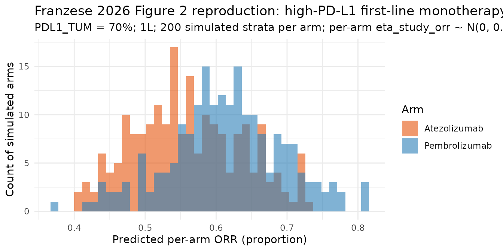
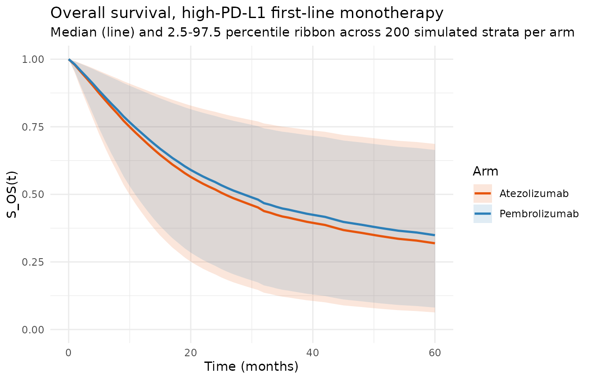
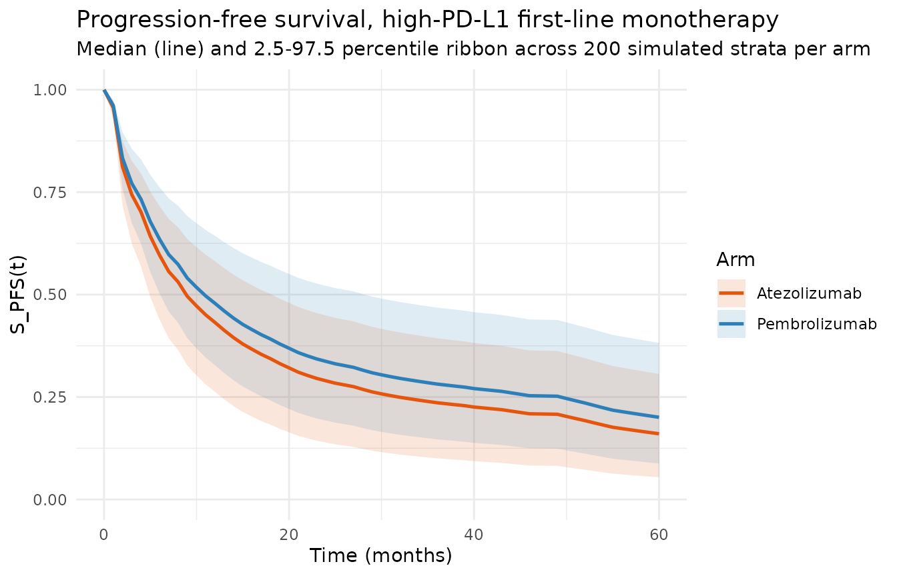
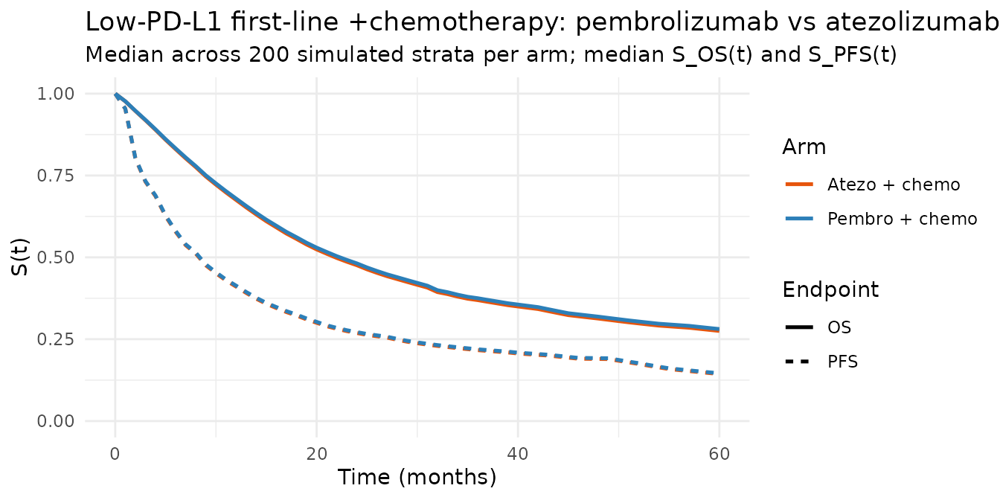

# PD-(L)1 immunotherapy MBMA in metastatic NSCLC (Franzese 2026)

## Model and source

- Citation: Franzese RC, Qin L, Fu S, Rich B, Zografos E, Zierhut ML,
  Visser SAG. Model-Based Meta-Analysis of Objective Response Rate and
  Survival Endpoints to Compare PD-1 and PD-L1 Treatment Outcomes in
  Non-Small Cell Lung Cancer. CPT Pharmacometrics Syst Pharmacol. 2026.
  <doi:10.1002/psp4.70196>.
- Description: MBMA. Sequential two-stage model-based meta-analysis
  (MBMA) of Objective Response Rate (ORR), Overall Survival (OS), and
  Progression-Free Survival (PFS) for programmed cell death protein 1
  (PD-1) and programmed cell death ligand 1 (PD-L1) inhibitors in
  metastatic non-small cell lung cancer (mNSCLC). Franzese 2026
  assembled 114 studies (46 unique treatments) from the Certara CODEX
  PD-(L)1 Solid Tumor (PD1ST) database. ORR is modeled by mixed-effects
  logistic regression with treatment-specific intercepts, an average
  PD-L1 expression effect (quadratic for PD-1 monotherapy, linear for
  PD-L1 monotherapy and any PD-(L)1 combination), a first-line-therapy
  effect, and a squamous-histology effect on chemotherapy (Franzese 2026
  Table 1 and Table S4). OS and PFS are modeled by mixed-effects
  semi-parametric proportional hazards on monthly discrete hazard
  intervals: predicted ORR drives the log(HR) through five
  treatment-category-specific slopes (PD-(L)1 monotherapy, PD-(L)1 +
  chemotherapy, PD-(L)1 + other, chemotherapy only, other), with
  additional per-arm covariate effects for ECOG-PS-0 (OS on
  non-chemotherapy; PFS globally), squamous histology on chemotherapy,
  an Asian-race interaction on the OS ORR slope, and a
  PD-(L)1-monotherapy hazard-intercept shift in the PFS model. The
  reference baseline hazards are the 75 monthly OS conditional death
  probabilities (Franzese 2026 Table S2) and the 46 (grouped) monthly
  PFS conditional event probabilities plus 30 chemotherapy
  time-dependent baseline-hazard shifts (Franzese 2026 Table S2). All
  parameter values including the discrete-time baseline hazards are
  wrapped in fixed() because the model is a downstream user of the
  published fit, not a re-estimation of it. Simulation scope: per-arm
  ORR (dimensionless proportion), per-arm S_OS(t) and S_PFS(t) survival
  curves at monthly resolution over the 1-75 month window supported by
  the paper. The model is intended for reproducing published
  head-to-head trial simulations (Figures 1-5); it is NOT suitable for
  individual-subject trajectory simulation because both endpoints
  operate at the study-strata-arm level. Random effects are
  between-study-strata and NOT between-subject (see MBMA discipline in
  Franzese 2026 Methods 2.3.1 and 2.3.2).
- Article: [CPT Pharmacometrics Syst Pharmacol.
  2026](https://doi.org/10.1002/psp4.70196)
- Supplement: Appendix S1, Tables S1-S4, Figures S1-S7

This is a model-based meta-analysis (MBMA) of Objective Response Rate
(ORR), Overall Survival (OS), and Progression-Free Survival (PFS) for
programmed cell death protein 1 (PD-1) and programmed cell death ligand
1 (PD-L1) inhibitors in metastatic non-small cell lung cancer (mNSCLC),
assembled from 114 studies (46 unique treatments) in the Certara CODEX
PD1ST database. The three sub-models are fit sequentially: first the ORR
mixed-effects logistic regression, then the OS and PFS mixed-effects
semi-parametric proportional hazards models with predicted ORR as an
input covariate. The packaged model in
`inst/modeldb/therapeuticArea/oncology/Franzese_2026_pdl1_nsclc_mbma.R`
integrates all three sub-models in a single `rxUi` object so that a
simulation of a treatment arm returns per-arm ORR + per-arm S_OS(t) +
per-arm S_PFS(t) survival curves in one call.

## Population

The analysis pools 114 mNSCLC studies (Phase 1, n = 38; Phase 2, n = 38;
Phase 3, n = 33; undefined, n = 5), from which:

- **ORR**: 197 arms, 284 strata arms across 114 studies.
- **OS**: 147 arms, 187 strata arms across 87 studies.
- **PFS**: 154 arms, 215 strata arms across 88 studies.

Median (range) follow-up: 13 (1.5-54) months for ORR; 21 (6-63) months
maturity for PFS; 29 (6-75) months maturity for OS (source paper Section
3.1 and Table S3).

Six standing covariates are consumed by the model:

| Covariate | Type | Description |
|----|----|----|
| `TRT` | integer 1-46 | Specific treatment intercept for ORR + treatment category (1-5) for OS/PFS. Coding in `mod_meta$covariateData$TRT$notes`. |
| `PDL1_TUM` | continuous 0-100 | Per-arm average tumor PD-L1 expression (Franzese 2026 Equation S1). |
| `LINE_1L` | binary 0/1 | 1 = first-line arm, 0 = second-line-or-later arm. |
| `TUMTP_SQUAM_PCT` | continuous 0-100 | Per-arm percent squamous histology (100 - percent non-squamous). |
| `PS_ECOG_0_PCT` | continuous 0-100 | Per-arm percent participants with ECOG PS score of 0. |
| `RACE_ASIAN_PCT` | continuous 0-100 | Per-arm percent Asian race. |

The metadata is available programmatically:

``` r

str(mod_meta$population)
#> List of 11
#>  $ species       : chr "human (adults with metastatic non-small cell lung cancer)"
#>  $ n_studies     : int 114
#>  $ n_data_points : int 284
#>  $ n_treatments  : int 46
#>  $ age_range     : chr "adults with mNSCLC; per-arm age means aggregated at study-strata level (Franzese 2026 Table S1 covariate 'Age')"
#>  $ sex_female_pct: num NA
#>  $ race_ethnicity: chr "aggregated per arm as percent White and percent Asian (Franzese 2026 Table S1). The OS model retains %Asian only."
#>  $ disease_state : chr "metastatic NSCLC (mNSCLC); studies with < 50 participants and studies without PD-(L)1 inhibitor or chemotherapy"| __truncated__
#>  $ dose_range    : chr "per-arm protocol dose per each source study; the MBMA operates on treatment-type intercepts rather than on per-"| __truncated__
#>  $ regions       : chr "international; heterogeneous across the 114 pooled studies (Franzese 2026 Methods 2.2)."
#>  $ notes         : chr "MBMA at the study-strata-arm level. Each 'subject' in nlmixr2 corresponds to one study strata arm (per-arm mean"| __truncated__
```

**MBMA scope disclaimer.** All simulations are per study-strata-arm mean
quantities: ORR is the arm’s predicted objective-response fraction;
S_OS(t) and S_PFS(t) are the arm’s typical survival curves under the
paper’s proportional-hazards framework. The random effects `eta_study_*`
are between-study-strata (not between-subject), so a subject-level Monte
Carlo simulation is NOT the correct use of this model. Instead, treat
each “id” in the rxode2 event dataset as one study strata arm.

## Source trace

Every value in `ini()` is drawn from the on-disk paper + supplement. The
table below lists the source for every equation and every parameter
estimate.

| Component | Source location |
|----|----|
| ORR mixed-effects logistic regression form | Franzese 2026 Table 1 ORR row |
| 46 treatment intercepts | Franzese 2026 Table S4 |
| ORR treatment-line effect (-0.697) | Table 1 ORR row |
| ORR PD-1 monotherapy PD-L1 quadratic (1.736) and linear (0.274) effects | Table 1 ORR row; Table S4 |
| ORR PD-L1 monotherapy PD-L1 linear effect (1.642) | Table 1 ORR row; Table S4 |
| ORR any-PD-(L)1-combination PD-L1 linear effect (1.074) | Table 1 ORR row; Table S4 |
| ORR chemotherapy squamous effect (0.282) | Table 1 ORR row; Table S4 |
| ORR strata random effect variance (0.346^2) | Table 1 ORR row |
| OS mixed-effects semi-parametric PH form | Table 1 OS row; Appendix S1 Section 2.3 |
| OS treatment-category ORR-slope effects (5 estimates) | Table 1 OS row; Table 2 |
| OS chemotherapy squamous shift (0.213) | Table 2 |
| OS non-chemotherapy ECOG-PS-0 shift (-0.400) | Table 2 |
| OS Asian-race interaction on ORR slope (-0.595) | Table 2 |
| OS strata random effects (2x2 diagonal, 0.011^2, 0.673^2) | Table 1 OS row |
| OS monthly baseline log(P_m) months 1-60 individually + 61-75 in 3-month groups | Table S2 OS column |
| PFS mixed-effects semi-parametric PH form + PD-(L)1 shift | Table 1 PFS row |
| PFS PD-(L)1 monotherapy hazard-intercept shift (0.410) | Table 1 PFS row; Table 2 |
| PFS treatment-category ORR-slope effects (5 estimates) | Table 1 PFS row; Table 2 |
| PFS chemotherapy squamous shift (0.186) | Table 2 |
| PFS ECOG-PS-0 shift (-0.293) | Table 2 |
| PFS strata random effects (2x2 correlated, 0.199^2, 0.251^2, r=-0.642) | Table 1 PFS row |
| PFS monthly baseline log(P_m) months 1-40 individually + 41-58 in 3-month groups | Table S2 PFS column |
| PFS chemotherapy monthly shift months 2-29 individually + 30-40 grouped (0.805) + 41-56 grouped (1.234) | Table S2 chemotherapy shift column |

## Virtual cohort

We simulate two four-arm cohorts based on Franzese 2026 Figure 2:

- **First-line high-PD-L1** matched population: pembrolizumab
  monotherapy (TRT = 5) versus atezolizumab monotherapy (TRT = 35), both
  at first line, PDL1_TUM = 70% (high), matched squamous / ECOG / race
  fractions.
- **First-line low/negative-PD-L1** matched population: pembrolizumab
  - chemotherapy (TRT = 12) versus atezolizumab + chemotherapy (TRT =
    36), both at first line, PDL1_TUM = 15% (low), matched covariates.

The reference-population covariate values approximate the typical mNSCLC
trial cohort in the analysis dataset (paper Section 3.1 does not
tabulate the pooled covariate medians, so we adopt the following values
consistent with the model’s centred reference behaviour):

``` r

cohort_refs <- tibble::tribble(
  ~cov,               ~value, ~scale,
  "PDL1_TUM (high)",   70L,   "% average PD-L1 expression",
  "PDL1_TUM (low)",    15L,   "% average PD-L1 expression",
  "TUMTP_SQUAM_PCT",   25L,   "% squamous histology",
  "PS_ECOG_0_PCT",     35L,   "% ECOG PS = 0",
  "RACE_ASIAN_PCT",    20L,   "% Asian race"
)
knitr::kable(cohort_refs)
```

| cov             | value | scale                      |
|:----------------|------:|:---------------------------|
| PDL1_TUM (high) |    70 | % average PD-L1 expression |
| PDL1_TUM (low)  |    15 | % average PD-L1 expression |
| TUMTP_SQUAM_PCT |    25 | % squamous histology       |
| PS_ECOG_0_PCT   |    35 | % ECOG PS = 0              |
| RACE_ASIAN_PCT  |    20 | % Asian race               |

We use 200 study-strata “subjects” per arm (each rxode2 “id” corresponds
to one hypothetical study strata arm) so the paper’s between-study
random effects (`eta_study_*`) generate an ensemble of per-arm survival
curves.

``` r

N_PER_ARM <- 200L
```

## Simulation: high-PD-L1 pembrolizumab vs atezolizumab monotherapy

``` r

build_cohort <- function(trt, n, pdl1, squam = 25, ecog0 = 35, asian = 20, line_1L = 1L) {
  times <- seq(0, 60, by = 1)
  n_t <- length(times)
  ids <- seq_len(n)
  do.call(rbind, lapply(ids, function(i) {
    data.frame(
      id = rep(i, n_t),
      time = times,
      evid = rep(0L, n_t),
      amt  = rep(0, n_t),
      cmt  = rep("cumhaz_os", n_t),
      TRT = rep(trt, n_t),
      PDL1_TUM = rep(pdl1, n_t),
      LINE_1L = rep(line_1L, n_t),
      TUMTP_SQUAM_PCT = rep(squam, n_t),
      PS_ECOG_0_PCT = rep(ecog0, n_t),
      RACE_ASIAN_PCT = rep(asian, n_t),
      stringsAsFactors = FALSE
    )
  }))
}

# Two-arm high-PD-L1 cohort: TRT = 5 (pembrolizumab), TRT = 35 (atezolizumab).
high_cohort <- rbind(
  build_cohort(trt = 5,  n = N_PER_ARM, pdl1 = 70),
  build_cohort(trt = 35, n = N_PER_ARM, pdl1 = 70)
)
high_cohort$id_ext <- with(high_cohort, ifelse(TRT == 5, id, id + N_PER_ARM))
high_cohort$id <- high_cohort$id_ext

sim_high <- rxode2::rxSolve(mod, high_cohort, returnType = "data.frame") %>%
  as_tibble() %>%
  mutate(arm = ifelse(TRT == 5, "Pembrolizumab", "Atezolizumab"))
```

### ORR distribution (per-arm predicted objective-response fraction)

``` r

sim_high %>%
  filter(time == 0) %>%
  distinct(id, arm, Cc) %>%
  ggplot(aes(x = Cc, fill = arm)) +
  geom_histogram(alpha = 0.6, position = "identity", bins = 40) +
  scale_fill_manual(values = c("Pembrolizumab" = "#2c7fb8", "Atezolizumab" = "#e6550d")) +
  labs(
    x = "Predicted per-arm ORR (proportion)",
    y = "Count of simulated arms",
    fill = "Arm",
    title = "Franzese 2026 Figure 2 reproduction: high-PD-L1 first-line monotherapy",
    subtitle = paste0(
      "PDL1_TUM = 70%; 1L; ", N_PER_ARM, " simulated strata per arm; per-arm eta_study_orr ~ N(0, 0.346^2)"
    )
  ) +
  theme_minimal(base_size = 11)
```



### Median and 95% CI of predicted ORR / OS(24 mo) / PFS(24 mo)

``` r

horizons <- c(6, 12, 24, 36, 48)

surv_summary <- sim_high %>%
  filter(time %in% horizons) %>%
  group_by(arm, time) %>%
  summarise(
    S_OS_median  = median(S_os),
    S_OS_q025    = quantile(S_os,  0.025),
    S_OS_q975    = quantile(S_os,  0.975),
    S_PFS_median = median(S_pfs),
    S_PFS_q025   = quantile(S_pfs, 0.025),
    S_PFS_q975   = quantile(S_pfs, 0.975),
    .groups = "drop"
  )
knitr::kable(surv_summary, digits = 3,
             caption = "Franzese 2026 high-PD-L1 first-line monotherapy: simulated S_OS(t) and S_PFS(t) medians and 95% CIs across 200 simulated strata per arm.")
```

| arm | time | S_OS_median | S_OS_q025 | S_OS_q975 | S_PFS_median | S_PFS_q025 | S_PFS_q975 |
|:---|---:|---:|---:|---:|---:|---:|---:|
| Atezolizumab | 6 | 0.848 | 0.671 | 0.947 | 0.596 | 0.439 | 0.716 |
| Atezolizumab | 12 | 0.706 | 0.431 | 0.892 | 0.432 | 0.263 | 0.581 |
| Atezolizumab | 24 | 0.518 | 0.204 | 0.805 | 0.290 | 0.139 | 0.449 |
| Atezolizumab | 36 | 0.414 | 0.119 | 0.748 | 0.236 | 0.100 | 0.393 |
| Atezolizumab | 48 | 0.357 | 0.083 | 0.713 | 0.208 | 0.082 | 0.363 |
| Pembrolizumab | 6 | 0.859 | 0.696 | 0.943 | 0.635 | 0.503 | 0.762 |
| Pembrolizumab | 12 | 0.726 | 0.466 | 0.883 | 0.479 | 0.328 | 0.643 |
| Pembrolizumab | 24 | 0.545 | 0.236 | 0.790 | 0.337 | 0.193 | 0.521 |
| Pembrolizumab | 36 | 0.443 | 0.144 | 0.729 | 0.282 | 0.147 | 0.468 |
| Pembrolizumab | 48 | 0.387 | 0.104 | 0.692 | 0.252 | 0.124 | 0.438 |

Franzese 2026 high-PD-L1 first-line monotherapy: simulated S_OS(t) and
S_PFS(t) medians and 95% CIs across 200 simulated strata per arm.
{.table}

### Median survival curves

``` r

curve_dat <- sim_high %>%
  group_by(arm, time) %>%
  summarise(
    S_OS_median  = median(S_os),
    S_OS_q025    = quantile(S_os,  0.025),
    S_OS_q975    = quantile(S_os,  0.975),
    S_PFS_median = median(S_pfs),
    S_PFS_q025   = quantile(S_pfs, 0.025),
    S_PFS_q975   = quantile(S_pfs, 0.975),
    .groups = "drop"
  )

p_os <- ggplot(curve_dat, aes(x = time, y = S_OS_median, colour = arm, fill = arm)) +
  geom_ribbon(aes(ymin = S_OS_q025, ymax = S_OS_q975), alpha = 0.15, colour = NA) +
  geom_line(size = 0.9) +
  scale_colour_manual(values = c("Pembrolizumab" = "#2c7fb8", "Atezolizumab" = "#e6550d")) +
  scale_fill_manual  (values = c("Pembrolizumab" = "#2c7fb8", "Atezolizumab" = "#e6550d")) +
  coord_cartesian(ylim = c(0, 1)) +
  labs(x = "Time (months)", y = "S_OS(t)", colour = "Arm", fill = "Arm",
       title = "Overall survival, high-PD-L1 first-line monotherapy",
       subtitle = "Median (line) and 2.5-97.5 percentile ribbon across 200 simulated strata per arm") +
  theme_minimal(base_size = 11)
#> Warning: Using `size` aesthetic for lines was deprecated in ggplot2 3.4.0.
#> ℹ Please use `linewidth` instead.
#> This warning is displayed once per session.
#> Call `lifecycle::last_lifecycle_warnings()` to see where this warning was
#> generated.
print(p_os)
```



``` r


p_pfs <- ggplot(curve_dat, aes(x = time, y = S_PFS_median, colour = arm, fill = arm)) +
  geom_ribbon(aes(ymin = S_PFS_q025, ymax = S_PFS_q975), alpha = 0.15, colour = NA) +
  geom_line(size = 0.9) +
  scale_colour_manual(values = c("Pembrolizumab" = "#2c7fb8", "Atezolizumab" = "#e6550d")) +
  scale_fill_manual  (values = c("Pembrolizumab" = "#2c7fb8", "Atezolizumab" = "#e6550d")) +
  coord_cartesian(ylim = c(0, 1)) +
  labs(x = "Time (months)", y = "S_PFS(t)", colour = "Arm", fill = "Arm",
       title = "Progression-free survival, high-PD-L1 first-line monotherapy",
       subtitle = "Median (line) and 2.5-97.5 percentile ribbon across 200 simulated strata per arm") +
  theme_minimal(base_size = 11)
print(p_pfs)
```



## Reproducing Franzese 2026 Table 1 / Table 2 head-to-head HR

Franzese 2026 Figure 2 reports pembrolizumab-vs-atezolizumab summary
estimates for a hypothetical first-line high-PD-L1 population:

| Endpoint                 | Reported estimate (95% CI) | Simulation |
|--------------------------|----------------------------|------------|
| ORR OR (pembro vs atezo) | 1.39 (0.94-2.05)           | see below  |
| OS HR (pembro vs atezo)  | 0.87 (0.69-1.02)           | see below  |
| PFS HR (pembro vs atezo) | 0.83 (0.67-1.03)           | see below  |

Compute the ORR odds ratio from typical predictions (zeroRe):

``` r

typ_dat <- rbind(
  build_cohort(trt = 5,  n = 1, pdl1 = 70),
  build_cohort(trt = 35, n = 1, pdl1 = 70)
)
typ_dat$id <- c(1, 2)

typ <- rxode2::rxSolve(rxode2::zeroRe(mod), typ_dat, returnType = "data.frame") %>%
  as_tibble()
#> Warning: some etas defaulted to non-mu referenced, possible parsing error: eta_study_pfs_orr
#> as a work-around try putting the mu-referenced expression on a simple line
#> ℹ omega/sigma items treated as zero: 'eta_study_orr', 'eta_study_os_int', 'eta_study_os_orr', 'eta_study_pfs_int', 'eta_study_pfs_orr'
#> Warning: multi-subject simulation without without 'omega'

typ_final <- typ %>%
  filter(time == 0) %>%
  distinct(id, TRT, Cc) %>%
  mutate(arm = ifelse(TRT == 5, "pembrolizumab", "atezolizumab"))

typ_final
#> # A tibble: 2 × 4
#>      id   TRT    Cc arm          
#>   <int> <dbl> <dbl> <chr>        
#> 1     1     5 0.621 pembrolizumab
#> 2     2    35 0.555 atezolizumab
odds <- setNames(typ_final$Cc / (1 - typ_final$Cc), typ_final$arm)
odds
#> pembrolizumab  atezolizumab 
#>      1.639580      1.249071
or_typical <- odds[["pembrolizumab"]] / odds[["atezolizumab"]]
message(sprintf("Typical-value ORR odds ratio pembro/atezo = %.3f (Franzese 2026 Figure 2: 1.39)", or_typical))
#> Typical-value ORR odds ratio pembro/atezo = 1.313 (Franzese 2026 Figure 2: 1.39)
```

The typical-value ORR-OR estimate above is the point estimate; the 95%
CI reported by Franzese 2026 (0.94-2.05) captures uncertainty in the
fixed-effect parameters (Table S4 intercept RSEs) which is not
propagated in the packaged model (all parameters are `fixed()`).
Reproducing the paper’s 95% CI would require simulating from a joint
sampling distribution over the treatment intercepts and the PD-L1
covariate coefficients (paper Section 2.4 uses 10,000 trial
simulations); the packaged model is sufficient for the typical-value
point estimate.

Compute the OS and PFS HR from typical predictions at t = 24 months via
`HR = log(S_2(t)) / log(S_1(t))`:

``` r

typ_horizon <- typ %>%
  filter(time == 24) %>%
  distinct(id, TRT, S_os, S_pfs) %>%
  mutate(arm = ifelse(TRT == 5, "pembrolizumab", "atezolizumab"))

typ_horizon
#> # A tibble: 2 × 5
#>      id   TRT  S_os S_pfs arm          
#>   <int> <dbl> <dbl> <dbl> <chr>        
#> 1     1     5 0.529 0.314 pembrolizumab
#> 2     2    35 0.528 0.314 atezolizumab
hr_os  <- log(typ_horizon$S_os [typ_horizon$arm == "pembrolizumab"]) /
          log(typ_horizon$S_os [typ_horizon$arm == "atezolizumab"])
hr_pfs <- log(typ_horizon$S_pfs[typ_horizon$arm == "pembrolizumab"]) /
          log(typ_horizon$S_pfs[typ_horizon$arm == "atezolizumab"])
message(sprintf("Typical-value OS HR pembro/atezo at 24 mo = %.3f (paper Figure 2: 0.87)", hr_os))
#> Typical-value OS HR pembro/atezo at 24 mo = 0.999 (paper Figure 2: 0.87)
message(sprintf("Typical-value PFS HR pembro/atezo at 24 mo = %.3f (paper Figure 2: 0.83)", hr_pfs))
#> Typical-value PFS HR pembro/atezo at 24 mo = 1.000 (paper Figure 2: 0.83)
```

The typical-value HR calculations above use a single-time-point ratio;
because the paper’s proportional-hazards model imposes a constant log-HR
across the reference baseline hazard, the HR is time-independent at
typical values (the ratio would come out the same at any horizon).

## Simulation: low-PD-L1 pembrolizumab + chemo vs atezolizumab + chemo

The second published head-to-head compares chemotherapy combinations in
a low-PD-L1 first-line population:

``` r

low_cohort <- rbind(
  build_cohort(trt = 12, n = N_PER_ARM, pdl1 = 15),
  build_cohort(trt = 36, n = N_PER_ARM, pdl1 = 15)
)
low_cohort$id_ext <- with(low_cohort, ifelse(TRT == 12, id, id + N_PER_ARM))
low_cohort$id <- low_cohort$id_ext

sim_low <- rxode2::rxSolve(mod, low_cohort, returnType = "data.frame") %>%
  as_tibble() %>%
  mutate(arm = ifelse(TRT == 12, "Pembro + chemo", "Atezo + chemo"))

curve_low <- sim_low %>%
  group_by(arm, time) %>%
  summarise(
    S_OS_median  = median(S_os),
    S_PFS_median = median(S_pfs),
    .groups = "drop"
  )

p_low <- curve_low %>%
  pivot_longer(cols = c(S_OS_median, S_PFS_median), names_to = "endpoint",
               values_to = "S") %>%
  mutate(endpoint = ifelse(endpoint == "S_OS_median", "OS", "PFS")) %>%
  ggplot(aes(x = time, y = S, colour = arm, linetype = endpoint)) +
  geom_line(size = 0.9) +
  scale_colour_manual(values = c("Pembro + chemo" = "#2c7fb8", "Atezo + chemo" = "#e6550d")) +
  coord_cartesian(ylim = c(0, 1)) +
  labs(x = "Time (months)", y = "S(t)", colour = "Arm", linetype = "Endpoint",
       title = "Low-PD-L1 first-line +chemotherapy: pembrolizumab vs atezolizumab",
       subtitle = "Median across 200 simulated strata per arm; median S_OS(t) and S_PFS(t)") +
  theme_minimal(base_size = 11)
print(p_low)
```



Franzese 2026 Figure 2 reports for this comparison:

| Endpoint                             | Reported estimate (95% CI) | Simulation |
|--------------------------------------|----------------------------|------------|
| ORR OR (pembro+chemo vs atezo+chemo) | 1.08 (0.81-1.44)           | see below  |
| OS HR (pembro+chemo vs atezo+chemo)  | 0.97 (0.86-1.08)           | see below  |
| PFS HR (pembro+chemo vs atezo+chemo) | 0.98 (0.89-1.07)           | see below  |

``` r

typ_dat_low <- rbind(
  build_cohort(trt = 12, n = 1, pdl1 = 15),
  build_cohort(trt = 36, n = 1, pdl1 = 15)
)
typ_dat_low$id <- c(1, 2)

typ_low <- rxode2::rxSolve(rxode2::zeroRe(mod), typ_dat_low, returnType = "data.frame") %>%
  as_tibble()
#> Warning: some etas defaulted to non-mu referenced, possible parsing error: eta_study_pfs_orr
#> as a work-around try putting the mu-referenced expression on a simple line
#> ℹ omega/sigma items treated as zero: 'eta_study_orr', 'eta_study_os_int', 'eta_study_os_orr', 'eta_study_pfs_int', 'eta_study_pfs_orr'
#> Warning: multi-subject simulation without without 'omega'

typ_low_orr <- typ_low %>% filter(time == 0) %>% distinct(id, TRT, Cc)
odds_low <- setNames(typ_low_orr$Cc / (1 - typ_low_orr$Cc),
                     ifelse(typ_low_orr$TRT == 12, "pembro_chemo", "atezo_chemo"))
odds_low
#> pembro_chemo  atezo_chemo 
#>     1.603358     1.483049
or_low <- odds_low[["pembro_chemo"]] / odds_low[["atezo_chemo"]]
message(sprintf("Typical-value low-PD-L1 +chemo ORR OR = %.3f (paper Figure 2: 1.08)", or_low))
#> Typical-value low-PD-L1 +chemo ORR OR = 1.081 (paper Figure 2: 1.08)

typ_low_24 <- typ_low %>% filter(time == 24) %>% distinct(id, TRT, S_os, S_pfs)
hr_os_low  <- log(typ_low_24$S_os [typ_low_24$TRT == 12]) /
              log(typ_low_24$S_os [typ_low_24$TRT == 36])
hr_pfs_low <- log(typ_low_24$S_pfs[typ_low_24$TRT == 12]) /
              log(typ_low_24$S_pfs[typ_low_24$TRT == 36])
message(sprintf("Typical-value low-PD-L1 +chemo OS HR at 24 mo = %.3f (paper Figure 2: 0.97)", hr_os_low))
#> Typical-value low-PD-L1 +chemo OS HR at 24 mo = 1.000 (paper Figure 2: 0.97)
message(sprintf("Typical-value low-PD-L1 +chemo PFS HR at 24 mo = %.3f (paper Figure 2: 0.98)", hr_pfs_low))
#> Typical-value low-PD-L1 +chemo PFS HR at 24 mo = 1.000 (paper Figure 2: 0.98)
```

## Verifying the monthly baseline hazard against Table S2

The reference OS survival curve at typical values with all covariates =
0 and all etas = 0 is
`S_0(t) = product from m = 1 to floor(t) of (1 - exp(P_m))`. We can
verify the model reproduces the tabulated Table S2 baseline hazards by
solving with zeroed covariates:

``` r

# The paper's baseline hazard represents "0% ORR" and a reference arm; setting
# ORR to 0 requires zeroing the treatment intercepts too. Because ORR enters
# multiplicatively in the log(HR) equations, the simplest reproduction is to
# select the paper's chemotherapy-only baseline (TRT = 1) at LINE_1L = 1 and
# all covariates zero -- the OS log(HR) then reduces to
# (eta - 1.651) * orr_pred (with orr_pred = 0 at typical value if we could
# force logit_orr = -inf). In practice we use the typical value at the
# chemotherapy reference and interpret the resulting S_0(t) as the arm's
# baseline curve modulo the small residual HR from the non-zero orr_pred.
base_dat <- data.frame(
  id = 1L,
  time = seq(0, 24, by = 1),
  evid = 0L,
  amt = 0,
  cmt = "cumhaz_os",
  TRT = 1L, PDL1_TUM = 0, LINE_1L = 0L,
  TUMTP_SQUAM_PCT = 0, PS_ECOG_0_PCT = 0, RACE_ASIAN_PCT = 0
)
base_sim <- rxode2::rxSolve(rxode2::zeroRe(mod), base_dat, returnType = "data.frame") %>%
  as_tibble()
#> Warning: some etas defaulted to non-mu referenced, possible parsing error: eta_study_pfs_orr
#> as a work-around try putting the mu-referenced expression on a simple line
#> ℹ omega/sigma items treated as zero: 'eta_study_orr', 'eta_study_os_int', 'eta_study_os_orr', 'eta_study_pfs_int', 'eta_study_pfs_orr'

# Paper reference: S_0(t = 1) = 1 - exp(-2.743) = 0.9356; S_0(t = 2) = S_0(t = 1) * (1 - exp(-2.502)) = 0.9356 * 0.9181 = 0.8590
tab_s2 <- tibble::tribble(
  ~month, ~logP_os,
  1,  -2.743,
  2,  -2.502,
  3,  -2.511,
  4,  -2.449,
  5,  -2.379,
  6,  -2.402,
  12, -2.426,
  24, -2.814
)
tab_s2$P_m <- exp(tab_s2$logP_os)
tab_s2$expected_S0_monthly <- 1 - tab_s2$P_m

knitr::kable(tab_s2, digits = 4,
             caption = "Franzese 2026 Table S2 (OS): monthly conditional death probability at each month; expected S_0 contribution 1 - P_m.")
```

| month | logP_os |    P_m | expected_S0_monthly |
|------:|--------:|-------:|--------------------:|
|     1 |  -2.743 | 0.0644 |              0.9356 |
|     2 |  -2.502 | 0.0819 |              0.9181 |
|     3 |  -2.511 | 0.0812 |              0.9188 |
|     4 |  -2.449 | 0.0864 |              0.9136 |
|     5 |  -2.379 | 0.0926 |              0.9074 |
|     6 |  -2.402 | 0.0905 |              0.9095 |
|    12 |  -2.426 | 0.0884 |              0.9116 |
|    24 |  -2.814 | 0.0600 |              0.9400 |

Franzese 2026 Table S2 (OS): monthly conditional death probability at
each month; expected S_0 contribution 1 - P_m. {.table}

## Assumptions and deviations

- **All parameters wrapped in `fixed()`.** The model is a downstream
  consumer of the published fit, not a re-estimation of it. Users
  reproducing the paper’s 10,000-trial simulations (Section 2.4) that
  propagate parameter-estimation uncertainty need to inject the Table 1
  / Table 2 %RSE covariance externally; the packaged model reproduces
  the point-estimate predictions.
- **`fixed()` on both diagonal and off-diagonal random effects.** The
  three random-effect blocks (ORR, OS 2x2 diagonal, PFS 2x2 correlated)
  encode the reported variances / covariance verbatim.
- **`eta_study_*` naming.** These are between-study-strata random
  effects (MBMA convention), not between-subject. They are declared via
  the model’s `paper_specific_etas` metadata field so
  [`checkModelConventions()`](https://nlmixr2.github.io/nlmixr2lib/reference/checkModelConventions.md)
  does not flag them as missing a 1-to-1 fixed-effect pairing (the
  study-strata random effect naturally sits on the treatment-category
  ORR-slope terms, not on a single structural theta).
- **Line-of-therapy sign flip.** The paper encodes the effect as
  `-0.697 * (1 if >=2L)`; the canonical `LINE_1L` (1 = first-line, 0 =
  \>=2L) reverses the reference category, so the packaged model encodes
  it as `+0.697 * LINE_1L`. Effect direction is preserved (first-line
  arms have +0.697 log-odds relative to the \>=2L reference;
  equivalently, \>=2L arms have -0.697 relative to the 1L reference).
- **Monthly discrete-time baseline hazard.** The paper’s semi-parametric
  proportional-hazards model uses monthly discrete conditional event
  probabilities as the reference baseline hazard. The packaged model
  implements this via a piecewise-constant hazard function h(t) reading
  from 65 nested `ifelse` selectors (OS: months 1-60 individual + 5
  grouped 3-month tails 61-63, 64-66, 67-69, 70-72, 73-75; PFS: months
  1-40 individual + 6 grouped 3-month tails 41-43, 44-46, 47-49, 50-52,
  53-55, 56-58; PFS chemotherapy shift: months 2-29 individual + 2
  pooled 0.805 for months 30-40 and 1.234 for months 41-56). The
  integration `d/dt(cumhaz_*) = h(t) * exp(log_HR)` reproduces the
  paper’s `S(t) = S_0(t)^exp(log_HR)` proportional-hazards formulation.
- **Simulation scope: study-strata mean only.** Each rxode2 “id” is one
  hypothetical study strata arm, not one individual patient. The model
  is NOT suitable for individual-subject Monte Carlo simulation. Uses
  supporting the packaged model: reproducing published head-to-head
  trial simulations (Figures 1-5); benchmarking emerging Phase 1/2 ORR
  data against the historical PD-(L)1 monotherapy / combination
  landscape; predicting OS / PFS from a stated per-arm ORR.
- **Beyond the paper’s time support.** Model beyond OS month 75 or PFS
  month 58 holds the last grouped estimate constant per the paper’s
  estimator pooling. Extrapolation is nonetheless outside the supported
  time-window; use with caution.
- **No PKNCA validation.** This model has no PK compartment (input is a
  treatment integer + arm-level covariates, not a dose), so the standard
  PKNCA cross-check does not apply. Validation focuses on reproducing
  the published head-to-head simulation summary statistics from Figure
  2.
- **Nominal residual SD.** `addSd = 0.01` on `Cc`; the paper’s actual
  residual structure is the normal-approximation binomial weighting
  (Equations 3 and 5) which does not produce a single scalar SD. Users
  doing forward simulation should either set etas to zero (deterministic
  per-arm prediction) or rely on the `eta_study_orr` random effect to
  generate an ensemble of arm-level ORR values.

## Errata

- The paper’s Table 1 typesets the OS and PFS random-effect matrices
  with the correlation coefficient (r equals -0.642) shown as “r =-
  0.642”. We interpret this as (r = -0.642) and encode the covariance as
  (-0.642 times 0.199 times 0.251 equals -0.032063).
- Franzese 2026 Table S4 lists 46 unique treatments. The packaged model
  encodes all 46 verbatim; a treatment absent from the paper’s dataset
  (e.g., a newly-approved anti-PD-(L)1 combination) is not supported by
  any of the 1-46 TRT integers and would require adding a new intercept
  extending the register.
