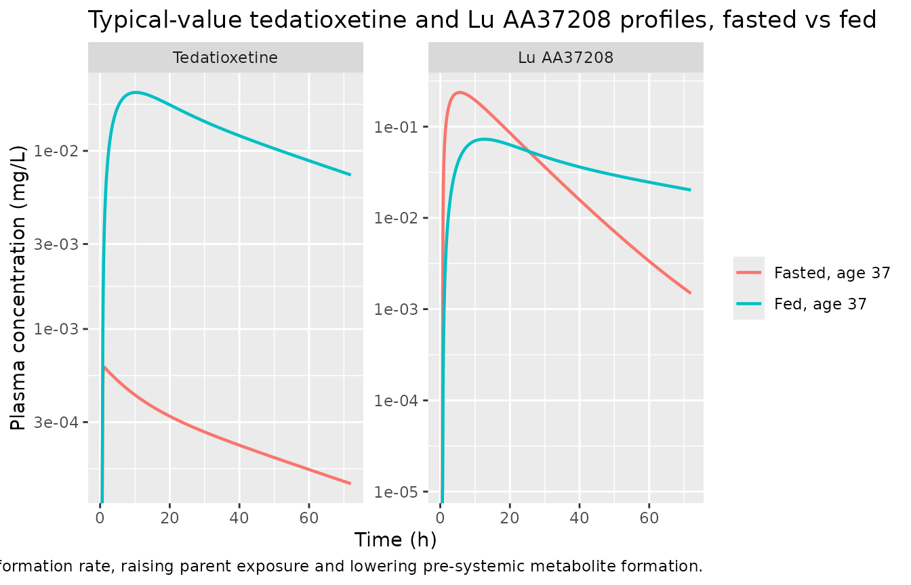
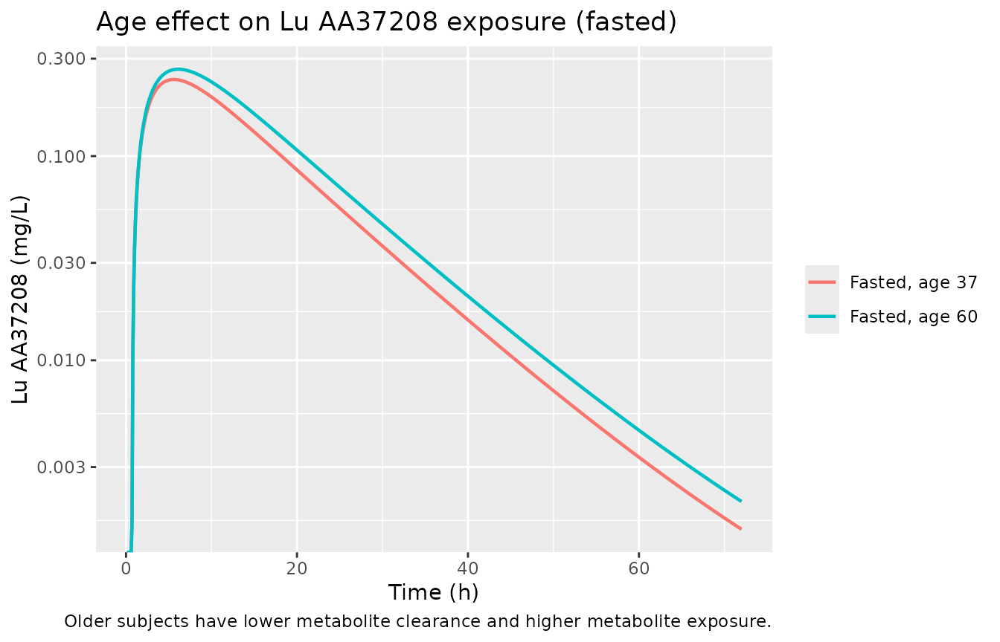
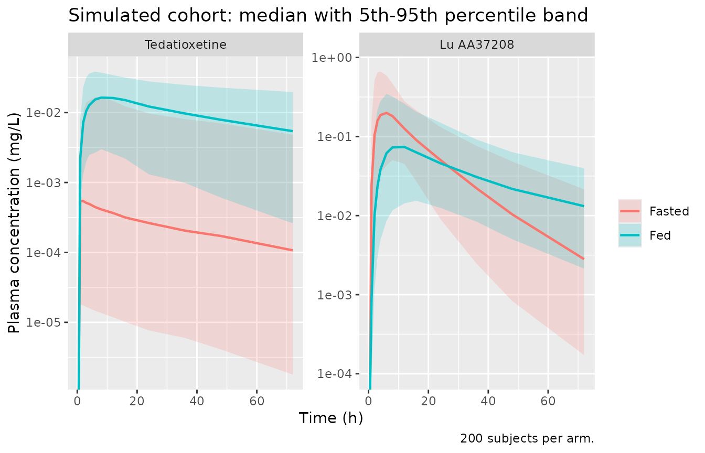

# Tedatioxetine and its CYP2D6 metabolite Lu AA37208 (Frederiksen 2021)

## Model and source

- Citation: Frederiksen T, Areberg J, Schmidt E, Stage TB, Brosen K.
  Cytochrome P450 2D6 genotype-phenotype characterization through
  population pharmacokinetic modeling of tedatioxetine. CPT
  Pharmacometrics Syst Pharmacol. 2021;10(9):983-993.
  <doi:10.1002/psp4.12635>. PMCID: PMC8452298.
- Description: Joint parent + metabolite population PK model for oral
  tedatioxetine (Lu AA24530) and its major CYP2D6-dependent metabolite
  Lu AA37208, pooled across six phase I and one phase II study in 578
  healthy subjects and patients with major depressive disorder
  (Frederiksen 2021). Tedatioxetine is dosed into an absorption-site
  compartment that drains by two competing first-order routes: intact
  drug into a two-compartment tedatioxetine disposition model (ka), and
  pre-systemic first-pass metabolism into an amount-only precursor pool
  (the intermediate Lu AA37209; k_precursor_luaa37208_form). The
  precursor converts to Lu AA37208 (k_luaa37208_form), which also
  receives systemic formation from the full tedatioxetine clearance
  (CL_CYP2D6) and then follows its own two-compartment disposition. All
  of the parent’s systemic clearance is assumed CYP2D6-mediated
  formation of Lu AA37208. Covariates retained: food state on the
  pre-systemic formation rate constant, and age (linear, centred at 37
  years) on the metabolite clearance. Residual error is proportional and
  shared between the two analytes. Fit in NONMEM 7.4 (SAEM + importance
  sampling). The paper’s purpose was to quantify in vivo CYP2D6 activity
  per genotype from the individual formation-clearance estimates; the
  CYP2D6 genotype itself is NOT a covariate in the population PK model.
- Article: <https://doi.org/10.1002/psp4.12635> (open access,
  PMC8452298)

Every structural equation and every parameter value below comes from the
paper’s Table 2 and from the final NONMEM control stream distributed as
supplementary material (`PSP4-10-983-s004.docx`). The control stream is
the authoritative source for the model *structure*; Table 2 supplies the
point estimates.

## Population

Frederiksen 2021 pooled six phase I studies (dense PK sampling in
healthy subjects) and one phase II dose-finding study (sparse sampling,
at most three samples over six weeks in patients with major depressive
disorder), for a total of 578 subjects: 220 healthy subjects and 358
patients with MDD. Tedatioxetine was given orally at 2-60 mg. The
dataset held 5373 quantifiable tedatioxetine and 5449 quantifiable Lu
AA37208 plasma concentrations. Baseline demographics (Table 1): median
age 37 years (IQR 28-50, range 18-80), median weight 72 kg (range
42-140), 46% female. The CYP2D6 phenotype distribution (UM/NM/IM/PM) was
11/291/200/32 with 44 subjects ungenotyped. CYP2D6 genotype was used
only in the downstream activity-score analysis, not as a population-PK
covariate.

The same information is available programmatically via
`readModelDb("Frederiksen_2021_tedatioxetine")()$population`.

## Model structure

The model is a joint parent + metabolite cascade with a **branched
absorption site** (Figure 2 and the supplementary control stream
`$DES`). The tedatioxetine dosing compartment (`depot`) drains by two
competing first-order routes:

- `ka` carries intact tedatioxetine into a two-compartment tedatioxetine
  disposition model (`central` / `peripheral1`, volumes V3 / V4);
- `k_precursor_luaa37208_form` (the control stream’s `KGMET`) represents
  pre-systemic first-pass metabolism, delivering drug into an
  amount-only pool of the intermediate **Lu AA37209**
  (`precursor_luaa37208`).

The precursor converts to the metabolite **Lu AA37208** at
`k_luaa37208_form` (the control stream’s `KAMET`), entering a
two-compartment Lu AA37208 disposition model (`central_luaa37208` /
`peripheral1_luaa37208`, volumes V5 / V6). The metabolite central
compartment is *additionally* fed **systemically** by the full
tedatioxetine clearance `cl` (CL_CYP2D6): all of the parent’s systemic
elimination is assumed to be CYP2D6-mediated formation of Lu AA37208.

Two covariates are retained: food state on the pre-systemic formation
rate constant, and age (linear, centred at 37 years) on the metabolite
clearance.

### A note on the two absorption-branch rate constants

Table 2 of the paper and its executable control stream **swap the
labels** of the two metabolite-pathway rate constants. Table 2 lists a
food-affected `ka,met` (11.1 /h fasted, 0.0286 /h fed) and a single
`kg,met` (0.0972 /h). The control stream, however, applies the food
effect to its `KGMET` – the depot-to-precursor branch – and leaves
`KAMET`, the precursor-to-central conversion, food-independent. Matching
by the food split (only one rate is food-split in each document) and by
the `$THETA` initial estimates fixes the correspondence: the
**depot-branching pre-systemic rate is the food-affected 11.1 / 0.0286
/h**, and the **precursor-to-metabolite conversion rate is the 0.0972
/h** value. This model follows the executable control stream, which is
the fitted object. The names used here (`k_precursor_luaa37208_form` for
the depot branch, `k_luaa37208_form` for the conversion) reflect the
structural role each rate plays in the `$DES`, not the printed Table 2
labels.

## Source trace

Every `ini()` entry carries an in-file comment naming its Table 2 row
(and its control-stream `$THETA` index); they are collected here for
review.

| Equation / parameter | Value | Source location |
|----|----|----|
| `d/dt(depot)` (branched) | n/a | control stream `$DES` A(1) |
| `d/dt(precursor_luaa37208)` | n/a | control stream `$DES` A(2) |
| `d/dt(central)` | n/a | control stream `$DES` A(3) |
| `d/dt(peripheral1)` | n/a | control stream `$DES` A(4) |
| `d/dt(central_luaa37208)` | n/a | control stream `$DES` A(5) |
| `d/dt(peripheral1_luaa37208)` | n/a | control stream `$DES` A(6) |
| `lka` (ka) | 0.195 1/h | Table 2 |
| `lk_precursor_luaa37208_form` fasted (KGMET) | 11.1 1/h | Table 2 ‘ka,met fasted’ |
| `e_fed_k_precursor_luaa37208_form` | fed 0.0286 1/h | Table 2 ‘ka,met fed’ |
| `lk_luaa37208_form` (KAMET) | 0.0972 1/h | Table 2 ‘kg,met’ |
| `ltlag` (ALAG) | 0.652 h | Table 2 |
| `lcl` (CL_CYP2D6) | 30.5 L/h | Table 2 |
| `lvc` (V3) | 1380 L | Table 2 |
| `lq` (Q) | 39.1 L/h | Table 2 |
| `lvp` (V4) | 507 L | Table 2 |
| `tvcl_luaa37208` (CLmet, age 37) | 11.9 L/h | Table 2 |
| `e_age_cl_luaa37208` | -0.0830 L/h/yr | Table 2 ‘Age on CLmet’ |
| `lvc_luaa37208` (V5) | 33.1 L | Table 2 |
| `lq_luaa37208` (Qmet) | 0.940 L/h | Table 2 |
| `lvp_luaa37208` (V6) | 12.2 L | Table 2 |
| IIV variances | see Table 2 | Table 2 ‘IIV (%RSE)’ column, omega^2 = (CV/100)^2 |
| `cov(CL,V3)` / `cov(CLmet,V5)` | 0.079 / 0.372 | Table 2 covariance rows |
| Residual (proportional, shared) | 23.6% | Table 2 ‘Residual error’ |

## Units

The control stream applies no unit conversion: with dose in mg and
volumes in L, `A/V` gives mg/L, so both `Cc` and `Cc_luaa37208` are in
mg/L. The metabolite is carried in tedatioxetine-mass equivalents (there
is no molecular-weight factor on the parent-to-metabolite flux in the
control stream), so `Cc_luaa37208` is a mass-equivalent concentration
rather than a Lu AA37208 molar concentration.

``` r

mod <- readModelDb("Frederiksen_2021_tedatioxetine")
ui <- rxode2::rxode2(mod)
#> ℹ parameter labels from comments will be replaced by 'label()'
stopifnot(identical(ui$meta$units$concentration, "mg/L"))
```

## Virtual cohort

Original observed data are not public. A cohort of 200 virtual subjects
is simulated in each of the fasted and fed states, with age drawn to
match the Table 1 distribution (median 37, IQR 28-50, range 18-80), so
the food effect on the parent and the age effect on the metabolite are
both exercised.

``` r

# rxode2's RNG is partitioned per solver thread, so this cohort is not
# byte-identical across machines with different thread counts. Every assertion
# below is written to hold for any cohort the model can produce, or uses the
# deterministic typical-value profiles (zeroRe) instead.
set.seed(20210901)
rxode2::rxSetSeed(20210901)

n_per_arm <- 200L
dose_mg <- 50
# Sampling grid to 336 h (~10.7 parent half-lives, kel = 30.5/1380 = 0.022 /h)
# so AUCinf extrapolation stays small for the closed-form gates below.
sample_times <- sort(unique(c(
  0, 0.5, 1, 2, 3, 4, 6, 8, 12, 16, 24, 36, 48, 72, 96, 120, 168, 240, 336
)))

draw_age <- function(n) {
  a <- round(rnorm(n, mean = 39, sd = 16))
  pmin(pmax(a, 18), 80)
}

make_arm <- function(n, fed, label, id_offset = 0L) {
  ids <- id_offset + seq_len(n)
  ages <- draw_age(n)
  covs <- tibble(id = ids, FED = fed, AGE = ages)
  dosing <- tibble(id = ids, time = 0, amt = dose_mg, evid = 1L, cmt = "depot")
  # Two endpoints are declared, so observation rows must name the OBSERVABLE
  # (cmt = "Cc"); cmt = "central" fails for a multi-endpoint model. Both Cc and
  # Cc_luaa37208 are returned as columns at every output row, so one set of
  # rows serves both analytes.
  obs <- tidyr::expand_grid(id = ids, time = sample_times) |>
    mutate(amt = NA_real_, evid = 0L, cmt = "Cc")
  bind_rows(dosing, obs) |>
    left_join(covs, by = "id") |>
    mutate(arm = label) |>
    arrange(id, time, desc(evid))
}

events <- bind_rows(
  make_arm(n_per_arm, 0, "Fasted", id_offset = 0L),
  make_arm(n_per_arm, 1, "Fed", id_offset = n_per_arm)
)

# Disjoint IDs across arms: rxSolve keys subjects on id.
stopifnot(length(intersect(
  events$id[events$arm == "Fasted"], events$id[events$arm == "Fed"]
)) == 0)
```

## Simulation

``` r

sim <- rxode2::rxSolve(mod, events = events, keep = c("arm", "FED", "AGE")) |>
  as.data.frame()
#> ℹ parameter labels from comments will be replaced by 'label()'
stopifnot(all(c("Cc", "Cc_luaa37208", "arm") %in% names(sim)))
```

A deterministic typical-value replication (`zeroRe`) is used for the
structural gates and the figures:

``` r

mod_typical <- rxode2::zeroRe(mod)
#> ℹ parameter labels from comments will be replaced by 'label()'

typ_events <- function(fed, age, id) {
  bind_rows(
    tibble(id = id, time = 0, amt = dose_mg, evid = 1L, cmt = "depot"),
    tibble(id = id, time = c(0, seq(0.1, 336, by = 0.1)), amt = NA_real_, evid = 0L, cmt = "Cc")
  ) |>
    mutate(FED = fed, AGE = age) |>
    arrange(time, desc(evid))
}

ev_typ <- bind_rows(
  typ_events(0, 37, 1L) |> mutate(arm = "Fasted, age 37"),
  typ_events(1, 37, 2L) |> mutate(arm = "Fed, age 37"),
  typ_events(0, 60, 3L) |> mutate(arm = "Fasted, age 60")
)

sim_typ <- rxode2::rxSolve(mod_typical, events = ev_typ, keep = c("arm", "FED", "AGE")) |>
  as.data.frame()
#> ℹ omega/sigma items treated as zero: 'etalka', 'etalk_precursor_luaa37208_form', 'etalk_luaa37208_form', 'etalvc', 'etalcl', 'etalvc_luaa37208', 'etalcl_luaa37208'
#> Warning: multi-subject simulation without without 'omega'
```

## Replicate published figures

The paper’s Figure 2 is a structural schematic rather than a data
figure; the following typical-value profiles reproduce the qualitative
behaviour the text describes: a slow tedatioxetine absorption (median
parent t_max ~5-6 h) and a metabolite t_max “similar or shorter” driven
by pre-systemic formation, plus the food and age effects that were the
two retained covariates.

``` r

sim_typ |>
  select(time, arm, Tedatioxetine = Cc, `Lu AA37208` = Cc_luaa37208) |>
  filter(arm %in% c("Fasted, age 37", "Fed, age 37"), time > 0, time <= 72) |>
  pivot_longer(c(Tedatioxetine, `Lu AA37208`), names_to = "analyte", values_to = "conc") |>
  mutate(analyte = factor(analyte, levels = c("Tedatioxetine", "Lu AA37208"))) |>
  ggplot(aes(time, conc, colour = arm)) +
  geom_line(linewidth = 0.8) +
  facet_wrap(~analyte, scales = "free_y") +
  scale_y_log10() +
  labs(
    x = "Time (h)", y = "Plasma concentration (mg/L)", colour = NULL,
    title = "Typical-value tedatioxetine and Lu AA37208 profiles, fasted vs fed",
    caption = paste(
      "Food reduces the pre-systemic formation rate, raising parent exposure",
      "and lowering pre-systemic metabolite formation."
    )
  )
#> Warning in scale_y_log10(): log-10 transformation introduced infinite values.
```



``` r

sim_typ |>
  filter(arm %in% c("Fasted, age 37", "Fasted, age 60"), time > 0, time <= 72) |>
  ggplot(aes(time, Cc_luaa37208, colour = arm)) +
  geom_line(linewidth = 0.8) +
  scale_y_log10() +
  labs(
    x = "Time (h)", y = "Lu AA37208 (mg/L)", colour = NULL,
    title = "Age effect on Lu AA37208 exposure (fasted)",
    caption = "Older subjects have lower metabolite clearance and higher metabolite exposure."
  )
#> Warning in scale_y_log10(): log-10 transformation introduced infinite values.
```



## PKNCA validation

The paper reports no NCA summary table (Table 2 lists only model
parameters), so the NCA here is validated against **closed-form
identities implied by the model structure** rather than against a
published table. One PKNCA block is run per analyte on the deterministic
typical-value profiles.

``` r

make_nca <- function(conc_col) {
  d <- sim_typ |>
    filter(!is.na(.data[[conc_col]])) |>
    transmute(id, arm, time, Cc = .data[[conc_col]])
  # Anchor AUC at time zero (filter only on !is.na, never time > 0 / Cc > 0).
  d <- bind_rows(d, d |> distinct(id, arm) |> mutate(time = 0, Cc = 0)) |>
    distinct(id, arm, time, .keep_all = TRUE) |>
    arrange(id, arm, time)
  dose_df <- sim_typ |>
    distinct(id, arm) |>
    mutate(time = 0, amt = dose_mg)
  conc_obj <- PKNCA::PKNCAconc(d, Cc ~ time | arm + id)
  dose_obj <- PKNCA::PKNCAdose(dose_df, amt ~ time | arm + id)
  intervals <- data.frame(
    start = 0, end = Inf,
    cmax = TRUE, tmax = TRUE, auclast = TRUE, aucinf.obs = TRUE, half.life = TRUE
  )
  PKNCA::pk.nca(PKNCA::PKNCAdata(conc_obj, dose_obj, intervals = intervals))
}

nca_parent <- make_nca("Cc")
nca_met <- make_nca("Cc_luaa37208")

res_parent <- as.data.frame(nca_parent$result)
res_met <- as.data.frame(nca_met$result)

get_val <- function(res, arm_label, param) {
  res$PPORRES[res$arm == arm_label & res$PPTESTCD == param]
}
```

### Closed-form gate 1: complete conversion to metabolite

In this model the parent’s *only* elimination pathway is CYP2D6-mediated
formation of Lu AA37208, and the pre-systemic branch also forms Lu
AA37208, so **the entire absorbed dose is ultimately recovered as
metabolite** (in tedatioxetine-mass equivalents). Mass balance at
infinite time therefore requires `cl_luaa37208 * AUCinf_met = dose`,
independent of food state and of age (age changes `cl_luaa37208` and
`AUCinf_met` in exactly compensating ways).

``` r

cl_met_age <- function(age) 11.9 + (age - 37) * (-0.0830)

mb <- tibble::tribble(
  ~arm,              ~age,
  "Fasted, age 37",  37,
  "Fed, age 37",     37,
  "Fasted, age 60",  60
) |>
  mutate(
    aucinf_met = vapply(arm, function(a) get_val(res_met, a, "aucinf.obs"), numeric(1)),
    cl_met = cl_met_age(age),
    product = cl_met * aucinf_met,
    pct_diff = 100 * (product - dose_mg) / dose_mg
  )

mb |>
  select(arm, cl_met, aucinf_met, product, pct_diff) |>
  rename(
    "Scenario" = arm, "CLmet (L/h)" = cl_met,
    "AUCinf metabolite (mg*h/L)" = aucinf_met,
    "CLmet x AUCinf" = product, "% diff from dose" = pct_diff
  ) |>
  knitr::kable(digits = 3, caption = "Mass balance: all dose recovered as Lu AA37208.")
```

| Scenario | CLmet (L/h) | AUCinf metabolite (mg\*h/L) | CLmet x AUCinf | % diff from dose |
|:---|---:|---:|---:|---:|
| Fasted, age 37 | 11.900 | 4.202 | 50.000 | 0.000 |
| Fed, age 37 | 11.900 | 4.202 | 49.998 | -0.003 |
| Fasted, age 60 | 9.991 | 5.004 | 50.000 | 0.000 |

Mass balance: all dose recovered as Lu AA37208. {.table}

``` r


stopifnot(all(abs(mb$pct_diff) < 2))
```

### Closed-form gate 2: parent clearance and food-dependent bioavailability

For the parent, `cl * AUCinf_parent = dose * F_parent`, where the
fraction of the oral dose reaching tedatioxetine central is set by the
branch competition at the depot,
`F_parent = ka / (ka + k_precursor_luaa37208_form)`. Food raises
`F_parent` from ~1.7% (fasted, fast pre-systemic branch) to ~87% (fed),
which is the mechanism of the food effect.

``` r

ka <- 0.195
kgmet_fasted <- 11.1
kgmet_fed <- 0.0286
cl <- 30.5

fp <- tibble::tribble(
  ~arm,             ~kgmet,
  "Fasted, age 37", kgmet_fasted,
  "Fed, age 37",    kgmet_fed
) |>
  mutate(
    F_parent = ka / (ka + kgmet),
    aucinf_parent = vapply(arm, function(a) get_val(res_parent, a, "aucinf.obs"), numeric(1)),
    implied_cl = dose_mg * F_parent / aucinf_parent,
    pct_diff = 100 * (implied_cl - cl) / cl
  )

fp |>
  select(arm, F_parent, aucinf_parent, implied_cl, pct_diff) |>
  rename(
    "Scenario" = arm, "F_parent" = F_parent,
    "AUCinf parent (mg*h/L)" = aucinf_parent,
    "dose*F/AUC (L/h)" = implied_cl, "% diff from CL" = pct_diff
  ) |>
  knitr::kable(digits = 4, caption = "Parent: dose*F/AUCinf recovers CL_CYP2D6 = 30.5 L/h.")
```

| Scenario | F_parent | AUCinf parent (mg\*h/L) | dose\*F/AUC (L/h) | % diff from CL |
|:---|---:|---:|---:|---:|
| Fasted, age 37 | 0.0173 | 0.0283 | 30.4977 | -0.0074 |
| Fed, age 37 | 0.8721 | 1.4294 | 30.5061 | 0.0199 |

Parent: dose\*F/AUCinf recovers CL_CYP2D6 = 30.5 L/h. {.table}

``` r


stopifnot(all(abs(fp$pct_diff) < 3))
```

### Structural gate: metabolite t_max and the food effect

``` r

tmax_met_fasted <- get_val(res_met, "Fasted, age 37", "tmax")
cmax_parent_fasted <- get_val(res_parent, "Fasted, age 37", "cmax")
cmax_parent_fed <- get_val(res_parent, "Fed, age 37", "cmax")

tibble::tibble(
  Quantity = c(
    "Metabolite t_max, fasted (h)",
    "Parent Cmax fed / fasted"
  ),
  Value = c(tmax_met_fasted, cmax_parent_fed / cmax_parent_fasted)
) |>
  knitr::kable(digits = 2, caption = "Structural behaviours described in the paper.")
```

| Quantity                     | Value |
|:-----------------------------|------:|
| Metabolite t_max, fasted (h) |  5.60 |
| Parent Cmax fed / fasted     | 34.87 |

Structural behaviours described in the paper. {.table}

``` r


stopifnot(
  # Paper: metabolite t_max ~5-6 h (Introduction; presystemic formation).
  tmax_met_fasted >= 3 && tmax_met_fasted <= 8,
  # Food raises parent exposure substantially (reduced presystemic metabolism).
  cmax_parent_fed > cmax_parent_fasted
)
```

### Stochastic cohort summary

The 200-per-arm cohort exercises the IIV and covariate distributions.
Only distributional summaries are shown; per-subject extremes are not
asserted on, because the extreme of a random cohort is not reproducible
across rxode2 builds.

``` r

sim |>
  filter(time > 0) |>
  select(id, time, arm, Tedatioxetine = Cc, `Lu AA37208` = Cc_luaa37208) |>
  pivot_longer(c(Tedatioxetine, `Lu AA37208`), names_to = "analyte", values_to = "conc") |>
  mutate(analyte = factor(analyte, levels = c("Tedatioxetine", "Lu AA37208"))) |>
  group_by(analyte, arm, time) |>
  summarise(
    Q05 = quantile(conc, 0.05), Q50 = quantile(conc, 0.50),
    Q95 = quantile(conc, 0.95), .groups = "drop"
  ) |>
  filter(time <= 72) |>
  ggplot(aes(time, Q50, colour = arm, fill = arm)) +
  geom_ribbon(aes(ymin = Q05, ymax = Q95), alpha = 0.2, colour = NA) +
  geom_line(linewidth = 0.8) +
  facet_wrap(~analyte, scales = "free_y") +
  scale_y_log10() +
  labs(
    x = "Time (h)", y = "Plasma concentration (mg/L)", colour = NULL, fill = NULL,
    title = "Simulated cohort: median with 5th-95th percentile band",
    caption = paste0(n_per_arm, " subjects per arm.")
  )
#> Warning in scale_y_log10(): log-10 transformation introduced infinite values.
#> log-10 transformation introduced infinite values.
#> log-10 transformation introduced infinite values.
#> log-10 transformation introduced infinite values.
```



## Assumptions and deviations

- **Between-subject variability scale.** Table 2 reports IIV as a
  percentage (“IIV (%RSE)”). The log-scale variance is encoded as
  `omega^2 = (CV/100)^2` rather than the exact log-normal
  `omega^2 = log((CV/100)^2 + 1)`. This reading is **forced by the
  reported covariance**: the CLmet-V5 covariance of 0.372, combined with
  the V5 (68.56%) and CLmet (55.05%) IIVs, gives a correlation of 0.986
  under `(CV/100)^2` (valid) but a correlation greater than 1
  (impossible) under the exact log-normal formula. The `(CV/100)^2`
  convention is therefore the only self-consistent reading of Table 2.
- **The two absorption-branch rate constants are swapped between Table 2
  and the control stream.** Table 2 labels the food-affected rate (11.1
  / 0.0286 /h) `ka,met` and the single rate (0.0972 /h) `kg,met`,
  whereas the executable supplementary control stream applies the food
  effect to its `KGMET` (the depot-to-precursor branch) and leaves
  `KAMET` (the precursor-to-central conversion) food-independent. The
  correspondence is fixed unambiguously by the food split and the
  `$THETA` initial estimates. This model follows the executable control
  stream (the fitted object), so the food-affected rate is the
  depot-branching pre-systemic formation rate
  `k_precursor_luaa37208_form` and the 0.0972 /h rate is the
  precursor-to-metabolite conversion rate `k_luaa37208_form`.
- **Residual error is log-additive in the source, encoded as
  proportional.** The control stream `$ERROR` uses
  `Y = LOG(F + 0.001) + ERR(1)`, i.e. additive error on the log scale;
  Table 2 reports it as a proportional error of 23.6%. For the
  concentrations of interest the `+0.001` offset is negligible and the
  two forms coincide, so the canonical proportional form is used. A
  **single** sigma was estimated and applied to both analytes; nlmixr2
  requires one residual parameter per endpoint, so `propSd` and
  `propSd_luaa37208` both carry the same 0.236 estimate.
- **All parameters are apparent (per unknown bioavailability).** No
  intravenous data were available, so clearances and volumes are
  apparent (`/F`). The parent-to-metabolite split is modelled explicitly
  by the competing depot rate constants, and the extensive pre-systemic
  metabolism this implies (fasted `F_parent` ~1.7%) is consistent with
  the paper’s characterization of tedatioxetine as a sensitive CYP2D6
  substrate with pre-systemic metabolite formation.
- **No molecular-weight conversion between analytes.** The control
  stream transfers a parent-mass amount directly into
  `central_luaa37208` (`CL/V3 * A(3)`) with no MW factor, so the
  metabolite is carried in tedatioxetine-mass equivalents and
  `Cc_luaa37208` is a mass-equivalent concentration. The equations are
  encoded exactly as in the control stream.
- **The precursor pool holds Lu AA37209.** The second
  `$MODEL COMP=(DEPOT)` has no volume and no measured concentration
  (only `S3=V3` and `S5=V5` are set), so it is `precursor_luaa37208` –
  the amount-only `precursor_<metab>` construct – rather than a
  `central`-style state with an invented volume. It holds the
  intermediate Lu AA37209 (Figure 1: tedatioxetine -\> Lu AA37209 -\> Lu
  AA37208). The `luaa37208` metabolite suffix is registered in
  `inst/references/compartment-names.md`.
- **CYP2D6 genotype is not a population-PK covariate.** The paper’s
  purpose was to estimate per-genotype CYP2D6 activity from the
  individual formation-clearance estimates of the fitted model, but the
  population PK model itself carries only food and age as covariates.
  The downstream activity-score regression is not part of this model
  file.
- **Age effect is additive on the linear clearance scale.** The control
  stream forms `CLMET = (THETA(9) + (AGE - 37) * THETA(14)) * exp(eta)`,
  an additive deviation on the linear clearance rather than the usual
  multiplicative power model. It is encoded exactly, centred at the
  median age of 37 years.
- **Fixed-zero IIV.** The control stream declares etas on Q, V4, Qmet,
  V6 and the lag time but fixes their variance to 0 (`0 FIX`); these
  parameters therefore carry no between-subject variability.
- **Cohort composition.** 200 virtual subjects per food arm, age drawn
  to match the Table 1 distribution; the closed-form gates use
  deterministic typical-value profiles (`zeroRe`) and are asserted
  tightly, while the stochastic cohort is shown only as distributional
  summaries. \`\`\`
