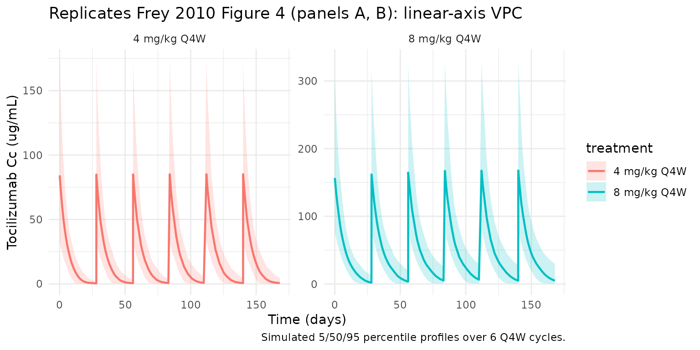
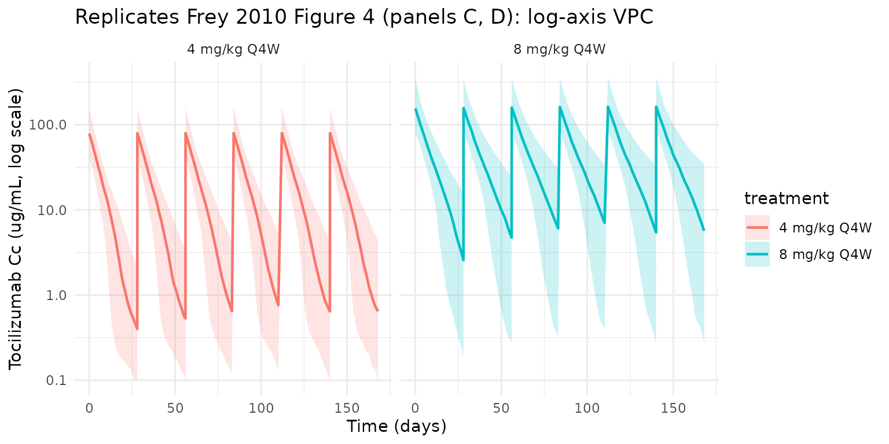

# Frey_2010_tocilizumab

## Model and source

- Citation: Frey N, Grange S, Woodworth T. Population pharmacokinetic
  analysis of tocilizumab in patients with rheumatoid arthritis. J Clin
  Pharmacol. 2010;50(7):754-766. <doi:10.1177/0091270009350623>
- Description: Two-compartment population PK model for tocilizumab in
  adults with moderate-to-severe rheumatoid arthritis (Frey 2010), with
  parallel first-order linear and Michaelis-Menten elimination from the
  central compartment.
- Article: [J Clin Pharmacol.
  2010;50(7):754-766](https://doi.org/10.1177/0091270009350623)

## Population

Frey 2010 pooled data from four phase III studies — OPTION (N = 396),
TOWARD (N = 718), RADIATE (N = 341), and AMBITION (N = 338) — into a
final population PK dataset of 1793 adults with moderate-to-severe
rheumatoid arthritis (RA). The dataset contained 7415 serum tocilizumab
concentrations after 4 or 8 mg/kg one-hour intravenous infusions every 4
weeks for 24 weeks (Frey 2010 Methods, p754; Results, p757). The four
trials together cover patients with inadequate response to methotrexate
(OPTION), inadequate response to traditional DMARDs (TOWARD), inadequate
response to anti-TNF therapy (RADIATE), and tocilizumab monotherapy
(AMBITION).

Baseline demographics (Frey 2010 Table I, p758): median age 52-54 years
(range 18-89), 81-84% female, median body weight 67-73 kg (range
38-150), median BSA 1.7-1.8 m^2, median serum albumin 38-39 g/L (range
24-50), median creatinine clearance 104-113 mL/min, median total serum
protein 73-75 g/L, median HDL cholesterol 54 mg/dL, median rheumatoid
factor 92-117 U/mL (range 15-11800), 78-84% non-smokers. Race
composition is 72-90% White / 9-13% Asian (highest in OPTION) / 0-5%
Black / 2-10% American Indian or Alaskan Native / 2-5% Other across the
four trials.

The same information is available programmatically via
`readModelDb("Frey_2010_tocilizumab")$population`.

## Source trace

Every structural parameter, covariate effect, IIV element, and
residual-error term below is taken from Frey 2010 Tables II and III. The
reference covariate values are: BSA = 1.8 m^2, male sex, HDL-C = 54
mg/dL, log(RF) = 4.7 (equivalently RF ~110 U/mL), total protein = 74
g/L, albumin = 38 g/L, creatinine clearance = 106 mL/min, and
non-smoker.

| Equation / parameter | Value | Source location |
|----|----|----|
| `lcl` (CL) | `log(0.3)` L/day | Table II, “CL, L/d” row |
| `lvc` (V1) | `log(3.5)` L | Table II, “V1, L” row |
| `lq` (Q) | `log(0.2)` L/day | Table II, “Q, L/d” row |
| `lvp` (V2) | `log(2.9)` L | Table II, “V2, L” row |
| `lvmax` (Vmax) | `log(7.5)` mg/day | Table II, “VM, mg/d” row |
| `lkm` (Km) | `log(2.7)` ug/mL | Table II, “KM, ug/mL” row |
| `e_bsa_cl` (BSA/1.8 exponent on CL) | `0.7` | Table II “BSA on CL” / Table III equation |
| `e_sexf_cl` (female fractional change on CL) | `-0.16` | Table II “Sex (female, %) on CL” = -16% |
| `e_hdlc_cl` (HDLC/54 exponent on CL) | `-0.2` | Table II “HDL-C on CL” / Table III equation |
| `e_lrf_cl` (log(RF)/log(110) exponent on CL) | `0.1` | Table II “Logarithm of RF on CL” / Table III |
| `e_tpro_vc` (TPRO/74 exponent on Vc) | `-1.1` | Table II “Total protein on V1” / Table III |
| `e_alb_vc` (ALB/38 exponent on Vc) | `0.7` | Table II “Albumin on V1” / Table III |
| `e_alb_vmax` (ALB/38 exponent on Vmax) | `-0.4` | Table II “Albumin on VM” / Table III |
| `e_crcl_vmax` (CRCL/106 exponent on Vmax) | `0.2` | Table II “Creatinine CL on VM” / Table III |
| `e_smk_vmax` (smoker fractional change on Vmax) | `0.11` | Table II “Smoking on VM” = +11% |
| `var(etalcl)` | `log(1 + 0.39^2) = 0.1416` | Table II IIV section: CL CV 39% |
| `var(etalvc)` | `log(1 + 0.37^2) = 0.1284` | Table II: V1 CV 37% |
| `var(etalvp)` | `log(1 + 0.66^2) = 0.3614` | Table II: V2 CV 66% |
| `var(etalvmax)` | `log(1 + 0.54^2) = 0.2562` | Table II: Vm CV 54% |
| `cor(etalcl, etalvc)` | `0.6` | Table II “COV(eta_CL : eta_V1), r” |
| `cor(etalcl, etalvp)` | `-0.1` | Table II “COV(eta_CL : eta_V2), r” |
| `cor(etalcl, etalvmax)` | `-0.5` | Table II “COV(eta_CL : eta_VM), r” |
| `cor(etalvc, etalvp)` | `0.5` | Table II “COV(eta_V1 : eta_V2), r” |
| `cor(etalvc, etalvmax)` | `0.2` | Table II “COV(eta_V1 : eta_VM), r” |
| `cor(etalvp, etalvmax)` | `0.2` | Table II “COV(eta_V2 : eta_VM), r” |
| `propSd` | `0.22` | Table II “Proportional” residual row, 22% (see Errata) |
| `addSd` | `2.4` ug/mL | Table II “Additive” residual row, 2.4 ug/mL (see Errata) |
| Structure (2-cmt + parallel linear + MM elimination from central) | n/a | Methods p756-757; Results p757-759; Figure 5 |

### Parameterization notes

- **Two-compartment IV with parallel linear and Michaelis-Menten
  elimination.** Frey 2010 fits a 2-compartment model with first-order
  linear clearance `CL` (L/day) and saturable Michaelis-Menten
  elimination with `Vm` (mg/day) and `Km` (ug/mL) acting on the central
  compartment. There is no depot compartment because tocilizumab is
  administered as a 1-hour IV infusion; in the model file the dose
  enters the `central` compartment directly.
- **CV% to log-normal variance.** Frey 2010 Table II reports
  between-subject variability as CV% on the linear-parameter scale and
  the off-diagonal correlations between etas as Pearson r. The
  conversion `omega^2 = log(1 + CV^2)` gives the log-normal variance;
  off-diagonal covariances are computed as
  `r_ij * sqrt(omega_i^2 * omega_j^2)`.
- **Log-RF covariate.** Frey 2010 fits the rheumatoid-factor effect on
  the natural-log scale using a power-of-ratio form `(LRF / 4.7)^0.1`
  where `LRF = log(RF)`. The canonical column `RHEUMATOID_FACTOR`
  carries the raw RF in U/mL; the model equation applies the log
  transform internally as
  `(log(RHEUMATOID_FACTOR) / log(110))^e_lrf_cl`, which is algebraically
  identical to the paper’s form because `log(110) ~= 4.7`.
- **CRCL units.** Frey 2010 uses raw creatinine clearance in mL/min (the
  paper’s Table III equation `VM = 7.5 * (CRCL/106)^0.2`), with
  reference 106 mL/min. The canonical `CRCL` column is normally
  documented as BSA-normalized (mL/min/1.73 m^2); for Frey 2010 the
  column carries the raw CrCl in mL/min and BSA enters the model
  separately on linear CL. The per-model `covariateData[[CRCL]]$notes`
  documents this deviation.

## Errata

The published Table II (Frey 2010 p759) lists the residual-error
standard deviations with swapped Greek-letter subscripts:

| Table II row label             | Reported in column “Estimate” |
|--------------------------------|-------------------------------|
| `Additive (sigma_prop), ug/mL` | `2.4`                         |
| `Proportional (sigma_add), %`  | `22`                          |

The row labels and units (additive 2.4 ug/mL; proportional 22%) are
correct and unambiguous. The parenthetical Greek subscripts `sigma_prop`
/ `sigma_add` are interchanged relative to the residual-error equation
in the Methods (p756), where `eps1` is the proportional error (variance
`sigma^2_prop`) and `eps2` is the additive error (variance
`sigma^2_add`). The model file uses the values in the unambiguous rows:
`propSd = 0.22` and `addSd = 2.4 ug/mL`.

A second, smaller notational issue: Frey 2010 Figure 1 (p760) labels its
y-axis panels for Vm as `VM (mg/h)`, while Table II and the Results
narrative report `VM = 7.5 mg/d`. The model file uses the per-day value
(mg/day), consistent with the table and the text. This may be a
figure-axis-label slip rather than a value error.

## Virtual cohort

The simulations below use a virtual cohort whose covariate distributions
approximate the Frey 2010 Table I demographics. No subject-level
observed data were released with the paper.

``` r

set.seed(20260428)

# Cohort size: 200 subjects per dose arm gives stable 5/50/95 percentile
# bands for the Figure 4 / Figure 3 reproduction and the PKNCA distribution
# summaries.
n_subj <- 200

clamp <- function(x, lo, hi) pmin(pmax(x, lo), hi)

cohort <- tibble::tibble(
  id  = seq_len(n_subj),
  WT  = clamp(rnorm(n_subj, mean = 70,  sd = 17),   38, 150),
  BSA = clamp(rnorm(n_subj, mean = 1.8, sd = 0.22), 1.3, 2.7),
  SEXF = rbinom(n_subj, 1, 0.82),
  HDLC = clamp(rnorm(n_subj, mean = 54, sd = 14),   23, 135),
  RHEUMATOID_FACTOR = pmax(rlnorm(n_subj, log(110), 0.9), 15),
  TPRO = clamp(rnorm(n_subj, mean = 74, sd = 5),    57, 96),
  ALB  = clamp(rnorm(n_subj, mean = 38, sd = 4),    24, 50),
  CRCL = clamp(rnorm(n_subj, mean = 106, sd = 35),  27, 317),
  SMOKE = rbinom(n_subj, 1, 0.18)
)
```

Two regimens are simulated in parallel: 4 mg/kg and 8 mg/kg one-hour IV
infusions every 4 weeks (Q4W). Six Q4W doses (168 days, ~8 elimination
half-lives in the linear range; reference t1/2 ~21 days per Frey 2010
Discussion p762) place the final cycle safely at steady state.

``` r

tau     <- 28              # Q4W dosing interval (days)
inf_dur <- 1 / 24          # 1-hour IV infusion duration (days)
n_doses <- 6
dose_days <- seq(0, tau * (n_doses - 1), by = tau)

build_events <- function(cohort, dose_mgkg, treatment) {
  ev_dose <- cohort |>
    tidyr::crossing(time = dose_days) |>
    dplyr::mutate(amt = dose_mgkg * WT,         # mg/kg * kg = mg
                  cmt = "central",
                  evid = 1L,
                  dur  = inf_dur,
                  treatment = treatment)
  ss_start <- tau * (n_doses - 1)
  ss_end   <- ss_start + tau
  obs_days <- sort(unique(c(
    seq(0, 56, by = 1),                # daily over the first 2 cycles
    seq(56, ss_start, by = 3),         # every 3 days through the build-up
    seq(ss_start, ss_end, by = 0.5),   # half-day grid for the SS cycle / NCA
    dose_days + inf_dur,               # peak-near-end-of-infusion
    dose_days + 1, dose_days + 7, dose_days + 14
  )))
  ev_obs <- cohort |>
    tidyr::crossing(time = obs_days) |>
    dplyr::mutate(amt = 0, cmt = NA_character_, evid = 0L,
                  dur = NA_real_, treatment = treatment)
  dplyr::bind_rows(ev_dose, ev_obs) |>
    dplyr::arrange(id, time, dplyr::desc(evid)) |>
    dplyr::select(id, time, amt, cmt, evid, dur, treatment,
                  WT, BSA, SEXF, HDLC, RHEUMATOID_FACTOR,
                  TPRO, ALB, CRCL, SMOKE)
}

events <- dplyr::bind_rows(
  build_events(cohort, 4, "4 mg/kg Q4W"),
  build_events(cohort |> dplyr::mutate(id = id + n_subj), 8, "8 mg/kg Q4W")
)
stopifnot(!anyDuplicated(unique(events[, c("id", "time", "evid")])))
```

## Simulation

``` r

mod <- rxode2::rxode2(readModelDb("Frey_2010_tocilizumab"))
conc_unit <- mod$units[["concentration"]]
keep_cols <- c("WT", "BSA", "SEXF", "HDLC", "RHEUMATOID_FACTOR",
               "TPRO", "ALB", "CRCL", "SMOKE", "treatment")

sim <- lapply(split(events, events$treatment), function(ev) {
  out <- rxode2::rxSolve(mod, events = ev, keep = keep_cols)
  as.data.frame(out)
}) |> dplyr::bind_rows()
```

## Replicate published figures

### Figure 4 — concentration-time profile by dose

Frey 2010 Figure 4 (p762) shows mean and 5th/95th-percentile simulated
tocilizumab serum concentrations over 24 weeks of treatment, separately
for 4 mg/kg Q4W (panels A and C) and 8 mg/kg Q4W (panels B and D);
panels A/B use a linear y-axis and C/D a log y-axis. The block below
replicates the linear-scale panels A and B.

``` r

vpc <- sim |>
  dplyr::filter(!is.na(Cc), time > 0, time <= tau * n_doses) |>
  dplyr::group_by(treatment, time) |>
  dplyr::summarise(
    Q05 = quantile(Cc, 0.05, na.rm = TRUE),
    Q50 = quantile(Cc, 0.50, na.rm = TRUE),
    Q95 = quantile(Cc, 0.95, na.rm = TRUE),
    .groups = "drop"
  )

ggplot(vpc, aes(time, Q50, colour = treatment, fill = treatment)) +
  geom_ribbon(aes(ymin = Q05, ymax = Q95), alpha = 0.2, colour = NA) +
  geom_line(linewidth = 0.8) +
  facet_wrap(~treatment, scales = "free_y") +
  labs(
    x = "Time (days)",
    y = paste0("Tocilizumab Cc (", conc_unit, ")"),
    title = "Replicates Frey 2010 Figure 4 (panels A, B): linear-axis VPC",
    caption = "Simulated 5/50/95 percentile profiles over 6 Q4W cycles."
  ) +
  theme_minimal()
```



The same simulation on a log y-axis reproduces the dynamic range shown
in Frey 2010 Figure 4 panels C and D, where the 4 mg/kg trough drops
well below the 8 mg/kg trough because the nonlinear (Vm/Km) clearance
pathway saturates less completely at the lower dose.

``` r

ggplot(vpc, aes(time, Q50, colour = treatment, fill = treatment)) +
  geom_ribbon(aes(ymin = pmax(Q05, 0.1), ymax = Q95),
              alpha = 0.2, colour = NA) +
  geom_line(linewidth = 0.8) +
  facet_wrap(~treatment) +
  scale_y_log10() +
  labs(
    x = "Time (days)",
    y = paste0("Tocilizumab Cc (", conc_unit, ", log scale)"),
    title = "Replicates Frey 2010 Figure 4 (panels C, D): log-axis VPC"
  ) +
  theme_minimal()
```



## PKNCA validation

Non-compartmental analysis of the final (steady-state) Q4W dosing
interval gives Cmax, Cmin (Ctrough), and AUC0-tau per simulated subject
and dose group. The per-subject results are then summarised as a mean
+/- SD, which is the format reported in Frey 2010 Table IV.

``` r

ss_start <- tau * (n_doses - 1)
ss_end   <- ss_start + tau

nca_conc <- sim |>
  dplyr::filter(time >= ss_start, time <= ss_end, !is.na(Cc)) |>
  dplyr::mutate(time_nom = time - ss_start) |>
  dplyr::select(id, time = time_nom, Cc, treatment)

# One representative dose per subject per arm at the start of the SS cycle.
nca_dose <- events |>
  dplyr::filter(evid == 1, time == ss_start) |>
  dplyr::mutate(time = 0) |>
  dplyr::select(id, time, amt, treatment)

conc_obj <- PKNCA::PKNCAconc(nca_conc, Cc ~ time | treatment + id)
dose_obj <- PKNCA::PKNCAdose(nca_dose, amt ~ time | treatment + id)

intervals <- data.frame(
  start   = 0,
  end     = tau,
  cmax    = TRUE,
  cmin    = TRUE,
  tmax    = TRUE,
  auclast = TRUE,
  cav     = TRUE
)

nca_res <- PKNCA::pk.nca(PKNCA::PKNCAdata(conc_obj, dose_obj, intervals = intervals))
#>  ■■■■■■■■■■■■■■■■■■■■■■■■■■        84% |  ETA:  1s
summary(nca_res)
#>  start end   treatment   N     auclast        cmax        cmin
#>      0  28 4 mg/kg Q4W 200  477 [55.7] 82.2 [53.0] 0.672 [180]
#>      0  28 8 mg/kg Q4W 200 1240 [49.1]  165 [46.9]  3.95 [240]
#>                     tmax         cav
#>  0.0417 [0.0417, 0.0417] 17.0 [55.7]
#>  0.0417 [0.0417, 0.0417] 44.2 [49.1]
#> 
#> Caption: auclast, cmax, cmin, cav: geometric mean and geometric coefficient of variation; tmax: median and range; N: number of subjects
```

### Comparison against Frey 2010 Table IV

Table IV of Frey 2010 (p762) reports simulated steady-state mean (SD)
AUC, Cmax, and Cmin after 48 weeks of treatment. The values below are
the mean per-subject NCA results from this vignette’s 6-cycle
simulation; because accumulation is small at Q4W dosing (~1.1-1.2x for
AUC and Cmax, ~2x for Cmin per Table IV) the 6-cycle vs 12-cycle
comparison is dominated by the within-cycle PK rather than residual
accumulation.

``` r

nca_long <- as.data.frame(nca_res$result)

per_subj <- nca_long |>
  dplyr::filter(PPTESTCD %in% c("cmax", "cmin", "auclast")) |>
  tidyr::pivot_wider(id_cols = c(treatment, id),
                     names_from = PPTESTCD, values_from = PPORRES) |>
  dplyr::mutate(auclast_h = auclast * 24)   # day*ug/mL -> h*ug/mL

ss_summary <- per_subj |>
  dplyr::group_by(treatment) |>
  dplyr::summarise(
    Cmax_sim_mean = mean(cmax, na.rm = TRUE),
    Cmax_sim_sd   = sd(cmax,   na.rm = TRUE),
    Cmin_sim_mean = mean(cmin, na.rm = TRUE),
    Cmin_sim_sd   = sd(cmin,   na.rm = TRUE),
    AUC_sim_mean  = mean(auclast_h, na.rm = TRUE) / 1000,  # in 10^3 h*ug/mL
    AUC_sim_sd    = sd(auclast_h,   na.rm = TRUE) / 1000,
    .groups = "drop"
  )

published <- tibble::tibble(
  treatment     = c("4 mg/kg Q4W", "8 mg/kg Q4W"),
  AUC_pub_mean  = c(13,  35),    # 10^3 h*ug/mL
  AUC_pub_sd    = c(5.8, 16),
  Cmax_pub_mean = c(88,  183),   # ug/mL
  Cmax_pub_sd   = c(41,  86),
  Cmin_pub_mean = c(1.5, 9.7),   # ug/mL
  Cmin_pub_sd   = c(2.1, 11)
)

comparison <- ss_summary |>
  dplyr::left_join(published, by = "treatment") |>
  dplyr::mutate(
    Cmax_pct_diff = 100 * (Cmax_sim_mean - Cmax_pub_mean) / Cmax_pub_mean,
    Cmin_pct_diff = 100 * (Cmin_sim_mean - Cmin_pub_mean) / Cmin_pub_mean,
    AUC_pct_diff  = 100 * (AUC_sim_mean  - AUC_pub_mean)  / AUC_pub_mean
  ) |>
  dplyr::select(treatment,
                AUC_pub_mean,  AUC_sim_mean,  AUC_pct_diff,
                Cmax_pub_mean, Cmax_sim_mean, Cmax_pct_diff,
                Cmin_pub_mean, Cmin_sim_mean, Cmin_pct_diff)

knitr::kable(comparison, digits = 2,
  caption = paste("Simulated vs. Frey 2010 Table IV mean steady-state",
                  "AUC (10^3 h*ug/mL), Cmax (ug/mL), and Cmin (ug/mL).",
                  "Published values: 4 mg/kg AUC 13 (5.8), Cmax 88 (41),",
                  "Cmin 1.5 (2.1); 8 mg/kg AUC 35 (16), Cmax 183 (86),",
                  "Cmin 9.7 (11)."))
```

| treatment | AUC_pub_mean | AUC_sim_mean | AUC_pct_diff | Cmax_pub_mean | Cmax_sim_mean | Cmax_pct_diff | Cmin_pub_mean | Cmin_sim_mean | Cmin_pct_diff |
|:---|---:|---:|---:|---:|---:|---:|---:|---:|---:|
| 4 mg/kg Q4W | 13 | 12.98 | -0.12 | 88 | 92.60 | 5.22 | 1.5 | 1.35 | -9.70 |
| 8 mg/kg Q4W | 35 | 33.01 | -5.68 | 183 | 182.59 | -0.23 | 9.7 | 8.30 | -14.41 |

Simulated vs. Frey 2010 Table IV mean steady-state AUC (10^3 h\*ug/mL),
Cmax (ug/mL), and Cmin (ug/mL). Published values: 4 mg/kg AUC 13 (5.8),
Cmax 88 (41), Cmin 1.5 (2.1); 8 mg/kg AUC 35 (16), Cmax 183 (86), Cmin
9.7 (11). {.table}

## Assumptions and deviations

- **Virtual-cohort covariate distributions.** Body weight, BSA, HDL-C,
  RF (log-normal), total protein, albumin, and creatinine clearance are
  drawn from independent truncated-normal or log-normal distributions
  with parameters approximating the Frey 2010 Table I medians and
  observed ranges. Smoking is drawn from a Bernoulli with p=0.18 to
  match the ~18% smoker prevalence in Frey 2010 Results (p759). The
  simulator treats the covariates as independent, whereas in the source
  data BSA, weight, BMI, total protein, and albumin are correlated; the
  approximation is acceptable because the resulting marginal
  distributions match the Table I summaries within 1 SD.
- **No subject-level observed data.** Frey 2010 does not release
  subject-level concentrations; the validation reproduces Table IV
  summary statistics and Figure 4’s VPC bands rather than overlaying
  observed points.
- **Simulation horizon.** This vignette simulates 6 Q4W doses (168 days)
  instead of the 12-dose / 48-week horizon of Frey 2010 Table IV.
  Accumulation ratios reported in Table IV (~1.1-1.2x for AUC and Cmax,
  ~2x for Cmin) are small because the dosing interval exceeds three
  linear-range half-lives; the difference between dose 6 and dose 12 at
  steady state is therefore negligible for the mean comparison.
- **CRCL units.** The canonical `CRCL` covariate column carries raw
  creatinine clearance in mL/min for this model (Frey 2010’s
  parameterization), not the BSA-normalized mL/min/1.73 m^2 form used by
  some other models in the package. See the per-model
  `covariateData[[CRCL]]$notes`.
- **Residual-error label swap.** The model uses
  `propSd = 0.22, addSd = 2.4 ug/mL`; the Frey 2010 Table II header
  swaps the `sigma_prop` / `sigma_add` Greek subscripts but the row
  labels and values are unambiguous. See the Errata section above.
- **Dosing assumption.** Doses are administered as 1-hour IV infusions
  with `dur = 1/24 day`, matching Frey 2010 Methods (p754). The
  difference between bolus and 1-hour infusion at sampling times beyond
  the infusion is negligible given the ~21-day terminal half-life.
