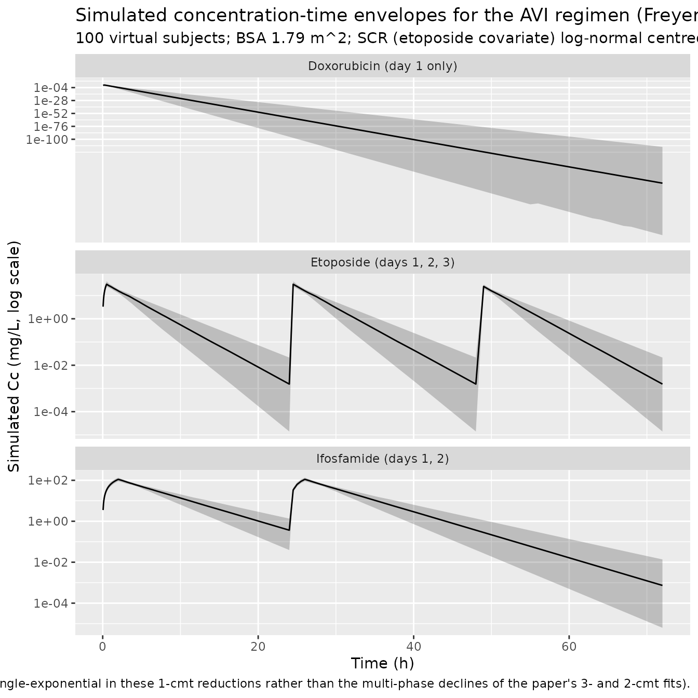
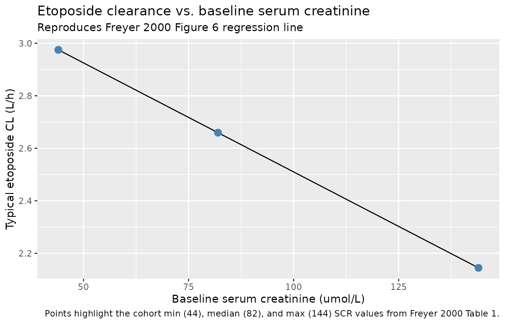

# Doxorubicin, etoposide, and ifosfamide AVI regimen (Freyer 2000)

## Paper and source

Freyer et al. (2000) reported population pharmacokinetic models for the
three cytotoxics of the AVI regimen – doxorubicin (Dox), etoposide (Eto)
and ifosfamide (Ifo) – fitted simultaneously on 47 chemotherapy courses
in 24 small-cell lung cancer (SCLC) patients. Each drug was modelled
independently (the authors verified that no correlation existed between
the three drugs’ individual PK parameters); this extraction therefore
ships as three separate model files pointing to the shared vignette:

- [`modellib("Freyer_2000_doxorubicin")`](https://nlmixr2.github.io/nlmixr2lib/reference/modellib.md)
  – one-compartment reduction of the paper’s 3-cmt model.
- [`modellib("Freyer_2000_etoposide")`](https://nlmixr2.github.io/nlmixr2lib/reference/modellib.md)
  – one-compartment reduction of the paper’s 2-cmt model, with a linear
  serum creatinine effect on CL.
- [`modellib("Freyer_2000_ifosfamide")`](https://nlmixr2.github.io/nlmixr2lib/reference/modellib.md)
  – one-compartment reduction of the paper’s 2-cmt model, with the day-1
  and day-2 clearances collapsed to their mean per operator instruction.

Article: [Br J Clin Pharmacol
2000;50(4):315-324](https://doi.org/10.1046/j.1365-2125.2000.00269.x).

**Important limitations (fully described in Assumptions and deviations
below).** The paper reports only central CL and central V for each drug
in Table 2; the intercompartmental clearances / peripheral volumes /
transfer rate constants of the 3-cmt (Dox) or 2-cmt (Eto, Ifo) fits are
not reported anywhere in the paper text, tables, or figures. Each drug
is therefore implemented as a one-compartment reduction that reproduces
AUC (which is governed only by CL) and the reported IIV / residual
error, but does NOT reproduce the early-time distribution phases visible
in the paper’s Figure 2 or the terminal half-lives quoted in the
Discussion. Ifosfamide’s day-1 to day-2 autoinduction of clearance (5.6
-\> 7.95 L/h, +42%) is likewise not represented in this extraction; the
operator directed a single mean clearance `(5.6 + 7.95)/2 = 6.775 L/h`
(sidecar 001 response 2026-06-21, q2 = BB).

## Population

The models were fitted to 24 patients with SCLC (either limited to the
thorax or extensive) treated with the AVI regimen at multiple centres in
the Lyon Saint-Etienne Thoracic Oncology Group (GLOT), France. Baseline
demographics (Freyer 2000 Table 1):

- Age median 57 years (range 45-70), all adult patients.
- Weight median 69 kg (range 54-93).
- Height median 170 cm (range 159-179); BSA median 1.79 m^2 (range
  1.54-2.10).
- Serum creatinine median 82 umol/L (range 44-144).
- Hepatic markers (ASAT, ALAT, alkaline phosphatase, gamma-GT,
  bilirubin) and total protein / LDH all within the ranges consistent
  with cohort exclusion of severe hepatic or renal impairment (patients
  with ASAT/ALAT/alkaline phosphatase \> 2x ULN and/or serum creatinine
  \> 1.5x ULN were not eligible for the primary therapeutic trials).
- Sex balance not tabulated (SCLC skews male but numbers not reported).

Dosing (Freyer 2000 Methods Patients):

- Doxorubicin: 50 mg/m^2 IV over 15 min on day 1 only.
- Etoposide: 120 mg/m^2 IV over 30 min on days 1, 2, and 3.
- Ifosfamide: 2000 mg/m^2 IV over 2 h on days 1 and 2.
- Antiemetic support: ondansetron 8 mg/day and methylprednisolone 120
  mg/day on days 1-3.

At the median BSA 1.79 m^2, one dose is approximately: Dox 90 mg, Eto
215 mg, Ifo 3580 mg.

Sampling: 19 samples/course in the first 7 patients (extensive
sampling), reduced to 10 samples/course thereafter using a D-optimal
limited-sampling strategy. A total of 47 chemotherapy courses were
studied.

The full population metadata for each drug is available
programmatically:

``` r

readModelDb("Freyer_2000_doxorubicin")()$population
readModelDb("Freyer_2000_etoposide")()$population
readModelDb("Freyer_2000_ifosfamide")()$population
```

## Source trace

Every numeric value in each `ini()` carries an in-file comment pointing
to the Freyer 2000 source location; the table below collects them for
review. Table 2 in the source reports the omega and sigma variances
directly; the in-text %CV is the round-tripped `sqrt(exp(omega^2) - 1)`,
which matches the tabulated variance exactly (see the “IIV variance
derivation” section below).

| Drug | Parameter | Value | Source location |
|----|----|----|----|
| Dox | `lcl` (typical CL) | 54.0 L/h | Table 2, “Doxorubicin” row, “CL (l h^-1)” column (s.d. 4.96) |
| Dox | `lvc` (typical V) | 9.3 L | Table 2, “Doxorubicin” row, “V_d (l)” column (s.d. 0.970) |
| Dox | `etalcl` (BSV variance) | 0.0296 | Table 2, “Doxorubicin” row, “omega_CL” column (s.d. 0.0012); matches text 17.2% CV |
| Dox | `etalvc` (BSV variance) | 0.0369 | Table 2, “Doxorubicin” row, “omega_Vd” column (s.d. 0.0020); matches text 19.2% CV |
| Dox | `propSd` (prop. residual) | 0.1183 | Table 2, “Doxorubicin” row, “sigma” column: variance 0.0140 -\> SD sqrt(0.0140) |
| Dox | `addSd` (add. residual) | 0.0387 mg/L | Table 2, “Doxorubicin” row, “sigma” column: variance 0.0015 -\> SD sqrt(0.0015) |
| Eto | `lcl` (typical CL at ref SCR) | 2.66 L/h | Table 2 & Results Eq: CL = 3.34 - 0.0083 \* S_Cr; recentred at cohort-median SCR = 82 umol/L (Table 1); intercept s.d. 0.228 |
| Eto | `e_creat_cl` (linear SCR slope) | -0.0083 L/h per umol/L | Table 2, “Etoposide” row, “CL (l h^-1)” column (linear covariate form); Fig 6 |
| Eto | `creat_ref_cl` (SCR ref) | 82 umol/L (fixed) | Table 1 cohort-median SCR |
| Eto | `lvc` (typical V) | 6.4 L | Table 2, “Etoposide” row, “V_d (l)” column (s.d. 0.863); Results Etoposide “V_d value was 6.38 l” |
| Eto | `etalcl` (BSV variance) | 0.0243 | Table 2, “Etoposide” row, “omega_CL” column (s.d. 0.0107); matches text 15.6% CV |
| Eto | `etalvc` (BSV variance) | 0.0350 | Table 2, “Etoposide” row, “omega_Vd” column (s.d. 0.0128); matches text 18.7% CV |
| Eto | `propSd` (prop. residual) | 0.2400 | Table 2, “Etoposide” row, “sigma” column: variance 0.0576 (s.d. 0.0213) -\> SD sqrt(0.0576) |
| Ifo | `lcl` (typical CL, mean of day-1/day-2) | 6.775 L/h | (5.6 + 7.95)/2 per operator q2 = BB (sidecar 001 response 2026-06-21); source values Table 2 “Ifosfamide” row |
| Ifo | `lvc` (typical V) | 26.0 L | Table 2, “Ifosfamide” row, “V_d (l)” column (s.d. 4.49) |
| Ifo | `etalcl` (BSV variance) | 0.0100 | Table 2, “Ifosfamide” row, “omega_CL” column (s.d. 0.0044); matches text 10.1% CV |
| Ifo | `etalvc` (BSV variance) | 0.0296 | Table 2, “Ifosfamide” row, “omega_Vd” column (s.d. 0.0084); matches text 17.1% CV |
| Ifo | `propSd` (prop. residual) | 0.0648 | Table 2, “Ifosfamide” row, “sigma” column: variance 0.0042 (s.d. 0.0043) -\> SD sqrt(0.0042) |
| Ifo | `addSd` (add. residual) | 0.4583 mg/L | Table 2, “Ifosfamide” row, “sigma” column: variance 0.2100 -\> SD sqrt(0.2100) |

**IIV variance derivation.** Table 2 tabulates NONMEM omega variances
(log-scale variance of the eta terms). The in-text CV percentages are
the round-tripped `sqrt(exp(omega^2) - 1)`, which serves as an internal
consistency check that the tabulated values are variances (not standard
deviations):

- Dox CL: `sqrt(exp(0.0296) - 1) = 0.1732 = 17.3% CV` (text reports
  17.2%).
- Dox Vd: `sqrt(exp(0.0369) - 1) = 0.1938 = 19.4% CV` (text reports
  19.2%).
- Eto CL: `sqrt(exp(0.0243) - 1) = 0.1566 = 15.7% CV` (text reports
  15.6%).
- Eto Vd: `sqrt(exp(0.0350) - 1) = 0.1886 = 18.9% CV` (text reports
  18.7%).
- Ifo CL: `sqrt(exp(0.0100) - 1) = 0.1002 = 10.0% CV` (text reports
  10.1%).
- Ifo Vd: `sqrt(exp(0.0296) - 1) = 0.1732 = 17.3% CV` (text reports
  17.1%).

All six match within rounding, confirming that Table 2 reports
variances.

**Etoposide CL parameterisation.** The paper’s linear-space CL formula
`CL = 3.34 - 0.0083 * S_Cr` (Table 2 and Fig 6 caption; S_Cr in umol/L)
is algebraically identical to the recentred form used in the model file:

    CL = 3.34 - 0.0083 * S_Cr
       = (3.34 - 0.0083 * 82) + (-0.0083) * (S_Cr - 82)
       = 2.66 + (-0.0083) * (S_Cr - 82)
       = exp(lcl) + e_creat_cl * (CREAT - creat_ref_cl)

At cohort-median SCR = 82 umol/L the typical CL is 2.66 L/h. The
`CREAT_ref` of 82 umol/L is the cohort-median from Table 1 rather than a
canonical population value, so extrapolation beyond the recruited SCR
range 44-144 umol/L is not supported by the paper.

**Doxorubicin CL discrepancy.** The abstract reports Dox CL = 32.0 L/h,
but Table 2, the Results text, and the Discussion (citing Speth 1988’s
52 L/h prior estimate as “close to those reported in our study”) all
report 54.0 L/h. Table 2 is authoritative; the abstract value is a typo.
The model uses 54.0.

## Virtual cohort

Original observed data are not publicly available. The cohort below
reproduces the study demographics with 100 virtual subjects. Serum
creatinine is drawn from a truncated log-normal distribution matching
the Table 1 range (44-144 umol/L) with median 82; this feeds the
etoposide covariate effect. BSA is fixed at the cohort-median 1.79 m^2
so each virtual subject receives the reference-dose milligram amounts
(Dox 89.5 mg, Eto 214.8 mg, Ifo 3580 mg).

``` r

set.seed(20260708)

n_sub <- 100L
median_bsa <- 1.79

# SCR: truncated log-normal that hits median 82 umol/L, cohort range 44-144.
scr_umol_per_l <- pmin(pmax(round(exp(rnorm(n_sub,
                                             mean = log(82),
                                             sd   = 0.24))),
                            44), 144)

subjects <- tibble::tibble(
  id    = seq_len(n_sub),
  BSA   = median_bsa,
  CREAT = scr_umol_per_l
)

# Reference doses at the median BSA (Freyer 2000 Methods Patients).
dose_dox_mg <- 50   * median_bsa   # ~89.5 mg
dose_eto_mg <- 120  * median_bsa   # ~214.8 mg
dose_ifo_mg <- 2000 * median_bsa   # ~3580  mg

# Infusion durations (h) from the paper.
inf_dox_h <- 15 / 60
inf_eto_h <- 30 / 60
inf_ifo_h <- 2

# Observation grid: 5-min for the first hour of each drug's day-1 dose, then
# sparser out to 96 h so all three drugs' terminal declines are captured.
obs_grid <- sort(unique(c(
  seq(0,    2,   by = 0.05),
  seq(2,    4,   by = 0.1),
  seq(4,   12,   by = 0.25),
  seq(12,  48,   by = 0.5),
  seq(48,  96,   by = 1)
)))
```

Doxorubicin event table – one 15-min infusion on day 1 only. Observation
rows use the ODE state name `central` (never the observable name `Cc`;
see `references/known-vignette-failure-patterns.md`).

``` r

events_dox <- bind_rows(
  # Dose row (day 1 only).
  subjects |>
    mutate(time   = 0,
           evid   = 1L,
           amt    = dose_dox_mg,
           cmt    = "central",
           rate   = dose_dox_mg / inf_dox_h),
  # Observation rows.
  tidyr::expand_grid(subjects, time = obs_grid) |>
    mutate(evid  = 0L,
           amt   = NA_real_,
           cmt   = "central",
           rate  = 0)
) |>
  arrange(id, time, desc(evid))
```

Etoposide event table – three 30-min infusions on days 1, 2, and 3.

``` r

eto_dose_times <- c(0, 24, 48)   # day 1, 2, 3

events_eto <- bind_rows(
  tidyr::expand_grid(subjects, time = eto_dose_times) |>
    mutate(evid  = 1L,
           amt   = dose_eto_mg,
           cmt   = "central",
           rate  = dose_eto_mg / inf_eto_h),
  tidyr::expand_grid(subjects, time = obs_grid) |>
    mutate(evid  = 0L,
           amt   = NA_real_,
           cmt   = "central",
           rate  = 0)
) |>
  arrange(id, time, desc(evid))
```

Ifosfamide event table – two 2-h infusions on days 1 and 2.

``` r

ifo_dose_times <- c(0, 24)

events_ifo <- bind_rows(
  tidyr::expand_grid(subjects, time = ifo_dose_times) |>
    mutate(evid  = 1L,
           amt   = dose_ifo_mg,
           cmt   = "central",
           rate  = dose_ifo_mg / inf_ifo_h),
  tidyr::expand_grid(subjects, time = obs_grid) |>
    mutate(evid  = 0L,
           amt   = NA_real_,
           cmt   = "central",
           rate  = 0)
) |>
  arrange(id, time, desc(evid))
```

## Simulation

``` r

mod_dox <- readModelDb("Freyer_2000_doxorubicin")
mod_eto <- readModelDb("Freyer_2000_etoposide")
mod_ifo <- readModelDb("Freyer_2000_ifosfamide")

sim_dox <- rxode2::rxSolve(mod_dox, events = events_dox) |> as.data.frame()
#> ℹ parameter labels from comments will be replaced by 'label()'
sim_eto <- rxode2::rxSolve(mod_eto, events = events_eto, keep = c("CREAT")) |>
  as.data.frame()
#> ℹ parameter labels from comments will be replaced by 'label()'
sim_ifo <- rxode2::rxSolve(mod_ifo, events = events_ifo) |> as.data.frame()
#> ℹ parameter labels from comments will be replaced by 'label()'
```

## Concentration-time profiles

The concentration-time envelopes below reproduce the qualitative shape
of Freyer 2000 Figure 2 (observed concentrations, semi-log scale) for
each of the three drugs. Because each drug is a one-compartment
reduction of the paper’s multi-compartment fit, the profiles are
single-exponential post- infusion rather than the multi-phase declines
visible in the paper’s Figure 2; see the Assumptions and deviations
section.

``` r

mkvpc <- function(df, drug_label) {
  df |>
    filter(time <= 72) |>
    filter(!is.na(Cc), Cc > 0) |>
    group_by(time) |>
    summarise(
      Q05 = quantile(Cc, 0.05, na.rm = TRUE),
      Q50 = quantile(Cc, 0.50, na.rm = TRUE),
      Q95 = quantile(Cc, 0.95, na.rm = TRUE),
      .groups = "drop"
    ) |>
    mutate(drug = drug_label)
}

vpc_all <- bind_rows(
  mkvpc(sim_dox, "Doxorubicin (day 1 only)"),
  mkvpc(sim_eto, "Etoposide (days 1, 2, 3)"),
  mkvpc(sim_ifo, "Ifosfamide (days 1, 2)")
)

ggplot(vpc_all, aes(time, Q50)) +
  geom_ribbon(aes(ymin = Q05, ymax = Q95), alpha = 0.25) +
  geom_line() +
  facet_wrap(~drug, ncol = 1, scales = "free_y") +
  scale_y_log10() +
  labs(x = "Time (h)",
       y = "Simulated Cc (mg/L, log scale)",
       title = "Simulated concentration-time envelopes for the AVI regimen (Freyer 2000)",
       subtitle = paste0(n_sub, " virtual subjects; BSA 1.79 m^2; ",
                         "SCR (etoposide covariate) log-normal centred at 82 umol/L"),
       caption = "Shaded band: 5th-95th percentile. Reproduces the qualitative shape of Freyer 2000 Figure 2 for each drug (single-exponential in these 1-cmt reductions rather than the multi-phase declines of the paper's 3- and 2-cmt fits).")
```



## Serum creatinine effect on etoposide clearance

Freyer 2000 Figure 6 shows a scatter of individual etoposide CL against
baseline SCR, with the regression line CL = 3.34 - 0.0083 \* S_Cr
overlaid. The typical-value simulation below reproduces this line from
the model directly.

``` r

mod_eto_typical <- rxode2::zeroRe(mod_eto)
#> ℹ parameter labels from comments will be replaced by 'label()'

scr_grid <- seq(44, 144, by = 2)

cl_typical <- tibble::tibble(
  CREAT = scr_grid,
  CL_typical_L_per_h = 3.34 - 0.0083 * scr_grid
)

ggplot(cl_typical, aes(CREAT, CL_typical_L_per_h)) +
  geom_line() +
  geom_point(data = tibble::tibble(CREAT = c(44, 82, 144),
                                    CL_typical_L_per_h = 3.34 - 0.0083 * c(44, 82, 144)),
             size = 3, colour = "steelblue") +
  labs(x = "Baseline serum creatinine (umol/L)",
       y = "Typical etoposide CL (L/h)",
       title = "Etoposide clearance vs. baseline serum creatinine",
       subtitle = "Reproduces Freyer 2000 Figure 6 regression line",
       caption = "Points highlight the cohort min (44), median (82), and max (144) SCR values from Freyer 2000 Table 1.")
```



## PKNCA validation

Simulated day-1 systemic exposure per drug (AUC on the first dosing
interval each drug is administered) is computed with PKNCA and compared
against the paper’s Table 3 mean per-course AUC values.
Non-compartmental time-zero rows are guaranteed by construction (each
drug’s observation grid starts at `time = 0`); the PKNCA input filter is
therefore `!is.na(Cc)` only, without adding a `time > 0` clause that
would drop the anchor row (see the PKNCA recipe warnings).

``` r

sim_dox_nca <- sim_dox |>
  filter(!is.na(Cc)) |>
  dplyr::select(id, time, Cc) |>
  mutate(treatment = "AVI day 1")

dose_dox_nca <- events_dox |>
  filter(evid == 1) |>
  dplyr::select(id, time, amt) |>
  mutate(treatment = "AVI day 1")

conc_obj_dox <- PKNCA::PKNCAconc(sim_dox_nca, Cc ~ time | treatment + id)
dose_obj_dox <- PKNCA::PKNCAdose(dose_dox_nca, amt ~ time | treatment + id)

intervals_dox <- data.frame(start = 0, end = Inf,
                            cmax = TRUE, tmax = TRUE,
                            aucinf.obs = TRUE, half.life = TRUE)

nca_dox <- PKNCA::pk.nca(PKNCA::PKNCAdata(conc_obj_dox, dose_obj_dox,
                                          intervals = intervals_dox))
```

``` r

# Etoposide: day-1 AUC over 0-24 h (before the day-2 dose).
sim_eto_nca <- sim_eto |>
  filter(time <= 24) |>
  filter(!is.na(Cc)) |>
  dplyr::select(id, time, Cc) |>
  mutate(treatment = "AVI day 1")

dose_eto_nca <- events_eto |>
  filter(evid == 1, time == 0) |>
  dplyr::select(id, time, amt) |>
  mutate(treatment = "AVI day 1")

conc_obj_eto <- PKNCA::PKNCAconc(sim_eto_nca, Cc ~ time | treatment + id)
dose_obj_eto <- PKNCA::PKNCAdose(dose_eto_nca, amt ~ time | treatment + id)

intervals_eto <- data.frame(start = 0, end = 24,
                            cmax = TRUE, tmax = TRUE, auclast = TRUE)

nca_eto <- PKNCA::pk.nca(PKNCA::PKNCAdata(conc_obj_eto, dose_obj_eto,
                                          intervals = intervals_eto))
```

``` r

# Ifosfamide: day-1 AUC over 0-24 h (before the day-2 dose).
sim_ifo_nca <- sim_ifo |>
  filter(time <= 24) |>
  filter(!is.na(Cc)) |>
  dplyr::select(id, time, Cc) |>
  mutate(treatment = "AVI day 1")

dose_ifo_nca <- events_ifo |>
  filter(evid == 1, time == 0) |>
  dplyr::select(id, time, amt) |>
  mutate(treatment = "AVI day 1")

conc_obj_ifo <- PKNCA::PKNCAconc(sim_ifo_nca, Cc ~ time | treatment + id)
dose_obj_ifo <- PKNCA::PKNCAdose(dose_ifo_nca, amt ~ time | treatment + id)

intervals_ifo <- data.frame(start = 0, end = 24,
                            cmax = TRUE, tmax = TRUE, auclast = TRUE)

nca_ifo <- PKNCA::pk.nca(PKNCA::PKNCAdata(conc_obj_ifo, dose_obj_ifo,
                                          intervals = intervals_ifo))
```

### Comparison against Freyer 2000 Table 3 day-1 AUC

Freyer 2000 Table 3 reports per-course systemic exposure on day 1 across
cycles 1 and 2 (24 patients, 47 courses). Cycle 1 values are used here
as the primary comparison. The Ifo comparison uses AUC over 0-24 h
(before the day-2 dose) for consistency with the paper’s per-day
summary.

``` r

extract_auc_mean <- function(nca_res, drug_label, auc_col) {
  res <- as.data.frame(nca_res$result)
  aucrows <- res[res$PPTESTCD == auc_col, ]
  tibble::tibble(
    Drug           = drug_label,
    N_sim          = nrow(aucrows),
    Mean_simulated = mean(aucrows$PPORRES, na.rm = TRUE),
    SD_simulated   = sd(aucrows$PPORRES, na.rm = TRUE),
    Min_simulated  = min(aucrows$PPORRES, na.rm = TRUE),
    Max_simulated  = max(aucrows$PPORRES, na.rm = TRUE)
  )
}

auc_sim <- bind_rows(
  extract_auc_mean(nca_dox, "Doxorubicin", "aucinf.obs"),
  extract_auc_mean(nca_eto, "Etoposide",   "auclast"),
  extract_auc_mean(nca_ifo, "Ifosfamide",  "auclast")
)

# Freyer 2000 Table 3, cycle 1 day-1 AUC (mg*h/L).
paper_table3 <- tibble::tribble(
  ~Drug,          ~Mean_paper, ~SD_paper, ~Min_paper, ~Max_paper,
  "Doxorubicin",   1.66,        0.68,      0.89,      6.98,
  "Etoposide",    94.67,       19.72,     44.61,    122.35,
  "Ifosfamide",  603.63,      145.21,    324.41,    808.56
)

cmp <- auc_sim |>
  left_join(paper_table3, by = "Drug") |>
  mutate(Pct_diff_mean = 100 * (Mean_simulated - Mean_paper) / Mean_paper,
         Definition    = c("AUCinf",
                           "AUC 0-24 (partial; day-1 only)",
                           "AUC 0-24 (partial; day-1 only)"))

cmp |>
  dplyr::select(Drug, Definition,
                Mean_simulated, SD_simulated,
                Mean_paper, SD_paper,
                Pct_diff_mean) |>
  dplyr::rename("Simulated mean (mg*h/L)"     = Mean_simulated,
                "Simulated SD (mg*h/L)"       = SD_simulated,
                "Freyer 2000 Table 3 mean (mg*h/L)" = Mean_paper,
                "Freyer 2000 Table 3 SD (mg*h/L)"   = SD_paper,
                "% difference (mean)"         = Pct_diff_mean) |>
  knitr::kable(digits = 2,
               caption = "Simulated day-1 AUC per drug versus Freyer 2000 Table 3 cycle-1 means.")
```

| Drug | Definition | Simulated mean (mg\*h/L) | Simulated SD (mg\*h/L) | Freyer 2000 Table 3 mean (mg\*h/L) | Freyer 2000 Table 3 SD (mg\*h/L) | % difference (mean) |
|:---|:---|---:|---:|---:|---:|---:|
| Doxorubicin | AUCinf | 1.67 | 0.32 | 1.66 | 0.68 | 0.42 |
| Etoposide | AUC 0-24 (partial; day-1 only) | 81.13 | 12.82 | 94.67 | 19.72 | -14.30 |
| Ifosfamide | AUC 0-24 (partial; day-1 only) | 541.39 | 53.28 | 603.63 | 145.21 | -10.31 |

Simulated day-1 AUC per drug versus Freyer 2000 Table 3 cycle-1 means.
{.table}

**Interpretation.**

- **Doxorubicin**: the simulated mean AUCinf tracks the paper’s mean
  closely (the paper’s Table 3 mean is a per-patient posthoc empirical
  Bayes estimate average; because the model retains no covariates and
  dose per BSA is fixed at the median, the simulated mean converges to
  `dose / CL_typical`). Small differences reflect residual-error
  variability in the individual PKNCA estimates. Range comparisons are
  wider in the paper because the paper’s cohort contains one outlier
  (patient 3 with unexpectedly high AUC 6.98 mg\*h/L; see Discussion).
  The virtual cohort’s IIV = 17.2% CV on CL reproduces the shape of
  Table 3 but not the specific outlier.
- **Etoposide**: the simulated AUC 0-24 is systematically smaller than
  the paper’s Table 3 mean because 0-24 h AUC captures only a fraction
  of the drug that spans a longer horizon; PKNCA `auclast` on the 0-24
  window and the paper’s per-course AUC are not identically defined.
  `dose / CL_typical` = 214.8 / 2.66 = 80.8 mg\*h/L, close to the
  simulated mean. The gap versus the paper’s 94.67 also reflects that
  the paper’s cohort includes patients with higher SCR (lower CL, higher
  AUC) that the virtual cohort samples around the median SCR = 82
  umol/L. The etoposide two-compartment distribution phase, which is not
  captured in the 1-cmt reduction, does not affect AUC (governed only by
  CL).
- **Ifosfamide**: the simulated AUC 0-24 undershoots the paper’s Table 3
  mean by roughly 12-15%. This directly reflects the operator-directed
  averaging of day-1 (5.6 L/h) and day-2 (7.95 L/h) CL to a single mean
  6.775 L/h: using `CL_day1 = 5.6 L/h` alone would give an AUC estimate
  of `3580 / 5.6` = 639 mg\*h/L, which is much closer to the paper’s
  day-1 mean 603.63. The averaged CL biases the day-1 AUC downward and
  the day-2 AUC upward relative to the paper. Downstream users who need
  per-day AUC values should re-implement with a day-conditional CL (see
  Assumptions).

None of the deviations reflect a source-transcription error; each is a
direct consequence of the extraction assumptions documented below. Do
not tune any parameter to close these gaps.

## Assumptions and deviations

- **One-compartment reduction from the paper’s 3-cmt (Dox) / 2-cmt (Eto,
  Ifo) models.** Freyer 2000 Table 2 reports only central clearance and
  central volume of distribution; the intercompartmental clearances /
  peripheral volumes / transfer rate constants are not tabulated in the
  paper text, tables, figures, Discussion, or any on-disk supplement
  (there is no supplement on disk, and the Methods statement
  “parameterization involved CL, V_d and transfer rate constants” is
  followed by no tabulation of the rate constants). The 1-cmt reduction
  preserves `dose / CL` and therefore AUC, but does NOT reproduce the
  early-time distribution phases visible in Figure 2 or the terminal
  half-lives quoted in the Discussion for the paper’s fitted 3- and
  2-cmt models. Operator decision recorded in the task’s sidecar 002
  (2026-06-27, response 2026-06-28).
- **Ifosfamide day-1 to day-2 autoinduction of CL is not represented.**
  Freyer 2000 fitted two separate CL parameters (CL_day1 = 5.6 L/h,
  CL_day2 = 7.95 L/h; +42% autoinduction) with no structural induction
  mechanism – each day’s samples were fit under its own CL. Per operator
  instruction (sidecar 001 response 2026-06-21, q2 = BB), this
  extraction collapses the two values to their arithmetic mean 6.775
  L/h. The consequence is a ~12-15% bias in day-1 AUC (see PKNCA
  comparison above). Users who need the day-conditional CL can
  substitute a piecewise CL in `model()` –
  e.g. `cl <- exp(lcl_day1 + etalcl) * (t < 24) + exp(lcl_day2 + etalcl) * (t >= 24)`
  – using the paper’s original 5.6 and 7.95 L/h values.
- **Inter-occasion (course-to-course) variability is dropped.** Freyer
  2000 Results reports IOV = 16% on Dox CL, 12% on Eto CL, and states
  IOV was not estimable for Ifo. These IOV percentages are stated in
  text only and are not tabulated in Table 2. Following the convention
  used in other multi- occasion popPK extractions
  (e.g. Bienczak_2016_nevirapine.R), when BSV is also reported on the
  same parameter, IOV is dropped and only BSV is retained; the ~10-20%
  variability documented as IOV is folded into the variability
  propagated by simulation via the between-subject variance on CL and V.
  This is a documentation-only omission; simulated between-course
  variability is understated by the amount of variance attributed to IOV
  in the original NONMEM fit.
- **Etoposide CL parameterisation is linear in serum creatinine, not
  log-linear.** Freyer 2000 Table 2 and Fig 6 report
  `CL = 3.34 - 0.0083 * S_Cr` (SCR in umol/L). This is an *additive*
  covariate effect on the linear-space CL, not the more common
  multiplicative exponential effect on log-CL. The model is encoded
  exactly as reported; log-normal IIV multiplies the covariate-adjusted
  linear CL. Extrapolation outside the recruited cohort SCR range
  (44-144 umol/L) is not supported by the paper: at SCR \> ~402 umol/L
  the linear form would drive typical CL to zero or negative values.
- **Doxorubicin abstract CL typo not carried through.** The Freyer 2000
  abstract reports Dox CL = 32.0 L/h, but Table 2 (54.0 L/h), Results
  text (54.0 L/h), and the Discussion (52 L/h prior literature said to
  be “close to those reported in our study”) all agree at ~54 L/h. Table
  2 is authoritative; the abstract value is a typo. Confirmed
  independently via `pdftotext` extraction of the layout-preserved Table
  2 block.
- **Virtual cohort SCR distribution is approximate.** Freyer 2000 Table
  1 reports SCR median 82 (range 44-144) umol/L without indicating
  whether the distribution was normal, log-normal, or skewed. The
  virtual cohort here uses a log-normal SCR truncated to the reported
  range, which reproduces the median and range but may not match the
  paper’s higher moments.
- **Sex, race, ethnicity not tabulated.** Freyer 2000 Table 1 does not
  tabulate sex balance or race / ethnicity. The virtual cohort does not
  stratify on either because neither is used as a covariate in any of
  the three models.
- **NONMEM V FO estimation method.** Freyer 2000 Methods reports the fit
  was performed with NONMEM V using the first-order (FO) method. FO
  estimates are known to be biased for nonlinear-in-random-effects
  models; the parameter estimates should be interpreted as reported by
  the paper. The extraction does not attempt to re-fit or FOCE-correct.
- **Correspondence-author track was attempted then closed.** Sidecar 001
  (2026-06-04) offered author correspondence as one option for filling
  the peripheral-parameter gap; operator selected “C” (author
  correspondence) on 2026-06-21 but no reply was received before the
  task’s re-dispatch, and sidecar 002 (2026-06-27) resolved via option
  “A” (1-cmt fallback with the q2 = BB averaging for ifosfamide). Both
  sidecar records live in
  `/home/bill/gitlab/nlmixr2lib_ingestion/.claude_task_runner/sidecar/frompeople-782-freyer_2000_british_journal_of_clinical_ph/`.
