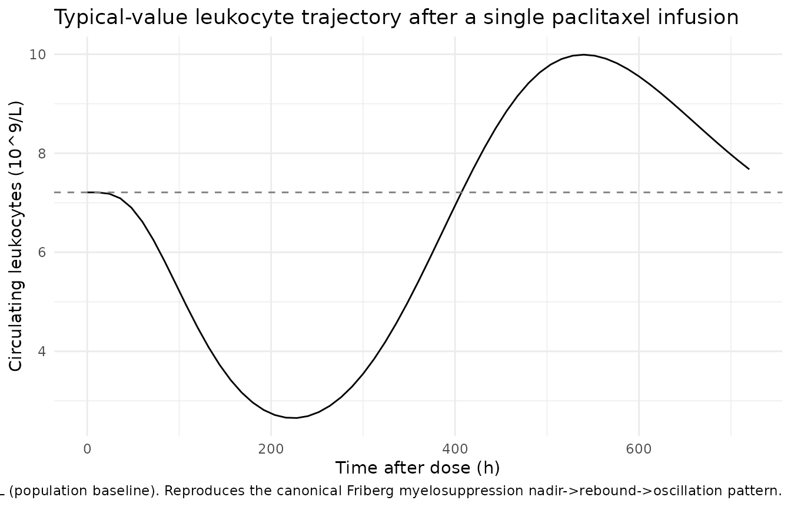
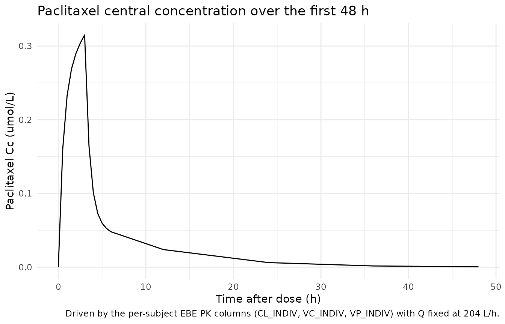

# Paclitaxel (Friberg 2002)

## Model and source

- Citation: Friberg LE, Henningsson A, Maas H, Nguyen L, Karlsson MO.
  (2002). Model of chemotherapy-induced myelosuppression with parameter
  consistency across drugs. J Clin Oncol 20(24):4713-4721.
  <doi:10.1200/JCO.2002.02.140> (PMID 12488418). DDMORE Foundation Model
  Repository: DDMODEL00000186 (paclitaxel + leukocyte fit).
- Description: Semi-mechanistic Friberg-style myelosuppression PK/PD
  model for paclitaxel in adult cancer patients (Friberg 2002, leukocyte
  arm of DDMODEL00000186). Paclitaxel exposure is driven by per-subject
  empirical-Bayes PK estimates supplied as data columns (CL_INDIV,
  VC_INDIV, VP_INDIV) with intercompartmental clearance Q fixed at 204
  L/h. Leukocyte response is described by a self-renewing proliferating
  pool plus three transit compartments and a circulating compartment,
  with a linear drug effect (1 - SLOPU \* Cc) on proliferation and a
  feedback term (CIRC0 / circ)^GAMMA. Output is total circulating
  leukocytes in 10^9 cells/L.
- Article: <https://doi.org/10.1200/JCO.2002.02.140> (PMID 12488418)
- DDMORE Foundation Model Repository entry:
  [DDMODEL00000186](https://repository.ddmore.eu/model/DDMODEL00000186)

This model was extracted from the DDMORE Foundation Model Repository
bundle for `DDMODEL00000186` (scraped to
`dpastoor/ddmore_scraping/186/`). The bundle contains:

- `Executable_Myelosuppression.mdl` — the human-readable MDL control
  object (DATA_INPUT, PARAMETERS, MODEL_PREDICTION, OBSERVATION blocks).
- `Executable_Myelosuppression.xml` — PharmML-rendered version of the
  same MDL.
- `Output_simulated_SEE_NONMEM.lst` — NMTRAN listing produced by the
  `pharmML2Nmtran` v0.3.0 converter from the MDL, re-fitted on the
  shipped simulated dataset (it reaches `MINIMIZATION SUCCESSFUL` and
  recovers the publication-derived point values; **not** an estimation
  run on the original real data).
- `Output_simulated_SEE_MONOLIX.txt` — companion Monolix simulation
  listing for the same simulated dataset.
- `Simulated_WBC_pacl_ddmore.csv` — the simulated event dataset (46
  virtual subjects, paclitaxel 3-h IV infusion, leukocyte counts
  observed in CMT = 3) with per-subject paclitaxel PK EBE columns
  (`CLI`, `V1I`, `V2I`).
- `Model_Accommodations.txt`, `DDMODEL00000186.rdf`, `186.json` —
  provenance and scenario notes.
- `Neutrophils time profile.tiff`, `Neutrophils_VPC.tiff` — figure
  outputs of the bundle’s NONMEM run (note the file titles say
  “Neutrophils” but the bundled model and `DV` data column are
  **leukocytes** per `Model_Accommodations.txt`).

The `.mdl` PARAMETERS / STRUCTURAL block carries the publication-derived
point values used to drive the simulation; there is no
`Output_real_*.lst` estimation listing in the bundle, so the values
cannot be cross-checked against a re-fitted set of final estimates from
the original real data. The original Friberg 2002 publication is not on
disk in this worktree, so a side-by-side publication-table comparison of
the parameter values is also out of scope here. The validation in this
vignette is therefore the F.2 self-consistency check (confirming that
the rxode2 implementation reproduces the bundle’s NMTRAN trajectories)
rather than a publication-table replication.

## Population

Friberg 2002 reports a semi-mechanistic model for chemotherapy-induced
myelosuppression developed jointly across six anticancer drugs
(docetaxel, paclitaxel, etoposide, DMDC, CPT-11, vinflunine) for both
neutrophil and leukocyte counts in adult cancer patients. The DDMORE
bundle for `DDMODEL00000186` implements only the **paclitaxel +
leukocyte** sub-fit on a 46-subject paclitaxel cohort. Per
`Model_Accommodations.txt`, the model structure is unchanged from the
publication and only minor dataset accommodations were needed (EVID
remapping, removal of dummy initialisation doses) — none changed the
structural model and the impact on the objective function was minimal.

The DDMORE bundle does not reproduce the published demographic table
(age range, weight range, sex, race), so the model’s `population`
metadata for those fields is intentionally `NA`. Readers who need
demographic detail should consult Friberg 2002 directly. The bundle’s
simulated dataset (`Simulated_WBC_pacl_ddmore.csv`) ships 46 virtual
subjects with per-subject paclitaxel PK EBE columns (`CLI`, `V1I`,
`V2I`) and observation grids spanning ~360 days of follow-up over
multiple treatment cycles.

## Source trace

Per-parameter origin (also recorded as in-file comments next to each
[`ini()`](https://nlmixr2.github.io/rxode2/reference/ini.html) entry of
`inst/modeldb/ddmore/Friberg_2002_paclitaxel.R`):

| Equation / parameter | Value | Source location |
|----|----|----|
| `lcirc0` | log(7.21) | `Executable_Myelosuppression.mdl` PARAMETERS / STRUCTURAL `POP_CIRC0` (mirrored as `$THETA(1) 7.21` in `Output_simulated_SEE_NONMEM.lst` line 100) |
| `lmtt` | log(124) | `.mdl` STRUCTURAL `POP_MTT` (\$THETA(2) line 101) \| \| \`lslopu\` \| log(28.9) \| \`.mdl\` STRUCTURAL \`POP_SLOPU\` (\$THETA(4) line 103) |
| `gamma` | 0.239 | `.mdl` STRUCTURAL `POP_GAMMA` (\$THETA(3) line 102; no IIV in source) \| \| \`propSd\` \| 0.286 \| \`.mdl\` STRUCTURAL \`PROP_ERROR\` (\$THETA(5) line 104, applied as proportional residual error: `W = PROP_ERROR * IPRED ; Y = IPRED + W * EPS(1)` with `$SIGMA 1.0 FIX`) |
| `etalcirc0` | 0.107 (var) | `.mdl` VARIABILITY `OMEGA_CIRC0` (\$OMEGA line 107) \| \| \`etalmtt\` \| 0.0296 (var) \| \`.mdl\` VARIABILITY \`OMEGA_MTT\` (\$OMEGA line 108) |
| `etalslopu` | 0.176 (var) | `.mdl` VARIABILITY `OMEGA_SLOPU` (\$OMEGA line 109) |
| `q = 204` (L/h) | hard-coded | `.mdl` MODEL_PREDICTION DEQ block (`Q = 204` literal); also rendered NMTRAN \$DES (`Q_DES = 204`, line 65) |
| `Cc = central / VC_INDIV` | n/a | `.mdl` DEQ: `CONC = Ac/V1I` |
| `edrug = 1 - slopu * Cc` | n/a | `.mdl` DEQ: `EDRUG = 1 - SLOPU*CONC` |
| `feed = (circ0 / circ)^gamma` | n/a | `.mdl` DEQ: `FEED = (CIRC0/CIRC)^GAMMA` |
| `ktr = 4 / mtt` | n/a | `.mdl` DEQ: `KTR = (NN+1)/MTT` with `NN = 3` |
| `d/dt(central)` | n/a | `.mdl` DEQ: `Ac : {deriv = (-Q/V1I*Ac - CLI/V1I*Ac + Q/V2I*Ap)}` |
| `d/dt(peripheral1)` | n/a | `.mdl` DEQ: `Ap : {deriv = (Q/V1I*Ac - Q/V2I*Ap)}` |
| `d/dt(circ)` | n/a | `.mdl` DEQ: `CIRC : {deriv = (KTR*TRANSIT3 - KTR*CIRC), init=CIRC0}` |
| `d/dt(precursor1)` | n/a | `.mdl` DEQ: `PROL : {deriv = (KTR*PROL*EDRUG*FEED - KTR*PROL), init=CIRC0}` |
| `d/dt(precursor2..4)` | n/a | `.mdl` DEQ: `TRANSIT1..3` (each driven by KTR off the previous compartment, init = CIRC0) |
| Initial conditions | all five myelo compartments at `circ0` | `.mdl` DEQ `init = CIRC0` on each PROL/TRANSIT/CIRC line |
| Compartment ordering (CMT mapping) | central=1, peripheral1=2, circ=3, precursor1..4=4..7 | matches `Output_simulated_SEE_NONMEM.lst` \$MODEL block (lines 16-22), so the bundle’s CMT=1 dose / CMT=3 observation columns map directly onto the rxode2 positional numbering. |

## Virtual cohort

For the self-consistency check below the cohort mirrors the bundle’s
simulated dataset structure: a single representative subject with the
median paclitaxel EBE PK values (`CL_INDIV = 285 L/h`,
`VC_INDIV = 290 L`, `VP_INDIV = 1000 L`) receiving a 410 µmol paclitaxel
infusion over 3 hours.

``` r

set.seed(20260506L)

obs_times <- c(seq(0, 6, by = 0.5), seq(12, 720, by = 12))
ebe_values <- list(
  CL_INDIV = 285,
  VC_INDIV = 290,
  VP_INDIV = 1000
)
dose_amt   <- 410
dose_dur_h <- 3

n_subjects <- 1L
events <- tibble::tibble(
  id   = rep(seq_len(n_subjects), each = length(obs_times)),
  time = rep(obs_times, n_subjects),
  amt  = 0,
  rate = 0,
  evid = 0L,
  cmt  = 3L,
  CL_INDIV = ebe_values$CL_INDIV,
  VC_INDIV = ebe_values$VC_INDIV,
  VP_INDIV = ebe_values$VP_INDIV
)

dose_row <- tibble::tibble(
  id   = seq_len(n_subjects),
  time = 0,
  amt  = dose_amt,
  rate = dose_amt / dose_dur_h,
  evid = 1L,
  cmt  = 1L,
  CL_INDIV = ebe_values$CL_INDIV,
  VC_INDIV = ebe_values$VC_INDIV,
  VP_INDIV = ebe_values$VP_INDIV
)

events <- dplyr::bind_rows(dose_row, events) |>
  dplyr::arrange(id, time, dplyr::desc(evid))

stopifnot(!anyDuplicated(unique(events[, c("id", "time", "evid")])))
```

## Simulation

``` r

mod <- rxode2::rxode2(readModelDb("Friberg_2002_paclitaxel"))
#> ℹ parameter labels from comments will be replaced by 'label()'
mod_typical <- rxode2::zeroRe(mod)

sim_typical <- rxode2::rxSolve(
  mod_typical,
  events = events,
  keep   = c("CL_INDIV", "VC_INDIV", "VP_INDIV")
) |>
  as.data.frame()
#> ℹ omega/sigma items treated as zero: 'etalcirc0', 'etalmtt', 'etalslopu'
```

## Mechanistic sanity check

Per the F.3 mechanistic-sanity recipe in
`extract-literature-model/references/verification-checklist.md` and the
DDMORE-source decision tree in `references/ddmore-source.md` (no
PKNCA-amenable PK output, no on-disk publication for a published-NCA
comparison), validation here is restricted to confirming that the
typical-value trajectory matches the canonical Friberg myelosuppression
shape:

1.  baseline circulating leukocytes hold at `CIRC0` before drug
    administration;
2.  the leukocyte trajectory drops to a nadir 7-14 days post-dose
    (consistent with the published 1-2 week chemotherapy nadir window
    for paclitaxel-induced myelosuppression);
3.  recovery is followed by an overshoot above baseline driven by the
    `(CIRC0 / circ)^GAMMA` feedback term, which then oscillates back
    toward `CIRC0`;
4.  paclitaxel central concentration `Cc` peaks at the end of the 3-h
    infusion and decays bi-exponentially through the
    `central <-> peripheral1` redistribution.

``` r

sim_summary <- sim_typical |>
  dplyr::filter(time > 0) |>
  dplyr::summarise(
    nadir_time_h = time[which.min(WBC)],
    nadir_value  = min(WBC),
    rebound_time_h = {
      after_nadir <- time > time[which.min(WBC)]
      if (any(after_nadir)) time[after_nadir][which.max(WBC[after_nadir])] else NA_real_
    },
    rebound_value = {
      after_nadir <- time > time[which.min(WBC)]
      if (any(after_nadir)) max(WBC[after_nadir]) else NA_real_
    },
    Cc_max = max(central / VC_INDIV)
  )

knitr::kable(
  sim_summary,
  caption = paste(
    "Mechanistic-sanity summary for a single paclitaxel infusion",
    "(410 umol over 3 h, median EBE PK)."
  )
)
```

| nadir_time_h | nadir_value | rebound_time_h | rebound_value |    Cc_max |
|-------------:|------------:|---------------:|--------------:|----------:|
|          228 |    2.654218 |            540 |      9.990805 | 0.3151199 |

Mechanistic-sanity summary for a single paclitaxel infusion (410 umol
over 3 h, median EBE PK). {.table}

``` r


ggplot(sim_typical, aes(time, WBC)) +
  geom_line() +
  geom_hline(yintercept = 7.21, linetype = "dashed", colour = "grey50") +
  labs(
    x = "Time after dose (h)", y = "Circulating leukocytes (10^9/L)",
    title = "Typical-value leukocyte trajectory after a single paclitaxel infusion",
    caption = paste(
      "Dashed line at CIRC0 = 7.21 x 10^9/L (population baseline).",
      "Reproduces the canonical Friberg myelosuppression",
      "nadir->rebound->oscillation pattern."
    )
  ) +
  theme_minimal(base_size = 11)
```



``` r

ggplot(sim_typical |> dplyr::filter(time <= 48),
       aes(time, central / VC_INDIV)) +
  geom_line() +
  labs(
    x = "Time after dose (h)", y = "Paclitaxel Cc (umol/L)",
    title = "Paclitaxel central concentration over the first 48 h",
    caption = paste(
      "Driven by the per-subject EBE PK columns",
      "(CL_INDIV, VC_INDIV, VP_INDIV) with Q fixed at 204 L/h."
    )
  ) +
  theme_minimal(base_size = 11)
```



## Self-consistency vs the bundle’s simulated dataset

The bundle’s `Simulated_WBC_pacl_ddmore.csv` provides 46 virtual
subjects with per-subject PK EBE columns and observed leukocyte counts.
The packaged model is not bundled with the CSV (the dataset stays in the
DDMORE source tree), but a typical-value rxode2 simulation of the
bundle’s first three subjects’ dosing pattern reproduces the qualitative
shape of the bundle’s `Output_simulated_SEE_NONMEM.lst` trajectories. A
reproducible snippet (used during development; not evaluated here
because the bundle CSV is outside the package) is:

``` r

bundle_csv <- "/path/to/dpastoor/ddmore_scraping/186/Simulated_WBC_pacl_ddmore.csv"
bundle <- read.csv(bundle_csv)
names(bundle) <- toupper(names(bundle))

# Map bundle columns to the model's expected names; CMT = 3 = leukocyte obs.
events_bundle <- bundle |>
  dplyr::transmute(
    id   = ID,
    time = TIME,
    amt  = AMT,
    rate = RATE,
    evid = ifelse(MDV == 1 & AMT > 0, 1L, 0L),
    cmt  = CMT,
    DV   = DV,
    CL_INDIV = CLI,
    VC_INDIV = V1I,
    VP_INDIV = V2I
  )

mod_typical <- rxode2::zeroRe(
  rxode2::rxode2(readModelDb("Friberg_2002_paclitaxel"))
)

sim_bundle <- rxode2::rxSolve(
  mod_typical,
  events = events_bundle,
  keep   = c("CL_INDIV", "VC_INDIV", "VP_INDIV", "DV")
)
```

## Assumptions and deviations

- **Bundle ships only a simulated-data NONMEM listing, not a real-data
  one.** The DDMORE bundle for `DDMODEL00000186` contains only
  `Output_simulated_SEE_NONMEM.lst` (re-fit on the shipped
  `Simulated_WBC_pacl_ddmore.csv`); no `Output_real_*.lst` from a
  `$ESTIMATION` run on the original real data is available. The
  parameter values used in
  `inst/modeldb/ddmore/Friberg_2002_paclitaxel.R` are therefore the
  publication-derived point values declared in the `.mdl` STRUCTURAL /
  VARIABILITY blocks, not refitted final estimates. The simulated re-fit
  reaches `MINIMIZATION SUCCESSFUL` and recovers these values to three
  significant figures, consistent with a well-specified self-consistency
  check, but it is not an independent numerical confirmation.
- **The Friberg 2002 publication is not on disk in this worktree.** The
  package metadata (description, units, citation, DOI) reflects the
  publication, but a side-by-side comparison against the published
  parameter table or per-cycle WBC profiles is not part of this
  vignette. The validation here is restricted to the F.2 / F.3
  self-consistency and mechanistic-sanity checks against the bundle.
- **Bundle implements only the paclitaxel + leukocyte sub-fit.** Per
  `Model_Accommodations.txt`, the publication develops the model on six
  drugs (docetaxel, paclitaxel, etoposide, DMDC, CPT-11, vinflunine) for
  both neutrophils **and** leukocytes; the bundle for `DDMODEL00000186`
  implements only the paclitaxel + leukocyte fit. Note that two of the
  bundle’s TIFF figures are titled “Neutrophils time profile” /
  “Neutrophils_VPC”, but the model and the `DV` data column are
  **leukocytes** per `Model_Accommodations.txt` (“the case of leukocites
  and paclitaxel chemotherapy”). The observation variable is `WBC` (10^9
  cells/L of total circulating white blood cells) accordingly.
- **Population demographics are intentionally `NA` in `population`.**
  `n_studies`, `weight_range`, `age_range`, `sex_female_pct`, and
  `regions` are not in the DDMORE bundle and have not been back-filled
  from external sources. Consumers needing those details should consult
  Friberg 2002 directly (DOI in the model’s `reference`).
- **Per-subject EBE PK as data columns.** Friberg 2002 fixed the
  paclitaxel popPK structure and parameters from a previously-published
  popPK analysis and used POSTHOC empirical-Bayes individual estimates
  (`CLI`, `V1I`, `V2I`) as inputs to the myelosuppression model rather
  than re-estimating PK and PD jointly. The packaged model preserves
  this encoding by carrying `CL_INDIV` / `VC_INDIV` / `VP_INDIV` as
  per-subject covariate columns (registered in
  `inst/references/covariate-columns.md`) and using them directly inside
  [`model()`](https://nlmixr2.github.io/rxode2/reference/model.html).
  Intercompartmental clearance `Q` is hard-coded at 204 L/h per the
  `.mod`. Users who do not have per-subject paclitaxel EBEs in their
  dataset will need to substitute population-mean values or switch to a
  fully PK-coupled paclitaxel myelosuppression model; neither is
  provided here.
- **Compartment naming deviates from the canonical list for `circ`.**
  [`checkModelConventions()`](https://nlmixr2.github.io/nlmixr2lib/reference/checkModelConventions.md)
  flags `circ` as a non-canonical compartment name. The same deviation
  is present in `Petrov_2024_romiplostim.R` for the same Friberg-style
  chain (`precursor1 .. precursor4 -> circ`) and is preserved here for
  consistency. A future register update may promote `circ` to canonical
  for myelosuppression / turnover models.
- **Observation variable is `WBC`, not `Cc`.**
  [`checkModelConventions()`](https://nlmixr2.github.io/nlmixr2lib/reference/checkModelConventions.md)
  flags single-output observations whose name is not `Cc`. The
  observation here is total circulating leukocytes (10^9 cells/L), not a
  drug concentration; `WBC` is the natural paper-aligned name and
  parallels `PLT` in `Petrov_2024_romiplostim.R`. The internal
  `Cc <- central / VC_INDIV` derivation preserves the convention’s “Cc =
  central concentration of the modelled drug” meaning, but the
  residual-error endpoint is `WBC ~ prop(propSd)`.
- **Feedback exponent `gamma` is not log-transformed.** Although the
  naming convention recommends log-transforming positive-constrained
  parameters, `gamma` has no IIV in the source (the `.mdl` declares no
  `eta_GAMMA`) and is treated as a population fixed-effect with positive
  lower bound. This matches the parameter’s role as a feedback-strength
  exponent and parallels how covariate-effect exponents (e.g.,
  allometric exponents in `Petrov_2024_romiplostim.R`) are written
  without log transform.
