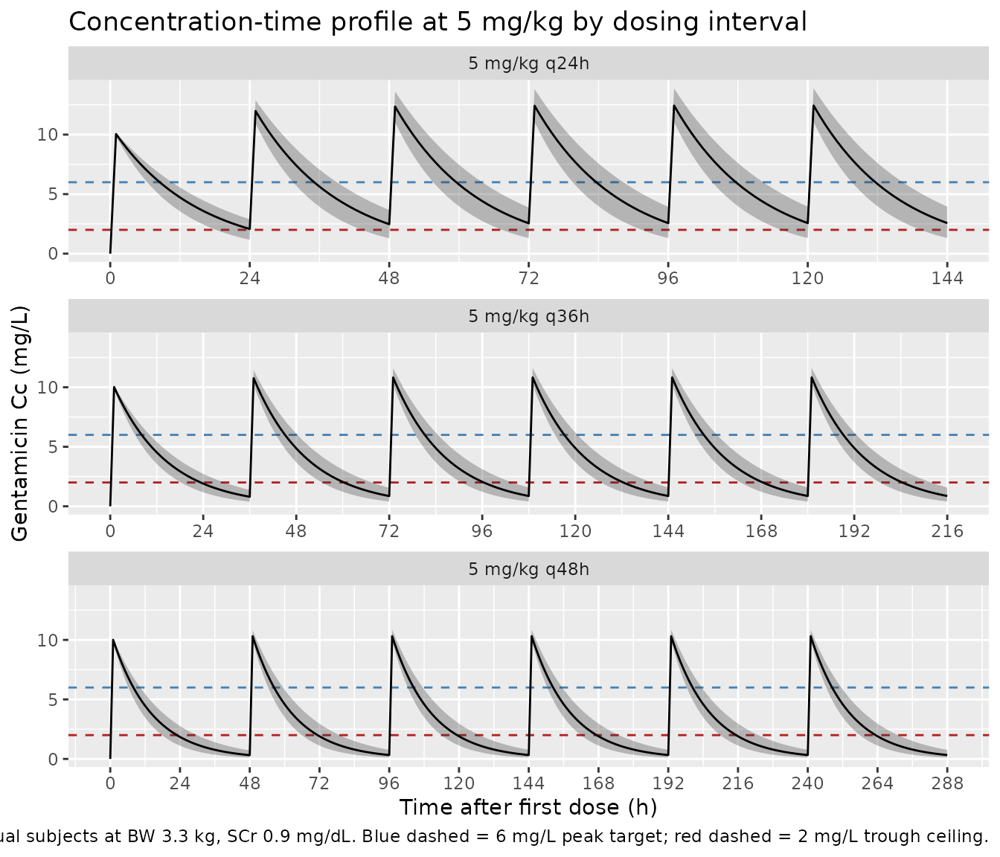

# Gentamicin (Frymoyer 2013)

## Model and source

- Citation: Frymoyer A, Meng L, Bonifacio SL, Verotta D, Guglielmo BJ.
  Gentamicin pharmacokinetics and dosing in neonates with hypoxic
  ischemic encephalopathy receiving hypothermia. Pharmacotherapy.
  2013;33(7):718-726.
- Article: <https://doi.org/10.1002/phar.1263>

``` r

mod_meta <- rxode2::rxode(readModelDb("Frymoyer_2013_gentamicin"))
#> ℹ parameter labels from comments will be replaced by 'label()'
mod_meta$description
#> [1] "One-compartment IV population PK model for gentamicin in 29 term neonates with hypoxic ischemic encephalopathy (HIE) receiving therapeutic hypothermia (Frymoyer 2013), with fixed allometric birth-weight scaling (exponent 0.75 on CL, 1 on Vc, reference 3.3 kg) and a power effect of serum creatinine on PNA day 1 on CL (reference 0.9 mg/dL)."
mod_meta$reference
#> [1] "Frymoyer A, Meng L, Bonifacio SL, Verotta D, Guglielmo BJ. Gentamicin pharmacokinetics and dosing in neonates with hypoxic ischemic encephalopathy receiving hypothermia. Pharmacotherapy. 2013;33(7):718-726. doi:10.1002/phar.1263."
mod_meta$units
#> $time
#> [1] "hour"
#> 
#> $dosing
#> [1] "mg"
#> 
#> $concentration
#> [1] "mg/L"
```

## Population

Frymoyer 2013 developed a one-compartment population PK model from 29
term neonates with hypoxic ischemic encephalopathy (HIE) treated with
whole-body therapeutic hypothermia at 33.5 degrees C in a tertiary Level
III NICU (University of California San Francisco), between November 2007
and March 2010 (Table 1). Inclusion required gestational age \>= 36
weeks; the cohort had median GA 40.0 weeks (IQR 37.6-40.7), median birth
weight 3.32 kg (IQR 2.97-3.50), 62% female, median first
arterial/capillary pH 7.0 (IQR 6.9-7.1), 10-minute APGAR median 5, 83%
assisted ventilation, 55% seizures, 62% co-treated with dopamine, and
21% mortality before discharge. Serum creatinine on PNA day 1 had median
0.9 mg/dL (IQR 0.8-1.2). A total of 47 gentamicin concentrations were
available for the analysis (18 patients with paired peak + trough, 11
with trough only). The standard empiric dose was 5 mg/kg every 24 h (25
neonates received that; 1 neonate received 4.5 mg/kg q24h, and 3
received 4 mg/kg q24h), administered as a 30-minute IV infusion.

Because every neonate in the cohort was undergoing therapeutic
hypothermia, the paper could not evaluate hypothermia as an independent
covariate; the packaged model therefore describes hypothermic-cohort PK
implicitly and does not carry a hypothermia indicator (Discussion: “We
were unable to evaluate the independent impact of hypothermia on
gentamicin pharmacokinetics since all neonates in our study were
cooled.”). For the typical study neonate (BW 3.3 kg, SCr 0.9 mg/dL), the
estimated clearance of 0.034 L/h/kg was 25-50% lower than prior reports
in non-asphyxiated normothermic term neonates.

The same information is available programmatically via
`readModelDb("Frymoyer_2013_gentamicin")$population`.

## Source trace

The per-parameter origin is recorded as an in-file comment next to each
`ini()` entry in
`inst/modeldb/specificDrugs/Frymoyer_2013_gentamicin.R`. The table below
collects them in one place for review.

| Equation / parameter | Value | Source location |
|----|----|----|
| `lcl` (log CL at reference BW 3.3 kg, SCr 0.9 mg/dL) | log(0.111) | Frymoyer 2013 Table 2, Final Model ‘Typical Value of CL’ = 0.111 L/h (RSE 4.2%) |
| `lvc` (log Vc at reference BW 3.3 kg) | log(1.56) | Frymoyer 2013 Table 2, Final Model ‘V’ = 1.56 L (RSE 4.7%) |
| `e_wt_birth_cl` (allometric BW exponent on CL) | 0.75 (fixed) | Frymoyer 2013 Methods, “Population Pharmacokinetic Analysis” |
| `e_wt_birth_vc` (allometric BW exponent on Vc) | 1 (fixed) | Frymoyer 2013 Methods, “Population Pharmacokinetic Analysis” |
| `e_creat_cl` (power exponent on CREAT/0.9 for CL) | -0.566 | Frymoyer 2013 Table 2 magnitude 0.566 (RSE 21.9%); sign assigned per Results: “a typical neonate with SCr 1.4 mg/dL had a clearance 27% lower than a neonate with SCr 0.8 mg/dL” |
| IIV CL (omega^2 = log(1 + 0.161^2)) | 0.02559 (16.1% CV) | Frymoyer 2013 Table 2, Final Model ‘Inter-individual variability of CL, %CV’ (RSE 30.5%) |
| `propSd` (proportional residual error) | 0.162 (16.2% CV) | Frymoyer 2013 Table 2, Final Model ‘Residual variability, %CV’ (RSE 24.1%) |
| Reference birth weight 3.3 kg | n/a | Frymoyer 2013 Abstract and Discussion (“the typical study neonate (BW 3.3 kg; SCr 0.9 mg/dL)”); cohort median 3.32 kg per Table 1 |
| Reference SCr 0.9 mg/dL | n/a | Frymoyer 2013 Methods: “Continuous covariates were scaled to their median values”; cohort median 0.9 mg/dL per Table 1 IQR |
| One-compartment IV PK ODE structure | n/a | Frymoyer 2013 Methods: “A one-compartment pharmacokinetic model with first-order elimination was implemented” |
| Proportional residual error | n/a | Frymoyer 2013 Results: “The residual variability … was best described by a proportional error model” |
| IIV on V removed | n/a | Frymoyer 2013 Results: “Interindividual variability for volume could not be estimated with any precision … Only interindividual variability for clearance was incorporated into the final model” |

## Virtual cohort

The original observed data are not publicly available. The vignette
constructs virtual cohorts that span the paper’s Table 3 dosing
scenarios at the typical neonate body weight (BW 3.3 kg) and SCr (0.9
mg/dL), then verifies that simulated peak and trough concentrations
match the published Table 3 values. Frymoyer 2013 used n = 5000 per arm
for the published Monte Carlo simulations and inflated CL %CV to 20%
(the upper end of the bootstrap CI) to bound the variability in a larger
population; this vignette uses n = 200 per arm at the model’s reported
16.1% CL CV, which is sufficient to recover the published median peak /
trough estimates.

The canonical covariate names in the model are `WT_BIRTH` (kg) and
`CREAT` (mg/dL).

``` r

set.seed(20260621)

n_subjects   <- 200L
infusion_h   <- 0.5         # 30-minute IV infusion (Frymoyer 2013 Methods)
n_doses      <- 6L          # enough doses to reach steady state for q48h
ref_bw_kg    <- 3.3         # typical neonate birth weight (Abstract, Discussion)
ref_scr_mgdl <- 0.9         # cohort median SCr on PNA day 1

# Frymoyer 2013 Table 3 dosing regimens (n_doses doses each so the
# last interval is steady state for all three dosing frequencies).
regimens <- tibble::tribble(
  ~regimen,          ~dose_mg_per_kg, ~interval_h,
  "5 mg/kg q24h",    5,               24,
  "5 mg/kg q36h",    5,               36,
  "5 mg/kg q48h",    5,               48,
  "4 mg/kg q24h",    4,               24,
  "4 mg/kg q36h",    4,               36
)

make_cohort <- function(n, regimen, dose_mg_per_kg, interval_h,
                        id_offset = 0L) {
  ids        <- id_offset + seq_len(n)
  amt_mg     <- ref_bw_kg * dose_mg_per_kg
  dose_times <- seq(0, by = interval_h, length.out = n_doses)
  duration_h <- max(dose_times) + interval_h

  # Observation grid: fine near each dose peak/trough plus hourly
  obs_grid <- sort(unique(c(
    seq(0, duration_h, by = 1),
    dose_times + 1.0,                                      # peak (1 h after start)
    dose_times + interval_h - 0.01,                        # trough (just before next dose)
    duration_h
  )))

  dose_rows <- tidyr::expand_grid(id = ids, time = dose_times) |>
    dplyr::mutate(
      evid     = 1L,
      cmt      = "central",
      amt      = amt_mg,
      rate     = amt_mg / infusion_h,
      WT_BIRTH = ref_bw_kg,
      CREAT    = ref_scr_mgdl,
      regimen  = regimen
    )

  obs_rows <- tidyr::expand_grid(id = ids, time = obs_grid) |>
    dplyr::mutate(
      evid     = 0L,
      cmt      = "central",
      amt      = 0,
      rate     = 0,
      WT_BIRTH = ref_bw_kg,
      CREAT    = ref_scr_mgdl,
      regimen  = regimen
    )

  dplyr::bind_rows(dose_rows, obs_rows) |>
    dplyr::arrange(id, time, dplyr::desc(evid))
}

events <- dplyr::bind_rows(
  lapply(seq_len(nrow(regimens)), function(k) {
    make_cohort(
      n               = n_subjects,
      regimen         = regimens$regimen[k],
      dose_mg_per_kg  = regimens$dose_mg_per_kg[k],
      interval_h      = regimens$interval_h[k],
      id_offset       = (k - 1L) * 1000L
    )
  })
)

stopifnot(!anyDuplicated(unique(events[, c("id", "time", "evid")])))

cat(
  "Cohorts:", nrow(regimens),
  " | Dose rows:", sum(events$evid == 1L),
  " | Obs rows:", sum(events$evid == 0L), "\n"
)
#> Cohorts: 5  | Dose rows: 6000  | Obs rows: 208600
```

## Simulation

``` r

mod <- readModelDb("Frymoyer_2013_gentamicin")
sim <- rxode2::rxSolve(
  mod,
  events = events,
  keep   = c("regimen", "WT_BIRTH", "CREAT")
) |>
  as.data.frame()
#> ℹ parameter labels from comments will be replaced by 'label()'
```

## Replicate published figures

### Figure 2 – typical concentration-time profile (5 mg/kg q24h, q36h, q48h)

Frymoyer 2013 Figure 2 (visual predictive check) shows simulated
gentamicin concentrations dose-normalised to 5 mg/kg. The panel below
plots the median and 5th-95th percentile concentration-time curves over
the dosing window for the three steady-state intervals at 5 mg/kg.

``` r

ribbon_df <- sim |>
  dplyr::filter(!is.na(Cc), regimen %in% c("5 mg/kg q24h",
                                           "5 mg/kg q36h",
                                           "5 mg/kg q48h")) |>
  dplyr::group_by(regimen, time) |>
  dplyr::summarise(
    Q05 = quantile(Cc, 0.05, na.rm = TRUE),
    Q50 = quantile(Cc, 0.50, na.rm = TRUE),
    Q95 = quantile(Cc, 0.95, na.rm = TRUE),
    .groups = "drop"
  )

ggplot(ribbon_df, aes(time, Q50)) +
  geom_hline(yintercept = 6, linetype = "dashed", colour = "steelblue") +
  geom_hline(yintercept = 2, linetype = "dashed", colour = "firebrick") +
  geom_ribbon(aes(ymin = Q05, ymax = Q95), alpha = 0.30) +
  geom_line() +
  facet_wrap(~ regimen, ncol = 1, scales = "free_x") +
  scale_x_continuous(breaks = seq(0, 14 * 24, 24)) +
  labs(
    x       = "Time after first dose (h)",
    y       = "Gentamicin Cc (mg/L)",
    title   = "Concentration-time profile at 5 mg/kg by dosing interval",
    caption = paste0(
      "Median (solid) and 5th-95th percentile (shaded) across ",
      n_subjects, " virtual subjects at BW 3.3 kg, SCr 0.9 mg/dL. ",
      "Blue dashed = 6 mg/L peak target; red dashed = 2 mg/L trough ceiling."
    )
  )
```



### Figure 3 – target attainment by dose and interval

Frymoyer 2013 Figure 3 reports the fraction of neonates achieving (a)
steady-state trough \< 2 mg/L, (b) post-first-dose peak \> 6 mg/L, and
(c) steady-state peak \> 6 mg/L, at doses 3-5 mg/kg with intervals of
24, 36, or 48 h. The chunk below recomputes the steady-state trough
attainment (panel a) across the five regimens simulated above.

``` r

# Steady-state interval = last interval of the simulation window.
ss_intervals <- regimens |>
  dplyr::mutate(
    ss_start = (n_doses - 1) * interval_h,
    ss_end   = n_doses * interval_h
  )

ss_troughs <- sim |>
  dplyr::filter(!is.na(Cc)) |>
  dplyr::inner_join(ss_intervals, by = "regimen") |>
  dplyr::group_by(id, regimen) |>
  dplyr::filter(time >= ss_start, time <= ss_end) |>
  dplyr::slice_max(time, n = 1, with_ties = FALSE) |>
  dplyr::ungroup() |>
  dplyr::select(id, regimen, trough = Cc)

target_attainment <- ss_troughs |>
  dplyr::group_by(regimen) |>
  dplyr::summarise(
    pct_trough_lt_2 = mean(trough < 2) * 100,
    .groups = "drop"
  )

knitr::kable(
  target_attainment,
  digits = 1,
  col.names = c("Regimen", "% with steady-state trough < 2 mg/L"),
  caption  = paste(
    "Steady-state trough attainment by regimen. Compare with",
    "Frymoyer 2013 Figure 3a (24-hour dosing fails to reliably",
    "achieve trough < 2 mg/L; 36-hour and 48-hour dosing both",
    "exceed 90% target attainment)."
  )
)
```

| Regimen      | % with steady-state trough \< 2 mg/L |
|:-------------|-------------------------------------:|
| 4 mg/kg q24h |                                   59 |
| 4 mg/kg q36h |                                  100 |
| 5 mg/kg q24h |                                   28 |
| 5 mg/kg q36h |                                   99 |
| 5 mg/kg q48h |                                  100 |

Steady-state trough attainment by regimen. Compare with Frymoyer 2013
Figure 3a (24-hour dosing fails to reliably achieve trough \< 2 mg/L;
36-hour and 48-hour dosing both exceed 90% target attainment). {.table}

## PKNCA validation

Compute Cmax (peak) and Cmin (trough) per subject over the last
steady-state dosing interval using PKNCA, grouped by `regimen`. Frymoyer
2013 defines peak as the concentration 30 minutes after the end of a
30-minute infusion (i.e. 1 hour after dose start) and trough as the
concentration just before the next dose.

``` r

sim_nca <- sim |>
  dplyr::filter(!is.na(Cc)) |>
  dplyr::inner_join(ss_intervals, by = "regimen") |>
  dplyr::filter(time >= ss_start, time <= ss_end) |>
  dplyr::mutate(time_in_interval = time - ss_start) |>
  dplyr::ungroup() |>
  dplyr::select(id, time_in_interval, Cc, regimen)

# Guarantee a time=0 row per (id, regimen) for PKNCA's AUC anchor.
# At steady state, the start-of-interval concentration equals the
# concentration carried over from the previous trough; PKNCA will use
# the supplied value to anchor AUC. We bind in the start-of-interval
# concentration that the simulation produced at ss_start.
ss_anchor <- sim |>
  dplyr::filter(!is.na(Cc)) |>
  dplyr::inner_join(ss_intervals, by = "regimen") |>
  dplyr::filter(abs(time - ss_start) < 1e-6) |>
  dplyr::transmute(id, regimen, time_in_interval = 0, Cc)

sim_nca <- dplyr::bind_rows(sim_nca, ss_anchor) |>
  dplyr::distinct(id, regimen, time_in_interval, .keep_all = TRUE) |>
  dplyr::arrange(id, regimen, time_in_interval)

conc_obj <- PKNCA::PKNCAconc(
  sim_nca, Cc ~ time_in_interval | regimen + id,
  concu = "mg/L", timeu = "h"
)

# Dose at t = 0 of the steady-state interval; per-cohort amount.
dose_amt <- regimens$dose_mg_per_kg * ref_bw_kg
names(dose_amt) <- regimens$regimen

dose_df <- sim_nca |>
  dplyr::distinct(id, regimen) |>
  dplyr::mutate(
    time_in_interval = 0,
    amt              = dose_amt[as.character(regimen)]
  )

dose_obj <- PKNCA::PKNCAdose(
  dose_df, amt ~ time_in_interval | regimen + id,
  doseu = "mg"
)

intervals <- data.frame(
  start    = 0,
  end      = max(regimens$interval_h),
  cmax     = TRUE,
  cmin     = TRUE,
  tmax     = TRUE,
  auclast  = TRUE
)

nca_data <- PKNCA::PKNCAdata(conc_obj, dose_obj, intervals = intervals)
nca_res  <- PKNCA::pk.nca(nca_data)
```

### Comparison against Frymoyer 2013 Table 3

Frymoyer 2013 Table 3 reports simulated steady-state peak and trough
concentrations as median (10%, 90%) for each regimen (5,000 subjects per
arm with CL %CV inflated to 20% and BW / SCr distributions from the CDC
and the cohort, respectively). The chunk below recomputes the same
statistics from the packaged-model simulation at the typical neonate (BW
3.3 kg, SCr 0.9 mg/dL) and renders them side-by-side with the published
values.

``` r

peak_h <- 1.0   # 30 min after end of 30 min infusion

peaks <- sim |>
  dplyr::filter(!is.na(Cc)) |>
  dplyr::inner_join(ss_intervals, by = "regimen") |>
  dplyr::filter(abs(time - (ss_start + peak_h)) < 1e-6) |>
  dplyr::select(id, regimen, peak = Cc)

troughs <- ss_troughs

simulated_summary <- dplyr::left_join(peaks, troughs,
                                      by = c("id", "regimen")) |>
  dplyr::group_by(regimen) |>
  dplyr::summarise(
    median_trough_sim = median(trough, na.rm = TRUE),
    median_peak_sim   = median(peak,   na.rm = TRUE),
    p10p90_trough_sim = paste0(
      sprintf("%.1f-%.1f",
              quantile(trough, 0.10, na.rm = TRUE),
              quantile(trough, 0.90, na.rm = TRUE))
    ),
    p10p90_peak_sim   = paste0(
      sprintf("%.1f-%.1f",
              quantile(peak, 0.10, na.rm = TRUE),
              quantile(peak, 0.90, na.rm = TRUE))
    ),
    .groups = "drop"
  )

published <- tibble::tribble(
  ~regimen,          ~median_trough_pub, ~p10p90_trough_pub, ~median_peak_pub, ~p10p90_peak_pub,
  "5 mg/kg q24h",    2.3,                "1.0-4.5",          11.8,             "8.5-15.7",
  "5 mg/kg q36h",    0.9,                "0.3-2.0",          10.5,             "7.8-13.5",
  "5 mg/kg q48h",    0.4,                "0.1-1.0",          10.0,             "7.3-12.8",
  "4 mg/kg q24h",    1.8,                "0.8-3.6",          9.4,              "6.8-12.5",
  "4 mg/kg q36h",    0.7,                "0.2-1.6",          8.4,              "6.2-10.8"
)

comparison <- published |>
  dplyr::left_join(simulated_summary, by = "regimen") |>
  dplyr::select(regimen,
                median_trough_pub, median_trough_sim,
                p10p90_trough_pub, p10p90_trough_sim,
                median_peak_pub,   median_peak_sim,
                p10p90_peak_pub,   p10p90_peak_sim)

knitr::kable(
  comparison,
  digits  = 2,
  caption = paste(
    "Simulated vs Frymoyer 2013 Table 3 (steady-state median trough",
    "and peak with 10%-90% interval, mg/L). The 'pub' columns are the",
    "published Monte Carlo values (n = 5000, CL CV inflated to 20%);",
    "the 'sim' columns are recomputed from the packaged model",
    "(n = ", n_subjects, ", CL CV 16.1% as reported in Table 2),",
    "at the typical neonate BW 3.3 kg / SCr 0.9 mg/dL. Medians should",
    "track closely; the simulated 10%-90% range is tighter because",
    "the packaged model uses the as-fit IIV rather than the inflated",
    "variability and holds BW and SCr at their reference values."
  )
)
```

| regimen | median_trough_pub | median_trough_sim | p10p90_trough_pub | p10p90_trough_sim | median_peak_pub | median_peak_sim | p10p90_peak_pub | p10p90_peak_sim |
|:---|---:|---:|:---|:---|---:|---:|:---|:---|
| 5 mg/kg q24h | 2.3 | 2.57 | 1.0-4.5 | 1.5-3.7 | 11.8 | 12.44 | 8.5-15.7 | 11.2-13.6 |
| 5 mg/kg q36h | 0.9 | 0.87 | 0.3-2.0 | 0.5-1.4 | 10.5 | 10.83 | 7.8-13.5 | 10.4-11.5 |
| 5 mg/kg q48h | 0.4 | 0.33 | 0.1-1.0 | 0.1-0.7 | 10.0 | 10.31 | 7.3-12.8 | 10.0-10.8 |
| 4 mg/kg q24h | 1.8 | 1.88 | 0.8-3.6 | 1.2-2.8 | 9.4 | 9.77 | 6.8-12.5 | 9.0-10.8 |
| 4 mg/kg q36h | 0.7 | 0.65 | 0.2-1.6 | 0.4-1.1 | 8.4 | 8.61 | 6.2-10.8 | 8.3-9.2 |

Simulated vs Frymoyer 2013 Table 3 (steady-state median trough and peak
with 10%-90% interval, mg/L). The ‘pub’ columns are the published Monte
Carlo values (n = 5000, CL CV inflated to 20%); the ‘sim’ columns are
recomputed from the packaged model (n = 200 , CL CV 16.1% as reported in
Table 2), at the typical neonate BW 3.3 kg / SCr 0.9 mg/dL. Medians
should track closely; the simulated 10%-90% range is tighter because the
packaged model uses the as-fit IIV rather than the inflated variability
and holds BW and SCr at their reference values. {.table
style="width:100%;"}

``` r

res_tbl <- as.data.frame(nca_res$result)
knitr::kable(
  utils::head(res_tbl[, c("start", "end", "regimen", "PPTESTCD", "PPORRES")], 20),
  caption = "First 20 rows of per-subject PKNCA output (long form).",
  digits  = 3,
  row.names = FALSE
)
```

| start | end | regimen      | PPTESTCD | PPORRES |
|------:|----:|:-------------|:---------|--------:|
|     0 |  48 | 4 mg/kg q24h | auclast  | 103.598 |
|     0 |  48 | 4 mg/kg q24h | cmax     |   9.338 |
|     0 |  48 | 4 mg/kg q24h | cmin     |   1.483 |
|     0 |  48 | 4 mg/kg q24h | tmax     |   1.000 |
|     0 |  48 | 4 mg/kg q24h | auclast  | 131.958 |
|     0 |  48 | 4 mg/kg q24h | cmax     |  10.346 |
|     0 |  48 | 4 mg/kg q24h | cmin     |   2.424 |
|     0 |  48 | 4 mg/kg q24h | tmax     |   1.000 |
|     0 |  48 | 4 mg/kg q24h | auclast  | 139.619 |
|     0 |  48 | 4 mg/kg q24h | cmax     |  10.628 |
|     0 |  48 | 4 mg/kg q24h | cmin     |   2.692 |
|     0 |  48 | 4 mg/kg q24h | tmax     |   1.000 |
|     0 |  48 | 4 mg/kg q24h | auclast  | 136.544 |
|     0 |  48 | 4 mg/kg q24h | cmax     |  10.515 |
|     0 |  48 | 4 mg/kg q24h | cmin     |   2.584 |
|     0 |  48 | 4 mg/kg q24h | tmax     |   1.000 |
|     0 |  48 | 4 mg/kg q24h | auclast  | 124.338 |
|     0 |  48 | 4 mg/kg q24h | cmax     |  10.070 |
|     0 |  48 | 4 mg/kg q24h | cmin     |   2.162 |
|     0 |  48 | 4 mg/kg q24h | tmax     |   1.000 |

First 20 rows of per-subject PKNCA output (long form). {.table}

## Assumptions and deviations

- **Reference birth weight 3.3 kg.** The Abstract and Discussion use 3.3
  kg as the typical neonate weight to which the published clearance
  estimate 0.034 L/h/kg corresponds (giving CL = 0.111 L/h at 3.3 kg,
  matching Table 2). The cohort median birth weight in Table 1 is 3.32
  kg; the difference between 3.3 and 3.32 changes CL by 0.5% and is
  immaterial for replication of Table 3.
- **Reference SCr 0.9 mg/dL.** The cohort median SCr on PNA day 1 is 0.9
  mg/dL (Table 1 IQR 0.8-1.2). Methods state “Continuous covariates were
  scaled to their median values”; 0.9 mg/dL is the median used.
- **Sign of the SCr exponent.** Table 2 prints the exponent magnitude
  (0.566) but the equation form is not written out as a decoded formula
  in the manuscript. The Results narrative provides the direction: “a
  typical neonate with SCr 1.4 mg/dL had a clearance 27% lower than a
  neonate with SCr 0.8 mg/dL”. Setting `e_creat_cl = -0.566` and
  computing `(1.4/0.8)^(-0.566) = 0.729` reproduces the published 27.1%
  reduction; the positive form `(1.4/0.8)^(+0.566) = 1.37` would imply
  37% higher CL at higher SCr, contradicting the narrative. The packaged
  model encodes the negative sign explicitly with a comment.
- **Hypothermia not modelled as a covariate.** Every neonate in the
  cohort was undergoing whole-body hypothermia at 33.5 degrees C.
  Discussion: “We were unable to evaluate the independent impact of
  hypothermia on gentamicin pharmacokinetics since all neonates in our
  study were cooled.” The model therefore characterises hypothermic-
  cohort PK implicitly; the population metadata records the disease
  state, and users intending to apply this model to normothermic
  neonates should consult alternatives such as Bijleveld 2017 or Fuchs
  2014 which include broader gestational-age and ventilation strata.
- **IIV magnitude in the packaged model differs from Frymoyer 2013 Table
  3 simulations.** The packaged model uses the as-reported IIV CL =
  16.1% CV (Table 2). For the Table 3 Monte Carlo simulations the paper
  inflated CL %CV to 20% (the upper bound of the bootstrap 95% CI) to
  mimic increased variability expected in a larger population. The
  vignette’s simulated 10-90% percentile ranges are therefore narrower
  than the published Table 3 ranges; the medians should track closely
  because they are driven by the typical-value structural predictions at
  the reference BW / SCr.
- **GA, PNA, first arterial pH, 10-minute APGAR, and dopamine were not
  retained.** The paper screened these covariates during forward
  selection and found none significantly affected gentamicin clearance
  (Results “Population Pharmacokinetic Analysis”). The packaged model
  retains only BW (allometric) and SCr (power) on CL. The screened-
  but-not-retained covariates are documented in `covariatesDataExcluded`
  for provenance.
- **IIV on V was removed from the final model.** Results:
  “Interindividual variability for volume could not be estimated with
  any precision using the available data … it was removed from the
  model.” The packaged model carries IIV on CL only.
- **Infusion duration set by the event table.** The model does not
  hard-code `dur(central)`. Users specify infusion duration per dose via
  the `rate` (or `dur`) column on event-table dose rows; the vignette
  uses `rate = amt / 0.5` to deliver each 30-minute infusion as in the
  source paper.
- **Errata not located.** A targeted search of the journal landing page
  and Google Scholar at extraction time did not turn up an erratum for
  this article. If one is later identified that revises a Table 2
  estimate, the packaged values should be refreshed accordingly.
