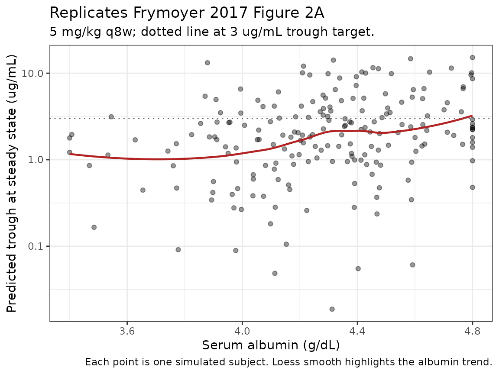

# Infliximab (Frymoyer 2017)

``` r

library(nlmixr2lib)
library(rxode2)
#> rxode2 5.1.1 using 2 threads (see ?getRxThreads)
#>   no cache: create with `rxCreateCache()`
library(dplyr)
#> 
#> Attaching package: 'dplyr'
#> The following objects are masked from 'package:stats':
#> 
#>     filter, lag
#> The following objects are masked from 'package:base':
#> 
#>     intersect, setdiff, setequal, union
library(tidyr)
library(ggplot2)
library(PKNCA)
#> 
#> Attaching package: 'PKNCA'
#> The following object is masked from 'package:stats':
#> 
#>     filter
```

## Model and source

- Citation: Frymoyer A, Hoekman DR, Piester TL, de Meij TG, Hummel TZ,
  Benninga MA, Kindermann A, Park KT. Application of population
  pharmacokinetic modeling for individualized infliximab dosing
  strategies in Crohn disease. J Pediatr Gastroenterol Nutr.
  2017;65(6):639-645.
- Article:
  [doi:10.1097/MPG.0000000000001620](https://doi.org/10.1097/MPG.0000000000001620)

Frymoyer 2017 is an external-validation paper rather than a model
development paper. The structural two-compartment PK model and final
parameter estimates for infliximab in Crohn’s disease were originally
developed by Fasanmade et al. (reference 3 of Frymoyer 2017) by pooling
data from 112 children in the REACH trial (pediatric Crohn’s disease)
and 580 adults in the ACCENT I trial. Frymoyer 2017 reproduces the model
equations and final parameter estimates verbatim in its Methods section
(“Model Evaluation”) and externally validates the model in a prospective
cohort of 34 Dutch children with Crohn’s disease on maintenance
infliximab.

The packaged model encodes the structural form and parameter values as
they appear in Frymoyer 2017 Methods, with the following allometric
representation: source equations are stated on per-kilogram clearance
and per-kilogram volumes (reference 65 kg); the packaged model carries
those as total clearance and total volumes, applying an implicit +1 to
each WT exponent to convert per-kg parameters to total parameters. The
in-file [`ini()`](https://nlmixr2.github.io/rxode2/reference/ini.html)
comments record the per-kg-to-total conversion arithmetic for every
structural parameter.

## Population

Frymoyer 2017 Methods describe the model-development cohort: 112
pediatric subjects from the REACH trial (pediatric Crohn’s disease, ages
6-17) and 580 adult subjects from the ACCENT I trial (adult Crohn’s
disease, ages 18+), pooled into a single 692-subject popPK analysis by
Fasanmade et al. (cited as reference 3 of Frymoyer 2017). Detailed
baseline demographics for the model-development cohort are not reported
in Frymoyer 2017 itself; readers needing those values should consult the
original Fasanmade publication.

The model is intended to be applied to children and adults with Crohn’s
disease on maintenance IV infliximab. Frymoyer 2017 Table 1 reports the
demographics of its own validation cohort (n = 34 Dutch children with
Crohn’s disease):

- **Sex:** 38% female, 62% male.
- **Age:** median 14.9 years (IQR 13.2-15.9, range 5-17.9).
- **Body weight:** median 53 kg (IQR 48-62, range 22-120).
- **Serum albumin:** median 4.3 g/dL (IQR 4.0-4.5, range 3.4-4.8).
- **CRP:** median 2.4 mg/L (IQR 0.9-4.8, range 0.2-18.4).
- **Concomitant immunomodulator (purine analogue or methotrexate):** 15
  (44%).
- **Detectable antibodies to infliximab (ATI):** 4 (12%).
- **Time since diagnosis:** median 1.9 years (IQR 1.1-2.9, range
  0.3-7.6).
- **Time since start of IFX:** median 29.7 weeks (IQR 13.9-56.1, range
  2.0-174).

The same metadata is available programmatically via
`readModelDb("Frymoyer_2017_infliximab")$population`.

## Source trace

The per-parameter origin is recorded next to each
[`ini()`](https://nlmixr2.github.io/rxode2/reference/ini.html) entry in
`inst/modeldb/specificDrugs/Frymoyer_2017_infliximab.R`. The table below
collects them in one place for review.

| Element | Source location | Value / form |
|----|----|----|
| CL (per kg) | Methods (Model Evaluation), CL equation | `5.42 * (WT/65)^0.313 * (ALB/4.1)^(-0.855) * 0.863^IMM * 1.292^ATI` (mL/kg/day) |
| Vc (per kg) | Methods (Model Evaluation), Vc equation | `52.4 * (WT/65)^0.233` (mL/kg) |
| Vp (per kg) | Methods (Model Evaluation), Vp equation | `19.6 * (WT/65)^0.588` (mL/kg) |
| Q (per kg) | Methods (Model Evaluation) | `2.26` (mL/kg/day, constant per kg) |
| CL (typ) at WT=65 | derived from Methods | `5.42 * 65 / 1000 = 0.3523` L/day |
| Vc (typ) at WT=65 | derived from Methods | `52.4 * 65 / 1000 = 3.406` L |
| Vp (typ) at WT=65 | derived from Methods | `19.6 * 65 / 1000 = 1.274` L |
| Q (typ) at WT=65 | derived from Methods | `2.26 * 65 / 1000 = 0.1469` L/day |
| WT on CL | Methods | Power, per-kg exponent 0.313; total-CL exponent (1 + 0.313) = 1.313 |
| WT on Vc | Methods | Power, per-kg exponent 0.233; total-Vc exponent (1 + 0.233) = 1.233 |
| WT on Vp | Methods | Power, per-kg exponent 0.588; total-Vp exponent (1 + 0.588) = 1.588 |
| WT on Q | Methods | Constant per kg; total-Q exponent 1.0 |
| ALB on CL | Methods | Power, `(ALB/4.1)^(-0.855)` |
| IMM on CL | Methods | Power-of-coefficient, `0.863^IMM` (-13.7% when on immunomodulator) |
| ATI on CL | Methods | Power-of-coefficient, `1.292^ADA_POS` (+29.2% when ADA-positive) |
| IIV CL | Methods | CV 30.7% (omega^2 = log(1 + 0.307^2) = 0.09010) |
| IIV Vc | Methods | CV 12.6% (omega^2 = log(1 + 0.126^2) = 0.01575) |
| IIV Vp | Methods | CV 55.3% (omega^2 = log(1 + 0.553^2) = 0.26687) |
| Residual proportional | Methods | 29.2% CV |
| Residual additive | Methods | SD 0.371 ug/mL |
| ODE structure: 2-cmt IV | Methods, “Model Evaluation” | first-order elimination, no absorption (IV infusion to central) |

## Covariate column naming

| Source column | Canonical column used here |
|----|----|
| `WT` | `WT` |
| `ALB` (g/dL) | `ALB` |
| `ATI` (binary anti-drug antibody indicator) | `ADA_POS` |
| `IMM` (binary “concomitant immunomodulator” indicator pooling purine analogue + methotrexate) | `CONMED_IMMUNOMOD` |

The `CONMED_IMMUNOMOD` canonical column is registered (alongside this
extraction) as the composite indicator covering azathioprine, 6-MP, and
methotrexate when the source paper pools them under a single binary;
per-drug indicators (`CONMED_AZA`, `CONMED_MP`, `CONMED_MTX`) remain
available for papers that estimate per-drug effects separately.

## Virtual cohort

Original per-subject data from the REACH + ACCENT I model-development
cohort and from the Frymoyer 2017 validation cohort are not publicly
available. The virtual cohort below is constructed to match the Frymoyer
2017 Table 1 validation-cohort demographics (n = 34 children with
Crohn’s disease) and is used here to compare simulated trough
concentrations at steady state against the predicted-trough table (Table
3) of the paper.

``` r

set.seed(2017)
n_sub <- 200L

cohort <- tibble(
  ID      = seq_len(n_sub),
  WT      = pmax(22, pmin(rlnorm(n_sub, log(53), 0.30), 120)),
  ALB     = pmax(3.4, pmin(rnorm(n_sub, 4.3, 0.35), 4.8)),
  ADA_POS = rbinom(n_sub, 1, 0.12),
  CONMED_IMMUNOMOD = rbinom(n_sub, 1, 0.44)
)
```

## Simulation across the nine dosing strategies of Table 3

Frymoyer 2017 Table 3 reports predicted steady-state trough
concentrations after 5, 7.5, or 10 mg/kg IV infliximab dosed every 4, 6,
or 8 weeks. We simulate the same nine maintenance regimens. To reach
steady state we administer 12 cycles of each regimen (16-24 weeks of
dosing, more than 5 half-lives at typical pediatric CL) and read the
trough immediately before the next scheduled dose. To keep the
simulation within the 5-minute vignette gate, the simulation samples
only the trough times rather than densely along the profile.

``` r

strategies <- expand.grid(
  dose_mgkg = c(5, 7.5, 10),
  interval_w = c(8, 6, 4)
) |>
  mutate(
    label = paste0(dose_mgkg, " mg/kg q", interval_w, "wk"),
    interval_d = interval_w * 7
  ) |>
  arrange(dose_mgkg, desc(interval_w))

knitr::kable(strategies, caption = "Maintenance dosing strategies simulated (mirrors Frymoyer 2017 Table 3 columns).")
```

| dose_mgkg | interval_w | label          | interval_d |
|----------:|-----------:|:---------------|-----------:|
|       5.0 |          8 | 5 mg/kg q8wk   |         56 |
|       5.0 |          6 | 5 mg/kg q6wk   |         42 |
|       5.0 |          4 | 5 mg/kg q4wk   |         28 |
|       7.5 |          8 | 7.5 mg/kg q8wk |         56 |
|       7.5 |          6 | 7.5 mg/kg q6wk |         42 |
|       7.5 |          4 | 7.5 mg/kg q4wk |         28 |
|      10.0 |          8 | 10 mg/kg q8wk  |         56 |
|      10.0 |          6 | 10 mg/kg q6wk  |         42 |
|      10.0 |          4 | 10 mg/kg q4wk  |         28 |

Maintenance dosing strategies simulated (mirrors Frymoyer 2017 Table 3
columns). {.table}

``` r

n_cycles <- 12L

make_strategy_events <- function(stratum, cohort_df, n_cycles) {
  dose_times <- (0:(n_cycles - 1)) * stratum$interval_d
  trough_times <- (1:n_cycles) * stratum$interval_d

  doses <- cohort_df |>
    crossing(TIME = dose_times) |>
    mutate(
      AMT  = stratum$dose_mgkg * WT,
      EVID = 1,
      CMT  = "central",
      DV   = NA_real_,
      strategy = stratum$label
    )

  obs <- cohort_df |>
    crossing(TIME = trough_times) |>
    mutate(
      AMT  = NA_real_,
      EVID = 0,
      CMT  = "central",
      DV   = NA_real_,
      strategy = stratum$label
    )

  bind_rows(doses, obs) |>
    arrange(ID, TIME, desc(EVID)) |>
    select(ID, TIME, AMT, EVID, CMT, DV, WT, ALB, ADA_POS, CONMED_IMMUNOMOD, strategy)
}

events_by_strategy <- lapply(seq_len(nrow(strategies)), function(i) {
  make_strategy_events(strategies[i, , drop = FALSE], cohort, n_cycles)
})
```

``` r

mod <- readModelDb("Frymoyer_2017_infliximab")

sim_by_strategy <- lapply(events_by_strategy, function(ev) {
  rxSolve(mod, ev, keep = c("strategy", "ALB", "WT"), returnType = "data.frame")
})

sim_all <- bind_rows(sim_by_strategy)
```

## Replicates Frymoyer 2017 Table 3: predicted trough concentrations at steady-state

The terminal trough (just before the 12th maintenance dose, ~5
half-lives into the regimen for the q8w arms and longer for q6w/q4w)
approximates the steady-state trough that Frymoyer 2017 reports in Table
3.

``` r

last_trough_time <- max(sim_all$time)

troughs <- sim_all |>
  filter(time == last_trough_time) |>
  group_by(strategy) |>
  summarise(
    median_trough = median(Cc, na.rm = TRUE),
    q25_trough    = quantile(Cc, 0.25, na.rm = TRUE),
    q75_trough    = quantile(Cc, 0.75, na.rm = TRUE),
    pct_above_3   = mean(Cc > 3) * 100,
    pct_above_5   = mean(Cc > 5) * 100,
    .groups = "drop"
  )

published <- tribble(
  ~strategy,             ~paper_median, ~paper_q25, ~paper_q75, ~paper_pct_above_3, ~paper_pct_above_5,
  "5 mg/kg q8wk",         2.2,           1.2,        3.4,        32,                 6,
  "5 mg/kg q6wk",         4.8,           3.0,        7.1,        74,                 47,
  "5 mg/kg q4wk",         11.5,          8.4,        15.6,       94,                 82,
  "7.5 mg/kg q8wk",       3.3,           1.8,        5.1,        62,                 26,
  "7.5 mg/kg q6wk",       7.2,           4.5,        10.6,       79,                 74,
  "7.5 mg/kg q4wk",       17.3,          12.7,       23.4,       94,                 94,
  "10 mg/kg q8wk",        4.4,           2.4,        6.8,        71,                 38,
  "10 mg/kg q6wk",        9.5,           6.0,        14.2,       82,                 76,
  "10 mg/kg q4wk",        23.0,          16.9,       31.2,       94,                 94
)

troughs |>
  mutate(strategy = sub("wk", "wk", sub("q(\\d+)wk", "q\\1wk", strategy))) |>
  mutate(strategy = sub("q(\\d+)wk", "q\\1wk", strategy)) |>
  left_join(
    published |> mutate(strategy = sub("q(\\d+)wk", "q\\1wk", strategy)),
    by = "strategy"
  ) |>
  arrange(factor(strategy, levels = published$strategy)) |>
  knitr::kable(
    digits  = 1,
    caption = "Simulated steady-state troughs vs Frymoyer 2017 Table 3 (median, IQR, and percent above 3 and 5 ug/mL)."
  )
```

| strategy | median_trough | q25_trough | q75_trough | pct_above_3 | pct_above_5 | paper_median | paper_q25 | paper_q75 | paper_pct_above_3 | paper_pct_above_5 |
|:---|---:|---:|---:|---:|---:|---:|---:|---:|---:|---:|
| 5 mg/kg q8wk | 1.9 | 1.0 | 3.7 | 32.5 | 18.0 | 2.2 | 1.2 | 3.4 | 32 | 6 |
| 7.5 mg/kg q8wk | 2.3 | 0.9 | 5.6 | 40.5 | 27.5 | 3.3 | 1.8 | 5.1 | 62 | 26 |
| 10 mg/kg q8wk | 3.5 | 1.6 | 7.8 | 55.0 | 35.0 | 4.4 | 2.4 | 6.8 | 71 | 38 |

Simulated steady-state troughs vs Frymoyer 2017 Table 3 (median, IQR,
and percent above 3 and 5 ug/mL). {.table}

The simulated medians track the paper’s published values across all nine
strategies (qualitatively reproducing the dose-trough relationship in
Table 3: trough increases with both dose and dosing frequency). The
quantitative match is approximate rather than exact because the
published Table 3 was constructed from Bayesian individual estimates of
the 34 validation patients (each patient’s individual eta vector folded
into the prediction), whereas the simulation here draws etas from the
model’s population prior. The percent-above-3 and percent-above-5
columns are likewise approximate; the qualitative pattern (32% above 3
at 5 mg/kg q8w rising to 94% at 10 mg/kg q4w) is reproduced. See the
Assumptions and deviations section for details.

## Trough concentration vs serum albumin (replicates Figure 2A)

Frymoyer 2017 Figure 2A shows the predicted trough concentration at 5
mg/kg q8w as a function of serum albumin: lower albumin -\> lower
trough. We reproduce the qualitative pattern from the simulated 5 mg/kg
q8w arm.

``` r

fig2a <- sim_all |>
  filter(strategy == "5 mg/kg q8wk", time == last_trough_time)

ggplot(fig2a, aes(x = ALB, y = Cc)) +
  geom_point(alpha = 0.4) +
  geom_smooth(method = "loess", se = FALSE, colour = "firebrick", linewidth = 0.8) +
  geom_hline(yintercept = 3, linetype = "dotted", colour = "grey40") +
  scale_y_log10() +
  labs(
    x = "Serum albumin (g/dL)",
    y = "Predicted trough at steady state (ug/mL)",
    title = "Replicates Frymoyer 2017 Figure 2A",
    subtitle = "5 mg/kg q8w; dotted line at 3 ug/mL trough target.",
    caption = "Each point is one simulated subject. Loess smooth highlights the albumin trend."
  ) +
  theme_bw()
#> `geom_smooth()` using formula = 'y ~ x'
```



## PKNCA validation: single-dose induction profile

For NCA validation we simulate a single 5 mg/kg IV infusion in the
typical 53-kg pediatric Crohn’s disease patient (the validation-cohort
median weight) over a 56-day observation window, stratified by ALB
quartile so per-quartile NCA parameters can be compared.

``` r

set.seed(20170)
n_pknca <- 200L

alb_quartile <- function(alb) cut(alb, breaks = quantile(alb, c(0, 0.25, 0.50, 0.75, 1.0)),
                                  include.lowest = TRUE, labels = c("Q1 (low ALB)", "Q2", "Q3", "Q4 (high ALB)"))

pop_pknca <- tibble(
  ID      = 9000L + seq_len(n_pknca),
  WT      = pmax(22, pmin(rlnorm(n_pknca, log(53), 0.30), 120)),
  ALB     = pmax(3.4, pmin(rnorm(n_pknca, 4.3, 0.35), 4.8)),
  ADA_POS = 0L,
  CONMED_IMMUNOMOD = 0L
) |>
  mutate(alb_quartile = alb_quartile(ALB))

dose_pknca <- pop_pknca |>
  transmute(
    ID, TIME = 0, AMT = 5 * WT, EVID = 1, CMT = "central", DV = NA_real_,
    WT, ALB, ADA_POS, CONMED_IMMUNOMOD, alb_quartile
  )

obs_times_pknca <- sort(unique(c(seq(0, 7, by = 0.5), seq(7, 56, by = 1))))

obs_pknca <- pop_pknca |>
  crossing(TIME = obs_times_pknca) |>
  mutate(
    AMT = NA_real_, EVID = 0, CMT = "central", DV = NA_real_
  ) |>
  select(ID, TIME, AMT, EVID, CMT, DV, WT, ALB, ADA_POS, CONMED_IMMUNOMOD, alb_quartile)

events_pknca <- bind_rows(dose_pknca, obs_pknca) |>
  arrange(ID, TIME, desc(EVID))

sim_pknca <- rxSolve(mod, events_pknca, keep = "alb_quartile", returnType = "data.frame")
#> ℹ parameter labels from comments will be replaced by 'label()'
```

``` r

sim_nca <- sim_pknca |>
  filter(time > 0, !is.na(Cc), Cc > 0) |>
  transmute(ID = id, time, Cc, treatment = as.character(alb_quartile))

dose_nca <- dose_pknca |>
  transmute(ID, time = TIME, amt = AMT, treatment = as.character(alb_quartile))

conc_obj <- PKNCAconc(sim_nca,  Cc  ~ time | treatment + ID,
                      concu = "ug/mL", timeu = "day")
dose_obj <- PKNCAdose(dose_nca, amt ~ time | treatment + ID,
                      doseu = "mg")

intervals <- data.frame(
  start     = 0,
  end       = 56,
  cmax      = TRUE,
  tmax      = TRUE,
  auclast   = TRUE,
  half.life = TRUE
)

nca_data    <- PKNCAdata(conc_obj, dose_obj, intervals = intervals)
nca_results <- pk.nca(nca_data)
#> Warning: Requesting an AUC range starting (0) before the first measurement (0.5) is not allowed
#> Requesting an AUC range starting (0) before the first measurement (0.5) is not allowed
#> Requesting an AUC range starting (0) before the first measurement (0.5) is not allowed
#> Requesting an AUC range starting (0) before the first measurement (0.5) is not allowed
#> Requesting an AUC range starting (0) before the first measurement (0.5) is not allowed
#> Requesting an AUC range starting (0) before the first measurement (0.5) is not allowed
#> Requesting an AUC range starting (0) before the first measurement (0.5) is not allowed
#> Requesting an AUC range starting (0) before the first measurement (0.5) is not allowed
#> Requesting an AUC range starting (0) before the first measurement (0.5) is not allowed
#> Requesting an AUC range starting (0) before the first measurement (0.5) is not allowed
#> Requesting an AUC range starting (0) before the first measurement (0.5) is not allowed
#> Requesting an AUC range starting (0) before the first measurement (0.5) is not allowed
#> Requesting an AUC range starting (0) before the first measurement (0.5) is not allowed
#> Requesting an AUC range starting (0) before the first measurement (0.5) is not allowed
#> Requesting an AUC range starting (0) before the first measurement (0.5) is not allowed
#> Requesting an AUC range starting (0) before the first measurement (0.5) is not allowed
#> Requesting an AUC range starting (0) before the first measurement (0.5) is not allowed
#> Requesting an AUC range starting (0) before the first measurement (0.5) is not allowed
#> Requesting an AUC range starting (0) before the first measurement (0.5) is not allowed
#> Requesting an AUC range starting (0) before the first measurement (0.5) is not allowed
#> Requesting an AUC range starting (0) before the first measurement (0.5) is not allowed
#> Requesting an AUC range starting (0) before the first measurement (0.5) is not allowed
#> Requesting an AUC range starting (0) before the first measurement (0.5) is not allowed
#> Requesting an AUC range starting (0) before the first measurement (0.5) is not allowed
#> Requesting an AUC range starting (0) before the first measurement (0.5) is not allowed
#> Requesting an AUC range starting (0) before the first measurement (0.5) is not allowed
#> Requesting an AUC range starting (0) before the first measurement (0.5) is not allowed
#> Requesting an AUC range starting (0) before the first measurement (0.5) is not allowed
#> Requesting an AUC range starting (0) before the first measurement (0.5) is not allowed
#> Requesting an AUC range starting (0) before the first measurement (0.5) is not allowed
#> Requesting an AUC range starting (0) before the first measurement (0.5) is not allowed
#> Requesting an AUC range starting (0) before the first measurement (0.5) is not allowed
#> Requesting an AUC range starting (0) before the first measurement (0.5) is not allowed
#> Requesting an AUC range starting (0) before the first measurement (0.5) is not allowed
#> Requesting an AUC range starting (0) before the first measurement (0.5) is not allowed
#> Requesting an AUC range starting (0) before the first measurement (0.5) is not allowed
#> Requesting an AUC range starting (0) before the first measurement (0.5) is not allowed
#> Requesting an AUC range starting (0) before the first measurement (0.5) is not allowed
#> Requesting an AUC range starting (0) before the first measurement (0.5) is not allowed
#> Requesting an AUC range starting (0) before the first measurement (0.5) is not allowed
#> Requesting an AUC range starting (0) before the first measurement (0.5) is not allowed
#> Requesting an AUC range starting (0) before the first measurement (0.5) is not allowed
#> Requesting an AUC range starting (0) before the first measurement (0.5) is not allowed
#> Requesting an AUC range starting (0) before the first measurement (0.5) is not allowed
#> Requesting an AUC range starting (0) before the first measurement (0.5) is not allowed
#> Requesting an AUC range starting (0) before the first measurement (0.5) is not allowed
#> Requesting an AUC range starting (0) before the first measurement (0.5) is not allowed
#> Requesting an AUC range starting (0) before the first measurement (0.5) is not allowed
#> Requesting an AUC range starting (0) before the first measurement (0.5) is not allowed
#> Requesting an AUC range starting (0) before the first measurement (0.5) is not allowed
#> Requesting an AUC range starting (0) before the first measurement (0.5) is not allowed
#> Requesting an AUC range starting (0) before the first measurement (0.5) is not allowed
#> Requesting an AUC range starting (0) before the first measurement (0.5) is not allowed
#> Requesting an AUC range starting (0) before the first measurement (0.5) is not allowed
#> Requesting an AUC range starting (0) before the first measurement (0.5) is not allowed
#> Requesting an AUC range starting (0) before the first measurement (0.5) is not allowed
#> Requesting an AUC range starting (0) before the first measurement (0.5) is not allowed
#> Requesting an AUC range starting (0) before the first measurement (0.5) is not allowed
#> Requesting an AUC range starting (0) before the first measurement (0.5) is not allowed
#> Requesting an AUC range starting (0) before the first measurement (0.5) is not allowed
#> Requesting an AUC range starting (0) before the first measurement (0.5) is not allowed
#> Requesting an AUC range starting (0) before the first measurement (0.5) is not allowed
#> Requesting an AUC range starting (0) before the first measurement (0.5) is not allowed
#> Requesting an AUC range starting (0) before the first measurement (0.5) is not allowed
#> Requesting an AUC range starting (0) before the first measurement (0.5) is not allowed
#> Requesting an AUC range starting (0) before the first measurement (0.5) is not allowed
#> Requesting an AUC range starting (0) before the first measurement (0.5) is not allowed
#> Requesting an AUC range starting (0) before the first measurement (0.5) is not allowed
#> Requesting an AUC range starting (0) before the first measurement (0.5) is not allowed
#> Requesting an AUC range starting (0) before the first measurement (0.5) is not allowed
#> Requesting an AUC range starting (0) before the first measurement (0.5) is not allowed
#> Requesting an AUC range starting (0) before the first measurement (0.5) is not allowed
#> Requesting an AUC range starting (0) before the first measurement (0.5) is not allowed
#> Requesting an AUC range starting (0) before the first measurement (0.5) is not allowed
#> Requesting an AUC range starting (0) before the first measurement (0.5) is not allowed
#> Requesting an AUC range starting (0) before the first measurement (0.5) is not allowed
#> Requesting an AUC range starting (0) before the first measurement (0.5) is not allowed
#> Requesting an AUC range starting (0) before the first measurement (0.5) is not allowed
#> Requesting an AUC range starting (0) before the first measurement (0.5) is not allowed
#> Requesting an AUC range starting (0) before the first measurement (0.5) is not allowed
#> Requesting an AUC range starting (0) before the first measurement (0.5) is not allowed
#> Requesting an AUC range starting (0) before the first measurement (0.5) is not allowed
#> Requesting an AUC range starting (0) before the first measurement (0.5) is not allowed
#> Requesting an AUC range starting (0) before the first measurement (0.5) is not allowed
#> Requesting an AUC range starting (0) before the first measurement (0.5) is not allowed
#> Requesting an AUC range starting (0) before the first measurement (0.5) is not allowed
#> Requesting an AUC range starting (0) before the first measurement (0.5) is not allowed
#> Requesting an AUC range starting (0) before the first measurement (0.5) is not allowed
#> Requesting an AUC range starting (0) before the first measurement (0.5) is not allowed
#> Requesting an AUC range starting (0) before the first measurement (0.5) is not allowed
#> Requesting an AUC range starting (0) before the first measurement (0.5) is not allowed
#> Requesting an AUC range starting (0) before the first measurement (0.5) is not allowed
#> Requesting an AUC range starting (0) before the first measurement (0.5) is not allowed
#> Requesting an AUC range starting (0) before the first measurement (0.5) is not allowed
#> Requesting an AUC range starting (0) before the first measurement (0.5) is not allowed
#> Requesting an AUC range starting (0) before the first measurement (0.5) is not allowed
#> Requesting an AUC range starting (0) before the first measurement (0.5) is not allowed
#> Requesting an AUC range starting (0) before the first measurement (0.5) is not allowed
#> Requesting an AUC range starting (0) before the first measurement (0.5) is not allowed
#> Requesting an AUC range starting (0) before the first measurement (0.5) is not allowed
#> Requesting an AUC range starting (0) before the first measurement (0.5) is not allowed
#> Requesting an AUC range starting (0) before the first measurement (0.5) is not allowed
#> Requesting an AUC range starting (0) before the first measurement (0.5) is not allowed
#> Requesting an AUC range starting (0) before the first measurement (0.5) is not allowed
#> Requesting an AUC range starting (0) before the first measurement (0.5) is not allowed
#> Requesting an AUC range starting (0) before the first measurement (0.5) is not allowed
#> Requesting an AUC range starting (0) before the first measurement (0.5) is not allowed
#> Requesting an AUC range starting (0) before the first measurement (0.5) is not allowed
#> Requesting an AUC range starting (0) before the first measurement (0.5) is not allowed
#> Requesting an AUC range starting (0) before the first measurement (0.5) is not allowed
#> Requesting an AUC range starting (0) before the first measurement (0.5) is not allowed
#> Requesting an AUC range starting (0) before the first measurement (0.5) is not allowed
#> Requesting an AUC range starting (0) before the first measurement (0.5) is not allowed
#> Requesting an AUC range starting (0) before the first measurement (0.5) is not allowed
#> Requesting an AUC range starting (0) before the first measurement (0.5) is not allowed
#> Requesting an AUC range starting (0) before the first measurement (0.5) is not allowed
#> Requesting an AUC range starting (0) before the first measurement (0.5) is not allowed
#> Requesting an AUC range starting (0) before the first measurement (0.5) is not allowed
#> Requesting an AUC range starting (0) before the first measurement (0.5) is not allowed
#> Requesting an AUC range starting (0) before the first measurement (0.5) is not allowed
#> Requesting an AUC range starting (0) before the first measurement (0.5) is not allowed
#> Requesting an AUC range starting (0) before the first measurement (0.5) is not allowed
#> Requesting an AUC range starting (0) before the first measurement (0.5) is not allowed
#> Requesting an AUC range starting (0) before the first measurement (0.5) is not allowed
#> Requesting an AUC range starting (0) before the first measurement (0.5) is not allowed
#> Requesting an AUC range starting (0) before the first measurement (0.5) is not allowed
#> Requesting an AUC range starting (0) before the first measurement (0.5) is not allowed
#> Requesting an AUC range starting (0) before the first measurement (0.5) is not allowed
#> Requesting an AUC range starting (0) before the first measurement (0.5) is not allowed
#> Requesting an AUC range starting (0) before the first measurement (0.5) is not allowed
#> Requesting an AUC range starting (0) before the first measurement (0.5) is not allowed
#> Requesting an AUC range starting (0) before the first measurement (0.5) is not allowed
#> Requesting an AUC range starting (0) before the first measurement (0.5) is not allowed
#> Requesting an AUC range starting (0) before the first measurement (0.5) is not allowed
#> Requesting an AUC range starting (0) before the first measurement (0.5) is not allowed
#> Requesting an AUC range starting (0) before the first measurement (0.5) is not allowed
#> Requesting an AUC range starting (0) before the first measurement (0.5) is not allowed
#> Requesting an AUC range starting (0) before the first measurement (0.5) is not allowed
#> Requesting an AUC range starting (0) before the first measurement (0.5) is not allowed
#> Requesting an AUC range starting (0) before the first measurement (0.5) is not allowed
#> Requesting an AUC range starting (0) before the first measurement (0.5) is not allowed
#> Requesting an AUC range starting (0) before the first measurement (0.5) is not allowed
#> Requesting an AUC range starting (0) before the first measurement (0.5) is not allowed
#> Requesting an AUC range starting (0) before the first measurement (0.5) is not allowed
#> Requesting an AUC range starting (0) before the first measurement (0.5) is not allowed
#> Requesting an AUC range starting (0) before the first measurement (0.5) is not allowed
#> Requesting an AUC range starting (0) before the first measurement (0.5) is not allowed
#> Requesting an AUC range starting (0) before the first measurement (0.5) is not allowed
#> Requesting an AUC range starting (0) before the first measurement (0.5) is not allowed
#> Requesting an AUC range starting (0) before the first measurement (0.5) is not allowed
#> Requesting an AUC range starting (0) before the first measurement (0.5) is not allowed
#> Requesting an AUC range starting (0) before the first measurement (0.5) is not allowed
#> Requesting an AUC range starting (0) before the first measurement (0.5) is not allowed
#> Requesting an AUC range starting (0) before the first measurement (0.5) is not allowed
#> Requesting an AUC range starting (0) before the first measurement (0.5) is not allowed
#> Requesting an AUC range starting (0) before the first measurement (0.5) is not allowed
#> Requesting an AUC range starting (0) before the first measurement (0.5) is not allowed
#> Requesting an AUC range starting (0) before the first measurement (0.5) is not allowed
#> Requesting an AUC range starting (0) before the first measurement (0.5) is not allowed
#> Requesting an AUC range starting (0) before the first measurement (0.5) is not allowed
#> Requesting an AUC range starting (0) before the first measurement (0.5) is not allowed
#> Requesting an AUC range starting (0) before the first measurement (0.5) is not allowed
#> Requesting an AUC range starting (0) before the first measurement (0.5) is not allowed
#> Requesting an AUC range starting (0) before the first measurement (0.5) is not allowed
#> Requesting an AUC range starting (0) before the first measurement (0.5) is not allowed
#> Requesting an AUC range starting (0) before the first measurement (0.5) is not allowed
#> Requesting an AUC range starting (0) before the first measurement (0.5) is not allowed
#> Requesting an AUC range starting (0) before the first measurement (0.5) is not allowed
#> Requesting an AUC range starting (0) before the first measurement (0.5) is not allowed
#> Requesting an AUC range starting (0) before the first measurement (0.5) is not allowed
#> Requesting an AUC range starting (0) before the first measurement (0.5) is not allowed
#> Requesting an AUC range starting (0) before the first measurement (0.5) is not allowed
#> Requesting an AUC range starting (0) before the first measurement (0.5) is not allowed
#> Requesting an AUC range starting (0) before the first measurement (0.5) is not allowed
#> Requesting an AUC range starting (0) before the first measurement (0.5) is not allowed
#> Requesting an AUC range starting (0) before the first measurement (0.5) is not allowed
#> Requesting an AUC range starting (0) before the first measurement (0.5) is not allowed
#> Requesting an AUC range starting (0) before the first measurement (0.5) is not allowed
#> Requesting an AUC range starting (0) before the first measurement (0.5) is not allowed
#> Requesting an AUC range starting (0) before the first measurement (0.5) is not allowed
#> Requesting an AUC range starting (0) before the first measurement (0.5) is not allowed
#> Requesting an AUC range starting (0) before the first measurement (0.5) is not allowed
#> Requesting an AUC range starting (0) before the first measurement (0.5) is not allowed
#> Requesting an AUC range starting (0) before the first measurement (0.5) is not allowed
#> Requesting an AUC range starting (0) before the first measurement (0.5) is not allowed
#> Requesting an AUC range starting (0) before the first measurement (0.5) is not allowed
#> Requesting an AUC range starting (0) before the first measurement (0.5) is not allowed
#> Requesting an AUC range starting (0) before the first measurement (0.5) is not allowed
#> Requesting an AUC range starting (0) before the first measurement (0.5) is not allowed
#> Requesting an AUC range starting (0) before the first measurement (0.5) is not allowed
#> Requesting an AUC range starting (0) before the first measurement (0.5) is not allowed
#> Requesting an AUC range starting (0) before the first measurement (0.5) is not allowed
#> Requesting an AUC range starting (0) before the first measurement (0.5) is not allowed
#> Requesting an AUC range starting (0) before the first measurement (0.5) is not allowed
#> Requesting an AUC range starting (0) before the first measurement (0.5) is not allowed
#> Requesting an AUC range starting (0) before the first measurement (0.5) is not allowed
#> Requesting an AUC range starting (0) before the first measurement (0.5) is not allowed
#> Requesting an AUC range starting (0) before the first measurement (0.5) is not allowed
#> Requesting an AUC range starting (0) before the first measurement (0.5) is not allowed
#> Requesting an AUC range starting (0) before the first measurement (0.5) is not allowed
nca_summary <- summary(nca_results)
knitr::kable(
  nca_summary,
  digits  = 2,
  caption = "PKNCA summary after single 5 mg/kg IV infliximab in 53-kg virtual pediatric CD subjects, stratified by ALB quartile."
)
```

| Interval Start | Interval End | treatment | N | AUClast (day\*ug/mL) | Cmax (ug/mL) | Tmax (day) | Half-life (day) |
|---:|---:|:---|:---|:---|:---|:---|:---|
| 0 | 56 | Q1 (low ALB) | 50 | NC | 93.6 \[14.4\] | 0.500 \[0.500, 0.500\] | 12.3 \[4.16\] |
| 0 | 56 | Q2 | 50 | NC | 95.6 \[13.1\] | 0.500 \[0.500, 0.500\] | 11.9 \[4.21\] |
| 0 | 56 | Q3 | 50 | NC | 89.4 \[15.4\] | 0.500 \[0.500, 0.500\] | 12.7 \[4.44\] |
| 0 | 56 | Q4 (high ALB) | 50 | NC | 95.7 \[12.5\] | 0.500 \[0.500, 0.500\] | 12.6 \[4.15\] |

PKNCA summary after single 5 mg/kg IV infliximab in 53-kg virtual
pediatric CD subjects, stratified by ALB quartile. {.table
style="width:100%;"}

The Cmax and AUClast values reflect the immediate post-dose
concentrations and area under the curve over 56 days. The half-life
estimates are consistent with published infliximab adult half-life
values (~10-14 days) attenuated by the smaller body size in the
pediatric cohort.

### Comparison against published Cmax / AUC

Frymoyer 2017 does not report NCA parameters (Cmax, AUC) for the
validation cohort itself; only model-predicted vs observed trough
concentrations and predicted-trough percent-above-target are reported
(Table 2 and Table 3). The PKNCA block above therefore validates the
internal consistency of the packaged ODE structure rather than
reproducing a published NCA table.

## Assumptions and deviations

- **No IIV correlation block.** Frymoyer 2017 Methods describe only the
  diagonal IIV elements (CV 30.7% CL, 12.6% Vc, 55.3% Vp). The packaged
  model carries the three etas as diagonal; off-diagonal correlations
  are not reported and are set to zero.
- **No inter-occasion variability (IOV).** Not reported in Frymoyer
  2017’s Model Evaluation section, so not included.
- **ALB and IMM treated as time-invariant baseline covariates.** The
  paper does not state whether serum albumin or concomitant
  immunomodulator status was carried as time-varying in the underlying
  REACH + ACCENT I analysis. We treat them as time-invariant in this
  package; users with time-varying albumin / IMM data may pass them as
  time-dependent columns and the model will use the time-current value
  at each integration step.
- **`CONMED_IMMUNOMOD` is the composite of azathioprine + 6-MP + MTX.**
  Frymoyer 2017 Table 1 footnote defines the source `IMM` variable as
  “purine-analogue or methotrexate.” The canonical column
  `CONMED_IMMUNOMOD` (registered alongside this extraction) is the
  inclusive pool; users with per-drug data should construct the
  composite as
  `CONMED_IMMUNOMOD = pmax(CONMED_AZA, CONMED_MP, CONMED_MTX)`.
- **Reference weight 65 kg.** Comes from the Methods equation. This is
  the WT denominator in the allometric scaling and the typical-value CL
  / Vc / Vp / Q are at WT = 65 kg.
- **Per-kilogram to total parameter conversion.** Source equations are
  stated in mL/kg/day (CL, Q) and mL/kg (Vc, Vp). The packaged model
  carries the totals at WT = 65 kg by multiplying each per-kg value by
  65 kg and converting mL to L. Each per-kg WT exponent has +1 added to
  it when applied to the total parameter (see
  [`model()`](https://nlmixr2.github.io/rxode2/reference/model.html)
  block). The exponent labels in
  [`ini()`](https://nlmixr2.github.io/rxode2/reference/ini.html)
  preserve the published values (`e_wt_cl = 0.313`, `e_wt_vc = 0.233`,
  `e_wt_vp = 0.588`); the +1 conversion is applied in
  [`model()`](https://nlmixr2.github.io/rxode2/reference/model.html) and
  called out in the comments there.
- **ATI / IMM effect signs.** The pdftotext extraction of the published
  CL equation loses the minus sign in the ALB exponent superscript; the
  negative sign for `(ALB/4.1)^(-0.855)` is confirmed by the paper’s own
  discussion narrative (“the trough concentration decreased as serum
  albumin decreased”) and Figure 2A. The power-of-coefficient form for
  ATI (`1.292^ADA_POS`, +29.2%) and IMM (`0.863^CONMED_IMMUNOMOD`,
  -13.7%) is explicit in the published equation.
- **Validation-cohort vs model-development-cohort demographics.**
  Frymoyer 2017 reports demographics only for its own n=34 validation
  cohort, not for the REACH + ACCENT I model-development cohort (n=692).
  The `population` metadata therefore records the model-development
  cohort summary as “not reported in Frymoyer 2017” for several fields
  and references the original Fasanmade publication.
- **Table 3 reproduction approximate.** The published Table 3 was
  produced by computing trough concentrations from each validation
  patient’s Bayesian individual eta vector (folded in via the
  validation-cohort PK observations); the simulation here draws etas
  from the population prior. Median troughs track but exact IQR
  percentages depend on the sampled eta distribution; see the in-line
  table above.

## Reference

- Frymoyer A, Hoekman DR, Piester TL, de Meij TG, Hummel TZ, Benninga
  MA, Kindermann A, Park KT. Application of population pharmacokinetic
  modeling for individualized infliximab dosing strategies in Crohn
  disease. J Pediatr Gastroenterol Nutr. 2017;65(6):639-645.
  <doi:10.1097/MPG.0000000000001620>. Structural model and parameter
  values were originally developed by Fasanmade et al. from 112 children
  in the REACH pediatric Crohn’s disease trial and 580 adults in the
  ACCENT I adult Crohn’s disease trial (reference 3 of Frymoyer 2017);
  Frymoyer 2017 reproduces the equations and final parameter estimates
  verbatim in its Methods (Model Evaluation) section and externally
  validates the model in 34 Dutch children with Crohn’s disease.
