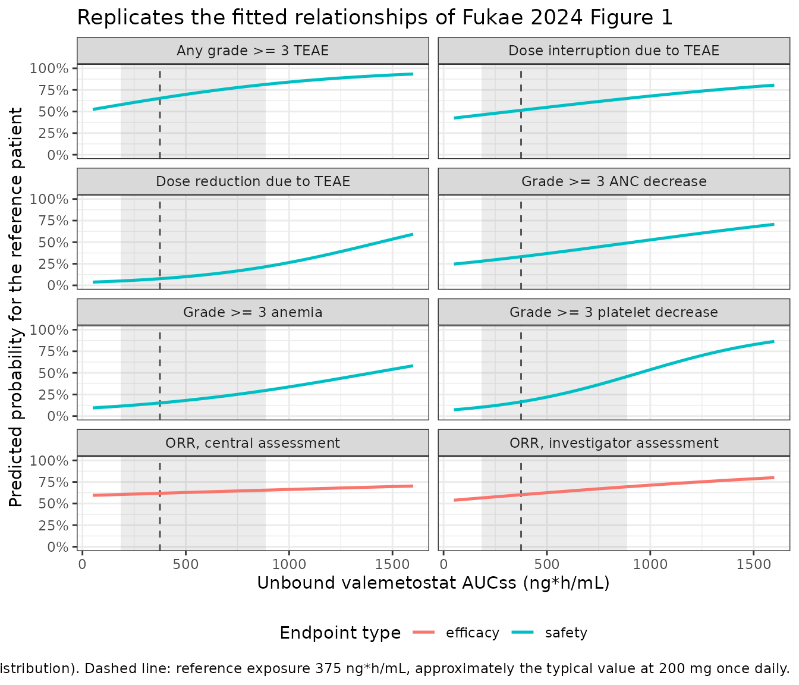

# Valemetostat exposure-response for efficacy and safety (Fukae 2024)

## Model and source

Fukae 2024 reports a Bayesian exposure-response (E-R) analysis
supporting the approved 200 mg once-daily dose of valemetostat, an oral
EZH1/EZH2 dual inhibitor, in adult T-cell leukemia/lymphoma (ATLL). The
analysis pools two Daiichi Sankyo trials – the first-in-human phase I
**J101** (Japan and the United States, 150-300 mg) and the phase II
**J201** (Japan, 200 mg, NCT04102150) – and fits **eight independent
binary logistic regressions**: two efficacy endpoints in the ATLL subset
and six safety endpoints in the whole relapsed/refractory non-Hodgkin
lymphoma (R/R NHL) cohort.

- Article: <https://doi.org/10.1002/psp4.13203> (PMC11494914)
- Companion population PK model (source of the exposure metric):
  <https://doi.org/10.1002/psp4.13201> (PMC11494923)

Two features make this analysis unusual and are the reason all eight
models are packaged rather than only the headline one.

**There is no PK layer.** Each model is a *static landmark* regression:
one binary outcome per patient, with exposure entering as a scalar
per-subject covariate. Individual unbound steady-state AUC comes from
the companion population PK publication, not from anything solved here.
Consequently these model files contain no `d/dt()`, no compartments and
no time dimension – `time` in the event tables below is used only as an
index to sweep exposure.

**All covariate effects are estimated simultaneously under
spike-and-slab regularization.** Rather than stepwise selection, Fukae
2024 places a normal mixture prior on every candidate covariate effect –
spike `Normal(0, 0.1)`, slab `Normal(0, 2.5)`, mixing weight
`Beta(1, 1)` – so negligible effects are shrunk toward zero while
substantial ones escape shrinkage. The intercept and the exposure slope
carry weakly informative unregularized priors. One further exception is
load-bearing: for the three laboratory-defined hematologic endpoints,
the **corresponding baseline laboratory value** (hemoglobin, ANC,
platelets) was given a slab-only prior with no spike, “given the
self-evident a priori relevance of these baseline values”. Those three
are accordingly the largest covariate effects in the paper.

``` r

endpoints <- tibble::tribble(
  ~model,                                       ~endpoint,                        ~set,
  "Fukae_2024_valemetostat_orr_central",        "ORR, central assessment",        "efficacy",
  "Fukae_2024_valemetostat_orr_investigator",   "ORR, investigator assessment",   "efficacy",
  "Fukae_2024_valemetostat_anemia",             "Grade >= 3 anemia",              "safety",
  "Fukae_2024_valemetostat_anc_decrease",       "Grade >= 3 ANC decrease",        "safety",
  "Fukae_2024_valemetostat_plt_decrease",       "Grade >= 3 platelet decrease",   "safety",
  "Fukae_2024_valemetostat_teae_grade3",        "Any grade >= 3 TEAE",            "safety",
  "Fukae_2024_valemetostat_dose_interruption",  "Dose interruption due to TEAE",  "safety",
  "Fukae_2024_valemetostat_dose_reduction",     "Dose reduction due to TEAE",     "safety"
) |>
  dplyr::mutate(output = paste0("prob_", sub("^Fukae_2024_valemetostat_", "", model)))

mods <- lapply(stats::setNames(endpoints$model, endpoints$model),
               function(m) rxode2::rxode2(readModelDb(m)))

endpoints |>
  dplyr::select(Endpoint = endpoint, `Analysis set` = set, `Model file` = model) |>
  knitr::kable(caption = "The eight models packaged from Fukae 2024.")
```

| Endpoint | Analysis set | Model file |
|:---|:---|:---|
| ORR, central assessment | efficacy | Fukae_2024_valemetostat_orr_central |
| ORR, investigator assessment | efficacy | Fukae_2024_valemetostat_orr_investigator |
| Grade \>= 3 anemia | safety | Fukae_2024_valemetostat_anemia |
| Grade \>= 3 ANC decrease | safety | Fukae_2024_valemetostat_anc_decrease |
| Grade \>= 3 platelet decrease | safety | Fukae_2024_valemetostat_plt_decrease |
| Any grade \>= 3 TEAE | safety | Fukae_2024_valemetostat_teae_grade3 |
| Dose interruption due to TEAE | safety | Fukae_2024_valemetostat_dose_interruption |
| Dose reduction due to TEAE | safety | Fukae_2024_valemetostat_dose_reduction |

The eight models packaged from Fukae 2024. {.table}

## Population

The two analysis sets differ and must not be conflated.

- **Exposure-efficacy** (Fukae 2024 Table 1, ATLL panel). Central
  assessment was performed only in J201, so that model was fit to 25
  patients; investigator assessment was available in both trials, giving
  38 evaluable patients of the 39-patient ATLL set. Median age 69.0
  years (37-84), median weight 61.5 kg (34.5-111), 48.7% female, 87.2%
  Asian. Observed ORR 48.0% by central assessment and 57.9% by
  investigator assessment.
- **Exposure-safety** (Table 1, R/R NHL panel). All 102 patients from
  both trials, 150-300 mg. Median age 69.0 years (37-88), median weight
  63.4 kg (34.5-114), 44.1% female; race Asian 72.5% / White 21.6% /
  Black 5.9%; region Japan 69.6% / United States 30.4%; 13.7% with mild
  hepatic impairment.

``` r

dplyr::bind_rows(
  tibble::as_tibble(readModelDb("Fukae_2024_valemetostat_orr_central")()$population[
    c("n_subjects", "sex_female_pct", "disease_state")]) |>
    dplyr::mutate(`Analysis set` = "Efficacy (ORR, central)", .before = 1),
  tibble::as_tibble(readModelDb("Fukae_2024_valemetostat_anemia")()$population[
    c("n_subjects", "sex_female_pct", "disease_state")]) |>
    dplyr::mutate(`Analysis set` = "Safety (all six endpoints)", .before = 1)
) |>
  dplyr::rename(N = n_subjects, `% female` = sex_female_pct, Population = disease_state) |>
  knitr::kable(caption = "Analysis sets, read from the packaged `population` metadata.")
```

| Analysis set | N | % female | Population |
|:---|---:|---:|:---|
| Efficacy (ORR, central) | 25 | 52.0 | relapsed or refractory adult T-cell leukemia/lymphoma (ATLL); responses per modified 2009 ATLL response criteria, ORR = complete response (including uncertified CR) or partial response |
| Safety (all six endpoints) | 102 | 44.1 | relapsed or refractory non-Hodgkin lymphomas, including adult T-cell leukemia/lymphoma and other peripheral T-cell lymphomas |

Analysis sets, read from the packaged `population` metadata. {.table}

## Source trace

Every value in every `ini()` block comes from one of the two parameter
tables. Both tables report **odds ratios**, not log-odds: the Table 3
footnote states the convention outright – “All estimates are expressed
as odds ratios, except the probability of a safety event for a reference
patient. Effects are described as exp(beta).” Each packaged `ini()`
value is therefore `log(printed odds ratio)`, written in
[`log()`](https://rdrr.io/r/base/Log.html) form so the published number
is readable at the trace site.

| Model element | Source location |
|----|----|
| Linear predictor `logit P(Y=1) = mu + bE*E + x'b1 + x'b2*E` | Methods, “Exposure-response models”, display equation |
| Centring / scaling convention (“approximate population median and standard deviation”) | Methods, same paragraph |
| Spike-and-slab prior specification (spike `N(0, 0.1)`, slab `N(0, 2.5)`, `Beta(1, 1)`) | Methods, prior paragraph |
| Slab-only (unregularized) prior on the corresponding baseline lab value | Methods, exposure-safety paragraph |
| Reference patient (65 y, Asian male, 63 kg, normal hepatic function, ECOG PS 0, LDH 250 U/L, unbound AUCss 375 ng\*h/mL) | Table 2 and Table 3 footnotes |
| Baseline lab reference values (Hb 115 g/L, ANC 3 x 10^9/L, PLT 200 x 10^9/L) | Results narrative (the table footnotes omit them) |
| Efficacy: intercept, exposure slope and all covariate effects, both models | Table 2 |
| Safety: intercept, exposure slope and all covariate effects, all six models | Table 3 |
| Cohort medians and standard deviations (corroborating the centring / scaling constants) | Table 1 |
| Observed exposure distribution, 5th-95th percentile 184-887 ng\*h/mL | Results, “Region of practical equivalence” |
| Software: CmdStanR 0.4.0, Hamiltonian Monte Carlo / no-U-turn sampler | Methods, “Software” |

### The centring and scaling constants are self-corroborating

Fukae 2024 says only that predictors were “centered and scaled at
approximate population median and standard deviation values”, without
printing the constants. They are nonetheless fully recoverable, and the
recovery is self-checking: the centring values are exactly the
reference-patient description, and the scaling values are exactly the
per-row increments the odds ratios are quoted per. Both then agree with
the Table 1 cohort summary, which is an *independent* part of the paper.

``` r

tibble::tribble(
  ~Predictor,               ~Centre, ~Scale, ~`Table 1 median`, ~`Table 1 SD`,
  "Unbound AUCss (ng*h/mL)",   375,    250,   NA_real_,           NA_real_,
  "Age (years)",                65,     10,   69.0,                9.50,
  "LDH (U/L)",                 250,    300,   244,                 315,
  "Weight (kg)",                63,     20,   63.4,                18.3,
  "Hemoglobin (g/L)",          115,     20,   116,                 19.5,
  "ANC (10^9/L)",                3,    2.5,   3.26,                2.53,
  "Platelets (10^9/L)",        200,    100,   194,                 111
) |>
  knitr::kable(
    caption = paste(
      "Centre = reference-patient value; Scale = the increment each odds ratio",
      "is quoted per. Both track the Table 1 safety-cohort median and standard",
      "deviation, confirming the Methods description. Unbound AUCss is not",
      "summarised in Table 1, so no cross-check is available for it."
    )
  )
```

| Predictor                | Centre | Scale | Table 1 median | Table 1 SD |
|:-------------------------|-------:|------:|---------------:|-----------:|
| Unbound AUCss (ng\*h/mL) |    375 | 250.0 |             NA |         NA |
| Age (years)              |     65 |  10.0 |          69.00 |       9.50 |
| LDH (U/L)                |    250 | 300.0 |         244.00 |     315.00 |
| Weight (kg)              |     63 |  20.0 |          63.40 |      18.30 |
| Hemoglobin (g/L)         |    115 |  20.0 |         116.00 |      19.50 |
| ANC (10^9/L)             |      3 |   2.5 |           3.26 |       2.53 |
| Platelets (10^9/L)       |    200 | 100.0 |         194.00 |     111.00 |

Centre = reference-patient value; Scale = the increment each odds ratio
is quoted per. Both track the Table 1 safety-cohort median and standard
deviation, confirming the Methods description. Unbound AUCss is not
summarised in Table 1, so no cross-check is available for it. {.table}

## Structural verification: the models reproduce the published tables exactly

Because these are static regressions with no ODE and no random effects,
the packaged encoding can be checked against the source *exactly* rather
than approximately. Two identities must hold for every model.

1.  Solved at the reference patient – every centred predictor zero,
    every binary indicator zero – the predicted probability must equal
    the published “Population mean” row.
2.  Moving one predictor by exactly one scaling unit must change the
    odds by exactly the published odds ratio for that row.

This is the right validation for this model class. There is no PK to
check with NCA: the exposure metric is an input, so a `PKNCA` round-trip
would only re-measure a number the user supplied. Instead the checks
below verify the whole published parameter set, coefficient by
coefficient.

``` r

ref_cov <- list(
  AUCU_VALE = 375, AGE = 65, LDH = 250, WT = 63, SEXF = 0, ECOG_GE1 = 0,
  HGB = 115, NEUT = 3, PLT = 200,
  HEPIMP_MILD = 0, RACE_WHITE = 0, RACE_BLACK = 0, REGION_USA = 0
)

# One-unit increments; binary indicators move 0 -> 1.
step_cov <- c(AGE = 10, LDH = 300, WT = 20, SEXF = 1, ECOG_GE1 = 1, HGB = 20,
              NEUT = 2.5, PLT = 100, HEPIMP_MILD = 1, RACE_WHITE = 1,
              RACE_BLACK = 1, REGION_USA = 1)

solve_prob <- function(model, output, overrides = list(), auc = 375) {
  ev <- data.frame(id = 1L, time = 0, amt = 0, evid = 0L)
  for (nm in names(ref_cov)) ev[[nm]] <- ref_cov[[nm]]
  for (nm in names(overrides)) ev[[nm]] <- overrides[[nm]]
  ev$AUCU_VALE <- auc
  as.data.frame(
    rxode2::rxSolve(model, events = ev, returnType = "data.frame")
  )[[output]][1]
}
odds <- function(p) p / (1 - p)
```

### Check 1 – reference-patient probability and exposure odds ratio

``` r

published_ref <- tibble::tribble(
  ~model,                                      ~p_pub,  ~or_pub,
  "Fukae_2024_valemetostat_orr_central",        0.619,    1.08,
  "Fukae_2024_valemetostat_orr_investigator",   0.602,    1.22,
  "Fukae_2024_valemetostat_anemia",             0.152,    1.52,
  "Fukae_2024_valemetostat_anc_decrease",       0.332,    1.38,
  "Fukae_2024_valemetostat_plt_decrease",       0.165,    2.03,
  "Fukae_2024_valemetostat_teae_grade3",        0.653,    1.51,
  "Fukae_2024_valemetostat_dose_interruption",  0.514,    1.32,
  "Fukae_2024_valemetostat_dose_reduction",     0.0774,   1.79
)

ref_check <- published_ref |>
  dplyr::left_join(endpoints, by = "model") |>
  dplyr::rowwise() |>
  dplyr::mutate(
    p_sim  = solve_prob(mods[[model]], output, auc = 375),
    or_sim = odds(solve_prob(mods[[model]], output, auc = 625)) / odds(p_sim)
  ) |>
  dplyr::ungroup()

stopifnot(
  # Exact reproduction, not a tolerance band: these are algebraic identities
  # between the published table and the encoded ini() values.
  max(abs(ref_check$p_sim  - ref_check$p_pub))  < 1e-12,
  max(abs(ref_check$or_sim - ref_check$or_pub)) < 1e-12
)

ref_check |>
  dplyr::transmute(
    Endpoint = endpoint,
    `P(event), published` = p_pub,
    `P(event), simulated` = round(p_sim, 6),
    `Exposure OR, published` = or_pub,
    `Exposure OR, simulated` = round(or_sim, 6)
  ) |>
  knitr::kable(
    caption = paste(
      "Reproduces the 'Population mean' row and the 'Unbound valemetostat",
      "AUCSS: 250 ng*h/mL increase' row of Fukae 2024 Tables 2 and 3."
    )
  )
```

| Endpoint | P(event), published | P(event), simulated | Exposure OR, published | Exposure OR, simulated |
|:---|---:|---:|---:|---:|
| ORR, central assessment | 0.6190 | 0.6190 | 1.08 | 1.08 |
| ORR, investigator assessment | 0.6020 | 0.6020 | 1.22 | 1.22 |
| Grade \>= 3 anemia | 0.1520 | 0.1520 | 1.52 | 1.52 |
| Grade \>= 3 ANC decrease | 0.3320 | 0.3320 | 1.38 | 1.38 |
| Grade \>= 3 platelet decrease | 0.1650 | 0.1650 | 2.03 | 2.03 |
| Any grade \>= 3 TEAE | 0.6530 | 0.6530 | 1.51 | 1.51 |
| Dose interruption due to TEAE | 0.5140 | 0.5140 | 1.32 | 1.32 |
| Dose reduction due to TEAE | 0.0774 | 0.0774 | 1.79 | 1.79 |

Reproduces the ‘Population mean’ row and the ’Unbound valemetostat
AUCSS: 250 ng\*h/mL increase’ row of Fukae 2024 Tables 2 and 3. {.table}

### Check 2 – every covariate odds ratio, on the intercept and on the slope

For a covariate `j`, moving it one scaling unit at the reference
exposure gives `exp(b1_j)` (the “Effect on intercept” row). Doing the
same at one exposure unit above reference and taking the ratio of the
two odds ratios gives `exp(b2_j)` (the “Effect on slope” row). The chunk
below sweeps every covariate in every model and compares both against
the published tables.

``` r

published_cov <- tibble::tribble(
  ~model_suffix,       ~cov,           ~int,   ~slp,
  "orr_central",       "AGE",          0.976,  1.05,
  "orr_central",       "LDH",          0.899,  1.00,
  "orr_central",       "WT",           1.17,   0.951,
  "orr_central",       "SEXF",         0.969,  0.991,
  "orr_central",       "ECOG_GE1",     0.378,  0.989,
  "orr_investigator",  "AGE",          1.01,   0.948,
  "orr_investigator",  "LDH",          0.992,  1.02,
  "orr_investigator",  "WT",           0.984,  0.995,
  "orr_investigator",  "SEXF",         1.02,   1.01,
  "orr_investigator",  "ECOG_GE1",     0.903,  0.998,
  "anemia",            "AGE",          0.986,  0.997,
  "anemia",            "LDH",          1.01,   1.04,
  "anemia",            "WT",           1.05,   1.00,
  "anemia",            "SEXF",         1.01,   1.07,
  "anemia",            "HGB",          0.417,  0.961,
  "anemia",            "HEPIMP_MILD",  1.07,   1.01,
  "anemia",            "RACE_WHITE",   1.04,   1.02,
  "anemia",            "RACE_BLACK",   0.954,  1.33,
  "anemia",            "REGION_USA",   1.09,   1.01,
  "anc_decrease",      "AGE",          1.03,   0.943,
  "anc_decrease",      "LDH",          1.02,   0.966,
  "anc_decrease",      "WT",           1.01,   1.01,
  "anc_decrease",      "SEXF",         1.02,   1.00,
  "anc_decrease",      "NEUT",         0.594,  0.961,
  "anc_decrease",      "HEPIMP_MILD",  0.963,  0.949,
  "anc_decrease",      "RACE_WHITE",   0.932,  1.32,
  "anc_decrease",      "RACE_BLACK",   1.39,   1.19,
  "anc_decrease",      "REGION_USA",   1.16,   1.09,
  "plt_decrease",      "AGE",          0.961,  0.983,
  "plt_decrease",      "LDH",          1.03,   1.02,
  "plt_decrease",      "WT",           0.994,  1.03,
  "plt_decrease",      "SEXF",         1.06,   1.03,
  "plt_decrease",      "PLT",          0.230,  1.14,
  "plt_decrease",      "HEPIMP_MILD",  1.12,   0.872,
  "plt_decrease",      "RACE_WHITE",   1.01,   0.992,
  "plt_decrease",      "RACE_BLACK",   0.945,  1.47,
  "plt_decrease",      "REGION_USA",   0.954,  1.21,
  "teae_grade3",       "AGE",          0.985,  1.03,
  "teae_grade3",       "LDH",          1.42,   1.02,
  "teae_grade3",       "WT",           1.00,   0.965,
  "teae_grade3",       "SEXF",         1.01,   1.07,
  "teae_grade3",       "HEPIMP_MILD",  1.06,   1.05,
  "teae_grade3",       "RACE_WHITE",   0.963,  1.02,
  "teae_grade3",       "RACE_BLACK",   1.17,   1.02,
  "teae_grade3",       "REGION_USA",   1.01,   1.02,
  "dose_interruption", "AGE",          0.967,  0.964,
  "dose_interruption", "LDH",          0.991,  0.972,
  "dose_interruption", "WT",           1.01,   1.03,
  "dose_interruption", "SEXF",         0.970,  1.09,
  "dose_interruption", "HEPIMP_MILD",  0.992,  0.907,
  "dose_interruption", "RACE_WHITE",   1.03,   1.20,
  "dose_interruption", "RACE_BLACK",   0.836,  1.76,
  "dose_interruption", "REGION_USA",   1.04,   1.21,
  "dose_reduction",    "AGE",          0.996,  1.02,
  "dose_reduction",    "LDH",          0.960,  0.986,
  "dose_reduction",    "WT",           0.978,  0.946,
  "dose_reduction",    "SEXF",         1.01,   1.04,
  "dose_reduction",    "HEPIMP_MILD",  1.09,   0.949,
  "dose_reduction",    "RACE_WHITE",   0.972,  0.957,
  "dose_reduction",    "RACE_BLACK",   0.887,  0.999,
  "dose_reduction",    "REGION_USA",   0.948,  0.982
)

cov_check <- published_cov |>
  dplyr::mutate(model = paste0("Fukae_2024_valemetostat_", model_suffix)) |>
  dplyr::left_join(endpoints, by = "model") |>
  dplyr::rowwise() |>
  dplyr::mutate(
    p00 = solve_prob(mods[[model]], output, auc = 375),
    p01 = solve_prob(mods[[model]], output, auc = 625),
    p10 = solve_prob(mods[[model]], output,
                     stats::setNames(list(ref_cov[[cov]] + step_cov[[cov]]), cov), 375),
    p11 = solve_prob(mods[[model]], output,
                     stats::setNames(list(ref_cov[[cov]] + step_cov[[cov]]), cov), 625),
    int_sim = odds(p10) / odds(p00),
    slp_sim = (odds(p11) / odds(p01)) / (odds(p10) / odds(p00))
  ) |>
  dplyr::ungroup()

worst_int <- max(abs(cov_check$int_sim - cov_check$int))
worst_slp <- max(abs(cov_check$slp_sim - cov_check$slp))

stopifnot(worst_int < 1e-12, worst_slp < 1e-12)
```

All 122 covariate odds ratios across the eight models reproduce their
published values; the largest absolute deviation is 8.88^{-16},
i.e. floating-point round-off. Together with Check 1 this audits **138**
published numbers, which is every estimate in Tables 2 and 3.

``` r

cov_check |>
  dplyr::mutate(dev = abs(log(int_sim) - log(int))) |>
  dplyr::arrange(dplyr::desc(abs(log(int)))) |>
  dplyr::slice_head(n = 8) |>
  dplyr::transmute(
    Endpoint = endpoint,
    Covariate = cov,
    `OR on intercept, published` = int,
    `OR on intercept, simulated` = round(int_sim, 6)
  ) |>
  knitr::kable(
    caption = paste(
      "The eight largest covariate effects in the paper. The three",
      "baseline-laboratory effects (PLT 0.230, hemoglobin 0.417, ANC 0.594)",
      "dominate, which is the direct consequence of their slab-only",
      "unregularized priors."
    )
  )
```

| Endpoint | Covariate | OR on intercept, published | OR on intercept, simulated |
|:---|:---|---:|---:|
| Grade \>= 3 platelet decrease | PLT | 0.230 | 0.230 |
| ORR, central assessment | ECOG_GE1 | 0.378 | 0.378 |
| Grade \>= 3 anemia | HGB | 0.417 | 0.417 |
| Grade \>= 3 ANC decrease | NEUT | 0.594 | 0.594 |
| Any grade \>= 3 TEAE | LDH | 1.420 | 1.420 |
| Grade \>= 3 ANC decrease | RACE_BLACK | 1.390 | 1.390 |
| Dose interruption due to TEAE | RACE_BLACK | 0.836 | 0.836 |
| ORR, central assessment | WT | 1.170 | 1.170 |

The eight largest covariate effects in the paper. The three
baseline-laboratory effects (PLT 0.230, hemoglobin 0.417, ANC 0.594)
dominate, which is the direct consequence of their slab-only
unregularized priors. {.table}

## Replicating the published exposure-response curves

Fukae 2024 Figure 1 plots each endpoint against unbound AUCss. The chunk
below reproduces the fitted relationships for the reference patient
across the observed exposure range, with the paper’s modified region of
practical equivalence (ROPE, 184-887 ng\*h/mL) shaded.

``` r

auc_grid <- seq(50, 1600, by = 10)

er_events <- endpoints |>
  dplyr::mutate(model_id = dplyr::row_number()) |>
  tidyr::expand_grid(AUCU_VALE = auc_grid) |>
  dplyr::mutate(id = 1L, time = AUCU_VALE, amt = 0, evid = 0L)
for (nm in setdiff(names(ref_cov), "AUCU_VALE")) er_events[[nm]] <- ref_cov[[nm]]

er_curves <- endpoints |>
  dplyr::rowwise() |>
  dplyr::group_map(function(row, ...) {
    ev <- er_events |> dplyr::filter(model == row$model) |> as.data.frame()
    s <- as.data.frame(rxode2::rxSolve(mods[[row$model]], events = ev,
                                       returnType = "data.frame"))
    tibble::tibble(endpoint = row$endpoint, set = row$set,
                   AUCU_VALE = s$AUCU_VALE, prob = s[[row$output]])
  }) |>
  dplyr::bind_rows()

ggplot(er_curves, aes(AUCU_VALE, prob, colour = set)) +
  annotate("rect", xmin = 184, xmax = 887, ymin = -Inf, ymax = Inf,
           alpha = 0.12, fill = "grey40") +
  geom_vline(xintercept = 375, linetype = "dashed", colour = "grey30") +
  geom_line(linewidth = 0.9) +
  facet_wrap(~endpoint, ncol = 2) +
  scale_y_continuous(limits = c(0, 1), labels = scales::percent) +
  labs(
    x = "Unbound valemetostat AUCss (ng*h/mL)",
    y = "Predicted probability for the reference patient",
    colour = "Endpoint type",
    title = "Replicates the fitted relationships of Fukae 2024 Figure 1",
    caption = paste(
      "Shaded band: modified ROPE 184-887 ng*h/mL (5th-95th percentile of the",
      "observed exposure distribution). Dashed line: reference exposure",
      "375 ng*h/mL, approximately the typical value at 200 mg once daily."
    )
  ) +
  theme_bw() +
  theme(legend.position = "bottom")
```



The qualitative claims of the paper’s Results and Discussion fall
directly out of these curves, and the chunk below asserts them rather
than leaving them to visual inspection: the exposure-efficacy
relationships are **shallow** while the exposure-safety relationships
are **steeper**, and the steepest of all is grade \>= 3 platelet
decrease.

``` r

slopes <- endpoints |>
  dplyr::rowwise() |>
  dplyr::mutate(
    or_per_250 = odds(solve_prob(mods[[model]], output, auc = 625)) /
                 odds(solve_prob(mods[[model]], output, auc = 375))
  ) |>
  dplyr::ungroup()

eff <- slopes |> dplyr::filter(set == "efficacy")
saf <- slopes |> dplyr::filter(set == "safety")

stopifnot(
  # "A slightly positive relationship was observed between unbound exposure and
  # efficacy endpoints. A steeper relationship was observed in safety
  # endpoints, compared with efficacy." (Abstract)
  all(eff$or_per_250 > 1), all(saf$or_per_250 > 1),
  max(eff$or_per_250) < min(saf$or_per_250),
  # "the highest increase of odds of TEAEs (103%)" for grade >= 3 PLT decrease.
  slopes$endpoint[which.max(slopes$or_per_250)] == "Grade >= 3 platelet decrease"
)

slopes |>
  dplyr::arrange(or_per_250) |>
  dplyr::transmute(
    Endpoint = endpoint, `Type` = set,
    `Odds ratio per 250 ng*h/mL` = round(or_per_250, 3),
    `Change in odds` = sprintf("%+.0f%%", 100 * (or_per_250 - 1))
  ) |>
  knitr::kable(
    caption = paste(
      "Every exposure effect is positive; all six safety slopes exceed both",
      "efficacy slopes, and grade >= 3 platelet decrease is steepest, exactly",
      "as reported in the Fukae 2024 Abstract and Discussion."
    )
  )
```

| Endpoint | Type | Odds ratio per 250 ng\*h/mL | Change in odds |
|:---|:---|---:|:---|
| ORR, central assessment | efficacy | 1.08 | +8% |
| ORR, investigator assessment | efficacy | 1.22 | +22% |
| Dose interruption due to TEAE | safety | 1.32 | +32% |
| Grade \>= 3 ANC decrease | safety | 1.38 | +38% |
| Any grade \>= 3 TEAE | safety | 1.51 | +51% |
| Grade \>= 3 anemia | safety | 1.52 | +52% |
| Dose reduction due to TEAE | safety | 1.79 | +79% |
| Grade \>= 3 platelet decrease | safety | 2.03 | +103% |

Every exposure effect is positive; all six safety slopes exceed both
efficacy slopes, and grade \>= 3 platelet decrease is steepest, exactly
as reported in the Fukae 2024 Abstract and Discussion. {.table}

## Subpopulation predictions (Figure 3 and Figure S7)

Fukae 2024 Figure 3 reports predicted ORR by subpopulation at 200 mg.
The packaged models reproduce the *direction and ordering* of those
subgroup contrasts. The comparison is deliberately made at the reference
exposure with one covariate varied at a time, which is the contrast the
model parameterizes; the paper’s own figure additionally integrates over
the covariate distribution observed within each subgroup and over the
posterior, so its point estimates are not expected to match exactly (see
Assumptions and deviations).

``` r

subpops <- tibble::tribble(
  ~subgroup,                ~cov,          ~value,
  "ECOG PS 0 (reference)",  "ECOG_GE1",    0,
  "ECOG PS 1+",             "ECOG_GE1",    1,
  "Male (reference)",       "SEXF",        0,
  "Female",                 "SEXF",        1,
  "Age 65 y (reference)",   "AGE",         65,
  "Age 75 y",               "AGE",         75,
  "Japan (reference)",      "REGION_USA",  0,
  "United States",          "REGION_USA",  1
)

subpop_pred <- subpops |>
  tidyr::expand_grid(dplyr::select(endpoints, model, endpoint, output)) |>
  dplyr::rowwise() |>
  dplyr::mutate(
    prob = solve_prob(mods[[model]], output,
                      stats::setNames(list(value), cov), auc = 375)
  ) |>
  dplyr::ungroup()

# ECOG PS 1+ lowers the odds of response on both efficacy models (Figure 3
# shows 0.37 vs 0.62 central and 0.55 vs 0.61 investigator).
ecog <- subpop_pred |>
  dplyr::filter(cov == "ECOG_GE1", grepl("ORR", endpoint, fixed = TRUE)) |>
  dplyr::select(endpoint, subgroup, prob) |>
  tidyr::pivot_wider(names_from = subgroup, values_from = prob)

stopifnot(nrow(ecog) == 2L, all(ecog$`ECOG PS 1+` < ecog$`ECOG PS 0 (reference)`))

subpop_pred |>
  dplyr::filter(model == "Fukae_2024_valemetostat_orr_central") |>
  dplyr::transmute(Subgroup = subgroup,
                   `Predicted ORR (central)` = round(prob, 3)) |>
  knitr::kable(
    caption = paste(
      "Single-covariate contrasts at the reference exposure for the",
      "central-assessment ORR model. The ECOG PS ordering reproduces the",
      "Fukae 2024 Figure 3 contrast (1+ well below 0)."
    )
  )
```

| Subgroup              | Predicted ORR (central) |
|:----------------------|------------------------:|
| ECOG PS 0 (reference) |                   0.619 |
| ECOG PS 1+            |                   0.380 |
| Male (reference)      |                   0.619 |
| Female                |                   0.612 |
| Age 65 y (reference)  |                   0.619 |
| Age 75 y              |                   0.613 |
| Japan (reference)     |                   0.619 |
| United States         |                   0.619 |

Single-covariate contrasts at the reference exposure for the
central-assessment ORR model. The ECOG PS ordering reproduces the Fukae
2024 Figure 3 contrast (1+ well below 0). {.table}

## Region of practical equivalence

The paper’s dose justification rests on a region of practical
equivalence. The Methods define its two limits with different criteria,
and the difference matters for what these packaged point-estimate models
can and cannot reproduce.

- **Lower limit (efficacy).** The lowest exposure `e` with
  `P(ORR | E = e, X) >= pi` for a proportion `p` of patients, with
  `pi = 30%` (the response rate assumed in the J201 sample-size
  calculation) and `p = 50%`. The paper states the reduction explicitly:
  this “is therefore equivalent to the exposure providing an expected
  ORR of 30% in a **typical patient**”. That is exactly a
  reference-patient calculation, so it is reproducible here.
- **Upper limit (safety).** The highest exposure `e` with
  `P_X(P(dose reduction | E = e, X) <= pi) >= p`, with `pi = 50%` and
  `p = 90%` – “90% of patients receiving an initial dose that is likely
  (probability \>50%) to be maintained”. This is a **population**
  criterion: it integrates over the covariate distribution `X` and the
  posterior, neither of which is packaged. The published value of 1255
  `ng*h/mL` is therefore **not** a typical-patient quantity and is not
  reproduced exactly below; what is checked instead is the direction it
  must lie in.

``` r

p_at <- function(model_suffix, auc) {
  row <- endpoints |> dplyr::filter(model == paste0("Fukae_2024_valemetostat_", model_suffix))
  solve_prob(mods[[row$model]], row$output, auc = auc)
}

# Typical-patient exposure at which P(dose reduction) crosses the pi = 50%
# acceptability threshold.
auc_red50 <- stats::uniroot(
  function(a) p_at("dose_reduction", a) - 0.50, interval = c(375, 5000)
)$root

orr_at_zero  <- p_at("orr_central", 0)
red_at_upper <- p_at("dose_reduction", 887)

stopifnot(
  # LOWER LIMIT. The typical patient's predicted ORR never falls to the 30%
  # threshold at any non-negative exposure, so the theoretical lower limit is
  # 0 -- exactly the published value ("a theoretical ROPE extending beyond the
  # observed exposure range, from 0 to 1255 ng*h/mL", Results).
  orr_at_zero > 0.30,
  # UPPER LIMIT. The published 1255 ng*h/mL is a 90%-of-patients criterion, so
  # it must be strictly MORE conservative than the typical-patient crossing:
  # the binding subject is a more susceptible one than the reference patient.
  p_at("dose_reduction", 1255) < 0.50,
  auc_red50 > 1255,
  # Across the whole modified ROPE the typical patient stays far below the
  # threshold, which is why the paper could truncate to the observed range
  # without giving up acceptable safety.
  red_at_upper < 0.50
)

tibble::tibble(
  Quantity = c(
    "Predicted ORR (central) at zero exposure",
    "Predicted ORR (central) at the reference exposure, 375 ng*h/mL",
    "P(dose reduction) at the modified-ROPE upper limit, 887 ng*h/mL",
    "P(dose reduction) at the published theoretical upper limit, 1255 ng*h/mL",
    "Typical-patient exposure at which P(dose reduction) reaches 50%"
  ),
  Value = c(
    sprintf("%.1f%%", 100 * orr_at_zero),
    sprintf("%.1f%%", 100 * p_at("orr_central", 375)),
    sprintf("%.1f%%", 100 * red_at_upper),
    sprintf("%.1f%%", 100 * p_at("dose_reduction", 1255)),
    sprintf("%.0f ng*h/mL", auc_red50)
  ),
  Criterion = c(
    "> 30% required; never breached, so the theoretical lower limit is 0",
    "-", "< 50% required", "< 50% required",
    "must exceed the published 1255 ng*h/mL population limit"
  )
) |>
  knitr::kable(
    caption = paste(
      "The typical-patient efficacy criterion reproduces the published",
      "theoretical ROPE lower limit of 0 exactly. The upper limit is a",
      "90%-of-patients criterion and so is bounded, not reproduced: the",
      "typical-patient 50% crossing lies above the published 1255 ng*h/mL,",
      "as a population criterion requires."
    )
  )
```

| Quantity | Value | Criterion |
|:---|:---|:---|
| Predicted ORR (central) at zero exposure | 59.1% | \> 30% required; never breached, so the theoretical lower limit is 0 |
| Predicted ORR (central) at the reference exposure, 375 ng\*h/mL | 61.9% | \- |
| P(dose reduction) at the modified-ROPE upper limit, 887 ng\*h/mL | 21.7% | \< 50% required |
| P(dose reduction) at the published theoretical upper limit, 1255 ng\*h/mL | 39.4% | \< 50% required |
| Typical-patient exposure at which P(dose reduction) reaches 50% | 1439 ng\*h/mL | must exceed the published 1255 ng\*h/mL population limit |

The typical-patient efficacy criterion reproduces the published
theoretical ROPE lower limit of 0 exactly. The upper limit is a
90%-of-patients criterion and so is bounded, not reproduced: the
typical-patient 50% crossing lies above the published 1255 ng\*h/mL, as
a population criterion requires. {.table}

## Assumptions and deviations

- **No NCA validation section.** The standard `PKNCA` cross-check does
  not apply to this paper: there is no PK model and no
  concentration-time profile anywhere in it. Exposure is a scalar
  per-subject input drawn from the companion population PK publication
  (<doi:10.1002/psp4.13201>). Running NCA here would only recover a
  number the user supplied. The structural identities in “Structural
  verification” above are the substantive check, and they are stronger
  than an NCA comparison would be – they audit every one of the 138
  published estimates exactly rather than comparing summary statistics.

- **Centring and scaling constants are inferred, not printed.** Fukae
  2024 states the convention (“approximate population median and
  standard deviation”) but never tabulates the constants. They are
  recovered from the reference-patient footnotes (centres) and the
  per-row increments the odds ratios are quoted per (scales), then
  corroborated against the Table 1 cohort medians and standard
  deviations, as shown above. The recovery is exact in the sense that it
  reproduces every published odds ratio, but a reader should know the
  constants are inferred rather than transcribed.

- **Baseline laboratory reference values come from the Results
  narrative.** The Table 3 footnote lists the reference patient’s age,
  weight, hepatic function, LDH and exposure but omits hemoglobin, ANC
  and platelets. Those three (115 g/L, 3 x 10^9/L, 200 x 10^9/L) are
  stated in the Results text for each corresponding endpoint and are
  used as the centring constants.

- **The Methods covariate list is narrower than Table 3.** For the
  exposure-safety analysis the Methods name only region, sex, race,
  hepatic impairment and NHL stage as categorical candidates plus the
  baseline laboratory values as continuous ones – yet Table 3
  additionally reports age, LDH and weight effects for all six safety
  models. The packaged models follow **Table 3**, per the standing
  convention that the printed parameter table outranks a narrative
  summary.

- **NHL disease stage is documented but not encoded.** Stage (I-III
  vs IV) is named in Methods as a candidate covariate for both the
  efficacy and safety analyses, but appears in neither Table 2 nor Table
  3, so no point estimate exists on disk. It is recorded in each model’s
  `covariatesDataExcluded` rather than guessed at. Stage was missing for
  23.5% of the safety cohort and 35.9% of the ATLL cohort, the likely
  reason it was dropped.

- **Placeholder residual error.** The source models use a Bernoulli
  likelihood and estimate no residual error and no between-subject
  random effect. rxode2 requires an observation declaration, so each
  model emits its deterministic probability with a `fixed(0.001)`
  additive residual, following the `Oniki_2018_nafld_risk.R` precedent.
  This does not perturb the predicted probability – the `prob_*` column
  read throughout this vignette is the individual prediction, not a
  residual-perturbed simulation. To sample binary outcomes, apply
  `rbinom(n, 1, prob_*)` to the `rxSolve()` output.

- **Uncertainty is not propagated.** Only the posterior medians are
  packaged. The published 95% credible intervals are wide – several
  exceed three orders of magnitude on the odds scale (the Black-race
  slope effects, where n = 6) – and every parameter’s interval is
  recorded in the source-trace comment beside its `ini()` value, but the
  packaged models are point-estimate models. Any use that needs
  uncertainty must return to the paper’s posterior.

- **The ROPE upper limit is bounded, not reproduced.** The published
  theoretical ROPE is 0 to 1255 ng*h/mL. The lower limit is a
  typical-patient criterion and is reproduced exactly above (the
  predicted ORR never falls to the 30% threshold, so the limit is 0).
  The upper limit is a* population\* criterion – the highest exposure at
  which 90% of patients still have below a 50% probability of dose
  reduction – and evaluating it requires the joint covariate
  distribution and the posterior, neither of which is packaged. The
  vignette therefore checks the inequality the criterion implies (the
  typical-patient 50% crossing must lie above 1255 ng\*h/mL) rather than
  asserting the published number.

- **Subpopulation predictions are single-covariate contrasts.** Figure 3
  and Figure S7 of the paper integrate over the covariate distribution
  observed within each subgroup and over 1000 posterior draws. The
  vignette instead varies one covariate at a time at the reference
  exposure, so the ordering and direction reproduce but the point
  estimates are not expected to match the figure exactly.

- **Three new canonical covariate columns.** `PLT` (platelet count,
  general scope), `AUCU_VALE` (unbound valemetostat steady-state AUC)
  and `REGION_USA` (United States enrollment indicator) were registered
  in `inst/references/covariate-columns.md` alongside this extraction.
  `REGION_USA` was registered rather than reusing `REGION_JAPAN` with
  inverted coefficients because Fukae 2024’s reference category *is*
  Japan, so every `ini()` value reads straight off the published table
  without sign inversion. Eight `prob_<endpoint>` PD-output names were
  registered in `inst/references/compartment-names.md`, following the
  family shape founded by `prob_roc` and extended by `prob_scc`.
