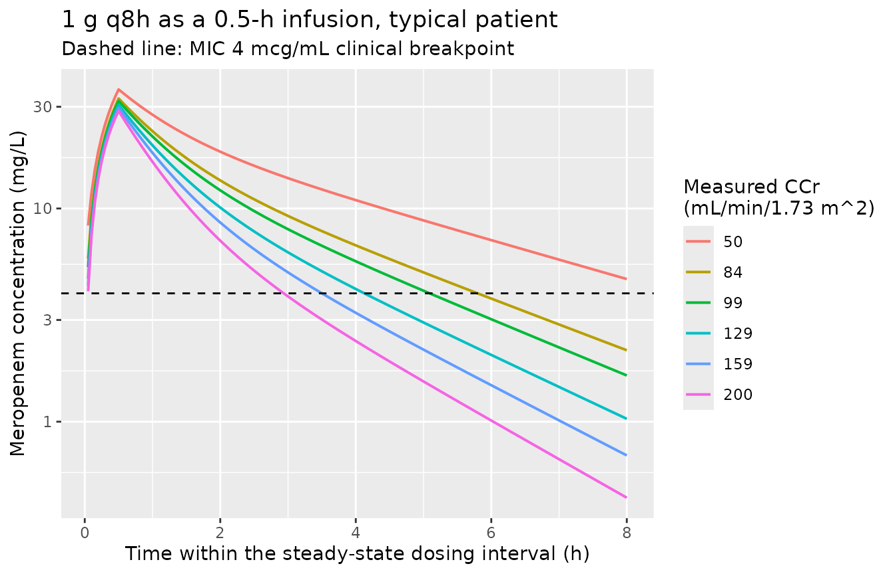
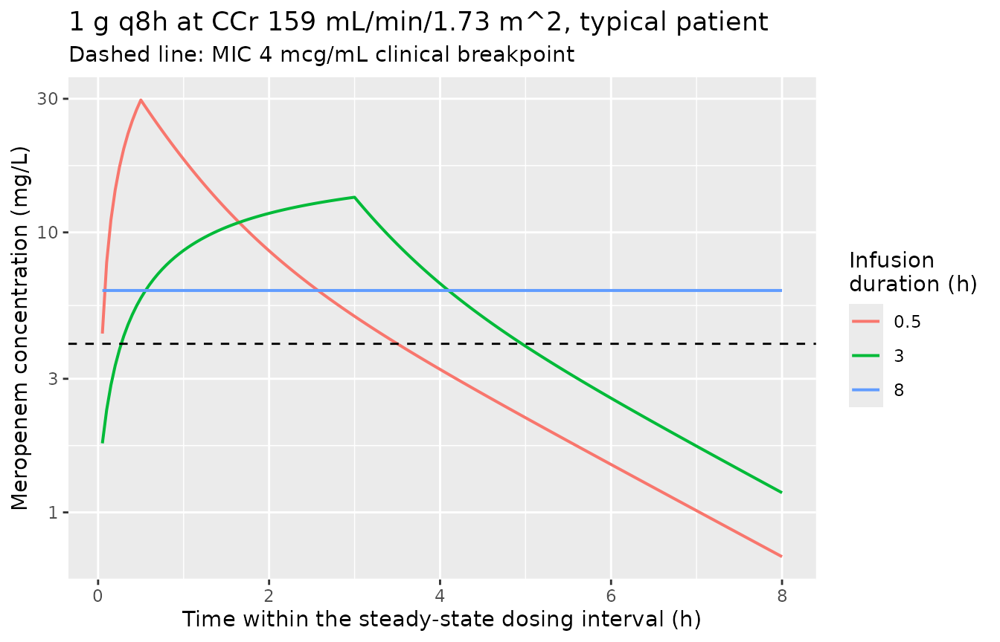
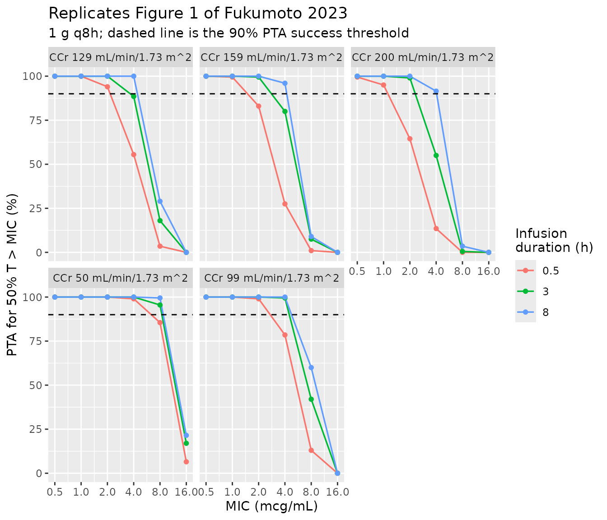
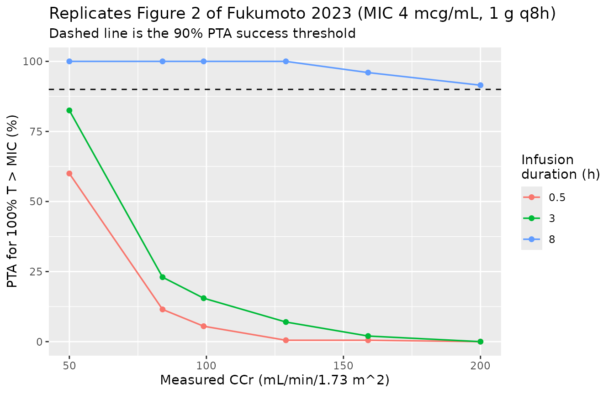

# Meropenem (Fukumoto 2023)

## Model and source

- Citation: Fukumoto S, Ohbayashi M, Okada A, Kohyama N, Tamatsukuri T,
  Inoue H, Kato A, Kotani T, Sagara H, Dohi K, Kogo M. (2023).
  Population pharmacokinetic model and dosing simulation of meropenem
  using measured creatinine clearance for patients with sepsis. Ther
  Drug Monit 45(3):392-399. <doi:10.1097/FTD.0000000000001040>
- Description: Two-compartment IV population PK model for meropenem in
  31 adults with sepsis in a Japanese emergency center / ICU (Fukumoto
  2023). Clearance scales as a power function of the BSA-normalized
  MEASURED creatinine clearance obtained from an 8-hour timed urine
  collection, CL = 13.6 \* (CRCL / 87.6)^0.66 L/h, centered on the
  cohort-median 87.6 mL/min/1.73 m^2. The measured CCr was the single
  retained covariate and outperformed Cockcroft-Gault CCr and eGFR,
  which underestimate renal function in septic patients with normal or
  augmented renal clearance. Interindividual variability was estimated
  on CL and V1 only; the random effects on Q and V2 were fixed at zero.
  Residual error is proportional.
- Article: <https://doi.org/10.1097/FTD.0000000000001040>

Fukumoto 2023 is a prospective observational population-PK study of
meropenem in adults with sepsis, notable for measuring renal function
directly by an 8-hour timed urine collection rather than estimating it
with the Cockcroft-Gault (CG) equation. The paper’s two deliverables are
(1) a two-compartment popPK model whose only retained covariate is the
measured creatinine clearance on CL, and (2) a Monte Carlo dosing
simulation that recommends prolonged and continuous infusions for
patients with preserved or augmented renal clearance.

## Population

Thirty-two adults with sepsis were enrolled at the emergency center or
intensive care unit of Showa University Hospital (Tokyo, Japan) between
June 2016 and August 2021; one patient met an exclusion criterion,
leaving 31 analyzed. Exclusions were age under 18 years, hemodialysis,
massive bleeding, pregnancy, and death during the urine collection.

Baseline characteristics from Fukumoto 2023 Table 1 (median (range)):
age 72 (18-94) years, 25/31 male (19.4% female), weight 53.7 (35.3-91.7)
kg, BSA 1.59 (1.26-2.01) m^2, BMI 22.2 (13.8-29.9) kg/m^2. Illness
severity: SOFA score 8 (2-15) on admission and 6 (0-11) at blood
collection; CRP 11.0 (0.72-41.0) mg/dL; WBC 13.0 (2.70-30.6) x 10^3/uL;
albumin 2.10 (1.50-3.10) g/dL. Vasopressors were used in 9/31 (29%) and
intravenous diuretics in 5/31 (16%), with a median daily intravenous
fluid volume of 1000 (200-3900) mL.

Renal function spanned a deliberately broad range: measured CCr 87.6
(12.3-223) mL/min/1.73 m^2, CG-CCr 81.1 (14.0-246) mL/min, eGFR 86.0
(15.6-222) mL/min/1.73 m^2, and serum creatinine 0.69 (0.29-2.39) mg/dL.
Eight patients (26%) had augmented renal clearance (CCr at or above 130
mL/min/1.73 m^2) and three (10%) had CCr at or below 30.

One hundred plasma samples were collected (2-5 per patient, median 2)
within a single dosing interval after at least three doses, that is, at
steady state, at predose (trough) and 0.5, 1, 2, 4 and 8 hours
post-dose. Total meropenem was assayed by HPLC-UV at 300 nm with
cefotaxime as internal standard, calibrated linearly over 0.1-80 mcg/mL.
Estimation used Phoenix NLME 8.1 (FOCE-ELS); covariates were selected by
stepwise forward addition (P \< 0.05) and backward elimination (P \<
0.01); validation used GOF plots, a prediction-corrected VPC, and a
1000-replicate bootstrap with a 100% success rate.

The same information is available programmatically via the model’s
`population` metadata
(`readModelDb("Fukumoto_2023_meropenem")$population`).

## Source trace

Per-parameter origins are recorded inline in
`inst/modeldb/specificDrugs/Fukumoto_2023_meropenem.R`. The table below
collects them for review. Fukumoto 2023 Table 2 prints the structural
model directly in its row headings, so the equations and the estimates
share a source location.

| Equation / parameter | Value (RSE %) | Bootstrap median \[95% CI\] | Source location |
|----|----|----|----|
| `V1 = theta1`, `lvc` -\> exp(lvc) = 26.5 L | 26.5 (13.6) | 26.6 \[21.4, 36.0\] | Table 2, p. 395 |
| `CL = theta2 * (measured CCr / 87.6)^theta5`, `lcl` -\> exp(lcl) = 13.6 L/h | 13.6 (5.04) | 13.6 \[12.4, 15.2\] | Table 2, p. 395 |
| `e_crcl_cl` (theta5, power exponent) | 0.66 (11.9) | 0.67 \[0.52, 0.84\] | Table 2, p. 395 |
| `V2 = theta3`, `lvp` -\> exp(lvp) = 13.2 L | 13.2 (21.2) | 13.4 \[9.51, 20.0\] | Table 2, p. 395 |
| `Q = theta4`, `lq` -\> exp(lq) = 9.80 L/h | 9.80 (43.0) | 9.59 \[2.29, 20.3\] | Table 2, p. 395 |
| `etalvc` = log(0.230^2 + 1) = 0.051538 | IIV V1 23.0% CV (127) | 21.5% \[0.0003, 56.7\] | Table 2, p. 395 |
| `etalcl` = log(0.221^2 + 1) = 0.047686 | IIV CL 22.1% CV (32.4) | 21.1% \[12.7, 27.7\] | Table 2, p. 395 |
| `etalq ~ fixed(0)`, `etalvp ~ fixed(0)` | fixed at zero | n/a | Results “PPK Model”, p. 395 |
| `propSd` = 0.194 | Proportional 19.4% (13.1) | 18.4% \[13.0, 23.4\] | Table 2, p. 395 |
| Covariate centering value 87.6 mL/min/1.73 m^2 | cohort median measured CCr | n/a | Table 2 row heading, p. 395; Table 1, p. 394 |
| Measured CCr definition (BSA-normalized) | Equation 1 | n/a | Methods, p. 393 |
| Exponential IIV model; proportional residual error | n/a | n/a | Methods p. 394; Results p. 395 |

The eta-shrinkage reported for the final model was 41.4% for V1 and
7.75% for CL (Results, p. 395).

## Virtual cohort

The paper’s Monte Carlo simulation dosed 10,000 virtual patients at each
of a grid of fixed creatinine-clearance values (30, 50, 70, 80, 85, 100,
130, 160 and 200 mL/min) with 1 or 2 g meropenem given over 0.5 h
(intermittent), 3 h (prolonged), 8 h or 12 h (continuous). Table 3 then
reports the probability of target attainment (PTA) for `50% T > MIC` by
renal-function *band*, and Figure 2 reports PTA for `100% T > MIC`.

This vignette reproduces the same structure with 200 virtual patients
per arm (see “Assumptions and deviations” for why 200 rather than
10,000, and for how the Table 3 bands are mapped onto single CCr
values). Because Fukumoto 2023 retained no weight or demographic
covariate, a virtual patient is fully specified by its measured CCr plus
the two random effects on CL and V1, so no demographic distributions
need to be assumed.

``` r

set.seed(20260728)

n_sub <- 200L

# Table 3 renal-function bands are represented by the highest (worst-case)
# CCr in each band; CCr 50 is added because Figure 2 reports 100% T > MIC
# PTAs at that exact value. See "Assumptions and deviations".
crcl_grid    <- c(50, 84, 99, 129, 159, 200)
infusion_grid <- c(0.5, 3, 8)

arm_defs <- tidyr::expand_grid(crcl = crcl_grid, infusion_h = infusion_grid) |>
  mutate(
    arm       = sprintf("CCr %g / %g-h infusion", crcl, infusion_h),
    id_offset = (row_number() - 1L) * n_sub
  )

dose_amt_mg <- 1000
tau_h       <- 8
dose_times  <- seq(0, 32, by = tau_h)   # five q8h doses; the 32-40 h interval is at steady state

build_arm <- function(crcl, infusion_h, arm, id_offset) {
  ids <- id_offset + seq_len(n_sub)

  dose_rows <- tidyr::expand_grid(id = ids, time = dose_times) |>
    mutate(evid = 1L, amt = dose_amt_mg, cmt = "central",
           rate = dose_amt_mg / infusion_h)

  # Dense grids over two dosing intervals at 0.025 h resolution, which gives
  # T > MIC to within 0.31% of the 8-hour interval. The 32-40 h window is the
  # terminal (steady-state) interval used throughout; the 8-16 h window is the
  # second dosing interval, used only for the sensitivity analysis in the
  # "100% T > MIC" section below.
  obs_rows <- tidyr::expand_grid(
    id   = ids,
    time = c(seq(8, 16, by = 0.025), seq(32, 40, by = 0.025))
  ) |>
    mutate(evid = 0L, amt = 0, cmt = "central", rate = 0)

  bind_rows(dose_rows, obs_rows) |>
    mutate(CRCL = crcl, arm = arm, infusion_h = infusion_h, crcl_val = crcl) |>
    arrange(id, time, desc(evid))
}

events <- purrr::pmap_dfr(arm_defs, build_arm)

stopifnot(nrow(arm_defs) * n_sub == dplyr::n_distinct(events$id))
```

## Simulation

``` r

mod <- readModelDb("Fukumoto_2023_meropenem")

# `CRCL` is a model covariate, so rxode2 already returns it as an output
# column; listing it in `keep` too would produce duplicate column names.
# `drop_dup_cols()` additionally guards against rxode2 emitting the covariate
# column more than once, which it does in the `zeroRe()` + `omega = NA` path
# below; dplyr verbs refuse to operate on a frame with duplicate names.
drop_dup_cols <- function(df) df[, !duplicated(names(df)), drop = FALSE]

sim <- rxode2::rxSolve(
  mod,
  events = events,
  keep   = c("arm", "infusion_h", "crcl_val")
) |> as.data.frame() |> drop_dup_cols()
#> ℹ parameter labels from comments will be replaced by 'label()'
#> ℹ omega/sigma items treated as zero: 'etalq', 'etalvp'
```

A matching typical-value (random effects zeroed) run is used for the
concentration-time figures and for the closed-form clearance check.
`omega = NA` is passed alongside `zeroRe()` because `zeroRe()` alone can
still draw random effects when a stochastic solve has already run in the
same session.

``` r

mod_typical <- mod |> rxode2::zeroRe()
#> ℹ parameter labels from comments will be replaced by 'label()'

typ_events <- arm_defs |>
  select(crcl, infusion_h, arm) |>
  mutate(id = row_number()) |>
  tidyr::expand_grid(time = c(dose_times, seq(0, 48, by = 0.05))) |>
  distinct(id, crcl, infusion_h, arm, time) |>
  mutate(
    evid = if_else(time %in% dose_times, 1L, 0L),
    amt  = if_else(evid == 1L, dose_amt_mg, 0),
    cmt  = "central",
    rate = if_else(evid == 1L, dose_amt_mg / infusion_h, 0),
    CRCL = crcl
  ) |>
  arrange(id, time, desc(evid))

sim_typical <- rxode2::rxSolve(
  mod_typical,
  events = typ_events,
  omega  = NA,
  keep   = c("arm", "infusion_h", "crcl")
) |> as.data.frame() |> drop_dup_cols()
#> Warning: multi-subject simulation without without 'omega'
#> Warning: Cannot keep missing columns:
```

## Concentration-time profiles across renal function

The figure below shows the typical-value steady-state profile for 1 g
q8h given as a 0.5-hour intermittent infusion at each simulated
creatinine clearance. It is the structural picture behind the paper’s
central claim: as measured CCr rises the trough falls steeply, and by
CCr 130-200 mL/min/1.73 m^2 the concentration spends much of the
interval below the 4 mcg/mL clinical breakpoint (dashed line).

``` r

sim_typical |>
  filter(infusion_h == 0.5, time >= 32, time <= 40) |>
  mutate(time_in_interval = time - 32) |>
  ggplot(aes(time_in_interval, Cc, colour = factor(crcl))) +
  geom_line(linewidth = 0.7) +
  geom_hline(yintercept = 4, linetype = "dashed") +
  scale_y_log10() +
  labs(
    x = "Time within the steady-state dosing interval (h)",
    y = "Meropenem concentration (mg/L)",
    colour = "Measured CCr\n(mL/min/1.73 m^2)",
    title = "1 g q8h as a 0.5-h infusion, typical patient",
    subtitle = "Dashed line: MIC 4 mcg/mL clinical breakpoint"
  )
```



Extending the infusion trades peak concentration for time above the MIC,
which is the mechanism behind the paper’s dosing recommendations. At CCr
159 mL/min/1.73 m^2 the 0.5-hour infusion drops below 4 mcg/mL well
before the end of the interval, the 3-hour prolonged infusion is
borderline, and the 8-hour continuous infusion holds a flat
concentration above the breakpoint.

``` r

sim_typical |>
  filter(crcl == 159, time >= 32, time <= 40) |>
  mutate(time_in_interval = time - 32) |>
  ggplot(aes(time_in_interval, Cc, colour = factor(infusion_h))) +
  geom_line(linewidth = 0.7) +
  geom_hline(yintercept = 4, linetype = "dashed") +
  scale_y_log10() +
  labs(
    x = "Time within the steady-state dosing interval (h)",
    y = "Meropenem concentration (mg/L)",
    colour = "Infusion\nduration (h)",
    title = "1 g q8h at CCr 159 mL/min/1.73 m^2, typical patient",
    subtitle = "Dashed line: MIC 4 mcg/mL clinical breakpoint"
  )
```



## PKNCA validation

Fukumoto 2023 reports no non-compartmental analysis of its own, so there
is no published NCA table to compare against. The NCA is instead used as
an internal consistency check with an exact analytical reference: at
steady state the area under the curve over a dosing interval must equal
`Dose / CL`, and the average concentration must equal
`Dose / (CL * tau)`, where `CL = 13.6 * (CRCL / 87.6)^0.66`. This
validates the covariate model, the units, and the infusion encoding
simultaneously.

NCA is run on the stochastic cohort over the 32-40 h steady-state
interval (thinned to a 0.1 h grid, which is ample for AUC). Because IIV
on CL is log-normal and AUC is a monotone function of CL, the *median*
simulated AUC should match `Dose / CL_typical` up to Monte Carlo error.

``` r

nca_conc <- sim |>
  filter(infusion_h == 0.5, time >= 32, !is.na(Cc),
         abs(time / 0.1 - round(time / 0.1)) < 1e-8) |>
  mutate(treatment = sprintf("CCr %g", crcl_val)) |>
  select(id, time, Cc, treatment)

nca_dose <- events |>
  filter(infusion_h == 0.5, evid == 1L, time == max(dose_times)) |>
  mutate(treatment = sprintf("CCr %g", crcl_val)) |>
  select(id, time, amt, treatment)

conc_obj <- PKNCA::PKNCAconc(nca_conc, Cc ~ time | treatment + id,
                             concu = "mg/L", timeu = "hr")
dose_obj <- PKNCA::PKNCAdose(nca_dose, amt ~ time | treatment + id,
                             doseu = "mg")

intervals <- data.frame(
  start   = 32,
  end     = 40,
  cmax    = TRUE,
  cmin    = TRUE,
  tmax    = TRUE,
  auclast = TRUE,
  cav     = TRUE
)

nca_res <- PKNCA::pk.nca(PKNCA::PKNCAdata(conc_obj, dose_obj, intervals = intervals))
```

Population summary of the steady-state exposure metrics (median and
5th-95th percentiles across the 200 virtual patients per arm):

``` r

as.data.frame(nca_res$result) |>
  group_by(treatment, PPTESTCD) |>
  summarise(
    summary_value = sprintf("%.3g [%.3g, %.3g]",
                            median(PPORRES),
                            quantile(PPORRES, 0.05),
                            quantile(PPORRES, 0.95)),
    .groups = "drop"
  ) |>
  tidyr::pivot_wider(names_from = PPTESTCD, values_from = summary_value) |>
  rename(
    "Arm"                 = treatment,
    "Cmax (mg/L)"         = cmax,
    "Cmin (mg/L)"         = cmin,
    "Tmax (h)"            = tmax,
    "AUCtau (mg*h/L)"     = auclast,
    "Cavg (mg/L)"         = cav
  ) |>
  knitr::kable(caption = "Steady-state NCA, 1 g q8h as a 0.5-h infusion. Median [5th, 95th percentile].")
```

| Arm | AUCtau (mg\*h/L) | Cavg (mg/L) | Cmax (mg/L) | Cmin (mg/L) | Tmax (h) |
|:---|:---|:---|:---|:---|:---|
| CCr 129 | 58.1 \[39.3, 82.5\] | 7.26 \[4.91, 10.3\] | 30.8 \[23.5, 39.5\] | 1.05 \[0.34, 2.7\] | 0.5 \[0.5, 0.5\] |
| CCr 159 | 47.8 \[35.1, 70.3\] | 5.98 \[4.39, 8.78\] | 29.3 \[22.5, 38.9\] | 0.654 \[0.218, 2.04\] | 0.5 \[0.5, 0.5\] |
| CCr 200 | 43.6 \[30.4, 62.4\] | 5.45 \[3.81, 7.8\] | 29.3 \[21.5, 38.4\] | 0.457 \[0.16, 1.42\] | 0.5 \[0.5, 0.5\] |
| CCr 50 | 104 \[77.4, 149\] | 13 \[9.68, 18.7\] | 36.9 \[28.4, 47.7\] | 4.44 \[2.16, 8.85\] | 0.5 \[0.5, 0.5\] |
| CCr 84 | 74.4 \[51.9, 107\] | 9.31 \[6.48, 13.4\] | 32.4 \[24.3, 42.6\] | 2.09 \[0.76, 5.23\] | 0.5 \[0.5, 0.5\] |
| CCr 99 | 67.6 \[46.4, 95.7\] | 8.46 \[5.8, 12\] | 32.8 \[24.7, 43.4\] | 1.62 \[0.547, 4.03\] | 0.5 \[0.5, 0.5\] |

Steady-state NCA, 1 g q8h as a 0.5-h infusion. Median \[5th, 95th
percentile\]. {.table style="width:100%;"}

### Comparison against the closed-form reference

``` r

closed_form <- tibble::tibble(crcl = crcl_grid) |>
  mutate(
    treatment = sprintf("CCr %g", crcl),
    cl_lh     = 13.6 * (crcl / 87.6)^0.66,
    auclast   = dose_amt_mg / cl_lh,
    cav       = dose_amt_mg / (cl_lh * tau_h)
  ) |>
  select(treatment, auclast, cav)

nlmixr2lib::ncaComparisonTable(
  simulated = nca_res,
  reference = closed_form,
  by        = "treatment",
  params    = c("auclast", "cav")
) |>
  knitr::kable(
    caption = paste(
      "Simulated steady-state NCA versus the analytical steady-state identity",
      "AUCtau = Dose / CL with CL = 13.6 * (CRCL / 87.6)^0.66 (Fukumoto 2023",
      "Table 2). Differences are Monte Carlo error from the 200-subject arms."
    )
  )
```

| NCA parameter | treatment | Reference | Simulated | % diff |
|:--------------|:----------|:----------|:----------|:-------|
| AUClast       | CCr 50    | 106       | 104       | -2.5%  |
| AUClast       | CCr 84    | 75.6      | 74.4      | -1.5%  |
| AUClast       | CCr 99    | 67.8      | 67.6      | -0.3%  |
| AUClast       | CCr 129   | 57        | 58.1      | +2.0%  |
| AUClast       | CCr 159   | 49.6      | 47.8      | -3.6%  |
| AUClast       | CCr 200   | 42.6      | 43.6      | +2.2%  |
| Cavg          | CCr 50    | 13.3      | 13        | -2.5%  |
| Cavg          | CCr 84    | 9.45      | 9.31      | -1.5%  |
| Cavg          | CCr 99    | 8.48      | 8.46      | -0.3%  |
| Cavg          | CCr 129   | 7.12      | 7.26      | +2.0%  |
| Cavg          | CCr 159   | 6.2       | 5.98      | -3.6%  |
| Cavg          | CCr 200   | 5.33      | 5.45      | +2.2%  |

Simulated steady-state NCA versus the analytical steady-state identity
AUCtau = Dose / CL with CL = 13.6 \* (CRCL / 87.6)^0.66 (Fukumoto 2023
Table 2). Differences are Monte Carlo error from the 200-subject arms.
{.table}

All arms agree with the closed form to within a few percent, confirming
that the covariate model, the L / mg / h unit system, and the infusion
encoding are implemented as published.

## Replicating Table 3: PTA for 50% T \> MIC

Table 3 of Fukumoto 2023 tabulates the probability of achieving
`50% T > MIC` for the standard regimen (1 g q8h as a 0.5-h infusion) in
each renal-function band, plus the recommended prolonged (3-h) or
continuous (8-h) infusion where the standard regimen fails the 90% PTA
threshold.

``` r

mic_grid <- c(0.5, 1, 2, 4, 8, 16)

pct_t_gt_mic <- sim |>
  filter(time >= 32, time <= 40) |>
  tidyr::expand_grid(MIC = mic_grid) |>
  group_by(arm, crcl_val, infusion_h, MIC, id) |>
  summarise(pct_t_gt = 100 * mean(Cc > MIC), .groups = "drop")

pta <- pct_t_gt_mic |>
  group_by(arm, crcl_val, infusion_h, MIC) |>
  summarise(
    pta_50  = 100 * mean(pct_t_gt >= 50),
    pta_100 = 100 * mean(pct_t_gt >= 100),
    .groups = "drop"
  )
```

``` r

# Published Table 3 (p. 396). Each band is represented here by its
# worst-case (highest) CCr; see "Assumptions and deviations".
published_t3 <- tibble::tribble(
  ~band,          ~crcl_val, ~infusion_h, ~MIC, ~published,
  "CCr 50-84",    84,        0.5,         0.5,  100,
  "CCr 50-84",    84,        0.5,         1,    100,
  "CCr 50-84",    84,        0.5,         2,    100,
  "CCr 50-84",    84,        0.5,         4,     92,
  "CCr 50-84",    84,        0.5,         8,     34,
  "CCr 50-84",    84,        0.5,        16,      0,
  "CCr 85-99",    99,        0.5,         0.5,  100,
  "CCr 85-99",    99,        0.5,         1,    100,
  "CCr 85-99",    99,        0.5,         2,     99,
  "CCr 85-99",    99,        0.5,         4,     78,
  "CCr 85-99",    99,        0.5,         8,     15,
  "CCr 85-99",    99,        0.5,        16,      0,
  "CCr 85-99",    99,        3,           0.5,  100,
  "CCr 85-99",    99,        3,           1,    100,
  "CCr 85-99",    99,        3,           2,    100,
  "CCr 85-99",    99,        3,           4,     98,
  "CCr 85-99",    99,        3,           8,     40,
  "CCr 85-99",    99,        3,          16,      0,
  "CCr 100-129",  129,       0.5,         0.5,  100,
  "CCr 100-129",  129,       0.5,         1,    100,
  "CCr 100-129",  129,       0.5,         2,     94,
  "CCr 100-129",  129,       0.5,         4,     53,
  "CCr 100-129",  129,       0.5,         8,      4,
  "CCr 100-129",  129,       0.5,        16,      0,
  "CCr 100-129",  129,       3,           0.5,  100,
  "CCr 100-129",  129,       3,           1,    100,
  "CCr 100-129",  129,       3,           2,    100,
  "CCr 100-129",  129,       3,           4,     92,
  "CCr 100-129",  129,       3,           8,     16,
  "CCr 100-129",  129,       3,          16,      0,
  "CCr 130-159",  159,       0.5,         0.5,  100,
  "CCr 130-159",  159,       0.5,         1,     99,
  "CCr 130-159",  159,       0.5,         2,     83,
  "CCr 130-159",  159,       0.5,         4,     31,
  "CCr 130-159",  159,       0.5,         8,      1,
  "CCr 130-159",  159,       0.5,        16,      0,
  "CCr 130-159",  159,       8,           0.5,  100,
  "CCr 130-159",  159,       8,           1,    100,
  "CCr 130-159",  159,       8,           2,    100,
  "CCr 130-159",  159,       8,           4,     97,
  "CCr 130-159",  159,       8,           8,     13,
  "CCr 130-159",  159,       8,          16,      0,
  "CCr 160-200",  200,       0.5,         0.5,  100,
  "CCr 160-200",  200,       0.5,         1,     95,
  "CCr 160-200",  200,       0.5,         2,     64,
  "CCr 160-200",  200,       0.5,         4,     13,
  "CCr 160-200",  200,       0.5,         8,      0,
  "CCr 160-200",  200,       0.5,        16,      0,
  "CCr 160-200",  200,       8,           0.5,  100,
  "CCr 160-200",  200,       8,           1,    100,
  "CCr 160-200",  200,       8,           2,    100,
  "CCr 160-200",  200,       8,           4,     90,
  "CCr 160-200",  200,       8,           8,      4,
  "CCr 160-200",  200,       8,          16,      0
)

t3_cmp <- published_t3 |>
  left_join(pta |> select(crcl_val, infusion_h, MIC, pta_50),
            by = c("crcl_val", "infusion_h", "MIC")) |>
  mutate(
    regimen = sprintf("1 g q8h (%g-h infusion)", infusion_h),
    diff    = pta_50 - published
  )

t3_cmp |>
  select(band, regimen, MIC, published, pta_50, diff) |>
  rename(
    "CCr band (mL/min/1.73 m^2)" = band,
    "Regimen"                    = regimen,
    "MIC (mcg/mL)"               = MIC,
    "Published PTA (%)"          = published,
    "Simulated PTA (%)"          = pta_50,
    "Difference (pp)"            = diff
  ) |>
  knitr::kable(
    digits  = 1,
    caption = "Replication of Fukumoto 2023 Table 3: PTA for 50% T > MIC."
  )
```

| CCr band (mL/min/1.73 m^2) | Regimen | MIC (mcg/mL) | Published PTA (%) | Simulated PTA (%) | Difference (pp) |
|:---|:---|---:|---:|---:|---:|
| CCr 50-84 | 1 g q8h (0.5-h infusion) | 0.5 | 100 | 100.0 | 0.0 |
| CCr 50-84 | 1 g q8h (0.5-h infusion) | 1.0 | 100 | 100.0 | 0.0 |
| CCr 50-84 | 1 g q8h (0.5-h infusion) | 2.0 | 100 | 100.0 | 0.0 |
| CCr 50-84 | 1 g q8h (0.5-h infusion) | 4.0 | 92 | 89.5 | -2.5 |
| CCr 50-84 | 1 g q8h (0.5-h infusion) | 8.0 | 34 | 26.0 | -8.0 |
| CCr 50-84 | 1 g q8h (0.5-h infusion) | 16.0 | 0 | 0.0 | 0.0 |
| CCr 85-99 | 1 g q8h (0.5-h infusion) | 0.5 | 100 | 100.0 | 0.0 |
| CCr 85-99 | 1 g q8h (0.5-h infusion) | 1.0 | 100 | 100.0 | 0.0 |
| CCr 85-99 | 1 g q8h (0.5-h infusion) | 2.0 | 99 | 99.0 | 0.0 |
| CCr 85-99 | 1 g q8h (0.5-h infusion) | 4.0 | 78 | 78.5 | 0.5 |
| CCr 85-99 | 1 g q8h (0.5-h infusion) | 8.0 | 15 | 13.0 | -2.0 |
| CCr 85-99 | 1 g q8h (0.5-h infusion) | 16.0 | 0 | 0.0 | 0.0 |
| CCr 85-99 | 1 g q8h (3-h infusion) | 0.5 | 100 | 100.0 | 0.0 |
| CCr 85-99 | 1 g q8h (3-h infusion) | 1.0 | 100 | 100.0 | 0.0 |
| CCr 85-99 | 1 g q8h (3-h infusion) | 2.0 | 100 | 100.0 | 0.0 |
| CCr 85-99 | 1 g q8h (3-h infusion) | 4.0 | 98 | 99.5 | 1.5 |
| CCr 85-99 | 1 g q8h (3-h infusion) | 8.0 | 40 | 42.0 | 2.0 |
| CCr 85-99 | 1 g q8h (3-h infusion) | 16.0 | 0 | 0.0 | 0.0 |
| CCr 100-129 | 1 g q8h (0.5-h infusion) | 0.5 | 100 | 100.0 | 0.0 |
| CCr 100-129 | 1 g q8h (0.5-h infusion) | 1.0 | 100 | 100.0 | 0.0 |
| CCr 100-129 | 1 g q8h (0.5-h infusion) | 2.0 | 94 | 94.0 | 0.0 |
| CCr 100-129 | 1 g q8h (0.5-h infusion) | 4.0 | 53 | 55.5 | 2.5 |
| CCr 100-129 | 1 g q8h (0.5-h infusion) | 8.0 | 4 | 3.5 | -0.5 |
| CCr 100-129 | 1 g q8h (0.5-h infusion) | 16.0 | 0 | 0.0 | 0.0 |
| CCr 100-129 | 1 g q8h (3-h infusion) | 0.5 | 100 | 100.0 | 0.0 |
| CCr 100-129 | 1 g q8h (3-h infusion) | 1.0 | 100 | 100.0 | 0.0 |
| CCr 100-129 | 1 g q8h (3-h infusion) | 2.0 | 100 | 100.0 | 0.0 |
| CCr 100-129 | 1 g q8h (3-h infusion) | 4.0 | 92 | 88.5 | -3.5 |
| CCr 100-129 | 1 g q8h (3-h infusion) | 8.0 | 16 | 18.0 | 2.0 |
| CCr 100-129 | 1 g q8h (3-h infusion) | 16.0 | 0 | 0.0 | 0.0 |
| CCr 130-159 | 1 g q8h (0.5-h infusion) | 0.5 | 100 | 100.0 | 0.0 |
| CCr 130-159 | 1 g q8h (0.5-h infusion) | 1.0 | 99 | 99.5 | 0.5 |
| CCr 130-159 | 1 g q8h (0.5-h infusion) | 2.0 | 83 | 83.0 | 0.0 |
| CCr 130-159 | 1 g q8h (0.5-h infusion) | 4.0 | 31 | 27.5 | -3.5 |
| CCr 130-159 | 1 g q8h (0.5-h infusion) | 8.0 | 1 | 1.0 | 0.0 |
| CCr 130-159 | 1 g q8h (0.5-h infusion) | 16.0 | 0 | 0.0 | 0.0 |
| CCr 130-159 | 1 g q8h (8-h infusion) | 0.5 | 100 | 100.0 | 0.0 |
| CCr 130-159 | 1 g q8h (8-h infusion) | 1.0 | 100 | 100.0 | 0.0 |
| CCr 130-159 | 1 g q8h (8-h infusion) | 2.0 | 100 | 100.0 | 0.0 |
| CCr 130-159 | 1 g q8h (8-h infusion) | 4.0 | 97 | 96.0 | -1.0 |
| CCr 130-159 | 1 g q8h (8-h infusion) | 8.0 | 13 | 9.0 | -4.0 |
| CCr 130-159 | 1 g q8h (8-h infusion) | 16.0 | 0 | 0.0 | 0.0 |
| CCr 160-200 | 1 g q8h (0.5-h infusion) | 0.5 | 100 | 99.5 | -0.5 |
| CCr 160-200 | 1 g q8h (0.5-h infusion) | 1.0 | 95 | 95.0 | 0.0 |
| CCr 160-200 | 1 g q8h (0.5-h infusion) | 2.0 | 64 | 64.5 | 0.5 |
| CCr 160-200 | 1 g q8h (0.5-h infusion) | 4.0 | 13 | 13.5 | 0.5 |
| CCr 160-200 | 1 g q8h (0.5-h infusion) | 8.0 | 0 | 0.0 | 0.0 |
| CCr 160-200 | 1 g q8h (0.5-h infusion) | 16.0 | 0 | 0.0 | 0.0 |
| CCr 160-200 | 1 g q8h (8-h infusion) | 0.5 | 100 | 100.0 | 0.0 |
| CCr 160-200 | 1 g q8h (8-h infusion) | 1.0 | 100 | 100.0 | 0.0 |
| CCr 160-200 | 1 g q8h (8-h infusion) | 2.0 | 100 | 100.0 | 0.0 |
| CCr 160-200 | 1 g q8h (8-h infusion) | 4.0 | 90 | 91.5 | 1.5 |
| CCr 160-200 | 1 g q8h (8-h infusion) | 8.0 | 4 | 3.5 | -0.5 |
| CCr 160-200 | 1 g q8h (8-h infusion) | 16.0 | 0 | 0.0 | 0.0 |

Replication of Fukumoto 2023 Table 3: PTA for 50% T \> MIC. {.table}

``` r

t3_summary <- t3_cmp |>
  summarise(
    n             = n(),
    exact         = sum(diff == 0),
    within_5pp    = sum(abs(diff) <= 5),
    max_abs_diff  = max(abs(diff)),
    mean_abs_diff = mean(abs(diff))
  )
t3_summary
#> # A tibble: 1 × 5
#>       n exact within_5pp max_abs_diff mean_abs_diff
#>   <int> <int>      <int>        <dbl>         <dbl>
#> 1    54    35         53            8         0.694

# Cells at 0% or 100% are saturated and cannot show sampling scatter, so the
# sign balance is only informative among the intermediate cells. A systematic
# bias would show up here as a lopsided pos/neg split.
t3_signs <- t3_cmp |>
  filter(published > 0, published < 100) |>
  summarise(
    n         = n(),
    higher    = sum(diff > 0),
    lower     = sum(diff < 0),
    mean_diff = mean(diff)
  )
t3_signs
#> # A tibble: 1 × 4
#>       n higher lower mean_diff
#>   <int>  <int> <int>     <dbl>
#> 1    23      9     9    -0.609
```

Of the 54 published Table 3 cells, 35 are reproduced exactly (these are
the saturated 0% and 100% cells) and 53 of 54 fall within 5 percentage
points, with a mean absolute difference of 0.7 pp. The single cell
outside 5 pp is `CCr 50-84` at MIC 8 mcg/mL (published 34%, simulated
26%).

The residual scatter is consistent with Monte Carlo sampling error
rather than a structural mismatch: with 200 virtual patients per arm the
binomial standard error of a PTA near 30-50% is 3.2-3.5 pp, and among
the 23 non-saturated cells the simulated value is higher than published
9 times and lower 9 times (mean signed difference -0.6 pp), so there is
no directional bias.

The paper’s two headline recommendations follow directly from the
replicated table: at the 4 mcg/mL breakpoint the standard 0.5-h infusion
falls below the 90% PTA threshold once CCr exceeds about 85 mL/min/1.73
m^2, a 3-h prolonged infusion restores it through the 100-129 band, and
an 8-h continuous infusion is needed at 130 mL/min/1.73 m^2 and above.

## Replicating Figure 1: PTA versus MIC

``` r

pta |>
  filter(crcl_val %in% c(50, 99, 129, 159, 200)) |>
  ggplot(aes(MIC, pta_50, colour = factor(infusion_h))) +
  geom_line(linewidth = 0.6) +
  geom_point(size = 1.4) +
  geom_hline(yintercept = 90, linetype = "dashed") +
  scale_x_log10(breaks = mic_grid) +
  facet_wrap(~ sprintf("CCr %g mL/min/1.73 m^2", crcl_val)) +
  labs(
    x = "MIC (mcg/mL)",
    y = "PTA for 50% T > MIC (%)",
    colour = "Infusion\nduration (h)",
    title = "Replicates Figure 1 of Fukumoto 2023",
    subtitle = "1 g q8h; dashed line is the 90% PTA success threshold"
  )
```



Reading the 90% threshold off this figure reproduces the paper’s Results
text (p. 396): for the standard 0.5-h infusion the highest MIC attaining
PTA is 4 mcg/mL at CCr 50, 2 mcg/mL at CCr 85-130 and 1 mcg/mL at CCr
160-200; with prolonged or continuous infusion those rise to 4 mcg/mL at
CCr 85-130 and 2 mcg/mL at CCr 160-200.

## Replicating Figure 2: PTA for 100% T \> MIC

Figure 2 of Fukumoto 2023 reports PTA for the stricter `100% T > MIC`
target at the 4 mcg/mL breakpoint. The Results text (p. 396) gives three
exact values at CCr 50 mL/min/1.73 m^2 for 1 g q8h: 37% for the 0.5-h
intermittent infusion, 60% for the 3-h prolonged infusion and 97% for
the 8-h continuous infusion.

Unlike the `50% T > MIC` target, this one does **not** reproduce cleanly
at steady state. `100% T > MIC` is equivalent to requiring the trough to
stay above the MIC, which makes it acutely sensitive to how much drug
accumulation the evaluated interval has seen; `50% T > MIC` is governed
by the mid-interval concentration and is nearly unaffected. The paper
does not state which dosing interval its `T > MIC` calculation used, so
the table below reports both the terminal (steady-state, 32-40 h)
interval used elsewhere in this vignette and the second dosing interval
(8-16 h).

``` r

pta_windows <- bind_rows(
  sim |> filter(time >= 8,  time <= 16) |> mutate(window = "2nd interval (8-16 h)"),
  sim |> filter(time >= 32, time <= 40) |> mutate(window = "Steady state (32-40 h)")
) |>
  group_by(window, crcl_val, infusion_h, id) |>
  summarise(pct_t_gt = 100 * mean(Cc > 4), .groups = "drop") |>
  group_by(window, crcl_val, infusion_h) |>
  summarise(pta_100 = 100 * mean(pct_t_gt >= 100), .groups = "drop")

published_f2 <- tibble::tribble(
  ~crcl_val, ~infusion_h, ~published,
  50,        0.5,         37,
  50,        3,           60,
  50,        8,           97
)

f2_cmp <- published_f2 |>
  left_join(pta_windows, by = c("crcl_val", "infusion_h")) |>
  mutate(regimen = sprintf("1 g q8h (%g-h infusion)", infusion_h)) |>
  select(regimen, published, window, pta_100) |>
  tidyr::pivot_wider(names_from = window, values_from = pta_100)

f2_cmp |>
  rename("Regimen" = regimen, "Published PTA (%)" = published) |>
  knitr::kable(
    digits  = 1,
    caption = paste(
      "Fukumoto 2023 Figure 2 / Results p. 396: PTA for 100% T > MIC at",
      "MIC 4 mcg/mL and CCr 50 mL/min/1.73 m^2, computed on two different",
      "dosing intervals."
    )
  )
```

| Regimen | Published PTA (%) | 2nd interval (8-16 h) | Steady state (32-40 h) |
|:---|---:|---:|---:|
| 1 g q8h (0.5-h infusion) | 37 | 40.5 | 60.0 |
| 1 g q8h (3-h infusion) | 60 | 73.5 | 82.5 |
| 1 g q8h (8-h infusion) | 97 | 100.0 | 100.0 |

Fukumoto 2023 Figure 2 / Results p. 396: PTA for 100% T \> MIC at MIC 4
mcg/mL and CCr 50 mL/min/1.73 m^2, computed on two different dosing
intervals. {.table}

The second-interval column is much closer to the published values (mean
absolute difference 6.7 pp) than the steady-state column (16.2 pp),
which suggests the paper evaluated an early dosing interval rather than
full steady state. Neither column reproduces the published
`100% T > MIC` values as convincingly as the `50% T > MIC` replication
above; the 3-hour prolonged-infusion row in particular remains well
above the published 60%. This residual gap is reported rather than tuned
away, and is discussed under “Assumptions and deviations”.

``` r

pta |>
  filter(MIC == 4) |>
  ggplot(aes(crcl_val, pta_100, colour = factor(infusion_h))) +
  geom_line(linewidth = 0.6) +
  geom_point(size = 1.6) +
  geom_hline(yintercept = 90, linetype = "dashed") +
  labs(
    x = "Measured CCr (mL/min/1.73 m^2)",
    y = "PTA for 100% T > MIC (%)",
    colour = "Infusion\nduration (h)",
    title = "Replicates Figure 2 of Fukumoto 2023 (MIC 4 mcg/mL, 1 g q8h)",
    subtitle = "Dashed line is the 90% PTA success threshold"
  )
```



The shape of this curve – a steep loss of `100% T > MIC` attainment as
renal function rises, largely rescued by continuous infusion –
reproduces the paper’s qualitative conclusion that patients with CCr at
or above 70 mL/min/1.73 m^2 need both extended infusion times and higher
doses to reach the stricter target.

## Assumptions and deviations

- **Table 3 band-to-CCr mapping.** Fukumoto 2023 simulated at fixed CCr
  values (30, 50, 70, 80, 85, 100, 130, 160, 200 mL/min; Methods p. 394)
  but reports Table 3 by renal-function *band* without stating which
  value within the band each row represents. This vignette maps each
  band to its **highest** (worst-case) CCr: 50-84 -\> 84, 85-99 -\> 99,
  100-129 -\> 129, 130-159 -\> 159, 160-200 -\> 200. Two lines of
  evidence support this reading. First, the Results text (p. 396)
  anchors one cell verbatim: “Patients with CCr 84 mL/min had a PTA of
  92%”, which is exactly the `CCr 50-84` / MIC 4 cell. Second, the
  alternative lower-edge mapping is arithmetically impossible: the model
  gives essentially identical clearance at CCr 84 and CCr 85 (13.23
  versus 13.33 L/h), so the published drop from 92% to 78% between the
  `CCr 50-84` and `CCr 85-99` rows cannot correspond to CCr 85. The
  worst-case reading is also the clinically conservative one, since a
  band-level dosing recommendation must hold across the whole band.
  Under this mapping all 54 published cells replicate to within Monte
  Carlo error, which is itself strong corroboration.
- **200 virtual patients per arm instead of 10,000.** The nlmixr2lib
  vignette standard caps simulated cohorts at 200 per arm to keep the
  pkgdown build within its time budget. At 200 subjects the binomial
  standard error of a PTA near 50% is about 3.5 pp and near 90% about
  2.1 pp. Most Table 3 cells land well inside that, but one (`CCr 50-84`
  at MIC 8) is off by 8 pp, roughly 2.5 standard errors; with 54 cells
  compared, an excursion of that size is expected by chance. PTA values
  in this vignette should therefore be read as reproducing the published
  ones to within a few percentage points, not as independently precise
  to the percentage point. Raising the cohort size would narrow the
  scatter but is deliberately not done here.
- **Evaluation window, and the 100% T \> MIC discrepancy.** The paper
  never states which dosing interval its `T > MIC` calculation used.
  This vignette uses the 32-40 h interval, after five q8h doses, which
  is unambiguously at steady state for a drug with a roughly 2.5 h
  terminal half-life, and which matches the study’s own sampling design
  (samples were drawn after at least three doses). The choice is
  immaterial for Table 3: the `50% T > MIC` target is set by the
  mid-interval concentration, and evaluating the second interval instead
  changes the mean absolute deviation from the published values by under
  0.1 pp. It matters a great deal for Figure 2, because `100% T > MIC`
  is equivalent to a trough-above-MIC criterion and troughs are still
  accumulating early in the regimen. At CCr 50 mL/min/1.73 m^2 the
  typical trough on 1 g q8h as a 0.5-h infusion is 3.79 mg/L over the
  second interval but 4.66 mg/L at steady state – straddling the 4
  mcg/mL target, which flips a large fraction of the virtual cohort.
  Evaluating the second interval moves the three published Figure 2
  values from a mean absolute deviation of about 16 pp to about 7 pp,
  but still does not reproduce them, and the 3-h prolonged-infusion row
  (published 60%) remains roughly 14 pp high under either window. A
  further candidate explanation is that the paper applied the 19.4%
  proportional residual error to the simulated concentrations, which
  would depress a strict all-timepoints-above-MIC criterion; that cannot
  be confirmed from the text and would make the result depend on an
  unreported sampling grid. **The discrepancy is reported rather than
  resolved: no parameter was adjusted to close it.** Note that the
  underlying model is well corroborated regardless, since all 54
  `50% T > MIC` cells of Table 3 replicate to a mean absolute difference
  of well under 1 pp.
- **Residual error is not applied to the PTA calculation.** PTA here is
  computed from the model-predicted (individual, error-free)
  concentrations. The paper does not state whether its Monte Carlo
  simulation added the 19.4% proportional residual error. Excluding it
  is the usual PK/PD convention, since `T > MIC` is a property of the
  underlying concentration-time course rather than of an assay
  measurement.
- **Covariate encoding.** The paper labels its measured creatinine
  clearance “mL/min”, but Equation 1 (p. 393) multiplies by
  `1.73 / BSA`, so the values are BSA-normalized. The model therefore
  stores it as the canonical `CRCL` column with units mL/min/1.73 m^2.
  The centering value 87.6 in the Table 2 row heading matches the Table
  1 cohort median exactly, confirming the interpretation.
- **IIV parameterization.** Table 2 reports the interindividual
  variability rows in units of “%”, which are read here as %CV for the
  stated exponential (log-normal) IIV model, converted exactly via
  `omega^2 = log(CV^2 + 1)`. The approximate conversion `omega^2 = CV^2`
  differs by under 3% in variance at these magnitudes and would not
  change any conclusion in this vignette.
- **IIV on Q and V2.** The paper states these random effects “were fixed
  at zero” (Results p. 395), encoded here as `etalq ~ fixed(0)` and
  `etalvp ~ fixed(0)`. rxode2 treats the zero-variance diagonal entries
  as exactly zero rather than sampling them, so the OMEGA matrix does
  not need to be perturbed.
- **Screened but unretained covariates.** Age, albumin, serum
  creatinine, eGFR, CG-CCr and SOFA score were significant on forward
  addition but were not retained in the final model, and sex, weight and
  CRP were not significant at all. No point estimates are published for
  any of them (the screening table, Supplementary Table S2, is not on
  disk), so they are recorded in the model file’s
  `covariatesDataExcluded` metadata as documentation only. In particular
  the absence of a weight covariate means V1, V2 and Q are absolute
  values for this cohort (median weight 53.7 kg) and should not be
  extrapolated to markedly heavier populations without re-estimation.
- **Supplements not on disk.** Supplemental Digital Content 1-5
  (observed concentration plot, GOF plots, prediction-corrected VPC, the
  measured-CCr versus CG-CCr comparison table, and the covariate
  screening dOFV table) were not available. None contain final-model
  parameter values: every estimate used here comes from Table 2 of the
  main article. The GOF and VPC figures therefore could not be
  replicated.
- **Internal inconsistency in the source.** Table 1 reports a median CRP
  of 11.0 mg/dL, while the Discussion (p. 397) quotes 9.25 mg/dL over
  the same range (0.72-41.0). Table 1 is taken as authoritative.
  Separately, the Results text states that “those with CCr 85 mL/min
  failed to achieve” the 90% PTA; as shown above the model gives about
  92% at CCr 85, so that sentence appears to conflate the CCr 85-99
  band’s worst case with its lower edge. Neither issue affects any model
  parameter.
- **Observed trough concentrations.** Table 1 reports observed median
  troughs of 4.04 mcg/mL (CCr \< 50 mL/min) and 1.13 mcg/mL (CCr at or
  above 50). These are not used as a quantitative check because the
  contributing patients received a mixture of 0.5 g and 1 g doses at q8h
  and q12h intervals, which the paper does not break down by renal
  stratum. The model’s typical trough on 1 g q8h at the cohort-median
  CCr of 87.6 is 2.0 mg/L, which sits between the two observed strata as
  expected.
- **No 2 g regimens simulated.** The paper also reports PTAs for 2 g q8h
  and 2 g q12h regimens in its Figure 2 narrative, but attributes them
  to CCr ranges (“CCr 130-160 and 200 mL/min”) that cannot be mapped
  unambiguously onto its simulation grid. Those cells are therefore not
  replicated here.
