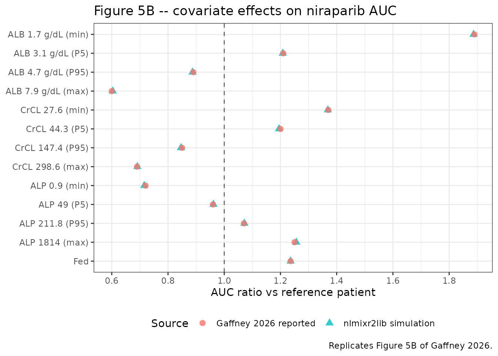
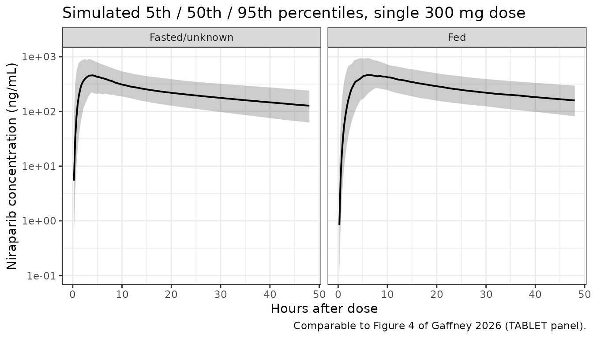

# Niraparib (Gaffney 2026)

## Model and source

    #> ℹ parameter labels from comments will be replaced by 'label()'

- Citation: Gaffney A, Franchetti Y, Desrosiers M, Trame MN, Jewell RC.
  Population Pharmacokinetic Modeling of Niraparib to Assess Different
  Absorption Models. J Clin Pharmacol. 2026;66(5):e70210.
  <doi:10.1002/jcph.70210>.

- Description: Three-compartment population PK model for oral niraparib
  with a three-transit-compartment absorption chain, fitted to pooled
  data from six studies in patients with advanced solid tumours or
  ovarian cancer. Baseline albumin, alkaline phosphatase and creatinine
  clearance act on apparent clearance; baseline albumin and body weight
  on apparent central volume; baseline albumin on the first apparent
  peripheral volume; and prandial state on relative bioavailability and
  mean transit time. This is the niraparib reference population PK
  model.

- Article: <https://doi.org/10.1002/jcph.70210>

Niraparib is an oral poly(ADP-ribose) polymerase (PARP) inhibitor
approved for maintenance treatment of advanced ovarian cancer. Gaffney
and colleagues updated an earlier niraparib population PK model by
adding intensively sampled phase 1 data from two studies (HEPATIC and
TABLET), and used those data to re-derive the absorption model. The
result – which the authors call the *niraparib reference population PK
model* – keeps the earlier three-compartment linear-elimination
disposition but replaces the earlier zero-order-release-plus-lag-time
absorption with a three-transit-compartment chain.

## Population

The analysis pooled six studies and 14,106 quantifiable plasma niraparib
concentrations from 1686 patients (Table 1):

| Study   | Phase | Cancer type                        | Patients | Observations |
|:--------|:------|:-----------------------------------|---------:|-------------:|
| PN001   | 1     | Advanced solid tumours             |      104 |         2096 |
| NOVA    | 3     | Recurrent ovarian cancer           |      405 |         2054 |
| QUADRA  | 2     | Advanced relapsed ovarian cancer   |      455 |         1410 |
| PRIMA   | 3     | First-line advanced ovarian cancer |      480 |         1856 |
| HEPATIC | 1     | Advanced solid tumours             |       17 |          203 |
| TABLET  | 1     | Advanced solid tumours             |      225 |         6487 |

Studies pooled into the niraparib reference model (Gaffney 2026 Table
1). {.table}

Most patients were female (1544, 91.6%) and White (1457, 86.4%); 1410
(83.6%) had ovarian cancer and 1459 (86.5%) had normal hepatic function.
HEPATIC and TABLET are the two studies added by this analysis: HEPATIC
enrolled 17 patients (8 with moderate hepatic impairment, 9 with normal
hepatic function) given a single 300 mg dose, and TABLET compared tablet
with capsule formulations and assessed a high-fat meal after a single
300 mg tablet dose. TABLET alone contributed 46% of the analysis
observations.

The same information is available programmatically from the model’s
`population` metadata:

``` r

str(ui$population, max.level = 1, give.attr = FALSE)
#> List of 11
#>  $ species         : chr "human"
#>  $ n_subjects      : num 1686
#>  $ n_studies       : num 6
#>  $ n_observations  : num 14106
#>  $ sex_female_pct  : num 91.6
#>  $ race_ethnicity  : Named num 86.4
#>  $ disease_state   : chr "Advanced solid tumours or haematologic malignancies (PN001), platinum-sensitive ovarian cancer (NOVA, PRIMA), r"| __truncated__
#>  $ dose_range      : chr "Oral niraparib. HEPATIC and TABLET each administered a single 300 mg dose; the remaining four studies were the "| __truncated__
#>  $ hepatic_function: chr "1459 of 1686 patients (86.5%) had normal hepatic function; 8 patients in the HEPATIC study had moderate hepatic impairment."
#>  $ renal_function  : chr "Baseline creatinine clearance 27.6 to 298.6 mL/min; 333 patients (19.7%) had moderate renal impairment (30 to 5"| __truncated__
#>  $ notes           : chr "Six pooled studies: PN001 (NCT00749502), NOVA (NCT01847274), QUADRA (NCT02354586), PRIMA (NCT02655016), HEPATIC"| __truncated__
```

## Source trace

Every `ini()` entry in
`inst/modeldb/specificDrugs/Gaffney_2026_niraparib.R` carries an in-file
comment naming its source location. They are collected here for review.

| Equation / parameter | Value | Source location |
|----|----|----|
| Structure: 3 transit compartments -\> central, 3-compartment disposition | n/a | Figure 3; Base Population PK Model |
| Continuous covariate form `P = theta_k * (X / M(X))^theta_j` | n/a | Covariate Analysis, page 4 |
| Categorical covariate form `P = theta_k * (1 + theta_j)^X` | n/a | Covariate Analysis, page 4 |
| `lcl` (CL/F) | 15.9 L/h | Table 3 |
| `lvc` (Vc/F) | 450 L | Table 3 |
| `lq` (Q1/F) | 43.8 L/h | Table 3 |
| `lvp` (Vp1/F) | 395 L | Table 3 |
| `lq2` (Q2/F) | 2.19 L/h | Table 3 |
| `lvp2` (Vp2/F) | 361 L | Table 3 |
| `lmtt` (MTT) | 1.78 h | Table 3 |
| `lfdepot` (F1) | 1, fixed | Table 3; Base Population PK Model |
| `e_alb_cl` | 0.742 | Table 3 (CL/F ~ ALBBL exponent) |
| `e_alp_cl` | -0.074 | Table 3 (CL/F ~ ALPBL exponent) |
| `e_crcl_cl` | 0.287 | Table 3 (CL/F ~ CrCLBL exponent) |
| `e_alb_vc` | 0.363 | Table 3 (Vc/F ~ ALBBL exponent) |
| `e_wt_vc` | 0.577 | Table 3 (Vc/F ~ WTBL exponent) |
| `e_alb_vp` | 1.02 | Table 3 (Vp1/F ~ ALBBL exponent) |
| `e_fed_fdepot` | 0.236 | Table 3 (F1 ~ fed fractional change) |
| `e_fed_mtt` | 1.15 | Table 3 (MTT ~ fed fractional change) |
| Covariate reference values ALB 4 g/dL, ALP 83 IU/L, CrCL 82.37 mL/min, WT 70 kg | n/a | Figure 5 legend; Results |
| `etalcl`, `etalvc`, `etalmtt`, `etalvp2`, `etalfdepot` | 24.0, 23.9, 56.1, 53.8, 33.8 %CV | Table 3 Random Effects |
| `expSd` and the five study-specific magnitudes | 0.227, 0.350, 0.381, 0.451, 0.324, 0.146 | Table 3 Residual Error |

Packaged `ini()` values, read back from the model object. {.table}

| Parameter | Estimate | Fixed | Label |
|:---|---:|:---|:---|
| lcl | 2.766320 | FALSE | Apparent clearance CL/F (L/h) |
| lvc | 6.109250 | FALSE | Apparent central volume of distribution Vc/F (L) |
| lq | 3.779630 | FALSE | Apparent first intercompartmental clearance Q1/F (L/h) |
| lvp | 5.978890 | FALSE | Apparent first peripheral volume of distribution Vp1/F (L) |
| lq2 | 0.783902 | FALSE | Apparent second intercompartmental clearance Q2/F (L/h) |
| lvp2 | 5.888880 | FALSE | Apparent second peripheral volume of distribution Vp2/F (L) |
| lmtt | 0.576613 | FALSE | Mean transit time MTT (h) |
| lfdepot | 0.000000 | TRUE | Relative bioavailability F1 (unitless) |
| e_alb_cl | 0.742000 | FALSE | Power exponent on (ALB / 40 g/L) for CL/F (unitless) |
| e_alp_cl | -0.074000 | FALSE | Power exponent on (ALP / 83 U/L) for CL/F (unitless) |
| e_crcl_cl | 0.287000 | FALSE | Power exponent on (CRCL / 82.37 mL/min) for CL/F (unitless) |
| e_alb_vc | 0.363000 | FALSE | Power exponent on (ALB / 40 g/L) for Vc/F (unitless) |
| e_wt_vc | 0.577000 | FALSE | Power exponent on (WT / 70 kg) for Vc/F (unitless) |
| e_alb_vp | 1.020000 | FALSE | Power exponent on (ALB / 40 g/L) for Vp1/F (unitless) |
| e_fed_fdepot | 0.236000 | FALSE | Fractional change in F1 when dosed fed (unitless) |
| e_fed_mtt | 1.150000 | FALSE | Fractional change in MTT when dosed fed (unitless) |
| expSd | 0.227000 | FALSE | Log-scale residual SD, PN001 (unitless) |
| expSdNova | 0.350000 | FALSE | Log-scale residual SD, NOVA (unitless) |
| expSdQuadra | 0.381000 | FALSE | Log-scale residual SD, QUADRA (unitless) |
| expSdPrima | 0.451000 | FALSE | Log-scale residual SD, PRIMA (unitless) |
| expSdTablet | 0.324000 | FALSE | Log-scale residual SD, TABLET (unitless) |
| expSdHepatic | 0.146000 | FALSE | Log-scale residual SD, HEPATIC (unitless) |

### Reading the absorption chain

Table 3 reports a mean transit time (MTT) but no absorption rate
constant, so the single rate constant the paper labels `Ka` has to be
derived from MTT. Figure 3 draws the final absorption model as

    Oral dose -> (Transit) -Ka-> (Transit) -Ka-> (Transit) -Ka-> Central

with no lag time, no zero-order release and no separate depot: exactly
**three** first-order steps carrying the dose from the dosing record to
the central compartment, all at the same rate. The arrival time in
`central` is therefore Erlang-distributed with shape 3 and rate `ktr`,
whose mean – the mean transit time – is `3 / ktr`. The model encodes
`ktr <- 3 / mtt`, i.e. 1.685 1/h at the typical MTT of 1.78 h. See
*Assumptions and deviations* for the alternative reading that was
considered and rejected.

In the packaged file the three boxes are written as `depot`, `transit1`
and `transit2`, so the dose lands in the canonical extravascular dosing
compartment; the three `ktr` arrows are `depot -> transit1`,
`transit1 -> transit2` and `transit2 -> central`, matching Figure 3
arrow for arrow. This is the same depot-plus-(n-1)-transit idiom used by
`Comisar_2025_rimegepant`.

## Typical-value scenarios

The strongest validation available for this paper is a set of published
steady-state exposure ratios. In the Results the authors report, for
each covariate, the AUC ratio relative to a reference patient (ALB 4
g/dL, ALP 83 IU/L, CrCL 82.37 mL/min, WT 70 kg, fasted/unknown) at the
observed minimum, 5th percentile, 95th percentile and maximum covariate
values. Because AUC after an oral dose is `F1 * Dose / (CL/F)` and none
of these covariates acts on both F1 and CL/F, each published ratio is a
direct, deterministic test of one covariate coefficient *and* its
reference value.

``` r

mod <- readModelDb("Gaffney_2026_niraparib")

ref_cov <- list(
  ALB = 40, ALP = 83, CRCL = 82.37, WT = 70, FED = 0,
  STUDY_NOVA = 0, STUDY_QUADRA = 0, STUDY_PRIMA = 0,
  STUDY_TABLET = 0, STUDY_HEPATIC = 0
)

scen <- tibble::as_tibble(ref_cov) |> dplyr::mutate(scenario = "Reference")
vary <- function(label, column, value) {
  out <- scen[1, ]
  out$scenario <- label
  out[[column]] <- value
  out
}

scen <- dplyr::bind_rows(
  scen,
  # ALB is held in the canonical SI unit g/L; the paper's g/dL values are x10.
  vary("ALB 1.7 g/dL (min)",  "ALB",  17),
  vary("ALB 3.1 g/dL (P5)",   "ALB",  31),
  vary("ALB 4.7 g/dL (P95)",  "ALB",  47),
  vary("ALB 7.9 g/dL (max)",  "ALB",  79),
  vary("CrCL 27.6 (min)",     "CRCL", 27.6),
  vary("CrCL 44.3 (P5)",      "CRCL", 44.3),
  vary("CrCL 147.4 (P95)",    "CRCL", 147.4),
  vary("CrCL 298.6 (max)",    "CRCL", 298.6),
  vary("ALP 0.9 (min)",       "ALP",  0.9),
  vary("ALP 49 (P5)",         "ALP",  49),
  vary("ALP 211.8 (P95)",     "ALP",  211.8),
  vary("ALP 1814 (max)",      "ALP",  1814),
  vary("Fed",                 "FED",  1)
) |>
  dplyr::mutate(id = dplyr::row_number())

# The terminal disposition half-life is ~136 h, so the observation window runs
# to 1000 h (about 7 terminal half-lives) to keep the AUC extrapolation small.
scen_times <- sort(unique(c(
  seq(0, 24, by = 0.05), seq(24, 96, by = 0.5), seq(96, 1000, by = 4)
)))

expand_events <- function(subjects, times, dose = 300) {
  subjects |>
    dplyr::group_split(id) |>
    lapply(function(s) {
      n <- length(times)
      dplyr::bind_cols(
        s[rep(1L, n + 1L), setdiff(names(s), c("time", "amt", "evid", "cmt"))],
        tibble::tibble(
          time = c(0, times),
          amt  = c(dose, rep(NA_real_, n)),
          evid = c(1L, rep(0L, n)),
          # Observations are placed on the ODE state `central`; rxode2 returns
          # the algebraic observable Cc as a column at those rows.
          cmt  = c("depot", rep("central", n))
        )
      )
    }) |>
    dplyr::bind_rows() |>
    as.data.frame()
}

scen_events <- expand_events(scen, scen_times)
stopifnot(!anyDuplicated(unique(scen_events[, c("id", "time", "evid")])))
```

``` r

# zeroRe() gives the typical-value prediction the published ratios describe.
scen_sim <- rxode2::rxSolve(
  rxode2::zeroRe(mod), events = scen_events,
  keep = "scenario", omega = NA
) |>
  as.data.frame()
#> ℹ parameter labels from comments will be replaced by 'label()'
#> Warning: No sigma parameters in the model
#> Warning: multi-subject simulation without without 'omega'

# A transit chain that silently solves to zero is a known rxode2 failure mode;
# this assertion is the cheap standing guard against it.
stopifnot(max(scen_sim$Cc, na.rm = TRUE) > 1, all(scen_sim$Cc >= 0, na.rm = TRUE))
```

Two structural identities can be checked before any NCA is run. The
paper’s Discussion states that the total apparent volume of distribution
(Vc/F + Vp1/F + Vp2/F) is 1206 L, and the derived transit rate constant
must follow from the reported MTT:

``` r

tv <- scen_sim |> dplyr::filter(scenario == "Reference") |> dplyr::slice(1)
v_total <- tv$vc + tv$vp + tv$vp2

structural <- tibble::tibble(
  Quantity = c("Total apparent volume Vc/F + Vp1/F + Vp2/F (L)",
               "Transit rate constant ktr = 3 / MTT (1/h)",
               "Relative bioavailability F1 (unitless)"),
  Model     = c(v_total, tv$ktr, tv$fdepot),
  Published = c(1206, 3 / 1.78, 1)
)
knitr::kable(structural, digits = 4,
             caption = "Structural identities against Gaffney 2026 (Discussion; Table 3).")
```

| Quantity                                       |     Model | Published |
|:-----------------------------------------------|----------:|----------:|
| Total apparent volume Vc/F + Vp1/F + Vp2/F (L) | 1206.0000 | 1206.0000 |
| Transit rate constant ktr = 3 / MTT (1/h)      |    1.6854 |    1.6854 |
| Relative bioavailability F1 (unitless)         |    1.0000 |    1.0000 |

Structural identities against Gaffney 2026 (Discussion; Table 3).
{.table}

``` r


# Deterministic quantities -- exact agreement is the correct expectation.
stopifnot(
  abs(v_total - 1206) < 1e-6,
  abs(tv$ktr - 3 / 1.78) < 1e-9,
  abs(tv$fdepot - 1) < 1e-9
)
```

## PKNCA validation

``` r

scen_conc <- scen_sim |>
  dplyr::filter(!is.na(Cc)) |>
  dplyr::select(id, time, Cc, scenario)

# Guarantee a time-zero record per subject; pre-dose Cc is 0 for an oral dose.
scen_conc <- dplyr::bind_rows(
  scen_conc,
  scen_conc |> dplyr::distinct(id, scenario) |> dplyr::mutate(time = 0, Cc = 0)
) |>
  dplyr::distinct(id, scenario, time, .keep_all = TRUE) |>
  dplyr::arrange(id, time)

scen_dose <- scen_events |>
  dplyr::filter(evid == 1) |>
  dplyr::select(id, time, amt, scenario)

scen_intervals <- data.frame(
  start = 0, end = Inf,
  cmax = TRUE, tmax = TRUE, auclast = TRUE,
  aucinf.obs = TRUE, aucpext.obs = TRUE, half.life = TRUE
)

scen_nca <- PKNCA::pk.nca(PKNCA::PKNCAdata(
  PKNCA::PKNCAconc(scen_conc, Cc ~ time | scenario + id),
  PKNCA::PKNCAdose(scen_dose, amt ~ time | scenario + id),
  intervals = scen_intervals
))

scen_res <- as.data.frame(scen_nca$result) |>
  dplyr::select(scenario, PPTESTCD, PPORRES) |>
  tidyr::pivot_wider(names_from = PPTESTCD, values_from = PPORRES)
```

### AUC(0-inf) reproduces `F1 * Dose / (CL/F)`

For a linear model with complete absorption the extrapolated AUC must
equal `F1 * Dose / (CL/F)` exactly. This is the strongest single test
that the transit chain, the three-compartment disposition and the
bioavailability term are all wired together correctly, because any
mis-wiring loses or duplicates dose.

``` r

auc_check <- scen_res |>
  dplyr::select(scenario, aucinf.obs, aucpext.obs) |>
  dplyr::left_join(
    scen_sim |> dplyr::distinct(scenario, .keep_all = TRUE) |>
      dplyr::transmute(scenario, cl, fdepot),
    by = "scenario"
  ) |>
  # `central` is mg and `vc` is L, so Cc is scaled by 1000 to ng/mL; the
  # analytic AUC needs the same factor.
  dplyr::mutate(
    analytic = fdepot * 300 / cl * 1000,
    pct_diff = 100 * (aucinf.obs - analytic) / analytic
  )

auc_check |>
  dplyr::transmute(
    Scenario = scenario,
    `AUC0-inf, NCA` = signif(aucinf.obs, 6),
    `F1 * Dose / CL` = signif(analytic, 6),
    `Difference (%)` = signif(pct_diff, 3),
    `Extrapolated (%)` = signif(aucpext.obs, 3)
  ) |>
  knitr::kable(caption = "NCA AUC(0-inf) against the closed-form oral AUC.")
```

| Scenario | AUC0-inf, NCA | F1 \* Dose / CL | Difference (%) | Extrapolated (%) |
|:---|---:|---:|---:|---:|
| ALB 1.7 g/dL (min) | 35600.4 | 35600.8 | -1.07e-03 | 0.3670 |
| ALB 3.1 g/dL (P5) | 22796.2 | 22796.2 | -9.83e-05 | 0.1710 |
| ALB 4.7 g/dL (P95) | 16740.0 | 16740.0 | 1.61e-04 | 0.1070 |
| ALB 7.9 g/dL (max) | 11387.1 | 11387.1 | 8.54e-05 | 0.0634 |
| ALP 0.9 (min) | 13499.9 | 13499.8 | 9.66e-04 | 0.0621 |
| ALP 1814 (max) | 23705.3 | 23705.6 | -1.38e-03 | 0.2220 |
| ALP 211.8 (P95) | 20222.3 | 20222.3 | -2.32e-04 | 0.1500 |
| ALP 49 (P5) | 18146.3 | 18146.2 | 2.97e-04 | 0.1170 |
| CrCL 147.4 (P95) | 15965.9 | 15965.8 | 6.67e-04 | 0.0878 |
| CrCL 27.6 (min) | 25822.5 | 25823.1 | -2.31e-03 | 0.2770 |
| CrCL 298.6 (max) | 13037.8 | 13037.6 | 9.95e-04 | 0.0580 |
| CrCL 44.3 (P5) | 22543.8 | 22544.1 | -9.06e-04 | 0.1960 |
| Fed | 23320.8 | 23320.8 | 1.49e-04 | 0.1290 |
| Reference | 18867.9 | 18867.9 | 1.33e-04 | 0.1270 |

NCA AUC(0-inf) against the closed-form oral AUC. {.table}

``` r


# Deterministic: this is pure numerical error, so a tight bound is correct.
stopifnot(max(abs(auc_check$pct_diff)) < 0.05)
```

### Published exposure ratios (Figure 5B)

The AUC ratios below are transcribed from the Results text accompanying
Figure 5B. They are the paper’s own translation of the covariate
coefficients into exposure, so reproducing all thirteen of them checks
every covariate coefficient, every reference value, and the fed
fractional change on F1 at once.

``` r

published_ratios <- tibble::tribble(
  ~scenario,             ~published, ~source,
  "ALB 1.7 g/dL (min)",  1.89,  "Results: 1.89-fold (90% CI 1.65-2.13)",
  "ALB 3.1 g/dL (P5)",   1.21,  "Results: 1.21 (90% CI 1.16-1.25)",
  "ALB 4.7 g/dL (P95)",  0.89,  "Results: 0.89 (90% CI 0.87-0.91)",
  "ALB 7.9 g/dL (max)",  0.60,  "Results: 0.60-fold (90% CI 0.55-0.67)",
  "CrCL 27.6 (min)",     1.37,  "Results: 1.37-fold (90% CI 1.31-1.43)",
  "CrCL 44.3 (P5)",      1.20,  "Results: 1.20 (95% CI 1.16-1.23)",
  "CrCL 147.4 (P95)",    0.85,  "Results: 0.85 (90% CI 0.83-0.87)",
  "CrCL 298.6 (max)",    0.69,  "Results: 0.69-fold (90% CI 0.66-0.73)",
  "ALP 0.9 (min)",       0.72,  "Results: 0.72-fold (90% CI 0.64-0.79)",
  "ALP 49 (P5)",         0.96,  "Results: 0.96 (90% CI 0.95-0.97)",
  "ALP 211.8 (P95)",     1.07,  "Results: 1.07 (90% CI 1.05-1.09)",
  "ALP 1814 (max)",      1.25,  "Results: 1.25-fold (90% CI 1.17-1.35)",
  "Fed",                 1.236, "Table 3: F1 * (1 + 0.236)"
)

ref_auc <- scen_res$aucinf.obs[scen_res$scenario == "Reference"]
stopifnot(length(ref_auc) == 1L)

ratio_cmp <- published_ratios |>
  dplyr::left_join(scen_res |> dplyr::select(scenario, aucinf.obs), by = "scenario") |>
  dplyr::mutate(
    simulated = aucinf.obs / ref_auc,
    absdiff   = abs(simulated - published)
  )
stopifnot(nrow(ratio_cmp) == 13L, !anyNA(ratio_cmp$simulated))

ratio_cmp |>
  dplyr::transmute(
    Scenario = scenario,
    `Simulated AUC ratio` = round(simulated, 3),
    `Published AUC ratio` = published,
    `Absolute difference` = round(absdiff, 4),
    Source = source
  ) |>
  knitr::kable(caption = paste(
    "Simulated steady-state-equivalent AUC ratios against the values Gaffney",
    "2026 reports for Figure 5B. Published ratios are printed to two decimal",
    "places."
  ))
```

| Scenario | Simulated AUC ratio | Published AUC ratio | Absolute difference | Source |
|:---|---:|---:|---:|:---|
| ALB 1.7 g/dL (min) | 1.887 | 1.890 | 0.0032 | Results: 1.89-fold (90% CI 1.65-2.13) |
| ALB 3.1 g/dL (P5) | 1.208 | 1.210 | 0.0018 | Results: 1.21 (90% CI 1.16-1.25) |
| ALB 4.7 g/dL (P95) | 0.887 | 0.890 | 0.0028 | Results: 0.89 (90% CI 0.87-0.91) |
| ALB 7.9 g/dL (max) | 0.604 | 0.600 | 0.0035 | Results: 0.60-fold (90% CI 0.55-0.67) |
| CrCL 27.6 (min) | 1.369 | 1.370 | 0.0014 | Results: 1.37-fold (90% CI 1.31-1.43) |
| CrCL 44.3 (P5) | 1.195 | 1.200 | 0.0052 | Results: 1.20 (95% CI 1.16-1.23) |
| CrCL 147.4 (P95) | 0.846 | 0.850 | 0.0038 | Results: 0.85 (90% CI 0.83-0.87) |
| CrCL 298.6 (max) | 0.691 | 0.690 | 0.0010 | Results: 0.69-fold (90% CI 0.66-0.73) |
| ALP 0.9 (min) | 0.715 | 0.720 | 0.0045 | Results: 0.72-fold (90% CI 0.64-0.79) |
| ALP 49 (P5) | 0.962 | 0.960 | 0.0018 | Results: 0.96 (90% CI 0.95-0.97) |
| ALP 211.8 (P95) | 1.072 | 1.070 | 0.0018 | Results: 1.07 (90% CI 1.05-1.09) |
| ALP 1814 (max) | 1.256 | 1.250 | 0.0064 | Results: 1.25-fold (90% CI 1.17-1.35) |
| Fed | 1.236 | 1.236 | 0.0000 | Table 3: F1 \* (1 + 0.236) |

Simulated steady-state-equivalent AUC ratios against the values Gaffney
2026 reports for Figure 5B. Published ratios are printed to two decimal
places. {.table}

``` r


# Deterministic (typical-value) quantities. The published ratios are rounded to
# two decimals, so 0.005 of the residual is pure print rounding; 0.01 leaves
# headroom over the largest realised difference (0.0064, ALP maximum) while
# still failing on any mis-transcribed exponent or reference value -- a 10%
# error in e_alb_cl alone moves the ALB minimum ratio by more than 0.15.
stopifnot(max(ratio_cmp$absdiff) < 0.01)
```

``` r

# Replicates Figure 5B of Gaffney 2026: forest plot of covariate effects on
# steady-state AUC relative to the reference patient.
ratio_cmp |>
  dplyr::mutate(scenario = factor(scenario, levels = rev(published_ratios$scenario))) |>
  tidyr::pivot_longer(c(simulated, published), names_to = "Source", values_to = "ratio") |>
  dplyr::mutate(Source = dplyr::recode(Source,
                                       simulated = "nlmixr2lib simulation",
                                       published = "Gaffney 2026 reported")) |>
  ggplot(aes(ratio, scenario, colour = Source, shape = Source)) +
  geom_vline(xintercept = 1, linetype = "dashed", colour = "grey40") +
  geom_point(size = 2.6, alpha = 0.8) +
  scale_x_continuous(breaks = seq(0.6, 2.0, by = 0.2)) +
  labs(x = "AUC ratio vs reference patient", y = NULL,
       title = "Figure 5B -- covariate effects on niraparib AUC",
       caption = "Replicates Figure 5B of Gaffney 2026.") +
  theme_bw() +
  theme(legend.position = "bottom")
```



### Terminal half-life and Tmax

The three-compartment disposition has analytic half-lives of 3.03, 34.0
and 136.0 h (eigenvalues of the rate-constant matrix at the typical
values). NCA over the 1000 h window should recover the terminal phase.

``` r

micro <- tv
rate_matrix <- matrix(c(
  -(micro$kel + micro$k12 + micro$k13), micro$k21, micro$k31,
  micro$k12,                           -micro$k21, 0,
  micro$k13,                            0,         -micro$k31
), nrow = 3, byrow = TRUE)
analytic_hl <- sort(log(2) / -Re(eigen(rate_matrix)$values))

hl_nca <- scen_res$half.life[scen_res$scenario == "Reference"]
tmax_fasted <- scen_res$tmax[scen_res$scenario == "Reference"]
tmax_fed <- scen_res$tmax[scen_res$scenario == "Fed"]

tibble::tibble(
  Quantity = c("Terminal half-life (h)", "Tmax, fasted/unknown (h)",
               "Tmax, fed (h)"),
  Model = c(hl_nca, tmax_fasted, tmax_fed),
  `Analytic / expected` = c(max(analytic_hl), NA_real_, NA_real_)
) |>
  knitr::kable(digits = 2, caption = "Terminal half-life and Tmax at typical values.")
```

| Quantity                 |  Model | Analytic / expected |
|:-------------------------|-------:|--------------------:|
| Terminal half-life (h)   | 134.75 |              136.02 |
| Tmax, fasted/unknown (h) |   3.45 |                  NA |
| Tmax, fed (h)            |   6.40 |                  NA |

Terminal half-life and Tmax at typical values. {.table}

``` r


stopifnot(
  # NCA fits the terminal slope over a finite window, so allow 3%.
  abs(hl_nca - max(analytic_hl)) / max(analytic_hl) < 0.03,
  # Figure 4 shows the TABLET and HEPATIC pcVPC medians peaking within the
  # first few hours after dose; both typical Tmax values must sit in that band.
  tmax_fasted > 1.5, tmax_fasted < 6,
  # A 115% increase in MTT must move Tmax substantially later.
  tmax_fed > tmax_fasted + 1.5
)
```

## Virtual cohort

Individual patient data are not public. The cohort below draws
covariates from log-normal distributions matched to the percentiles the
paper reports for Figure 5 (ALB, ALP, CrCL); body weight uses the 70 kg
reference with an assumed 20% coefficient of variation, because the
weight distribution lives in Supplementary Table S1, which is not in the
open-access deposit.

``` r

# set.seed() seeds R's RNG for the covariate draws. It does NOT seed rxode2's
# simulation RNG, whose streams are partitioned per solver thread -- so the etas
# below differ between a 2-core CI runner and a 16-thread workstation. Every
# assertion downstream is written to hold for any cohort the model can produce.
set.seed(20260901)
rxode2::rxSetSeed(20260901)

n_per_arm <- 150

# sigma on the log scale that reproduces the reported 5th and 95th percentiles.
log_sd <- function(p05, p95) (log(p95) - log(p05)) / (2 * stats::qnorm(0.95))

make_arm <- function(n, fed, label, id_offset) {
  tibble::tibble(
    id           = id_offset + seq_len(n),
    arm          = label,
    FED          = fed,
    ALB          = 40    * exp(stats::rnorm(n, 0, log_sd(31, 47))),
    ALP          = 83    * exp(stats::rnorm(n, 0, log_sd(49, 211.8))),
    CRCL         = 82.37 * exp(stats::rnorm(n, 0, log_sd(44.3, 147.4))),
    WT           = 70    * exp(stats::rnorm(n, 0, 0.20)),
    # TABLET is the study that supplied the intensively sampled single-dose
    # data these profiles emulate, so its residual magnitude is selected.
    STUDY_NOVA   = 0, STUDY_QUADRA = 0, STUDY_PRIMA = 0,
    STUDY_TABLET = 1, STUDY_HEPATIC = 0
  )
}

cohort <- dplyr::bind_rows(
  make_arm(n_per_arm, 0, "Fasted/unknown", id_offset = 0L),
  make_arm(n_per_arm, 1, "Fed",            id_offset = 1000L)
)

cohort_events <- expand_events(cohort, seq(0, 48, by = 0.25))
stopifnot(!anyDuplicated(unique(cohort_events[, c("id", "time", "evid")])))
```

``` r

cohort_sim <- rxode2::rxSolve(mod, events = cohort_events, keep = "arm") |>
  as.data.frame()
#> ℹ parameter labels from comments will be replaced by 'label()'

stopifnot(max(cohort_sim$Cc, na.rm = TRUE) > 1)

# The residual-error multiplexer must select the TABLET magnitude for every
# record in this cohort. Deterministic given the study indicators.
stopifnot(isTRUE(all.equal(unique(cohort_sim$expSdCc), 0.324)))
```

``` r

# Comparable to Figure 4 of Gaffney 2026: simulated concentration percentiles
# over the first 48 h after a single 300 mg dose. Gaffney 2026 plots
# prediction-corrected VPCs against observed data that are not public, so this
# reproduces the shape and magnitude of the profile rather than the pcVPC
# itself.
cohort_sim |>
  # Drop only the pre-dose record so the log-scale axis has no zero.
  dplyr::filter(time != 0) |>
  dplyr::group_by(arm, time) |>
  dplyr::summarise(
    Q05 = stats::quantile(Cc, 0.05),
    Q50 = stats::median(Cc),
    Q95 = stats::quantile(Cc, 0.95),
    .groups = "drop"
  ) |>
  ggplot(aes(time, Q50)) +
  geom_ribbon(aes(ymin = Q05, ymax = Q95), alpha = 0.25) +
  geom_line(linewidth = 0.7) +
  facet_wrap(~arm) +
  scale_y_log10() +
  labs(x = "Hours after dose", y = "Niraparib concentration (ng/mL)",
       title = "Simulated 5th / 50th / 95th percentiles, single 300 mg dose",
       caption = "Comparable to Figure 4 of Gaffney 2026 (TABLET panel).") +
  theme_bw()
```



### Cohort NCA by prandial state

``` r

cohort_conc <- cohort_sim |>
  dplyr::filter(!is.na(Cc)) |>
  dplyr::select(id, time, Cc, arm)

cohort_conc <- dplyr::bind_rows(
  cohort_conc,
  cohort_conc |> dplyr::distinct(id, arm) |> dplyr::mutate(time = 0, Cc = 0)
) |>
  dplyr::distinct(id, arm, time, .keep_all = TRUE) |>
  dplyr::arrange(id, time)

cohort_dose <- cohort_events |>
  dplyr::filter(evid == 1) |>
  dplyr::select(id, time, amt, arm)

cohort_nca <- PKNCA::pk.nca(PKNCA::PKNCAdata(
  PKNCA::PKNCAconc(cohort_conc, Cc ~ time | arm + id),
  PKNCA::PKNCAdose(cohort_dose, amt ~ time | arm + id),
  intervals = data.frame(start = 0, end = 48,
                         cmax = TRUE, tmax = TRUE, auclast = TRUE)
))

cohort_res <- as.data.frame(cohort_nca$result) |>
  dplyr::select(arm, id, PPTESTCD, PPORRES) |>
  tidyr::pivot_wider(names_from = PPTESTCD, values_from = PPORRES)

cohort_summary <- cohort_res |>
  dplyr::group_by(arm) |>
  dplyr::summarise(
    n = dplyr::n(),
    cmax_med = stats::median(cmax),
    tmax_med = stats::median(tmax),
    auc48_med = stats::median(auclast),
    .groups = "drop"
  )

cohort_summary |>
  dplyr::rename(
    "Prandial state"         = arm,
    "N"                      = n,
    "Median Cmax (ng/mL)"    = cmax_med,
    "Median Tmax (h)"        = tmax_med,
    "Median AUC0-48 (`ng*h/mL`)" = auc48_med
  ) |>
  knitr::kable(digits = 1, caption = paste(
    "Simulated single-dose NCA by prandial state (150 subjects per arm).",
    "Gaffney 2026 reports no NCA table, so these are descriptive; the",
    "quantitative gates are the typical-value checks above."
  ))
```

| Prandial state | N | Median Cmax (ng/mL) | Median Tmax (h) | Median AUC0-48 (`ng*h/mL`) |
|:---|---:|---:|---:|---:|
| Fasted/unknown | 150 | 491.3 | 3.5 | 10630.4 |
| Fed | 150 | 494.9 | 6.5 | 12782.7 |

Simulated single-dose NCA by prandial state (150 subjects per arm).
Gaffney 2026 reports no NCA table, so these are descriptive; the
quantitative gates are the typical-value checks above. {.table}

The paper describes the prandial effects on exposure as “relatively
minor” while MTT more than doubles when fed. Both are visible here:
median Tmax moves several hours later, while median 48 h exposure
changes modestly.

``` r

fed_row <- cohort_summary[cohort_summary$arm == "Fed", ]
fst_row <- cohort_summary[cohort_summary$arm == "Fasted/unknown", ]
stopifnot(nrow(fed_row) == 1L, nrow(fst_row) == 1L)

# A 115% increase in MTT is a large structural effect, not a near-zero one, so
# a median ordering with headroom is safe across cohorts. Realised gaps were
# 3.50 / 3.00 / 2.75 / 2.50 h at 1 / 2 / 4 / 16 solver threads, so 1 h leaves
# 1.5 h of headroom below the smallest observed value.
stopifnot(fed_row$tmax_med > fst_row$tmax_med + 1)

# "Relatively minor" effect on exposure: bound the MAGNITUDE of the median
# AUC0-48 change, not its sign. This is a descriptive cohort check, not the
# gate on the F1 food effect -- that gate is the deterministic "Fed" row of the
# published-ratio table above, where AUC(0-inf) reproduces 1.236 exactly. Over
# a truncated 48 h window the slower fed absorption partly offsets the higher
# F1, so the ratio lands near 1. Realised 1.104 / 1.203 / 1.080 / 1.205 at
# 1 / 2 / 4 / 16 solver threads; the 0.85-1.45 band leaves >0.23 of headroom on
# each side and still goes red on a sign-flipped fed effect on F1 (which would
# put the ratio near 0.68).
auc_ratio <- fed_row$auc48_med / fst_row$auc48_med
stopifnot(auc_ratio > 0.85, auc_ratio < 1.45)
```

### Study-specific residual error

A separate additive-on-log-scale residual error was estimated for each
pooled study. The model selects it from five binary study indicators,
with PN001 as the reference level.

``` r

study_cols <- c("STUDY_NOVA", "STUDY_QUADRA", "STUDY_PRIMA",
                "STUDY_TABLET", "STUDY_HEPATIC")

study_subjects <- tibble::tibble(
  id    = 1:6,
  study = c("PN001", "NOVA", "QUADRA", "PRIMA", "TABLET", "HEPATIC"),
  ALB = 40, ALP = 83, CRCL = 82.37, WT = 70, FED = 0
)
for (j in seq_along(study_cols)) {
  study_subjects[[study_cols[j]]] <- as.numeric(study_subjects$id == j + 1L)
}

study_sim <- rxode2::rxSolve(
  rxode2::zeroRe(mod),
  events = expand_events(study_subjects, seq(0, 24, by = 1)),
  keep = "study", omega = NA
) |>
  as.data.frame()
#> ℹ parameter labels from comments will be replaced by 'label()'
#> Warning: No sigma parameters in the model
#> Warning: multi-subject simulation without without 'omega'

study_check <- study_sim |>
  dplyr::group_by(study) |>
  dplyr::summarise(model = unique(expSdCc), .groups = "drop") |>
  dplyr::left_join(
    tibble::tibble(
      study = c("PN001", "NOVA", "QUADRA", "PRIMA", "TABLET", "HEPATIC"),
      published = c(0.227, 0.350, 0.381, 0.451, 0.324, 0.146)
    ),
    by = "study"
  )

study_check |>
  dplyr::rename("Study" = study,
                "Model log-scale residual SD" = model,
                "Gaffney 2026 Table 3" = published) |>
  knitr::kable(digits = 3,
               caption = "Study-specific residual-error selection.")
```

| Study   | Model log-scale residual SD | Gaffney 2026 Table 3 |
|:--------|----------------------------:|---------------------:|
| HEPATIC |                       0.146 |                0.146 |
| NOVA    |                       0.350 |                0.350 |
| PN001   |                       0.227 |                0.227 |
| PRIMA   |                       0.451 |                0.451 |
| QUADRA  |                       0.381 |                0.381 |
| TABLET  |                       0.324 |                0.324 |

Study-specific residual-error selection. {.table}

``` r


# Deterministic lookup, so exact equality is the correct assertion.
stopifnot(nrow(study_check) == 6L,
          isTRUE(all.equal(study_check$model, study_check$published)))
```

## Assumptions and deviations

- **The transit rate constant is derived as `ktr = 3 / MTT`, not
  `4 / MTT`.** Table 3 reports MTT but no absorption rate constant, and
  the paper never writes the absorption ODEs out. The commonly used
  Savic (2007) parameterisation is quoted as `MTT = (n + 1) / ktr` for
  `n` transit compartments, which would give
  `ktr = 4 / 1.78 = 2.247 1/h` here. That reading was rejected for three
  reasons. (i) Savic’s `n + 1` counts *first-order steps*, not boxes –
  the dose lands in a dosing compartment and the chain runs to a
  separate absorption compartment, giving one more step than there are
  labelled transit compartments. Figure 3 has no such extra step: the
  dose arrow enters the first Transit box and the third Transit empties
  directly into Central, so the diagram has exactly three `Ka` arrows
  between the dose record and the central compartment. (ii) The mean of
  a sum of three exponential steps at rate `ktr` is `3 / ktr`, so
  `MTT = 1.78 h` is self-consistent with the name only under this
  reading. (iii) The typical Tmax is 3.45 h under `3 / MTT` and 2.70 h
  under `4 / MTT`; the TABLET and HEPATIC pcVPC panels in Figure 4 show
  the medians peaking around 4-5 h (a mixture of fasted and fed records,
  whose typical Tmax values are 3.45 and 6.40 h under this reading),
  which the `3 / MTT` reading matches better. If the authors did in fact
  code the Savic `(n + 1)` form with three boxes, absorption in this
  file is 33% slower than theirs; exposure (AUC) is unaffected either
  way, since MTT does not enter the AUC.
- **Albumin unit convention.** The paper reports albumin in the US
  convention g/dL and the canonical `ALB` column is SI g/L. The
  reference is therefore written as 40 g/L rather than 4 g/dL. Because
  albumin enters only as the ratio `(ALB / 40)`, this is a pure
  relabelling with no effect on any coefficient – confirmed by the exact
  reproduction of all four published albumin AUC ratios.
- **Creatinine clearance is not BSA-normalized.** The canonical `CRCL`
  column is documented in mL/min/1.73 m^2, but Gaffney 2026 reports raw
  creatinine clearance in mL/min (reference 82.37 mL/min) and does not
  name the estimating equation. The model’s `covariateData` records the
  raw-mL/min convention. Raw mL/min is the convention used by most
  `CRCL` models already in the library.
- **Q1/F.** Table 3 reports 43.8 L/h and the Discussion quotes 43.5 L/h
  for the same parameter. The Table 3 value is used, being the parameter
  table.
- **No off-diagonal IIV.** The paper says alternative
  variance-covariance structures were investigated during covariate
  modelling, but Table 3 reports only the five diagonal IIV magnitudes
  as CV%, with no covariances or correlations. The diagonal form is
  encoded.
- **Residual error is encoded as `lnorm()`.** The Table 3 note states
  that “an additive residual error model on log-transformed
  concentrations was used”, which is exactly nlmixr2’s log-normal error
  structure with the SD on the log scale. The tabulated values (labelled
  “Res variability CV”) are taken as those log-scale SDs.
- **PN001 is the residual-error reference level.** The paper gives six
  co-equal study-specific magnitudes with no reference. Encoding them as
  five binary indicators plus a bare `expSd` requires nominating one;
  PN001 was chosen as the earliest study and the first row of both Table
  1 and the Table 3 residual block. A record with all five indicators at
  0 therefore receives the PN001 magnitude.
- **Supplementary Table S1 is not on disk.** The EuropePMC
  supplementary-files endpoint returns no deposit for PMC13185089, so
  the baseline demographic table (age, weight and race distributions)
  could not be read. The population metadata records the percentages
  quoted in the Results text instead, and the virtual cohort’s
  body-weight distribution is an assumption (70 kg median, 20% CV)
  rather than a transcription. The albumin, alkaline phosphatase and
  creatinine clearance distributions *are* anchored to published
  percentiles.
- **No published NCA table.** Gaffney 2026 reports no non-compartmental
  Cmax / Tmax / AUC summary, so there is no
  [`ncaComparisonTable()`](https://nlmixr2.github.io/nlmixr2lib/reference/ncaComparisonTable.md)
  comparison here. The published quantities that exist – the thirteen
  exposure ratios of Figure 5B, the total apparent volume of 1206 L, and
  the six residual-error magnitudes – are each gated above instead.
- **Hepatic impairment is not a model covariate.** Eight patients in
  HEPATIC had moderate hepatic impairment, which the paper names as too
  few to identify an effect. `STUDY_HEPATIC` is a study-membership
  indicator that selects a residual-error magnitude, not a
  hepatic-function covariate.
