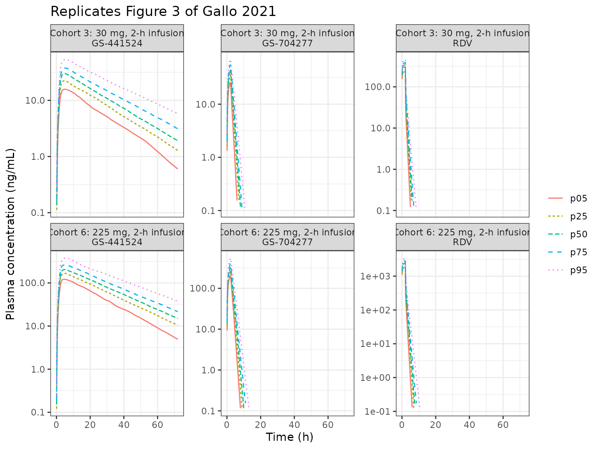
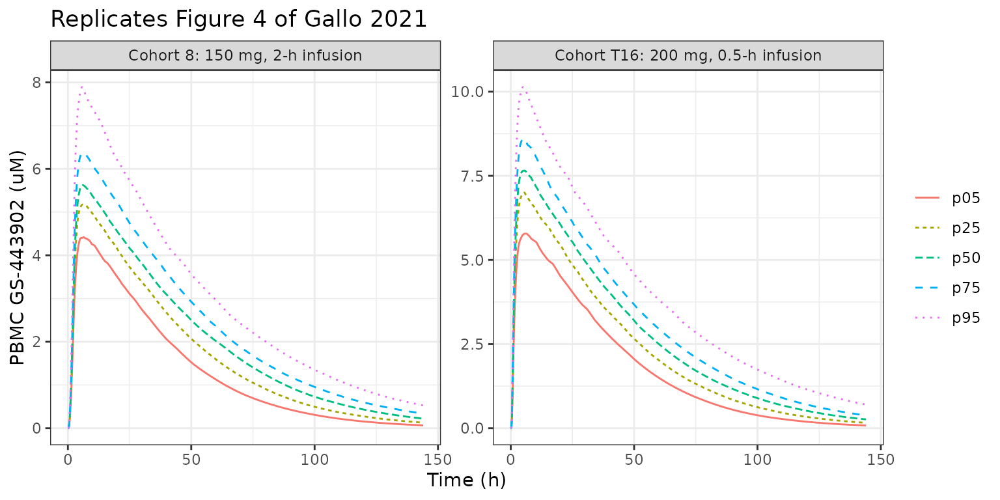
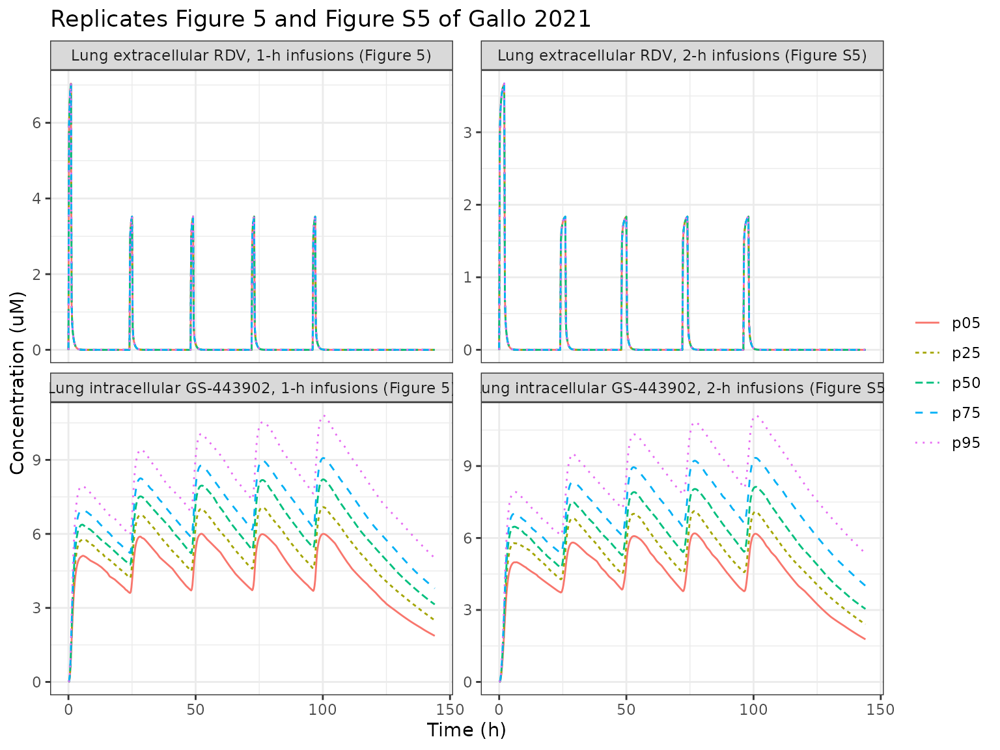

# Remdesivir hybrid PBPK (Gallo 2021)

## Model and source

- Citation: Gallo JM. Hybrid physiologically-based pharmacokinetic model
  for remdesivir: Application to SARS-CoV-2. Clin Transl Sci.
  2021;14:1082-1091. <doi:10.1111/cts.12975>. Parameter values are
  Supplementary Tables S1-S3 (CTS-14-1082-s001.pdf); the ODE system is
  transcribed from the author’s deposited Magnolia code ffRDV_v50.csl
  and ffRDV_v50_multipleDose.csl at
  <https://github.com/jmgallo/PBPK-Model-for-Remdesivir> (commit
  ed83bc3, 2020-10-26), which the supplement cites.
- Description: PBPK (hybrid whole-body, Magnolia/ACSL). Remdesivir (RDV)
  and its alanine metabolite GS-704277, nucleoside monophosphate,
  nucleoside GS-441524 and active nucleoside triphosphate GS-443902 in
  healthy adults after intravenous infusion (Gallo 2021). Venous plasma
  RDV, GS-704277 and GS-441524 are a fitted forcing function: a linear
  two-compartment RDV model with first-order conversion RDV -\>
  GS-704277 -\> GS-441524 and first-order elimination of each
  metabolite. Venous plasma feeds a lung extracellular space that drains
  to arterial plasma, which perfuses eleven further tissues (adipose,
  bone, brain, gut, heart, kidney, liver, muscle, rest of body, skin,
  spleen; gut and spleen drain through the liver). Every tissue has an
  extracellular and an intracellular space; only RDV and GS-441524 cross
  the cell membrane (unbound-concentration flux with an
  intracellular:plasma partition coefficient), and each intracellular
  space carries the metabolic scheme RDV -\> GS-704277 -\> monophosphate
  \<-\> GS-441524, monophosphate -\> GS-443902 -\> elimination. A
  separate peripheral blood mononuclear cell (PBMC) module, driven by
  venous plasma and written in first-order rate constants, was
  calibrated to reported PBMC GS-443902 data; the tissue clearances are
  those rate constants scaled by each tissue’s intracellular volume.
  Tissue outflows leave the system (venous plasma is prescribed, not a
  mass balance). Species masses are carried without molecular-weight
  conversion, as in the authors’ code; the micromolar outputs use the
  code’s conversion factors. The 20 percent CV Monte-Carlo variability
  the paper applies is encoded as fixed log-normal etas; no residual
  error was reported.
- Article: <https://doi.org/10.1111/cts.12975> (open access, PMC8212743)
- Model code: <https://github.com/jmgallo/PBPK-Model-for-Remdesivir>
  (Magnolia `ffRDV_v50.csl` and `ffRDV_v50_multipleDose.csl`, cited from
  the article’s Supplementary Information)

Gallo 2021 builds a “hybrid” physiologically based model of remdesivir
(RDV) and its activation cascade. It is hybrid because venous plasma is
not a mass-balance compartment: plasma RDV, the alanine metabolite
GS-704277 (A in the paper) and the nucleoside GS-441524 (N) are a fitted
*forcing function* (Table S1), and that function drives a whole-body
tissue model in which every tissue carries the intracellular scheme of
Figure 1:

RDV -\> GS-704277 -\> nucleoside monophosphate (MP) \<-\> GS-441524, and
MP -\> GS-443902 (the active triphosphate, TN) -\> elimination.

Only RDV and GS-441524 cross cell membranes. A separate peripheral blood
mononuclear cell (PBMC) module, written in first-order rate constants,
was calibrated against reported PBMC GS-443902 data, and the tissue
clearances in Table S3 are those rate constants multiplied by each
tissue’s intracellular volume. The paper’s endpoints are PBMC and lung
intracellular GS-443902.

## Population

The model was developed from published mean data of the Gilead phase 1
healthy-volunteer programme (Humeniuk et al. 2020): digitized plasma
RDV, GS-704277 and GS-441524 concentration-time profiles from single
3-225 mg intravenous infusions over 0.5 or 2 h and from day 1 of a 150
mg daily 1-h infusion cohort, reported Cmax and AUC for three further
cohorts, and PBMC GS-443902 Cmax, C24 and AUC from four cohorts (three
from Humeniuk 2020, one from the European compassionate-use assessment).
No individual data were used and the paper reports no subject counts or
demographics. Organ volumes and plasma flows describe one typical 80 kg
White adult male (PK-Sim, NHANES 1997) with a hematocrit of 0.45.

The same information is available programmatically via
`readModelDb("Gallo_2021_remdesivir_pbpk")()$population`.

## Source trace

Every `ini()` value carries an in-file comment naming its table cell in
`inst/modeldb/specificDrugs/Gallo_2021_remdesivir_pbpk.R`. The equations
are transcribed from the deposited Magnolia code; the table below
collects the sources in one place.

| Equation / parameter | Value | Source location |
|----|----|----|
| RDV forcing function: `lcl`, `lvc`, `lk12`, `lk21` | 44.6 L/h, 4.6 L, 2.1 /h, 1.86 /h | Table S1 |
| GS-704277 formation / elimination: `lk_gs704277_form`, `lkel_gs704277` | 0.17 /h, 1.1 /h | Table S1 (krdva, kela) |
| GS-441524 formation / elimination: `lk_gs441524_form`, `lkel_gs441524` | 0.32 /h, 0.04 /h | Table S1 (kan, keln) |
| Metabolite forcing equations in concentration: `dA/dt = krdva*C_RDV - kela*A`, `dN/dt = kan*A - keln*N` | – | `ffRDV_v50.csl`, ‘A model’ and ‘N model’ |
| Unbound fractions `fu_p`, `fu_p_gs441524` | 0.12, 1 | Table S2 footnote; Methods |
| Membrane flux `clin * fu * (C_ec - C_ic / kp)` | – | Methods transport equation; `ffRDV_v50.csl` `tRDV<x>12`, `tRDV<x>21` |
| Plasma flows `q_<tissue>`, cardiac output `qc` | Table S2 column 1 | Table S2 |
| Extracellular / intracellular volumes `v_is_<tissue>`, `v_int_<tissue>`, `v_arterial` | Table S2 columns 2-3 | Table S2 |
| Partition coefficients `lkp_<tissue>`, `lkp_<tissue>_gs441524` | Table S2 | Table S2 (PK-Sim in silico) |
| Transport clearances `lclin_<tissue>`, `lclin_<tissue>_gs441524` | Table S2 | Table S2 |
| Metabolic clearances `lcl_rdva_`, `lcl_amp_`, `lcl_mpn_`, `lcl_nmp_`, `lcl_mptn_<tissue>` | Table S3 | Table S3 (mCLrdva, mCLamp, mCLmpn, mCLnmp, mCLmptn) |
| GS-443902 elimination `lcl_tn_<tissue>` | Table S3 | Table S3 (eCLtn) |
| PBMC rate constants `lkin_pbmc`, `lkin_pbmc_gs441524` | 9.0 /h, 1.0 /h | Table S2 PBMC row, footnote ’\*’ |
| PBMC partition coefficients `lkp_pbmc`, `lkp_pbmc_gs441524` | 1.0, 1.0 | Table S2 PBMC row |
| PBMC metabolic rate constants `lk_rdva_pbmc` … `lk_tn_pbmc` | 10, 1, 2, 0.5, 10, 0.03 /h | Table S3 footnote |
| Lung inflow from venous plasma at `qc`; arterial plasma fed by lung outflow | – | Figure 2a; `ffRDV_v50.csl` Lung and ‘Plasma Arterial’ |
| Liver inflow = hepatic artery + gut + spleen outflows | – | Figure 2a; `ffRDV_v50.csl` Liver |
| Micromolar conversion factors 1.66 (RDV), 2.27, 2.71, 3.4, 2.16 (GS-443902) | – | `ffRDV_v50.csl`, `ffRDV_v50_multipleDose.csl` |
| Monte-Carlo variability, 20% CV | `omega^2 = log(1.04)` | Methods ‘Model performance’; Figure 3-5 captions |

## Structure checks

``` r

mod_fun <- readModelDb("Gallo_2021_remdesivir_pbpk")
ui <- rxode2::rxode2(mod_fun)
mod <- rxode2::zeroRe(ui)

stopifnot(
  length(ui$state) == 97L,
  ui$state[1] == "central",
  # the cl / vc pair must not collapse the ODE system to linCmt()
  is.null(ui$linCmt)
)
```

The model has 97 ODE states: four forcing-function states, three
arterial-plasma states, five PBMC states, and seven states in each of
twelve tissues plus the lung extracellular GS-704277 relay.

The three plasma analytes are declared endpoints, so observation rows
name the endpoint (`cmt = "Cc"`). The chunk below confirms the dose
still lands in `central` and every state is returned.

``` r

# Event table: infusions into `central` plus an observation grid. Extra
# per-subject columns (Monte-Carlo etas) are merged in by `id`.
make_events <- function(n, dose_times, dose_amts, tinf, grid, etas = NULL) {
  dose <- expand.grid(id = seq_len(n), k = seq_along(dose_times))
  dose$time <- dose_times[dose$k]
  dose$amt <- dose_amts[dose$k]
  dose$rate <- dose$amt / tinf
  dose$evid <- 1L
  dose$cmt <- "central"
  dose$k <- NULL
  obs <- expand.grid(id = seq_len(n), time = grid)
  obs$amt <- 0
  obs$rate <- 0
  obs$evid <- 0L
  obs$cmt <- "Cc"
  ev <- rbind(dose, obs)
  if (!is.null(etas)) {
    ev <- merge(ev, etas, by = "id")
  }
  ev[order(ev$id, ev$time, -ev$evid), ]
}

# Log-normal etas for a named parameter subset (20% CV), drawn in base R so
# the cohort is identical on every machine.
draw_etas <- function(n, names, seed) {
  set.seed(seed)
  out <- data.frame(id = seq_len(n))
  for (nm in names) {
    out[[nm]] <- stats::rnorm(n, 0, sqrt(log(1 + 0.2^2)))
  }
  out
}

# The Monte-Carlo etas arrive as data columns on the zeroRe() model, so
# rxode2's notes that the omegas are zero and that a multi-subject solve has
# no omega are expected here and are muffled; anything else is shown.
solve_df <- function(model, ev, ...) {
  expected <- "omega/sigma items treated as zero|multi-subject simulation without"
  sim <- withCallingHandlers(
    rxode2::rxSolve(model, ev, returnType = "data.frame", ...),
    message = function(m) if (grepl(expected, conditionMessage(m))) invokeRestart("muffleMessage"),
    warning = function(w) if (grepl(expected, conditionMessage(w))) invokeRestart("muffleWarning")
  )
  as.data.frame(sim)
}

band_summary <- function(sim, var) {
  sim |>
    dplyr::group_by(time) |>
    dplyr::summarise(
      p05 = stats::quantile(.data[[var]], 0.05),
      p25 = stats::quantile(.data[[var]], 0.25),
      p50 = stats::quantile(.data[[var]], 0.50),
      p75 = stats::quantile(.data[[var]], 0.75),
      p95 = stats::quantile(.data[[var]], 0.95),
      .groups = "drop"
    )
}

plot_bands <- function(bands, ylab, title) {
  long <- bands |>
    tidyr::pivot_longer(-c(time, panel), names_to = "percentile", values_to = "value")
  ggplot(long, aes(time, value, colour = percentile, linetype = percentile)) +
    geom_line(na.rm = TRUE) +
    facet_wrap(~panel, scales = "free_y") +
    labs(x = "Time (h)", y = ylab, title = title, colour = NULL, linetype = NULL) +
    theme_bw()
}
```

``` r

ev1 <- make_events(1, 0, 150, 2, seq(0, 48, by = 0.5))
sim1 <- solve_df(mod, ev1)
stopifnot(
  all(ui$state %in% names(sim1)),
  all(c("Cc", "Cc_gs704277", "Cc_gs441524", "Cpbmc_gs443902_uM", "Cint_lung_gs443902_uM") %in% names(sim1)),
  # 2-h infusion of 150 mg: at 0.5 h the central amount is positive and
  # below the 37.5 mg infused so far (the rest has distributed / cleared)
  sim1$central[sim1$time == 0.5] > 0,
  sim1$central[sim1$time == 0.5] < 37.5
)
```

## Forcing-function checks

The venous plasma RDV profile is a linear two-compartment model, so the
solved `Cc` must equal the closed-form infusion solution. GS-704277 and
GS-441524 are first-order chains written in concentration, so their
zero-to-infinity AUCs must satisfy `AUC_A = krdva * AUC_RDV / kela` and
`AUC_N = kan * AUC_A / keln`.

``` r

tv <- exp(c(
  cl = log(44.6), vc = log(4.6), k12 = log(2.1), k21 = log(1.86),
  kform_a = log(0.17), kel_a = log(1.1), kform_n = log(0.32), kel_n = log(0.04)
))
kel <- tv[["cl"]] / tv[["vc"]]
s <- tv[["k12"]] + tv[["k21"]] + kel
alpha <- (s + sqrt(s^2 - 4 * tv[["k21"]] * kel)) / 2
beta <- (s - sqrt(s^2 - 4 * tv[["k21"]] * kel)) / 2
cf_infusion <- function(t, dose, tinf) {
  r <- dose / tinf
  ci <- c((alpha - tv[["k21"]]) / (alpha - beta), (tv[["k21"]] - beta) / (alpha - beta))
  lam <- c(alpha, beta)
  out <- numeric(length(t))
  for (i in 1:2) {
    during <- (1 - exp(-lam[i] * t)) / lam[i]
    after <- (exp(-lam[i] * pmax(t - tinf, 0)) - exp(-lam[i] * t)) / lam[i]
    out <- out + ci[i] * ifelse(t <= tinf, during, after)
  }
  r / tv[["vc"]] * out
}

grid_cf <- sort(unique(c(seq(0, 2, by = 0.01), seq(2, 600, by = 0.05))))
ev_cf <- make_events(1, 0, 225, 2, grid_cf)
sim_cf <- solve_df(mod, ev_cf, rtol = 1e-10, atol = 1e-12, maxsteps = 1e6)
cf <- cf_infusion(sim_cf$time, 225, 2)
keep <- cf > 1e-6 * max(cf)
rel_cc <- max(abs(sim_cf$Cc[keep] / cf[keep] - 1))

trap <- function(x, y) sum(diff(x) * (head(y, -1) + tail(y, -1)) / 2)
auc_rdv <- trap(sim_cf$time, sim_cf$Cc)
auc_a <- trap(sim_cf$time, sim_cf$Cc_gs704277)
auc_n <- trap(sim_cf$time, sim_cf$Cc_gs441524)
checks <- data.frame(
  Check = c(
    "max |Cc / closed form - 1|",
    "AUC_RDV * CL / dose - 1",
    "AUC_A / (krdva * AUC_RDV / kela) - 1",
    "AUC_N / (kan * AUC_A / keln) - 1"
  ),
  Value = c(
    rel_cc,
    auc_rdv * tv[["cl"]] / 225 - 1,
    auc_a / (tv[["kform_a"]] * auc_rdv / tv[["kel_a"]]) - 1,
    auc_n / (tv[["kform_n"]] * auc_a / tv[["kel_n"]]) - 1
  )
)
knitr::kable(checks, digits = 8)
```

| Check                                 |       Value |
|:--------------------------------------|------------:|
| max \|Cc / closed form - 1\|          |  0.00000004 |
| AUC_RDV \* CL / dose - 1              |  0.00096183 |
| AUC_A / (krdva \* AUC_RDV / kela) - 1 | -0.00097645 |
| AUC_N / (kan \* AUC_A / keln) - 1     |  0.00001235 |

``` r


stopifnot(
  # ODE vs closed form, tight tolerances: measured ~1e-9
  rel_cc < 1e-6,
  # trapezoid on a 0.05 h grid to 600 h: measured below 1e-4
  all(abs(checks$Value[2:4]) < 1e-3)
)
```

## Spleen extracellular volume

Table S2 prints a spleen extracellular volume of 0.042 L; the deposited
code uses 0.07 L. The model uses the published 0.042 L. Because venous
plasma is a prescribed forcing function and tissue outflows leave the
system, the spleen cannot influence plasma, PBMC or lung concentrations;
it reaches only the spleen itself and, through its outflow, the liver.
The chunk below confirms that swapping in the code’s value leaves every
published output unchanged.

``` r

mod_code <- rxode2::model(mod, v_is_spleen <- 0.07)
ev_sp <- make_events(1, 0, 200, 0.5, seq(0, 72, by = 0.25))
# Tight tolerances: at the defaults the two solves differ by ~1e-6 in Cc
# purely from integrator step selection across the coupled system.
a <- solve_df(mod, ev_sp, rtol = 1e-10, atol = 1e-12, maxsteps = 1e6)
b <- solve_df(mod_code, ev_sp, rtol = 1e-10, atol = 1e-12, maxsteps = 1e6)
rel <- function(x, y) max(abs(x - y)) / max(abs(x))
spleen_effect <- data.frame(
  Output = c("Cc", "Cpbmc_gs443902_uM", "Cint_lung_gs443902_uM", "Cis_lung_uM", "Cis_liver", "is_spleen (amount)"),
  `Max relative change` = c(
    rel(a$Cc, b$Cc), rel(a$Cpbmc_gs443902_uM, b$Cpbmc_gs443902_uM),
    rel(a$Cint_lung_gs443902_uM, b$Cint_lung_gs443902_uM), rel(a$Cis_lung_uM, b$Cis_lung_uM),
    rel(a$Cis_liver, b$Cis_liver), rel(a$is_spleen, b$is_spleen)
  ),
  check.names = FALSE
)
knitr::kable(spleen_effect, digits = 8)
```

| Output                | Max relative change |
|:----------------------|--------------------:|
| Cc                    |          0.00000000 |
| Cpbmc_gs443902_uM     |          0.00000000 |
| Cint_lung_gs443902_uM |          0.00000000 |
| Cis_lung_uM           |          0.00000000 |
| Cis_liver             |          0.00078089 |
| is_spleen (amount)    |          0.66437139 |

``` r

stopifnot(
  all(spleen_effect$`Max relative change`[1:4] < 1e-6),
  # mutation control: the edit did take effect (spleen extracellular
  # amount scales with the volume, 0.07 / 0.042)
  spleen_effect$`Max relative change`[6] > 0.3
)
```

The spleen extracellular concentration itself barely moves (its washout
time constant is about 0.01 h either way), and the liver changes by well
under 0.1%.

## Replicate Figure 3: plasma RDV, GS-704277 and GS-441524

Figure 3 shows 500 Monte-Carlo replicates with a 20% CV on all eight
forcing-function parameters, for cohort 3 (30 mg over 2 h) and cohort 6
(225 mg over 2 h). Here 200 replicates per cohort are simulated.

``` r

ff_etas <- c(
  "etalcl", "etalvc", "etalk12", "etalk21",
  "etalk_gs704277_form", "etalkel_gs704277", "etalk_gs441524_form", "etalkel_gs441524"
)
n_mc <- 200
grid_pl <- sort(unique(c(seq(0, 4, by = 0.1), seq(4, 72, by = 0.5))))
cohorts <- data.frame(cohort = c("Cohort 3: 30 mg, 2-h infusion", "Cohort 6: 225 mg, 2-h infusion"), dose = c(30, 225))
fig3 <- lapply(seq_len(nrow(cohorts)), function(i) {
  ev <- make_events(n_mc, 0, cohorts$dose[i], 2, grid_pl, draw_etas(n_mc, ff_etas, 3000 + i))
  sim <- solve_df(mod, ev)
  sim$cohort <- cohorts$cohort[i]
  sim
})
fig3 <- dplyr::bind_rows(fig3)

bands3 <- dplyr::bind_rows(
  lapply(c(RDV = "Cc", `GS-704277` = "Cc_gs704277", `GS-441524` = "Cc_gs441524"), function(v) {
    fig3 |>
      dplyr::mutate(conc = .data[[v]] * 1000) |>
      dplyr::group_by(cohort) |>
      dplyr::group_modify(~ band_summary(.x, "conc")) |>
      dplyr::ungroup()
  }),
  .id = "analyte"
) |>
  dplyr::mutate(panel = paste(cohort, analyte, sep = "\n")) |>
  dplyr::select(-cohort, -analyte) |>
  # the log axis starts at 0.1 ng/mL; drop the pre-dose zeros and the
  # integrator-noise tail below it
  dplyr::mutate(dplyr::across(p05:p95, ~ ifelse(.x > 0.1, .x, NA_real_)))
plot_bands(bands3, "Plasma concentration (ng/mL)", "Replicates Figure 3 of Gallo 2021") +
  scale_y_log10()
```



## Replicate Figure 4: PBMC GS-443902

Figure 4 applies the 20% CV to the two parameters the PBMC sensitivity
analysis found influential: the RDV plasma-PBMC transport rate constant
(9.0 /h) and the GS-443902 elimination rate constant (0.03 /h).

``` r

pbmc_etas <- c("etalkin_pbmc", "etalk_tn_pbmc")
grid_pbmc <- sort(unique(c(seq(0, 12, by = 0.1), seq(12, 144, by = 1))))
pbmc_cohorts <- data.frame(
  cohort = c("Cohort 8: 150 mg, 2-h infusion", "Cohort T16: 200 mg, 0.5-h infusion"),
  dose = c(150, 200), tinf = c(2, 0.5)
)
fig4 <- dplyr::bind_rows(lapply(seq_len(nrow(pbmc_cohorts)), function(i) {
  ev <- make_events(n_mc, 0, pbmc_cohorts$dose[i], pbmc_cohorts$tinf[i], grid_pbmc, draw_etas(n_mc, pbmc_etas, 4000 + i))
  sim <- solve_df(mod, ev)
  sim$panel <- pbmc_cohorts$cohort[i]
  sim
}))
bands4 <- fig4 |>
  dplyr::group_by(panel) |>
  dplyr::group_modify(~ band_summary(.x, "Cpbmc_gs443902_uM")) |>
  dplyr::ungroup()
plot_bands(bands4, "PBMC GS-443902 (uM)", "Replicates Figure 4 of Gallo 2021")
```



The median peaks can be compared with the median curves of Figure 4,
read off the published figure by the maintainers (about 5.8 uM for
cohort 8 and about 7.7 uM for cohort T16).

``` r

pbmc_peak <- bands4 |>
  dplyr::group_by(panel) |>
  dplyr::summarise(median_peak = max(p50), t_peak = time[which.max(p50)], .groups = "drop")
knitr::kable(pbmc_peak, digits = 2)
```

| panel                              | median_peak | t_peak |
|:-----------------------------------|------------:|-------:|
| Cohort 8: 150 mg, 2-h infusion     |        5.62 |    6.2 |
| Cohort T16: 200 mg, 0.5-h infusion |        7.65 |    5.6 |

``` r

stopifnot(
  abs(pbmc_peak$median_peak[1] / 5.8 - 1) < 0.15,
  abs(pbmc_peak$median_peak[2] / 7.7 - 1) < 0.15
)
```

## Replicate Figure 5 and Figure S5: lung, clinical regimen

The clinical regimen is 200 mg on day 1 then 100 mg daily on days 2-5,
as 1-h (Figure 5) or 2-h (Figure S5) infusions. The 20% CV is applied to
the lung RDV transport clearance (2.5 L/h) and the lung GS-443902
elimination clearance (0.0084 L/h). Neither affects the lung
extracellular RDV concentration, which is why Figure 5a shows a single
line.

``` r

lung_etas <- c("etalclin_lung", "etalcl_tn_lung")
dose_times <- 24 * (0:4)
dose_amts <- c(200, 100, 100, 100, 100)
grid_lung <- sort(unique(c(seq(0, 144, by = 0.25), dose_times + 1, dose_times + 2)))
regimens <- data.frame(regimen = c("1-h infusions (Figure 5)", "2-h infusions (Figure S5)"), tinf = c(1, 2))
fig5 <- dplyr::bind_rows(lapply(seq_len(nrow(regimens)), function(i) {
  ev <- make_events(n_mc, dose_times, dose_amts, regimens$tinf[i], grid_lung, draw_etas(n_mc, lung_etas, 5000 + i))
  sim <- solve_df(mod, ev)
  sim$regimen <- regimens$regimen[i]
  sim
}))

bands5 <- dplyr::bind_rows(
  fig5 |>
    dplyr::group_by(regimen) |>
    dplyr::group_modify(~ band_summary(.x, "Cis_lung_uM")) |>
    dplyr::ungroup() |>
    dplyr::mutate(panel = paste("Lung extracellular RDV,", regimen)),
  fig5 |>
    dplyr::group_by(regimen) |>
    dplyr::group_modify(~ band_summary(.x, "Cint_lung_gs443902_uM")) |>
    dplyr::ungroup() |>
    dplyr::mutate(panel = paste("Lung intracellular GS-443902,", regimen))
) |>
  dplyr::select(-regimen)
plot_bands(bands5, "Concentration (uM)", "Replicates Figure 5 and Figure S5 of Gallo 2021")
```



The Results state that lung GS-443902 “steady-state minimum
concentrations \[range\] from 4 uM to 9 uM at the 5% and 95% levels”
with 1-h infusions. The trough before the fifth dose (96 h) is checked
against that statement. The cohort is drawn in base R with a fixed seed,
so it is identical on every machine; the bounds still leave room for the
sampling error of a 5th / 95th percentile from 200 draws.

The simulated range, about 3.7 to 7.7 uM, sits slightly inside the
published “4 to 9 uM”. The paper’s figures are rounded and its
Monte-Carlo distribution is not stated: with 2000 draws the 96 h trough
percentiles are 3.5 / 8.0 uM for the log-normal variability used here
and 3.7 / 8.4 uM for a normal 20% CV, and the 95% trough of Figure 5b
reads close to 8.5 uM. The difference is therefore within the ambiguity
of the published simulation settings, not a structural discrepancy (the
median trajectory and the typical-value Cmax and tmax below match
closely).

``` r

trough <- fig5 |>
  dplyr::filter(time == 96) |>
  dplyr::group_by(regimen) |>
  dplyr::summarise(
    p05 = stats::quantile(Cint_lung_gs443902_uM, 0.05),
    p50 = stats::quantile(Cint_lung_gs443902_uM, 0.50),
    p95 = stats::quantile(Cint_lung_gs443902_uM, 0.95),
    .groups = "drop"
  )
knitr::kable(trough, digits = 2)
```

| regimen                   |  p05 |  p50 |  p95 |
|:--------------------------|-----:|-----:|-----:|
| 1-h infusions (Figure 5)  | 3.71 | 5.46 | 7.66 |
| 2-h infusions (Figure S5) | 3.80 | 5.45 | 8.12 |

``` r

t1 <- trough[trough$regimen == "1-h infusions (Figure 5)", ]
stopifnot(
  t1$p05 > 3, t1$p05 < 5,
  t1$p95 > 7, t1$p95 < 10.5
)
```

## NCA with PKNCA

PKNCA is run on three quantities for which the paper states a value:
lung extracellular RDV Cmax on day 1 and day 5 (“about 7 uM after the
200 mg loading dose and then … about 3.5 uM for the remaining four 100
mg doses”, 1-h infusions) and the time of the lung intracellular
GS-443902 maximum after the first dose (“the 2-h infusion duration
delayed the time of the maximum lung intracellular TN Cmax by an hour,
from 5 to 6 h”). The paper reports no absolute plasma NCA values of its
own (Table 1 gives only percentage bias against Humeniuk 2020), so
plasma NCA is used here as an internal check that `AUCinf * CL = dose`
for Figure 3 subjects (the first 50 of each cohort).

``` r

# PKNCA on the first 50 subjects of each regimen, and only on the two dosing
# intervals that carry a published value; the full 200 x 577-point grid
# takes minutes in PKNCA and adds nothing to a median.
n_nca <- 50
lung_conc <- dplyr::bind_rows(
  fig5 |>
    dplyr::transmute(id, time, regimen, conc = Cis_lung_uM, analyte = "Lung extracellular RDV"),
  fig5 |>
    dplyr::transmute(id, time, regimen, conc = Cint_lung_gs443902_uM, analyte = "Lung intracellular GS-443902")
) |>
  dplyr::filter(!is.na(conc), id <= n_nca, time <= 24 | (time >= 96 & time <= 120)) |>
  dplyr::mutate(treatment = paste(analyte, regimen, sep = ", "))
# Lung extracellular RDV washes out to integrator noise between doses;
# assert the undershoot is noise and floor it at zero (Cmax and tmax only,
# so no tail trimming is needed).
stopifnot(all(lung_conc$conc >= -1e-6 * max(lung_conc$conc)))
lung_conc$conc <- pmax(lung_conc$conc, 0)
lung_dose <- expand.grid(id = seq_len(n_nca), k = 1:5, regimen = regimens$regimen, analyte = unique(lung_conc$analyte), stringsAsFactors = FALSE) |>
  dplyr::mutate(time = dose_times[k], dose = dose_amts[k], treatment = paste(analyte, regimen, sep = ", ")) |>
  dplyr::select(id, time, dose, treatment)

conc_obj <- PKNCA::PKNCAconc(lung_conc, conc ~ time | treatment + id, concu = "uM", timeu = "h")
dose_obj <- PKNCA::PKNCAdose(lung_dose, dose ~ time | treatment + id, doseu = "mg")
intervals <- data.frame(start = c(0, 96), end = c(24, 120), cmax = TRUE, tmax = TRUE)
nca_lung <- PKNCA::pk.nca(PKNCA::PKNCAdata(conc_obj, dose_obj, intervals = intervals))

sim_nca <- as.data.frame(nca_lung$result) |>
  dplyr::filter(PPTESTCD %in% c("cmax", "tmax")) |>
  dplyr::mutate(group = paste0(treatment, ", dose ", ifelse(start == 0, 1, 5))) |>
  dplyr::select(group, PPTESTCD, PPORRES)
reference <- data.frame(
  group = c(
    "Lung extracellular RDV, 1-h infusions (Figure 5), dose 1",
    "Lung extracellular RDV, 1-h infusions (Figure 5), dose 5",
    "Lung intracellular GS-443902, 1-h infusions (Figure 5), dose 1",
    "Lung intracellular GS-443902, 2-h infusions (Figure S5), dose 1"
  ),
  cmax = c(7, 3.5, NA, NA),
  tmax = c(NA, NA, 5, 6)
)
# Keep only the (group, parameter) pairs the paper states a value for.
ref_pairs <- reference |>
  tidyr::pivot_longer(c(cmax, tmax), names_to = "PPTESTCD", values_to = "ref") |>
  dplyr::filter(!is.na(ref))
sim_nca_ref <- sim_nca |>
  dplyr::semi_join(ref_pairs, by = c("group", "PPTESTCD"))
cmp <- nlmixr2lib::ncaComparisonTable(
  sim_nca_ref, reference,
  by = "group",
  units = c(cmax = "uM", tmax = "h")
)
knitr::kable(cmp, row.names = FALSE)
```

| NCA parameter | group | Reference | Simulated | % diff |
|:---|:---|:---|:---|:---|
| Cmax (uM) | Lung extracellular RDV, 1-h infusions (Figure 5), dose 1 | 7 | 7.04 | +0.6% |
| Cmax (uM) | Lung extracellular RDV, 1-h infusions (Figure 5), dose 5 | 3.5 | 3.52 | +0.6% |
| Tmax (h) | Lung intracellular GS-443902, 1-h infusions (Figure 5), dose 1 | 5 | 5.5 | +10.0% |
| Tmax (h) | Lung intracellular GS-443902, 2-h infusions (Figure S5), dose 1 | 6 | 6.25 | +4.2% |

``` r

med <- sim_nca |>
  dplyr::group_by(group, PPTESTCD) |>
  dplyr::summarise(v = stats::median(PPORRES), .groups = "drop")
getv <- function(g, p) med$v[med$group == g & med$PPTESTCD == p]
tmax1 <- getv("Lung intracellular GS-443902, 1-h infusions (Figure 5), dose 1", "tmax")
tmax2 <- getv("Lung intracellular GS-443902, 2-h infusions (Figure S5), dose 1", "tmax")
stopifnot(
  abs(getv("Lung extracellular RDV, 1-h infusions (Figure 5), dose 1", "cmax") / 7 - 1) < 0.1,
  abs(getv("Lung extracellular RDV, 1-h infusions (Figure 5), dose 5", "cmax") / 3.5 - 1) < 0.1,
  tmax1 > 4.5, tmax1 < 6.5,
  # the 2-h infusion delays the GS-443902 maximum by about an hour
  tmax2 - tmax1 > 0.4, tmax2 - tmax1 < 1.6
)
```

The simulated times of maximum sit on the 0.25 h grid; the paper’s 5 h
and 6 h are rounded to the hour, so the table’s percentage difference on
`tmax` reflects that rounding as much as any model difference.

``` r

# RDV falls ~30 orders of magnitude by 72 h, so the tail is integrator
# noise around zero (including tiny negatives that make PKNCA return NaN).
# Assert that, floor at zero and drop the numerically-zero tail after the
# peak before the half-life fit.
stopifnot(all(fig3$Cc >= -1e-6 * max(fig3$Cc, na.rm = TRUE), na.rm = TRUE))
pl_conc <- fig3 |>
  dplyr::filter(!is.na(Cc), id <= n_nca) |>
  dplyr::transmute(id, time, treatment = cohort, conc = pmax(Cc, 0)) |>
  dplyr::group_by(treatment, id) |>
  dplyr::filter(time <= time[which.max(conc)] | conc >= 1e-6 * max(conc)) |>
  dplyr::ungroup()
pl_dose <- data.frame(
  id = rep(seq_len(n_nca), 2), time = 0,
  treatment = rep(cohorts$cohort, each = n_nca), dose = rep(cohorts$dose, each = n_nca)
)
nca_pl <- PKNCA::pk.nca(PKNCA::PKNCAdata(
  PKNCA::PKNCAconc(pl_conc, conc ~ time | treatment + id, concu = "mg/L", timeu = "h"),
  PKNCA::PKNCAdose(pl_dose, dose ~ time | treatment + id, doseu = "mg"),
  intervals = data.frame(start = 0, end = Inf, cmax = TRUE, aucinf.obs = TRUE)
))
cl_ind <- fig3 |>
  dplyr::distinct(cohort, id, cl) |>
  dplyr::rename(treatment = cohort)
auc_check <- as.data.frame(nca_pl$result) |>
  dplyr::filter(PPTESTCD == "aucinf.obs") |>
  dplyr::left_join(cl_ind, by = c("treatment", "id")) |>
  dplyr::left_join(cohorts |> dplyr::rename(treatment = cohort), by = "treatment") |>
  dplyr::mutate(ratio = PPORRES * cl / dose)
auc_check |>
  dplyr::group_by(treatment) |>
  dplyr::summarise(median_AUC_x_CL_over_dose = stats::median(ratio), .groups = "drop") |>
  knitr::kable(digits = 4)
```

| treatment                      | median_AUC_x_CL_over_dose |
|:-------------------------------|--------------------------:|
| Cohort 3: 30 mg, 2-h infusion  |                    0.9975 |
| Cohort 6: 225 mg, 2-h infusion |                    0.9974 |

``` r

stopifnot(
  !anyNA(auc_check$ratio),
  # trapezoid on a 0.1-0.5 h grid: measured about 0.25% low
  abs(stats::median(auc_check$ratio) - 1) < 0.01
)
```

## Assumptions and deviations

- **Values from the supplement, equations from the deposited code.**
  Every numeric value is from Tables S1-S3. The article prints only the
  membrane transport equation; the rest of the ODE system was
  transcribed from the author’s Magnolia code on GitHub. The maintainers
  compared every physiological and drug constant in that code with
  Tables S1-S3 (156 tissue values plus the 22 forcing-function,
  unbound-fraction, plasma-volume and PBMC values), and all agree except
  one (next item).
- **Spleen extracellular volume.** Table S2 gives 0.042 L and the code
  0.07 L. The published value is used; the “Spleen extracellular volume”
  section above shows it does not affect plasma, PBMC or lung outputs.
- **Hybrid, open-loop structure.** Venous plasma is the fitted forcing
  function, not a mass balance: tissue outflows are not returned to
  venous plasma, and PBMC uptake does not deplete plasma. This is the
  author’s design (Discussion: a global PBPK model underpredicted late
  plasma RDV and could not reproduce GS-704277), and it is reproduced
  as-is. A mass-balance check across the whole system is therefore not
  meaningful; the checks above are the forcing-function identities.
- **Mass rather than molar conversion.** Metabolic steps convert species
  1:1 by mass with no molecular-weight correction, as in the code, and
  the micromolar outputs use the code’s factors (1.66 for RDV, 2.27
  GS-704277, 2.71 monophosphate, 3.4 GS-441524, 2.16 GS-443902). The
  GS-443902 factor corresponds to a molecular weight of about 463 g/mol,
  lower than the commonly cited 531 g/mol of the triphosphate; since the
  PBMC rate constants were calibrated to micromolar data through this
  factor, it is kept.
- **GS-704277 and GS-441524 forcing equations in concentration.** The
  code writes `dA/dt = krdva * C_RDV - kela * A` with A a concentration,
  so `central_gs704277` and `central_gs441524` hold mg/L, not mg. Table
  S1’s row for keln reads “Elimination rate constant for A”; its symbol,
  the code (`keln`, ‘N model’) and the value 0.04 /h identify it as the
  GS-441524 elimination rate constant.
- **Heart transport clearance.** Table S3’s clearances are the PBMC rate
  constants times the intracellular volume, and most Table S2 transport
  clearances follow the same rule (RDV: 9 /h times the volume). The
  heart RDV value, 2.56 L/h, is 8 rather than 9 times 0.32 L; the
  printed value, which the code also uses, is kept.
- **Monte-Carlo variability.** The paper applies a 20% CV to different
  parameter subsets for different figures and does not state the
  distribution. The model carries all twelve as fixed log-normal etas
  with `omega^2 = log(1 + 0.2^2)`; the vignette reproduces each figure
  by drawing only that figure’s subset (the others at zero). Simulating
  the model with all twelve etas at once is broader than any published
  figure.
- **No residual error reported.** The forcing function was fitted with
  an additive error model whose magnitude is not reported; `addSd`,
  `addSd_gs704277` and `addSd_gs441524` are fixed to zero.
- **Venous plasma volume unused.** Table S2 lists a venous plasma volume
  of 0.53 L; it is declared but never used in the code, because venous
  plasma RDV comes from the forcing function’s central volume (4.6 L).
  It is therefore not in the model.
- **ODE count.** The article states 84 ODEs; the deposited code and this
  model have 97 states (the AUC integrators of the code are omitted
  here). The difference is in the article’s count, not in the structure:
  every state is present in the code.
- **Cohort size.** The paper used 500 Monte-Carlo replicates per panel;
  200 are used here.
