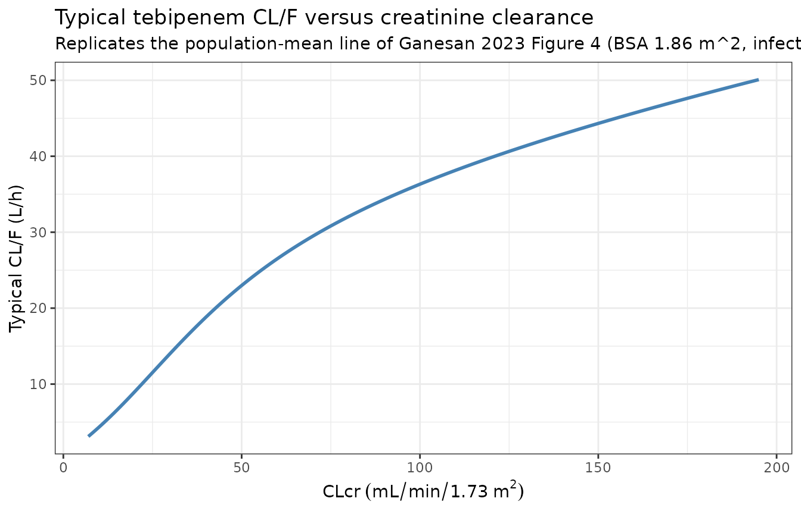
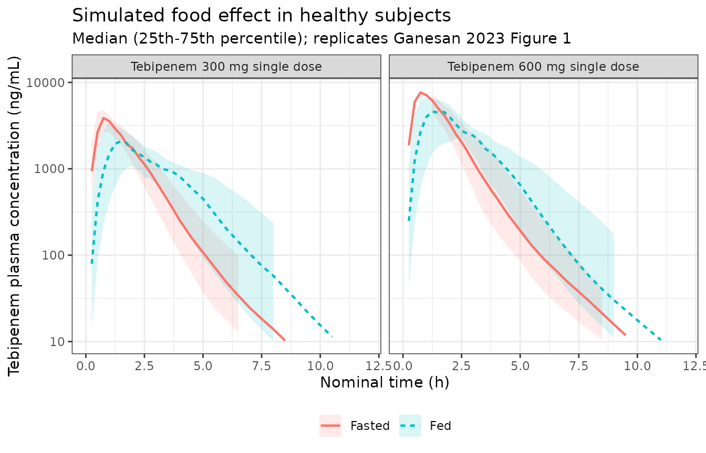
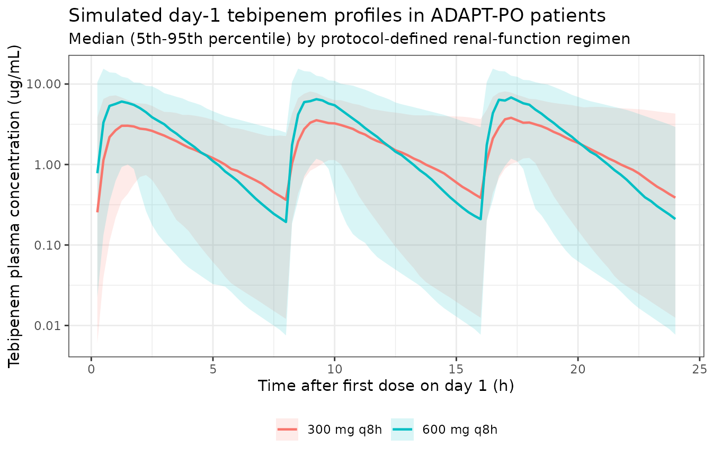

# Tebipenem (Ganesan 2023)

## Model and source

- Citation: Ganesan H, Gupta VK, Safir MC, Bhavnani SM, Talley AK,
  Melnick D, Rubino CM. Population Pharmacokinetic Analyses for
  Tebipenem after Oral Administration of Pro-Drug Tebipenem Pivoxil
  Hydrobromide. Antimicrob Agents Chemother. 2023 Jun 15;67(6):e0145122.
  <doi:10.1128/aac.01451-22>.
- Description: Two-compartment population PK model with two absorption
  transit compartments for tebipenem, the active moiety of the oral
  carbapenem pro-drug tebipenem pivoxil hydrobromide (TBP-PI-HBr),
  pooled across three phase 1 studies and the phase 3 ADAPT-PO trial in
  adults with complicated urinary tract infection / acute pyelonephritis
  (Ganesan 2023; 746 subjects, 3448 plasma concentrations). Apparent
  oral clearance is split into an additive non-renal arm (power function
  of creatinine clearance) and a renal arm (sigmoidal Hill function of
  creatinine clearance) that drives a cumulative urine compartment; the
  summed CL/F carries a linear body-surface-area effect. Central volume
  scales with height and peripheral volume with body surface area, both
  shifted by infection status. The absorption rate constant switches on
  fed status, is shifted by infection status, and carries a dose effect
  confined to the crossover thorough-QT study (study 104).
  Interindividual variability on CL/F is cohort-specific (healthy
  subjects vs infected patients) and Ka carries both IIV and
  two-occasion interoccasion variability.
- Article: <https://doi.org/10.1128/aac.01451-22>
- Supplement (Table S1, Figures S1-S6):
  <https://doi.org/10.1128/aac.01451-22>

Tebipenem pivoxil hydrobromide (TBP-PI-HBr) is an oral carbapenem
pro-drug that is converted to the active moiety tebipenem in the
enterocytes. Ganesan 2023 pooled three phase 1 studies with the phase 3
ADAPT-PO trial to build a population PK model for tebipenem intended for
subsequent PK-PD target-attainment work.

## Population

The final analysis data set comprised 746 subjects contributing 3,448
plasma concentrations (Ganesan 2023 Table 1). Of these, 99 were phase 1
subjects – 36 healthy adults from the single/multiple-ascending-dose
study SPR994-101, 39 adults spanning normal renal function through
end-stage renal disease from the renal-impairment study SPR994-102, and
24 healthy adults from the four-way-crossover thorough-QT study
SPR994-104 – and 647 were patients with complicated urinary tract
infection or acute pyelonephritis from ADAPT-PO (SPR994-301). Urine
concentrations were additionally available from 67 phase 1 subjects and
37 phase 3 patients and are what make the renal clearance arm
identifiable.

Pooled baseline characteristics were: age 60.0 years (18-91), height 169
cm (110-202), weight 76.0 kg (42.0-142), body surface area 1.86 m^2
(1.32-2.70), body mass index 26.3 kg/m^2 (15.3-57.9), and
Cockcroft-Gault creatinine clearance normalized to body surface area
74.2 mL/min/1.73 m^2 (6.90-192). The population was 51.3% female and
predominantly White (95.9% overall, 98.6% in ADAPT-PO), which is why
race was tested but not retained as a covariate.

The same information is available programmatically from the model’s
`population` metadata
(`readModelDb("Ganesan_2023_tebipenem")()$population`).

``` r

pop <- readModelDb("Ganesan_2023_tebipenem")()$population
#> Warning: some etas defaulted to non-mu referenced, possible parsing error: etalcl_patient, etaiov_ka_1, etaiov_ka_2
#> as a work-around try putting the mu-referenced expression on a simple line
str(pop[c("n_subjects", "n_studies", "age_median", "bsa_median", "renal_function")])
#> List of 5
#>  $ n_subjects    : int 746
#>  $ n_studies     : int 4
#>  $ age_median    : chr "60.0 years"
#>  $ bsa_median    : chr "1.86 m^2"
#>  $ renal_function: chr "Creatinine clearance (Cockcroft-Gault, BSA-normalized) median 74.2 mL/min/1.73 m^2, range 6.90-192. Study 102 e"| __truncated__
```

## Structural model

Ganesan 2023 supplemental Figure S3 gives the structure: an oral dose
enters a depot, passes through two transit compartments, and arrives in
a two-compartment disposition model. Every transfer along the absorption
chain is governed by the same rate constant `Ka`. Elimination from the
central compartment is split into two parallel first-order arms – a
non-renal arm and a renal arm – and the renal arm alone feeds the
cumulative urine compartment.

The transit chain replaced a lag-time-plus-first-order model: the two
gave comparable fits to the dense phase 1 data, but the transit form was
expected to converge more reliably against the sparse phase 3 sampling.

## Source trace

Every `ini()` entry in
`inst/modeldb/specificDrugs/Ganesan_2023_tebipenem.R` carries an in-file
comment naming its origin. The table below collects them.

| Equation / parameter | Value | Source location |
|----|----|----|
| Structure (depot + 2 transit + 2-compartment + urine) | n/a | Supplemental Figure S3; Results “Population PK model development” |
| `lka` (fasted) | 3.04 1/h | Eq. 6 coefficient on `FAST`; Table 2 row labelled “Ka (fed)” (see Errata) |
| `e_fed_ka` | 1.23 / 3.04 - 1 | Eq. 6 coefficient on `(1 - FAST)` = 1.23 1/h; Table 2 row labelled “Ka (fasted)” |
| `e_healthy_ka` | 0.368 | Table 2 “Ka:Infection status”; Eq. 6 |
| `e_dose_ka` | -0.478 | Table 2 “Ka:Dose effect”; Eq. 6 |
| `lcl_nonren` | 15.6 L/h | Table 2 “CL NR” (Eq. 1 prints 10.2; see Errata) |
| `e_crcl_cl_nonren` | 0.722 | Table 2 “CL NR, CLcr power”; Eq. 1 |
| `lcl_renal` | 21.1 L/h | Table 2 “CL R, MAX”; Eq. 2 |
| `crcl50_cl_renal` | 44.7 mL/min/1.73 m^2 | Table 2 “CL R, CLcr 50”; Eq. 2 |
| `hill_cl_renal` | 2.13 | Table 2 “CL R, Hill”; Eq. 2 |
| `e_bsa_cl` | 0.479 per m^2 | Table 2 “CL/F:BSA (slope)”; Eq. 3 |
| `lvc` | 38.5 L | Table 2 “Vc/F”; Eq. 4 |
| `e_ht_vc` | 2.09 | Table 2 “Vc/F:HTCM (power)”; Eq. 4 |
| `e_healthy_vc` | -0.290 | Table 2 “Vc/F:Infection status”; Eq. 4 |
| `lq` | 2.23 L/h | Table 2 “CLd/F” |
| `lvp` | 4.84 L | Table 2 “Vp/F”; Eq. 5 |
| `e_bsa_vp` | 0.491 per m^2 | Table 2 “Vp/F:BSA (slope)”; Eq. 5 |
| `e_healthy_vp` | -0.245 | Table 2 “Vp/F:Infection status”; Eq. 5 |
| `etalcl_healthy` | 0.0614 | Table 2 “IIV CL (phase 1)” |
| `etalcl_patient` | 0.328 | Table 2 “IIV CL (phase 3)” |
| `etalvc` | 0.197 | Table 2 “IIV Vc/F” |
| `etalvp` | 0.0115 | Table 2 “IIV Vp/F” |
| `etalka` | 0.518 | Table 2 “IIV Ka” |
| `etaiov_ka_1`, `etaiov_ka_2` | 0.201 | Table 2 “IOV Ka (Occ. 1)” / “(Occ. 2)” |
| `propSd` | sqrt(0.209) = 0.457 | Table 2 “RV prop, plasma” |
| `propSd_urineAmt` | sqrt(0.298) = 0.546 | Table 2 “RV prop, urine” |
| Reference CRCL 79.32, BSA 1.86, HT 169, dose 1200 mg | n/a | Eq. 1, Eq. 3 / Eq. 5, Eq. 4, Eq. 6 |
| Baseline demographics | n/a | Table 1 |
| Published exposure summary used below | n/a | Table 3 |

Note that Ganesan 2023 reports the interindividual and interoccasion
terms as variances with the corresponding %CV in parentheses computed as
`sqrt(omega^2)` (0.0614 -\> 24.8 %CV, 0.518 -\> 71.9 %CV), so the
tabulated numbers are used directly as variances with no `log(CV^2 + 1)`
back-transform. The residual-variability rows are likewise variances
whose parenthetical values are the corresponding standard deviations,
and it is the standard deviations that the model file carries.

## Renal function and clearance (replicates Figure 4)

The most clinically consequential covariate is renal function. Apparent
oral clearance is the sum of a non-renal arm that is a power function of
creatinine clearance and a renal arm that is a sigmoidal Hill function
of it, with the sum scaled by a linear body-surface-area term (Eq. 1-3).
The curve below is extracted from the packaged model itself – the
clearance terms are read out of the `rxSolve()` output rather than
recomputed in R – so it tests the encoding rather than restating it.

``` r

mod <- readModelDb("Ganesan_2023_tebipenem")

crcl_grid <- seq(7, 195, by = 1)

grid_events <- tibble(
  id               = seq_along(crcl_grid),
  CRCL             = crcl_grid,
  BSA              = 1.86,
  HT               = 169,
  DIS_HEALTHY      = 0,
  FED              = 0,
  DOSE_TBPPI_MG    = 600,
  STUDY_SPR994_104 = 0,
  OCC              = 1
) |>
  tidyr::crossing(time = c(0, 1)) |>
  mutate(amt = NA_real_, evid = 0L, cmt = "central", dvid = 1L)

sim_grid <-
  rxode2::rxSolve(
    mod,
    events    = grid_events,
    omega     = NA,
    keep      = c("CRCL", "BSA", "HT"),
    useLinCmt = FALSE
  ) |>
  as.data.frame() |>
  filter(time == 1) |>
  mutate(clf = cl_nonren + cl_renal)
#> ℹ parameter labels from comments will be replaced by 'label()'
#> Warning: some etas defaulted to non-mu referenced, possible parsing error: etalcl_patient, etaiov_ka_1, etaiov_ka_2
#> as a work-around try putting the mu-referenced expression on a simple line
#> Warning: multi-subject simulation without without 'omega'

ggplot(sim_grid, aes(x = CRCL, y = clf)) +
  geom_line(colour = "steelblue", linewidth = 1) +
  labs(
    x = expression(CLcr~(mL/min/1.73~m^2)),
    y = "Typical CL/F (L/h)",
    title = "Typical tebipenem CL/F versus creatinine clearance",
    subtitle = "Replicates the population-mean line of Ganesan 2023 Figure 4 (BSA 1.86 m^2, infected patient)"
  ) +
  theme_bw()
```



The shape matches the published description: clearance rises
approximately linearly up to a creatinine clearance near 80 mL/min/1.73
m^2 and then flattens as the renal arm saturates toward its maximum of
21.1 L/h.

``` r

sim_grid |>
  filter(CRCL %in% c(20, 30, 50, 72, 90, 120, 190)) |>
  transmute(
    CRCL,
    `CL_NR (L/h)` = round(cl_nonren, 2),
    `CL_R (L/h)`  = round(cl_renal, 2),
    `CL/F (L/h)`  = round(clf, 2),
    `Renal fraction` = round(cl_renal / clf, 3)
  ) |>
  dplyr::rename(`CLcr (mL/min/1.73 m2)` = CRCL) |>
  knitr::kable(caption = "Typical clearance decomposition across the observed creatinine-clearance range.")
```

| CLcr (mL/min/1.73 m2) | CL_NR (L/h) | CL_R (L/h) | CL/F (L/h) | Renal fraction |
|----------------------:|------------:|-----------:|-----------:|---------------:|
|                    20 |        5.77 |       3.22 |       8.99 |          0.358 |
|                    30 |        7.73 |       6.32 |      14.05 |          0.450 |
|                    50 |       11.18 |      11.80 |      22.98 |          0.514 |
|                    72 |       14.55 |      15.49 |      30.04 |          0.516 |
|                    90 |       17.09 |      17.22 |      34.31 |          0.502 |
|                   120 |       21.03 |      18.81 |      39.84 |          0.472 |
|                   190 |       29.31 |      20.17 |      49.49 |          0.408 |

Typical clearance decomposition across the observed creatinine-clearance
range. {.table}

### Which non-renal-clearance intercept is right?

Ganesan 2023 Table 2 reports `CL_NR = 15.6` L/h (%SEM 5.87) with
sampling-importance-resampling statistics of mean 15.7, median 15.7, and
a 90% confidence interval of \[14.4, 17.1\]. Printed Equation 1,
however, reads `CL_NR = 10.2 * (CLcr / 79.32)^0.722`. Every other
constant in Equations 1-6 reproduces its Table 2 counterpart exactly, so
one of these two numbers is a typographical error. The check below
discriminates between them using the only assumption-light comparison
the paper offers.

ADAPT-PO enrolled 647 patients, of whom 55 (8.5%) had baseline
creatinine clearance at or below 50 mL/min/1.73 m^2 and received 300 mg
q8h; the remaining 595 received 600 mg q8h. Because the
low-renal-function stratum is only 8.5% of the cohort, the median
creatinine clearance of the 600 mg stratum must sit very close to the
overall ADAPT-PO median of 72.2 mL/min/1.73 m^2. Table 3 reports a
median CL/F of 30.7 L/h for that stratum.

``` r

mod_eq1 <- rxode2::ini(mod, lcl_nonren = log(10.2))
#> ℹ parameter labels from comments will be replaced by 'label()'
#> Warning: some etas defaulted to non-mu referenced, possible parsing error: etalcl_patient, etaiov_ka_1, etaiov_ka_2
#> as a work-around try putting the mu-referenced expression on a simple line
#> ℹ change initial estimate of `lcl_nonren` to `2.32238772029023`

check_events <- tibble(
  id               = 1:3,
  CRCL             = c(72.2, 74.2, 78.0),
  BSA              = 1.86,
  HT               = 169,
  DIS_HEALTHY      = 0,
  FED              = 0,
  DOSE_TBPPI_MG    = 600,
  STUDY_SPR994_104 = 0,
  OCC              = 1
) |>
  tidyr::crossing(time = c(0, 1)) |>
  mutate(amt = NA_real_, evid = 0L, cmt = "central", dvid = 1L)

clf_at <- function(model, events) {
  rxode2::rxSolve(model, events = events, omega = NA,
                  keep = "CRCL", useLinCmt = FALSE) |>
    as.data.frame() |>
    filter(time == 1) |>
    transmute(CRCL, clf = cl_nonren + cl_renal)
}

bind_rows(
  clf_at(mod,     check_events) |> mutate(variant = "Table 2 (CL_NR = 15.6)"),
  clf_at(mod_eq1, check_events) |> mutate(variant = "Equation 1 (CL_NR = 10.2)")
) |>
  mutate(
    `Published Table 3 median CL/F (L/h)` = 30.7,
    `% difference` = round(100 * (clf - 30.7) / 30.7, 1),
    clf = round(clf, 2)
  ) |>
  tidyr::pivot_wider(names_from = variant, values_from = c(clf, `% difference`)) |>
  dplyr::rename(`CLcr (mL/min/1.73 m2)` = CRCL) |>
  knitr::kable(
    caption = paste(
      "Typical CL/F for an infected patient at BSA 1.86 m^2 near the ADAPT-PO",
      "median creatinine clearance, under the two candidate CL_NR values,",
      "against the Table 3 median for the 600 mg q8h stratum (n = 595)."
    )
  )
#> Warning: multi-subject simulation without without 'omega'
#> Warning: multi-subject simulation without without 'omega'
```

| CLcr (mL/min/1.73 m2) | Published Table 3 median CL/F (L/h) | clf_Table 2 (CL_NR = 15.6) | clf_Equation 1 (CL_NR = 10.2) | % difference_Table 2 (CL_NR = 15.6) | % difference_Equation 1 (CL_NR = 10.2) |
|---:|---:|---:|---:|---:|---:|
| 72.2 | 30.7 | 30.09 | 25.04 | -2.0 | -18.4 |
| 74.2 | 30.7 | 30.62 | 25.47 | -0.3 | -17.0 |
| 78.0 | 30.7 | 31.57 | 26.24 | 2.8 | -14.5 |

Typical CL/F for an infected patient at BSA 1.86 m^2 near the ADAPT-PO
median creatinine clearance, under the two candidate CL_NR values,
against the Table 3 median for the 600 mg q8h stratum (n = 595).
{.table}

Across the plausible range of median creatinine clearance for the 600 mg
stratum the Table 2 value reproduces the published median within a
couple of percent, while the Equation 1 value is 15-20% low. Combined
with the three-way corroboration of 15.6 by the SIR resample statistics,
the model file uses 15.6 and treats the 10.2 in Equation 1 as a
typographical error. The same comparison cannot be run against the 300
mg stratum because the median creatinine clearance within a 30-50
mL/min/1.73 m^2 band is not reported and is not recoverable from the
pooled summary.

## Food effect (replicates Figure 1)

Study 101 dosed food-effect cohorts under fasted and fed conditions at
300 mg and 600 mg. Ganesan 2023 Figure 1 shows that food slowed
absorption – fasted profiles peak near 0.75-1 h, fed profiles near 2 h –
without materially changing exposure.

``` r

set.seed(20230615)

n_food <- 60L

make_healthy_cohort <- function(n, dose_mg, fed, id_offset) {
  subj <- tibble(
    id               = id_offset + seq_len(n),
    HT               = pmin(pmax(rnorm(n, 176, 7), 160), 198),
    BSA              = pmin(pmax(rlnorm(n, log(1.90), 0.07), 1.60), 2.30),
    CRCL             = pmin(pmax(rlnorm(n, log(120), 0.15), 80), 165),
    DIS_HEALTHY      = 1,
    FED              = fed,
    DOSE_TBPPI_MG    = dose_mg,
    STUDY_SPR994_104 = 0,
    OCC              = 1,
    arm              = paste0(dose_mg, " mg, ", ifelse(fed == 1, "fed", "fasted"))
  )

  doses <- subj |>
    mutate(time = 0, amt = dose_mg, evid = 1L, cmt = "depot", dvid = NA_integer_)

  obs <- subj |>
    tidyr::crossing(time = c(seq(0, 4, by = 0.25), seq(4.5, 12, by = 0.5))) |>
    mutate(amt = NA_real_, evid = 0L, cmt = "central", dvid = 1L)

  bind_rows(doses, obs) |> arrange(id, time, desc(evid))
}

food_events <- bind_rows(
  make_healthy_cohort(n_food, 300, 0, id_offset =   0L),
  make_healthy_cohort(n_food, 300, 1, id_offset =  60L),
  make_healthy_cohort(n_food, 600, 0, id_offset = 120L),
  make_healthy_cohort(n_food, 600, 1, id_offset = 180L)
)
stopifnot(!anyDuplicated(food_events[, c("id", "time", "evid")]))
```

``` r

sim_food <-
  rxode2::rxSolve(
    mod,
    events    = food_events,
    keep      = c("arm", "DOSE_TBPPI_MG", "FED"),
    useLinCmt = FALSE
  ) |>
  as.data.frame()

food_summary <- sim_food |>
  filter(time > 0) |>
  group_by(arm, DOSE_TBPPI_MG, FED, time) |>
  summarise(
    p25 = quantile(Cc, 0.25),
    p50 = median(Cc),
    p75 = quantile(Cc, 0.75),
    .groups = "drop"
  ) |>
  mutate(
    dose_label = paste0("Tebipenem ", DOSE_TBPPI_MG, " mg single dose"),
    fed_label  = ifelse(FED == 1, "Fed", "Fasted")
  )

ggplot(food_summary, aes(x = time, y = p50 * 1000, colour = fed_label, linetype = fed_label)) +
  geom_ribbon(aes(ymin = p25 * 1000, ymax = p75 * 1000, fill = fed_label),
              alpha = 0.15, colour = NA) +
  geom_line(linewidth = 0.8) +
  facet_wrap(~dose_label) +
  scale_y_log10(limits = c(10, 8000)) +
  coord_cartesian(xlim = c(0, 12)) +
  labs(
    x = "Nominal time (h)",
    y = "Tebipenem plasma concentration (ng/mL)",
    colour = NULL, fill = NULL, linetype = NULL,
    title = "Simulated food effect in healthy subjects",
    subtitle = "Median (25th-75th percentile); replicates Ganesan 2023 Figure 1"
  ) +
  theme_bw() +
  theme(legend.position = "bottom")
#> Warning: Removed 35 rows containing missing values or values outside the scale range
#> (`geom_ribbon()`).
#> Warning: Removed 17 rows containing missing values or values outside the scale range
#> (`geom_line()`).
```



``` r

sim_food |>
  filter(time > 0) |>
  group_by(arm, id) |>
  slice_max(Cc, n = 1, with_ties = FALSE) |>
  ungroup() |>
  group_by(arm) |>
  summarise(
    `Median Tmax (h)`     = round(median(time), 2),
    `Median Cmax (ug/mL)` = round(median(Cc), 2),
    .groups = "drop"
  ) |>
  dplyr::rename(Arm = arm) |>
  knitr::kable(caption = "Simulated median Tmax and Cmax by dose and prandial state.")
```

| Arm            | Median Tmax (h) | Median Cmax (ug/mL) |
|:---------------|----------------:|--------------------:|
| 300 mg, fasted |            1.00 |                4.23 |
| 300 mg, fed    |            2.00 |                2.43 |
| 600 mg, fasted |            1.00 |                8.21 |
| 600 mg, fed    |            1.62 |                5.55 |

Simulated median Tmax and Cmax by dose and prandial state. {.table}

The simulated fasted profiles peak near 0.75 h and the fed profiles near
2 h, matching Figure 1. This is also the independent evidence that
Equation 6 assigns the two Ka values correctly and that Table 2
transposes their row labels: with a mean transit time of
`(n_transit + 1) / Ka`, the fasted healthy value of
`3.04 * 1.368 = 4.16` 1/h gives roughly 0.96 h and the fed healthy value
of `1.23 * 1.368 = 1.68` 1/h gives roughly 2.4 h. Had the labels in
Table 2 been taken at face value, the fed profiles would have peaked
*earlier* than the fasted ones, contradicting both Figure 1 and the
Results narrative that “the presence of food slowed the rate of
tebipenem absorption”.

## ADAPT-PO virtual cohort and PKNCA validation

ADAPT-PO patients received 600 mg q8h, reduced to 300 mg q8h when
baseline creatinine clearance was between 30 and 50 mL/min/1.73 m^2.
Ganesan 2023 Table 3 reports day-1 AUC0-24 and Cmax by that
stratification, derived from individual post-hoc profiles.

Creatinine clearance is drawn from a lognormal calibrated to the
ADAPT-PO median of 72.2 mL/min/1.73 m^2 and then truncated into each
protocol-defined stratum; height and body surface area are drawn to
match the ADAPT-PO medians and ranges of Table 1. The achieved covariate
medians are reported alongside the results so the reader can judge how
much of any discrepancy is attributable to the reconstruction rather
than to the model.

``` r

set.seed(20230616)

n_arm <- 150L

make_adapt_cohort <- function(n, dose_mg, crcl_lo, crcl_hi, id_offset) {
  crcl <- rlnorm(200 * n, log(72.2), 0.35)
  crcl <- crcl[crcl > crcl_lo & crcl <= crcl_hi]
  stopifnot(length(crcl) >= n)
  crcl <- crcl[seq_len(n)]

  subj <- tibble(
    id               = id_offset + seq_len(n),
    CRCL             = crcl,
    HT               = pmin(pmax(rnorm(n, 168, 11), 140), 200),
    BSA              = pmin(pmax(rlnorm(n, log(1.86), 0.14), 1.32), 2.70),
    DIS_HEALTHY      = 0,
    FED              = 0,
    DOSE_TBPPI_MG    = dose_mg,
    STUDY_SPR994_104 = 0,
    OCC              = 1,
    regimen          = paste0(dose_mg, " mg q8h")
  )

  doses <- subj |>
    tidyr::crossing(time = c(0, 8, 16)) |>
    mutate(amt = dose_mg, evid = 1L, cmt = "depot", dvid = NA_integer_)

  obs <- subj |>
    tidyr::crossing(time = sort(unique(c(seq(0, 24, by = 0.25))))) |>
    mutate(amt = NA_real_, evid = 0L, cmt = "central", dvid = 1L)

  bind_rows(doses, obs) |> arrange(id, time, desc(evid))
}

adapt_events <- bind_rows(
  make_adapt_cohort(n_arm, 300, 30, 50,  id_offset =   0L),
  make_adapt_cohort(n_arm, 600, 50, 250, id_offset = 150L)
)
```

``` r

adapt_events |>
  distinct(id, regimen, CRCL, HT, BSA) |>
  group_by(regimen) |>
  summarise(
    `Median CLcr (mL/min/1.73 m2)` = round(median(CRCL), 1),
    `CLcr range`                   = paste0(round(min(CRCL), 1), " - ", round(max(CRCL), 1)),
    `Median height (cm)`           = round(median(HT), 1),
    `Median BSA (m2)`              = round(median(BSA), 2),
    n                              = dplyr::n(),
    .groups = "drop"
  ) |>
  dplyr::rename(Regimen = regimen) |>
  knitr::kable(caption = "Achieved covariate distributions of the ADAPT-PO virtual cohort.")
```

| Regimen | Median CLcr (mL/min/1.73 m2) | CLcr range | Median height (cm) | Median BSA (m2) | n |
|:---|---:|:---|---:|---:|---:|
| 300 mg q8h | 43.5 | 32.2 - 49.9 | 167.3 | 1.82 | 150 |
| 600 mg q8h | 81.1 | 50.1 - 151.3 | 167.1 | 1.85 | 150 |

Achieved covariate distributions of the ADAPT-PO virtual cohort.
{.table}

``` r

sim_adapt <-
  rxode2::rxSolve(
    mod,
    events    = adapt_events,
    keep      = c("regimen", "CRCL", "BSA", "DOSE_TBPPI_MG"),
    useLinCmt = FALSE
  ) |>
  as.data.frame()

ggplot(
  sim_adapt |>
    filter(time > 0) |>
    group_by(regimen, time) |>
    summarise(p05 = quantile(Cc, 0.05), p50 = median(Cc),
              p95 = quantile(Cc, 0.95), .groups = "drop"),
  aes(x = time, y = p50, colour = regimen, fill = regimen)
) +
  geom_ribbon(aes(ymin = p05, ymax = p95), alpha = 0.15, colour = NA) +
  geom_line(linewidth = 0.8) +
  scale_y_log10() +
  labs(
    x = "Time after first dose on day 1 (h)",
    y = "Tebipenem plasma concentration (ug/mL)",
    colour = NULL, fill = NULL,
    title = "Simulated day-1 tebipenem profiles in ADAPT-PO patients",
    subtitle = "Median (5th-95th percentile) by protocol-defined renal-function regimen"
  ) +
  theme_bw() +
  theme(legend.position = "bottom")
```



``` r

nca_conc <- sim_adapt |>
  filter(!is.na(Cc)) |>
  select(id, time, Cc, regimen)

nca_dose <- adapt_events |>
  filter(evid == 1) |>
  select(id, time, amt, regimen)

conc_obj <- PKNCA::PKNCAconc(
  nca_conc,
  Cc ~ time | regimen + id,
  concu = "ug/mL",
  timeu = "h"
)
dose_obj <- PKNCA::PKNCAdose(
  nca_dose,
  amt ~ time | regimen + id,
  doseu = "mg"
)

intervals <- data.frame(
  start   = 0,
  end     = 24,
  cmax    = TRUE,
  tmax    = TRUE,
  auclast = TRUE
)

nca_res <- PKNCA::pk.nca(PKNCA::PKNCAdata(conc_obj, dose_obj, intervals = intervals))
```

``` r

published <- tibble::tribble(
  ~regimen,      ~cmax, ~auclast,
  "300 mg q8h",  6.68,  59.2,
  "600 mg q8h",  7.98,  60.5
)

cmp <- nlmixr2lib::ncaComparisonTable(
  simulated     = nca_res,
  reference     = published,
  by            = "regimen",
  units         = c(cmax = "ug/mL", auclast = "ug*h/mL"),
  tolerance_pct = 20
)

knitr::kable(
  cmp,
  caption = paste(
    "Simulated day-1 exposure versus Ganesan 2023 Table 3 medians for",
    "ADAPT-PO patients. * differs from the published value by more than 20%."
  ),
  align = c("l", "l", "r", "r", "r")
)
```

| NCA parameter      | regimen    | Reference | Simulated |   % diff |
|:-------------------|:-----------|----------:|----------:|---------:|
| Cmax (ug/mL)       | 300 mg q8h |      6.68 |      4.68 | -29.9%\* |
| Cmax (ug/mL)       | 600 mg q8h |      7.98 |      8.33 |    +4.4% |
| AUClast (ug\*h/mL) | 300 mg q8h |      59.2 |      43.9 | -25.8%\* |
| AUClast (ug\*h/mL) | 600 mg q8h |      60.5 |      62.3 |    +2.9% |

Simulated day-1 exposure versus Ganesan 2023 Table 3 medians for
ADAPT-PO patients. \* differs from the published value by more than 20%.
{.table}

- differs from reference by more than ±20%.

The 600 mg q8h stratum – 595 of the 647 ADAPT-PO patients – reproduces
the published medians closely: Cmax within about 4% and day-1 AUC0-24
within about 3%. The 300 mg q8h stratum is flagged: simulated Cmax and
AUC0-24 both fall roughly 25-30% below the published medians. The
arithmetic is transparent. At the achieved median creatinine clearance
of that virtual arm the model predicts a typical CL/F near 20 L/h,
whereas Table 3 reports a median post-hoc CL/F of 15.7 L/h for the
corresponding patients, and 900 mg of daily dose divided by those two
clearances is exactly the observed gap.

Three things plausibly contribute, none of which is a defect in the
transcription:

- **The stratum’s true median creatinine clearance is not reported.**
  Table 1 gives only the pooled ADAPT-PO median (72.2 mL/min/1.73 m^2),
  so the median within the 30-50 mL/min/1.73 m^2 band has to be
  reconstructed. The virtual arm lands at 43.5; the model reproduces the
  published CL/F of 15.7 L/h at a creatinine clearance near 33
  mL/min/1.73 m^2, which is inside the band but toward its floor.
- **Body size is not matched within the stratum.** Patients with reduced
  renal function in this population are older and smaller, and CL/F
  carries a linear body-surface-area slope of 0.479 per m^2. The virtual
  arm is drawn from the pooled ADAPT-PO body-surface-area distribution
  rather than a stratum-specific one.
- **The published values are medians of shrunken post-hoc estimates**
  from sparse phase 3 sampling in a subgroup of only 55 patients,
  whereas the simulated values are medians of the model’s own
  predictions.

The discrepancy is not evidence about the `CL_NR` ambiguity discussed
earlier: both candidate values over-predict CL/F in this stratum (about
20 L/h with 15.6 and about 17 L/h with 10.2 at a creatinine clearance of
43.5), so the 600 mg stratum remains the discriminating comparison. No
parameter was adjusted to close the gap.

## Renal recovery

The renal arm of clearance drives the cumulative urine compartment, so
the fraction of an absorbed dose recovered unchanged in urine is
`CL_R / (CL_NR + CL_R)` and falls as renal function declines. The check
below reads the urine state out of the same ADAPT-PO simulation.

``` r

sim_adapt |>
  filter(time == 24) |>
  mutate(
    crcl_band = cut(
      CRCL,
      breaks = c(30, 50, 75, 100, 250),
      labels = c("30-50", "50-75", "75-100", ">100"),
      include.lowest = TRUE
    ),
    fe = urine / (3 * DOSE_TBPPI_MG)
  ) |>
  group_by(regimen, crcl_band) |>
  summarise(
    n = dplyr::n(),
    `Median fraction of day-1 dose in urine` = round(median(fe), 3),
    `Predicted renal fraction of CL/F`       = round(median(cl_renal / (cl_renal + cl_nonren)), 3),
    .groups = "drop"
  ) |>
  filter(n > 0) |>
  dplyr::rename(Regimen = regimen, `CLcr band (mL/min/1.73 m2)` = crcl_band) |>
  knitr::kable(caption = "Simulated day-1 urinary recovery by renal-function band.")
```

| Regimen | CLcr band (mL/min/1.73 m2) | n | Median fraction of day-1 dose in urine | Predicted renal fraction of CL/F |
|:---|:---|---:|---:|---:|
| 300 mg q8h | 30-50 | 150 | 0.482 | 0.503 |
| 600 mg q8h | 50-75 | 56 | 0.511 | 0.518 |
| 600 mg q8h | 75-100 | 60 | 0.503 | 0.508 |
| 600 mg q8h | \>100 | 34 | 0.468 | 0.474 |

Simulated day-1 urinary recovery by renal-function band. {.table}

At 24 h the day-1 urinary recovery sits slightly below the renal
fraction of clearance because drug remaining in the body at the end of
day 1 has not yet been excreted; the gap narrows as renal function – and
therefore the elimination rate – increases.

## Assumptions and deviations

### Errata and internal inconsistencies in the source

1.  **`CL_NR` intercept: Table 2 says 15.6 L/h, Equation 1 says 10.2.**
    Table 2 reports 15.6 with %SEM 5.87 and SIR statistics of mean 15.7,
    median 15.7, 90% CI \[14.4, 17.1\]; Equation 1 prints
    `CL_NR = 10.2 * (CLcr / 79.32)^0.722`. Every other constant in
    Equations 1-6 matches its Table 2 counterpart exactly. The model
    file uses **15.6**, because it is the value in the
    parameter-estimate table, is corroborated three separate ways by the
    resampling analysis, and is the only one of the two that reproduces
    the Table 3 median CL/F of the 600 mg q8h stratum (n = 595, 92% of
    the ADAPT-PO patients) – see the discrimination table above.

2.  **Table 2’s two Ka rows are transposed.** Table 2 lists “Ka (fasted)
    1.23” and “Ka (fed) 3.04”. Equation 6 writes
    `Ka = [3.04 * FAST + 1.23 * (1 - FAST)] * ...`, assigning 3.04 to
    the fasted state; the Results narrative states that “the presence of
    food slowed the rate of tebipenem absorption”; and Figure 1 shows
    the fasted profiles peaking roughly an hour earlier than the fed
    profiles. The model file therefore uses **Ka = 3.04 1/h fasted and
    1.23 1/h fed**, i.e. the equation’s assignment, and treats the Table
    2 row labels as transposed.

3.  **Direction of the infection-status effect on Ka.** Equation 6
    contains `[1 + 0.368 * (1 - Infected)]`, which makes absorption
    36.8% *faster* in healthy subjects, whereas the Discussion states
    that absorption was “faster in infected patients”. Equations 4 and 5
    use the same `(1 - Infected)` construction for Vc/F and Vp/F, so the
    equation set is internally consistent, and the Tmax values it
    produces for healthy subjects agree with Figure 1. The equation is
    implemented as printed. The authors themselves caution that “the
    impact of infection status on absorption rate should be interpreted
    with caution as the PK sampling scheme in phase 3 patients was
    relatively uninformative for the estimation of Ka.”

4.  **IIV on Vp/F.** The Results section describing the simplification
    of the full multivariable model states that “the IIV term for Vp/F
    was removed due to excessive shrinkage”, but Table 2 (the final
    model) reports it as 0.0115 (10.7 %CV, shrinkage 77.3%), and both
    the Results and the Discussion quote 10.7% for Vp/F as the low end
    of the final-model IIV range. The term is retained here, following
    Table 2.

5.  **Reference creatinine clearance of 79.32.** Equation 1 normalizes
    to 79.32 mL/min/1.73 m^2, which is not the pooled median reported in
    Table 1 (74.2) and is presumably the analysis-set mean. It is used
    as printed.

### Modelling choices

6.  **Urine residual error.** Ganesan 2023 Table 2 reports a combined
    residual model for urine: proportional 0.298 (54.6 %CV) plus
    additive 482 (21.9 ng/mL). The additive term is annotated in
    concentration units, but the Methods describe fitting “urine
    amounts” and no urine volumes are reported, so the additive
    component cannot be placed on the cumulative- amount observable that
    the model exposes. Only the proportional component is carried on
    `urineAmt`; the additive component is documented here and in the
    model file rather than being converted with an invented urine
    volume.

7.  **Fixed cohort anchors for the split CL/F IIV.** Ganesan 2023
    estimated separate CL/F IIV variances for healthy phase 1 subjects
    (0.0614) and infected phase 3 patients (0.328) with no accompanying
    difference in the typical CL/F. Because each random effect must pair
    with a fixed effect of the same name, the model file introduces
    `lcl_healthy` and `lcl_patient`, both `fixed(0)` (a multiplicative
    factor of exactly 1), purely to host the two cohort-specific etas.
    This follows the paired-structural-mean idiom of
    `Klunder_2017_upadacitinib`, and adds no parameter that is not zero
    by construction.

8.  **Dose units are pro-drug milligrams.** Ganesan 2023 recorded doses
    as milligrams of TBP-PI, so every apparent parameter is conditioned
    on the pro-drug-to-tebipenem mass ratio and on the fraction of
    pro-drug converted (unknown, but expected to be near 100% because
    pro-drug was not measurable systemically). Simulations must supply
    `amt` in milligrams of TBP-PI-HBr, as done here.

### Virtual-cohort assumptions

9.  **Covariate distributions are reconstructed, not observed.** The
    original data are not public. Creatinine clearance, height, and body
    surface area are drawn from parametric distributions matched to the
    Table 1 medians and ranges of the relevant study, then truncated to
    the protocol-defined strata. Their achieved medians are reported
    above.

10. **Prandial state in ADAPT-PO.** ADAPT-PO dosed without regard to
    food and the paper does not report the fed/fasted mix, so the
    virtual cohort is simulated fasted (`FED = 0`). This affects the
    rate of absorption only, so it moves simulated Cmax but leaves AUC
    essentially unchanged.

11. **Single occasion.** `OCC = 1` throughout, so only the first
    interoccasion-variability term on Ka is active. Multi-occasion
    designs should alternate `OCC` between 1 and 2 across dosing
    occasions.

12. **Race and sex.** Neither was retained in the final model, so
    neither is simulated; both are recorded in `covariatesDataExcluded`
    for provenance.

## Convention check

``` r

nlmixr2lib::checkModelConventions("Ganesan_2023_tebipenem")
#> ℹ parameter labels from comments will be replaced by 'label()'
#> Warning: some etas defaulted to non-mu referenced, possible parsing error: etalcl_patient, etaiov_ka_1, etaiov_ka_2
#> as a work-around try putting the mu-referenced expression on a simple line
#> 
#> ── Convention check: "Ganesan_2023_tebipenem" ──────────────────────────────────
#> ✔ No convention issues found.
```
