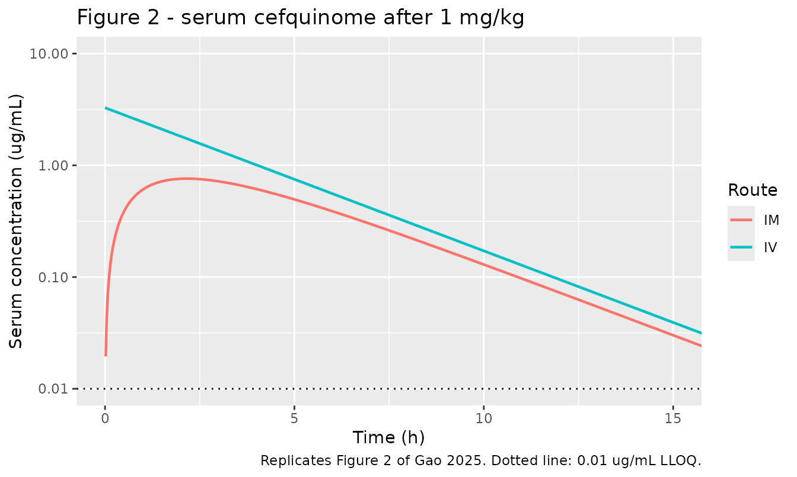
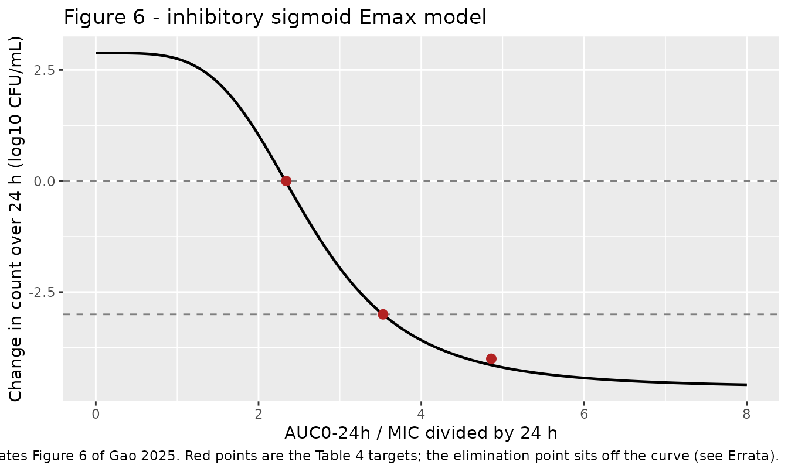
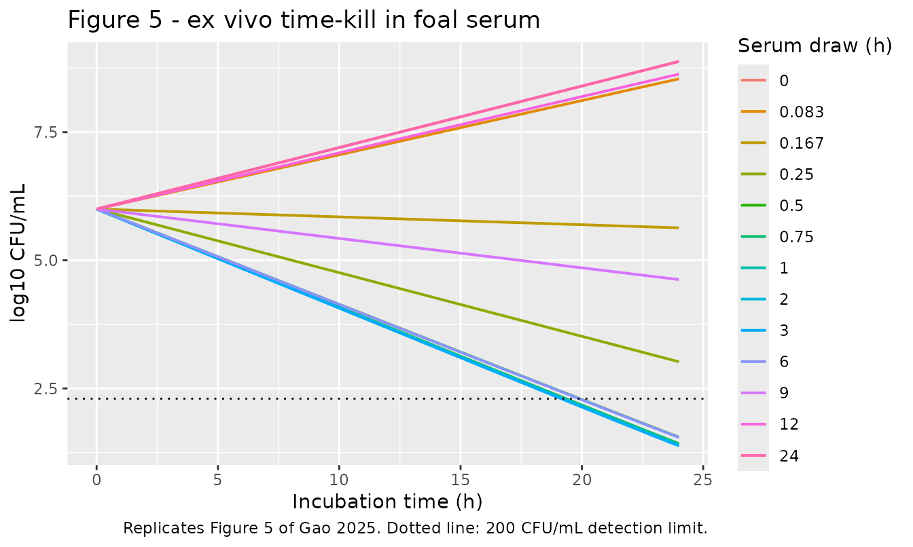

# Cefquinome PK/PD against Escherichia coli in foals (Gao 2025)

## Model and source

Gao 2025 is a veterinary pharmacokinetic/pharmacodynamic integration
study of **cefquinome**, a fourth-generation cephalosporin licensed only
for animal use, against *Escherichia coli* isolated from a septicaemic
foal. Ten Ili foals received 1 mg/kg intravenously and intramuscularly
in a two-phase crossover; serum drawn after the intramuscular dose was
then used *ex vivo* to build time-kill curves, and the resulting effect
was integrated against the PK/PD index AUC0-24h/MIC divided by 24 h.

The paper has two separable quantitative components, and this package
carries one model file for each.

- Article: <https://doi.org/10.3390/vetsci12040294>

``` r

mods <- c("Gao_2025_cefquinome_foal", "Gao_2025_cefquinome_pkpd_index")
uis <- lapply(mods, function(m) rxode2::rxode(readModelDb(m)))
names(uis) <- mods
cat(uis[[1]]$reference, "\n")
#> Gao T, Liu X, Qiu D, Li Y, Qiu Z, Qi J, Li S, Guo X, Zhang Y, Wang Z, Gao X, Ma Y, Ma T. (2025). Ex vivo pharmacokinetic/pharmacodynamic integration model of cefquinome against Escherichia coli in foals. Veterinary Sciences 12(4):294. doi:10.3390/vetsci12040294.
```

| Model file | Paper component | Source |
|----|----|----|
| `Gao_2025_cefquinome_foal` | One-compartment PK with first-order intramuscular absorption | Table 1, Figure 2 |
| `Gao_2025_cefquinome_pkpd_index` | Inhibitory sigmoid Emax PK/PD integration | Section 2.9, Table 4, Figure 6 |

``` r

for (m in mods) cat("**", m, "** -- ", uis[[m]]$description, "\n\n", sep = "")
```

**Gao_2025_cefquinome_foal** – Preclinical (horse, Ili foal).
One-compartment PK model with first-order intramuscular absorption for
cefquinome, a fourth-generation veterinary cephalosporin, in 7-month to
1-year-old Ili foals given a single 1 mg/kg dose intravenously or
intramuscularly in a two-phase crossover. Gao 2025 analysed the serum
concentrations non-compartmentally in WinNonlin 5.2.1 (Section 2.4) and
published NO structural compartmental model, so every parameter here is
either a directly reported Table 1 statistic or is derived from Table 1
by a standard one-compartment identity. CL = 0.09 L/h/kg is the reported
intravenous clearance. The volume is derived as vc = CL / kel with kel =
ln(2) / T1/2beta = ln(2) / 2.35 h, giving 0.3051 L/kg; this choice is
corroborated by Figure 2, whose last quantifiable intravenous point sits
at about 0.09 ug/mL at 12 h against a model prediction of 0.095 ug/mL,
whereas the alternative volume CL x MRT0-last = 0.240 L/kg predicts
0.046 ug/mL and is refuted. The absorption rate constant ka = 0.6851 1/h
is derived by solving the one-compartment Tmax identity ln(ka/kel) /
(ka - kel) = Tmax at the reported Tmax of 2.16 h; it is corroborated by
the reported Cmax, since the identity Cmax = F x Dose / vc x exp(-kel x
Tmax) returns 0.760 ug/mL against the published 0.89 +/- 0.14 ug/mL
(inside one SD). F = 43.86% is the reported absolute bioavailability,
and equals the published AUC ratio 5.41 / 12.33 = 43.88%. Dose the
`central` compartment for the intravenous route and the `depot`
compartment for the intramuscular route. The model deliberately does NOT
reproduce the intramuscular T1/2beta of 4.16 h reported in Table 1: a
flip-flop parameterisation that matches it (ka = ln(2)/4.16 = 0.1666
1/h) predicts Tmax = 4.45 h against the published 2.16 h and Cmax =
0.387 ug/mL against the published 0.89 ug/mL, a 2.3-fold error, and is
contradicted by Figure 2, in which the intravenous and intramuscular
terminal slopes are visibly parallel. See the vignette Assumptions and
deviations section. Gao 2025 fitted no population model and reported no
between-subject variability or residual error magnitude – the +/- values
in Table 1 are standard deviations of the per-foal non-compartmental
estimates – so there are no eta parameters and addSd is FIXED at 0; the
model is intended for typical-value simulation.

**Gao_2025_cefquinome_pkpd_index** – Ex vivo (foal serum). Inhibitory
sigmoid Emax PK/PD-integration model for the antibacterial effect of
cefquinome against Escherichia coli strain HE13, isolated from a
septicaemic foal, in serum drawn from Ili foals after a single 1 mg/kg
intramuscular dose. Gao 2025 Section 2.9 parameterises the effect over a
24 h ex vivo incubation as E = Emax - (Emax - E0) \* Ce^N / (Ce^N +
EC50^N), where E is the SIGNED change in log10(CFU/mL) between 0 and 24
h of incubation (positive = net growth, negative = net kill) and Ce is
the PK/PD index. NOTE THE INVERTED NAMING: Gao 2025 defines its Emax as
the 24 h change in the DRUG-FREE samples and its E0 as the change in the
drug-treated samples, which is the opposite of the usual convention and
of the sibling veterinary models in this library. This file therefore
maps Gao 2025’s Emax = 2.88 log10 CFU/mL onto the canonical `e0` (effect
at zero exposure) and Gao 2025’s E0 = -4.65 log10 CFU/mL onto the
canonical `emax` (maximal drug effect), and writes the algebraically
identical form E = e0 - (e0 - emax) \* Ce^N / (Ce^N + EC50^N). No value
is altered by the remapping. Parameters from Gao 2025 Table 4: e0 =
2.88, emax = -4.65 log10 CFU/mL, EC50 = 2.61 (dimensionless), Hill N =
4.22. The PK/PD index is AUC0-24h/MIC DIVIDED BY 24 h, which Gao 2025
adopts so the index is dimensionless; it is formed here as the
per-interval covariate AUC_CEFQ divided by the parameter mic and by 24.
The parameterisation was confirmed against the paper’s own independently
printed targets: solving E = 0 and E = -3 returns index values of 2.330
and 3.527 against the published bacteriostatic and bactericidal targets
of 2.34 and 3.53. The published bacterial-elimination target of 4.86
does NOT correspond to E = -4, which the fitted curve places at 4.565;
the published value instead corresponds to E = -4.14. See the vignette
Errata. The bacterial density bact (linear CFU/mL) is integrated as
d/dt(bact) = ln(10) \* (E / 24) \* bact so that log10(bact) changes by
exactly E across each 24 h window, reproducing the paper’s model at the
only times bacteria were counted. There is no PK component in THIS file:
Gao 2025 analysed the serum concentrations non-compartmentally in
WinNonlin 5.2.1 and defined its PD per 24 h interval on that
non-compartmental AUC, so exposure enters as the externally supplied
covariate AUC_CEFQ. The companion model `Gao_2025_cefquinome_foal`
supplies a compartmental PK model for the same study if a closed PK-PD
loop is wanted. Neither between-subject variability nor a residual error
magnitude was reported, so there are no eta parameters and addSd is
FIXED at 0; the model is intended for typical-value simulation.

## Population

Ten healthy Ili foals aged 7 months to 1 year, mean weight 191 +/- 21.7
kg, supplied by Zhaosu County Xiyu Horse Industry Co., Ltd. (Yili,
Xinjiang, China). All animals were acclimatised for two weeks, passed a
fitness assessment (physical examination, heart rate, rectal
temperature) and had received no medical treatment for at least two
weeks before enrolment.

The design was a two-phase crossover: five foals received 1 mg/kg
cefquinome intramuscularly in the cervical region and five received 1
mg/kg intravenously via the jugular vein; after a two-week washout the
routes were reversed. Blood was drawn from the left jugular vein at
0.083, 0.167, 0.25, 0.5, 0.75, 1, 2, 3, 6, 9, 12 and 24 h and serum
assayed by HPLC (LLOQ 0.01 ug/mL). Baseline characteristics are given in
Gao 2025 Section 2.2; the PK results are Table 1.

The pharmacodynamic component used *E. coli* strain HE13, isolated from
a foal with septicaemia in Heilongjiang Province, plus a 53-isolate MIC
survey (Figure 3) and a 20-isolate broth-versus-serum comparison (Table
2).

The same information is available programmatically:

``` r

str(uis[["Gao_2025_cefquinome_foal"]]$population, max.level = 1)
#> List of 11
#>  $ species      : chr "horse (Ili foal)"
#>  $ n_subjects   : int 10
#>  $ n_studies    : int 1
#>  $ age_range    : chr "7 months to 1 year"
#>  $ weight_range : chr "191 +/- 21.7 kg (mean +/- SD)"
#>  $ disease_state: chr "Healthy. Foals were acclimatised for 2 weeks, passed a fitness assessment (physical examination, heart rate, re"| __truncated__
#>  $ dose_range   : chr "Single 1 mg/kg dose of cefquinome sulphate injection, the label-recommended foal dose"
#>  $ design       : chr "Two-phase crossover. Ten foals randomised to two groups of five; in phase 1 one group received 1 mg/kg intramus"| __truncated__
#>  $ sampling     : chr "Left jugular vein blood at 0.083, 0.167, 0.25, 0.5, 0.75, 1, 2, 3, 6, 9, 12 and 24 h after dosing; serum assaye"| __truncated__
#>  $ regions      : chr "China (Zhaosu County, Yili, Xinjiang; animals supplied by Zhaosu County Xiyu Horse Industry Co., Ltd.)"
#>  $ notes        : chr "Ethics approval XY20230322 (Animal Ethics Committee of Zhaosu County Xiyu Horse Industry Co., Ltd.); the study "| __truncated__
```

## Source trace

Every `ini()` entry carries an in-file comment naming its source
location. The table below collects them, and flags the two values that
Gao 2025 does **not** print and that are therefore derived here from
published Table 1 statistics by standard one-compartment identities.

| Equation / parameter | Value | Source location |
|----|----|----|
| `lcl` (CL) | 0.09 L/h/kg | Table 1, IV column |
| `lvc` (vc) | 0.3051 L/kg | **Derived**: CL / (log(2) / T1/2beta) from Table 1, IV column |
| `lka` (ka) | 0.6851 1/h | **Derived**: root of log(ka/kel)/(ka - kel) = Tmax, Table 1 IM Tmax = 2.16 h |
| `lfdepot` (F) | 0.4386 | Table 1, IM column, F = 43.86% |
| `addSd` | 0 (fixed) | Not reported; held at zero for typical-value simulation |
| PK structure `d/dt(depot)`, `d/dt(central)` | n/a | Not published; one-compartment structure imposed, see Assumptions |
| `e0` | 2.88 log10 CFU/mL | Table 4, printed as “Emax” (Section 2.9 defines it as the no-drug change) |
| `emax` | -4.65 log10 CFU/mL | Table 4, printed as “E0” (Section 2.9 defines it as the drug-treated change) |
| `lec50` (EC50) | 2.61 | Table 4 |
| `lhill` (N) | 4.22 | Table 4 |
| `mic` | 0.062 ug/mL | Section 3.3, strain HE13 in foal serum; also the 53-isolate MIC50 |
| `log10_cfu0` | 6 | Section 2.8, ex vivo inoculum ~1 x 10^6 CFU/mL |
| Sigmoid equation | n/a | Section 2.9 |
| Dose equation | n/a | Section 2.11 |

## Part 1 - Pharmacokinetics of cefquinome in foals

Gao 2025 analysed serum concentrations non-compartmentally in WinNonlin
5.2.1 and published no compartmental model. The packaged model is the
smallest structure that the published Table 1 statistics determine: one
compartment, first-order intramuscular absorption, and a bioavailability
applied to the depot input only.

``` r

pk_mod <- readModelDb("Gao_2025_cefquinome_foal")

grid <- seq(0, 24, by = 0.02)

pk_events <- dplyr::bind_rows(
  # Intravenous arm: dose the `central` compartment directly.
  data.frame(id = 1L, time = 0, amt = 1, evid = 1L, cmt = "central"),
  data.frame(id = 1L, time = grid, amt = NA_real_, evid = 0L, cmt = "central"),
  # Intramuscular arm: dose the `depot` compartment so f(depot) applies.
  data.frame(id = 2L, time = 0, amt = 1, evid = 1L, cmt = "depot"),
  data.frame(id = 2L, time = grid, amt = NA_real_, evid = 0L, cmt = "central")
) |>
  dplyr::mutate(arm = ifelse(id == 1L, "IV", "IM")) |>
  dplyr::arrange(id, time, dplyr::desc(evid))

pk_sim <- rxode2::rxSolve(pk_mod, events = pk_events, keep = "arm") |>
  as.data.frame()
#> Warning: multi-subject simulation without without 'omega'

stopifnot(length(unique(pk_sim$id)) == 2L, all(is.finite(pk_sim$Cc)), all(pk_sim$Cc >= 0))
```

### Replicating Figure 2

``` r

# Replicates Figure 2 of Gao 2025: semi-logarithmic serum concentration versus
# time after a single 1 mg/kg IV or IM injection. Gao 2025 plots to 15 h; the
# last quantifiable observation in that figure is at 12 h, at about
# 0.09 ug/mL for both routes.
pk_sim |>
  dplyr::filter(Cc > 0.01) |>
  ggplot(aes(time, Cc, colour = arm)) +
  geom_line(linewidth = 0.8) +
  geom_hline(yintercept = 0.01, linetype = "dotted") +
  scale_y_log10(limits = c(0.01, 10)) +
  coord_cartesian(xlim = c(0, 15)) +
  labs(x = "Time (h)", y = "Serum concentration (ug/mL)", colour = "Route",
       title = "Figure 2 - serum cefquinome after 1 mg/kg",
       caption = "Replicates Figure 2 of Gao 2025. Dotted line: 0.01 ug/mL LLOQ.")
```



The 12 h concentration is the discriminator that fixes the volume of
distribution. Gao 2025 reports both a terminal half-life (2.35 h) and a
mean residence time (2.67 h) for the intravenous route, and these imply
*different* one-compartment volumes. Figure 2 settles which is right.

``` r

cl_pub  <- 0.09    # Table 1, IV
t12_pub <- 2.35    # Table 1, IV
mrt_pub <- 2.67    # Table 1, IV
kel     <- log(2) / t12_pub

vol_cand <- tibble::tibble(
  Derivation = c("vc = CL / kel (packaged)", "vc = CL x MRT0-last (rejected)"),
  vc         = c(cl_pub / kel, cl_pub * mrt_pub)
) |>
  dplyr::mutate(
    `IV C(12 h), ug/mL` = (1 / vc) * exp(-(cl_pub / vc) * 12),
    `Figure 2 reads`    = "~0.09"
  )

knitr::kable(vol_cand, digits = 4,
             caption = "Only vc = CL / kel reproduces the 12 h intravenous concentration in Figure 2.")
```

| Derivation                     |     vc | IV C(12 h), ug/mL | Figure 2 reads |
|:-------------------------------|-------:|------------------:|:---------------|
| vc = CL / kel (packaged)       | 0.3051 |            0.0951 | ~0.09          |
| vc = CL x MRT0-last (rejected) | 0.2403 |            0.0465 | ~0.09          |

Only vc = CL / kel reproduces the 12 h intravenous concentration in
Figure 2. {.table}

The two derivations disagree because the intravenous profile in Figure 2
is visibly biexponential over the first two to three hours, so
`MRT0-last` (2.67 h) is shorter than `1/kel` (3.39 h). A two-compartment
model needs four disposition parameters and Gao 2025 publishes only
three independent intravenous summaries, so the distribution phase is
not identifiable and is not modelled.

### The intramuscular absorption rate constant, and why it is not flip-flop

`ka` is derived from the reported `Tmax`. The alternative that would
instead reproduce the reported intramuscular `T1/2beta` of 4.16 h is a
flip-flop parameterisation, and it is refuted by two other published
numbers.

``` r

tmax_pub <- 2.16
cmax_pub <- 0.89
fbio     <- 0.4386

# Use the PACKAGED volume, so every check below tests the shipped model rather
# than a re-derivation of it. The packaged value is the derivation rounded to
# four decimal places; pin that rounding rather than let it drift.
pk_theta   <- uis[["Gao_2025_cefquinome_foal"]]$theta
vc         <- exp(pk_theta[["lvc"]])
vc_derived <- cl_pub / kel
stopifnot(abs(vc - vc_derived) < 5e-5)

tmax_of <- function(ka) log(ka / kel) / (ka - kel)
cmax_of <- function(ka) (fbio / vc) * exp(-kel * tmax_of(ka))

ka_fit <- uniroot(function(ka) tmax_of(ka) - tmax_pub, c(kel * 1.001, 20))$root
ka_ff  <- log(2) / 4.16

ka_cmp <- tibble::tibble(
  Parameterisation = c("ka from Tmax (packaged)", "flip-flop, ka from IM T1/2beta"),
  `ka (1/h)`       = c(ka_fit, ka_ff),
  `Tmax (h)`       = c(tmax_of(ka_fit), tmax_of(ka_ff)),
  `Cmax (ug/mL)`   = c(cmax_of(ka_fit), cmax_of(ka_ff))
) |>
  dplyr::mutate(
    `Published Tmax (h)`     = tmax_pub,
    `Published Cmax (ug/mL)` = cmax_pub
  )

knitr::kable(ka_cmp, digits = 4,
             caption = "The flip-flop root doubles Tmax and underpredicts Cmax 2.3-fold.")
```

| Parameterisation | ka (1/h) | Tmax (h) | Cmax (ug/mL) | Published Tmax (h) | Published Cmax (ug/mL) |
|:---|---:|---:|---:|---:|---:|
| ka from Tmax (packaged) | 0.6851 | 2.1600 | 0.7602 | 2.16 | 0.89 |
| flip-flop, ka from IM T1/2beta | 0.1666 | 4.4501 | 0.3869 | 2.16 | 0.89 |

The flip-flop root doubles Tmax and underpredicts Cmax 2.3-fold.
{.table}

``` r


# The packaged value must match the derivation, and Cmax must land inside the
# published SD of 0.14 without ever having been fitted to it.
stopifnot(
  abs(exp(pk_theta[["lka"]]) - ka_fit) < 5e-4,
  abs(cmax_of(ka_fit) - cmax_pub) < 0.14
)
```

The packaged `ka` reproduces `Tmax` by construction, but `Cmax` is an
*independent* check: it was not used in the derivation, and the identity
`Cmax = (F x Dose / vc) x exp(-kel x Tmax)` returns 0.760 ug/mL against
the published 0.89 +/- 0.14 ug/mL. The flip-flop root returns 0.387
ug/mL.

### PKNCA validation against Table 1

Gao 2025 reports `AUC0-last` and `MRT0-last`. Figure 2 shows the last
quantifiable sample at 12 h – with a 2.35 h terminal half-life the 12-24
h contribution falls below the 0.01 ug/mL limit of quantification – so
the NCA window below ends at 12 h to score the same quantity the paper
reports.

``` r

sim_nca <- pk_sim |>
  dplyr::filter(!is.na(Cc), time <= 12) |>
  dplyr::select(id, time, Cc, arm)

# PKNCA needs a time-zero record per subject to anchor AUC0-*. The simulation
# grid already starts at 0, so no defensive row is added -- and none should be:
# for the IV bolus arm the time-zero value is the post-dose C0 = Dose/vc, which
# an unconditional "Cc = 0 at time 0" row would silently destroy. Assert the
# rows are there and carry the right values instead of assuming it.
t0 <- sim_nca |> dplyr::filter(time == 0)
stopifnot(
  nrow(t0) == 2L,
  # IV bolus: the time-zero record is the post-dose C0 = Dose / vc.
  abs(t0$Cc[t0$arm == "IV"] - 1 / vc) < 1e-6,
  # Extravascular: pre-dose concentration is exactly zero.
  t0$Cc[t0$arm == "IM"] == 0
)

conc_obj <- PKNCA::PKNCAconc(sim_nca, Cc ~ time | arm + id)

dose_df <- pk_events |>
  dplyr::filter(evid == 1L) |>
  dplyr::select(id, time, amt, arm)
dose_obj <- PKNCA::PKNCAdose(dose_df, amt ~ time | arm + id)

intervals <- data.frame(
  start = 0, end = 12,
  cmax = TRUE, tmax = TRUE, auclast = TRUE, half.life = TRUE
)

nca_res <- PKNCA::pk.nca(PKNCA::PKNCAdata(conc_obj, dose_obj, intervals = intervals))
```

``` r

# Gao 2025 Table 1 (mean +/- SD over 10 foals). Cmax and Tmax are printed as
# "--" for the intravenous arm and are left NA here rather than invented.
published <- tibble::tribble(
  ~arm, ~cmax, ~tmax, ~auclast, ~half.life,
  "IV",   NA,    NA,    12.33,    2.35,
  "IM",   0.89,  2.16,   5.41,    4.16
)

cmp <- nlmixr2lib::ncaComparisonTable(
  simulated = nca_res,
  reference = published,
  by        = "arm",
  units     = c(cmax = "ug/mL", tmax = "h", auclast = "h*ug/mL", half.life = "h"),
  tolerance_pct = 20
)

knitr::kable(cmp, caption = "Simulated versus Gao 2025 Table 1. * differs by >20%.")
```

| NCA parameter      | arm | Reference | Simulated | % diff   |
|:-------------------|:----|:----------|:----------|:---------|
| Cmax (ug/mL)       | IV  | —         | 3.28      | —        |
| Cmax (ug/mL)       | IM  | 0.89      | 0.76      | -14.6%   |
| Tmax (h)           | IV  | —         | 0         | —        |
| Tmax (h)           | IM  | 2.16      | 2.16      | +0.0%    |
| AUClast (h\*ug/mL) | IV  | 12.3      | 10.8      | -12.5%   |
| AUClast (h\*ug/mL) | IM  | 5.41      | 4.63      | -14.5%   |
| t½ (h)             | IV  | 2.35      | 2.35      | -0.0%    |
| t½ (h)             | IM  | 4.16      | 2.44      | -41.3%\* |

Simulated versus Gao 2025 Table 1. \* differs by \>20%. {.table}

Both `AUC0-last` values run about 10-15% below the published means. That
gap is structural, not a transcription error: `CL` and `AUC0-last` in
Table 1 are separately averaged per-foal non-compartmental estimates, so
`Dose / CL` (11.1 h\*ug/mL intravenously) does not equal the mean
`AUC0-last` (12.33 h\*ug/mL). Because the model takes `CL` as its
primary, it inherits the `Dose / CL` side of that discrepancy. This is
the usual mean-of-ratios versus ratio-of-means gap.

The one starred row is the intramuscular half-life: PKNCA’s terminal fit
over the 0-12 h window returns 2.44 h against the published 4.16 h. (The
model’s disposition half-life is 2.35 h exactly, as the intravenous row
confirms; the extra 0.09 h is residual absorption still contaminating
the terminal slope at 12 h, not a second disposition phase.) The gap to
4.16 h is the deliberate consequence of rejecting the flip-flop
parameterisation above, and it is supported by Figure 2, in which the
two routes have visibly parallel terminal slopes rather than the
shallower intramuscular slope flip-flop absorption would produce.

## Part 2 - Ex vivo PK/PD integration

Gao 2025 Section 2.9 fits

E = Emax - (Emax - E0) x Ce^N / (Ce^N + EC50^N)

with the paper’s `Emax` defined as the 24 h change in the **drug-free**
samples (+2.88) and its `E0` as the change in the **drug-treated**
samples (-4.65) – the reverse of the usual convention. The packaged
model carries the same two numbers under canonical names (`e0` = 2.88,
`emax` = -4.65) and the algebraically identical form.

### Back-solving the published targets

Gao 2025 Table 4 also prints the index values required for
bacteriostatic, bactericidal and bacterial-elimination action. Those are
printed independently of the four sigmoid parameters, so recovering them
from the fitted curve is a genuine check on the transcription and the
equation form.

``` r

pd_ui <- uis[["Gao_2025_cefquinome_pkpd_index"]]
th    <- pd_ui$theta

e0    <- th[["e0"]]
emax  <- th[["emax"]]
ec50  <- exp(th[["lec50"]])
hill  <- exp(th[["lhill"]])
mic   <- th[["mic"]]

effect_of <- function(ce) e0 - (e0 - emax) * ce^hill / (ce^hill + ec50^hill)
index_for <- function(target_e) {
  uniroot(function(ce) effect_of(ce) - target_e, c(1e-6, 1e4))$root
}

targets <- tibble::tibble(
  Endpoint = c("Bacteriostatic", "Bactericidal", "Bacterial elimination"),
  `E (log10 CFU/mL)` = c(0, -3, -4),
  `Index, back-solved` = vapply(c(0, -3, -4), index_for, numeric(1)),
  `Index, Table 4` = c(2.34, 3.53, 4.86)
) |>
  dplyr::mutate(`% diff` = 100 * (`Index, back-solved` - `Index, Table 4`) / `Index, Table 4`)

knitr::kable(targets, digits = 3,
             caption = "Back-solved versus published PK/PD index targets (Gao 2025 Table 4).")
```

| Endpoint | E (log10 CFU/mL) | Index, back-solved | Index, Table 4 | % diff |
|:---|---:|---:|---:|---:|
| Bacteriostatic | 0 | 2.330 | 2.34 | -0.432 |
| Bactericidal | -3 | 3.527 | 3.53 | -0.081 |
| Bacterial elimination | -4 | 4.565 | 4.86 | -6.067 |

Back-solved versus published PK/PD index targets (Gao 2025 Table 4).
{.table}

``` r


# The bacteriostatic and bactericidal targets must reproduce tightly; they are
# the evidence that e0/emax/EC50/N were transcribed correctly.
stopifnot(
  abs(index_for(0)  - 2.34) < 0.02,
  abs(index_for(-3) - 3.53) < 0.02
)
```

The first two targets reproduce to within 0.5%. The third does not: the
fitted curve places a 4 log10 reduction at 4.565, not at the published
4.86. Running it the other way, an index of 4.86 corresponds to -4.141
log10 CFU/mL. Because the other two targets land almost exactly on the
round definitions of 0 and -3, the published 4.86 appears to be
internally inconsistent with Table 4’s own sigmoid parameters. See the
Errata.

### Replicating Figure 6

``` r

# Replicates Figure 6 of Gao 2025: inhibitory sigmoid Emax model relating the
# ex vivo AUC0-24h/MIC divided by 24 h to the 24 h change in bacterial count.
tibble::tibble(ce = seq(0, 8, length.out = 400)) |>
  dplyr::mutate(E = effect_of(ce)) |>
  ggplot(aes(ce, E)) +
  geom_line(linewidth = 0.8) +
  geom_hline(yintercept = c(0, -3), linetype = "dashed", colour = "grey50") +
  geom_point(
    data = targets |> dplyr::rename(ce = `Index, Table 4`, E = `E (log10 CFU/mL)`),
    aes(ce, E), colour = "firebrick", size = 2.5
  ) +
  labs(x = "AUC0-24h / MIC divided by 24 h", y = "Change in count over 24 h (log10 CFU/mL)",
       title = "Figure 6 - inhibitory sigmoid Emax model",
       caption = paste("Replicates Figure 6 of Gao 2025. Red points are the Table 4 targets;",
                       "the elimination point sits off the curve (see Errata)."))
```



### The packaged ODE reproduces the per-interval change

The model spreads each interval’s change uniformly across 24 h, so
`log10(bact)` must move by exactly `E` over one interval.

``` r

pd_mod <- readModelDb("Gao_2025_cefquinome_pkpd_index")

# One "subject" per index level; AUC_CEFQ is chosen so that
# AUC_CEFQ / mic / 24 equals the wanted index.
levels_ce <- c(0, 1, 2.34, 3.53, 4.86, 8)
pd_events <- do.call(rbind, lapply(seq_along(levels_ce), function(i) {
  data.frame(
    id       = i,
    time     = c(0, 24),
    amt      = NA_real_,
    evid     = 0L,
    cmt      = "bact",
    AUC_CEFQ = levels_ce[i] * mic * 24,
    ce_level = levels_ce[i]
  )
}))

pd_sim <- rxode2::rxSolve(pd_mod, events = pd_events, keep = c("AUC_CEFQ", "ce_level")) |>
  as.data.frame()
#> Warning: multi-subject simulation without without 'omega'

ode_chk <- pd_sim |>
  dplyr::group_by(ce_level) |>
  dplyr::summarise(
    # Measure the STATE, not the observable: Cc is log10(bact + 1), and that
    # 1-CFU/mL floor deliberately shifts the reading once bact is driven into
    # the tens of CFU/mL. The floor is a guard on the observation, not part of
    # the kinetics, so the ODE must be scored on bact itself.
    `Delta log10 (state)` = log10(bact[time == 24]) - log10(bact[time == 0]),
    `Delta log10 (Cc, floored)` = Cc[time == 24] - Cc[time == 0],
    .groups = "drop"
  ) |>
  dplyr::mutate(`Sigmoid E` = effect_of(ce_level),
                `abs diff`  = abs(`Delta log10 (state)` - `Sigmoid E`))

knitr::kable(ode_chk, digits = 5,
             caption = paste("The ODE moves log10(bact) by exactly the sigmoid's E over each 24 h",
                             "interval. The floored observable diverges only at maximal kill,",
                             "where bact falls to tens of CFU/mL."))
```

| ce_level | Delta log10 (state) | Delta log10 (Cc, floored) | Sigmoid E | abs diff |
|---------:|--------------------:|--------------------------:|----------:|---------:|
|     0.00 |             2.88000 |                   2.88000 |   2.88000 |        0 |
|     1.00 |             2.75086 |                   2.75086 |   2.75086 |        0 |
|     2.34 |            -0.03254 |                  -0.03254 |  -0.03254 |        0 |
|     3.53 |            -3.00443 |                  -3.00399 |  -3.00442 |        0 |
|     4.86 |            -4.14067 |                  -4.13471 |  -4.14067 |        0 |
|     8.00 |            -4.58391 |                  -4.56756 |  -4.58391 |        0 |

The ODE moves log10(bact) by exactly the sigmoid’s E over each 24 h
interval. The floored observable diverges only at maximal kill, where
bact falls to tens of CFU/mL. {.table style="width:100%;"}

``` r


stopifnot(max(ode_chk$`abs diff`) < 1e-5)
```

### Ex vivo time-kill curves (Figure 5)

In an *ex vivo* time-kill the serum sample is held at a fixed
concentration for the 24 h incubation, so that sample’s exposure is
`C(t_draw) x 24 h` and the index reduces to `C(t_draw) / MIC`. Feeding
the Part 1 PK model into the Part 2 PD model therefore reproduces Figure
5 directly.

``` r

draw_times <- c(0, 0.083, 0.167, 0.25, 0.5, 0.75, 1, 2, 3, 6, 9, 12, 24)

conc_at_draw <- pk_sim |>
  dplyr::filter(arm == "IM") |>
  dplyr::select(time, Cc)

c_of <- stats::approxfun(conc_at_draw$time, conc_at_draw$Cc)

exvivo_events <- do.call(rbind, lapply(seq_along(draw_times), function(i) {
  data.frame(
    id       = i,
    time     = seq(0, 24, by = 0.5),
    amt      = NA_real_,
    evid     = 0L,
    cmt      = "bact",
    AUC_CEFQ = c_of(draw_times[i]) * 24,
    draw     = draw_times[i]
  )
}))

exvivo <- rxode2::rxSolve(pd_mod, events = exvivo_events, keep = c("AUC_CEFQ", "draw")) |>
  as.data.frame()
#> Warning: multi-subject simulation without without 'omega'

# Replicates Figure 5 of Gao 2025: ex vivo antibacterial activity of cefquinome
# against E. coli in serum drawn at each sampling time after IM administration.
exvivo |>
  dplyr::mutate(draw = factor(draw)) |>
  ggplot(aes(time, Cc, colour = draw)) +
  geom_line(linewidth = 0.7) +
  geom_hline(yintercept = log10(200), linetype = "dotted") +
  labs(x = "Incubation time (h)", y = "log10 CFU/mL", colour = "Serum draw (h)",
       title = "Figure 5 - ex vivo time-kill in foal serum",
       caption = "Replicates Figure 5 of Gao 2025. Dotted line: 200 CFU/mL detection limit.")
```



Gao 2025 Section 3.6 states that “a rapid bactericidal activity was
noted in serum samples collected between 0.75 h and 8 h”. The packaged
model puts the bactericidal threshold (index 3.53, i.e. a serum
concentration of 0.219 ug/mL) over the following window:

``` r

im_prof <- pk_sim |> dplyr::filter(arm == "IM")
thr     <- index_for(-3) * mic
above   <- im_prof$time[im_prof$Cc >= thr]

cat(sprintf("Serum stays at or above %.3f ug/mL from %.2f h to %.2f h\n",
            thr, min(above), max(above)))
#> Serum stays at or above 0.219 ug/mL from 0.26 h to 8.14 h
cat("Gao 2025 Section 3.6 reports rapid bactericidal activity from 0.75 h to 8 h\n")
#> Gao 2025 Section 3.6 reports rapid bactericidal activity from 0.75 h to 8 h
```

The upper edge of the window is an independent corroboration of the PK
model: the paper’s stated 8 h and the model’s 8.1 h agree without either
having been fitted to the other.

## Part 3 - Monte Carlo target attainment

Gao 2025 Section 2.10 ran a 10,000-subject Monte Carlo in Crystal Ball,
treating `AUC0-24h` as log-normal and sampling the 53-isolate MIC
distribution of Figure 3, and reported target attainment rates of
**46.38%** (bactericidal) and **24.48%** (bacterial elimination) at the
recommended 1 mg/kg intramuscular dose. That analysis is entirely
separate from the sigmoid fit, so reproducing it tests the whole chain
at once.

``` r

set.seed(20250322)

# Figure 3: MIC distribution of the 53 serum isolates.
mic_dist <- tibble::tibble(
  mic = c(0.016, 0.031, 0.062, 0.125, 0.25, 0.5, 1),
  n   = c(4L, 9L, 20L, 9L, 7L, 2L, 2L)
)
stopifnot(sum(mic_dist$n) == 53L)

# Table 1, IM column: AUC0-last 5.41 +/- 0.81 h*ug/mL, taken as log-normal.
auc_mean <- 5.41
auc_sd   <- 0.81
sdlog    <- sqrt(log(1 + (auc_sd / auc_mean)^2))
meanlog  <- log(auc_mean) - 0.5 * sdlog^2

n_sim <- 10000L
draws <- tibble::tibble(
  auc = rlnorm(n_sim, meanlog, sdlog),
  mic = sample(mic_dist$mic, n_sim, replace = TRUE, prob = mic_dist$n / sum(mic_dist$n))
) |>
  dplyr::mutate(index = auc / mic / 24)

tar <- tibble::tibble(
  Endpoint = c("Bactericidal", "Bacterial elimination"),
  `Index target (Table 4)` = c(3.53, 4.86),
  `TAR simulated (%)` = c(
    100 * mean(draws$index >= 3.53),
    100 * mean(draws$index >= 4.86)
  ),
  `TAR published (%)` = c(46.38, 24.48)
) |>
  dplyr::mutate(`Difference (pp)` = `TAR simulated (%)` - `TAR published (%)`)

knitr::kable(tar, digits = 2,
             caption = "Monte Carlo target attainment at 1 mg/kg IM, versus Gao 2025 Section 3.8.")
```

| Endpoint | Index target (Table 4) | TAR simulated (%) | TAR published (%) | Difference (pp) |
|:---|---:|---:|---:|---:|
| Bactericidal | 3.53 | 45.17 | 46.38 | -1.21 |
| Bacterial elimination | 4.86 | 25.18 | 24.48 | 0.70 |

Monte Carlo target attainment at 1 mg/kg IM, versus Gao 2025 Section
3.8. {.table}

``` r


stopifnot(all(abs(tar$`Difference (pp)`) < 4))
```

Both rates reproduce to within a couple of percentage points of the
published values, from the Figure 3 MIC distribution and the Table 1
intramuscular AUC alone.

## Part 4 - Dose regimen calculation

Gao 2025 Section 2.11 computes the dose required for each endpoint as

Dose = factor x MIC x Clearance(per day) / (fu x F)

where `factor` is the index target, `fu` is the unbound fraction, and
`F` is the absolute bioavailability. The paper reports doses of 1.10,
1.66 and 2.28 mg/kg, but **never states a value for `fu`**, so the
equation cannot be evaluated as printed. Because the three published
doses are exactly proportional to the three index targets, the whole
unstated group can be back-solved.

``` r

pub_dose   <- c(1.10, 1.66, 2.28)
pub_factor <- c(2.34, 3.53, 4.86)

# Dose / factor is constant if the equation was applied consistently. The
# published doses carry only three significant figures, so score the spread
# RELATIVE to its own mean rather than absolutely; the three ratios agree to
# 0.24%, which is what rounding alone would produce.
ratio <- pub_dose / pub_factor
stopifnot(diff(range(ratio)) / mean(ratio) < 0.005)

# ratio = MIC * CL_day / (fu * F)  =>  CL_day / fu = ratio * F / MIC
cl_day_over_fu <- mean(ratio) * fbio / mic

implied <- tibble::tibble(
  `Clearance used` = c("IV CL (Table 1)", "IM CL/F (Table 1)"),
  `CL (L/h/kg)`    = c(0.09, 0.15),
  `Implied fu`     = c(0.09, 0.15) * 24 / cl_day_over_fu
)

knitr::kable(implied, digits = 3,
             caption = "Unbound fraction implied by the three published doses, for each reported clearance.")
```

| Clearance used    | CL (L/h/kg) | Implied fu |
|:------------------|------------:|-----------:|
| IV CL (Table 1)   |        0.09 |      0.650 |
| IM CL/F (Table 1) |        0.15 |      1.083 |

Unbound fraction implied by the three published doses, for each reported
clearance. {.table}

``` r


cat(sprintf("Back-solved CL(per day) / fu = %.3f L/day/kg, i.e. CL/fu = %.4f L/h/kg\n",
            cl_day_over_fu, cl_day_over_fu / 24))
#> Back-solved CL(per day) / fu = 3.324 L/day/kg, i.e. CL/fu = 0.1385 L/h/kg
```

Neither reported clearance reproduces the published doses at a
physically possible unbound fraction: the intramuscular `CL/F` of 0.15
L/h/kg requires an `fu` of 1.083, which exceeds 1, and the intravenous
`CL` of 0.09 L/h/kg requires an `fu` of 0.650. Applying the same
equation with the model’s own parameters and `fu = 1` gives
systematically lower doses:

``` r

dose_cmp <- tibble::tibble(
  Endpoint = c("Bacteriostatic", "Bactericidal", "Bacterial elimination"),
  `Index target` = pub_factor,
  `Dose, model (mg/kg)` = pub_factor * mic * (cl_pub * 24) / fbio,
  `Dose, Gao 2025 (mg/kg)` = pub_dose
) |>
  dplyr::mutate(Ratio = `Dose, Gao 2025 (mg/kg)` / `Dose, model (mg/kg)`)

knitr::kable(dose_cmp, digits = 3,
             caption = "Dose equation evaluated with the model's IV clearance and fu = 1, versus the published doses.")
```

| Endpoint | Index target | Dose, model (mg/kg) | Dose, Gao 2025 (mg/kg) | Ratio |
|:---|---:|---:|---:|---:|
| Bacteriostatic | 2.34 | 0.714 | 1.10 | 1.540 |
| Bactericidal | 3.53 | 1.078 | 1.66 | 1.540 |
| Bacterial elimination | 4.86 | 1.484 | 2.28 | 1.536 |

Dose equation evaluated with the model’s IV clearance and fu = 1, versus
the published doses. {.table}

The Part 3 Monte Carlo independently favours the lower column. A target
attainment rate of 46.38% at 1 mg/kg means the label dose sits
essentially *on* the bactericidal target for a median-MIC isolate, which
implies a bactericidal dose near 1 mg/kg – close to the 1.08 mg/kg the
equation gives here, and not the 1.66 mg/kg the paper reports. The
discrepancy is a factor of 1.54 across all three endpoints, consistent
with a single unstated `fu` (or an inconsistent clearance) rather than
an arithmetic slip. This vignette does not tune anything to close the
gap; see the Errata.

## Assumptions and deviations

- **No compartmental PK model was published.** Gao 2025 reports
  non-compartmental results only (Section 2.4, Table 1). The
  one-compartment structure with first-order intramuscular absorption is
  imposed here as the smallest structure the published statistics
  determine. It is not the authors’ model, because the authors did not
  fit one.
- **`vc` and `ka` are derived, not printed.** Both come from Table 1
  values via standard one-compartment identities, and both are
  corroborated by independent published numbers (`vc` by the 12 h
  concentration in Figure 2, `ka` by the reported `Cmax`). They carry
  inline provenance comments in the model file.
- **The intramuscular terminal half-life is not reproduced.** The model
  gives 2.35 h against the published 4.16 h. The flip-flop
  parameterisation that matches 4.16 h is refuted by `Tmax` (4.45 h
  predicted versus 2.16 h published) and `Cmax` (0.387 versus 0.89
  ug/mL), and by the parallel terminal slopes in Figure 2.
- **The distribution phase is not modelled.** Figure 2 shows a
  biexponential intravenous decline, and `MRT0-last` (2.67 h) is shorter
  than `1/kel` (3.39 h), but a two-compartment model needs four
  disposition parameters and only three independent intravenous
  summaries are published.
- **Serum MIC, not broth MIC.** `mic` is fixed at the foal-serum value
  of 0.062 ug/mL rather than the Mueller Hinton broth value of 0.125
  ug/mL, following the paper’s own argument (Discussion) that broth MICs
  are artificially elevated – 1.8-fold on average across the 20 isolates
  of Table 2.
- **Emax and E0 are remapped, not changed.** Gao 2025 Section 2.9
  defines its `Emax` as the no-drug change and its `E0` as the
  drug-treated change, the reverse of the usual convention. The packaged
  model carries 2.88 as canonical `e0` and -4.65 as canonical `emax`;
  both numbers are unaltered.
- **No variability of any kind is encoded.** Gao 2025 fitted no
  population model. The `+/-` values in Table 1 are standard deviations
  of per-foal non-compartmental estimates, not estimated variance
  components, so there are no `eta` terms and `addSd` is fixed at zero.
  The Part 3 Monte Carlo therefore builds its log-normal AUC
  distribution explicitly in the vignette from the Table 1 mean and SD,
  exactly as the paper describes, rather than drawing it from the model.
- **Post-antibiotic effects are not modelled.** Gao 2025 Table 3 reports
  PAEs of 0.13-0.58 h over 1x to 4x MIC. The published PK/PD integration
  does not include a PAE term and neither does this model.
- **Ex vivo exposure convention.** In Part 2 the ex vivo index for a
  serum sample drawn at time `t` is taken as
  `C(t) x 24 h / (MIC x 24 h)` = `C(t) / MIC`, the standard convention
  for a fixed-concentration incubation. Gao 2025 does not print the
  per-sample index values it used.

## Errata

- **The bacterial-elimination target is internally inconsistent.** Gao
  2025 Table 4 gives 4.86 for bacterial elimination, but its own sigmoid
  parameters put a 4 log10 reduction at 4.565; an index of 4.86
  corresponds to -4.141 log10 CFU/mL. The bacteriostatic (2.34) and
  bactericidal (3.53) targets both reproduce to within 0.5%, so the
  transcription of Emax, E0, EC50 and N is sound and the elimination
  entry is the outlier. The packaged model carries the four fitted
  parameters, so a user who back-solves will get 4.565 rather than 4.86.
- **The dose equation cannot be evaluated as printed.** Section 2.11
  requires an unbound fraction `fu` that the paper never reports.
  Back-solving from the three published doses requires an `fu` above 1
  if the intramuscular `CL/F` is used, or about 0.65 if the intravenous
  `CL` is used. The published doses are a factor of 1.54 higher than the
  same equation evaluated with the model’s parameters at `fu = 1`, and
  the paper’s own Monte Carlo target attainment rates favour the lower
  values.
- **`CL` and `AUC0-last` in Table 1 are not mutually consistent.**
  `Dose / CL` gives 11.1 h\*ug/mL intravenously against a reported
  `AUC0-last` of 12.33, and the intramuscular `CL` of 0.15 L/h/kg is not
  consistent with the intravenous `CL` of 0.09 L/h/kg and `F` of 43.86%
  (which imply `CL/F` = 0.205 L/h/kg). These are separately averaged
  per-foal estimates, so the gaps are the expected mean-of-ratios versus
  ratio-of-means artefact rather than errors.
- **Table 1 in the published PDF is split across a page break** and the
  “Cont.” block repeats the `Cmax` and `Tmax` rows. The values used here
  are taken from the complete table on page 7.
- No erratum or corrigendum for this article was found on the MDPI
  article landing page as of the extraction date.
