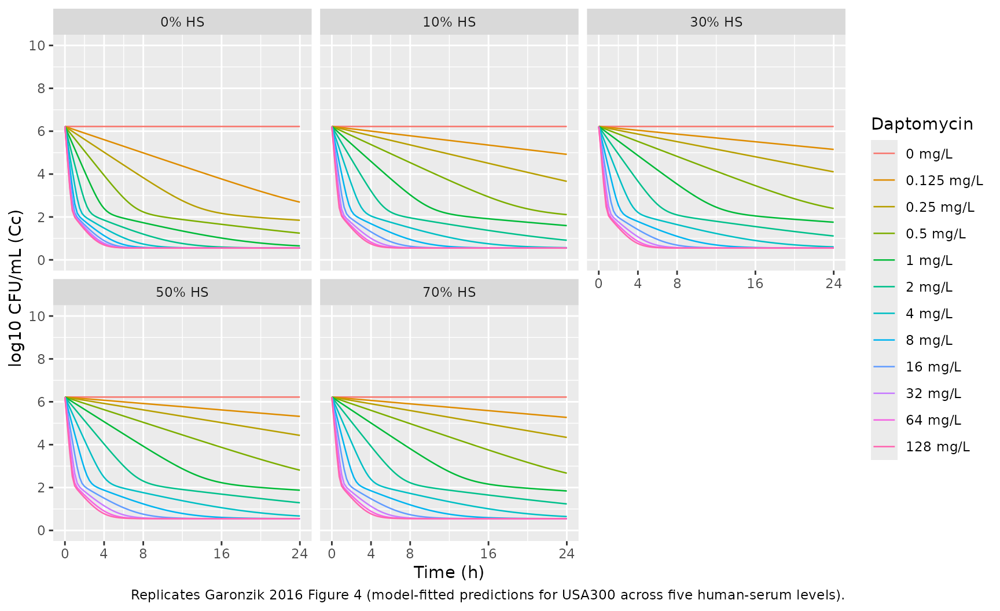
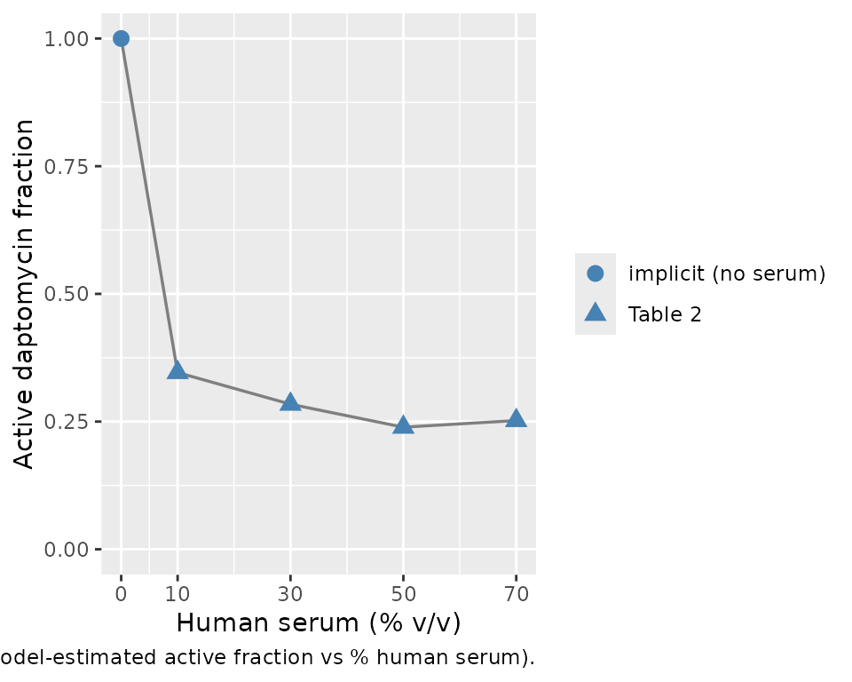

# Daptomycin time-kill against MRSA (Garonzik 2016)

## Model and source

- Citation: Garonzik SM, Lenhard JR, Forrest A, Holden PN, Bulitta JB,
  Tsuji BT. Defining the active fraction of daptomycin against
  methicillin-resistant Staphylococcus aureus (MRSA) using a
  pharmacokinetic and pharmacodynamic approach. PLoS ONE.
  2016;11(6):e0156131. <doi:10.1371/journal.pone.0156131>.
- Description: In vitro (Staphylococcus aureus USA300,
  methicillin-resistant CA-MRSA reference strain). Mechanism-based
  mathematical pharmacodynamic (MBM) model of daptomycin time-kill
  activity in supplemented Mueller-Hinton broth with 0%, 10%, 30%, 50%,
  or 70% v/v heat-inactivated human serum. The bacterial population is
  split into three subpopulations of decreasing daptomycin
  susceptibility (susceptible, intermediate, resistant), each described
  by two states (state 1 vegetative, state 2 replicating; six bacterial
  compartments total). Replication of state 2 cells back into state 1 is
  gated by a successful-replication probability (REP = 2 x Plateau, with
  Plateau saturating at a maximum CFU/mL CFUm), and the
  vegetative-to-replicating transition k12 is modulated by an
  exponential lag-phase term (Eq 3) and a saturable carrying-capacity
  term (Eq 7) parameterised by Imax_k12 and IC50_k12. Daptomycin acts on
  each subpopulation via two mechanisms: a Hill-type stimulation of the
  probability of death (STI; reduces successful replication via IREP =
  1 - STI) and a Hill-type direct killing of bacteria (Kill); the
  relative balance of the two is the dominant pharmacodynamic feature,
  with SC50 (0.05 mg/L) much lower than KC50 (4.8 mg/L). The
  intermediate and resistant subpopulations share the same SC50 and KC50
  but have reduced Smax and Kmax (Smax_r and Kmax_r fixed to 0) and the
  resistant subpopulation has a slower vegetative-to-replicating
  transition (FR_K12r = 0.0442). Protein binding by human serum is
  encoded as an ‘active fraction’ factive(HS) multiplying the total
  static daptomycin concentration to give an effective drug
  concentration DAP_EF; the active fraction takes five experimental
  levels (factive = 1 at 0% HS, then 0.346, 0.284, 0.239, 0.252 at 10%,
  30%, 50%, 70% HS). The model is in-vitro PD only – there is no human
  PK component; daptomycin is dosed once at t = 0 into the dap
  compartment and is chemically stable in the medium for the 24-h
  experiment. Random effects (eta) are NOT present: the paper reports
  replicate-level experimental fits with additive plus small-count
  Poisson residual error on log10 CFU/mL.
- Article: <https://doi.org/10.1371/journal.pone.0156131>

## Population

The packaged model was fit to a 24-hour in-vitro time-kill experiment
using the methicillin-resistant Staphylococcus aureus (MRSA) reference
strain USA300 (NRS 384, FRP3757; daptomycin MIC = 0.5 mg/L). Time-kill
data were also collected for the vancomycin-intermediate strain Mu50
(NRS 4, HIP5836; daptomycin MIC = 1.0 mg/L), but the mechanism-based
mathematical model (MBM) was fit to USA300 only – selected as the most
common pulsed-field gel electrophoresis type in the USA (Garonzik 2016
Methods, “Mechanism Based Mathematical Pharmacodynamic Model”).
Daptomycin concentrations were 0, 0.125, 0.25, 0.5, 1, 2, 4, 8, 16, 32,
64, 128 mg/L (and 256 mg/L per Figure 2 legend) applied as static
concentrations in calcium-supplemented Mueller-Hinton broth (1.1-1.3
mmol/L Ca, 12.5 mg/L Mg) with heat-inactivated human serum at v/v ratios
of 0%, 10%, 30%, 50%, or 70%. Starting inoculum was approximately 10^6
CFU/mL; viable counts were sampled at 0, 1, 2, 4, 8, and 24 h; limit of
detection was 10^2 CFU/mL.

There is no human or animal cohort: this is an in-vitro PD model with
one experimental covariate (`HS`, the percentage of human serum) and no
subject-level demographics. Replicate-to-replicate variability is
captured only via the additive residual standard deviation on log10
CFU/mL; the model carries no IIV / inter-experiment etas. The complete
population metadata is available programmatically via
`readModelDb("Garonzik_2016_daptomycin")$population`.

## Source trace

The MBM couples six bacterial-population states – one vegetative
(state 1) and one replicating (state 2) state for each of three
subpopulations of decreasing daptomycin susceptibility (susceptible `s`,
intermediate `i`, resistant `r`) – with a single static daptomycin
solution compartment `dap`. The published governing equations are
Garonzik 2016 Equations 1-12 (pages 3-6). The load-bearing forms are:

    Eq 2:  DAP_EF = factive(%HS) * Total Daptomycin

    Eq 3:  Lag = 1 - exp(-(klag * t)^beta)

    Eq 7:  Growth(k12es) = Lag * k12 * (1 - Imax_k12 * CFU_total / (CFU_total + IC50_k12))

    Eq 8:  STI_s = Smax_s * DAP_EF / (DAP_EF + SC50)
    Eq 9:  IREP_s = 1 - STI_s
    Eq 10: Kill_s = Kmax_s * DAP_EF / (DAP_EF + KC50)

    Eq 11: dS1/dt = REP * k21 * S2 * IREP_s - k12es * S1 - Kill_s * S1
    Eq 12: dS2/dt = -k21 * S2 + k12es * S1 - Kill_s * S2

(equations for the intermediate and resistant subpopulations have the
same shape with subpopulation-specific Smax, Kmax, and FR_K12
multipliers). The `REP = 2 x Plateau` term in Eq 11 carries the success
probability of bacterial doubling, where
`Plateau = 1 - CFU_total / (CFU_total + CFU_M)` (Eq 5) saturates at the
maximum achievable density `CFU_M = 10^9.20` CFU/mL. The full
per-parameter source trace is recorded as in-file comments next to each
`ini()` entry in
`inst/modeldb/specificDrugs/Garonzik_2016_daptomycin.R`. The table below
collects them in one place. All numeric values come from Garonzik 2016
Table 2.

| Parameter (paper symbol) | File name | Value | Units | Source |
|----|----|---:|----|----|
| factive (10% HS) | `lfact_hs10` | 0.346 | (unitless) | Table 2 |
| factive (30% HS) | `lfact_hs30` | 0.284 | (unitless) | Table 2 |
| factive (50% HS) | `lfact_hs50` | 0.239 | (unitless) | Table 2 |
| factive (70% HS) | `lfact_hs70` | 0.252 | (unitless) | Table 2 |
| factive (0% HS) | (not estimated) | 1.000 | (unitless) | implicit (no serum) |
| Log10CFU0 | `cfu0_log10` | 6.22 | log10 CFU/mL | Table 2 |
| Log10 FR_I | `fri_log10` | -3.65 | log10 (fraction of CFU0) | Table 2 |
| Log10 FR_r | `frr_log10` | -5.67 | log10 (fraction of CFU0) | Table 2 |
| MTT_lag | `lmtt_lag` | 75.5 | h | Table 2 |
| beta (FIXED) | `beta_lag` | 10.0 | (unitless) | Table 2 |
| MTT_K12 | `lmtt_k12` | 20.2 | h | Table 2 |
| Log10 IC50_K12 | `ic50_k12_log10` | 7.81 | log10 CFU/mL | Table 2 |
| Imax_K12 (FIXED) | `imax_k12` | 0.99 | (unitless) | Table 2 |
| K21 (FIXED) | `lk21` | 50.0 | 1/h | Table 2 |
| Log10 CFU_M | `cfum_log10` | 9.20 | log10 CFU/mL | Table 2 |
| FR_K12i (FIXED) | `fr_k12i` | 1.00 | (unitless) | Table 2 |
| FR_K12r | `fr_k12r` | 0.0442 | (unitless) | Table 2 |
| Smax_s (FIXED) | `smax_s` | 0.99 | (unitless) | Table 2 (footnote: “estimated very close to 1; fixed to 0.99”) |
| Smax_i | `smax_i` | 0.515 | (unitless) | Table 2 |
| Smax_r (FIXED) | `smax_r` | 0 | (unitless) | Table 2 (footnote: “estimated close to zero; fixed to 0”) |
| SC50_s | `lsc50` | 0.0468 | mg/L | Table 2 |
| Kmax_s | `lkmax_s` | 14.0 | 1/h | Table 2 |
| Kmax_i | `lkmax_i` | 1.45 | 1/h | Table 2 |
| Kmax_r (FIXED) | `kmax_r` | 0 | 1/h | Table 2 (footnote: “estimated close to zero; fixed to 0”) |
| KC50_s | `lkc50` | 4.81 | mg/L | Table 2 |
| epsilon_CFU | `addSd` | 0.558 | log10 CFU/mL | Table 2 |
| epsilon_Pois (FIXED) | (not included) | 1.00 | (unitless) | Table 2 (Poisson term; deliberate simplification, see deviations) |
| epsilon_Add (FIXED) | (not included) | 0.250 | log10 CFU/mL | Table 2 (extra additive at counts \< 5; deliberate simplification) |

Compartment and observation conventions (see the Assumptions and
deviations section for justification of the non-canonical names):

| Compartment | Units | Meaning |
|----|----|----|
| `dap` | mg/L | static daptomycin bath concentration (no degradation) |
| `bact_susceptible1` | CFU/mL | susceptible subpopulation, state 1 (vegetative) |
| `bact_susceptible2` | CFU/mL | susceptible subpopulation, state 2 (replicating) |
| `bact_intermediate1` | CFU/mL | intermediate subpopulation, state 1 (vegetative) |
| `bact_intermediate2` | CFU/mL | intermediate subpopulation, state 2 (replicating) |
| `bact_resistant1` | CFU/mL | resistant subpopulation, state 1 (vegetative) |
| `bact_resistant2` | CFU/mL | resistant subpopulation, state 2 (replicating) |
| `Cc` | log10 CFU/mL | observation: log10 of total bacterial concentration |

## Helper: build a time-kill scenario

The published experiment used a static daptomycin concentration applied
at t = 0 and a single human-serum percentage per experiment. The helper
below builds an `et()` event table for an arbitrary (DAP, HS)
combination. DAP is inserted as a bolus event into the `dap` compartment
with `amt` interpreted as the initial bath concentration in mg/L; HS is
carried as a constant per-subject covariate.

``` r

mod <- readModelDb("Garonzik_2016_daptomycin")

build_scenario <- function(dap_mgL, hs_pct,
                           times = seq(0, 24, by = 0.25)) {
  ev <- et(times)
  if (dap_mgL > 0) ev <- et(ev, amt = dap_mgL, cmt = "dap", time = 0)
  ev$HS <- hs_pct
  out <- as.data.frame(rxode2::rxSolve(mod, ev))
  out$dap_init <- dap_mgL
  out$hs_pct   <- hs_pct
  out
}
```

## Replicate Figure 4 panels (typical-value)

Garonzik 2016 Figure 4 shows model-fitted predictions (solid lines)
overlaid on observed time-kill data (symbols) for daptomycin against
USA300 at five human-serum levels (panels A-E for 0%, 10%, 30%, 50%,
70%). We reproduce the model-fitted predictions across a representative
set of daptomycin concentrations.

``` r

dap_levels <- c(0, 0.125, 0.25, 0.5, 1, 2, 4, 8, 16, 32, 64, 128)
hs_levels  <- c(0, 10, 30, 50, 70)

grid <- expand.grid(dap = dap_levels, hs = hs_levels, KEEP.OUT.ATTRS = FALSE)

panels <- Map(build_scenario, grid$dap, grid$hs) |> bind_rows()

panels <- panels |>
  mutate(
    hs_label  = factor(paste0(hs_pct, "% HS"),
                       levels = paste0(hs_levels, "% HS")),
    dap_label = factor(sprintf("%.3g mg/L", dap_init),
                       levels = sprintf("%.3g mg/L", dap_levels))
  )

ggplot(panels, aes(time, Cc, group = dap_init, color = dap_label)) +
  geom_line(linewidth = 0.45) +
  facet_wrap(~ hs_label, ncol = 3) +
  scale_y_continuous(limits = c(0, 10), breaks = seq(0, 10, 2)) +
  scale_x_continuous(breaks = c(0, 4, 8, 16, 24)) +
  labs(x = "Time (h)", y = "log10 CFU/mL (Cc)",
       color = "Daptomycin",
       caption = "Replicates Garonzik 2016 Figure 4 (model-fitted predictions for USA300 across five human-serum levels).") +
  theme(legend.position = "right")
```



## Active-fraction recovery (Figure 5)

Garonzik 2016 Figure 5 plots the estimated active fraction against the
percentage of human serum, demonstrating the plateau effect at high
serum exposure. We round-trip the four estimated values plus the
implicit 1.0 at 0% HS:

``` r

factive_tbl <- tibble(
  hs_pct  = c(0, 10, 30, 50, 70),
  factive = c(1.000, 0.346, 0.284, 0.239, 0.252),
  source  = c("implicit (no serum)", rep("Table 2", 4))
)

ggplot(factive_tbl, aes(hs_pct, factive)) +
  geom_line(linewidth = 0.6, color = "grey50") +
  geom_point(aes(shape = source), size = 3, color = "steelblue") +
  scale_y_continuous(limits = c(0, 1), breaks = seq(0, 1, 0.25)) +
  scale_x_continuous(breaks = c(0, 10, 30, 50, 70)) +
  labs(x = "Human serum (% v/v)", y = "Active daptomycin fraction",
       shape = NULL,
       caption = "Replicates Garonzik 2016 Figure 5 (model-estimated active fraction vs % human serum).")
```



The active fraction drops sharply between 0 and 30% HS and then
plateaus, consistent with the paper’s Results / Discussion (“at high
concentrations of human serum, the active fraction value attains a
plateau”). The mild non-monotonicity (factive(70%) = 0.252 slightly
above factive(50%) = 0.239) is the published Table 2 estimate; the paper
attributes the apparent floor to a saturation of daptomycin / albumin
interaction at high serum concentrations.

## Key qualitative checks

**Growth control.** With no drug applied (`dap_init = 0`), CFU_total
must climb from `10^cfu0_log10 = 10^6.22` through the lag phase and
approach the plateau `CFU_M = 10^9.20`. The growth control is identical
across HS levels because human serum was not shown to affect bacterial
growth rate (Garonzik 2016 Results, last paragraph of Mechanism based
modeling).

``` r

gc <- panels |>
  filter(dap_init == 0, time %in% c(0, 4, 8, 24)) |>
  select(hs_label, time, Cc)

gc |>
  pivot_wider(names_from = time, values_from = Cc,
              names_prefix = "Cc_t") |>
  knitr::kable(digits = 3,
               caption = "Growth-control (no daptomycin) log10 CFU/mL at four times across the five HS levels.")
```

| hs_label | Cc_t0 | Cc_t4 | Cc_t8 | Cc_t24 |
|:---------|------:|------:|------:|-------:|
| 0% HS    |  6.22 |  6.22 |  6.22 |   6.22 |
| 10% HS   |  6.22 |  6.22 |  6.22 |   6.22 |
| 30% HS   |  6.22 |  6.22 |  6.22 |   6.22 |
| 50% HS   |  6.22 |  6.22 |  6.22 |   6.22 |
| 70% HS   |  6.22 |  6.22 |  6.22 |   6.22 |

Growth-control (no daptomycin) log10 CFU/mL at four times across the
five HS levels. {.table}

The 24-hour growth-control values converge to ~9.20 (paper `Log10 CFU_M`
= 9.20), matching Figure 4 panel A (top growth-control curve, open
diamonds) which saturates at ~9 log10 CFU/mL.

**Active fraction reduces effective concentration.** At a single
daptomycin level (4 mg/L), increasing HS reduces DAP_EF in proportion to
factive(HS). Effective concentrations are:

``` r

panels |>
  filter(dap_init == 4, time == 0) |>
  transmute(hs_label, dap_init, factive_check = factive,
            dap_eff_check = dap_eff) |>
  knitr::kable(digits = 4,
               caption = "Active fraction and effective daptomycin concentration at 4 mg/L total daptomycin, per HS level.")
```

| hs_label | dap_init | factive_check | dap_eff_check |
|:---------|---------:|--------------:|--------------:|
| 0% HS    |        4 |         1.000 |         4.000 |
| 10% HS   |        4 |         0.346 |         1.384 |
| 30% HS   |        4 |         0.284 |         1.136 |
| 50% HS   |        4 |         0.239 |         0.956 |
| 70% HS   |        4 |         0.252 |         1.008 |

Active fraction and effective daptomycin concentration at 4 mg/L total
daptomycin, per HS level. {.table}

**Resistant subpopulation survives.** Because Smax_r and Kmax_r are both
fixed at zero, daptomycin has no direct effect on the resistant
subpopulation. At 24 h after a bactericidal regimen (e.g., 4 mg/L at 0%
HS), the residual CFU_total is dominated by `bact_resistant1` +
`bact_resistant2`:

``` r

res <- panels |>
  filter(dap_init == 4, hs_pct == 0, time == 24) |>
  select(time, cfu_total, bact_susceptible1, bact_susceptible2, bact_intermediate1, bact_intermediate2, bact_resistant1, bact_resistant2)

res |> knitr::kable(digits = 3,
  caption = "Compartment-level state at 24 h after 4 mg/L daptomycin at 0% HS. The residual is essentially the resistant subpopulation; susceptible and intermediate are below the limit of detection.")
```

| time | cfu_total | bact_susceptible1 | bact_susceptible2 | bact_intermediate1 | bact_intermediate2 | bact_resistant1 | bact_resistant2 |
|---:|---:|---:|---:|---:|---:|---:|---:|
| 24 | 3.548 | 0 | 0 | 0 | 0 | 3.548 | 0 |

Compartment-level state at 24 h after 4 mg/L daptomycin at 0% HS. The
residual is essentially the resistant subpopulation; susceptible and
intermediate are below the limit of detection. {.table}

**Bactericidal threshold.** Garonzik 2016 reports that bactericidal
activity (\>=3.0 log10 CFU/mL reduction from inoculum, i.e., Cc \<=
3.22) is reached by 24 h for all DAP \>= 2 mg/L irrespective of HS
(Results, Time-kill experiments). Check the 24-hour values across the
grid:

``` r

panels |>
  filter(dap_init %in% c(0.25, 0.5, 1, 2, 4, 8), time == 24) |>
  select(hs_label, dap_label, Cc) |>
  pivot_wider(names_from = dap_label, values_from = Cc) |>
  knitr::kable(digits = 2,
    caption = "log10 CFU/mL at 24 h across a daptomycin x HS grid. Compare against Figure 4 right-edge endpoints; entries <= 3.22 satisfy the 99.9% bactericidal threshold.")
```

| hs_label | 0.25 mg/L | 0.5 mg/L | 1 mg/L | 2 mg/L | 4 mg/L | 8 mg/L |
|:---------|----------:|---------:|-------:|-------:|-------:|-------:|
| 0% HS    |      1.85 |     1.24 |   0.65 |   0.55 |   0.55 |   0.55 |
| 10% HS   |      3.66 |     2.11 |   1.60 |   0.91 |   0.57 |   0.55 |
| 30% HS   |      4.11 |     2.40 |   1.76 |   1.11 |   0.61 |   0.55 |
| 50% HS   |      4.43 |     2.81 |   1.88 |   1.29 |   0.67 |   0.55 |
| 70% HS   |      4.34 |     2.67 |   1.84 |   1.24 |   0.65 |   0.55 |

log10 CFU/mL at 24 h across a daptomycin x HS grid. Compare against
Figure 4 right-edge endpoints; entries \<= 3.22 satisfy the 99.9%
bactericidal threshold. {.table}

## Comparison against published Hill-type parameters (Table 1)

Garonzik 2016 Table 1 reports a separate Hill-type concentration-effect
fit (Eq 1B, log-ratio area vs daptomycin C / MIC) for USA300 at each HS
level. The MBM model and the log-ratio Hill fit are independent analyses
of the same time-kill data, so the MBM round-trip at 24 h should be
qualitatively consistent with Table 1’s shift towards lower Emax and
higher EC50 with increasing HS. The Hill-fit numbers themselves are not
parameters of this packaged model and are reproduced here purely for
reference:

| Human Serum | E_max | EC50 (xMIC) |    H |
|-------------|------:|------------:|-----:|
| 0%          |  4.63 |       0.189 | 6.19 |
| 10%         |  4.12 |       0.354 | 7.17 |
| 30%         |  4.22 |       0.694 | 5.29 |
| 50%         |  4.20 |       0.680 | 4.07 |
| 70%         |  3.51 |       0.905 |   10 |

## Assumptions and deviations

- **Non-canonical compartment names** (`dap`, `bact_susceptible1`,
  `bact_susceptible2`, `bact_intermediate1`, `bact_intermediate2`,
  `bact_resistant1`, `bact_resistant2`). The nlmixr2lib canonical
  compartment register (`R/conventions.R::canonicalCompartments`)
  targets popPK / PK-PD models for systemic drug disposition; the
  bacterial-subpopulation state names here have no analog in that
  register. The names are retained from Garonzik 2016 (paper Methods,
  “Model for Bacterial Life Cycle”) to keep the source trace direct.
  [`checkModelConventions()`](https://nlmixr2.github.io/nlmixr2lib/reference/checkModelConventions.md)
  emits compartment-name warnings; they are expected and documented
  here, matching the precedent set by
  `Wicha_2017_linezolid_meropenem_vancomycin.R` and
  `Sadouki_2025_meropenem_gentamicin_ciprofloxacin.R`.
- **HS covariate not in the canonical register.** `HS` is an in-vitro
  experimental indicator (the percent v/v of human serum supplementing
  the broth) – not a clinical-trial patient covariate. The canonical
  register at `inst/references/covariate-columns.md` is for human pop-PK
  covariates and does not apply. The same precedent is set by
  `MER_PRESENT`, `Cgen`, and `LOWINOC` in
  `Sadouki_2025_meropenem_gentamicin_ciprofloxacin.R`.
- **HS treated as a discrete five-level factor, not a continuous
  variable.** factive(HS) is encoded as five fixed estimates – one per
  experimental HS level (0%, 10%, 30%, 50%, 70%). HS values outside this
  set yield `factive = 0` inside the model (none of the indicator
  expressions fire), which is a deliberately conspicuous failure rather
  than a silent interpolation. The paper plots an apparent continuous
  curve in Figure 5 but only estimates four points; interpolation is the
  user’s choice and is left out of the packaged model.
- **Single observation `Cc` carries log10 CFU/mL, not a drug
  concentration.** nlmixr2lib’s single-output convention names the
  observation `Cc`; the underlying quantity here is log10 of total
  bacterial CFU/mL. The `units$concentration` metadata makes this
  explicit.
  [`checkModelConventions()`](https://nlmixr2.github.io/nlmixr2lib/reference/checkModelConventions.md)
  warns that `units$dosing` (mg/L) and the observation numerator (log10
  CFU) appear dimensionally incompatible – this is intentional: dosing
  is an in-vitro bath concentration, observation is a bacterial count.
- **Daptomycin compartment holds bath concentration, not mass.** The
  `dap` compartment is initialised via a bolus dosing event at
  `time = 0` whose `amt` field is interpreted as the initial bath
  concentration in mg/L. The state subsequently evolves according to
  `d/dt(dap) <- 0` (chemically stable in the medium over the 24-h
  experiment per Methods). To re-use the model with time-varying
  daptomycin (e.g., to couple a separately built popPK model), replace
  the static dose with time-varying `dap` inputs.
- **Bacterial counts on linear scale internally.** Table 2 reports CFU0,
  FR_I, FR_R, CFU_M, and IC50_K12 in log10 units; the ODEs operate on
  linear CFU/mL. The model converts in `model()`:
  `cfu0 <- 10^cfu0_log10`, `cfu_m <- 10^cfum_log10`, etc. A `1e-6` floor
  is added inside the `log10(...)` observation to avoid `log10(0)` when
  all bacterial states are driven to zero by combined high-DAP + low-HS
  regimens.
- **Residual error simplified to the dominant additive term.** Garonzik
  2016 Table 2 reports three residual variability components: an
  additive term on log10 CFU/mL (`epsilon_CFU = 0.558`, estimated), a
  Poisson-style term (`epsilon_Pois = 1.00`, FIXED), and an additional
  additive term active when counts fall below 5 colonies
  (`epsilon_Add = 0.250`, FIXED). The packaged model carries only the
  dominant additive `epsilon_CFU` via `addSd`; the Poisson and
  small-count additive components are omitted. The simplification is
  acceptable for typical-value simulation well above the limit of
  detection (~log10 CFU = 2) but understates noise near the LOD. The
  Bulitta-style combined residual structure could be added if a future
  user needs precise low-count behaviour, but it is not a standard
  nlmixr2 residual form and is not portable across estimation backends.
- **No IIV / random effects.** Garonzik 2016 reports a typical-value fit
  only; no inter-replicate or inter-subpopulation etas. Reported
  relative standard errors (Table 2 “Estimate (SE%)”) quantify parameter
  uncertainty, not between-subject variability. The full
  variance-covariance matrix is not published, so this vignette plots
  typical-value trajectories only.
- **MBM was fit to USA300 only.** Mu50 (VISA, daptomycin MIC = 1.0 mg/L)
  time-kill data were collected and Hill-type parameters were reported
  (Table 1, right half) but the MBM (Table 2) was fit to USA300 only.
  This packaged model is therefore strain-specific to USA300; reusing it
  for Mu50 would understate the killing concentrations because Mu50 has
  twice the MIC of USA300.
- **Out-of-scope: clinical (in-vivo) PK linkage.** Garonzik 2016 is an
  in-vitro pharmacodynamic paper; there is no human PK model in this
  publication. A pharmacist or clinician wanting to simulate dosing
  regimens in humans must couple the present PD model to a separate
  published daptomycin popPK model and route time-varying plasma
  daptomycin concentrations into the `dap` compartment. The “active
  fraction” concept in this paper supersedes the conventional “free
  fraction” assumption when scaling to human serum concentrations
  (Discussion, page 8).
- **`factive(0%)` was not estimated.** The paper estimates factive at
  the four serum-containing levels (10%, 30%, 50%, 70%) and treats the
  0% case as the unbound reference (factive = 1 by construction, no
  protein binding). The packaged model encodes this by forcing
  `factive = 1` when `HS = 0`; the value is not a `ini()` parameter and
  is not tabulated in Table 2.
