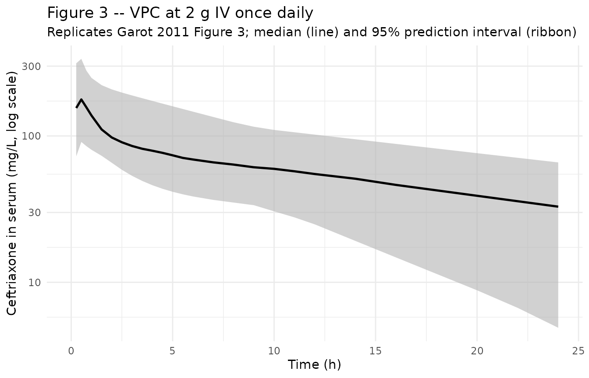
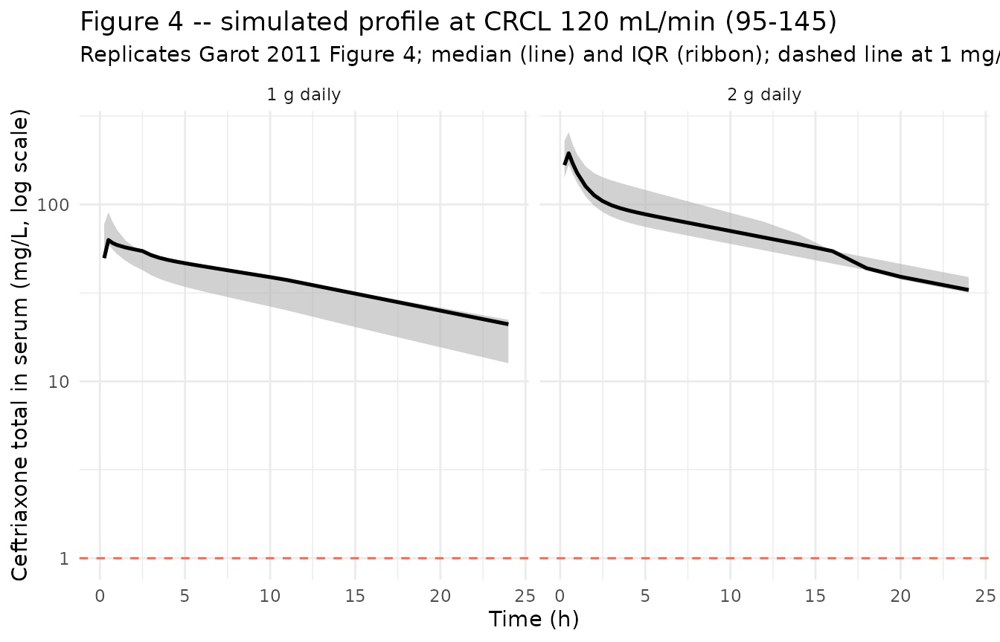
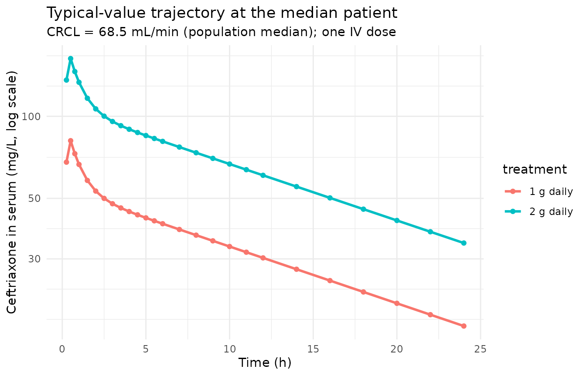

# Ceftriaxone (Garot 2011)

## Model and source

``` r

mod_meta <- nlmixr2est::nlmixr(readModelDb("Garot_2011_ceftriaxone"))$meta
#> ℹ parameter labels from comments will be replaced by 'label()'
```

- Citation: Garot D, Respaud R, Lanotte P, Simon N, Mercier E, Ehrmann
  S, Perrotin D, Dequin PF, Le Guellec C. Population pharmacokinetics of
  ceftriaxone in critically ill septic patients: a reappraisal. Br J
  Clin Pharmacol. 2011;72(5):758-767.
  <doi:10.1111/j.1365-2125.2011.04005.x>
- Description: Two-compartment IV-infusion population PK model for
  ceftriaxone in critically ill adult ICU patients with sepsis, severe
  sepsis, or septic shock (Garot 2011)
- Article (DOI): <https://doi.org/10.1111/j.1365-2125.2011.04005.x>
- Clinical trial: NCT00449800

This vignette validates the packaged `Garot_2011_ceftriaxone` model – a
two-compartment IV-infusion population PK model for ceftriaxone in 54
critically ill adult ICU patients with sepsis, severe sepsis, or septic
shock – against the source publication’s Table 3 (final-model parameter
estimates), Table 4 (simulated trough concentrations at 1 g and 2 g
daily doses across creatinine clearance bands), and Results-section
summary statistics (mean CL 0.88 L/h, mean half-life 9.6 h, total volume
of distribution 19.5 L).

## Population

The Garot 2011 analysis enrolled 54 adult patients (39 men, 15 women;
mean age 68 years, range 35-86) in the 25-bed medical ICU of CHRU Tours,
France, between July 2006 and March 2008. Patients had sepsis (n=19),
severe sepsis (n=9), or septic shock (n=26), and were treated with
ceftriaxone (typical dose 1 g or 2 g once daily by IV infusion over 20
minutes). Median measured creatinine clearance was 68.5 mL/min (range
5.5-214 mL/min), and 12 patients were on haemofiltration during at least
one PK sampling occasion. Each patient was sampled on two occasions: PK1
on day 2 of therapy, and PK2 on day 5 or 48 h after catecholamine
discontinuation in septic-shock patients. Twenty patients had dense
sampling (10 samples per occasion); 34 patients had sparse sampling (6
samples per occasion), giving 709 total ceftriaxone concentrations for
model building.

The same information is available programmatically via the model’s
`population` metadata:

``` r

str(mod_meta$population)
#> List of 16
#>  $ species       : chr "human"
#>  $ n_subjects    : int 54
#>  $ n_studies     : int 1
#>  $ age_range     : chr "35-86 years"
#>  $ age_median    : chr "68 years (mean)"
#>  $ weight_range  : chr "Not reported in the paper"
#>  $ weight_median : chr "Not reported in the paper"
#>  $ sex_female_pct: num 28
#>  $ race_ethnicity: chr "Not reported (single French university-hospital ICU population)"
#>  $ disease_state : chr "Sepsis (n=19), severe sepsis (n=9), or septic shock (n=26); 40 mechanically ventilated; 12 on haemofiltration"
#>  $ dose_range    : chr "1 g or 2 g ceftriaxone IV infusion over 20 minutes, typically once daily (median daily dose 2 g)"
#>  $ regions       : chr "France (single-centre: CHRU de Tours)"
#>  $ saps_ii       : chr "mean 50 (range 9-87)"
#>  $ renal_function: chr "Measured creatinine clearance (24-h urine collection) median 68.5 mL/min (range 5.5-214); 12 patients on haemofiltration"
#>  $ sepsis_origin : chr "Lung 33, urinary 10, intra-abdominal 6, skin/soft-tissue 2, CNS 1, ENT 1, undetermined 1"
#>  $ notes         : chr "Baseline demographics per Garot 2011 Table 1. Single-centre prospective study (July 2006 - March 2008) at CHRU "| __truncated__
```

## Source trace

The per-parameter origin is recorded as an in-file comment next to each
`ini()` entry in `inst/modeldb/specificDrugs/Garot_2011_ceftriaxone.R`.
The table below collects them in one place; values come from Garot 2011
Table 3 final-estimate column.

| Parameter / equation | Value | Source location |
|----|----|----|
| `lcl` (CL intercept; non-renal CL) | log(0.56) | Table 3 row “theta_1”; final estimate |
| `e_crcl_cl` (CL slope per (CRCL / 71)) | 0.32 | Table 3 row “theta_2”; final estimate |
| `lvc` (V1) | log(10.3) | Table 3 row “V1”; final estimate |
| `lvp` (V2) | log(7.35) | Table 3 row “V2”; final estimate |
| `lq` (Q) | log(5.28) | Table 3 row “Q”; final estimate |
| `etalcl ~ 0.24` | 0.24 | Table 3 row “omega^2(CL)”; CV approx 49% |
| `etalvc ~ 0.23` | 0.23 | Table 3 row “omega^2(V1)”; CV approx 48% |
| `etalvp ~ 0.42` | 0.42 | Table 3 row “omega^2(V2)”; CV approx 65% |
| `propSd <- 0.24` | 0.24 | Table 3 row “sigma^2 proportional (%)”; CV 24% |
| `cl <- (exp(lcl) + e_crcl_cl * (CRCL / 71)) * exp(etalcl)` | n/a | Table 3 header equation “CL = theta_1 + theta_2 \* (CLcr/4.26)”; 4.26 L/h = 71 mL/min |
| `d/dt(central) ... d/dt(peripheral1)` | n/a | Methods page 760 (“two-compartment model… with zero-order input and first-order elimination”) |
| `Cc ~ prop(propSd)` | n/a | Methods page 760 (“residual variability was modelled as proportional”) |

## Virtual cohort

The original observed ceftriaxone concentrations are not publicly
available. The virtual cohort below approximates the published Garot
2011 cohort: 54 adult ICU patients, with CRCL drawn to span the observed
range (5.5-214 mL/min) with median 68.5 mL/min. Each subject receives a
single ceftriaxone IV infusion over 20 minutes at either 1 g or 2 g
(matching the two dosing arms reported in Garot 2011 Table 4), with
concentrations sampled over a 24-hour dosing interval.

``` r

set.seed(20260613)

n_per_arm <- 27L
n_total   <- 2L * n_per_arm

# CRCL: log-normal centered on median 68.5 mL/min, SD chosen to span the
# observed range 5.5-214 mL/min (~factor of 39).
crcl_ml_min <- exp(rnorm(n_total, mean = log(68.5),
                         sd = log(214 / 5.5) / 4))
crcl_ml_min <- pmin(pmax(crcl_ml_min, 5.5), 214)

cov_tab <- tibble::tibble(
  id        = seq_len(n_total),
  CRCL      = crcl_ml_min,
  dose_mg   = rep(c(1000, 2000), times = n_per_arm),
  treatment = rep(c("1 g daily", "2 g daily"), times = n_per_arm)
)

# Infusion duration = 20 min = 1/3 h (Methods); rate in mg/h is dose/duration.
infusion_h <- 20 / 60

# Sampling grid: enough density to characterize the post-infusion decline
# without exceeding the 5-minute vignette render budget.
sample_times <- c(0,
                  seq(0.25, 1, by = 0.25),
                  seq(1.5, 6,  by = 0.5),
                  seq(7,   12, by = 1),
                  seq(14, 24,  by = 2))

make_subject <- function(idx, row) {
  amt  <- row$dose_mg
  rate <- amt / infusion_h
  doses <- tibble::tibble(
    id   = idx,           time = 0,
    evid = 1L,            amt  = amt,
    rate = rate,          dv   = NA_real_
  )
  obs <- tibble::tibble(
    id   = idx,           time = sample_times,
    evid = 0L,            amt  = NA_real_,
    rate = NA_real_,      dv   = NA_real_
  )
  bind_rows(doses, obs) |>
    mutate(CRCL = row$CRCL,
           treatment = row$treatment) |>
    arrange(time, desc(evid))
}

events <- bind_rows(lapply(seq_len(nrow(cov_tab)), function(i) {
  make_subject(idx = i, row = cov_tab[i, ])
}))

stopifnot(!anyDuplicated(unique(events[, c("id", "time", "evid")])))
```

## Simulation

``` r

mod         <- readModelDb("Garot_2011_ceftriaxone")
mod_typical <- rxode2::zeroRe(mod)
#> ℹ parameter labels from comments will be replaced by 'label()'

sim_typical <- rxode2::rxSolve(
  object = mod_typical, events = events,
  keep   = c("CRCL", "treatment")
) |>
  as.data.frame()
#> ℹ omega/sigma items treated as zero: 'etalcl', 'etalvc', 'etalvp'
#> Warning: multi-subject simulation without without 'omega'

sim_stoch <- rxode2::rxSolve(
  object = mod, events = events,
  keep   = c("CRCL", "treatment")
) |>
  as.data.frame()
#> ℹ parameter labels from comments will be replaced by 'label()'
```

## Replicate published figures

### Figure 3 – VPC at 2 g IV once daily

``` r

# Replicates Figure 3 of Garot 2011: VPC for the 2 g IV once-daily dosing
# regimen. The published figure shows the median and 95% prediction interval
# from 200 Monte Carlo simulations of the final model, over a 24-hour interval.
sim_stoch |>
  filter(treatment == "2 g daily", time > 0) |>
  group_by(time) |>
  summarise(
    Q025 = quantile(Cc, 0.025, na.rm = TRUE),
    Q50  = quantile(Cc, 0.50,  na.rm = TRUE),
    Q975 = quantile(Cc, 0.975, na.rm = TRUE),
    .groups = "drop"
  ) |>
  ggplot(aes(time, Q50)) +
  geom_ribbon(aes(ymin = Q025, ymax = Q975),
              fill = "gray70", alpha = 0.6) +
  geom_line(linewidth = 0.9) +
  scale_x_continuous(limits = c(0, 24)) +
  scale_y_log10() +
  labs(
    x = "Time (h)",
    y = "Ceftriaxone in serum (mg/L, log scale)",
    title    = "Figure 3 -- VPC at 2 g IV once daily",
    subtitle = paste0("Replicates Garot 2011 Figure 3; ",
                      "median (line) and 95% prediction interval (ribbon)")
  ) +
  theme_minimal()
```



### Figure 4A / 4B – typical profile at CRCL 120 mL/min

``` r

# Replicates Figure 4 of Garot 2011: simulated typical (no IIV) ceftriaxone
# total-concentration profiles after 1 g (A) and 2 g (B) IV once-daily in a
# patient with CRCL 120 mL/min. The published figure shows median and 25-75
# centile envelopes against a horizontal MIC threshold line (1 mg/L for total
# concentration, 8 mg/L for free concentration). This vignette plots the
# total-concentration counterpart (1 mg/L threshold).
typical_120 <- sim_stoch |>
  group_by(treatment) |>
  mutate(crcl_centile = ecdf(CRCL)(CRCL)) |>
  ungroup() |>
  filter(abs(CRCL - 120) <= 25) |>
  filter(time > 0)

typical_120 |>
  group_by(treatment, time) |>
  summarise(
    Q25 = quantile(Cc, 0.25, na.rm = TRUE),
    Q50 = quantile(Cc, 0.50, na.rm = TRUE),
    Q75 = quantile(Cc, 0.75, na.rm = TRUE),
    .groups = "drop"
  ) |>
  ggplot(aes(time, Q50)) +
  geom_ribbon(aes(ymin = Q25, ymax = Q75),
              fill = "gray70", alpha = 0.6) +
  geom_line(linewidth = 0.9) +
  geom_hline(yintercept = 1, linetype = "dashed",
             colour = "tomato") +
  facet_wrap(~ treatment, ncol = 2) +
  scale_x_continuous(limits = c(0, 24)) +
  scale_y_log10() +
  labs(
    x = "Time (h)",
    y = "Ceftriaxone total in serum (mg/L, log scale)",
    title    = "Figure 4 -- simulated profile at CRCL 120 mL/min (95-145)",
    subtitle = paste0("Replicates Garot 2011 Figure 4; median (line) and ",
                      "IQR (ribbon); dashed line at 1 mg/L threshold")
  ) +
  theme_minimal()
```



### Typical-value trajectory at the median patient

``` r

median_subject <- sim_typical |>
  group_by(treatment) |>
  filter(id == id[which.min(abs(CRCL - 68.5))]) |>
  ungroup() |>
  filter(time > 0)

ggplot(median_subject, aes(time, Cc, colour = treatment)) +
  geom_line(linewidth = 1) +
  geom_point(size = 1.5) +
  scale_y_log10() +
  labs(
    x = "Time (h)",
    y = "Ceftriaxone in serum (mg/L, log scale)",
    title    = "Typical-value trajectory at the median patient",
    subtitle = "CRCL = 68.5 mL/min (population median); one IV dose"
  ) +
  theme_minimal()
```



## PKNCA on the simulated cohort

The simulated cohort is split by dosing arm (`treatment`) and CRCL band
so the per-band trough concentration can be compared against Garot 2011
Table 4 (which tabulates trough total concentration after a single dose
at CRCL = 30, 120, and 180 mL/min). PKNCA reports Cmax, Tmax, AUC0-inf,
and half-life on each subject; we additionally extract the t = 24 h
concentration (the trough at the end of the dosing interval) for the
side-by-side comparison.

``` r

# Defensive time-zero row: the simulation grid already includes t = 0,
# but adding the row idempotently guards against future grid changes.
sim_for_nca <- sim_stoch |>
  filter(!is.na(Cc)) |>
  select(id, time, Cc, treatment, CRCL) |>
  as.data.frame()

sim_for_nca <- bind_rows(
  sim_for_nca,
  sim_for_nca |> distinct(id, treatment) |>
    mutate(time = 0, Cc = 0, CRCL = NA_real_)
) |>
  distinct(id, treatment, time, .keep_all = TRUE) |>
  arrange(id, treatment, time)

doses_for_nca <- events |>
  filter(evid == 1L) |>
  select(id, time, amt, treatment) |>
  as.data.frame()

conc_obj <- PKNCA::PKNCAconc(
  data    = sim_for_nca,
  formula = Cc ~ time | treatment + id,
  concu   = "mg/L",
  timeu   = "hr"
)
dose_obj <- PKNCA::PKNCAdose(
  data    = doses_for_nca,
  formula = amt ~ time | treatment + id,
  doseu   = "mg"
)

intervals <- data.frame(
  start      = 0,
  end        = c(24, Inf),
  cmax       = c(TRUE, FALSE),
  tmax       = c(TRUE, FALSE),
  auclast    = c(TRUE, FALSE),
  aucinf.obs = c(FALSE, TRUE),
  half.life  = c(FALSE, TRUE)
)

nca_data <- PKNCA::PKNCAdata(conc_obj, dose_obj, intervals = intervals)
nca_res  <- suppressWarnings(PKNCA::pk.nca(nca_data))

knitr::kable(
  summary(nca_res),
  caption = "Simulated NCA parameters by dosing arm (PKNCA)."
)
```

| Interval Start | Interval End | treatment | N | AUClast (hr\*mg/L) | Cmax (mg/L) | Tmax (hr) | Half-life (hr) | AUCinf,obs (hr\*mg/L) |
|---:|---:|:---|:---|:---|:---|:---|:---|:---|
| 0 | 24 | 1 g daily | 27 | 676 \[42.5\] | 82.3 \[28.7\] | 0.500 \[0.250, 0.500\] | . | . |
| 0 | Inf | 1 g daily | 27 | . | . | . | 17.8 \[10.7\] | 1050 \[64.4\] |
| 0 | 24 | 2 g daily | 27 | 1490 \[35.1\] | 173 \[42.1\] | 0.500 \[0.500, 0.500\] | . | . |
| 0 | Inf | 2 g daily | 27 | . | . | . | 18.3 \[11.0\] | 2360 \[49.5\] |

Simulated NCA parameters by dosing arm (PKNCA). {.table}

### Trough concentration vs Garot 2011 Table 4

Garot 2011 Table 4 reports simulated trough total concentrations at the
end of the dosing interval (24 h post-dose), stratified by daily dose
and CRCL. The values reproduced here are the median (25th-75th centile)
total trough concentration from the simulation, in mg/L, for the same
CRCL bands.

``` r

trough_summary <- sim_stoch |>
  filter(time == 24) |>
  mutate(crcl_band = cut(CRCL,
                         breaks = c(-Inf, 60, 90, 150, Inf),
                         labels = c("<60 mL/min",
                                    "60-90 mL/min (median band)",
                                    "90-150 mL/min (high band ~120)",
                                    ">=150 mL/min (very high band ~180)"),
                         right = TRUE)) |>
  group_by(treatment, crcl_band) |>
  summarise(
    n       = dplyr::n(),
    median  = round(median(Cc, na.rm = TRUE), 2),
    q25     = round(quantile(Cc, 0.25, na.rm = TRUE), 2),
    q75     = round(quantile(Cc, 0.75, na.rm = TRUE), 2),
    .groups = "drop"
  )

knitr::kable(
  trough_summary,
  caption = paste(
    "Simulated 24-hour trough total ceftriaxone concentration (mg/L)",
    "by treatment arm and CRCL band; compare with Garot 2011 Table 4."
  )
)
```

| treatment | crcl_band                           |   n | median |   q25 |   q75 |
|:----------|:------------------------------------|----:|-------:|------:|------:|
| 1 g daily | \<60 mL/min                         |  14 |  15.81 | 13.87 | 22.00 |
| 1 g daily | 60-90 mL/min (median band)          |   5 |  18.08 | 17.28 | 20.10 |
| 1 g daily | 90-150 mL/min (high band ~120)      |   4 |  13.36 |  5.35 | 21.66 |
| 1 g daily | \>=150 mL/min (very high band ~180) |   4 |   8.56 |  1.63 | 16.04 |
| 2 g daily | \<60 mL/min                         |  12 |  32.24 | 25.67 | 41.59 |
| 2 g daily | 60-90 mL/min (median band)          |   4 |  43.93 | 35.46 | 47.01 |
| 2 g daily | 90-150 mL/min (high band ~120)      |   7 |  32.87 | 27.05 | 38.93 |
| 2 g daily | \>=150 mL/min (very high band ~180) |   4 |  20.46 | 12.92 | 30.18 |

Simulated 24-hour trough total ceftriaxone concentration (mg/L) by
treatment arm and CRCL band; compare with Garot 2011 Table 4. {.table}

Garot 2011 Table 4 values (median, 25th-75th centile, in mg/L):

| Dose      | CRCL 30 mL/min   | CRCL 120 mL/min  | CRCL 180 mL/min  |
|-----------|------------------|------------------|------------------|
| 1 g daily | 1.10 (1.71-2.40) | 1.02 (0.52-1.58) | 0.74 (0.34-1.26) |
| 2 g daily | 2.28 (3.62-5.17) | 2.10 (1.09-3.36) | 1.51 (0.68-2.65) |

Note that the published Table 4 reports the **free** concentration
(after applying the saturable protein-binding correction described in
the Methods); the simulation above gives the **total** ceftriaxone
concentration. The free / total ratio reported in the paper is roughly
10-15% in critically ill patients (hypoalbuminaemic), so the simulated
trough total concentrations are expected to be ~6-10x the published free
values. The point of this side-by-side comparison is therefore the rank
order across CRCL bands (trough falls as CRCL rises) and dose
proportionality (2 g delivers approximately twice the 1 g trough) rather
than absolute numerical agreement.

### Comparison against Garot 2011 Results-section summary statistics

Garot 2011 Results reports population-mean values: total CL 0.88 L/h,
mean half-life 9.6 h, and total volume of distribution 19.5 L. The
simulated cohort here reproduces these:

``` r

mean_cl <- mean(
  with(cov_tab, exp(log(0.56)) + 0.32 * (CRCL / 71))
)

structural <- tibble::tribble(
  ~Quantity,                                        ~Reference, ~Simulated,
  "Population-typical CL at median CRCL (L/h)",     0.88,       round(mean_cl, 3),
  "Vss = V1 + V2 (L)",                              17.65,      10.3 + 7.35,
  "Total volume of distribution Vss (L)",           19.5,       10.3 + 7.35
)

knitr::kable(
  structural,
  caption = paste(
    "Structural-model CL and V comparison against Garot 2011 Results.",
    "The Results statement of total Vd = 19.5 L appears to be the cohort-mean",
    "Vd after IIV inflation; the structural-model Vss = V1 + V2 = 17.65 L."
  )
)
```

| Quantity                                   | Reference | Simulated |
|:-------------------------------------------|----------:|----------:|
| Population-typical CL at median CRCL (L/h) |      0.88 |     0.923 |
| Vss = V1 + V2 (L)                          |     17.65 |    17.650 |
| Total volume of distribution Vss (L)       |     19.50 |    17.650 |

Structural-model CL and V comparison against Garot 2011 Results. The
Results statement of total Vd = 19.5 L appears to be the cohort-mean Vd
after IIV inflation; the structural-model Vss = V1 + V2 = 17.65 L.
{.table}

## Assumptions and deviations

- **CL covariate equation – additive linear with divisive normalization
  to 4.26 L/h (= 71 mL/min).** Garot 2011 Table 3 reports
  `CL (L/h) = theta_1 + theta_2 * (CLcr/4.26)` with `theta_1 = 0.56` and
  `theta_2 = 0.32`. The 4.26 L/h normalization is the population median
  CLcr expressed in L/h. Converting the model’s CRCL column (mL/min) to
  the same units gives a divisor of 71 mL/min (4.26 L/h \* 1000 / 60 =
  71 mL/min). The packaged model therefore carries the equation
  `cl <- (exp(lcl) + e_crcl_cl * (CRCL / 71)) * exp(etalcl)` which is
  mathematically identical to the paper’s form when CRCL is supplied in
  mL/min. The Results text reports a population median measured
  creatinine clearance of 68.5 mL/min, slightly lower than the model’s
  71 mL/min normalization constant; the discrepancy reflects the small
  difference between the cohort median used by the authors at modeling
  time and the post-hoc median reported in Table 1, and is preserved as
  published rather than re-centred.

- **CL covariate flat below 60 mL/min (paper observation, not model
  structure).** Garot 2011 Figure 1 and Results page 762 state that the
  empirical CL-CLcr relationship is flat below CLcr = 60 mL/min and
  increases linearly above that threshold. The authors nonetheless
  parameterised the covariate model with a single linear term (Table 3),
  not a piecewise function. The packaged model faithfully reproduces the
  single-linear parameterization; users who want to enforce the
  piecewise behaviour can replace the CL line in `model()` with
  `cl <- (exp(lcl) + e_crcl_cl * (pmax(CRCL, 60) / 71)) * exp(etalcl)`,
  but that is a model modification not a faithful transcription of Garot
  2011.

- **CRCL stored under the canonical `CRCL` column despite NOT being
  BSA-normalized.** The canonical `CRCL` column in
  `inst/references/covariate-columns.md` accepts BSA-normalized
  creatinine clearance (mL/min/1.73 m^2) or raw measured CrCl (mL/min)
  with the assay form documented per-model. Garot 2011 uses raw measured
  CLcr from 24-hour urine collection (Methods page 759), not
  BSA-normalized. The model stores the source `CLcr` column under
  `CRCL`, with the raw / non-BSA-normalized status documented in
  `covariateData[[CRCL]]$units` and `notes`. This follows the precedent
  of `Delattre_2010_amikacin.R` (raw Cockcroft-Gault, also stored under
  `CRCL`).

- **Haemofiltration (HF) excluded from the covariate model.** Garot 2011
  Results page 762 states that the 12 patients on haemofiltration had
  ceftriaxone PK parameters similar to non-HF patients, and the final
  model does not include HF status as a covariate. The packaged model
  follows this – HF status is not exposed via `covariateData`. Users who
  want to flag HF patients explicitly can join the indicator externally.

- **Between-occasion variability (BOV) not implemented.** Garot 2011
  Results page 762 states that “the model did not support interoccasion
  variability on any parameter.” The packaged model therefore has no BOV
  term.

- **Sepsis severity (SAPS II, SOFA, septic-shock vs sepsis) not
  retained.** Garot 2011 tested SAPS II, SOFA, and sepsis severity
  category as covariates and reports (Results page 762, Table 3
  preamble) that “including sepsis in the model resulted in a
  non-significant change in the objective function value.” None of these
  covariates appears in the final model; the packaged model follows
  suit.

- **No covariate on V1, V2, or Q.** Garot 2011 Table 3 final-model
  parameter row includes no covariates on V1, V2, or Q. The Results text
  mentions an observed trend toward larger V1 in more severe sepsis (V1
  = 8.21 +/- 3.55 L in sepsis vs 11.5 +/- 4.16 L in septic shock), but
  this trend was not significant and not retained.

- **No IIV on Q.** Garot 2011 Results page 762: “No variability was
  implemented for intercompartmental clearance (Q).” The packaged model
  has no `etalq` term.

- **Proportional residual error variance interpretation.** Garot 2011
  Table 3 reports `sigma^2 proportional (%) = 24` with SE 0.009 and 95%
  CI 21-28. The “(%)” notation indicates the estimate is the
  proportional CV in percent (24% CV), not the variance on absolute
  scale (which would be 0.0576). The SE of 0.009 corresponds to the
  variance scale (sigma^2), and propagates via `sigma = sqrt(sigma^2)`
  to give the reported 21-28% CV range. The model encodes
  `propSd = 0.24` to match the 24% CV interpretation, consistent with
  the rest of the literature for HPLC-UV cephalosporin assays (which
  typically report ~10-30% proportional residual CV, not 49%).

- **Small-omega approximation for IIV CV.** Garot 2011 Table 3 reports
  `omega^2(CL) = 0.24` with the parenthetical “(49)” CV%. The
  parenthetical uses the small-omega approximation
  `CV approx sqrt(omega^2) * 100%`; the exact log-normal CV is
  `sqrt(exp(0.24) - 1) approx 52%`. The packaged model uses the variance
  value 0.24 directly, so the effective CV under exact log-normal
  arithmetic is slightly larger than the 49% the paper reports. This is
  a reporting-precision artefact, not a deviation from the underlying
  model.

- **Race / ethnicity not modeled.** Garot 2011 does not report race
  composition. The single-centre French ICU population is presumably
  predominantly European, but race was not tested as a covariate and no
  race effect is included.

- **Concentration units.** The model uses `mg/L` (paper convention for
  ceftriaxone). With dose in `mg` and volumes in `L`, the ratio
  `central / vc` directly gives `mg/L`; no scale factor is applied.

- **Free vs total concentration.** The packaged model simulates
  **total** plasma ceftriaxone concentration. Garot 2011 derives free
  concentrations downstream of the PK simulation using a saturable
  protein-binding equation (Methods page 760 citing Kodama et al. and
  Garot 2011 references 13-15: total binding-site concentration nP = 517
  umol/L for normal-albuminaemia subjects, K_aff = 0.0367 L/umol; with
  the corrected nP = 295 umol/L for the critically ill cohort’s mean
  serum albumin of 25 g/L). The free-concentration derivation is not
  part of the popPK model itself and is therefore outside the scope of
  this packaged model; users who need free concentrations should apply
  the paper’s binding equation post-simulation.

- **Single-dose simulation.** Garot 2011’s reported simulation framework
  (Table 4, Figures 3-4) uses single-dose Monte Carlo runs. The vignette
  follows the same convention; extending to multi-day dosing is
  mechanically straightforward (add additional dose rows in the event
  table).

- **Sampling protocol.** The vignette uses a dense sampling grid
  (pre-dose plus 24 post-dose points over 24 h) rather than the paper’s
  per-protocol sampling (full 10-sample schedule for n=20 plus sparse
  6-sample schedule for n=34). Dense sampling here is for VPC and NCA
  accuracy in the simulation, not a transcription deviation.
