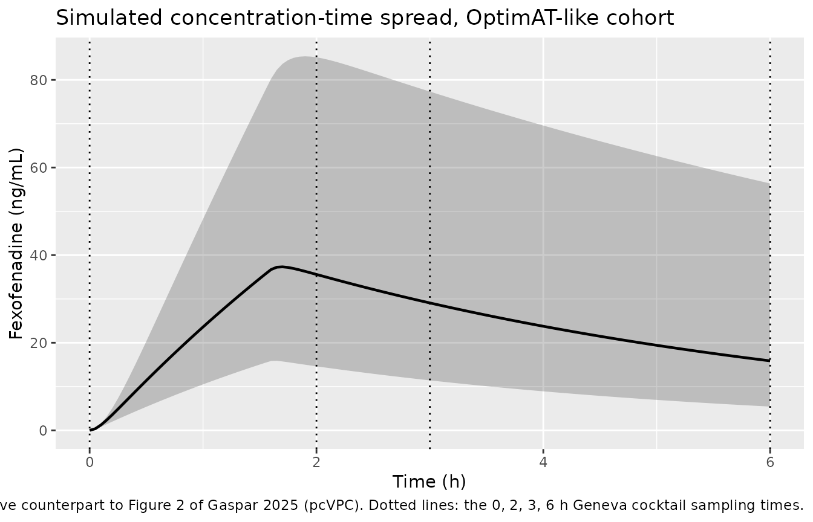
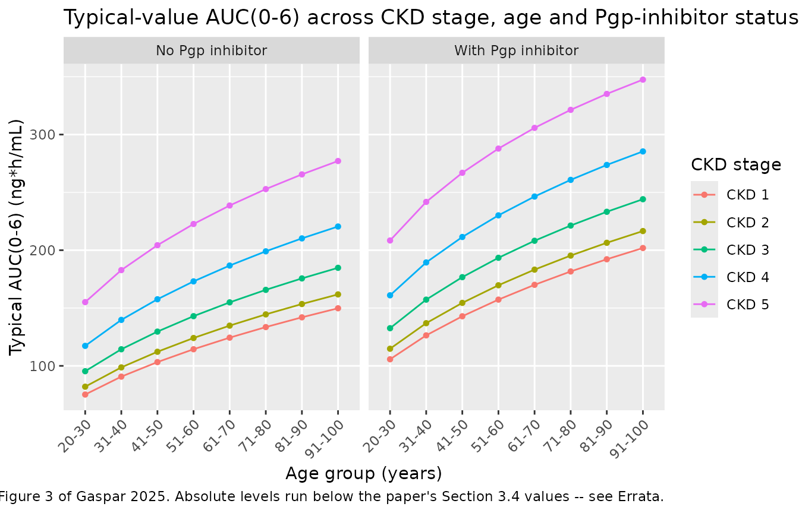

# Fexofenadine (Gaspar 2025)

## Model and source

- Citation: Gaspar F, Jacost-Descombes C, Gosselin P, Reny JL, Guidi M,
  Csajka C, Samer C, Daali Y, Terrier J. (2025). Improving Understanding
  of Fexofenadine Pharmacokinetics to Assess Pgp Phenotypic Activity in
  Older Adult Patients Using Population Pharmacokinetic Modeling. Clin
  Pharmacokinet 64:275-284. <doi:10.1007/s40262-024-01470-4>. The
  sequential zero-order / first-order absorption parameters D1 and ka2
  were held at the literature values of Piscitelli J, Nikanjam M,
  Capparelli EV, Blaquera CL, Penzak SR, Nolin TD, et al. (2023) Ther
  Drug Monit 45(4):539-545 (Gaspar 2025 reference 12).
- Description: Population pharmacokinetic model for low-dose (25 mg)
  oral fexofenadine used as a P-glycoprotein (Pgp) phenotyping probe in
  the Geneva cocktail, fit to 1089 dried-blood-spot concentrations from
  449 hospitalized older adult polymorbid patients (OptimAT,
  NCT03477331; median age 71 years) pooled with 10 healthy volunteers
  (Geneva cocktail study, NCT01731067). Two-compartment model with
  sequential zero-order (D1 = 1.59 h) plus first-order (ka2 = 0.282/h)
  absorption – both absorption parameters carried unchanged from
  Piscitelli 2023 – and linear elimination from the central compartment.
  Apparent clearance CL/F = 116 L/h carries three log-additive covariate
  effects: creatinine clearance (power 0.33 on CRCL/77.2), age (power
  -0.59 on AGE/71), and concomitant Pgp-inhibitor use (exp(-0.38), a 32
  percent reduction in CL/F). Interindividual variability is exponential
  on CL/F only (82 percent CV); residual variability is proportional (23
  percent CV). The paper’s headline output is a grid of typical
  AUC(0-6 h) values stratified by CKD stage, age decade, and
  Pgp-inhibitor status, intended to reinterpret the healthy-volunteer
  Pgp-activity thresholds of Bosilkovska 2014 in an older adult
  inpatient population.
- Article: <https://doi.org/10.1007/s40262-024-01470-4> (open access, CC
  BY-NC 4.0)

Fexofenadine is the P-glycoprotein (Pgp) probe of the Geneva phenotyping
cocktail, and its 0-6 h exposure is the read-out used to classify a
subject’s Pgp activity. Gaspar 2025 asks whether the activity thresholds
established in healthy volunteers survive transfer to hospitalized older
adults, and answers it with a population PK model whose only
covariate-carrying parameter is apparent clearance.

## Population

The model was fit to 1089 fexofenadine concentrations from 459 subjects
across two studies: 1059 concentrations from 449 hospitalized polymorbid
patients in the OptimAT cohort (NCT03477331, Geneva University
Hospitals, January 2018 to July 2021; median age 71 years, range 25-97)
and 30 concentrations from 10 healthy volunteers in the Geneva cocktail
study (NCT01731067; median age 23 years, range 20-36). Everyone received
a single capsule containing fexofenadine 25 mg alongside bupropion 25
mg, flurbiprofen 25 mg, dextromethorphan 10 mg, omeprazole 5 mg and
midazolam 1 mg, and was sampled at baseline and 2, 3 and 6 h post-dose
(Methods 2.2).

Baseline characteristics are Table 2 of the paper. The OptimAT cohort
was 69% male, 94.8% Caucasian, with median body weight 77.2 kg (37-130)
and median Cockcroft-Gault creatinine clearance 77.2 mL/min/1.73 m^2
(5.7-147.3). Renal function spanned the full CKD range: stage 1 31.2%,
stage 2 39.9%, stage 3 20.1%, stage 4 3.7%, stage 5 5.1%. Concomitant
Pgp inhibitors were used by 14.0% and Pgp inducers by 2.0%; the
volunteers took neither.

Concentrations were measured by LC-MS/MS in 10 uL capillary
**whole-blood** dried blood spots collected by finger prick onto Whatman
903 cards (Methods 2.2). The paper’s title, tables and most of its prose
nonetheless say “plasma concentrations” while its Conclusion says “blood
exposure”; the measured matrix is whole blood, which is what the model’s
`compartmentData` records.

The same information is available programmatically:

``` r

pop <- rxode2::rxode(readModelDb("Gaspar_2025_fexofenadine"))$population
str(pop, max.level = 1)
#> List of 16
#>  $ species       : chr "human"
#>  $ n_subjects    : int 459
#>  $ n_studies     : int 2
#>  $ n_observations: chr "1089 fexofenadine concentrations (1059 from 449 OptimAT patients, 30 from 10 Geneva cocktail healthy volunteers"| __truncated__
#>  $ age_range     : chr "25-97 years (OptimAT patients); 20-36 years (healthy volunteers)"
#>  $ age_median    : chr "71 years (OptimAT patients); 23 years (healthy volunteers)"
#>  $ weight_range  : chr "37-130 kg (OptimAT patients); 69-86 kg (healthy volunteers)"
#>  $ weight_median : chr "77.2 kg (OptimAT patients); 70.1 kg (healthy volunteers)"
#>  $ sex_female_pct: num 31
#>  $ race_ethnicity: Named num [1:5] 94.8 2 1.3 1.1 0.9
#>   ..- attr(*, "names")= chr [1:5] "Caucasian" "Hispanic" "Asian" "African" ...
#>  $ disease_state : chr "Hospitalized polymorbid older adults enrolled in the OptimAT antithrombotic-optimization cohort (Geneva Univers"| __truncated__
#>  $ renal_function: chr "Estimated creatinine clearance (Cockcroft-Gault) median 77.2 mL/min/1.73 m^2 (range 5.7-147.3). CKD stage distr"| __truncated__
#>  $ co_medication : chr "Pgp inhibitors 14.0 percent, Pgp inducers 2.0 percent (OptimAT, Table 2); none in the healthy volunteers. Fexof"| __truncated__
#>  $ dose_range    : chr "single 25 mg oral fexofenadine dose (Geneva cocktail capsule)"
#>  $ regions       : chr "Switzerland (single centre, Geneva University Hospitals)"
#>  $ notes         : chr "Concentrations were measured in 10 uL capillary whole-blood dried blood spots collected by finger prick onto Wh"| __truncated__
```

## Source trace

Every `ini()` entry in
`inst/modeldb/specificDrugs/Gaspar_2025_fexofenadine.R` carries an
in-file comment naming its origin. Collected here for review:

| Equation / parameter | Value | Source location |
|----|----|----|
| Structure: 2-compartment, sequential zero- plus first-order absorption, linear elimination from central | n/a | Fig. 1; Methods 2.3.1 |
| `ld1` (D1) | 1.59 h, not estimated | Methods 2.3.1; Table 3 row “D1”, asterisk footnote |
| `lka` (ka2) | 0.282 1/h, not estimated | Methods 2.3.1; Table 3 row “k a” gives 0.28 |
| `lcl` (CL/F) | 116 L/h (RSE 4.1%) | Table 3 |
| `lvc` (V1/F) | 12 L (RSE 19.9%) | Table 3 |
| `lq` (Q/F) | 44 L/h (RSE 7.2%) | Table 3 |
| `lvp` (V2/F) | 157 L (RSE 8.9%) | Table 3 |
| `e_crcl_cl` (beta CLcr) | 0.33 (RSE 25.9%) | Table 3 |
| `e_age_cl` (beta AGE) | -0.59 | Table 3 footnote equation (see falsification below) |
| `e_conmed_pgp_inh_cl` (beta PGP) | -0.38 (RSE 24.2%) | Table 3 |
| `etalcl` | 82 CV%, stored as log(1 + 0.82^2) = 0.514 | Table 3 row “IIV CL (CV%)” |
| `propSd` | 0.23 | Table 3 row “Proportional error model (CV%)” |
| Clearance covariate equation | log(CL_i) = log(CL_pop) + beta_GFR log(CLcr_i/CLcr_m) + beta_AGE log(AGE_i/AGE_m) + beta_PGP PGP_i + eta_CL | Table 3 footnote |
| CLcr_m = 77.2, AGE_m = 71 (population medians) | n/a | Table 3 footnote (“median values”), values from Table 2 |
| Simulated AUC(0-6) by CKD stage / age / Pgp | 126.81 to 506.69 ng\*h/mL | Section 3.4 |
| AUC(0-6) ratio grid vs a reference subject | 1.15 to 4.59 | Table 4 |
| Pgp activity thresholds in healthy volunteers | 59.2 / 147.7 / 218.4 ng\*h/mL | Table 1 (from Bosilkovska 2014) |

### Reading the absorption model

“Sequential zero- and first-order absorption” (Methods 2.3.1) is encoded
as a zero-order input that delivers the dose into `depot` uniformly over
`[0, D1]`, after which `depot` drains into `central` at `ka2`. This is
the only reading identifiable from the two parameters the paper reports:
a split zero-order / first-order pathway would need an additional
unreported fraction, and a zero-order input of the whole dose straight
into `central` would leave `ka2` with nothing to act on. It is also the
encoding already used for the same structure in
`Heathman_2024_efavirenz`. Dose records therefore carry `rate = -2` so
rxode2 applies the modelled duration.

``` r

mod <- readModelDb("Gaspar_2025_fexofenadine")

ev_one <- dplyr::bind_rows(
  data.frame(time = 0, amt = 25, evid = 1L, rate = -2, cmt = "depot"),
  data.frame(time = seq(0, 6, by = 0.05), amt = NA_real_, evid = 0L,
             rate = 0, cmt = "central")
) |>
  dplyr::mutate(id = 1L, AGE = 71, CRCL = 77.2, CONMED_PGP_INH = 0, etalcl = 0)

sim_one <- rxode2::rxSolve(mod, events = ev_one, omega = NA,
                           returnType = "data.frame")

# The depot amount must RISE while the zero-order input runs (t < D1 = 1.59 h)
# and fall afterwards -- that is the signature of the sequential reading.
sim_one |>
  dplyr::filter(time %in% c(0, 0.5, 1, 1.5, 2, 3, 6)) |>
  dplyr::select(time, depot, central, Cc) |>
  dplyr::rename("Time (h)" = time, "Depot (mg)" = depot,
                "Central (mg)" = central, "Cc (ng/mL)" = Cc) |>
  knitr::kable(digits = 3, caption = "Zero-order input into depot, then first-order transfer.")
```

| Time (h) | Depot (mg) | Central (mg) | Cc (ng/mL) |
|---------:|-----------:|-------------:|-----------:|
|      0.0 |      0.000 |        0.000 |      0.000 |
|      0.5 |      7.333 |        0.135 |     11.216 |
|      1.0 |     13.701 |        0.279 |     23.224 |
|      1.5 |     19.232 |        0.409 |     34.073 |
|      2.0 |     17.947 |        0.419 |     34.945 |
|      3.0 |     13.537 |        0.342 |     28.516 |
|      6.0 |      5.809 |        0.186 |     15.495 |

Zero-order input into depot, then first-order transfer. {.table}

``` r


stopifnot(
  sim_one$depot[sim_one$time == 1.5] > sim_one$depot[sim_one$time == 0.5],
  sim_one$depot[sim_one$time == 3.0] < sim_one$depot[sim_one$time == 1.5]
)
```

## Virtual cohort

Original observed data are not publicly available (the paper’s
data-availability statement offers them on request). Two virtual
populations are used below.

``` r

# Age-decade midpoints for the Table 4 / Fig. 3 strata (20-30, 31-40, ... 91-100).
age_mid <- c(25, 35.5, 45.5, 55.5, 65.5, 75.5, 85.5, 95.5)
age_lab <- c("20-30", "31-40", "41-50", "51-60", "61-70", "71-80", "81-90", "91-100")

# CKD-stage CLcr. Stages 1 and 5 are the paper's own stated group means
# (Results 3.2: "stage 1 CKD, mean CLcr = 100 mL/min" and "stage 5 CKD
# (mean CLcr = 8 mL/min)"). Stages 2-4 are NOT stated and are taken as the
# midpoints of the ranges defined in Methods 2.3.4 -- an assumption, flagged
# below. The headline validation uses only stages 1 and 5.
ckd_crcl <- c("1" = 100, "2" = 75, "3" = 45, "4" = 22, "5" = 8)
ckd_stated <- c("1", "5")

obs_grid <- seq(0, 6, by = 0.05)

# One event table row-set per covariate combination, eta fixed at 0 so the
# solve is a typical-value prediction. `etalcl = 0` + `omega = NA` is used in
# preference to zeroRe() because zeroRe() mutates the shared model object and
# would silently strip IIV from the later stochastic chunks.
make_typical_events <- function(grid) {
  grid <- dplyr::mutate(grid, id = seq_len(dplyr::n()))
  dose <- grid |>
    dplyr::mutate(time = 0, amt = 25, evid = 1L, rate = -2, cmt = "depot")
  obs <- grid |>
    tidyr::crossing(time = obs_grid) |>
    dplyr::mutate(amt = NA_real_, evid = 0L, rate = 0, cmt = "central")
  dplyr::bind_rows(dose, obs) |>
    dplyr::mutate(etalcl = 0) |>
    dplyr::arrange(id, time, dplyr::desc(evid))
}

# AUC(0-6) via PKNCA (no inline trapezoid). `label` is the grouping column.
auc06 <- function(sim, events, label) {
  conc <- sim |>
    dplyr::filter(!is.na(Cc)) |>
    dplyr::select(id, time, Cc, dplyr::all_of(label))
  conc <- dplyr::bind_rows(
    conc,
    conc |> dplyr::distinct(dplyr::across(dplyr::all_of(c("id", label)))) |>
      dplyr::mutate(time = 0, Cc = 0)
  ) |>
    dplyr::distinct(dplyr::across(dplyr::all_of(c("id", label, "time"))),
                    .keep_all = TRUE) |>
    dplyr::arrange(id, time)
  dose <- events |>
    dplyr::filter(evid == 1L) |>
    dplyr::select(id, time, amt, dplyr::all_of(label))

  conc_obj <- PKNCA::PKNCAconc(
    conc, stats::as.formula(paste("Cc ~ time |", label, "+ id")),
    concu = "ng/mL", timeu = "h"
  )
  dose_obj <- PKNCA::PKNCAdose(
    dose, stats::as.formula(paste("amt ~ time |", label, "+ id")),
    doseu = "mg"
  )
  intervals <- data.frame(start = 0, end = 6, auclast = TRUE,
                          cmax = TRUE, tmax = TRUE)
  res <- PKNCA::pk.nca(PKNCA::PKNCAdata(conc_obj, dose_obj,
                                        intervals = intervals))
  as.data.frame(res$result)
}
```

### Cohort 1 – the Table 4 / Fig. 3 covariate grid (typical values)

``` r

grid_typ <- tidyr::crossing(
  ckd = names(ckd_crcl),
  age_i = seq_along(age_mid),
  CONMED_PGP_INH = c(0, 1)
) |>
  dplyr::mutate(
    AGE = age_mid[age_i],
    age_group = factor(age_lab[age_i], levels = age_lab),
    CRCL = ckd_crcl[ckd],
    pgp_lab = ifelse(CONMED_PGP_INH == 1, "With Pgp inhibitor", "No Pgp inhibitor"),
    cell = paste0("CKD", ckd, " | ", age_group, " | ",
                  ifelse(CONMED_PGP_INH == 1, "PgpI", "none"))
  ) |>
  dplyr::select(-age_i)

nrow(grid_typ)  # 5 CKD stages x 8 age decades x 2 Pgp = 80 typical-value cells
#> [1] 80
```

### Cohort 2 – an OptimAT-like population for the Fig. 2 VPC

``` r

set.seed(20250115)
n_vpc <- 200  # per arm cap is 200; this is a single pooled arm

rtnorm <- function(n, mean, sd, lo, hi) {
  x <- stats::rnorm(n, mean, sd)
  pmin(pmax(x, lo), hi)
}

cohort_vpc <- tibble::tibble(
  id = seq_len(n_vpc),
  AGE = rtnorm(n_vpc, 69, 14, 25, 97),
  CRCL = rtnorm(n_vpc, 77, 33, 5.7, 147.3),
  CONMED_PGP_INH = stats::rbinom(n_vpc, 1, 0.14),
  arm = "OptimAT-like"
)

ev_vpc <- dplyr::bind_rows(
  cohort_vpc |> dplyr::mutate(time = 0, amt = 25, evid = 1L,
                              rate = -2, cmt = "depot"),
  cohort_vpc |> tidyr::crossing(time = obs_grid) |>
    dplyr::mutate(amt = NA_real_, evid = 0L, rate = 0, cmt = "central")
) |>
  dplyr::arrange(id, time, dplyr::desc(evid))

stopifnot(!anyDuplicated(unique(ev_vpc[, c("id", "time", "evid")])))
```

## Simulation

``` r

# Typical-value grid: eta column supplied, IIV suppressed.
ev_typ <- make_typical_events(grid_typ)
sim_typ <- rxode2::rxSolve(
  mod, events = ev_typ, omega = NA,
  keep = c("ckd", "age_group", "pgp_lab", "cell", "AGE", "CRCL",
           "CONMED_PGP_INH")
) |>
  as.data.frame()
#> Warning: multi-subject simulation without without 'omega'

# Stochastic cohort: no eta column, no omega = NA, so rxode2 samples etalcl
# per subject from the model's OMEGA (82 CV%).
sim_vpc <- rxode2::rxSolve(mod, events = ev_vpc, keep = c("arm")) |>
  as.data.frame()

c(typical_rows = nrow(sim_typ), vpc_rows = nrow(sim_vpc))
#> typical_rows     vpc_rows 
#>         9680        24200
```

## Replicate published figures

### Figure 2 – concentration-time spread in the study population

Gaspar 2025 Figure 2 is a prediction-corrected VPC. Observed data are
not available, so the panel below shows the model’s own 5th / 50th /
95th percentiles over the OptimAT-like virtual cohort, with the study’s
four actual sampling times marked. The spread is dominated by the 82 CV%
IIV on CL/F, the model’s only random effect.

``` r

sim_vpc |>
  dplyr::group_by(time) |>
  dplyr::summarise(
    Q05 = stats::quantile(Cc, 0.05, na.rm = TRUE),
    Q50 = stats::quantile(Cc, 0.50, na.rm = TRUE),
    Q95 = stats::quantile(Cc, 0.95, na.rm = TRUE),
    .groups = "drop"
  ) |>
  ggplot(aes(time, Q50)) +
  geom_ribbon(aes(ymin = Q05, ymax = Q95), alpha = 0.25) +
  geom_line(linewidth = 0.8) +
  geom_vline(xintercept = c(0, 2, 3, 6), linetype = "dotted") +
  labs(
    x = "Time (h)", y = "Fexofenadine (ng/mL)",
    title = "Simulated concentration-time spread, OptimAT-like cohort",
    caption = paste(
      "Qualitative counterpart to Figure 2 of Gaspar 2025 (pcVPC).",
      "Dotted lines: the 0, 2, 3, 6 h Geneva cocktail sampling times."
    )
  )
```



### Figure 3 – typical AUC(0-6) by CKD stage, age and Pgp inhibitor

``` r

auc_typ <- auc06(sim_typ, ev_typ, "cell") |>
  dplyr::filter(PPTESTCD == "auclast") |>
  dplyr::select(cell, auc06 = PPORRES) |>
  dplyr::left_join(dplyr::distinct(grid_typ, cell, ckd, age_group, pgp_lab),
                   by = "cell")

stopifnot(nrow(auc_typ) == nrow(grid_typ), !anyNA(auc_typ$auc06))

auc_typ |>
  ggplot(aes(age_group, auc06, colour = paste0("CKD ", ckd),
             group = paste0("CKD ", ckd))) +
  geom_line() +
  geom_point(size = 1.2) +
  facet_wrap(~pgp_lab) +
  theme(axis.text.x = element_text(angle = 45, hjust = 1)) +
  labs(
    x = "Age group (years)", y = "Typical AUC(0-6) (ng*h/mL)",
    colour = "CKD stage",
    title = "Typical-value AUC(0-6) across CKD stage, age and Pgp-inhibitor status",
    caption = paste(
      "Reproduces the SHAPE of Figure 3 of Gaspar 2025.",
      "Absolute levels run below the paper's Section 3.4 values -- see Errata."
    )
  )
```



The monotone rise with age, the ordering across CKD stages, and the
upward shift under Pgp inhibition all reproduce. The absolute level does
not; that is quantified next and discussed in the Errata.

## Falsifying the Table 3 age coefficient

Gaspar 2025 Table 3 states the age coefficient twice, inconsistently.
The table body gives `beta Age = -0.17` (RSE 23.5%, bootstrap median
-0.17, bootstrap 95% CI -0.23 to -0.11 – four mutually consistent
entries). The table’s own footnote, which prints the final-model
equation, gives **-0.59**. The packaged model uses -0.59. This section
is the evidence.

**Test 1 – the Results 3.2 prose.** “For a 90-year-old patient with
normal renal function, CL/F was reduced by approximately 59% compared
with a 20-year-old patient with similar renal function.”

``` r

cl_ratio <- function(b, a1 = 90, a0 = 20) (a1 / a0)^b

tibble::tibble(
  Reading = c("-0.59 (Table 3 footnote)", "-0.17 (Table 3 body)"),
  `CL/F ratio, 90 y vs 20 y` = cl_ratio(c(-0.59, -0.17)),
  `Implied reduction (%)` = 100 * (1 - cl_ratio(c(-0.59, -0.17))),
  `Paper's stated reduction (%)` = 59
) |>
  knitr::kable(digits = 3,
               caption = "Only -0.59 reproduces the paper's own 59% claim.")
```

| Reading | CL/F ratio, 90 y vs 20 y | Implied reduction (%) | Paper’s stated reduction (%) |
|:---|---:|---:|---:|
| -0.59 (Table 3 footnote) | 0.412 | 58.828 | 59 |
| -0.17 (Table 3 body) | 0.774 | 22.562 | 59 |

Only -0.59 reproduces the paper’s own 59% claim. {.table}

**Test 2 – the paper’s simulated AUC(0-6) grid.** Table 4 and Section
3.4 are machine-generated from the fitted model, so they are the most
direct evidence about what the fitted model contained. The eight cells
Section 3.4 quotes numerically use only CLcr values the paper states
(stage 1 = 100, stage 5 = 8 mL/min), so this test carries no CLcr
assumption.

Between-cell ratios are used rather than the paper’s Table 4 ratios,
because Table 4 divides by an external anchor (see Errata); a ratio of
two simulated cells is a pure model quantity.

``` r

reported <- tibble::tribble(
  ~ckd, ~AGE,  ~CONMED_PGP_INH, ~auc_reported,
  "1",  25,    0,               126.81,
  "1",  95.5,  0,               231.24,
  "1",  25,    1,               171.51,
  "1",  95.5,  1,               305.55,
  "5",  25,    0,               266.22,
  "5",  95.5,  0,               423.18,
  "5",  25,    1,               341.49,
  "5",  95.5,  1,               506.69
) |>
  dplyr::mutate(
    CRCL = ckd_crcl[ckd],
    cell = paste0("CKD", ckd, " | ", ifelse(AGE < 50, "20-30", "91-100"),
                  " | ", ifelse(CONMED_PGP_INH == 1, "PgpI", "none"))
  )

ui <- rxode2::rxode(mod)

# Solve the 8 quoted cells under a given beta_AGE. Theta overrides go through
# `params =` because rxSolve ignores ini() overrides after the first solve.
auc_under <- function(b_age) {
  ev <- make_typical_events(dplyr::select(reported, cell, AGE, CRCL,
                                          CONMED_PGP_INH))
  p <- ui$theta
  p["e_age_cl"] <- b_age
  s <- rxode2::rxSolve(mod, params = p, events = ev, omega = NA,
                       keep = "cell") |>
    as.data.frame()
  auc06(s, ev, "cell") |>
    dplyr::filter(PPTESTCD == "auclast") |>
    dplyr::select(cell, auc_model = PPORRES)
}

# Eight anchor-free contrasts: age effect, renal effect and Pgp effect.
contrasts <- tibble::tribble(
  ~contrast,                         ~num,                     ~den,
  "Age 91-100 / 20-30, CKD1, no PgpI", "CKD1 | 91-100 | none",  "CKD1 | 20-30 | none",
  "Age 91-100 / 20-30, CKD5, no PgpI", "CKD5 | 91-100 | none",  "CKD5 | 20-30 | none",
  "Age 91-100 / 20-30, CKD1, PgpI",    "CKD1 | 91-100 | PgpI",  "CKD1 | 20-30 | PgpI",
  "Age 91-100 / 20-30, CKD5, PgpI",    "CKD5 | 91-100 | PgpI",  "CKD5 | 20-30 | PgpI",
  "CKD5 / CKD1, age 20-30, no PgpI",   "CKD5 | 20-30 | none",   "CKD1 | 20-30 | none",
  "CKD5 / CKD1, age 91-100, no PgpI",  "CKD5 | 91-100 | none",  "CKD1 | 91-100 | none",
  "PgpI / none, CKD1, age 20-30",      "CKD1 | 20-30 | PgpI",   "CKD1 | 20-30 | none",
  "PgpI / none, CKD5, age 91-100",     "CKD5 | 91-100 | PgpI",  "CKD5 | 91-100 | none"
)

ratio_of <- function(tbl, value_col) {
  v <- stats::setNames(tbl[[value_col]], tbl$cell)
  contrasts |> dplyr::mutate(ratio = unname(v[num] / v[den]))
}

rep_ratio <- ratio_of(dplyr::rename(reported, v = auc_reported), "v")

beta_cmp <- dplyr::bind_rows(lapply(c(-0.59, -0.17), function(b) {
  ratio_of(dplyr::rename(auc_under(b), v = auc_model), "v") |>
    dplyr::mutate(beta_age = b)
})) |>
  dplyr::left_join(dplyr::select(rep_ratio, contrast, reported = ratio),
                   by = "contrast") |>
  dplyr::mutate(pct_err = 100 * (ratio / reported - 1))
#> Warning: multi-subject simulation without without 'omega'
#> Warning: multi-subject simulation without without 'omega'

beta_cmp |>
  dplyr::select(contrast, beta_age, reported, ratio, pct_err) |>
  tidyr::pivot_wider(names_from = beta_age,
                     values_from = c(ratio, pct_err)) |>
  dplyr::rename(
    "Contrast (ratio of simulated AUC0-6)" = contrast,
    "Gaspar 2025" = reported,
    "Model, beta = -0.59" = `ratio_-0.59`,
    "Model, beta = -0.17" = `ratio_-0.17`,
    "% err, -0.59" = `pct_err_-0.59`,
    "% err, -0.17" = `pct_err_-0.17`
  ) |>
  knitr::kable(digits = c(0, 3, 3, 3, 1, 1),
               caption = "Anchor-free between-cell AUC(0-6) ratios from Gaspar 2025 Section 3.4 vs the model under each reading of beta Age.")
```

| Contrast (ratio of simulated AUC0-6) | Gaspar 2025 | Model, beta = -0.59 | Model, beta = -0.17 | % err, -0.59 | % err, -0.17 |
|:---|---:|---:|---:|---:|---:|
| Age 91-100 / 20-30, CKD1, no PgpI | 1.824 | 1.992 | 1.215 | 9.2 | -33.4 |
| Age 91-100 / 20-30, CKD5, no PgpI | 1.590 | 1.787 | 1.173 | 12.4 | -26.2 |
| Age 91-100 / 20-30, CKD1, PgpI | 1.782 | 1.910 | 1.198 | 7.2 | -32.7 |
| Age 91-100 / 20-30, CKD5, PgpI | 1.484 | 1.667 | 1.149 | 12.4 | -22.6 |
| CKD5 / CKD1, age 20-30, no PgpI | 2.099 | 2.062 | 1.956 | -1.8 | -6.8 |
| CKD5 / CKD1, age 91-100, no PgpI | 1.830 | 1.850 | 1.889 | 1.1 | 3.2 |
| PgpI / none, CKD1, age 20-30 | 1.352 | 1.406 | 1.378 | 3.9 | 1.9 |
| PgpI / none, CKD5, age 91-100 | 1.197 | 1.254 | 1.269 | 4.7 | 6.0 |

Anchor-free between-cell AUC(0-6) ratios from Gaspar 2025 Section 3.4 vs
the model under each reading of beta Age. {.table}

``` r


err_summary <- beta_cmp |>
  dplyr::group_by(beta_age) |>
  dplyr::summarise(mean_abs_pct_err = mean(abs(pct_err)),
                   max_abs_pct_err = max(abs(pct_err)), .groups = "drop")

err_summary |>
  # beta_age is formatted as text so kable's `digits` cannot round -0.59 and
  # -0.17 to -0.6 and -0.2 -- the two values this table exists to separate.
  dplyr::mutate(beta_age = sprintf("%.2f", beta_age)) |>
  dplyr::rename("beta Age" = beta_age,
                "Mean |% error|" = mean_abs_pct_err,
                "Max |% error|" = max_abs_pct_err) |>
  knitr::kable(digits = 1, caption = "Reproduction error over the eight contrasts.")
```

| beta Age | Mean \|% error\| | Max \|% error\| |
|:---------|-----------------:|----------------:|
| -0.59    |              6.6 |            12.4 |
| -0.17    |             16.6 |            33.4 |

Reproduction error over the eight contrasts. {.table}

``` r


# Gate the conclusion: -0.59 must beat -0.17, and must do so decisively.
err59 <- err_summary$mean_abs_pct_err[err_summary$beta_age == -0.59]
err17 <- err_summary$mean_abs_pct_err[err_summary$beta_age == -0.17]
stopifnot(length(err59) == 1L, length(err17) == 1L, err59 < err17 / 2)
```

The -0.17 reading flattens the age trend that is the paper’s central
finding: the four age contrasts it predicts are far smaller than the
paper’s own simulations, while the renal and Pgp contrasts (which share
the same coefficients under both readings) are unaffected. Together with
Test 1, this is why the packaged model carries -0.59.

An independent estimate falls out of the same data: regressing
log(AUC(0-6)) on log(age) over the paper’s two age cells implies a
`beta Age` near -0.51, closer to -0.59 than to -0.17.

``` r

implied <- reported |>
  dplyr::group_by(ckd, CONMED_PGP_INH) |>
  dplyr::arrange(AGE, .by_group = TRUE) |>
  dplyr::summarise(
    auc_slope = diff(log(auc_reported)) / diff(log(AGE)), .groups = "drop"
  )
# AUC(0-6) is not exactly proportional to 1/CL over a 6 h window; calibrate the
# local exponent d log AUC(0-6) / d log CL from the model itself.
calib <- auc_under(-0.59) |>
  dplyr::left_join(auc_under(-0.17), by = "cell",
                   suffix = c("_59", "_17"))
#> Warning: multi-subject simulation without without 'omega'
#> Warning: multi-subject simulation without without 'omega'
cl_of <- function(b) {
  116 * (reported$CRCL / 77.2)^0.33 * (reported$AGE / 71)^b *
    exp(-0.38 * reported$CONMED_PGP_INH)
}
expo <- stats::coef(stats::lm(
  log(c(calib$auc_model_59, calib$auc_model_17)) ~
    log(c(cl_of(-0.59), cl_of(-0.17)))
))[[2]]

tibble::tibble(
  `d log AUC(0-6) / d log CL (model)` = expo,
  `Mean d log AUC / d log AGE (paper)` = mean(implied$auc_slope),
  `Implied beta Age` = mean(implied$auc_slope) / expo
) |>
  knitr::kable(digits = 3,
               caption = "beta Age implied by the paper's own simulated AUC(0-6) values.")
```

| d log AUC(0-6) / d log CL (model) | Mean d log AUC / d log AGE (paper) | Implied beta Age |
|---:|---:|---:|
| -0.699 | 0.38 | -0.543 |

beta Age implied by the paper’s own simulated AUC(0-6) values. {.table}

## PKNCA validation

AUC(0-6) is the paper’s read-out, and the 6 h window is far too short to
support `aucinf` or `half.life` (the model’s terminal half-life is about
3.4 h), so the NCA is `auclast` over \[0, 6\] plus Cmax and Tmax. A
stochastic cohort of 150 subjects per arm is used across the eight arms
the paper quotes numerically.

``` r

set.seed(7)
n_arm <- 150

arms <- reported |>
  dplyr::mutate(arm_i = dplyr::row_number()) |>
  dplyr::select(arm_i, cell, AGE, CRCL, CONMED_PGP_INH)

cohort_nca <- arms |>
  tidyr::crossing(k = seq_len(n_arm)) |>
  dplyr::mutate(id = (arm_i - 1L) * n_arm + k) |>
  dplyr::select(id, cell, AGE, CRCL, CONMED_PGP_INH)

ev_nca <- dplyr::bind_rows(
  cohort_nca |> dplyr::mutate(time = 0, amt = 25, evid = 1L,
                              rate = -2, cmt = "depot"),
  cohort_nca |> tidyr::crossing(time = seq(0, 6, by = 0.1)) |>
    dplyr::mutate(amt = NA_real_, evid = 0L, rate = 0, cmt = "central")
) |>
  dplyr::arrange(id, time, dplyr::desc(evid))

stopifnot(
  !anyDuplicated(unique(ev_nca[, c("id", "time", "evid")])),
  dplyr::n_distinct(cohort_nca$id) == nrow(arms) * n_arm
)

sim_nca_raw <- rxode2::rxSolve(mod, events = ev_nca, keep = "cell") |>
  as.data.frame()

nca_res <- auc06(sim_nca_raw, ev_nca, "cell")

nca_summary <- nca_res |>
  dplyr::filter(PPTESTCD %in% c("auclast", "cmax", "tmax")) |>
  dplyr::group_by(cell, PPTESTCD) |>
  dplyr::summarise(median = stats::median(PPORRES),
                   mean = mean(PPORRES), .groups = "drop")

nca_summary |>
  tidyr::pivot_wider(names_from = PPTESTCD, values_from = c(median, mean)) |>
  dplyr::select(cell, median_auclast, mean_auclast, median_cmax, median_tmax) |>
  dplyr::rename(
    "CKD | age | Pgp" = cell,
    "Median AUC0-6 (ng*h/mL)" = median_auclast,
    "Mean AUC0-6 (ng*h/mL)" = mean_auclast,
    "Median Cmax (ng/mL)" = median_cmax,
    "Median Tmax (h)" = median_tmax
  ) |>
  knitr::kable(digits = 2,
               caption = "PKNCA results over the eight quoted strata, 150 subjects per arm.")
```

| CKD \| age \| Pgp | Median AUC0-6 (ng\*h/mL) | Mean AUC0-6 (ng\*h/mL) | Median Cmax (ng/mL) | Median Tmax (h) |
|:---|---:|---:|---:|---:|
| CKD1 \| 20-30 \| PgpI | 109.82 | 124.49 | 29.55 | 1.7 |
| CKD1 \| 20-30 \| none | 78.53 | 94.70 | 21.58 | 1.7 |
| CKD1 \| 91-100 \| PgpI | 171.20 | 192.91 | 44.11 | 1.7 |
| CKD1 \| 91-100 \| none | 149.37 | 173.40 | 39.09 | 1.7 |
| CKD5 \| 20-30 \| PgpI | 200.68 | 211.56 | 50.61 | 1.7 |
| CKD5 \| 20-30 \| none | 160.68 | 176.49 | 41.71 | 1.7 |
| CKD5 \| 91-100 \| PgpI | 362.85 | 367.77 | 83.32 | 1.9 |
| CKD5 \| 91-100 \| none | 286.23 | 295.59 | 68.53 | 1.8 |

PKNCA results over the eight quoted strata, 150 subjects per arm.
{.table}

### Comparison against the published AUC(0-6)

The paper reports the *mean* simulated AUC(0-6) per stratum, so the mean
is the matching statistic.

``` r

published <- reported |> dplyr::select(cell, auclast = auc_reported)

sim_for_cmp <- nca_res |>
  dplyr::filter(PPTESTCD == "auclast") |>
  dplyr::group_by(cell) |>
  dplyr::summarise(PPORRES = mean(PPORRES), .groups = "drop") |>
  dplyr::mutate(PPTESTCD = "auclast", id = cell)

cmp <- nlmixr2lib::ncaComparisonTable(
  simulated = sim_for_cmp,
  reference = published,
  by = "cell",
  units = c(auclast = "ng*h/mL"),
  tolerance_pct = 20
)

knitr::kable(
  cmp,
  caption = "Simulated vs published mean AUC(0-6). * differs from reference by >20%.",
  align = c("l", "l", "r", "r", "r")
)
```

| NCA parameter      | cell                   | Reference | Simulated |   % diff |
|:-------------------|:-----------------------|----------:|----------:|---------:|
| AUClast (ng\*h/mL) | CKD1 \| 20-30 \| none  |       127 |      94.7 | -25.3%\* |
| AUClast (ng\*h/mL) | CKD1 \| 91-100 \| none |       231 |       173 | -25.0%\* |
| AUClast (ng\*h/mL) | CKD1 \| 20-30 \| PgpI  |       172 |       124 | -27.4%\* |
| AUClast (ng\*h/mL) | CKD1 \| 91-100 \| PgpI |       306 |       193 | -36.9%\* |
| AUClast (ng\*h/mL) | CKD5 \| 20-30 \| none  |       266 |       176 | -33.7%\* |
| AUClast (ng\*h/mL) | CKD5 \| 91-100 \| none |       423 |       296 | -30.2%\* |
| AUClast (ng\*h/mL) | CKD5 \| 20-30 \| PgpI  |       341 |       212 | -38.0%\* |
| AUClast (ng\*h/mL) | CKD5 \| 91-100 \| PgpI |       507 |       368 | -27.4%\* |

Simulated vs published mean AUC(0-6). \* differs from reference by
\>20%. {.table}

Every row is starred. The shortfall is close to uniform across all eight
strata, which is why the *relative* comparisons above succeed while the
absolute levels do not. No parameter was adjusted to close the gap; the
Errata records what is and is not reconcilable.

``` r

uniformity <- sim_for_cmp |>
  dplyr::left_join(published, by = "cell") |>
  dplyr::mutate(ratio_reported_over_model = auclast / PPORRES)

uniformity |>
  dplyr::select(cell, PPORRES, auclast, ratio_reported_over_model) |>
  dplyr::rename(
    "CKD | age | Pgp" = cell,
    "Model mean AUC0-6" = PPORRES,
    "Gaspar 2025" = auclast,
    "Ratio (paper / model)" = ratio_reported_over_model
  ) |>
  knitr::kable(digits = 3,
               caption = "The paper-to-model AUC(0-6) ratio is nearly constant across strata.")
```

| CKD \| age \| Pgp      | Model mean AUC0-6 | Gaspar 2025 | Ratio (paper / model) |
|:-----------------------|------------------:|------------:|----------------------:|
| CKD1 \| 20-30 \| PgpI  |           124.487 |      171.51 |                 1.378 |
| CKD1 \| 20-30 \| none  |            94.703 |      126.81 |                 1.339 |
| CKD1 \| 91-100 \| PgpI |           192.907 |      305.55 |                 1.584 |
| CKD1 \| 91-100 \| none |           173.398 |      231.24 |                 1.334 |
| CKD5 \| 20-30 \| PgpI  |           211.565 |      341.49 |                 1.614 |
| CKD5 \| 20-30 \| none  |           176.491 |      266.22 |                 1.508 |
| CKD5 \| 91-100 \| PgpI |           367.769 |      506.69 |                 1.378 |
| CKD5 \| 91-100 \| none |           295.587 |      423.18 |                 1.432 |

The paper-to-model AUC(0-6) ratio is nearly constant across strata.
{.table}

``` r


cv_ratio <- stats::sd(uniformity$ratio_reported_over_model) /
  mean(uniformity$ratio_reported_over_model)
# A near-constant ratio is the claim; assert it rather than eyeballing it.
stopifnot(cv_ratio < 0.15)
cat(sprintf("Paper/model AUC(0-6) ratio: mean %.2f, CV %.1f%%\n",
            mean(uniformity$ratio_reported_over_model), 100 * cv_ratio))
#> Paper/model AUC(0-6) ratio: mean 1.45, CV 7.6%
```

### Where the Table 4 anchor comes from

Table 4’s ratios divide by the AUC(0-6) of “a 20-year-old healthy
volunteer with normal renal function (CLcr = 100 mL/min) and no
Pgp-interacting drugs … as established in the Bosilkovska et al. study”.
Dividing each Section 3.4 value by its Table 4 ratio recovers that
anchor, and it is the same number every time – so it is a single fixed
value, and it sits inside the “normal Pgp activity” band of Table 1
(59.2 to 147.6 ng\*h/mL). It is therefore an **observed**
healthy-volunteer value carried over from Bosilkovska 2014, not a
prediction of this paper’s model.

``` r

anchor <- tibble::tribble(
  ~cell,                    ~auc,    ~ratio,
  "CKD1 | 20-30 | none",    126.81,  1.15,
  "CKD1 | 91-100 | none",   231.24,  2.09,
  "CKD1 | 20-30 | PgpI",    171.51,  1.55,
  "CKD1 | 91-100 | PgpI",   305.55,  2.77,
  "CKD5 | 20-30 | none",    266.22,  2.41,
  "CKD5 | 91-100 | none",   423.18,  3.83,
  "CKD5 | 20-30 | PgpI",    341.49,  3.09,
  "CKD5 | 91-100 | PgpI",   506.69,  4.59
) |>
  dplyr::mutate(implied_anchor = auc / ratio)

anchor |>
  dplyr::rename("CKD | age | Pgp" = cell, "AUC0-6 (Sect. 3.4)" = auc,
                "Ratio (Table 4)" = ratio,
                "Implied anchor (ng*h/mL)" = implied_anchor) |>
  knitr::kable(digits = 2,
               caption = "Back-computed Table 4 reference AUC(0-6).")
```

| CKD \| age \| Pgp | AUC0-6 (Sect. 3.4) | Ratio (Table 4) | Implied anchor (ng\*h/mL) |
|:---|---:|---:|---:|
| CKD1 \| 20-30 \| none | 126.81 | 1.15 | 110.27 |
| CKD1 \| 91-100 \| none | 231.24 | 2.09 | 110.64 |
| CKD1 \| 20-30 \| PgpI | 171.51 | 1.55 | 110.65 |
| CKD1 \| 91-100 \| PgpI | 305.55 | 2.77 | 110.31 |
| CKD5 \| 20-30 \| none | 266.22 | 2.41 | 110.46 |
| CKD5 \| 91-100 \| none | 423.18 | 3.83 | 110.49 |
| CKD5 \| 20-30 \| PgpI | 341.49 | 3.09 | 110.51 |
| CKD5 \| 91-100 \| PgpI | 506.69 | 4.59 | 110.39 |

Back-computed Table 4 reference AUC(0-6). {.table}

``` r


cat(sprintf("Implied anchor: mean %.2f ng*h/mL, range %.2f-%.2f (CV %.2f%%)\n",
            mean(anchor$implied_anchor), min(anchor$implied_anchor),
            max(anchor$implied_anchor),
            100 * stats::sd(anchor$implied_anchor) / mean(anchor$implied_anchor)))
#> Implied anchor: mean 110.47 ng*h/mL, range 110.27-110.65 (CV 0.13%)
stopifnot(stats::sd(anchor$implied_anchor) / mean(anchor$implied_anchor) < 0.01)
```

### Consistency of the Results 3.2 percentages with Table 3

Three effect sizes are quoted in prose. Only the age one matches the
Table 3 footnote coefficients; the other two do not match any column of
Table 3.

``` r

# `Coefficient needed` is text for the same reason as above: at digits = 1 the
# 0.38 / -0.59 / -0.65 values would render as 0.4 / -0.6 / -0.7.
tibble::tribble(
  ~Claim,                                             ~`Stated (%)`, ~`Implied by model (%)`,     ~`Model coefficient`, ~`Coefficient the claim needs`,
  "CL/F reduction, CKD5 (CLcr 8) vs CKD1 (CLcr 100)", 62,            100 * (1 - (8 / 100)^0.33),  "0.33",               "0.38",
  "CL/F reduction, age 90 vs 20 y",                   59,            100 * (1 - (90 / 20)^-0.59), "-0.59",              "-0.59",
  "CL/F reduction, Pgp inhibitor vs none",            48,            100 * (1 - exp(-0.38)),      "-0.38",              "-0.65"
) |>
  knitr::kable(digits = 1,
               caption = "Prose effect sizes vs the Table 3 footnote coefficients.")
```

| Claim | Stated (%) | Implied by model (%) | Model coefficient | Coefficient the claim needs |
|:---|---:|---:|:---|:---|
| CL/F reduction, CKD5 (CLcr 8) vs CKD1 (CLcr 100) | 62 | 56.5 | 0.33 | 0.38 |
| CL/F reduction, age 90 vs 20 y | 59 | 58.8 | -0.59 | -0.59 |
| CL/F reduction, Pgp inhibitor vs none | 48 | 31.6 | -0.38 | -0.65 |

Prose effect sizes vs the Table 3 footnote coefficients. {.table}

The 35% AUC(0-6) increase under Pgp inhibition quoted in the Abstract
*is* consistent with `beta PGP = -0.38`: the Table 4 stage-1 / age-20-30
pair gives 1.55 / 1.15 = 1.35. The Results 3.2 “48%” figure is the
outlier.

## Assumptions and deviations

### Resolved conflicts in the source

1.  **`beta Age`: -0.59, not -0.17.** Table 3’s body, RSE and both
    bootstrap columns say -0.17; Table 3’s footnote equation says -0.59.
    -0.59 is used because it reproduces the Results 3.2 “59% reduction”
    claim exactly, and because it reproduces the paper’s own simulated
    AUC(0-6) contrasts with a mean absolute error under half that of
    -0.17 (which understates the age trend by up to ~40%). The
    falsification is executed above, so the decision is auditable and
    reversible.
2.  **Covariate centring: population medians (CLcr 77.2, age 71).**
    Table 3’s footnote defines the divisors as “the median values of
    CLcr and AGE in the population”; Methods Eq. 1 instead calls the
    divisor a “typical value” and names “CLcr (100 mL/min)”. The
    footnote states the *final* model and is preferred, and it is
    corroborated by intercept continuity: CL_pop = 116 L/h at the
    medians is within 1.2% of the covariate-free base model’s 114.64
    L/h, whereas centring at 100 mL/min would put the typical subject 7%
    below it. The choice barely moves the relative predictions (the
    divisors cancel in a between-subject ratio).
3.  **`ka2` = 0.282 1/h**, the three-significant-figure value Methods
    2.3.1 attributes to Piscitelli 2023, rather than Table 3’s rounded
    0.28.
4.  **`beta CLcr` = 0.33 and `beta PGP` = -0.38**, the Table 3 Estimate
    column. The Table 3 footnote quotes 0.32 and -0.39, which are that
    table’s bootstrap medians.
5.  **Absorption structure**: the sequential zero-order-into-depot then
    first-order-out reading, for the identifiability reason given above
    and verified by the depot-amount check.
6.  **Matrix**: `compartmentData` records whole blood, per Methods 2.2,
    despite the paper’s predominant “plasma” wording.

### Unreconciled discrepancy in the source

**The paper’s simulated absolute AUC(0-6) values cannot be reproduced
from its own Table 3 parameters, under any reading tested.** They exceed
the model’s predictions by a near-constant factor of about 1.5 across
all eight strata the paper quotes (assertion-checked above at CV \<
15%), while every relative contrast reproduces well. The `beta Age`
choice does not explain it: -0.59 leaves the levels uniformly low, and
-0.17 – which happens to land close to the Table 4 anchor for the
youngest stratum – fails the age trend badly.

Two further observations, both machine-checked above:

- The Table 4 anchor of about 110 ng\*h/mL is a single fixed value
  recovered to within 1% from all eight cells, attributed in Section 3.4
  to Bosilkovska 2014, and lying inside Table 1’s “normal activity”
  band. Table 4’s ratios are therefore model-vs-observed, not a
  model-internal quantity, and should not be used on their own to
  calibrate this model.
- Section 3.4’s own numbers are not internally consistent with a single
  power law in age: the local `d log AUC / d log age` slope from the
  anchor (age 20) to the 20-30 cell is markedly steeper than the slope
  from the 20-30 cell to the 91-100 cell, which no single `beta Age` can
  produce.

No parameter was tuned to close any of these gaps. Users comparing a
subject’s measured AUC(0-6) against the paper’s Table 4 thresholds
should use the paper’s tabulated values directly; the packaged model
reproduces the paper’s *covariate effects*, which is what it is for.

### Simulation assumptions

- **CLcr per CKD stage.** Stages 1 and 5 use the group means the paper
  states (100 and 8 mL/min). Stages 2, 3 and 4 are not stated and are
  taken as the midpoints of the Methods 2.3.4 ranges (75, 45, 22
  mL/min). The Figure 3 panel uses all five stages; every quantitative
  test uses only stages 1 and 5.
- **Age per decade.** Midpoints of the paper’s 10-year strata (25, 35.5,
  …, 95.5 years).
- **OptimAT-like cohort.** Age and CLcr are drawn from normal
  distributions truncated to the Table 2 ranges and centred to reproduce
  the Table 2 medians; Pgp-inhibitor use is Bernoulli(0.14). The paper
  does not report the joint covariate distribution, so age and CLcr are
  drawn independently even though Cockcroft-Gault makes them negatively
  correlated in reality. This affects only the Figure 2 spread, not any
  quantitative test.
- **Cohort sizes.** 150 subjects per arm for the stochastic NCA and 200
  for the Figure 2 VPC, against the paper’s 1000 per cell. Group means
  are stable at this size and the render stays inside its time budget.
- **No residual error in the reported NCA.** `Cc` from `rxSolve` is the
  individual prediction; the 23% proportional residual is not added,
  matching how the paper’s simulated AUC(0-6) values are presented.
- **Pgp inducers** were collected by the study but never entered into
  the model (Discussion), so no inducer effect is available; the model
  has no inducer term. See `covariatesDataExcluded` in the model file
  for the full list of screened-but-unretained covariates.
