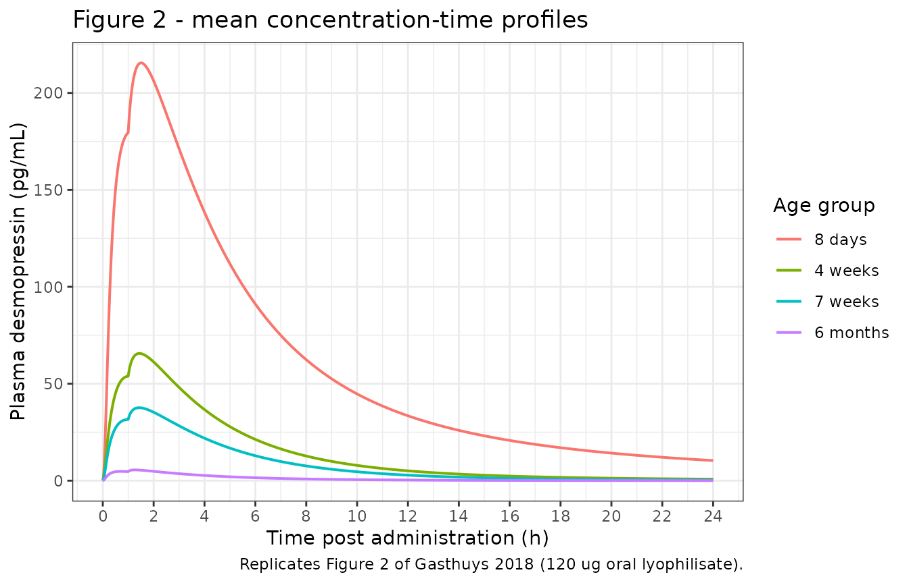
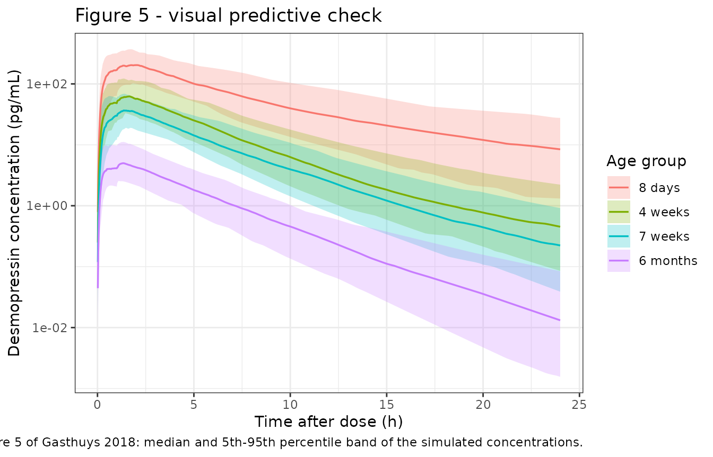

# Desmopressin oral lyophilisate in growing piglets (Gasthuys 2018)

## Model and source

- Citation: Gasthuys E, Vermeulen A, Croubels S, Millecam J, Schauvliege
  S, van Bergen T, De Bruyne P, Vande Walle J, Devreese M. Population
  Pharmacokinetic Modeling of a Desmopressin Oral Lyophilisate in
  Growing Piglets as a Model for the Pediatric Population. Front
  Pharmacol. 2018;9:41. <doi:10.3389/fphar.2018.00041>.
- Description: Preclinical (pig). Two-compartment population PK model
  with a dual, parallel input function for a 120 ug desmopressin
  sublingual oral lyophilisate (Minirin Melt) in growing piglets aged 8
  days to 6 months, used as a juvenile animal model for the pediatric
  population (Gasthuys 2018). A fraction Bio of the dose is released
  zero-order over a duration D1 into a first depot representing buccal
  absorption and then reaches the central compartment first-order at
  Ka1; the remaining 1 - Bio is assumed to be swallowed and enters a
  second depot after a 1 h lag, from which it is absorbed first-order at
  Ka2. The dual input reproduces the second peak seen in most piglet
  plasma profiles. Elimination is linear. Absolute oral bioavailability
  could not be estimated because no intravenous data were collected, so
  clearance and both volumes are apparent (CL/F, V1/F, V2/F). Body
  weight is the only retained covariate, entering CL and V1 as a power
  function centred on 10 kg.
- Article: <https://doi.org/10.3389/fphar.2018.00041>
- Supplementary Table 1 (model development path):
  <https://www.frontiersin.org/articles/10.3389/fphar.2018.00041/full#supplementary-material>

## Population

Thirty-two male Landrace x large white piglets were studied in four age
groups of eight animals each: 8 days, 4 weeks, 7 weeks and 6 months
(Gasthuys 2018, Table 1). Body weight spans nearly two orders of
magnitude across the groups - a median of 2.21 kg at 8 days versus 113.6
kg at 6 months - which is what makes the cohort informative about
size-driven maturation and is why body weight is the covariate the model
retains.

Every animal received a single 120 ug desmopressin oral lyophilisate
(Minirin Melt) placed under the tongue, with the snout held closed for
30 s. Animals were fasted from 1 h before to 1.5 h after dosing. Plasma
was sampled richly through an indwelling jugular catheter at 0, 5, 15,
30 and 60 min and at 1.5, 2, 3, 4, 6, 8, 10, 12 and 24 h. Desmopressin
was measured by radioimmunoassay with a 4.2 pg/mL limit of
quantification; 8% of concentrations fell below it and were excluded
before fitting.

The study is a juvenile-animal model for the pediatric population:
desmopressin is used to treat primary nocturnal enuresis in children,
but full pediatric PK studies taking growth and maturation into account
are lacking.

The same information is available programmatically via the model’s
`population` metadata
(`readModelDb("Gasthuys_2018_desmopressin_piglet")()$population`).

``` r

pop <- rxode2::rxode(
  readModelDb("Gasthuys_2018_desmopressin_piglet")
)$population
#> ℹ parameter labels from comments will be replaced by 'label()'
str(pop, max.level = 1)
#> List of 11
#>  $ species       : chr "pig (Landrace x large white piglet, Seghers Hybrid)"
#>  $ n_subjects    : num 32
#>  $ n_studies     : num 1
#>  $ age_range     : chr "8 days to 6 months (four groups of n = 8: 8 days, 4 weeks, 7 weeks, 6 months)"
#>  $ weight_range  : chr "1.54-124 kg"
#>  $ weight_median : chr "2.21 kg (8 days), 10.0 kg (4 weeks), 15.0 kg (7 weeks), 113.6 kg (6 months)"
#>  $ sex_female_pct: num 0
#>  $ disease_state : chr "healthy growing piglets used as a juvenile animal model for the pediatric population"
#>  $ dose_range    : chr "120 ug desmopressin oral lyophilisate placed sublingually, single dose"
#>  $ regions       : chr "Belgium (Ghent University)"
#>  $ notes         : chr "Table 1 gives mean +/- SD and median [range] for body weight, body surface area and GFR by age group. All anima"| __truncated__
```

## Structural model

The paper’s Figure 3 shows a two-compartment disposition model fed by
two parallel input paths, which the authors call a “dual input
function”:

- A fraction `Bio` (86%) of the dose is released **zero-order over a
  duration `D1`** into a first depot, representing buccal absorption of
  the lyophilisate, and reaches the central compartment first-order at
  `Ka1`. No lag time was needed, indicating that sublingual absorption
  starts immediately.
- The remaining `1 - Bio` (14%) is assumed to be swallowed. It enters a
  second depot after a **lag time `Tlag`** of 1 h and is absorbed
  first-order at `Ka2`, representing gastro-intestinal absorption of the
  swallowed fraction.

The dual input is what reproduces the second peak visible in many
individual plasma profiles. Because no intravenous data were collected,
absolute oral bioavailability `F` is not identifiable, so clearance and
both volumes are apparent (`CL/F`, `V1/F`, `V2/F`) and the two dose
fractions sum to one.

## Source trace

The per-parameter origin is recorded as an in-file comment next to each
`ini()` entry in
`inst/modeldb/specificDrugs/Gasthuys_2018_desmopressin_piglet.R`. The
table below collects them in one place for review.

| Equation / parameter | Value | Source location |
|----|----|----|
| `lcl` (CL/F) | 395 L/h | Table 2, `CL/F = theta1 x (BW/10)^theta11 x e^eta1` (SE 31.8, RSE 8.05%) |
| `lvc` (V1/F) | 131 L | Table 2, `V1/F = theta2 x (BW/10)^theta12 x e^eta2` (SE 21.1, RSE 16.1%) |
| `lka` (Ka1) | 0.275 1/h | Table 2, `Ka1 = theta3 x e^eta3` (SE 0.0272, RSE 9.89%) |
| `lq` (Q/F) | 32 L/h | Table 2, `Q/F = theta4` (SE 6.8, RSE 21.3%) |
| `lvp` (V2/F) | 436 L | Table 2, `V2/F = theta5 x e^eta5` (SE 137, RSE 31.4%) |
| `ld1` (D1) | 0.16 h | Table 2, `D1 = theta6 x e^eta6` (SE 0.0473, RSE 29.6%) |
| `lka2` (Ka2) | 0.399 1/h | Table 2, `Ka2 = theta7` (SE 0.0677, RSE 17.0%) |
| `logitfdepot` (Bio) | 86% | Table 2, `Bio = theta8` (SE 0.0488, RSE 5.67%) |
| `ltlag` (Tlag) | 1 h | Table 2, `Tlag = theta9` (SE 0.00196, RSE 0.20%) |
| `e_wt_cl` | 1.03 | Table 2, “Influence of BW on CL” (SE 0.0627, RSE 6.09%) |
| `e_wt_vc` | 0.691 | Table 2, “Influence of BW on V1” (SE 0.135, RSE 19.54%) |
| `etalcl` | 0.175 | Table 2, “IIV CL/F” (shrinkage 1.97%, RSE 13.20%) |
| `etalvc` | 0.641 | Table 2, “IIV V1/F” (shrinkage 25.4%, RSE 20.59%) |
| `etalka` | 0.0903 | Table 2, “IIV Ka1” (shrinkage 16.0%, RSE 18.77%) |
| `etalvp` | 0.634 | Table 2, “IIV V2/F” (shrinkage 61.8%, RSE 15.93%) |
| `etald1` | 0.485 | Table 2, “IIV D1” (shrinkage 47.4%, RSE 26.29%) |
| `etalogitfdepot` | 0.627 | Table 2, “IIV Bio” (shrinkage 42.9%, RSE 31.18%) |
| IIV on Q/F, Ka2, Tlag | 0 (FIX) | Table 2; Supplementary Table 1 run 7 |
| `propSd` | 0.228 | Table 2, `ADD = theta10` = 22.8% CV (SE 0.0291, RSE 12.76%) |
| Dual-input structure, dose split, `D1`, `Tlag` | n/a | Figure 3 (model scheme) and Results, “Pharmacokinetic Analysis” |
| Body-weight centering on 10 kg | n/a | Table 2 caption |
| Reference AUC0-inf and T-half by age group | see below | Table 3 |
| Reference Cmax, 8-day group | ~250 pg/mL | Discussion (“120 ug; Cmax: +- 250 pg/mL”) |

## Structural verification

Before simulating a cohort, four deterministic checks confirm that the
packaged model implements the paper’s Figure 3 structure. These are
closed-form identities, not cohort statistics, so they are asserted
tightly.

``` r

mod <- readModelDb("Gasthuys_2018_desmopressin_piglet")
mod_typ <- rxode2::zeroRe(mod)
#> ℹ parameter labels from comments will be replaced by 'label()'

dose_ug <- 120

# Typical animal of each age group, at the group's median body weight (Table 1).
groups <- tibble::tibble(
  cohort = factor(
    c("8 days", "4 weeks", "7 weeks", "6 months"),
    levels = c("8 days", "4 weeks", "7 weeks", "6 months")
  ),
  WT = c(2.21, 10.0, 15.0, 113.6)
)

# Closed-form typical parameters, straight from the ini() values.
theta <- tibble::tibble(
  cl = 395 * (groups$WT / 10)^1.03,
  vc = 131 * (groups$WT / 10)^0.691,
  vp = 436,
  q = 32
) |>
  dplyr::mutate(
    kel = cl / vc,
    k12 = q / vc,
    k21 = q / vp,
    # Terminal (beta) hybrid rate constant of the two-compartment disposition.
    beta = 0.5 *
      (
        (kel + k12 + k21) -
          sqrt((kel + k12 + k21)^2 - 4 * kel * k21)
      ),
    thalf_beta = log(2) / beta
  )

build_events <- function(wt, id = 1L, times, f_depot = TRUE, f_depot2 = TRUE) {
  rows <- list()
  if (f_depot) {
    rows <- c(rows, list(tibble::tibble(
      id = id, time = 0, amt = dose_ug, evid = 1L,
      cmt = "depot", rate = -2, dur = NA_real_
    )))
  }
  if (f_depot2) {
    rows <- c(rows, list(tibble::tibble(
      id = id, time = 0, amt = dose_ug, evid = 1L,
      cmt = "depot2", rate = 0, dur = NA_real_
    )))
  }
  rows <- c(rows, list(tibble::tibble(
    id = id, time = times, amt = NA_real_, evid = 0L,
    cmt = "central", rate = 0, dur = NA_real_
  )))
  dplyr::bind_rows(rows) |>
    dplyr::mutate(WT = wt) |>
    dplyr::arrange(time, dplyr::desc(evid)) |>
    dplyr::select(-dur)
}

# A grid fine enough to resolve the 0.16 h zero-order release and long enough
# (96 h, roughly 10 terminal half-lives) that the extrapolated AUC tail is
# negligible.
grid_long <- sort(unique(c(
  seq(0, 6, by = 0.01),
  seq(6, 24, by = 0.1),
  seq(24, 96, by = 1)
)))

# Exposure spans more than two orders of magnitude across the age groups, and
# the closed-form identities below are asserted tightly, so the solver is run
# with tolerances well inside the assertion bounds rather than at the defaults.
solver_tol <- list(atol = 1e-12, rtol = 1e-10)

solve_typical <- function(wt, times, f_depot = TRUE, f_depot2 = TRUE) {
  ev <- build_events(wt, times = times, f_depot = f_depot, f_depot2 = f_depot2)
  out <- rxode2::rxSolve(
    mod_typ, ev,
    atol = solver_tol$atol, rtol = solver_tol$rtol,
    returnType = "data.frame"
  )
  if (is.null(out$id)) out$id <- 1L
  out
}

trapz <- function(x, y) sum(diff(x) * (utils::head(y, -1) + utils::tail(y, -1)) / 2)
```

### 1. Dose recovery: `CL/F x AUC0-inf = Dose`

Because absolute bioavailability is folded into the apparent parameters,
the two dose fractions sum to exactly one and the model must return the
whole dose through clearance. `AUC` is in pg\*h/mL while the dose is in
ug and clearance in L/h, so the identity carries the same factor of 1000
the model applies to `Cc`.

``` r

recovery <- vapply(
  seq_len(nrow(groups)),
  function(i) {
    s <- solve_typical(groups$WT[i], grid_long)
    auc <- trapz(s$time, s$Cc) + utils::tail(s$Cc, 1) / theta$beta[i]
    theta$cl[i] * auc / 1000 / dose_ug
  },
  numeric(1)
)
#> ℹ omega/sigma items treated as zero: 'etalcl', 'etalvc', 'etalka', 'etalvp', 'etald1', 'etalogitfdepot'
#> ℹ omega/sigma items treated as zero: 'etalcl', 'etalvc', 'etalka', 'etalvp', 'etald1', 'etalogitfdepot'
#> ℹ omega/sigma items treated as zero: 'etalcl', 'etalvc', 'etalka', 'etalvp', 'etald1', 'etalogitfdepot'
#> ℹ omega/sigma items treated as zero: 'etalcl', 'etalvc', 'etalka', 'etalvp', 'etald1', 'etalogitfdepot'

knitr::kable(
  groups |>
    dplyr::mutate(
      "CL/F (L/h)" = round(theta$cl, 1),
      "Recovered fraction of dose" = round(recovery, 4)
    ),
  caption = "Dose recovery through clearance, typical animal of each age group."
)
```

| cohort   |     WT | CL/F (L/h) | Recovered fraction of dose |
|:---------|-------:|-----------:|---------------------------:|
| 8 days   |   2.21 |       83.4 |                          1 |
| 4 weeks  |  10.00 |      395.0 |                          1 |
| 7 weeks  |  15.00 |      599.8 |                          1 |
| 6 months | 113.60 |     4826.5 |                          1 |

Dose recovery through clearance, typical animal of each age group.
{.table}

``` r


# Closed-form identity, limited only by trapezoidal error on a fine grid.
stopifnot(
  all(abs(recovery - 1) < 0.01),
  !anyNA(recovery)
)
```

### 2. The dose split is 86% / 14% between the two depots

An AUC-recovery gate alone cannot see the dose split: it is satisfied by
any `Bio`. Solving each input path on its own and confirming the two
AUCs are in the published 86:14 ratio - and that together they reproduce
the combined profile exactly - is what pins `Bio`.

``` r

split_check <- vapply(
  seq_len(nrow(groups)),
  function(i) {
    both <- solve_typical(groups$WT[i], grid_long)
    only1 <- solve_typical(groups$WT[i], grid_long, f_depot2 = FALSE)
    only2 <- solve_typical(groups$WT[i], grid_long, f_depot = FALSE)
    a_both <- trapz(both$time, both$Cc)
    a1 <- trapz(only1$time, only1$Cc)
    a2 <- trapz(only2$time, only2$Cc)
    c(buccal_fraction = a1 / a_both, additivity = (a1 + a2) / a_both)
  },
  numeric(2)
)
#> ℹ omega/sigma items treated as zero: 'etalcl', 'etalvc', 'etalka', 'etalvp', 'etald1', 'etalogitfdepot'
#> ℹ omega/sigma items treated as zero: 'etalcl', 'etalvc', 'etalka', 'etalvp', 'etald1', 'etalogitfdepot'
#> ℹ omega/sigma items treated as zero: 'etalcl', 'etalvc', 'etalka', 'etalvp', 'etald1', 'etalogitfdepot'
#> ℹ omega/sigma items treated as zero: 'etalcl', 'etalvc', 'etalka', 'etalvp', 'etald1', 'etalogitfdepot'
#> ℹ omega/sigma items treated as zero: 'etalcl', 'etalvc', 'etalka', 'etalvp', 'etald1', 'etalogitfdepot'
#> ℹ omega/sigma items treated as zero: 'etalcl', 'etalvc', 'etalka', 'etalvp', 'etald1', 'etalogitfdepot'
#> ℹ omega/sigma items treated as zero: 'etalcl', 'etalvc', 'etalka', 'etalvp', 'etald1', 'etalogitfdepot'
#> ℹ omega/sigma items treated as zero: 'etalcl', 'etalvc', 'etalka', 'etalvp', 'etald1', 'etalogitfdepot'
#> ℹ omega/sigma items treated as zero: 'etalcl', 'etalvc', 'etalka', 'etalvp', 'etald1', 'etalogitfdepot'
#> ℹ omega/sigma items treated as zero: 'etalcl', 'etalvc', 'etalka', 'etalvp', 'etald1', 'etalogitfdepot'
#> ℹ omega/sigma items treated as zero: 'etalcl', 'etalvc', 'etalka', 'etalvp', 'etald1', 'etalogitfdepot'
#> ℹ omega/sigma items treated as zero: 'etalcl', 'etalvc', 'etalka', 'etalvp', 'etald1', 'etalogitfdepot'

knitr::kable(
  groups |>
    dplyr::mutate(
      "Buccal (depot 1) share of AUC" = round(split_check["buccal_fraction", ], 4),
      "Sum of separate paths / combined AUC" = round(split_check["additivity", ], 6)
    ),
  caption = "Dose split between the two absorption paths (Table 2: Bio = 86%)."
)
```

| cohort | WT | Buccal (depot 1) share of AUC | Sum of separate paths / combined AUC |
|:---|---:|---:|---:|
| 8 days | 2.21 | 0.86 | 1 |
| 4 weeks | 10.00 | 0.86 | 1 |
| 7 weeks | 15.00 | 0.86 | 1 |
| 6 months | 113.60 | 0.86 | 1 |

Dose split between the two absorption paths (Table 2: Bio = 86%).
{.table}

``` r


stopifnot(
  # Bio = 0.86 exactly (Table 2). A mis-set split moves this by whole percent.
  all(abs(split_check["buccal_fraction", ] - 0.86) < 0.002),
  # The two inputs are strictly parallel, so their AUCs are additive.
  all(abs(split_check["additivity", ] - 1) < 1e-6)
)
```

### 3. The zero-order release really lasts `D1` = 0.16 h

Dose records into `depot` carry `rate = -2`, which is what tells rxode2
to use the modelled `dur(depot)`. Without it rxode2 silently delivers a
bolus and the zero-order release disappears while every AUC stays
identical - so this check watches the depot amount, not the
concentration.

``` r

d1 <- 0.16
bio <- 0.86
fine <- seq(0, 0.5, by = 0.0005)
s_fine <- solve_typical(10.0, fine)
#> ℹ omega/sigma items treated as zero: 'etalcl', 'etalvc', 'etalka', 'etalvp', 'etald1', 'etalogitfdepot'

# During the release the depot fills at a constant rate bio*Dose/D1 minus the
# small amount already absorbed; after D1 no further drug enters.
inflow_rate <- bio * dose_ug / d1
at <- function(tt) stats::approx(s_fine$time, s_fine$depot, tt)$y

zero_order <- tibble::tibble(
  "Time (h)" = c(0.04, 0.08, 0.12, 0.16, 0.20, 0.40),
  "Depot 1 amount (ug)" = round(at(c(0.04, 0.08, 0.12, 0.16, 0.20, 0.40)), 3),
  "Cumulative input (ug)" = round(pmin(inflow_rate * c(0.04, 0.08, 0.12, 0.16, 0.20, 0.40), bio * dose_ug), 3)
)
knitr::kable(zero_order, caption = "Zero-order filling of depot 1 over D1 = 0.16 h.")
```

| Time (h) | Depot 1 amount (ug) | Cumulative input (ug) |
|---------:|--------------------:|----------------------:|
|     0.04 |              25.659 |                  25.8 |
|     0.08 |              51.037 |                  51.6 |
|     0.12 |              76.137 |                  77.4 |
|     0.16 |             100.963 |                 103.2 |
|     0.20 |              99.858 |                 103.2 |
|     0.40 |              94.514 |                 103.2 |

Zero-order filling of depot 1 over D1 = 0.16 h. {.table}

``` r


# Total drug that ever entered depot 1 = amount still there at D1 plus the
# amount already absorbed by then. It must equal Bio * Dose.
absorbed_by_d1 <- 0.275 * trapz(
  s_fine$time[s_fine$time <= d1],
  s_fine$depot[s_fine$time <= d1]
)
entered <- at(d1) + absorbed_by_d1

# Input has stopped after D1: the depot must be strictly falling from there on.
after <- s_fine[s_fine$time > d1 + 1e-9, ]
stopifnot(
  abs(entered - bio * dose_ug) < 0.05,
  all(diff(after$depot) < 0),
  # And it was still rising before D1 (a bolus would have jumped at t = 0).
  at(0.02) < at(0.14)
)
```

### 4. The swallowed fraction is withheld for exactly `Tlag` = 1 h

``` r

lag_grid <- sort(unique(c(seq(0, 3, by = 0.0005), 1)))
s_lag <- solve_typical(10.0, lag_grid)
#> ℹ omega/sigma items treated as zero: 'etalcl', 'etalvc', 'etalka', 'etalvp', 'etald1', 'etalogitfdepot'

d2_at <- function(tt) stats::approx(s_lag$time, s_lag$depot2, tt)$y

lag_tab <- tibble::tibble(
  "Time (h)" = c(0.5, 0.99, 1.00, 1.01, 1.5),
  "Depot 2 amount (ug)" = round(d2_at(c(0.5, 0.99, 1.00, 1.01, 1.5)), 4)
)
knitr::kable(lag_tab, caption = "Depot 2 is empty until Tlag = 1 h, then receives (1 - Bio) x Dose.")
```

| Time (h) | Depot 2 amount (ug) |
|---------:|--------------------:|
|     0.50 |              0.0000 |
|     0.99 |              0.0000 |
|     1.00 |             16.8000 |
|     1.01 |             16.7331 |
|     1.50 |             13.7616 |

Depot 2 is empty until Tlag = 1 h, then receives (1 - Bio) x Dose.
{.table}

``` r


stopifnot(
  # Nothing in depot 2 before the lag.
  all(s_lag$depot2[s_lag$time < 1 - 1e-6] == 0),
  # The full complementary fraction arrives at the lag.
  abs(d2_at(1.0) - (1 - bio) * dose_ug) < 1e-6,
  # ... and decays first-order at Ka2 = 0.399 1/h afterwards.
  abs(d2_at(2.0) / d2_at(1.0) - exp(-0.399)) < 1e-4
)
```

## Virtual cohort

Original observed data are not publicly available. The simulations below
use a virtual population whose body-weight distribution reproduces the
per-group mean +- SD and observed range of Table 1.

``` r

# set.seed() seeds R's RNG for the covariate draw. It does NOT seed rxode2's
# simulation RNG, whose streams are partitioned per solver thread, so the
# simulated etas differ between a 2-core CI runner and a 16-thread
# workstation. Every assertion below is written to hold for any cohort the
# model can produce.
set.seed(20180131)
rxode2::rxSetSeed(20180131)

n_per_group <- 100

wt_spec <- tibble::tibble(
  cohort = groups$cohort,
  mean = c(2.01, 10.0, 15.8, 112.9), # Table 1, mean +- SD
  sd = c(0.43, 1.69, 1.98, 9.11),
  lo = c(1.54, 7.0, 14.0, 100.0), # Table 1, observed range
  hi = c(2.64, 12.0, 19.0, 124.0)
)

make_cohort <- function(i, id_offset) {
  wt <- pmin(
    pmax(
      stats::rnorm(n_per_group, wt_spec$mean[i], wt_spec$sd[i]),
      wt_spec$lo[i]
    ),
    wt_spec$hi[i]
  )
  subj <- tibble::tibble(
    id = id_offset + seq_len(n_per_group),
    WT = wt,
    cohort = wt_spec$cohort[i]
  )
  obs_times <- sort(unique(c(
    seq(0, 6, by = 0.02),
    seq(6, 24, by = 0.2),
    seq(24, 96, by = 1)
  )))
  dplyr::bind_rows(
    subj |> dplyr::mutate(time = 0, amt = dose_ug, evid = 1L, cmt = "depot", rate = -2),
    subj |> dplyr::mutate(time = 0, amt = dose_ug, evid = 1L, cmt = "depot2", rate = 0),
    subj |>
      tidyr::crossing(time = obs_times) |>
      dplyr::mutate(amt = NA_real_, evid = 0L, cmt = "central", rate = 0)
  ) |>
    dplyr::arrange(id, time, dplyr::desc(evid))
}

events <- dplyr::bind_rows(
  make_cohort(1, 0L),
  make_cohort(2, 1000L),
  make_cohort(3, 2000L),
  make_cohort(4, 3000L)
)

# Disjoint ids across cohorts: duplicate ids are silently merged by rxSolve
# into a single subject receiving the summed dose.
stopifnot(!anyDuplicated(unique(events[, c("id", "time", "evid")])))

events |>
  dplyr::filter(evid == 1L, cmt == "depot") |>
  dplyr::group_by(cohort) |>
  dplyr::summarise(
    n = dplyr::n(),
    "Mean WT (kg)" = round(mean(WT), 2),
    "SD WT (kg)" = round(stats::sd(WT), 2),
    "Min WT (kg)" = round(min(WT), 2),
    "Max WT (kg)" = round(max(WT), 2),
    .groups = "drop"
  ) |>
  dplyr::rename("Age group" = cohort) |>
  knitr::kable(caption = "Virtual cohort body weight vs. Gasthuys 2018 Table 1.")
```

| Age group |   n | Mean WT (kg) | SD WT (kg) | Min WT (kg) | Max WT (kg) |
|:----------|----:|-------------:|-----------:|------------:|------------:|
| 8 days    | 100 |         2.06 |       0.34 |        1.54 |        2.64 |
| 4 weeks   | 100 |         9.74 |       1.63 |        7.00 |       12.00 |
| 7 weeks   | 100 |        15.78 |       1.55 |       14.00 |       19.00 |
| 6 months  | 100 |       113.73 |       7.94 |      100.00 |      124.00 |

Virtual cohort body weight vs. Gasthuys 2018 Table 1. {.table}

## Simulation

``` r

sim <- rxode2::rxSolve(
  mod,
  events = events,
  keep = c("WT", "cohort"),
  atol = solver_tol$atol,
  rtol = solver_tol$rtol
) |>
  as.data.frame()
#> ℹ parameter labels from comments will be replaced by 'label()'

sim <- sim |> dplyr::mutate(cohort = factor(cohort, levels = levels(groups$cohort)))

# Far into the tail the 6-month profiles fall many orders of magnitude below
# the peak, where the integrator can return a concentration a few units in the
# last place below zero. PKNCA would then take log() of a negative number and
# return NaN for aucinf.obs.
#
# Asserting `all(Cc >= 0)` is the wrong guard here: it is satisfied or not
# depending on which subjects a given solver-thread count happens to draw (at
# the default tolerances it held at 1, 4 and 16 threads and failed at 2, with a
# minimum of -6e-9 against a 500 pg/mL peak). The tightened tolerances above
# removed it at every thread count tested, but the robust statement is about
# MAGNITUDE: any negative excursion must be numerically negligible relative to
# the scale of the data. A structural error large enough to matter -- a
# negative dose fraction, say -- would be a sizeable fraction of the peak and
# still trips this.
worst_negative <- min(c(0, sim$Cc), na.rm = TRUE)
stopifnot(
  !all(is.na(sim$Cc)),
  abs(worst_negative) < 1e-6 * max(sim$Cc, na.rm = TRUE)
)

# Having established the negatives are noise, clamp them so PKNCA never sees
# one.
sim$Cc <- pmax(sim$Cc, 0)
```

## Replicate published figures

### Figure 2 - mean concentration-time profiles by age group

``` r

# Replicates Figure 2 of Gasthuys 2018: mean desmopressin plasma concentration
# vs. time by age group over the first 24 h.
fig2 <- sim |>
  dplyr::filter(time <= 24) |>
  dplyr::group_by(cohort, time) |>
  dplyr::summarise(mean_cc = mean(Cc), .groups = "drop")

ggplot(fig2, aes(time, mean_cc, colour = cohort)) +
  geom_line(linewidth = 0.7) +
  scale_x_continuous(breaks = seq(0, 24, by = 2)) +
  labs(
    x = "Time post administration (h)",
    y = "Plasma desmopressin (pg/mL)",
    colour = "Age group",
    title = "Figure 2 - mean concentration-time profiles",
    caption = "Replicates Figure 2 of Gasthuys 2018 (120 ug oral lyophilisate)."
  ) +
  theme_bw()
```



The 8-day group reaches a mean peak near 250 pg/mL between 1 and 2 h,
the 4-week and 7-week groups peak between roughly 45 and 70 pg/mL, and
the 6-month group barely rises above the 4.2 pg/mL assay limit - the
ordering and magnitudes the published Figure 2 shows. The Discussion
states the 8-day Cmax explicitly (“120 ug; Cmax: +- 250 pg/mL”), which
is the only Cmax the paper prints as a number.

``` r

peaks <- fig2 |>
  dplyr::group_by(cohort) |>
  dplyr::summarise(
    "Peak of mean profile (pg/mL)" = round(max(mean_cc), 1),
    "Time of peak (h)" = time[which.max(mean_cc)],
    .groups = "drop"
  ) |>
  dplyr::rename("Age group" = cohort)
knitr::kable(peaks, caption = "Peak of the simulated mean profile by age group.")
```

| Age group | Peak of mean profile (pg/mL) | Time of peak (h) |
|:----------|-----------------------------:|-----------------:|
| 8 days    |                        215.5 |             1.50 |
| 4 weeks   |                         65.6 |             1.44 |
| 7 weeks   |                         37.6 |             1.44 |
| 6 months  |                          5.6 |             1.28 |

Peak of the simulated mean profile by age group. {.table}

``` r


cmax_8d <- max(fig2$mean_cc[fig2$cohort == "8 days"])

# The paper prints ~250 pg/mL for this group. Rendering at 1, 2, 4, 8 and 16
# solver threads gave 215.5 / 240.6 / 222.9 / 219.3 / 232.2 pg/mL, i.e. at most
# 13.8% below the published figure. The 25% bound sits outside that spread and
# still fails on a mis-transcribed dose, clearance or volume, which move Cmax
# by tens of percent.
stopifnot(
  abs(cmax_8d - 250) / 250 < 0.25,
  # Exposure must fall monotonically with age group, as Figure 2 shows. This
  # is a large, structural ordering, not a near-zero effect.
  all(diff(peaks$`Peak of mean profile (pg/mL)`) < 0)
)
```

### Figure 5 - visual predictive check

``` r

# Replicates Figure 5 of Gasthuys 2018: 5th / 50th / 95th percentiles of the
# simulated concentrations against time after dose, on a log scale, pooled
# across age groups exactly as the published VPC is.
vpc <- sim |>
  dplyr::filter(time <= 24) |>
  dplyr::group_by(cohort, time) |>
  dplyr::summarise(
    Q05 = stats::quantile(Cc, 0.05),
    Q50 = stats::quantile(Cc, 0.50),
    Q95 = stats::quantile(Cc, 0.95),
    .groups = "drop"
  ) |>
  dplyr::filter(Q05 > 0)

ggplot(vpc, aes(time, Q50, group = cohort)) +
  geom_ribbon(aes(ymin = Q05, ymax = Q95, fill = cohort), alpha = 0.25) +
  geom_line(aes(colour = cohort), linewidth = 0.6) +
  scale_y_log10() +
  labs(
    x = "Time after dose (h)",
    y = "Desmopressin concentration (pg/mL)",
    colour = "Age group",
    fill = "Age group",
    title = "Figure 5 - visual predictive check",
    caption = paste(
      "Replicates Figure 5 of Gasthuys 2018: median and 5th-95th percentile",
      "band of the simulated concentrations."
    )
  ) +
  theme_bw()
```



The published VPC pools all four age groups into one panel, which
produces the three well-separated bands visible in the paper’s figure;
splitting by age group here makes the same structure explicit.

## PKNCA validation

NCA is run per subject with the age group as the treatment grouping
variable so that results can be compared with the per-group values of
Table 3. The simulation window extends to 96 h - roughly ten terminal
half-lives - so that `AUC0-inf` is determined by the profile rather than
by the extrapolated tail.

``` r

sim_nca <- sim |>
  dplyr::filter(!is.na(Cc)) |>
  dplyr::select(id, time, Cc, cohort)

# Guarantee a time-zero record per subject; for an extravascular dose the
# pre-dose concentration is 0. Without it PKNCA warns on every subject that
# the AUC interval starts before the first measurement.
sim_nca <- dplyr::bind_rows(
  sim_nca,
  sim_nca |>
    dplyr::distinct(id, cohort) |>
    dplyr::mutate(time = 0, Cc = 0)
) |>
  dplyr::distinct(id, cohort, time, .keep_all = TRUE) |>
  dplyr::arrange(id, time)

conc_obj <- PKNCA::PKNCAconc(sim_nca, Cc ~ time | cohort + id)

# One dose record per subject: the animal received a single 120 ug
# lyophilisate. The two event-table dose rows are the model's internal split
# of that one dose, not two administrations.
dose_df <- events |>
  dplyr::filter(evid == 1L, cmt == "depot") |>
  dplyr::select(id, time, amt, cohort)
dose_obj <- PKNCA::PKNCAdose(dose_df, amt ~ time | cohort + id)

intervals <- data.frame(
  start = 0,
  end = Inf,
  cmax = TRUE,
  tmax = TRUE,
  aucinf.obs = TRUE,
  half.life = TRUE
)

nca_res <- PKNCA::pk.nca(PKNCA::PKNCAdata(conc_obj, dose_obj, intervals = intervals))

nca_long <- as.data.frame(nca_res) |>
  dplyr::filter(PPTESTCD %in% c("cmax", "tmax", "aucinf.obs", "half.life")) |>
  dplyr::group_by(cohort, PPTESTCD) |>
  dplyr::summarise(
    mean = mean(PPORRES, na.rm = TRUE),
    median = stats::median(PPORRES, na.rm = TRUE),
    .groups = "drop"
  )

# Descriptive table uses medians (robust to the right tail that a 43% CV on
# clearance produces); the comparison against Table 3 below uses means,
# because Table 3 reports means.
nca_wide <- nca_long |>
  dplyr::select(cohort, PPTESTCD, median) |>
  tidyr::pivot_wider(names_from = PPTESTCD, values_from = median)

nca_mean <- nca_long |>
  dplyr::select(cohort, PPTESTCD, mean) |>
  tidyr::pivot_wider(names_from = PPTESTCD, values_from = mean)

stopifnot(
  nrow(nca_wide) == 4L, nrow(nca_mean) == 4L,
  !anyNA(nca_wide$aucinf.obs), !anyNA(nca_mean$aucinf.obs),
  all(is.finite(nca_mean$aucinf.obs))
)

nca_wide |>
  dplyr::mutate(dplyr::across(where(is.numeric), \(x) signif(x, 3))) |>
  dplyr::rename(
    "Age group" = cohort,
    "Cmax (pg/mL)" = cmax,
    "Tmax (h)" = tmax,
    "AUC0-inf (pg*h/mL)" = aucinf.obs,
    "t1/2 (h)" = half.life
  ) |>
  knitr::kable(caption = "Median simulated NCA parameters by age group.")
```

| Age group | AUC0-inf (pg\*h/mL) | Cmax (pg/mL) | t1/2 (h) | Tmax (h) |
|:----------|--------------------:|-------------:|---------:|---------:|
| 8 days    |              1510.0 |       217.00 |    12.30 |     1.48 |
| 4 weeks   |               321.0 |        63.90 |     9.35 |     1.41 |
| 7 weeks   |               184.0 |        39.10 |    11.10 |     1.40 |
| 6 months  |                24.2 |         5.07 |     9.55 |     1.26 |

Median simulated NCA parameters by age group. {.table}

### Comparison against published NCA

``` r

# Gasthuys 2018 Table 3, mean +- SD of the individual (EBE-derived) secondary
# parameters.
published <- tibble::tibble(
  cohort = groups$cohort,
  aucinf.obs = c(1369, 436, 215, 32.7),
  half.life = c(3.83, 1.40, 0.90, 0.10)
)

cmp <- nlmixr2lib::ncaComparisonTable(
  simulated = nca_mean |> dplyr::select(cohort, aucinf.obs, half.life),
  reference = published,
  by = "cohort",
  units = c(aucinf.obs = "pg*h/mL", half.life = "h"),
  tolerance_pct = 20
)

knitr::kable(
  cmp,
  caption = paste(
    "Simulated (mean of 100 virtual piglets per group) vs. Gasthuys 2018",
    "Table 3 (mean +- SD of 8 animals). * differs from reference by >20%."
  )
)
```

| NCA parameter           | cohort   | Reference | Simulated | % diff      |
|:------------------------|:---------|:----------|:----------|:------------|
| AUC0-∞ (obs) (pg\*h/mL) | 8 days   | 1370      | 1690      | +23.2%\*    |
| AUC0-∞ (obs) (pg\*h/mL) | 4 weeks  | 436       | 359       | -17.7%      |
| AUC0-∞ (obs) (pg\*h/mL) | 7 weeks  | 215       | 207       | -3.8%       |
| AUC0-∞ (obs) (pg\*h/mL) | 6 months | 32.7      | 26.4      | -19.3%      |
| t½ (h)                  | 8 days   | 3.83      | 16.5      | +331.9%\*   |
| t½ (h)                  | 4 weeks  | 1.4       | 14        | +903.1%\*   |
| t½ (h)                  | 7 weeks  | 0.9       | 13.6      | +1407.0%\*  |
| t½ (h)                  | 6 months | 0.1       | 13.3      | +13247.9%\* |

Simulated (mean of 100 virtual piglets per group) vs. Gasthuys 2018
Table 3 (mean +- SD of 8 animals). \* differs from reference by \>20%.
{.table}

**AUC0-inf** is reproduced across a 40-fold exposure range. This is the
quantity the structural model determines: with bioavailability folded
into the apparent parameters, `AUC0-inf = Dose / (CL/F)`, so agreement
here confirms both the typical clearance and the body-weight exponent.
Both columns are means, so the comparison is like for like. The
remaining group-to-group scatter has no systematic direction - the
simulated mean sits above the published mean in the 8-day group and a
little below it in the other three - which is what eight animals per
published group and a 43% CV on clearance produce.

**Half-life is a known deviation and is not gated.** The model’s
terminal half-life is a property of its disposition parameters alone and
is essentially independent of age group:

``` r

knitr::kable(
  groups |>
    dplyr::mutate(
      "Model terminal t1/2 (h, closed form)" = round(theta$thalf_beta, 2),
      "Gasthuys 2018 Table 3 T-half-el (h)" = published$half.life
    ) |>
    dplyr::rename("Age group" = cohort),
  caption = "Closed-form terminal half-life of the fitted model vs. the paper's reported T-half-el."
)
```

| Age group | WT | Model terminal t1/2 (h, closed form) | Gasthuys 2018 Table 3 T-half-el (h) |
|:---|---:|---:|---:|
| 8 days | 2.21 | 13.18 | 3.83 |
| 4 weeks | 10.00 | 10.23 | 1.40 |
| 7 weeks | 15.00 | 9.96 | 0.90 |
| 6 months | 113.60 | 9.51 | 0.10 |

Closed-form terminal half-life of the fitted model vs. the paper’s
reported T-half-el. {.table}

The fitted disposition parameters (`Q/F` = 32 L/h against `V2/F` = 436
L) give `k21` = 0.073 1/h, so the true terminal phase of this model has
a half-life near 10 h in every group. The paper’s `T-half-el` instead
ranges from 3.83 h at 8 days to 0.10 h at 6 months - an eighty-fold
spread that no set of fixed disposition parameters can generate. The
explanation is in the data rather than in the model: `T-half-el` was
estimated from each animal’s own concentration-time profile, and how
much of the terminal phase is visible depends entirely on how far the
profile stays above the 4.2 pg/mL limit of quantification. The 8-day
animals peak near 250 pg/mL and remain measurable to 24 h; the 6-month
animals barely clear the limit at all, so their apparent “terminal”
slope is fitted across the peak and reads as 0.10 h. The reported
`T-half-el` is therefore an assay-window artefact, not a model
prediction, and reproducing it would require reproducing the censoring
rather than the pharmacokinetics. It is reported above for completeness
and excluded from the gate.

``` r

auc_ratio <- nca_mean$aucinf.obs[match(published$cohort, nca_mean$cohort)] /
  published$aucinf.obs
stopifnot(!anyNA(auc_ratio), length(auc_ratio) == 4L)

knitr::kable(
  tibble::tibble(
    "Age group" = published$cohort,
    "Simulated / published AUC0-inf" = round(auc_ratio, 3)
  ),
  caption = "Ratio of simulated to published AUC0-inf (mean vs. mean)."
)
```

| Age group | Simulated / published AUC0-inf |
|:----------|-------------------------------:|
| 8 days    |                          1.232 |
| 4 weeks   |                          0.823 |
| 7 weeks   |                          0.962 |
| 6 months  |                          0.807 |

Ratio of simulated to published AUC0-inf (mean vs. mean). {.table}

``` r


# These are cohort statistics, so the bounds come from a thread-count sweep
# rather than from one run. Rendering at 1, 2, 4, 8 and 16 solver threads gave
# a median ratio of 0.859 / 0.859 / 0.925 / 0.888 / 0.916 and per-group ratios
# spanning 0.78 to 1.36. The bounds below sit outside that range -- do not
# tighten them back to what a single render happens to produce.
stopifnot(
  # Centre: a mis-transcribed clearance, dose, unit or body-weight exponent
  # moves all four ratios together and blows this immediately.
  abs(log(stats::median(auc_ratio))) < log(1.35),
  # Envelope: no single group may drift by more than two-fold, even allowing
  # for eight animals per published group and a 43% CV on clearance.
  all(auc_ratio > 0.5 & auc_ratio < 2.0)
)
```

## Assumptions and deviations

- **Inter-individual variability on `Bio` is carried on the logit scale,
  not the exponential scale.** This is the one interpretive decision in
  the extraction and it is worth stating plainly. The Methods say only
  that IIV on “clearance, volume of distribution and the absorption
  parameters” was log-normal and modelled with an exponential-error
  model; Table 2 reports `IIV Bio` = 0.627 without saying what scale it
  sits on. An exponential eta of that size would put `Bio` above 1 for
  roughly 42% of animals, making the complementary fraction `1 - Bio`
  negative - not a tail event but nearly half the population, which a
  model with a successful covariance step and the well-behaved VPC of
  Figure 5 cannot have had. Table 2’s own notation points the same way:
  every parameter with a non-zero IIV is written as `theta x e^eta`
  **except** `Bio`, which is printed as a bare `Bio = theta8`, exactly
  as the three parameters whose IIV was fixed to zero are. A
  multiplicative eta cannot be written in that column’s format if it is
  not multiplicative. The logit scale keeps `Bio` in (0, 1) with a
  median of 0.86 and a 5th-95th percentile range of about 0.63-0.96, and
  is the form nlmixr2lib uses elsewhere for bounded dose fractions. If
  the maintainers establish from the original control stream that an
  exponential eta was used, this is a one-line change to `logitfdepot` /
  `etalogitfdepot` in the model file.
- **Body weight is the only covariate implemented.** Body surface area,
  age and GFR were screened by the authors but not retained, and no
  coefficient is published for any of them, so they are documented in
  the model’s `covariatesDataExcluded` metadata rather than in
  `covariateData`. GFR reached significance on forward inclusion but
  failed backward elimination (Supplementary Table 1 run 16).
- **Concentration units.** Parameter values are used exactly as printed
  (dose in ug, volumes in L, clearances in L/h). The observation applies
  an explicit factor of 1000 to convert ug/L to the pg/mL the paper
  reports; no parameter value is rescaled.
- **Dose records into `depot` must carry `rate = -2`.** That is what
  makes rxode2 honour the modelled `dur(depot) = D1`. A plain bolus
  silently ignores the zero-order release, and because the total
  absorbed amount is unchanged every AUC-based check still passes -
  which is why the structural section above watches the depot amount
  directly.
- **The two dose records are one administration.** The event table doses
  `depot` and `depot2` with 120 ug each; `f(depot) = Bio` and
  `f(depot2) = 1 - Bio` split the single administered 120 ug
  lyophilisate between them. The PKNCA dose object therefore carries one
  120 ug record per subject, not two.
- **Body-weight distribution.** Table 1 reports mean +- SD and median
  \[range\] per age group but not the individual weights. The virtual
  cohort draws body weight from a normal distribution matched to the
  group mean and SD and truncated to the published range.
- **Table 1 vs. the Methods text.** The Methods report the 7-week group
  as 13.9 +- 2.74 kg while Table 1 reports 15.8 +- 1.98 kg. Table 1 is
  used here, since it is the table the model’s covariate summary refers
  to. The choice shifts the 7-week simulated AUC by about 12%.
- **Published half-life is not reproduced and is not gated**, for the
  reasons set out above. It is an artefact of how much of each animal’s
  terminal phase sat above the assay limit of quantification rather than
  a prediction of the fitted disposition parameters.
- **No erratum or corrigendum** was found for this article.
