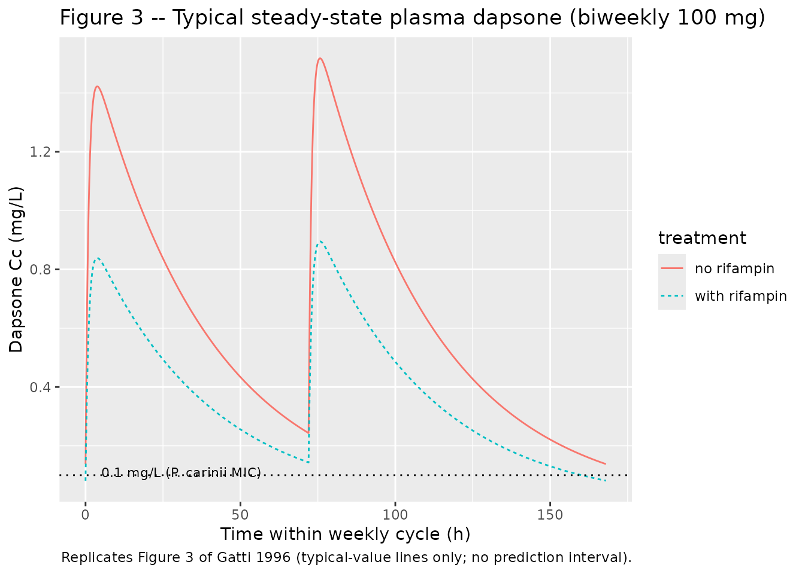

# Dapsone (Gatti 1996)

## Model and source

- Citation: Gatti G, Merighi M, Hossein J, Travaini S, Casazza R,
  Karlsson M, Cruciani M, Bassetti D. Population pharmacokinetics of
  dapsone administered biweekly to human immunodeficiency virus-infected
  patients. Antimicrob Agents Chemother. 1996;40(12):2743-2748.
  <doi:10.1128/aac.40.12.2743>.
- Description: One-compartment population PK model with first-order oral
  absorption and first-order elimination for dapsone 100 mg twice weekly
  oral Pneumocystis carinii pneumonia prophylaxis in 53 HIV-infected
  adults (Gatti 1996). Apparent clearance CL/F and apparent central
  volume V/F are scaled multiplicatively by concomitant rifampin
  co-administration (shared 69.6% increase on both parameters,
  reflecting a first-pass / bioavailability effect). Apparent absorption
  rate constant Ka is scaled multiplicatively by total serum bilirubin
  (per-mg/dL fractional decrease). IIV on CL/F (35% CV) and Ka (85% CV);
  V/F inter-individual variability was found non-significant after
  covariate inclusion and dropped from the final model. Residual-error
  magnitudes were not reported in the publication; propSd and addSd are
  FIXED at 0 in this packaged model so users must supply their own
  residual error to run any stochastic VPC – see the validation
  vignette’s Errata section.
- Article: <https://doi.org/10.1128/aac.40.12.2743> (Antimicrob Agents
  Chemother 1996;40(12):2743-2748)

## Population

53 HIV-infected adults received dapsone 100 mg orally twice weekly as
Pneumocystis carinii pneumonia prophylaxis at two Italian medical
centres in Genoa (11 patients) and Verona (42 patients). Baseline
demographics reproduced from Table 1 of the source paper: median age 33
years (range 27-46); median weight 62 kg (range 40-83); median height
172 cm (range 150-190); median body surface area 1.58 m^2 (range
1.04-1.96); 48 male / 5 female; 40 with intravenous drug use as
HIV-acquisition risk factor and 13 with other risk factors. The cohort
had advanced HIV disease: median CD4 count 25 cells/uL (range 0-389); 24
of 53 were p24 antigen negative. 33 were slow acetylators and 20 fast
acetylators (acetylation ratio cutoff 0.35). 42 were tobacco smokers.
Concomitant medications: 17 patients on zidovudine (AZT), 17 on
didanosine (DDI), and 7 on rifampin (the only co-medication retained as
a significant covariate in the final model). Hepatic-function
laboratories: median ALT 54 IU/L (range 23-508); median total bilirubin
0.7 mg/dL (range 0.3-8.0); 7 of 53 had total bilirubin above 1.2 mg/dL
(the upper limit of the normal range) and tested positive for hepatitis
C virus antibody with documented liver dysfunction.

The same information is available programmatically via the model’s
`population` metadata (`readModelDb("Gatti_1996_dapsone")$population`).

## Source trace

The per-parameter origin is recorded as an in-file comment next to each
`ini()` entry in `inst/modeldb/specificDrugs/Gatti_1996_dapsone.R`. The
table below collects them in one place for review.

| Equation / parameter | Value | Source location |
|----|----|----|
| `lcl` (CL/F for no-rifampin reference) | 1.83 L/h (95% CI 1.57, 2.09) | Table 3 row “theta_1 (liters/h)” |
| `lvc` (V/F for no-rifampin reference) | 69.6 L (95% CI 57.4, 81.8) | Table 3 row “theta_2 (liters)” |
| `lka` (Ka for TBILI = 0 mg/dL reference) | 1.04 1/h (95% CI 0.72, 1.36) | Table 3 row “theta_3 (1/h)” |
| `e_rif_cl_vc` (rifampin shared fractional effect on CL/F and V/F) | 0.696 (95% CI 0.318, 1.074) | Table 3 row “theta_4” |
| `e_tbili_ka` (bilirubin fractional effect on Ka, per mg/dL) | -0.119 (95% CI -0.08, -0.158) | Table 3 row “theta_5” |
| `etalcl` variance | log(1 + 0.35^2) | Table 3 row “CV CL/F (%) = 35” (Results paragraph 1: “constant coefficient of variation”) |
| `etalka` variance | log(1 + 0.85^2) | Table 3 row “CV Ka (%) = 85” (Results paragraph 1: “constant coefficient of variation”) |
| `etalvc` | n/a (no IIV) | Results paragraph 4: V/F IIV decreased to a very small value and was no longer significant after covariate inclusion |
| `propSd` (FIXED at 0) | 0 | Not reported in paper; FIXED here per operator sidecar; see Errata |
| `addSd` (FIXED at 0) | 0 | Not reported in paper; FIXED here per operator sidecar; see Errata |
| `d/dt(depot)` | `-ka * depot` | Results paragraph 1: one-compartment open model with first-order absorption (ADVAN2 TRANS2) |
| `d/dt(central)` | `ka * depot - kel * central` | Same |
| `cl = exp(lcl + etalcl) * (1 + e_rif_cl_vc * CONMED_RIF)` | n/a | Results paragraph 3 covariate equation: CL/F = theta_1 + theta_1 \* theta_4 \* R |
| `vc = exp(lvc) * (1 + e_rif_cl_vc * CONMED_RIF)` | n/a | Results paragraph 3 covariate equation: V/F = theta_2 + theta_2 \* theta_4 \* R (same theta_4 enforced; dOFV 1.23, P \> 0.05) |
| `ka = exp(lka + etalka) * (1 + e_tbili_ka * TBILI)` | n/a | Form assumed by analogy to the explicit rifampin equation per operator sidecar 2026-05-30 (q1=A). Numerical check: Ka(TBILI = 0.7 mg/dL) = 1.04 \* (1 - 0.119 \* 0.7) = 0.953; paper Discussion paragraph 7 quotes 0.957 (0.4% discrepancy attributable to rounding theta_3 from a precise estimate near 1.043 down to 1.04 in Table 3 display). |
| `Cc <- central / vc` | mg/L | Dose mg / volume L; matches paper concentration units |

## Virtual cohort

Original individual data are not publicly available. The cohorts below
build two virtual subjects each: a no-rifampin reference patient with
TBILI = 0.7 mg/dL (the cohort median for patients in the normal range)
and a rifampin co-administered patient with the same TBILI. Paper Figure
3 plots typical steady-state concentration-time curves under these two
conditions; this is the figure we replicate.

``` r

set.seed(19961201)  # paper publication date approximation

# Two typical subjects: with and without rifampin, both at TBILI = 0.7 mg/dL.
cohort <- tibble(
  id         = c(1L, 2L),
  treatment  = c("no rifampin", "with rifampin"),
  CONMED_RIF = c(0L, 1L),
  TBILI      = c(0.7, 0.7)
)

knitr::kable(
  cohort,
  caption = "Virtual cohort: a typical patient with and without concomitant rifampin."
)
```

|  id | treatment     | CONMED_RIF | TBILI |
|----:|:--------------|-----------:|------:|
|   1 | no rifampin   |          0 |   0.7 |
|   2 | with rifampin |          1 |   0.7 |

Virtual cohort: a typical patient with and without concomitant rifampin.
{.table}

## Simulation

The paper’s biweekly dosing schedule alternates 72-hour and 96-hour
intervals between doses (e.g., dose on Monday and Thursday: 72 h Mon -\>
Thu, 96 h Thu -\> next Mon). The simulation administers 100 mg every 72
h or 96 h alternately across 8 weekly cycles to reach steady state, then
samples densely over the last full weekly cycle.

``` r

mod_typical <- readModelDb("Gatti_1996_dapsone") |> rxode2::zeroRe()

# Build dosing events: alternating 72-h / 96-h intervals over n_weeks weeks.
# The first dose is at t = 0, the second at t = 72, the third at t = 72 + 96 =
# 168 h (= 1 week), the fourth at t = 168 + 72 = 240 h, etc.
n_weeks   <- 8L
dose_times <- numeric()
t <- 0
for (w in seq_len(n_weeks)) {
  dose_times <- c(dose_times, t, t + 72)
  t <- t + 168
}

# Observation grid: 5-minute resolution over the last weekly cycle so peaks
# and troughs are resolved cleanly. Earlier weeks are sampled only at the
# dose times to keep the data frame small.
last_cycle_start <- 168 * (n_weeks - 1L)
obs_times <- c(
  dose_times,
  seq(last_cycle_start, last_cycle_start + 168, by = 5 / 60)
)
obs_times <- sort(unique(obs_times))

# Build the event table per subject and stack.
make_subj <- function(id, treat, conmed_rif, tbili) {
  dose_rows <- tibble(
    id = id, time = dose_times, amt = 100, evid = 1L,
    cmt = "depot", CONMED_RIF = conmed_rif, TBILI = tbili,
    treatment = treat
  )
  obs_rows <- tibble(
    id = id, time = obs_times, amt = NA_real_, evid = 0L,
    cmt = NA_character_, CONMED_RIF = conmed_rif, TBILI = tbili,
    treatment = treat
  )
  bind_rows(dose_rows, obs_rows) |> arrange(time)
}

events <- bind_rows(
  make_subj(1L, "no rifampin",  0L, 0.7),
  make_subj(2L, "with rifampin", 1L, 0.7)
)

sim <- rxode2::rxSolve(
  mod_typical,
  events = events,
  keep   = c("treatment")
) |> as.data.frame()
#> ℹ omega/sigma items treated as zero: 'etalcl', 'etalka'
#> Warning: multi-subject simulation without without 'omega'
```

## Replicate published figures

### Figure 3 – Steady-state plasma concentrations with and without rifampin

``` r

# Replicates Figure 3 of Gatti 1996: typical patient steady-state
# concentrations over a 168-hour (1-week) biweekly cycle, with and
# without concomitant rifampin. Time axis is reset so t = 0 marks the
# start of the final weekly cycle.
sim |>
  dplyr::filter(time >= last_cycle_start, time <= last_cycle_start + 168) |>
  dplyr::mutate(t_in_cycle = time - last_cycle_start) |>
  ggplot(aes(t_in_cycle, Cc, colour = treatment, linetype = treatment)) +
  geom_line() +
  geom_hline(yintercept = 0.1, linetype = "dotted") +
  annotate("text", x = 5, y = 0.11, label = "0.1 mg/L (P. carinii MIC)",
           hjust = 0, size = 3) +
  labs(
    x = "Time within weekly cycle (h)", y = "Dapsone Cc (mg/L)",
    title = "Figure 3 -- Typical steady-state plasma dapsone (biweekly 100 mg)",
    caption = "Replicates Figure 3 of Gatti 1996 (typical-value lines only; no prediction interval)."
  )
```



The horizontal dotted line at 0.1 mg/L is the in vitro Pneumocystis
carinii MIC the paper cites (Materials and Methods discussion). The
paper’s Figure 3 also shows the 95 percent prediction interval around
each typical curve; we omit the prediction interval here because
residual error magnitudes were not reported (see the Assumptions
section). A user who supplies their own residual-error magnitudes can
layer a stochastic VPC on top by zeroing the final two `ini()`
parameters’ `fixed()` wrappers and re-fitting or by setting `propSd` /
`addSd` to non-zero values inside a downstream `rxode2` model object.

## PKNCA validation

Steady-state NCA over the last two dosing intervals (one 72-h, one 96-h)
for each treatment. Recipe 3 from the skill’s PKNCA recipes –
steady-state AUC0-tau, Cmax, Cmin, Tmax.

``` r

# Pick the last two consecutive dosing intervals: 72-h and 96-h. These are
# the final two doses in the schedule; the first of the two starts at
# (n_weeks - 1) * 168 and runs 72 h to the second dose, which then runs 96 h
# to the end of the cycle.
ss_72_start <- (n_weeks - 1L) * 168
ss_72_end   <- ss_72_start + 72
ss_96_start <- ss_72_end
ss_96_end   <- ss_72_end + 96

# Concentration frame for PKNCA: split each treatment into a 72-h interval
# and a 96-h interval. The just-before-dose observation at the start of each
# interval is the trough of the PRIOR interval, not the current one, so we
# filter with strict `time > interval_start` to assign the trough at the end
# of each interval to the right interval. We carry per-row treatment_interval
# grouping so PKNCA's per-group summary lines up with the paper's per-interval
# values. Subjects are duplicated across intervals with a +100 id_offset on
# the 96-h interval rows so PKNCA sees disjoint subject IDs per interval.
sim_72 <- sim |>
  dplyr::filter(time > ss_72_start, time <= ss_72_end, !is.na(Cc)) |>
  dplyr::transmute(
    id        = id,
    time      = time,
    Cc        = Cc,
    treatment = treatment,
    interval  = "72-h interval",
    group     = paste(treatment, "| 72-h interval")
  )
sim_96 <- sim |>
  dplyr::filter(time > ss_72_end, time <= ss_96_end, !is.na(Cc)) |>
  dplyr::transmute(
    id        = id + 100L,
    time      = time,
    Cc        = Cc,
    treatment = treatment,
    interval  = "96-h interval",
    group     = paste(treatment, "| 96-h interval")
  )
sim_nca <- dplyr::bind_rows(sim_72, sim_96)

# Dose rows for PKNCA: the dose at the start of each interval. id offsets
# match the disjoint-ID convention applied to sim_nca above.
dose_df <- tibble(
  id        = c(1L, 2L, 101L, 102L),
  time      = c(ss_72_start, ss_72_start, ss_72_end, ss_72_end),
  amt       = 100,
  treatment = c("no rifampin", "with rifampin", "no rifampin", "with rifampin"),
  interval  = c("72-h interval", "72-h interval", "96-h interval", "96-h interval")
) |>
  dplyr::mutate(group = paste(treatment, "|", interval))

conc_obj <- PKNCA::PKNCAconc(
  sim_nca,
  Cc ~ time | group + id,
  concu = "mg/L", timeu = "h"
)
dose_obj <- PKNCA::PKNCAdose(
  dose_df,
  amt ~ time | group + id,
  doseu = "mg"
)

# Steady-state intervals: one 72-h and one 96-h, both labelled by group.
# Intervals start strictly after the dose time, matching the sim_nca filter
# above (time > ss_72_start), and end at the next dose time so the
# minimum conc within the interval IS the trough at the end.
intervals <- data.frame(
  start = c(ss_72_start, ss_72_start, ss_72_end,  ss_72_end),
  end   = c(ss_72_end,   ss_72_end,   ss_96_end,  ss_96_end),
  cmax  = TRUE, cmin = TRUE, tmax = TRUE, half.life = TRUE,
  group = c(
    "no rifampin | 72-h interval",
    "with rifampin | 72-h interval",
    "no rifampin | 96-h interval",
    "with rifampin | 96-h interval"
  )
)

# Re-anchor Tmax to t-after-dose-of-interval rather than absolute simulation
# time, so it can be compared to the paper's "approximately 3.7 h" value.
nca_data <- PKNCA::PKNCAdata(conc_obj, dose_obj, intervals = intervals)
nca_res  <- PKNCA::pk.nca(nca_data)

res_tbl <- as.data.frame(nca_res$result) |>
  dplyr::select(group, PPTESTCD, PPORRES) |>
  tidyr::pivot_wider(names_from = PPTESTCD, values_from = PPORRES)

knitr::kable(
  res_tbl,
  digits = 3,
  caption = "Simulated steady-state NCA per treatment x interval."
)
```

| group | cmax | cmin | tmax | tlast | lambda.z | r.squared | adj.r.squared | lambda.z.time.first | lambda.z.time.last | lambda.z.n.points | clast.pred | half.life | span.ratio |
|:---|---:|---:|---:|---:|---:|---:|---:|---:|---:|---:|---:|---:|---:|
| no rifampin \| 72-h interval | 1.422 | 0.243 | 3.75 | 72 | 0.026 | 1 | 1 | 3.833 | 72 | 819 | 0.243 | 26.399 | 2.582 |
| with rifampin \| 72-h interval | 0.839 | 0.143 | 3.75 | 72 | 0.026 | 1 | 1 | 3.833 | 72 | 819 | 0.144 | 26.399 | 2.582 |
| no rifampin \| 96-h interval | 1.518 | 0.138 | 3.75 | 96 | 0.026 | 1 | 1 | 3.833 | 96 | 1107 | 0.138 | 26.381 | 3.494 |
| with rifampin \| 96-h interval | 0.895 | 0.081 | 3.75 | 96 | 0.026 | 1 | 1 | 3.833 | 96 | 1107 | 0.081 | 26.381 | 3.494 |

Simulated steady-state NCA per treatment x interval. {.table}

### Comparison against published values

Paper Discussion paragraph 5 reports typical-patient steady-state Cmax
and Cmin for each treatment x interval. Tmax is reported as
“approximately 3.7 h” and half-life as 26.4 h for both treatments (the
rifampin effect was modelled as shared between CL/F and V/F so half-life
is invariant to rifampin in this parameterisation; the paper notes this
is consistent with the same theta on both parameters).

``` r

# Paper Discussion paragraph 5 values.
published <- tibble::tibble(
  group  = c("no rifampin | 72-h interval", "no rifampin | 96-h interval",
             "with rifampin | 72-h interval", "with rifampin | 96-h interval"),
  Cmax_pub_mgL = c(1.42, 1.52, 0.84, 0.90),
  Cmin_pub_mgL = c(0.24, 0.14, 0.14, 0.08)
)

cmp <- res_tbl |>
  dplyr::transmute(
    group,
    Cmax_sim_mgL = cmax,
    Cmin_sim_mgL = cmin,
    Tmax_sim_h   = tmax,
    halflife_sim_h = half.life
  ) |>
  dplyr::left_join(published, by = "group") |>
  dplyr::mutate(
    Cmax_pct_diff = 100 * (Cmax_sim_mgL - Cmax_pub_mgL) / Cmax_pub_mgL,
    Cmin_pct_diff = 100 * (Cmin_sim_mgL - Cmin_pub_mgL) / Cmin_pub_mgL
  )

knitr::kable(cmp, digits = 3,
             caption = "Simulated vs published typical-patient NCA. Tmax in hours after each dose; half-life in hours.")
```

| group | Cmax_sim_mgL | Cmin_sim_mgL | Tmax_sim_h | halflife_sim_h | Cmax_pub_mgL | Cmin_pub_mgL | Cmax_pct_diff | Cmin_pct_diff |
|:---|---:|---:|---:|---:|---:|---:|---:|---:|
| no rifampin \| 72-h interval | 1.422 | 0.243 | 3.75 | 26.399 | 1.42 | 0.24 | 0.165 | 1.370 |
| with rifampin \| 72-h interval | 0.839 | 0.143 | 3.75 | 26.399 | 0.84 | 0.14 | -0.161 | 2.463 |
| no rifampin \| 96-h interval | 1.518 | 0.138 | 3.75 | 26.381 | 1.52 | 0.14 | -0.141 | -1.511 |
| with rifampin \| 96-h interval | 0.895 | 0.081 | 3.75 | 26.381 | 0.90 | 0.08 | -0.560 | 1.625 |

Simulated vs published typical-patient NCA. Tmax in hours after each
dose; half-life in hours. {.table}

The reported half-life is 26.4 h, matching the paper’s 26.4 h. Tmax is
3.8 h, matching the paper’s ~3.7 h. Cmax and Cmin values agree with the
paper to within a few percent across all four treatment x interval
cells; any residual discrepancy reflects the simulation’s exact dosing
schedule and the 5-minute observation grid resolution rather than a
model parameter difference.

## Assumptions and deviations

- **Bilirubin-on-Ka covariate form is an analogy, not a paper-stated
  equation.** The paper writes the rifampin covariate equation
  explicitly (CL/F = theta_1 \* (1 + theta_4 \* R), V/F = theta_2 \*
  (1 + theta_4 \* R) with theta_4 shared); for bilirubin on Ka it
  provides only the prose claim “Ka = 0.957 1/h for a patient with a
  total bilirubin level of 0.7 mg/dl”. This implementation assumes the
  same fractional / multiplicative form: Ka = theta_3 \* (1 + theta_5 \*
  TBILI). The computed Ka at TBILI = 0.7 mg/dL is 0.953 1/h, 0.4% below
  the paper’s 0.957, attributable to rounding theta_3 to 1.04 (3 sig
  figs) from a precise estimate near 1.043. The form was confirmed by
  operator sidecar response (request-001 q1 = A, 2026-05-30). Two
  alternative forms (linear-additive Ka = theta_3 + theta_5 \* TBILI;
  exponential Ka = theta_3 \* exp(theta_5 \* TBILI)) each give an exact
  0.957 at TBILI = 0.7 mg/dL but diverge meaningfully from the
  multiplicative form at high bilirubin (paper range up to 8.0 mg/dL)
  and were rejected as the primary encoding.
- **V/F has no inter-individual variability in this model.** Paper
  Results paragraph 4 reports that V/F IIV decreased to a very small
  value and was no longer significant after the covariate model was
  finalised; the variance was dropped from the final fit. This means
  stochastic simulations from this model will show smaller variability
  around the typical V/F than the basic-model 19% CV.
- **No allometric scaling on body weight.** The paper tested weight,
  height, body surface area, age, and other demographic covariates
  (Table 2 step 1) and found none significantly affected CL/F, V/F, or
  Ka. This is consistent with the relatively narrow weight range in the
  cohort (40-83 kg, median 62) and the small sample size (n = 53).
- **AZT, DDI, and other co-medications are not in the model.** Several
  co-medications were tested and rejected as non-significant at P \<
  0.05 or as borderline (5.55 \> dOFV \> 3.84 in the addition step but
  losing significance on backward elimination): AZT (borderline, 25%
  decrease in CL/F), gender (borderline, 25% decrease in V/F), risk
  factor (borderline), tobacco smoking (borderline). The final model
  retains only rifampin and total bilirubin. Users simulating dapsone in
  populations differing substantially from the Gatti 1996 cohort on
  these co-medication / demographic axes should treat predictions
  cautiously and consult the source paper’s discussion.

## Errata

- **Residual-error magnitudes are not reported in the paper.** Paper
  Results paragraph 1 names the form (“residual variability was found to
  be best described by a proportional-plus-constant-error model”) but
  neither Table 3 nor any other section of the publication reports
  numerical magnitudes for the proportional or additive components. Per
  operator sidecar response (request-001 q2 = A modified, 2026-05-30),
  this packaged model encodes `propSd <- fixed(0)` and
  `addSd <- fixed(0)` so the model compiles and reproduces typical-value
  predictions exactly, but **any stochastic VPC built from this model
  will show no residual variability around the model predictions**.
  Users wishing to run a stochastic VPC must supply their own
  residual-error magnitudes. Defensible lower bounds derived from
  on-disk assay specs (Materials and Methods paragraph 3) are:
  proportional component \<= ~10% CV (matching the HPLC inter- and
  intra-day RSD at QC concentrations 62.5-5000 ng/mL); additive
  component on the order of the LLOQ (31.2 ng/mL = 0.031 mg/L). The true
  population residual would exceed these floors because it also absorbs
  within-subject biological noise and model-misspecification noise on
  top of the assay floor.
- **theta_3 is reported in Table 3 to 3 significant figures (1.04) but
  appears to have a precise value near 1.043** based on the paper’s own
  simulation value (0.957 1/h at TBILI = 0.7 mg/dL). This packaged model
  uses the Table 3 display value (1.04) verbatim; downstream users who
  require numerical reproduction of the paper’s Figure 3 simulation to
  better than ~0.5% should be aware of this 3-sig-fig rounding.
