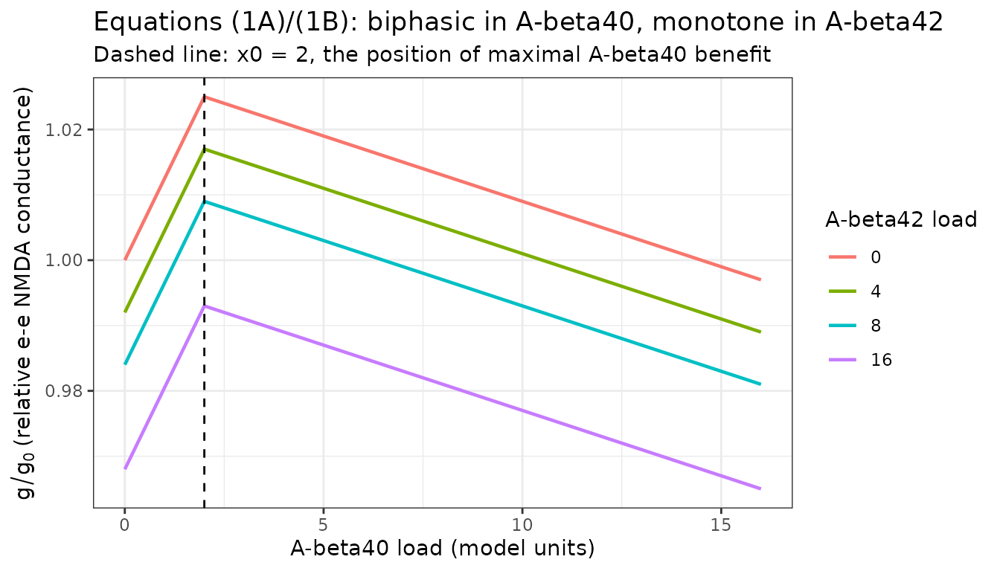
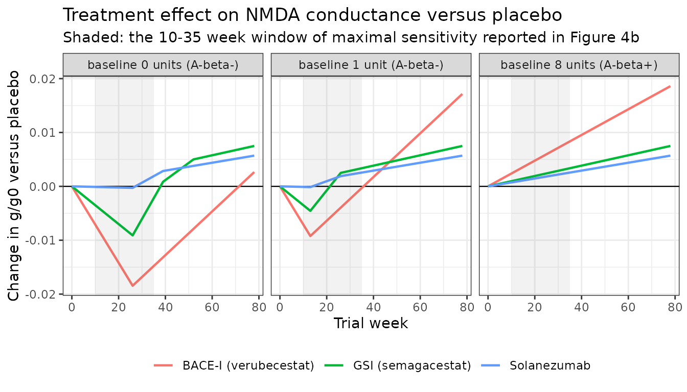
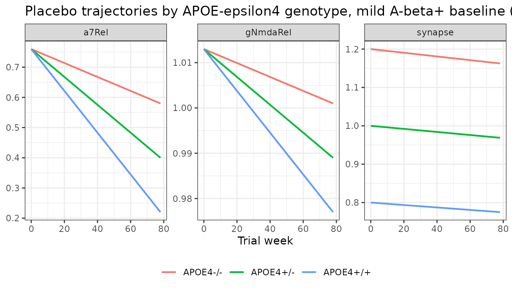

# Amyloid-beta modulation of glutamatergic and nicotinic neurotransmission (Geerts 2018)

## Model and source

``` r

ui <- rxode2::rxode(readModelDb("Geerts_2018_amyloidNeurotransmission_qsp"))
ui$state
#> [1] "abeta40" "abeta42" "neuron"  "synapse"
```

- Citation: Geerts H, Spiros A, Roberts P (2018). Impact of amyloid-beta
  changes on cognitive outcomes in Alzheimer’s disease: analysis of
  clinical trials using a quantitative systems pharmacology model.
  Alzheimer’s Research & Therapy 10:14. <doi:10.1186/s13195-018-0343-5>.
  The cortical network platform that converts the coupling variables
  encoded here into an ADAS-Cog readout is Roberts PD, Spiros A, Geerts
  H (2012) Alzheimers Res Ther 4(6):50 (reference \[16\] of the 2018
  paper) and is NOT encoded in this file.
- Article (open access): <https://doi.org/10.1186/s13195-018-0343-5>
- PMCID: PMC5797372. The paper has no supplementary information
  (EuropePMC `hasSuppl = N`), and “Availability of data and materials”
  states that no datasets were generated or analysed. Every value below
  is therefore from the main text.

Geerts, Spiros and Roberts asked why amyloid-lowering trials in
Alzheimer’s disease keep failing. Their answer is a quantitative systems
pharmacology argument: low-order amyloid-beta 40 (A-beta40) aggregates
are *neurostimulatory* over a limited dose range, so indiscriminate
amyloid lowering in a patient whose amyloid load is already low removes
a benefit rather than a toxin.

### What this file encodes, and what it cannot

The published model has two layers, and only the first is portable.

**Layer 1 – extracted here.** The paper’s own calibrated amyloid layer:
linear A-beta40 and A-beta42 deposition, linear cortical neuron and
synapse loss, and the two closed-form coupling equations that turn the
A-beta loads into neurophysiological readouts (Equations 1A, 1B and 2,
with the parameter set fixed in Results). Every constant is printed in
the paper.

**Layer 2 – NOT portable.** The transfer function from those readouts to
an ADAS-Cog score is a biophysically realistic cortical network of 80
glutamatergic pyramidal cells and 40 GABAergic interneurons with full
dopaminergic, serotonergic, noradrenergic and cholinergic modulation,
simulated in NEURON Release 7.2. It is a proprietary In Silico
Biosciences platform described in the upstream reference (Roberts,
Spiros & Geerts 2012, *Alzheimers Res Ther* 4:50), and this paper writes
down neither its equations nor its parameters.

The model therefore outputs `gNmdaRel` and `a7Rel`, **not** ADAS-Cog.
Figures 2, 3, 4a, 5 and 6 of the paper are ADAS-Cog predictions and
cannot be reproduced numerically. What *can* be checked – and is checked
below – is that the amyloid layer reproduces the paper’s own arithmetic
exactly, and that the mechanism the paper’s conclusions rest on emerges
from it.

## Population

``` r

pop <- ui$population
knitr::kable(
  data.frame(Field = names(pop), Value = unlist(lapply(pop, as.character))),
  row.names = FALSE
)
```

| Field | Value |
|:---|:---|
| species | human (in silico virtual patients) |
| n_subjects | NA |
| n_studies | NA |
| disease_state | Two simulated populations. (1) Mild-to-moderate Alzheimer’s disease, MMSE 18-24, followed for 78 weeks – the calibration population of the upstream ADAS-Cog platform. (2) Minimal / mild cognitive impairment (MCI), simulated as a 3% decrease in synapse and neuron density plus a 30% INCREASE in cholinergic tone. |
| dose_range | No dosing events. Amyloid-lowering interventions enter as the fractional reduction in A-beta deposition rate reported as clinical target engagement (Results, ‘Therapeutic amyloid-beta interventions’): verubecestat / BACE inhibitor 80-90% (A-beta40) and 60-80% (A-beta42); semagacestat / gamma-secretase inhibitor 30-50% and 15-30%; solanezumab 5-10% and 30-50%. |
| notes | No individual-level cohort: this is a deterministic typical-value QSP model. The upstream cortical network was calibrated against 28 retrospective historical treatment outcomes (placebo from the flurbiprofen / tarenflurbil trials at 72 weeks; donepezil and rivastigmine at 2 doses x 3 time points; galantamine at 3 doses x 3 time points; SB742457 at 2 doses x 2 time points) in mild-to-moderate AD, giving R-squared above 0.6 (Results / Methods ‘Calibration of the network’, citing reference \[16\]). The coupling parameters encoded here were then constrained against three independent clinical datasets: baseline ADAS-Cog in A-beta+ vs A-beta- MCI subjects (Doraiswamy 2014 Mol Psychiatry, reference \[17\] Table 1: 10.8 vs 8.5, with normal elderly controls at 5.6 and 4.1); the scopolamine dose-response in MCI (Lim 2015 Neurobiol Aging, reference \[18\]); and the APOE effect on placebo cognitive trajectory in AD (Samtani 2015, reference \[19\]). Absolute baseline ADAS-Cog is 20-22 in the AD population depending on APOE genotype, and 4.5 for healthy cognitively normal controls in the MCI model. No datasets were generated or analysed by the paper itself (‘Availability of data and materials’). |

There is no individual-level cohort: this is a deterministic
typical-value QSP model with no IIV and no residual error. The upstream
cortical network was calibrated against 28 retrospective historical
treatment outcomes in mild-to-moderate AD (MMSE 18-24, 78 weeks), and
the coupling parameters encoded here were then constrained against three
independent clinical datasets – baseline ADAS-Cog in A-beta-positive
versus A-beta-negative MCI subjects, the scopolamine dose-response in
MCI, and the APOE effect on placebo cognitive trajectory.

## Source trace

### Equations

| Model code | Source | Published form |
|----|----|----|
| `gNmdaRel` (branch `abeta40 <= x0_ab40`) | Equation (1A) | `g(x,y) = g0 * [1 + delta*(x/x0) - y*alpha*]` |
| `gNmdaRel` (branch `abeta40 > x0_ab40`) | Equation (1B) | `g(x,y) = g0 * [1 + delta + (x0-x)*alpha - y*alpha*]` |
| `a7Rel` | Equation (2) | `alpha7(x,y) activation = alpha7 activation0 * [1 - beta*(x+y)]` |
| `d/dt(abeta40)`, `d/dt(abeta42)` | Methods, “Alzheimer pathology and amyloid deposition” | “arbitrarily set at 1 unit/13 weeks for both A-beta40 and A-beta42 … this value assumes linear growth” |
| `apoeDep` | Methods, “APOE genotype” | 1.50 / 1.00 / 0.50 units per 13 weeks for APOE4+/+, +/-, -/- |
| `apoeSyn` | Methods, “APOE genotype” | synapse density -20% (APOE4+/+) and +20% (APOE4-/-) vs the heterozygote |
| `d/dt(neuron)`, `d/dt(synapse)` | Methods, “Alzheimer pathology and amyloid deposition” | “linear loss of neurons (at 0.35%/week) and synapses (0.04%/week)” |
| `cholTone` | Methods / Results | 30% cholinergic deficit (AD); 30% compensatory increase (MCI) |
| `abetaPos` | Figure 2 legend | “A-beta- subjects with x \<= 2 and y \<= 2, A-beta+ subjects with x \> 2 and y \> 2” |
| `fracRed40`, `fracRed42` | Results, “Therapeutic amyloid-beta interventions” | “Patients on the active drugs have a proportionally lower A-beta40 and A-beta42 increase according to their biomarker change” |

`x` is the A-beta40 load and `y` the A-beta42 load. Note that in both
branches the A-beta42 term carries `alpha*` (`alpha_ab42`); only the
`(x0 - x)` term in (1B) carries `alpha` (`alpha_ab40`). The two branches
agree at `x = x0`, where both reduce to `g0 * [1 + delta - y*alpha*]`.

### Parameters

``` r

knitr::kable(
  ui$iniDf |>
    dplyr::select(name, est, fix, label) |>
    dplyr::rename(
      "Parameter" = name, "Value" = est, "Fixed" = fix, "Description" = label
    ),
  row.names = FALSE, digits = 6
)
```

| Parameter | Value | Fixed | Description |
|:---|---:|:---|:---|
| x0_ab40 | 2.000000 | TRUE | A-beta40 load at the maximal positive NMDA effect, x0 (A-beta load units) |
| delta_g | 0.025000 | TRUE | Maximal relative increase in NMDA conductance from A-beta40, delta (unitless) |
| alpha_ab40 | 0.002000 | TRUE | Slope of NMDA conductance decline above x0 per A-beta40 unit, alpha (1/unit) |
| alpha_ab42 | 0.002000 | TRUE | Slope of NMDA conductance decline per A-beta42 unit, alpha\* (1/unit) |
| beta_a7 | 0.030000 | TRUE | Coupling factor of summed A-beta load on alpha-7 nAChR activation, beta (1/unit) |
| abetaCutoff | 3.000000 | TRUE | A-beta+ / A-beta- classification cutoff on each load axis (A-beta load units) |
| kdep40 | 0.076923 | TRUE | A-beta40 deposition rate in the APOE4+/- heterozygote (load units/week) |
| kdep42 | 0.076923 | TRUE | A-beta42 deposition rate in the APOE4+/- heterozygote (load units/week) |
| e_apoe4_kdep | 0.500000 | TRUE | Fractional change in A-beta deposition rate per APOE4 allele above the heterozygote (unitless) |
| klossNeuron | 0.003500 | TRUE | Linear cortical neuron loss rate, fraction of baseline density per week (1/week) |
| klossSynapse | 0.000400 | TRUE | Linear cortical synapse loss rate, fraction of baseline density per week (1/week) |
| e_apoe4_syn | 0.200000 | TRUE | Fractional change in baseline synapse density per APOE4 allele above the heterozygote (unitless) |
| SW_MCI | 0.000000 | TRUE | Scenario switch: 0 = mild-to-moderate AD (default), 1 = MCI population |
| densLossMci | 0.030000 | TRUE | Baseline neuron and synapse density decrease in the MCI population (unitless fraction) |
| cholDefAd | 0.300000 | TRUE | Cholinergic tone deficit in the mild-to-moderate AD population (unitless fraction) |
| cholIncMci | 0.300000 | TRUE | Compensatory cholinergic tone increase in the MCI population (unitless fraction) |
| abeta40Bl | 4.000000 | TRUE | Baseline A-beta40 load at trial start (A-beta load units) |
| abeta42Bl | 4.000000 | TRUE | Baseline A-beta42 load at trial start (A-beta load units) |
| fracRed40 | 0.000000 | TRUE | Fractional reduction of the A-beta40 deposition rate by treatment, 0 = placebo (unitless) |
| fracRed42 | 0.000000 | TRUE | Fractional reduction of the A-beta42 deposition rate by treatment, 0 = placebo (unitless) |

Every parameter is `fixed()`: the paper reports a single calibrated
parameterisation and estimates nothing from a user’s data.

The coupling set (`x0_ab40 = 2`, `delta_g = 0.025`, `beta_a7 = 0.03`,
`alpha_ab40 = 0.002`, `alpha_ab42 = 0.002`) is the **final** set, from
the closing sentence of Results “Sensitivity analysis”. The paper quotes
two earlier sets that this supersedes: an exploratory set in
“Constraining system parameters using clinical data” (`delta = 0.015`,
`alpha = 0.0015`, `alpha* = 0.00035`, `beta = 0.025`) and the Figure 3
set (`delta = 0.025`, `alpha = 0.002`, `alpha* = 0.002`, `beta`
unstated).

### Units

| Symbol | Units | Note |
|----|----|----|
| `abeta40`, `abeta42` | arbitrary A-beta load units | 1 unit = the A-beta accumulated in 13 weeks by an APOE4+/- heterozygote; discretized 0-16 in the paper |
| `kdep40`, `kdep42` | load units / week | `1/13` per week |
| `neuron`, `synapse` | dimensionless | fraction of that subject’s trial-baseline density |
| `klossNeuron`, `klossSynapse` | 1 / week | fraction of baseline lost per week |
| `x0_ab40`, `abetaCutoff` | load units | positions on the A-beta40 axis |
| `delta_g` | dimensionless | relative conductance increment |
| `alpha_ab40`, `alpha_ab42`, `beta_a7` | 1 / load unit | slopes per load unit |
| `gNmdaRel`, `a7Rel` | dimensionless | ratios to the A-beta-free reference (`g0`, `activation0`) |

Dimensional check on each ODE: `d/dt(abeta40)` is
`[load units/week] x [dimensionless] x [dimensionless] = [load units]/[week]`.
`d/dt(synapse)` is `[1/week] x [dimensionless] = 1/[week]`, matching a
dimensionless state per week. In Equations (1A)/(1B)/(2) every additive
term is dimensionless: `delta_g` and `delta_g*(x/x0)` directly, and
`alpha*y`, `alpha*(x0-x)`, `beta*(x+y)` as
`[1/load unit] x [load units]`.

## Setting up solves

The model has no dosing events; the A-beta pools start at a baseline
load and grow. Baseline loads, treatment effect and APOE genotype are
supplied as columns of the event table.

``` r

solve_arm <- function(times = seq(0, 78, by = 13), apoe4 = 1,
                      bl40 = 4, bl42 = 4, f40 = 0, f42 = 0, mci = 0) {
  ev <- data.frame(
    id = 1L, time = times, evid = 0L, amt = NA_real_,
    APOE4_COUNT = apoe4, abeta40Bl = bl40, abeta42Bl = bl42,
    fracRed40 = f40, fracRed42 = f42, SW_MCI = mci
  )
  out <- rxode2::rxSolve(ui, ev, returnType = "data.frame")
  if (is.null(out$id)) out$id <- 1L
  out
}
```

## Validation

Every quantity below is deterministic – the model has no random effects,
so these are exact-value checks rather than tolerance bands on a
simulated cohort.

### 1. A-beta deposition and the APOE genotype effect

``` r

dep <- vapply(0:2, function(a) diff(solve_arm(c(0, 13), apoe4 = a)$abeta40), numeric(1))
syn <- vapply(0:2, function(a) solve_arm(0, apoe4 = a)$synapse, numeric(1))
neu <- vapply(0:2, function(a) solve_arm(0, apoe4 = a)$neuron, numeric(1))

knitr::kable(
  data.frame(
    Genotype = c("APOE4-/-", "APOE4+/-", "APOE4+/+"),
    `A-beta units per 13 wk (model)` = dep,
    `A-beta units per 13 wk (paper)` = c(0.50, 1.00, 1.50),
    `Baseline synapse density (model)` = syn,
    `Baseline synapse density (paper)` = c(1.20, 1.00, 0.80),
    check.names = FALSE
  ),
  row.names = FALSE
)
```

| Genotype | A-beta units per 13 wk (model) | A-beta units per 13 wk (paper) | Baseline synapse density (model) | Baseline synapse density (paper) |
|:---|---:|---:|---:|---:|
| APOE4-/- | 0.5 | 0.5 | 1.2 | 1.2 |
| APOE4+/- | 1.0 | 1.0 | 1.0 | 1.0 |
| APOE4+/+ | 1.5 | 1.5 | 0.8 | 0.8 |

``` r


stopifnot(
  isTRUE(all.equal(dep, c(0.50, 1.00, 1.50))),
  isTRUE(all.equal(syn, c(1.20, 1.00, 0.80))),
  # Geerts 2018 applies the APOE synaptic-density effect to SYNAPSES ONLY.
  isTRUE(all.equal(neu, c(1, 1, 1)))
)
```

### 2. Disease-state settings

``` r

ad <- solve_arm(0, mci = 0)
mci <- solve_arm(0, mci = 1)
stopifnot(
  isTRUE(all.equal(ad$cholTone, 0.70)),   # 30% cholinergic deficit
  isTRUE(all.equal(mci$cholTone, 1.30)),  # 30% compensatory increase
  isTRUE(all.equal(mci$neuron, 0.97)),    # 3% decrease in neuron density
  isTRUE(all.equal(mci$synapse, 0.97))    # 3% decrease in synapse density
)
```

### 3. Linear neurodegeneration

``` r

prog <- solve_arm(seq(0, 78, by = 13))
stopifnot(
  isTRUE(all.equal(prog$neuron, 1 - 0.0035 * prog$time)),
  isTRUE(all.equal(prog$synapse, 1 - 0.0004 * prog$time))
)
```

At 78 weeks the model has lost 27.3% of cortical neurons and 3.12% of
synapses, matching 0.35%/week and 0.04%/week over 78 weeks.

### 4. Equations (1A) / (1B): the biphasic A-beta40 response

The defining property of the model – the one the paper’s conclusions
rest on – is that NMDA conductance *rises* with A-beta40 up to `x0` and
falls thereafter.

``` r

grid <- expand.grid(abeta40Bl = seq(0, 16, by = 0.25), abeta42Bl = c(0, 4, 8, 16))
grid$id <- seq_len(nrow(grid))
ev_grid <- data.frame(
  id = grid$id, time = 0, evid = 0L, amt = NA_real_, APOE4_COUNT = 1,
  abeta40Bl = grid$abeta40Bl, abeta42Bl = grid$abeta42Bl,
  fracRed40 = 0, fracRed42 = 0, SW_MCI = 0
)
surf <- rxode2::rxSolve(ui, ev_grid, returnType = "data.frame")

ggplot(surf, aes(abeta40, gNmdaRel, colour = factor(abeta42))) +
  geom_line(linewidth = 0.8) +
  geom_vline(xintercept = 2, linetype = "dashed") +
  labs(
    x = "A-beta40 load (model units)",
    y = expression(g / g[0]~"(relative e-e NMDA conductance)"),
    colour = "A-beta42 load",
    title = "Equations (1A)/(1B): biphasic in A-beta40, monotone in A-beta42",
    subtitle = "Dashed line: x0 = 2, the position of maximal A-beta40 benefit"
  ) +
  theme_bw()
```



``` r

at_y0 <- surf[surf$abeta42 == 0, ]
peak <- at_y0[which.max(at_y0$gNmdaRel), ]
# Peak sits exactly at x0 and reaches exactly 1 + delta.
stopifnot(
  isTRUE(all.equal(peak$abeta40, 2)),
  isTRUE(all.equal(peak$gNmdaRel, 1.025))
)
# Strictly increasing below x0, strictly decreasing above it.
lo <- at_y0[at_y0$abeta40 <= 2, "gNmdaRel"]
hi <- at_y0[at_y0$abeta40 >= 2, "gNmdaRel"]
stopifnot(all(diff(lo) > 0), all(diff(hi) < 0))
# Continuous at the x = x0 branch point, and each branch approaches it at its
# own published slope: (1A) rises at delta/x0 = 0.0125 per load unit, (1B)
# falls at alpha = 0.002 per load unit. Testing both one-sided slopes is
# strictly stronger than testing the gap alone -- a gap test with a fixed
# epsilon cannot distinguish a discontinuity from the branch's own slope.
g_at <- function(v) solve_arm(0, bl40 = v, bl42 = 0)$gNmdaRel
g0 <- g_at(2)
for (eps in c(1e-2, 1e-3, 1e-4)) {
  stopifnot(
    isTRUE(all.equal((g0 - g_at(2 - eps)) / eps, 0.025 / 2, tolerance = 1e-6)),
    isTRUE(all.equal((g0 - g_at(2 + eps)) / eps, 0.002, tolerance = 1e-6))
  )
}
# Both one-sided limits converge on the same value, so the branches meet.
stopifnot(abs(g_at(2 - 1e-6) - g_at(2 + 1e-6)) < 1e-7)
# Monotone decreasing in A-beta42 at every A-beta40 load, with slope -alpha*.
by_y <- surf |>
  dplyr::filter(abeta40 == 4) |>
  dplyr::arrange(abeta42)
stopifnot(
  isTRUE(all.equal(
    diff(by_y$gNmdaRel) / diff(by_y$abeta42), rep(-0.002, nrow(by_y) - 1)
  ))
)
```

With `delta_g = 0` the beneficial arm disappears entirely – the paper’s
key sensitivity result, which it uses to argue that a neurostimulatory
A-beta40 effect is *necessary* to reproduce three independent clinical
datasets.

``` r

no_delta <- vapply(
  c(0, 1, 2, 4, 8, 16),
  function(v) {
    ev <- data.frame(
      id = 1L, time = 0, evid = 0L, amt = NA_real_, APOE4_COUNT = 1,
      abeta40Bl = v, abeta42Bl = 0, fracRed40 = 0, fracRed42 = 0,
      SW_MCI = 0, delta_g = 0
    )
    rxode2::rxSolve(ui, ev, returnType = "data.frame")$gNmdaRel
  },
  numeric(1)
)
stopifnot(all(diff(no_delta) <= 0), no_delta[1] == 1)
```

### 5. Equation (2): alpha-7 nicotinic coupling

``` r

a7 <- surf |> dplyr::mutate(total = abeta40 + abeta42)
stopifnot(isTRUE(all.equal(a7$a7Rel, 1 - 0.03 * a7$total)))
```

`a7Rel` depends only on the *summed* load, as the paper specifies (“here
the effects for the two A-beta forms are identical”).

### 6. The paper’s own worked deposition example

Results, “Therapeutic amyloid-beta interventions”: *“in the case of a
low dose of GSI, a 40% reduction in A-beta40 and a 20% reduction in
A-beta42 corresponds to an increase of 0.6 units along the A-beta40 axis
and 0.80 units along the A-beta42 axis/13 weeks.”*

``` r

gsi <- solve_arm(c(0, 13), f40 = 0.40, f42 = 0.20)
stopifnot(
  isTRUE(all.equal(diff(gsi$abeta40), 0.60)),
  isTRUE(all.equal(diff(gsi$abeta42), 0.80))
)
```

This fixes the treatment mechanism unambiguously: the reported target
engagement scales the **deposition rate**, not the standing load.

### 7. Independent check against the published 3x3 weighting factors

The paper queries its discrete 17x17 outcome matrix by averaging a 3x3
neighbourhood with weights chosen so that “the mass average of the
A-beta load corresponds to the actual load”. For a patient starting at
`x = y = 4` on low-dose BACE-I (80% A-beta40 and 60% A-beta42 reduction)
it publishes weights of 0.73 / 0.33 / -0.06 on A-beta40 units 4, 5, 6
and 0.64 / 0.33 / 0.03 on A-beta42.

Those weights were **not** used to build this model, so reproducing the
loads they imply is an independent test of the deposition ODE, the APOE
reference rate, and the fractional-reduction mechanism together.

``` r

pts <- c(4, 5, 6)
w40 <- c(0.73, 0.33, -0.06)
w42 <- c(0.64, 0.33, 0.03)
bace <- solve_arm(c(0, 13), bl40 = 4, bl42 = 4, f40 = 0.80, f42 = 0.60)

knitr::kable(
  data.frame(
    Species = c("A-beta40", "A-beta42"),
    `Weight sum (paper)` = c(sum(w40), sum(w42)),
    `Mass-average load (paper)` = c(sum(w40 * pts), sum(w42 * pts)),
    `Load after 13 wk (model)` = c(bace$abeta40[2], bace$abeta42[2]),
    check.names = FALSE
  ),
  row.names = FALSE, digits = 3
)
```

| Species | Weight sum (paper) | Mass-average load (paper) | Load after 13 wk (model) |
|:---|---:|---:|---:|
| A-beta40 | 1 | 4.21 | 4.2 |
| A-beta42 | 1 | 4.39 | 4.4 |

``` r


stopifnot(
  # The published weights are a partition of unity, as a mass average requires.
  isTRUE(all.equal(sum(w40), 1)), isTRUE(all.equal(sum(w42), 1)),
  # Model loads match the paper's implied mass-average loads. The residual is
  # the paper's own rounding of the weights to two decimals (4.21 vs 4.20 and
  # 4.39 vs 4.40); 0.02 still fails on a mis-stated rate or reduction, which
  # would move these by 0.2-1.0 units.
  abs(sum(w40 * pts) - bace$abeta40[2]) < 0.02,
  abs(sum(w42 * pts) - bace$abeta42[2]) < 0.02
)
```

### 8. The central mechanistic claim: the sign of the treatment effect flips with baseline load

The paper’s conclusion is that amyloid lowering *harms* patients whose
baseline amyloid load is low, because the placebo patient’s A-beta40
would otherwise climb through the stimulatory range towards `x0`, and
*helps* patients whose load is already high. That claim lives entirely
in Layer 1, so it can be tested here directly on the conductance
readout.

``` r

arms <- data.frame(
  arm = c("BACE-I (verubecestat)", "GSI (semagacestat)", "Solanezumab"),
  f40 = c(0.85, 0.40, 0.075),
  f42 = c(0.70, 0.225, 0.40)
)

contrast <- lapply(c(0, 1, 8), function(bl) {
  pl <- solve_arm(seq(0, 78, by = 13), bl40 = bl, bl42 = bl)
  lapply(seq_len(nrow(arms)), function(i) {
    tr <- solve_arm(seq(0, 78, by = 13), bl40 = bl, bl42 = bl,
                    f40 = arms$f40[i], f42 = arms$f42[i])
    data.frame(
      baseline = bl, arm = arms$arm[i], time = tr$time,
      delta = tr$gNmdaRel - pl$gNmdaRel
    )
  }) |> dplyr::bind_rows()
}) |> dplyr::bind_rows()

contrast$baseline_lab <- factor(
  contrast$baseline,
  levels = c(0, 1, 8),
  labels = c("baseline 0 units (A-beta-)", "baseline 1 unit (A-beta-)",
             "baseline 8 units (A-beta+)")
)

ggplot(contrast, aes(time, delta, colour = arm)) +
  geom_hline(yintercept = 0, linewidth = 0.4) +
  geom_line(linewidth = 0.8) +
  facet_wrap(~baseline_lab) +
  annotate("rect", xmin = 10, xmax = 35, ymin = -Inf, ymax = Inf, alpha = 0.08) +
  labs(
    x = "Trial week",
    y = "Change in g/g0 versus placebo",
    colour = NULL,
    title = "Treatment effect on NMDA conductance versus placebo",
    subtitle = "Shaded: the 10-35 week window of maximal sensitivity reported in Figure 4b"
  ) +
  theme_bw() +
  theme(legend.position = "bottom")
```



``` r

bace_only <- contrast[contrast$arm == "BACE-I (verubecestat)", ]
b0 <- bace_only[bace_only$baseline == 0, ]
b1 <- bace_only[bace_only$baseline == 1, ]
b8 <- bace_only[bace_only$baseline == 8, ]

stopifnot(
  # A-beta-negative baselines: BACE-I LOWERS conductance versus placebo through
  # the early and middle trial -- the paper's "reducing A-beta40 has a negative
  # effect because the stimulatory A-beta40 effect ... is lost".
  b0$delta[b0$time == 26] < 0,
  b1$delta[b1$time == 26] < 0,
  # A-beta-positive baseline: strictly beneficial at every post-baseline visit,
  # and growing with time ("most significantly at later time points").
  all(b8$delta[b8$time > 0] > 0),
  all(diff(b8$delta) > 0),
  # The worst deficit at zero baseline falls inside the paper's own 10-35 week
  # window of maximal sensitivity to A-beta-mediated conductance change.
  b0$time[which.min(b0$delta)] >= 10,
  b0$time[which.min(b0$delta)] <= 35
)

knitr::kable(
  data.frame(
    Baseline = c("0 units", "1 unit", "8 units"),
    `Week of largest |effect|` = c(
      b0$time[which.max(abs(b0$delta))],
      b1$time[which.max(abs(b1$delta))],
      b8$time[which.max(abs(b8$delta))]
    ),
    `Effect at 26 wk` = c(
      b0$delta[b0$time == 26], b1$delta[b1$time == 26], b8$delta[b8$time == 26]
    ),
    `Effect at 78 wk` = c(
      b0$delta[b0$time == 78], b1$delta[b1$time == 78], b8$delta[b8$time == 78]
    ),
    check.names = FALSE
  ),
  row.names = FALSE, digits = 5
)
```

| Baseline | Week of largest \|effect\| | Effect at 26 wk | Effect at 78 wk |
|:---------|---------------------------:|----------------:|----------------:|
| 0 units  |                         26 |        -0.01845 |         0.00265 |
| 1 unit   |                         78 |        -0.00395 |         0.01715 |
| 8 units  |                         78 |         0.00620 |         0.01860 |

Three of the paper’s qualitative conclusions fall out of the amyloid
layer alone:

1.  At an A-beta-negative baseline the BACE inhibitor **reduces**
    glutamatergic conductance relative to placebo through the first half
    of the trial.
2.  At an A-beta-positive baseline every intervention **raises** it, and
    the benefit grows monotonically with time.
3.  The largest effect at zero baseline lands at week 26, inside the
    10-35 week window of maximal sensitivity the paper reports
    independently in Figure 4b.

### 9. APOE genotype trajectories

The portable analogue of Figure 4a. The paper’s version plots ADAS-Cog;
this plots the conductance readout that drives it.

``` r

apoe <- lapply(0:2, function(a) {
  s <- solve_arm(seq(0, 78, by = 2), apoe4 = a)
  data.frame(
    time = s$time, genotype = c("APOE4-/-", "APOE4+/-", "APOE4+/+")[a + 1],
    gNmdaRel = s$gNmdaRel, a7Rel = s$a7Rel, synapse = s$synapse
  )
}) |> dplyr::bind_rows()

apoe |>
  tidyr::pivot_longer(c(gNmdaRel, a7Rel, synapse)) |>
  ggplot(aes(time, value, colour = genotype)) +
  geom_line(linewidth = 0.8) +
  facet_wrap(~name, scales = "free_y") +
  labs(x = "Trial week", y = NULL, colour = NULL,
       title = "Placebo trajectories by APOE-epsilon4 genotype, mild A-beta+ baseline (4 units)") +
  theme_bw() +
  theme(legend.position = "bottom")
```



``` r

end <- apoe[apoe$time == 78, ]
stopifnot(
  # Faster A-beta deposition in APOE4+/+ drives both readouts lower by 78 weeks.
  end$a7Rel[end$genotype == "APOE4+/+"] < end$a7Rel[end$genotype == "APOE4+/-"],
  end$a7Rel[end$genotype == "APOE4+/-"] < end$a7Rel[end$genotype == "APOE4-/-"],
  # Synapse density ordering is set by the APOE baseline effect and preserved.
  end$synapse[end$genotype == "APOE4+/+"] < end$synapse[end$genotype == "APOE4-/-"]
)
```

## Assumptions and deviations

- **The ADAS-Cog layer is not encoded, and cannot be.** Figures 2, 3,
  4a, 5 and 6 of the paper report ADAS-Cog values produced by the NEURON
  cortical network. That network’s equations and parameters are not in
  this paper. No ADAS-Cog value anywhere in the paper is reproducible
  from this file, and none is asserted above. The model’s outputs are
  the coupling variables that the network consumes.
- **Absolute conductance is relative, not absolute.** Equations
  (1A)/(1B)/(2) define `g` and `alpha7 activation` as multiples of the
  A-beta-free references `g0` and `activation0`, whose absolute values
  are network-internal. `gNmdaRel` and `a7Rel` are those ratios.
- **The A-beta “unit” is arbitrary and the SUVR mapping is not
  implemented.** The paper anchors 3 model units to a florbetapir SUVR
  of 1.34 and assumes “a linear relationship above and below this cutoff
  value”, but reports only cohort-*average* SUVRs either side (1.0 and
  1.5) rather than a second point mapping. Those averages do not
  determine the two slopes, so no units-to-SUVR conversion is encoded;
  the 1.34 anchor is recorded in the model description only.
- **`cholTone` is reported, not used.** Cholinergic tone is an input to
  the cortical network, not to Equations (1A)/(1B)/(2). It is surfaced
  so the disease-state setting is visible, but it drives nothing in this
  file.
- **Erratum – an internal inconsistency in the paper, resolved by its
  own arithmetic.** Methods states the A-beta deposition rate as “1
  unit/13 weeks” twice (in “Alzheimer pathology and amyloid deposition”
  and in “APOE genotype”). The Discussion restates the genotype-specific
  rates as “1.5 units/13 weeks, 1 unit/**week** and 0.5 units/13 weeks
  for the APOE4+/+, APOE4+/- and APOE4-/- genotype” – “per week” rather
  than “per 13 weeks”, and for the heterozygote only. The Methods value
  is used here. Beyond being stated twice and flanked in the same
  Discussion sentence by two “/13 weeks” values, it is the only reading
  consistent with the paper’s own Results arithmetic: check 6 above (the
  worked GSI example) and check 7 (the published 3x3 weighting factors)
  both reproduce exactly at 1 unit per 13 weeks and would be wrong by
  13-fold at 1 unit per week. Treated as a typographical slip in the
  Discussion, not a modelling choice.
- **Deviation – persistence of the low-baseline harm.** The paper states
  that at a low baseline load BACE inhibition worsens cognition “over
  the whole trial duration” (Figure 6a). In the amyloid layer the
  conductance deficit is transient: it is largest at week 26 and
  reverses sign by week 78 at a zero baseline (measured above) and by
  week 39 at a 1-unit baseline. The direction and the timing of the peak
  effect reproduce; the persistence does not. The most likely mechanism
  is Layer 2 – the paper evaluates its discrete 17x17 matrix through a
  3x3 weighted average whose weights can be negative, over a network
  response that Figure 4b shows is itself non-monotonic in disease
  stage. This is recorded as a known disagreement rather than hidden by
  loosening the check.
- **Disease state is a switch, not a covariate.** `SW_MCI` follows the
  QSP scenario-switch convention (as in
  `Ivanova_2024_synucleinopathy_qsp`) because the paper defines MCI and
  mild-to-moderate AD as two simulation settings of a deterministic
  platform, not as a fitted per-subject covariate. A downstream user
  fitting to data should map it to the canonical `DIS_AD_MCI`.
- **APOE effects are centred on the heterozygote.** `APOE4_COUNT` is the
  canonical column, but Geerts 2018 states both APOE effects relative to
  the APOE4+/- heterozygote rather than to the non-carrier, so the model
  centres on `APOE4_COUNT = 1`. Both published effects are exactly
  linear in allele count, which is why the additive canonical is used
  rather than the `APOE4_HET` + `APOE4_HOM` pair.
- **Treatment target engagement is reported as a range.** The paper
  gives 80-90% / 60-80% (verubecestat), 30-50% / 15-30% (semagacestat)
  and 5-10% / 30-50% (solanezumab) for A-beta40 / A-beta42. `fracRed40`
  and `fracRed42` default to 0 (placebo); the figures above use the
  midpoint of each published range, which is an editorial choice of this
  vignette and not a value the paper states.
- **No IIV and no residual error.** None is reported; the model is
  deterministic. Do not pass `omega = NA` to `rxSolve()` – there is no
  IIV to suppress and rxode2 errors on it.
